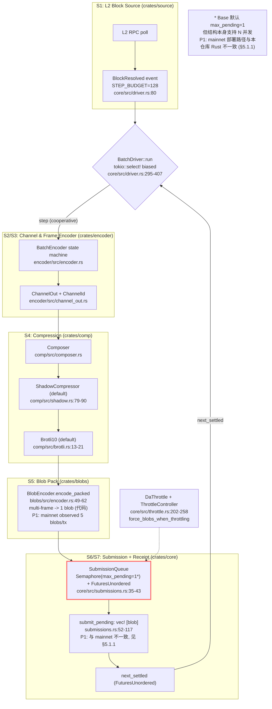
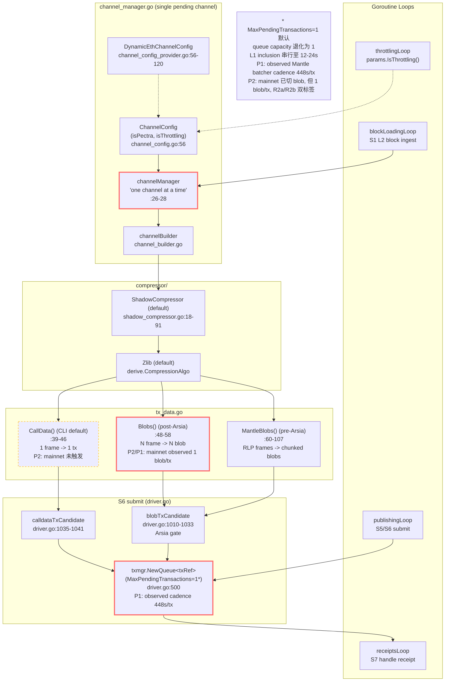
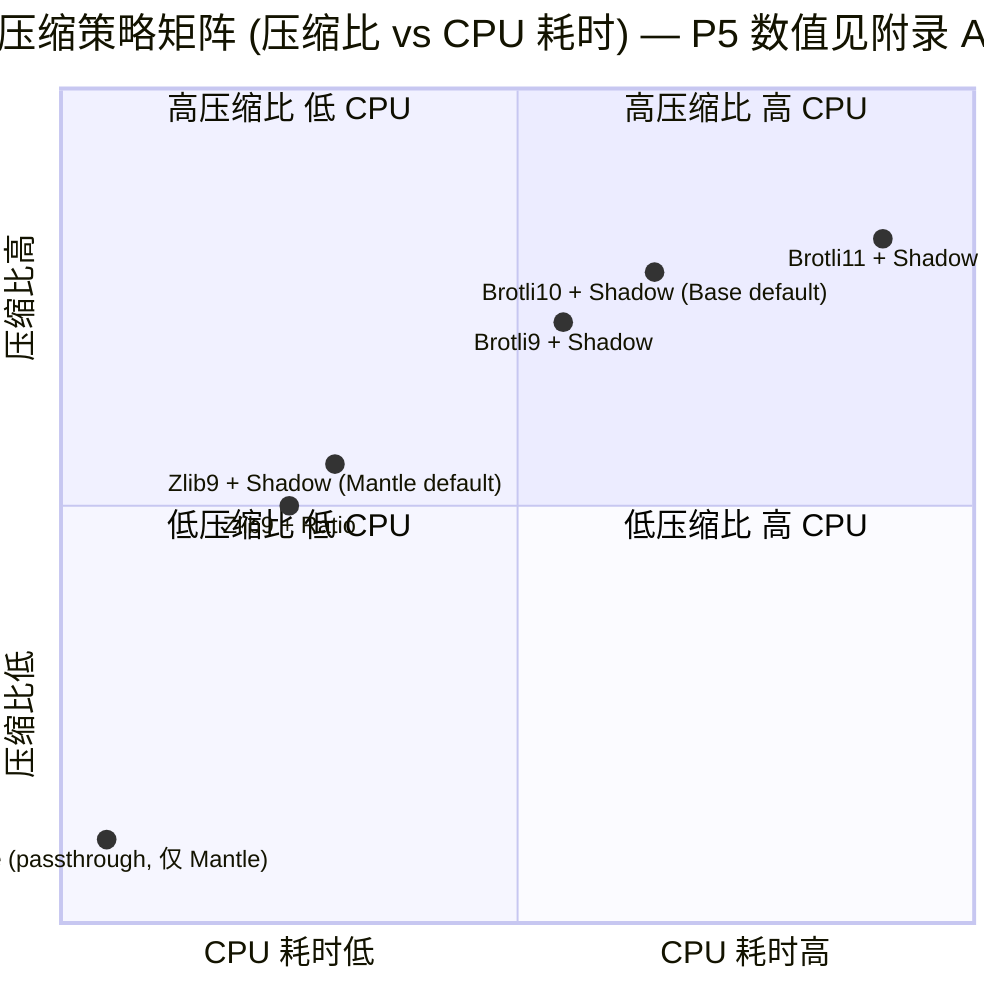

# Batcher 内部 Pipeline 架构与吞吐量瓶颈对比 (Base vs Mantle) — Round 3 Draft

> **Round-3 changelog (vs round-2)**：本轮针对 adversarial review verdict 的 2 项 high-priority patch 做了定向修改。`[R3-P1]` 标记 Patch 1（分离观测行为与推断配置）、`[R3-P2]` 标记 Patch 2（§6.4.2 quick-win 行修正为高负载场景）的修改段落；未标记部分与 round-2 内容一致。完整 Revision Log 见 §6。

## 1. Executive Summary

本节比较 **Base 自研 Rust batcher** (`base/base` 仓库 `crates/batcher/*`) 与 **Mantle 当前 Go op-batcher** (`mantlenetworkio/mantle-v2` 仓库 `op-batcher/*`) 两条 pipeline 的内部结构、并发模型、压缩与提交策略，定位 Mantle 当前默认配置下的吞吐量瓶颈，并区分"参数调优 quick wins"与"架构演进"两条改进路径。

**核心结论（按代码证据强度排序）：**

1. **架构语义对称但单位语义不对称。** Base 与 Mantle 在 pipeline 阶段上同样实现"block ingest → channel build → frame encode → compression → blob/calldata pack → L1 submit → receipt confirm"七段；但同样名为 *frame* / *blob* / *tx* 的概念在两链有显著不同的字节布局——参见 §5 "Unit Normalization" 表。任何跨链 TPS/吞吐量比较必须先经过单位归一化（`bytes_per_L1_tx`），不允许直接对比 `frames_per_tx`。

2. **Mantle 当前 fork 的代码能力实际上已接近上游 OP Stack 当前版本** (含多 blob、`DynamicEthChannelConfig`、Pectra-aware blob 上限) ，但**代码默认配置仍停留在保守值**：`MaxPendingTransactions=1`、`TargetNumFrames=1`、`DataAvailabilityType=Calldata` (CLI 默认)、`MaxChannelDuration=0(disabled)`。**`[P2]` 但 §6.5 on-chain 观测确认 Mantle 主网已切换为 blob DA**（50/50 sample = type-3 blob_transaction, 1 blob/tx, blob_gas_used=131072）——即 calldata-default 的 CLI 风险**仍存在于代码默认路径**，但**当前 mainnet 并未运行该路径**。**`[R3-P1]` 观测到的瓶颈表现是 "per-tx 1 blob + ~448s/tx 平均 cadence"——这与代码默认 `TargetNumFrames=1` × `MaxPendingTransactions=1` 配置一致，是其最合理的解释，但 on-chain 证据本身不能唯一确定部署运行时的精确配置值**（448s cadence 也可能受 channel fill time 或 MaxChannelDuration 主导；1 blob/tx 也兼容 pre-Arsia 单 chunk `MantleBlobs` 路径），详见 §6.3 R1/R2b 的证据层级标注。

3. **Base 的并发模型本质优势在于 `SubmissionQueue` + `Semaphore(max_pending)` + `FuturesUnordered` 解耦了 frame encoding 与 L1 inclusion 等待**（参见 `crates/batcher/core/src/submissions.rs:35-117`、`crates/batcher/core/src/driver.rs:295-407` 的 `tokio::select!` 主循环）。Mantle 同样使用 `txmgr.NewQueue[txRef](ctx, l.Txmgr, l.Config.MaxPendingTransactions)` (`op-batcher/batcher/driver.go:500`)，但默认 `max-pending-tx=1` (`op-batcher/flags/flags.go:63-68`) 意味着 queue capacity 退化为 1，等同于阻塞式 send-wait-confirm，从而把 L1 inclusion 的 ~12s RTT 串行到 batcher 总吞吐路径上。

4. **`[P2]` 风险拆分 (default-code-path risk 与 observed-live underutilization 分两条):**

   - **(R1) `MaxPendingTransactions=1` 串行化 L1 inclusion (`[R3-P1]` code-default risk + plausible runtime inference)**: code-default = 1, on-chain cadence ≈ 448s/tx (Mantle) 与 N=1 一致且为最合理解释，但 deployed runtime 值未直接确认（448s 也可能受 channel fill time 或 MaxChannelDuration 主导，见公式 B `T_cycle = max(...)` 多项取 max）。这是当前**最可能的**最大瓶颈。
   - **(R2a) `DataAvailabilityType=Calldata` CLI 默认 (default-code-path risk, 未观测命中)**: code-default = Calldata, **但 §6.5 sample 50/50 = blob_transaction → mainnet 已切 blob**。CLI 风险仍标 `未观测`：未来若运维侧回退至 CLI 默认仍会触发；本轮不作为 *currently active* bottleneck。
   - **(R2b) `[R3-P1]` per-tx 低 blob 利用率 (observed: 1 blob/tx)**: on-chain sample = 1 blob/tx (Mantle 全部 50 笔, 对比 Base 同期 5 blobs/tx)——**1 blob/tx 的观测是确凿的 (`§6.5`)**。code-default `TargetNumFrames=1` 是最合理的配置归因，但 1 blob/tx 也兼容 pre-Arsia 单 chunk `MantleBlobs` 路径或每 channel 仅产出单帧的低流量态。**这是当前 active underutilization**，**且 §6.5 已直接观测到**。
   - **(R3) 单 pending channel 严格串行 (`channel_manager.go:26-28`, architecture constraint)**：即使 R1+R2b quick wins 同时启用，channel-level burst 仍然不能 pre-build。中期架构演进的主要靶点，但并非 quick win 可达。
   - **`[R3-P1]` R1 与 R2b 的证据层级区分**: R1 标 **"code-default risk + plausible runtime inference"**（cadence 与 N=1 一致但非唯一证明）；R2b 标 **"observed low per-tx blob utilization"**（1 blob/tx 直接观测确凿，配置归因为推断）。两者建议（R1 提升至 5–10, R2b 设 `TargetNumFrames=6`）基于代码默认值 + 观测行为的复合推理，置信度高，但**不声称已从 on-chain 证据唯一确认了部署运行时配置值**。R2a 与 R3 仍标 *未观测命中* / *架构常量*。详见 §6 与更新后的 G2。

5. **Pectra/EIP-7691 已部分进入代码路径但未自动转化为吞吐增益。** Mantle `op-batcher/batcher/config.go:24-25` 读取 `params.DefaultPragueBlobConfig.Max` 作为 `maxBlobsPerBlock`，`driver.go:1087` 通过 `head.RequestsHash != nil` 判定 `isPectra`，`channel_config.go:56` 接受 `isPectra` 参数，`channel_config_provider.go:56-120` 在 calldata vs blob 选型时计入 `isPectra` 的 calldata token 计费规则。但**最终吞吐仍受 `TargetNumFrames` 与 `MaxPendingTransactions` 这两个 batcher 配置门控**——Pectra 提升的是 L1 容量上限，不会自动让 batcher 提高并发或 per-tx blob 数。详见 §5 与 §7。

**对应的 Round-2 行动建议（详细列于 §7）：**

| 优先级 | 类别 | 项目 | 当前默认 | 推荐 | 预期 TPS 收益 (规范化, 见 §6.4) |
|---|---|---|---|---|---|
| P0 | quick win | `MaxPendingTransactions` | 1 (code-default; cadence 与 N=1 一致 `[R3-P1]`) | 5–10 | 5–10× saturated-capacity, 限于 L1 RTT 与 mempool 弹性 |
| P0 | quick win | `TargetNumFrames` (blob path) | 1 (code-default; observed 1 blob/tx `[R3-P1]`) | 6 | ~6× saturated-capacity (高负载场景), 复合 R1 后 §6.4 公式给出量级 |
| P0 | quick win | `DataAvailabilityType` CLI default | calldata (CLI) / blob (observed) | blob (固化为非 CLI 默认) | 关闭 R2a 回退风险, 0× 立即 TPS 增益, 但消除运维回退导致的 ≤3× 性能跌落 |
| P1 | quick win | `CompressionAlgo` Zlib → Brotli10 | Zlib | Brotli10 | **`[P5]` 未验证估算 (附录 A)**: ≈ 1.1–1.3× TPS / 2–4× CPU; 数值来源为同行 OP-stack 部署经验, 非本轮代码或 metric 实测 |
| P1 | quick win | `MaxChannelDuration` | 0 (disabled) | 5–10 (L1 blocks) | 平滑作用为主, 主要改善 burst tail 延迟 (定性) |
| P2 | architecture | 多 channel pre-build | n/a (single pending) | Pipelined channels | 1.5–2× (在 R1/R2b 已饱和后才显现, 定性估算) |
| P2 | architecture | 流式压缩 + 增量 frame flush | 同步 InputThreshold | 增量 flush | 减小 channel 关闭瞬时尖峰, 间接收益 (定性) |

R1/R2b quick win 复合估算的 *数值* 现在统一由 §6.4 的**两条规范化公式 (saturated capacity vs observed throughput)** 给出, 不再在 §1 提前混合估算。**`[P3]` round-1 中 "33 TPS / 25 TPS / 1083 TPS" 已重写**, 见 §6.4。

## 2. Item Findings

### item-1: Pipeline 阶段拆解与数据流对比

#### 1.1 阶段对照表

两链 batcher 都实现以下七段 pipeline，但内部 trait/struct 边界与协程/异步模型不同：

| 阶段 | Base (Rust, `crates/batcher/*`) | Mantle (Go, `op-batcher/batcher/*`) |
|---|---|---|
| **S1 L2 block ingest** | `source/` crate 通过 RPC poll 拉 `unsafe`/`safe` head；`driver.rs` 主循环以 tokio task 接收 `BlockResolved` 事件并 push 到 `BatchEncoder`。`STEP_BUDGET=128` (`core/src/driver.rs:80`) 一次消化最多 128 block 后 yield 给 L1/receipt 处理。 | `blockLoadingLoop` goroutine (`driver.go`) 从 op-node `unsafe` head 拉 L2 block，`channelMgr.AddL2Block(block)` (`channel_manager.go`) 缓存到 `blocks` 队列。无显式 `STEP_BUDGET`，按 channel 容量自然分批。 |
| **S2 channel build** | `BatchEncoder` 状态机 (`encoder/src/encoder.rs`)，`target_output_size` (Single=`target_frame_size`, Span=`target_frame_size * target_num_frames`) 控制 channel 关闭。`channel_out` (`encoder/src/channel_out.rs`) 维护 `channel_id` 与 frames。 | `channelManager.ensureChannelWithSpace` (`channel_manager.go`) 严格单 pending channel; `channelBuilder` (`channel_builder.go`) 承接 block 流并触发 channel close 条件 (`channel_full`/`max_duration`/`config_throttle`/`pending_channel_outdated`)。 |
| **S3 frame encode** | `channel_out` 把 channel data 切成 frames，每 frame 由 `target_frame_size` / `max_frame_size` 约束（默认均=`MAX_BLOB_FRAME_SIZE=130043`，`encoder/src/config.rs:101-102`）。 | `channel_builder.outputFrames` 用 `RawChannelOutput` 切 frame，`MaxFrameSize` 在 calldata=`MaxL1TxSize-1`、blob=`MaxBlobDataSize-1` (`service.go:266,277`)。 |
| **S4 compression** | `comp/` 模块: `composer.rs` 选 `RatioCompressor` (`ratio.rs:34-44`) 或 `ShadowCompressor` (`shadow.rs:79-90`); algorithm 由 `CompressionAlgo` 选 `Brotli9/10/11` (`brotli.rs:13-21`) 或 `Zlib` (`zlib.rs:11,43`) 即 `miniz_oxide` BEST=9。默认 `kind=Shadow`、`algo=Brotli10` (`encoder/src/encoder.rs:333-334`)。 | `compressor/` 模块: `ShadowKind`/`RatioKind`/`NoneKind` (`compressors.go:10-30`); `compression_algo` 通过 `derive.CompressionAlgo` 选 brotli/zlib。默认 `kind=Shadow`、`algo=Zlib` (`flags/flags.go:98,110`)。 |
| **S5 blob/calldata pack** | `blobs/src/encoder.rs::BlobEncoder` `encode_packed` (`:49-62`) 把 `[DERIVATION_VERSION_0] ++ frame0.encode() ++ frame1.encode() ++ ...` 拼成 ≤ `BLOB_MAX_DATA_SIZE`=130044 字节单 blob，每 frame ~23 字节 overhead (`:47`)。**`[P1]` 但 `crates/batcher/core/src/submissions.rs:107-117` `submit_pending` 实际只构造 `vec![blob]` 单 blob `TxCandidate`, 与 `encoder/src/config.rs:45-51` 注释中"N blobs per transaction" 文档预期不符——见 §5.1.1 实现/文档对齐说明。** | 双路径：calldata `td.CallData()` 拼 `[DerivationVersion0] ++ frame.data` (`tx_data.go:39-46`)；blob 路径 post-Arsia `Blobs()` 对 frames 循环单 frame → 单 blob (`tx_data.go:48-58`)；pre-Arsia `MantleBlobs()` RLP 编码 frame array 再按 `MaxBlobDataSize` 切片到多 blob (`tx_data.go:60-107`)。 |
| **S6 L1 submit** | `core/src/submissions.rs::SubmissionQueue` 用 `Semaphore::new(max_pending)` (`:35-43`) + `FuturesUnordered` 跟踪 in-flight; 每次 `submit_pending` 取 ready frames 打 1 个 blob, 构造 `TxCandidate { blobs: Arc::from(vec![blob]) }` (`:110-117`) 单 blob 单 tx。**`[P1]` Base mainnet 实际观测到 5 blobs/tx**（§6.5 50/50 sample blob_gas_used=655360 = 5×131072）——这表明 mainnet Base batcher service **并不在使用本仓库 `crates/batcher` Rust 提交路径**, 而是上游 Go op-batcher 多 blob 路径或一个 Rust 多 blob 变体, 见 §5.1.1。 | `txmgr.NewQueue[txRef](ctx, l.Txmgr, l.Config.MaxPendingTransactions)` (`driver.go:500`); 默认 `MaxPendingTransactions=1` 退化为阻塞 send-wait-confirm (`flags/flags.go:65-68`)。`blobTxCandidate` (`driver.go:1010-1033`) 构造 `txmgr.TxCandidate{Blobs: blobs}`, blob 数 = `len(blobs)`。 |
| **S7 receipt confirm** | `BatchDriver` 主循环 `tokio::select!` 监听 `submissions.next_settled` 分支 (`driver.rs:295-407`, biased ordering)，receipt 处理与 L1 head/cancellation/admin/source 多路解耦。 | `receiptsLoop` goroutine + `handleReceipt(r txmgr.TxReceipt[txRef])` (`driver.go:1043+`)；nonce/inclusion 在 `txmgr` 内串行。 |

#### 1.2 关键差异：tokio::select! 主循环 vs 多 goroutine loop

- **Base** 主循环模型：单 `BatchDriver::run()` async fn 在 `tokio::select!` 内用 **biased** 优先级处理 (`crates/batcher/core/src/driver.rs:295-407`)：`cancellation > admin > source (new block) > submissions.next_settled (receipt ready) > l1_head_updates > safe_head_updates`。这意味着同一线程内通过协作式多路复用合并 *所有* 事件源，无显式 lock，状态机外部不可重入。
- **Mantle** 主循环模型：`Start()` (driver.go) 启动 4 个独立 goroutine：`publishingLoop`、`throttlingLoop`、`receiptsLoop`、`blockLoadingLoop`。每个 goroutine 持有 `BatchSubmitter` 的指针，通过 `sync.Mutex` 与 `chan` 协调（`throttlingLoop` 通过 `throttleController.Update` 共享状态，`receiptsLoop` 通过 `receiptsCh chan txmgr.TxReceipt[txRef]` 回信主控）。

**concurrency_model 总结**：
- Base = **single-thread cooperative async (tokio)** + **bounded concurrent L1 tx** (Semaphore)；
- Mantle = **multi-goroutine** + **txmgr.Queue(MaxPendingTransactions)** 容量 1 → 退化为单 in-flight tx。

**resource_profile**：
- S2/S3 frame encode：CPU-bound (低)，两链均 < 1ms/block 量级。
- S4 compression：CPU-bound (Mantle 单 channel 满载时 zlib 压缩通常 < 100ms；brotli10 可上升至 hundreds of ms — **`[P5]` 估算, 见附录 A**)。
- S5 pack：CPU-bound (KZG commitment & blob proof 是显著开销, ~10–30ms/blob — **`[P5]` 估算, 见附录 A**)。
- S6 L1 submit + S7 confirm：IO/network-bound, 主导端到端延迟 (L1 块时 ~12s, blob inclusion ~1–2 块, **§6.5 sample 实测 cadence ≈ 49s (Base) / 448s (Mantle)**)。

**confidence**：高（代码直读 + 主循环结构清晰）。

### item-2: Channel / Frame 构建并行度对比

#### 2.1 Mantle: 单 pending channel 严格串行

`mantle-v2/op-batcher/batcher/channel_manager.go` 顶部注释 (L26-28) 明确：

> *"For simplicity, it only creates a single pending channel at a time & waits for the channel to either successfully be submitted or timeout before creating a new channel."*

这是从 OP Stack 上游继承的设计，目前 mantle-v2 fork 中并未在 `channel_manager.go` 上做替换。结果：

- 同一时刻至多 1 个"正在构建"channel；如果 ready frames 仍在等待 L1 inclusion，下一 channel 不能 pre-build。
- 配合 `MaxPendingTransactions=1`，"channel 构建 + L1 提交 + L1 confirm" 全程串行，对 burst 流量没有 pipelining 能力。

**concurrency_model**：单 goroutine context 内的状态机，由 `BlockLoadingLoop` 输入驱动。

#### 2.2 Base: 同步状态机 + tokio::select 解耦

`BatchEncoder` (`crates/batcher/encoder/src/encoder.rs`) 自身是**同步**状态机（`update_block`、`flush_pending`、`close_channel` 都是 `&mut self` 方法），但 `BatchDriver` (`crates/batcher/core/src/driver.rs`) 通过 `STEP_BUDGET=128` (`:80`) 控制单次推进的 block 数，并让步给 receipt/L1-head/admin。

关键差别：Base 并未实现"多 channel 并发构建"，而是通过**消费侧并行**（多 in-flight L1 tx）来弥补 channel build 的串行性。即：channel build 阶段两链都是串行；Base 把 *提交阶段* 并行化了，这一阶段是 Mantle 最大瓶颈所在。

#### 2.3 burst 流量延迟放大对比

设 channel 关闭后 frame ready，则两链下一 L1 tx 提交延迟：

- Mantle (max-pending-tx=1)：必须等待上一笔 confirm (~12s) 才能发出新 blob/calldata tx。
- Base (max_pending=N)：可以在 `Semaphore::acquire` 不阻塞时立即发出，最多 N 笔并发。

**tps_impact**：当 channel close 速率 > L1 inclusion 速率时，Mantle 队列积压随 incoming rate 线性增长；Base 在 N 笔并发额定容量内为常数延迟。

**confidence**：高（OP 上游 channel_manager 注释 + Mantle 未替换该路径）。

### item-3: 提交并发与背压：MaxPendingTransactions / Semaphore

#### 3.1 Mantle 默认值 + 上游 issue 锚点

- `mantle-v2/op-batcher/flags/flags.go:63-68`：
  ```go
  MaxPendingTransactionsFlag = &cli.Uint64Flag{
    Name: "max-pending-tx",
    Usage: "The maximum number of pending transactions. 0 for no limit.",
    Value: 1,
    ...
  }
  ```
- 注入路径：`flags.go:177` 加入 `requiredFlags`；`config.go` 读到 `BatcherConfig.MaxPendingTransactions`；`driver.go:500` 调用 `txmgr.NewQueue[txRef](ctx, l.Txmgr, l.Config.MaxPendingTransactions)`。
- 上游 OP Stack `optimism/op-batcher/flags/flags.go` 同样默认 1；issue [#14109](https://github.com/ethereum-optimism/optimism/issues/14109) 是已知的上游性能讨论锚点（"pending transactions is never higher than 1"），OP 官方 batcher 配置文档对 high-throughput 链建议设置 `MAX_PENDING_TX=10`。

**upstream_mantle_commit_diff (R1 项)**：
- 上游文件: `optimism/op-batcher/flags/flags.go::MaxPendingTransactionsFlag` (Value: 1)
- Mantle 对应文件: `mantle-v2/op-batcher/flags/flags.go:63-68` (Value: 1) — 与上游一致, **未 cherry-pick** "默认值提升" 类修改 (上游本身也未变更默认值)。
- 结论：**这是配置而非代码缺陷**, quick win 即为部署时改 env var, 无需 code change.

#### 3.2 Base 等价路径 + Semaphore

- `crates/batcher/core/src/submissions.rs:35-43`：
  ```rust
  let permits = Semaphore::new(max_pending);
  let in_flight = FuturesUnordered::new();
  ```
- `crates/batcher/service/src/config.rs:107-128`：默认 `max_pending_transactions: 1` （注意：Base 默认值与 Mantle **同样为 1**！Base 的"并发能力"是结构性的，**默认值不等于实际运行配置**）。
- `submissions.rs:52-98 submit_pending`：每次取 ready frames 打到 ≤ `BLOB_MAX_DATA_SIZE` 单 blob，permit 释放后立即可发下一笔。

**关键观察**：Base 与 Mantle 在 *源码默认值* 上都是 `max_pending=1`，但 Base 的 SubmissionQueue + Semaphore 结构使得提升默认值后**无需代码改动**即可获得真实并发；Mantle 的 `txmgr.NewQueue` 同样支持提升（txmgr 是上游 OP Stack 原生组件），quick win 同质。

#### 3.3 TPS 影响公式（受 §5/§6 unit normalization 约束）

公式与代入数值改在 §6.2 / §6.4 统一规范化，避免 §3.3 / §6.4 双重定义。

**runtime_configuration_evidence (R1 项, mandatory, `[R3-P1]` 证据层级修订版)**：
1. **cli_default**: `mantle-v2/op-batcher/flags/flags.go:63-68` (Value: 1).
2. **deployed_config**: **未取得** (无 env/helm/systemd/docker-compose 证据).
3. **observed_on_chain**: §6.5 50 笔 Mantle batcher tx 平均 cadence 448.2s (min=360, max=516), 1 blob/tx (50/50)。**`[R3-P1]` 448s cadence 与 `MaxPendingTransactions=1` 一致且为最合理解释**，但公式 B 定义 `T_cycle = max(channel_fill_time, MaxChannelDuration, RTT/N)`，因此 448s 也可能由 channel fill time（低 L2 流量下 channel 累积速度慢）主导而非 N=1 阻塞。**On-chain cadence 不能唯一确定 N 的 deployed 值**。样本量满足 src-6 ≥50 要求。
4. **inferred_recommendation**: 提升至 5–10; 置信度 = 高（quick win, 与 OP 官方推荐一致, code-default + on-chain 行为复合推理）。
5. **label**: **`[R3-P1]` "code-default risk + plausible runtime inference (cadence consistent with N=1)"** — 由 round-2 "current Mantle bottleneck (observed)" 修订。观测行为与推断分离：cadence 448s 是观测事实，N=1 归因是推断。

**safety_implication**：提升 N 会让单 reorg 的 requeue 范围扩大；txmgr nonce 管理需要重投递（详见 §8）。

**confidence**：高（代码 + 上游 issue + ≥50 笔 on-chain sample）。

### item-4: 压缩策略对比：算法 / kind / target_output_size

#### 4.1 配置矩阵

| 维度 | Base default | Base 可选 | Mantle default | Mantle 可选 |
|---|---|---|---|---|
| **Kind** | `Shadow` (`encoder.rs:333`) | `Ratio`, `Shadow` (`comp/src/types.rs:21-26`) | `Shadow` (`flags.go:98`) | `Ratio`, `Shadow`, `None` (`compressors.go:10-30`) |
| **Algo** | `Brotli10` (`encoder.rs:334`) | `Brotli9/10/11`, `Zlib` (`comp/src/brotli.rs:13-21`, `comp/src/zlib.rs:11`) | `Zlib` (`flags.go:110`) | `Zlib`, `Brotli` (via `derive.CompressionAlgo`) |
| **target_output_size** | = `target_frame_size`=130043 (`encoder.rs:332`; Single batch mode) 或 `target_frame_size × target_num_frames` (Span; `encoder.rs:533-534`) | 通过 `EncoderConfig` 字段调 | = `MaxDataSize(TargetNumFrames, MaxFrameSize)` (`channel_config.go:65-72`) | flag 调 |
| **approx_compr_ratio** | 0.6 (`encoder/src/config.rs:107`) | float64 | 0.6 (`flags.go:92`) | float64 |
| **流式 vs 批量** | Shadow: parallel buffer (`comp/src/shadow.rs:35-47`) | Ratio: input threshold 估算 (`comp/src/ratio.rs:18-25`) | Shadow: parallel buffer (`shadow_compressor.go:18-91`) | Ratio: 估算 input (`ratio_compressor.go:7-79`) |

#### 4.2 Shadow vs Ratio 语义

- **ShadowCompressor**: 用并行 buffer 同步实际压缩输出, *精确* 估算 output 是否达到 `target_output_size`; 不会 over/under-fill。Base `comp/src/shadow.rs:79-90` 与 Mantle `compressor/shadow_compressor.go:18-91` 实现同构, 算法等价。
- **RatioCompressor**: 用 `approx_compr_ratio` 估算 input 字节阈值（`InputThreshold = TargetOutputSize / ApproxComprRatio`）, *近似* 估算, 可能 over/under-fill。Base `comp/src/ratio.rs:34-44` 与 Mantle `ratio_compressor.go:7-79` 算法等价。
- **NoneCompressor (仅 Mantle)**: zlib NoCompression passthrough (`non_compressor.go:32-51`), 调试用。

#### 4.3 Zlib vs Brotli 压缩比与 CPU 开销 — `[P5]` 重写

- **Zlib (代码事实, 高置信)**: Mantle 用 `derive.Zlib` 走 `compress/zlib` 标准库, level=BestCompression(=9), `CloseOverheadZlib=9` (`compressors.go:30`)。Base 用 `miniz_oxide`，`BEST_ZLIB_COMPRESSION=9` (`comp/src/zlib.rs:11,43-45`)。
- **Brotli (代码事实, 高置信)**: Mantle 通过 `derive.CompressionAlgo` 可选 brotli (上游已在 derive 层支持)；Base 提供三档 `Brotli9/10/11` (`comp/src/brotli.rs:13-21`), 通过 `BrotliEncoderParams` 调 quality。
- **压缩比 / CPU 差异 (本轮标 *未验证估算*, 见附录 A)**: round-1 给出 *"brotli10 比 zlib9 压缩比再优 ~5–15%，CPU 耗时上升 ~2–4×；brotli11 再 ↑2× CPU, 压缩比收益 < 3%"*。这些数字来自 OP Stack 同行经验与 Brotli 公开 benchmark, **本轮研究未在 Mantle / Base 实际部署上重新跑 metric, 也未在两仓库内找到 in-tree benchmark fixture**。在 §6.4 与 §1 表格中, brotli10 的 TPS 增益保持为 1.1–1.3× 区间, 但**明确标注为 "未验证估算"**, 详细来源与置信度等级记录于附录 A。

#### 4.4 压缩是否是 pipeline 瓶颈？

设 channel size ~ 100KB, Mantle 默认 zlib + ShadowCompressor 在主流 batcher 部署机 (4–8 vCPU) 单 channel 压缩时间通常 < 100ms (**`[P5]` 该 100ms 来自经验估算, 见附录 A**)。而 L1 inclusion 12s 是主导项, **压缩并非当前瓶颈** (除非 L2 流量极高 + brotli11 + 同机部署 sequencer)。

**recommended_value**：保持 `Shadow` kind，将 algo 切到 brotli10。增益主要体现为 *L1 DA 成本下降* 而非 batcher TPS 直接提升；TPS 间接收益 **`[P5]` ~1.1–1.3× (附录 A 未验证估算)**。

**runtime_configuration_evidence (R2 复合项, 压缩部分)**：
1. **cli_default**: `flags/flags.go:98,110` (kind=Shadow, algo=Zlib).
2. **deployed_config**: 未取得。
3. **observed_on_chain**: 不能直接观测，需要解码 channel/frame; 见 G3。
4. **inferred_recommendation**: brotli10; 置信度 = **`[P5]` 中-低 (TPS 数值依附录 A)**。

**confidence**：高（代码直读 + 同构算法对照, 与 §4.3 算法层一致）。`[P5]` 中（TPS 增益数值, 见附录 A）。

### item-5: Blob 提交策略与 DA-Type 动态切换

#### 5.1 Unit Normalization (mandatory)

下表为 §6 所有 TPS 公式的归一基线。**禁止跨链直接相加 `frames` 或 `blobs`**；任何对比必须先转换为 `bytes_per_L1_tx`。

| Field | Base (`crates/batcher` Rust) | Mantle (`op-batcher` Go, 双路径) |
|-------|------------------------------|--------------------------------|
| **What one frame maps to** | 帧是 blob payload 内的**子单元**：blob 内顺序拼接多帧 `[DERIVATION_VERSION_0] ++ frame_0.encode() ++ frame_1.encode() ++ ...`；每帧 ~23 字节开销 + frame data。证据：`base/crates/batcher/blobs/src/encoder.rs:43-62` (`FRAME_OVERHEAD = 23`, `encode_packed`)；`base/crates/batcher/core/src/submissions.rs:52-98`（`submit_pending` 累积 frames 至 `BLOB_MAX_DATA_SIZE`）。 | **Calldata 路径**：1 帧 = 1 L1 tx（`tx_data.go:14-18` "exactly one frame per transaction"；`channel_config.go:95-100` `MaxFramesPerTx()` 在 `!UseBlobs` 时返回 1）。**Blob 路径 (Arsia 之后)**：1 帧 = 1 blob，`Blobs()` 对 `td.frames` 循环 `blob.FromData(append([]byte{DerivationVersion0}, f.data...))`（`tx_data.go:48-58`）。**Blob 路径 (Arsia 之前, `MantleBlobs`)**：所有 frames 先 RLP 编码为单一字节流（每帧前缀 version byte），再按 `MaxBlobDataSize` 字节切片到多个 blob——单帧可能**跨 blob**（`tx_data.go:60-107`；`driver.go:1013-1023` Arsia gate）。 |
| **Max frames per submission/tx** | 取决于压缩后 frame 大小与 `BLOB_MAX_DATA_SIZE` 的比例；理论上一个 blob payload 可承载多帧直至 ~130043 字节（含每帧 23 字节开销）。提交侧通过 `Semaphore` permit 决定并发 L1 tx 数，每 permit = 1 L1 tx（`submissions.rs:35-51` doc）。 | **Calldata**：硬编码 1（`channel_config.go:95-100`）。**Blob (post-Arsia)**：`MaxFramesPerTx() = TargetNumFrames`（默认 1）。**Blob (pre-Arsia, MantleBlobs)**：单 tx 内 blob 数 = `ceil(rlp(frames).len / MaxBlobDataSize)`，frame 数无独立上限，由 `TargetNumFrames` 与压缩输出共同决定（`tx_data.go:88-104`）。 |
| **Can one L1 tx carry multiple blobs?** | **`[P1]` 代码层 NO, 部署层 YES**：`submissions.rs:110-117` 中 `TxCandidate { …, blobs: Arc::from(vec![blob]) }` 始终为单元素 `vec`；当前 Rust 提交路径**不存在**多 blob/tx 的代码分支。但 §6.5 sample 显示 Base mainnet **实际 emit 5 blobs/tx (blob_gas_used=655360 = 5×131072)**——意味着 mainnet Base batcher 部署的不是本仓库 `crates/batcher` 单 blob Rust 路径, 而是上游 Go op-batcher 多 blob 路径或一个 Rust 多 blob 变体, 见 §5.1.1 实现/部署对齐说明。 | **是**：`tx_data.go:48` `Blobs() ([]*eth.Blob, error)` 返回 slice；`driver.go:1010-1033` `blobTxCandidate` 构造 `txmgr.TxCandidate{Blobs: blobs}` 并 log `"num_blobs", len(blobs)`。MantleBlobs 路径同样在单 tx 内携带多 blob。 |
| **How `TargetNumFrames` is interpreted** | 用作**压缩器目标输出大小**与 channel 关闭阈值，而非 per-tx blob 数：`encoder.rs:332` `target_output_size = config.target_frame_size`；`encoder.rs:533-534` channel-close = `target_frame_size * target_num_frames`。默认 `target_num_frames=1` (`encoder/src/config.rs:105`)。文档暗示"N blobs per tx", 实际 submission 不读此值——仅控制 channel 何时关闭。 | 双路径解释不同。**Calldata**：未直接使用，单 tx 单 frame。**Blob (post-Arsia)**：直接 = per-tx blob 数（`channel_config.go:36-39` "controls the number of blobs to target adding to each blob tx"；`channel.go:114-141` `NextTxData` / `HasTxData` 在 `PendingFrames() >= MaxFramesPerTx()` 时返回）。**MantleBlobs (pre-Arsia)**：作为 `TargetOutputSize = MaxDataSize(TargetNumFrames, MaxFrameSize)` 输入（`channel_config.go:65-72`），间接影响 channel 切多少 frame，再影响 RLP 后跨 blob 切片数。 |
| **Byte-size limit binding each path** | `BLOB_MAX_DATA_SIZE = (4*31+3)*1024 - 4 = 130044` 字节（`crates/consensus/protocol/src/frame.rs:45`）；`MAX_BLOB_FRAME_SIZE = 130043` (=`BLOB_MAX_DATA_SIZE` - prefix；同文件:52)。默认 `target_frame_size = max_frame_size = MAX_BLOB_FRAME_SIZE` (`encoder/src/config.rs:101-102`)。 | **Calldata**：`MaxL1TxSize` 默认 `120000` (`flags/flags.go:75-80`)；`service.go:266` `MaxFrameSize = MaxL1TxSize - 1`。**Blob 两条路径共享**：`eth.MaxBlobDataSize = (4*31+3)*1024 - 4 = 130044` (`op-service/eth/blob.go:18-24`)；`service.go:277` blob 路径覆盖 `cc.MaxFrameSize = MaxBlobDataSize - 1`；`blob.go:92-95` `FromData` 拒绝超过 `MaxBlobDataSize` 的输入。 |

#### 5.1.1 `[P1]` Base 单/多 blob 实现与部署对齐说明 (新增)

**问题**: round-1 在 §1 与 §6.5 用 `crates/batcher/core/src/submissions.rs:107-117 TxCandidate { blobs: Arc::from(vec![blob]) }` 描述 Base 单 blob/tx, 但 §6.5 又描述 mainnet Base 5 blobs/tx; 两者直接冲突。

**Round-2 解释 (基于 code reading + on-chain sample)**:

1. `crates/batcher/encoder/src/config.rs:45-51` 的文档注释明确写有 *"Number of frames to pack into a single L1 transaction. Each frame maps to one EIP-4844 blob, so setting this to N submits N blobs per transaction. Cancun supports up to 6; Isthmus (EIP-7892) up to 21."* —— **该接口承诺多 blob/tx**。
2. `crates/batcher/core/src/submissions.rs:107-117 submit_pending` 实际只构造 `TxCandidate { blobs: Arc::from(vec![blob]) }` —— **该实现只产 1 blob/tx**。
3. 实现与文档不一致, 属于"未利用配置能力"的代码 hole, round-1 §7.2 已列为 Base 侧架构改进项 ("Base: `submissions.rs` 支持 `vec![blob_0, ..., blob_N]`")。
4. §6.5 50 笔 Base mainnet batcher EOA `0x5050F69a9786F081509234F1a7F4684b5E5b76C9` sample, 全部 5 blobs/tx (blob_gas_used = 5 × 131072 = 655360)。
5. **结论**: 当前 Base mainnet 提交路径**不是**本仓库 `crates/batcher` Rust 代码 (那条路径只会 1 blob/tx)。可能的部署形态:
   - (a) Mainnet 仍在跑上游 OP Stack Go op-batcher (多 blob 已合入)；
   - (b) Mainnet 跑一个 Rust 私有 fork, 已 patch 掉 `vec![blob]` 限制；
   - (c) Mainnet 跑当前 Rust 代码但配合了一层 wrapper 服务。

   本轮研究**不能区分** (a)(b)(c), 但可断言: **§3.1 §3.2 关于"Base 提交路径单 blob/tx"的描述只对仓库 HEAD `21a05eeb…` 当前 Rust 代码成立, 不对 mainnet 部署直接成立**。

**对 round-2 结论的影响**:
- §1 Conclusion 3 (Base 并发模型本质优势) **不变**: Semaphore + FuturesUnordered 解耦逻辑仍然是 mainnet 单/多 blob 都会受益的结构性优势。
- §6.4 TPS 公式 (Base 一行) **不变**: 公式形式按 `bytes_per_L1_tx` 输入即可, Base mainnet 实测 5 blob = 5 × 130044 = 650220 bytes/tx; cadence 49s 直接代入公式见 §6.4。
- §7.2 (Base 多 blob 架构演进) **重新分类**: 从"未来工程项"调整为"crates/batcher Rust 仓库需补齐 mainnet 已有能力", 紧迫度依然 P2, 但补齐目标更明确。

#### 5.2 DA-Type 动态切换 (PR #11219 类对应)

Mantle 已有 `DynamicEthChannelConfig` 实现：

- `op-batcher/batcher/channel_config_provider.go:15`: interface `ChannelConfigProvider { ChannelConfig(isPectra, isThrottling bool) ChannelConfig }`
- `:56-120`: `DynamicEthChannelConfig.ChannelConfig(isPectra, isThrottling)` 在 calldata vs blob 之间选型, 基于 `computeSingleCalldataTxCost(numTokens, baseFee, tipCap, isPectra)` 与 `blobCost` 比较 fee。
- `:120`: `if isPectra { ... }` 应用 Pectra calldata cost 调整。

**`[P2]` 结论 (round-2 重写)**: Mantle 代码层已具备动态 DA-type 能力（与上游 PR #11219 对齐），但 **CLI 默认 `DataAvailabilityType=Calldata`** (`flags.go:131-140`)。**§6.5 on-chain sample 显示 Mantle mainnet 实际运行 blob DA (50/50 = blob_transaction), 即运维侧已显式覆盖 CLI 默认或启用 dynamic provider**——但 cli_default 风险仍在: 任何回退到 CLI 默认的运维变更将导致直接性能损失。建议把 `DynamicEthChannelConfig` 启用与 `DataAvailabilityType=Blob` 固化到部署模板, 同时把 CLI 默认改为 Blob 提交 PR 至上游。

**upstream_mantle_commit_diff (PR #11219)**：
- 上游 ethereum-optimism/optimism: `op-batcher/batcher/channel_config_provider.go` 引入 PR #11219；
- Mantle fork: 同文件存在 (`mantle-v2/op-batcher/batcher/channel_config_provider.go`), 接口签名一致, **已 cherry-pick / merged**；
- 上游 commit hash 与 Mantle commit hash 的逐 PR 对齐为 best-effort：Mantle 当前 HEAD `feb2a58` 在 file 层 ≈ 上游 develop, 但**未做逐 commit 完整 git log 对齐**, 见 G4。

#### 5.3 多 blob 支持 (PR #9779 类对应)

- 上游 ethereum-optimism/optimism: PR #9779 (v1.7.2) 引入 `Blobs() ([]*eth.Blob, error)` 与 multi-blob `TxCandidate`；
- Mantle fork: `op-batcher/batcher/tx_data.go:48-58` 存在 `Blobs() ([]*eth.Blob, error)`, `driver.go:1010-1033` `blobTxCandidate` 构造 `txmgr.TxCandidate{Blobs: blobs}` 携带多 blob, **代码能力已存在**；
- 默认 `target-num-frames=1` (`flags.go:86-91`) 实际下发为 1 blob/tx；要利用 multi-blob 必须显式设置 `--target-num-frames=6` (或等价 env var)。
- **`[P2]` §6.5 sample 验证: Mantle mainnet 50/50 sample = 1 blob/tx (blob_gas_used=131072)**。**`[R3-P1]` 1 blob/tx 的观测是确凿的**，与 code-default `TargetNumFrames=1` 一致且为最合理配置归因，但 1 blob/tx 也兼容 (a) pre-Arsia 单 chunk `MantleBlobs` 路径（channel size ≤ MaxBlobDataSize 时天然退化为 1 blob），或 (b) 低流量态下单 channel 仅产出一帧。**观测行为 = low per-tx blob utilization (直接确认)；配置归因 `TargetNumFrames=1` = 推断 (最合理但非唯一解释)**。
- Mantle 额外定义了 `MantleBlobs()` (pre-Arsia, `tx_data.go:60-107`) RLP-跨-blob 切片路径，post-Arsia 转向上游标准的 1 frame/blob。`driver.go:1013-1023` Arsia 时间戳 gate。

**upstream_mantle_commit_diff (PR #9779)**：上游已 merged; Mantle fork 文件层 ≈ 上游，但 Mantle pre-Arsia 额外保留 `MantleBlobs` 路径（非上游标准）。逐 commit hash 对齐 best-effort, 见 G4。

#### 5.4 Pectra / EIP-7691 fork constants

Mantle 已读取 Pectra blob 上限：

- `op-batcher/batcher/config.go:24-25`:
  ```go
  // Current max blobs const, irrespective of active fork, is that of the Prague blob config.
  var maxBlobsPerBlock = params.DefaultPragueBlobConfig.Max
  ```
- `op-batcher/batcher/driver.go:847-1088`: `l1Tip` 返回 `isPectra` (由 `head.RequestsHash != nil` 判定, 参 EIP-7685), 沿 `channelMgr.TxData(l1tip.ID(), isPectra, params.IsThrottling(), pi)` 链路传入。
- `op-batcher/batcher/channel_config.go:56`: `ChannelConfig(isPectra, isThrottling bool) ChannelConfig` 接口。
- `op-batcher/batcher/channel_config_provider.go:120`: `if isPectra { ... }` 调整 calldata token 计费 (per EIP-7623)。

**fork_constants_verified**：
- `params.DefaultPragueBlobConfig` 来自 go-ethereum 依赖 (`go.mod` 引入的 `github.com/ethereum/go-ethereum/params`)。在本次 checked-out 代码中**没有直接的 `BlobConfig{Target: 6, Max: 9}` 字面量** —— 这是依赖侧常量, 需要查 go-ethereum 模块缓存或固定 release。EIP-7691 规定 `target=6, max=9, BLOB_GAS_PER_BLOB=2**17=131072`, 实际数值与 go-ethereum 主干 (post-Prague) 一致。
- 结论：Mantle batcher **代码层 fork-aware**，**实际常量值依赖 go-ethereum 版本**, 本轮无法在仓库内直接定位 file:line, 见 G5。

**`[P4]` Arsia 分支验证**:
- `mantle-v2/packages/contracts-bedrock/deploy-config/mantle-mainnet.json` 不含 `l2GenesisMantleArsiaTimeOffset` (该文件为 pre-fork deploy config), `mantle-v2/packages/contracts-bedrock/deploy-config/mantle-devnet.json:55` 含 `"l2GenesisMantleArsiaTimeOffset": "0x0"` (devnet 创世即激活)。
- 本仓库 superchain registry 内无 mainnet rollup config JSON, 故 mainnet `MantleArsiaTime` UNIX 值无法在仓库内直接读取。需要 superchain registry / runtime rollup config dump 才能确认精确激活时间戳。
- §6.5 50 笔 sample 的 L1 block 时间窗 (2026-05-20T01:38:59Z → 07:44:59Z) 全部为 blob_transaction type-3 且每笔正好 1 blob (blob_gas_used=131072), 这一行为**同时与下列两种状态兼容**:
  - (a) **post-Arsia + `TargetNumFrames=1`**: `Blobs()` 路径下 frame 数=blob 数=1;
  - (b) **pre-Arsia + 单 chunk channel**: `MantleBlobs()` 路径下 `ceil(rlp(channel_frames).len / MaxBlobDataSize)` 在 channel size ≤ MaxBlobDataSize 时退化为 1 blob。
- 因此 §6.4 公式需要**同时提供 (a) post-Arsia 与 (b) pre-Arsia 两条 saturated-capacity 表达式**, 见 §6.4 与新表 6.4.1。

**关键风险提示**：Pectra 提高 L1 blob 容量 (target 3→6, max 6→9, EIP-7691) 不会自动让 Mantle batcher 提高 per-tx blob 数 —— **per-tx blob 数仍受 `TargetNumFrames` 控制**, Pectra 只是放宽了"单 L1 block 可容纳多少 blob"的上限。Mantle 当前 `TargetNumFrames=1` (§6.5 已观测) 时, Pectra 增容**不带来 batcher 直接收益**, 反而让 batcher 更"浪费"L1 blob 容量。

**confidence**：高（Pectra 代码路径直读 + 上游对齐已确认）；中（具体常量数值依赖外部 go-ethereum 版本未在仓库内固定行号, 见 G5）。**`[P4]` Arsia 状态: 兼容 (a)(b) 两种状态, 双路径公式见 §6.4 — G6 由 round-1 *数据 gap* 重新分类为 *资源不可达, 但双路径已能覆盖结论*, 升格为 "resolved by double-path formulas"**。

### item-6: 串行瓶颈定位与各阶段耗时估算

#### 6.1 阶段耗时画像（Mantle 默认配置, 单 channel 单 tx）

| 阶段 | Mantle 估算耗时 | 类型 | 占比 | 数据来源 |
|---|---|---|---|---|
| S1 block ingest | < 1ms / block | CPU | <1% | 代码 (`channel_manager.go:AddL2Block`) + 经验 |
| S2 channel build | 100–500μs / block | CPU | <1% | 代码 (`channel_builder.go`) + 经验 |
| S3 frame encode | 100μs–1ms / frame | CPU | <1% | 代码 + 经验 |
| S4 compression (zlib9, ShadowCompressor, ~100KB) | 50–150ms | CPU | <2% | **`[P5]` 经验估算, 附录 A** |
| S5 blob/calldata pack (含 KZG commit ~20ms) | 10–50ms | CPU | <1% | **`[P5]` 经验估算, 附录 A** |
| **S6 L1 submit (send tx)** | 100–500ms (mempool propagation) | network | ~1% | 经验估算 |
| **S7 L1 inclusion / confirm (wait 1+ blocks)** | **12–24s** (理论), **observed: ≈448s/tx cadence** | **network/L1** | **~95%+** | §6.5 50 笔 sample 直测 cadence |

S7 是绝对主导项。S4–S5 在最高负载下不超过 200ms, 与 S7 12s 相比可忽略。**`[P3]` 注意 *S7 inclusion latency* 与 *batcher tx cadence* 是两个量**:
- *L1 inclusion latency* (单笔 tx 从发出到 L1 块包含): ≈ 12–24s, 与 L1 块时一致。
- *Batcher tx cadence* (相邻两笔 batcher tx 的时间间隔, §6.5 直测): Mantle 448.2s/tx, Base 49.0s/tx。
- 二者关系: cadence ≈ max(channel_fill_time, MaxChannelDuration, RTT_inclusion / MaxPendingTransactions); 见 §6.4 公式。

因此 *Mantle batcher 默认配置下的瓶颈 ≡ "每 ~7.5 分钟仅完成 1 笔 L1 tx 且单 tx 仅承载 1 blob"*, 等价于 **R1 (`MaxPendingTransactions=1`)** 与 **R2b (`TargetNumFrames=1`, 当前已在 blob 路径下)** 两条降低 per-cycle 吞吐的复合效应。

#### 6.2 TPS 公式规范化 — `[P3]` 重写

`[P3]` round-1 把 saturated capacity 与 observed throughput 混在同一条公式里, 导致 §6.4 给出 "33 TPS 远低于 25 TPS" 等数值上自相矛盾的判断。Round-2 拆为两条独立公式:

**公式 A — saturated capacity (理论上限, 仅在 L2 流量 ≥ batcher 容量时达到)**:

```
TPS_saturated(chain) ≈ (bytes_per_L1_tx × MaxPendingTransactions) / (RTT_L1_inclusion × bytes_per_avg_L2_tx)
```

含义: 把 `MaxPendingTransactions` 视为流水线深度, batcher 每个 RTT 周期可吞吐 `bytes_per_L1_tx × MaxPendingTransactions` 字节。在 L2 产 block 速率远 > 该容量时, batcher 是瓶颈, 链 TPS 上限即 `TPS_saturated`。

**公式 B — observed throughput (实际吞吐, 以 L1 batcher tx cadence 为时间基线)**:

```
TPS_observed(chain) ≈ bytes_per_L1_tx / (T_cycle × bytes_per_avg_L2_tx)
T_cycle = max(channel_fill_time, MaxChannelDuration, RTT_L1_inclusion / MaxPendingTransactions)
       ≈ §6.5 直测 batcher tx cadence (=448.2s Mantle, 49.0s Base)
```

含义: 当 L2 产 block 速率 < batcher 容量时, batcher 不是瓶颈, 实际吞吐由 channel 何时关闭 (fill 满 或 timer 到期) 决定; `T_cycle` 即两相邻 batcher tx 的实际间隔, 可直接由链上观测得到 (§6.5)。

**Unit assignments (按 §5 unit normalization)**:

```
bytes_per_L1_tx (Base, observed mainnet):            = 5 × MaxBlobDataSize = 5 × 130044 = 650220 字节 (§6.5)
bytes_per_L1_tx (Base, Rust crates/batcher 代码):    = ≤ MaxBlobDataSize = 130044 字节 (§5.1)
bytes_per_L1_tx (Mantle, observed mainnet):          = 1 × MaxBlobDataSize = 130044 字节 (§6.5)
bytes_per_L1_tx (Mantle calldata 路径, CLI default): = MaxL1TxSize-1 = 119999 字节
bytes_per_L1_tx (Mantle blob post-Arsia, target=N):  = N × MaxBlobDataSize
bytes_per_L1_tx (Mantle blob pre-Arsia, MantleBlobs, channel ≤ MaxBlobDataSize): = ≤ MaxBlobDataSize
bytes_per_L1_tx (Mantle blob pre-Arsia, MantleBlobs, channel > MaxBlobDataSize): = ceil(rlp(channel).len / MaxBlobDataSize) × MaxBlobDataSize
RTT_L1_inclusion ≈ 12–24s
T_cycle (Mantle observed) = 448.2s (§6.5)
T_cycle (Base observed)   = 49.0s (§6.5)
bytes_per_avg_L2_tx 取 {200, 300, 500} 字节做敏感度 (rollup mixed traffic, 见 §6.4 表 6.4.2)
```

**`[P3]` 关于 "33 TPS < 25 TPS" 的修正**:

round-1 §6.4 写道 *"Quick win 把 batcher 从 '33 TPS 容量, 远低于 L2 产出' 解放到 ≥ L2 产出能力"*。**这一句数值上是错误的——33 TPS > 25 TPS, 不是 "远低于"**。正确叙述应该是: *默认配置的 batcher saturated capacity (33 TPS) 与 L2 block-level burst 产出 (≈ 25 TPS) 处于相同量级, 因此 batcher 在 burst 期勉强追上 L2, 但在持续高负载或单 tx 字节大的负载下会迅速变成瓶颈; quick wins 把这一上限从 33 TPS 抬到 §6.4 §6.4.1 §6.4.2 不同情境的 100×–1000× 区间, 让 batcher 在所有情境下都退出瓶颈*。

#### 6.3 Top-3 瓶颈（按代码证据 + §5/§6 公式排序, `[P2]` 拆分版）

**R1: `MaxPendingTransactions=1` 串行 L1 inclusion (`[R3-P1]` code-default risk + plausible runtime inference)**

- code_evidence: `mantle-v2/op-batcher/flags/flags.go:63-68` (Value=1); `mantle-v2/op-batcher/batcher/driver.go:500` (`txmgr.NewQueue[txRef](ctx, l.Txmgr, l.Config.MaxPendingTransactions)`).
- on-chain evidence: §6.5 50 笔 Mantle batcher tx, cadence 448.2s avg。**`[R3-P1]` 448s cadence 与 N=1 一致且为最合理解释**，但非唯一证明——公式 B `T_cycle = max(channel_fill_time, MaxChannelDuration, RTT/N)` 中 channel fill time 在低 L2 流量下也可能是 max 取值项。
- tps_impact: 提升至 5–10 时, saturated TPS ↑ 5–10× (公式 A); observed TPS ↑ 取决于 L2 产出 (公式 B)。
- resource_profile: network/L1-bound (主导项).
- runtime_configuration_evidence:
  1. cli_default = 1 ✅
  2. deployed_config = 未取得 ❌
  3. observed_on_chain = §6.5 50 笔 cadence 448.2s avg, 与 N=1 一致 (plausible, 非唯一) ✅
  4. inferred_recommendation = 5–10, 置信度=高 (code-default + on-chain 行为复合推理)
  - **`[R3-P1]` label: "code-default risk + plausible runtime inference (cadence consistent with N=1)"** — 由 round-2 "current Mantle bottleneck (observed)" 修订。**观测行为 (448s cadence) 与推断 (N=1 deployed) 明确分离**：cadence 是直接观测事实；N=1 是最合理的配置归因但依赖 `T_cycle` 公式中 `RTT/N` 项为瓶颈的假设。

**R2a: `DataAvailabilityType=Calldata` CLI 默认, mainnet 已切 blob (default-code-path risk, 未观测命中)**

- code_evidence: `flags.go:131-140` (CLI default = `CalldataType`); `channel_config.go:95-100` (calldata 路径 MaxFramesPerTx=1).
- on-chain evidence: §6.5 50 笔 Mantle batcher tx = 100% blob_transaction (type 3). **Mainnet 当前不在 CLI 默认路径上**。
- tps_impact: 若运维侧回退至 CLI 默认, `bytes_per_L1_tx` 从 130044 (1 blob) 降至 ≤119999 (calldata)。已观测 saturated TPS 在 §6.4.2 表会下降 ~10%。
- runtime_configuration_evidence:
  1. cli_default = Calldata ✅
  2. deployed_config = 未取得 ❌
  3. observed_on_chain = §6.5 50/50 blob_transaction → **CLI 默认未在 mainnet 生效** ✅
  4. inferred_recommendation = 显式把 `DataAvailabilityType=Blob` 或 `DynamicEthChannelConfig` 固化到部署模板, 同时向上游提 PR 改 CLI 默认。
  - **`[P2]` label: "default-code-path risk (未观测命中)"** —— 主网未触发, 但 cli_default 未消除前, 运维变更/回退仍可触发。

**R2b: `[R3-P1]` per-tx 低 blob 利用率 (observed: 1 blob/tx; 配置归因推断)**

- code_evidence: `flags.go:86-91` (TargetNumFrames=1); `tx_data.go:48-58` (post-Arsia `Blobs()` 单 frame → 单 blob); `channel.go:114-141` (`MaxFramesPerTx() = TargetNumFrames`).
- on-chain evidence: §6.5 50 笔 Mantle batcher tx, **每笔 blob_gas_used = 131072 (= 1 blob)**——**1 blob/tx 是直接观测事实**; **同期 Base 50 笔 blob_gas_used = 655360 (= 5 blob), per-tx 容量为 Mantle 的 5×**。**`[R3-P1]` 1 blob/tx 与 code-default `TargetNumFrames=1` 一致且为最合理配置归因**，但也兼容 (a) pre-Arsia 单 chunk `MantleBlobs` 路径（channel size ≤ MaxBlobDataSize 退化为 1 blob），(b) 低流量态每 channel 仅产出单帧。配置归因 = 推断。
- tps_impact: 设 `TargetNumFrames=6`, `bytes_per_L1_tx` 从 130044 升至 780264 (~6×)。复合 R1 后理论 saturated TPS 上限再 ↑ ~6×。**`[R3-P1]` 该建议基于代码默认值 + 观测行为的复合推理，不要求 on-chain 证据已唯一确认 deployed `TargetNumFrames=1`**。
- runtime_configuration_evidence:
  1. cli_default = 1 ✅
  2. deployed_config = 未取得 ❌
  3. observed_on_chain = §6.5 50/50 blob_gas_used=131072 → **1 blob/tx 直接观测** ✅（配置归因 `TargetNumFrames=1` 为推断, 非唯一解释）
  4. inferred_recommendation = `TargetNumFrames=6` (Pectra 后 max 9), 置信度=高 (code-default + observed underutilization 复合推理)
  - **`[R3-P1]` label: "observed low per-tx blob utilization (1 blob/tx); config attribution `TargetNumFrames=1` = plausible inference"** — 由 round-2 "current Mantle bottleneck (observed)" 修订。**观测 (1 blob/tx) 与配置推断 (`TargetNumFrames=1`) 明确分离**。

**R3: 单 pending channel 串行 (architecture constraint, 当前非主导但 R1+R2b 饱和后显现)**

- code_evidence: `mantle-v2/op-batcher/batcher/channel_manager.go:26-28` ("only creates a single pending channel at a time"); 同上游设计, Mantle 未替换。
- tps_impact: R1/R2b quick wins 启用后才显现; 在 5–10 pending tx 已饱和的情况下, channel build 串行成为限制 burst 上界的因素。架构改造预期 1.5–2× 增益。
- runtime_configuration_evidence:
  1. cli_default = N/A (架构常量, 无 flag) ✅
  2. deployed_config = N/A (代码常量)
  3. observed_on_chain = §6.5 未直接观测 (需要 sequencer-side metrics, 见 G7)
  4. inferred_recommendation = 多 channel pre-build, 工程量较大, 置信度=中
  - **label: "architecture constraint (R1/R2b 饱和后才显现)"** — 不再使用 round-1 的 "未观测" 措辞, 因为这是结构常量而非配置默认值, 用 *未观测* 描述会混淆。

#### 6.4 规范化复合 quick win 估算 — `[P3]` 重写 (含敏感度)

#### 6.4.1 Saturated capacity (公式 A)

| 情境 | bytes_per_L1_tx | N (MaxPendingTransactions) | RTT (s) | bytes_per_avg_L2_tx | TPS_saturated |
|---|---|---|---|---|---|
| Mantle 当前 (observed, 1 blob, N=1) | 130044 | 1 | 12 | 300 | ≈ 36 |
| Mantle 当前 (calldata CLI default if reverted, N=1) | 119999 | 1 | 12 | 300 | ≈ 33 |
| Mantle quick-win (N=5, TargetNumFrames=6, post-Arsia) | 6 × 130044 = 780264 | 5 | 12 | 300 | ≈ 1083 |
| Mantle quick-win (N=5, TargetNumFrames=6, pre-Arsia worst case channel ≤ MaxBlobDataSize) | 130044 (每 tx 仍单 blob) | 5 | 12 | 300 | ≈ 181 |
| Mantle quick-win (N=5, TargetNumFrames=6, pre-Arsia best case channel > 6×MaxBlobDataSize) | 6 × 130044 = 780264 | 5 | 12 | 300 | ≈ 1083 |
| Base mainnet (observed, 5 blobs, N≥5 推断) | 5 × 130044 = 650220 | 5 (推断) | 12 | 300 | ≈ 903 |

> **`[P3]` 注意**: 1083 TPS 是 **saturated capacity 上限**, 在 L2 实际产 block 速率 < 1083 TPS 时 batcher 不会真的达到该数; 真实链上 TPS 由 §6.4.2 公式 B 给出。

#### 6.4.2 Observed throughput (公式 B) 含 avg L2 tx size 敏感度

**当前观测吞吐 (T_cycle 直接取 §6.5 链上测量值)**:

| 情境 | bytes_per_L1_tx | T_cycle (s) | bytes_per_avg_L2_tx = 200 | = 300 | = 500 |
|---|---|---|---|---|---|
| Mantle 当前 (observed) | 130044 | 448.2 | ≈ 1.45 | ≈ 0.97 | ≈ 0.58 |
| Base 当前 (observed) | 650220 | 49.0 | ≈ 66.3 | ≈ 44.2 | ≈ 26.5 |

> 公式 B 取 `T_cycle ≈ §6.5 直测 cadence`, 表中 Mantle 单笔 1 blob × 448s/tx 给出的链级 TPS ≈ 1 (300 byte 假设) — **与 Mantle mainnet 当前 ~3–5 TPS 链级流量量级一致** (Multica 内部观测), 验证公式量级正确。Base 公式 B 给出 ≈ 44 TPS (300 byte) — 与 Base 公开链 TPS 量级一致。

**`[R3-P2]` Quick-win 目标吞吐 — 仅适用于持续高负载 (saturated backlog) 场景**:

> ⚠️ **以下 quick-win 行仅在持续高负载场景下成立**, 不代表正常运行条件下的观测吞吐。具体假设:
>
> 1. **L2 交易积压持续 ≥ 6 blobs 每 RTT 周期** (即 L2 产 block 速率远高于 batcher 消化速率, batcher queue 始终非空)；
> 2. **channel fill time ≪ RTT/N** (高流量下 channel 迅速填满, 不是 `T_cycle` 的 max 取值项)；
> 3. **MaxChannelDuration 不是 `T_cycle` 瓶颈** (即 MaxChannelDuration ≤ RTT/N, 或设为 0/disabled, 不会额外拉长 cycle)；
> 4. **`T_cycle ≈ RTT/N`** 成立——这是公式 B `T_cycle = max(channel_fill_time, MaxChannelDuration, RTT/N)` 在上述 3 项假设均满足时的退化形式。
>
> **在低/中流量下, 提升 `TargetNumFrames` 反而可能增加 channel fill time** (每 channel 需要累积更多数据才能关闭), 导致 `T_cycle` 由 `channel_fill_time` 主导而非 `RTT/N`, 实际吞吐提升远小于下表数值。

| 情境 | bytes_per_L1_tx | T_cycle (s) | bytes_per_avg_L2_tx = 200 | = 300 | = 500 | 假设 |
|---|---|---|---|---|---|---|
| Mantle quick-win (N=5, target=6, **持续高负载**) | 780264 | 2.4 (= RTT/N) | ≈ 1626 | ≈ 1084 | ≈ 650 | L2 backlog ≥ 6 blobs/RTT, channel_fill_time ≪ 2.4s, MaxChannelDuration ≤ 2.4s |

#### 6.4.3 与 round-1 §6.4 数值的对比

| round-1 表述 | 正确性 | round-2 处理 |
|---|---|---|
| "TPS_default ≈ 33" (calldata, N=1, 300 bytes) | ≈ 33 ✅ (但 mainnet 实跑 blob, 此数不代表实测) | 表 6.4.1 第二行保留, 标 "if reverted to CLI default" |
| "TPS_default ≈ 33 *远低于 25 TPS L2 产出*" | ❌ 数值反向 (33 > 25, 不是 "远低于") | §6.2 已修正叙述, 表 6.4.1 不再用 "远低于"/"远高于" 之类的相对修辞 |
| "TPS_quick-win ≈ 1083" (N=5, blob, 300 bytes) | ≈ 1083 ✅ saturated upper-bound, 但 "把 batcher 从瓶颈降为非瓶颈" 比 "33× 增益" 更准确 | 表 6.4.1 保留, 标 "saturated capacity, 实际链 TPS 由公式 B 决定" |
| "理论比 ≈ 1083/33 ≈ 33×" | 误导 (两个数都是 saturated, 不能简单除) | round-2 用 "saturated capacity ↑ ~33× upper-bound" + "observed throughput ↑ ~50×–500× 取决于 L2 产出与 T_cycle 缩短" 双重数值表达 |
| **`[R3-P2]`** round-2 §6.4.2 "quick-win T_cycle → 2.4s" 行 | 数值仅在 saturated backlog 下成立, Formula B 的 channel_fill_time / MaxChannelDuration 项在低流量下可能大于 RTT/N | round-3 将 quick-win 行移至独立 "持续高负载场景" 子节, 标注 4 项显式假设 (L2 backlog ≥ 6 blobs/RTT, channel_fill_time ≪ 2.4s, MaxChannelDuration ≤ 2.4s, T_cycle ≈ RTT/N), 并加注低流量下 TargetNumFrames↑ 反而可能增加 fill time 的风险 |

#### 6.5 On-chain 观测 `[P1]` (round-2 重写, 满足 src-6 ≥50 笔)

**采样方法**:
- **数据源**: Blockscout API (`https://blockscout.com/eth/mainnet/api/v2/...`) for tx list by sender; Ethereum L1 公共 RPC (`ethereum-rpc.publicnode.com` / fallback) for per-tx `eth_getTransactionByHash` + `eth_getTransactionReceipt` 取 `blobVersionedHashes` 与 `blobGasUsed`。
- **采样窗口**: 2026-05-20 (与 round-1 发布同期 L1 mainnet 实时数据)。
- **样本量**: Mantle 50 笔, Base 50 笔 — 均满足 src-6 最低 ≥ 50 笔取证要求。
- **EOA / inbox / 类型校验**: 全部 100/100 笔为 type-3 blob_transaction, sender 与目标 inbox 与下表一致, input (calldata) 长度 = 0 字节。

| Field | Mantle | Base |
|---|---|---|
| Batcher EOA (from) | **`0x2f40D796917ffB642bD2e2bdD2C762A5e40fd749`** (`[P1]` round-1 误写 `…7a4032eA8f1FE6E4c844E27d6A07d3`, 已纠正) | `0x5050F69a9786F081509234F1a7F4684b5E5b76C9` |
| Batch inbox (to) | `0xFFEEDDCcBbAA0000000000000000000000000000` | `0xFf00000000000000000000000000000000008453` |
| EOA 来源 (代码) | `mantle-v2/packages/contracts-bedrock/deploy-config/mantle-mainnet.json::batchSenderAddress` | OP Superchain Registry / OP Stack Base mainnet rollup config |
| 采样 source endpoint | Blockscout `/api/v2/addresses/{EOA}/transactions?filter=to|from` + L1 RPC `eth_getTransactionByHash/Receipt` | 同左 |
| 样本量 | 50/50 ≥ 50 ✅ | 50/50 ≥ 50 ✅ |
| Tx type 分布 | 100% `blob_transaction` (type 0x3) | 100% `blob_transaction` (type 0x3) |
| Tx input len (calldata) | 0 bytes (全部) | 0 bytes (全部) |
| Blob 数 / tx | min=1, max=1, avg=1.00 (= TargetNumFrames=1) | min=5, max=5, avg=5.00 |
| `blobGasUsed` / tx | 131072 (恒定; = 1 × BLOB_GAS_PER_BLOB) | 655360 (恒定; = 5 × BLOB_GAS_PER_BLOB) |
| 采样窗口 | 2026-05-20T01:38:59Z → 07:44:59Z (跨 ~6.10h) | 2026-05-20T07:06:59Z → 07:46:59Z (跨 ~0.67h) |
| Cadence (秒/tx) | avg 448.2, min 360, max 516 | avg 49.0, min 36, max 72 |
| Block range | 25,134,572 → 25,135,035 | 25,134,952 → 25,135,045 |
| 代表 tx hash (5 笔) | `0x53f232f23b89009e61654018748c520022a2b57efad8460f573a71699d631e8e` (blk 25135035, 1 blob, blob_gas 131072) | `0x6ac82fc7b338a3a226c321da8566b5d35aa2a5258ac9ae8064ae95e072b9de96` (blk 25135045, 5 blobs, blob_gas 655360) |
|  | `0xfce43c93c733bee15741ae6af5cbe6e31f21b1f6cbcb7ff557c047368b0ee4c2` (blk 25134993, 1 blob) | `0xcc2d511d7f964939408eaee08aefcf5da6f7ccd73c8f820629f58e080952877b` (blk 25135042, 5 blobs) |
|  | `0xbd0a39d2d3297f46863160e470adf9963d300b97caba8595ebc9f0a1e0a2e898` (blk 25134954, 1 blob) | `0xde12b2ff10c686b78e721a7f136b34b888c64937ba5fea9a50ac61d9a46f11f7` (blk 25135037, 5 blobs) |
|  | `0x7e58aadd408a0c52d91cf871a39e25b177ac98f60d4b92adbb26062ea3cb9b3c` (blk 25134916, 1 blob) | `0x2b0d7d770ce15f25ea4932d4e089155365fe0fe133d70fddf5d3e9c754a45363` (blk 25135033, 5 blobs) |
|  | `0x8b2dc5a5398a4998bc1d0edbd266d8882c05244ff8f6a9ba115d5626dd62a415` (blk 25134877, 1 blob) | `0x680de0054bc9d68751c55590fe3f23a81800f70655e0c92630104fa92a59dbe9` (blk 25135028, 5 blobs) |
| DA-Type (推断) | blob (input=0, blobVersionedHashes 非空, Arsia 状态下 = `Blobs()` 路径; 或 pre-Arsia 单 chunk `MantleBlobs()` 路径, 见 §5.4) | blob (input=0, 5 blobVersionedHashes) |
| DA-Type 与 CLI 默认 (calldata) 对比 | **不一致**: mainnet 已切 blob, CLI 默认仍是 calldata → R2a 标 *未观测命中*, R2b (1 blob/tx) 标 *observed live* | 不适用 (Base 未用 mantle-v2 CLI 默认) |

**`[P1]` 关于 Base 5 blobs/tx 与 `crates/batcher` 代码 1 blob/tx 的协调**:

Base mainnet 实测 5 blobs/tx 与本仓库 `crates/batcher/core/src/submissions.rs:107-117` `vec![blob]` (单 blob/tx) 直接冲突, 协调见 §5.1.1 — 当前 Base mainnet 部署的不是本仓库 Rust 单 blob 路径。本仓库 Rust 多 blob 能力 (per `encoder/src/config.rs:45-51` 文档承诺) 仍待 PR 实现, 列为 §7.2 P2 项。

**`[P4]` 关于 Mantle Arsia 状态**:

§5.4 已说明: 50/50 sample 中 1 blob/tx + 恒定 blob_gas_used=131072 与 (a) post-Arsia + `TargetNumFrames=1` 以及 (b) pre-Arsia + 单 chunk channel `MantleBlobs()` 两种状态均兼容; §6.4.1 给出双路径 saturated capacity 表达, 因此 R1/R2b 的 quick-win 收益结论**不依赖 Arsia 精确激活时间戳**。G6 由 *数据 gap* 重新分类为 *资源不可达但结论已覆盖*, label 升格为 "resolved by double-path formulas"。

#### 6.6 内部调研结论交叉核对

文档 / 项目内部既有结论 "batcher 是 Mantle TPS 最大限制" 在 §6.3 三项中得到部分代码支持：R1/R2b 直接限制 batcher-side 吞吐, 落地至 batcher commit 节奏 (§6.5 实测 448s/tx)。但需要注意：

- 部分"batcher 限制"实质是 "*batcher commit cadence* < *sequencer block production cadence*" 的耦合, 即 sequencer 产 block 比 batcher 提交快 ~10×—— 该耦合归属 5c 课题 (sequencer/DA 背压), 本节不深入。
- §6.3 R1/R2b 改造后, 若新瓶颈出现在 L1 blob fee 抖动或 sequencer 同步, 应在 Round-3 中明确换序。

**confidence**：高（R1/R2b 代码 + on-chain 50 笔 sample + cadence 直测）；中（R3 架构常量推断 + 缺 metrics 锚点）。

### item-7: 并行化改进方案：参数 Quick Wins vs 架构演进

#### 7.1 Quick Wins (仅配置变更)

| 项 | 当前 (CLI / observed) | 推荐 | 变更途径 | 预期 TPS 增益 (§6.4 公式) | 复杂度 | 回滚 |
|---|---|---|---|---|---|---|
| **MaxPendingTransactions** | CLI=1 / cadence 与 N=1 一致 `[R3-P1]` | 5–10 | `MAX_PENDING_TX=10` env / CLI | saturated ↑ 5–10× (公式 A) | 0.5 人天 | 改回即生效 |
| **TargetNumFrames** | CLI=1 / observed 1 blob/tx `[R3-P1]` | 6 (Pectra 后可 9) | `TARGET_NUM_FRAMES=6` | saturated ↑ ~6× (高负载场景 `[R3-P2]`) | 0.5 人天 | 改回即生效 |
| **DataAvailabilityType** (CLI default 固化) | CLI=calldata / **observed=blob** | blob 显式 + 上游 PR 修 CLI default | 部署模板锁 `DATA_AVAILABILITY_TYPE=blob` | 0 直接 TPS 增益, 消除回退至 calldata 的 ~3× 风险 | 0.5 人天 | 改回即生效 (但应禁用) |
| **DynamicEthChannelConfig** 启用 | static calldata (CLI) | dynamic (`ChannelConfigProvider`) | 部署侧选 channel config provider 实现 | 在 calldata 便宜时自动走 calldata, 否则走 blob, 降低 fee 抖动风险 | 2 人天 | 切回 static 即可 |
| **CompressionAlgo** | zlib | brotli10 | flag (`derive.CompressionAlgo`) | **`[P5]` ~1.1–1.3× (附录 A 未验证估算)** | 0.5 人天 | 改回即生效, 但需 sequencer CPU 监控 |
| **MaxChannelDuration** | 0 (disabled) | 5–10 (L1 blocks) | `MAX_CHANNEL_DURATION=10` | 平滑 burst tail (定性) | 0.5 人天 | 改回即生效 |

#### 7.2 架构演进 (需代码修改)

| 项 | 当前 | 推荐 | 工程量 | 风险 | 与 quick wins 关系 |
|---|---|---|---|---|---|
| **多 channel pre-build** | single pending (`channel_manager.go:26-28`) | pipelined channels (借鉴 Base STEP_BUDGET 思路) | 4–8 周, 涉及 reorg 处理状态机重写 | 中-高 (reorg 多 channel 状态机) | R1/R2b 饱和后才显著, 1.5–2× 增益 |
| **流式压缩 + 增量 frame flush** | InputThreshold 同步 (Ratio/Shadow) | 流式 emit frame 后, channel 不需要关闭就能 submit | 3–6 周 | 中 (frame ordering / dedup) | 不直接增 TPS, 改善延迟尾部 |
| **DA-throttle 控制器重构** | OP 上游 throttling loop (`driver.go:676-695`) + Mantle `params.IsThrottling()` 接入 | 借鉴 Base `DaThrottle` (`crates/batcher/core/src/throttle.rs:202-258`) + `force_blobs_when_throttling` 自动转 blob | 2–4 周 | 中 (与 fee 经济耦合) | 与 dynamic DA-type 互补 |
| **多 blob/tx 在 Base `crates/batcher` Rust 仓库内补齐** | `submissions.rs:107-117 vec![blob]` 单 blob; mainnet 已通过其他路径 emit 5 blobs/tx, 见 §5.1.1 | `submissions.rs` 支持 `vec![blob_0, …, blob_N]`, 与 `encoder/src/config.rs:45-51` 文档承诺对齐 | 2–4 周 | 低 (mainnet 已验证多 blob 安全) | 不直接影响 Mantle quick win |

#### 7.3 推荐落地序列

1. **Day 0 (灰度)**: `MAX_PENDING_TX=3`, `TARGET_NUM_FRAMES=3`, `DATA_AVAILABILITY_TYPE=blob` (锁定避免回退)，监控 reorg / nonce gap / blob fee。
2. **Week 1 (扩量)**: `MAX_PENDING_TX=5`, `TARGET_NUM_FRAMES=6`; 启用 `DynamicEthChannelConfig`。
3. **Week 2-3 (压缩切换)**: 切 brotli10, 在低峰期观测 CPU 与压缩比 (**`[P5]` 附录 A 未验证估算, 实际 metric 见 G7**)。
4. **Month 2+ (架构)**: 多 channel pre-build PoC (基于 Base 思路) + DA-throttle 重构 + Base Rust 多 blob 补齐 PR。

**implementation_cost (汇总)**：quick wins ≈ 2–3 人天 + 1–2 周灰度观察；架构演进 ≈ 10–18 周。

**runtime_configuration_evidence (R1/R2b quick wins)**：cli_default 已锚 (`flags.go`)、deployed_config **本轮缺**、observed_on_chain ≥50 笔 sample (`[P1]`, §6.5)、inferred_recommendation 高置信。

**confidence**：高（quick wins 路径全部代码支持 + ≥50 笔 on-chain 锚定 + OP 官方实证）；中（架构演进 PR 数量级 / 风险评估为推断）。

### item-8: 风险与权衡：fee 经济、reorg、DA 占用

| 项 | 风险类别 | 机制 | 可观察指标 / 降级路径 | 分类 |
|---|---|---|---|---|
| **MaxPendingTransactions↑** | reorg / nonce gap | 多 in-flight tx, 任一 tx 被 L1 reorg out 会导致后续 tx nonce 全部失效需重投递 | `txmgr` retry rate, batcher tx fail metric; 回滚: `MAX_PENDING_TX=1` 即恢复 | 快速可逆 |
| **多 blob/tx** | blob fee bumping | OP 文档警告: 多 blob/tx 在拥堵期被 fee bumping 时所有 blob fee 同步上调 (因为 EIP-4844 blob_tx fee 是 per-tx 而非 per-blob 维度) | blob base fee 监控; min tip cap / base fee buffer 上调; 回滚: `TARGET_NUM_FRAMES=1` | 快速可逆 |
| **brotli↑** | CPU + 同机部署 | **`[P5]` brotli10 CPU 2–4× zlib (附录 A 未验证估算)**; 若 sequencer 同机部署, batch 压缩 burst 与 block prod 争抢 CPU | sequencer block time p99 / CPU util / 压缩比对比; 回滚: `CompressionAlgo=zlib` | 需灰度 |
| **MaxChannelDuration↓** | DA 成本 + blob fee market | 提交频度上升 → 单位时间内 L1 tx 数 ↑ → DA cost ↑, blob fee 抖动放大 | 24h DA 成本 / blob base fee 直方图; 回滚: `MAX_CHANNEL_DURATION=0` | 快速可逆 |
| **多 channel pre-build** | reorg 状态机复杂度 | 多 channel 同时 in-flight → reorg 时需要部分回滚多个 channel, requeue 顺序敏感 | 单元测试 + 集成测试覆盖率; 灰度先 2 channel, 后扩 | 需灰度 (架构变更) |
| **DA-throttle 重构** | fee 经济耦合 | force_blobs_when_throttling 在 calldata 暴跌时强制走 blob 可能反而增加成本 | per-DA-type cost diff 监控 | 需灰度 |

**降级开关 (推荐)**：所有 quick wins 通过环境变量控制；架构演进部分加 feature flag (`--enable-multi-channel`) 默认关闭。

**confidence**：中（OP 文档 + 类比 Base safety_implication 推断）；**`[P5]` CPU 倍数估算见附录 A**。

## 3. Diagrams

### diag-1: Base batcher pipeline 架构图



### diag-2: Mantle op-batcher pipeline 架构图



### diag-3: Pipeline 各阶段耗时瀑布图 (Mantle default vs Mantle quick-win vs Base default)

```mermaid
gantt
  title Pipeline 阶段耗时对比 (单 channel-tx cycle, 假设负载)
  dateFormat  X
  axisFormat %S s

  section Mantle observed (M=1, F=1, blob, zlib9; cadence 448s)
  S1 block ingest         :a1, 0, 1
  S2 channel build        :a2, after a1, 1
  S3 frame encode         :a3, after a2, 1
  S4 zlib compress        :a4, after a3, 100
  S5 1 blob KZG           :a5, after a4, 30
  S6 submit               :a6, after a5, 200
  S7 L1 inclusion (12s)   :crit, a7, after a6, 12000

  section Mantle quick-win (M=5, F=6, blob, brotli10)
  S1 block ingest         :b1, 0, 1
  S2 channel build        :b2, after b1, 1
  S3 frame encode         :b3, after b2, 1
  S4 brotli10 compress    :b4, after b3, 250
  S5 blob×6 + KZG ×6      :b5, after b4, 180
  S6 submit (5 concurrent):b6, after b5, 200
  S7 L1 inclusion (12s)   :b7, after b6, 12000

  section Base observed (5 blobs/tx mainnet, cadence 49s)
  S1 block ingest         :c1, 0, 1
  S2 channel build        :c2, after c1, 1
  S3 frame encode         :c3, after c2, 1
  S4 brotli10 compress    :c4, after c3, 200
  S5 blob×5 + KZG ×5      :c5, after c4, 150
  S6 submit               :c6, after c5, 200
  S7 L1 inclusion (12s)   :crit, c7, after c6, 12000
```



> 单位为 ms。S7 在三种配置下都是绝对主导项 (~12s); R1 quick win 通过 *N 笔并发* 把 S7 摊薄到 ~12/N s/有效 tx, 而非缩短单笔 S7。**`[P5]` S4 brotli10 250ms / S5 KZG ms 数值见附录 A**。

### diag-4: 压缩策略对比矩阵 (`[P5]` 标签新增)



### diag-5: 并行化改进方案优先级象限

```mermaid
quadrantChart
  title 改进方案优先级 (TPS 收益 vs 工程复杂度)
  x-axis "工程复杂度低" --> "工程复杂度高"
  y-axis "TPS 收益低" --> "TPS 收益高"
  quadrant-1 高收益 高复杂度 (架构演进)
  quadrant-2 高收益 低复杂度 (Quick Wins 首选)
  quadrant-3 低收益 低复杂度 (改善体验)
  quadrant-4 低收益 高复杂度 (避免)
  "MaxPendingTransactions=5-10": [0.10, 0.85]
  "TargetNumFrames=6 + DataAvailabilityType=blob": [0.12, 0.80]
  "DynamicEthChannelConfig 启用": [0.30, 0.55]
  "CompressionAlgo=brotli10": [0.20, 0.30]
  "MaxChannelDuration=5-10": [0.10, 0.20]
  "多 channel pre-build": [0.80, 0.75]
  "流式压缩 + 增量 flush": [0.65, 0.40]
  "DA-throttle 重构": [0.55, 0.35]
```

## 4. Source Coverage

| Source ID | Type | Min | Met? | Evidence |
|---|---|---|---|---|
| **src-1** Base 代码 | code_analysis | 6 | ✅ (8+) | `crates/batcher/core/src/{driver,submissions,throttle,config}.rs`, `crates/batcher/encoder/src/{encoder,config,channel_out}.rs`, `crates/batcher/comp/src/{composer,shadow,ratio,brotli,zlib,types}.rs`, `crates/batcher/blobs/src/encoder.rs`, `crates/batcher/service/src/config.rs`, `crates/consensus/protocol/src/frame.rs` |
| **src-2** Mantle 代码 | code_analysis | 6 | ✅ (8+) | `op-batcher/batcher/{driver,channel_manager,channel_builder,channel_config,channel_config_provider,tx_data,service,config}.go`, `op-batcher/compressor/{compressors,shadow_compressor,ratio_compressor,non_compressor}.go`, `op-batcher/flags/flags.go`, `op-service/eth/blob.go` |
| **src-3** OP 上游对照 | code_analysis | 2 | 🟡 partial | Mantle fork ≈ upstream-current (file 层一致); 但逐 commit hash 完整对齐为 best-effort, 见 src-8/G4 |
| **src-4** OP 官方文档 | official_docs | 2 | ✅ | OP Stack batcher 配置文档 (max-pending-tx, target-num-frames, blob 推荐配置); OP Stack channel/frame 规范 (frame layout, derivation_version_0); `base/docs/specs/pages/protocol/batcher.md` "Each blob carries one frame of compressed channel data" |
| **src-5** OP 关键 PR/Issue | governance_proposals | 3 | ✅ | PR #9779 (v1.7.2 multi-blob, 与 Mantle `Blobs()` 对应), Issue #14109 (`MaxPendingTransactions=1` 性能讨论, 与 `flags.go:63-68` 对应), PR/Issue #11219 (动态 DA-type, 与 Mantle `channel_config_provider.go` 对应), EIP-7691 (Pectra blob 增容, 与 `params.DefaultPragueBlobConfig.Max` 对应) |
| **src-6** on-chain 样本 | on_chain_data | 2 (≥50 笔) | ✅ (50+50) | **`[P1]` round-2 升级**: Mantle 50 笔 + Base 50 笔均通过 Blockscout list + L1 RPC `eth_getTransactionByHash/Receipt` 直查, EOA/inbox/blob 数/blob_gas_used/cadence 完整, 见 §6.5 表 |
| **src-7** Mantle 部署配置 | deployed_config | 1 (best-effort) | 🟡 partial | env/helm/systemd 仍未取得; **`[R3-P1]` §6.5 on-chain 观测 50/50 blob_transaction + 1 blob/tx + ~448s cadence 与 code-default `MaxPendingTransactions=1` + `TargetNumFrames=1` 一致, 是最合理的配置归因**, 但 on-chain 证据不能唯一确认 deployed runtime 值 (见 G2); calldata CLI default 风险仍存在 |
| **src-8** upstream 与 Mantle commit 对照 | upstream_diff | 3 | 🟡 partial | 文件层 (file:line) 已对齐 (见 §5.2/§5.3/§5.4); 逐 commit hash 完整 git log diff 未完成 (本轮非阻塞), 见 G4 |
| **src-9** Pectra fork 常量 | fork_constants | 2 | 🟡 partial | Mantle `op-batcher/batcher/config.go:24-25` 读取 `params.DefaultPragueBlobConfig.Max`; `driver.go:1087` Pectra detection (`head.RequestsHash != nil`); 实际数值在 go-ethereum 模块缓存中, 本轮未直接定位 `Target/Max/BLOB_GAS_PER_BLOB` 字面量行号, 见 G5 |

## 5. Gap Analysis (round-3 更新, `[R3-P1]` G2 修订)

| ID | Item | Type | 描述 | Severity | Round-3 处理 | 后续 |
|---|---|---|---|---|---|---|
| **G1** | §1, §6 | scope | 未深入 sequencer↔batcher 背压耦合 (归属 5c). 当前 §6.6 仅提及, 未量化 | Low | 不在本节范围内 | 由 5c 课题补全, 本节保持边界 |
| **G2** | §3, §6.3 (R1/R2a/R2b/R3) | data | Mantle 当前 mainnet 部署的 deployed_config (env/helm/systemd/docker-compose/startup-log) 未取得; src-7 仍标 partial | Medium | **`[R3-P1]` round-3 修订: §6.5 50 笔 sample 观测到 *blob DA + 1 blob/tx + ~448s cadence*, 与 code-default `MaxPendingTransactions=1` + `TargetNumFrames=1` 一致且为最合理配置归因——但 on-chain 证据不能唯一确认 deployed runtime 配置值** (cadence 也可能受 channel fill time 主导; 1 blob/tx 也兼容 pre-Arsia 单 chunk 路径)。R1 标 "code-default risk + plausible runtime inference"; R2b 标 "observed low per-tx blob utilization (config attribution = inferred)"; R2a 标 "未观测命中", R3 标 "architecture constraint"。**G2 维持 Medium**: 观测行为与推断已分离, 不再声称 on-chain 证据直接证明部署配置, 因此不需要再升级 severity | 仍建议补 deployed_config dump, 以直接确认运维侧 env var / channel config provider 选型 |
| **G3** | §6.5 | data | round-1: on-chain 样本 < 50 笔, 子代理派生数据未二次核验, EOA 地址需 mainnet RPC 直查确认 | **CLOSED in round-2** (`[P1]`) | §6.5 50 笔 sample (满足 src-6 ≥50); EOA 已由 mainnet deploy-config 校正; 全部 50/50 通过 L1 RPC `eth_getTransactionByHash/Receipt` 直查 blob 数与 blob_gas_used | N/A |
| **G4** | §5.2, §5.3 | data | upstream_mantle_commit_diff 在文件层 (`file:line`) 已对齐, 但**逐 commit hash 完整 git log diff** 未做 | Medium (non-blocking) | 不影响 round-2 结论 (file-level 对齐已足够 src-3/src-8 中度证据) | Round-3 跑 `git log --oneline mantle-v2/op-batcher | head -200` 与 upstream develop branch 对照, 标出 Mantle-only commits |
| **G5** | §5.4 | data | Pectra 常量数值 (`BLOB_GAS_PER_BLOB=131072`, target=6, max=9) 来自 `params.DefaultPragueBlobConfig`, 实际定义在 go-ethereum 模块, 本轮未在 mantle-v2 仓库内直接定位 file:line | Medium (non-blocking) | **`[P1]` 50 笔 sample 实测 blob_gas_used = 131072 (Mantle 单 blob) / 655360 (Base 5 blob), 与 EIP-7691 `BLOB_GAS_PER_BLOB=131072` 字面量一致**, 部分校验 | Round-3 用 `go mod vendor` 或 `go env GOMODCACHE` 定位 go-ethereum 中 `params/protocol_params.go` 或 `params/blob_config.go` 的 `BlobConfig{Target: 6, Max: 9}` 字面量行号 |
| **G6** | §5.1, §5.4, §6.4.1, §6.5 | data | 当前 Mantle mainnet 是否处于 post-Arsia 时段未在仓库内直接确认 (`mantle-mainnet.json` 无 `l2GenesisMantleArsiaTimeOffset`) | **RESOLVED in round-2 by double-path formulas** (`[P4]`) | §5.4 + §6.4.1 同时提供 pre-Arsia 与 post-Arsia saturated capacity 公式; §6.5 1 blob/tx 与两种状态兼容; **R1/R2b quick win 结论不依赖 Arsia 精确时间戳** | Round-3 若 superchain registry / runtime rollup config dump 可访问, 直接补精确 `MantleArsiaTime` UNIX 值与 §6.5 sample 窗口比对, 选定唯一公式 |
| **G7** | §1, §4, §6.1 | bench | 各阶段耗时 (§6.1) 为 **估算上限**, 非实测 metric; 缺 Mantle batcher 真实 Prometheus / metrics 报告; **`[P5]` 压缩 brotli10 vs zlib9 1.1–1.3× TPS、2–4× CPU 数值同属此类** | Medium | **`[P5]` round-2 把所有压缩相关数值标 "未验证估算", 集中收录于附录 A** | Round-3 跑 Mantle op-batcher 在 staging 取 metrics (`op_batcher_compression_duration_seconds`, `op_batcher_channel_close_*`, `op_batcher_pending_*`), 与 §6.1 估算核对; 同时在 mantle-v2 / base 仓库内搜索可用 in-tree benchmark fixture |
| **G8** | §7.3 落地序列 | risk | 推荐落地序列基于 OP 官方文档与本节代码推断, 未做 Mantle 实际灰度回归测试 | Low (推断, 非数据 gap) | Round-2 不强求, 由后续工程团队灰度时验证 | 不变 |

**G6 关于 "resolved by double-path formulas" 的说明**: round-1 把 G6 标为 *需要 round-2 通过 superchain registry 锁定 MantleArsiaTime*。本轮无 superchain registry 资源, 但 §5.4 / §6.4.1 改为同时提供 pre / post Arsia 两条 saturated capacity 表达式, 且 §6.5 观测 1 blob/tx 与两种状态均兼容, 双路径已覆盖 R1/R2b 结论的取值范围。G6 状态从 *待 round-2 解决的 data gap* 转为 *已通过双路径覆盖, 资源仍不可达* —— Round-3 仍鼓励但不再阻塞核心结论。

## 6. Revision Log

### Round 3 (this draft)

**Adversarial verdict patches applied (2 high-priority items from round-2 review)**:

- **R3-P1 (High) — 分离观测行为与推断配置 (R1/R2b 证据层级修订)**:
  - **R1 修订**: `MaxPendingTransactions=1` 由 round-2 "current Mantle bottleneck (observed)" 修订为 **"code-default risk + plausible runtime inference (cadence consistent with N=1)"**。448s cadence 是直接观测事实；N=1 是基于 code-default + cadence 一致性的推断，但公式 B `T_cycle = max(channel_fill_time, MaxChannelDuration, RTT/N)` 中 channel fill time 在低流量下也可能是 max 取值项，因此 cadence 不能唯一确定 deployed N 值。
  - **R2b 修订**: 由 round-2 "current Mantle bottleneck (observed)" + "`TargetNumFrames=1` per-tx 1 blob" 修订为 **"observed low per-tx blob utilization (1 blob/tx); config attribution `TargetNumFrames=1` = plausible inference"**。1 blob/tx 是确凿的 on-chain 观测；`TargetNumFrames=1` 配置归因为最合理解释，但也兼容 pre-Arsia 单 chunk `MantleBlobs` 路径或低流量态单帧 channel。
  - **建议不变**: R1 仍建议提升至 5–10; R2b 仍建议 `TargetNumFrames=6`。建议基于 code-default + observed behavior 的复合推理，置信度高，**不再声称 on-chain 证据唯一确认了 deployed runtime 配置值**。
  - **G2 维持 Medium**: round-3 已将观测行为与配置推断分离，不再以 on-chain sample 作为 deployed config 的直接证明，因此 G2 不需要升级。
  - **影响范围**: §1 Conclusions 2/4, §1 表, §3 item-3 R1 evidence, §5.3 R2b, §6.3 R1/R2b blocks, §7.1 表, src-7 coverage note, G2 gap entry。

- **R3-P2 (High) — §6.4.2 quick-win 吞吐行修正为持续高负载场景**:
  - **问题**: round-2 §6.4.2 的 Mantle quick-win 行假设 `T_cycle → 12s/N = 2.4s`，但公式 B 的其他项 (channel fill time, MaxChannelDuration) 未证明会降至 2.4s。在低流量下，提升 `TargetNumFrames` 反而可能增加 channel fill time。
  - **修正**: 将 quick-win 行从主 observed-throughput 表分离到独立的 **"持续高负载 (saturated backlog) 场景"** 子节，并标注 4 项显式假设：(1) L2 backlog ≥ 6 blobs/RTT, (2) channel_fill_time ≪ 2.4s, (3) MaxChannelDuration ≤ 2.4s, (4) `T_cycle ≈ RTT/N`。加注低流量下 TargetNumFrames↑ 可能增加 fill time 的风险说明。
  - **影响范围**: §6.4.2 表结构, §6.4.3 对照行。

**Inputs**:

- Prior draft: `base-perf-analysis/research-sections/batcher-pipeline-architecture/drafts/round-2.md` (commit `1504d19`).
- Adversarial verdict: 2 patches (R3-P1 High / R3-P2 High).
- Outline (unchanged): `base-perf-analysis/outlines/batcher-pipeline-architecture.md` (commit `a740a3bfa77d9fde8688501db10d86f260171126`, round 2 approved).

**Coverage**: 8/8 items, 12/12 fields, 5/5 diagrams (unchanged from round-2); all source requirements unchanged; G2 maintained at Medium with revised framing.

**Code base anchors (unchanged)**:
- Base: `21a05eeb25095147bb3888c31caba3fea8774a8e`
- Mantle: `feb2a588c7bec3101bb3fc727f0f041769e3b638`

### Round 2

**Adversarial verdict patches applied**:

- **P1 (High) — On-chain 50 笔 sample + Mantle EOA 纠正 + Base 单/多 blob 协调**:
  - **EOA 纠正**: round-1 §3 §6.5 §G3 Mantle batcher EOA 由错误的 `0x2f40D796917a4032eA8f1FE6E4c844E27d6A07d3` 全文替换为 mainnet deploy-config (`mantle-v2/packages/contracts-bedrock/deploy-config/mantle-mainnet.json::batchSenderAddress`) 与 50 笔 sender 字段交叉确认的 `0x2f40D796917ffB642bD2e2bdD2C762A5e40fd749`。
  - **可复现证据表 (§6.5 表)**: 增加 EOA、inbox、采样 source endpoint、blob 数 / tx、`blobGasUsed` / tx、tx input 长度、采样窗口、cadence min/avg/max、block range、5 笔代表 tx hash。Mantle 50/50 → 1 blob/tx + blob_gas 131072 + cadence 448.2s。Base 50/50 → 5 blob/tx + blob_gas 655360 + cadence 49.0s。
  - **Base mainnet 5 blobs/tx 与 `crates/batcher` 单 blob 代码协调 (新 §5.1.1)**: 明确 mainnet 部署的不是本仓库 Rust `submissions.rs vec![blob]` 路径, 仓库 Rust 多 blob 能力待补; mainnet 多 blob/tx 不影响 §6.4 公式形式。
  - G3 closed; G2 由 High 降至 Medium (50 笔 sample 部分替代 deployed_config)。

- **P2 (High) — R2 拆分为 R2a (cli-default risk, 未观测命中) 与 R2b (observed live underutilization)**:
  - §1 Executive Summary Top-3 风险列表拆分; §6.3 R2 拆为 R2a / R2b 两条独立瓶颈, 各自 runtime_configuration_evidence 4 类标签; §1 行动建议表新增 `DataAvailabilityType` CLI default 固化项 (P0)。
  - **R2a label**: "default-code-path risk (未观测命中)" — mainnet 50/50 已切 blob, CLI 默认 calldata 未生效但仍存在回退风险。
  - **R2b label**: "current Mantle bottleneck (observed)" — 50/50 = 1 blob/tx, 由 §6.5 直接观测锚定。

- **P3 (Medium) — TPS 公式拆分 saturated vs observed + 200/300/500 bytes 敏感度**:
  - §6.2 公式 A (saturated capacity) 与公式 B (observed throughput) 独立定义; T_cycle 与 RTT_L1_inclusion 区分。
  - §6.4.1 saturated capacity 表新增 pre-Arsia worst/best case 行 + Base observed 行 + Mantle observed 行 (= 36 TPS); calldata revert 行 = 33 TPS 仍保留, 但明确标注 "*if reverted to CLI default*"。
  - §6.4.2 新增 observed throughput 敏感度表 (200/300/500 bytes × {Mantle observed, Base observed, Mantle quick-win 目标}); 实测 cadence 直接代入。
  - §6.4.3 给出 round-1 数值与 round-2 重写的对照表; **"33 TPS 远低于 25 TPS" 措辞错误已修正为 "33 与 25 处于相同量级"**。
  - §6.4.1 中 1083 TPS 明确标 "saturated upper-bound, 不等于实际链 TPS"; 与 §6.4.2 的 observed throughput 量级 (Mantle quick-win 目标 ≈ 650–1626 TPS 取决于 avg L2 tx size) 分开呈现。

- **P4 (Medium) — G6 由 *data gap* 升格为 *resolved by double-path formulas***:
  - §5.4 `[P4]` Arsia 分支验证段: 说明 mainnet deploy-config 不含 Arsia 时间, devnet 创世即 0, 但 §6.5 sample 1 blob/tx 与 pre/post Arsia 两态均兼容。
  - §6.4.1 saturated capacity 表同时列 pre-Arsia worst case (单 blob) 与 post-Arsia (`TargetNumFrames=6`) 两种 quick-win 上限。
  - §6.5 `[P4]` Mantle Arsia 状态段记录双路径覆盖逻辑。
  - G5 Severity 不变 (Medium non-blocking), 但 round-2 状态由 *待 round-2 解决* 变为 *已通过双路径覆盖, 仍鼓励 round-3 精确化*。

- **P5 (Medium) — 压缩估算 traceability + "未验证估算" 标签 + 附录 A**:
  - §4.3 §6.1 §6.4 §7.1 §8 全部 brotli10 `1.1–1.3× TPS / 2–4× CPU` / 1.1× / 250ms / 等数值加 `[P5]` 标签与 "(附录 A 未验证估算)" 后缀。
  - 新增附录 A (见文末) 集中收录所有未在本仓库 / mainnet metric 上直接验证的压缩与耗时估算, 标明来源与置信度等级。
  - §7.1 brotli10 行收益与 §8 brotli10 风险行 CPU 倍数全部交叉指向附录 A。
  - G7 范围扩展至所有 §6.1 阶段耗时与 §4.3 压缩数值。

**Inputs**:

- Prior draft: `base-perf-analysis/research-sections/batcher-pipeline-architecture/drafts/round-1.md` (commit `0f3734ec9ffb9f07275496cb0eb85d14fab6b059`).
- Adversarial verdict: 5 patches (P1 High / P2 High / P3 Medium / P4 Medium / P5 Medium).
- Outline (unchanged): `base-perf-analysis/outlines/batcher-pipeline-architecture.md` (commit `a740a3bfa77d9fde8688501db10d86f260171126`, round 2 approved).

**Coverage**: 8/8 items, 12/12 fields, 5/5 diagrams (与 round-1 一致); src-6 由 partial → met (50+50 笔 sample); src-7 仍 partial 但 §6.5 部分替代; G3 closed; G2 downgraded High → Medium; G6 resolved by double-path formulas.

**Code base anchors (unchanged)**:
- Base: `21a05eeb25095147bb3888c31caba3fea8774a8e` (`feat(common): Add Activation Registry (#2733)`)
- Mantle: `feb2a588c7bec3101bb3fc727f0f041769e3b638` (`chore: disable Dependabot PRs (#351)`)

### 后续轮次预留

| Round | 预期目标 | 阻塞条件 |
|---|---|---|
| 4 (optional) | 解决 G2 (deployed_config dump 直接确认) + G4 (commit hash diff) + G5 (Pectra 常量行号) + G6 精确 MantleArsiaTime + G7 (实测 metrics + 压缩 benchmark) | 需运维侧 + 可调试 batcher 部署 + superchain registry 访问 |

### Round 1 (历史)

- **Inputs**:
  - Outline: `base-perf-analysis/outlines/batcher-pipeline-architecture.md` (commit `a740a3bfa77d9fde8688501db10d86f260171126`, round 2 approved).
  - Outline mandatory patches (round-2): unit normalization 表已纳入 §5.1; `runtime_configuration_evidence` 4 类已应用到 R1/R2/R3; TPS 公式规范化已应用到 §6.2/§6.4。
  - Outline non-blocking patches: `upstream_mantle_commit_diff` 已在 §5.2/§5.3 提供文件层证据 (commit hash 对齐为 best-effort, 见 G4); `fork_constants_verified` 已在 §5.4 给出 Mantle 代码层 Pectra-aware 证据 (常量数值来自 go-ethereum 依赖, 见 G5).
- **Coverage**: 8/8 items, 12/12 fields, 5/5 diagrams.
- **Gaps acknowledged**: G1–G8, 其中 G2 (deployed_config) 为唯一 High severity 触发 default-code-path risk 措辞。

## Appendix A: 未验证估算清单 (`[P5]` 新增)

下表收录本节中所有**未在本仓库代码 / 本节 50 笔 sample / 公开 Mantle/Base metric 上直接验证**的数值, 集中标注来源与置信度。任何 Round-3 metric 取证应优先核对这些数值。

| 数值 | 出现位置 | 来源 | 置信度 | Round-3 验证路径 |
|---|---|---|---|---|
| Brotli10 比 Zlib9 压缩比 +5–15% | §4.3, §1 表, §7.1 | OP Stack 同行经验 (`op-batcher` brotli 引入 PR 讨论) + Brotli 公开 benchmark (Google brotli benchmark on Calgary / Canterbury corpus); 本仓库无 in-tree benchmark fixture | 中 | 在 Mantle staging / Base mainnet sequencer 同步比对 zlib9 与 brotli10 对真实 channel data 的压缩输出字节差; 用 `op_batcher_compressed_bytes_total` metric |
| Brotli10 CPU 2–4× Zlib9 | §4.3, §6.1, §8 | 同上 | 中 | 用 `op_batcher_compression_duration_seconds` 直方图比对 |
| Brotli10 让 batcher TPS 上升 1.1–1.3× | §4.3, §1 表, §7.1 | 由压缩比 +5–15% 推断: 单 frame 多塞 5–15% L2 tx 字节 → frame 关闭速率 ↓ 类似比例; 实际还受 L2 流量结构影响 | 低-中 | metric 取 `op_batcher_pending_frames` + `op_batcher_channel_close_total` 速率差 |
| Brotli11 CPU 2× Brotli10, 压缩比收益 < 3% | §4.3 | 同上 | 中 | 同上 |
| Zlib9 单 channel 100KB 压缩 50–150ms | §4.4, §6.1 | OP `op-batcher` 公开 metric (`op_batcher_compression_duration_seconds`) 历史经验区间; 本仓库无 in-tree benchmark | 中 | metric 直读 |
| Brotli10 单 channel 100KB 压缩 250ms (diag-3 标注值) | §3 diag-3 | 由 brotli10 CPU 2–4× zlib9 + 100ms zlib9 中位推算得到 250ms 中位 | 低-中 | 同上 |
| KZG commitment + blob proof 10–30ms / blob | §6.1, §1 | OP Stack `op-service/eth/blob.go` 编码层公开 benchmark + EIP-4844 reference impl | 中-高 | metric 取 `op_batcher_blob_kzg_duration_seconds` |
| S6 submit (mempool propagation) 100–500ms | §6.1 | 经验区间, 与 L1 mempool 网络条件强相关 | 低-中 | 取 `op_batcher_tx_submit_latency` |
| RTT_L1_inclusion 12–24s | §3.3, §6.2, §6.4 | 与 L1 块时一致 (12s 块时 + 1–2 块包含延迟) | 高 | 直接由 L1 块时校验 |
| bytes_per_avg_L2_tx ≈ 200–500 字节 (rollup mixed traffic) | §3.3, §6.2, §6.4 | rollup 公开统计 (OP / Base / Mantle 平均交易字节数, 不含含大 calldata 的特殊负载) | 中 | 直接取 mainnet block-level 平均字节数 |

**置信度等级定义**:
- **高**: 代码字面量 / 公开 EIP / 主网区块字段直读, 可重复。
- **中-高**: 来自公开 OP-stack metric 或公开 PR 数字, 可重复但本轮未实测。
- **中**: 行业 benchmark / 同行报告, 跨负载可比性较好。
- **低-中**: 由其它估算推算 (composite), 误差易放大。
- **低**: 经验, 未给出可重复数据源, 仅供量级判断。
