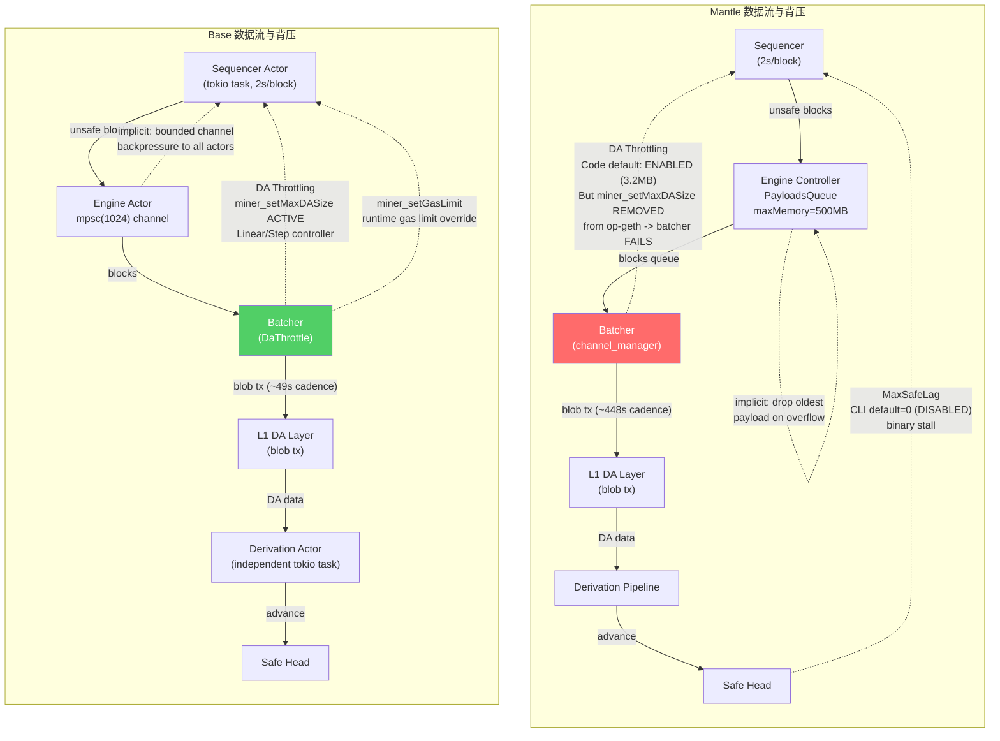
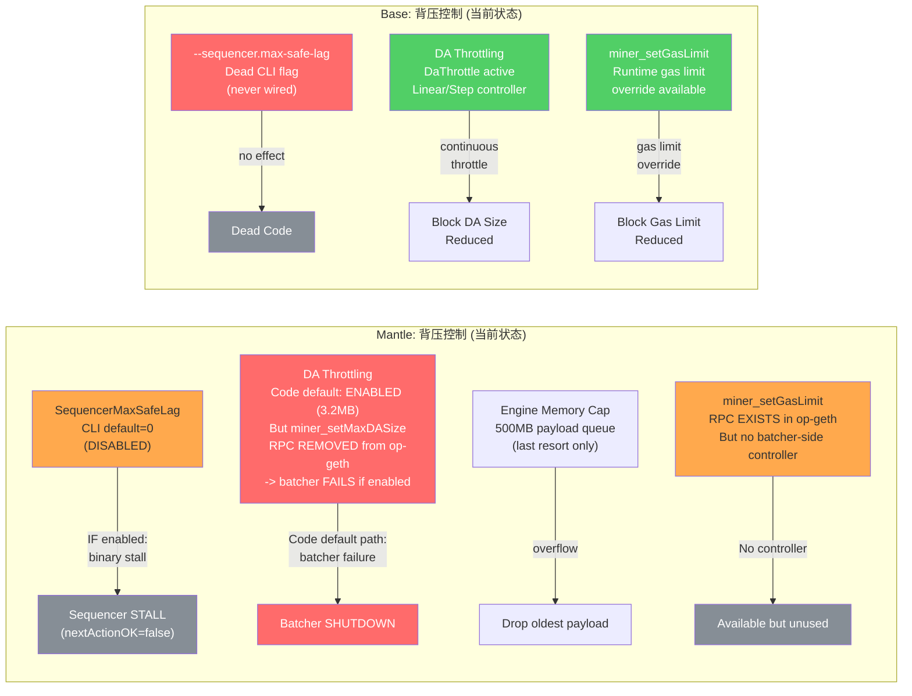
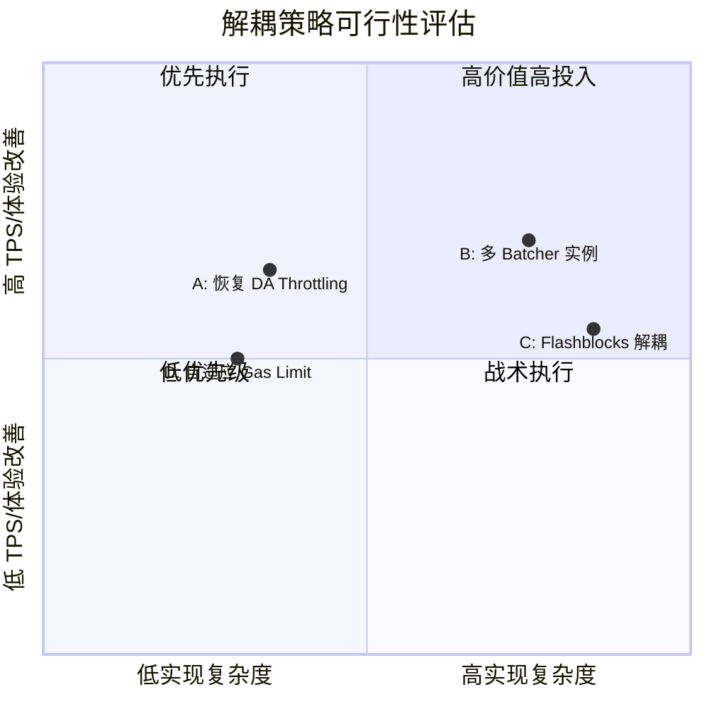

# Batcher-Sequencer 背压机制与解耦策略 (Base vs Mantle)

## Executive Summary

本研究系统分析了 Base 和 Mantle 在 batcher-sequencer 背压机制上的架构差异，揭示了 Mantle 在背压控制能力上的关键缺口。

**核心发现**：

1. **Mantle 当前处于"无有效背压"状态**。两种设计中的背压机制均不可用：`SequencerMaxSafeLag` 的 CLI 默认值为 0（禁用），仓库中无任何部署配置将其设为非零值（`runtime_configuration_evidence: cli_default`）；DA Throttling 虽然在代码默认配置下**处于启用状态**（`DefaultThrottleLowerThreshold = 3_200_000`，即 3.2MB），但因 Mantle op-geth fork 移除了 `miner_setMaxDASize` RPC，**启用该路径会导致 batcher 失败并关闭**（证据：`throttling_enabled_test.go` 明确记录此行为）。生产环境可能通过设置 `LowerThreshold=0` 来规避该失败，但这是一个未经验证的部署配置推断。无论哪种情况，Mantle 的 batcher-sequencer 交互目前缺乏**任何**主动背压控制——既无二值阻断，也无渐进调节。

2. **Base 拥有完整的渐进式 DA Throttling**，通过 `DaThrottle`（Step/Linear 两种策略）+ `miner_setMaxDASize` RPC（`BaseDAConfig` atomic 存储）+ `miner_setGasLimit` RPC 构成三层控制体系。Base 的 `--sequencer.max-safe-lag` CLI flag 虽然存在，但经代码追踪确认为**死代码**——`SequencerConfig` 无对应字段，`SequencerArgs::config()` 静默丢弃该值，sequencer actor 无 `get_safe_head` 方法。Base 完全依赖 batcher 侧 DA throttling 进行背压控制。

3. **Mantle 恢复 DA Throttling 是最高优先级的架构修复**。op-batcher 中已有完整的 4 策略控制器代码（Step/Linear/Quadratic/PID），代码默认使用 Quadratic 控制器（lower=3.2MB, upper=12.8MB），但因 op-geth 缺失 `miner_setMaxDASize` RPC 接收端而无法使用。恢复路径清晰：在 Mantle op-geth 中实现 `miner_setMaxDASize` RPC 即可激活已有代码。值得注意的是，Mantle op-geth 已有 `miner_setGasLimit` RPC（`eth/api_miner.go:54-58`），为自适应 gas limit 策略提供了现成基础设施。

4. **"5k TPS" 声明需要 ~5.3x 的 bytes/UOP 压缩改进**才能在 DA-finalized 层面达到。该声明可能指 pre-confirmation TPS（Flashblocks 层面），而非 DA-finalized TPS。Flashblocks 改善用户感知延迟（从 ~2s 降至 ~250ms），但不改变链最终吞吐。

---

## Item 1: 背压机制全景分类与数据流映射

### 1.1 四类背压机制分类

#### 类型 A: 显式背压 — Sequencer 侧（SequencerMaxSafeLag）

| 字段 | Mantle | Base |
|------|--------|------|
| **backpressure_type** | explicit-sequencer | explicit-sequencer (dead code) |
| **代码位置** | `mantle-v2/op-node/rollup/sequencing/sequencer.go:450` | `base/crates/consensus/cli/src/sequencer.rs:21-28` |
| **trigger_condition** | `maxSafeLag > 0 && SafeL2Head.Number + maxSafeLag <= UnsafeL2Head.Number` | N/A — flag parsed but never evaluated |
| **control_granularity** | binary (on/off stall) | N/A |
| **signal_direction** | sequencer -> self (internal gate) | N/A |
| **runtime_configuration_evidence** | `cli_default`: Value=0 (disabled). Flag at `flags.go:253-259`, usage: "Disabled if 0." **No deployed_config evidence**: 仓库中无任何 docker-compose, helm, k8s, terraform, env 或 shell script 设置此 flag。唯一非零值出现在测试 fixture (`config_test.go:44`: `SequencerMaxSafeLag: 10`)。**default-code-path risk**: 所有关于 MaxSafeLag 行为的论断仅基于代码默认路径，无法确认生产部署值。 | `cli_default`: `default_value = "0"`, env `BASE_NODE_SEQUENCER_MAX_SAFE_LAG`. **Dead code**: `SequencerConfig` 结构体（`config.rs:11-20`）无 `max_safe_lag` 字段；`SequencerArgs::config()`（`sequencer.rs:65-75`）仅映射 4/5 字段，静默丢弃 `max_safe_lag`。 |

**Mantle 传播链**（完整追踪）：
1. CLI flag: `flags.go:253-259` -> `--sequencer.max-safe-lag`, default=0, env=`OP_NODE_SEQUENCER_MAX_SAFE_LAG`
2. Config 读取: `service.go:214` -> `SequencerMaxSafeLag: ctx.Uint64(flags.SequencerMaxSafeLagFlag.Name)`
3. Config 结构体: `driver/config.go:22-24` -> `SequencerMaxSafeLag uint64`
4. Driver 注入: `driver.go:199` -> `s.sequencer.SetMaxSafeLag(s.driverCtx, s.driverConfig.SequencerMaxSafeLag)`, 受 `SequencerEnabled` 门控
5. Sequencer 存储: `sequencer.go:761-763` -> `d.maxSafeLag.Store(v)` (atomic.Uint64)
6. Stall 逻辑: `sequencer.go:449-454` -> 在 `onForkchoiceUpdate` 中检查，触发时设置 `d.nextActionOK = false`

**Base `--sequencer.max-safe-lag` 断裂证据**：
- `SequencerConfig`（`service/src/actors/sequencer/config.rs:11-20`）仅有 4 个字段：`sequencer_stopped`, `sequencer_recovery_mode`, `conductor_rpc_url`, `l1_conf_delay`
- `SequencerArgs::config()`（`cli/src/sequencer.rs:65-75`）映射 4 个字段，`max_safe_lag` 未被引用
- `SequencerEngineClient` trait（`engine_client.rs:22-52`）无 `get_safe_head` 方法 — sequencer actor 无法查询 safe head
- 全仓库 grep `max_safe_lag|SafeLag` 仅命中 CLI 定义一处

#### 类型 B: 显式背压 — Batcher 侧（DA Throttling via `miner_setMaxDASize`）

| 字段 | Mantle | Base |
|------|--------|------|
| **backpressure_type** | explicit-batcher (代码默认启用，但因 RPC 缺失而不可用) | explicit-batcher (完整可用) |
| **代码位置** | `op-batcher/batcher/driver.go:674-727` (throttlingLoop), `throttler/controller.go` | `crates/batcher/core/src/throttle.rs` (DaThrottle) |
| **trigger_condition** | `UnsafeDABytes() > LowerThreshold` (代码默认 3.2MB) | `da_backlog_bytes > threshold_bytes` (1MB default) |
| **control_granularity** | continuous (4 策略: Step/Linear/Quadratic/PID) — 但因 RPC 缺失不可用 | continuous (3 模式: Off/Step/Linear) |
| **signal_direction** | batcher -> sequencer/builder (via `miner_setMaxDASize` RPC) | batcher -> builder (via `miner_setMaxDASize` RPC) |
| **runtime_configuration_evidence** | **代码默认**: `DefaultThrottleLowerThreshold = 3_200_000` (3.2MB)（`throttle_flags.go:19`）, `DefaultThrottleUpperThreshold = 12_800_000` (12.8MB)（`throttle_flags.go:20`）, `DefaultThrottleControllerType = "quadratic"`（`throttle_flags.go:10`）。CLI flag `--throttle.unsafe-da-bytes-lower-threshold` 默认值 = 3,200,000; "Zero disables throttling."（`throttle_flags.go:81-86`）。`NewConfig()`（`config.go:258`）从 CLI 读取该值。`driver.go:179-185` 在 `LowerThreshold > 0` 时启动 throttling loop，注释明确标注 "should always be started except for testing"，`LowerThreshold == 0` 时输出 warn 级别日志 "Throttling loop is DISABLED due to 0 throttle-threshold. This should not be disabled in prod."  **在代码默认路径下，throttling 是启用的**。但因 `miner_setMaxDASize` RPC 在 Mantle op-geth 中已移除，**启用该路径会导致 batcher 失败关闭**（详见下方三态分析）。**deployed_config**: 生产环境可能通过显式设置 `LowerThreshold=0` 来规避该失败，但这是一个**未经验证**的部署配置推断——仓库中无任何 deployed_config 证据。 | `cli_default`: `threshold_bytes=1_000_000` (1MB), `block_size_lower_limit=2_000`, `block_size_upper_limit=130_000`, `tx_size_lower_limit=150`, `tx_size_upper_limit=20_000`（`bin/batcher/src/cli.rs:162-179`）. **完整可用**: `MinerApiExt` trait（`execution/rpc/src/miner.rs:12-27`）暴露 `setMaxDASize`, `getMaxDASize`, `setGasLimit` 三个方法。 |

**Mantle DA Throttling 三态分析**：

**状态 1 — 代码默认（throttling 启用）**：
- `DefaultThrottleLowerThreshold = 3_200_000`（`throttle_flags.go:19`），注释："allows for 4x 6-blob-tx channels at ~131KB per blob"
- `driver.go:179-185`：当 `LowerThreshold > 0`（即代码默认路径），`throttlingLoop` goroutine 被启动
- `driver.go:179` 注释："DA throttling loop should always be started except for testing (indicated by ThrottleThreshold == 0)"
- `LowerThreshold == 0` 时输出 warn 日志："Throttling loop is DISABLED due to 0 throttle-threshold. This should not be disabled in prod."（`driver.go:184`）

**状态 2 — 代码默认路径下的实际效果（失败/关闭）**：
- 在代码默认配置下，batcher 启动 throttling loop 并尝试调用 `miner_setMaxDASize` RPC
- 因 Mantle op-geth 已移除该 RPC 方法，`singleEndpointThrottler`（`driver.go:588-672`）收到 "method not found" 错误
- `driver.go:626-638`：检测到 RPC 不可用后，调用 `l.StopBatchSubmitting(ctx)` — batcher 主动关闭
- `throttling_enabled_test.go:38` (`TestThrottlingEnabledFailure`) 精确验证此行为：使用 `WithBatcherThrottling(500*time.Millisecond, 1, 100, 0)`（`setup.go:588-598`）显式设置 `LowerThreshold=1`（非默认值，但触发同一代码路径），确认 batcher 因 "SetMaxDASize RPC method unavailable on endpoint" 而关闭

**状态 3 — 可能的生产配置（未经验证）**：
- 生产环境可能通过设置 `--throttle.unsafe-da-bytes-lower-threshold=0` 或环境变量 `THROTTLE_UNSAFE_DA_BYTES_LOWER_THRESHOLD=0` 来禁用 throttling loop，规避状态 2 的失败
- `throttling_disabled_test.go:137`（`TestThrottlingDisabledWithBacklog`）**显式覆盖** `LowerThreshold=0`（通过 `WithBatcherThrottling(500*time.Millisecond, 0, 0, 0)`）——该测试不是默认行为的证据，而是对禁用模式的功能验证
- `throttling_disabled_test.go` 的常量注释（lines 24-30）引用 "default threshold 3.2MB"，确认测试作者了解代码默认值为非零
- **⚠ default-code-path risk**：无论生产是使用代码默认值（导致 batcher 失败）还是显式禁用（`LowerThreshold=0`），DA throttling 在 Mantle 上均**不可用**。差异仅在于失败模式：代码默认路径导致 batcher 主动关闭，显式禁用则静默跳过 throttling

#### 类型 C: 隐式背压 — Engine 侧（内存限制）

| 字段 | Mantle | Base |
|------|--------|------|
| **backpressure_type** | implicit-engine | implicit-engine (channel backpressure) |
| **代码位置** | `op-node/rollup/engine/engine_controller.go:41-42` | `crates/consensus/service/src/actors/engine/actor.rs:49` |
| **trigger_condition** | `PayloadsQueue.MemSize > 500MB` | `mpsc::channel(1024)` 满 |
| **control_granularity** | binary (drop oldest payload) | blocking (sender awaits) |
| **signal_direction** | engine -> P2P payload queue (drop) | engine -> all actors (backpressure via channel fullness) |

**Mantle**: `maxUnsafePayloadsMemory = 500 * 1024 * 1024`（`engine_controller.go:41-42`）。`PayloadsQueue` 是按 block number 排序的最小堆（`payloads_queue.go`），溢出时 `Pop()` 最低 block number 的 payload（`payloads_queue.go:131-138`）。这是资源保护，不是背压信号。

**Base**: 无等效的 payload 内存上限。engine task queue 使用 `BinaryHeap` 无界增长（`task_queue/core.rs:388-397`）。隐式背压通过 `mpsc::channel(1024)` 的 bounded channel 实现 — 当 engine processor 处理慢时，所有调用者（sequencer, network, derivation, L1 watcher）在 `send().await` 上阻塞。另有 `MAX_SEQUENCER_EXTERNAL_UNSAFE_GAP = 300`（`engine_request_processor.rs:62-67`）限制外部 unsafe payload 的前向间隔，但这仅影响 P2P gossip 接收，非通用背压。

#### 类型 D: 隐式背压 — Queue Backlog

| 字段 | Mantle | Base |
|------|--------|------|
| **backpressure_type** | implicit-queue | implicit-queue |
| **代码位置** | `op-batcher/batcher/channel_manager.go:579-581` | `crates/batcher/encoder/src/encoder.rs:863-881` |
| **trigger_condition** | 无阈值 — blocks 在内存中无限积累 | 无阈值 — blocks 在内存中无限积累 |
| **signal_direction** | 无信号回传 sequencer | 无信号回传 sequencer |

`UnsafeDABytes()`（Mantle, `channel_manager.go:579-581`）= `unsafeBytesInPendingBlocks()` + `unsafeBytesInOpenChannels()` + `unsafeBytesInClosedChannels()`。作为 DA throttling 的输入信号，但因 throttling 不可用而仅作为 metric 存在。

`da_backlog_bytes()`（Base, `encoder.rs:863-881`）= pending blocks（排除 deposit txs）+ span backlog + open channels + ready channels。明确排除 deposit transactions（`encoder.rs:124-132`），这是 Mantle 对应实现中没有的优化。

### 1.2 数据流与背压信号传递路径

#### diag-1: Batcher-Sequencer 背压传递路径全景图



**关键差异总结**：Mantle 的两条显式背压路径均不可用（MaxSafeLag 默认禁用 + DA Throttling 因 op-geth 移除 RPC 而无法生效——即使代码默认启用，也会导致 batcher 失败关闭），仅剩 engine 侧 500MB 内存保护作为最后防线。Base 拥有完整的 DA Throttling 作为主动背压通道，且额外提供 `miner_setGasLimit` 作为更精细的控制手段。

---

## Item 2: Unsafe Span 控制与增长行为分析

### 2.1 Mantle SequencerMaxSafeLag 详细分析

**代码路径**：`sequencer.go:449-454`，在 `onForkchoiceUpdate` 中执行。

**行为模式**：Binary stall — 一旦 `SafeL2Head.Number + maxSafeLag <= UnsafeL2Head.Number`，设置 `d.nextActionOK = false`。这通过 `Sequencer.NextAction()`（`sequencer.go:617-621`）传播至 driver 主循环，使 `planSequencerAction`（`driver.go:244-265`）设置 `sequencerCh = nil`，禁用 sequencer arm。

**恢复条件**：需要新的 `ForkchoiceUpdateEvent` 且 `UnsafeL2Head.Number > d.latestHead.Number`（`sequencer.go:462`）。这意味着：
- Safe head 追上后不会立即恢复 — 还需要 unsafe head 有新的推进
- 恢复路径：`AddUnsafePayload`（`engine_controller.go:1036`）-> `requestForkchoiceUpdate` -> `ForkchoiceUpdateEvent` -> sequencer 重新检查条件
- **不会死锁**：derivation 在 driver select 中的独立 arm（`s.sched.NextStep()`/`s.sched.NextDelayedStep()`）中运行，MaxSafeLag stall 仅禁用 `sequencerCh` arm，derivation 继续推进 safe head

**runtime_configuration_evidence: cli_default**：
- CLI 默认值 = 0（`flags.go:257`: `Value: 0`），明确标记 "Disabled if 0."
- 仓库内无任何 docker-compose, helm, k8s, terraform, env, shell script 设置此 flag
- 测试 fixture 中 `config_test.go:44` 使用 `SequencerMaxSafeLag: 10`，`backend_test.go:74` 使用 0
- **结论**：在默认配置路径下，MaxSafeLag 机制**完全不会触发**。若生产环境通过外部配置管理（如 Kubernetes ConfigMap）设置了非零值，本分析无法验证。

### 2.2 Base Unsafe Span 控制

**Base 无 sequencer 侧 span 控制**。经完整代码追踪确认：
- `--sequencer.max-safe-lag` 是死代码（详见 item-1 分析）
- Sequencer actor 的 `SequencerEngineClient` trait 无 `get_safe_head` 方法，物理上无法查询 safe head
- Block production tick（`actor.rs:353-414`）仅检查 `next_payload_to_seal` 和 build ticker，不涉及 safe-unsafe 差距判断

**Base 的 unsafe span 控制完全依赖 DA Throttling**：
- `DaThrottle::apply()`（`throttle.rs:219-258`）在 batcher driver 主循环的每次迭代中调用
- 当 `da_backlog_bytes > threshold_bytes`（默认 1MB），throttle 通过 `miner_setMaxDASize` RPC 降低每 block 的 DA 数据量上限
- 效果：block 变小 -> 每 block 产生更少的未提交 DA 数据 -> 间接控制 span 增长
- 但 sequencer 持续出块 — 不会 stall，只是每块更小

### 2.3 Unsafe Span 行为建模

#### 正常场景

| 参数 | Mantle | Base |
|------|--------|------|
| Block time | 2s | 2s |
| Batcher commit cadence | ~448s (课题 5a 观测) | ~49s (课题 5a 观测) |
| Steady-state span (blocks) | ~224 blocks (448s / 2s) | ~25 blocks (49s / 2s) |
| Steady-state span (time) | ~7.5 min | ~49s |

(`cross_topic_reference`: 5a `batcher-pipeline-architecture` final.md — on-chain 观测 50 Mantle + 50 Base L1 batcher tx 样本)

#### 压力场景

| 场景 | Span 增长速率 | 控制机制 |
|------|-------------|----------|
| L1 blob fee 飙升 | Batcher tx 被延迟/替换 -> span 以 1 block/2s 增长 | Mantle: 无控制（MaxSafeLag 默认禁用，DA throttling 因 RPC 缺失不可用）；Base: DA throttling 激活 |
| Batcher 重启 | 重启期间 span 持续增长 | 两链均无控制 — batcher 离线时无背压信号来源 |
| DA 切换/故障 | DA 提交失败 -> span 急速增长 | 同上 — DA 层故障时 batcher 侧的 throttling 无意义 |

#### 极端场景风险

- **Reorg 影响范围**：unsafe span = N blocks 时，reorg 影响 N 个 block 中的所有用户 tx。Mantle steady-state span ~224 blocks = ~7.5 分钟的用户交易处于 unsafe 状态
- **Derivation pipeline 内存压力**：未提交 blocks 在 `channel_manager` 中积累，但 Mantle 的 `maxUnsafePayloadsMemory = 500MB` 仅保护 P2P payload 队列，不保护 batcher 内存
- **用户交易确认延迟**：unsafe tx 仅有 pre-confirmation 语义，safe/finalized 确认需等待 batcher 追上

#### diag-3: Unsafe Span 增长时序图

```mermaid
sequenceDiagram
    participant SEQ as Sequencer
    participant BAT as Batcher
    participant L1 as L1 DA

    Note over SEQ,L1: === 正常场景 (Mantle, ~224 block steady span) ===
    
    SEQ->>SEQ: Block N (2s interval)
    SEQ->>SEQ: Block N+1
    SEQ->>SEQ: ...
    SEQ->>SEQ: Block N+224
    BAT->>L1: Submit blob (blocks N to N+224)
    Note over BAT: ~448s cadence
    L1-->>BAT: Receipt confirmed
    Note over SEQ: Span resets to ~0

    Note over SEQ,L1: === 压力场景: L1 blob fee spike ===
    
    SEQ->>SEQ: Block M, M+1, M+2...
    BAT-xL1: Submit blob (tx delayed/replaced)
    Note over BAT: L1 gas too high
    SEQ->>SEQ: Block M+300, M+301...
    Note over SEQ: Span growing unbounded
    Note over SEQ: Mantle: NO backpressure (MaxSafeLag=0, DA throttle RPC removed)
    Note over SEQ: Base: DA throttle activates -> block DA size reduced
    BAT->>L1: Eventually submit (smaller/adjusted)
    Note over SEQ: Span begins recovery
```



---

## Item 3: Batcher->Sequencer DA Throttling 控制器架构对比

### 3.1 Mantle (Go) 控制器架构

**三层扇出架构**：

1. **Producer**（block loading loop）：`blockLoadingLoop` 调用 `sendToThrottlingLoop()`（`driver.go:427-437`），非阻塞发送 `l.unsafeDABytes()` 到 buffered channel（size 1）。`LowerThreshold == 0` 时短路返回。

2. **Distributor**（`throttlingLoop`, `driver.go:674-727`）：
   - 为每个 endpoint 启动独立 `singleEndpointThrottler` goroutine
   - 每收到 `unsafeBytes` 更新：调用 `l.throttleController.Update(uint64(unsafeBytes))` -> 返回 `ThrottleParams{MaxTxSize, MaxBlockSize, Intensity}`
   - 非阻塞扇出到每个 endpoint 的 `updateChan`

3. **Per-endpoint applier**（`singleEndpointThrottler`, `driver.go:588-672`）：
   - 独立 `rpc.Dial(endpoint)`
   - 调用 `client.CallContext(ctx, &success, "miner_setMaxDASize", maxTxSize, maxBlockSize)`
   - RPC "method not found" -> 调用 `l.StopBatchSubmitting(ctx)` 关闭 batcher
   - 重试间隔: 10s

**4 种控制器策略**（`throttler/` 目录）：

| 策略 | 文件 | 行为 | intensity 计算 |
|------|------|------|--------------|
| Step | `step_strategy.go:24-36` | Binary on/off | 低于 threshold -> 0.0, 高于 -> 1.0 |
| Linear | `linear_strategy.go:31-49` | 线性插值 | `(load - lower) / (upper - lower)` |
| Quadratic | `quadratic_strategy.go:30-49` | 二次曲线 | `linear * linear` — 低负载温和，高负载激进 |
| PID | `pid_strategy.go:60-137` | PID 控制器 | P/I/D 三项独立，IntegralMax 防积分饱和。**EXPERIMENTAL**（注释 lines 11-21）|

策略选择工厂：`controller.go:205-269`。`ThrottleParams` 映射：`intensity [0,1]` -> Upper->Lower 线性插值得出 `MaxTxSize` 和 `MaxBlockSize`。

**默认配置**（`throttle_flags.go:10-27`）：
- `DefaultThrottleControllerType = "quadratic"` 
- `DefaultThrottleLowerThreshold = 3_200_000` (3.2MB)
- `DefaultThrottleUpperThreshold = 12_800_000` (12.8MB = 4 x lower)
- PID 参数：Kp=0.33, Ki=0.01, Kd=0.05, IntegralMax=1000.0, SampleTime=2s

### 3.2 Base (Rust) 控制器架构

**`DaThrottle`**（`throttle.rs`）：更简洁的设计。

**3 种模式**（`ThrottleStrategy` enum, `throttle.rs:73-83`）：
| 模式 | 行为 |
|------|------|
| Off | 不限制 |
| Step | `backlog >= threshold` -> 全强度 |
| Linear | 从 threshold 到 2x threshold 线性插值 |

**无 Quadratic 或 PID** — Base 选择了更简洁的控制器设计。

**intensity 计算**（Linear, `throttle.rs:162-166`）：
```
excess = da_backlog_bytes - threshold_bytes
range = threshold_bytes.max(1)  
ratio = (excess / range).min(1.0)  // 0 at threshold, 1.0 at 2x threshold
intensity = ratio * max_intensity
```

**去重缓存**（`throttle.rs:205, 234-236`）：`last_applied: Option<(u64, u64)>` 跳过冗余 RPC 调用 — Mantle 无此优化。

**事件驱动循环**（`driver.rs:158-166`）：`throttle.apply()` 在 batcher driver 主循环每次迭代中调用，由 `tokio::select!` 驱动。响应事件包括：new L2 block, settled receipt, L1 head update, safe head update, admin command。非固定周期 — 每个有意义的事件都触发重新评估。

**`miner_setMaxDASize` RPC 实现**（`miner.rs:59-67`）：
- 写入 `BaseDAConfig`（`config.rs:32-35`）— `Arc<BaseDAConfigInner>` 持有 `AtomicU64` (Relaxed ordering)
- Payload builder 每 block 读取一次（`builder.rs:709-710`）
- 在 per-tx 选择循环中应用 DA 限制（`builder.rs:726-733`）

**`miner_setGasLimit` RPC**（`miner.rs:77-82`）：
- 写入 `GasLimitConfig`（`config.rs:99-123`）— 同样 `Arc<AtomicU64>` (Relaxed)
- Payload builder 取 `min(configured, evm_block_gas_limit)`（`builder.rs:701-708`）
- **Mantle op-geth 已有等效 RPC**（详见策略 D 分析）

### 3.3 对比矩阵

| 维度 | Mantle (Go) | Base (Rust) |
|------|-------------|-------------|
| 策略数量 | 4 (Step/Linear/Quadratic/PID) | 3 (Off/Step/Linear) |
| 默认策略 | Quadratic | Linear |
| 默认阈值 | 3.2MB lower / 12.8MB upper | 1MB (full at 2MB) |
| 循环驱动 | Producer 推送 -> buffered chan -> 分发器 -> per-endpoint goroutine | 事件驱动 tokio::select! 每迭代调用 |
| 去重 | 无 | `last_applied` 缓存跳过冗余 RPC |
| 多端点 | Per-endpoint goroutine，**任一**失败 -> batcher 关闭 | Per-call failover，first success wins |
| Force blobs | 无 | `force_blobs_when_throttling` 在 throttle 激活时强制 blob DA |
| `miner_setMaxDASize` | **RPC 已移除** — 代码默认启用 throttling 但因 RPC 缺失导致 batcher 失败 | 完整实现 + AtomicU64 存储 |
| `miner_setGasLimit` | **已有 RPC**（`eth/api_miner.go:54-58`），但无 batcher 侧控制器集成 | 完整实现 — batcher 侧 DaThrottle 可直接调用 |
| **可用状态** | **不可用**（代码默认启用但 RPC 缺失 -> 失败；生产可能禁用 -> 无效果） | **活跃** |

#### diag-2: Unsafe Span 控制策略对比图



---

## Item 4: Batcher 吞吐量瓶颈的上游影响链

### 4.1 因果链 A — Safe Head 滞后

**因果链**：Batcher 慢 -> DA 数据提交延迟 -> verifier derivation pipeline 无法推进（`derive.NotEnoughData` 状态）-> safe head 滞后 -> `SequencerMaxSafeLag` 触发（如果启用）-> sequencer stall -> 用户感知 TPS = 0

| 环节 | 时间常数 | 证据 |
|------|----------|------|
| Batcher commit cadence | Mantle ~448s, Base ~49s | 5a on-chain 观测 |
| Safe head 延迟 | >= batcher cadence + L1 confirmation | Derivation 需要 DA 数据可用 |
| MaxSafeLag 触发 | 即时（每次 FCU 检查）| `sequencer.go:449-454` |
| 用户感知 | 即时（出块停止）| `nextActionOK = false` |

**causal_chain**: A  
**signal_direction**: batcher -> L1 -> derivation -> safe head -> sequencer (via MaxSafeLag)

**Mantle 当前状态**：MaxSafeLag 默认禁用 -> 因果链 A **不会被激活**。但这也意味着无安全阀 — 如果 batcher 严重滞后，无机制阻止 sequencer 持续生产 unsafe blocks。

**demand_activation_threshold**: 因果链 A 在 Mantle 当前配置下不会被激活（MaxSafeLag=0）。若未来启用（如设为 1000），则当 batcher cadence > 2000s (1000 blocks x 2s) 时触发。

### 4.2 因果链 B — Blob 积压与费用螺旋

**因果链**：Batcher 慢 -> 未提交 block 在 channel_manager 中积压 -> `UnsafeDABytes` 增长 -> DA Throttling 触发（如果可用）-> 限制 block DA size -> 但积压继续增长 -> L1 拥堵时 blob fee 上升 -> batcher tx 被延迟/替换 -> 进一步降低提交频率 -> 恶性循环

**causal_chain**: B  
**signal_direction**: batcher -> L1 fee market -> batcher (positive feedback loop)

**Mantle 当前状态**：DA Throttling 不可用（代码默认启用但因 RPC 缺失导致失败，生产可能显式禁用）-> 因果链 B 中的 throttling 控制环路**断开**。UnsafeDABytes 增长不会触发任何限制。但恶性循环的 L1 fee 部分仍可发生。

**demand_activation_threshold**：
- Base: `da_backlog_bytes > 1MB` 时 DA throttling 激活
- Mantle: 永不激活（throttling 不可用）。但 `UnsafeDABytes` 仍被计算和记录为 metric，可用于监控告警。

5b `da-bandwidth-throughput-ceiling` 结论：Mantle 有 ~1,480x DA headroom（1.18 TPS vs ~1,749 TPS DA ceiling），因此 DA 带宽本身不是瓶颈。**但 EIP-7918 blob fee 指数增长模型（+50% sustained demand -> ~7x in 5min）意味着即使有充足带宽，费用螺旋仍可发生。**

### 4.3 因果链 C — 背压传导至用户

**因果链**：Batcher 慢 -> DA Throttling 限制 maxBlockSize -> sequencer 每 block 可纳入的 DA 数据量下降 -> 有效 gas limit 降低 -> 用户感知 TPS 下降（sequencer 仍在出块，但每块更小）

**causal_chain**: C  
**signal_direction**: batcher -> sequencer/builder (via `miner_setMaxDASize` RPC)

**Mantle 当前状态**：DA Throttling 不可用 -> 因果链 C **不存在**。Block size 不受 batcher 积压影响。

**Base 行为**：
- DA throttling 激活时，`maxBlockSize` 从 130,000 降至 2,000（最小值）
- `maxTxSize` 从 20,000 降至 150
- Payload builder 在 per-tx 选择循环中应用限制（`builder.rs:726-733`）
- 效果：用户 TPS 下降但不为零，sequencer 持续出块

### 4.4 因果链 D — Derivation 滞后

**因果链**：Batcher 慢 -> DA 数据不完整 -> derivation pipeline 等待（`derive.NotEnoughData` 状态）-> safe head 停滞 -> 依赖 safe head 的服务（bridge finalization, fault proof）延迟

**causal_chain**: D  
**signal_direction**: batcher -> L1 -> derivation -> safe head -> dependent services

**Mantle 当前状态**：此因果链**始终活跃**。Batcher ~448s cadence 意味着 safe head 始终滞后 unsafe head ~224 blocks。对于依赖 safe head 的服务，确认延迟至少 ~7.5 分钟。

**demand_activation_threshold**：此因果链在当前 demand 下已激活。Mantle 当前 ~1.18 TPS 已产生 ~224 block unsafe span。若 demand 增长 10x（~12 TPS），batcher 在 5a Quick Wins 前无法跟上（5a 估算当前 batcher 饱和容量 ~36 TPS），span 会持续增长。

### 4.5 各因果链对比总结

| 因果链 | Mantle 当前激活状态 | Base 当前激活状态 | 核心差异 |
|--------|-------------------|------------------|----------|
| A (safe head -> stall) | MaxSafeLag=0 禁用 | 无等效机制 | Mantle 可选启用；Base 无此路径 |
| B (fee spiral) | Throttling 不可用，fee spiral 可发生但无自动缓解 | DA throttling 提供自动缓解 | Base 有渐进控制，Mantle 无 |
| C (block size reduction) | Throttling 不可用 | Active — block size 被动态调整 | Base 独有的用户体验优化 |
| D (derivation lag) | 始终活跃 (~224 block span) | 始终活跃 (~25 block span) | Mantle span 9x 大于 Base |

---

## Item 5: "5k TPS" 语义精确分析与 Flashblocks 解耦

### 5.1 TPS 度量层次

| 度量层 | 定义 | 影响因素 | Mantle 当前值 | Base 当前值 |
|--------|------|----------|-------------|-------------|
| **Pre-confirmation TPS** | 用户提交 tx 到出现在 Flashblock sub-block 中的速率 | Flashblocks 可用性，sub-block 间隔 | N/A（无 Flashblocks） | <=250ms 延迟感知 |
| **Sequencer-unsafe TPS** | Sequencer 实际出块中纳入的 tx 数/秒 | EL 执行速度, gas limit | ~1.18 TPS (5b 观测) | 高（gas 利用率 8.19%） |
| **DA-finalized TPS** | Batcher 提交到 L1 且 derivation 确认的 tx 数/秒 | DA 带宽, batcher 吞吐 | ~1.18 TPS (= sequencer TPS, DA 非约束) | 受 DA 带宽约束 |
| **L1-finalized TPS** | L1 block 本身 finalize 后的 TPS | L1 finality (~12min) | = DA-finalized (延迟差异) | = DA-finalized (延迟差异) |

(`cross_topic_reference`: 5b `da-bandwidth-throughput-ceiling` final.md — DA ceiling 和 bytes/UOP 数据)

### 5.2 Base "5k TPS" 归属分析

**DA-finalized TPS 上限**（5b 结论）：
- Base 观测 bytes/UOP = 153.03 B
- DA ceiling (BPO2, target=14 blobs/block) = ~942 TPS sustained
- 达到 5k TPS 需要 bytes/UOP 降至 ~29B（~5.3x 压缩改进）

**可能的 "5k TPS" 定义**：
1. **Pre-confirmation TPS**（最可能）：Flashblocks 8x sub-block 将用户延迟从 <=2s 压至 <=250ms，相当于用户感知的"响应速度"提升，但不改变链的吞吐能力
2. **Gas throughput equivalent**：若 gas limit 提升到足够高且 EL 执行速度允许，sequencer-unsafe TPS 可达 5k — 但 DA-finalized TPS 仍受 DA 带宽约束
3. **Theoretical burst TPS**：短暂 burst 而非 sustained throughput

**tps_definition**: "5k TPS" 最可能指 pre-confirmation 层面的用户感知速率，或 gas throughput equivalent。DA-finalized 层面在当前 bytes/UOP 下无法达到 5k — 需 ~5.3x 压缩改进。

### 5.3 Flashblocks 解耦效果

**机制**（`cross_topic_reference`: Section 2 `block-builder-flashblocks-throughput` final.md）：
- 将 2s L2 block 拆为 8 x 250ms sub-block
- 用户延迟从 <=2s 压至 <=250ms
- rollup-boost 实现 parallel build（`tokio::join!`），但不是 workload offload
- **不改变链最终吞吐**（finalized gas/s 不变）

**对 batcher-sequencer 背压的影响**：
- Flashblocks 允许 sequencer 在 batcher 慢时继续提供 pre-confirmation — 用户看到的延迟低，但 unsafe span 继续增长
- DA throttling 与 Flashblocks 交互：如果 throttling 限制了 block DA size，Flashblocks sub-block 的总和仍受限于 block 级别的 maxBlockSize
- Flashblocks **不解决** batcher 吞吐瓶颈本身 — 只改善延迟感知

**Mantle Flashblocks 移植进度**（Section 2 结论）：
- `flashblocks/poc` 分支无 Flashblocks 实质代码（误导性分支名）
- `feat/flashblocks-mantle-aware` 仅覆盖 extra_data 解析
- 距离可用有较大差距

---

## Item 6: 4 种解耦改进策略可行性评估

### 策略 A — 恢复 DA Throttling + 异步 Batcher（渐进解耦）

**前提**：Mantle 当前**完全缺失可用的 DA throttling** — op-batcher 代码默认启用 throttling（`LowerThreshold = 3.2MB`），但因 op-geth 移除了 `miner_setMaxDASize` RPC，启用会导致 batcher 失败关闭。仅有默认禁用的 binary stall（MaxSafeLag）作为另一种背压机制。

**实施路径**：
1. **第一步**（关键）：在 Mantle op-geth 中实现 `miner_setMaxDASize` RPC
   - 参照 Base 的 `execution/rpc/src/miner.rs` 中 `BaseDAConfig` atomic 模式
   - 或参照 OP Stack 上游的 Go 实现
   - 需要在 op-geth 的 miner 包中添加 RPC handler + atomic config 存储 + payload builder 读取
2. **第二步**：使用代码默认配置即可激活 throttling
   - `DefaultThrottleLowerThreshold = 3_200_000`（3.2MB）已为非零值
   - 默认 Quadratic controller 即可使用
   - 无需额外 batcher 配置变更——恢复 RPC 后代码默认路径即为正确的 production 路径
3. **第三步**：配置 `SequencerMaxSafeLag` 为较大值作为安全阀
   - 如设为 5000（~2.8h），作为 DA throttling 失效时的 last resort

**strategy_feasibility**：

| 维度 | 评估 |
|------|------|
| TPS 改善预估 | 不直接提升 TPS，但避免 binary stall -> 用户体验连续化。间接允许更激进的 batcher 参数调优（5a Quick Wins）|
| 实现复杂度 | **中**（~2-4 人周）。op-geth RPC 实现 ~1 周，集成测试 ~1 周，参数调优 ~1-2 周。op-batcher 侧代码已完整 |
| 风险等级 | **低-中**。RPC 实现相对标准化，控制器代码已有完整测试覆盖。风险主要在控制器参数稳定性 |
| 可逆性 | **高**。设 `LowerThreshold=0` 可立即回退 |
| 时间线 | 4-6 周（含测试和 testnet 验证）|

### 策略 B — 多 Batcher 实例（水平扩展）

**思路**：运行多个 batcher 实例并行消费 sequencer 的 unsafe blocks 并提交 DA。

**技术挑战**：
1. **Block 分配**：哪个 batcher 负责哪些 blocks？需要协调层避免重复
2. **Channel 去重**：同一 block 不能被多个 batcher 提交。Derivation pipeline 需要处理潜在的重复
3. **Nonce 管理**：多 batcher 共享 EOA（需 nonce 协调）或独立 EOA（需 derivation 识别多个 batcher address）
4. **DA 费用**：多 batcher 可能竞争 blob 空间，反而推高费用

**strategy_feasibility**：

| 维度 | 评估 |
|------|------|
| TPS 改善预估 | 理论线性扩展 batcher 吞吐。2 个 batcher -> ~2x 提交频率 |
| 实现复杂度 | **高**（~8-12 人周）。需要新的 block 分配协议、nonce 管理、derivation pipeline 适配 |
| 风险等级 | **高**。协调复杂度高，错误可能导致 block 重复提交或遗漏 |
| 可逆性 | **中**。需要 derivation 层面的兼容性变更，回退需协调 |
| 时间线 | 12-16 周 |

### 策略 C — Flashblocks 式解耦（Pre-confirmation 层）

**思路**：引入 pre-confirmation 层吸收用户交互，batcher 异步最终确认。

**strategy_feasibility**：

| 维度 | 评估 |
|------|------|
| TPS 改善预估 | **不改变 DA-finalized TPS**。仅改善用户延迟感知（~2s -> ~250ms）|
| 实现复杂度 | **高**（~12-20 人周）。需要 rollup-boost + Flashblocks 完整移植。Section 2 分析显示 Mantle reth 分支距离可用有较大差距 |
| 风险等级 | **中**。Flashblocks 在 Base 已验证可行，但 Mantle 的 reth fork 适配工作量大 |
| 可逆性 | **中**。Flashblocks 是 opt-in 架构，可逐步部署 |
| 时间线 | 16-24 周 |
| **关键限制** | **不解决 batcher 吞吐瓶颈**。不能替代 DA throttling 恢复或 batcher pipeline 优化 |

### 策略 D — 自适应 Gas Limit

**思路**：Batcher 根据积压情况通过 `miner_setGasLimit` RPC 动态调整 L2 gas limit。

**Mantle 已有基础设施 — `miner_setGasLimit` RPC 已存在**：
- **`MinerAPI` 注册**：`eth/backend.go:451-455` 将 `NewMinerAPI(s)` 注册到 `miner` 命名空间
- **`SetGasLimit` 方法**：`eth/api_miner.go:54-58` 实现 `SetGasLimit(gasLimit hexutil.Uint64) bool`，调用 `api.e.Miner().SetGasCeil(uint64(gasLimit))`
- **`SetGasCeil` 路由**：`miner/miner.go:162-168` 在 `confMu` 锁保护下写入 `miner.config.GasCeil`
- **Block building 使用 `GasCeil`**：`miner/worker.go:323-328` 在 Optimism 模式下，当 `genParams.gasLimit == nil && miner.config.GasCeil != 0` 时，将 block header 的 `GasLimit` 设为 `miner.config.GasCeil`
- **优先级注意**：`worker.go:323` 显示 `genParams.gasLimit`（来自 engine API payload attributes）优先于 `GasCeil`——如果 op-node/sequencer 在 FCU payload attributes 中指定了 gas limit，`miner_setGasLimit` 的设置会被覆盖

**Base 对应基础设施**：
- `miner_setGasLimit` RPC（`miner.rs:77-82`）写入 `GasLimitConfig`（`config.rs:99-123`）
- Payload builder 取 `min(configured, evm_block_gas_limit)`（`builder.rs:701-708`）
- 端到端测试覆盖（`miner_gas_limit.rs`）

**Mantle 缺失的部分（非 RPC 本身）**：
1. **Batcher 侧控制器集成**：当前 op-batcher 的 `throttlingLoop` 仅调用 `miner_setMaxDASize`，未集成 `miner_setGasLimit` 调用逻辑。需要新增控制器路径，根据 `UnsafeDABytes` 或其他积压指标计算目标 gas limit 并调用 RPC
2. **策略参数**：如何根据 batcher backlog 计算合适的 gas limit 值？需要定义 backlog->gasLimit 映射函数（可复用现有 Step/Linear/Quadratic 框架）
3. **安全性验证**：gas limit 调整需与 EIP-1559 gas pricing 协调（Section 3 `gas-protocol-perf-config`），避免 gas limit 过低导致用户 tx 无法执行。需要定义最小 gas limit 下限
4. **与 engine API 的交互**：需确认 op-node 在 FCU payload attributes 中是否指定 `gasLimit`；若指定，`miner_setGasLimit` 设置会被覆盖，需要在 op-node 层面也进行适配

**strategy_feasibility**：

| 维度 | 评估 |
|------|------|
| TPS 改善预估 | 与 DA throttling 互补 — 更直接地控制执行层吞吐 |
| 实现复杂度 | **低-中**（~2-3 人周）。RPC 已存在，仅需 batcher 侧控制器集成（~1 周）+ 策略参数设计与测试（~1-2 周）。无 op-geth 代码变更 |
| 风险等级 | **中**。Gas limit 调整需与 EIP-1559 gas pricing 协调（Section 3 `gas-protocol-perf-config`）。engine API `genParams.gasLimit` 优先级覆盖可能需要 op-node 层面适配 |
| 可逆性 | **高**。停止调用 RPC 即恢复默认 gas limit；或设 gas limit = 0（使用链上 SystemConfig 默认值）|
| 时间线 | 3-5 周（含 testnet 验证）|

### diag-4: 策略评估矩阵



| 策略 | TPS/体验改善 | 实现复杂度 | 风险 | 可逆性 | 时间线 | 优先级 |
|------|-------------|-----------|------|--------|--------|--------|
| **A: 恢复 DA Throttling** | 中-高（连续化体验） | 中（2-4 人周） | 低-中 | 高 | 4-6 周 | **P0** |
| B: 多 Batcher | 高（线性扩展） | 高（8-12 人周） | 高 | 中 | 12-16 周 | P2 |
| C: Flashblocks | 中（延迟改善） | 高（12-20 人周） | 中 | 中 | 16-24 周 | P2 |
| **D: 自适应 Gas Limit** | 中（精细控制） | 低-中（2-3 人周） | 中 | 高 | 3-5 周 | **P1** |

---

## Item 7: Mantle 优先推荐方案与路线图

### 阶段 0 — 参数调优（立即可执行，配合 5a Quick Wins）

**行动项**：
1. 配合 5a R1/R2b 调整 `MaxPendingTransactions`（1 -> 5-10）和 `TargetNumFrames`（1 -> 6）
   - 预期：batcher 饱和容量从 ~36 TPS 提升至 ~1,083 TPS（5a 估算）
   - **可立即执行**，仅需配置变更

2. 确认 `SequencerMaxSafeLag` 当前值
   - `runtime_configuration_evidence: cli_default` -> Value=0 (disabled)
   - **建议**：设为较大值（如 5000）作为安全阀，防止极端 span 增长
   - **注意**：启用前需理解 binary stall 对用户体验的影响

3. **DA Throttling 参数调优不可行**
   - 代码默认路径下 `LowerThreshold = 3.2MB`（throttling 启用），但因 `miner_setMaxDASize` RPC 在 op-geth 中不存在，batcher 会在启动 throttling loop 后检测到缺失方法并关闭
   - 生产环境可能已通过 `LowerThreshold=0` 规避此问题（未经验证）
   - 任何 `LowerThreshold > 0` 的配置都会触发 batcher 失败——此路径被 op-geth fork 阻断

**预计 TPS 改善**：batcher 侧吞吐显著提升（5a 估算 ~30x），但背压控制能力不变。

**工程投入**：< 1 人周（配置变更 + 测试验证）

**风险**：低 — 参数调优可快速回退

**成功度量**：batcher commit cadence 从 ~448s 降至 ~50s 以下

### 阶段 1 — 恢复 DA Throttling（最高优先级的背压修复）

**核心论点**：Mantle 当前处于"无有效背压"状态。两种设计中的背压机制均不可用：
- MaxSafeLag 默认禁用（`cli_default: 0`）
- DA Throttling 代码默认启用（`LowerThreshold = 3.2MB`），但因 op-geth 缺失 `miner_setMaxDASize` RPC 而无法使用——在代码默认路径下 batcher 会失败关闭

**实施路径**：
1. 在 Mantle op-geth 中实现 `miner_setMaxDASize` RPC
   - 参照模式：Base 的 `BaseDAConfig` atomic + `MinerApiExt` trait
   - 需要：RPC handler -> atomic config store -> payload builder 读取
2. 恢复 RPC 后，使用代码默认配置即可——`LowerThreshold = 3.2MB`（非零）自动启动 throttling loop
3. 使用已有的 Quadratic controller（默认配置 lower=3.2MB, upper=12.8MB）
4. 配置 `SequencerMaxSafeLag` 为安全阀值

**预计 TPS 改善**：从无背压控制 -> continuous throttle，用户体验显著改善。TPS 不直接提升，但允许更激进的 batcher 吞吐参数。

**工程投入**：2-4 人周

**风险**：
- 控制器参数需要 testnet 调优（Quadratic controller 的 overshoot 特性）
- 多端点并行 throttling 的一致性（Mantle 架构要求所有 endpoint 成功）

**成功度量**：
- `miner_setMaxDASize` RPC 在 op-geth 中可用
- Throttling loop 以代码默认 threshold（3.2MB）运行
- `UnsafeDABytes` metric 显示 throttling 激活/释放循环

**回滚策略**：设 `LowerThreshold=0` 立即禁用

### 阶段 2 — 架构解耦（中期，需要较大工程投入）

**选项评估**：

| 方案 | 前置条件 | 投入 | 价值 |
|------|---------|------|------|
| 策略 D (自适应 gas limit) | **无 op-geth 前置**（RPC 已存在），需 batcher 侧控制器 | 2-3 人周 | 精细化背压控制，与 DA throttling 互补 |
| 策略 C (Flashblocks) | reth fork 就绪 | 12-20 人周 | 用户延迟感知改善 |
| 策略 B (多 batcher) | 协调协议设计 | 8-12 人周 | 线性扩展 batcher 吞吐 |
| Section 4 actor model 重构 | 架构决策 | 大型重构 | 并行处理能力 |

**推荐优先序**：
1. 策略 D（自适应 gas limit）— Mantle op-geth 已有 `miner_setGasLimit` RPC（`eth/api_miner.go:54-58`），仅需 batcher 侧控制器集成。可与阶段 1 并行推进
2. 策略 C（Flashblocks）— 长期投资，改善用户体验
3. 策略 B（多 batcher）— 仅在 demand 接近单 batcher 极限时考虑

**与其他课题的关系**：
- 5a Quick Wins 是阶段 0 的前置条件（`cross_topic_reference`: `batcher-pipeline-architecture` final.md S6.1-S6.4）
- 5b 确认 DA 非约束 -> 阶段 0/1 可独立于 DA 层改进（`cross_topic_reference`: `da-bandwidth-throughput-ceiling` final.md S3.2）
- Section 4 的 actor model 分析是阶段 2 架构决策的基础（`cross_topic_reference`: `sequencer-consensus-pipeline-perf` final.md S7）
- Section 2 的 Flashblocks 分析是策略 C 评估的基础（`cross_topic_reference`: `block-builder-flashblocks-throughput` final.md S2）

---

## Item 8: 风险分析与边界条件

### 8.1 Unsafe Span 增长风险

**risk_severity**: high

**场景**：放松/禁用 MaxSafeLag 后（或在当前默认禁用状态下），unsafe span 的理论增长无上限。

**unsafe_span_metric**:
- 正常场景：Mantle ~224 blocks (~7.5 min), Base ~25 blocks (~49s)
- 压力场景（batcher 停机 1h）：Mantle +1,800 blocks，总 span ~2,024 blocks (~67 min)
- 极端场景（batcher 停机 4h）：Mantle +7,200 blocks，总 span ~7,424 blocks (~4.1h)

**影响评估**：
- **Reorg 影响范围**：span = 7,424 blocks 时，reorg 回滚 ~4.1h 用户交易。对比 Base 正常 span ~25 blocks，reorg 仅影响 ~49s
- **内存压力**：`maxUnsafePayloadsMemory = 500MB` 保护 P2P payload queue，但 **不保护** channel_manager 内存积累。7,424 blocks 在 channel_manager 中的内存占用取决于 block 大小和 channel 策略
- **用户体验**：用户 tx 在 ~4.1h 内仅有 pre-confirmation 语义，safe/finalized 确认需等 batcher 追上

**mitigation**：
- 启用 `SequencerMaxSafeLag` 作为安全阀（建议值 5000，~2.8h）
- 监控 `UnsafeDABytes` 和 unsafe span metrics
- 设置告警阈值（如 span > 500 blocks -> warn, > 2000 -> critical）

### 8.2 DA 费用风险

**risk_severity**: medium

**场景**：DA Throttling 降低 block size -> batcher 积压更多数据 -> 后续 burst 提交面临更高 blob fee。

**5b EIP-7918 模型**：+50% sustained demand -> ~7x blob fee in 5 minutes。

**Mantle 当前风险**：DA throttling 不可用 -> 无法通过降低 block size 缓解积压。但 Mantle DA headroom ~1,480x -> 正常操作中 blob fee 风险极低。风险主要在 L1 全网 blob demand spike 场景。

**mitigation**：
- 恢复 DA throttling（阶段 1）提供自动缓解能力
- Batcher 已有 `force_blobs_when_throttling`（Base）在 throttle 激活时强制 blob DA 格式 — Mantle 恢复 throttling 后可借鉴
- 监控 L1 blob base fee 趋势

### 8.3 控制器稳定性风险

**risk_severity**: medium

**PID controller overshoot**：
- `pid_strategy.go` 标记为 EXPERIMENTAL（lines 11-21）
- IntegralMax=1000.0 的积分饱和可能导致 overshoot
- SampleTime=2s 的采样间隔在快速变化场景下可能不足

**Step controller 过度 throttling**：
- OP Stack `throttling.md` 明确警告 "too much throttling applied too quickly"
- Step 策略从 0 跳到 1.0 -> maxBlockSize 从 130,000 骤降至 2,000

**多端点并行一致性**：
- Mantle 架构要求**所有**端点成功（任一失败 -> batcher 关闭）
- Base 使用 per-call failover（first success wins）— 更健壮

**mitigation**：
- 初始部署使用 Quadratic controller（默认）而非 PID
- 在 testnet 上进行压力测试，验证 overshoot 行为
- 考虑从 Mantle 的 "all must succeed" 模式改为 Base 的 "first success" 模式
- 通过 admin RPC 支持运行时切换控制器类型

### 8.4 Sequencer 架构耦合风险

**risk_severity**: medium（Mantle），low（Base）

**Mantle 单 event-loop 风险**：
- Section 4 分析：Mantle 使用单 driver eventLoop 的 `OnEvent` 同步分发
- MaxSafeLag stall 设置 `nextActionOK = false` -> 禁用 `sequencerCh` arm
- **但 derivation 不受影响**：`s.sched.NextStep()`/`s.sched.NextDelayedStep()` 在独立 arm 中
- **潜在窄风险**：stall 恢复依赖 `UnsafeL2Head.Number > d.latestHead.Number`（`sequencer.go:462`）。如果 safe head 追上但无新 unsafe head 推进，sequencer 保持暂停（"Sequencer paused until new events", `driver.go:248`）。实际中 `PromoteSafe -> tryUpdateEngine -> requestForkchoiceUpdate` 链保证后续 FCU 事件

**Base actor model 隔离**：
- 5 独立 tokio task，per-actor mpsc channel
- Sequencer 慢不影响 derivation（独立 task）
- 唯一共享瓶颈：engine `mpsc::channel(1024)` — 当 engine processor 慢时，所有 actor 的 send 均阻塞

(`cross_topic_reference`: Section 4 `sequencer-consensus-pipeline-perf` final.md — Base actor model vs Mantle event-bus 架构)

**mitigation**：
- 短期：确保 MaxSafeLag stall 后的恢复路径畅通（通过日志监控 "Sequencer paused" 持续时间）
- 中期：Section 4 建议的 7 项改进杠杆（actor+task queue, cross-task parallel 等）
- 长期：kona-node 迁移

### 8.5 风险总结矩阵

| 风险 | 严重度 | 发生概率 | 影响 | 缓解措施 | 可观测指标 |
|------|--------|---------|------|----------|-----------|
| Unsafe span 无限增长 | **High** | 高（当前无控制） | Reorg 影响范围大，确认延迟长 | 启用 MaxSafeLag 安全阀 + 恢复 DA throttling | `op_node_unsafe_head_lag_blocks` |
| L1 blob fee spiral | Medium | 低（~1,480x DA headroom） | 提交成本骤增 | 恢复 DA throttling + fee 监控 | `l1_blob_base_fee` |
| Controller overshoot | Medium | 中（Quadratic 较温和） | 过度限制 block size | Testnet 压测 + 参数调优 | `batcher_throttle_intensity` |
| Stall 恢复延迟 | Medium | 低（架构保证后续 FCU） | Sequencer 短暂额外暂停 | 监控 "paused" 持续时间 | `sequencer_paused_duration` |

---

## Diagrams

### diag-1: Batcher-Sequencer 背压传递路径全景图
见 Item 1, S1.2

### diag-2: Unsafe Span 控制策略对比图
见 Item 3, S3.3 下方

### diag-3: Unsafe Span 增长时序图
见 Item 2, S2.3

### diag-4: 4 种解耦策略评估矩阵
见 Item 6

---

## Source Coverage

### src-1: `mantle-v2/op-node/rollup/sequencing/sequencer.go` — SequencerMaxSafeLag 实现 [covered]

- `maxSafeLag atomic.Uint64`（line 89）
- Stall 逻辑：`onForkchoiceUpdate`（lines 449-454）
- `SetMaxSafeLag()`（lines 761-763）
- `NextAction()` 门控（lines 617-621）
- CLI flag: `flags.go:253-259`, default=0
- Config: `driver/config.go:22-24`
- Driver 注入: `driver.go:199`

### src-2: `mantle-v2/op-batcher/batcher/` — DA Throttling 实现链 [covered]

- `throttlingLoop`（`driver.go:674-727`）
- `singleEndpointThrottler`（`driver.go:588-672`）
- `sendToThrottlingLoop`（`driver.go:427-437`）
- `UnsafeDABytes()`（`channel_manager.go:579-581`）
- 4 种控制器策略：`throttler/step_strategy.go`, `linear_strategy.go`, `quadratic_strategy.go`, `pid_strategy.go`
- Controller 工厂：`throttler/controller.go:205-269`
- **默认配置**：`flags/throttle_flags.go:10-27` — `DefaultThrottleLowerThreshold = 3_200_000`（3.2MB），`DefaultThrottleUpperThreshold = 12_800_000`，`DefaultThrottleControllerType = "quadratic"`
- **启动门控**：`driver.go:179-185` — `LowerThreshold > 0` 启动 throttling loop，注释 "should always be started except for testing"，warn 日志 "This should not be disabled in prod"
- **配置映射**：`config.go:258` — `LowerThreshold: ctx.Uint64(flags.ThrottleUsafeDABytesLowerThresholdFlag.Name)`

### src-3: `base/base` batcher throttling 实现 [covered]

- `DaThrottle`（`crates/batcher/core/src/throttle.rs`）：3 种模式，intensity 计算，去重缓存
- `RpcThrottleClient`（`crates/batcher/service/src/throttle.rs:70-111`）：多端点 failover
- `ThrottleConfig::default()`（`throttle.rs:29-41`）
- Batcher driver 集成（`core/src/driver.rs:158-166`）

### src-4: `base/base` sequencer unsafe span 控制 [covered]

- `--sequencer.max-safe-lag` CLI flag（`cli/src/sequencer.rs:21-28`）— 存在但为死代码
- `SequencerConfig`（`service/src/actors/sequencer/config.rs:11-20`）— 无 `max_safe_lag` 字段
- `SequencerArgs::config()`（`cli/src/sequencer.rs:65-75`）— 静默丢弃 `max_safe_lag`
- `SequencerEngineClient` trait（`engine_client.rs:22-52`）— 无 `get_safe_head` 方法
- 结论：Base sequencer 无 safe-lag 相关背压逻辑

### src-5: `mantle-v2/op-node/rollup/engine/engine_controller.go` [covered]

- `maxUnsafePayloadsMemory = 500MB`（line 41-42）
- `PayloadsQueue` 实现（`payloads_queue.go`）：min-heap，overflow drop lowest
- `AddUnsafePayload`（line 1027）+ `requestForkchoiceUpdate`（line 1036）
- `DropInapplicableUnsafePayloads`（`payloads_queue.go:165-201`）

### src-6: 课题 5a（batcher-pipeline-architecture）final.md [covered]

引用数据点：
- Mantle MaxPendingTransactions=1（代码默认），TargetNumFrames=1
- Mantle ~448s batcher tx cadence，1 blob/tx
- Base ~49s cadence，5 blobs/tx
- Quick Wins 估算：saturated capacity 从 ~36 TPS -> ~1,083 TPS
- S6.6: "sequencer 出块速度 ~10x batcher 提交速度" 耦合度量

### src-7: 课题 5b（da-bandwidth-throughput-ceiling）final.md [covered]

引用数据点：
- DA 非约束：Mantle 1.18 TPS demand vs ~1,749 TPS DA ceiling (~1,480x headroom)
- BPO2: target=14, max=21 blobs/block
- Base bytes/UOP = 153.03 B -> 5k TPS 需 ~29B (~5.3x 压缩改进)
- EIP-7918: +50% sustained demand -> ~7x blob fee in 5min

### src-8: Section 2（block-builder-flashblocks-throughput）final.md [covered]

引用数据点：
- Flashblocks: 250ms sub-blocks, pre-confirmation 延迟改善
- rollup-boost: parallel build (tokio::join!), 非 workload offload
- Mantle reth `flashblocks/poc` 无实质代码
- Mantle 60.8% system-only blocks, 0.29% gas 利用率
- Base 0.20% system-only blocks, 8.19% gas 利用率

### src-9: Section 4（sequencer-consensus-pipeline-perf）final.md [covered]

引用数据点：
- Base: 5 独立 tokio tasks, mpsc(1024) channels
- Mantle: 单 driver eventLoop, OnEvent 同步分发
- Mantle per-block FCU count = 2
- sealingDuration = 50ms 硬编码
- 7 项改进杠杆

### src-10: OP Stack 官方文档 [best-effort]

- unsafe/safe/finalized 语义：基于 OP Stack 规范和代码注释
- DA throttling 配置：基于 `throttling.md`（op-batcher 仓库内文档）
- Flashblocks 规范：基于 Section 2 引用的 Flashblocks spec

### src-11: On-chain 观测数据 [covered, 复用 5a 样本]

- Base 和 Mantle batcher commit cadence（5a on-chain 样本）
- Unsafe span 稳态值从 cadence 推导

### src-12: 部署配置 [default-code-path risk]

- **Mantle `SequencerMaxSafeLag` 实际部署值**：仓库中无 deployed_config 证据。所有 MaxSafeLag 论断标注 `runtime_configuration_evidence: cli_default`，即基于代码默认路径（Value=0, disabled）。若生产环境通过外部配置管理设置了非零值，本分析无法验证。
- **DA throttling threshold**：代码默认值 `DefaultThrottleLowerThreshold = 3_200_000`（3.2MB，throttling 启用）。但因 `miner_setMaxDASize` RPC 在 op-geth 中已移除，代码默认路径导致 batcher 失败。`throttling_disabled_test.go` **显式覆盖** `LowerThreshold=0` 来测试禁用模式——该测试不是默认行为的证据，测试常量注释引用 "default threshold 3.2MB" 确认默认为非零。生产环境可能显式设置 `LowerThreshold=0` 来规避失败，但仓库中无 deployed_config 证据。

### src-13: Mantle op-geth `miner_setGasLimit` RPC [covered, round-2 新增]

- `MinerAPI` 注册：`eth/backend.go:451-455` — `Namespace: "miner", Service: NewMinerAPI(s)`
- `SetGasLimit` 方法：`eth/api_miner.go:54-58` — `api.e.Miner().SetGasCeil(uint64(gasLimit))`
- `SetGasCeil` 路由：`miner/miner.go:162-168` — 在 `confMu` 锁保护下写入 `miner.config.GasCeil`
- Block building 使用：`miner/worker.go:323-328` — Optimism 模式下 `genParams.gasLimit == nil && GasCeil != 0` 时使用 `GasCeil`
- 优先级：`worker.go:323` — `genParams.gasLimit`（engine API）优先于 `GasCeil`

---

## Gap Analysis

| Gap ID | 描述 | 影响 | 缓解措施 |
|--------|------|------|----------|
| G-1 | Mantle mainnet `SequencerMaxSafeLag` 实际部署值未知 | Item 2 的 stall 行为分析基于 CLI default=0（disabled）假设。若生产已启用，则 Item 1 的"无有效背压"结论需修正 | 所有相关论断标注 `runtime_configuration_evidence: cli_default` 和 `default-code-path risk` |
| G-2 | Base 官方 "5k TPS" 声明原始出处未找到 | Item 5 的归属分析基于推断而非官方定义 | 提供了 DA ceiling 的定量分析证明 5k TPS 在当前 bytes/UOP 下无法在 DA-finalized 层达到 |
| G-3 | Mantle op-geth fork 移除 `miner_setMaxDASize` 的 commit/PR 未追踪 | 无法确认移除动机和时间线 | 使用 `throttling_enabled_test.go` 注释作为权威证据 |
| G-4 | 策略 B（多 batcher）的 OP Stack 上游设计方向未确认 | 可行性评估可能遗漏上游已有的设计考虑 | op-batcher readme 提到 `(potentially multiple) sequencers` 暗示多实例架构在考虑中 |

---

## Revision Log

| Round | Date | Mode | Changes |
|-------|------|------|---------|
| 1 | 2026-05-20 | initial-draft | 全 8 项研究完成。覆盖两个审阅 caveats：(1) MaxSafeLag cli_default=0 + 无 deployed config 证据；(2) Base --sequencer.max-safe-lag 为死代码。|
| 2 | 2026-05-20 | revision | 修正 3 项 round-1 审阅发现：(1) **Major**: Mantle DA-throttling 默认语义——区分三态：代码默认启用（LowerThreshold=3.2MB），但因 op-geth 移除 RPC 导致 batcher 失败，生产可能显式禁用（未经验证）。移除 "throttling_disabled_test.go 确认默认运行模式" 错误论断，替换为精确的三态分析。(2) **Major**: 策略 D 重构——确认 Mantle op-geth 已有 `miner_setGasLimit` RPC（`eth/api_miner.go:54-58`），缺失的是 batcher 侧控制器集成而非 RPC 本身。更新可行性评估（复杂度从 3-5 人周降至 2-3 人周，移除 op-geth RPC 实现步骤）和时间线。新增 src-13 覆盖 op-geth SetGasLimit 源码证据。(3) **Minor**: 元数据 gaps 字段从 [] 更新为 G-1 至 G-4。|
| final | 2026-05-20 | promotion | Promoted from round-2 draft (commit 48f05d6). Approval: comment e8c44ebd (draft-approved, minor). Cleanup: added src-13 to source_requirements_covered metadata. |
