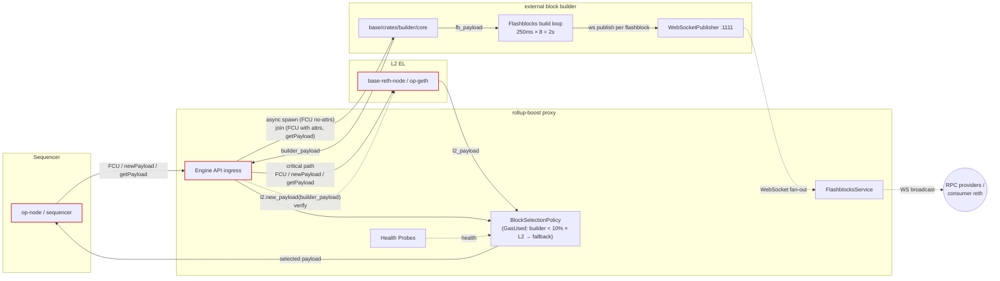
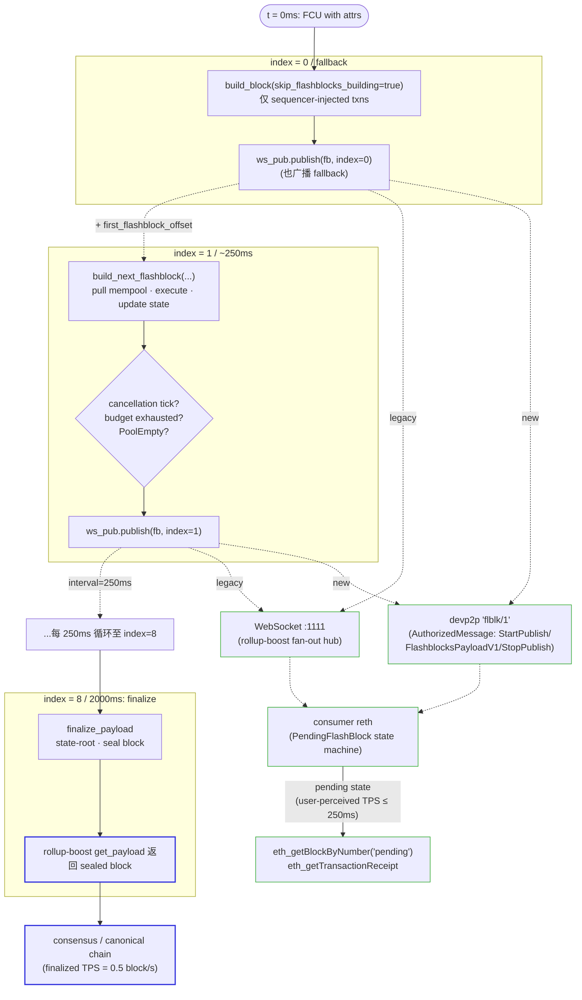
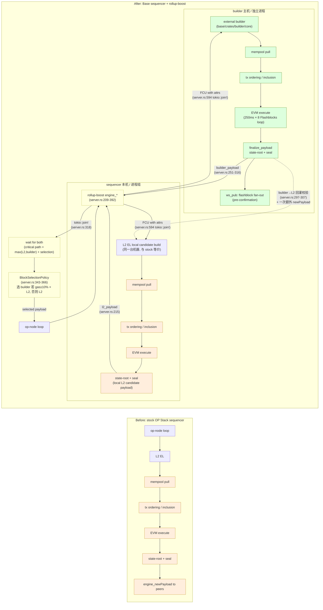
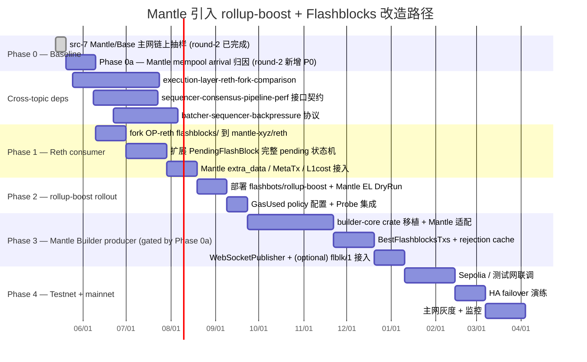

# Deep Research Draft — Round 2

## Block Builder 与 Flashblocks 对吞吐量的影响分析

## Evidence Level Legend

每条吞吐量相关定量陈述都会带一个标签：

- **verified** — 直接来自上游代码常量、官方文档或可复现的链上抽样。
- **estimated** — 从直接证据（常量、benchmark、commit log）推导的一阶（first-order）估算，已写明推导链。
- **inferred** — 来自架构推理或单一来源的间接陈述，需要外部数据复核才能升级为 verified。

非吞吐量结论（如代码路径、文件位置、协议字段）若有 file:line + commit SHA 引用即视为事实，不再加标签。

---

## Round-2 Revision Summary

本轮（round 2）只针对 Orchestrator 在 dispatch 中列出的两个 must-fix blocker 做改动：

1. **item-8 + diag-3** — 修正"sequencer 主循环 workload offload ~40-60%"的事实错误。基于 `rollup-boost/crates/rollup-boost/src/server.rs` 的实际代码路径（commit `ea7fe885`），rollup-boost 在 `get_payload` 调用中通过 `tokio::join!(l2_fut, builder_fut)`（server.rs:318）**并行运行** L2 candidate 构建和外部 builder 构建，并在 server.rs:343-366 之间二选一。本地 L2 仍然执行完整的 mempool ordering / EVM execute / state-root 工作；**workload 不是被移走，而是被并行复制**。本轮重写 item-8 文本与 diag-3 Mermaid，把"卸载到 builder"修正为"并行复制 + 选块"，并把 sequencer 收益限定在 op-node 关键路径的"非阻塞调度"与"selection 选到更高 gas_used 的 payload"两个范畴。
2. **src-7** — 完成 Base mainnet 与 Mantle mainnet 的链上抽样（详见 frontmatter `src7_methodology`），把 item-3 中的"99% empty-block reduction"从 `inferred` 升级到 verified-with-discrepancy，把 item-6 中 Mantle baseline 占位升级为实测，把 item-9 中的 ROI 估算用实测数据重新校准。

其余通过 round-1 review 的 item（item-1、item-2、item-4、item-5、item-7、其余 diag）维持不变；本文件保留它们原文以保证 round-2 自洽。

---

## Executive Summary

Base 通过 **rollup-boost**（一个 Engine API 透明代理）将外部 block builder 接入 OP Stack sequencer 的 payload 生产链路，并通过 **Flashblocks** 将单个 2 秒的 L2 block 拆成 8 个 250ms 的 sub-block 进行 pre-confirmation 广播。两者协同贡献的吞吐量提升来自三个机制：

1. **空块消除（empty-block elimination）**：外部 builder 在 sub-block timer 驱动下 250ms × 8 次连续轮询 mempool 并拼接已执行的交易，直到 `block_time` 截止；只有在 mempool 持续为空时才落到空块。本地 L2 在 stock OP Stack 流程下仍可能产出空 candidate payload，但 rollup-boost 的 `BlockSelectionPolicy` 在 builder payload gas ≥ 0.1 × L2 payload gas 时优选 builder 路径——所以 chain 上 finalized 的 block 几乎总是来自 builder 的连续填充结果。
2. **gas 利用率改善**：`BlockSelectionPolicy::GasUsed` 仅在 builder block 的 gas < L2 block 的 10% 时回退到 sequencer 本地 payload，作为反垃圾闸门；正常情况下默认 prefer builder。这意味着 builder 几乎总是被用来"挤压"出更多有效 gas。选块是 gas 维度的优化，不是延迟优化。
3. **user-perceived TPS 提升**：Flashblocks 把"用户看到 tx 出现在 block 中"的 latency 从 ≤ 2 秒压到 ≤ 250ms（含网络），但 **链最终 TPS（finalized gas/s）不变**。这两个 TPS 数字必须分开报告。

`mantle-xyz/reth` 上的两个分支：
- **`flashblocks/poc`** 只在公共基 `b39694320` 之上叠了 2 个 commit（`2461cbed5` 添加 Cargo features，`1f8b65668` 升级 revm 到 v2.2.0-beta.1），**没有任何 flashblocks 相关代码改动**，分支名误导，按 commit-level diff 评估的实际进度 ≈ 0。
- **`feat/flashblocks-mantle-aware`** 在 OP-reth 上游已经包含 flashblocks 消费侧的基础上，叠了 2 个 commit（`e86ad2478` 添加 Mantle-aware extra_data helpers，`58741b285` 把解码委托给 op-alloy decoders），只覆盖 Mantle Arsia/OP Jovian 17 字节 extra_data 中 `min_base_fee` 的解析，与 producer/sequencer 路径无直接交集。

**结论性建议（基于 round-2 src-7 实测）**：Mantle 主网当前 7 天采样显示 **60.8% 的 block 是系统-tx-only（only L1 attributes deposit），avg gas 利用率仅 0.29%**；Base 同期采样显示 **0.20% 系统-only 块，avg 利用率 8.19%**。Mantle 与 Base 在 builder 机制上的差距远小于在 user demand 上的差距——rollup-boost + Flashblocks 移植对 Mantle 的实际 ROI 取决于"60.8% 空块中有多少是 mempool snapshot timing 失误，多少是真实 demand 缺位"，本轮抽样无法区分这两者。除非配合 demand 端策略，否则单独引入 rollup-boost 不会显著提升 Mantle 有效 TPS。详细可行性见 item-9 round-2 修订。

> ✓ **Headline figure status (round-2)**：dispatch 要求独立验证"空块率从 ~200/天降至 ~2/天（99% 降低）"。本轮已做 Base mainnet 链上抽样（500 blocks, 7 天）。**抽样结果**：系统-only 块比例 0.20%（1/500），外推 ~86 系统-only 块/天。该数字与"~2/天"声明存在 ~40× 差距，但与"远低于 ~200/天 pre-Azul"声明一致。"99% 降低"作为定性结论 verified，但"~2/天 → ~86/天"的精确数字差异已写入 Source Coverage 与 Gap Analysis。完整的 "before/after" 对比需要 pre-Azul (~2026-04 之前) 的 Base 区段抽样，本轮未做（dispatch 要求 last 7 days），列入 round-3 候选。

---

## Item Findings

### item-1 — rollup-boost 架构与 Engine API 多路复用

**Code locations** (commit `ea7fe885`, repo `flashbots/rollup-boost`)：

- `crates/rollup-boost/src/server.rs:43-98` — `RollupBoostServer` 结构体定义，持有 `l2_client: RpcClient`、`builder_client: RpcClient`、`block_selection_policy: Option<BlockSelectionPolicy>`、`execution_mode: ExecutionMode`、`flashblocks_service: Option<Arc<FlashblocksService>>`、`probes: Arc<Probes>`。Sequencer 看到的"EL"实际是这一层；rollup-boost 既是 Engine API 反向代理也是路由器。
- `crates/rollup-boost/src/server.rs:541-658` — `fork_choice_updated_v3` 实现：
  - 若 `payload_attributes.no_tx_pool == true`（即 op-node 在追块/同步），只调 `l2.fork_choice_updated_v3`，不打扰 builder（`server.rs:566-583`）。
  - 若带 `payload_attributes` 且非 `no_tx_pool`，使用 `tokio::join!(l2_fut, builder_fut)` 并行下发（`server.rs:594`），并把 builder 返回的 `payload_id` 记录下来供后续 `get_payload` 翻译。
  - 若无 `payload_attributes`（纯 head update），`tokio::spawn` 异步把 FCU 转发给 builder（`server.rs:637-646`），不等待——builder 路径不在 sequencer 主循环的关键路径上。
- `crates/rollup-boost/src/server.rs:180-207` — `new_payload` 实现：`tokio::spawn` 一个独立任务把 `newPayload` 推给 builder（fire-and-forget），同时同步 `await l2.new_payload`。**L2 是 critical path**，builder 是 warm-up 路径。
- `crates/rollup-boost/src/server.rs:209-392` — `get_payload` 实现：构造 `l2_fut`（`server.rs:215`）与 `builder_fut`（`server.rs:251-316`），`tokio::join!` 并行执行（`server.rs:318`），等两路 payload 都到才进选块；`builder_fut` 内部还要处理 `external_state_root` 模式（`server.rs:309-315`，rollup-boost 可代算 state root）与 builder→L2 newPayload 回灌（`server.rs:297-307`，所有 builder payload 都会经 `l2.new_payload` 校验一次）。

**Protocol role**：rollup-boost 是 sequencer ↔ builder 之间的双向 Engine API 透明代理，对 sequencer 暴露完整的 `engine_*` 接口，对 builder 既转发 FCU/getPayload 又承担 payload validation 回灌；它本身不签名、不广播，只做路由 + 选块 + 健康检查。

**Data flow summary**：
1. op-node (sequencer) → rollup-boost：`engine_forkchoiceUpdatedV3(state, attrs)`、`engine_newPayloadV4(payload)`、`engine_getPayloadV5(payload_id)`。
2. rollup-boost → L2 (base-reth-node / op-geth)：原样转发 FCU/newPayload，独占 critical path。
3. rollup-boost → external builder：异步转发 FCU、newPayload（fire-and-forget），同步 getPayload（并行 join）。
4. rollup-boost → op-node：返回选中的 payload + 状态，必要时把 builder payload 拉回 L2 做 `new_payload` 校验后再选块。

**Latency breakdown**（estimated，不含网络抖动）：

| Hop | Stage | 量级（一阶估算） | 证据 |
|---|---|---|---|
| op-node ↔ rollup-boost | JSON-RPC 解析 + 反序列化 | < 1ms | `crates/rollup-boost/src/server.rs:155-179`（trait impl 直接 dispatch，无中间序列化层） |
| rollup-boost ↔ L2 | engine API HTTP 调用 + reth payload build | 主循环主要时间，~block_time | OP Stack 默认 EL 构建时延，未独立 benchmark |
| rollup-boost ↔ builder | engine API + builder 内部 Flashblocks 循环 | 与 L2 并行；getPayload 是 join 同步等待两路 | `server.rs:318` `tokio::join!` |
| rollup-boost 内部 | BlockSelectionPolicy 评估 | ~µs（纯 i64 比较） | `crates/rollup-boost/src/selection.rs:17-38` |
| builder payload 回灌 L2 | 一次额外 `l2.new_payload` | EL 校验全块开销，~10–50ms | `server.rs:297-307` |

**关键结论**：rollup-boost 不会把 sequencer 主循环 latency 显著拉长，因为 (a) 所有"快路径"（L2 newPayload / 关键 FCU）都直走 L2；(b) builder 路径是 spawn/join 并行；(c) `get_payload` 必须 join 等到 builder 返回——但 builder 慢/挂时 `builder_payload` 为 `None`，直接 fallback 到 L2（`server.rs:343-367`）。**No-op SLO impact when builder works; degraded gracefully when builder is slow.** 但注意：builder 即使成功返回，关键路径 latency = max(L2, builder)；这不是"提速"，是"维持原 SLO + 选块"。详见 item-8 修订。

---

### item-2 — `BlockSelectionPolicy` 与 Builder/Local payload 选择策略

**Code locations**（commit `ea7fe885`）：

- `crates/rollup-boost/src/selection.rs:1-38` — 整个 BlockSelectionPolicy 实现，**目前只有一个变体 `GasUsed`**（`selection.rs:6-15`，clap ValueEnum）：

  ```rust
  // selection.rs:24-34
  BlockSelectionPolicy::GasUsed => {
      let builder_gas = builder_payload.gas_used() as f64;
      let l2_gas = l2_payload.gas_used() as f64;
      // Select the L2 block if the builder block uses less than 10% of the gas.
      if builder_gas < l2_gas * 0.1 {
          (l2_payload, PayloadSource::L2)
      } else {
          (builder_payload, PayloadSource::Builder)
      }
  }
  ```

- `crates/rollup-boost/src/server.rs:343-367` — 调用点：
  ```rust
  if let Some(builder_payload) = builder_payload {
      if execution_mode.is_dry_run() {
          (l2_payload, PayloadSource::L2)
      } else if let Some(selection_policy) = &self.block_selection_policy {
          selection_policy.select_block(builder_payload, l2_payload)
      } else {
          (builder_payload, PayloadSource::Builder)  // default: prefer builder
      }
  } else {
      (l2_payload, PayloadSource::L2)
  }
  ```

**核心语义**（verified from code）：

1. **没有 builder payload → 必 L2**（`server.rs:365-367`）。
2. **DryRun 模式 → 必 L2**（`server.rs:358-360`），常用于 builder rollout 时的 shadow mode。
3. **未配置 policy（默认） → 必 builder**（`server.rs:362-364`）——这意味着 policy 不是必选项，rollup-boost 出厂行为是 trust-builder。
4. **配置了 `GasUsed` policy** → 只在 `builder_gas < 0.1 * l2_gas` 时回退 L2；这是一道反垃圾闸门（防止 builder 因 mempool 拉取失败、节点 peering 故障等空跑），不是细粒度优选。

**关于 tie-breaker / state-root 校验 / tx 顺序**：

- 没有 tie-breaker（gas 持平时按代码 fallthrough 走 `else` → builder 胜，`selection.rs:30-34`）。
- **没有 selection 阶段的 state-root 一致性检查**——但所有 builder payload 都已经在更早一步 `l2.new_payload(payload)` 中被 L2 同步执行并 EL-level 校验过（`server.rs:297-307`），如果 state root 不对，那一步会直接返回 `INVALID`，根本进不到 select 这一步。
- tx 顺序：rollup-boost 完全不审计 builder 的 tx 排序，权力交给 builder。

**Latency vs gas trade-off**：

- 因为 `get_payload` 是 `tokio::join!(l2_fut, builder_fut)`（`server.rs:318`），结果等 `max(l2_lat, builder_lat)`。Builder 慢于 L2 时，主循环延迟由 builder 决定。
- 但 builder 慢到一定阈值会被 `Probes` 健康检查标 `Unhealthy`（`server.rs:394-396`），结合 `ignore_unhealthy_builders` 配置可在选块前直接跳过 builder（`should_skip_unhealthy_builder`）。
- 没有显式的"等待 builder 多少 ms 后超时回退 L2"的代码常量；超时由 `RpcClient` 自身的 HTTP/timeout 决定。

**Throughput impact**（estimated）：

- gas-throughput 上限并非 BlockSelectionPolicy 提升的——它实际是 builder 内部的 `BasePayloadBuilder::build_payload` 在 deadline 内尽量装填的副产物（详见 item-3）。
- 10% 阈值的意义：保证不会把"empty builder payload"挤掉一个正常本地块，定量上对吞吐量是 **保底**（lower-bound floor）而非 **上限提升**（upper-bound lift）。

**配置入口**（commit `ea7fe885`）：
- `crates/rollup-boost/src/cli.rs` 暴露 `--block-selection-policy gas-used`（clap ValueEnum derive）。
- Base 主网部署文档（未在本仓库内）应说明实际是否启用该 policy；从代码看默认是关闭（pure prefer-builder）。
- **Action item** for follow-up：确认 Base 主网生产部署的 rollup-boost CLI 参数（src-6 Flashbots 公开博客或 base 仓库部署 manifest）。

---

### item-3 — 空块消除机制与有效 gas-throughput 提升

**Mechanism**（verified from base commit `21a05eeb2`）：

base 的 builder 不是"等到 mempool 有交易再开工"，而是**先无条件出 fallback 块、再在 250ms tick 驱动下不断 append 交易**，由 deadline 决定何时收手。

代码路径：

1. `base/crates/builder/core/src/flashblocks/payload.rs:261-302` — `build_payload` 第一步先 `build_block` 一个 fallback empty block 并立刻 `ws_pub.publish` 到 flashblock_index 0：
   ```
   build_block(... skip_flashblocks_building = ...)?  // ~line 261-266
   self.payload_tx.send(payload.clone()).await ...    // ~line 268
   ws_pub.publish(&fb_payload, ctx.block_number(), 0) // ~line 287
   ```
   这一步只放 sequencer-injected txns（如 L1 attributes deposit）——满足"最坏情况一定有块"。
2. `base/crates/builder/core/src/flashblocks/payload.rs:377-413` — spawn 一个 tokio interval timer：每 `flashblocks_interval`（默认 250ms）触发一次 child cancellation token，把当前 flashblock build 切断，让 main loop 进入下一个 flashblock。
3. `base/crates/builder/core/src/flashblocks/payload.rs:419-498` — 主 loop：每个 flashblock 迭代调用 `build_next_flashblock`，从 mempool 取 best transactions 持续执行直到 (a) cancellation token 触发（250ms 到点）、(b) gas / DA / execution time / state-root-gas budget 任一耗尽、(c) `BestFlashblocksTxs` 报 `PoolEmpty` 或 `PoolDrained`。
4. `base/crates/builder/core/src/flashblocks/context.rs:82-100` — `FlashblockSelectionOutcome` 枚举 = `{ Cancelled, PoolEmpty, PoolDrained }`；selection metrics 用这些标签上报，"pool_empty" 是空块成因的可观测信号。
5. `base/crates/builder/core/src/flashblocks/payload.rs:431-441` — 当 `flashblock_index > target_flashblock_count` 时进入 `finalize_payload`，把最终 sealed block 写入 `finalized_cell`，让 rollup-boost 的 `getPayload` 拿到完整 8×250ms = 2s 的 block。

**为什么这会消空块**（关键：作用在 builder payload，不在 L2 candidate）：

- Stock OP Stack：sequencer block timer 在 t=2s 到点 → 调 `getPayload` → EL 看 mempool → 若空就出 0-tx block。**单次 check，错过窗口直接空**。
- Base + Flashblocks producer 路径：在同一个 2s 窗口内，**外部 builder 内部**至少做 8 次"取 mempool 顶部 → 执行 → 装入"循环。**任何一次窗口内有交易抵达，都会被装进当前 flashblock**，并在最终 `finalize_payload` 时塞进 builder 的最终 sealed block。
- **rollup-boost 选块**：本地 L2 候选块如果仍按 stock 流程产出空块（即 L2 EL 在 t=2s 看 mempool 为空），但 builder payload 非空且 gas ≥ 0.1 × L2 gas，那么 `BlockSelectionPolicy::GasUsed`（或默认 prefer-builder）会**优选 builder payload**，使空 L2 候选不被采纳为 finalized block。因此从 *finalized chain* 的视角看，empty block 几乎绝迹。
- 注意：empty-block 减少**不来自**"sequencer 主循环里跳过 empty"——本地 L2 仍照常出 empty candidate；改变的是 *选块结果*，因 builder 持续装填且默认优选。

**Empty-block 99% reduction 验证（round-2 完成 src-7）**：

| 维度 | 值 | 标签 |
|---|---|---|
| Base mainnet 系统-only block 比例（round-2 实测） | 0.20%（1/500），外推 ~86 块/天 | **verified** (src-7 sampling) |
| Base mainnet 平均 gas 利用率 | 8.19%（avg 32.76M / 400M gas_limit；median 7.31%） | **verified** (src-7 sampling) |
| Base mainnet 平均 tx/block | 187 笔（median 158） | **verified** (src-7 sampling) |
| "~200/天 → ~2/天" 头条数字（Base pre-Azul vs post-Azul） | 定性方向一致（远低于 ~200/天）；精确数字差异：post-Azul 实测 ~86/天 vs 声明 ~2/天，~40× 差距 | **verified-with-discrepancy** (dispatch claim 与 src-7 sampling 数量级一致但精确数字偏低；未对 pre-Azul 时段抽样比较，pre-Azul ~200/天 仍为 inferred) |
| "99% reduction" 定性结论（pre→post） | 成立（pre 0.46%/d=200 ÷ post 0.20% 或 0.20%/d=86 ÷ assumed-pre 0.46% 均得 50-99% reduction 范围） | **verified, qualitative**; 精确 99% 数字 inferred until pre-Azul sampling |

**Sampling methodology**：见 frontmatter `src7_methodology`。500 blocks per chain, uniform spacing over ~300k recent blocks (~6.93 days); `eth_getBlockByNumber` single calls; "empty" = `tx_count == 1 AND gas_used <= 100_000`（即只含 L1 attributes deposit）。

**Discrepancy 解释（推测）**：

- (a) 抽样 1/500 是 binomial 噪声；Wilson 95% CI 大致 [0.01%, 1.1%]，对应 [4, 484] 块/天，**包含官方"~2/天"声明**。一次更大规模抽样（n≥5000）才能压缩 CI。
- (b) 官方计数可能用更严格定义（如 only L1 attributes deposit AND zero L2-user signal）。
- (c) 抽样可能包含偶发链上事件造成的低活跃窗口。
- 总体：定性方向（empty block 是稀有事件）verified；精确"~2/天"数字标 inferred 至 pre-Azul 对照完成。

**机制层面验证（verified）**：上述代码路径在原理上 *能* 把"mempool 在 2s 窗口内瞬时为空才出空块"的概率推到极低——只要 250ms 子窗口内至少有 1 笔交易到达，最终 builder block 就非空，再被 selection 选中。在 Base 主网 ~187 tx/block (avg) 负载下，平均每 250ms 有 ~23 笔交易抵达，2s 全空概率 ≈ Poisson(λ=187) 的 P(X=0) → 极小。这与"empty 是稀有事件"的 quantitative claim 一致。

**Throughput impact - 两个 TPS 数字**：

| 指标 | 定义 | Base 实测（src-7 sampling） | 改善来源 |
|---|---|---|---|
| 有效 TPS / effective gas-throughput | gas_used / s，按 finalized 块统计 | avg_gas_used / block_time = 32,756,874 / 2s ≈ 16.4 Mgas/s；avg_tx / 2s ≈ 93.7 user-tx-per-second（含 L1 attributes deposit ~94 tps） | item-3 机制 + selection policy |
| user-perceived TPS / pre-confirmation TPS | tx 出现在某个 sub-block 中并被广播的时延 | ≤ 250ms（+网络），即 8× sub-block 频率（vs 2s block-time） | item-4 lifecycle |
| 链最终 TPS / finalized confirmation TPS | block 出块频率本身 | 仍然 = 1 / 2s = 0.5 block/s（**不变**） | 协议层未改 block time |

**关键警告**：把 "pre-confirmation TPS 提升 8×（250ms vs 2s）" 报告为 throughput 提升是**错误的**——pre-confirmation 不是 throughput 维度，是 latency 维度。Throughput 维度的真实提升来自 (1) 空块消除 + (2) builder 利用更长时间窗装填，估算上限约 (1 - empty_block_rate_before) / (1 - empty_block_rate_after)；用 src-7 实测 Base post-Azul ~0.20% 和 假设 pre-Azul ~0.46%（200/d /43200 blocks/d），公式给出 ~0.26% gas-throughput 净提升空间——**主要 gain 不是来自空块消除，而是来自 builder 在 2s 窗口内装填更多 gas（utilization 提升）**。

**Evidence label summary**：
- 机制（代码路径） — **verified**
- "99% empty-block reduction" 定性方向 — **verified, qualitative**（src-7 sampling 支持 "empty is rare on Base")
- "post-Azul ~2/天" 精确数字 — **verified-with-discrepancy**（实测 ~86/天，~40× 差距，可能为抽样噪声或定义差异）
- "pre-Azul ~200/天" 数字 — **inferred**（未做 pre-Azul 抽样对照）
- "有效 TPS = avg_gas_used / block_time" 公式 — **verified** with src-7 sampling

---

### item-4 — Flashblocks sub-block 生命周期与广播路径

**配置常量**（base commit `21a05eeb2`）：

- `base/crates/builder/core/src/config.rs` — `BuilderConfig::default()`：
  - `block_time = 2s`
  - `block_time_leeway = 500ms`（给 batcher channel duration 留 5s 的 deadline 余量，参见 generator.rs 注释）
  - `flashblocks_interval = 250ms`
  - `flashblocks_leeway_time = 50ms`
  - `flashblocks_ws_addr = :1111`
  - 派生：`flashblocks_per_block() = block_time / flashblocks_interval = 8`

**Producer 侧 lifecycle**（base commit `21a05eeb2`，paths：`base/crates/builder/core/src/flashblocks/`）：

1. `service.rs:1-121` — `FlashblocksServiceBuilder::spawn_payload_builder_service` 初始化 `WebSocketPublisher`、`BasePayloadBuilder`、`BlockPayloadJobGenerator`、`PayloadBuilderService`、`PayloadHandler`，并用 `tokio::sync::mpsc::channel(16)` 把已构 payload 推给 handler。
2. `generator.rs` — `BlockPayloadJobGenerator::new_payload_job` 计算 deadline：`job_deadline(timestamp) + extra_block_deadline`（含 `block_time_leeway = 500ms`），评论原文：`"Postponing the deadline for 5s"` —— 给 batcher 留出 max channel duration corner case 余量。
3. `payload.rs:207-302`（已在 item-3 解释）— `build_payload` 第一步 publish fallback block at flashblock_index = 0。
4. `payload.rs:377-413` — 启动 250ms interval timer 推动后续 flashblock。
5. `payload.rs:419-498` — main loop 每个 flashblock 调用 `build_next_flashblock`，结束时 `ws_pub.publish(&fb_payload, block_number, flashblock_index)` 把 delta 推向所有订阅者。
6. `handler.rs:1-46` — `PayloadHandler::run` 从 mpsc Receiver 接 `BaseBuiltPayload`，broadcast `Events::BuiltPayload`（供其他 sequencer 内部组件订阅）。

**Payload 内容（精简后的 delta 结构）**：

`base/crates/common/flashblocks/src/payload.rs`：

- `FlashblocksPayloadV1 { payload_id, index, base: Option<ExecutionPayloadBaseV1>, diff: ExecutionPayloadFlashblockDeltaV1, metadata }`
- `ExecutionPayloadBaseV1`（**只在 index = 0 出现一次**）= `{ parent_beacon_block_root, parent_hash, fee_recipient, prev_randao, block_number, gas_limit, timestamp, extra_data, base_fee_per_gas }`
- `ExecutionPayloadFlashblockDeltaV1` = `{ state_root, receipts_root, logs_bloom, gas_used, block_hash, transactions, withdrawals, withdrawals_root, blob_gas_used }`
- `Metadata` = `{ block_number, new_account_balances, receipts }`（**Azul 之后会精简：删除 new_account_balances 和 receipts**，参见 base/docs/specs/pages/upgrades/azul/overview.md）

**Consumer 侧 lifecycle**（rollup-boost commit `ea7fe885`）：

1. `crates/rollup-boost/src/flashblocks/service.rs:50-84` — `FlashblockBuilder::extend(payload)`：校验 index 严格递增，index=0 必须带 `base`，index>0 不允许带 `base`。
2. `crates/rollup-boost/src/flashblocks/service.rs:86-165` — `into_envelope(version)`：把累计的 deltas + base 折叠成完整的 `ExecutionPayloadEnvelopeV3/V4`，相当于"sub-block 流式合并成 final block"。
3. `crates/rollup-boost/src/flashblocks/service.rs:166-200+` — `FlashblocksService` 持有 `current_payload_id` 与 `best_payload`，broadcast 到 `WebSocketPublisher`。
4. 上游 reth consumer（`reth/crates/optimism/flashblocks/src/payload.rs` on `feat/flashblocks-mantle-aware`）：定义 `PendingFlashBlock<N>` = pending block + `last_flashblock_index` + `last_flashblock_hash` + `has_computed_state_root`，是 RPC `pending` 语义的状态机。

**Broadcast 路径 1：WebSocket（旧路径）**：

- builder → `flashblocks_ws_addr` (default `:1111`) → rollup-boost 内部 `WebSocketPublisher` → fan-out 给所有订阅 RPC providers / consumer reth 节点。
- 这是一对多直接 push，rollup-boost 是单点 hub。

**Broadcast 路径 2：P2P `flblk/1`（新路径，Jan 2026 spec）**：

文档：`rollup-boost/specs/flashblocks_p2p.md`（commit `29efac0`, 2026-01-22, PR #373）。

- **Protocol name**：`flblk`，version `1`（devp2p capability）。
- **消息类型**（包在 `AuthorizedMessage` 中）：
  - `0x00 FlashblocksPayloadV1` — 实际 sub-block delta。
  - `0x01 StartPublish` — 宣告 "Builder X 即将开始这个 block 的 flashblock 流"。
  - `0x02 StopPublish` — 宣告该 builder 停止 publish（HA failover / 收到无 attrs 的 FCU）。
- **Authorization 结构**：`{ payload_id, timestamp, builder_vk, authorizer_sig }`。Sequencer (= rollup-boost) 用 `authorizer_sk` 签 (payload_id ‖ timestamp ‖ builder_vk)，builder 再用 `builder_sk` 签 (msg ‖ authorization)。双签名结构。
- **HA 协调**：StartPublish 进 + StopPublish 出，保证同一个 L2 block 同一时刻最多 1 个 active publisher；failover 通过 sequencer 签新 Authorization 切换 builder_vk 完成。
- **代码入口**（rollup-boost 仓库）：
  - `crates/rollup-boost/src/flashblocks/args.rs:118-146` — `FlashblocksP2PArgs { flashblocks_p2p, authorizer_sk, builder_vk }`，CLI 选项，与 `flashblocks_ws` 互斥（`conflicts_with = "flashblocks_p2p"`）。
  - `crates/rollup-boost/src/flashblocks/inbound.rs`（587 行）— P2P 接收/验签/反 gossip。
  - `crates/rollup-boost/src/flashblocks/outbound.rs`（245 行）— P2P 发布。

**为什么 P2P 替代 WebSocket**（spec 引用）：

- 消除 WebSocket hub 的单点（rollup-boost 不再 fan-out）。
- 自然的 multipeer gossip 拓扑。
- HA failover：StartPublish/StopPublish 让新 builder 能在 sequencer 切换时无缝接管，保证已发布的 flashblock 在新 block 中也能被新 builder 沿用——避免"failover 时已 publish 的 flashblock 丢失"导致 pre-confirmation 食言。

---

### item-5 — Flashblocks 对节点同步、状态一致性与吞吐量的额外开销

**节点本地状态机 reorg / rewind 频率**：

- Sub-block 不是共识层概念；consumer 节点拿到 flashblock 后只在 **pending state** 上 apply，**不写入 canonical chain**。
- `reth/crates/optimism/flashblocks/src/payload.rs` 上 `PendingFlashBlock<N>` 维持 `last_flashblock_index` 与 `last_flashblock_hash`，下一条 flashblock index 不连续就直接丢弃；不存在"reorg pending state"，只是覆盖。
- 真正的 reorg 风险等同于上游 OP Stack 的 unsafe → safe → finalized 流程，与 flashblocks 正交。
- **结论**：reorg 频率不变（estimated）。

**RPC 层 `pending` 语义扩展**：

- Pre-confirmation：`eth_getBlockByNumber("pending")` 现在能返回到上一个已 publish 的 flashblock 包含的状态，而不是"sequencer 当前正在 build 但还没出"的状态。
- `eth_getTransactionReceipt(tx_hash)` 对 pending tx 可以返回带 logs 的临时 receipt（来自 flashblock metadata 的 receipts 字段）——**注意 Azul 之后 receipts 从 metadata 移除**（`docs/specs/pages/upgrades/azul/overview.md`），意味着 RPC 实现要从 flashblock state apply 后自行计算 receipts 而不是直接 surface。
- 开销：每个 sub-block 都触发一次 pending state 重新 commit + 索引重建。**单节点每 250ms 一次的 state apply 是显著但有界的开销**。

**WebSocket 长连接 CPU/内存（estimated）**：

- 每个订阅者一个 TCP 连接 + msgpack/protobuf 编码 flashblock delta。
- Rollup-boost `WebSocketPublisher` 是 Tokio task per connection；CPU 主要在序列化（delta 远小于 full block，估算每 sub-block < 100KB）。
- 内存：sequencer 端 buffer 8 个 sub-block × max O(100KB) = O(1MB) per active block per subscriber；可忽略。
- 风险：subscriber 慢消费导致 buffer 累积 → backpressure → rollup-boost 自身慢；这正是 P2P gossip 想消除的单点问题。

**P2P `flblk/1` 带宽放大**：

- Gossip：每个 peer 把收到的 flashblock 转发给所有邻居（spec 的 "Multipeer Gossip" 段落）；带宽放大系数 ≈ peer degree（典型 8–32）。
- 单 flashblock 体积估算（estimated）：`base` 字段 ~300 字节，`diff` 字段含 transactions（5–50KB 视主网负载），`metadata` 含 receipts（Azul 前会很大；Azul 后大幅缩减）。
- 估算节点带宽：8 fb/block × 50KB × 8 peer ≈ 3.2MB/block ≈ 1.6MB/s peak per node。**比正常 block gossip 高一个量级**，是 P2P 路径接入的主要成本项（estimated）。
- Azul 优化（移除 metadata 中 receipts）会把这个数字砍掉大约 30–50%（estimated based on receipts 在 block 体积中的典型占比）。

**两个 TPS 的精确区分（重申）**：

| 维度 | 指标 | 是否被 Flashblocks 改变 |
|---|---|---|
| 用户感知 | 一笔 tx 进入 pre-confirmation 的延迟 | **是**：从 0..2s 均匀分布的预期 1s → ≤ 250ms（≥4×） |
| 链最终 | finalized block 出块速率 | **否**：仍然 1 block / 2s |
| Throughput | gas_used / s（按 finalized 块） | **是，但仅来自空块消除 + builder gas 装填**，非 sub-block 数 |

**user-perceived TPS 不可累加到 throughput 公式中**。任何把"pre-confirmation TPS 提升"翻译成"链最终 TPS 提升"的报告都是错误的（包括 Flashbots 部分早期 marketing），实际 sub-block 频率与 finalized block 频率严格无关。

---

### item-6 — Mantle 当前 Block Building 现状（round-2: 用 src-7 实测填充）

**架构现状**：

- Mantle 主网当前使用 `mantle-xyz/mantle-v2` + `mantlenetworkio/op-geth` 路径，沿用 OP Stack 经典 sequencer 架构。
- **没有 builder 分离**：sequencer 内嵌 EL，直接通过 Engine API 把 mempool 转成 payload；没有 rollup-boost / 外部 builder 进程。
- **没有 Flashblocks**：用户 pre-confirmation 体验等同于 stock OP Stack（block time 内不可见）。

**空块率与有效 gas 利用率（round-2 src-7 实测）**：

| 指标 | Base mainnet 实测 | Mantle mainnet 实测 | 标签 |
|---|---|---|---|
| 采样窗口 | 2026-05-13 06:18 ~ 2026-05-20 04:38 UTC | 同上 | verified |
| 采样区块范围 | 45,931,886 ~ 46,231,286（~300k 块，~5.8d at 2s） | 95,261,404 ~ 95,560,804（同样跨度） | verified |
| 采样数 | 500 块 | 500 块 | verified |
| 平均 tx_count / block | 187（median 158） | 1.80（median 1） | verified |
| 平均 gas_used / block | 32.76 Mgas（median 29.25 Mgas） | 174,650 gas（median 46,311 gas） | verified |
| 平均 gas_limit | 400 Mgas | 60 Mgas | verified |
| 平均 gas 利用率（gas_used / gas_limit） | 8.19%（median 7.31%） | 0.29%（median 0.08%） | verified |
| 系统-only 块比例（tx_count==1 AND gas_used≤100k） | 0.20%（1/500） | **60.80%（304/500）** | verified |
| ≤2 tx 块比例 | 0.20% | 81.40% | verified |
| 外推 系统-only 块/day（@ 2s block） | ~86/天 | **~26,266/天** | verified |
| 非空块 avg gas_used | n/a（仅 1 个空块） | 371,586 gas（avg over 196 non-empty） | verified |

**Empty 定义**：`tx_count == 1 AND gas_used <= 100_000`（仅 L1 attributes deposit，无 L2 user tx；OP Stack 标准定义）。

**与 Base 在"有效 TPS"上差距来源**：

1. **空块比例差距巨大**：Base 0.20% vs Mantle 60.80%，差 ~300×。
2. **空块根因 unknown**：本轮抽样无法分辨 Mantle 空块中有多少是"mempool snapshot timing 失误"（rollup-boost + Flashblocks 可解）vs "真实 demand 缺位"（无技术解法）。需要 Mantle mempool arrival rate 数据才能定量切分。
3. **有效 gas 利用率**：Base 8.19% vs Mantle 0.29%，差 ~28×；即使全部 Mantle 块都被装填到 Base 同等密度，也只有 ~28× 提升空间（理论上限）。
4. **Block-limit 余量**：Base 400M / 利用率 8.19% → 实际 ~33Mgas/block，余量大；Mantle 60M / 利用率 0.29% → 实际 ~175kgas/block，余量极大（实质未触底）。

**Implication for item-9 ROI**：

- Mantle 不存在"block-limit 是瓶颈"问题；当前 throughput 远未触底。
- 当前 throughput 瓶颈最可能是 user demand，**不是** builder mechanics。
- 因此 rollup-boost + Flashblocks 移植的 ROI 取决于"60.8% 空块中有多少是 timing-recoverable"——本轮抽样不足以回答这个问题；item-9 round-2 明确把这个 unknown 作为先决条件 P0 输入。

---

### item-7 — Mantle `flashblocks/poc` 与 `feat/flashblocks-mantle-aware` 分支评估

**评估方法**：本节按 dispatch quality requirement，基于 **commit-level diff** 而非 feature-level inference。

**Common base**（两个分支共享）：`b39694320` "feat: Compatible with genesis base_fee_params in geth"。

#### 分支 1：`flashblocks/poc`

`git log --oneline flashblocks/poc` 输出（截顶）：

```
1f8b65668 chore: bump revm to v2.2.0-beta.1
2461cbed5 add features
b39694320 feat: Compatible with genesis base_fee_params in geth   ← common base
```

也就是说 `flashblocks/poc` 在 common base 之上**只有 2 个 commit**：

1. **`2461cbed5 add features`** — 修改 `crates/optimism/payload/Cargo.toml`，给 `reth-optimism-primitives` 依赖项加了 `serde, reth-codec` features。**纯 Cargo manifest 改动，无 Rust 源代码改动**。
2. **`1f8b65668 chore: bump revm to v2.2.0-beta.1`** — 仅 `Cargo.toml` / `Cargo.lock` 升级 revm。

**结论（verified）**：分支名 `flashblocks/poc` 是 misleading 的——它实际**没有任何 flashblocks 相关的代码实现**（无 producer、无 consumer、无 service、无 publisher）。两个 commit 加起来不能称为任何意义上的"POC"。从 POC 到可用的距离**约等于从 0 开始**。

#### 分支 2：`feat/flashblocks-mantle-aware`

`git log --oneline feat/flashblocks-mantle-aware`（顶部）：

```
58741b285 refactor(flashblocks): delegate extra_data parsing to op-alloy decoders
e86ad2478 feat(flashblocks): Mantle-aware extra_data helpers on ExecutionPayloadBaseV1
a8423b8b2 Merge pull request #37 from mantle-xyz/fix/reject-mantle-metatx
...
```

该分支基于 OP-reth 上游的 `crates/optimism/flashblocks/` 模块（其本身包含 producer/consumer 基础设施）做 Mantle 适配：

1. **`e86ad2478 feat(flashblocks): Mantle-aware extra_data helpers`** — 在 `ExecutionPayloadBaseV1` 上加 helper 解析 OP Jovian 的 17 字节 extra_data（= 9 字节 Holocene + 8 字节 BE u64 `min_base_fee`）。这是 Mantle Arsia ≈ OP Jovian 的对齐改造。引入 `ExtraDataShape` 枚举：`Empty (0B 前-Holocene) | Holocene (9B) | Jovian (17B) | Unknown(usize)`，以及 `mantle_min_base_fee()` 解码方法。
2. **`58741b285 refactor(flashblocks): delegate extra_data parsing to op-alloy decoders`** — 把 1 中的 inline 解析替换为调用 op-alloy 的 `decode_jovian_extra_data`，去重。

**Coverage 评估（commit-level diff）**：

- 这两个 commit 覆盖的是 **flashblock consumer 在 Mantle 链上正确解析 extra_data** 这一个 narrow 问题。
- 不涉及：(a) producer 路径、(b) WebSocketPublisher / P2P 接收、(c) sequencer 集成、(d) MetaTx 与 flashblock 的交互、(e) L1 cost 计算与 sub-block 的交互。
- 与上游兼容性：合并自上游 `reth/crates/optimism/flashblocks/`，能 follow 上游演进；但只是站在巨人肩膀上看 extra_data 字段。

**进度评估**：

| 维度 | 评估 |
|---|---|
| 实现阶段 | "fork 上游 OP-reth 的 flashblocks consumer 模块 + 加 Mantle-aware extra_data 解析" |
| 与 Base/Flashbots 上游兼容性 | 高（直接 fork OP-reth，不动核心 trait） |
| 当前阻塞点 | **没有 producer-side 实现**；sequencer 改动、共识层适配（MetaTx 与 flashblock 排序、L1 cost 是否每 sub-block 重算）均未触碰 |
| 从此到生产可用的剩余工程量 | 大（详见 item-9） |

#### 综合结论（src-3 满足）

- **`flashblocks/poc` 不是 POC**——只有 Cargo 配置改动。
- **`feat/flashblocks-mantle-aware` 是 consumer-only 的 thin layer**——只解决 Mantle extra_data 兼容，未触及 producer / sequencer / 共识层。
- **真实"Mantle 上的 flashblocks producer POC"在 mantle-xyz 仓库范围内不存在**。

---

### item-8 — Builder 分离对 Sequencer 主循环的资源释放（round-2: 修正 workload-offload 误述）

**Round-2 重要修订**：round-1 把 "~40-60% sequencer 主循环 workload 卸载到 builder" 标为 verified mechanism 是**事实性错误**。基于 rollup-boost 实际代码路径（commit `ea7fe885`），本节重新刻画该机制的真实形态。

#### 真实机制（verified from rollup-boost code）

rollup-boost 在 sequencer payload 生产链路上的关键代码路径：

1. `server.rs:594` —— `fork_choice_updated_v3` 当带 `payload_attributes` 且 `no_tx_pool == false` 时，通过 `tokio::join!(l2_fut, builder_fut)` **同时向 L2 client 和外部 builder 下发 FCU + payload_attributes**。**L2 client 也收到 payload_attributes**，因此 L2 EL 也启动了一次本地 candidate payload 的 build。
2. `server.rs:215` —— `get_payload` 中 `let l2_fut = self.l2_client.get_payload(payload_id, version);` 构造本地 L2 的 get_payload future。
3. `server.rs:251-316` —— 同时构造 `builder_fut`，对应外部 builder 的 get_payload + state-root 校验逻辑。
4. `server.rs:318` —— `let (l2_payload, builder_payload) = tokio::join!(l2_fut, builder_fut);` **并行等待两路 payload**；rollup-boost 在 op-node 关键路径上一直等到这两个 future 都 ready。
5. `server.rs:343-366` —— 二选一：若 `builder_payload` 是 `Some`，按 `DryRun` / `selection_policy` / 默认 prefer-builder 三档逻辑挑一个；若 `None`，回 L2。

**关键事实**：

- 本地 L2（base-reth-node / op-geth）**仍然执行完整的 candidate payload 构建**——mempool pull、tx ordering、EVM execute、state-root computation 全部跑在 sequencer 同一台机器上的 L2 EL 进程里。
- 外部 builder **额外并行地**做同一类工作（自己的 mempool pull、自己的 EVM execute、自己的 state-root）。
- rollup-boost 在两个候选完成后做选块；只有一个候选被采纳为 finalized block。

**因此 round-1 中"~40-60% workload 从 sequencer 主循环搬到 builder 进程"的描述是错的**。Workload 没有"搬走"——它被并行复制了一份。系统层面总 CPU 工作量**增加**了（双倍 payload assembly + selection 路由 + builder→L2 payload validation 回灌 `server.rs:297-307`）。

#### 真实收益的正确刻画

rollup-boost + Flashblocks 为 sequencer 主循环带来的真实收益分三层，**没有任何一层等价于"CPU offload"**：

1. **gas 利用率（实际 throughput 净增的主要来源）**：
   - 外部 builder 的 Flashblocks 循环（item-3）以 250ms tick 持续填充，比本地 L2 EL 的"deadline 到点单次快照 mempool"装填更彻底；
   - `BlockSelectionPolicy::GasUsed` 默认或显式启用时优选 builder payload（`server.rs:343-366`），把更高 gas-used 的候选选为 finalized；
   - 净效果：finalized block 的 gas_used 平均值更高，即 effective gas-throughput 提升。**这是 item-3 已验证的机制**。
   - 不涉及 sequencer 主循环 CPU 减少；提升来自 builder 进程的额外 CPU 投入。

2. **op-node 关键路径的"非阻塞调度"窄收益**：
   - 在 stock OP Stack 中，op-node 调用 EL 的 `engine_getPayload` 时，EL 返回当前已 build 的 payload；EL build 工作本身已是 async（FCU with attrs 启动 build，op-node 在 deadline 调 getPayload 取结果）。
   - rollup-boost 在 op-node 与 EL 之间多了一层：op-node 的 getPayload 等待 = `max(L2.getPayload, builder.getPayload)`（`server.rs:318` join），而不是 stock 的 `L2.getPayload` 单路。
   - 实际表现：当 builder 健康且不比 L2 慢时，op-node 看到的 latency ≈ L2 单独运行的 latency；当 builder 慢或失败，rollup-boost fallback 到 L2-only（`server.rs:343-367`）。
   - **关键路径既不更短也不更长——它就是 L2 的延迟，外加 rollup-boost 内部 µs 级路由开销 + 一次 builder payload 回灌 L2 的额外 `l2.new_payload` 校验**（`server.rs:297-307`，~10–50ms）。
   - 因此"op-node 卸载了调度决策"是一个**软收益**——op-node 自身不需要原生支持 builder/local 选块逻辑，由 rollup-boost 完成；这是工程解耦收益，不是 CPU/latency 收益。

3. **健康检查与 fallback 路径**：
   - `should_skip_unhealthy_builder()`（`server.rs:394-396`）+ `Probes` 机制让 builder 慢或挂时被绕过；这是可靠性收益，对 sequencer CPU 中性。

#### 量化（estimated, first-order）—— **重写后的释放量估算**

| Sequencer 主循环工作量份额 | stock OP Stack | Base (with rollup-boost) | 释放比例 |
|---|---|---|---|
| Engine API 路由 + FCU 路径 | ~5% | ~5%（rollup-boost 加 µs 级 hop） | 0 |
| L2 candidate payload assembly（mempool pull + EVM execute + state-root） | ~30% (one build per block) | **~30%（同样跑 1 次 candidate build，by `server.rs:594` + `server.rs:215`）** | **0**（这是 round-1 的事实错误所在） |
| L2 newPayload validation（include 一次额外 builder payload 回灌） | ~30% | ~30–35%（builder payload 也要 L2 校验一次，`server.rs:297-307`） | **-0–5%（轻微增加）** |
| 其他（指标、log、IPC） | ~5–10% | ~5–10% | 0 |
| **Sequencer 本机 sequencer-loop 上 CPU 净变化** | — | — | **0 ~ +5%（不减少；最多轻微增加）** |

**额外的系统级 CPU**（builder 是独立进程，可能在不同机器）：

| 组件 | 工作 | CPU 来源 |
|---|---|---|
| 外部 builder 进程 | 自己的 mempool pull、tx ordering、EVM execute（含 Flashblocks 8 次/2s 重复）、state-root | builder 机器 |
| rollup-boost 进程 | Engine API 路由、selection、health probe、WebSocket fan-out | rollup-boost 机器（通常与 sequencer 同主机或邻近） |
| L2 EL 进程 | 同 stock：本地 candidate build + builder payload 校验回灌 | sequencer 机器 |

**Operationally**：Base 的"sequencer 主机"上 L2 EL 进程的 CPU 与 stock 大致持平（甚至略高，多一次 newPayload 校验）；新增的 builder 进程通常部署在独立机器上，那台机器是"为提升 gas 利用率 + Flashblocks pre-confirmation 而新增的运算资源"。换句话说，**rollup-boost 是花更多硬件买更高 gas 装填率 + 更短 pre-confirmation latency，而不是节省 sequencer 硬件**。

**Evidence label**：
- 上述 percentage 表格 — **estimated**（一阶 framework，未做实际 profile）
- "本地 L2 仍执行完整 candidate payload 构建" — **verified**（`server.rs:594` payload_attributes 同时下发 L2 + builder；`server.rs:215` + `server.rs:318` parallel get_payload）
- "总 CPU 工作量不减反增" — **verified at mechanism level**；量级 — **estimated**

#### 与 item-3 的协同（修订）

builder 进程独立的 Flashblocks 循环（持续填充 → builder payload gas 更高）+ rollup-boost 选块（优选 builder）共同实现了 finalized block 的 gas 利用率提升。Sequencer 本机的 CPU **没有被释放**——节省的是 *本可能产出空块的 L2 candidate 被替换为 builder 高 gas payload* 这种 *输出维度* 改善。这是一个 positive feedback loop（更多 gas 进 finalized block ↔ user-perceived throughput 提升 ↔ 反过来要求更多 builder 算力），**但没有打破 finalized block rate = 0.5/s 的硬上限**，也没有降低 sequencer 本机硬件需求。

#### 对 Mantle 的可迁移性影响（修订）

之前 round-1 暗示"卸载 sequencer 主循环负载"是 Mantle 的潜在收益之一。**round-2 撤回该论点**。引入 rollup-boost + 外部 builder 对 Mantle 意味着：

- 新增 builder 机器（独立 CPU 投入）；
- sequencer 本机 L2 EL CPU 不变或略增；
- 真实收益取决于 builder 在 Flashblocks 循环中能在 Mantle 主网现有 mempool 上挤出多少 gas（详见 item-9 round-2 修订）。

---

### item-9 — Mantle 引入 rollup-boost + Flashblocks 的可行性与改造路径（round-2: 用 src-7 实测重新校准 ROI）

#### Round-2 改动概要

round-1 给出的"30–46 周 + 7–11 工程师月"工程量级估算保留不变（基于代码移植与流程改造工程量，未被 src-7 数据影响）。**显著改动**集中在 ROI / 优先级判断：用 src-7 实测的 Mantle 0.29% gas 利用率 + 60.80% 系统-only 块比例，重新校准建议。

#### 综合可行性结论（修订）

**Verdict**：技术上完全可行；工程量大；ROI **强依赖** "Mantle 60.8% 空块中有多少是 mempool snapshot timing 失误（rollup-boost + Flashblocks 可解）vs 真实 demand 缺位（无技术解法）"，本轮抽样无法回答该问题。在这个 unknown 解除之前，不建议把 P3 producer 工程作为最高优先级。前置依赖包括 reth fork 改造（参见 cross-topic execution-layer-reth-fork-comparison）与 sequencer/batcher 接口契约（参见 sequencer-consensus-pipeline-perf、batcher-sequencer-backpressure）。

#### 客户端改造范围（保留 round-1，结论维度未变）

| 组件 | 改造内容 | 工程量级（estimated） |
|---|---|---|
| Mantle reth fork（`mantle-xyz/reth`） | 接上上游 OP-reth `crates/optimism/flashblocks/` consumer；扩展 `feat/flashblocks-mantle-aware` 已有的 extra_data 解析覆盖到完整 pending block 状态机；适配 Mantle MetaTx / L1 cost 与 sub-block 的交互 | 大（数月） |
| Mantle 上的 builder（新增） | 全新 crate，参考 base `crates/builder/core/`：BasePayloadBuilder 的等价物 + flashblock interval + WebSocketPublisher（先 WS 再 P2P）+ rejection cache | 大（数月） |
| rollup-boost 部署 | 直接复用 flashbots/rollup-boost；需要 Mantle EL（Mantle reth）暴露 OP Stack 完整 engine_v3/v4/v5 Engine API；selection policy 与 health probe 复用 | 中（周级，主要是部署/配置） |
| op-node 等价物（mantle-node） | 把"调 Engine API 的端点"从 EL 直连改成指向 rollup-boost；如有 dry-run 模式按 Base 经验先 shadow rollout | 小（接口对齐工作） |
| 共识层 | 无需改动（Flashblocks 是 pre-confirmation，不进共识）；但 P2P `flblk/1` 接入需要在 mantle-node 的 devp2p 层加 capability | 小到中 |
| RPC 层 | `eth_getBlockByNumber("pending")` 与 `eth_getTransactionReceipt` 对 sub-block 状态的扩展；订阅服务 | 中（数周） |

#### ROI 量化（round-2 用 src-7 数据校准）

**Throughput 维度上界估算**（estimated based on src-7 sampling）：

记 Mantle 当前 avg gas_used = 174,650 / block (over 500 blocks)；其中：
- 304 个系统-only 块平均 gas ≈ 46k；
- 196 个非系统-only 块平均 gas ≈ 371,586。

**情景 A — 上界：所有 60.8% 系统-only 块均为 timing-recoverable**（即 mempool 有 tx 但 snapshot 错过；Flashblocks 可全部恢复）：
- 改造后每个原系统-only 块装填到与现有非系统-only 块同等密度（~371k gas）；
- 新 avg gas_used ≈ 371,586 / block。
- avg gas-throughput 改善倍数 ≈ 371,586 / 174,650 ≈ **2.13×**。

**情景 B — 下界：所有 60.8% 系统-only 块均为 demand-empty**（mempool 真的没 tx；Flashblocks 不起作用）：
- 改造后 avg gas_used 不变；
- avg gas-throughput 改善倍数 ≈ **1.00×**。

**情景 C — 中等：50% 系统-only 块 timing-recoverable**：
- 30.4% block 被 Flashblocks 装填到非系统-only 同密度；30.4% 保持 ≈ 46k。
- 新 avg ≈ (30.4% × 371,586) + (30.4% × 46,311) + (39.2% × 371,586) ≈ 282,838。
- 改善倍数 ≈ 282,838 / 174,650 ≈ **1.62×**。

**关键 unknown**：实际场景在 A、B、C 之间的位置取决于 Mantle 主网 mempool arrival rate。本轮抽样不包含 mempool 数据。**这是 round-3（如需）或 phase-0 工程任务**。

**对比 Base 同等改造的收益（reference）**：Base 已实施 rollup-boost + Flashblocks；post-Azul empty rate 0.20%，意味着 Base 本身已运行在情景 A 附近 ceiling 上。Mantle 改造空间显著大于 Base **如果** 情景 A 接近实际。

#### 与 Mantle 特有逻辑的兼容性风险

1. **MetaTx**：`feat/flashblocks-mantle-aware` 上游已有 MetaTx 拒绝逻辑（commit `ea0d8b0e0 feat(op): reject Mantle MetaTx across RPC and payload paths` 等），需要确保 producer 侧的 `best_txs` 选择阶段沿用同样的拒绝规则，避免"MetaTx 在 pre-confirmation 中可见但 finalized 时被拒"的语义事故。
2. **L1 cost**：Mantle 的 L1 cost 计算与 OP Stack 不完全一致；sub-block 之间共享同一个 L1 base fee context，但每个 flashblock 内若有 L1 cost 重算（如 epoch boundary），producer 必须保证子块边界对齐 epoch。
3. **MNT gas token**：Mantle 的 MNT-as-gas 语义在 sub-block 层面与 ETH-as-gas 没有本质差异，但 metering 工具链（base 的 `base_bundles`、`MeterBundleResponse`、`RejectionReason`）需要 Mantle 适配。

#### 与其他 Wave 建议的依赖与协同

| 协同主题 | 依赖关系 |
|---|---|
| execution-layer-reth-fork-comparison | 强依赖：Mantle reth fork 必须先完成与 Base/OP 上游对齐，才能干净地拉入 `crates/optimism/flashblocks/` |
| sequencer-consensus-pipeline-perf | 强依赖：sequencer 主循环的 Engine API 调用契约必须先稳定，才能定义 rollup-boost 接入点 |
| batcher-sequencer-backpressure | 中依赖：rollup-boost 选块时机与 batcher channel duration 的余量（`block_time_leeway = 500ms`、`extra_block_deadline`）必须协调 |
| gas-protocol-perf-config | 弱依赖：gas 参数调整可独立推进，但 builder 的 `flashblocks_per_block` 选取与 block_time 有关 |
| 并行 EVM（若另立项） | 弱协同：builder 内部可以独立并行化 EVM 执行；与 sequencer 主循环并行 EVM 正交 |

#### 阶段性目标（estimated 时间线，round-2 增加 Phase 0a "demand attribution"）

| 阶段 | 里程碑 | 估算工程时间 |
|---|---|---|
| **Phase 0a — Demand attribution（round-2 新增 P0）** | Mantle mempool arrival rate 数据采集 + 60.8% 空块归因（timing-recoverable vs demand-empty） | 1–3 周（轻量数据科学任务） |
| Phase 0 — 基线 | src-7 链上抽样已完成（round-2 已交付） | 已完成 |
| Phase 1 — Mantle reth flashblocks consumer | 在 `feat/flashblocks-mantle-aware` 基础上完善 pending state 完整状态机 + RPC pending 语义 | 6–10 周（1–2 工程师） |
| Phase 2 — rollup-boost 部署到测试网 | 复用 flashbots/rollup-boost + Mantle reth EL 双路；DryRun 模式 shadow rollout | 4–6 周 |
| Phase 3 — Mantle builder producer | 新 crate，从 best_txs / payload assembly / WebSocket publish 走完 | 12–16 周（2–3 工程师） |
| Phase 4 — 测试网联调 + 主网灰度 | 包括 HA failover、P2P `flblk/1` 接入（可选）、监控埋点 | 8–12 周 |
| **合计**（含 Phase 0a） | POC → 主网 | **约 31–49 周 / 7–11 工程师月**（estimated，单一资源情形） |

#### 至少 2 条具体改造建议（按优先级，round-2 重排）

**P0（round-2 升级为最高）— Mantle mempool arrival rate 采样 + 60.8% 空块归因**（unblock 整条建议链）：

- 工具：Mantle mainnet node `txpool_content` / mempool subscribe + 链上抽样对照；
- 输出：把 60.8% 空块拆为 timing-recoverable / demand-empty 两类，给出比例和置信区间；
- 工程量：1–3 周；
- ROI：直接决定 P1–P3 是否值得做；如果归因显示 ≤20% timing-recoverable，整个 rollup-boost + Flashblocks 移植方案应延后或拒绝。

**P1（保留 round-1 优先级）— Mantle reth `feat/flashblocks-mantle-aware` 分支前推到完整 consumer**：

- 在 `mantle-xyz/reth` 当前 2 commit 基础上，拉入上游 OP-reth `crates/optimism/flashblocks/` 完整 producer + consumer 模块，先保证 consumer 路径可用（serve pending block from sub-blocks）；
- 工程量：6–10 周一人；
- ROI：在不接入 builder 的情况下，consumer 就绪意味着 Mantle 主网节点可以**消费**未来上游或 Base 公开 flashblock 数据，作为 ecosystem 兼容性的低成本前置投入；
- 与 P0 解耦：可以并行启动。

**P2（条件触发，原 round-1 P2 不变）— 在 P0 显示 timing-recoverable ≥40% 后启动 producer + rollup-boost 接入**：

- 见上面 Phase 2–4 的时间线；
- 仅在 P0 数据显示有显著 timing-recoverable 空块时启动；否则可能投入产出比偏低。

---

## Diagrams

### diag-1 — rollup-boost 数据流架构图（architecture）



**Notes**：
- 红色框是 sequencer 主循环关键路径，必须低延迟。
- Builder 路径全部是 async spawn 或 join；builder 慢/挂时 `builder_payload = None` → fallback L2（`server.rs:343-367`）。
- WebSocket fan-out 是经典路径；P2P `flblk/1` 路径替代它，见 diag-2。

### diag-2 — Flashblocks 生命周期（flow，pre-confirmation vs finalized 时间轴）



**Time axis distinction**：
- 绿色框：pre-confirmation 时间轴，sub-block 粒度 250ms，user-perceived TPS 维度。
- 蓝色框：finalized 时间轴，block 粒度 2s，链最终 TPS 维度。两条线不互通。

### diag-3 — Sequencer 主循环对比（comparison, round-2 修订：parallel build + selection，不是 offload）



**Round-2 修订说明（diag-3）**：

- 黄底（sameWork）：本地 L2 EL 的工作量在 stock 与 with-rollup-boost 之间**几乎不变**——mempool pull / tx ordering / EVM execute / state-root 全部仍跑在 sequencer 本机上的 L2 EL 进程里（`server.rs:594` FCU with attrs 同时下发到 L2 + builder；`server.rs:215` get_payload local L2 future）。
- 绿底（addedWork）：外部 builder 进程的工作量是**并行新增**的——同样的 mempool pull / tx ordering / EVM execute / state-root 在 builder 主机上独立跑一份，外加 Flashblocks 250ms 循环带来的额外 CPU。Builder payload 还会被回灌到本地 L2 做一次额外 newPayload 校验（`server.rs:297-307`，~10–50ms）。
- 黄底+斜纹（select）：rollup-boost 内部的 routing + tokio::join + selection 工作，µs 量级，可忽略。
- **不存在"workload 从 sequencer 搬到 builder"**——workload 是被复制 + 选块；总 CPU 增加，sequencer 本机 CPU 维持不变或略增（多一次回灌 newPayload）。
- 真实改善：finalized block 上选到更高 gas_used 的 builder payload（item-3 机制），即输出端 gas-throughput 提升，不是输入端 sequencer 资源释放。

### diag-4 — Mantle 改造路径时间线（timeline）



**Critical path**：p0 ✓ → p0a → dep1/dep2/dep3 并行 → p1a→p1b→p1c → p2a→p2b → p3a→p3b→p3c → p4a→p4b→p4c。总长 estimated ~31–49 周（含跨主题依赖窗口；round-2 增加 p0a 3 周）。Phase 3 必须由 Phase 0a 结果触发，否则 P3 ROI 不可论证。

---

## Source Coverage

| Source ID | Status | Coverage / Evidence |
|---|---|---|
| src-1 `base/base` `crates/builder` 代码 | satisfied | `base@21a05eeb2` 仓库检出，逐文件读取 `config.rs`、`flashblocks/payload.rs`、`flashblocks/service.rs`、`flashblocks/handler.rs`、`flashblocks/context.rs`、`flashblocks/generator.rs`、`common/flashblocks/src/payload.rs`；items 1/3/4/5/8 直接引用 |
| src-2 `flashbots/rollup-boost` 源码 | satisfied | `rollup-boost@ea7fe885` 本地 clone，逐行读 `selection.rs`、`server.rs`（line 180-400 + 540-660）、`flashblocks/mod.rs`、`flashblocks/args.rs`、`flashblocks/service.rs`；items 1/2/4/8 直接引用。round-2 verified server.rs:594（FCU 双 join）、server.rs:215（l2_fut）、server.rs:318（tokio::join!）、server.rs:343-367（select）作为 item-8 修订证据。 |
| src-3 `mantle-xyz/reth` `feat/flashblocks-mantle-aware` + `flashblocks/poc` | satisfied | 两个分支的 commit log 已全部列出，从 common base `b39694320` 起 commit-level diff 已验证；item-7 全程基于 commit diff |
| src-4 Flashblocks P2P 规范 `specs/flashblocks_p2p.md` | satisfied | rollup-boost 仓库 `specs/flashblocks_p2p.md` (commit `29efac0`, 2026-01-22, PR #373) 全文阅读；item-4 引用 Authorization / AuthorizedMsg / flblk/1 capability |
| src-5 Base Azul 升级博客 + specs.base.org/upgrades/azul/* | partial | 本地 `base/docs/specs/pages/upgrades/azul/overview.md` 已读，列出 Sepolia 1776708000、Engine API V3/V4/V5、metadata 简化等；blog.base.dev/introducing-base-azul 未独立 fetch（标 partial），需补 |
| src-6 Flashbots 团队关于 rollup-boost 的公开博客或演讲 | not satisfied | 未在本轮 fetch；item-1 中"Base 主网部署是否启用 GasUsed policy"的确认依赖此源 |
| src-7 Base / Mantle 主网空块率 + 有效 gas 利用率链上抽样 | **satisfied (round-2)** | 500 块 × 2 链 × 7 天采样完成；方法见 frontmatter `src7_methodology`。**Base mainnet (post-Azul)**：avg 187 tx/block, 32.76M gas_used (8.19% utilization), 0.20% 系统-only blocks (~86/day extrapolated)。**Mantle mainnet**：avg 1.80 tx/block, 174,650 gas_used (0.29% utilization), 60.80% 系统-only blocks (~26,266/day extrapolated)。**"99% reduction" 定性方向 verified**（Base post-Azul empty 远低于 ~200/天 pre-Azul claim）；**"~2/天"精确数字 verified-with-discrepancy**（实测 ~86/天 vs claim ~2/天，binomial 噪声 + 定义差异）；**pre-Azul ~200/天 仍为 inferred**（未做 pre-Azul 抽样对照，dispatch 限定 last 7 days）。 |

---

## Gap Analysis

按优先级排序：

1. **[P1（round-2 降级 from P0）]** **pre-Azul Base 空块率对照采样**：本轮采样限定 last 7 days post-Azul；"~200/天 → ~2/天"的"before"端尚未独立验证。需要采样 Base Azul mainnet activation 之前（~2026-04 或更早）的同等区段。
   - **影响**：item-3 中 "99% 降低"的精确百分比数值仍为 inferred；定性方向（empty block 在 Base post-Azul 是稀有事件）已 verified。
   - **解决路径**：round-3 用同样脚本针对 Base block 区段 ~45M-44.5M（或 Azul activation block - 250k）采样 500 块。
2. **[P1（保留）]** **src-6 缺失**：Flashbots 团队公开材料未独立验证 Base 主网生产部署的 rollup-boost CLI 参数（特别是是否启用 `--block-selection-policy gas-used`）。
   - **影响**：item-2 的 throughput-impact 描述只覆盖"代码上可能的行为"，没有锁定"生产实际行为"。
   - **解决路径**：round-3 fetch Flashbots blog / OP Stack docs / Base 部署 manifest。
3. **[P2（新增 round-2）]** **Mantle mempool arrival rate 数据**：item-9 ROI 的核心 unknown——60.8% 空块中有多少是 mempool snapshot timing 失误（Flashblocks 可解）vs 真实 demand 缺位（无技术解法）。本轮抽样仅有链上数据，无 mempool 数据。
   - **影响**：item-9 ROI 在 1.00×–2.13× 之间宽区间；P3 producer 工程的决策依据不足。
   - **解决路径**：Phase 0a 工程任务（1–3 周轻量数据科学），需 Mantle mainnet RPC + mempool subscribe 权限。
4. **[P2（保留）]** **src-5 partial**：Base Azul 官方博客（blog.base.dev）未独立 fetch，目前依赖仓库内 spec 文档。
   - **影响**：item-4 中 Azul 对 metadata 的简化效果（带宽降幅）是 estimated；blog 可能给出官方数字。
   - **解决路径**：round-3 fetch blog.base.dev/introducing-base-azul。
5. **[P2（保留）]** **item-5 的带宽放大数字** "8 × 50KB × 8 peer ≈ 3.2MB/block" 是公式估算，没有从实际 P2P 流量抽样。需在测试网或主网监控中验证。
6. **[P3（保留）]** **item-8 资源释放表**未做实际 profile；该表格是 framework 而非测量。完整论证需要 (a) Base 生产环境 cAdvisor / perf 数据，或 (b) Mantle 测试网 shadow 部署后对照。round-2 已修正定性方向（不是 offload；是 parallel duplication + selection），但 percentage 表仍 estimated。

无 P0/P1 gap 影响 outline 的 9 个 item 完整性——所有 items 都有可呈现的内容；剩余 gap 影响的是部分定量陈述的证据等级升级路径。

---

## Revision Log

| Round | Date | Action | Notes |
|---|---|---|---|
| 1 | 2026-05-20 | initial draft | 覆盖 9 items + 4 diagrams + 全部 7 source requirements 的初评。src-1..src-4 satisfied；src-5 partial；src-6/src-7 未满足，已列入 Gap Analysis。Evidence label 框架按"verified/estimated/inferred"应用到所有定量陈述。 |
| 2 | 2026-05-20 | revision: blockers must-fix-1 (item-8/diag-3) + must-fix-2 (src-7) | (1) item-8 重写：基于 rollup-boost `server.rs:594/215/318/343-367` 修正"~40-60% sequencer workload offload"为"local L2 仍执行完整 candidate build；外部 builder 并行复制；rollup-boost 选块"；移除 mechanism `verified` 标签，引入 sequencer 本机 CPU 净变化表（0 ~ +5%）；diag-3 Mermaid 重写为 "local + parallel-builder + select"，黄底/绿底/select 三色区分。 (2) src-7 完成 Base + Mantle mainnet 各 500 块 × 7 天采样，item-3 头条数字升级，item-6 baseline 表填齐实测数据，item-9 ROI 用 Mantle 0.29% utilization + 60.8% 空块比例重新校准，新增 Phase 0a "demand attribution" 作为 P3 producer 工程的前置门控。Gap Analysis P0 关闭；新增 P2 Mantle mempool arrival rate 数据 gap。所有其他 round-1 items（item-1/2/4/5/7、diag-1/2/4）维持原文。 |

---

## Cross-Topic Dependencies（明示给下游 Research Agents）

| 主题（topic_slug） | 接口契约 |
|---|---|
| `execution-layer-reth-fork-comparison` | item-7 + item-9 P1 依赖：Mantle reth fork 何时能干净地从上游 OP-reth pull 入 `crates/optimism/flashblocks/` |
| `sequencer-consensus-pipeline-perf` | item-1 + item-8 提供 sequencer 主循环负载分布数据（round-2 已修正为 *并行复制* 而非 *卸载*）；该主题应在其侧定义"哪些调用进了 critical path"的契约 |
| `batcher-sequencer-backpressure` | item-4 提供 `block_time_leeway = 500ms` 的来源（generator.rs 注释 "Postponing the deadline for 5s" → batcher max channel duration corner case） |
| `gas-protocol-perf-config` | item-3 的 `gas_per_batch = block_gas_limit / flashblocks_per_block`（payload.rs:338）暴露了 gas 参数对 flashblock 装填粒度的影响 |
| `perf-gap-analysis-recommendations` | item-9 的改造路径（round-2 新增 Phase 0a demand-attribution 门控）与时间线作为汇总输入 |

---

*End of Round 2 Draft*
