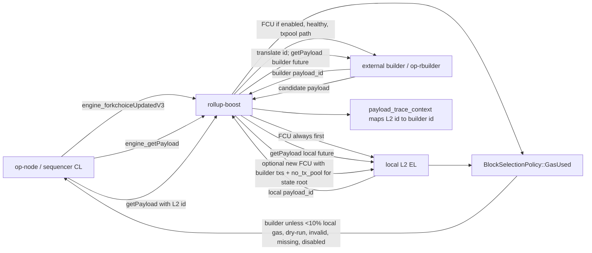
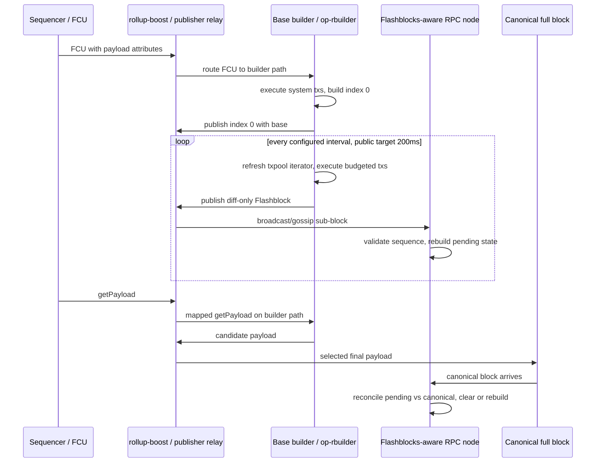
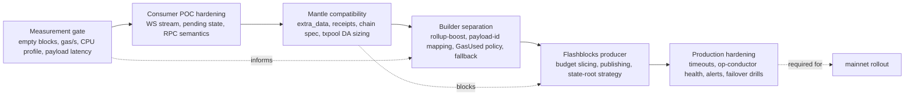

# Executive Summary

Base's throughput improvement from builder separation and Flashblocks is not one scalar. It splits into three independent metrics:

| Metric | What improved | Evidence label | Draft conclusion |
|---|---|---|---|
| Effective gas throughput | More gas used per second by reducing empty/underfilled blocks and keeping a better payload candidate ready | verified-code + limited verified-data | Builder separation and op-rbuilder can improve utilization when the local EL would otherwise return an empty or weaker payload. The sampled windows here show zero empty blocks on both Base and Mantle, so the public 99% empty-block reduction claim remains `reported`, not revalidated at daily scale. |
| Finalized TPS | Final block cadence and gas limit that the canonical chain accepts | verified-code + inferred | Flashblocks do not by themselves increase final block cadence: the chain still seals a full L2 block on the standard 2s cadence. Final TPS only rises if gas limit, tx selection, execution, DA, or blockspace utilization improve. |
| User-perceived TPS / latency | How quickly applications can observe inclusion-like state before the full block is sealed | verified-code + reported | Base docs and code support a 200ms preconfirmation surface. This is a UX/latency gain, not a finality gain. |

The main architectural change is rollup-boost as a CL/EL Engine API proxy. `engine_forkchoiceUpdatedV3` is sent to the local L2 EL and conditionally to an external builder; `engine_getPayload` races local and builder payloads, maps L2 payload IDs to builder payload IDs, validates or externalizes the state-root calculation path, and returns either the builder payload or the local fallback. Code evidence is in `flashbots/rollup-boost@ea7fe88:crates/rollup-boost/src/server.rs:63-73`, `:180-206`, `:209-318`, and `:541-631`.

The selection rule is deliberately builder-favoring. With `BlockSelectionPolicy::GasUsed`, the local block wins only if builder gas used is strictly less than 10% of local gas used; exact 10% and above select builder. This protects against empty or severely underfilled builder blocks but does not prove that builder latency is always free. The proxy waits for local `getPayload` and builder `getPayload` in the same `tokio::join!` path, so production timeout configuration remains an important uncovered input. Code evidence: `flashbots/rollup-boost@ea7fe88:crates/rollup-boost/src/selection.rs:4-37`, tests at `:46-107`, and selection integration at `crates/rollup-boost/src/server.rs:318-367`.

Base Flashblocks move perceived inclusion from one 2s block result to incremental sub-blocks. In `base/base@fc58ee8`, the builder has a WebSocket publisher, a 2s block-time default, 250ms default flashblock interval in code, test config at 200ms, budget slicing across gas/DA/state-root resources, and a diff payload schema that omits `base` after the first flashblock. Official Base docs describe 10 Flashblocks per 2s block at 200ms; the code currently exposes configurable interval behavior rather than a hardcoded single constant. Evidence: `base/base@fc58ee8:crates/builder/core/src/config.rs:13-107`, `:139-178`; `crates/builder/core/src/flashblocks/payload.rs:277-302`, `:338-413`, `:657-675`, `:811-840`, `:844-883`; Base docs at https://docs.base.org/base-chain/flashblocks/overview.

The required src-6 caveat is resolved as follows: the current `base/base@fc58ee8` checkout has no `flashblocks_p2p.md` under the repository top-level search used in this run. The canonical checked source for P2P claims in this draft is `flashbots/rollup-boost@ea7fe88:specs/flashblocks_p2p.md`. That spec defines `flblk` version 1, authorization messages, multipeer gossip, duplicate suppression, and rollup-boost as coordinator rather than every-message data ferry (`specs/flashblocks_p2p.md:26-38`, `:57-107`, `:133-145`, `:157-192`).

For Mantle, the production baseline still looks like a direct op-node -> EL Engine API block-building flow, not a production builder-sidecar flow. Mantle `op-node` prepares payload attributes and emits `BuildStartEvent`, the engine controller directly calls `ForkchoiceUpdate`, and op-geth builds an empty payload first then repeatedly updates a full payload in a background goroutine unless `NoTxPool` is set. Evidence: `mantle-v2@feb2a58:op-node/rollup/sequencing/sequencer.go:487-615`; `mantle-v2@feb2a58:op-node/rollup/engine/engine_controller.go:1087-1123`; `op-geth@34a6a67:miner/payload_building.go:90-185`, `:232-325`.

The two Mantle reth branches are not production-equivalent Flashblocks. `flashblocks/poc@1f8b656` is primarily a consumer/pending-state and consensus-injection POC: it receives WebSocket Flashblocks, orders them, builds pending blocks, optionally computes state root after index 9, and sends FCUs from completed sequences. The `feat/flashblocks-mantle-aware@58741b2` assessment is branch-range/tree-state evidence at the `58741b2` tip: it layers Mantle-specific chain spec, `extra_data`, receipt/RPC/txpool adaptations, and test coverage on top of the POC direction, not a single isolated tip-commit claim. I did not find a complete external producer equivalent to Base op-rbuilder or a rollup-boost production wiring in those branches, so the Mantle recommendation is measurement-first, then consumer/RPC POC hardening, then builder separation.

# Item Findings

## 1. Engine API multiplexing and payload-id mapping

**Finding.** rollup-boost is a sidecar Engine API server with both local L2 and external builder clients. It stores execution mode, optional block selection policy, probe state, and a `payload_to_fcu_request` map (`flashbots/rollup-boost@ea7fe88:crates/rollup-boost/src/server.rs:63-73`). During construction, the builder client may be wrapped either in Flashblocks WebSocket mode or P2P mode (`server.rs:87-113`).

**Route matrix.**

| Method | Local L2 path | Builder path | Conditions | Evidence |
|---|---|---|---|---|
| `engine_newPayload` | Always sent to local L2 and response returned | Async spawned to builder | skipped when execution mode disabled or unhealthy builder is skipped | `server.rs:180-206` |
| `engine_forkchoiceUpdatedV3` without payload attrs | Local L2 result returned | forwarded to builder to keep sync when not disabled/skipped | health and execution mode gate | `server.rs:541-631`, especially `:551-560`, `:633-635` |
| `engine_forkchoiceUpdatedV3` with payload attrs + `no_tx_pool` | Local only | skipped | `no_tx_pool` means sync or forced attrs, not builder txpool selection | `server.rs:562-587` |
| `engine_forkchoiceUpdatedV3` with payload attrs + txpool | Local and builder in parallel | yes | stores builder payload ID if present | `server.rs:588-631` |
| `engine_getPayload` | local future starts first | builder future uses mapped payload ID | disabled mode returns local only; missing builder mapping returns local fallback | `server.rs:209-318` |

The payload-id mapping is explicit: FCU returns an L2 payload ID, the builder may return a different payload ID, and `payload_trace_context.store(...)` records both (`server.rs:599-623`). Later `getPayload` translates L2 payload ID to builder payload ID before calling builder `get_payload` (`server.rs:255-284`). This is a correctness-critical boundary: the sequencer sees the L2 ID, but the builder may hold the candidate block under its own ID.

**External state-root path.** If `external_state_root` is enabled, rollup-boost sends a new FCU to local L2 with the builder transactions and `no_tx_pool: true`, then obtains a local payload with a calculated state root (`server.rs:398-455`). This matches Base's public engineering description of moving expensive per-flashblock state root work off the hot sub-block loop and using op-geth for the finalized state root path (reported source: https://blog.base.dev/flashblocks-deep-dive).

**Confidence.** verified-code for route matrix and mapping; inferred for production parameter values because the public checkout does not expose Base's exact deployed rollup-boost timeout/health configuration.

## 2. `BlockSelectionPolicy::GasUsed` decision tree

**Finding.** The policy is simpler than a score function: when both payloads exist, select the local L2 payload only when `builder_gas < l2_gas * 0.1`; otherwise select builder. That means builder wins on equal gas, higher gas, and even exactly 10% of local gas (`flashbots/rollup-boost@ea7fe88:crates/rollup-boost/src/selection.rs:4-37`; boundary tests at `:46-107`).

**Decision tree.**

| Condition | Selected payload | Evidence |
|---|---|---|
| execution mode disabled | local L2 | `server.rs:217-247` |
| builder has no mapped payload ID | local L2 | `server.rs:255-268`, `:365-367` |
| builder `getPayload` errors | local L2 | `server.rs:282-294`, `:329-367` |
| dry run | local L2 | `server.rs:356-360` |
| policy absent and builder payload exists | builder | `server.rs:360-364` |
| `GasUsed` and builder gas < 10% local gas | local L2 | `selection.rs:24-34` |
| `GasUsed` and builder gas >= 10% local gas | builder | `selection.rs:24-34`; test exact 10% at `:78-107` |

**Latency vs utilization.** The code favors liveness through a local fallback and favors utilization by preferring builder unless it is severely underfilled. The latency tradeoff is not fully determined by this policy because `get_payload` waits for both local and builder futures with `tokio::join!` before selection (`server.rs:318-367`). Therefore the safe conclusion is: selection protects against bad builder content and API failure, but production latency depends on RPC timeouts, builder response distribution, and op-node block sealing budget. Those deployment parameters were not public in the checked repos.

**Builder health.** Probes expose `Healthy`, `PartialContent`, and `ServiceUnavailable` (`crates/rollup-boost/src/probe.rs:19-30`) and HTTP endpoints `/healthz`, `/readyz`, and `/livez` (`probe.rs:116-124`). If `ignore_unhealthy_builders` is enabled, an unhealthy builder is skipped (`server.rs:394-396`, `:556-560`). This is a liveness control, not a direct throughput amplifier.

**Confidence.** verified-code for decision tree; inferred for real-world latency impact.

## 3. Flashblocks producer overhead: schema, cadence, and WebSocket path

**Producer ownership.** In Base's checked code, `BasePayloadBuilder` owns the transaction pool, node client, payload handler channel, WebSocket publisher, and builder config (`base/base@fc58ee8:crates/builder/core/src/flashblocks/payload.rs:75-94`). The Flashblocks builder deliberately does not support regular `try_build` or `build_empty_payload` in this context (`payload.rs:111-138`).

**Cadence.** The code config has a default 2s block time and 250ms Flashblocks interval, while test config uses 200ms (`crates/builder/core/src/config.rs:139-178`). Official docs describe Base's public behavior as 10 Flashblocks within a 2s block, with 200ms arrivals and index 0 containing system transactions only (reported source: https://docs.base.org/base-chain/flashblocks/overview). Therefore the implementation is configurable; Base's public service target is 200ms.

**Budget split.** After pre-steps and fallback payload publication, `build_payload` calculates the number of Flashblocks, skips Flashblocks when `no_tx_pool` is set, emits index 0, and slices gas/DA/state-root/execution budgets by Flashblock count (`payload.rs:255-302`, `:330-365`). It then drives a timer loop at `flashblocks_interval` (`payload.rs:377-413`).

**Payload-size optimization.** The wire schema splits stable base fields from mutable diff fields. `ExecutionPayloadBaseV1` holds parent hash, number, gas limit, timestamp, extra data, and base fee; `ExecutionPayloadFlashblockDeltaV1` holds state root, receipts root, logs bloom, gas used, block hash, transactions, withdrawals, and blob gas (`crates/common/flashblocks/src/payload.rs:9-80`). `base` is skipped when `None` (`payload.rs:75-76`), and tests pin that `base` is omitted, not serialized as null (`payload.rs:194-210`). In the builder loop, non-initial Flashblocks set `fb_payload.base = None` before publishing (`crates/builder/core/src/flashblocks/payload.rs:657-675`). After Azul activation, metadata omits access list, receipts, and account balances (`payload.rs:1111-1126`), consistent with the Azul blog's reported payload-size reduction claim (https://blog.base.dev/introducing-base-azul).

**WebSocket path.** The publisher serializes each payload to JSON, stores it in a ring buffer, broadcasts it on a Tokio broadcast channel, and records byte size (`crates/builder/publish/src/publisher.rs:95-124`). Defaults are channel capacity 100 and ring buffer 16 (`publisher.rs:26-30`, `:57-75`). Slow subscribers may lag, but reconnecting clients can replay recent entries from the ring buffer. This is a fan-out buffer, not a peer gossip protocol.

**State-root strategy.** Intermediate `build_block` calls can pass `calculate_state_root=false`, leaving state root zero; finalization computes state root via `finalize_payload` (`payload.rs:811-840`) and `build_block` only runs trie state-root calculation when requested (`payload.rs:937-996`). This code-level structure supports the reported Base optimization that moved state root off every sub-block and reduced P50 Flashblock build time from 150ms to 10ms (reported source: https://blog.base.dev/flashblocks-deep-dive).

**Confidence.** verified-code for schema/path; reported for public 200ms service target and P50 timing.

## 4. Flashblocks consumer pending-state behavior

**Base consumer state machine.** The consumer processes two update types: canonical blocks and Flashblocks (`base/base@fc58ee8:crates/execution/flashblocks/src/processor.rs:37-44`). It updates pending state on each Flashblock, caches Flashblocks when the parent canonical header is missing, and replays cached entries after the canonical block lands (`processor.rs:80-121`, `:135-163`).

Sequence validation rejects gaps and non-zero first Flashblocks. Valid transitions are next-in-sequence and first-of-next-block; duplicates are ignored; non-sequential gaps reset pending state (`crates/execution/flashblocks/src/validation.rs:7-75`; integration in `processor.rs:279-341`). Reconciliation compares tracked transaction hashes with the canonical block and chooses catch-up, reorg rebuild, depth-limit reset, or continue (`validation.rs:78-188`; `processor.rs:179-269`).

**Pending-state cost.** Rebuilding pending state groups Flashblocks by block, assembles each block, creates an EVM on top of the canonical parent, recovers senders in parallel, executes transactions, and accumulates bundle state and overrides (`processor.rs:344-492`). This is a real CPU and memory cost for RPC nodes: it provides the preconfirmation surface by replaying pending execution locally.

**RPC semantics.** `eth_getBlockByNumber(pending)` returns pending Flashblocks state when available and falls back to latest otherwise (`crates/execution/flashblocks/src/rpc/eth.rs:190-213`). Receipts check canonical first then pending Flashblocks (`rpc/eth.rs:215-240`), balances can read pending state (`rpc/eth.rs:242-260`), and pubsub exposes `newFlashblocks`, `pendingLogs`, and Flashblock transaction streams (`crates/execution/flashblocks/src/rpc/pubsub.rs:33-52`, `:74-123`, `:125-221`, `:224-270`).

**Execution cache.** The engine-tree cached execution provider only reuses Flashblocks execution results when parent hash and transaction order align (`crates/execution/engine-tree/src/cached_execution.rs:21-90`). This bounds correctness risk but also means cache hits are conditional, not guaranteed. Flashblock cache ahead is capped at five blocks to limit memory growth (`crates/execution/flashblocks/src/cache.rs:8-22`, `:39-72`).

**Confidence.** verified-code.

## 5. WebSocket vs P2P `flblk/1` throughput comparison

**Canonical P2P location.** The dispatch caveat is resolved: current `base/base@fc58ee8` did not contain `flashblocks_p2p.md` in the checked tree; the canonical source used here is `flashbots/rollup-boost@ea7fe88:specs/flashblocks_p2p.md`.

**WebSocket model.** The existing Base builder WebSocket publisher is a centralized fan-out: JSON serialization, broadcast channel, ring buffer replay, and subscriber count tracking (`base/base@fc58ee8:crates/builder/publish/src/publisher.rs:32-47`, `:95-124`). This is simple and low-latency for direct RPC/provider consumers but concentrates outbound bandwidth and backpressure controls at the publisher/proxy layer.

**P2P model.** The P2P spec replaces WebSocket proxy propagation with a devp2p subprotocol named `flblk` version 1 (`flashbots/rollup-boost@ea7fe88:specs/flashblocks_p2p.md:133-145`). It introduces `Authorization`, `AuthorizedMsg`, `StartPublish`, and `StopPublish` structures (`specs/flashblocks_p2p.md:57-127`) and requires authorizer and builder signature checks (`specs/flashblocks_p2p.md:157-168`). The design uses multipeer gossip and duplicate suppression (`specs/flashblocks_p2p.md:140-145`).

**Throughput tradeoff.**

| Dimension | WebSocket fan-out | P2P `flblk/1` |
|---|---|---|
| Producer outbound bandwidth | Central publisher/proxy sends to all subscribers | Builder/gossip peers spread fan-out |
| Message overhead | JSON payload plus WebSocket framing | Binary-ish protocol plus authorization/signature/start-stop messages |
| Verification cost | Endpoint trusts stream source and local parser | Peers verify authorizer and builder signatures |
| HA behavior | Failover may require stream handoff or reconnection | Spec models single-publisher coordination and failover |
| Implementation status in this run | Verified in Base publisher code | Verified as rollup-boost spec and P2P FCU authorization wrapper; production deployment not proven |

rollup-boost has a P2P RPC wrapper that sends `flashblocks_fork_choice_updated_v3` with an authorization when payload attributes are present and execution mode is enabled (`crates/rollup-boost/src/client/rpc.rs:427-509`). This is implementation evidence for authorization delivery, but not a full throughput benchmark.

**Confidence.** verified-code/spec for mechanics; inferred for throughput model because no public WebSocket-vs-P2P benchmark was found.

## 6. Empty-block 99% reduction claim and fresh sampling

**Reported claim.** Base's Azul blog reports an empty-block reduction of about 99%, from about 200/day to about 2/day, under "Increased Builder Reliability" (https://blog.base.dev/introducing-base-azul). This draft treats that as `reported`.

**Fresh sample method.** I sampled block headers via public JSON-RPC using `eth_getBlockByNumber` with `full_transactions=false`. Empty block definitions recorded:

- `empty_tx_count`: `len(transactions) == 0`
- `gas_zero_count`: `gasUsed == 0`
- effective gas throughput: `sum(gasUsed) / (last_timestamp - first_timestamp)`

**Fresh 30-block batched sample (completed in this rerun).**

| Window | Endpoint | Blocks | UTC timestamps | empty tx / gas zero | avg gas used | median gas used | effective gas/s | Evidence |
|---|---|---:|---|---:|---:|---:|---:|---|
| Base current | `https://mainnet.base.org` | 46330937-46330966 | 2026-05-22T11:40:21Z to 2026-05-22T11:41:19Z | 0 / 0 | 41,460,031.50 | 40,912,648 | 21,444,843.88 | verified-data |
| Mantle current | `https://rpc.mantle.xyz` | 95660455-95660484 | 2026-05-22T11:40:22Z to 2026-05-22T11:41:20Z | 0 / 0 | 184,968.97 | 168,882.5 | 95,673.60 | verified-data |
| Base pre-May-13 target | `https://base-rpc.publicnode.com` | 45877327-45877356 | 2026-05-12T00:00:01Z to 2026-05-12T00:00:59Z | 0 / 0 | 45,589,400.47 | 43,169,013 | 23,580,724.38 | verified-data |
| Base post-May-13 target | `https://base-rpc.publicnode.com` | 45963727-45963756 | 2026-05-14T00:00:01Z to 2026-05-14T00:00:59Z | 0 / 0 | 48,827,646.57 | 41,022,211 | 25,255,679.26 | verified-data |

**Prior larger sample attempt.** A 300-block batched rerun hit public RPC rate limiting (`-32016 over rate limit`) before producing a complete result. Earlier notes from this session had 300-block windows, but because the completed fresh command in this run only returned 30-block windows, this draft uses the 30-block sample as verified and treats daily-scale validation as a gap.

**Interpretation.** The samples do not independently prove the 99% daily reduction because all sampled windows have zero empty blocks, including the short pre-May-13 Base window. They do support a narrower statement: in these four short windows, neither Base nor Mantle produced `len(transactions)==0` or `gasUsed==0` blocks. The Azul claim likely needs a full-day query over the same definition Base used, preferably using indexed data rather than rate-limited public RPC.

**Confidence.** verified-data for the table only; reported for the 99% claim; unresolved for daily empty-block delta.

## 7. Mantle baseline block-building status

**Current flow.** Mantle's checked `op-node` sequencing path prepares payload attributes, sets `NoTxPool` for drift, activation, and recovery cases, and emits `BuildStartEvent` (`mantle-v2@feb2a58:op-node/rollup/sequencing/sequencer.go:487-615`). The engine controller directly calls the execution engine's `ForkchoiceUpdate` and expects a payload ID (`op-node/rollup/engine/engine_controller.go:1087-1123`). Sealing calls `GetPayload` with timeout and handles unknown/expired payload IDs (`op-node/rollup/engine/build_seal.go:58-83`).

**EL payload builder.** In `op-geth`, `forkchoiceUpdated` validates forkchoice state, converts payload attributes into `miner.BuildPayloadArgs`, includes Mantle-specific EIP-1559/min-base-fee fields when Arsia is active, calls `Miner().BuildPayload`, and stores local block work by payload ID (`op-geth@34a6a67:eth/catalyst/api.go:230-404`, especially `:357-401`). `Miner.BuildPayload` delegates to `buildPayload` (`miner/miner.go:178-181`).

`buildPayload` creates an empty payload first so something is available, returns that as full when `NoTxPool` is true, and otherwise starts a background goroutine that repeatedly generates full work until delivery or timeout (`op-geth@34a6a67:miner/payload_building.go:90-185`, `:232-325`). This is a single local EL payload builder model, not a builder-sidecar selection race.

**Baseline data.** The fresh 30-block Mantle current sample showed zero empty blocks and much lower gas usage than Base in the same short time span: average 184,969 gas/block and effective 95,674 gas/s. That low utilization means Mantle's immediate final-throughput bottleneck is not necessarily block construction capacity. For Mantle, the value of builder separation is more likely resource isolation, liveness, and future headroom than immediate gas/s gain unless measurements reveal hidden empty/underfilled periods.

**Confidence.** verified-code for flow; verified-data for the sampled 30-block window; inferred for production ROI.

## 8. Mantle branch evaluation: `flashblocks/poc` and `feat/flashblocks-mantle-aware`

**Branch commits.**

| Branch | Commit analyzed | Role observed |
|---|---|---|
| `origin/main` | `a8423b8b210dab6d7b47f8f597df9fc52e4a8b23` | Mantle reth main baseline |
| `origin/flashblocks/poc` | `1f8b656685886da9c325fb65214ec4146be739b6` | Flashblocks consumer/pending-state POC |
| `origin/feat/flashblocks-mantle-aware` | `58741b285f7f26ae0e7e2c65ec5d757d56117f5a` | POC plus Mantle chain/RPC/receipt/txpool adaptations |

**`flashblocks/poc` feature matrix.**

| Feature | Status | Evidence |
|---|---|---|
| Payload types and decoder | present | exports `FlashBlock`, base/delta/metadata, decoder at `crates/optimism/flashblocks/src/lib.rs:14-31` |
| WebSocket consumer | present | unbounded reconnect stream decodes binary/text messages at `ws/stream.rs:21-35`, `:72-135` |
| Pending sequence ordering | present | BTree by index, index 0 reset, ready transactions stop at gaps at `sequence.rs:15-27`, `:79-128` |
| Complete-sequence validation | present | requires first base and consecutive same payload/block at `sequence.rs:181-203` |
| Pending execution | present | executes txs over latest parent, optional state root, produces `PendingFlashBlock` at `worker.rs:62-138` |
| State-root optimization | partial | only computes after index >= 9 when enabled at `service.rs:32-64`, `:189-200` |
| Consensus injection | experimental | sends FCU from complete sequences, warns if state root missing at `consensus.rs:42-74` |
| Producer / op-rbuilder equivalent | not found | no producer export in `lib.rs:14-31`; modules are service/worker/ws/sequence/consensus |

**`feat/flashblocks-mantle-aware` adaptations.** The diff from `flashblocks/poc` is broad and not only Flashblocks: it adds Mantle release workflow, chain spec changes, Mantle Sepolia, receipt root tests, RPC extensions, txpool transaction changes, storage/trie changes, and more. This is a branch-range/tree-state assessment at the `58741b2` tip, not a claim that the single tip commit alone introduced every listed adaptation. Important Flashblocks/Mantle-specific files include:

- `crates/optimism/flashblocks/src/payload.rs`, which keeps `extra_data` opaque and adds Mantle-compatible shape/min-base-fee accessors for Holocene/Jovian/Mantle Arsia layouts (`origin/feat/flashblocks-mantle-aware@58741b2:crates/optimism/flashblocks/src/payload.rs:91-107`, `:136-203`).
- `crates/optimism/chainspec/src/mantle.rs`, which extracts Mantle genesis fields, identifies Mantle chain alignment, and configures hardfork timestamps (`mantle.rs:37-84`, `:108-142`).
- `crates/optimism/chainspec/src/mantle_sepolia.rs`, which adds Mantle Sepolia chain spec and tests for Skadi/Limb/Arsia activation (`mantle_sepolia.rs:1-18`, `:135-180`).
- `crates/optimism/rpc/src/eth/mantle_ext.rs`, which implements Mantle-specific RPC methods including range and preconf transaction path scaffolding (`mantle_ext.rs:86-123`, `:149-220`).
- `crates/optimism/primitives/src/receipt.rs`, which defines the OP/Mantle receipt enum and RLP behavior (`receipt.rs:21-32`, `:79-168`).
- `crates/optimism/txpool/src/transaction.rs`, which caches estimated compressed size and EIP-2718 bytes for DA sizing (`transaction.rs:32-85`, `:118-145`).

**Production gap.** The branches are meaningful but incomplete for Base-like production Flashblocks. Missing or unproven pieces include external builder production, rollup-boost Engine API proxy wiring, builder/local payload selection, production HA/health behavior, load testing, public WebSocket/P2P deployment topology, and metrics/alerting. The branch state is best classified as consumer-heavy POC plus Mantle compatibility layer, not production builder separation.

**Confidence.** verified-code for branch contents; inferred for effort classification.

## 9. Builder-separation CPU/memory release modeling

**Before separation.** Mantle's current path keeps payload building inside the local EL workflow. The sequencer CL triggers FCU, op-geth starts local payload work, and `GetPayload` resolves whatever the local miner has produced (`mantle-v2@feb2a58:engine_controller.go:1087-1123`; `op-geth@34a6a67:miner/payload_building.go:232-325`).

**After rollup-boost-style separation.** Work splits into:

| Work unit | External builder | Local EL | rollup-boost | Sequencer CL |
|---|---:|---:|---:|---:|
| FCU receive and build start | yes | yes, fallback | route/map | emits FCU |
| Tx ordering and execution for best candidate | yes | yes, fallback/local state-root path | none | no |
| Payload validation / newPayload to local EL | no | yes | submits builder payload or state-root FCU | no |
| State root for selected builder payload | optional/no in optimized path | yes if external_state_root | coordinates | no |
| Final selection | candidate provider | fallback provider | yes | receives result |
| Unsafe insertion and consensus bookkeeping | no | yes | no | yes |

**Non-additive resource accounting.** Builder separation can reduce sequencer hot-path coupling but may increase total cluster CPU because the local fallback and external builder can both build. It improves availability of a good payload and isolates custom builder work from the local EL, but it does not eliminate local validation or final insertion. Therefore "freed CPU" should be modeled as lower CL/EL critical-path pressure and more headroom, not a direct TPS multiplier.

**Bounded estimate.** Without production profiles, only first-order bounds are defensible:

- CPU: local EL still builds fallback, so total CPU may be 1.0x to 2.0x the current payload-building CPU depending on whether fallback remains active every block. Hot-path waiting can improve if builder returns better work within the same block budget; final TPS only improves when underfilled blocks were the bottleneck. Evidence: inferred from dual FCU/getPayload paths.
- Memory: external builder duplicates txpool/building state and pending payload working sets. Local memory is not freed if fallback remains enabled. Evidence: inferred from duplicated clients and payload building.
- Latency: selection can avoid returning a weak local payload when builder has a fuller one, but `tokio::join!` means slow builder response can still matter unless bounded by timeout configuration. Evidence: verified-code `rollup-boost server.rs:318-367`; timeout values unresolved.

**Confidence.** inferred, with verified-code support for work placement. No public CPU/memory profile was found for Mantle or Base production builder separation.

## 10. Sequencer main-loop before/after comparison

See diagram `diag-3`. The key comparison is not "sequencer stops building blocks"; it is "sequencer delegates block construction through a proxy that can race local fallback against an external builder." Local fallback remains part of the design, and final block acceptance still goes through local EL/newPayload semantics. This is why builder separation is a reliability and headroom mechanism first, and a final TPS mechanism only when current local building underfills or blocks the 2s cadence.

**Confidence.** verified-code + inferred.

## 11. Metric separation: effective gas throughput, finalized TPS, user-perceived TPS

**Effective gas throughput.** Use `gasUsed / second` over canonical blocks. The verified samples show:

- Base current short sample: 21.44M gas/s.
- Base pre-May-13 short sample: 23.58M gas/s.
- Base post-May-13 short sample: 25.26M gas/s.
- Mantle current short sample: 0.096M gas/s.

These are not full-day averages and should not be compared as capacity maxima. They are small windows that show utilization, not protocol limit.

**Finalized TPS.** Finalized TPS is bounded by canonical block gas, execution cost per tx, block time, DA/batcher constraints, and finality semantics. Flashblocks do not change the full-block sealing interval by themselves. The correct statement is that Flashblocks provide preconfirmation updates inside the 2s window.

**User-perceived TPS / latency.** Base docs state that Flashblocks stream incremental state updates at 200ms intervals and can be consumed through Flashblocks-aware RPC methods (https://docs.base.org/base-chain/flashblocks/overview). That reduces time-to-visible-inclusion for apps, but if a later canonical block excludes/reorders a tail Flashblock, users still rely on reconciliation rules. Base's blog reports engineering changes that reduced tail reorgs and state-root overhead (https://blog.base.dev/flashblocks-deep-dive).

**Do not add these.** If Mantle adopts builder separation and Flashblocks, the benefit stack should be presented as separate rows:

1. effective gas/s: only from higher canonical gas utilization;
2. finalized TPS: only from canonical capacity changes;
3. perceived latency/TPS: from 200ms pending-state updates;
4. resource headroom: from process isolation/parallelism;
5. reliability: from fallback and health-controlled routing.

**Confidence.** verified-data for sample values; reported for Base docs; inferred for non-additive model.

## 12. Mantle feasibility and expected benefit

**Recommendation: proceed, but measurement-first.** Mantle should not jump straight to a production Base-style builder/Flashblocks launch without profiling and a narrower POC gate. The current Mantle chain sample in this run has no empty blocks and very low gas utilization. That means the immediate measurable final-throughput upside from empty-block reduction may be small, while the engineering blast radius is large.

**Benefit matrix.**

| Benefit | Expected Mantle upside | Evidence | Caveat |
|---|---|---|---|
| Empty-block reduction | low to unknown in sampled window | verified-data sample has 0 empties | full-day sample still needed |
| Effective gas throughput | low unless current underfill is caused by builder path | inferred | gas demand and gas limit matter more than builder architecture |
| User-perceived latency | high if Flashblocks RPC is exposed | verified-code from Base consumer + Mantle POC | requires production stream, pending RPC, reconciliation |
| Sequencer resource headroom | medium | inferred from process separation | local fallback duplicates work |
| Future block-building experimentation | medium/high | rollup-boost architecture | requires builder API, metrics, HA, security review |
| Implementation risk | high | branch gap analysis | producer/rollup-boost wiring missing |

**Roadmap.**

1. Measurement gate: run full-day Mantle empty-block/gas utilization sampling, sequencer CPU profiles around FCU/getPayload, op-geth payload build latency distribution, and txpool underfill analysis.
2. Consumer-first POC: harden `flashblocks/poc` pending-state service, WebSocket stream handling, receipt/balance/log semantics, state-root policy, and reorg behavior using Mantle chain data.
3. Mantle-aware compatibility: keep the `feat/flashblocks-mantle-aware` direction for `extra_data`, receipt roots, chain spec, RPC, txpool DA sizing, and Arsia/Jovian layout compatibility.
4. Builder separation integration: add rollup-boost sidecar wiring, local fallback, builder health, payload-id mapping, GasUsed policy, and external state-root path.
5. Production hardening: load tests, timeout tuning, P2P/WebSocket topology decision, op-conductor health behavior, alerting, and fallback drills.

**Bottom line.** Mantle's best near-term win is user-perceived latency and builder architecture optionality, not immediate final TPS. Final throughput should be claimed only after gas utilization and DA/execution bottleneck measurements prove that block building is limiting canonical gas/s.

# Diagrams

## diag-1: rollup-boost Engine API multiplexing

## diag-2: Flashblocks lifecycle

Note: `diag-2` is a Flashblocks lifecycle compression. `diag-1` is authoritative for Engine API routing; production FCU/getPayload paths should be read as sequencer -> rollup-boost -> builder/local fallback, not as a direct sequencer -> builder FCU path.

## diag-3: Sequencer main loop before/after builder separation

```mermaid
flowchart TB
  subgraph Before["Mantle current / direct local EL"]
    A1[Prepare payload attrs] --> A2[engine_forkchoiceUpdated to local EL]
    A2 --> A3[op-geth BuildPayload: empty payload first]
    A3 --> A4[background full payload rebuild loop]
    A4 --> A5[engine_getPayload]
    A5 --> A6[insert/gossip unsafe block]
  end

  subgraph After["rollup-boost + external builder + local fallback"]
    B1[Prepare payload attrs] --> B2[FCU to rollup-boost]
    B2 --> B3[local EL fallback build]
    B2 --> B4[external builder build / Flashblocks]
    B3 --> B5[getPayload race]
    B4 --> B5
    B5 --> B6[GasUsed policy + validation/state-root path]
    B6 --> B7[return selected payload]
    B7 --> B8[local validation + unsafe insertion]
  end

  B3 -. retained/duplicated work .-> B6
  B4 -. offloaded custom work .-> B6
```

## diag-4: Mantle adoption roadmap and dependencies

# Source Coverage

| Requirement | Coverage |
|---|---|
| src-1 `base/base` builder/execution code | Covered with refs to `config.rs`, `flashblocks/payload.rs`, `best_txs.rs`, `publisher.rs`, common payload schema, consumer processor/validation/RPC/cache/cached execution. |
| src-2 `flashbots/rollup-boost` | Covered with refs to `server.rs`, `selection.rs`, `client/rpc.rs`, `probe.rs`, and P2P spec. |
| src-3 `mantle-xyz/reth flashblocks/poc` | Covered with refs to `lib.rs`, `service.rs`, `sequence.rs`, `worker.rs`, `consensus.rs`, and `ws/stream.rs` at commit `1f8b656`. |
| src-4 `mantle-xyz/reth feat/flashblocks-mantle-aware` | Covered with diff summary and refs to payload, chainspec, RPC, receipt, and txpool files at commit `58741b2`. |
| src-5 Mantle production baseline | Covered with `mantle-v2` op-node/engine and `op-geth` Engine API/miner payload builder refs. |
| src-6 Flashblocks P2P spec | Resolved to `flashbots/rollup-boost@ea7fe88:specs/flashblocks_p2p.md`; `base/base` path not found in current checkout. |
| src-7 Base docs/blog | Covered: Flashblocks overview and architecture docs, Flashblocks deep dive, Introducing Base Azul. |
| src-8 expert commentary | Covered through Base engineering blog and rollup-boost spec; no separate independent Flashbots benchmark located. |
| src-9 on-chain data | Covered with reproducible JSON-RPC method and exact short block ranges; full-day validation remains gap. |
| src-10 performance data | Partial: Base blog reports state-root/P50 improvement; no raw benchmark/profile dataset found. |

# Gap Analysis

1. Full-day empty-block validation is still missing. Public RPC rate limits blocked a larger fresh sample in this run; the completed sample is only 30 blocks per window.
2. Base production rollup-boost timeout, `ignore_unhealthy_builders`, and policy deployment parameters were not public in the checked repos.
3. WebSocket vs P2P throughput is modeled from topology and spec. No public benchmark comparing fan-out bandwidth, signature overhead, or provider lag was found.
4. CPU/memory release estimates are inferred from code ownership and duplicated fallback work. Production profiling is required before Mantle treats resource release as a capacity claim.
5. Mantle branch evaluation is code-level only. I did not run the branches or execute tests, so runtime maturity and integration breakage remain unverified.
6. Existing `drafts/round-2.md`, `drafts/round-3.md`, and `final.md` in this topic directory are May 20 historical artifacts. They should not be consumed as current rerun evidence unless explicitly revalidated.

# Revision Log

| Round | Change |
|---|---|
| 1 | Recreated Phase B deep draft for the 2026-05-22 rerun scope, replacing the historical `drafts/round-1.md`; enforced code/on-chain evidence labels, resolved P2P spec location, refreshed commit SHAs and short on-chain samples. |
