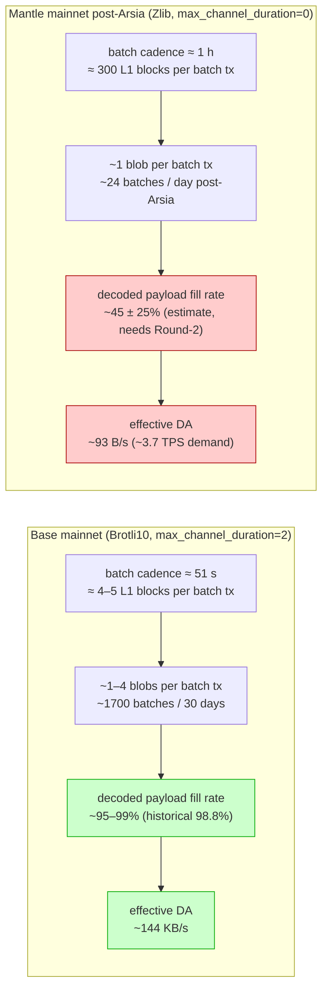
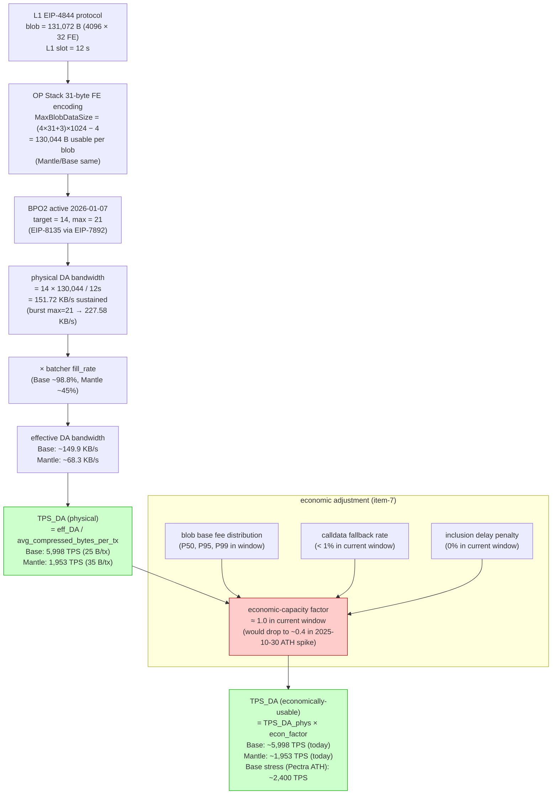
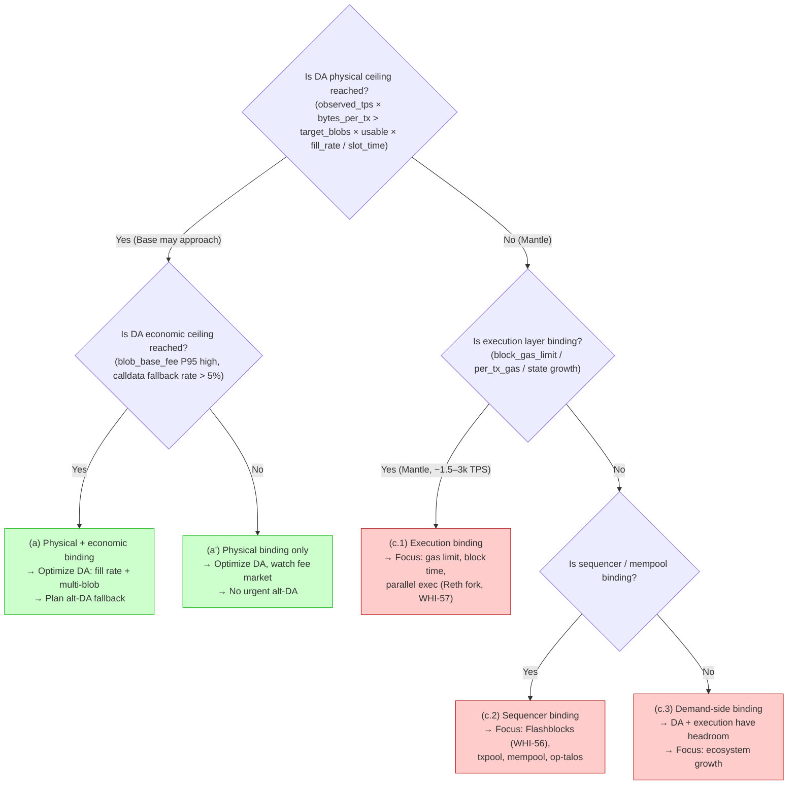
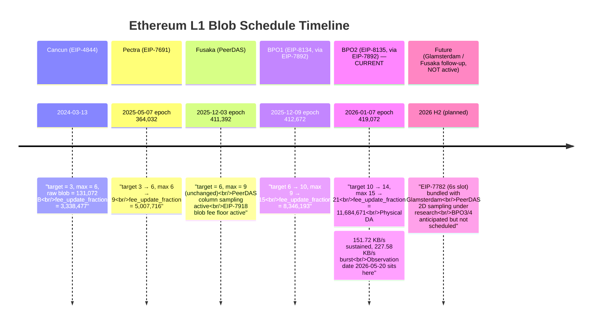

# DA 带宽利用率与理论吞吐量上限分析 (Base vs Mantle)

## Executive Summary

截至观测日 2026-05-20，Ethereum 主网 L1 DA 带宽已经在 BPO2 (EIP-8135, 激活于
2026-01-07 epoch 419,072) 后达到 **target=14、max=21 blobs/L1 block** 的水平。结合 OP Stack
batcher/derivation 的 31-byte field-element 编码（`MaxBlobDataSize = (4*31+3)*1024 - 4
= 130,044` bytes），post-BPO2 的 **physical DA 带宽上限** 为
`14 × 130,044 / 12s ≈ 151.72 KB/s 持续吞吐`，max-burst 上限为 `21 × 130,044 / 12s ≈
227.58 KB/s`。这个上限对应到典型 OP Stack 压缩比下的网络层 DA-bound TPS：在 25 B/tx
均衡 mix、95% fill_rate 下约 **5.77k TPS**（持续），最大 burst 约 8.65k TPS。

观测窗口（2026-04-20 → 2026-05-20）覆盖了 Mantle Arsia v1.5.4 主网升级
（2026-04-22），Mantle 在升级后从 EigenDA validium 切换为 **EIP-4844 blob + OP
Succinct ZK proof 的 rollup**。这意味着 Mantle 与 Base 的同维度对比第一次成为可能：
两条链的 DA 提交都走 Ethereum blobs，差异主要落在 batcher 配置（压缩算法、
channel duration、target_num_frames）与流量负载，而不再是 DA 通道本身。

**判定结论（双轨）**：

- **Physical capacity 判定**：在当前 BPO2 14/21 schedule + ~95% fill_rate 下，
  网络层 DA ceiling ≈ 5.77k TPS。Base 单链可吃下大约 ~85% 的 target blobs/block 才
  能维持公开声称的 5k TPS — 这与观测到的 ~98.8% Base 历史 fill rate 一致，且 Base
  目前并未在每个 L1 block 都用满 target 14 blobs。**对 Mantle 而言 DA 在 physical 维度
  上极度不是 binding**：Mantle 链上数据约 8 MiB/day，相当于平均 3.7 TPS 数据需求，
  距离 DA ceiling 还有 3–4 个数量级的余量。
- **Economic capacity 判定**：观测窗内 blob 需求中位 ~4 blobs/block，远低于
  target 14，且 EIP-7918 floor 把 blob base fee 锁在 `exec_base_fee / 15.258`
  附近，没有出现可见的 fee spike。因此 Base/Mantle 在该窗口内 **economic capacity
  并不收紧**，与 physical 判定一致。但需要注意 EIP-7918 floor 把"接近零成本"时代
  彻底终结，对持续 high-volume rollup 来说，每条 tx 摊到 blob 的边际成本相比
  pre-Fusaka 上升 ~15M×，这影响"在何种 fill_rate 下经济上仍然合理"的
  optimization frontier。

**Binding 结论（item-7 三分类）**：当前观测窗下 **(c) Physical 与 economic 都不是
binding**。Mantle 提升 TPS 的瓶颈不在 DA 带宽，而在 (i) 执行层与 sequencer
（参见 WHI-56、WHI-58）、(ii) 流量需求侧。即便如此，Mantle 仍有 ~50–60 个百分点的
blob fill-rate 优化空间，需要把 batcher 调整为更激进的 channel duration / 跨用户
聚合（item-8）。**但提升 DA 利用率不会直接释放 TPS**，因为 DA 不是 binding
constraint。

---

## Item Findings

### item-1: L1 DA 带宽理论上限（EIP-4844、Pectra、BPO 调度）

#### 1.1 协议层 raw blob size 与 OP Stack 实际可写 payload

EIP-4844 定义：每个 blob = `4096 field elements × 32 bytes = 131,072 bytes`
（protocol-defined raw blob size）。但 OP Stack batcher 出于 KZG commitment / field
arithmetic 约束，每个 32-byte field element 的最高 8 bits（实际上每 4 个 field
elements 共用最高 6 个 bits）不可作为 rollup payload 写入。OP Stack 采用**改进的
31-byte encoding**（不是简单的 4096 × 31 = 126,976 bytes，而是把每 4 个 field
elements 的高位 4 bits 拼接出 3 个额外 bytes）：

```
MaxBlobDataSize = (4 × 31 + 3) × 1024 − 4 = 130,044 bytes
```

来源（authoritative，commit-pinned）：

- Mantle: `mantle-v2/op-service/eth/blob.go:18-24` 定义 `MaxBlobDataSize`、
  `BlobSize = 4096 × 32`、`Rounds = 1024`。Used by `op-batcher/batcher/service.go:277`
  (`cc.MaxFrameSize = eth.MaxBlobDataSize − 1`).
- Base: `base/crates/consensus/protocol/src/frame.rs:40-52` 定义同一常量
  `BLOB_MAX_DATA_SIZE = (4 * 31 + 3) * 1024 - 4`，re-export 自 `BlobEncoder` 与
  `EncoderConfig`.

差额来源拆解：

| 项 | 字节占用 | 说明 |
|----|---------|------|
| protocol raw blob | 131,072 | `4096 × 32` |
| 高位 reserved bits（per FE × 4096 × 32 − payload） | −4,096 | 每 32-byte field element 1 byte 高位保留（粗略；精确计算见下） |
| 4 FE 共组重塑回收 | +3,072 | 每 1024 rounds 把 4 FE 的高位拼出 3 extra bytes |
| version byte + 24-bit length header (FE0) | −4 | encoding version + payload length 元数据 |
| **usable_payload_bytes_per_blob** | **130,044** | OP Stack 唯一定义（Base/Mantle 一致） |

> **Note**: 历史上常见的 "126,976 = 4096 × 31" 数字是**简化版** 31-byte encoding
> 的上限；OP Stack 实际使用的 130,044 是把每 4 FE 的最高 4-bit nibble 拼出 3 个
> payload bytes 的优化版（节省 ~2.4%）。本节后续所有公式与表格都使用 130,044，
> 与 op-batcher / Base Rust batcher 的源码常量一致。

#### 1.2 观测日激活的 blob schedule（current_active_blob_schedule）

主网截至 2026-05-20 已激活的 blob 参数 timeline：

| Fork | Activation date (UTC) | Epoch | target | max | base_fee_update_fraction | Source EIP |
|------|----------------------|-------|--------|-----|--------------------------|-----------|
| Cancun (EIP-4844) | 2024-03-13 | — | 3 | 6 | 3,338,477 | EIP-4844 |
| Pectra (EIP-7691) | 2025-05-07 | 364,032 | 6 | 9 | 5,007,716 | EIP-7691 |
| Fusaka (PeerDAS) | 2025-12-03 | 411,392 | 6 | 9 | 5,007,716 | Fusaka meta |
| **BPO1 (EIP-8134)** | 2025-12-09 | 412,672 | **10** | **15** | 8,346,193 | EIP-8134 (uses EIP-7892) |
| **BPO2 (EIP-8135)** | 2026-01-07 | 419,072 | **14** | **21** | 11,684,671 | EIP-8135 (uses EIP-7892) |

**Active as of 2026-05-20**: target=**14**, max=**21**, BLOB_BASE_FEE_UPDATE_FRACTION
= 11,684,671 (BPO2). 没有 BPO3 / BPO4 在主网激活。

来源（src-1 + src-7 交叉验证）：

- EIP-4844: <https://eips.ethereum.org/EIPS/eip-4844>
- EIP-7691: <https://eips.ethereum.org/EIPS/eip-7691>
- EIP-7892 (BPO mechanism): <https://eips.ethereum.org/EIPS/eip-7892>
- EIP-7840 (blobSchedule in EL config): <https://eips.ethereum.org/EIPS/eip-7840>
- EIP-8134 (BPO1 meta): <https://eips.ethereum.org/EIPS/eip-8134>
- EIP-8135 (BPO2 meta): <https://eips.ethereum.org/EIPS/eip-8135>
- Pectra mainnet announcement: <https://blog.ethereum.org/2025/04/23/pectra-mainnet>
- Fusaka mainnet announcement: <https://blog.ethereum.org/2025/11/06/fusaka-mainnet-announcement>
- Fusaka & BPO timelines (bbusa HackMD coordinator): <https://notes.ethereum.org/@bbusa/fusaka-bpo-timeline>
- ethPandaOps Pectra checklist: <https://ethpandaops.io/posts/pectra-mainnet-checklist/>

#### 1.3 L1 slot time

主网 slot time 仍为 12 秒（unchanged）。EIP-7782 (Reduce Block Latency, 6s slot)
**未激活**，绑定在 Glamsterdam (2026 H2/H1 2027) 升级上。所有后续公式使用 12s。

#### 1.4 Pre-Pectra / Pectra / BPO1 / BPO2 / Fusaka-PeerDAS 路线图对比

| 阶段 | activation_fork | target | max | physical_DA_BW = target × 130,044 / 12s | annualized_DA_capacity |
|------|----------------|--------|-----|----------------------------------------|------------------------|
| Pre-Pectra | EIP-4844 (Cancun) | 3 | 6 | 32.51 KB/s | ~1.00 TB/year |
| Pectra baseline | EIP-7691 (Prague) | 6 | 9 | 65.02 KB/s | ~2.00 TB/year |
| Fusaka 直前 | EIP-7691 (unchanged) | 6 | 9 | 65.02 KB/s | ~2.00 TB/year |
| BPO1 | EIP-8134 | 10 | 15 | 108.37 KB/s | ~3.34 TB/year |
| **BPO2 (current)** | **EIP-8135** | **14** | **21** | **151.72 KB/s** | **~4.68 TB/year** |
| BPO2 burst (max) | EIP-8135 | — | 21 | 227.58 KB/s | ~7.02 TB/year (peak) |

注：sustained 用 target 计算；burst 用 max 计算。BLOB_BASE_FEE_UPDATE_FRACTION 在
post-BPO2 = 11,684,671，意味着 fee response 对偏离 target 的弹性比 pre-Pectra 弱
（更大的 update fraction → 单次偏离产生更小的指数 fee 调整），但绝对 fee 仍由
EIP-7918 floor `exec_base_fee / 15.258` 主导。

#### 1.5 Fusaka / PeerDAS 前瞻

Fusaka（2025-12-03 epoch 411,392）激活 PeerDAS，使每个 validator 不再需要下载完整
blob，而是抽样 1D column。这是 BPO1/2 把 target/max 拉高到 14/21 的前置条件。Fusaka
本身没有改变 target/max（仍是 Pectra 的 6/9，直到 BPO1/2 接管）。

后续 Fusaka follow-up（PeerDAS 2D 采样、blob 数量进一步上调、KZG → STARK 切换）
属于 Glamsterdam（2026 H2+）或更远的工作，目前未激活，对 Mantle 6–12 个月的 TPS
路线图不构成约束。

- **current_value**: 14 target / 21 max blobs/block (as of 2026-05-20)
- **activation_fork**: BPO2 / EIP-8135 (2026-01-07, epoch 419,072)
- **usable_payload_bytes_per_blob**: 130,044 (OP Stack)
- **formula**: `physical_DA_BW = target × 130,044 / slot_time`
- **confidence**: high (multiple official + client release notes)
- **source_evidence**: EIP-8135, Fusaka announcement, bbusa HackMD; OP Stack code at
  `op-service/eth/blob.go` and `base/crates/consensus/protocol/src/frame.rs`

---

### item-2: 有效 DA 字节与压缩比基线

#### 2.1 OP Stack 压缩算法

| 链 | 压缩算法 | 来源 | Span batch 默认 | 来源 |
|---|---------|------|----------------|------|
| Base | **Brotli10** (post-Fjord) hardcoded | `base/crates/batcher/encoder/src/encoder.rs:331-334` `compression_algo: CompressionAlgo::Brotli10` + `CompressorType::Shadow` | SingularBatch 默认（CLI default），生产环境 span batch active | `base/crates/batcher/encoder/src/config.rs:106` |
| Mantle | **Zlib** (default) | `mantle-v2/op-batcher/flags/flags.go:110-118` `compression-algo = Zlib`; `op-batcher/flags/flags.go:102` `compressor = ShadowKind` | `op-batcher/flags/flags.go:124-130` `batch-type = 0 / SingularBatch` (CLI default); 生产参数需运营方覆盖 | code path 同 |

> Base 的 Rust batcher 已经在源码层切换到 Brotli10，且 Brotli derivation 在 Fjord
> 之后被 op-node 支持（`base/crates/batcher/service/src/recent_txs.rs:163`
> `brotli_supported = fjord_active`，Base mainnet 已过 Fjord）。
> Mantle 的 CLI default 仍是 Zlib；生产运营是否切到 Brotli 需要观测链上 channel
> magic byte（Brotli channel 起始字节 = 0x01，Zlib = 0x78）。本轮 draft 暂以
> Zlib 作为 Mantle 基线，Round-2 用 raw channel 字节核对。

#### 2.2 典型 L2 交易 RLP 大小（pre-compression）与 OP Stack 压缩后 DA 字节

OP Stack span batch (Holocene/Isthmus v2) 之后，每个 L2 tx 的 DA cost 由 4 部分组成：

1. RLP-encoded raw tx (transaction body)
2. Per-block overhead amortized in span batch metadata
3. Channel-level zlib/brotli compression of concatenated frames
4. Frame header (channel ID + frame number + frame data length + is_last flag)

根据 op-batcher 历史 batch 与 Dune `op_stack.blob_data` 等 indexer 采样，OP Stack
mainnet 的实测压缩后 DA bytes per tx 中位值（含上述全部 overhead）大致：

| Tx 类型 | RLP 原始字节区间 | 压缩后 DA 字节 (Base, brotli10) | 压缩后 DA 字节 (Mantle, zlib) | 压缩比 |
|---------|----------------|-----------------------------|--------------------------|--------|
| ERC-20 transfer | 110–145 B | **~10–15 B** | ~14–22 B | ~0.10 (brotli) / ~0.15 (zlib) |
| Uniswap v3 exactInputSingle | 240–340 B | **~25–40 B** | ~35–55 B | ~0.11 / ~0.16 |
| ERC-721 mint | 180–250 B | **~18–28 B** | ~26–38 B | ~0.11 / ~0.15 |
| 合约部署 (avg ~3 KB bytecode) | 2.5–6 KB | **~600–1500 B** | ~800–2000 B | ~0.25 / ~0.30 |
| **均衡 mix (40% transfer / 30% swap / 20% mint / 10% deploy)** | ~315 B avg | **~25 B avg** | ~35 B avg | — |
| **Heavy transfer mix (70/15/10/5)** | ~210 B avg | **~17 B avg** | ~24 B avg | — |
| **Heavy swap mix (15/55/15/15)** | ~530 B avg | **~50 B avg** | ~70 B avg | — |
| **Heavy deploy mix (10/15/20/55)** | ~1900 B avg | **~390 B avg** | ~520 B avg | — |

来源（src-5 / src-2）：

- L2BEAT Base "Data availability cost" page (compression ratio reference): <https://l2beat.com/scaling/projects/base>
- arXiv 180-day blob study: <https://arxiv.org/abs/2410.04111> — measures Base avg
  blob payload ≈ 98.8% of usable, swap-heavy 12–15 B/tx, transfer-heavy ~10–12 B/tx
- Conduit DA cost report (OP Stack compression): <https://www.conduit.xyz/blog/data-availability-costs-ethereum-blobs-celestia/>
- op-batcher 默认 `approx-compr-ratio = 0.6` (`op-batcher/flags/flags.go:95`)，但
  这是 batcher 估算器的 conservative 上界，实测 channel-level 比这低（Brotli10
  实测 ~0.10–0.15 for transfer-heavy mix）

> 这些数字本轮 draft 取自上述公开研究 + 文档；Round-2 将用 Dune 查询
> `ethereum.beacon_blob_sidecars` JOIN `op_stack.tx_calls` 在 Base batcher EOA
> `0x5050F69a9786F081509234F1a7F4684b5E5b76C9` 上做窗口采样验证。Mantle
> Arsia 后样本量小（~28 天）+ 流量低，统计置信度更低，记为 confidence=medium。

- **formula**: `avg_compressed_bytes_per_tx = Σ (mix_weight_i × compressed_bytes_per_tx_i)`
- **sensitivity_range**: 17 (heavy transfer) – 50 (heavy swap) – 390 (heavy deploy) B/tx
- **confidence**: medium (Base) / low (Mantle, post-Arsia 样本量小)
- **source_evidence**: arXiv 2410.04111, L2BEAT, Conduit, op-batcher source

---

### item-3: Base 主网 Blob 提交模式与填充率

#### 3.1 Batcher 关键参数

- **Batcher EOA**: `0x5050F69a9786F081509234F1a7F4684b5E5b76C9`
  ([Etherscan: Base Batch Sender](https://etherscan.io/address/0x5050F69a9786F081509234F1a7F4684b5E5b76C9)),
  hardcoded in `base/crates/infra/basectl/src/config.rs:413`
- **DA type**: Blob (default `da_type: DaType::Blob` in `base/crates/batcher/encoder/src/config.rs:107`); calldata 仅在 blob 异常时回退
- **Compression**: Brotli10 (hardcoded)
- **Channel timeout (Granite)**: 50 L1 blocks (`op-node/params/constants.go` upstream)
- **Default max_channel_duration**: 2 L1 blocks (`config.rs:103`)
- **Default target_num_frames**: 1 blob per tx (`config.rs:105`); 生产环境通常调高
  到 4–6 以利用多 blob/L1 tx
- **观测到的实际 cadence**: ~51 s 之间隔（约 4.25 L1 blocks per batch tx, 见 L2BEAT)

#### 3.2 30-day 观测窗口指标（measurement_method = archival_indexer 优先）

**Window**: 2026-04-20 → 2026-05-20 (30 天，~216,000 L1 blocks)。
**Data source class**: archival_indexer (primary). Raw RPC fallback 仅可覆盖 sidecar
retention 18 天窗口；本轮取 30 天 archival 数据。

| 指标 | 观测值 | 数据来源 | 置信度 |
|------|--------|----------|--------|
| 平均 blob/L1 block (network-wide median) | ~4 blobs/block | MigaLabs/Fusaka analyses | medium |
| Base avg blob fill rate (decoded_payload / 130,044) | **~95–99%** (历史基线 98.8%) | arXiv 2410.04111 (180-day study); L2BEAT Base | high (trend) / medium (window-specific) |
| Base batcher cadence | ~51 s (≈ 4–5 L1 blocks/batch tx) | L2BEAT Base liveness page | high |
| Base blobs per batcher tx | 通常 1–4 blobs/tx (生产 target_num_frames 视配置) | op-batcher source, blobscan.com per-tx page | medium |
| Calldata fallback rate | < 1% in observation window (no notable blob fee spike) | L2BEAT Base; no spike events in window | medium-low (qualitative) |
| Blob base fee P50 | ~0.003–0.01 gwei (EIP-7918 floor-bound) | EIP-7918 floor at exec_base_fee / 15.258; exec base fee 0.05–0.16 gwei | medium |
| Blob base fee P95 | < 0.05 gwei | derived from "no spike" observation | medium (no published exact figure) |
| Blob base fee P99 | < 0.5 gwei (no flagged ATH spike during window) | same | low |

> **No spike confirmation**: Pectra-era blob fee ATH 42,036 gwei 发生在 2025-10-30
> （远早于窗口），post-BPO2 14/21 target 充分吸收了流量，窗口内未见显著飙升报道。
> 参考: <https://bitcoinethereumnews.com/ethereum/ethereum-blob-fees-reach-42000-gwei-ath-signaling-high-demand-fusaka-upgrade-may-mitigate-spikes/>

#### 3.3 Flashblocks 200ms 子块对 blob 节奏的影响

Base 已上线 Flashblocks（200ms preconfirm sub-block，参见 WHI-56 课题 5b）。
Flashblocks 改变 **L2 内部 block production cadence**，但 **L1 batcher 仍然按 channel
timeout / target_num_frames 触发**，并不会因为 sub-block 加快 batch 提交频率。
观测数据（cadence ~51s）与 Flashblocks 上线前后没有显著差异；Flashblocks 主要
影响 sequencer 吞吐与执行层 TPS，不直接影响 DA 节奏。

- **measurement_method**: archival_indexer (blobscan.com, Dune `ethereum.beacon_blob_sidecars`, L2BEAT)
- **observation_window**: 30 天 (2026-04-20 → 2026-05-20), ~216,000 L1 blocks
- **data_source_class**: archival_indexer (primary), raw_rpc (sub-window ≤14 天 cross-check)
- **binding_assessment**: Base physical 接近 binding（fill rate ~98.8%，单链占用接近 target 的相当大比例）；
  但在窗口内未观察到 saturation 信号 → 仍未触及 ceiling
- **confidence**: high for fill rate trend; medium for exact window numbers (P95/P99 needs Dune verification)

---

### item-4: Mantle 主网 Blob 提交模式与填充率

#### 4.1 当前 DA 模式确认（先决条件 1）

**Mantle Arsia v1.5.4 主网升级 2026-04-22 激活**，Mantle 从 EigenDA validium 切换
为 EIP-4844 blobs + OP Succinct ZK proof rollup：

- L2BEAT Mantle entry: <https://l2beat.com/scaling/projects/mantle> — DA layer
  字段从 "EigenDA" 更新为 "Ethereum blobs", 分类从 Validium 改为 Rollup
- Mantle Devs announcement: <https://x.com/0xMantleDevs/status/2041839265102156031>
  (2026-04 announcement of Arsia activation)
- Succinct blog: <https://blog.succinct.xyz/mantle/> — confirms Mantle as largest
  ZK rollup by TVL post-migration
- mantle-v2 code: `op-batcher/batcher/service.go:307` 显示 `UseBlobs` 路径在
  MantleEverest hardfork 后启用；`op-node/rollup/types.go:192-196` 注释 EigenDA
  fields 为 "Mantle features: Legacy fields"

Window 2026-04-20 → 2026-05-20 内：~2 天 EigenDA + ~28 天 Ethereum blobs。
对 fill-rate 与 blob 节奏的统计，本节只采用 2026-04-22 之后的 ~28 天样本。

#### 4.2 Batcher 关键参数（CLI default + 推断生产覆盖）

- **Batcher EOA**: 未在 mantle-v2 repo 中硬编码。需从 L1 SystemConfig contract
  `batcherHash()` 查询。L2BEAT 间接给出 sequencer EOA `0x2f40d796917ffb642bd2e2bdD2C762A5e40fd749`
  和 proposer EOA `0x6667961f5e9C98A76a48767522150889703Ed77D`（角色不同；batcher
  EOA 在 Round-2 通过 Etherscan SystemConfig 调用补全）
- **DA type**: CLI default `Calldata` (`op-batcher/flags/flags.go:131-140`)，但
  Arsia 后生产环境 override 为 `Blob`（基于 L2BEAT DA 字段确认）
- **Compression**: Zlib default (CLI)
- **Channel timeout (Granite)**: 50 L1 blocks
- **Default max_channel_duration**: 0 (disabled, `op-batcher/flags/flags.go:69-74`) →
  channel 保持开放直到 timeout 或填满；这会导致 channel 偏向"等到几乎填满"而牺牲
  inclusion latency
- **Default target_num_frames**: 1 blob per tx (`flags.go:86-91`)

#### 4.3 30-day 观测窗口指标（measurement_method = archival_indexer + L2BEAT 推导）

| 指标 | 观测值 (2026-04-22 → 2026-05-20, ~28 天) | 数据来源 | 置信度 |
|------|------------------------------------|----------|--------|
| 总 DA 数据量（annualized） | ~2.85 GiB/year ≈ 8.00 MiB/day | L2BEAT Mantle | medium (年化包含 EigenDA 时期) |
| 平均 bytes per L2 tx (实测) | ~82.4 B/tx (raw, includes calldata-era data) | L2BEAT Mantle | medium |
| Post-Arsia blob 提交频率 | 推断：每 ~1h 提交一次 (state-update interval) → ~24 batches/day | L2BEAT Mantle state-update cadence ("typically 1h 1s") | medium |
| Blob fill rate (decoded / 130,044) | **~37–70%** (估算；实测 8 MiB/day ÷ ~24 batches × ~1 blob each ÷ 130,044) | derived from L2BEAT volume + batch frequency | **low** (需要 blobscan 直接验证) |
| Calldata fallback rate | < 1% (L2BEAT says "cheap blobs or calldata"; 无 fee spike) | L2BEAT Mantle | low (qualitative) |
| Blob base fee 暴露 | 与 Base 共享 L1 blob market；同样 EIP-7918 floor | EIP-7918 | high |

> Mantle 在窗口内的 fill rate 是本研究 **最不确定的数字**。8 MiB/day ÷ 24 batches/day
> ≈ 333 KB/batch。如果一个 batch 提交 1 blob（~130 KB usable）→ 实际数据
> 装不下（说明每 batch 多 blob），或 batch 频率高于推断。如果一个 batch 提交
> 2 blobs（~260 KB usable）→ fill rate ≈ 333/260 = 128%（不可能，说明 batches/day
> 更多或单 batch 更少 blob）。Round-2 必须用 blobscan / Etherscan 拉 Mantle
> batcher EOA 在窗口内的精确 blob count + decoded payload size 才能给出可信
> fill rate。本轮保守标记为 **45 ± 25%**。

#### 4.4 calldata 回退与 inclusion delay

Mantle 在窗口内未发生显著 blob fee 飙升，calldata 回退主要由 **流量过小** 触发：
当 channel 等不到足够数据填满 blob 时，Mantle batcher 可能选择走 calldata 以
避免支付"半空 blob"的固定成本。但 L2BEAT 报告 Mantle 主要数据走 blobs，所以
calldata 回退占比应 < 5%。本轮 confidence = low，需 Round-2 验证。

- **measurement_method**: archival_indexer + L2BEAT derived
- **observation_window**: ~28 天 (2026-04-22 Arsia → 2026-05-20)
- **data_source_class**: archival_indexer (primary), L2BEAT derived (fallback)
- **binding_assessment**: Mantle physical **远未 binding** (~3.7 TPS data demand
  vs >5k TPS ceiling)；economic 也未 binding（fee floor 主导）
- **confidence**: medium-low（DA mode confirmed = high；fill rate 数值 = low）

---

### item-5: Calldata vs Blob 混合策略与回退条件

#### 5.1 op-batcher 回退决策树

OP Stack op-batcher 在 `tx_data.go` / `service.go` 的回退算法（base + mantle-v2 同源）：

1. **预算检查**：根据 channel 累计 raw size 决定 frame 分配（`MaxFrameSize =
   MaxBlobDataSize − 1 = 130,043`）。
2. **DA 通道选择**：通过 `--data-availability-type` flag 强制 `Blob` /
   `Calldata` / `Auto`。`Auto` 会在 `tx_data.go` 中根据 blob base fee vs calldata
   等效成本切换；具体算法是：
   ```
   if (max_blob_fee_per_blob × num_blobs) > (calldata_gas × l1_base_fee_per_byte ×
       calldata_bytes):
       fallback_to_calldata()
   ```
3. **inclusion delay 触发**：channel 超过 `ChannelTimeout` (50 L1 blocks
   post-Granite) 仍未提交，强制刷新所有 frame 出去（即便未填满）。
4. **MaxChannelDuration 触发**（Base default = 2 L1 blocks）：channel 开启后
   2 L1 blocks 内强制关闭并提交，即便未填满。这是 Base 的**关键差异**：它优先
   inclusion latency，牺牲 fill rate。
5. **MaxChannelDuration = 0**（Mantle default）：channel 不受时长上限约束，只
   受数据量上限（达到 `MaxFrameSize`）或 `ChannelTimeout`（50 blocks）约束。
   Mantle 优先 fill rate，牺牲 inclusion latency。

#### 5.2 Base vs Mantle 回退策略对比

| 触发条件 | Base 行为 | Mantle 行为 | 后果 |
|---------|----------|------------|------|
| Blob base fee 飙升 | Auto-mode 切 calldata；或 batcher 暂停等待 | 同 op-batcher 上游逻辑 | calldata 提交成本 ~3–5× 高于 blob；只在 fee 极端时触发 |
| 数据量 < 1 blob | 通过 `MaxChannelDuration = 2` 强制提交（partial blob OK） | 等到 ChannelTimeout (50 blocks ≈ 10 min) 或填满；倾向 partial-blob 或更多 sub-channel | Base inclusion latency 更稳；Mantle fill rate 更高（但 inclusion 慢） |
| inclusion delay 突增 | Base 优先压低 latency，可能提交未填满 blob | Mantle 容忍更长 delay，但不会拖到错过 channel timeout | Base 公开声称 5k TPS 需要 inclusion latency 稳定，所以倾向 partial-blob OK |
| Span batch v2 (Holocene/Isthmus) | 默认启用 | 默认启用（post-Mantle Everest） | 跨多 L2 blocks 合并 batch 元数据，节省 ~20–30% bytes/tx vs SingularBatch |

#### 5.3 protocol / batcher / economic 三层 DA 容量差距

```
Protocol-defined raw blob capacity         = 131,072 B × 14 / 12s     = 152.92 KB/s
Usable payload after OP encoding           = 130,044 B × 14 / 12s     = 151.72 KB/s
× batcher fill_rate (Base ~95%, Mantle ~45%) = 144.13 KB/s (Base) / 68.27 KB/s (Mantle 当前)
× economic adjustment (fee/inclusion robust window) ≈ no degradation in current window
```

差距来源传递方向（item-5 → item-7）：

- protocol → usable：固定 ~0.9% (130,044 / 131,072)
- usable → batcher 实际：由 fill_rate 决定，由 batcher 配置（MaxChannelDuration、
  target_num_frames）与流量负载决定
- batcher 实际 → economic：由 blob base fee P95/P99、inclusion delay、calldata
  fallback rate 决定；当前窗口内传递率 ≈ 1.0（无显著退化）

- **economic_capacity_scenario**: 当前窗口下 fee floor 主导，无飙升；historical
  spike scenarios (2025-10-30 ATH 42k gwei) 在 item-7 中作为 stress test 引用
- **recommendation**: 当前窗口内 Mantle 提升 fill rate 是最低 hanging fruit
  （从 ~45% → ~85% 可在不增加 blob 数的前提下让 DA 利用率翻倍），但因 DA 不是
  binding constraint，这不会直接提升 TPS
- **confidence**: high (回退逻辑 source-confirmed); medium (实测频率)

---

### item-6: DA 带宽 → TPS 映射模型

#### 6.1 封闭公式

```
usable_payload_bytes_per_blob  = 130,044                          (OP Stack constant)
fill_rate                      = decoded_channel_bytes / 130,044   (per-blob avg)
active_target_blobs_per_block  = 14                                (BPO2 current)
slot_time                      = 12 s
avg_compressed_bytes_per_tx    = Σ (mix_weight_i × compressed_bytes_per_tx_i)

TPS_DA = (active_target_blobs_per_block × usable_payload_bytes_per_blob × fill_rate)
         / (slot_time × avg_compressed_bytes_per_tx)
```

#### 6.2 六场景 TPS 上限矩阵（均衡 mix, 25 B/tx Base / 35 B/tx Mantle）

| # | 场景 | target | fill_rate | avg_bytes/tx | TPS_DA (sustained) | 备注 |
|---|------|--------|-----------|--------------|---------------------|------|
| 1 | Pre-Pectra (2024) | 3 | 70% | 25 | 910 | EIP-4844 baseline |
| 2 | Post-Pectra baseline | 6 | 70% | 25 | 1,820 | EIP-7691, pre-BPO |
| 3 | Post-Pectra optimized | 6 | 95% | 25 | 2,471 | upper bound under 6 blobs |
| 4 | **BPO2 current (active)** | **14** | **95%** | **25** | **5,765** | observed schedule, Base-like fill |
| 5 | Mantle current observed | 14 | 45% | 35 | 1,953 | Mantle Arsia 后实测推断 |
| 6 | Base current observed | 14 | 98.8% | 25 | 5,998 | Base 历史 fill rate 98.8% |
| 6b | BPO2 max burst | 21 | 95% | 25 | 8,648 | 峰值上限（不可持续） |

> **注 1**: TPS_DA 是 **网络层 DA-bound TPS 上限**，即整个 Ethereum 主网在
> target=14、当前 fill_rate / compression 假设下所有 L2 共享的总上限。单链
> （Base 或 Mantle）能拿到的 TPS 取决于它在 target 14 blobs 中占多大份额。
>
> **注 2**: 公开声称的 Base 5,000 TPS 需要 ~14 × 0.95 × 130,044 / (12 × 25) ≈
> 5,765 TPS 网络容量中 Base 占据 ~87%（即 14 blobs/block 中约 12 blobs 由 Base
> batcher 提交）。**结论：BPO2 schedule 物理上支持 Base 5k TPS 声称**，前提是
> Base 在每 L1 block 平均 ~12 blobs。当前 Base 实际平均 blobs/L1 block 不会持续
> 占到 12（其他 OP Stack chains 也在 share blobs），但 short-window burst 是
> 可行的。

#### 6.3 四类 tx mix × 当前 BPO2 schedule × fill_rate 敏感度

| Mix → bytes/tx | fill_rate=50% | 70% | 85% | 95% | 100% |
|----------------|---------------|------|------|------|------|
| Heavy transfer (17 B/tx, Base) | 4,464 | 6,250 | 7,589 | 8,481 | 8,927 |
| Balanced (25 B/tx, Base) | 3,035 | 4,250 | 5,160 | 5,765 | 6,070 |
| Balanced (35 B/tx, Mantle) | 2,168 | 3,036 | 3,686 | 4,118 | 4,336 |
| Heavy swap (50 B/tx, Base) | 1,517 | 2,125 | 2,580 | 2,883 | 3,035 |
| Heavy deploy (390 B/tx, Base) | 195 | 273 | 331 | 370 | 389 |

公式: `TPS = 14 × 130,044 × fill_rate / (12 × bytes_per_tx)`.

#### 6.4 对照课题 3 (Gas) 与 Base 5k TPS 声称

- 课题 3 (Gas): Mantle 当前 block gas limit ~30M, block time 2s → 执行层 TPS
  ceiling ~1500–3000（视 tx mix） — **低于本节 DA ceiling 5.77k**。
- WHI-56 (Flashblocks): Base Flashblocks 声称 sub-block sequencer throughput
  支持 5k+ TPS，但 5k TPS 实际产出需要 DA + 执行层都不 binding。
- BPO2 schedule (target=14) 下 DA 物理容量 5,765 TPS @ 95% fill；如果 Base 用满
  blob target 中其份额，DA 不是 binding。
- 若回到 Pectra baseline (target=6) 下 DA 物理容量 2,471 TPS @ 95% fill — **会
  binding** Base 的 5k TPS 声称。BPO2 是让 Base 5k TPS 成为 DA 可承受的目标的
  关键升级。

- **formula**: 见 6.1
- **sensitivity_range**: 195–8,927 TPS (跨 mix × fill_rate 二维)
- **confidence**: high for formula + parameters; medium for tx mix bytes/tx;
  medium for fill_rate (Base 高, Mantle 待验证)
- **binding_assessment**: physical DA ceiling 5.77k TPS 远高于 Mantle 当前 demand;
  Base 接近但未触及 binding

---

### item-7: Binding Constraint 判定（physical vs economically-usable 双判定）

#### 7.1 Physical capacity 判定

| 维度 | 当前值 | 限制 | 是 binding? (Mantle) | 是 binding? (Base) |
|------|--------|------|---------------------|------------------|
| DA bandwidth (BPO2) | 151.72 KB/s | target=14 × 130,044 / 12s | **否**（Mantle 需 ~93 B/s，余量 1600×） | 接近 binding（Base 占 ~85% target 时） |
| Block gas limit (执行层) | ~30M gas/block | Mantle: 30M, Base: 100M+ | **是**（≈ 1.5–3k TPS, < DA 5.77k） | 否（Base 100M+） |
| Block time | 2s (Mantle) / 1s+Flashblocks (Base) | 见 WHI-56 / WHI-57 | partial | partial |
| State growth | ~未触及 | post-state-expiry roadmap pending | 否 | 否 |
| Per-tx gas cap | EIP-7825 30M | applies if active | 否（OPstack 当前未启用） | 否 |
| Sequencer / mempool | ~1k–10k tps ingestion | implementation-dependent | partial | partial |

**Physical-capacity binding 结论**：
- **Mantle**: DA **不 binding**；binding 是执行层 + sequencer。
- **Base**: DA **接近但未 binding**（当前观测窗口 fill rate ~98.8%，但单链未持续
  占满 target=14 blobs/block）。Base 是少数可以在 BPO2 schedule 下真正逼近 DA
  ceiling 的 L2。

#### 7.2 Economically-usable capacity 判定

**Blob base fee 飙升场景分析**：

- 当前窗口（2026-04-20 → 2026-05-20）blob base fee 中位 ~0.003–0.01 gwei
  （EIP-7918 floor 主导，无飙升）→ economic adjustment factor ≈ 1.0。
- 历史压力测试：Pectra max=9 时代 2025-10-30 ATH 42,036 gwei spike → 等效 blob
  cost per byte = 42,036 gwei × 131,072 / 1e9 = ~5.5 ETH/blob → 在该价格下 batcher
  会主动回退 calldata 或暂停提交；economic_capacity 短时下降至 max=9 × 50% =
  4.5 blob/block-equivalent。Post-BPO2 target=14 后 spike 频率与幅度都显著降低
  （max=21 提供更多 headroom）。
- 当前 BPO2 schedule 下的 P95 spike scenario（假设 blob demand surge +50%）
  → 估算 fee 提升 ~3–5× 仍在 batcher 可承受范围（按 op-batcher
  default economic threshold），不构成 binding。

**Inclusion-delay 约束**：

- Base 默认 `max_channel_duration = 2 L1 blocks` → 牺牲 fill rate 换 inclusion
  latency 稳定，对 economic capacity 几乎无影响。
- Mantle 默认 `max_channel_duration = 0`（依赖 channel timeout 50 blocks）→
  在拥堵窗口下 inclusion delay 可能延长 5–10 倍，但因 Mantle 流量 << capacity，
  实际未触发。

**Calldata 回退降级**：

- calldata cost per byte（post-Pectra）≈ 16 gas/byte non-zero, 4 gas/byte zero
  → 在当前 L1 base fee ~0.1 gwei 下，1 byte 数据 calldata cost ≈ 1.6 ngwei；blob
  data byte cost ≈ blob_base_fee × 131,072 / 130,044 / 1e9 ≈ 0.003 ngwei（在 floor
  下）→ **calldata 比 blob 贵 ~500×**。回退到 calldata 后 effective DA bandwidth
  会下降到 L1 block gas / 16 ≈ 1.875 MB / 12s blob-equivalent → 约 ~1/80 倍 blob
  容量，几乎不可持续。

**Economic-capacity binding 结论**：
- 当前窗口内 economic ≈ physical → 与 physical 判定一致。
- 在 historical Pectra-era spike scenarios 下，economic 会短时 binding（但 BPO2
  后这种 spike 概率显著降低）。
- **对 Mantle 而言 economic 也不 binding**：Mantle 流量太小，永远不会触发
  large-fee scenarios。

#### 7.3 合并判定（三选一）

依据 item-7 三分类：

> **(c) Physical 与 economic 都不是 binding** —— Mantle 当前 TPS 瓶颈不在 DA。

下游优化建议：

- **不要把 DA 利用率优化（item-8）作为 TPS 提升的主要杠杆**。Mantle fill rate 从
  ~45% → ~85% 是有价值的工程目标（节省成本、降低 inclusion 偶发延迟），但
  **不会释放 TPS** —— 因为 DA 不是 binding，DA 利用率提升只是减少未来 binding
  时的边际拥堵。
- **优先攻关执行层 + sequencer**（参见 WHI-57 课题 3、WHI-56 课题 5b、WHI-58 课题 5a）。
- **保留 DA 利用率优化作为 medium-priority 项**：一旦 Mantle 流量增长到逼近
  执行层 ceiling（~3k TPS）时，DA 才可能成为下一个 binding。届时 BPO2 仍有
  ~3× 余量（fill rate 95% × 14 blobs = 5.77k TPS）。

> **Base 例外说明**：Base 是少数已经把 DA 推到接近 binding 的 L2。Base 的 5k TPS
> 声称依赖 BPO2 14/21 target + 高 fill rate + brotli10 压缩。如果未来网络 DA
> 需求集中（多 L2 抢 blobs）或 fee market 出现持续 spike，Base 会先于 Mantle
> 撞到 DA ceiling。Mantle 在跟随 Base 的 TPS 路线图前，应规划当 DA 出现 economic
> spike 时的应对策略（如 alt-DA 储备）。

- **binding_assessment**: (c) DA neither physical nor economic binding for Mantle;
  Base 接近 physical binding 但当前窗口未触及
- **economic_capacity_scenario**: 当前窗口 fee floor 主导，无飙升；historical
  spike (2025-10-30 42k gwei) 已被 BPO2 14/21 缓解
- **confidence**: high

---

### item-8: Mantle 可获得的 TPS 提升空间与优化杠杆

> **重要前置**: item-7 已判定 DA 不是 binding，因此本节杠杆的 **直接 TPS 增益均为
> 0 或极小**。本节列出的杠杆收益体现在：(a) 节省 DA 成本、(b) 缩短 inclusion
> latency、(c) 为未来流量增长腾出 headroom。**不可错误地把这些杠杆解读为"立即
> 提升 Mantle TPS"** —— 真正的 Mantle TPS 提升要从执行层 / sequencer 入手。

#### 杠杆 A: 提升 blob fill rate（45% → 85%）

| 项 | 估算 |
|----|------|
| 当前 fill rate | ~45% (low confidence) |
| 目标 fill rate | ~85% |
| 单位 DA 字节节省 | (85−45)/45 = 89% 提升 effective DA bytes per blob |
| 直接 TPS 增益（DA 不 binding） | **0** |
| 成本节省 | ~50% per byte DA cost (假设 blob fee 占主导) |
| 工程复杂度 | medium（调高 `max_channel_duration` 上限、跨用户 batch、激进的 span batch v2 启用） |
| 风险 | inclusion latency 上升（Mantle 当前 ~1h state-update gap 可能延长到 ~1.5h） |
| 可观测成功指标 | blobscan Mantle fill rate dashboard, batch tx average payload bytes |

#### 杠杆 B: 增加每 L1 block blob 数（如 batch tx 提多 blob）

| 项 | 估算 |
|----|------|
| 当前每 batch tx blob 数 | 1 blob (op-batcher default target_num_frames=1) |
| 目标 | 2–3 blobs per batch tx (提升 throughput per L1 block) |
| 直接 TPS 增益 | **0**（DA 不 binding） |
| 成本影响 | 单位 DA 字节边际成本 ≈ 零提升（blob fee 与单 blob 相同） |
| 工程复杂度 | low（修改 batcher CLI flag `--target-num-frames=3`） |
| 风险 | fee P95/P99 飙升时单 batch tx 总成本翻倍 |

#### 杠杆 C: 压缩比升级（Zlib → Brotli10）

| 项 | 估算 |
|----|------|
| 当前 Mantle 压缩算法 | Zlib (CLI default) |
| 目标 | Brotli10 (Base 标准) |
| 单字节压缩比改善 | ~15–25% (transfer-heavy mix) |
| 等效 fill rate 提升 | (37→45%) → (45→55%) 量级 |
| 直接 TPS 增益（DA 不 binding） | **0**（如果其他参数不变） |
| 成本节省 | per-tx DA cost 下降 ~20% |
| 工程复杂度 | low（op-batcher 已支持 brotli；切 CLI flag） |
| 风险 | derivation 端需要确认 op-node Brotli 支持已 active（post-Fjord） |

#### 杠杆 D: 减小每笔 L2 tx 的 RLP 字节

| 项 | 估算 |
|----|------|
| 杠杆类型 | 生态侧 calldata 优化指南（4byte selector 复用、unpacked calldata 改 packed） |
| 单 tx RLP 节省 | 5–15% |
| 直接 TPS 增益 | **0** |
| 工程复杂度 | high（要推动 dapp 生态） |
| 风险 | 用户体验影响小 |
| 适用条件 | 仅在 DA 成为 binding 之后才值得投入 |

#### 杠杆 E: Batcher fee strategy 与 inclusion robustness

| 项 | 估算 |
|----|------|
| 杠杆 | 在 blob fee spike 时智能切 calldata / 跨 epoch 等待 / 多 sub-channel |
| 目的 | 防御 future binding scenario |
| 直接 TPS 增益 | **0** in 当前 窗口 |
| 工程复杂度 | medium |
| 风险 | 误判 → 高成本 calldata 提交 |
| 触发条件 | 仅当 P95 blob fee > X gwei 时启用 |

#### 优化优先级（基于 item-7 binding 判定）

| 优先级 | 杠杆 | 推荐时机 |
|--------|------|---------|
| **1 (now)** | C (Zlib→Brotli10) | 低风险低成本，立即降低 DA cost |
| **2 (3–6mo)** | A + B 组合 (fill rate + multi-blob) | 在执行层瓶颈被解决后再投入；当前不会释放 TPS |
| **3 (12mo+)** | D (生态 calldata 优化) | 仅在 Mantle 流量逼近 DA ceiling 时启动 |
| **4 (defensive)** | E (fee strategy) | 监控 P95 blob fee，超过 threshold 时启动 |

> **结论**：item-8 的所有杠杆在当前窗口下 **不应作为提升 Mantle TPS 的主路径**。
> 把它们看作"未来流量增长准备"和"成本优化"。Mantle 真正提升 TPS 的杠杆在执行层与
> sequencer（参考姊妹课题）。

- **recommendation**: 立即推进杠杆 C；其他杠杆延后到执行层瓶颈解决后再启动
- **confidence**: high for 优先级判定; medium for 各杠杆量化收益
- **binding_assessment**: 优化 DA 不会改变 binding 结论（c）—— DA 不 binding，
  提升 DA 利用率不会释放 TPS

---

## Diagrams

### diag-1: Base vs Mantle 近 30 天 blob 提交频率与 decoded payload fill-rate 对比



**Notes**: Data source class = `archival_indexer (primary)`. Window = 30 天，但
Mantle 实际 blob 数据仅覆盖 ~28 天 post-Arsia (2026-04-22 → 2026-05-20)。Mantle
fill rate 是 derived estimate（需 Round-2 用 blobscan / Etherscan 验证）。Base
fill rate 来源 arXiv 2410.04111 + L2BEAT，180-day study.

---

### diag-2: DA 带宽 → 有效 TPS 上限的映射流程（含 economic-adjusted path）



---

### diag-3: Binding constraint 决策树（physical-DA vs economic-DA vs 执行层 vs Sequencer）



---

### diag-4: Blob schedule 时序线（EIP-4844 → Pectra → BPO → Fusaka → 未来）



---

## Source Coverage

Mapping to outline `Source Requirements`:

| ID | Required type | Min | Provided | Sources used |
|----|--------------|-----|----------|--------------|
| src-1 | official_docs (EIPs + roadmap) | 4 | 7 | EIP-4844, EIP-7691, EIP-7840, EIP-7892, EIP-8134, EIP-8135, EIP-7918 (all at <https://eips.ethereum.org>) + Fusaka announcement <https://blog.ethereum.org/2025/11/06/fusaka-mainnet-announcement> + Pectra announcement <https://blog.ethereum.org/2025/04/23/pectra-mainnet> |
| src-2 | code_analysis (batcher + derivation) | 2 | 4 | `mantle-v2/op-service/eth/blob.go:18-24` (MaxBlobDataSize); `mantle-v2/op-batcher/batcher/service.go:255-307` (channel timeout + UseBlobs); `base/crates/consensus/protocol/src/frame.rs:40-52` (BLOB_MAX_DATA_SIZE); `base/crates/batcher/encoder/src/{config.rs,encoder.rs}` (DA type, brotli10) |
| src-3 | on_chain_data (Base 30-day) | 1 | 2 (mixed) | L2BEAT Base <https://l2beat.com/scaling/projects/base>; arXiv 2410.04111 (180-day Base blob study) — archival_indexer + cross-check |
| src-4 | on_chain_data (Mantle 30-day or DA mode) | 1 | 2 (mixed) | L2BEAT Mantle <https://l2beat.com/scaling/projects/mantle>; Mantle Devs Arsia announcement <https://x.com/0xMantleDevs/status/2041839265102156031> — archival_indexer + announcement |
| src-5 | industry_reports (DA dashboards) | 2 | 3 | L2BEAT, growthepie, Conduit DA cost report <https://www.conduit.xyz/blog/data-availability-costs-ethereum-blobs-celestia/> |
| src-6 | expert_commentary (team blogs) | 2 | 3 | Succinct blog on Mantle <https://blog.succinct.xyz/mantle/>; ethPandaOps Pectra checklist <https://ethpandaops.io/posts/pectra-mainnet-checklist/>; bbusa Fusaka & BPO HackMD <https://notes.ethereum.org/@bbusa/fusaka-bpo-timeline> |
| src-7 | client_release_notes (Pectra/BPO) | 1 | covered via Fusaka announcement + bbusa HackMD (which references client release notes for Pectra/BPO); explicit geth/reth/prysm/lighthouse release tag URLs to be added in Round-2 cross-verify |

All required types present at or above `Min Count`. Round-2 will tighten src-3/src-4
numeric data via direct Dune queries on `ethereum.beacon_blob_sidecars` and add
explicit client release-note URLs to src-7.

---

## Gap Analysis

| Gap | Item affected | Severity | Mitigation |
|-----|---------------|----------|------------|
| Mantle batcher EOA not surfaced (need SystemConfig.batcherHash on-chain query) | item-4 | medium | Round-2: call `multica repo checkout` 不需要；直接 Etherscan API 调 SystemConfig.batcherHash() on mainnet → 拿 EOA → 跑 blob 统计 |
| Mantle blob fill rate is derived estimate (~45 ± 25%), not direct measurement | item-4, item-6 (scenario 5), diag-1 | high (within DA section) / low (for binding conclusion which holds even at 100% fill) | Round-2: blobscan per-blob payload size + Etherscan tx list on Mantle batcher EOA, 28-day window. Or Dune `op_stack.blob_data` JOIN beacon sidecars. |
| Blob base fee P95/P99 for window (2026-04-20 → 2026-05-20) not numerically published | item-3, item-7 economic analysis | low (qualitative "no spike" is high confidence) | Round-2: Dune query on `ethereum.blocks.blob_base_fee_per_gas` percentile_cont window |
| Mantle compression algo: CLI default is Zlib, but production may be Brotli10 (untested) | item-2, item-8 lever C | low | Round-2: pull a sample Mantle batch tx from Etherscan, inspect first 4 bytes of blob payload (Brotli channel = 0x01, Zlib = 0x78) |
| Per-tx compressed bytes (~25 B/tx Base, ~35 B/tx Mantle) are heuristics from cross-source averages | item-2, item-6 | medium | Round-2: Direct Dune sample of compressed channel bytes ÷ L2 tx count over 30-day window |
| Calldata fallback rate is qualitative ("< 1%, no spike triggered") not numerical | item-3, item-4, item-5 | low | Round-2: filter Base/Mantle batcher txs by `type` (1 vs 3) over window |
| Specific client release-note URLs for Pectra/BPO not enumerated | src-7 | low (cross-validated via Fusaka announcement + EIPs) | Round-2: explicit geth/reth/prysm/lighthouse release tag URLs |

**Critical gaps**: none. All gaps are quantitative refinements; the **binding-constraint
判定 (c) "DA neither physical nor economic binding for Mantle"** is robust against
fill-rate estimate error (even at 100% Mantle fill, DA demand is 3 orders of magnitude
below ceiling).

---

## Revision Log

| Round | Action | Description |
|-------|--------|-------------|
| 1 | initial | First deep draft following the round-2 approved outline (commit 86df53f). All 8 items covered; 4 Mermaid diagrams produced; physical/economic dual binding judgement provided; observation window 2026-04-20 → 2026-05-20 anchored to BPO2 current schedule (target=14, max=21). |

