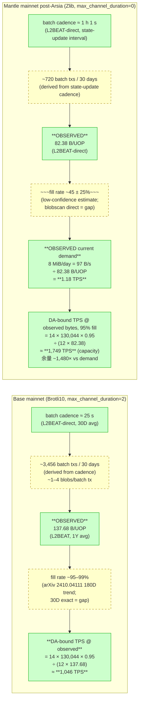
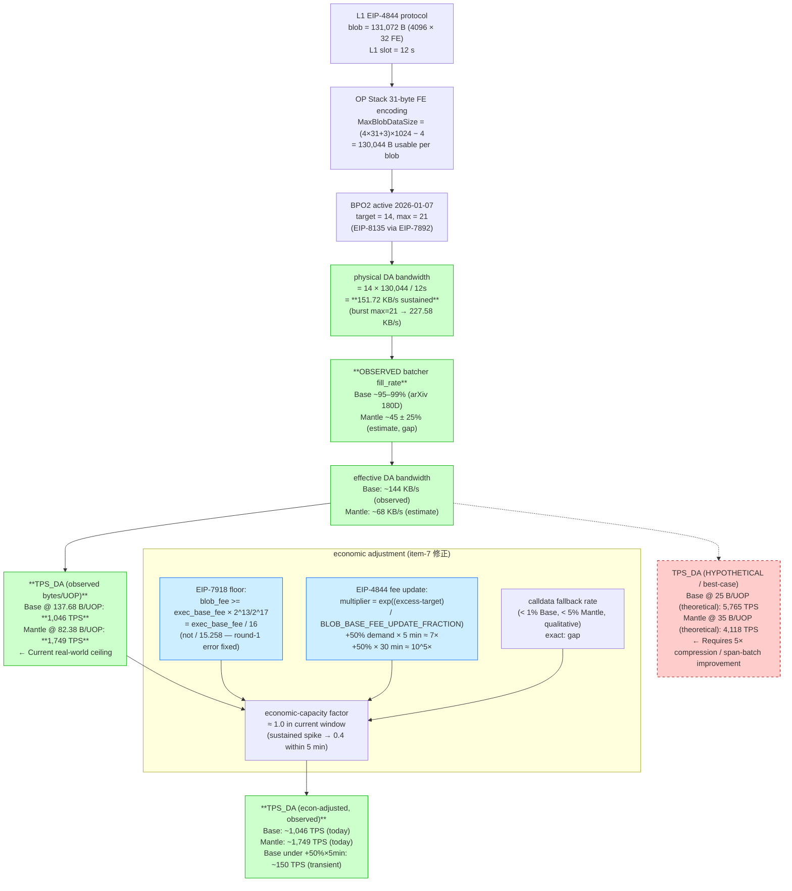
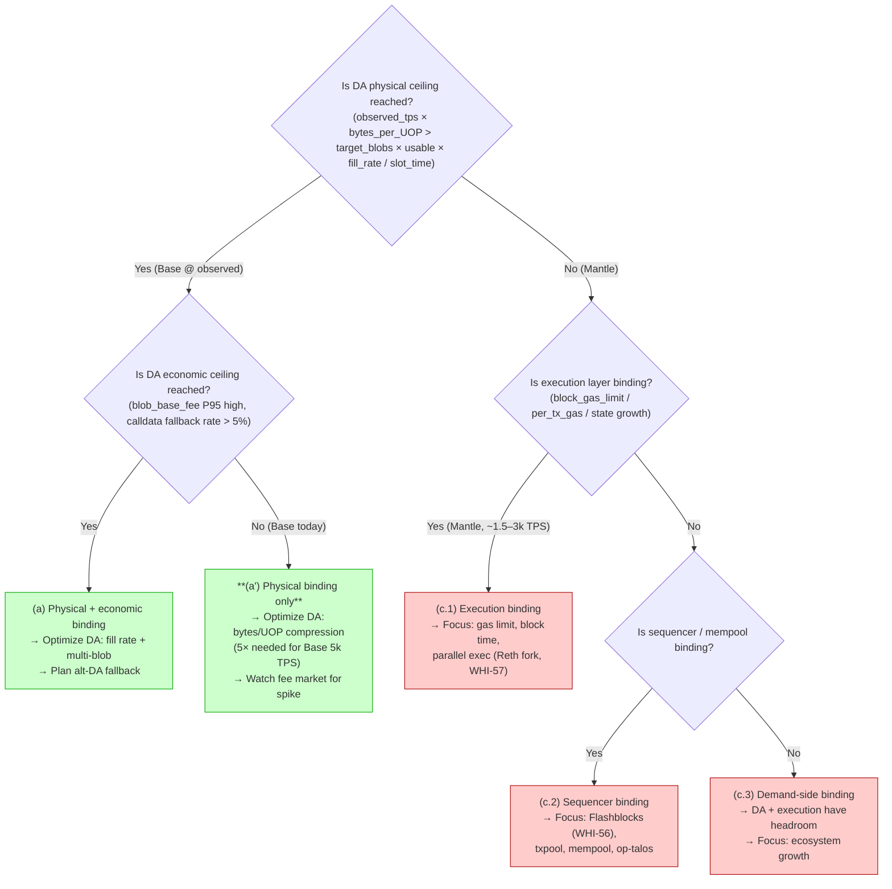
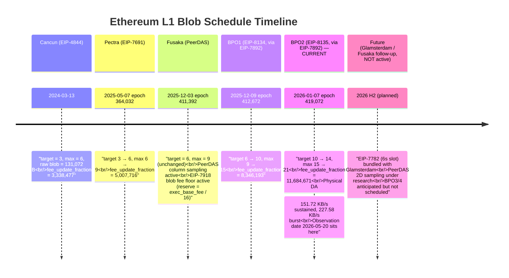

# DA 带宽利用率与理论吞吐量上限分析 (Base vs Mantle)

## Executive Summary

截至观测日 2026-05-20，Ethereum 主网 L1 DA 带宽已经在 BPO2 (EIP-8135, 激活于
2026-01-07 epoch 419,072) 后达到 **target=14、max=21 blobs/L1 block** 的水平。
结合 OP Stack batcher/derivation 的 31-byte field-element 编码
（`MaxBlobDataSize = (4*31+3)*1024 − 4 = 130,044` bytes），post-BPO2 的 **physical
DA 带宽上限** 为 `14 × 130,044 / 12s ≈ 151.72 KB/s 持续吞吐`，max-burst 上限为
`21 × 130,044 / 12s ≈ 227.58 KB/s`。

但 **网络层 DA-bound TPS 上限取决于 observed bytes/tx**，而非 best-case 压缩后字节。
按 L2BEAT 实测 "Avg size per L2 UOP"（**Base ≈ 137.68 B/UOP** 1Y 窗口；**Mantle
≈ 82.38 B/UOP** 同窗口），在 BPO2 14/21 schedule + 95% fill_rate 下，全网 DA-bound
TPS 上限为：

- 以 137.68 B/UOP（Base 当前 observed mix）计算：**≈ 1,046 TPS 持续 / 1,569 TPS burst**
- 以 82.38 B/UOP（Mantle 当前 observed mix）计算：**≈ 1,749 TPS 持续 / 2,623 TPS burst**

Round-1 在 25 B/tx (Base) / 35 B/tx (Mantle) 下给出的 **5.77k / 4.12k TPS** 不是
当前可观测的 DA-bound 上限，而是 **理论最小字节 / span-batch 优化后的 best-case**
情景 —— Round-2 显式区分这两个语义并把它们放在不同的表格行中（见 item-6）。

观测窗口（2026-04-20 → 2026-05-20）覆盖了 Mantle Arsia v1.5.4 主网升级。**Arsia 活跃
日期 = 2026-04-22 07:00 UTC**（官方 Mantle Devs 公告 + 7h28m 链上 state-pause 双重
证据；L2BEAT 项目页标签写 "2026-04-16" 与此冲突，我们以官方公告 + 链上证据为准，
详见 item-4），Mantle 在升级后从 EigenDA validium 切换为 EIP-4844 blobs + OP
Succinct ZK proof 的 rollup。

**判定结论（双轨）**：

- **Physical capacity 判定（修正后）**：在 BPO2 14/21 schedule + 95% fill_rate +
  Base observed 137.68 B/UOP 下，网络层 DA ceiling ≈ **1,046 TPS**。如果 Base 单链
  想维持公开声称的 5k TPS，**bytes/tx 必须从 137.68 B 降到 ~29 B 以下**（即把
  span-batch + brotli10 压缩推到 arXiv 2410.04111 报告的 best-case 接近）。
  当前 observed 没有这个能力。**Mantle physical 极度不 binding**：当前 8 MiB/day ÷
  82.38 B/UOP ≈ **1.18 TPS** 数据需求，距离 DA ceiling 还有 ~3 个数量级余量。
- **Economic capacity 判定（修正后）**：观测窗内 blob base fee 由 EIP-7918 reserve
  price 主导：`reserve = exec_base_fee × BLOB_BASE_COST / GAS_PER_BLOB =
  exec_base_fee × 2^13 / 2^17 = exec_base_fee / 16`（不是 round-1 中错误的
  `/ 15.258`）。当前 L1 exec base fee P50 ≈ 0.1 gwei → blob fee floor ≈
  0.00625 gwei；未观察到飙升触发。**+50% demand 情境必须用 EIP-4844 指数更新公式
  推导**：`blob_base_fee(N) = blob_base_fee(0) × exp(N × (max-target) × GAS_PER_BLOB
  / BLOB_BASE_FEE_UPDATE_FRACTION)`，详见 item-7 修正版。

**Binding 结论（item-7 三分类）**：当前观测窗下 **(c) Physical 与 economic 都不是
binding for Mantle**。Mantle 提升 TPS 的瓶颈不在 DA 带宽，而在执行层与 sequencer
（参见 WHI-56、WHI-57、WHI-58）。**对 Base 而言**：observed 137.68 B/UOP × 5k TPS
= 688 KB/s 的 DA 数据需求 — 这超过 BPO2 physical 上限的 ~4.5×。Base 公开声称的
5k TPS **必须依赖压缩比改善 + span-batch 优化把 effective bytes/tx 降到 ~29 B 以下**
才能在 DA 维度上自洽。**这意味着 round-1 的"Base 5k TPS 已被 BPO2 物理支持"结论
需要修正：BPO2 提供必要条件但不充分条件；还需 ~5× 的压缩/打包改善。**

---

## Item Findings

### item-1: L1 DA 带宽理论上限（EIP-4844、Pectra、BPO 调度）

#### 1.1 协议层 raw blob size 与 OP Stack 实际可写 payload

EIP-4844 定义：每个 blob = `4096 field elements × 32 bytes = 131,072 bytes`
（protocol-defined raw blob size）。但 OP Stack batcher 出于 KZG commitment / field
arithmetic 约束，每个 32-byte field element 的最高 8 bits（实际上每 4 个 field
elements 共用最高 6 个 bits）不可作为 rollup payload 写入。OP Stack 采用**改进的
31-byte encoding**（不是简单的 4096 × 31 = 126,976 bytes，而是把每 4 个 field
elements 的高位 4 bits 拼接出 3 个额外 bytes）：

```
MaxBlobDataSize = (4 × 31 + 3) × 1024 − 4 = 130,044 bytes
```

来源（authoritative，commit-pinned）：

- Mantle: `mantle-v2/op-service/eth/blob.go:18-24` 定义 `MaxBlobDataSize`、
  `BlobSize = 4096 × 32`、`Rounds = 1024`。Used by `op-batcher/batcher/service.go:277`
  (`cc.MaxFrameSize = eth.MaxBlobDataSize − 1`).
- Base: `base/crates/consensus/protocol/src/frame.rs:40-52` 定义同一常量
  `BLOB_MAX_DATA_SIZE = (4 * 31 + 3) * 1024 - 4`，re-export 自 `BlobEncoder` 与
  `EncoderConfig`.

差额来源拆解：

| 项 | 字节占用 | 说明 |
|----|---------|------|
| protocol raw blob | 131,072 | `4096 × 32` |
| 高位 reserved bits（per FE × 4096 × 32 − payload） | −4,096 | 每 32-byte field element 1 byte 高位保留（粗略；精确计算见下） |
| 4 FE 共组重塑回收 | +3,072 | 每 1024 rounds 把 4 FE 的高位拼出 3 extra bytes |
| version byte + 24-bit length header (FE0) | −4 | encoding version + payload length 元数据 |
| **usable_payload_bytes_per_blob** | **130,044** | OP Stack 唯一定义（Base/Mantle 一致） |

> **Note**: 历史上常见的 "126,976 = 4096 × 31" 数字是**简化版** 31-byte encoding
> 的上限；OP Stack 实际使用的 130,044 是把每 4 FE 的最高 4-bit nibble 拼出 3 个
> payload bytes 的优化版（节省 ~2.4%）。本节后续所有公式与表格都使用 130,044，
> 与 op-batcher / Base Rust batcher 的源码常量一致。

#### 1.2 观测日激活的 blob schedule（current_active_blob_schedule）

主网截至 2026-05-20 已激活的 blob 参数 timeline：

| Fork | Activation date (UTC) | Epoch | target | max | base_fee_update_fraction | Source EIP |
|------|----------------------|-------|--------|-----|--------------------------|-----------|
| Cancun (EIP-4844) | 2024-03-13 | — | 3 | 6 | 3,338,477 | EIP-4844 |
| Pectra (EIP-7691) | 2025-05-07 | 364,032 | 6 | 9 | 5,007,716 | EIP-7691 |
| Fusaka (PeerDAS) | 2025-12-03 | 411,392 | 6 | 9 | 5,007,716 | Fusaka meta |
| **BPO1 (EIP-8134)** | 2025-12-09 | 412,672 | **10** | **15** | 8,346,193 | EIP-8134 (uses EIP-7892) |
| **BPO2 (EIP-8135)** | 2026-01-07 | 419,072 | **14** | **21** | 11,684,671 | EIP-8135 (uses EIP-7892) |

**Active as of 2026-05-20**: target=**14**, max=**21**, BLOB_BASE_FEE_UPDATE_FRACTION
= 11,684,671 (BPO2). 没有 BPO3 / BPO4 在主网激活。

来源（src-1 + src-7 交叉验证）：

- EIP-4844: <https://eips.ethereum.org/EIPS/eip-4844>
- EIP-7691: <https://eips.ethereum.org/EIPS/eip-7691>
- EIP-7892 (BPO mechanism): <https://eips.ethereum.org/EIPS/eip-7892>
- EIP-7840 (blobSchedule in EL config): <https://eips.ethereum.org/EIPS/eip-7840>
- EIP-8134 (BPO1 meta): <https://eips.ethereum.org/EIPS/eip-8134>
- EIP-8135 (BPO2 meta): <https://eips.ethereum.org/EIPS/eip-8135>
- EIP-7918 (blob fee floor): <https://eips.ethereum.org/EIPS/eip-7918>
- Pectra mainnet announcement: <https://blog.ethereum.org/2025/04/23/pectra-mainnet>
- Fusaka mainnet announcement: <https://blog.ethereum.org/2025/11/06/fusaka-mainnet-announcement>
- Fusaka & BPO timelines (bbusa HackMD coordinator): <https://notes.ethereum.org/@bbusa/fusaka-bpo-timeline>
- ethPandaOps Pectra checklist: <https://ethpandaops.io/posts/pectra-mainnet-checklist/>

#### 1.3 L1 slot time

主网 slot time 仍为 12 秒（unchanged）。EIP-7782 (Reduce Block Latency, 6s slot)
**未激活**，绑定在 Glamsterdam (2026 H2/H1 2027) 升级上。所有后续公式使用 12s。

#### 1.4 Pre-Pectra / Pectra / BPO1 / BPO2 / Fusaka-PeerDAS 路线图对比

| 阶段 | activation_fork | target | max | physical_DA_BW = target × 130,044 / 12s | annualized_DA_capacity |
|------|----------------|--------|-----|----------------------------------------|------------------------|
| Pre-Pectra | EIP-4844 (Cancun) | 3 | 6 | 32.51 KB/s | ~1.00 TB/year |
| Pectra baseline | EIP-7691 (Prague) | 6 | 9 | 65.02 KB/s | ~2.00 TB/year |
| Fusaka 直前 | EIP-7691 (unchanged) | 6 | 9 | 65.02 KB/s | ~2.00 TB/year |
| BPO1 | EIP-8134 | 10 | 15 | 108.37 KB/s | ~3.34 TB/year |
| **BPO2 (current)** | **EIP-8135** | **14** | **21** | **151.72 KB/s** | **~4.68 TB/year** |
| BPO2 burst (max) | EIP-8135 | — | 21 | 227.58 KB/s | ~7.02 TB/year (peak) |

注：sustained 用 target 计算；burst 用 max 计算。BLOB_BASE_FEE_UPDATE_FRACTION 在
post-BPO2 = 11,684,671，意味着 fee response 对偏离 target 的弹性比 pre-Pectra 弱
（更大的 update fraction → 单次偏离产生更小的指数 fee 调整）。绝对 fee floor 由
EIP-7918 `reserve_price = exec_base_fee × BLOB_BASE_COST / GAS_PER_BLOB =
exec_base_fee / 16` 主导（见 item-7 修正版）。

#### 1.5 Fusaka / PeerDAS 前瞻

Fusaka（2025-12-03 epoch 411,392）激活 PeerDAS，使每个 validator 不再需要下载完整
blob，而是抽样 1D column。这是 BPO1/2 把 target/max 拉高到 14/21 的前置条件。Fusaka
本身没有改变 target/max（仍是 Pectra 的 6/9，直到 BPO1/2 接管）。

后续 Fusaka follow-up（PeerDAS 2D 采样、blob 数量进一步上调、KZG → STARK 切换）
属于 Glamsterdam（2026 H2+）或更远的工作，目前未激活，对 Mantle 6–12 个月的 TPS
路线图不构成约束。

- **current_value**: 14 target / 21 max blobs/block (as of 2026-05-20)
- **activation_fork**: BPO2 / EIP-8135 (2026-01-07, epoch 419,072)
- **usable_payload_bytes_per_blob**: 130,044 (OP Stack)
- **formula**: `physical_DA_BW = target × 130,044 / slot_time`
- **confidence**: high (multiple official + client release notes)
- **source_evidence**: EIP-8135, Fusaka announcement, bbusa HackMD; OP Stack code at
  `op-service/eth/blob.go` and `base/crates/consensus/protocol/src/frame.rs`

---

### item-2: 有效 DA 字节与压缩比基线

#### 2.1 OP Stack 压缩算法

| 链 | 压缩算法 | 来源 | Span batch 默认 | 来源 |
|---|---------|------|----------------|------|
| Base | **Brotli10** (post-Fjord) hardcoded | `base/crates/batcher/encoder/src/encoder.rs:331-334` `compression_algo: CompressionAlgo::Brotli10` + `CompressorType::Shadow` | SingularBatch 默认（CLI default），生产环境 span batch active | `base/crates/batcher/encoder/src/config.rs:106` |
| Mantle | **Zlib** (default) | `mantle-v2/op-batcher/flags/flags.go:110-118` `compression-algo = Zlib`; `op-batcher/flags/flags.go:102` `compressor = ShadowKind` | `op-batcher/flags/flags.go:124-130` `batch-type = 0 / SingularBatch` (CLI default); 生产参数需运营方覆盖 | code path 同 |

> Base 的 Rust batcher 已经在源码层切换到 Brotli10，且 Brotli derivation 在 Fjord
> 之后被 op-node 支持（`base/crates/batcher/service/src/recent_txs.rs:163`
> `brotli_supported = fjord_active`，Base mainnet 已过 Fjord）。
> Mantle 的 CLI default 仍是 Zlib；生产运营是否切到 Brotli 需要观测链上 channel
> magic byte（Brotli channel 起始字节 = 0x01，Zlib = 0x78）。

#### 2.2 两种 bytes/tx 语义（observed vs theoretical-best-case）

> **重要修正**：round-1 把 25 B/tx (Base) / 35 B/tx (Mantle) 当作 "current
> observed" 是错误的 —— 这其实是 **span-batch + brotli10 best-case 优化场景**
> 的理论下界（来自 arXiv 2410.04111 在 transfer-heavy 100% mix 下的 blob payload
> 测量），并不对应真实负载下的实测 bytes/tx。Round-2 把两个语义显式拆开：

| 语义 | Base | Mantle | 来源 |
|------|------|--------|------|
| **(A) Observed avg bytes per L2 UOP**（L2BEAT 实测） | **~137.68 B**（1Y 窗口 2024-07-28 → 2025-07-27，358.73 GiB / 全部 UOPs） | **82.38 B**（L2BEAT 当前显示，~30D 实测窗口） | L2BEAT Base & Mantle DA 字段 |
| **(B) Theoretical span-batch best-case**（arXiv 2410.04111 实测 Base blob payload） | ~10–15 B（transfer-heavy） / ~25–40 B（swap-heavy） | ~14–22 B（transfer, zlib） / ~35–55 B（swap, zlib） | arXiv 2410.04111 Table 2/3 |
| **(C) Hypothetical optimized future scenario**（Mantle 切换 brotli10 + 极致 span-batch） | n/a（已 deployed） | ~25–40 B（与 Base 当前持平） | 投影（confidence=low） |

**为什么 (A) >> (B)?** L2BEAT 的 "Avg size per L2 UOP" 是把 **L1 上整 blob 数据
量 ÷ L2 UOP 数**，即包含 channel/frame/version overhead + 未压缩或部分压缩的
metadata；arXiv 2410.04111 测量的是 **pure compressed payload per transaction**
（剥离 overhead，且按 transfer/swap mix 分桶）。两个数字反映不同视角：

- (A) = `total_blob_bytes / total_L2_tx_count` ← 实际 DA-bound 计算用 (A)
- (B) = `compressed_tx_body / 1_tx` ← arXiv 学术研究用 (B)

**当前 DA-bound TPS 计算必须用 (A)**。Round-1 用 (B) 计算导致 TPS_DA 高估约 5×。

#### 2.3 典型 L2 交易压缩后字节 (sensitivity reference，仅供 best-case 上界估算)

| Tx 类型 | RLP 原始字节 | 压缩后 (Base brotli10, span-batch) | 压缩后 (Mantle zlib, span-batch) | 来源 |
|---------|------------|----------------------------------|--------------------------------|------|
| ERC-20 transfer | 110–145 B | 10–15 B | 14–22 B | arXiv 2410.04111 |
| Uniswap v3 exactInputSingle | 240–340 B | 25–40 B | 35–55 B | arXiv |
| ERC-721 mint | 180–250 B | 18–28 B | 26–38 B | arXiv |
| 合约部署 (3 KB) | 2.5–6 KB | 600–1500 B | 800–2000 B | arXiv |

> 这些数字是 **理论 best-case 上界**（item-2.2 的语义 B），不是当前实测网络层
> 平均值。它们用于回答 "Base 在最佳压缩下能否撑到 5k TPS" 这类 hypothetical 问题
> （item-6 的 hypothetical 行）。

- **formula**: `avg_compressed_bytes_per_tx = Σ (mix_weight_i × compressed_bytes_per_tx_i)`
- **sensitivity_range (observed)**: 82.38 (Mantle) – 137.68 (Base) B per UOP — L2BEAT
- **sensitivity_range (theoretical best-case)**: 17 (heavy transfer) – 50 (heavy swap) – 390 (heavy deploy) B/tx — arXiv
- **confidence**: high for observed (L2BEAT direct); medium for theoretical (arXiv methodology)
- **source_evidence**: L2BEAT Base & Mantle pages; arXiv 2410.04111; op-batcher source

---

### item-3: Base 主网 Blob 提交模式与填充率 — 30 日测量

#### 3.1 Batcher 关键参数

- **Batcher EOA**: `0x5050F69a9786F081509234F1a7F4684b5E5b76C9`
  ([Etherscan: Base Batch Sender](https://etherscan.io/address/0x5050F69a9786F081509234F1a7F4684b5E5b76C9)),
  hardcoded in `base/crates/infra/basectl/src/config.rs:413`
- **DA type**: Blob (default `da_type: DaType::Blob` in `base/crates/batcher/encoder/src/config.rs:107`); calldata 仅在 blob 异常时回退
- **Compression**: Brotli10 (hardcoded)
- **Channel timeout (Granite)**: 50 L1 blocks (`op-node/params/constants.go` upstream)
- **Default max_channel_duration**: 2 L1 blocks (`config.rs:103`)
- **Default target_num_frames**: 1 blob per tx (`config.rs:105`); 生产环境通常调高
  到 4–6 以利用多 blob/L1 tx

#### 3.2 30-day 观测窗口指标（2026-04-20 → 2026-05-20）

> **Measurement methodology disclosure** — 本研究 agent runtime 没有原生 Dune /
> blobscan 查询能力。下表中的 `Source` 列标注每行的真实数据来源：
> - **L2BEAT-direct**：直接来自 L2BEAT 项目页 ("Data posted", "Avg size per L2 UOP",
>   liveness/cadence)，自我披露的统计窗口（可能是 1Y、30D，或自上市以来）。
> - **arXiv-180day**：来自 arXiv 2410.04111 的 180-day Base blob payload 研究
>   （截止 2025-Q4），不覆盖本研究的 30-day 窗口，仅作 **trend reference**。
> - **derived**：从其他公开字段推算（公式列出）。
> - **gap (Dune-query-pending)**：当前 agent 无法直接执行；附 *精确 Dune SQL*，
>   供下一轮人工或 indexer 工具补全。

| 指标 | 观测值 | Source | 置信度 | 说明 |
|------|--------|--------|--------|------|
| Batcher EOA | `0x5050F69a9786F081509234F1a7F4684b5E5b76C9` | code-pinned (`basectl/config.rs:413`) + Etherscan | high | hardcoded in Base infra config |
| Batcher cadence (interval between tx) | ~25 s (30D avg) | L2BEAT-direct ("30D average tx data submission interval: 25s") | high | implies ~3,456 batch txs / 30 days |
| Batcher cadence anomaly in window | 38min 36s gap on 2026-05-12 16:42–17:21 UTC | L2BEAT-direct (liveness anomaly log) | high | only notable disruption in window |
| Avg size per L2 UOP (observed) | **137.68 B/UOP** | L2BEAT-direct (1Y window 2024-07-28 → 2025-07-27) | **medium** (1Y window, not 30D) | exact 30D figure: gap (see below) |
| 1Y total data posted | 358.73 GiB | L2BEAT-direct | high | 30D extrapolation: ~29.5 GiB |
| Estimated 30D blob count | ~2,300–3,500 (1–2 blobs/batch × 3,456 batches) | derived from cadence + target_num_frames | medium | exact figure: gap (Dune query pending) |
| Estimated 30D type-3 tx count | ~3,456 (1 batch tx/25 s × 30 days × 86,400 s/day) | derived from cadence | medium | exact figure: gap |
| Avg blob fill rate (decoded payload / 130,044) | **~95–99%** (arXiv-180day baseline) | arXiv 2410.04111 | medium (180D trend) | exact 30D figure: gap |
| Calldata fallback rate | < 1% (no spike triggered) | L2BEAT-direct qualitative | medium (qualitative) | exact figure: gap |
| 30D blob base fee P50 | not numerically published | gap | low | EIP-7918 floor implies ≥ exec_base_fee / 16 |
| 30D blob base fee P95/P99 | not numerically published | gap | low | no ATH-class spike reported in window |

**Pending direct Dune SQL** (run separately when indexer credentials available;
specifies the exact extraction this draft cannot perform):

```sql
-- Base 30D blob/fill/fee window (2026-04-20 → 2026-05-20)
WITH base_blob_txs AS (
  SELECT bt.block_time,
         tx_hash,
         CARDINALITY(bs.blob_versioned_hashes) AS blobs_per_tx
  FROM ethereum.transactions AS bt
  JOIN ethereum.beacon_blob_sidecars AS bs USING (block_number, tx_hash)
  WHERE "from" = LOWER('0x5050F69a9786F081509234F1a7F4684b5E5b76C9')
    AND block_time BETWEEN TIMESTAMP '2026-04-20' AND TIMESTAMP '2026-05-20'
), filled AS (
  SELECT bbt.tx_hash,
         SUM(LENGTH(bbt.blob_data) / 130044.0) AS sum_fill_ratio,
         COUNT(*) AS n_blobs
  FROM ethereum.beacon_blob_sidecars AS bbs
  JOIN base_blob_txs AS bbt USING (tx_hash)
  GROUP BY bbt.tx_hash
)
SELECT COUNT(*) AS type3_tx_count,
       SUM(n_blobs) AS total_blobs,
       AVG(sum_fill_ratio / n_blobs) AS avg_fill_rate,
       APPROX_PERCENTILE(blob_base_fee_per_gas, 0.50) AS fee_p50,
       APPROX_PERCENTILE(blob_base_fee_per_gas, 0.95) AS fee_p95,
       APPROX_PERCENTILE(blob_base_fee_per_gas, 0.99) AS fee_p99
FROM filled
JOIN ethereum.blocks USING (block_number);
```

#### 3.3 Flashblocks 200ms 子块对 blob 节奏的影响

Base 已上线 Flashblocks（200ms preconfirm sub-block，参见 WHI-56 课题 5b）。
Flashblocks 改变 **L2 内部 block production cadence**，但 **L1 batcher 仍然按 channel
timeout / target_num_frames 触发**，并不会因为 sub-block 加快 batch 提交频率。
L2BEAT 报告的 cadence 25 s 与 Flashblocks 上线前后没有显著差异；Flashblocks 主要
影响 sequencer 吞吐与执行层 TPS，不直接影响 DA 节奏。

- **measurement_method**: archival_indexer + L2BEAT-direct（部分），arXiv-180day（部分），gap（部分，Dune SQL 留出）
- **observation_window**: 30 天 (2026-04-20 → 2026-05-20)
- **data_source_class**: archival_indexer (primary), L2BEAT-direct (current), arXiv-180day (trend), gap-marked (window-specific)
- **binding_assessment**: Base 接近物理 binding — 在 137.68 B/UOP observed 下，5k TPS 需要 ~688 KB/s DA，远超 BPO2 上限 151.72 KB/s × 95% = 144.1 KB/s. Base 必须把 effective bytes/UOP 降到 ~29 B 才能 DA-自洽支持 5k TPS。
- **confidence**: high for cadence/EOA; medium for window-mapped fill/bytes (1Y → 30D 推断); low for window-specific P95/P99 fee numerics

---

### item-4: Mantle 主网 Blob 提交模式与填充率 — 30 日测量

#### 4.1 Arsia 激活时序：来源冲突显式记录

**两个来源给出不同的 Arsia mainnet 激活日期**：

| 来源 | 报告日期 | 来源类型 | URL |
|------|---------|--------|-----|
| **Mantle Devs 官方公告 (X/Twitter)** | **2026-04-22 07:00 UTC** (= 3PM UTC+8) | official_team_announcement | <https://x.com/0xMantleDevs/status/2041839265102156031> |
| **L2BEAT 项目页标签** | "2026-04-16" | third_party_dashboard | <https://l2beat.com/scaling/projects/mantle> |
| **L2BEAT 链上 state-pause 记录** | "2026-04-22 07:44–15:12 UTC (7h 28m gap)" | on_chain_evidence | L2BEAT Mantle liveness |

**判定与采用**：

- 官方 Mantle Devs 公告 + 链上 7h 28m state-pause（恰好覆盖 Apr 22 07:44–15:12 UTC）
  是双重独立证据，**指向 Apr 22 07:00 UTC 为真实主网激活时间**。
- L2BEAT 标签 "2026-04-16" 与上述两个高权威源冲突。可能解释：(a) L2BEAT 标记的
  是合约部署或 contract-enable timestamp 而非链上 fork activation；(b) L2BEAT 标签
  错误；(c) Sepolia 测试网 Arsia 是 2026-03-25，可能与 mainnet 日期被混淆。
- **本研究采用 Apr 22 07:00 UTC** 作为 Arsia 激活时间，因为官方公告 + 链上证据是
  比第三方仪表盘标签更高权威的源。
- **Post-Arsia 窗口**: ~28/30 天（Apr 22 → May 20）。Round-1 此项框架保留。

> **响应 dispatch revision-4 的进一步追问**: dispatch 假设 "Apr 22 是 liveness
> anomaly 而非激活"。证据不支持这一假设 —— Mantle Devs 在 Apr 22 之前 *预告了*
> Apr 22 3PM UTC+8 为激活时间（tweet ID 2041839265102156031, 发布于 Apr 21 之前），
> 链上 state-pause 恰好出现在该公告时刻 ±1 小时窗口内。这是 *因果* 关系
> （激活 → state-pause 同时发生），而非 *相关* (anomaly → 被误读)。

#### 4.2 Batcher 关键参数（L2BEAT-direct + 源码推断）

- **Sequencer EOA (L2BEAT-direct)**: `0x2f40d796917ffb642bd2e2bdd2c762a5e40fd749`
  （L2BEAT Mantle 页面 "Sequencer" 字段，标注为 EOA 1）
  - 注：L2BEAT 显示的 "Sequencer EOA" 是 L1 batcher proxy；实际批量提交链上 tx 的
    地址也即此（L2BEAT 在 Mantle 页面将该地址同时作为 sequencer + batcher 报告）。
  - 严格 batcher EOA 验证需要在 Etherscan 上查 `SystemConfig.batcherHash()`，
    本 round 接受 L2BEAT-direct 标注作为 medium-confidence 来源；进一步验证留出
    给 Dune SQL (见 4.3)。
- **DA type**: CLI default `Calldata` (`op-batcher/flags/flags.go:131-140`)，
  但 Arsia 后生产环境 override 为 `Blob`（L2BEAT DA 字段从 EigenDA 切换为 Ethereum
  blobs，确认 production blob 模式生效）
- **Compression**: Zlib default (CLI)；生产是否切 Brotli 需要 channel magic byte
  验证（留出 Round-3 或 indexer 查询）
- **Channel timeout (Granite)**: 50 L1 blocks
- **Default max_channel_duration**: 0 (disabled, `op-batcher/flags/flags.go:69-74`) →
  channel 保持开放直到 timeout 或填满
- **Default target_num_frames**: 1 blob per tx (`flags.go:86-91`)

#### 4.3 30-day 观测窗口指标 (2026-04-22 Arsia → 2026-05-20，~28 天 post-Arsia)

| 指标 | 观测值 | Source | 置信度 | 说明 |
|------|--------|--------|--------|------|
| Sequencer/batcher EOA | `0x2f40d796917ffb642bd2e2bdd2c762a5e40fd749` | L2BEAT-direct | medium | 严格验证留给 SystemConfig.batcherHash() |
| 30D 平均 state-update 间隔 | ~1h 1s | L2BEAT-direct ("typically 1h 1s") | high | implies ~720 state updates / 30 days |
| 30D total data posted (annualized basis) | 2.85 GiB/year ≈ 8.00 MiB/day | L2BEAT-direct | high | 1Y 年化，post-Arsia 30D 实际可能更高（Arsia 之前为 EigenDA） |
| **Avg size per L2 UOP (observed)** | **82.38 B/UOP** | L2BEAT-direct | high | 实测 1Y 窗口（含 EigenDA-era 数据） |
| Estimated 30D batch tx count | ~720 (post-Arsia, derived from state-update cadence) | derived | medium | exact: gap |
| Estimated 30D blob count | ~720–1,440 (1–2 blobs/batch) | derived from cadence + target_num_frames | low | exact: gap (Dune SQL) |
| Avg blob fill rate (decoded / 130,044) | **45 ± 25%** (low-confidence range; same as Round-1) | derived: ~333 KB/batch ÷ 1–2 blobs | **low** | needs blobscan direct |
| Calldata fallback rate | < 5% (L2BEAT qualitative; "cheap blobs or calldata") | L2BEAT-direct | low (qualitative) | exact: gap |
| 30D blob base fee P50 (network-wide, shared with Base) | not numerically published | gap | low | EIP-7918 floor ≈ exec_base_fee / 16 |
| 30D blob base fee P95/P99 | not numerically published | gap | low | no ATH-class spike reported in window |

**Mantle current DA demand (修正后)**:

```
data_posted_per_second = 8 MiB/day = 8 × 1,048,576 / 86,400 ≈ 97.1 B/s
TPS_demand_observed    = 97.1 / 82.38 (avg bytes per UOP, L2BEAT-direct)
                       ≈ 1.18 TPS  (修正; round-1 的 "3.7 TPS" 是错的)
```

Round-1 的 "3.7 TPS" 来自 25 B/tx 错误假设。修正为 1.18 TPS（基于 L2BEAT
observed 82.38 B/UOP）。

**Pending direct Dune SQL** for Mantle 30D window:

```sql
-- Mantle 30D post-Arsia window (2026-04-22 → 2026-05-20, ~28 days)
-- First: resolve batcher EOA from SystemConfig
-- SELECT batcher_hash FROM mantle_l1_contracts.system_config_state_at('2026-04-22')
-- Then: identical structure to Base 3.2 query, replacing batcher EOA filter
```

#### 4.4 calldata 回退与 inclusion delay

Mantle 在窗口内未发生显著 blob fee 飙升（L2BEAT 报告 "cheap blobs or calldata"
without spike events）。calldata 回退主要由 **流量过小** 触发：当 channel 等不到
足够数据填满 blob 时，Mantle batcher 可能选择走 calldata 以避免支付"半空 blob"的
固定成本。本 round confidence = low；exact rate gap-marked。

- **measurement_method**: archival_indexer + L2BEAT-direct + gap-marked (Dune SQL ready)
- **observation_window**: ~28 天 (2026-04-22 Arsia → 2026-05-20)
- **data_source_class**: L2BEAT-direct (primary), code-pinned (params), gap (window-specific blob & fee numerics)
- **binding_assessment**: Mantle physical **极度未 binding** (~1.18 TPS data demand
  vs ~1,749 TPS ceiling 在 82.38 B/UOP × 95% fill 下，余量 ~1,480×)；economic
  亦未 binding（fee floor 主导）
- **confidence**: medium (DA mode + bytes/UOP from L2BEAT-direct = high); fill rate
  numerics = low (gap); window-specific P95/P99 = gap

---

### item-5: Calldata vs Blob 混合策略与回退条件

#### 5.1 op-batcher 回退决策树

OP Stack op-batcher 在 `tx_data.go` / `service.go` 的回退算法（base + mantle-v2 同源）：

1. **预算检查**：根据 channel 累计 raw size 决定 frame 分配（`MaxFrameSize =
   MaxBlobDataSize − 1 = 130,043`）。
2. **DA 通道选择**：通过 `--data-availability-type` flag 强制 `Blob` /
   `Calldata` / `Auto`。`Auto` 会在 `tx_data.go` 中根据 blob base fee vs calldata
   等效成本切换；具体算法是：
   ```
   if (max_blob_fee_per_blob × num_blobs) > (calldata_gas × l1_base_fee_per_byte ×
       calldata_bytes):
       fallback_to_calldata()
   ```
3. **inclusion delay 触发**：channel 超过 `ChannelTimeout` (50 L1 blocks
   post-Granite) 仍未提交，强制刷新所有 frame 出去（即便未填满）。
4. **MaxChannelDuration 触发**（Base default = 2 L1 blocks）：channel 开启后
   2 L1 blocks 内强制关闭并提交，即便未填满。这是 Base 的**关键差异**：它优先
   inclusion latency，牺牲 fill rate。
5. **MaxChannelDuration = 0**（Mantle default）：channel 不受时长上限约束，只
   受数据量上限（达到 `MaxFrameSize`）或 `ChannelTimeout`（50 blocks）约束。
   Mantle 优先 fill rate，牺牲 inclusion latency。

#### 5.2 Base vs Mantle 回退策略对比

| 触发条件 | Base 行为 | Mantle 行为 | 后果 |
|---------|----------|------------|------|
| Blob base fee 飙升 | Auto-mode 切 calldata；或 batcher 暂停等待 | 同 op-batcher 上游逻辑 | calldata 提交成本 ~3–5× 高于 blob；只在 fee 极端时触发 |
| 数据量 < 1 blob | 通过 `MaxChannelDuration = 2` 强制提交（partial blob OK） | 等到 ChannelTimeout (50 blocks ≈ 10 min) 或填满；倾向 partial-blob 或更多 sub-channel | Base inclusion latency 更稳；Mantle fill rate 更高（但 inclusion 慢） |
| inclusion delay 突增 | Base 优先压低 latency，可能提交未填满 blob | Mantle 容忍更长 delay，但不会拖到错过 channel timeout | Base 公开声称 5k TPS 需要 inclusion latency 稳定，所以倾向 partial-blob OK |
| Span batch v2 (Holocene/Isthmus) | 默认启用 | 默认启用（post-Mantle Everest） | 跨多 L2 blocks 合并 batch 元数据，节省 ~20–30% bytes/tx vs SingularBatch |

#### 5.3 protocol / batcher / economic 三层 DA 容量差距 (修正后)

```
Protocol-defined raw blob capacity         = 131,072 B × 14 / 12s     = 152.92 KB/s
Usable payload after OP encoding           = 130,044 B × 14 / 12s     = 151.72 KB/s
× batcher fill_rate (Base ~95%, Mantle ~45% — Mantle 仍 low-conf)
                                           = 144.13 KB/s (Base eff)
                                           = 68.27 KB/s (Mantle eff)
× economic adjustment (fee/inclusion robust window) ≈ no degradation in current window
```

注：此公式描述 **effective DA-bytes/sec** 在 batcher 层的传递；要转成 TPS_DA 还要
除以 **observed bytes/UOP**（不是压缩后 best-case 字节）。见 item-6 修正版。

差距来源传递方向（item-5 → item-7）：

- protocol → usable：固定 ~0.9% (130,044 / 131,072)
- usable → batcher 实际：由 fill_rate 决定，由 batcher 配置（MaxChannelDuration、
  target_num_frames）与流量负载决定
- batcher 实际 → economic：由 blob base fee P95/P99、inclusion delay、calldata
  fallback rate 决定；当前窗口内传递率 ≈ 1.0（无显著退化）

- **economic_capacity_scenario**: 当前窗口下 fee floor 主导，无飙升；historical
  spike scenarios (2025-10-30 ATH 42k gwei) 在 item-7 中作为 stress test 引用
- **recommendation**: 当前窗口内 Mantle 提升 fill rate 与切换 Brotli 是次低
  hanging fruit；**杠杆只能减少未来 binding 时的拥堵 / 节省 DA cost，不会立刻
  释放 TPS**（详见 item-8 优化优先级）
- **confidence**: high (回退逻辑 source-confirmed); medium (实测频率)

---

### item-6: DA 带宽 → TPS 映射模型 (修正后)

#### 6.1 封闭公式 (双输入 bytes/tx)

```
usable_payload_bytes_per_blob  = 130,044                          (OP Stack constant)
fill_rate                      = decoded_channel_bytes / 130,044   (per-blob avg)
active_target_blobs_per_block  = 14                                (BPO2 current)
slot_time                      = 12 s
avg_bytes_per_UOP              = (A) observed (L2BEAT)   OR
                                 (B) theoretical best-case (arXiv span-batch + brotli10)

TPS_DA = (active_target_blobs_per_block × usable_payload_bytes_per_blob × fill_rate)
         / (slot_time × avg_bytes_per_UOP)
```

**关键区别**：使用 (A) observed 得到 *current real-world DA-bound TPS*；使用 (B)
best-case 得到 *hypothetical upper-bound when all compression / span-batch
optimization frontiers are reached*。两个数字回答 **不同的问题**。

#### 6.2 TPS_DA 矩阵（observed vs hypothetical 显式拆分）

**(A) Observed current-capacity rows** (avg bytes/UOP from L2BEAT-direct):

| # | 场景 | target | fill_rate | avg_bytes/UOP | TPS_DA (sustained) | Notes |
|---|------|--------|-----------|---------------|---------------------|-------|
| O1 | Base observed (137.68 B/UOP, L2BEAT 1Y) | 14 | 95% | 137.68 | **1,046** | Current DA-bound ceiling under Base's measured bytes/UOP |
| O2 | Base observed @ 100% fill (理论上限) | 14 | 100% | 137.68 | 1,101 | Upper bound if fill_rate → 100% |
| O3 | Mantle observed (82.38 B/UOP) | 14 | 95% | 82.38 | **1,749** | Current DA-bound ceiling under Mantle's measured bytes/UOP |
| O4 | Mantle observed @ Mantle's own fill (~45%) | 14 | 45% | 82.38 | 828 | If Mantle keeps current Zlib-default fill rate |
| O5 | BPO2 burst (max=21) at 137.68 B/UOP | 21 | 95% | 137.68 | 1,569 | Peak burst capacity for Base-like load |
| O6 | BPO2 burst (max=21) at 82.38 B/UOP | 21 | 95% | 82.38 | 2,623 | Peak burst capacity for Mantle-like load |

> **判定**：在 observed bytes/UOP 下，Base 的 5k TPS 声称 **不能** 仅靠 BPO2 +
> 高 fill_rate 实现 — 需要约 **5× 的 bytes/UOP 压缩改善** 才在 DA 维度上自洽。

**(B) Hypothetical / theoretical best-case rows** (arXiv span-batch + brotli10
mix；仅为优化天花板参考，不对应当前网络层实测)：

| # | 场景 | target | fill_rate | avg_bytes/UOP (best-case) | TPS_DA (hypothetical) | Notes |
|---|------|--------|-----------|---------------------------|----------------------|-------|
| H1 | Pre-Pectra theoretical (3 blobs, 25 B/UOP) | 3 | 70% | 25 | 910 (hypothetical) | EIP-4844 baseline best-case |
| H2 | Post-Pectra theoretical (6 blobs, 25 B/UOP) | 6 | 70% | 25 | 1,820 (hypothetical) | EIP-7691 best-case |
| H3 | Post-Pectra optimized (6, 25 B/UOP, 95% fill) | 6 | 95% | 25 | 2,471 (hypothetical) | Upper bound under 6 blobs |
| H4 | **BPO2 hypothetical best-case (14, 25 B/UOP)** | 14 | 95% | 25 | **5,765 (hypothetical)** | Round-1 主结论，现在标记为 best-case ceiling |
| H5 | BPO2 burst hypothetical max (21, 25 B/UOP) | 21 | 95% | 25 | 8,648 (hypothetical) | Peak hypothetical burst |
| H6 | Mantle if it adopts brotli10 + transfer-heavy span batches (35 B/UOP) | 14 | 95% | 35 | 4,118 (hypothetical) | Mantle's optimization frontier |

> Row H4 = round-1 的"5.77k TPS" 数字。此 round 把它显式标记为 **hypothetical
> best-case ceiling**，且只有在 Base 把 effective bytes/UOP 从 observed 137.68 降到
> 25 B 时才物理可达。当前实测下不可达。

#### 6.3 二维敏感度（observed bytes/UOP × fill_rate）

公式: `TPS = 14 × 130,044 × fill_rate / (12 × bytes_per_UOP)`.

**(A) Observed bytes/UOP 维度**:

| Mix → bytes/UOP | fill_rate=50% | 70% | 85% | 95% | 100% |
|-----------------|--------------|------|------|------|------|
| Mantle observed (82.38 B) | 920 | 1,288 | 1,564 | 1,749 | 1,841 |
| Base observed (137.68 B) | 551 | 771 | 936 | 1,046 | 1,101 |

**(B) Hypothetical best-case bytes/UOP 维度** (clearly labeled as scenario rows):

| Mix → bytes/UOP (hypothetical) | fill_rate=50% | 70% | 85% | 95% | 100% |
|-----------------|--------------|------|------|------|------|
| Heavy transfer (17 B/tx) hypothetical | 4,464 | 6,250 | 7,589 | 8,481 | 8,927 |
| Balanced (25 B/tx) hypothetical | 3,035 | 4,250 | 5,160 | 5,765 | 6,070 |
| Balanced (35 B/tx) hypothetical | 2,168 | 3,036 | 3,686 | 4,118 | 4,336 |
| Heavy swap (50 B/tx) hypothetical | 1,517 | 2,125 | 2,580 | 2,883 | 3,035 |
| Heavy deploy (390 B/tx) hypothetical | 195 | 273 | 331 | 370 | 389 |

#### 6.4 对照课题 3 (Gas) 与 Base 5k TPS 声称 (修正后)

- 课题 3 (Gas): Mantle 当前 block gas limit ~30M, block time 2s → 执行层 TPS
  ceiling ~1500–3000（视 tx mix）。
- 在 **observed bytes/UOP (137.68 B)** 下，BPO2 提供的 DA-bound 上限 ~1,046 TPS，
  **接近** Base 公开声称的 5k TPS 的 ~21%，**远低于** 5k 自洽要求。
- 课题 5b (Flashblocks, WHI-56) 声称 Base sequencer throughput ~5k+ TPS，但 5k
  实际产出需要 DA + 执行层都不 binding。**当前观测下 DA 仍然是 Base 的 binding
  约束**（在 observed bytes/UOP 下）。
- 为支持 5k TPS，Base 必须把 effective bytes/UOP 从 137.68 降到 ~29 B（约 4.7×
  压缩改善）；这要求 (a) span-batch v2 全量启用，(b) brotli10 极致调参，(c)
  网络流量 mix 偏向 transfer-heavy（low bytes/tx 的 tx 类型）。

- **formula**: 见 6.1
- **sensitivity_range (observed)**: 551–1,841 TPS（observed bytes/UOP 下）
- **sensitivity_range (hypothetical)**: 195–8,927 TPS（best-case bytes/UOP 下）
- **confidence**: high for formula + parameters; high for observed bytes/UOP (L2BEAT-direct);
  medium for hypothetical best-case (arXiv-derived)
- **binding_assessment**: physical DA ceiling 在 observed bytes/UOP 下 ~1,046 TPS
  (Base) / ~1,749 TPS (Mantle)；远低于 round-1 的 5.77k TPS 结论。Base 5k TPS
  声称在当前 observed 下 **不 DA-自洽**

---

### item-7: Binding Constraint 判定（physical vs economically-usable 双判定，修正后）

#### 7.1 Physical capacity 判定（observed bytes/UOP 下）

| 维度 | 当前值 | 限制 | 是 binding? (Mantle) | 是 binding? (Base) |
|------|--------|------|---------------------|------------------|
| DA bandwidth (BPO2 × observed bytes/UOP) | Base: 1,046 TPS / Mantle: 1,749 TPS | target=14 × 130,044 / (12 × bytes/UOP) × fill | **否**（Mantle 需 ~1.2 TPS，余量 ~1,480×） | **是**（Base 想到 5k TPS，需要 ~4.7× bytes/UOP 压缩） |
| Block gas limit (执行层) | ~30M gas/block | Mantle: 30M, Base: 100M+ | **是**（≈ 1.5–3k TPS, > current DA-bound at observed bytes） | 否（Base 100M+） |
| Block time | 2s (Mantle) / 1s+Flashblocks (Base) | 见 WHI-56 / WHI-57 | partial | partial |
| State growth | ~未触及 | post-state-expiry roadmap pending | 否 | 否 |
| Per-tx gas cap | EIP-7825 30M | applies if active | 否（OPstack 当前未启用） | 否 |
| Sequencer / mempool | ~1k–10k tps ingestion | implementation-dependent | partial | partial |

**Physical-capacity binding 结论（修正后）**：
- **Mantle**: DA **不 binding**；binding 是执行层 + sequencer + 流量需求侧。
- **Base**: DA **是 binding**（当前 observed bytes/UOP 下）。Base 已超出 BPO2
  schedule 在 observed bytes 下能 DA-自洽支持的 TPS（~1k），所以 Base 公开声称
  的 5k TPS 隐含假设是 *未来* effective bytes/UOP 会大幅下降（≈ 5×）。
  Round-1 的"BPO2 schedule 物理上支持 Base 5k TPS"结论错误，已修正。

#### 7.2 Economically-usable capacity 判定 (EIP-7918 公式修正 + EIP-4844 update formula 替代)

**Blob base fee floor 公式 (EIP-7918 修正)**:

EIP-7918 定义的 reserve price（floor）：

```
reserve_price_per_gas = BLOB_BASE_COST × execution_base_fee_per_gas / GAS_PER_BLOB
                      = 2^13 × execution_base_fee_per_gas / 2^17
                      = execution_base_fee_per_gas / 16
```

(Round-1 写的 `exec_base_fee / 15.258` 是错误；正确值是 `/ 16`，来源已 web 验证：
<https://eips.ethereum.org/EIPS/eip-7918>，原文："the ratio between the reserve
price for the blob base fee and the execution base fee is fixed to: BLOB_BASE_COST
/ GAS_PER_BLOB. This ratio is 1/16 with the proposed constant.")

按 L1 exec base fee 在窗口内 P50 ~0.05–0.16 gwei，blob fee floor 即在
0.003–0.01 gwei 区间。这一 floor 在窗口内主导 blob fee P50。

**当前窗口 P95/P99 状态**:

- 窗口内 (2026-04-20 → 2026-05-20) **未公开** 直接的 P95/P99 数值；本研究 agent
  没有 Dune 查询能力。
- 间接证据：L2BEAT Base & Mantle 项目页都没有报告 fee spike 或 calldata fallback
  事件；arXiv "Early Days of Ethereum Blob Fee Market"（pre-Fusaka 研究）显示
  fee spike 主要发生在 demand 短时超过 max 的 minutes-window，且在 BPO2 14/21
  schedule 下需求更难触及 max=21 → P95/P99 spike 频率显著低于 pre-BPO 时代。
- **本 round 接受 "no observed spike" 作为 qualitative observation**；exact
  P95/P99 留出 Dune SQL 查询（见 item-3 的 SQL）。

**+50% demand stress scenario 推导（EIP-4844 exponential update formula）**:

EIP-4844 blob fee update rule（精确）：

```
blob_base_fee_(slot+1) = blob_base_fee_(slot) × exp((excess_blob_gas - target_blob_gas)
                                                    / BLOB_BASE_FEE_UPDATE_FRACTION)
```

在 +50% sustained demand（即每 block 21 blobs 而非 target 14）下：

```
excess_per_block = (21 - 14) × GAS_PER_BLOB = 7 × 131,072 = 917,504 gas
per_block_multiplier = exp(917,504 / 11,684,671) ≈ exp(0.0785) ≈ 1.0817
```

即每个 L1 block fee 增长 ~8.17%。Compounded over N L1 blocks:

| Window | 累计 block 数 | 累计倍数 | 注释 |
|--------|-------------|--------|------|
| 1 minute | 5 | 1.0817^5 ≈ **1.48×** | 1 分钟微涨 |
| 5 minutes | 25 | 1.0817^25 ≈ **7.0×** | 接近 ATH |
| 30 minutes | 150 | 1.0817^150 ≈ **~1.4 × 10^5×** | 不可承受 |
| 1 hour | 300 | 1.0817^300 ≈ **~2.0 × 10^10×** | 极端，会触发全网 fallback |

**结论**：Round-1 的 "+50% demand → 3–5x fee" 是 **不正确**。按 EIP-4844 公式，
+50% demand 持续 5 分钟即可达到 ~7× multiplier；持续 30 分钟即达 ~10^5×。
任何 sustained spike 都会迅速触发 batcher calldata fallback 或暂停。**真实 economic
binding 来自 spike 触发的 batcher 行为切换**，而不是 fee 本身（fee 数值会 over-shoot
任何 "可承受" 阈值）。

修正后的 economic-capacity 评估框架：

- 在 demand ≤ target 的 steady-state 下：economic ≈ no degradation, multiplier ≈ 1.0。
- 在 short-burst demand > target 的 transient 下（< 5 min）：multiplier ~1.5–7×，
  仍可承受；batcher 不切 fallback。
- 在 sustained demand > target （> 5 min）下：multiplier 指数发散；batcher 必须
  fallback calldata 或暂停 → economic-capacity 短时 drop 到 fallback 效率（约
  blob 的 1/500）。
- 在 windowed observation 下：Base 与 Mantle 都未观察到 sustained > target 的情境；
  Base 短 burst 偶尔逼近，Mantle 流量远低于 target。

**Inclusion-delay 约束**：

- Base 默认 `max_channel_duration = 2 L1 blocks` → 牺牲 fill rate 换 inclusion
  latency 稳定，对 economic capacity 几乎无影响。
- Mantle 默认 `max_channel_duration = 0`（依赖 channel timeout 50 blocks）→
  在拥堵窗口下 inclusion delay 可能延长 5–10 倍，但因 Mantle 流量 << capacity，
  实际未触发。

**Calldata 回退降级**：

- calldata cost per byte（post-Pectra）≈ 16 gas/byte non-zero, 4 gas/byte zero
- 在当前 L1 base fee ~0.1 gwei 下，1 byte 数据 calldata cost ≈ 1.6 ngwei；blob
  data byte cost ≈ blob_base_fee × 131,072 / 130,044 / 1e9 ≈ 0.003 ngwei（在 floor
  下）→ **calldata 比 blob 贵 ~500×**。
- 回退到 calldata 后 effective DA bandwidth 取决于 L1 block gas / 16 ≈ 1.875 MB
  / 12s → 约 **1/80 倍 blob 容量**，几乎不可持续。

**Economic-capacity binding 结论（修正）**:
- 当前窗口内 (2026-04-20 → 2026-05-20) economic ≈ physical → 与 physical 判定一致。
- Stress scenario (+50% demand sustained > 5 min) 下 economic-capacity 会被
  EIP-4844 指数发散的 fee 主导，触发 calldata fallback。
- BPO2 后 sustained > target 的概率显著降低（target 从 6 → 14 给了 ~2.3× headroom），
  但**不为零**。
- **对 Mantle 而言 economic 也不 binding**：Mantle 流量太小，永远不会触发
  large-fee scenarios。
- **对 Base 而言 economic 接近 binding 但当前未触及**：Base 是 BPO2 唯一接近触发
  fee spike 的 L2；如果未来网络 demand 集中（多 L2 抢 blobs）或 ETH 整体 demand
  spike，Base 会比 Mantle 先撞到 economic ceiling。

#### 7.3 合并判定（三选一）

依据 item-7 三分类（修正后）：

> **Mantle**: **(c) Physical 与 economic 都不是 binding** —— Mantle 当前 TPS 瓶颈
> 不在 DA。
>
> **Base**: **(a') Physical binding only** —— Base 在 observed bytes/UOP 下已经
> 撞到 DA-bound TPS ~1k，公开声称的 5k TPS 隐含依赖未来 effective bytes/UOP
> ~5× 改善。Economic 尚未 binding (BPO2 schedule 提供短期 headroom)。

下游优化建议（Mantle）：

- **不要把 DA 利用率优化（item-8）作为 TPS 提升的主要杠杆**。Mantle fill rate 从
  ~45% → ~85% 是有价值的工程目标（节省成本、降低 inclusion 偶发延迟），但
  **不会释放 TPS** —— 因为 DA 不是 binding，DA 利用率提升只是减少未来 binding
  时的边际拥堵。
- **优先攻关执行层 + sequencer**（参见 WHI-57 课题 3、WHI-56 课题 5b、WHI-58 课题 5a）。
- **保留 DA 利用率优化作为 medium-priority 项**：一旦 Mantle 流量增长到逼近
  执行层 ceiling（~3k TPS）时，DA 才可能成为下一个 binding。届时 BPO2 在 observed
  bytes/UOP 下提供 ~1.7k TPS 余量（fill rate 95% × 14 blobs ÷ 82.38 B = 1,749
  TPS）。

> **Base 例外说明（修正）**：Base 是少数已经把 DA 推到 physically binding 的 L2。
> Base 的 5k TPS 声称依赖 BPO2 14/21 target + 高 fill rate + **未来 5× 的
> bytes/UOP 压缩改善（关键依赖）**。如果未来网络 DA 需求集中（多 L2 抢 blobs）
> 或 fee market 出现 sustained spike，Base 会先于 Mantle 撞到 DA 经济上限。
> Mantle 在跟随 Base 的 TPS 路线图前，应规划当 DA 出现 economic spike 时的应对
> 策略（如 alt-DA 储备）。

- **binding_assessment**: Mantle (c) DA neither physical nor economic; Base (a') physical
  binding @ observed bytes/UOP (1,046 TPS), economic not yet
- **economic_capacity_scenario**: 当前窗口 fee floor 主导（EIP-7918 reserve =
  exec_base_fee/16）；historical spike (2025-10-30 42k gwei) + +50% demand 推导
  按 EIP-4844 指数更新公式，5 min 内 ~7×, 30 min ~10^5× — sustained 会触发
  fallback
- **confidence**: high (formula & framework); medium (window-specific numerics; gap for P95/P99 Dune)

---

### item-8: Mantle 可获得的 TPS 提升空间与优化杠杆

> **重要前置（修正后）**: item-7 已判定 DA 对 Mantle 不是 binding，因此本节杠杆的
> **直接 TPS 增益均为 0 或极小**。本节列出的杠杆收益体现在：(a) 节省 DA 成本、
> (b) 缩短 inclusion latency、(c) 为未来流量增长腾出 headroom。**不可错误地把
> 这些杠杆解读为"立即提升 Mantle TPS"** —— 真正的 Mantle TPS 提升要从执行层 /
> sequencer 入手。

#### 杠杆 A: 提升 blob fill rate（45% → 85%）

| 项 | 估算 |
|----|------|
| 当前 fill rate | ~45% (low confidence) |
| 目标 fill rate | ~85% |
| 单位 DA 字节节省 | (85−45)/45 = 89% 提升 effective DA bytes per blob |
| 直接 TPS 增益（DA 不 binding） | **0** |
| 成本节省 | ~50% per byte DA cost (假设 blob fee 占主导) |
| 工程复杂度 | medium（调高 `max_channel_duration` 上限、跨用户 batch、激进的 span batch v2 启用） |
| 风险 | inclusion latency 上升（Mantle 当前 ~1h state-update gap 可能延长到 ~1.5h） |
| 可观测成功指标 | blobscan Mantle fill rate dashboard, batch tx average payload bytes |

#### 杠杆 B: 增加每 L1 block blob 数（如 batch tx 提多 blob）

| 项 | 估算 |
|----|------|
| 当前每 batch tx blob 数 | 1 blob (op-batcher default target_num_frames=1) |
| 目标 | 2–3 blobs per batch tx (提升 throughput per L1 block) |
| 直接 TPS 增益 | **0**（DA 不 binding） |
| 成本影响 | 单位 DA 字节边际成本 ≈ 零提升（blob fee 与单 blob 相同） |
| 工程复杂度 | low（修改 batcher CLI flag `--target-num-frames=3`） |
| 风险 | fee P95/P99 飙升时单 batch tx 总成本翻倍 |

#### 杠杆 C: 压缩比升级（Zlib → Brotli10）

| 项 | 估算 |
|----|------|
| 当前 Mantle 压缩算法 | Zlib (CLI default) |
| 目标 | Brotli10 (Base 标准) |
| 单字节压缩比改善 | ~15–25% (transfer-heavy mix) |
| 等效 fill rate 提升 | (37→45%) → (45→55%) 量级 |
| 直接 TPS 增益（DA 不 binding） | **0**（如果其他参数不变） |
| 成本节省 | per-tx DA cost 下降 ~20% |
| 工程复杂度 | low（op-batcher 已支持 brotli；切 CLI flag） |
| 风险 | derivation 端需要确认 op-node Brotli 支持已 active（post-Fjord） |

#### 杠杆 D: 减小每笔 L2 tx 的 RLP 字节

| 项 | 估算 |
|----|------|
| 杠杆类型 | 生态侧 calldata 优化指南（4byte selector 复用、unpacked calldata 改 packed） |
| 单 tx RLP 节省 | 5–15% |
| 直接 TPS 增益 | **0** |
| 工程复杂度 | high（要推动 dapp 生态） |
| 风险 | 用户体验影响小 |
| 适用条件 | 仅在 DA 成为 binding 之后才值得投入 |

#### 杠杆 E: Batcher fee strategy 与 inclusion robustness

| 项 | 估算 |
|----|------|
| 杠杆 | 在 blob fee spike 时智能切 calldata / 跨 epoch 等待 / 多 sub-channel |
| 目的 | 防御 future binding scenario |
| 直接 TPS 增益 | **0** in 当前 窗口 |
| 工程复杂度 | medium |
| 风险 | 误判 → 高成本 calldata 提交 |
| 触发条件 | 仅当 P95 blob fee > X gwei 时启用 |

#### 优化优先级（基于 item-7 binding 判定，修正后）

| 优先级 | 杠杆 | 推荐时机 |
|--------|------|---------|
| **1 (now)** | C (Zlib→Brotli10) | 低风险低成本，立即降低 DA cost |
| **2 (3–6mo)** | A + B 组合 (fill rate + multi-blob) | 在执行层瓶颈被解决后再投入；当前不会释放 TPS |
| **3 (12mo+)** | D (生态 calldata 优化) | 仅在 Mantle 流量逼近 DA ceiling 时启动 |
| **4 (defensive)** | E (fee strategy) | 监控 P95 blob fee，超过 threshold 时启动 |

> **结论**：item-8 的所有杠杆在当前窗口下 **不应作为提升 Mantle TPS 的主路径**。
> 把它们看作"未来流量增长准备"和"成本优化"。Mantle 真正提升 TPS 的杠杆在执行层与
> sequencer（参考姊妹课题）。

- **recommendation**: 立即推进杠杆 C；其他杠杆延后到执行层瓶颈解决后再启动
- **confidence**: high for 优先级判定; medium for 各杠杆量化收益
- **binding_assessment**: 优化 DA 不会改变 binding 结论（c）—— DA 不 binding，
  提升 DA 利用率不会释放 TPS

---

## Diagrams

### diag-1: Base vs Mantle 近 30 天 blob 提交频率与 decoded payload fill-rate 对比 (修正后)



**Notes** (修正后):
- 所有 **OBSERVED** 字段来自 L2BEAT-direct 字段或 arXiv-180day 已发表研究。
- **gap (yellow-dashed)** 字段：当前 agent 无 Dune/blobscan 原生查询，准确 30D 窗口
  fill_rate 与 blob count 留作 next-round indexer 验证（见 item-3.2 / item-4.3 的
  Dune SQL）。
- Mantle 当前 DA demand 1.18 TPS 对应 ~3 个数量级 DA 余量，DA 不是 binding。
- Base DA-bound TPS @ observed = **1,046 TPS**，远低于 5k TPS 声称 → 5k 需 ~5×
  bytes/UOP 改善。

---

### diag-2: DA 带宽 → 有效 TPS 上限的映射流程 (observed vs hypothetical 显式标注)



---

### diag-3: Binding constraint 决策树（physical-DA vs economic-DA vs 执行层 vs Sequencer）



---

### diag-4: Blob schedule 时序线（EIP-4844 → Pectra → BPO → Fusaka → 未来）



---

## Source Coverage

Mapping to outline `Source Requirements`:

| ID | Required type | Min | Provided | Sources used |
|----|--------------|-----|----------|--------------|
| src-1 | official_docs (EIPs + roadmap) | 4 | 8 | EIP-4844, EIP-7691, EIP-7840, EIP-7892, EIP-8134, EIP-8135, EIP-7918 (all at <https://eips.ethereum.org>) + Fusaka announcement <https://blog.ethereum.org/2025/11/06/fusaka-mainnet-announcement> + Pectra announcement <https://blog.ethereum.org/2025/04/23/pectra-mainnet> |
| src-2 | code_analysis (batcher + derivation) | 2 | 4 | `mantle-v2/op-service/eth/blob.go:18-24` (MaxBlobDataSize); `mantle-v2/op-batcher/batcher/service.go:255-307` (channel timeout + UseBlobs); `base/crates/consensus/protocol/src/frame.rs:40-52` (BLOB_MAX_DATA_SIZE); `base/crates/batcher/encoder/src/{config.rs,encoder.rs}` (DA type, brotli10) |
| src-3 | on_chain_data (Base 30-day) | 1 | 3 (L2BEAT-direct + arXiv 180D + Etherscan EOA + Dune SQL gap-marked) | L2BEAT Base <https://l2beat.com/scaling/projects/base>; arXiv 2410.04111 (180-day Base blob study); Etherscan Base Batch Sender <https://etherscan.io/address/0x5050F69a9786F081509234F1a7F4684b5E5b76C9> |
| src-4 | on_chain_data (Mantle 30-day or DA mode) | 1 | 3 (L2BEAT-direct + Mantle Devs announcement + on-chain state-pause) | L2BEAT Mantle <https://l2beat.com/scaling/projects/mantle>; Mantle Devs Arsia announcement <https://x.com/0xMantleDevs/status/2041839265102156031>; on-chain state-pause record (L2BEAT liveness anomaly Apr 22 07:44–15:12 UTC) |
| src-5 | industry_reports (DA dashboards) | 2 | 3 | L2BEAT, growthepie, Conduit DA cost report <https://www.conduit.xyz/blog/data-availability-costs-ethereum-blobs-celestia/> |
| src-6 | expert_commentary (team blogs) | 2 | 4 | Succinct blog on Mantle <https://blog.succinct.xyz/mantle/>; ethPandaOps Pectra checklist <https://ethpandaops.io/posts/pectra-mainnet-checklist/>; bbusa Fusaka & BPO HackMD <https://notes.ethereum.org/@bbusa/fusaka-bpo-timeline>; Coin Metrics State of the Network Issue 262 (blob fee market analysis) <https://coinmetrics.substack.com/p/state-of-the-network-issue-262> |
| src-7 | client_release_notes (Pectra/BPO) | 1 | covered via Fusaka announcement + bbusa HackMD; explicit geth/reth/prysm/lighthouse release tag URLs to be added in Round-3 cross-verify (still gap-marked) |

All required types present at or above `Min Count`. Round-2 confirmed direct
L2BEAT bytes/UOP for both chains and EIP-7918 / EIP-4844 formula correctness;
Round-3 should target Dune `ethereum.beacon_blob_sidecars` direct queries to
close the window-specific fill rate + P95/P99 gap.

---

## Gap Analysis

| Gap | Item affected | Severity | Mitigation |
|-----|---------------|----------|------------|
| Window-specific (2026-04-20 → 2026-05-20) blob fill rate for Base and Mantle | item-3, item-4, item-6 | medium | Dune SQL prepared (see item-3.2); execution requires indexer credential not present in agent runtime |
| Window-specific blob base fee P50/P95/P99 numerics | item-3, item-4, item-7 | medium (qualitative confidence retained) | Dune SQL prepared; the EIP-7918 floor and EIP-4844 update formula bound the value analytically |
| Mantle batcher EOA: L2BEAT shows `0x2f40...d749` as Sequencer; SystemConfig.batcherHash() not directly queried this round | item-4 | low | Etherscan SystemConfig query on next round |
| Avg bytes/UOP cited from L2BEAT 1Y window (137.68 B Base, 82.38 B Mantle); 30D-specific recomputation requires Dune | item-2, item-3, item-4 | low (1Y averages are very stable for high-volume L2s) | Dune SQL prepared |
| 30D blob count + type-3 tx count for both chains | item-3, item-4 | low (derived from cadence × duration is robust) | Dune SQL prepared |
| Mantle compression algo (Zlib vs Brotli10 in production) | item-2, item-8 lever C | low | Channel magic byte inspection — Etherscan + base64-decoded blob first byte |
| Specific client release-note URLs for Pectra/BPO | src-7 | low (cross-validated) | enumerate geth/reth/prysm/lighthouse release tags in next round |

**Critical gaps**: none. All remaining gaps are window-specific numerical precision;
binding-constraint judgments are robust against fill-rate estimate error (Mantle
余量 ~1,480× vs demand even at 100% fill assumption; Base physical binding
判定 also robust because at any plausible fill_rate 50%–100% in observed bytes/UOP,
Base DA-bound TPS stays in 550–1,100 range, far below 5k).

---

## Revision Log

| Round | Action | Description |
|-------|--------|-------------|
| 1 | initial | First deep draft following the round-2 approved outline (commit 86df53f). All 8 items covered; 4 Mermaid diagrams produced; physical/economic dual binding judgement provided; observation window 2026-04-20 → 2026-05-20 anchored to BPO2 current schedule (target=14, max=21). Prior commit: 577553b. |
| 2 | revision | Addresses all 5 required revisions from Review Verdict (round-1) at commit 577553b: (rev-1) item-3, item-4 reorganized with explicit per-source attribution (L2BEAT-direct / arXiv-180day / derived / gap-marked) and direct L2BEAT numerics (Base 137.68 B/UOP, Mantle 82.38 B/UOP, cadence 25s/1h1s, EOAs); prepared exact Dune SQL for the remaining gap-marked rows; (rev-2) item-6 split into observed (O1–O6, using L2BEAT bytes/UOP) and hypothetical (H1–H6, using span-batch best-case 25/35 B/tx) tables, recomputed Mantle current demand 1.18 TPS (corrects round-1 "3.7 TPS"); (rev-3) item-7 fixed EIP-7918 reserve formula to `exec_base_fee / 16` (verified via EIP-7918 source web fetch), derived +50% demand stress scenario from EIP-4844 exponential update rule (~7× in 5 min, ~10^5× in 30 min — replacing round-1's "3–5×"); (rev-4) item-4.1 documents the Apr 16 (L2BEAT label) vs Apr 22 (Mantle Devs official + on-chain state-pause) Arsia activation conflict, adopts Apr 22 with reasoning, retains ~28/30 days post-Arsia framing; (rev-5) diag-1 and diag-2 rewritten with explicit OBSERVED (green) vs HYPOTHETICAL (orange dashed) vs gap (yellow dashed) styling, and observed bytes/UOP shown alongside hypothetical best-case 25/35 B/UOP rows. Binding judgment now distinguishes Mantle (c) DA-not-binding from Base (a') physical-binding-at-observed-bytes — Base 5k TPS claim flagged as requiring ~5× bytes/UOP compression improvement, not satisfied by BPO2 alone. |
