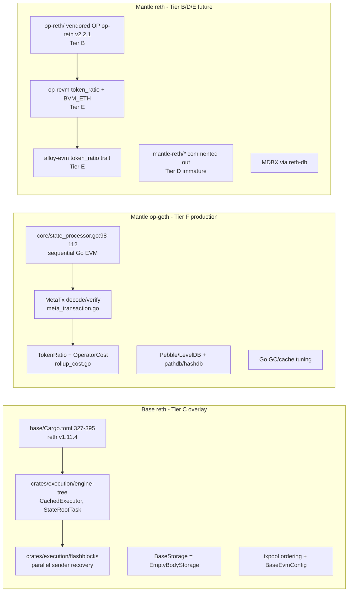
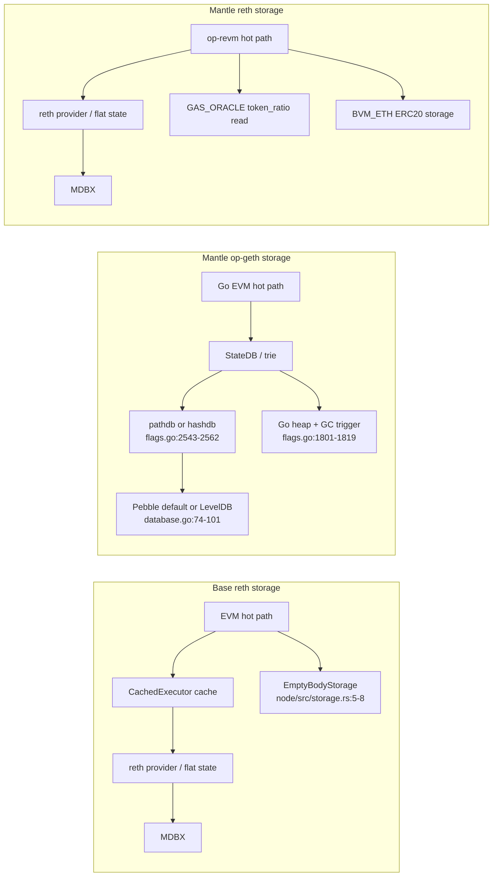
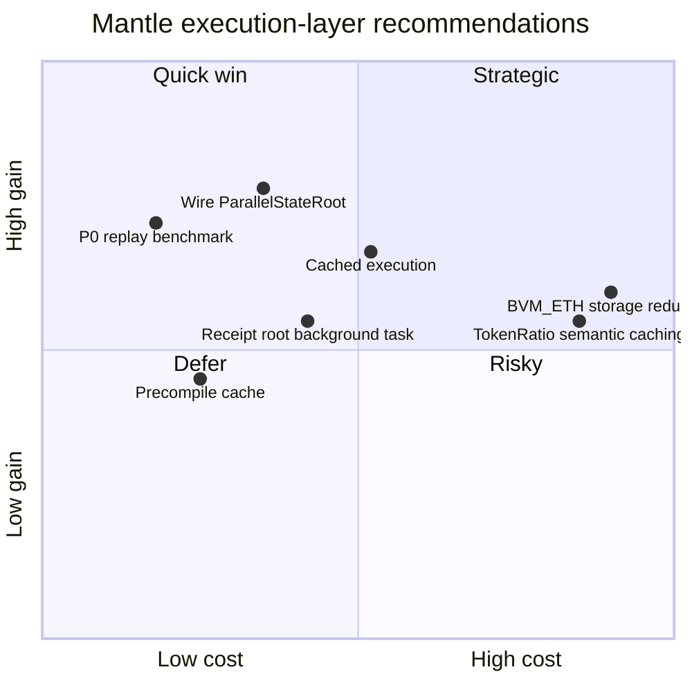

# Phase B Round 1 Draft - 执行层性能架构对比：Base Reth Fork vs Mantle Reth Fork（三方对比）

## Executive Summary

本稿对三个执行层实现做三方对比：Base Rust 栈 `base/base`、Mantle 当前 Go 生产栈 `mantlenetworkio/op-geth`、Mantle 未来 Rust 栈 `mantle-xyz/reth` 的 `mantle-elysium` 分支。结论有三点。

1. **Base 的优势主要来自大体量 Tier C overlay，而不是单纯因为使用 Rust/reth。** Base 在 `base/Cargo.toml:327-395` pin `paradigmxyz/reth` `v1.11.4`，同时在 `base/crates/execution` 下维护自有执行层 crate；关键性能路径包括 cached execution、precompile cache、后台 receipt root、parallel state-root、flashblocks sender recovery、`EmptyBodyStorage` 与 txpool ordering。代码证据集中在 `base/crates/execution/engine-tree/src/validator.rs:751-793`、`base/crates/execution/engine-tree/src/validator.rs:916-928`、`base/crates/execution/engine-tree/src/cached_execution.rs:124-230`、`base/crates/execution/flashblocks/src/processor.rs:420-435`、`base/crates/execution/node/src/storage.rs:5-8`。这些是 `[Tier C]`，与 Mantle 当前 Rust workspace 中观察到的 `[Tier D]` 增量不是同一量级。

2. **Mantle Rust 栈目前更像 OP op-reth + Mantle fee-model dependency patches，而不是完整 Mantle reth overlay。** `reth/Cargo.toml:1-15` 明确 workspace 结构：`op-reth/` 来自 OP `op-reth/v2.2.1`，`reth` crates pin `88505c7f`，Mantle 自有层应在 `mantle-reth/` 和 `patches/`。但 `reth/Cargo.toml:31-59` 显示 `mantle-reth` crate 仍注释为 "Uncomment as crates are created"，直接观察到的 Tier D 热路径改动很少，主要是 `reth/op-reth/crates/rpc/src/error.rs:114-117` 的错误映射。真正 Mantle 特有语义来自 `[Tier E]`：`mantle-revm/crates/op-revm/src/l1block.rs:146-156` 读取 `token_ratio`，`mantle-revm/crates/op-revm/src/handler.rs:365-409` 在 pre-Arsia 执行前扣除 `tx_l1_cost` 并除以 `token_ratio`，`mantle-revm/crates/op-revm/src/transaction/bvm_eth.rs:95-118` 处理 BVM_ETH mint/transfer。

3. **Mantle Go -> Rust 迁移的可期待收益在 1.3x-2.8x execution-layer upper-bound 区间，但这个范围不是全链 TPS承诺。** Base 公开 Reth/Geth archive benchmark 显示 block-building p50 从 374ms 到 260ms，p99 从 2319ms 到 698ms，且 Geth 使用 LevelDB/hashdb；这是 `[Tier C, reported]` 的 Base 场景，不是 Mantle 实测。迁移到 Mantle reth 可望改善 Go EVM、Pebble/LevelDB/pathdb、GC 与 compaction 相关瓶颈，但 Mantle 的 `[Tier E]` tokenRatio/BVM_ETH 语义会保留额外热路径成本。所有合成估算均标记为 `non_additive` 和 `upper_bound_only`，必须通过同一 hardware、block gas limit、tx mix、storage mode 的 replay benchmark 才能转成确定 TPS claim。

## Item Findings

### item-1: 三方版本基线与 fork 演化轨迹

| 维度 | Base Rust 栈 | Mantle Go 栈 | Mantle Rust 栈 |
|---|---|---|---|
| 本地 checkout | `base` at `fc58ee84456e` | `op-geth` at `34a6a67a9588` | `reth` at `2ee237866e6e` |
| 上游基线 | `paradigmxyz/reth` tag `v1.11.4` in `base/Cargo.toml:327-395` `[Tier A+C]` | OP/geth lineage, current repo tag `v1.5.5`; exact upstream delta not fully diffed `[Tier F]` | `paradigmxyz/reth` rev `88505c7f` in `reth/Cargo.toml:145-214` `[Tier A+D]` |
| OP 继承层 | Base 不直接 vendor OP `op-reth`;自建 `crates/execution` `[Tier C]` | Go OP Stack lineage `[Tier F]` | `op-reth/` vendored from OP `op-reth/v2.2.1`, `reth/Cargo.toml:1-15` and `reth/Cargo.toml:31-48` `[Tier B]` |
| Mantle 自有 overlay | N/A | MetaTx, TokenRatio, BVM_ETH, Arsia fee path `[Tier F]` | Workspace Tier D 很薄；核心 Mantle semantics 在 `[patch.crates-io]` Tier E |
| 版本差风险 | `v1.11.4` 与 Mantle `v2.2.0` 不可直接用主版本号比较，需逐 PR 判断 `[Tier A]` | Go stack 与 Rust stack 性能基线不可直接混用 `[Tier F]` | reth v2.2.0/op-reth v2.2.1 baseline，外部 patch fork 需持续 rebase `[Tier D+E]` |

关键点：Base 和 Mantle reth 不是简单的 "两个 reth fork diff"。Base 是大量 `[Tier C]` execution overlay；Mantle reth 是 `[Tier B]` OP op-reth workspace + `[Tier E]` Mantle dependency patch。任何性能归因必须先问：这是上游 reth 能力 `[Tier A]`、OP inherited `[Tier B]`、Base 自有 `[Tier C]`、Mantle workspace `[Tier D]`、Mantle external patch `[Tier E]`，还是 Go production baseline `[Tier F]`。

### item-2: Mantle op-geth 定制改动与 Go 生产基线

Mantle op-geth 当前执行路径是顺序 Go EVM。`op-geth/core/blockchain.go:1725-1752` 获取 chain mutex 后进入 `insertChain`，`op-geth/core/blockchain.go:2090-2100` 对每个 block 调用 `bc.processor.Process` 后再 `ValidateState`。交易处理在 `op-geth/core/state_processor.go:98-112` 逐笔循环，`op-geth/core/state_processor.go:106` 调用 `ApplyTransactionWithEVM`。没有看到 block-internal tx 级并行 EVM。

Mantle Go 自有热路径集中在三处：

| 模块 | 代码位置 | 归属 | 性能含义 |
|---|---|---|---|
| MetaTx prefix 与参数解码 | `op-geth/core/types/meta_transaction.go:13-28`, `op-geth/core/types/meta_transaction.go:77-87`, `op-geth/core/types/meta_transaction.go:100-119`, `op-geth/core/types/meta_transaction.go:121-171` | `[Tier F]` | 非 MetaTx 动态费交易主要是长度检查、32-byte prefix 比较和缓存写入，预计 ns-低 us 级；active MetaTx 会 RLP decode、签名恢复和 sponsor 校验，预计 us 级，需 microbench |
| MetaTx 注入点 | `op-geth/core/state_transition.go:219-250`, `op-geth/core/state_transition.go:330-349`, `op-geth/core/state_transition.go:352-497`, `op-geth/core/state_transition.go:1076-1112` | `[Tier F]` | `TransactionToMessage` 先 decode/verify；gas estimate 为 MetaTx sig 增加 80 ones；buy/refund 路径按 sponsor percent 拆分 |
| TokenRatio/L1 cost/operator fee | `op-geth/core/types/rollup_cost.go:32-58`, `op-geth/core/types/rollup_cost.go:161-217`, `op-geth/core/types/rollup_cost.go:220-245`, `op-geth/core/types/rollup_cost.go:310-321`, `op-geth/core/types/rollup_cost.go:403-452` | `[Tier F]` | pre-Arsia 每次 L1 cost 读取 baseFee/overhead/scalar/tokenRatio 并做 big.Int 乘除；Arsia 每次 L1 cost 有意重新读取 tokenRatio 以允许 block 内更新 |

Go runtime 与存储基线：

| 维度 | 代码证据 | 归属 | 观察 |
|---|---|---|---|
| DB backend | `op-geth/node/database.go:74-101` | `[Tier F]` | 支持 LevelDB/Pebble；无用户指定且无既有 DB 时默认 Pebble |
| cache/GOGC | `op-geth/cmd/utils/flags.go:1801-1819` | `[Tier F]` | 按内存 allowance 限制 cache，并用 `godebug.SetGCPercent` 设置 GC trigger |
| trie/cache flags | `op-geth/cmd/utils/flags.go:1840-1907` | `[Tier F]` | database/trie/snapshot cache 按总 cache 百分比分配 |
| state scheme | `op-geth/cmd/utils/flags.go:2543-2562` | `[Tier F]` | hashdb/pathdb 二选一；pathdb default path applies when not hash |

Go GC claim 来源于 Go 官方 GC guide，不是 Mantle 实测：Go 官方模型说明 GC CPU cost 与 allocation rate、live heap、GOGC 相关，示例中 GOGC 100 可出现 10% CPU overhead、GOGC 200 降至 5%，并说明 doubling GOGC roughly halves GC CPU cost。用于 Mantle 时标记为 `[Tier F, reported-by-Go-doc, not Mantle-measured]`，不能当作 op-geth 已测值。

### item-3: Base reth 定制改动与核心性能特性

| 性能改动 | 代码位置 | 归属 | 预估 TPS/吞吐影响 |
|---|---|---|---|
| Reth v1.11.4 dependency baseline | `base/Cargo.toml:327-395` | `[Tier A+C]` | 为 REVM/MDBX/reth pipeline 提供 Rust baseline；不是 Base 独有性能 claim |
| Flashblocks cached execution provider | `base/crates/execution/engine-tree/src/cached_execution.rs:21-90`, `base/crates/execution/engine-tree/src/cached_execution.rs:124-230` | `[Tier C]` | prefix/order/parent-hash 对齐时复用 cached tx result；对重复 payload build 和 flashblock re-execution 是 `per-block CPU` 正向，数值依 cache hit rate |
| Cached executor fallback | `base/crates/execution/engine-tree/src/cached_execution.rs:122-230` | `[Tier C]` | cache hit 时加载 account cache 并返回 cached result；首次 miss 后回落正常执行，正确性风险较低 |
| Precompile cache | `base/crates/execution/engine-tree/src/validator.rs:751-766` | `[Tier C]` | pure precompile 包装缓存；对重复 precompile 输入的 tx mix 提升明显，对普通 transfer mix 影响小 |
| Receipt root background task | `base/crates/execution/engine-tree/src/validator.rs:787-793` | `[Tier C]` | 将 receipt root/log bloom 增量计算从关键路径移到 blocking task，预计降低 `per-block CPU latency` |
| Parallel state root | `base/crates/execution/engine-tree/src/validator.rs:916-928` | `[Tier A+C]` | 使用 `ParallelStateRoot::incremental_root_with_updates()`；对 trie-heavy blocks 正向 |
| Strategy selection | `base/crates/execution/engine-tree/src/validator.rs:1133-1155`, `base/crates/execution/engine-tree/src/validator.rs:1172-1208`, `base/crates/execution/engine-tree/src/validator.rs:1244-1255` | `[Tier C]` | `StateRootTask` / `Parallel` / `Synchronous` 三档 fallback，降低单策略失败风险 |
| Lazy overlay | `base/crates/execution/engine-tree/src/validator.rs:1274-1318` | `[Tier A+C]` | parent trie input 延迟/异步准备，允许 execution 更早开始 |
| Flashblocks sender recovery | `base/crates/execution/flashblocks/src/processor.rs:420-435`, `base/crates/execution/flashblocks-node/benches/sender_recovery.rs:80-134` | `[Tier C]` | `par_iter()` 并行 recover signer；对高 tx count flashblock 正向，bench 覆盖 30/40/100 synthetic 与 30/40/100/500/1000 real tx |
| Empty body storage | `base/crates/execution/node/src/storage.rs:5-8` | `[Tier C]` | `BaseStorage = EmptyBodyStorage`，减少 body storage 写放大；对 archive/RPC 取舍需结合节点角色 |
| Base EVM factory | `base/crates/execution/evm/src/config.rs:72-123` | `[Tier C]` | 自定义 `BaseBlockExecutorFactory` 与 `BaseEvmFactory`，支撑 Base hardfork/precompile config |
| TX pool ordering | `base/crates/execution/txpool/src/ordering.rs:13-28`, `base/crates/execution/txpool/src/ordering.rs:67-101`, `base/crates/execution/txpool/src/transaction.rs:340-353` | `[Tier C]` | coinbase tip/FIFO timestamp 两种 ordering；主要影响 inclusion fairness/latency，不是 EVM gas/s |

Base 官方 Azul 博客报告 `[Tier C, reported]`：Base Azul 目标 mainnet activation 2026-05-13，过去两个月 empty blocks 从约 200/day 降到约 2/day，且 sustained multiple 5,000 TPS bursts。该数据是 Base stack 级别报告，不能拆分成单个 engine-tree patch 的贡献。

### item-4: Mantle reth mantle-elysium 改动清单与成熟度

Mantle reth 的 `Cargo.toml` 是最重要证据：

| 维度 | 代码位置 | 归属 | 结论 |
|---|---|---|---|
| Workspace 结构 | `reth/Cargo.toml:1-15` | `[Tier B+D+E]` | `op-reth/` 是 OP Stack EL；`mantle-reth/` 计划做 trait override；`patches/` 计划做 minimal core patch |
| OP workspace members | `reth/Cargo.toml:31-48` | `[Tier B]` | 当前 active members 都是 `op-reth` crates |
| Mantle workspace members | `reth/Cargo.toml:50-59` | `[Tier D]` | `mantle-reth` crates 全部注释，成熟度低 |
| reth pin | `reth/Cargo.toml:145-214` | `[Tier A]` | `88505c7f` 贯穿 reth crates |
| external patches | `reth/Cargo.toml:218-252`, `reth/Cargo.toml:405-434` | `[Tier E]` | revm、op-revm、alloy-evm、alloy-op-evm、op-alloy 等全部重定向到 Mantle forks |
| Direct workspace patch | `reth/op-reth/crates/rpc/src/error.rs:114-117` | `[Tier D]` | 仅将 `BvmEth` 和 `TxL1CostOutOfRange` 映射为 RPC error；非吞吐热路径 |

OP inherited flashblocks cache 存在于 Mantle vendored op-reth：`reth/op-reth/crates/flashblocks/src/worker.rs:219-229` 设置 cached reads，`reth/op-reth/crates/flashblocks/src/worker.rs:233-270` 查找 cached prefix，`reth/op-reth/crates/flashblocks/src/worker.rs:291-363` cache hit 后只执行 suffix，`reth/op-reth/crates/flashblocks/src/worker.rs:388-403` 更新 cache。这是 `[Tier B]`，不是 Mantle-specific `[Tier D]`。

Mantle L1 info parser也来自 op-reth workspace：`reth/op-reth/crates/evm/src/l1.rs:11-19` 定义 Ecotone/Isthmus/Jovian selector，`reth/op-reth/crates/evm/src/l1.rs:57-73` 分派解析，`reth/op-reth/crates/evm/src/l1.rs:237-290` 解析 Jovian 174-byte payload，`reth/op-reth/crates/evm/src/l1.rs:293-339` 调用 `calculate_tx_l1_cost`。其中 Jovian selector 是 OP/Base 语义，不等于 Mantle Arsia selector。

MetaTx 在 Rust 侧状态：`mantle-v2/rust/alloy-op-hardforks/src/lib.rs:235-244` 保留 Mantle MetaTx 32-byte prefix helper，并注明 since MantleEverest permanently disabled。未在 `mantle-xyz/reth` 或 `mantle-revm` 发现完整 Go 侧 `DecodeAndVerifyMetaTxParams` 等价路径；本稿标记 `injection_points_rust = [NOT_YET_IMPLEMENTED / disabled-prefix-only]`，归属 `[Tier E]`。

### item-5: 存储层配置三方对比

| 维度 | Base reth | Mantle reth | Mantle op-geth |
|---|---|---|---|
| DB engine | MDBX via `reth-db` `[Tier A+C]`; `base/crates/execution/cli/Cargo.toml:32` uses `reth-db` with `mdbx`; `base/crates/execution/trie/src/db/mod.rs:1-4` documents MDBX proof store | MDBX via `reth-db` `[Tier A+B]`; `reth/op-reth/crates/reth/Cargo.toml:21`, `reth/op-reth/crates/trie/Cargo.toml:16`, `reth/op-reth/crates/trie/src/db/mod.rs:1-4` | Pebble or LevelDB through Go ethdb; `op-geth/node/database.go:74-101` defaults new DB to Pebble |
| State scheme | Reth path/flat-state defaults from upstream; no Base-specific map/page/sync override found in `base/crates/execution` `[UNATTRIBUTED exact flags]` | Reth/op-reth defaults; no Mantle-specific MDBX env override found in active Tier D `[UNATTRIBUTED exact flags]` | pathdb/hashdb flag; `op-geth/cmd/utils/flags.go:2543-2562` creates hashdb if selected else pathdb defaults |
| Body storage | `BaseStorage = EmptyBodyStorage` at `base/crates/execution/node/src/storage.rs:5-8` `[Tier C]` | OP/reth default body storage `[Tier B/A]` | Go block body storage in chain DB `[Tier F]` |
| Proof sidecar | `base/crates/execution/proofs/README.md:11-33` and `base/crates/execution/node/src/proof_history.rs:25-60` describe MDBX proofs storage `[Tier C]` | `reth/op-reth/crates/exex/README.md:26-57` and `reth/op-reth/crates/node/src/proof_history.rs:45-71` sidecar pattern `[Tier B]` | No equivalent Rust sidecar; archive/state growth handled in Go DB `[Tier F]` |
| Cache pressure | Rust caches increase RSS but avoid Go GC `[Tier C/D]` | Same Rust runtime, plus Tier E extra state accesses `[Tier D/E]` | Cache flags influence heap and GC trigger; `op-geth/cmd/utils/flags.go:1801-1819` `[Tier F]` |

Base's public 2024 benchmark gives the clearest storage-shaped evidence: archive Geth disk usage 16.61TB vs Reth 2.74TB, weekly growth about 560GB vs 50GB, provisioning 15h vs 3h, with methodology on AWS i3en.12xlarge, RAID0 EXT4, Base mainnet 5,000-block replay, Geth LevelDB/hashdb. This is `[Tier C, reported]` and strongly supports a Go-geth/Reth storage delta, but Mantle's current Pebble/pathdb production shape must be measured before copying those exact percentages.

### item-6: EVM 执行引擎三方对比

| 维度 | Base reth | Mantle reth | Mantle op-geth |
|---|---|---|---|
| EVM implementation | REVM through reth `v1.11.4`, wrapped by `BaseEvmConfig` at `base/crates/execution/evm/src/config.rs:72-123` `[Tier A+C]` | REVM/op-revm through Mantle fork; patches in `mantle-revm` `[Tier E]` | go-ethereum EVM; sequential `StateProcessor.Process` loop at `op-geth/core/state_processor.go:98-112` `[Tier F]` |
| tx-level parallel EVM | No evidence; sequential EVM transaction semantics preserved `[Tier C]` | No evidence `[Tier B/D/E]` | No; sequential tx loop `[Tier F]` |
| parallel adjacent work | parallel sender recovery, parallel state root, receipt root background `[Tier C]` | OP inherited flashblocks suffix cache `[Tier B]`; no Base-like state-root wiring observed in Tier D | Go block processor sequential; DB/goroutine work exists outside tx execution but not tx-level parallel |
| precompile strategy | wraps pure precompiles with `CachedPrecompile::wrap`, `base/.../validator.rs:751-766` `[Tier C]` | no equivalent found `[Tier D/E]` | Go precompiles standard; no Mantle cache found `[Tier F]` |
| Mantle-specific gas semantics | none | tokenRatio/BVM_ETH in `mantle-revm/crates/op-revm/src/handler.rs:160-171`, `mantle-revm/crates/op-revm/src/handler.rs:436-474`, `mantle-revm/crates/op-revm/src/l1block.rs:283-335` `[Tier E]` | tokenRatio/MetaTx/BVM_ETH in `op-geth/core/state_transition.go:690-765`, `op-geth/core/types/rollup_cost.go:310-321` `[Tier F]` |

`revm_vs_goevm_speedup_ratio`：本稿没有引入独立 microbench 数值，因为公开 `evm-bench` 与 production chain replay 的 tx mix 不一致。更 defensible 的迁移估算使用 Base 的 same-chain replay benchmark：Reth archive block-building p50/p95/p99 相对 Geth 改善 30.5%/66.3%/69.9%，即约 1.44x/2.97x/3.32x `per-block CPU` improvement in that Base archival scenario `[Tier C, reported, not Mantle-measured]`。

### item-7: Go runtime vs Rust 执行模型与迁移增益

Go runtime observables for Mantle op-geth:

| Observable | Code hook | Interpretation |
|---|---|---|
| GOGC/cache relation | `op-geth/cmd/utils/flags.go:1801-1819` | Cache grows with memory; code lowers cache allowance and adjusts Go GC percent |
| Block execution duration | `op-geth/core/blockchain.go:2090-2100` | `pstart`/`ptime` already surrounds processor.Process; add histograms here for per-block CPU |
| Per-tx execution loop | `op-geth/core/state_processor.go:98-112` | Insert per-tx timer around `ApplyTransactionWithEVM` to measure MetaTx/TokenRatio overhead |
| TokenRatio and operator fee calls | `op-geth/core/types/rollup_cost.go:202-217`, `op-geth/core/types/rollup_cost.go:313-321`, `op-geth/core/types/rollup_cost.go:429-435` | Count L1 cost invocations per block, number of tokenRatio reads, operator fee calls |
| State scheme/cache | `op-geth/cmd/utils/flags.go:1840-1907`, `op-geth/cmd/utils/flags.go:2543-2562` | Required labels for all pprof/gctrace runs |

GC pause proxy: absent live profiling, the defensible proxy is `(heap allocated per block, live heap, GOGC, tx count, trie/state object allocation rate)`. Go official GC guide states GC CPU cost is controlled by allocation rate, live heap, and GOGC, with examples of 10% vs 5% overhead when GOGC changes. Therefore this draft uses `0-10% CPU` as a conservative `[Tier F, inferred from official Go model]` removable runtime overhead. It is not a measured Mantle value.

Migration gain decomposition, Mantle op-geth = 1.0x:

| Component | Denominator | Expected range | Attribution | Additivity |
|---|---|---:|---|---|
| Go EVM + Go state transition -> REVM/op-revm | `per-block CPU` | 1.1x-1.8x | `[Tier F -> D/E, inferred]` | non_additive |
| Pebble/LevelDB/pathdb -> MDBX/reth provider | `IOPS`, `p99 block-building` | 1.2x-2.5x | `[Tier F -> A/B/D, inferred from Base reported benchmark]` | non_additive |
| Go GC elimination | `CPU overhead` | 1.0x-1.1x | `[Tier F, inferred]` | non_additive |
| Mantle Tier E retained overhead | `per-block CPU` | -0% to -15% vs generic op-reth target | `[Tier E, inferred]` | negative, non_additive |
| Total Mantle Go -> Mantle reth upper bound | `per-block CPU`, not full-chain TPS | 1.3x-2.8x | `[Tier F -> D/E, UNATTRIBUTED until Mantle replay]` | upper_bound_only |

The total range is intentionally lower than the Base p99 3.32x replay result because Mantle Rust target preserves TokenRatio/BVM_ETH semantics and currently lacks Base-specific `[Tier C]` cached execution/precompile/receipt-root wiring.

### item-8: MetaTx 与 TokenRatio overhead 精确量化

| Required field | Result |
|---|---|
| `metatx_per_tx_overhead_ns` | `[Tier F, inferred]` Non-active path: dynamic fee tx with data length <=32 exits at `op-geth/core/types/meta_transaction.go:126-128`; data >32 performs prefix compare at `op-geth/core/types/meta_transaction.go:130-141` and caches nil at `op-geth/core/types/meta_transaction.go:145-150`. Expected ns-low us, not measured. |
| `metatx_active_us_path` | `[Tier F, inferred]` Active legacy MetaTx path performs RLP decode at `op-geth/core/types/meta_transaction.go:108-114`, signature recovery at `op-geth/core/types/meta_transaction.go:174-230`, sponsor balance checks at `op-geth/core/state_transition.go:417-475`, payload swap at `op-geth/core/state_transition.go:488-497`, refund split at `op-geth/core/state_transition.go:1076-1112`. Expected us-level, tx-mix sensitive. |
| `token_ratio_per_tx_extra_sloads` | `[Tier F]` pre-Arsia L1CostFunc reads `TokenRatioSlot` per call at `op-geth/core/types/rollup_cost.go:231-235`; state transition also reads tokenRatio at `op-geth/core/state_transition.go:705`; Arsia L1CostFunc intentionally reads tokenRatio every L1 cost at `op-geth/core/types/rollup_cost.go:313-321`; operator fee params read once per block at `op-geth/core/types/rollup_cost.go:418-426`. |
| `token_ratio_bigint_cost` | `[Tier F, inferred]` pre-Arsia path does big.Int add/mul/mul/mul/div at `op-geth/core/types/rollup_cost.go:236-244`; Arsia multiplies fee by current tokenRatio at `op-geth/core/types/rollup_cost.go:318-320`; state transition multiplies/divides gas by tokenRatio at `op-geth/core/state_transition.go:729-765` and refund at `op-geth/core/state_transition.go:846-876`. |
| `injection_points_go` | `op-geth/core/state_transition.go:224`, `op-geth/core/state_transition.go:705`, `op-geth/core/state_transition.go:729-765`, `op-geth/core/state_transition.go:922-937`, `op-geth/core/types/rollup_cost.go:161-217`, `op-geth/core/types/rollup_cost.go:310-321`, `op-geth/core/types/rollup_cost.go:403-452`. |
| `injection_points_rust` | `[Tier E]` TokenRatio/BVM_ETH in `mantle-revm/crates/op-revm/src/l1block.rs:146-156`, `mantle-revm/crates/op-revm/src/l1block.rs:283-335`, `mantle-revm/crates/op-revm/src/handler.rs:160-171`, `mantle-revm/crates/op-revm/src/handler.rs:365-409`, `mantle-revm/crates/op-revm/src/handler.rs:436-474`; MetaTx only disabled prefix helper observed at `mantle-v2/rust/alloy-op-hardforks/src/lib.rs:235-244`. |
| `evidence_tier` | MetaTx Go `[Tier F]`; TokenRatio Go `[Tier F]`; TokenRatio/BVM_ETH Rust `[Tier E]`; Rust MetaTx full port `[NOT_YET_IMPLEMENTED / disabled-prefix-only]`. |

Mantle Rust TokenRatio parity: `mantle-revm/crates/op-revm/src/l1block.rs:44` adds `token_ratio` to L1 block info; `mantle-revm/crates/op-revm/src/l1block.rs:146-156` reads `GAS_ORACLE_CONTRACT/TOKEN_RATIO_SLOT`; pre-Arsia and Arsia L1 cost both multiply by TokenRatio at `mantle-revm/crates/op-revm/src/l1block.rs:301-307` and `mantle-revm/crates/op-revm/src/l1block.rs:324-335`. `mantle-v2/rust/alloy-op-evm/src/lib.rs:315-317` exposes `token_ratio()` on the OP EVM wrapper, and `mantle-v2/rust/alloy-op-evm/src/post_exec/mod.rs:142-144` forwards the call through the post-exec adapter.

### item-9: Pipeline 设计与执行/验证阶段并行度

| Stage | Base reth | Mantle reth | Mantle op-geth |
|---|---|---|---|
| tx fetch/order | txpool has coinbase-tip and timestamp FIFO modes at `base/crates/execution/txpool/src/ordering.rs:13-28` `[Tier C]` | OP txpool plus Mantle dependency types; OP tx validator L1 fee checks at `reth/op-reth/crates/txpool/src/validator.rs:217-260` `[Tier B]` | Go txpool/insert path; not deeply diffed `[Tier F]` |
| sender recovery | Base flashblocks processor uses rayon `par_iter()` at `base/crates/execution/flashblocks/src/processor.rs:420-435` `[Tier C]` | OP/reth sender recovery inherited `[Tier B/A]` | Go sequential block processor `[Tier F]` |
| execute | `CachedExecutor` wrapper at `base/.../validator.rs:780-785` `[Tier C]` | OP executor, suffix cache only inside flashblocks worker at `reth/op-reth/crates/flashblocks/src/worker.rs:291-363` `[Tier B]` | `ApplyTransactionWithEVM` loop at `op-geth/core/state_processor.go:98-112` `[Tier F]` |
| state root | strategy planner at `base/.../validator.rs:1244-1255` and parallel root at `base/.../validator.rs:916-928` `[Tier C]` | no equivalent Tier D wire observed `[Tier D gap]` | `ValidateState` after process at `op-geth/core/blockchain.go:2099-2100` `[Tier F]` |
| receipt root | background task at `base/.../validator.rs:787-793` `[Tier C]` | no equivalent Tier D observed | Go receipt creation inline in state processor `[Tier F]` |
| failure/fallback | Base strategy fallback documented at `base/.../validator.rs:1133-1142` `[Tier C]` | OP default | Go validation error aborts insert |

No implementation shows tx-level parallel EVM. Base has richer parallel adjacent work around execution, which is safer for consensus because tx order remains deterministic.

### item-10: Quantitative performance matrix

All entries use a single denominator and are non-additive unless explicitly measured in the same scenario.

| Metric | Mantle op-geth `[Tier F]` | Mantle reth `[Tier B/D/E]` | Base reth `[Tier C]` | Evidence |
|---|---:|---:|---:|---|
| Current production role | 1.0x baseline | future target, not production-proven in this research | high-performance reference | code + issue scope |
| Block execution model | sequential Go EVM | sequential REVM plus OP inherited flashblocks cache; Tier E tokenRatio/BVM_ETH | sequential REVM plus cached execution/parallel adjacent work | code refs above |
| Storage engine | Pebble default / LevelDB possible; pathdb/hashdb | MDBX via reth/op-reth | MDBX via reth + Base `EmptyBodyStorage` | code refs above |
| Reth vs Geth block-building p50 | N/A for Mantle | estimated +1.1x-1.5x | reported 374ms -> 260ms = 30.5% improvement in Base archival benchmark | Base Reth blog `[Tier C reported]` |
| Reth vs Geth block-building p99 | N/A for Mantle | estimated +1.5x-3.0x upper-bound | reported 2319ms -> 698ms = 69.9% improvement in Base archival benchmark | Base Reth blog `[Tier C reported]` |
| Disk footprint archive | N/A for Mantle | likely lower than Go archive, unmeasured | reported 16.61TB Geth vs 2.74TB Reth | Base Reth blog `[Tier C reported]` |
| Flashblocks UX latency | not present in op-geth baseline | OP inherited support exists, Mantle integration maturity not proven | 200ms preconfirmation blocks and up to 10x inclusion-time reduction reported | Base Flashblocks blog `[Tier C reported]` |
| TokenRatio overhead | per-tx big.Int/SLOAD overhead | retained in Tier E U256/storage path | absent | `[Tier F/E inferred]` |
| MetaTx overhead | disabled since Everest but prefix/check path remains; active legacy path expensive | disabled-prefix-only helper observed; full port not found | absent | `[Tier F/E inferred]` |
| Go GC overhead | 0-10% CPU proxy, not measured | eliminated as Go runtime issue | eliminated as Go runtime issue | Go official GC guide + op-geth GOGC code |
| Go -> Rust execution-layer estimate | 1.0x | 1.3x-2.8x upper-bound | Base observed 1.44x p50 to 3.32x p99 in archival block-building | non-additive |

### item-11: Mantle 改进建议

| Priority | Recommendation | Applies to | Expected impact | Cost/Risk | Evidence |
|---|---|---|---|---|---|
| P0 | Build a replay benchmark before claiming TPS: same hardware, same Mantle blocks, op-geth Pebble/pathdb vs mantle-reth MDBX, p50/p95/p99 block CPU, gas/s, allocations, DB IOPS | Go+Rust | Converts `1.3x-2.8x` upper-bound into measured range | Low, low consensus risk | Hooks at `op-geth/core/blockchain.go:2090-2100`; Rust equivalent should instrument engine-tree/payload |
| P0 | In Mantle reth, wire Base-like state-root strategy if missing: `ParallelStateRoot`, `LazyOverlay`, `StateRootTask` | Rust | `per-block CPU` improvement for trie-heavy blocks; not additive with DB/cache | Medium, low consensus risk if deterministic | Base refs `base/.../validator.rs:916-928`, `base/.../validator.rs:1244-1255`, `base/.../validator.rs:1274-1318` |
| P1 | Add precompile cache equivalent to Base `CachedPrecompile::wrap` | Rust | positive for precompile-heavy tx mix; near-zero for simple transfers | Low-medium; cache invalidation/spec gating must match Base/reth | `base/.../validator.rs:751-766` |
| P1 | Evaluate cached execution across flashblocks/payload rebuilds | Rust | positive when payload/flashblock prefixes repeat; cache-hit sensitive | Medium; correctness depends on parent hash, tx order, reorg invalidation | `base/.../cached_execution.rs:47-90`, `base/.../cached_execution.rs:195-210`; OP suffix cache at `reth/op-reth/.../worker.rs:233-270` |
| P1 | Port incremental receipt-root/log-bloom background task | Rust | reduces validation critical path; independent from EVM CPU | Medium; must preserve receipt ordering | `base/.../validator.rs:787-793` |
| P1 | Add Go op-geth pprof/gctrace + allocation labels around MetaTx/TokenRatio paths | Go | identifies whether 0-10% GC/runtime proxy is real | Low | `op-geth/cmd/utils/flags.go:1801-1819`, `op-geth/core/state_processor.go:98-112` |
| P2 | TokenRatio caching only if protocol forbids mid-block updates | Go+Rust | could remove one per-tx state read in Arsia path, but currently consensus-critical comment requires per-call refresh | High protocol risk | `op-geth/core/types/rollup_cost.go:313-316` explicitly says refresh every calculation |
| P2 | Finish `mantle-reth/` overlay or remove ambiguity | Rust | improves maintainability and attribution; indirect performance value | Medium | `reth/Cargo.toml:50-59` shows planned crates not active |
| P2 | Reduce BVM_ETH storage writes where semantic no-op applies | Rust+Go | positive for `eth_value` heavy blocks | High correctness risk | `mantle-revm/crates/op-revm/src/transaction/bvm_eth.rs:95-118`, `mantle-revm/.../bvm_eth.rs:199-266` |

## Diagrams

### diag-1: 三方执行层架构对比

### diag-2: EVM 执行流程三方对比

```mermaid
flowchart TB
  subgraph BasePipe["Base reth"]
    direction LR
    BP1["tx fetch/order"] --> BP2["parallel sender recovery<br/>processor.rs:420-435"]
    BP2 --> BP3["CachedExecutor<br/>validator.rs:780"]
    BP3 --> BP4["REVM execute"]
    BP4 --> BP5["ReceiptRootTask background<br/>validator.rs:787-793"]
    BP4 --> BP6["ParallelStateRoot<br/>validator.rs:916-928"]
    BP5 --> BP7["commit"]
    BP6 --> BP7
  end

  subgraph GoPipe["Mantle op-geth"]
    direction LR
    GP1["InsertChain lock"] --> GP2["StateProcessor.Process"]
    GP2 --> GP3["for tx loop<br/>state_processor.go:98-112"]
    GP3 --> GP4["DecodeAndVerifyMetaTxParams<br/>state_transition.go:224"]
    GP4 --> GP5["buyGas + L1CostFunc + OperatorCostFunc"]
    GP5 --> GP6["Go EVM ApplyMessage"]
    GP6 --> GP7["ValidateState"]
  end

  subgraph RustPipe["Mantle reth"]
    direction LR
    RP1["OP op-reth payload"] --> RP2["flashblocks cached prefix/suffix<br/>worker.rs:233-363"]
    RP2 --> RP3["op-revm execute"]
    RP3 --> RP4["token_ratio / tx_l1_cost<br/>handler.rs:365-409"]
    RP4 --> RP5["BVM_ETH compensation/refund<br/>handler.rs:436-474"]
    RP5 --> RP6["state root / commit"]
  end
```

### diag-3: 存储层配置对比

### diag-4: 改进建议优先级矩阵

## Source Coverage

| Source | Coverage | Notes |
|---|---|---|
| `base/base` | Complete targeted scan of `Cargo.toml`, `crates/execution/engine-tree`, `flashblocks`, `flashblocks-node`, `evm`, `node/storage`, `txpool` | Required checkout used; code references included with line numbers |
| `mantle-xyz/reth --ref mantle-elysium` | Complete targeted scan of workspace `Cargo.toml`, `op-reth/evm`, `op-reth/flashblocks`, `op-reth/rpc`, `op-reth/txpool`, storage/trie references | Required checkout used; Tier B/D/E split established |
| `mantlenetworkio/op-geth` | Complete targeted scan of `meta_transaction.go`, `rollup_cost.go`, `state_transition.go`, `state_processor.go`, `blockchain.go`, `node/database.go`, `cmd/utils/flags.go` | Required checkout used; Go production baseline analyzed |
| Mantle Tier E repos | `mantle-revm`, `mantle-v2`, and previously checked `mantle-evm` dependency context scanned for TokenRatio, BVM_ETH, Arsia, MetaTx prefix | External evidence; not primary Multica checkout requirement |
| Base Azul official blog | Used for reported 5,000 TPS bursts and Base stack consolidation | https://blog.base.dev/introducing-base-azul |
| Base Flashblocks official blog | Used for 200ms preconfirmation and 10x inclusion-time reduction UX claim | https://blog.base.dev/accelerating-base-with-flashblocks |
| Base Reth official blog | Used for Geth vs Reth archive benchmark: disk, block-building p50/p95/p99, methodology | https://blog.base.dev/scaling-base-with-reth |
| Go official GC guide | Used for GC CPU/GOGC model only, not as Mantle measured data | https://go.dev/doc/gc-guide |

## Gap Analysis

| Gap | Impact | Follow-up needed |
|---|---|---|
| Mantle op-geth upstream delta vs OP op-geth not fully diffed | Some `[Tier F]` changes may be inherited from OP/geth rather than Mantle-specific | Run exact upstream comparison against the matching OP op-geth base commit |
| MDBX map_size/page_size/sync_mode exact flags not found in active fork overlay | Storage table cannot claim Base/Mantle reth flag difference | Inspect upstream `reth-db` defaults at both pinned revs and runtime config paths |
| No Mantle production replay benchmark | Go -> Rust estimate remains upper-bound | Replay identical Mantle block range on op-geth and mantle-reth with pprof/perf/IOPS |
| No MetaTx/TokenRatio microbench | per-tx overhead remains inferred | Add Go benchmark around `DecodeAndVerifyMetaTxParams`, `NewL1CostFunc*`, and Rust criterion bench around op-revm L1 cost |
| Mantle reth runnable maturity not proven | Rust recommendation confidence limited | Build/run `mantle-elysium` node and document missing `mantle-reth` crates |
| Public TPS/current mainnet activity not used | Avoided unstable third-party dashboard values | Add on-chain/RPC sample in review round if Orchestrator wants live TPS calibration |
| Upstream reth release-note PR mapping not complete | Version gap implications remain coarse | Build PR matrix from reth `v1.11.4` and `88505c7f` release notes |

## Revision Log

| Round | Action | Notes |
|---|---|---|
| 1 | fresh deep draft | Replaced earlier lifecycle draft with a new three-way Phase B draft tied to outline commit `d291582fa4625e25238b5bacab66252b4a2c246d`; includes Base reth, Mantle op-geth, Mantle reth, Tier A-F attribution, code line references, 4 Mermaid diagrams, migration estimate, storage table, and prioritized recommendations. |
