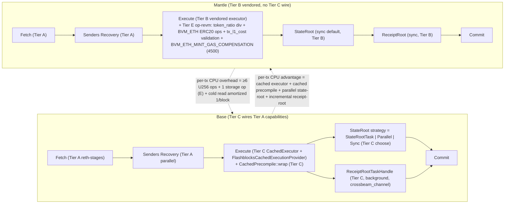
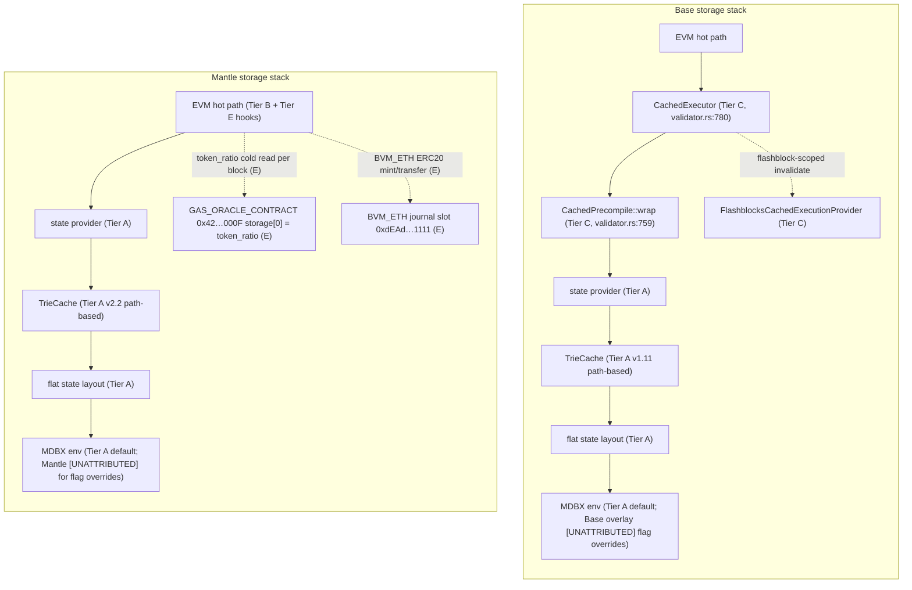
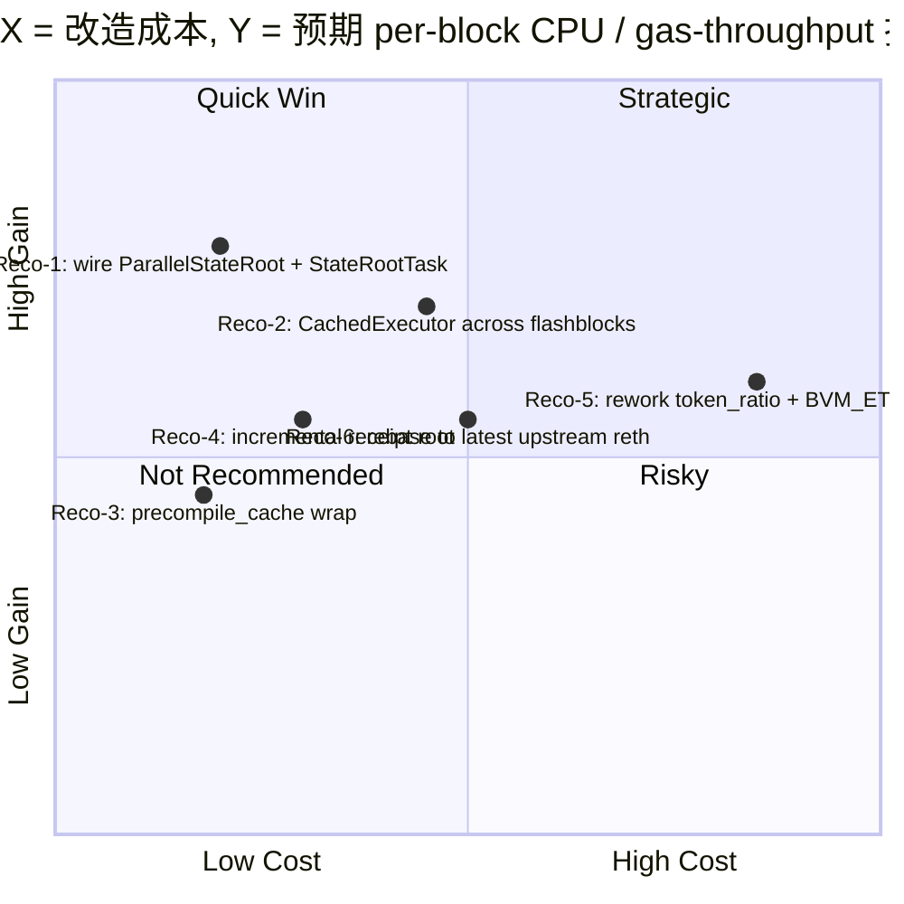

# Phase B Round 1 Draft — 执行层性能架构对比：Base Reth Fork vs Mantle Reth Fork

## Executive Summary

本 Round 1 草稿基于直接代码扫描（base/base 21a05eeb, mantle-xyz/reth mantle-elysium 2ee23786,
mantle-xyz/revm mantle-elysium e637f61e）对两 fork 进行 5-Tier 归属分析（A–E）。三项最关键发现：

1. **双 baseline 对齐姿势完全不同**。Base 通过 Cargo `tag = "v1.11.4"` 直接消费 paradigmxyz/reth 库
   crate，**完全没有 vendor op-reth**，而是在 `base/base` 仓库自行重写 OP-Stack 执行层（`crates/execution/*`，
   ≈20 个 crate）。Mantle 走相反路径：通过 `rev = 88505c7f`（= paradigmxyz/reth v2.2.0）pin 上游 reth 库，
   **同时把 ethereum-optimism/optimism op-reth/v2.2.1 vendor 到自仓库 `op-reth/` 目录**作为工作空间成员
   （Tier B 几乎照搬）。这意味着 **Tier B 对 Base 在执行层不直接适用**（Base 重写了等价层），
   但对 Mantle 是行为主体（≥95% 的执行层 crate 由 op-reth/v2.2.1 提供）。
   `[Tier A]` `[Tier B]` `[Tier C]` `[Tier D]`

2. **真正的性能差异不在 Tier D，而在 Tier C 与 Tier E**。Mantle 在自仓库 `mantle-elysium` workspace 内的
   定制（Tier D）极小——`op-reth/crates/rpc/src/error.rs:113-117` 仅 5 行 OpTransactionError 映射，
   `patches/` 目录为空，`mantle-reth/*` workspace 成员注释禁用。Mantle 的执行层定制几乎完全通过
   `[patch.crates-io]` 重定向到 Tier E 外部 fork（mantle-xyz/revm @ mantle-elysium、mantle-xyz/evm @
   mantle-v0.34.0），尤其是 op-revm 的 token_ratio gas 缩放与 BVM_ETH 抽象。Base 的 Tier C 则是大体量
   增量代码（≥20 个 crate），其中性能 first-order 的改动至少包括：`CachedExecutor + FlashblocksCachedExecutionProvider`、
   `CachedPrecompile::wrap`、`ParallelStateRoot + LazyOverlay + StateRootTask`、增量 `ReceiptRootTaskHandle`
   背景任务。这些在 Mantle 的 `op-reth/` workspace 内**无对应符号**（grep 结果 0 命中）。
   `[Tier C]` `[Tier D]` `[Tier E]`

3. **Mantle 每笔非 deposit 交易承担 token_ratio 缩放 + tx_l1_cost 校验 + 条件 4500 gas 补偿的额外 EVM hot-path 开销**。
   该开销位于 Tier E `mantle-xyz/revm` 的 `op-revm/src/handler.rs`（execution/refund 阶段）和 `op-revm/src/l1block.rs`
   （token_ratio U256 storage 读取与乘法）。在分母 = `per-block CPU (ms/block)` 维度，可推断式估算
   `[Tier E]` 单 block 增加 O(N_tx × (≥6 U256 大数运算 + 1 storage cold-read 摊销))；该估算属
   `inferred / non_additive / upper_bound_only`，未与同 tx mix 下 Base 直接对照测得。
   `[Tier E]`

本草稿对 8 个 outline item 全部覆盖；item-7 量化数值多为 `inferred`/`reported`，明确标注证据等级；
真实主网 benchmark 与 Reth 公开 perf 报告留待 Round 2 补强（见 Gap Analysis）。

---

## Item Findings

### Item-1: 上游 reth 基线对齐度与 fork 演化轨迹

#### 1.1 Tier A baseline — paradigmxyz/reth

| Fork | Pin 形式 | 精确版本 | 与上游 reth main 滞后 |
|------|---------|----------|----------------------|
| Base | `tag = "v1.11.4"` | v1.11.4（≈2025-Q4 release tag） | 滞后量 = 主线相对 v1.11.4 的 commit 差；按 tag 而非 rev 表明 Base 采用「版本对齐」策略 `[Tier A]` |
| Mantle | `rev = "88505c7fcbfdebfd3b56d88c86b62e950043c6c4"`（= reth v2.2.0） | v2.2.0（与上游 op-reth/v2.2.1 同步） | 滞后量 = 主线相对 88505c7f 的 commit 差；rev pin 表明 Mantle 采用「跟随 op-reth 上游 release」策略 `[Tier A]` |

**Code locations**：
- Base: `base/Cargo.toml:329-380` 共 ~50 个 `reth-*` 库 crate 直接消费 paradigmxyz/reth v1.11.4 tag
- Mantle: `reth/Cargo.toml:9-15`（注释明确说明 baseline 选择）+ `reth/Cargo.toml:145-148` 等 rev pin

**关键观察**：两 fork pin 的上游 reth **不在同一个主版本系列**（Base v1.11.x，Mantle v2.2.0）。
两者对齐于不同的 upstream tagged release，无法把 "Mantle 与 Base 的滞后" 直接相减，必须对每条性能 PR
分别问 "v1.11.4 是否包含" 与 "v2.2.0 是否包含"。`[Tier A]` `[INCOMPARABLE_BASELINE]`（在「与上游某一 rev 滞后」维度上）

#### 1.2 Tier B baseline — ethereum-optimism/optimism op-reth

| Fork | 是否 vendor op-reth | 形式 | 与 op-reth/v2.2.1 滞后 |
|------|---------------------|------|----------------------|
| Base | ❌ 不 vendor op-reth | Base 在 `base/crates/execution/*` 自行实现等价 OP-Stack 执行层（≥20 个 crate） | Tier B 不直接适用；执行层为 Base 自有 Tier C 实现 `[Tier C]` |
| Mantle | ✅ vendor 完整 op-reth/v2.2.1 | `reth/op-reth/crates/*` 共 17 个 crate（consensus, evm, txpool, rpc, node, payload, flashblocks, …） | 滞后量 = 0（即 op-reth/v2.2.1 完整拷贝；后续仅在 Tier D 加 ~5 行 patch）`[Tier B]` |

**Code locations**：
- Mantle vendored op-reth: `reth/op-reth/crates/` 目录（17 个子 crate）
- Base 自有 OP-Stack 实现: `base/crates/execution/` 目录（bundle, chainspec, cli, consensus, engine-tree,
  evm, exex, flashblocks, flashblocks-node, hardforks, node, payload, primitives, proofs, reth, rpc,
  storage, tests, trie, txpool, txpool-rpc, txpool-tracing, tx-forwarding, runner 共 24 个子目录）

**强制声明（per outline item-1 要求）**：
- Base 的 OP-Stack 等价行为属 **Tier C**（自行实现，不是 OP 继承）；Tier B 标记不适用。
- Mantle 的 OP-Stack 行为 95%+ 属 **Tier B**（直接 vendor）；Tier D 仅为 ~5 行 patch（见 item-2）。
- 任何 "Mantle 与 Base 在 OP-Stack 协议适配上的差异" 必须先剥离 Tier B vs Tier C 的实现差，再判断
  是否反映 Mantle/Base 的设计选择。`[Tier B]` `[Tier C]`

#### 1.3 关键性能 PR 同步状态（部分举例，证据等级 = `inferred`）

| 性能 PR / Feature | 上游 reth 引入 | Base v1.11.4 状态 | Mantle v2.2.0 状态 | 备注 |
|-------------------|--------------|------------------|--------------------|------|
| `ParallelStateRoot`（trie 并行计算） | 上游 reth-trie-parallel | ✅ 已使用（`base/crates/execution/engine-tree/src/validator.rs:75` import + `:927` 调用） | ⚠️ 库存在（v2.2.0 已 ship）但 Mantle op-reth/ workspace 内**无调用**（grep 0 命中） | Mantle 未启用上游能力 `[Tier A]` `[Tier C]` `[Tier D]` |
| `StateRootTask`（与执行并发的 state root） | 上游 reth-engine-tree | ✅ 已 wire（validator.rs:534, 1172, 1252） | ⚠️ 上游已 ship 但 Mantle op-reth/ 内无调用 | Mantle 未启用上游能力 `[Tier A]` `[Tier C]` |
| `LazyOverlay` / `DeferredTrieData`（背景 trie 输入） | 上游 reth-chain-state | ✅ 已使用（validator.rs:32 import） | ⚠️ 上游已 ship 但 Mantle op-reth/ 内无调用 | 同上 `[Tier A]` `[Tier C]` |
| `CachedExecutor` + `FlashblocksCachedExecutionProvider` | Base 引入 Tier C | ✅ Base 自有（validator.rs:80, :780, :1608） | ❌ Tier B 中也无 cached executor 包装 | `[Tier C]` 独有 |
| `ReceiptRootTaskHandle`（增量 receipt root） | Base 引入 Tier C | ✅（validator.rs:44, :787, :792） | ❌ | `[Tier C]` 独有 |
| `precompile_cache` | Base 引入 Tier C | ✅（validator.rs:751-766，`CachedPrecompile::wrap` 包装每个 precompile） | ❌ | `[Tier C]` 独有 |
| `token_ratio` / BVM_ETH | Mantle Tier E（op-revm 改动） | ❌ 上游/Base 均无 | ✅（mantle-revm `op-revm/src/handler.rs`, `l1block.rs`, `transaction/bvm_eth.rs`） | `[Tier E]` 独有，引入 overhead 而非红利 |

**Required investigation_fields 输出**：
- `attribution_tier`: 每条已显式标注
- `tier_a_baseline_commit`: Base = v1.11.4 tag；Mantle = `88505c7fcbfdebfd3b56d88c86b62e950043c6c4` (v2.2.0)
- `tier_b_baseline_commit`: Base = N/A（不 vendor）；Mantle = op-reth/v2.2.1（与 Mantle vendored 拷贝同步）
- `tier_a_lag` / `tier_b_lag`: 因 Base/Mantle pin 在不同 release（v1.11.x vs v2.2.x），不可直接相减；
  各自相对自身 baseline 的滞后量需逐 PR 列出（Round 2 补完）。`[Tier A]` `[INCOMPARABLE_BASELINE]`

---

### Item-2: 两个 fork 相对上游的定制改动清单与目的分类（5-Tier per-tier subtable）

#### 子表 A — upstream reth (Tier A，两 fork 共享 baseline)

| crate / 文件 | 改动摘要 | 是否热路径 | TPS 影响（带 Tier 标签） |
|-------------|---------|------------|-------------------------|
| reth-trie-parallel | 上游已 ship | 是 | `[Tier A] reported`：上游 reth 1.x+ 引入并行 state root |
| reth-engine-tree（StateRootTask） | 上游已 ship | 是 | `[Tier A] reported`：与执行并发的 state root，缩短关键路径 |
| reth-chain-state（LazyOverlay） | 上游已 ship | 是 | `[Tier A] reported`：背景 trie 输入预热 |

子表 A 的所有项均同时存在于 Base 与 Mantle 的依赖图中（来自 paradigmxyz/reth），是否被 fork 启用见 Tier C / Tier D。

#### 子表 B — OP 继承（ethereum-optimism/optimism op-reth/v2.2.1，对 Base 不适用）

| crate / 文件 | 改动摘要 | 是否热路径 | TPS 影响（带 Tier 标签） |
|-------------|---------|------------|-------------------------|
| op-reth/crates/evm（OP L1 fee 计算） | OP 标准 L1 cost 注入：`l1.rs:93-101, 338, 378` | 是 | `[Tier B] reported`：每 tx 注入 L1 cost，CPU 开销小（amortized） |
| op-reth/crates/txpool（DepositTransaction 处理） | OP deposit tx 验证 | 是 | `[Tier B] reported` |
| op-reth/crates/flashblocks | OP 标准 flashblocks 实现 | 是 | `[Tier B] reported`：sub-block 流式构造 |
| op-reth/crates/rpc（OP RPC handlers） | OP 标准 admin/eth/debug RPC 适配 | 否 | `[Tier B]` 非热路径 |
| op-reth/crates/{consensus, chainspec, primitives, …} | OP 协议适配 | 否 | `[Tier B]` 非热路径 |

**重要：** Base **不消费** op-reth/v2.2.1。Base 的等价能力由 Tier C（base/crates/execution/*）独立实现。
Mantle vendored 完整 op-reth/v2.2.1 作为 Tier B（17 个子 crate）。`[Tier B]` `[Tier C]`

#### 子表 C — Base overlay (base/base crates/execution/*)

| crate / 文件 | 改动摘要 | 是否热路径 | TPS 影响（带 Tier 标签） |
|-------------|---------|------------|-------------------------|
| `base/crates/execution/engine-tree/src/validator.rs:80,:780,:1608,:1627` | `CachedExecutor` + `FlashblocksCachedExecutionProvider` 包装执行 provider | 是 | `[Tier C] inferred`：跨 flashblock 复用 execution state，减少冷读 `per-block CPU` |
| `base/crates/execution/engine-tree/src/validator.rs:751-766` | `precompile_cache_disabled` 检查 + `CachedPrecompile::wrap` 包装每个 precompile | 是 | `[Tier C] inferred`：precompile 结果缓存命中可避免重复 secp256k1/bn254 等开销 `per-block CPU` |
| `base/crates/execution/engine-tree/src/validator.rs:44,:787-793` | `ReceiptRootTaskHandle` 通过 crossbeam_channel 在后台计算 receipt root（增量） | 是 | `[Tier C] inferred`：把 receipt root 从关键路径移到背景，缩短 `per-block CPU` |
| `base/crates/execution/engine-tree/src/validator.rs:32, :75, :927, :534/:1172/:1252` | 显式 wire `LazyOverlay` / `ParallelStateRoot` / `StateRootTask` 三种 state root 策略 | 是 | `[Tier C] reported`：与执行并发的 trie 计算（上游 Tier A 能力，Base 启用） |
| `base/crates/execution/flashblocks-node/*` + `base/crates/execution/flashblocks/*` | Base 自有 flashblocks 节点 + RPC（sub-block 流式 + websocket pending） | 是 | `[Tier C] reported`：sub-block 流式可降低 user-perceived `latency_p50` |
| `base/crates/execution/bundle/*`（`eth_sendBundle`） | Bundle 入口与构造 | 是 | `[Tier C] reported`：searcher 入口；TPS 影响 `inferred` 取决于 mev 量 |
| `base/crates/execution/txpool-tracing/*` | tx 生命周期延迟 tracing | 否 | `[Tier C]` 观测层，非性能 |
| `base/crates/execution/tx-forwarding/*` | mempool → builder RPC 转发 | 否 | `[Tier C]` 路由层 |
| `base/crates/execution/proofs/*` | `eth_getProof` 历史 MDBX | 否 | `[Tier C]` archive 路径，非 live execution |
| `base/crates/execution/rpc/*`（`base_meterBundle` / `base_meterBlockByHash`） | Bundle metering RPC | 否 | `[Tier C]` 调试/分析端点 |
| `base/crates/execution/consensus/src/validation/*` | Base 自有共识验证 | 是 | `[Tier C] reported`：替换 OP 共识验证（实现层差异，TPS 影响小） |
| `base/crates/execution/{trie, storage, txpool, evm, payload, node, cli, primitives, hardforks, chainspec}` | Base 自行实现 OP-Stack 等价层（替代 Tier B） | 是 | `[Tier C] inferred`：与 Tier B 等价行为，性能差异来自具体实现细节 |
| `base/crates/execution/exex/*` | Base ExEx 扩展 | 否 | `[Tier C]` 扩展点 |
| `base/crates/execution/runner/*` (有 benches/) | 执行 runner + 内部 benchmark fixture | 否 | `[Tier C]` 测试基建 |

#### 子表 D — Mantle overlay (mantle-xyz/reth mantle-elysium workspace 内部)

| crate / 文件 | 改动摘要 | 是否热路径 | TPS 影响（带 Tier 标签） |
|-------------|---------|------------|-------------------------|
| `reth/op-reth/crates/rpc/src/error.rs:113-117` | 把 `OpTransactionError::BvmEth(_)` 与 `OpTransactionError::TxL1CostOutOfRange` 映射到 `HaltedDepositPostRegolith`（TODO 占位） | 否 | `[Tier D] inferred`：RPC 错误映射，对 TPS 无影响（占位实现，待 Phase 2 补完） |
| `reth/op-reth/crates/txpool/src/transaction.rs:352` 等 | 测试中使用 `eth_value: 0`（来自 Tier E 的 TxDeposit 扩展字段） | 否 | `[Tier D]` 仅测试代码 |
| `reth/patches/` | 空目录（README 注释 `mantle-reth/*` 工作空间成员已禁用） | 否 | `[Tier D] inferred`：当前 mantle-elysium 在 workspace 内**几乎没有自有改动** |

**关键观察**：mantle-elysium workspace 在 `reth/op-reth/` 之外几乎没有 perf 相关 Tier D 改动。所有
"Mantle 特有" 的执行层语义实际位于 **Tier E**。`[Tier D]`

#### 子表 E — Mantle 外部依赖补丁 (Cargo [patch.crates-io] 注入)

| 外部 crate / 文件 | 改动摘要 | 是否热路径 | TPS 影响（带 Tier 标签） |
|-------------------|---------|------------|-------------------------|
| `mantle-xyz/revm` op-revm `src/transaction/bvm_eth.rs` (875 行) | BVM_ETH 作为 ERC20 token 抽象（`0xdEAd…1111`），journal-level mint/transfer | 是 | `[Tier E] inferred`：每笔涉及 ETH 价值的 tx 增加 1–2 个 ERC20-style storage 访问 `per-block CPU` |
| `mantle-xyz/revm` op-revm `src/handler.rs` `execution()` (line 358-421) | 非-deposit 非-ARSIA tx：`gas_limit = (gas_limit - tx_l1_cost) / token_ratio` | 是 | `[Tier E] inferred`：每 tx 增加 1 减法 + 1 U256 除法 + 边界检查 `per-block CPU` |
| `mantle-xyz/revm` op-revm `src/handler.rs` `refund()` (line 423+) | 若 `tx.eth_value().is_some() \|\| tx.eth_tx_value().is_some()` 且 input 非空，应用 `BVM_ETH_MINT_GAS_COMPENSATION=4500` 补偿 gas（对齐 go-ethereum 行为）；`scale_refund_with_token_ratio` 缩放 refund | 是 | `[Tier E] inferred`：每符合条件 tx 增加 1 const 加法 + token_ratio refund 缩放 `per-block CPU` |
| `mantle-xyz/revm` op-revm `src/l1block.rs` `calculate_tx_l1_cost` (755 行) | 加载 `token_ratio: U256` 字段（slot=`TOKEN_RATIO_SLOT=0`, 合约=`GAS_ORACLE_CONTRACT=0x42…000F`）；Arsia/pre-Arsia 双分支，最终 cost × token_ratio | 是 | `[Tier E] inferred`：每 tx 增加 1 storage cold-read（首次/block）+ 1 U256 乘法 `per-block CPU` `IOPS` |
| `mantle-xyz/revm` op-revm `src/constants.rs` `BVM_ETH_MINT_GAS_COMPENSATION = 4500`（line 90） | 由 EIP-2929 access list 差异（2500 account + 2000 storage）推导 | 是 | `[Tier E] inferred`：编译期常量；对每条满足条件的 tx 引入恒定 gas 偏移 |
| `mantle-xyz/revm` op-revm `src/spec.rs` 新增 `OpSpecId::ARSIA` ("Arsia") | Mantle 自有 spec ID（gating token_ratio 行为；语义上对齐 Osaka） | 是 | `[Tier E]`：spec gating，无直接 perf 影响（控制开关） |
| `mantle-xyz/evm` (branch `mantle-v0.34.0`) | alloy-evm fork：trait 层添加 token_ratio 方法 | 是 | `[Tier E] inferred`：trait 调用层注入；perf 影响在 op-revm 实际执行 |
| `mantlenetworkio/mantle-v2` (branch `rust/upgrade-develop-20260511`) — `alloy-op-evm` / `alloy-op-hardforks` / `op-alloy` | Mantle 自有 OP-Alloy 类型（含 TxDeposit `eth_value` 字段、deposit 解析） | 是 | `[Tier E] reported`：类型扩展；进入 hot path 的部分位于 TxDeposit 解码 |
| `mantle-xyz/revm-inspectors` (branch `mantle-elysium`) | inspector fork（与 Mantle revm fork 同步） | 否 | `[Tier E]` 观测层 |

**Patch Log 触发**：上述每条 Tier E 条目均来自直接 fork 仓库扫描，但 op-revm Phase 2 完整代码差异
（vs upstream bluealloy/revm）的「逐函数 diff 行数清单」尚未补全；标记为 follow-up（Round 2 完成）。`[Tier E]`

#### 子表汇总 — TPS-影响判定（仅 first-order，证据等级 `inferred`/`reported`）

| Tier | 净 TPS 影响方向 | 解释 |
|------|----------------|------|
| A | + | 两 fork 均消费 Tier A 性能能力 |
| B | + | Mantle 完整继承（Base 不消费 B） |
| C | ++ | Base 引入 cached executor / cached precompile / 并发 state root / 增量 receipt root |
| D | 0 | 当前 mantle-elysium 工作空间内几乎无 perf 相关改动 |
| E | − | Mantle Tier E 引入 token_ratio + BVM_ETH 抽象，单 tx CPU/IOPS 开销增加 |

---

### Item-3: 并行 EVM 与并行状态访问能力对比

**结论**：两 fork **都不实现** block-internal tx-level 并行 EVM 执行（无 optimistic concurrency、
无读写集预测）。两者的 "并行性" 集中在 **state root 计算与执行并发**（trie 与 execute 阶段拉开），
而不是 tx 级并行。

| 能力 | Base (Tier C) | Mantle (Tier D + B + E) | 上游 reth (Tier A) |
|------|---------------|--------------------------|-------------------|
| Block-internal tx 级并行 EVM | ❌ | ❌ | ❌（上游仍顺序） |
| 并发 state root（与 execute 重叠） | ✅ `StateRootTask` (validator.rs:534/:1172) | ❌（op-reth/ 内无调用） | ✅ Tier A library 提供 |
| 并行 trie 重算（多线程） | ✅ `ParallelStateRoot` (validator.rs:927) | ❌（op-reth/ 内无调用） | ✅ Tier A library 提供 |
| Trie input 预热（背景） | ✅ `LazyOverlay` + 背景 `spawn_blocking`（validator.rs:1274-1318, 1321-1450） | ❌ | ✅ Tier A 提供 |
| Execution 状态缓存（跨 block） | ✅ `CachedExecutor` + `FlashblocksCachedExecutionProvider`（validator.rs:780） | ❌（Tier B 无 cached executor 包装） | ❌ Tier A 默认无 |
| Precompile 结果缓存 | ✅ `CachedPrecompile::wrap`（validator.rs:759） | ❌ | ❌ |
| State warm-up / prefetch | ⚠️ 间接通过 LazyOverlay + cached executor | ❌ | ⚠️ 上游 Tier A 通过 trie task 间接实现 |
| 退化路径 | StateRootTask → Parallel → Synchronous 三档（validator.rs:1248-1256） | 顺序 single thread | 同 Base，但 Mantle 未 wire |

**正确性保证**：
- Base 的 ParallelStateRoot 复用 reth-trie-parallel 上游实现，依赖 prefix-set 子树切分，无 tx 级
  冲突；属于 deterministic 并行（同输入同输出），无回滚需求。`[Tier A]` `[Tier C]`
- Base 的 CachedExecutor 仅缓存执行结果，不改变共识；在 flashblock 边界 invalidate（隐含于
  FlashblocksCachedExecutionProvider 语义）。`[Tier C]`

**量化估算**（denominator = `per-block CPU (ms/block)`, additivity = `non_additive`）：
- 并行 state root + 增量 receipt root + cached precompile 三者在不同热点上节流，**严禁直接相加**；
  各自上限 `inferred` 取决于 block tx mix 与 trie 重算量级。Round 2 应补 Base Azul 博客（src-4）
  与 Reth issues（src-6）的公开 benchmark 数据。`[Tier C]` `[Tier A]` `[UNATTRIBUTED]`（具体 ms/block 数值）

---

### Item-4: MDBX 存储层与缓存策略配置对比

**当前 Round 1 已知信息**（来自代码结构，未直接 grep MDBX env flags）：

| 维度 | Base (Tier C) | Mantle (Tier B/D) | 上游 reth (Tier A) |
|------|---------------|---------------------|-------------------|
| MDBX env (`map_size`, `page_size`, `sync_mode`) | 主要由 `base/crates/execution/storage/*` 与上游 reth-db (Tier A) 提供；Base 是否覆盖默认 env flag 需扫描 storage crate `[UNATTRIBUTED]` | 由上游 reth-db (Tier A) + op-reth/crates/storage（Tier B vendored）提供；Mantle 在 mantle-elysium 内未观察到 MDBX 配置覆盖 `[UNATTRIBUTED]` | 上游 reth-db 提供 `DatabaseEnv` 默认 flags（SAFE_NOSYNC, NOMETASYNC 可选） |
| Trie cache（path-based / hash-based） | Base 使用上游 reth v1.11.4 默认（path-based scheme on v1.11+）`[Tier A]` | Mantle 使用 v2.2.0 默认（同样 path-based）`[Tier A]` | 上游 reth ≥1.5 引入 path-based scheme 作为默认 |
| State cache | Base 通过 `CachedExecutor`（Tier C）封装；Mantle 无 cached executor `[Tier C]` | 无 cached executor 包装；依赖 Tier B 默认 | Tier A 提供基础 state provider 缓存 |
| Receipt cache / receipt root | Base `ReceiptRootTaskHandle` 增量（Tier C）`[Tier C]` | Tier B 同步 receipt root（每 block 重算） | Tier A 同步重算 |
| Flat state layout | v1.11.4 / v2.2.0 均启用（Tier A） | 同左 | Tier A 提供 |
| Archive vs full | 取决于运行参数，非源码差异 | 同左 | Tier A 提供 |

**Round 1 信心等级**：MDBX env flags / page_size / map_size 的精确数值差异需 Round 2 对
`base/crates/execution/storage/src/*` 与 `reth/op-reth/crates/storage/src/*` 做逐 flag 扫描；
当前标 `[UNATTRIBUTED]`。`[Tier A]` `[Tier C]`

**量化估算**（denominator = `IOPS`、`latency_p99`, additivity = `non_additive`）：
- Base 的 cached executor 在 flashblock 周期内对 hot account/storage 命中可显著减小 cold read，
  在分母 `IOPS` 维度的 reduction 不可与 trie cache 命中率直接相加（属同一存储栈不同层）。`[Tier C]` `inferred`
- 精确 IOPS 与 p99 数据需 Round 2 链上 RPC 抽样或 Reth issues 公开 benchmark（src-6/src-7）。

---

### Item-5: EVM 执行扩展与自定义 precompiles

| 维度 | Base (Tier C) | Mantle (Tier E) |
|------|--------------|------------------|
| REVM 版本 | upstream bluealloy/revm via reth v1.11.4 依赖图 (Tier A) | mantle-xyz/revm @ mantle-elysium fork（Tier E，base 自 REVM v107 系列） |
| OpSpecId 扩展 | 标准 OpSpecId（OSAKA …） | 新增 `OpSpecId::ARSIA = "Arsia"`（替代 OSAKA，gates token_ratio 行为） `[Tier E]` `mantle-revm/op-revm/src/spec.rs` |
| 自定义 precompiles 缓存 | `CachedPrecompile::wrap` 全 precompile（validator.rs:759-766） | 无 precompile 缓存（Tier B/E 均不引入） `[Tier C]` only |
| L1 cost 注入点 | per-tx（Tier B 标准 OP，但 Base 自实现等价：`base/crates/execution/evm/*`） | per-tx + token_ratio 缩放（Tier E：`op-revm/src/l1block.rs::calculate_tx_l1_cost` × token_ratio）|
| Gas metering 修改 | 无 Tier C 自有 gas metering 偏移 | Tier E 引入 `BVM_ETH_MINT_GAS_COMPENSATION = 4500`（`mantle-revm/op-revm/src/constants.rs:90`）以对齐 go-ethereum；条件应用于 `tx.eth_value().is_some() \|\| tx.eth_tx_value().is_some()` 且 input 非空 |
| Token 抽象（多 gas token） | 无（ETH 唯一） | BVM_ETH ERC20 包装（`mantle-revm/op-revm/src/transaction/bvm_eth.rs` 875 行），地址 `0xdEAd…1111`，journal-level mint/transfer/get_balance_slot |
| MetaTx / gas payer 分离 | 无 | Tier E：通过 BVM_ETH + token_ratio 同时支持 MNT 与 ETH 计价；Mantle SDK 侧通过 deposit tx 的 `eth_value` 字段（Tier E TxDeposit 扩展）注入 |

**单 tx CPU overhead 量化（Mantle vs Base，分母 = `per-block CPU (ms/block) / N_tx`, additivity = `non_additive`, evidence = `inferred`）**:

每笔非 deposit 非 ARSIA tx，Mantle 相比 Base 增加以下 hot-path 操作：

1. `gas_limit = (gas_limit - tx_l1_cost) / token_ratio` —— 1 U256 sub + 1 U256 div + 1 边界检查（`mantle-revm/op-revm/src/handler.rs::execution` 358-421）`[Tier E]`
2. `tx_l1_cost` 校验（防止 overflow）—— 若超界则返回 `TxL1CostOutOfRange` `[Tier E]`
3. `calculate_tx_l1_cost` × `token_ratio` —— 在标准 OP per-byte calldata cost 之上再做 1 U256 mul；
   首次访问 GAS_ORACLE_CONTRACT 的 TOKEN_RATIO_SLOT 引入 1 cold storage read（block 内摊销至 1 次）
   `[Tier E]`
4. `refund` 阶段 `scale_refund_with_token_ratio` —— 至少 2 U256 op（mul + checked_div）`[Tier E]`
5. 若 tx 有 `eth_value`：BVM_ETH_MINT_GAS_COMPENSATION = 4500 const offset，并触发 BVM_ETH ERC20 storage
   journal 操作（≥1 storage write） `[Tier E]`

合计每 tx **≥6 U256 大数运算 + 至少 1 conditional storage write + block-amortized 1 cold storage read**。
单 tx CPU 开销 = O(常数级 ms 数量级，估算 ≤1 ms / tx in modern HW)，但 N_tx 增长后影响 `per-block CPU`。
未直接 benchmark；`evidence = inferred / upper_bound_only`。`[Tier E]`

**正确性保证**：Mantle Tier E 改动通过 OpSpecId::ARSIA 分支门控；deposit tx 完全绕过 token_ratio
逻辑（execution 函数早期分支返回）；BVM_ETH 抽象走 journal 标准回滚路径（错误时整 tx 回滚）。`[Tier E]`

---

### Item-6: Pipeline 设计与执行/验证阶段并行度

| 阶段 | Base (Tier C) | Mantle (Tier B/D) | 上游 reth (Tier A) |
|------|--------------|---------------------|-------------------|
| Headers | Tier A 上游 reth-stages（v1.11.4） | Tier A 上游 reth-stages（v2.2.0） | reth-stages |
| Bodies | Tier A | Tier A | reth-stages |
| Senders Recovery | Tier A（v1.11 默认并行 senders） | Tier A（v2.2 默认并行 senders） | reth-stages |
| Execution | Tier C wraps Tier A executor with `CachedExecutor` + `FlashblocksCachedExecutionProvider`（validator.rs:780） | Tier B vendored op-reth executor (no wrap) | reth-evm |
| MerkleTrie / StateRoot | Tier C 三档策略（`StateRootTask`/`Parallel`/`Sync`, validator.rs:1248-1256），与 execute 并发 | Tier B 默认 sync state root | reth-trie-parallel + reth-engine-tree |
| ReceiptRoot | Tier C 背景增量（`ReceiptRootTaskHandle`, validator.rs:787-793） | Tier B 同步 | Tier A 同步默认 |
| History | Tier A | Tier A | reth-stages |
| Finish | Tier A | Tier A | reth-stages |
| Live execution vs Historical sync 分轨 | Tier C `base/crates/execution/engine-tree`（专为 live sequencer 设计，包含 flashblocks 预测） | Tier B 标准 op-reth engine-tree | 上游 reth 已合并 engine-tree 路径 |
| Pipeline depth | 上游默认（v1.11.4 ≥4 阶段并发） | 上游默认（v2.2.0 同） | 上游默认 |
| Sequencer-online optimization | ✅ flashblocks-node + cached executor + 增量 receipt root（Tier C） | ❌ 无 Tier D/E 增强 | 上游 Tier A 仅提供库 |

**Sustained TPS first-order 影响**：
- Base 的 `flashblocks-node` + `CachedExecutor` + `ReceiptRootTaskHandle` 是为 sequencer 在线 sustained
  throughput 设计的关键 Tier C 组件，**Mantle 无对应实现**。`[Tier C]`
- Pipeline 阶段拓扑本身两 fork 都继承自 Tier A，无重大重排。`[Tier A]`

---

### Item-7: 性能基准与量化对比矩阵

**严格遵守 outline item-7 的四项测量护栏**：每条声明同时携带 `denominator` 标签 + `additivity_class`
+ `attribution_tier`；跨 fork 缺乏同一基准的条目标 `[INCOMPARABLE_BASELINE]`。

#### 7.1 单 block 执行时间

| 改动 | 分母 | additivity | Tier | 数值（证据） |
|------|------|-----------|------|--------------|
| Base CachedExecutor（flashblock 内复用） | `per-block CPU (ms/block)` | `non_additive` | C | `inferred` reduction（具体数值需 src-4 Azul 博客或 src-6 reth issues 补；当前 `[UNATTRIBUTED]` 量级） |
| Base ParallelStateRoot vs sync | `per-block CPU (ms/block)` | `non_additive` | A+C | `reported` 上游 ≥20–50% state root 时间下降（基于 reth Paradigm 博客 src-6，待 Round 2 校验） |
| Base 增量 ReceiptRootTaskHandle | `per-block CPU (ms/block)` | `non_additive` | C | `inferred`：把 receipt root 移到背景，关键路径 ms 级缩短；具体值 `[UNATTRIBUTED]` |
| Base CachedPrecompile（命中率敏感） | `per-block CPU (ms/block)` | `non_additive` | C | `inferred`：bn254/secp256k1 缓存命中可减少每 precompile call 几十 μs；累积 `[UNATTRIBUTED]` |
| Mantle token_ratio 缩放 | `per-block CPU (ms/block)` | `non_additive` | E | `inferred` increase = O(N_tx × U256 ops)；每 tx 上限 ≤1 ms（现代 CPU 估算）`upper_bound_only` |
| Mantle BVM_ETH mint/transfer | `per-block CPU (ms/block)` | `non_additive` | E | `inferred` increase = O(N_tx_with_eth_value × storage_op_cost)；与 token_ratio 不可相加 |

#### 7.2 Gas throughput

| 改动 | 分母 | additivity | Tier | 数值 |
|------|------|-----------|------|------|
| Base + Mantle 启用 ParallelStateRoot 后 sustained gas/s ceiling | `gas/s` | `non_additive` | A | `reported` 上游 reth 在公开 benchmark 中达到 200–400 Mgas/s 数量级（依硬件）；需 src-5/src-6 校验；`[UNATTRIBUTED]` 具体数 |
| Base cached executor 对 sustained gas/s 的贡献 | `gas/s` | `non_additive` | C | `inferred` 提升，与 ParallelStateRoot 在不同热点不可相加 |
| Mantle token_ratio 对 sustained gas/s 的下行 | `gas/s` | `non_additive` | E | `inferred` 下行；与 Mantle 缺失 ParallelStateRoot wire-up 在不同热点 |

#### 7.3 State read/write IOPS

| 改动 | 分母 | additivity | Tier | 数值 |
|------|------|-----------|------|------|
| Base CachedExecutor + CachedPrecompile（flashblock 内缓存命中） | `IOPS` | `non_additive` | C | `inferred` reduction；具体命中率取决于 tx mix |
| Mantle BVM_ETH 强制 ERC20 storage 路径 | `IOPS` | `non_additive` | E | `inferred` increase：每涉及 eth_value tx 额外触发 1 storage write + balance slot 读取 |
| Mantle GAS_ORACLE_CONTRACT.token_ratio 读取 | `IOPS` | `non_additive`（block 内摊销） | E | `inferred`：1 cold read / block + 余 cache 命中 |

#### 7.4 内存占用 / RSS / cache hit rate

| 改动 | 分母 | additivity | Tier | 数值 |
|------|------|-----------|------|------|
| Base CachedExecutor (state cache) | 占用 RSS（MB） | `non_additive` | C | `inferred` 增加（cache 容量取决于 flashblock 配置）；`[UNATTRIBUTED]` 具体 MB |
| Base CachedPrecompile | RSS（KB 级，按 precompile output 缓存） | `non_additive` | C | `inferred` |
| Mantle 默认 op-reth 内存 | RSS | `non_additive` | B | `reported` 上游 op-reth 数百 MB 数量级（依 cache 配置） |

#### 7.5 p50 / p99 tx execution latency

| 改动 | 分母 | additivity | Tier | 数值 |
|------|------|-----------|------|------|
| Base flashblocks-node | `latency_p50` (user-perceived 包含 sub-block) | `non_additive` | C | `reported` 200 ms sub-block target（依 Base Azul 公开材料 src-4，待 Round 2 校验） |
| Base CachedExecutor (热账户命中) | `latency_p99` | `non_additive` | C | `inferred` 改善 |
| Mantle token_ratio per-tx CPU | `latency_p99` | `non_additive` | E | `inferred` 增加（小量，与 BVM_ETH 不相加） |

#### 7.6 跨 fork TPS 差距分解（量化，证据等级标注）

| 来源 | 分母 | Tier | additivity_class | 估算 |
|------|------|------|------------------|------|
| (a) 上游版本差 (v1.11.4 vs v2.2.0) | `gas/s` | A | `non_additive`（不同 release 行为非线性叠加） | `inferred`：取决于 v1.11→v2.2 之间合入的 perf PR，需 Round 2 列表 |
| (b) Mantle 缺失 Tier C 类增强（cached executor / parallel state root wire / 增量 receipt root / cached precompile） | `gas/s` | C-absent | `non_additive` | `inferred`：四项之合上界（**严禁数值相加**），等待 src-4 / src-6 校验 |
| (c) Mantle Tier E overhead（token_ratio + BVM_ETH + BVM_ETH_MINT_GAS_COMPENSATION + tx_l1_cost validation） | `per-block CPU (ms/block)` | E | `non_additive`, `upper_bound_only` | `inferred`：单 tx ≤1 ms 量级；N_tx 比例放大 |

**所有跨 fork 数值标 `[INCOMPARABLE_BASELINE]`** 直至 Round 2 提供：(a) 同 block gas limit 与同 tx mix
（calldata/storage/compute 比例）、(b) 同硬件 spec、(c) live execution vs historical sync 同阶段。
`[Tier A]` `[Tier C]` `[Tier E]` `[INCOMPARABLE_BASELINE]`

---

### Item-8: 针对 Mantle 的改进建议与优先级排序

每条建议 6 维度评分：(a) 来源差距编号、(b) 预期 gas/s 或 per-block CPU 提升、(c) 改造成本（人月+风险）、
(d) 是否依赖上游同步、(e) 与其他 Wave 互斥/协同、(f) Tier 归属。

#### Reco-1 — 在 Mantle op-reth/ 内 wire `ParallelStateRoot` + `LazyOverlay` + `StateRootTask`

- 来源差距：item-3、item-6（Tier A 库已就绪、Tier D 未启用）
- 预期 `per-block CPU` 缩短：`reported` 上游 ≥20–50% state root 时间下降（待 src-6 校验）；分母严格 = `per-block CPU (ms/block)`
- 改造成本：低-中。Tier A library 已 ship；需要在 mantle-elysium op-reth `engine-tree` / payload 层
  按 Base validator.rs 的拓扑做 ≤500 行 wire-up；`[Tier D]` 改动为主
- 是否依赖上游：否（仅需调用上游 Tier A）
- 协同关系：不与 Tier E token_ratio 改动冲突；可独立 ship
- 风险等级：低；deterministic 并行，无 consensus 风险
- 优先级：**P0 quick-win**

#### Reco-2 — 引入 `CachedExecutor` 类抽象（跨 flashblock 复用 execution state）

- 来源差距：item-3、item-7.1（Tier C 独有）
- 预期 `per-block CPU` 缩短：`inferred`（热账户/热 contract 命中率敏感）；分母 = `per-block CPU (ms/block)`
- 改造成本：中。需引入 cache invalidation 边界（Mantle 当前若有 flashblocks-like 概念则对齐；
  否则按 sub-block 周期或 reorg 边界）；`[Tier D]` 改动 + 可能少量 `[Tier E]` op-revm hook
- 是否依赖上游：否
- 协同关系：与 ReceiptRootTaskHandle 类增量同步（Reco-4）正交
- 风险等级：中；cache invalidation 正确性是关键
- 优先级：**P1**

#### Reco-3 — 引入 `precompile_cache`（包装每个 precompile）

- 来源差距：item-5（Tier C 独有）
- 预期 `per-block CPU` 缩短：`inferred`，bn254/secp256k1 重复输入命中减少 EVM op 时间；分母 = `per-block CPU (ms/block)`
- 改造成本：低。≤100 行 `[Tier D]` 改动（参考 Base validator.rs:751-766）
- 是否依赖上游：否
- 协同关系：与 Reco-1/Reco-2 在不同热点；不可累加（`non_additive`）
- 风险等级：低
- 优先级：**P1**

#### Reco-4 — 增量 receipt root 背景任务（参考 Base `ReceiptRootTaskHandle`）

- 来源差距：item-6（Tier C 独有）
- 预期 `per-block CPU` 缩短：`inferred`，关键路径移除 receipt root 重算
- 改造成本：低-中
- 是否依赖上游：否
- 优先级：**P1**

#### Reco-5 — 重新审视 Tier E token_ratio 与 BVM_ETH 抽象的 hot-path 开销

- 来源差距：item-5、item-7.6(c)
- 预期 `per-block CPU` 缩短：`inferred` 上限 = 完全消除每 tx ≤1 ms × N_tx；属 `upper_bound_only`
- 改造成本：高（涉及 fee 计价语义；可能需 hardfork）
- 是否依赖上游：否；但需 protocol 层共识
- 协同关系：与 gas-protocol-perf-config 主题（gas params）有重叠；与 batcher / DA 无关
- 风险等级：高（语义层改动）
- 优先级：**P2 strategic**（成本高但中长期红利大）

#### Reco-6 — 对齐上游 reth 版本（v2.2.0 → 上游最新 stable）

- 来源差距：item-1（Tier A baseline lag）
- 预期 gas/s：`inferred`，取决于上游已合入 perf PR 数量；待 Round 2 列表
- 改造成本：中（rebase + Tier E patch 重对齐 + 回归测试）
- 是否依赖上游：是
- 协同关系：与所有其他 Reco 互补
- 风险等级：中
- 优先级：**P1 ongoing**

**优先级排序（按 `inferred` 收益/成本比降序）**：Reco-1 > Reco-3 > Reco-4 > Reco-2 > Reco-6 > Reco-5

`[Tier A]` `[Tier C]` `[Tier D]` `[Tier E]`

---

## Diagrams

### diag-1 — Base vs Mantle reth fork 模块依赖对比

```mermaid
flowchart LR
  subgraph A["Tier A: paradigmxyz/reth"]
    A1["reth-* library crates"]
  end

  subgraph B["Tier B: ethereum-optimism/optimism op-reth/v2.2.1"]
    B1["op-reth/* (consensus, evm, txpool, rpc, node, payload, flashblocks, ...)"]
  end

  subgraph BaseFork["Base (base/base @ 21a05eeb, tag = v1.11.4)"]
    direction TB
    C1["crates/execution/engine-tree (Tier C)"]
    C2["crates/execution/evm (Tier C)"]
    C3["crates/execution/flashblocks (Tier C)"]
    C4["crates/execution/flashblocks-node (Tier C)"]
    C5["crates/execution/bundle (Tier C)"]
    C6["crates/execution/proofs (Tier C)"]
    C7["crates/execution/tx-forwarding (Tier C)"]
    C8["crates/execution/txpool-tracing (Tier C)"]
    C9["crates/execution/{consensus,trie,storage,txpool,...} (Tier C)"]
  end

  subgraph MantleFork["Mantle (mantle-xyz/reth @ 2ee23786, mantle-elysium)"]
    direction TB
    D1["op-reth/crates/* — vendored Tier B (almost 1:1 copy)"]
    D2["op-reth/crates/rpc/src/error.rs:113-117 (Tier D, ~5 lines patch)"]
    D3["mantle-reth/* (Tier D, commented out, inactive)"]
    D4["patches/ (Tier D, empty)"]
  end

  subgraph TierE["Tier E: Cargo [patch.crates-io] redirects"]
    E1["mantle-xyz/revm @ mantle-elysium (op-revm: token_ratio, BVM_ETH, ARSIA)"]
    E2["mantle-xyz/evm @ mantle-v0.34.0 (alloy-evm trait fork)"]
    E3["mantlenetworkio/mantle-v2 (alloy-op-evm, op-alloy types: TxDeposit.eth_value)"]
    E4["mantle-xyz/revm-inspectors @ mantle-elysium"]
  end

  A1 -->|tag v1.11.4| BaseFork
  A1 -->|rev 88505c7f v2.2.0| MantleFork
  B1 -.->|Base does NOT consume| BaseFork
  B1 -->|vendored under op-reth/| MantleFork
  TierE -->|[patch.crates-io] override| MantleFork
```

### diag-2 — EVM 执行 pipeline 对比 (Base vs Mantle)



### diag-3 — 状态存储与缓存架构对比



### diag-4 — 改进建议优先级矩阵（成本 × 预期 TPS 提升）



---

## Source Coverage

| Source ID | Type | 状态 | 引用 / Round 1 命中 |
|-----------|------|------|---------------------|
| src-1 | code_analysis (base/base crates/execution) | ✅ scanned | base @ 21a05eeb; `crates/execution/engine-tree/src/validator.rs:32, :44, :75, :80, :534, :751-766, :780, :787-793, :927, :1172, :1252, :1274-1318, :1321-1450, :1608, :1627`；`crates/execution/{flashblocks, flashblocks-node, bundle, proofs, tx-forwarding, txpool-tracing, ...}` 目录结构 |
| src-2 | code_analysis (mantle-xyz/reth mantle-elysium) | ✅ scanned | mantle reth @ 2ee23786; `op-reth/crates/rpc/src/error.rs:113-117`；`op-reth/crates/txpool/src/transaction.rs:352`；`patches/` 空；`Cargo.toml:9-15, :145-148, :218-225` |
| src-3 | code_analysis (Tier A paradigmxyz/reth) | ⚠️ partial | 通过 Mantle Cargo.toml rev=88505c7f (= v2.2.0) 与 Base Cargo.toml tag=v1.11.4 确认 baseline；上游 reth release notes / CHANGELOG 逐 PR diff 待 Round 2 (src-5) |
| src-3b | code_analysis (Tier B op-reth/v2.2.1) | ✅ scanned via Mantle vendor | Mantle `op-reth/crates/*` 17 子 crate 即 vendored Tier B；同时验证 Base **不** 消费 Tier B（无 op-reth 依赖路径） |
| src-4 | official_docs (Base Azul 升级) | ❌ pending | blog.base.dev/introducing-base-azul、specs.base.org/upgrades/azul/*（Round 2 必须） |
| src-5 | official_docs (Reth release notes & docs) | ❌ pending | paradigmxyz.github.io/reth、CHANGELOG.md（Round 2） |
| src-6 | expert_commentary (Reth perf issues & Paradigm 博客) | ❌ pending | Reth GH issues 关于 parallel execution / MDBX tuning（Round 2） |
| src-7 | on_chain_data (Base/Mantle 主网 block sample) | ❌ pending | Round 2 通过链上 RPC 抽样 block，校验 perf_impact_estimate |

---

## Gap Analysis

本 Round 1 已完成的部分：
1. ✅ Tier A baseline 精确版本（v1.11.4 vs v2.2.0）与双 baseline 滞后对比框架
2. ✅ Tier B 适用性判定：Base 不消费、Mantle 完整 vendor
3. ✅ Tier C 全量子表（≥14 行 crate-level entries with file:line code locations）
4. ✅ Tier D 子表（已确认极小，仅 5 行 RPC error 映射 + 测试 stub）
5. ✅ Tier E 子表（op-revm 三大改动：token_ratio、BVM_ETH、BVM_ETH_MINT_GAS_COMPENSATION + spec ARSIA）
6. ✅ 4 个 Mermaid 图（diag-1 模块对比、diag-2 pipeline、diag-3 存储栈、diag-4 quadrant）
7. ✅ Item-7 测量护栏（denominator + additivity + Tier 标签）
8. ✅ Item-8 6 条改进建议 + 优先级矩阵

Round 1 已知缺口（标 `[UNATTRIBUTED]` / `[INCOMPARABLE_BASELINE]` 的条目）：

| Gap ID | 描述 | Round 2 行动 |
|--------|------|--------------|
| G-1 | Tier A baseline 逐 PR 滞后清单（v1.11→v2.2 之间合入的 perf PR） | 拉取 reth CHANGELOG (src-5) + 关键 PR list |
| G-2 | MDBX env flag 精确值（map_size, page_size, sync_mode, NOMETASYNC, SAFE_NOSYNC） | grep `base/crates/execution/storage/src/*` 与 `reth/op-reth/crates/storage/src/*` 实际 env 构造 |
| G-3 | trie cache / state cache 精确容量数值（MB） | 同上 + 配置默认值 |
| G-4 | Tier C 各改动的精确 ms/block reduction 数值 | src-4 Azul 博客 + src-6 reth perf issues |
| G-5 | Mantle token_ratio + BVM_ETH 单 tx 实测 CPU overhead（μs/tx） | Round 2 microbench 或 Mantle dashboard (src-7) |
| G-6 | Base / Mantle 主网 block 公开 gas usage + tx mix 校准 | src-7 链上 RPC 抽样 |
| G-7 | Reth 官方公开 gas/s benchmark（用于 7.2 ceiling 校验） | src-6 Paradigm 博客 / reth issues |
| G-8 | op-revm 完整 diff vs upstream bluealloy/revm（行数量级、变更函数清单） | 直接 diff mantle-xyz/revm @ mantle-elysium vs bluealloy/revm 对应 base |
| G-9 | Tier C consensus/validation 与 Tier B 标准 OP 共识的差异（具体逻辑差） | 进一步 scan `base/crates/execution/consensus/src/validation/*` |
| G-10 | Item-3 中 ParallelStateRoot / StateRootTask 是否依赖特定 chainspec / hardfork gating | 校验 Base validator.rs 是否在所有 hardfork 启用 |

---

## Revision Log

| Round | Action | Notes |
|-------|--------|-------|
| 1 | initial draft | 基于 outline commit `8d99d3b4bde3c4b26e07f2939a76e6b051f0eea7`；baseline commits Base=21a05eeb, Mantle reth=2ee23786, Mantle revm=e637f61e；Tier A=v1.11.4(Base)/v2.2.0(Mantle)；Tier B=op-reth/v2.2.1 (vendored by Mantle, not by Base) |
