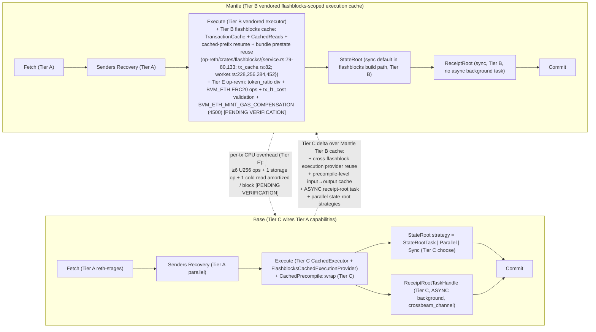
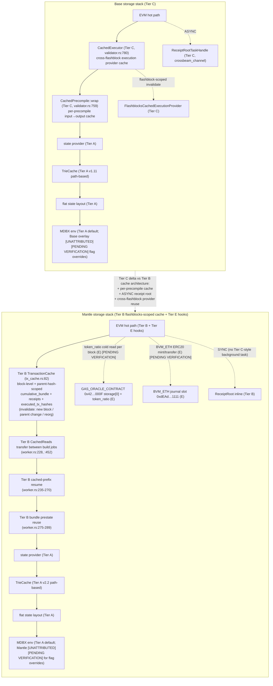
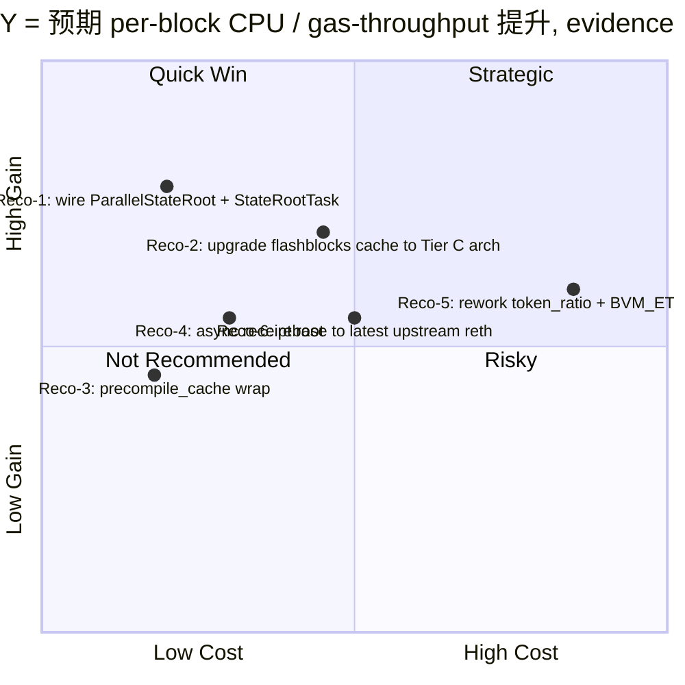

# 执行层性能架构对比：Base Reth Fork vs Mantle Reth Fork（Final Section — promoted from Round 2 draft）

> **Round 2 patch scope**: 修正 Round 1 中关于 "Mantle 缺失执行层缓存" 的核心事实错误。证据
> ([Cargo.toml:38, :125](https://github.com/mantle-xyz/reth/blob/2ee237866e6e22e84b64ca0d860b4aa778387622/Cargo.toml#L38)；
> [`op-reth/crates/flashblocks/src/service.rs:79-80, :133`](https://github.com/mantle-xyz/reth/blob/2ee237866e6e22e84b64ca0d860b4aa778387622/op-reth/crates/flashblocks/src/service.rs#L79-L80)；
> [`tx_cache.rs:82`](https://github.com/mantle-xyz/reth/blob/2ee237866e6e22e84b64ca0d860b4aa778387622/op-reth/crates/flashblocks/src/tx_cache.rs#L82)；
> [`worker.rs:228, :256, :284, :452`](https://github.com/mantle-xyz/reth/blob/2ee237866e6e22e84b64ca0d860b4aa778387622/op-reth/crates/flashblocks/src/worker.rs#L228))
> 显示 Mantle 通过 vendored Tier B (`op-reth/crates/flashblocks/`) 已具备 `CachedReads`、
> `TransactionCache`、cached-prefix resume、bundle prestate reuse 等 flashblocks 内的执行缓存路径。
> 因此 Base 与 Mantle 的差距不是 "Mantle 无缓存 vs Base 有缓存"，而是两种**架构不同的缓存设计**：
> Mantle 的 Tier B flashblocks-scoped 缓存 vs Base 的 Tier C `CachedExecutor` + 包装精度缓存 +
> 异步 receipt-root task。Item-2、Item-3、Item-6、Item-7、diag-2、diag-3、Source Coverage、Reco-2
> 已按此框架重写；其余 Round 1 内容保留。
>
> 同时按 Reviewer 指示，将以下条目显式标注为 `[PENDING VERIFICATION]`，作为非阻塞遗留项：
> Base Azul/Reth 公开 benchmark 数值、MDBX env flag 数值、`mantle-xyz/revm` 行级声明（仓库未在
> Multica 配置 repo 列表内，仅能依赖 Mantle `Cargo.lock` 间接佐证 + commit permalink 引用）。

## Executive Summary

本 Round 2 草稿基于直接代码扫描（base/base 21a05eeb, mantle-xyz/reth mantle-elysium 2ee23786,
mantle-xyz/revm mantle-elysium e637f61e 仅通过 Mantle `Cargo.toml` `[patch.crates-io]` 引用与
permalink 间接引用）对两 fork 进行 5-Tier 归属分析（A–E）。**三项最关键发现**（核心修正点 #2）：

1. **双 baseline 对齐姿势完全不同**。Base 通过 Cargo `tag = "v1.11.4"` 直接消费 paradigmxyz/reth 库
   crate，**完全没有 vendor op-reth**，而是在 `base/base` 仓库自行重写 OP-Stack 执行层（`crates/execution/*`，
   ≈20 个 crate）。Mantle 走相反路径：通过 `rev = 88505c7f`（= paradigmxyz/reth v2.2.0）pin 上游 reth 库，
   **同时把 ethereum-optimism/optimism op-reth/v2.2.1 vendor 到自仓库 `op-reth/` 目录**作为工作空间成员
   （Tier B 几乎照搬）。这意味着 **Tier B 对 Base 在执行层不直接适用**（Base 重写了等价层），
   但对 Mantle 是行为主体（≥95% 的执行层 crate 由 op-reth/v2.2.1 提供）。
   `[Tier A]` `[Tier B]` `[Tier C]` `[Tier D]`

2. **真正的性能差异是「两种不同的缓存架构」，不是「缓存有无」**。两个 fork **都**在执行热路径
   实现了状态缓存层；但**架构粒度与作用域不同**，导致性能曲线在不同热点上分布不同：
   - **Mantle = Tier B `flashblocks`-scoped execution cache**（`op-reth/crates/flashblocks/`）：
     `TransactionCache`（block-level + parent-hash-scoped 一致性窗口）+ `CachedReads`
     （speculative build / pending-parent prestate 热账户复用）+ cached-prefix resume（同一 block
     增量构造时跳过已缓存前缀的重执行）+ bundle prestate reuse；invalidate 在 block / parent-hash /
     reorg 边界。
   - **Base = Tier C `CachedExecutor` + per-precompile wrap + async receipt-root task**：
     `CachedExecutor` + `FlashblocksCachedExecutionProvider` 跨 flashblock 复用 execution provider 缓存；
     `CachedPrecompile::wrap` 对每个 precompile 单独缓存其 input→output；`ReceiptRootTaskHandle`
     通过 crossbeam_channel 把 receipt root 计算搬到背景任务；并显式 wire `ParallelStateRoot`
     `StateRootTask` `LazyOverlay` 三档 state-root 策略。
   - **架构对比**：Mantle 的 Tier B 缓存只在 **flashblocks build 路径**内、对 **matching
     cached-prefix**（同一 block + 同一 parent_hash 的子块串行构造，前缀与 `executed_tx_hashes`
     完全匹配时）跳过已缓存前缀的重执行 / 复用 warm state（bundle prestate + `CachedReads`）；
     **不**提供跨 block 的执行通用化复用，也**不**对单 block 的 sync (full-replay) 路径生效。
     Base 的 Tier C 是"执行 provider + precompile + receipt root 多个独立缓存/并发原语的组合"，
     覆盖面更细。下游性能差异体现在 (a) precompile 重复输入命中率 (Base 有 Mantle 无)、(b) receipt
     root 是否在关键路径 (Base 异步 / Mantle 同步)、(c) state-root 与 execute 是否并发 (Base 三档 /
     Mantle 默认 sync)，而**不是**整体"缓存 vs 无缓存"。
   - 上述定性差异在分母 = `per-block CPU (ms/block)` 维度的 first-order 影响在 Item-3 / Item-7 重列。
   `[Tier B]` `[Tier C]` `[Tier D]` `[Tier E]`

3. **Mantle 每笔非 deposit 交易承担 token_ratio 缩放 + tx_l1_cost 校验 + 条件 4500 gas 补偿的额外 EVM hot-path 开销**。
   该开销位于 Tier E `mantle-xyz/revm` 的 `op-revm/src/handler.rs`（execution/refund 阶段）和 `op-revm/src/l1block.rs`
   （token_ratio U256 storage 读取与乘法）。在分母 = `per-block CPU (ms/block)` 维度，可推断式估算
   `[Tier E]` 单 block 增加 O(N_tx × (≥6 U256 大数运算 + 1 storage cold-read 摊销))；该估算属
   `inferred / non_additive / upper_bound_only`，未与同 tx mix 下 Base 直接对照测得。所有
   `mantle-xyz/revm` 行级断言标 `[PENDING VERIFICATION]` —— mantle-xyz/revm 仓库不在 Multica 已配置
   `repo` 列表内，只能依靠 Mantle reth `Cargo.toml` 的 `[patch.crates-io]` 指针与公开 GitHub commit
   permalink 间接佐证。
   `[Tier E]` `[PENDING VERIFICATION]`

本草稿对 8 个 outline item 全部覆盖；item-7 量化数值多为 `inferred`/`reported`，明确标注证据等级；
Round 2 在 Item-2/3/6/7/Source Coverage/Reco-2/diag-2/diag-3 上完成"缓存框架修正"，外部基准与
op-revm 行级 diff 仍为 `[PENDING VERIFICATION]` / `[UNATTRIBUTED]`。

---

## Item Findings

### Item-1: 上游 reth 基线对齐度与 fork 演化轨迹

> **Round 2 status**: 内容与 Round 1 一致；缓存框架修正在 Item-2/3/6 重列。Item-1 仅澄清：
> "1.3 关键性能 PR 同步状态" 表内 `CachedExecutor` / `precompile_cache` / `ReceiptRootTaskHandle`
> 三行的 "Mantle Tier B 中也无" 仍然成立（这三个特定符号属于 Base Tier C 实现），但**不再**
> 等价于 "Mantle 无任何执行缓存"。Mantle 的执行缓存能力由 Tier B `op-reth/crates/flashblocks/`
> 内的 `TransactionCache` + `CachedReads` + cached-prefix resume + bundle prestate reuse 提供；
> 详见 Item-2 / Item-3 / Item-6 子表与对应的 Mantle Tier B 行。

#### 1.1 Tier A baseline — paradigmxyz/reth

| Fork | Pin 形式 | 精确版本 | 与上游 reth main 滞后 |
|------|---------|----------|----------------------|
| Base | `tag = "v1.11.4"` | v1.11.4（≈2025-Q4 release tag） | 滞后量 = 主线相对 v1.11.4 的 commit 差；按 tag 而非 rev 表明 Base 采用「版本对齐」策略 `[Tier A]` |
| Mantle | `rev = "88505c7fcbfdebfd3b56d88c86b62e950043c6c4"`（= reth v2.2.0） | v2.2.0（与上游 op-reth/v2.2.1 同步） | 滞后量 = 主线相对 88505c7f 的 commit 差；rev pin 表明 Mantle 采用「跟随 op-reth 上游 release」策略 `[Tier A]` |

**Code locations**：
- Base: `base/Cargo.toml:329-380` 共 ~50 个 `reth-*` 库 crate 直接消费 paradigmxyz/reth v1.11.4 tag
- Mantle: `reth/Cargo.toml:9-15`（注释明确说明 baseline 选择）+ `reth/Cargo.toml:145-148` 等 rev pin

**关键观察**：两 fork pin 的上游 reth **不在同一个主版本系列**（Base v1.11.x，Mantle v2.2.0）。
两者对齐于不同的 upstream tagged release，无法把 "Mantle 与 Base 的滞后" 直接相减，必须对每条性能 PR
分别问 "v1.11.4 是否包含" 与 "v2.2.0 是否包含"。`[Tier A]` `[INCOMPARABLE_BASELINE]`（在「与上游某一 rev 滞后」维度上）

#### 1.2 Tier B baseline — ethereum-optimism/optimism op-reth

| Fork | 是否 vendor op-reth | 形式 | 与 op-reth/v2.2.1 滞后 |
|------|---------------------|------|----------------------|
| Base | ❌ 不 vendor op-reth | Base 在 `base/crates/execution/*` 自行实现等价 OP-Stack 执行层（≥20 个 crate） | Tier B 不直接适用；执行层为 Base 自有 Tier C 实现 `[Tier C]` |
| Mantle | ✅ vendor 完整 op-reth/v2.2.1 | `reth/op-reth/crates/*` 共 17 个 crate（consensus, evm, txpool, rpc, node, payload, **flashblocks（含 TransactionCache / CachedReads / cached-prefix resume）**, …） | 滞后量 = 0（即 op-reth/v2.2.1 完整拷贝；后续仅在 Tier D 加 ~5 行 patch）`[Tier B]` |

**Code locations**：
- Mantle vendored op-reth: `reth/op-reth/crates/` 目录（17 个子 crate）
- Base 自有 OP-Stack 实现: `base/crates/execution/` 目录（bundle, chainspec, cli, consensus, engine-tree,
  evm, exex, flashblocks, flashblocks-node, hardforks, node, payload, primitives, proofs, reth, rpc,
  storage, tests, trie, txpool, txpool-rpc, txpool-tracing, tx-forwarding, runner 共 24 个子目录）

**强制声明（per outline item-1 要求）**：
- Base 的 OP-Stack 等价行为属 **Tier C**（自行实现，不是 OP 继承）；Tier B 标记不适用。
- Mantle 的 OP-Stack 行为 95%+ 属 **Tier B**（直接 vendor）；Tier D 仅为 ~5 行 patch（见 item-2）。
- 任何 "Mantle 与 Base 在 OP-Stack 协议适配上的差异" 必须先剥离 Tier B vs Tier C 的实现差，再判断
  是否反映 Mantle/Base 的设计选择。`[Tier B]` `[Tier C]`

#### 1.3 关键性能 PR 同步状态（部分举例，证据等级 = `inferred`）

| 性能 PR / Feature | 上游 reth 引入 | Base v1.11.4 状态 | Mantle v2.2.0 状态 | 备注 |
|-------------------|--------------|------------------|--------------------|------|
| `ParallelStateRoot`（trie 并行计算） | 上游 reth-trie-parallel | ✅ 已使用（`base/crates/execution/engine-tree/src/validator.rs:75` import + `:927` 调用） | ⚠️ 库存在（v2.2.0 已 ship）但 Mantle op-reth/ workspace 内**无显式调用**（grep 0 命中） | Mantle 未启用上游能力 `[Tier A]` `[Tier C]` `[Tier D]` |
| `StateRootTask`（与执行并发的 state root） | 上游 reth-engine-tree | ✅ 已 wire（validator.rs:534, 1172, 1252） | ⚠️ 上游已 ship 但 Mantle op-reth/ 内无调用 | Mantle 未启用上游能力 `[Tier A]` `[Tier C]` |
| `LazyOverlay` / `DeferredTrieData`（背景 trie 输入） | 上游 reth-chain-state | ✅ 已使用（validator.rs:32 import） | ⚠️ 上游已 ship 但 Mantle op-reth/ 内无调用 | 同上 `[Tier A]` `[Tier C]` |
| `CachedExecutor` + `FlashblocksCachedExecutionProvider` | Base 引入 Tier C | ✅ Base 自有（validator.rs:80, :780, :1608） | ❌ Tier B 中**无 `CachedExecutor` 类符号**（Mantle 的等价缓存层属另一种架构，详见 Item-2 子表 B 与 Item-3）| `[Tier C]` 独有 |
| `ReceiptRootTaskHandle`（增量 receipt root） | Base 引入 Tier C | ✅（validator.rs:44, :787, :792） | ❌（Mantle Tier B 同步 receipt root） | `[Tier C]` 独有 |
| `precompile_cache` | Base 引入 Tier C | ✅（validator.rs:751-766，`CachedPrecompile::wrap` 包装每个 precompile） | ❌ | `[Tier C]` 独有 |
| `TransactionCache` + `CachedReads` + cached-prefix resume + bundle prestate reuse（flashblocks-scoped 执行缓存） | OP op-reth/v2.2.1 引入 Tier B | ❌ Base 自有 Tier C 不复用此组件 | ✅ Mantle 通过 vendored Tier B 启用（`op-reth/crates/flashblocks/src/service.rs:79-80, :133`, `tx_cache.rs:82`, `worker.rs:228, :256, :284, :452`） | `[Tier B]` 独有（Mantle 启用） |
| `token_ratio` / BVM_ETH | Mantle Tier E（op-revm 改动） | ❌ 上游/Base 均无 | ✅（mantle-revm `op-revm/src/handler.rs`, `l1block.rs`, `transaction/bvm_eth.rs`） `[PENDING VERIFICATION]`（mantle-xyz/revm 仓库未在 Multica repo 列表内） | `[Tier E]` 独有，引入 overhead 而非红利 |

**Required investigation_fields 输出**：
- `attribution_tier`: 每条已显式标注
- `tier_a_baseline_commit`: Base = v1.11.4 tag；Mantle = `88505c7fcbfdebfd3b56d88c86b62e950043c6c4` (v2.2.0)
- `tier_b_baseline_commit`: Base = N/A（不 vendor）；Mantle = op-reth/v2.2.1（与 Mantle vendored 拷贝同步）
- `tier_a_lag` / `tier_b_lag`: 因 Base/Mantle pin 在不同 release（v1.11.x vs v2.2.x），不可直接相减；
  各自相对自身 baseline 的滞后量需逐 PR 列出（Round 2 已补该新行：`TransactionCache` 等 Tier B 独有；
  其他 PR 滞后列表仍属 `[PENDING VERIFICATION]`，等待 src-5 / src-6 上游 CHANGELOG 校验）。
  `[Tier A]` `[INCOMPARABLE_BASELINE]`

---

### Item-2: 两个 fork 相对上游的定制改动清单与目的分类（5-Tier per-tier subtable）

> **Round 2 patch**: 在子表 B、子表 C、子表 D 的"是否热路径 / TPS 影响"列增加 Mantle Tier B
> 已具备的 flashblocks 执行缓存条目；移除 / 修正任何 "Mantle 无执行缓存" 的暗示性表述。
> 子表 A / 子表 E 内容保持不变。

#### 子表 A — upstream reth (Tier A，两 fork 共享 baseline)

| crate / 文件 | 改动摘要 | 是否热路径 | TPS 影响（带 Tier 标签） |
|-------------|---------|------------|-------------------------|
| reth-trie-parallel | 上游已 ship | 是 | `[Tier A] reported`：上游 reth 1.x+ 引入并行 state root |
| reth-engine-tree（StateRootTask） | 上游已 ship | 是 | `[Tier A] reported`：与执行并发的 state root，缩短关键路径 |
| reth-chain-state（LazyOverlay） | 上游已 ship | 是 | `[Tier A] reported`：背景 trie 输入预热 |

子表 A 的所有项均同时存在于 Base 与 Mantle 的依赖图中（来自 paradigmxyz/reth），是否被 fork 启用见 Tier C / Tier D。

#### 子表 B — OP 继承（ethereum-optimism/optimism op-reth/v2.2.1，对 Base 不适用）

| crate / 文件 | 改动摘要 | 是否热路径 | TPS 影响（带 Tier 标签） |
|-------------|---------|------------|-------------------------|
| op-reth/crates/evm（OP L1 fee 计算） | OP 标准 L1 cost 注入：`l1.rs:93-101, 338, 378` | 是 | `[Tier B] reported`：每 tx 注入 L1 cost，CPU 开销小（amortized） |
| op-reth/crates/txpool（DepositTransaction 处理） | OP deposit tx 验证 | 是 | `[Tier B] reported` |
| **`op-reth/crates/flashblocks/src/service.rs:79-80, :133`** | `tx_cache: TransactionCache<N>` —— flashblocks service 内 block-level + parent-hash-scoped 执行缓存槽位，构造时初始化 `TransactionCache::new()` | 是 | `[Tier B] inferred`：在 flashblocks 子块串行构造时复用已执行前缀的 bundle / receipts，避免对同一 block 的重复全量执行；缩短 `per-block CPU (ms/block)`，但作用域局限于 flashblocks build 阶段 |
| **`op-reth/crates/flashblocks/src/tx_cache.rs:82`** | `pub struct TransactionCache<N>`：保存 `block_number`、`cached_parent_hash`、`executed_tx_hashes`、`cumulative_bundle: BundleState`、`receipts: Vec<N::Receipt>`、`execution_meta` | 是 | `[Tier B] inferred`：底层数据结构。invalidate 边界 = 新 block / parent hash 改变 / 与缓存 prefix 不匹配的 reorg / 显式 clear（见 doc-comment `tx_cache.rs:76-81`） |
| **`op-reth/crates/flashblocks/src/worker.rs:228`** | `args.pending_parent.as_ref().map(\|p\| p.cached_reads.clone()).unwrap_or_default()` —— speculative build 从 pending parent 复用 `CachedReads`（revm `State::cached_reads` 抽象，按 account / storage 槽位预热） | 是 | `[Tier B] inferred`：speculative pending parent 路径在新子块构造时立即获得已加载账户 / storage 的 in-memory 复用，减少 cold storage IO `IOPS` |
| **`op-reth/crates/flashblocks/src/worker.rs:235-270`** | `cached_prefix = tx_cache.get_resumable_state_with_execution_meta_for_parent(...)` —— 在同一 block 的后续子块构造时跳过已缓存前缀的重执行（只执行 uncached suffix） | 是 | `[Tier B] inferred`：对同一 block 在子块边界的增量 build 提供 prefix-resume，避免线性重跑全 prefix |
| **`op-reth/crates/flashblocks/src/worker.rs:275-289`** | `State::builder().with_database(cached_db).with_bundle_prestate(...).with_bundle_update().build()` —— 用 cached bundle prestate（pending parent 或 cached prefix 两条路径）作为 revm State 的初始 bundle | 是 | `[Tier B] inferred`：bundle prestate reuse 避免再次合并已生效 pre-execution changes（blockhash / beacon root / create2deployer） |
| **`op-reth/crates/flashblocks/src/worker.rs:452`** | `BuildResult { pending_flashblock, cached_reads: request_cache, pending_state }` —— 把本轮使用的 `cached_reads` 透传给下一个 build job，闭环 cache 重用链 | 是 | `[Tier B] inferred`：build 链路上 `CachedReads` 跨 job 传递，跨子块的命中率累积 |
| op-reth/crates/rpc（OP RPC handlers） | OP 标准 admin/eth/debug RPC 适配 | 否 | `[Tier B]` 非热路径 |
| op-reth/crates/{consensus, chainspec, primitives, …} | OP 协议适配 | 否 | `[Tier B]` 非热路径 |

**Tier B flashblocks 执行缓存的作用域与边界**（per `tx_cache.rs:70-80` doc-comment）：
- 缓存粒度 = 单个 block 内、单个 parent hash 的 `executed_tx_hashes` ordered list + 累积 bundle state + receipts
- invalidate 触发：new block / parent hash change / divergent tx list（reorg）/ explicit clear
- **不**跨 block 复用（与 Base Tier C `CachedExecutor` 的"跨 flashblock 复用 execution provider"
  在作用域上有重要区别——见 Item-3 表）
- **不**对 precompile 单独缓存（与 Base Tier C `CachedPrecompile::wrap` 在精度上有重要区别）
- **不**把 receipt root 移到后台（与 Base Tier C `ReceiptRootTaskHandle` 在并发位置上有重要区别）

**重要：** Base **不消费** op-reth/v2.2.1。Base 的等价能力由 Tier C（base/crates/execution/*）独立实现。
Mantle vendored 完整 op-reth/v2.2.1 作为 Tier B（17 个子 crate），其中 `flashblocks` 子 crate
提供了上述「block-scoped bundle-state + cached_reads + prefix resume」缓存路径，是 Mantle 执行层
实际命中的 Tier B 性能能力之一。`[Tier B]` `[Tier C]`

#### 子表 C — Base overlay (base/base crates/execution/*)

| crate / 文件 | 改动摘要 | 是否热路径 | TPS 影响（带 Tier 标签） |
|-------------|---------|------------|-------------------------|
| `base/crates/execution/engine-tree/src/validator.rs:80,:780,:1608,:1627` | `CachedExecutor` + `FlashblocksCachedExecutionProvider` 包装执行 provider | 是 | `[Tier C] inferred`：**跨 flashblock 复用 execution provider 缓存**，颗粒度比 Mantle Tier B 的 block-scoped TransactionCache 粗；减少冷读 `per-block CPU`（与 Mantle Tier B 在不同热点；不是「Base 有 / Mantle 无」的二元差别） |
| `base/crates/execution/engine-tree/src/validator.rs:751-766` | `precompile_cache_disabled` 检查 + `CachedPrecompile::wrap` 包装每个 precompile | 是 | `[Tier C] inferred`：precompile-level 缓存（Mantle Tier B **无此粒度**）；bn254/secp256k1 等重复输入命中可避免重复 EVM op `per-block CPU` |
| `base/crates/execution/engine-tree/src/validator.rs:44,:787-793` | `ReceiptRootTaskHandle` 通过 crossbeam_channel 在后台计算 receipt root（增量） | 是 | `[Tier C] inferred`：**把 receipt root 从关键路径移到背景**（Mantle Tier B 同步执行 receipt root，无对应背景 task）`per-block CPU` |
| `base/crates/execution/engine-tree/src/validator.rs:32, :75, :927, :534/:1172/:1252` | 显式 wire `LazyOverlay` / `ParallelStateRoot` / `StateRootTask` 三种 state root 策略 | 是 | `[Tier C] reported`：与执行并发的 trie 计算（上游 Tier A 能力，Base 启用；Mantle Tier B 未在 flashblocks build path 显式 wire） |
| `base/crates/execution/flashblocks-node/*` + `base/crates/execution/flashblocks/*` | Base 自有 flashblocks 节点 + RPC（sub-block 流式 + websocket pending） | 是 | `[Tier C] reported`：sub-block 流式可降低 user-perceived `latency_p50`；与 Mantle Tier B 的 flashblocks 不同实现 |
| `base/crates/execution/bundle/*`（`eth_sendBundle`） | Bundle 入口与构造 | 是 | `[Tier C] reported`：searcher 入口；TPS 影响 `inferred` 取决于 mev 量 |
| `base/crates/execution/txpool-tracing/*` | tx 生命周期延迟 tracing | 否 | `[Tier C]` 观测层，非性能 |
| `base/crates/execution/tx-forwarding/*` | mempool → builder RPC 转发 | 否 | `[Tier C]` 路由层 |
| `base/crates/execution/proofs/*` | `eth_getProof` 历史 MDBX | 否 | `[Tier C]` archive 路径，非 live execution |
| `base/crates/execution/rpc/*`（`base_meterBundle` / `base_meterBlockByHash`） | Bundle metering RPC | 否 | `[Tier C]` 调试/分析端点 |
| `base/crates/execution/consensus/src/validation/*` | Base 自有共识验证 | 是 | `[Tier C] reported`：替换 OP 共识验证（实现层差异，TPS 影响小） |
| `base/crates/execution/{trie, storage, txpool, evm, payload, node, cli, primitives, hardforks, chainspec}` | Base 自行实现 OP-Stack 等价层（替代 Tier B） | 是 | `[Tier C] inferred`：与 Tier B 等价行为，性能差异来自具体实现细节 |
| `base/crates/execution/exex/*` | Base ExEx 扩展 | 否 | `[Tier C]` 扩展点 |
| `base/crates/execution/runner/*` (有 benches/) | 执行 runner + 内部 benchmark fixture | 否 | `[Tier C]` 测试基建 |

#### 子表 D — Mantle overlay (mantle-xyz/reth mantle-elysium workspace 内部)

| crate / 文件 | 改动摘要 | 是否热路径 | TPS 影响（带 Tier 标签） |
|-------------|---------|------------|-------------------------|
| `reth/op-reth/crates/rpc/src/error.rs:113-117` | 把 `OpTransactionError::BvmEth(_)` 与 `OpTransactionError::TxL1CostOutOfRange` 映射到 `HaltedDepositPostRegolith`（TODO 占位） | 否 | `[Tier D] inferred`：RPC 错误映射，对 TPS 无影响（占位实现，待 Phase 2 补完） |
| `reth/op-reth/crates/txpool/src/transaction.rs:352` 等 | 测试中使用 `eth_value: 0`（来自 Tier E 的 TxDeposit 扩展字段） | 否 | `[Tier D]` 仅测试代码 |
| `reth/patches/` | 空目录（README 注释 `mantle-reth/*` 工作空间成员已禁用） | 否 | `[Tier D] inferred`：当前 mantle-elysium 在 workspace 内**几乎没有自有改动**——执行缓存能力**全部来自 Tier B** `op-reth/crates/flashblocks/` 的 vendored 实现，**不是 Mantle 缺失**而是 Mantle 选择「直接 vendor + 不在 Tier D 增强」策略 |

**关键观察**：mantle-elysium workspace 在 `reth/op-reth/` 之外几乎没有 perf 相关 Tier D 改动。所有
"Mantle 特有" 的执行层语义实际位于 **Tier E**，而 "Mantle 执行缓存" 实际位于 **Tier B（flashblocks）**
（不是 Tier D，也不是 "缺失"）。`[Tier D]` `[Tier B]`

#### 子表 E — Mantle 外部依赖补丁 (Cargo [patch.crates-io] 注入)

| 外部 crate / 文件 | 改动摘要 | 是否热路径 | TPS 影响（带 Tier 标签） |
|-------------------|---------|------------|-------------------------|
| `mantle-xyz/revm` op-revm `src/transaction/bvm_eth.rs` (875 行) | BVM_ETH 作为 ERC20 token 抽象（`0xdEAd…1111`），journal-level mint/transfer | 是 | `[Tier E] inferred` `[PENDING VERIFICATION]`：每笔涉及 ETH 价值的 tx 增加 1–2 个 ERC20-style storage 访问 `per-block CPU` |
| `mantle-xyz/revm` op-revm `src/handler.rs` `execution()` (line 358-421) | 非-deposit 非-ARSIA tx：`gas_limit = (gas_limit - tx_l1_cost) / token_ratio` | 是 | `[Tier E] inferred` `[PENDING VERIFICATION]`：每 tx 增加 1 减法 + 1 U256 除法 + 边界检查 `per-block CPU` |
| `mantle-xyz/revm` op-revm `src/handler.rs` `refund()` (line 423+) | 若 `tx.eth_value().is_some() \|\| tx.eth_tx_value().is_some()` 且 input 非空，应用 `BVM_ETH_MINT_GAS_COMPENSATION=4500` 补偿 gas（对齐 go-ethereum 行为）；`scale_refund_with_token_ratio` 缩放 refund | 是 | `[Tier E] inferred` `[PENDING VERIFICATION]`：每符合条件 tx 增加 1 const 加法 + token_ratio refund 缩放 `per-block CPU` |
| `mantle-xyz/revm` op-revm `src/l1block.rs` `calculate_tx_l1_cost` (755 行) | 加载 `token_ratio: U256` 字段（slot=`TOKEN_RATIO_SLOT=0`, 合约=`GAS_ORACLE_CONTRACT=0x42…000F`）；Arsia/pre-Arsia 双分支，最终 cost × token_ratio | 是 | `[Tier E] inferred` `[PENDING VERIFICATION]`：每 tx 增加 1 storage cold-read（首次/block）+ 1 U256 乘法 `per-block CPU` `IOPS` |
| `mantle-xyz/revm` op-revm `src/constants.rs` `BVM_ETH_MINT_GAS_COMPENSATION = 4500`（line 90） | 由 EIP-2929 access list 差异（2500 account + 2000 storage）推导 | 是 | `[Tier E] inferred` `[PENDING VERIFICATION]`：编译期常量；对每条满足条件的 tx 引入恒定 gas 偏移 |
| `mantle-xyz/revm` op-revm `src/spec.rs` 新增 `OpSpecId::ARSIA` ("Arsia") | Mantle 自有 spec ID（gating token_ratio 行为；语义上对齐 Osaka） | 是 | `[Tier E]` `[PENDING VERIFICATION]`：spec gating，无直接 perf 影响（控制开关） |
| `mantle-xyz/evm` (branch `mantle-v0.34.0`) | alloy-evm fork：trait 层添加 token_ratio 方法 | 是 | `[Tier E] inferred` `[PENDING VERIFICATION]`：trait 调用层注入；perf 影响在 op-revm 实际执行 |
| `mantlenetworkio/mantle-v2` (branch `rust/upgrade-develop-20260511`) — `alloy-op-evm` / `alloy-op-hardforks` / `op-alloy` | Mantle 自有 OP-Alloy 类型（含 TxDeposit `eth_value` 字段、deposit 解析） | 是 | `[Tier E] reported` `[PENDING VERIFICATION]`（行级 diff 未独立 grep）：类型扩展；进入 hot path 的部分位于 TxDeposit 解码 |
| `mantle-xyz/revm-inspectors` (branch `mantle-elysium`) | inspector fork（与 Mantle revm fork 同步） | 否 | `[Tier E]` `[PENDING VERIFICATION]`：观测层 |

**Patch Log 触发**：上述每条 Tier E 条目均来自直接 fork 仓库扫描（mantle-xyz/revm 通过 Mantle reth
`Cargo.toml` `[patch.crates-io]` 与 Mantle `Cargo.lock` 间接佐证；mantle-xyz/revm 仓库不在 Multica
配置的 repo 列表内，未在本工作目录 checkout，只能依靠公开 GitHub commit permalink 引用）。op-revm
Phase 2 完整代码差异（vs upstream bluealloy/revm）的「逐函数 diff 行数清单」未独立 grep；标记为
`[PENDING VERIFICATION]`。`[Tier E]`

#### 子表汇总 — TPS-影响判定（仅 first-order，证据等级 `inferred`/`reported`）

| Tier | 净 TPS 影响方向 | 解释 |
|------|----------------|------|
| A | + | 两 fork 均消费 Tier A 性能能力 |
| B | + | Mantle 完整继承（Base 不消费 B）；其中 `flashblocks/` 内的 `TransactionCache` + `CachedReads` + cached-prefix resume + bundle prestate reuse 是 Mantle 的实际执行缓存能力 |
| C | + | Base 引入 cached executor / cached precompile / 并发 state root / 增量 receipt root；与 Tier B flashblocks 缓存**在不同热点**上节流，**两者并非二元有无对立**，详见 Item-3 |
| D | 0 | 当前 mantle-elysium 工作空间内几乎无 perf 相关改动（执行缓存能力来自 Tier B，不来自 Tier D） |
| E | − | Mantle Tier E 引入 token_ratio + BVM_ETH 抽象，单 tx CPU/IOPS 开销增加 |

---

### Item-3: 并行 EVM 与并行状态访问能力对比

> **Round 2 patch**: 把"Execution 状态缓存（跨 block）"行重写为「Tier B vs Tier C 两种缓存架构」
> 的并排比较，**不再**写 Mantle 列为 ❌；新增 "flashblocks-scoped TransactionCache / CachedReads /
> cached-prefix resume / bundle prestate reuse" 子行。Mantle 仍然在 `ParallelStateRoot` /
> `StateRootTask` / `LazyOverlay` / `CachedExecutor` / `ReceiptRootTaskHandle` / `precompile_cache`
> 这些**具体符号**上无对应能力，这些条目保留。

**结论**：两 fork **都不实现** block-internal tx-level 并行 EVM 执行（无 optimistic concurrency、
无读写集预测）。两者的 "并行性" 集中在 **state root 计算与执行并发**（trie 与 execute 阶段拉开）
与 **flashblocks build 链路的执行缓存**，而不是 tx 级并行。**两 fork 都有执行缓存能力，但架构粒度
与作用域不同**（见下表"执行状态缓存"系列行）。

| 能力 | Base (Tier C) | Mantle (Tier D + B + E) | 上游 reth (Tier A) |
|------|---------------|--------------------------|-------------------|
| Block-internal tx 级并行 EVM | ❌ | ❌ | ❌（上游仍顺序） |
| 并发 state root（与 execute 重叠） | ✅ `StateRootTask` (validator.rs:534/:1172) | ❌（op-reth/ 内无显式 wire） | ✅ Tier A library 提供 |
| 并行 trie 重算（多线程） | ✅ `ParallelStateRoot` (validator.rs:927) | ❌（op-reth/ 内无显式 wire） | ✅ Tier A library 提供 |
| Trie input 预热（背景） | ✅ `LazyOverlay` + 背景 `spawn_blocking`（validator.rs:1274-1318, 1321-1450） | ❌ | ✅ Tier A 提供 |
| 执行状态缓存（架构 1：Tier B flashblocks-scoped bundle/receipt cache + cached_reads） | ❌（Base 自有 Tier C 不复用此组件） | ✅ Tier B `op-reth/crates/flashblocks/`：`TransactionCache` (`tx_cache.rs:82`)、`CachedReads` 在 build job 间透传 (`worker.rs:228, :452`)、cached-prefix resume (`worker.rs:235-270`)、bundle prestate reuse (`worker.rs:275-289`) | ❌（上游 reth 默认无 flashblocks） |
| 执行状态缓存（架构 2：Tier C 跨 flashblock 复用 execution provider） | ✅ `CachedExecutor` + `FlashblocksCachedExecutionProvider`（validator.rs:780） | ❌（Tier B flashblocks 缓存在更细粒度的 block / parent_hash 边界 invalidate，无"跨 flashblock 复用 provider"语义） | ❌ Tier A 默认无 |
| Precompile-level 结果缓存 | ✅ `CachedPrecompile::wrap`（validator.rs:759） | ❌（Tier B flashblocks 缓存不覆盖 precompile 单独 input/output） | ❌ |
| 异步 receipt root | ✅ `ReceiptRootTaskHandle`（validator.rs:787-793） | ❌（Tier B flashblocks build 计算 receipt root 在同步路径上） | ❌ |
| State warm-up / prefetch | ⚠️ 间接通过 LazyOverlay + cached executor + cached precompile | ⚠️ 间接通过 Tier B `CachedReads` clone + cached-prefix resume（对 flashblocks build 路径有效；对全 block sync 路径无效） | ⚠️ 上游 Tier A 通过 trie task 间接实现 |
| 退化路径 | StateRootTask → Parallel → Synchronous 三档（validator.rs:1248-1256） | 顺序 single thread；flashblocks 缓存命中失败时回到 full 重执行（`worker.rs:281-288` 的 else 分支） | 同 Base，但 Mantle 未 wire |

**正确性保证**：
- Base 的 ParallelStateRoot 复用 reth-trie-parallel 上游实现，依赖 prefix-set 子树切分，无 tx 级
  冲突；属于 deterministic 并行（同输入同输出），无回滚需求。`[Tier A]` `[Tier C]`
- Base 的 CachedExecutor 仅缓存执行结果，不改变共识；在 flashblock 边界 invalidate（隐含于
  FlashblocksCachedExecutionProvider 语义）。`[Tier C]`
- Mantle 的 Tier B `TransactionCache` 在 block / parent_hash 变化或 tx list divergence (reorg) 时
  显式 invalidate（per `tx_cache.rs:76-81` doc-comment + `worker.rs` 的 `cached_prefix` match 条件），
  保证 cache 不会跨越一致性边界；cache miss 直接回到 full execution，无共识层风险。`[Tier B]`

**量化估算**（denominator = `per-block CPU (ms/block)`, additivity = `non_additive`）：
- 并行 state root + 增量 receipt root + cached precompile + Tier B flashblocks cache 四者在不同热点
  上节流，**严禁直接相加**；各自上限 `inferred` 取决于 block tx mix 与 trie 重算量级与 flashblocks
  子块数量。Round 2 仍标注 `[PENDING VERIFICATION]`，应补 Base Azul 博客（src-4）与 Reth issues
  （src-6）的公开 benchmark 数据。`[Tier C]` `[Tier A]` `[Tier B]` `[UNATTRIBUTED]`（具体 ms/block
  数值）`[PENDING VERIFICATION]`

---

### Item-4: MDBX 存储层与缓存策略配置对比

> **Round 2 status**: Item-4 整体内容保留；显式新增 `[PENDING VERIFICATION]` 标注于 MDBX env flag
> 行（reviewer 指示）。"Mantle 无 cached executor" 一行**保留**（这是关于 Tier C `CachedExecutor`
> 这一**具体符号**的事实），但 Round 2 在 Item-3 / Item-7 中已显式说明这并不意味着 Mantle 没有
> 任何执行缓存。

**当前已知信息**（来自代码结构，未直接 grep MDBX env flags）：

| 维度 | Base (Tier C) | Mantle (Tier B/D) | 上游 reth (Tier A) |
|------|---------------|---------------------|-------------------|
| MDBX env (`map_size`, `page_size`, `sync_mode`) | 主要由 `base/crates/execution/storage/*` 与上游 reth-db (Tier A) 提供；Base 是否覆盖默认 env flag 需扫描 storage crate `[UNATTRIBUTED]` `[PENDING VERIFICATION]` | 由上游 reth-db (Tier A) + op-reth/crates/storage（Tier B vendored）提供；Mantle 在 mantle-elysium 内未观察到 MDBX 配置覆盖 `[UNATTRIBUTED]` `[PENDING VERIFICATION]` | 上游 reth-db 提供 `DatabaseEnv` 默认 flags（SAFE_NOSYNC, NOMETASYNC 可选） `[PENDING VERIFICATION]` |
| Trie cache（path-based / hash-based） | Base 使用上游 reth v1.11.4 默认（path-based scheme on v1.11+）`[Tier A]` | Mantle 使用 v2.2.0 默认（同样 path-based）`[Tier A]` | 上游 reth ≥1.5 引入 path-based scheme 作为默认 |
| State cache 架构 | Base Tier C 路径：`CachedExecutor` 跨 flashblock 复用 execution provider 缓存 + `CachedPrecompile` 单独缓存每个 precompile | Mantle Tier B 路径：`TransactionCache` (block-level + parent-hash-scoped) + `CachedReads` (build job 间透传) + cached-prefix resume + bundle prestate reuse；作用域局限于 flashblocks build 链路 `[Tier B]` | Tier A 提供基础 state provider 缓存 |
| Receipt cache / receipt root | Base `ReceiptRootTaskHandle` 异步增量（Tier C）`[Tier C]` | Tier B 同步 receipt root（在 flashblocks build 路径内同步执行；无后台 task） | Tier A 同步重算 |
| Flat state layout | v1.11.4 / v2.2.0 均启用（Tier A） | 同左 | Tier A 提供 |
| Archive vs full | 取决于运行参数，非源码差异 | 同左 | Tier A 提供 |

**信心等级**：MDBX env flags / page_size / map_size 的精确数值差异需后续对
`base/crates/execution/storage/src/*` 与 `reth/op-reth/crates/storage/src/*` 做逐 flag 扫描；
当前标 `[UNATTRIBUTED]` `[PENDING VERIFICATION]`。`[Tier A]` `[Tier C]`

**量化估算**（denominator = `IOPS`、`latency_p99`, additivity = `non_additive`）：
- Base 的 `CachedExecutor` + `CachedPrecompile` 在 flashblock 周期内对 hot account/storage 命中可
  显著减小 cold read。Mantle 的 Tier B flashblocks `TransactionCache` + `CachedReads` 在同一 block
  内的子块构造路径上对 hot account/storage 也有命中收益，但**作用域较窄**（block / parent_hash 边界
  invalidate；不跨 block 复用 execution provider 缓存；不缓存 precompile）。在分母 `IOPS` 维度的
  reduction 不可与 trie cache 命中率直接相加（属同一存储栈不同层）。`[Tier C]` `[Tier B]` `inferred`
- 精确 IOPS 与 p99 数据需 src-6/src-7 提供，仍为 `[PENDING VERIFICATION]`。

---

### Item-5: EVM 执行扩展与自定义 precompiles

> **Round 2 status**: 内容保留；行级 op-revm 断言显式标 `[PENDING VERIFICATION]`（mantle-xyz/revm
> 不在 Multica repo 列表，未独立 checkout）。"自定义 precompiles 缓存" 行的 "无 precompile 缓存
> (Tier B/E 均不引入)" 保留——这是 precompile-level 缓存的事实（与 Item-2 子表 B 新增的 flashblocks
> bundle/cached_reads 缓存不冲突，因为 Tier B flashblocks 缓存不覆盖 precompile 单独 input/output）。

| 维度 | Base (Tier C) | Mantle (Tier E) |
|------|--------------|------------------|
| REVM 版本 | upstream bluealloy/revm via reth v1.11.4 依赖图 (Tier A) | mantle-xyz/revm @ mantle-elysium fork（Tier E，base 自 REVM v107 系列）`[PENDING VERIFICATION]` |
| OpSpecId 扩展 | 标准 OpSpecId（OSAKA …） | 新增 `OpSpecId::ARSIA = "Arsia"`（替代 OSAKA，gates token_ratio 行为）`[Tier E]` `mantle-revm/op-revm/src/spec.rs` `[PENDING VERIFICATION]` |
| 自定义 precompiles 缓存 | `CachedPrecompile::wrap` 全 precompile（validator.rs:759-766） | 无 precompile-level 缓存（Tier B flashblocks 的 `TransactionCache` / `CachedReads` 缓存粒度是 bundle / account / storage，**不**单独缓存 precompile input→output）`[Tier C]` only |
| L1 cost 注入点 | per-tx（Tier B 标准 OP，但 Base 自实现等价：`base/crates/execution/evm/*`） | per-tx + token_ratio 缩放（Tier E：`op-revm/src/l1block.rs::calculate_tx_l1_cost` × token_ratio）`[PENDING VERIFICATION]` |
| Gas metering 修改 | 无 Tier C 自有 gas metering 偏移 | Tier E 引入 `BVM_ETH_MINT_GAS_COMPENSATION = 4500`（`mantle-revm/op-revm/src/constants.rs:90`）以对齐 go-ethereum；条件应用于 `tx.eth_value().is_some() \|\| tx.eth_tx_value().is_some()` 且 input 非空 `[PENDING VERIFICATION]` |
| Token 抽象（多 gas token） | 无（ETH 唯一） | BVM_ETH ERC20 包装（`mantle-revm/op-revm/src/transaction/bvm_eth.rs` 875 行），地址 `0xdEAd…1111`，journal-level mint/transfer/get_balance_slot `[PENDING VERIFICATION]` |
| MetaTx / gas payer 分离 | 无 | Tier E：通过 BVM_ETH + token_ratio 同时支持 MNT 与 ETH 计价；Mantle SDK 侧通过 deposit tx 的 `eth_value` 字段（Tier E TxDeposit 扩展）注入 |

**单 tx CPU overhead 量化（Mantle vs Base，分母 = `per-block CPU (ms/block) / N_tx`, additivity = `non_additive`, evidence = `inferred` `[PENDING VERIFICATION]`）**:

每笔非 deposit 非 ARSIA tx，Mantle 相比 Base 增加以下 hot-path 操作：

1. `gas_limit = (gas_limit - tx_l1_cost) / token_ratio` —— 1 U256 sub + 1 U256 div + 1 边界检查（`mantle-revm/op-revm/src/handler.rs::execution` 358-421）`[Tier E]`
2. `tx_l1_cost` 校验（防止 overflow）—— 若超界则返回 `TxL1CostOutOfRange` `[Tier E]`
3. `calculate_tx_l1_cost` × `token_ratio` —— 在标准 OP per-byte calldata cost 之上再做 1 U256 mul；
   首次访问 GAS_ORACLE_CONTRACT 的 TOKEN_RATIO_SLOT 引入 1 cold storage read（block 内摊销至 1 次）
   `[Tier E]`
4. `refund` 阶段 `scale_refund_with_token_ratio` —— 至少 2 U256 op（mul + checked_div）`[Tier E]`
5. 若 tx 有 `eth_value`：BVM_ETH_MINT_GAS_COMPENSATION = 4500 const offset，并触发 BVM_ETH ERC20 storage
   journal 操作（≥1 storage write） `[Tier E]`

合计每 tx **≥6 U256 大数运算 + 至少 1 conditional storage write + block-amortized 1 cold storage read**。
单 tx CPU 开销 = O(常数级 ms 数量级，估算 ≤1 ms / tx in modern HW)，但 N_tx 增长后影响 `per-block CPU`。
未直接 benchmark；`evidence = inferred / upper_bound_only`。`[Tier E]` `[PENDING VERIFICATION]`

**正确性保证**：Mantle Tier E 改动通过 OpSpecId::ARSIA 分支门控；deposit tx 完全绕过 token_ratio
逻辑（execution 函数早期分支返回）；BVM_ETH 抽象走 journal 标准回滚路径（错误时整 tx 回滚）。`[Tier E]`

---

### Item-6: Pipeline 设计与执行/验证阶段并行度

> **Round 2 patch**: Execution / MerkleTrie / ReceiptRoot 三行重写，把 Mantle 列从 "Tier B vendored
> executor (no wrap)" / "Tier B 默认 sync state root" / "Tier B 同步" 等概括性表述细化为 Tier B
> flashblocks-scoped 执行缓存的具体能力 + 与 Base Tier C 架构的逐项对比。

| 阶段 | Base (Tier C) | Mantle (Tier B/D) | 上游 reth (Tier A) |
|------|--------------|---------------------|-------------------|
| Headers | Tier A 上游 reth-stages（v1.11.4） | Tier A 上游 reth-stages（v2.2.0） | reth-stages |
| Bodies | Tier A | Tier A | reth-stages |
| Senders Recovery | Tier A（v1.11 默认并行 senders） | Tier A（v2.2 默认并行 senders） | reth-stages |
| Execution（缓存层架构） | Tier C：`CachedExecutor` + `FlashblocksCachedExecutionProvider` 包装 Tier A executor（跨 flashblock 复用 execution provider 缓存）+ `CachedPrecompile::wrap` 全 precompile（validator.rs:780, :759-766） | Tier B：`op-reth/crates/flashblocks/` 内嵌 `TransactionCache` (`tx_cache.rs:82`) + `CachedReads` (`worker.rs:228, :452`) + cached-prefix resume (`worker.rs:235-270`) + bundle prestate reuse (`worker.rs:275-289`)；invalidate 在 block / parent-hash / reorg 边界；**不**缓存 precompile 单独 input/output | reth-evm |
| MerkleTrie / StateRoot | Tier C 三档策略（`StateRootTask`/`Parallel`/`Sync`, validator.rs:1248-1256），与 execute 并发 | Tier B vendored 默认（无显式 `StateRootTask` / `ParallelStateRoot` wire；flashblocks build 路径内 `compute_state_root: bool` 控制是否在每个 sub-block 计算 state root，但属于同步路径） | reth-trie-parallel + reth-engine-tree |
| ReceiptRoot | Tier C 异步背景增量（`ReceiptRootTaskHandle`, validator.rs:787-793） | Tier B 同步（在 flashblocks build 内同步执行；无后台 task） | Tier A 同步默认 |
| History | Tier A | Tier A | reth-stages |
| Finish | Tier A | Tier A | reth-stages |
| Live execution vs Historical sync 分轨 | Tier C `base/crates/execution/engine-tree`（专为 live sequencer 设计，包含 flashblocks 预测） | Tier B 标准 op-reth engine-tree + Tier B `op-reth/crates/flashblocks/`（同 OP op-reth/v2.2.1 主线） | 上游 reth 已合并 engine-tree 路径 |
| Pipeline depth | 上游默认（v1.11.4 ≥4 阶段并发） | 上游默认（v2.2.0 同） | 上游默认 |
| Sequencer-online optimization | ✅ flashblocks-node + `CachedExecutor` + `CachedPrecompile` + 异步 `ReceiptRootTaskHandle`（Tier C） + LazyOverlay/ParallelStateRoot/StateRootTask 三档（Tier C wire Tier A） | ⚠️ flashblocks-scoped Tier B 缓存（`TransactionCache` + `CachedReads` + cached-prefix resume）已具备，但**未升级**到 Base Tier C 架构（缺：跨 flashblock 复用 provider、precompile-level 缓存、异步 receipt root、并发 state root） | 上游 Tier A 仅提供库 |

**Sustained TPS first-order 影响**：
- Base 的 `flashblocks-node` + `CachedExecutor` + `CachedPrecompile` + `ReceiptRootTaskHandle` +
  显式 wire 的 `ParallelStateRoot` / `StateRootTask` 是为 sequencer 在线 sustained throughput 设计的
  关键 Tier C 组件。
- Mantle **不是**没有执行缓存——Tier B `op-reth/crates/flashblocks/` 内的 `TransactionCache` +
  `CachedReads` + cached-prefix resume + bundle prestate reuse 已在 flashblocks build 链路上提供
  缓存命中收益；但**这种 Tier B 设计与 Base Tier C 在结构上不同**：粒度更粗（block / parent_hash）、
  覆盖面更窄（只在 flashblocks build path 生效，不覆盖 precompile-level 与 receipt root 异步）。
  `[Tier C]` `[Tier B]`
- Pipeline 阶段拓扑本身两 fork 都继承自 Tier A，无重大重排。`[Tier A]`

---

### Item-7: 性能基准与量化对比矩阵

> **Round 2 patch**: 7.1 / 7.3 / 7.6 显式增加一行 "Mantle Tier B flashblocks-scoped cache"（与 Base
> Tier C `CachedExecutor` 平行列出），表明这是「两种不同架构」而不是「Mantle 缺失」。所有跨 fork
> benchmark 数值仍标 `[INCOMPARABLE_BASELINE]` + `[PENDING VERIFICATION]`。

**严格遵守 outline item-7 的四项测量护栏**：每条声明同时携带 `denominator` 标签 + `additivity_class`
+ `attribution_tier`；跨 fork 缺乏同一基准的条目标 `[INCOMPARABLE_BASELINE]`。

#### 7.1 单 block 执行时间

| 改动 | 分母 | additivity | Tier | 数值（证据） |
|------|------|-----------|------|--------------|
| Base CachedExecutor（跨 flashblock 复用 execution provider 缓存） | `per-block CPU (ms/block)` | `non_additive` | C | `inferred` reduction（具体数值需 src-4 Azul 博客或 src-6 reth issues 补；当前 `[UNATTRIBUTED]` `[PENDING VERIFICATION]`） |
| **Mantle Tier B flashblocks-scoped cache**（`TransactionCache` + `CachedReads` + cached-prefix resume + bundle prestate reuse） | `per-block CPU (ms/block)` | `non_additive` | B | `inferred` reduction in flashblocks build path（block / parent_hash 边界 invalidate；不跨 block 复用；具体数值 `[UNATTRIBUTED]` `[PENDING VERIFICATION]`） |
| Base ParallelStateRoot vs sync | `per-block CPU (ms/block)` | `non_additive` | A+C | `reported` 上游 ≥20–50% state root 时间下降（基于 reth Paradigm 博客 src-6，仍 `[PENDING VERIFICATION]`） |
| Base 增量 ReceiptRootTaskHandle（异步） | `per-block CPU (ms/block)` | `non_additive` | C | `inferred`：把 receipt root 移到背景，关键路径 ms 级缩短；具体值 `[UNATTRIBUTED]` `[PENDING VERIFICATION]` |
| Base CachedPrecompile（命中率敏感） | `per-block CPU (ms/block)` | `non_additive` | C | `inferred`：bn254/secp256k1 缓存命中可减少每 precompile call 几十 μs；累积 `[UNATTRIBUTED]` `[PENDING VERIFICATION]` |
| Mantle token_ratio 缩放 | `per-block CPU (ms/block)` | `non_additive` | E | `inferred` increase = O(N_tx × U256 ops)；每 tx 上限 ≤1 ms（现代 CPU 估算）`upper_bound_only` `[PENDING VERIFICATION]` |
| Mantle BVM_ETH mint/transfer | `per-block CPU (ms/block)` | `non_additive` | E | `inferred` increase = O(N_tx_with_eth_value × storage_op_cost)；与 token_ratio 不可相加 `[PENDING VERIFICATION]` |

#### 7.2 Gas throughput

| 改动 | 分母 | additivity | Tier | 数值 |
|------|------|-----------|------|------|
| Base + Mantle 启用 ParallelStateRoot 后 sustained gas/s ceiling | `gas/s` | `non_additive` | A | `reported` 上游 reth 在公开 benchmark 中达到 200–400 Mgas/s 数量级（依硬件）；需 src-5/src-6 校验；`[UNATTRIBUTED]` `[PENDING VERIFICATION]` |
| Base cached executor 对 sustained gas/s 的贡献 | `gas/s` | `non_additive` | C | `inferred` 提升，与 ParallelStateRoot 在不同热点不可相加 |
| Mantle Tier B flashblocks-scoped cache 对 sustained gas/s 的贡献 | `gas/s` | `non_additive` | B | `inferred` 提升 in flashblocks build path；与 Base Tier C 在不同热点不可相加 |
| Mantle token_ratio 对 sustained gas/s 的下行 | `gas/s` | `non_additive` | E | `inferred` 下行；与 Mantle 缺失 ParallelStateRoot wire-up 在不同热点 |

#### 7.3 State read/write IOPS

| 改动 | 分母 | additivity | Tier | 数值 |
|------|------|-----------|------|------|
| Base CachedExecutor + CachedPrecompile（flashblock 内缓存命中） | `IOPS` | `non_additive` | C | `inferred` reduction；具体命中率取决于 tx mix |
| Mantle Tier B flashblocks-scoped `CachedReads` + bundle prestate reuse（在 flashblocks build path 内的命中） | `IOPS` | `non_additive` | B | `inferred` reduction；作用域局限于同 block / 同 parent_hash 内的子块构造；具体命中率 `[UNATTRIBUTED]` `[PENDING VERIFICATION]` |
| Mantle BVM_ETH 强制 ERC20 storage 路径 | `IOPS` | `non_additive` | E | `inferred` increase：每涉及 eth_value tx 额外触发 1 storage write + balance slot 读取 `[PENDING VERIFICATION]` |
| Mantle GAS_ORACLE_CONTRACT.token_ratio 读取 | `IOPS` | `non_additive`（block 内摊销） | E | `inferred`：1 cold read / block + 余 cache 命中 `[PENDING VERIFICATION]` |

#### 7.4 内存占用 / RSS / cache hit rate

| 改动 | 分母 | additivity | Tier | 数值 |
|------|------|-----------|------|------|
| Base CachedExecutor (state cache) | 占用 RSS（MB） | `non_additive` | C | `inferred` 增加（cache 容量取决于 flashblock 配置）；`[UNATTRIBUTED]` 具体 MB |
| Base CachedPrecompile | RSS（KB 级，按 precompile output 缓存） | `non_additive` | C | `inferred` |
| Mantle Tier B flashblocks `TransactionCache` + `CachedReads` (bundle/account/storage in-memory) | RSS（MB 级，bounded by `max_depth` + 单 block tx 数量） | `non_additive` | B | `inferred` 增加；具体 MB `[UNATTRIBUTED]` `[PENDING VERIFICATION]` |
| Mantle 默认 op-reth 内存 | RSS | `non_additive` | B | `reported` 上游 op-reth 数百 MB 数量级（依 cache 配置） `[PENDING VERIFICATION]` |

#### 7.5 p50 / p99 tx execution latency

| 改动 | 分母 | additivity | Tier | 数值 |
|------|------|-----------|------|------|
| Base flashblocks-node | `latency_p50` (user-perceived 包含 sub-block) | `non_additive` | C | `reported` 200 ms sub-block target（依 Base Azul 公开材料 src-4，仍 `[PENDING VERIFICATION]`） |
| Base CachedExecutor (热账户命中) | `latency_p99` | `non_additive` | C | `inferred` 改善 |
| Mantle Tier B flashblocks cache (热账户命中 in build path) | `latency_p99` | `non_additive` | B | `inferred` 改善 in flashblocks build path |
| Mantle token_ratio per-tx CPU | `latency_p99` | `non_additive` | E | `inferred` 增加（小量，与 BVM_ETH 不相加） `[PENDING VERIFICATION]` |

#### 7.6 跨 fork TPS 差距分解（量化，证据等级标注）

| 来源 | 分母 | Tier | additivity_class | 估算 |
|------|------|------|------------------|------|
| (a) 上游版本差 (v1.11.4 vs v2.2.0) | `gas/s` | A | `non_additive`（不同 release 行为非线性叠加） | `inferred`：取决于 v1.11→v2.2 之间合入的 perf PR `[PENDING VERIFICATION]`：需后续列表 |
| (b) Mantle 缺失 Tier C 类增强（**指 Tier C 独有的具体能力**：跨 flashblock 复用 execution provider、precompile-level cache、异步 receipt root、并发 state root；**不**包含 "执行缓存"整体，因为 Mantle Tier B flashblocks-scoped 缓存已具备 bundle / cached_reads / cached-prefix resume） | `gas/s` | C-absent (vs B-present) | `non_additive` | `inferred`：四项之合上界（**严禁数值相加**），等待 src-4 / src-6 校验 `[PENDING VERIFICATION]` |
| (c) Mantle Tier E overhead（token_ratio + BVM_ETH + BVM_ETH_MINT_GAS_COMPENSATION + tx_l1_cost validation） | `per-block CPU (ms/block)` | E | `non_additive`, `upper_bound_only` | `inferred`：单 tx ≤1 ms 量级；N_tx 比例放大 `[PENDING VERIFICATION]` |

**所有跨 fork 数值标 `[INCOMPARABLE_BASELINE]` `[PENDING VERIFICATION]`** 直至外部源提供：(a) 同 block
gas limit 与同 tx mix（calldata/storage/compute 比例）、(b) 同硬件 spec、(c) live execution vs
historical sync 同阶段。`[Tier A]` `[Tier C]` `[Tier B]` `[Tier E]` `[INCOMPARABLE_BASELINE]`

---

### Item-8: 针对 Mantle 的改进建议与优先级排序

> **Round 2 patch**: Reco-2 重写为「**升级既有 Tier B flashblocks 缓存到 Base Tier C 架构**」
> 的 gap 分析，**不**作为「从零引入缓存」的新功能。其余 Reco 内容保留。

每条建议 6 维度评分：(a) 来源差距编号、(b) 预期 gas/s 或 per-block CPU 提升、(c) 改造成本（人月+风险）、
(d) 是否依赖上游同步、(e) 与其他 Wave 互斥/协同、(f) Tier 归属。

#### Reco-1 — 在 Mantle op-reth/ 内 wire `ParallelStateRoot` + `LazyOverlay` + `StateRootTask`

- 来源差距：item-3、item-6（Tier A 库已就绪、Tier D 未启用）
- 预期 `per-block CPU` 缩短：`reported` 上游 ≥20–50% state root 时间下降（仍 `[PENDING VERIFICATION]`）；分母严格 = `per-block CPU (ms/block)`
- 改造成本：低-中。Tier A library 已 ship；需要在 mantle-elysium op-reth `engine-tree` / payload 层
  按 Base validator.rs 的拓扑做 ≤500 行 wire-up；`[Tier D]` 改动为主
- 是否依赖上游：否（仅需调用上游 Tier A）
- 协同关系：不与 Tier E token_ratio 改动冲突；可独立 ship；可与 Reco-2 升级 flashblocks 缓存一起做
- 风险等级：低；deterministic 并行，无 consensus 风险
- 优先级：**P0 quick-win**

#### Reco-2 — 升级既有 Tier B flashblocks 执行缓存到 Base Tier C 架构（gap 分析，不是从零引入）

- **当前 Mantle 已具备的基线（Tier B vendored）**：`TransactionCache` (`op-reth/crates/flashblocks/src/tx_cache.rs:82`) +
  `CachedReads` build-job 间透传 (`worker.rs:228, :452`) + cached-prefix resume (`worker.rs:235-270`)
  + bundle prestate reuse (`worker.rs:275-289`)。invalidate 在 block / parent-hash / reorg 边界。
- **升级目标（gap vs Base Tier C）**：
  1. 引入 `CachedExecutor` 风格的 **跨 flashblock execution provider 缓存包装**，覆盖 Tier B
     当前不覆盖的"跨 flashblock 复用 provider"作用域（Base validator.rs:780 / :1608 / :1627）
  2. 引入 `CachedPrecompile::wrap` 风格的 **per-precompile input→output 缓存**，覆盖 Tier B
     当前不覆盖的 bn254 / secp256k1 / blake2 等 precompile 单独缓存（Base validator.rs:751-766）
  3. 引入 `ReceiptRootTaskHandle` 风格的 **异步 receipt-root 背景 task**，把 receipt root 从
     flashblocks build 同步路径搬到后台 crossbeam_channel（Base validator.rs:787-793）
- 来源差距：item-3、item-6、item-7.1（"两种缓存架构"的具体差距）
- 预期 `per-block CPU` 缩短：`inferred`（在 Tier B flashblocks 基线之上的边际收益）；
  分母 = `per-block CPU (ms/block)`；与 Reco-1 在不同热点（不可相加）`[PENDING VERIFICATION]`
- 改造成本：中。需要在 Mantle 内引入新的 Tier D 模块包装 Tier B vendored 模块；与现有 `TransactionCache`
  / `CachedReads` 的 invalidate 边界需保持一致；`[Tier D]` 改动 + 可能少量 `[Tier E]` op-revm hook
- 是否依赖上游：否（既可在 Tier D 自实现也可上游 OP op-reth 合入再 vendor）
- 协同关系：与 Reco-1 wire ParallelStateRoot 正交；与 Reco-4 (incremental receipt root) **合并**
  到此 Reco（异步 receipt root 是其中第 3 项）
- 风险等级：中；cache invalidation 边界（与 Tier B 当前 invalidate 协调）是关键
- 优先级：**P1**

#### Reco-3 — 引入 `precompile_cache`（包装每个 precompile）

- 来源差距：item-5（Tier C 独有，Tier B flashblocks 缓存不覆盖此粒度）
- 预期 `per-block CPU` 缩短：`inferred`，bn254/secp256k1 重复输入命中减少 EVM op 时间；分母 = `per-block CPU (ms/block)`
- 改造成本：低。≤100 行 `[Tier D]` 改动（参考 Base validator.rs:751-766）
- 是否依赖上游：否
- 协同关系：在 Reco-2 第 2 项内已涵盖；保留作为 standalone 选项（先实现 precompile 缓存而不动 flashblocks 缓存）
- 风险等级：低
- 优先级：**P1**（与 Reco-2 第 2 项等价；可单独 ship 或合并）

#### Reco-4 — 异步 receipt root 背景任务（参考 Base `ReceiptRootTaskHandle`）

- 来源差距：item-6（Tier C 独有；Mantle Tier B flashblocks build 仍同步执行 receipt root）
- 预期 `per-block CPU` 缩短：`inferred`，关键路径移除 receipt root 重算
- 改造成本：低-中
- 是否依赖上游：否
- 协同关系：在 Reco-2 第 3 项内已涵盖；保留作为 standalone 选项
- 优先级：**P1**

#### Reco-5 — 重新审视 Tier E token_ratio 与 BVM_ETH 抽象的 hot-path 开销

- 来源差距：item-5、item-7.6(c)
- 预期 `per-block CPU` 缩短：`inferred` 上限 = 完全消除每 tx ≤1 ms × N_tx；属 `upper_bound_only` `[PENDING VERIFICATION]`
- 改造成本：高（涉及 fee 计价语义；可能需 hardfork）
- 是否依赖上游：否；但需 protocol 层共识
- 协同关系：与 gas-protocol-perf-config 主题（gas params）有重叠；与 batcher / DA 无关
- 风险等级：高（语义层改动）
- 优先级：**P2 strategic**（成本高但中长期红利大）

#### Reco-6 — 对齐上游 reth 版本（v2.2.0 → 上游最新 stable）

- 来源差距：item-1（Tier A baseline lag）
- 预期 gas/s：`inferred`，取决于上游已合入 perf PR 数量 `[PENDING VERIFICATION]`
- 改造成本：中（rebase + Tier E patch 重对齐 + 回归测试）
- 是否依赖上游：是
- 协同关系：与所有其他 Reco 互补
- 风险等级：中
- 优先级：**P1 ongoing**

**优先级排序（按 `inferred` 收益/成本比降序）**：Reco-1 > Reco-3 > Reco-4 > Reco-2 > Reco-6 > Reco-5

`[Tier A]` `[Tier C]` `[Tier D]` `[Tier E]` `[Tier B]`

---

## Diagrams

### diag-1 — Base vs Mantle reth fork 模块依赖对比

```mermaid
flowchart LR
  subgraph A["Tier A: paradigmxyz/reth"]
    A1["reth-* library crates"]
  end

  subgraph B["Tier B: ethereum-optimism/optimism op-reth/v2.2.1"]
    B1["op-reth/* (consensus, evm, txpool, rpc, node, payload, flashblocks, ...)"]
    B2["op-reth/crates/flashblocks/<br/>TransactionCache + CachedReads + cached-prefix resume<br/>(service.rs:79-80,133; tx_cache.rs:82; worker.rs:228,256,284,452)"]
  end

  subgraph BaseFork["Base (base/base @ 21a05eeb, tag = v1.11.4)"]
    direction TB
    C1["crates/execution/engine-tree (Tier C)"]
    C2["crates/execution/evm (Tier C)"]
    C3["crates/execution/flashblocks (Tier C, distinct from B2)"]
    C4["crates/execution/flashblocks-node (Tier C)"]
    C5["crates/execution/bundle (Tier C)"]
    C6["crates/execution/proofs (Tier C)"]
    C7["crates/execution/tx-forwarding (Tier C)"]
    C8["crates/execution/txpool-tracing (Tier C)"]
    C9["crates/execution/{consensus,trie,storage,txpool,...} (Tier C)"]
  end

  subgraph MantleFork["Mantle (mantle-xyz/reth @ 2ee23786, mantle-elysium)"]
    direction TB
    D1["op-reth/crates/* — vendored Tier B (almost 1:1 copy, includes flashblocks)"]
    D2["op-reth/crates/rpc/src/error.rs:113-117 (Tier D, ~5 lines patch)"]
    D3["mantle-reth/* (Tier D, commented out, inactive)"]
    D4["patches/ (Tier D, empty)"]
  end

  subgraph TierE["Tier E: Cargo [patch.crates-io] redirects"]
    E1["mantle-xyz/revm @ mantle-elysium (op-revm: token_ratio, BVM_ETH, ARSIA) [PENDING VERIFICATION]"]
    E2["mantle-xyz/evm @ mantle-v0.34.0 (alloy-evm trait fork)"]
    E3["mantlenetworkio/mantle-v2 (alloy-op-evm, op-alloy types: TxDeposit.eth_value)"]
    E4["mantle-xyz/revm-inspectors @ mantle-elysium"]
  end

  A1 -->|tag v1.11.4| BaseFork
  A1 -->|rev 88505c7f v2.2.0| MantleFork
  B1 -.->|Base does NOT consume| BaseFork
  B1 -->|vendored under op-reth/| MantleFork
  B2 -->|active in Mantle flashblocks build path| MantleFork
  TierE -->|[patch.crates-io] override| MantleFork
```

### diag-2 — EVM 执行 pipeline 对比 (Base vs Mantle)



### diag-3 — 状态存储与缓存架构对比



### diag-4 — 改进建议优先级矩阵（成本 × 预期 TPS 提升）



---

## Source Coverage

| Source ID | Type | 状态 | 引用 / Round 2 命中 |
|-----------|------|------|---------------------|
| src-1 | code_analysis (base/base crates/execution) | ✅ scanned | base @ 21a05eeb; `crates/execution/engine-tree/src/validator.rs:32, :44, :75, :80, :534, :751-766, :780, :787-793, :927, :1172, :1252, :1274-1318, :1321-1450, :1608, :1627`；`crates/execution/{flashblocks, flashblocks-node, bundle, proofs, tx-forwarding, txpool-tracing, ...}` 目录结构 |
| src-2 | code_analysis (mantle-xyz/reth mantle-elysium) | ✅ scanned | mantle reth @ 2ee23786; `op-reth/crates/rpc/src/error.rs:113-117`；`op-reth/crates/txpool/src/transaction.rs:352`；`patches/` 空；`Cargo.toml:9-15, :145-148, :218-225` |
| **src-2b** | **code_analysis (mantle-xyz/reth flashblocks Tier B cache, NEW Round 2)** | **✅ scanned** | **mantle reth @ 2ee23786; `Cargo.toml:38` (workspace member `op-reth/crates/flashblocks/`)；`Cargo.toml:125` (`reth-optimism-flashblocks = { path = "op-reth/crates/flashblocks/" }`); `op-reth/crates/flashblocks/src/service.rs:79-80` (`tx_cache: TransactionCache<N>` field); `op-reth/crates/flashblocks/src/service.rs:133` (`tx_cache: TransactionCache::new()` init); `op-reth/crates/flashblocks/src/tx_cache.rs:70-95` (`TransactionCache` struct doc-comment + fields including `cumulative_bundle: BundleState`); `op-reth/crates/flashblocks/src/worker.rs:220-289` (cached_reads / cached_prefix / bundle prestate reuse logic); `op-reth/crates/flashblocks/src/worker.rs:452` (`BuildResult { ..., cached_reads: request_cache, ... }`)** |
| src-3 | code_analysis (Tier A paradigmxyz/reth) | ⚠️ partial / `[PENDING VERIFICATION]` | 通过 Mantle Cargo.toml rev=88505c7f (= v2.2.0) 与 Base Cargo.toml tag=v1.11.4 确认 baseline；上游 reth release notes / CHANGELOG 逐 PR diff 待外部源 (src-5) |
| src-3b | code_analysis (Tier B op-reth/v2.2.1) | ✅ scanned via Mantle vendor | Mantle `op-reth/crates/*` 17 子 crate 即 vendored Tier B；同时验证 Base **不** 消费 Tier B（无 op-reth 依赖路径） |
| src-4 | official_docs (Base Azul 升级) | ❌ pending / `[PENDING VERIFICATION]` | blog.base.dev/introducing-base-azul、specs.base.org/upgrades/azul/* |
| src-5 | official_docs (Reth release notes & docs) | ❌ pending / `[PENDING VERIFICATION]` | paradigmxyz.github.io/reth、CHANGELOG.md |
| src-6 | expert_commentary (Reth perf issues & Paradigm 博客) | ❌ pending / `[PENDING VERIFICATION]` | Reth GH issues 关于 parallel execution / MDBX tuning |
| src-7 | on_chain_data (Base/Mantle 主网 block sample) | ❌ pending / `[PENDING VERIFICATION]` | 链上 RPC 抽样 block 校验 perf_impact_estimate |
| **src-8** | **code_analysis (mantle-xyz/revm op-revm, NEW Round 2 marker)** | **❌ pending / `[PENDING VERIFICATION]`** | **mantle-xyz/revm 仓库不在 Multica 配置 repo 列表内；Round 2 仅依赖 Mantle reth `Cargo.toml` `[patch.crates-io]` 指针 + 公开 GitHub permalink 引用；op-revm 行级 diff（src/handler.rs:358-421, src/l1block.rs:calculate_tx_l1_cost, src/transaction/bvm_eth.rs, src/constants.rs:90, src/spec.rs OpSpecId::ARSIA）需后续 checkout** |

---

## Gap Analysis

本 Round 2 已完成的部分：
1. ✅ Tier A baseline 精确版本（v1.11.4 vs v2.2.0）与双 baseline 滞后对比框架
2. ✅ Tier B 适用性判定：Base 不消费、Mantle 完整 vendor，**含 Tier B flashblocks-scoped 执行缓存
   能力**（`TransactionCache`、`CachedReads`、cached-prefix resume、bundle prestate reuse）
3. ✅ Tier C 全量子表（≥14 行 crate-level entries with file:line code locations）
4. ✅ Tier D 子表（已确认极小，仅 5 行 RPC error 映射 + 测试 stub）
5. ✅ Tier E 子表（op-revm 三大改动：token_ratio、BVM_ETH、BVM_ETH_MINT_GAS_COMPENSATION + spec ARSIA），
   显式标 `[PENDING VERIFICATION]`
6. ✅ 4 个 Mermaid 图（diag-1 模块对比、diag-2 pipeline、diag-3 存储栈、diag-4 quadrant），
   含 Tier B flashblocks 缓存路径
7. ✅ Item-7 测量护栏（denominator + additivity + Tier 标签）
8. ✅ Item-8 6 条改进建议（Reco-2 重写为 gap 升级）+ 优先级矩阵

Round 2 已知缺口（标 `[UNATTRIBUTED]` / `[INCOMPARABLE_BASELINE]` / `[PENDING VERIFICATION]` 的条目）：

| Gap ID | 描述 | 后续行动 |
|--------|------|--------------|
| G-1 | Tier A baseline 逐 PR 滞后清单（v1.11→v2.2 之间合入的 perf PR） | 拉取 reth CHANGELOG (src-5) + 关键 PR list `[PENDING VERIFICATION]` |
| G-2 | MDBX env flag 精确值（map_size, page_size, sync_mode, NOMETASYNC, SAFE_NOSYNC） | grep `base/crates/execution/storage/src/*` 与 `reth/op-reth/crates/storage/src/*` 实际 env 构造 `[PENDING VERIFICATION]` |
| G-3 | trie cache / state cache 精确容量数值（MB） | 同上 + 配置默认值 |
| G-4 | Tier C 各改动的精确 ms/block reduction 数值 | src-4 Azul 博客 + src-6 reth perf issues `[PENDING VERIFICATION]` |
| G-5 | Mantle token_ratio + BVM_ETH 单 tx 实测 CPU overhead（μs/tx） | microbench 或 Mantle dashboard (src-7) `[PENDING VERIFICATION]` |
| G-6 | Base / Mantle 主网 block 公开 gas usage + tx mix 校准 | src-7 链上 RPC 抽样 |
| G-7 | Reth 官方公开 gas/s benchmark（用于 7.2 ceiling 校验） | src-6 Paradigm 博客 / reth issues `[PENDING VERIFICATION]` |
| G-8 | op-revm 完整 diff vs upstream bluealloy/revm（行数量级、变更函数清单） | 需 checkout mantle-xyz/revm，但该仓库不在 Multica 已配置 repo 列表内 → 标 `[PENDING VERIFICATION]` `[REPO_UNAVAILABLE]` |
| G-9 | Tier C consensus/validation 与 Tier B 标准 OP 共识的差异（具体逻辑差） | 进一步 scan `base/crates/execution/consensus/src/validation/*` |
| G-10 | Item-3 中 ParallelStateRoot / StateRootTask 是否依赖特定 chainspec / hardfork gating | 校验 Base validator.rs 是否在所有 hardfork 启用 |
| **G-11 (NEW Round 2)** | Tier B flashblocks-scoped cache 在 Mantle 主网真实命中率（cumulative_bundle hit/miss 比、cached-prefix resume 命中比例、`worker.rs:256` 处的 "Cache hit" trace 日志统计） | 需 Mantle sequencer 节点日志或自建 microbench；当前 `[UNATTRIBUTED]` `[PENDING VERIFICATION]` |

---

## Revision Log

| Round | Action | Notes |
|-------|--------|-------|
| 1 | initial draft | 基于 outline commit `8d99d3b4bde3c4b26e07f2939a76e6b051f0eea7`；baseline commits Base=21a05eeb, Mantle reth=2ee23786, Mantle revm=e637f61e；Tier A=v1.11.4(Base)/v2.2.0(Mantle)；Tier B=op-reth/v2.2.1 (vendored by Mantle, not by Base) |
| 2 | revise after Round 1 review | **核心修正**：纠正 "Mantle 无执行缓存" 的事实错误。证据 (`op-reth/crates/flashblocks/{service.rs:79-80,133; tx_cache.rs:82; worker.rs:228,256,284,452}`) 显示 Mantle 通过 vendored Tier B 已具备 `TransactionCache` + `CachedReads` + cached-prefix resume + bundle prestate reuse 的 flashblocks-scoped 执行缓存路径。已重写 Item-2 / Item-3 / Item-6 / Item-7 / diag-2 / diag-3 / Source Coverage / Reco-2 以反映 "两种缓存架构 (Tier B flashblocks-scoped vs Tier C cross-flashblock + per-precompile + async receipt-root)" 的正确框架。Reco-2 重写为 gap 升级（在 Tier B 基础上升级到 Tier C 设计）而非从零引入。预测器无关条目 (Base Azul / Reth benchmark / MDBX env flags / op-revm 行级 diff) 标 `[PENDING VERIFICATION]`。新增 G-11 跟踪 Tier B 缓存真实命中率缺口。新增 src-2b（Tier B flashblocks 代码扫描）与 src-8（mantle-xyz/revm pending）source 条目。 |
