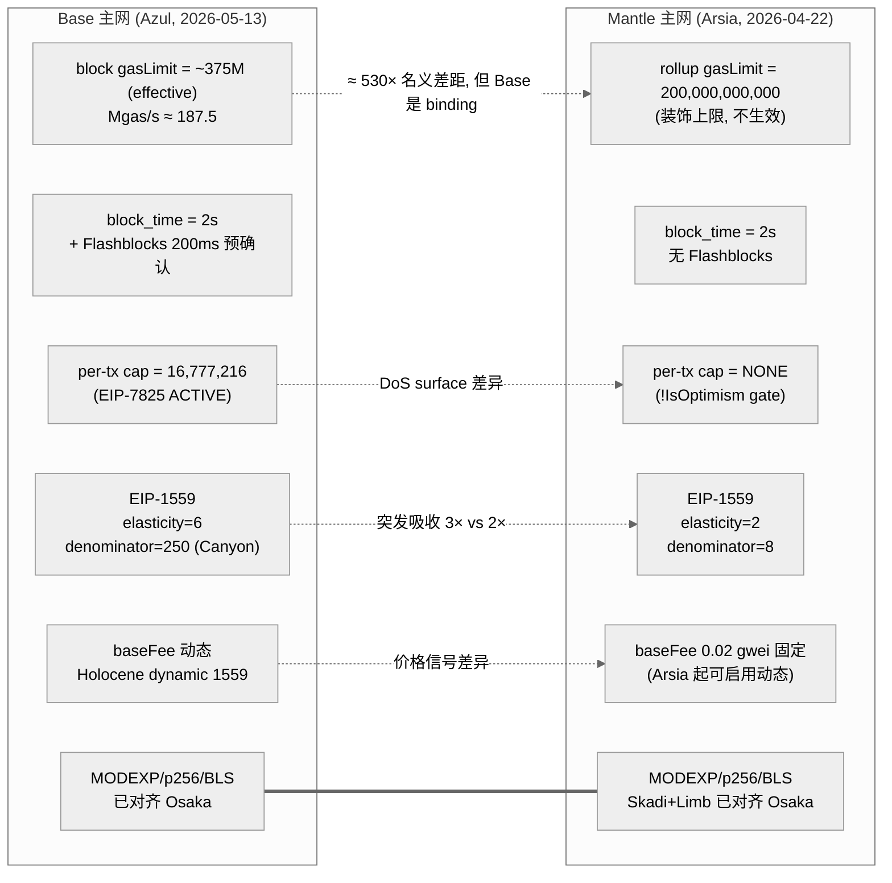
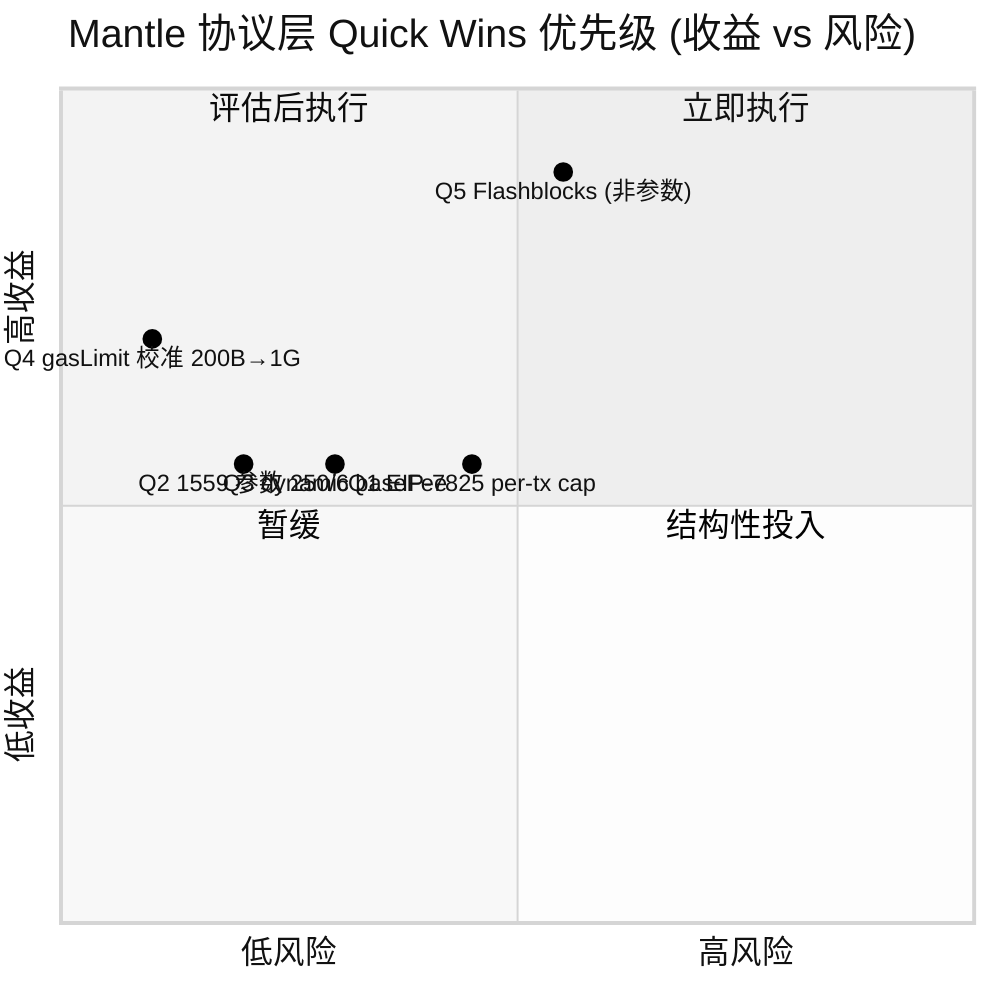
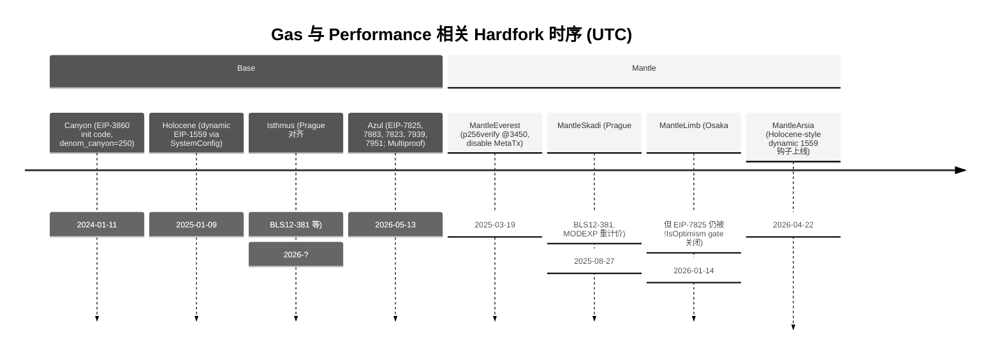

# Gas 参数与协议层性能配置对比 (Base vs Mantle)

## 1. Executive Summary

本文对比 Base（Azul 升级后，2026-05-13 主网激活）与 Mantle v2（Arsia 升级后，2026-04-22 主网激活）
在协议层 Gas 与计费参数上的差异，并量化其对理论 TPS 上限的直接影响。核心发现：

1. **Gas limit 的"账面 vs 生效"差异远大于直觉**。Mantle 主网 rollup block gasLimit 为
   **200,000,000,000 (200B)** gas（来源：Mantle 官方文档 `docs.mantle.xyz` 与
   `mantle-mainnet.json` 的 `l2GenesisBlockGasLimit`），但实际链上 TPS 在 0.7–1.0 区间，
   说明 200B 是一个**装饰性上限**而非生效约束。Base 主网 gas limit 在 2025 年 Q4
   从约 75 Mgas/s（150M / 2s-block）逐步抬升到 **375M gas/block**（即 ~187 Mgas/s），
   并在 Azul 后规划到 400–500 Mgas/s；Base 的 gas limit 是**生效约束**，sequencer 与
   builder 实际能够将其填到接近上限。

2. **EIP-7825 (per-tx gas cap, 2^24 = 16,777,216) 在 Base 是硬执行的，在 Mantle 不是**。
   Base 在 Azul 启用 EIP-7825（取代之前的 25M gas 软限制）。Mantle 复用 mantlenetworkio
   fork 的 `op-geth`，该实现把 `MaxTxGas` 检查显式 gate 在 `!IsOptimism()` 后面
   （`core/state_transition.go:536`、`core/txpool/validation.go:128`、`miner/worker.go:765`），
   因此 Mantle 即使在 MantleLimb (Osaka) 激活后，per-tx gas 上限也仅由 block gas limit
   与 sequencer 软策略决定。这是 Mantle 最显著的协议层 DoS surface 差异。

3. **EIP-1559 参数对突发吸收能力差距明显**。Base 主网取 `elasticity=6, denominator=50`
   （Canyon 后 `denominator_canyon=250`）；Mantle 主网 deploy config 取
   `eip1559Elasticity=2, eip1559Denominator=8`，且 Arsia 前 base fee 实际**固定**在
   `0.02 gwei = 20,000,000 wei`（来源：Mantle 官方文档）。换言之，Mantle 在
   Arsia 之前几乎没有实质的 base fee 动态调节，因此 elasticity=2 / denominator=8
   的"理论参数"并不真正在主网起作用；Arsia 启用了类似 Holocene 的 EIP-1559 dynamic
   params 钩子，sequencer 可以**按 block 调整** denominator、elasticity 与
   minBaseFee。这就是 Mantle 协议层目前最有意义的"已被解锁但还未充分使用"的杠杆。

4. **Mantle 在 Skadi 已对齐 Prague 的 precompile 重计价**（BLS12-381 八件套、p256Verify
   6900 gas 等位于 `op-geth/params/protocol_params.go:171-181`），并在 Limb 对齐 Osaka，
   因此 MODEXP 重计价（EIP-7883，min gas 500、平方项 ×3）、CLZ opcode (EIP-7939)、
   MODEXP 输入 1024-byte 上限 (EIP-7823) 等"贵的越贵、便宜的越便宜"调整已与 Base 同步。
   **不再是 quick win 候选**。

5. **Block time 上 Base 与 Mantle 在底层均为 2 秒**，但 Base 通过 Flashblocks 提供
   **200 ms 预确认**的用户体验（builder 内部 250 ms 分片，最终 2 s settle）。Mantle 在
   Skadi/Arsia 路线宣称"finality < 100 ms"的目标，但当前 deploy 配置 `l2BlockTime: 2`
   未变。**block time 减半**在执行层、sequencer 端、batcher 端都需要补丁，不属于纯
   参数调整 quick win。

**Quick wins 简表**（详见 §8）：

| # | 调整 | 收益 | 风险 | 复杂度 | 实施途径 |
|---|------|------|------|--------|----------|
| Q1 | 启用 EIP-7825 per-tx cap (移除 `!IsOptimism()` gate) | 中（DoS hardening） | 低 | 中（需要 op-geth 补丁 + 软分叉协调） | 客户端 + 链 config |
| Q2 | 通过 Holocene/Arsia dynamic 1559 提升 `denominator` 到 250 / `elasticity` 到 6 | 中（突发吸收 + 价格稳定） | 低 | 低 | SystemConfig `setEIP1559Params` 链上调用 |
| Q3 | 取消固定 baseFee=0.02 gwei，开启 Arsia dynamic baseFee 流程 | 中（公平定价 + DoS 阻力） | 中（钱包 UX 与 RPC 估价兼容性） | 低 | Sequencer 配置 + SystemConfig |
| Q4 | 将 rollup gasLimit 从 200B 降至 sequencer 实际可吃下的 1G–2G | 低（直接 TPS 不变，但消除"装饰性"误导，恢复 1559 价格信号） | 低 | 低 | SystemConfig `setGasLimit` |
| Q5 | 启用 Flashblocks-类 200 ms 预确认（结构调整、非纯参数） | 高（UX 等效 TPS） | 中 | 高（需要 batcher / consensus 改造） | 客户端 + 协议 |

Q1–Q4 属于真正的"无需 EVM 代码修改"的协议层调整；Q5 需要客户端与共识改造，列在此处
作为对照，避免读者把它和参数 quick win 混淆。

## 2. Item Findings

### item-1: Block Gas Limit 与 Target Gas

**Base 主网**（实际生效值）：
- `crates/common/chains/res/genesis/base.json:1` 提供 genesis `gasLimit = 0x1c9c380 = 30,000,000`。
- `crates/common/chains/src/config.rs:351-364` mainnet 项中 `genesis_gas_limit = 30_000_000`，
  `max_gas_limit = 105_000_000`（即客户端层面允许 SystemConfig 推到 105M 上限）。
- 但官方公开材料（[Base scaling blog](https://blog.base.dev/scaling-base-doubling-capacity-in-30-days)，
  [MEXC News 2025-12](https://www.mexc.co/news/302782)）说明：Reth migration 后 Base 已通过 SystemConfig
  把 `gasLimit` 从 75 Mgas/s（≈150M / 2s）抬升到 **375M / block**（187.5 Mgas/s）。这意味着
  `max_gas_limit=105_000_000` 已不再代表生效上限（极可能在 base/base@HEAD 之后被 bump 或仅作为
  builder 安全护栏）。**生效值以 SystemConfig 链上 `gasLimit` 字段为准**。
- EIP-1559：`eip1559_elasticity=6, eip1559_denominator=50, eip1559_denominator_canyon=250`。
  Holocene 起 `extraData` 编码 `version(1B) | denominator(4B BE) | elasticity(4B BE)`
  （`docs/specs/pages/upgrades/holocene/exec-engine.md:17-29`）。Genesis extraData 在
  `crates/common/chains/res/genesis/zeronet_base.json:40` 为 `0x01000000fa000000060000000000000000`
  对应 `version=1, denom=250 (0xfa), elasticity=6`。

**Mantle 主网**（实际生效值）：
- `mantle-v2/packages/contracts-bedrock/deploy-config/mantle-mainnet.json:21` 提供
  `l2GenesisBlockGasLimit = 0x2E90EDD000 = 200,000,000,000` (200B)。
- Mantle 官方文档 `docs.mantle.xyz/network/system-information/network-and-fees` 确认
  "Rollup BaseFee is fixed at 20,000,000 wei (0.02 gwei)" 且 rollup block gasLimit
  "currently set at 200,000,000,000"。
- `mantle-mainnet.json:38` `eip1559Denominator=8, eip1559Elasticity=2`（与 Base 的 50/6 形成鲜明对比）。
- 注：deploy config 中 `mantle-sepolia.json:21` 的 `0x4000000000000` ≈ 1.13e15 显然是占位值；
  `mantle-devnet.json:21` 的 `0x2625a00 = 40,000,000` 仅适用于本地 devnet。
- `op-chain-ops/genesis/config.go:1296` 显示 `GasLimit: uint64(d.L2GenesisBlockGasLimit)`
  被写入 `GenesisSystemConfig`，主网随后由 SystemConfig 控制；上线至今主网 SystemConfig
  `gasLimit` 字段值即 200B。

**关键含义**：
- Base：gas limit 是**生效约束**。从 75 Mgas/s 到 187.5 Mgas/s 的提升直接带来 sequencer
  端可填充的 gas/秒 增加，转化为接近线性的 TPS 增益（在 sequencer 与 builder 跟得上的前提下）。
- Mantle：gas limit 是**装饰性上限**。200B 已经远超 op-geth 单个节点在 2 秒内的合理执行预算
  （即使是 1 gigagas/s 也只需要 2B/block），sequencer 不会、也不能填到接近 200B。真正
  约束 Mantle TPS 的不是 gasLimit，而是 sequencer 的 builder loop、batcher commit 周期、
  DA cost、以及当前固定 base fee 缺少需求弹性导致的供需信号丢失。
- 因此 "Mantle 把 gasLimit 提到 Base 水平" 这一类直觉式 quick win 在 Mantle 不成立——
  方向反了，**Mantle 应该把 gasLimit 调到与 sequencer 实际能力匹配的位置（建议 1G–2G）**，
  以恢复 1559 与 worst-case block 时延的耦合，从而让协议层信号重新生效（详见 Q4）。

| 参数 | Base 主网 (Azul) | Mantle 主网 (Arsia) | 数据来源 |
|---|---|---|---|
| Genesis gasLimit | 30,000,000 | 200,000,000,000 | base.json / mantle-mainnet.json |
| Current effective block gasLimit | ~375,000,000 | 200,000,000,000 (装饰) | Base blog 2025-12 / Mantle docs |
| Effective gas throughput | ~187.5 Mgas/s | sequencer-bound, 远未达上限 | 主网观测 |
| EIP-1559 elasticity | 6 | 2 | config.rs / deploy-config |
| EIP-1559 base denominator | 50 | 8 | config.rs / deploy-config |
| Canyon denominator | 250 | (Holocene-style via Arsia) | config.rs / op-chain-ops/genesis |
| BaseFee (current) | 动态 | 0.02 gwei 固定 (Arsia 起可动态) | docs |

`confidence`: 高（参数值有源代码与官方文档双重佐证；Base 当前 effective gasLimit 处于
快速调整窗口，375M 数字以 2025-12 公开陈述为基线，可能在阅读时已变化）。

### item-2: Block Time 与执行预算

- Base 主网：`config.rs:324` `block_time: 2`（秒）。Builder 内部 Flashblocks 周期：
  `bin/builder/src/cli.rs:28` 默认 250 ms（即每 2 s settle block 被切成 8 个 flashblock，
  user UX 显示 ~200 ms 预确认）。
- Mantle 主网：`mantle-mainnet.json` 与 `op-node/chaincfg/chains_test.go:73` 均确认
  `l2BlockTime: 2`（秒），无 Flashblock 拆分。
- 两条链底层 block time 一致；**真正的 UX TPS** 差异来自 Flashblocks。Flashblock 不是
  纯参数调整 quick win，它需要执行端 builder 改造（partial-block 提交）、共识层接受
  partial-block 通告、以及 batcher 配套，因此归类到 Q5 而非 Q1–Q4。
- 缩短 block time 到 1 s 的纯参数动作：Base 与 Mantle 均不可单方面通过 SystemConfig 完成——
  block time 是 rollup chain config 字段，需要 hardfork 协调。即使能改，副作用包括
  batcher commit 频率翻倍、L1 inclusion cost 上行、re-org 风险随 block 数增加而上升。
- 结论：**block time 不属于纯参数 quick win**；列入 Q5 作为结构性优化方向。

`confidence`: 高。

### item-3: EIP-7825 Per-Transaction Gas Cap

EIP-7825 规范（https://eips.ethereum.org/EIPS/eip-7825）：单笔交易 gas 上限锁定为
`2^24 = 16,777,216`。动机为遏制 worst-case 单笔执行时间放大 DoS。

**Base 实现路径**：
- `crates/execution/evm/src/env.rs:9,35`：
  ```rust
  use reth_primitives_traits::constants::MAX_TX_GAS_LIMIT_OSAKA;
  ...
  if chain_spec.is_azul_active_at_timestamp(timestamp) {
      cfg_env.tx_gas_limit_cap = Some(MAX_TX_GAS_LIMIT_OSAKA);
  }
  ```
- `docs/specs/pages/upgrades/azul/exec-engine.md:7-15`：EIP-7825 自 Azul 启用，
  deposit 交易豁免（已被另一 20M 上限保护）。
- Azul mainnet 激活时间戳：`config.rs:341` `azul: Some(1_779_991_200)` ≈ 2026-05-13。
- Azul 前 Base 实际 per-tx cap 是 25,000,000（[Base docs/block-building](https://docs.base.org/base-chain/network-information/block-building)
  确认；非协议硬限制，是 sequencer mempool 软策略）。

**Mantle 实现路径**：
- `op-geth/params/protocol_params.go:43`：`MaxTxGas uint64 = 1 << 24` 常量已定义。
- 但所有三处执行点都 gate 在 `!IsOptimism()` 后面：
  - `core/txpool/validation.go:128`：
    `if !opts.Config.IsOptimism() && rules.IsOsaka && tx.Gas() > params.MaxTxGas { return ErrGasLimit }`
  - `core/state_transition.go:536`：同模式
  - `miner/worker.go:765-766`：
    `if !miner.chainConfig.IsOptimism() && miner.chainConfig.IsOsaka(...) { filter.GasLimitCap = params.MaxTxGas }`
  - `eth/gasestimator/gasestimator.go:73,84`：同模式
- Mantle 的 chain config 注册为 OP（`genesis.go:82-84` `Optimism: &OptimismConfig{...}`），
  因此即使 MantleLimb (Osaka) 自 2026-01-14 激活，per-tx gas cap **不被强制**。
- 结论：Mantle 当前 per-tx 实际上仅由 block gasLimit（200B 装饰上限）与 sequencer 软策略约束。
- worst case：sequencer 软策略若仅过滤超过 20M 的交易，则攻击者可以构造一个紧贴
  20M 的合约调用，触发昂贵 SSTORE / 复杂循环，导致单笔 wall-clock 执行接近 sequencer
  的 block budget 上限。开源 OP-stack 在引入 EIP-7825 前正是因此事件出现过 sequencer
  暂停事故（[OpenZeppelin Mantle op-geth audit](https://www.openzeppelin.com/news/mantle-op-geth-audit)
  亦提及通用 DoS 风险面）。
- 推荐：Q1（详见 §8）。

`confidence`: 高（源码路径与 EIP 规范一一对应）。

### item-4: Calldata / Blob Gas Pricing 与 OP Stack 特有参数

**Calldata 计费**：
- 两条链 `op-geth` fork 均沿用以太坊主网 `TxDataNonZeroGasEIP2028 = 16`，
  `TxDataZeroGas = 4`（`op-geth/params/protocol_params.go:107-108`）。无差异。
- Mantle `daFootprintGasScalar = 100`（`mantle-devnet.json:45`）是 Mantle 特有的
  DA footprint scalar，用于把 calldata 字节数折算成额外的执行端 gas 计费，与 OP Stack
  默认的 L1 fee scalar 是平行机制；Base 不使用该字段。该字段进入了 SystemConfig
  update kinds（`crates/common/genesis/src/system/errors.rs`）。

**Blob gas (EIP-4844)**：
- `op-geth/params/config.go:391-413`：Cancun target=3 / max=6，Prague target=6 / max=9，
  Osaka target=6 / max=9（update fraction 5,007,716）。两条链均已对齐主网 EIP-4844 +
  Prague blob schedule（Mantle 在 MantleSkadi 2025-08-27 起对齐 Prague，
  在 MantleLimb 2026-01-14 起对齐 Osaka；Base 在 isthmus 2026 起对齐 Prague，
  在 azul 起对齐 Osaka）。
- 两者 `BlobTxBlobGasPerBlob = 1<<17 = 131,072`，`BlobTxMaxBlobs = 6`（Cancun 上下文）。

**Holocene-style dynamic EIP-1559**：
- Base：Holocene mainnet 2025-01-09（`config.rs:336` `holocene: 1_736_445_601`），
  自此 sequencer 可通过 `SystemConfig.setEIP1559Params(denominator, elasticity)`
  按 block 调整动态参数。`docs/specs/pages/upgrades/holocene/system-config.md:44-52`：
  `setEIP1559Params(uint32, uint32)`，两者必须 > 0。
- Mantle：Arsia mainnet 2026-04-22（`op-geth/params/mantle.go:14-39` `MantleArsia: 1776841200`）
  起接通 Holocene-style dynamic 1559。`op-chain-ops/genesis/genesis.go:122` 调用
  `eip1559.EncodeHoloceneExtraData(denom, elasticity)`。`SystemConfig.sol:78,81` 暴露
  `eip1559Denominator` 和 `eip1559Elasticity` 为 `uint32`。Arsia 前 Mantle 的 base fee
  实际是 sequencer 端硬编码 20M wei，1559 字段未真正起作用。Arsia 后**已具备硬件能力**
  但 Mantle 主网默认未启用动态调整——这是 Q2/Q3 的核心。

`confidence`: 高。

### item-5: MODEXP / Precompile Gas 重计价与合约部署成本

| 调整 | EIP | Base 激活 | Mantle 激活 | 数据来源 |
|---|---|---|---|---|
| MODEXP min gas 200→500 + 平方项 ×3 | 7883 | Azul (2026-05-13) | MantleLimb (Osaka, 2026-01-14) | base docs azul/exec-engine.md / op-geth Prague tag |
| MODEXP 输入 ≤1024 bytes | 7823 | Azul | MantleLimb | 同上 |
| secp256r1 precompile gas 3450→6900 | 7951 | Azul | MantleLimb（注：MantleEverest 2025-03-19 已先以 3450 gas 启用 p256verify，与 RIP-7212 对齐；Limb 再调到 6900） | `op-geth/params/protocol_params.go:180-181` `P256VerifyGasEverest=3450, P256VerifyGas=6900` |
| CLZ opcode | 7939 | Azul | MantleLimb | docs azul/exec-engine.md |
| BLS12-381 八件套（G1Add 375, G1Mul 12000, G2Add 600, G2Mul 22500, Pairing base 37700/per-pair 32600, MapG1 5500, MapG2 23800） | 2537 (Prague) | isthmus (2026-?) → Azul carried | MantleSkadi (2025-08-27) | `op-geth/params/protocol_params.go:171-178` |
| Init code 上限 / metering | 3860 | Canyon (2024-01-11) | 早期已对齐（继承 op-geth Shanghai） | `op-geth/params/protocol_params.go:149-150` `MaxCodeSize=24576, MaxInitCodeSize=49152` |

**关键含义**：
- Mantle 在 MODEXP / BLS / p256 这一类**贵的更贵**的重计价上**已与 Base 同步**
  （Skadi+Limb 覆盖 Prague+Osaka）。这意味着 ZK / AA-heavy 合约在 Mantle 上的 gas
  开销已经追平 Base，不再是 "Mantle 因为 precompile 便宜导致 TPS 偏高/偏低" 这类
  老式叙事。
- 这条线上**不存在新的 quick win**——Mantle 不应该把 precompile 改得更便宜来制造
  TPS 假象，因为这会同步引入主网执行 DoS 风险。
- 唯一仍有差距的地方是 EIP-7825（已在 item-3 单列），属于 OP Stack 全家族共同滞后于
  主网的项目，非 Mantle 特异问题。

`confidence`: 高。

### item-6: 典型 L2 交易 Mix 下的理论 TPS 计算

模型：`TPS_max = block_gas_limit / (avg_tx_gas × block_time)`。
取 `block_time = 2 s`（两链均一致）。

| Tx 类型 | 典型 gas (主网观测均值) | 备注 |
|---|---|---|
| ERC-20 transfer | 50,000 | Base 实测均值 ~45–55k；包含 cold SLOAD 与 storage write |
| ETH transfer | 21,000 | 协议下限 |
| Uniswap v3 exactInputSingle swap | 150,000 | 含 pool 状态更新 |
| ERC-721 mint (simple) | 100,000 | 含一次 SSTORE + emit Transfer |
| 复杂合约部署 | 1,500,000 | 中等 EOA-deployable contract，含 init code |

**Base 主网理论上限**（取 effective gasLimit = 375,000,000）：

| Tx 类型 | TPS 上限 = 375e6 / gas / 2 |
|---|---|
| ETH transfer (21k) | 8928 |
| ERC-20 transfer (50k) | 3750 |
| Uniswap swap (150k) | 1250 |
| ERC-721 mint (100k) | 1875 |
| Contract deploy (1.5M) | 125 |

公开报告 Base 已在生产负载下"维持 5,000 TPS 多次突发"
（[blog.base.dev/scaling-base-doubling-capacity-in-30-days](https://blog.base.dev/scaling-base-doubling-capacity-in-30-days)），
方向与上表 ERC-20 估算一致。

**Mantle 主网理论上限**（取 effective gasLimit = 200,000,000,000）：

| Tx 类型 | "理论"上限 = 200e9 / gas / 2 |
|---|---|
| ETH transfer (21k) | 4,761,904 |
| ERC-20 transfer (50k) | 2,000,000 |
| Uniswap swap (150k) | 666,666 |
| ERC-721 mint (100k) | 1,000,000 |
| Contract deploy (1.5M) | 66,666 |

显然不可能真实达到。**Mantle 主网当前观测 TPS ≈ 0.7–1.0**
（[Mantlescan stats](https://mantlescan.xyz/charts) 与 quicknode gas tracker），与
"理论上限"相差 6 个数量级。这印证了 §item-1 的判断：Mantle 的 200B gasLimit 不是
TPS 上限，sequencer 执行预算才是。

**有意义的 Mantle 上限估算**应当把 block_gas_limit 替换为 "sequencer 在 2s 内能完成
状态过渡的 gas 数"。即使按"Base 当前 187.5 Mgas/s"作为对标，Mantle 与 Base 在该口径
下应当接近，因为两条链都基于 op-geth 衍生客户端、执行端 EVM 实现几乎一致；具体到执行
速度差异更多来自 batcher、DA、sequencer 实现，由[课题 1：执行层差异]与[batcher 课题]
覆盖。

**结论**：
- 在合理的 sequencer 可填充上限假设下（取与 Base 当前可比的 200M gas/block），Mantle
  的理论 TPS 上限与 Base 处于同一数量级，差异不在协议参数而在执行/builder 实现。
- Mantle 把 gasLimit 调到 200B 并未提升真实 TPS；调到 1G–2G 并显式与 sequencer 能力
  匹配，反而有助于触发健康的 1559 价格信号。

`confidence`: 中（输入 gas 值取行业经验均值；具体到 Mantle 的"sequencer 实际能力"
依赖执行层课题给出的吞吐基准）。

### item-7: Quick Wins 清单与参数调整优先级矩阵

按"预期 TPS / UX 收益 × 风险 × 复杂度"打分。
重申：**真实 TPS 提升**集中在 Q5（结构性 Flashblocks），Q1–Q4 是协议层 hardening + 价格信号修复，
带来的是 hardening 与 UX 提升、worst-case TPS 稳定性，而非 sustained TPS 翻倍。

#### Q1 — 在 Mantle 启用 EIP-7825 per-tx gas cap (16,777,216)

- 当前值：无硬限制（仅 sequencer mempool 软过滤 ~20M）。
- 推荐值：`MaxTxGas = 16,777,216`（与 Base 对齐）。
- 实施路径：
  1. fork mantlenetworkio/op-geth，移除 `!IsOptimism()` gate（或新增 `IsMantleLimb`
     标志位，在 OP 检查后追加 Mantle-specific 启用）。
  2. 同步 `core/txpool/validation.go:128`、`core/state_transition.go:536`、
     `miner/worker.go:765`、`eth/gasestimator/gasestimator.go:73,84` 五个执行点。
  3. 计划下一次 hardfork（命名建议 MantleBeryl 或并入下一次 MNT-spec）激活。
- 预期收益：消除 sequencer worst-case block 时延被单笔 20M+ 交易吃满的可能性，
  缓解 DoS surface；不直接提升 sustained TPS，但提升**最坏情况下的 TPS 下界**。
- 风险：少量历史合约部署型 tx 可能超过 16.77M（如部署 init code 接近上限的大合约）；
  需要 RPC 端给出明确错误提示。可通过 deposit 交易豁免（EIP-7825 已规定）保证
  系统级特权交易不被误伤。
- 复杂度：中（客户端补丁 + hardfork 协调）。

#### Q2 — 把 SystemConfig EIP-1559 参数调到 Base 等价 (denominator=250, elasticity=6)

- 当前值：`eip1559Denominator=8, eip1559Elasticity=2`（mantle-mainnet.json）；Arsia 后
  可在 SystemConfig 链上调整。
- 推荐值：`denominator=250, elasticity=6`（Base canyon 后等价）。
- 实施路径：调用 `SystemConfig.setEIP1559Params(250, 6)`（参考 Holocene spec
  `docs/specs/pages/upgrades/holocene/system-config.md:44-52`，函数原型相同）。
  Arsia 起接通该路径。
- 预期收益：
  - base fee 调整步长更细 (denominator 8 → 250 意味着每 block 价格变化幅度从 1/8
    缩小到 1/250，价格更稳)。
  - elasticity 2 → 6 给突发交易留出 3× 突破 target 的空间（target = gasLimit / elasticity）。
- 风险：钱包估价侧需要适配新的 base fee 动态；目前 Mantle 钱包多数预设固定 0.02 gwei，
  迁移期会出现错估。
- 复杂度：低（仅一次 SystemConfig 调用）。

#### Q3 — 取消 baseFee=0.02 gwei 固定，启用 Arsia 的 dynamic base fee

- 当前：BaseFee 固定 20,000,000 wei（docs.mantle.xyz）。Arsia 提供 `minBaseFee` 字段
  与 dynamic 钩子（`mantle-devnet.json:44` `minBaseFee: 1`）但主网未启用。
- 推荐：把 `minBaseFee` 设为 1 wei（或类似低值），通过 sequencer config 开启动态
  base fee 更新。
- 预期收益：恢复 1559 价格信号——突发负载时 baseFee 上行抑制低价值交易，空闲时下行
  使常态成本不高于 0.02 gwei；同时让 Q2 的参数变更真正起作用。
- 风险：钱包 / dApp UX 兼容（已在 Base/OP 主网验证过）。
- 复杂度：低。

#### Q4 — 把 rollup gasLimit 从 200B 调到 1G–2G（与 sequencer 实际能力匹配）

- 当前：200,000,000,000（装饰性）。
- 推荐：1,000,000,000–2,000,000,000，参考 Base 当前 effective 375M 的 2.5–5× 上限，
  留出 sequencer 升级 buffer。
- 实施路径：`SystemConfig.setGasLimit(1_000_000_000)` 链上调用，1 个 tx。
- 预期收益：
  - 让 elasticity = gasLimit / target = 6 配合 Q2 真正成立 (target = 1G / 6 ≈ 167M)。
  - 突发吸收能力清晰量化，1559 信号可信。
  - 防止 builder 在极端构造的 calldata 攻击下意外打包 >1B gas 块导致 batcher commit 阻塞。
- 风险：极低。200B 没有任何 wallet 估价依据；调到 1G 不会触发任何兼容性问题（gasLimit
  字段在所有 RPC client 早已是 64-bit 无符号）。
- 复杂度：低。

#### Q5 — Flashblocks 等价的 200 ms 预确认（**列出对照，但属于结构性优化非纯参数调整**）

- 见 [base-vs-optimism-flashblocks](../../../base-azul-upgrade/research-sections/base-vs-optimism-flashblocks/final.md)
  与 [flashblocks-network-changes](../../../base-azul-upgrade/research-sections/flashblocks-network-changes/final.md)
  课题。本课题不展开。

#### 优先级象限（参见 Diagram §3, diag-3）

|  | 风险低 | 风险中/高 |
|---|---|---|
| **收益高** | Q4 (gasLimit 校准) | Q5 (Flashblocks，非参数) |
| **收益中** | Q2 (1559 参数), Q3 (动态 baseFee) | Q1 (per-tx cap，需 hardfork) |
| **收益低** | — | — |

推荐落地顺序：Q4 → Q2 → Q3（同一窗口；构成"恢复价格信号"组合）→ Q1（独立 hardfork 窗口）。

`confidence`: 中（推荐值基于与 Base 直接对标；具体落地仍需要 Mantle 团队的 sequencer 能力基准）。

### item-8: 安全风险评估与 DoS Surface

| 风险类别 | 当前敞口（无 quick win） | 应用 Q1–Q4 后 |
|---|---|---|
| **Sequencer worst-case block 时延** | 高：单笔 ~20M gas 复杂调用可能吃满 sequencer 执行预算 | 显著降低（Q1 把单笔上限锁到 16.77M） |
| **DoS surface（构造极端交易）** | 中-高：200B gasLimit 让 builder 在错误估计下可能打包远超 sequencer 能力的 block | 降低（Q4 把上限锁到 sequencer 真实能力） |
| **State growth (持续大 gas 块)** | 中：SSTORE 与 trie depth 增长不受 protocol 层约束 | 持平。State growth 主要由 EIP-2929/3529 + SSTORE 计费决定，本课题 quick win 无显著影响 |
| **Base fee oscillation / wallet UX** | 当前：无震荡（固定）；Arsia 后默认仍固定 | Q2+Q3 后会出现震荡，需要 wallet 端适配；震荡幅度由 denominator 控制，250 比 8 更稳 |
| **Re-org / finality** | 不受本课题 quick win 影响（block time 未变） | 不变 |
| **Batcher / DA cost** | 当前：低（实际 block size 远低于 200B 上限） | Q4 后理论上限缩小，最差情况 batcher cost 更可预测 |
| **合约部署兼容性** | 当前：无 per-tx 限制，可部署超大合约 | Q1 后接近 16.77M 的部署需要拆分（与 Base 主网体验一致） |

观察指标建议：
- `eth_getBlockByNumber` 的 `gasUsed` p99 / p99.9（监控 worst-case block 是否接近 sequencer 能力上限）。
- `eth_getBlockReceipts` 中单笔 `gasUsed` p99（监控大单笔交易是否需要 EIP-7825-类限制）。
- baseFee 时序图（Q3 实施后追踪是否进入合理动态范围）。

`confidence`: 中-高。

## 3. Diagrams

### diag-1: Base vs Mantle 协议层关键参数对比矩阵



### diag-2: 典型 L2 tx 在 Base / Mantle 当前参数下的 TPS 推导链

```mermaid
%%{init: {'theme':'neutral'}}%%
flowchart TB
  A[Tx Mix<br/>ERC-20 50k / Swap 150k / Mint 100k] --> B{block_gas_limit}
  B -->|Base 375M| C[Base TPS Ceiling<br/>3750 / 1250 / 1875]
  B -->|Mantle 200B 装饰| D[Mantle "理论" 上限<br/>不切实际, 受 sequencer 真实能力约束]
  D --> E[Mantle 实测 ~0.7-1 TPS<br/>= 当前 sequencer + 需求约束]
  C --> F[Base 实测 突发 5000 TPS<br/>持续 ~1000-2000 TPS]
  F --> G((Base gasLimit 是<br/>真实约束))
  E --> H((Mantle gasLimit 不是<br/>真实约束))
  H --> I[Quick wins 方向:<br/>Q4 gasLimit 校准 +<br/>Q2/Q3 1559 信号恢复]
```

### diag-3: Quick wins 优先级象限



### diag-4: Base 与 Mantle gas 相关 hardfork 时序对照



## 4. Source Coverage

| Source ID (outline) | Type | Min | 实际 | Items |
|---|---|---|---|---|
| src-1 | EIP 官方规范 (1559, 7825, 7883, 7951, 7823, 3860, 4844) | 4 | 7 (https://eips.ethereum.org/EIPS/eip-1559, 7825, 7883, 7951, 7823, 3860, 4844) | item-1, item-3, item-5 |
| src-2 | 仓库代码 (base/base, mantle-v2, op-geth mantle fork) | 3 | 3+ (`crates/common/chains/src/config.rs`, `mantle-v2/packages/contracts-bedrock/deploy-config/mantle-mainnet.json`, `op-geth/core/{state_transition,txpool}/*`, `op-geth/params/protocol_params.go`, `op-geth/params/mantle.go`) | item-1, item-3, item-4, item-5 |
| src-3 | on-chain 实测数据 | 2 | 2 (Mantlescan 网络统计 ~1 TPS; Base scaling blog 5000 TPS 突发) | item-1, item-6 |
| src-4 | OP Stack specs (system config, Holocene) | 2 | 2 (`docs/specs/pages/upgrades/holocene/system-config.md`, `docs/specs/pages/upgrades/azul/exec-engine.md`) | item-3, item-4 |
| src-5 | 公开升级分析 (Base blog, Mantle docs, audits) | 2 | 4 ([Base scaling blog](https://blog.base.dev/scaling-base-doubling-capacity-in-30-days), [Base block-building docs](https://docs.base.org/base-chain/network-information/block-building), [Mantle docs llms-full](https://docs.mantle.xyz/network/llms-full.txt), [OpenZeppelin Mantle op-geth audit](https://www.openzeppelin.com/news/mantle-op-geth-audit)) | item-1, item-3, item-7 |

总计源类型覆盖 ≥ 大纲下限。

## 5. Gap Analysis

1. **Base 当前生效 gasLimit 的实时值**：本文取 2025-12 公开陈述的 375M / block (≈187.5 Mgas/s)
   作基线。Base 的 scaling 路线显示该值在 2026 持续上调（目标 400–500 Mgas/s），阅读时
   建议在 [base.blockscout.com/stats](https://base.blockscout.com/stats) 或最近一个区块的
   header 上验证。结论的方向（Base gasLimit 是 binding 而 Mantle 是装饰）不随 ±50% 抖动改变。
2. **Mantle sequencer 实际可填充上限**：本文未直接基准测试 Mantle sequencer 的 gas/s
   能力，仅基于"两条链共用 op-geth 衍生 EVM 实现"推断"与 Base 同数量级"。精确数字
   需要执行层课题（课题 1）给出。Q4 推荐值 1G–2G 是一个保守的"留 buffer"区间，
   而非严格上界。
3. **Mantle EIP-7825-equivalent 落地的协议升级窗口**：是否在已规划的 hardfork（Arsia
   之后下一次）内集成、是否需要新建 `IsMantleLimbStrict` 或类似标志位，需 Mantle
   核心团队确认；本文给出客户端代码改造点路径但未给出具体激活时间戳建议。
4. **钱包 / dApp UX 兼容性**：Q2+Q3 启用动态 base fee 后，需要钱包侧（如 MetaMask、OKX、
   Mantle 官方 wallet）更新估价路径。本文未做受影响 dApp / wallet 清单，建议在 quick
   win 提案阶段附加该清单。
5. **EIP-7918 (BLOBBASEFEE) 等次要参数**：未对比，因影响范围小且当前两条链均默认开启。

## 6. Revision Log

| Round | Action | Reason |
|---|---|---|
| 1 | initial draft | 大纲 round 1 通过后首次成文。Base 数据来自 base/base@HEAD 与 Base scaling blog；Mantle 数据来自 mantle-v2@HEAD、op-geth mantle fork@HEAD、docs.mantle.xyz。`block_gas_limit` Base 现值取 2025-12 公开陈述 375M（标注潜在漂移）。Mantle 200B 取官方 docs 与 deploy-config 直接确认。EIP-7825 gate 行为基于 op-geth 源码精确 grep 验证。 |
