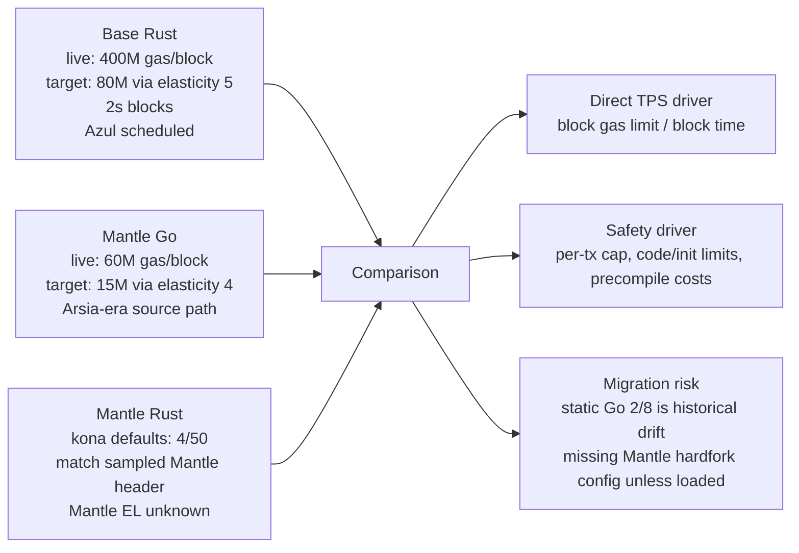
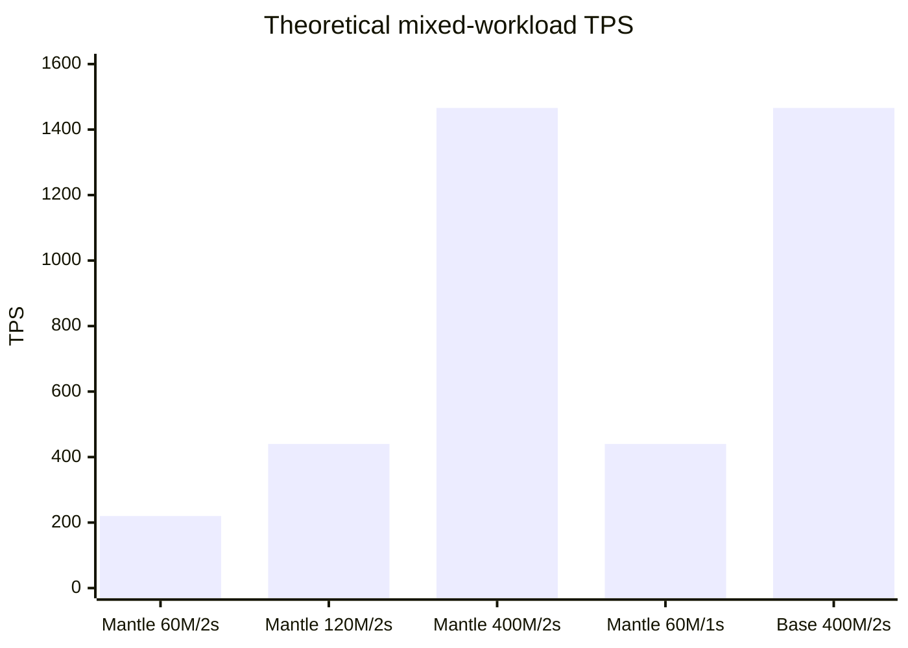
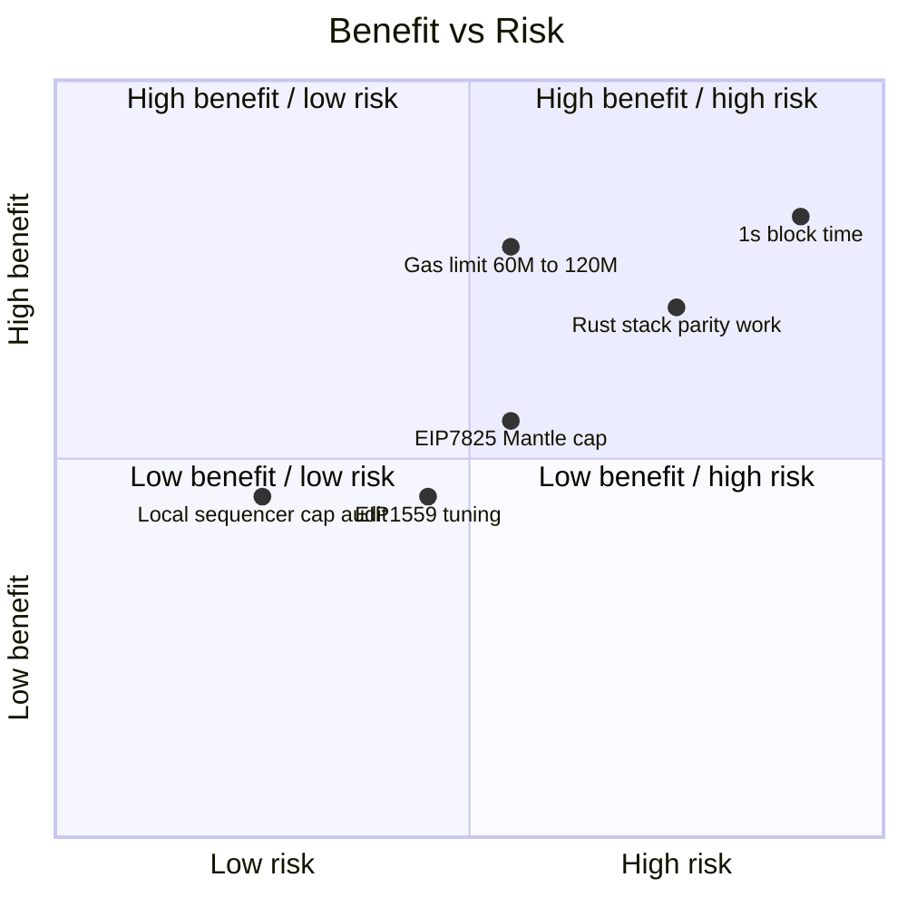
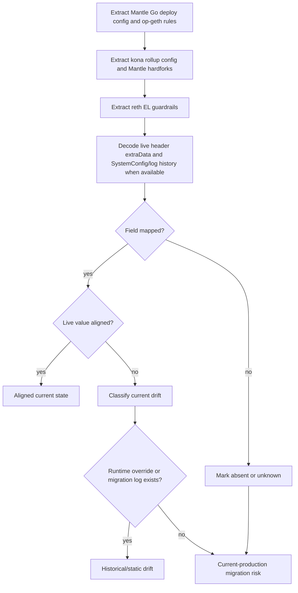

# Gas Protocol Performance Configuration

## 1. Executive Summary

This draft compares the protocol-layer gas and performance configuration for three surfaces:

- Base Rust stack: `base/base`
- Mantle Go production stack: `mantlenetworkio/mantle-v2` plus `mantlenetworkio/op-geth`
- Mantle Rust direction: `mantle-xyz/kona` plus `mantle-xyz/reth`

The strongest current finding is simple: live block gas limit and block time alone give Base a much higher theoretical gas-throughput ceiling than Mantle at the sampled time. Base sampled at `gasLimit=400,000,000`, 2 second blocks, `baseFeePerGas=5,000,000 wei`, and EIP-1559/min-base-fee `extraData=0x01000000640000000500000000004c4b40`, which decodes to denominator `100`, elasticity `5`, and minBaseFee `5,000,000`. Mantle sampled at `gasLimit=60,000,000`, 2 second blocks, `baseFeePerGas=50,000,000,000 wei`, and `extraData=0x0100000032000000040000000ba43b7400`, which decodes to denominator `50`, elasticity `4`, and minBaseFee `50,000,000,000`. The current-effective metadata is:

| Chain | Current-effective claim | activation_status | measurement_window | source_date |
|---|---:|---|---|---|
| Base | 400,000,000 gas/block, 2s spacing, base fee/minBaseFee 5,000,000 wei, denominator 100, elasticity 5 | active | RPC blocks 46,330,713-46,330,717 from `https://mainnet.base.org`; decoded sampled header `extraData` at block 46,330,717 | block 46,330,717 at 2026-05-22T11:53:01Z |
| Mantle | 60,000,000 gas/block, 2s spacing, base fee/minBaseFee 50,000,000,000 wei, denominator 50, elasticity 4 | active | RPC blocks 95,660,231-95,660,235 from `https://rpc.mantle.xyz`; decoded sampled header `extraData` at block 95,660,235 | block 95,660,235 at 2026-05-22T11:53:02Z |

Using only this current-effective gas limit and block-time data, Base has `400M / 60M = 6.67x` Mantle's gas-per-block budget. With 21,000 gas transfers, the theoretical ceiling is about 9,524 TPS on Base versus 1,429 TPS on Mantle. With the modeled mixed workload in this draft, the ceiling is about 1,466 TPS on Base versus 220 TPS on Mantle. These are theoretical ceilings, not observed throughput. Execution headroom, state growth, DA/batcher throughput, propagation, pricing, and proof costs remain hard constraints.

The second strongest finding is that static repository config and live chain state differ materially. Base `base/base` mainnet config still carries `genesis_gas_limit=30,000,000` and `max_gas_limit=105,000,000`, while live RPC blocks report 400,000,000 gas. Mantle `mantle-mainnet.json` carries `l2GenesisBlockGasLimit=0x2E90EDD000` (200,000,000,000), while live RPC blocks report 60,000,000 gas. The same rule applies to EIP-1559 parameters: Base static elasticity `6` and Mantle deploy-config elasticity `2` are not the current target-gas inputs in the sampled headers. Current target gas is Base `400,000,000 / 5 = 80,000,000` and Mantle `60,000,000 / 4 = 15,000,000`. Therefore, current-effective gas-limit and fee-market claims must use live chain data, decoded header `extraData`, decoded `SystemConfig`, or proven log/storage history, not genesis files alone.

The third strongest finding is about safety guardrails. Base's Rust code schedules the Azul/Osaka per-transaction gas cap path through `cfg_env.tx_gas_limit_cap = Some(MAX_TX_GAS_LIMIT_OSAKA)` when Azul is active. But at the sampled Base block timestamp `1779450781`, Azul timestamp `1779991200` is still in the future, so the protocol-level 16,777,216 gas cap is scheduled, not active, in this sample. Base official docs separately state an operational 25,000,000 gas per-transaction mempool maximum. Mantle Go `op-geth` defines `MaxTxGas = 1 << 24`, but txpool, state transition, and miner filters gate the EIP-7825 check behind `!IsOptimism()`, so the checked Mantle Go code path does not enforce that cap for OP/Mantle chains. Mantle Rust EL behavior cannot be inferred from kona; generic `reth` enforces Osaka caps for Ethereum/Optimism code paths, but this checkout does not identify a Mantle-specific reth chain spec integration. Mantle Rust EL cap behavior is therefore `unknown/out-of-scope` until the Mantle reth integration surface is located.

The main quick win is a staged Mantle gas-limit increase if operator benchmarks confirm headroom. At the live sampled value of 60M gas/block, moving to 120M would double the theoretical TPS ceiling; moving to 400M would match Base's sampled gas budget. In current `mantle-v2` source, `SystemConfig.setGasLimit` is owner-only and bounded by `MAX_GAS_LIMIT = 500,000,000`, so this is plausibly a `live_systemconfig_governance` change, but only after confirming the deployed SystemConfig implementation, owner path, sequencer local caps, DA/batcher capacity, and proof/execution latency.

No-code quick wins and upgrade recommendations are separated in item-7 by `change_class`. EIP-7825-like per-tx enforcement for Mantle, kona/reth Mantle-spec alignment, and block-time changes are not no-code quick wins; they are `hardfork_client_upgrade` or migration tasks.

## 2. Item Findings

### item-1: Three-Stack Chain Spec Baseline

| Field | Base Rust stack | Mantle Go production stack | Mantle Rust stack |
|---|---|---|---|
| Chain ID | `8453` in `base/base/crates/common/chains/src/config.rs` | `5000` in `mantle-v2/packages/contracts-bedrock/deploy-config/mantle-mainnet.json` and `op-geth/params/mantle.go` | `5000` support appears through kona constants and Mantle parameter branches |
| L2 block time | 2 seconds in `base/base/crates/common/chains/src/config.rs` | 2 seconds in `mantle-mainnet.json` | RollupConfig carries `block_time`; chain config conversion copies source config |
| Genesis gas limit | 30,000,000 in Base config/genesis | 200,000,000,000 in `mantle-mainnet.json` | Kona default genesis test data commonly uses 30,000,000; production Mantle value depends on loaded config |
| Live sampled gas limit | 400,000,000 | 60,000,000 | Not a live chain; unknown |
| EIP-1559 config | static defaults 6/50/250, plus SystemConfig updates; live header decodes denominator 100, elasticity 5, minBaseFee 5,000,000 | deploy config 2/8 is historical/static; live header decodes denominator 50, elasticity 4, minBaseFee 50,000,000,000; docs/code show Arsia fee-model transition | kona defaults for Mantle are 4/50/50 unless overridden, matching the sampled Mantle live header for denominator/elasticity |
| Hardfork schedule | Canyon, Delta, Ecotone, Fjord, Granite, Holocene, Isthmus, Jovian active in sampled window; Azul scheduled for 2026-05-28T18:00:00Z | op-geth Mantle mainnet hardfork timestamps include Skadi, Limb, Arsia; sample timestamp is after Arsia | kona has Mantle hardfork config and upgrade transactions, but chain-config conversion defaults `mantle_hardforks` empty unless explicit config is loaded |
| Execution-client guardrails | Base Rust EVM builder sets `tx_gas_limit_cap` when Azul active | Mantle Go op-geth has generic constants but EIP-7825 checks are disabled for `IsOptimism()` | Generic reth supports Osaka caps; Mantle-specific EL behavior is unknown in this checkout |

Current-effective metadata:

- Base live gas, base-fee, denominator, elasticity, and minBaseFee values: `activation_status=active`, `measurement_window=blocks 46,330,713-46,330,717; decoded header extraData from block 46,330,717`, `source_date=2026-05-22T11:53:01Z`.
- Mantle live gas, base-fee, denominator, elasticity, and minBaseFee values: `activation_status=active`, `measurement_window=blocks 95,660,231-95,660,235; decoded header extraData from block 95,660,235`, `source_date=2026-05-22T11:53:02Z`.
- Base Azul/EIP-7825: `activation_status=scheduled`, `measurement_window=Base sample block 46,330,717 plus base/base commit fc58ee8`, `source_date=sample timestamp 2026-05-22T11:53:01Z; configured activation timestamp 1779991200 (2026-05-28T18:00:00Z)`.
- Mantle Rust EL current-effective claims: `activation_status=unknown`, `measurement_window=reth commit a8423b8 and kona commit 72a20ab`, `source_date=repo commit SHAs`; no live Mantle Rust chain was sampled.

Key evidence:

- Base config: `base/base/crates/common/chains/src/config.rs` lines 322-367.
- Base live sample: JSON-RPC `eth_getBlockByNumber` for blocks 46,330,713-46,330,717.
- Mantle deploy config: `mantle-v2/packages/contracts-bedrock/deploy-config/mantle-mainnet.json` lines 1-42.
- Mantle Go hardfork config: `op-geth/params/mantle.go` lines 14-25.
- Kona conversion: `kona/crates/protocol/genesis/src/chain/config.rs` lines 140-183.

### item-2: Gas Limit, Target Gas, and EIP-1559 Parameter Comparison

The performance-relevant gas-limit comparison must separate three layers:

| Layer | Base | Mantle Go | Mantle Rust/kona |
|---|---:|---:|---:|
| Genesis/static value | 30,000,000 | 200,000,000,000 | depends on loaded config; defaults are not production proof |
| Current live block gas limit | 400,000,000 | 60,000,000 | unknown |
| Current decoded EIP-1559/minBaseFee header params | denominator 100, elasticity 5, minBaseFee 5,000,000 | denominator 50, elasticity 4, minBaseFee 50,000,000,000 | unknown |
| Current target gas from decoded elasticity | 80,000,000 (`400,000,000 / 5`) | 15,000,000 (`60,000,000 / 4`) | unknown |
| Current base fee sample | 5,000,000 wei | 50,000,000,000 wei | unknown |
| Governance/runtime update path | `SystemConfig` gas limit and EIP-1559 update logs | `SystemConfig.setGasLimit`, `setEIP1559Params`, `setBaseFee`, `setMinBaseFee` in `mantle-v2` source | `SystemConfig` parsers exist in kona |

Important conflicts:

- Base repository static `max_gas_limit=105,000,000` does not match live 400,000,000 blocks. Treat that static field as a checked source value, not as the current chain cap.
- Base static EIP-1559 elasticity `6` does not match the sampled live header, whose `extraData=0x01000000640000000500000000004c4b40` decodes under `op-geth/consensus/misc/eip1559/eip1559_optimism.go` as version `0x01`, denominator `100`, elasticity `5`, and minBaseFee `5,000,000`. The live target gas is therefore `80,000,000`, not `66,666,667`.
- Mantle Go deploy config `eip1559Elasticity=2` and `eip1559Denominator=8` do not match the sampled live header, whose `extraData=0x0100000032000000040000000ba43b7400` decodes as version `0x01`, denominator `50`, elasticity `4`, and minBaseFee `50,000,000,000`. The live target gas is therefore `15,000,000`, not `30,000,000`.
- Mantle official docs still contain older or contradictory fee statements. Mantle EIP-1559 docs state a fixed Rollup BaseFee of 20,000,000 wei, and Mantle estimate-fee docs state Rollup block gasLimit 200,000,000,000. Live mainnet RPC at the measurement window reports 50 gwei base fee, 60,000,000 gas limit, and a decoded 50/4/minBaseFee header. For current-effective values, live RPC and header decoding win. The docs remain useful as evidence of historical/pre-Arsia and developer-facing assumptions.
- Mantle's post-Arsia handbook says the fee model content is effective after Arsia and currently valid solely on Mantle Sepolia. Therefore, this draft does not claim all post-Arsia handbook semantics are fully active on Mantle mainnet without live or code evidence.

Performance interpretation:

- Gas limit directly sets an upper bound on gas included per block.
- EIP-1559 denominator and elasticity primarily affect fee response and burst absorption. They do not by themselves increase the block gas limit. In the sampled headers, Base's denominator 100 means at most a 1% per-block base-fee adjustment around the 80M target, while Mantle's denominator 50 means at most a 2% per-block adjustment around the 15M target; both are interpreted with their decoded minBaseFee floors.
- Min base fee, operator fee, token ratio, L1/DA scalar, and DA footprint scalar are important economics/safety controls, but they are not direct TPS knobs unless they cause inclusion throttling or DA-footprint block-limit behavior.

Current-effective metadata:

- Base 400M gas limit, denominator 100, elasticity 5, target gas 80M, base fee/minBaseFee 5,000,000 wei: `activation_status=active`, `measurement_window=blocks 46,330,713-46,330,717; decoded block 46,330,717 header extraData`, `source_date=2026-05-22T11:53:01Z`.
- Mantle 60M gas limit, denominator 50, elasticity 4, target gas 15M, base fee/minBaseFee 50 gwei: `activation_status=active`, `measurement_window=blocks 95,660,231-95,660,235; decoded block 95,660,235 header extraData`, `source_date=2026-05-22T11:53:02Z`.
- Mantle Go static `l2GenesisBlockGasLimit=200B`: `activation_status=historical/static`, `measurement_window=mantle-v2 commit feb2a58`, `source_date=repo commit SHA`.

### item-3: Block Time and Sequencing Timing Constraints

Both Base and Mantle are configured around 2 second L2 blocks in the checked sources and live sample. In the RPC sample, each adjacent Base block and each adjacent Mantle block advanced by 2 seconds.

| Chain | Configured / observed block time | activation_status | measurement_window | source_date |
|---|---:|---|---|---|
| Base | 2 seconds | active | `base/base` config plus RPC blocks 46,330,713-46,330,717 | 2026-05-22T11:53:01Z |
| Mantle | 2 seconds | active | `mantle-mainnet.json` plus RPC blocks 95,660,231-95,660,235 | 2026-05-22T11:53:02Z |
| Mantle Rust | config-dependent | unknown | kona commit 72a20ab | repo commit SHA |

Base has a separate user-experience improvement: Flashblocks. Base docs describe 200ms priority-fee auctions/preconfirmations while final L2 blocks remain 2 seconds. That improves perceived inclusion latency, but it is not equivalent to changing consensus block time and should not be modeled as a no-code TPS increase.

Reducing Mantle block time from 2s to 1s would double the simple gas-per-second ceiling if gas/block stayed constant, but it is not a pure parameter quick win. It affects execution budget, propagation, batching, derivation cadence, proof latency, RPC load, and reorg exposure. It should be treated as `hardfork_client_upgrade` plus sequencer/batcher engineering.

### item-4: Per-Transaction Gas Caps and Protocol Guardrails

EIP-7825 defines a transaction gas cap of `2^24 = 16,777,216`. Its purpose is to reduce worst-case single-transaction execution spikes.

Base:

- Base Rust EVM code imports `MAX_TX_GAS_LIMIT_OSAKA` and sets `cfg_env.tx_gas_limit_cap` when `chain_spec.is_azul_active_at_timestamp(timestamp)` is true.
- Base config schedules Azul at `1779991200` (2026-05-28T18:00:00Z).
- The sampled Base latest block timestamp was `1779450781` (2026-05-22T11:53:01Z), before Azul.
- Therefore the Base protocol-level 16,777,216 cap is `activation_status=scheduled`, not active, for this measurement window.
- Base docs separately state an operational per-transaction gas maximum of 25,000,000 gas and state that EIP-7825 changes validity conditions to 16,777,216 gas. That operational mempool cap is not the same claim as protocol validity.

Mantle Go:

- `op-geth/params/protocol_params.go` defines `MaxTxGas = 1 << 24`.
- `op-geth/core/txpool/validation.go`, `core/state_transition.go`, and `miner/worker.go` all gate EIP-7825 cap enforcement behind `!IsOptimism()`.
- Mantle production chain config is an Optimism/OP-stack chain, so the checked code path does not enforce this cap for Mantle.
- Current-effective claim: `activation_status=not active in checked Mantle Go OP path`, `measurement_window=op-geth commit 34a6a67 and Mantle RPC sample 95,660,231-95,660,235`, `source_date=repo commit SHA plus 2026-05-22T11:53:02Z`. This is a source-code claim, not an on-chain rejection test.

Mantle Rust EL:

- Generic `reth` has `MAX_TX_GAS_LIMIT_OSAKA`, configures `tx_gas_limit_cap` when Osaka is active, and validates block transactions against the cap in generic consensus validation.
- This checkout also has Optimism builder gas-limit config, DA-footprint checks, and txpool max-gas-limit options.
- No Mantle-specific reth chain spec or wiring was identified in this checkout. Therefore, Mantle Rust EL per-tx-cap behavior is `activation_status=unknown/out-of-scope`, `measurement_window=reth commit a8423b8`, `source_date=repo commit SHA`.

Impact:

- A per-tx cap does not raise TPS directly. It improves worst-case scheduling, txpool admission, and block-building predictability.
- For Mantle, adding OP/Mantle-specific cap enforcement would be a safety hardening and performance-stability recommendation, not a no-code quick win.

### item-5: Other Protocol-Layer Gas and Execution-Cost Parameters

Parameters that affect execution safety or gas accounting:

| Parameter | Base | Mantle Go | Mantle Rust/kona/reth | Direct TPS effect |
|---|---|---|---|---|
| Max runtime code size | Ethereum standard 24,576 bytes through EVM/reth stack | `params.MaxCodeSize=24576`; enforced in `core/vm/evm.go` | generic reth/revm path; Mantle-specific unknown | no direct TPS increase; deployment safety |
| Max init code size | Ethereum standard 49,152 bytes | `params.MaxInitCodeSize=2*MaxCodeSize`; txpool and state transition check after Shanghai | generic reth txpool supports max init code checks; Mantle-specific unknown | no direct TPS increase |
| MODEXP Osaka pricing | Base Azul precompile provider adopts `modexp::OSAKA`, but Azul scheduled in sample | Mantle Go precompile sets include Osaka MODEXP in `core/vm/contracts.go`; active if Mantle Limb/Osaka wiring active | generic reth/revm; Mantle-specific unknown | affects worst-case expensive precompile cost |
| P256 | Base Fjord/Granite path supports P256; Azul adopts Osaka P256 pricing | `P256VerifyGasEverest=3450`, `P256VerifyGas=6900` in op-geth; sets vary by fork | generic reth/revm; Mantle-specific unknown | affects account-abstraction/WebAuthn cost, not block gas limit |
| BLS precompiles | Base Isthmus/Jovian precompile limits | Mantle Go has BLS constants and Skadi/Arsia fork wiring | generic reth/revm; Mantle-specific unknown | affects proof/crypto workload pricing |
| DA footprint scalar | Base Jovian fields in SystemConfig | Mantle Go Arsia/Jovian-aligned path; docs say post-Arsia fee model separates L1 data fee | kona has `da_footprint_gas_scalar`; reth Optimism builder checks DA footprint against gas limit when set | can constrain calldata-heavy blocks, not simple transfer TPS |
| Operator fee / min base fee | Base SystemConfig fields | Mantle SystemConfig has `operatorFeeScalar`, `operatorFeeConstant`, `minBaseFee` | kona SystemConfig fields exist | economics and spam resistance, not pure TPS ceiling |

Current-effective caveat:

- Base Jovian is active at the sampled timestamp because `1779450781 > 1764691201`. Azul is scheduled because `1779450781 < 1779991200`.
- Mantle Arsia is after `1776841200` in the Go op-geth source and the sample timestamp is after that. However, the exact live mainnet activation state should ideally be confirmed from the deployed rollup config or trusted release notes. The RPC sample confirms live block values, not all fork feature flags.
- Mantle Rust EL execution-cost behavior remains unknown for Mantle-specific chains unless reth Mantle chain-spec integration is located.

### item-6: Mantle Go vs Mantle Rust Configuration Consistency and Drift

The Go and Rust protocol surfaces are not currently a drop-in match based on the checked sources.

Confirmed alignment:

- Both Go and kona model SystemConfig gas-limit updates and EIP-1559 parameter updates.
- Both have Mantle-specific hardfork concepts for Skadi, Limb, and Arsia.
- Both have Arsia upgrade transaction bundles or hardfork-specific logic around L1Block/GasPriceOracle behavior.

Confirmed drift:

- Mantle Go deploy config/mainnet path uses `eip1559Elasticity=2`, `eip1559Denominator=8`, but this is historical/static deploy-config drift rather than current-production drift in the sampled window. The sampled Mantle live header already encodes denominator `50` and elasticity `4`, matching the kona Mantle defaults.
- Kona Mantle defaults are `MANTLE_EIP1559_ELASTICITY_MULTIPLIER=4` and denominator `50`, with canyon denominator also `50`; these defaults match the sampled live Mantle denominator/elasticity, though deployment tooling still needs explicit tests for minBaseFee and hardfork wiring.
- Mantle Go `AlignOpWithMantle()` maps OP forks Canyon through Jovian to MantleArsia and defaults missing OP config to 2/8.
- Kona `ChainConfig::as_rollup_config()` sets `mantle_hardforks: MantleHardForkConfig::default()`. That means a chain config conversion alone can produce a non-Mantle rollup config unless explicit Mantle hardfork data is loaded.

Unknown or out-of-scope:

- Mantle-specific EL behavior in reth. Generic reth is not enough to conclude Mantle Rust EL alignment.
- Whether SystemConfig/log history shows the exact migration from the static 2/8 deploy-config values to the sampled live 4/50 values. This is not needed to establish the sampled current state, but it is needed for a full historical audit and rollback analysis.

Migration risks:

| Risk | Evidence | Severity |
|---|---|---|
| Historical/static deploy-config drift | Go mainnet deploy config 2/8 vs sampled Mantle live header 4/50; sampled live 4/50 matches kona default | low current-production risk; medium documentation/tooling risk if migration scripts read stale deploy config without live override/log replay |
| Current fee-market mismatch | Not shown by the sampled Mantle header: current live denominator/elasticity is 4/50, matching kona defaults | not a current-production risk unless SystemConfig/log history proves Mantle has not actually adopted 4/50 in the relevant deployment window |
| Missing Mantle hardforks in converted rollup config | kona `as_rollup_config()` defaults `mantle_hardforks` empty | high for migration tooling |
| Rust EL guardrails inferred from wrong source | Generic reth has Osaka checks but no Mantle-specific chain integration found | medium/high |
| Genesis/static vs live mismatch | Mantle static 200B vs live 60M; Base static 105M cap vs live 400M | high for automated reports |

### item-7: TPS Modeling, Quick Wins, and Risk Matrix

Formula:

```text
TPS = block_gas_limit / average_gas_per_transaction / block_time_seconds
```

Current-effective formula inputs:

| Input | Base | Mantle |
|---|---:|---:|
| block_gas_limit | 400,000,000 | 60,000,000 |
| block_time_seconds | 2 | 2 |
| activation_status | active | active |
| measurement_window | blocks 46,330,713-46,330,717 | blocks 95,660,231-95,660,235 |
| source_date | 2026-05-22T11:53:01Z | 2026-05-22T11:53:02Z |

Representative ceilings:

| Transaction model | Gas/tx assumption | Base TPS | Mantle TPS | Notes |
|---|---:|---:|---:|---|
| ETH/MNT transfer | 21,000 | 9,524 | 1,429 | protocol minimum transfer gas assumption |
| ERC20 transfer | 50,000 | 4,000 | 600 | modeling assumption |
| Swap | 150,000 | 1,333 | 200 | modeling assumption |
| NFT mint | 120,000 | 1,667 | 250 | modeling assumption |
| Contract deploy | 1,000,000 | 200 | 30 | modeling assumption |
| Mixed workload | 136,400 | 1,466 | 220 | 40% transfer, 40% swap, 15% NFT mint, 5% deploy |

Sensitivity:

| Scenario | Gas limit | Block time | Transfer TPS | Mixed TPS | activation_status |
|---|---:|---:|---:|---:|---|
| Mantle sampled baseline | 60M | 2s | 1,429 | 220 | active |
| Mantle staged gas-limit raise | 120M | 2s | 2,857 | 440 | hypothetical |
| Mantle match sampled Base gas limit | 400M | 2s | 9,524 | 1,466 | hypothetical |
| Mantle shorter block time only | 60M | 1s | 2,857 | 440 | hypothetical; upgrade gated |
| Mantle 120M plus 1s | 120M | 1s | 5,714 | 880 | hypothetical; upgrade gated |

No-code / no-client-upgrade recommendations:

| Recommendation | change_class | Expected benefit | Prerequisites | Risk |
|---|---|---|---|---|
| Stage Mantle live gas limit from 60M to 120M, then higher only if latency and DA headroom remain healthy | `live_systemconfig_governance` | linear theoretical TPS increase while gas limit is binding | confirm deployed SystemConfig max, owner path, sequencer block build latency, batcher/DA/proof capacity, rollback procedure | medium |
| Raise any local sequencer/builder gas ceiling if it is below the live SystemConfig gas limit | `sequencer_config_only` | removes accidental local cap | identify actual Mantle sequencer config and restart path | low/medium |
| Tune Mantle EIP-1559 denominator/elasticity after Arsia so base fee responds predictably under higher gas limit | `live_systemconfig_governance` | better congestion signaling; not a direct TPS increase | confirm active fee model on mainnet; compare against live base-fee observations; simulate fee volatility | medium |

Upgrade-gated recommendations:

| Recommendation | change_class | Expected benefit | Prerequisites | Risk |
|---|---|---|---|---|
| Add OP/Mantle-aware EIP-7825 cap enforcement in Mantle Go EL | `hardfork_client_upgrade` | reduces worst-case single-tx execution spikes and txpool pollution | client patch, fork coordination, compatibility analysis for large tx users | medium |
| Locate or implement Mantle-specific chain spec integration in reth before claiming Rust EL parity | `hardfork_client_upgrade` | avoids migration drift | explicit Mantle chain spec, tests for tx cap/precompiles/max code, fork activation fixtures | high if skipped |
| Reduce block time below 2 seconds | `hardfork_client_upgrade` | doubles theoretical gas/second if gas/block holds | sequencer, batcher, derivation, proof, RPC, and propagation redesign | high |

Contextual economics, not quick wins:

| Recommendation | change_class | Why separated |
|---|---|---|
| Change tokenRatio, L1 fee scalar, operator fee, or min base fee for price goals | `contextual_out_of_scope_economics` | changes fees and spam resistance, not the protocol TPS ceiling by itself |
| Use lower user gas prices to increase demand | `contextual_out_of_scope_economics` | can raise utilization only if demand constrained by price, not capacity |

## 3. Diagrams

### diag-1: Three-Way Protocol Parameter Matrix



### diag-2: TPS Scenario Table



### diag-3: Benefit vs Risk Priority Quadrant



### diag-4: Mantle Go-to-Rust Consistency Validation Flow



## 4. Source Coverage

| ID | Coverage | Evidence used | Gaps |
|---|---|---|---|
| src-1 | covered | `base/base` chain config, genesis/SystemConfig update parsers, EVM env Azul cap path, precompile provider, devnet Azul tests scan | Did not run Base test suite |
| src-2 | covered | `mantle-v2` deploy config, genesis builder, Mantle hardfork schedule, rollup alignment, SystemConfig contract, derivation update parsing | Deployed SystemConfig bytecode/owner not decoded |
| src-3 | covered | `kona` params, chain config conversion, RollupConfig, SystemConfig, gas-limit/EIP-1559 update parsers, Mantle hardfork/Arsia transactions | No live Rust-stack network |
| src-4 | covered | `op-geth` `params/protocol_params.go`, `core/state_transition.go`, `core/txpool/validation.go`, `miner/worker.go`, `core/vm/contracts.go`, `core/vm/evm.go`, `consensus/misc/eip1559/eip1559_optimism.go` | No live oversized-tx rejection test performed |
| src-5 | covered with caveat | `reth` generic constants, EVM env Osaka cap, consensus validation, txpool max gas limit, Optimism payload/DA gas checks | Mantle-specific reth chain spec not found; Mantle Rust EL claims marked unknown |
| src-6 | covered | Live JSON-RPC samples from Base and Mantle official/public RPC endpoints on 2026-05-22 | Did not decode L1 SystemConfig storage/log history |
| src-7 | covered | EIP-1559, EIP-7825, OP Stack Holocene SystemConfig, OP Stack Holocene/Jovian execution specs, Base Azul/code docs | Some future Base fork naming differs between docs and repo-head schedule |
| src-8 | covered with conflict noted | Base block-building and configuration changelog docs; Mantle fee mechanism, EIP-1559, estimate-fees, and post-Arsia fee handbook docs | Mantle docs conflict with live mainnet RPC on gas limit/base fee; live RPC treated as current source |
| src-9 | covered | TPS formulas and scenario tables in item-7 | Gas/tx assumptions are model inputs, not empirical workload measurements |

Evidence ledger for public specs/docs:

| Source | URL | Used for |
|---|---|---|
| EIP-7825 | https://eips.ethereum.org/EIPS/eip-7825 | 16,777,216 gas per-transaction cap and txpool/block-validation intent |
| EIP-1559 | https://eips.ethereum.org/EIPS/eip-1559 | Base-fee adjustment model and gas target = gas limit / elasticity framing |
| OP Stack Holocene SystemConfig spec | https://specs.optimism.io/protocol/holocene/system-config.html | `setEIP1559Params`, denominator/elasticity update encoding, governor-only update semantics |
| Base block-building docs | https://docs.base.org/base-chain/network-information/block-building | Flashblocks, 2s vanilla block building, 25M operational per-transaction gas max, and planned 16,777,216 protocol cap note |
| Base configuration changelog | https://docs.base.org/base-chain/network-information/configuration-changelog | Base public configuration history and cross-checking docs surface |
| Mantle estimate-fees docs | https://docs.mantle.xyz/network/for-devs/how-to-guides/estimate-fees | Developer-facing fee/gas-limit statements, treated as docs evidence where they conflict with live RPC |
| Mantle EIP-1559 docs | https://docs.mantle.xyz/network/system-information/fee-mechanism/eip-1559-support | Mantle fixed-base-fee and EIP-1559 support context, treated as historical/docs evidence |
| Mantle post-Arsia fee handbook | https://docs.mantle.xyz/network/system-information/fee-mechanism/fee-model-handbook-after-arsia | Arsia fee model context and scope caveat |

Evidence ledger for decoded live header fields:

| Chain | Sample block | `extraData` | Decoded fields | Target gas derived from decoded elasticity | activation_status | measurement_window | source_date |
|---|---:|---|---|---:|---|---|---|
| Base | 46,330,717 | `0x01000000640000000500000000004c4b40` | version `0x01`; denominator `100`; elasticity `5`; minBaseFee `5,000,000` | 80,000,000 | active | RPC blocks 46,330,713-46,330,717; decoded sampled header using `op-geth/consensus/misc/eip1559/eip1559_optimism.go` | 2026-05-22T11:53:01Z |
| Mantle | 95,660,235 | `0x0100000032000000040000000ba43b7400` | version `0x01`; denominator `50`; elasticity `4`; minBaseFee `50,000,000,000` | 15,000,000 | active | RPC blocks 95,660,231-95,660,235; decoded sampled header using `op-geth/consensus/misc/eip1559/eip1559_optimism.go` | 2026-05-22T11:53:02Z |

## 5. Gap Analysis

- Deployed SystemConfig validation is still needed before executing the main no-code recommendation. The source contract allows `setGasLimit` up to 500M in this checkout, but the deployed implementation, owner path, current storage values, and EIP-1559/minBaseFee update logs should be checked directly before any governance action.
- The current Mantle live gas-limit history was sampled over five blocks only. It is enough to establish a current-effective snapshot, not a long-term measurement.
- No live per-transaction cap rejection test was sent. Source inspection shows the Mantle Go EIP-7825 cap is gated off for Optimism chains, but runtime sequencer policy could still impose a separate private cap.
- Mantle Rust EL remains the largest unknown. Generic reth evidence cannot prove Mantle Rust EL parity without identifying the Mantle chain spec integration.
- The TPS model is intentionally first-order. It does not include calldata/DA saturation, database IO, parallel execution, proof generation, batcher limits, mempool behavior, MEV/builder policy, or demand elasticity.
- Mantle official docs and deploy-config files contain historical/pre-Arsia statements that conflict with live RPC and decoded header values. This draft keeps them as docs/static evidence but does not use them for current-effective claims.
- The approved outline frontmatter still says `status: candidate`; this draft proceeds because the Multica Round 2 review and Orchestrator dispatch explicitly approved draft work from outline commit `3733d8adf7e8f12ba26d6ada4d7eac124d17bde8`.

## 6. Revision Log

| Round | Change | Notes |
|---|---|---|
| 1 | Produced deep draft from approved Round 2 outline | Replaced stale two-way Base-vs-Mantle draft with the updated three-way Base Rust / Mantle Go / Mantle Rust scope |
| 1 | Added current-effective metadata | Every live gas limit, base fee, block-time, hardfork/cap enforcement claim includes `activation_status`, `measurement_window`, and `source_date` |
| 1 | Separated change classes | No-code quick wins are separated from `hardfork_client_upgrade` and `contextual_out_of_scope_economics` recommendations |
| 1 | Added Mantle Rust EL caveat | Generic `reth` evidence is cited, but Mantle-specific Rust EL behavior is marked unknown/out-of-scope until integration is identified |
| 2 | Decoded sampled header `extraData` | Added Base denominator 100, elasticity 5, minBaseFee 5,000,000 and Mantle denominator 50, elasticity 4, minBaseFee 50,000,000,000 using `op-geth` EIP-1559 extraData encoding |
| 2 | Recomputed target gas | Updated current targets to Base 80,000,000 and Mantle 15,000,000, replacing static-config-derived 66,666,667 and 30,000,000 |
| 2 | Reclassified Go-vs-Rust drift | Labeled Mantle Go deploy-config 2/8 vs kona 4/50 as historical/static deploy-config drift because sampled live Mantle header already encodes 4/50 |
