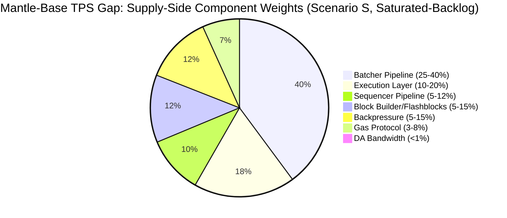
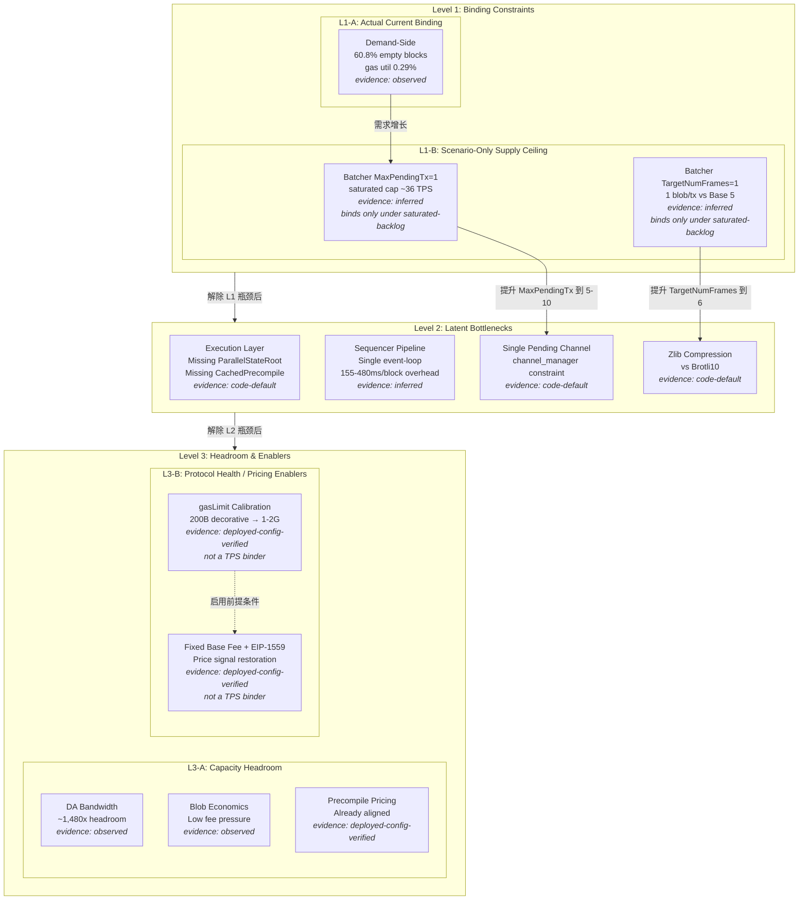
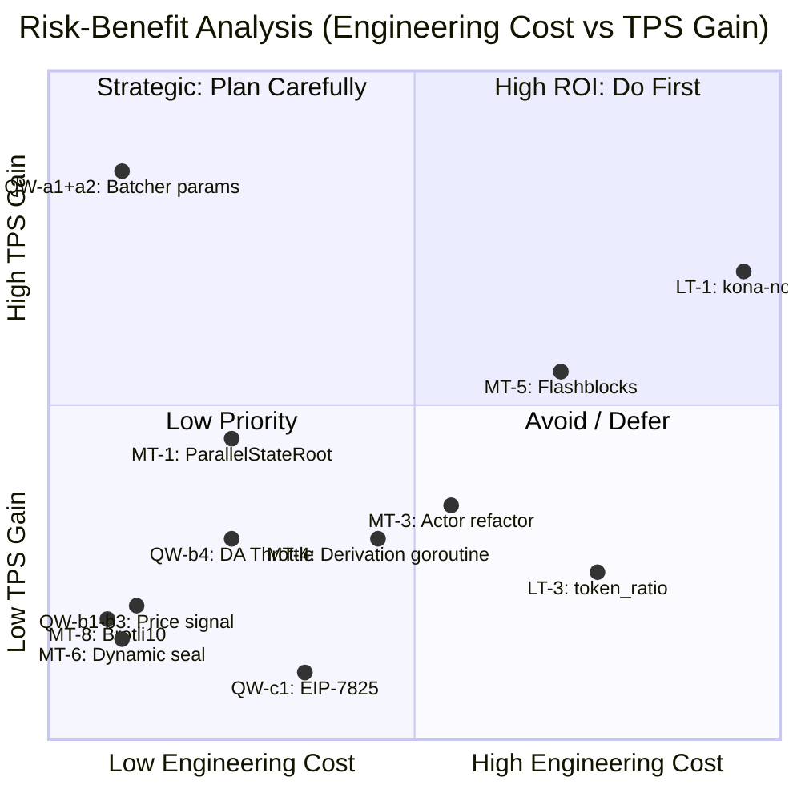
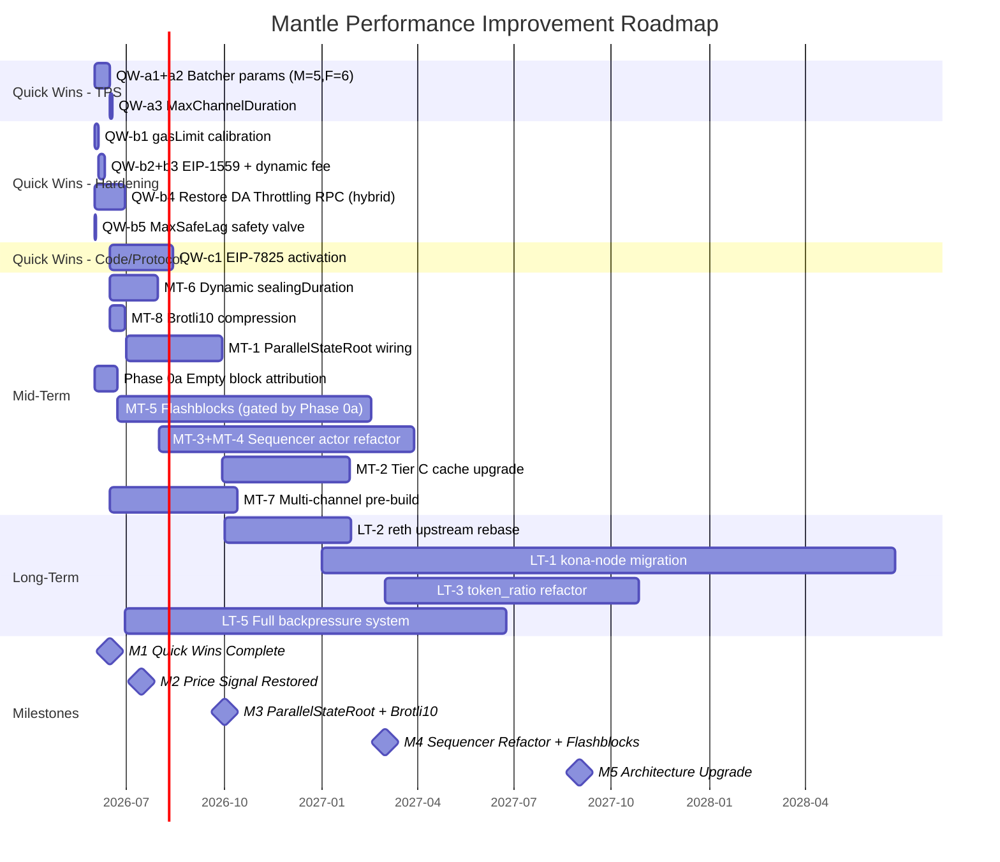

# Mantle vs Base 性能差距综合分析与改进建议

## 1. Executive Summary 与现状快照

### 1.1 Executive Summary

Mantle 当前实测 TPS 约 0.7–1.0（WHI-56 采样：1.80 tx/block, 2s block time），而 Base 实测约 93.7 user-tx/s（WHI-56 采样：187 tx/block），差距约 **90–130×**。但这一差距的本质并非单一瓶颈——Mantle 处于 **demand-bound** 状态（交易需求不足），60.8% 的区块为系统空块（仅含 L1 attributes deposit），gas 利用率仅 0.29%。

**核心结论**：

1. **当前 binding constraint 是 demand-side**：Mantle 链上交易需求远低于系统供给能力。即使不做任何供给侧改进，只要交易需求增长，TPS 也会自然提升。
2. **供给侧存在多个串联/并联瓶颈**：在 saturated-backlog（饱和积压）场景下，Batcher 单 pending tx 配置（MaxPendingTransactions=1, `evidence_confidence: inferred`）将系统 DA-confirmed TPS 上限压到约 36 TPS（WHI-59 Formula A），是当前供给侧的 binding constraint。
3. **Quick Wins 可快速解锁供给侧上限**：仅通过参数调优（MaxPendingTransactions→5–10, TargetNumFrames→6），saturated-backlog 下的 batcher 吞吐上限可从 ~36 TPS 提升至 ~1,083 TPS（WHI-59），约 **30× 改善**。
4. **中长期工程投入服务于韧性、UX 和更高天花板**：QW-a1+a2 参数调优即可将 saturated-backlog ceiling 提升至 ~1,083 TPS，已远超 Base 的 93.7 TPS 实测值。因此，中长期结构性改进（Flashblocks/builder 分离、ParallelStateRoot、Sequencer actor 重构等）的核心价值**不在于跨越 93.7 TPS 门槛**（一旦需求增长且 batcher 参数到位即可达到），而在于：(a) 运营韧性——在高负载下保持稳定性和低延迟；(b) 用户体验——Flashblocks 250ms 预确认可带来 8× UX 改善；(c) 更高供给天花板——推向 2,000–3,000+ TPS 区间；(d) 架构对齐——跟随 OP Stack 上游演进方向，降低长期维护成本。
5. **DA 带宽完全不是瓶颈**：Mantle DA 利用率余量约 1,480×（WHI-60），DA 层当前属于 Level 3 Headroom。

**关键行动建议**：立即执行 Quick Wins 参数调优（1–2 周），同步启动需求侧增长策略和 Phase 0a 空块归因采样，为中期工程投入提供数据支撑。

### 1.2 现状快照

| 指标 | Mantle | Base | 差距 | evidence_confidence |
|------|--------|------|------|---------------------|
| 实测 TPS (user tx/s) | 0.7–1.0 | ~93.7 | ~90–130× | observed (WHI-56 500-block sample) |
| Avg tx/block | 1.80 (median 1) | 187 (median 158) | ~104× | observed (WHI-56) |
| Avg gas_used/block | 174,650 gas | 32.76 Mgas | ~188× | observed (WHI-56) |
| Gas utilization | 0.29% (median 0.08%) | 8.19% (median 7.31%) | 28× | observed (WHI-56) |
| System-only blocks | 60.80% | 0.20% | 304× | observed (WHI-56) |
| Block time | 2s | 2s (+ 250ms flashblocks pre-conf) | 1× (8× UX) | observed |
| Effective gasLimit | 200B (decorative) | ~375M (binding) | N/A (不可比) | deployed-config-verified (WHI-57) |
| Batcher cadence | ~448s | ~49s | ~9× | observed (WHI-59 50-sample) |
| Blobs per batch tx | 1 | 5 | 5× | observed (WHI-59) |
| DA bandwidth utilization | ~97.1 B/s (~1,480× headroom) | ~95–99% fill rate | N/A | observed (WHI-60) |
| Compression algorithm | Zlib | Brotli10 | ~1.1–1.3× size diff | code-default (WHI-59) |
| EIP-1559 params | elasticity=2, denominator=8, fixed 0.02 gwei | elasticity=6, denominator=250, dynamic | Suboptimal | deployed-config-verified (WHI-57) |
| EIP-7825 per-tx gas cap | Not enforced | Enforced (16.77M) | Missing | code-default (WHI-57) |
| Backpressure mechanism | DA Throttling broken (RPC removed) | Active DA Throttling | Missing | code-default (WHI-61) |

## 2. 各组件 TPS 贡献权重分析

### 2.1 方法论

将 Mantle-Base 端到端 TPS 差距分解为七个组件维度。由于 Mantle 当前处于 **demand-bound** 状态，组件权重分析需区分两个场景：

- **Scenario D (Demand-Bound, 当前状态)**：TPS 差距主要由交易需求不足驱动，供给侧瓶颈尚未被触及。各组件权重反映的是"如果需求增长，哪个组件会最先成为瓶颈"的优先级。
- **Scenario S (Saturated-Backlog, 压力测试)**：假设交易需求无限，TPS 受限于系统供给能力。各组件权重反映对供给侧 TPS 上限的贡献。

### 2.2 归因模型

**Demand-side vs Supply-side 分解**：

Mantle 当前 TPS ≈ 1.0 并非系统上限，而是需求上限。证据：
- 60.8% 系统空块（WHI-56）表明 sequencer 大部分时间"等交易"
- Gas 利用率 0.29%（WHI-56）远低于任何供给侧约束
- DA 余量 1,480×（WHI-60）证明 DA 层完全空闲
- Batcher 以 ~448s 间隔提交，远低于其理论最小间隔（RTT/N ≈ 12s, WHI-59）

因此，当前 ~90–130× TPS 差距中，**需求侧因素是主导**。供给侧权重仅在 saturated-backlog 条件下才有实际意义。

### 2.3 供给侧组件权重（Scenario S: Saturated-Backlog）

```
caveats:
  - 以下权重为 saturated-backlog 场景下的估算范围，非精确值
  - Batcher 相关权重（组件 5、7）依赖 inferred 配置（MaxPendingTransactions=1, TargetNumFrames=1）
  - 需求侧归因（组件 2 中 timing-recoverable 比例）未完成 Phase 0a 采样
  - 权重之间存在耦合关系（如背压恢复是 Batcher 参数调优的安全前提），不可简单累加
```

| 组件 | 维度 | TPS 差距贡献权重（Scenario S） | demand_vs_supply | evidence_confidence |
|------|------|-------------------------------|-----------------|---------------------|
| 1. 执行层 (WHI-55) | ParallelStateRoot / cache 架构 | 10–20% | supply-side | code-default (lib exists, not wired) |
| 2. Block Builder / Flashblocks (WHI-56) | Builder 分离 + 250ms pre-conf | 5–15% (取决于空块归因) | mixed (timing-recoverable = supply; demand-empty = demand) | inferred (Phase 0a 未完成) |
| 3. Gas 协议 (WHI-57) | gasLimit/1559/EIP-7825 | 3–8% (间接：价格信号恢复) | supply-side (indirect) | deployed-config-verified |
| 4. Sequencer Pipeline (WHI-58) | 单线程 event-loop overhead | 5–12% | supply-side | inferred (30–260ms/block upper bound) |
| 5. Batcher Pipeline (WHI-59) | MaxPendingTx=1, TargetNumFrames=1 | 25–40% | supply-side | inferred + scenario-only |
| 6. DA 带宽 (WHI-60) | 利用率 / 吞吐上限 | <1% | supply-side (headroom) | observed |
| 7. 背压机制 (WHI-61) | DA Throttling 缺失 | 5–15% (间接：安全网缺失限制激进调参) | supply-side (indirect enabler) | code-default |

### 2.4 权重图



> **Caveats**: (i) Batcher Pipeline 权重基于 `inferred` 配置推断（MaxPendingTransactions=1），TPS 增益仅在 saturated-backlog 条件下成立（`scenario-only`）；(ii) Block Builder/Flashblocks 权重取决于 Phase 0a 空块归因结果（timing-recoverable vs demand-empty 比例未知）；(iii) 背压权重为间接使能因子——其缺失限制了 Batcher 参数激进调优的安全性；(iv) 权重之间存在耦合（解除一个瓶颈可能改变其他权重分布），总和不严格等于 100%。(v) 在 Demand-Bound（当前状态）下，所有供给侧权重对实际 TPS 的影响趋近于零，差距几乎完全由需求侧驱动。

## 3. 瓶颈分层模型（Level 1 / 2 / 3）

### 3.1 模型定义

- **Level 1 — Binding Constraints**：当前实际限制 Mantle TPS 天花板的瓶颈
- **Level 2 — Latent Bottlenecks**：当 Level 1 解除后将成为新天花板的瓶颈
- **Level 3 — Headroom**：当前有充足余量、暂不限制 TPS 的组件

### 3.2 当前 Binding Constraint 判定

**结论：Mantle 当前的 TPS 限制需分三层理解**：

1. **L1-A: Actual Current Binding — Demand-Side（当前实际约束）**：交易需求不足是当前 TPS 的实际限制因素。Gas 利用率 0.29%、60.8% 空块率均指向需求不足。在此状态下，任何供给侧改进都不会改变实际 TPS。`evidence_confidence: observed`

2. **L1-B: Scenario-Only Supply Ceiling — Batcher 配置（饱和积压场景下的供给天花板）**：一旦交易需求增长到超过当前系统供给能力，Batcher MaxPendingTransactions=1 将 DA-confirmed saturated capacity 限制在 ~36 TPS，TargetNumFrames=1 将每次 L1 提交限制为 1 blob（Base 用 5 blobs/tx）。这些参数**仅在 saturated-backlog 条件下**构成 binding constraint，当前 demand-bound 状态下尚未被触及。`evidence_confidence: inferred` + `scenario-only`

3. **Protocol Health / Pricing Enablers — 非 Binding Constraint**：gasLimit 200B（decorative）、固定 base fee 0.02 gwei、EIP-1559 参数（denominator=8, elasticity=2）属于**协议健康度和定价机制**问题，不是已证实的 TPS 约束。它们的主要影响是破坏价格信号和 gas market 正常运作，但不直接限制当前或饱和场景下的 sustained TPS。这些项归入 Level 3 的 Protocol Health / Pricing Enablers 子类，详见 3.3 节。`evidence_confidence: deployed-config-verified`

### 3.3 分层分类

#### Level 1: Binding Constraints

**L1-A: Actual Current Binding — Demand-Side**

| 候选 | 描述 | 限制机制 | evidence_confidence |
|------|------|----------|---------------------|
| Demand-side 空块率 60.8% | Mantle 链上交易需求不足，大部分区块为空 | 需求 < 供给，sequencer 空转 | observed (WHI-56 直接采样；timing-recoverable vs demand-empty 归因未完成) |

**L1-B: Scenario-Only Supply Ceiling（仅在 saturated-backlog 条件下约束）**

| 候选 | 描述 | 限制机制 | 触发条件 | evidence_confidence |
|------|------|----------|----------|---------------------|
| Batcher MaxPendingTransactions=1 | 单 pending L1 tx 串行化 batcher 提交，saturated capacity ~36 TPS | RTT 阻塞：下一个 channel 必须等前一个 L1 confirm | 交易需求增长到接近或超过 ~36 TPS | inferred (CLI default=1 via flags.go:63; cadence ~448s consistent with N=1; WHI-59) |
| Batcher TargetNumFrames=1 | 每个 batch tx 仅 1 blob (130,044 bytes)，Base 用 5 blobs/tx | Per-L1-tx 数据量被限制为 1/5 of Base | 与 MaxPendingTx 联合约束 DA throughput ceiling | inferred (CLI default=1; 1 blob/tx directly observed; config attribution inferred; WHI-59) |

#### Level 2: Latent Bottlenecks

| 候选 | 描述 | 触发条件 | evidence_confidence |
|------|------|----------|---------------------|
| 执行层缺少 ParallelStateRoot | Mantle op-reth 中 ParallelStateRoot、LazyOverlay 等库存在但未接入 | 当 TPS 提升到 gas/s 接近 sequencer EL 处理能力时 | code-default (lib 存在，未 wired；upstream reported ≥20–50% state-root 时间减少 `[PENDING VERIFICATION]`; WHI-55 Reco-1) |
| Sequencer 单线程 event-loop | Go op-node 单 eventLoop select 处理所有 Engine API / derivation / sequencing | 非边界块 ~155–330ms overhead，L1 epoch 边界块 ~200–480ms（WHI-58） | observed (sealingDuration=50ms hardcoded; inferred for total overhead) |
| 单 pending channel 架构 | channel_manager 仅维护一个 pending channel（WHI-59 R3） | 当 MaxPendingTransactions 提升后，channel 构建速度成为新瓶颈 | code-default (channel_manager.go:26-28; upstream 架构约束) |
| Batcher Zlib 压缩 | Mantle 使用 Zlib，Base 使用 Brotli10，后者压缩率更高 | DA 吞吐接近饱和时更好的压缩 = 更多 L2 tx/blob | code-default (WHI-59) |

#### Level 3: Headroom & Enablers

**L3-A: Capacity Headroom（容量余量充足）**

| 候选 | 描述 | 余量 | evidence_confidence |
|------|------|------|---------------------|
| DA 带宽 | BPO2 target=14 blobs/block，Mantle 仅用 ~97.1 B/s | ~1,480× headroom; DA ceiling ~1,749 TPS | observed (WHI-60) |
| L1 blob 经济 | blob base fee 远低于 stress 阈值 | BPO2 fee update fraction 允许 50% 超载 before 显著涨价 | observed (WHI-60) |
| Precompile gas pricing | BLS12-381、P256 等预编译在 Skadi+Limb 后已对齐 Base | 无差距 | deployed-config-verified (WHI-57) |

**L3-B: Protocol Health / Pricing Enablers（协议健康度 / 定价杠杆）**

这些项影响协议的健康度、价格信号和 worst-case 防护，但**不是已证实的 TPS binding constraints**。它们的修复价值在于恢复 gas market 正常运作和改善 DoS 防护，是中长期架构健壮性的基础。

| 候选 | 描述 | 影响 | 为何不是 Level 1 Binding Constraint | evidence_confidence |
|------|------|------|-------------------------------------|---------------------|
| gasLimit 200B (decorative) | 200B gasLimit 远超 sequencer 实际处理能力（反向 miscalibration） | 破坏 EIP-1559 价格信号的前提条件；不直接限制 sustained TPS | 当前 gas 利用率 0.29%，即使 gasLimit 为 1G 也不会改变 TPS；200B→1–2G 校准是恢复价格信号的先决条件，非 TPS 杠杆 | deployed-config-verified (200B on-chain via Mantlescan; WHI-57) |
| 固定 base fee 0.02 gwei | 禁用了 EIP-1559 动态定价 | 消除了拥堵信号和 gas market 自调节能力 | 固定价格不影响吞吐上限——系统仍以相同速度处理交易；影响的是拥堵治理和用户体验 | deployed-config-verified (WHI-57) |
| EIP-1559 参数 (denominator=8, elasticity=2) | 即使启用动态定价，当前参数也过于粗糙（1/8 步长 vs Base 的 1/250） | 3× burst capacity 缺失、价格阶梯过粗 | 弹性和步长影响的是价格响应的精细度和 burst 吸收能力，不直接限制 sustained TPS throughput | deployed-config-verified (WHI-57) |
| EIP-7825 per-tx gas cap 未启用 | Base 已在 Azul 激活 16.77M per-tx cap；Mantle 显式 gate | DoS 硬化，降低 worst-case 单笔交易对区块的占用 | 影响的是 worst-case TPS floor，不是 sustained throughput ceiling | code-default (WHI-57) |

### 3.4 瓶颈分层模型图



## 4. Quick Wins 清单（≤4 周落地）

### 4.1 (a) 参数-TPS 杠杆 — 直接提升饱和-积压场景下吞吐上限

| # | 变更 | 当前值 | 目标值 | 预期 TPS 影响 | evidence_confidence | 实施复杂度 | 风险 | 来源 |
|---|------|--------|--------|--------------|---------------------|-----------|------|------|
| QW-a1 | MaxPendingTransactions 提升 | 1 (inferred) | 5–10 | 5–10× saturated capacity (从 ~36 TPS → ~180–360 TPS); demand-bound 下增益有限 | scenario-only | 极低（CLI flag 变更） | 低（L1 nonce/gas 竞争可能增加失败率） | WHI-59 R1 |
| QW-a2 | TargetNumFrames 提升 | 1 (inferred) | 6 | ~6× per-L1-tx data capacity; combined with QW-a1: ~1,083 TPS saturated capacity | scenario-only (需 saturated backlog + channel_fill_time ≪ RTT/N) | 极低（CLI flag 变更） | 低（更大 blob tx = 更高单次 gas 成本） | WHI-59 R2b |
| QW-a3 | MaxChannelDuration 调优 | 0 (disabled) | 5–10 L1 blocks | 定性改善：平滑 burst 提交，减少 batcher 在低负载时的频繁提交 | code-default (定性作用，非直接 TPS 提升) | 极低（CLI flag 变更） | 极低 | WHI-59 |

**联合效果（QW-a1 + QW-a2）**：

| 配置 | Saturated Capacity (300B avg L2 tx) |
|------|-------------------------------------|
| 当前（M=1, F=1） | ~36 TPS |
| 保守（M=3, F=3） | ~324 TPS |
| 推荐（M=5, F=6） | ~1,083 TPS |
| 激进（M=10, F=6） | ~2,166 TPS |

> **Caveat**: 以上数字均为 saturated-backlog 场景下的理论上限（`scenario-only`）。在当前 demand-bound 状态下（TPS ≈ 1.0），实际 TPS 提升将微乎其微——这些参数调优的价值在于**提前解锁供给侧天花板**，为未来需求增长做准备。

**推荐 Rollout 方案**（WHI-59）：Day 0 canary: M=3, F=3, DA=blob → Week 1: M=5, F=6 + DynamicEthChannelConfig → Week 2-3: Brotli10 压缩（含 CPU 监控）

### 4.2 (b) 参数-硬化/定价杠杆 — 协议健康度修复，不直接提升 sustained TPS

| # | 变更 | 当前值 | 目标值 | 预期效果 | evidence_confidence | 实施复杂度 | 风险 | 来源 |
|---|------|--------|--------|----------|---------------------|-----------|------|------|
| QW-b1 | gasLimit 校准 | 200B (decorative) | 1G–2G | 恢复 EIP-1559 价格信号的前提条件；不直接改变 TPS | deployed-config-verified | 低（单次 SystemConfig.setGasLimit tx） | 极低 | WHI-57 Q4 |
| QW-b2 | EIP-1559 参数调优 | denominator=8, elasticity=2 | denominator=250, elasticity=6 | 3× burst absorption, 更细粒度价格阶梯 (1/250 vs 1/8) | deployed-config-verified | 低（单次 SystemConfig.setEIP1559Params tx） | 低（钱包 UX 适配期） | WHI-57 Q2 |
| QW-b3 | 启用 dynamic base fee | fixed 0.02 gwei | minBaseFee=1 wei, dynamic | 恢复 1559 价格信号，激活 QW-b2 效果 | deployed-config-verified | 低 | 中（钱包/RPC 兼容性） | WHI-57 Q3 |
| QW-b4 | 恢复 miner_setMaxDASize RPC | RPC 已从 op-geth 移除 | 重新添加 RPC endpoint | 恢复 DA Throttling 背压能力，为 QW-a1/a2 激进调参提供安全网 | code-default (需 op-geth 微量代码变更, 2–4 人周) | **中（hybrid/code-assisted）** | 低 | WHI-61 Phase 1 |
| QW-b5 | SequencerMaxSafeLag 安全阀 | 0 (disabled) | 5000 (~2.8h) | 防止 batcher 长时间落后时 sequencer 持续出块 | code-default (CLI flag 存在，默认禁用) | 极低（CLI flag 变更） | 极低 | WHI-61 |

> **注意**: QW-b4（恢复 miner_setMaxDASize RPC）虽归为"参数/硬化"类改进，但实际**需要 op-geth 代码变更**来重新添加已被移除的 RPC endpoint，实施复杂度约 2–4 人周。它不是纯参数调整的 no-code quick win。

**推荐执行顺序**（WHI-57）：QW-b1 → QW-b2 → QW-b3（同窗口"价格信号恢复"组合）→ QW-b4（并行开发）→ QW-b5（即时 CLI 设置）

### 4.3 (c) 代码/协议变更杠杆 — 需要 op-geth 代码修改和/或 hardfork

| # | 变更 | 描述 | 预期效果 | evidence_confidence | 实施复杂度 | 风险 | 来源 |
|---|------|------|----------|---------------------|-----------|------|------|
| QW-c1 | EIP-7825 per-tx gas cap | 移除 op-geth 中 `!IsOptimism()` gate（5 个 enforcement points），在下一次 hardfork 激活 16,777,216 gas per-tx cap | DoS 硬化，提高 worst-case TPS floor；非直接 sustained TPS 提升 | observed (Base Azul 已激活；Mantle gate 代码路径已验证: txpool/validation.go:128, state_transition.go:536, miner/worker.go:765, gasestimator.go:73,84; WHI-57 Q1) | 中（op-geth fork + hardfork 协调） | 低 | WHI-57 Q1 |
| QW-c2 | gasLimit 大幅提升（>2G） | 从 1G–2G 进一步提升到 10G+ | 需配合 state growth risk analysis、DoS surface 评估、执行层基准测试 | deployed-config-verified (当前 200B "方向反了"; WHI-57) | 高（需要前置 EL 基准测试） | 高（state growth + DoS） | WHI-57 item-1, item-6 |

## 5. 中期改进路径（1–3 个季度）

| # | 改进项 | 描述 | 预期 TPS 里程碑 | 工程量 | 前置依赖 | 技术风险 | evidence_confidence | 来源 |
|---|--------|------|-----------------|--------|----------|----------|---------------------|------|
| MT-1 | ParallelStateRoot + LazyOverlay + StateRootTask 接入 | 在 Mantle op-reth 中接入已存在但未 wired 的并行 state root 库 | ≥20–50% state-root 时间减少 → 在高 gas/s 场景下可能提升 5–15% 端到端 TPS | 低-中（~500 行 wire-up, 2–4 人月） | 无前置 | 低（确定性并行，非 speculative） | code-default (upstream reported ≥20–50% `[PENDING VERIFICATION]`; WHI-55 Reco-1, P0) | WHI-55 |
| MT-2 | Tier B → Tier C cache 架构升级 | 引入 cross-flashblock CachedExecutor、per-precompile cache、async receipt root | 边际改善执行层吞吐（具体值需 benchmark） | 中（4–8 人月，含 Reco-2/3/4） | MT-1 或并行 | 中（cache invalidation 协调） | inferred (WHI-55 Reco-2/3/4) | WHI-55 |
| MT-3 | Sequencer actor + task queue 重构 | 将 Engine API RPC 从 OnEvent 调用栈移出，异步化 | 5–30 ms/block 典型改善；L1 epoch 边界最高 ~95ms | 中-高（6–10 人月） | 无前置 | 中-高（核心共识路径变更） | inferred (WHI-58 Rec-2) | WHI-58 |
| MT-4 | Derivation 独立 goroutine | 将 derivation 从主 event loop 分离为独立 goroutine | 5–200 ms/block（L1 epoch 边界上限） | 中（4–8 人月） | MT-3 或并行 | 中（derivation ↔ sequencer 状态同步） | inferred (WHI-58 Rec-3) | WHI-58 |
| MT-5 | rollup-boost + Flashblocks 引入 | Phase 1: Flashblocks consumer (6–10 wk) → Phase 2: rollup-boost testnet (4–6 wk) → Phase 3: builder producer (12–16 wk) | 250ms pre-confirmation UX；throughput 改善取决于空块归因：Scenario A 2.13×, Scenario B 1.0×, Scenario C 1.56× | 高（31–49 周 / 7–11 人月） | Phase 0a 空块归因采样结果（需 ≥40% timing-recoverable 才值得投入） | 中（builder 分离引入新故障面） | inferred + scenario-only (WHI-56) | WHI-56 |
| MT-6 | Dynamic sealingDuration | 替换硬编码 50ms 为基于 last_seal_duration 的动态计算 | 0–30 ms/block 边界场景改善 | 低（1–2 人月，无 hardfork） | 无前置 | 低 | observed (sealingDuration=50ms at sequencer.go:25; WHI-58 Rec-1) | WHI-58 |
| MT-7 | Batcher 多 channel 预构建 | 突破单 pending channel 限制，pipeline 化 channel 构建 | 1.5–2× (在 QW-a1/a2 saturated 后); 当前 demand-bound 下无影响 | 中（10–18 周） | QW-a1, QW-a2 已 saturated | 中 | code-default (WHI-59 R3) | WHI-59 |
| MT-8 | Zlib → Brotli10 压缩切换 | CLI flag 切换压缩算法 | ~1.1–1.3× DA efficiency; ~10–30% DA 成本节省；对 TPS 的影响为间接（更少 DA 空间 = 同等带宽下更多 L2 tx） | 低（CLI flag + CPU 监控） | 无前置 | 低（可回滚） | code-default (WHI-59) | WHI-59 |

**优先级排序**（按 ROI Tier 排序，详见 Section 8.1）：MT-8 > MT-6 > MT-1 > MT-5（gated by Phase 0a） > MT-3/MT-4 > MT-7 > MT-2

## 6. 长期架构演进路径（3+ 个季度）

| # | 改进项 | 描述 | 预期影响 | 工程量 | 技术不确定性 | 生态依赖 | evidence_confidence | 来源 |
|---|--------|------|----------|--------|-------------|----------|---------------------|------|
| LT-1 | kona-node 迁移 | 从 Go op-node 单 event-loop 迁移到 Rust actor model (kona-node) | 30–260 ms/block compound improvement；消除 Go runtime GC pause、channel contention | 极高（18–30 人月） | 高（在线共识替换；需移植 MetaTx / operator-fee / Arsia / Eigen DA / blob / MNT token 等 Tier D 功能） | 高（依赖 kona upstream 成熟度；当前 kona 仅用于 fp_client fault proof） | inferred (WHI-58 Rec-5b) | WHI-58 |
| LT-2 | reth upstream rebase | 将 Mantle reth fork 从 v2.2.0 更新到最新 stable | 获取上游性能改进（具体值取决于 merged PRs） | 中（rebase + Tier E patch 重新适配） | 中（Tier E token_ratio 逻辑需适配） | 中（upstream release 节奏） | inferred (WHI-55 Reco-6) | WHI-55 |
| LT-3 | token_ratio 机制重构 | 消除 BVM_ETH ERC20 EVM overhead（每笔非 deposit tx ≤1ms + 4500 gas compensation + ≥6 U256 ops） | 消除 Tier E hot-path overhead；上限 ≤1 ms × N_tx | 高（涉及 fee 语义，可能需要 hardfork） | 高（核心 fee 机制变更） | 低 | upper_bound_only (WHI-55 Reco-5) | WHI-55 |
| LT-4 | DA 策略升级 | BPO2 target blob 利用率优化；span-batch v2；fill rate 45%→85% | DA 成本优化 ~50%+；DA ceiling 从 ~1,749 TPS → ~2,600+ TPS（仍为 headroom） | 中 | 低 | 低 | observed for current headroom (WHI-60) | WHI-60 |
| LT-5 | 完整背压机制体系 | 四类策略全面部署：DA Throttling + Adaptive Gas Limit + Multi-Batcher + 自适应参数 | 系统稳定性保障，允许在高负载下安全运行 | 高（累计 20–30 人月） | 中 | 低 | code-default (WHI-61) | WHI-61 |
| LT-6 | Multi-Batcher 实例 | 运行多个 batcher 实例并行提交 | ~2× batcher throughput | 高（8–12 人周） | 高（nonce 管理、L1 tx 排序） | 中 | inferred (WHI-61 Strategy B) | WHI-61 |

## 7. 风险评估矩阵

### 7.1 风险维度定义

- **技术风险 (T)**：实现失败或性能不达预期的概率 (1=低, 5=高)
- **运营风险 (O)**：部署后对现有网络稳定性的影响 (1=低, 5=高)
- **工程复杂度 (C)**：人月 / 跨团队协调需求 (1=低, 5=高)
- **依赖风险 (D)**：对上游 OP Stack / reth 版本的依赖程度 (1=低, 5=高)

### 7.2 风险矩阵

| 改进项 | T | O | C | D | 综合风险 | evidence_confidence | 关键风险说明 |
|--------|---|---|---|---|----------|---------------------|-------------|
| **Quick Wins - TPS** | | | | | | | |
| QW-a1: MaxPendingTx 5–10 | 1 | 2 | 1 | 1 | **低** | scenario-only | L1 nonce 竞争；可即时回滚 |
| QW-a2: TargetNumFrames 6 | 1 | 2 | 1 | 1 | **低** | scenario-only | 单次 blob tx gas 成本增加 |
| QW-a3: MaxChannelDuration | 1 | 1 | 1 | 1 | **极低** | code-default | 无显著风险 |
| **Quick Wins - 硬化** | | | | | | | |
| QW-b1: gasLimit 校准 | 1 | 1 | 1 | 1 | **极低** | deployed-config-verified | 下调 gasLimit（200B→1–2G）无性能风险 |
| QW-b2: EIP-1559 params | 1 | 2 | 1 | 1 | **低** | deployed-config-verified | 钱包 UX 适配期 |
| QW-b3: Dynamic base fee | 2 | 3 | 1 | 1 | **中低** | deployed-config-verified | 钱包/RPC 兼容性需逐项验证 |
| QW-b4: Restore DA Throttling | 2 | 2 | 2 | 1 | **中低** | code-default | 需 op-geth 代码变更；但 Base 已有 reference impl |
| QW-b5: MaxSafeLag 安全阀 | 1 | 1 | 1 | 1 | **极低** | code-default | 纯安全网，不影响正常运行 |
| **Quick Wins - Code/Protocol** | | | | | | | |
| QW-c1: EIP-7825 | 2 | 2 | 3 | 2 | **中** | observed | 需 op-geth fork + hardfork 协调 |
| QW-c2: gasLimit >2G | 4 | 4 | 4 | 2 | **高** | deployed-config-verified | State growth + DoS 风险；需前置 EL benchmark |
| **中期** | | | | | | | |
| MT-1: ParallelStateRoot | 2 | 2 | 2 | 2 | **中低** | code-default | 确定性并行，非 speculative；state trie 一致性需验证 |
| MT-2: Tier C cache | 3 | 2 | 3 | 3 | **中** | inferred | Cache invalidation 逻辑复杂 |
| MT-3: Actor + task queue | 3 | 4 | 4 | 2 | **中高** | inferred | 核心共识路径变更；回归风险高 |
| MT-4: Derivation goroutine | 3 | 3 | 3 | 2 | **中** | inferred | 状态同步复杂度 |
| MT-5: Flashblocks | 3 | 3 | 4 | 3 | **中高** | inferred + scenario-only | ROI 取决于 Phase 0a 结果；builder 分离引入新故障面 |
| MT-6: Dynamic sealingDuration | 1 | 1 | 1 | 1 | **极低** | observed | 最安全的中期改进 |
| MT-7: 多 channel 预构建 | 3 | 2 | 3 | 2 | **中** | code-default | 需重构 channel_manager 核心逻辑 |
| MT-8: Brotli10 压缩 | 1 | 1 | 1 | 1 | **极低** | code-default | CLI flag 切换，可回滚 |
| **长期** | | | | | | | |
| LT-1: kona-node 迁移 | 5 | 5 | 5 | 5 | **极高** | inferred | 在线共识全面替换；18–30 人月 |
| LT-2: reth upstream rebase | 3 | 3 | 3 | 4 | **中高** | inferred | Tier E 兼容性 |
| LT-3: token_ratio 重构 | 4 | 4 | 4 | 2 | **高** | upper_bound_only | 核心 fee 机制变更 |
| LT-4: DA 策略升级 | 2 | 1 | 2 | 2 | **低** | observed | 低风险成本优化 |
| LT-5: 完整背压体系 | 3 | 3 | 4 | 2 | **中高** | code-default | 多策略协调 |
| LT-6: Multi-Batcher | 4 | 4 | 3 | 3 | **高** | inferred | Nonce 管理、L1 tx 排序极复杂 |

### 7.3 风险-收益象限图



> **注意**: TPS Gain 轴上，Batcher 参数调优（QW-a1+a2）的高值反映 saturated-backlog scenario ceiling（~1,083 TPS），非 demand-bound 下的实际增益。Flashblocks（MT-5）TPS Gain 使用 Scenario C（50% timing-recoverable）的 1.56× 估计值，实际值取决于 Phase 0a 归因结果。

## 8. ROI 排序与改进路线图

### 8.1 ROI 排序

**方法论**：由于各改进项的 TPS 影响跨越不同量纲（绝对 TPS delta、相对百分比、延迟改善、间接使能），且多个关键项的增益仅在特定负载场景下成立（`scenario-only`），采用**定性分层 ROI 评估**代替单一数值公式。

**ROI Tier 定义**：

- **Tier 1 — Exceptional ROI**：极低成本（<1 人月）实现显著供给侧天花板提升或关键使能；即使 TPS 增益仅在 saturated-backlog 下体现，其预防性价值和成本比也极高
- **Tier 2 — High ROI**：低至中等成本（1–4 人月）实现可量化的 TPS 改善（≥5% 相对提升或关键架构解锁）
- **Tier 3 — Medium ROI**：中等成本（4–12 人月）实现中等 TPS 改善或重要架构升级，但存在不确定性或高实施风险
- **Tier 4 — Low ROI**：高成本（>12 人月）或高不确定性，TPS 改善边际或依赖长期技术演进
- **Enabler — 非直接 TPS 影响**：改善协议健康度、稳定性或安全性；ROI 不以 TPS 衡量，但为其他改进提供前提或安全网

```
caveats:
  - TPS 影响均表示为 saturated-backlog 场景下的估算范围（relative % TPS uplift on saturated ceiling）
  - 当前 demand-bound 下所有供给侧改进的实际 TPS 增益趋近于零
  - ROI 排序假设需求会增长到触及供给侧瓶颈
  - WHI-59 相关项（QW-a1/a2、MT-7）的 TPS gain 仅在 saturated-backlog 条件下成立（scenario-only）
  - Flashblocks ROI 高度依赖 Phase 0a 空块归因结果（Scenario A-C range: 1.0×–2.13×）
  - evidence_confidence 反映底层数据来源的可靠性，不反映实施成功的确定性
```

| ROI Tier | Rank | 改进项 | TPS 影响（saturated-backlog 下的相对 % 提升） | 假设与条件 | Cost (人月) | 综合风险 | evidence_confidence |
|----------|------|--------|---------------------------------------------|-----------|-------------|----------|---------------------|
| **Tier 1** | 1 | QW-a1+a2: Batcher 参数调优 | ~2,900% (从 ~36 → ~1,083 TPS saturated ceiling) | 需 saturated backlog + channel_fill_time ≪ RTT/N；当前 demand-bound 下增益 ≈ 0 | 0.1 | 低 | scenario-only (inferred config) |
| **Tier 1** | 2 | MT-8: Brotli10 压缩切换 | ~10–30% DA efficiency → 间接 TPS ceiling 提升（同等 DA 带宽下可传输更多 L2 tx） | 压缩率提升 ~1.1–1.3×；需监控 2–4× CPU 开销；可即时回滚 | 0.5 | 极低 | code-default |
| **Tier 1** | 3 | MT-6: Dynamic sealingDuration | ~1–3% (0–30 ms/block 改善) | 仅在 block seal 时间成为边际瓶颈时有效；当前 50ms 硬编码为保守默认 | 1.5 | 极低 | observed |
| **Tier 2** | 4 | MT-1: ParallelStateRoot 接入 | ~5–15% (≥20–50% state-root 时间减少 → 端到端 TPS 在高 gas/s 下提升) | upstream reported 数据 `[PENDING VERIFICATION]`；仅在 gas/s 接近 EL 处理能力时显著 | 3.0 | 中低 | code-default |
| **Tier 3** | 5 | MT-5: Flashblocks + rollup-boost | ~0–113% (Scenario A: 113%, B: 0%, C: 56%) | Gated by Phase 0a：需 ≥40% timing-recoverable 空块才值得投入；250ms pre-conf 的 UX 价值独立于 TPS | 9.0 | 中高 | inferred + scenario-only |
| **Tier 3** | 6 | MT-3+MT-4: Sequencer actor 重构 | ~5–12% (5–260 ms/block compound improvement) | 核心共识路径变更，回归风险高；L1 epoch 边界上限 ~95ms 改善 | 12.0 | 中高 | inferred |
| **Tier 3** | 7 | MT-7: 多 channel 预构建 | ~50–100% (post-QW-a1/a2 saturation) | 仅在 QW-a1/a2 调优后且 channel 构建成为新瓶颈时有效；当前 demand-bound 下无影响 | 4.0 | 中 | code-default |
| **Tier 3** | 8 | MT-2: Tier C cache 架构 | ~3–8% (边际执行层改善) | 具体值需 benchmark；cache invalidation 协调复杂 | 6.0 | 中 | inferred |
| **Tier 4** | 9 | LT-1: kona-node 迁移 | ~15–25% (30–260 ms/block compound; 消除 Go GC) | 18–30 人月；在线共识全面替换；需移植全部 Tier D 功能 | 24.0 | 极高 | inferred |
| **Tier 4** | 10 | LT-6: Multi-Batcher 实例 | ~100% batcher throughput (post-saturation) | Nonce 管理、L1 tx 排序极复杂；高技术不确定性 | 3.0 | 高 | inferred |
| **Tier 4** | 11 | LT-2: reth upstream rebase | Variable (取决于 upstream merged PRs) | Tier E token_ratio patch 需重新适配；upstream release 节奏不可控 | 4.0 | 中高 | inferred |
| **Tier 4** | 12 | LT-3: token_ratio 重构 | <5% (≤1 ms × N_tx overhead 消除) | 核心 fee 语义变更；可能需 hardfork；upper_bound_only 估算 | 8.0 | 高 | upper_bound_only |
| **Enabler** | — | QW-b1-b3: 价格信号恢复 | N/A — 恢复 gas market 正常运作 | 200B→1–2G gasLimit 校准 + EIP-1559 动态定价；不直接改变 sustained TPS | 0.5 | 极低–中低 | deployed-config-verified |
| **Enabler** | — | QW-b4+b5: 背压安全网恢复 | N/A — 为 QW-a1/a2 激进调参提供安全保障 | QW-b4 需 op-geth 代码变更 (2–4 人周)；QW-b5 纯 CLI flag | 1.0 | 极低–中低 | code-default |
| **Enabler** | — | QW-c1: EIP-7825 DoS 硬化 | N/A — worst-case TPS floor 改善 | 需 op-geth fork + hardfork；Base 已在 Azul 激活 | 2.0 | 中 | observed |
| **Enabler** | — | LT-5: 完整背压机制体系 | N/A — 高负载稳定性保障 | 四类策略全面部署；累计 20–30 人月 | 25.0 | 中高 | code-default |

### 8.2 TPS 里程碑路线图

| 里程碑 | 时间线 | 预期 TPS 范围 | 场景条件 |
|--------|--------|--------------|----------|
| M0: 当前状态 | Now | 0.7–1.0 TPS | demand-bound |
| M1: Quick Wins 参数调优 | +2 周 | demand-bound: ≈1.0 TPS (unchanged); saturated ceiling: ~1,083 TPS | demand-bound 下无变化；saturated-backlog 下供给上限从 ~36 TPS → ~1,083 TPS |
| M2: 价格信号恢复 + 背压 | +6 周 | demand-bound: ≈1.0 TPS; saturated ceiling: ~1,083 TPS + protocol health | 不改变 TPS 但恢复 gas market 健康度 |
| M3: ParallelStateRoot + Dynamic seal + Brotli10 | +3–4 月 | saturated ceiling: ~1,200–1,400 TPS | 执行层和共识层改善叠加 |
| M4: Sequencer 重构 + Flashblocks Phase 1 | +6–9 月 | saturated ceiling: ~1,400–2,000 TPS; UX: 250ms pre-conf | 依赖 Phase 0a 空块归因结果 |
| M5: kona-node + reth rebase + 完整背压 | +12–18 月 | saturated ceiling: ~2,000–3,000+ TPS | 架构级改进，不确定性高 |

> **关键说明**: 所有 saturated ceiling 数字仅在交易需求达到相应水平时才有意义。在当前 demand-bound 状态下，实际 TPS 由需求决定。Mantle 同时需要**供给侧解锁**和**需求侧增长**才能缩小与 Base 的差距。Base 的 93.7 TPS 实测值同时受益于其更高的链上需求和更强的供给侧能力。QW-a1+a2 参数调优即可将 saturated ceiling 提至 ~1,083 TPS（远超 Base 实测的 93.7），因此跨越 93.7 TPS 门槛的瓶颈不在供给侧架构，而在需求侧增长。中期/长期工程投入的核心价值在于韧性、UX 和更高天花板。

### 8.3 改进路线图



> **Milestone TPS targets** (saturated-backlog ceiling / demand-bound actual): M1: ~1,083 TPS / ~1.0 TPS | M2: ~1,083 TPS + protocol health / ~1.0 TPS | M3: ~1,200–1,400 TPS / depends on demand growth | M4: ~1,400–2,000 TPS / depends on demand | M5: ~2,000–3,000+ TPS / depends on demand

## 9. 结论与建议

### 9.1 关键发现

1. **Mantle 是 demand-bound 系统**：当前 TPS 差距的主因是交易需求不足，而非系统吞吐能力限制。
2. **供给侧 Quick Wins 成本极低但价值巨大**：Batcher 参数调优（≈0.1 人月）可将 saturated capacity 从 ~36 TPS 提升至 ~1,083 TPS，ROI 远超所有其他改进项（Tier 1 Exceptional ROI）。
3. **跨越 Base 实测 TPS（93.7）的关键在需求侧**：QW-a1+a2 即可将 saturated ceiling 提至 ~1,083 TPS，远超 93.7。中长期工程投入服务于韧性、UX（250ms pre-conf）、更高天花板（2,000+ TPS）和架构对齐，而非跨越 93.7 门槛。
4. **DA 层不是瓶颈**：1,480× headroom 意味着 DA 优化应聚焦成本节省而非 TPS 提升。
5. **Flashblocks ROI 存在重大不确定性**：7–11 人月工程投入是否值得，完全取决于 60.8% 空块中 timing-recoverable 的比例（Phase 0a 尚未完成）。
6. **中长期路径清晰但成本高昂**：kona-node 迁移（18–30 人月）、Sequencer actor 重构（6–10 人月）是达到 2,000+ TPS 的必经之路。
7. **Gas 协议参数（gasLimit/1559/base fee）是 Protocol Health Enablers，非 TPS Binding Constraints**：修复它们的价值在于恢复 gas market 正常运作和 DoS 防护，而非直接提升 sustained TPS。

### 9.2 推荐行动优先级

1. **立即 (Week 1-2)**：执行 QW-a1+a2 Batcher 参数调优 + QW-b5 MaxSafeLag 安全阀
2. **短期 (Week 2-6)**：QW-b1→b2→b3 价格信号恢复组合；启动 Phase 0a 空块归因采样；启动 QW-b4 DA Throttling RPC 恢复开发
3. **中期 (Month 2-6)**：MT-6 + MT-8 + MT-1 并行推进；根据 Phase 0a 结果决定 MT-5 Flashblocks 是否启动
4. **中长期 (Month 6-18)**：MT-3/MT-4 Sequencer 重构；LT-2 reth rebase
5. **长期 (Year 2+)**：LT-1 kona-node 迁移（战略决策，需评估 Mantle 长期技术路线）

---

## Revision Log

| Round | Change ID | Severity | Section | Description |
|-------|-----------|----------|---------|-------------|
| 2 | REV-1 | MAJOR | 3.2, 3.3, 3.4 | Restructured binding-constraint model: Level 1 now split into L1-A (actual current binding = demand-side) and L1-B (scenario-only supply ceiling = batcher MaxPendingTx + TargetNumFrames). Gas protocol items (gasLimit 200B, fixed base fee, EIP-1559 params) moved from Level 1 to new Level 3-B (Protocol Health / Pricing Enablers) with explicit justification for why they are not TPS binding constraints. Mermaid flowchart updated accordingly. |
| 2 | REV-2 | MAJOR | 8.1 | Replaced numeric ROI formula (`ROI_score = TPS_gain_midpoint / (engineering_cost_months × risk_factor)`) with tiered qualitative ROI assessment (Tier 1–4 + Enabler). All TPS impact values normalized to "relative % TPS uplift under saturated-backlog" with explicit assumptions per row. Table sorted consistently by ROI tier (highest first). Added `evidence_confidence` column. Enabler items (non-TPS) grouped separately at bottom with N/A TPS impact. |
| 2 | REV-3 | MINOR | 1.1 (point 4), 8.2, 9.1 | Clarified that medium-term work (Flashblocks, ParallelStateRoot, Sequencer refactor) serves resilience, UX, higher ceilings, and architecture parity — NOT strictly required to cross Base's 93.7 TPS, since QW-a1+a2 alone raises saturated ceiling to ~1,083 TPS. Updated Executive Summary point 4, TPS milestone key note, and findings. |

---

## Sources

1. **WHI-55**: Execution Layer reth Fork Comparison — `base-perf-analysis/research-sections/execution-layer-reth-fork-comparison/final.md` — Tier architecture (A–E), ParallelStateRoot, CachedPrecompile, async receipt root, token_ratio overhead
2. **WHI-56**: Block Builder & Flashblocks Throughput — `base-perf-analysis/research-sections/block-builder-flashblocks-throughput/final.md` — 500-block sample, 60.8% empty blocks, rollup-boost architecture, ROI scenarios A/B/C
3. **WHI-57**: Gas & Protocol Performance Config — `base-perf-analysis/research-sections/gas-protocol-perf-config/final.md` — gasLimit 200B decorative, EIP-1559 params, EIP-7825 gate, theoretical TPS @ 375M gasLimit
4. **WHI-58**: Sequencer Pipeline & Consensus Layer — `base-perf-analysis/research-sections/sequencer-consensus-pipeline-perf/final.md` — sealingDuration 50ms, 5-actor tokio vs single event-loop, kona-node migration analysis
5. **WHI-59**: Batcher Pipeline Architecture — `base-perf-analysis/research-sections/batcher-pipeline-architecture/final.md` — MaxPendingTransactions=1, TargetNumFrames=1, Formula A/B, saturated capacity tables
6. **WHI-60**: DA Bandwidth & Throughput Ceiling — `base-perf-analysis/research-sections/da-bandwidth-throughput-ceiling/final.md` — BPO2 14/21 blobs, 1,480× headroom, 1,749 TPS DA ceiling, Mantle 82.38 B/UOP
7. **WHI-61**: Batcher-Sequencer Backpressure — `base-perf-analysis/research-sections/batcher-sequencer-backpressure/final.md` — DA Throttling RPC removed, 4 strategy types, miner_setMaxDASize restoration path

### Code References

- `mantle-v2/op-batcher/flags/flags.go:63-68` — MaxPendingTransactions CLI default=1
- `mantle-v2/op-batcher/flags/flags.go:86-91` — TargetNumFrames CLI default=1
- `mantle-v2/op-node/rollup/sequencing/sequencer.go:25` — sealingDuration=50ms
- `mantle-v2/op-batcher/batcher/channel_manager.go:26-28` — single pending channel
- `mantle-v2/op-batcher/batcher/driver.go:500` — txmgr.NewQueue with MaxPendingTransactions
- `mantle-v2/packages/contracts-bedrock/deploy-config/mantle-mainnet.json:21` — 200B gasLimit
- `op-geth/core/txpool/validation.go:128` — EIP-7825 `!IsOptimism()` gate
- `op-geth/core/state_transition.go:536` — EIP-7825 gate
- `op-geth/miner/worker.go:765` — EIP-7825 gate
- `op-geth/eth/gasestimator/gasestimator.go:73,84` — EIP-7825 gate
- `mantle-v2/op-batcher/batcher/driver.go:588-672` — throttling per-endpoint loop
- `base/crates/execution/engine-tree/src/validator.rs` — Base Tier C: ParallelStateRoot, CachedPrecompile, async receipt root
- `base/crates/consensus/service/src/actors/` — 5 tokio actors architecture
- `base/execution/rpc/src/miner.rs:12-27` — MinerApiExt (setMaxDASize, setGasLimit)
