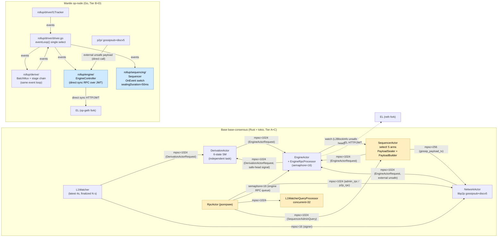
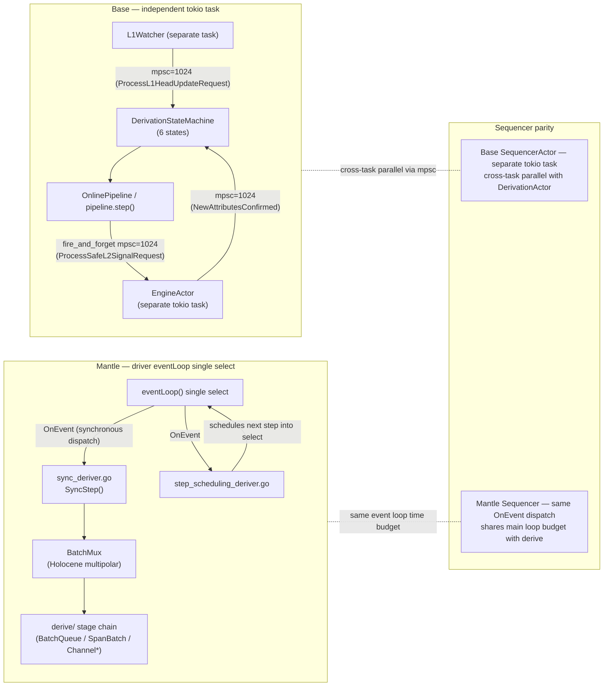
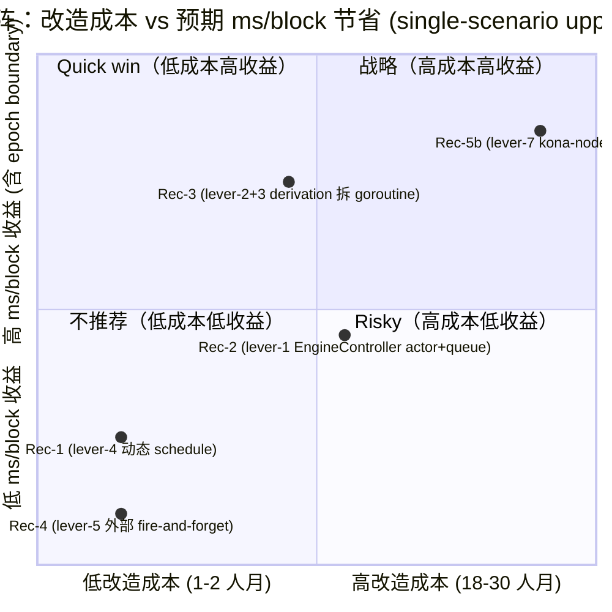

# Sequencer Pipeline 与共识层优化分析（Draft Round 2）

## Executive Summary

本研究对比 Base `base-consensus`（Rust + tokio actor 模型，构建于 op-rs/kona 之上）与 Mantle
`op-node`（Go，从 ethereum-optimism/optimism monorepo fork）在 sequencer pipeline 与共识层
架构上的设计差异，并量化对 Mantle TPS 的潜在提升空间。

核心发现：

1. **架构形态对比（item-1）**：Base 使用严格 actor 模型，5 个独立 tokio task（Engine / Derivation
   / Network / L1Watcher / Sequencer）通过类型化 `tokio::sync::mpsc`（多为 capacity=1024）
   和 `tokio::sync::watch` 通道通信；Mantle op-node 沿用 OP monorepo 的单进程 event-bus
   模式（`rollup/driver/driver.go` 的 `eventLoop()` 单 select 循环串接 sequencing、engine、
   derive 子包）。Base 把 Engine API 工作（FCU / NewPayload / GetPayload）经
   `EngineActorRequest` 队列路由到独立 engine task，把 RPC + JWT/HTTP + 序列化开销搬出
   sequencer 主循环；Mantle 的 `EngineController` 直接持有 `ExecEngine` 接口（同步 HTTP/JWT
   调用），事件触发但 RPC 本身仍同步等待。

2. **Sequencer 流水线（item-2）**：Base `PayloadSealer` 用一个 3-state stored 状态机
   （`SealState::Sealed → Committed → Gossiped`）+ 终态 `SealStepOutcome::Inserted(L2BlockInfo)`
   推进 seal 流水线（`base/crates/consensus/service/src/actors/sequencer/seal.rs:16-34, 75-126`）。
   关键路径分类（消除 Round-1 同名混淆）：
   - **本地 sequencer 插入**：`EngineActorRequest::ProcessLocalUnsafeL2BlockRequest(Box<InsertUnsafePayloadRequest { envelope, result_tx: Some(mpsc::Sender<Result<L2BlockInfo, _>>) }>)`，
     sequencer **必须 `result_rx.recv().await` 等待 `L2BlockInfo`** 才推进下一格 step
     （`actors/sequencer/engine_client.rs:195-230`）。**这不是 fire-and-forget。**
   - **外部 P2P unsafe payload 插入**：`EngineActorRequest::ProcessUnsafeL2BlockRequest(Box<...>)`，
     无 `result_tx`，调用方 `mpsc.send().await` 入队成功即返回，不等待 engine 处理结果
     （`actors/network/engine_client.rs:30-41` 注释明确写 "It does not wait for a response."；
     `actors/engine/request.rs:58-59`）。
   - **Build / GetPayload**：通过短生命周期 mpsc(1) result channel oneshot await，等价
     sync_await 但 RPC 开销在 engine task 内执行。

   Mantle sequencer（`mantle-v2/op-node/rollup/sequencing/sequencer.go`）由 op-node event
   bus 的 `BuildStartedEvent / BuildSealedEvent / PayloadProcessEvent / PayloadSuccessEvent /
   SequencerActionEvent / ForkchoiceUpdateEvent / ResetEvent` 串接，所有 RPC（GetPayload、
   NewPayload、ForkchoiceUpdate）在 `EngineController` 内同步执行；`sealingDuration =
   50ms` 硬编码常量（`sequencer.go:25`）。

3. **Engine API 调用模式（item-3，Round-2 correction）**：Base 的 `EngineActorRequest`
   共有 **7 个变体**（`actors/engine/request.rs:46-64`）：`BuildRequest`、`GetPayloadRequest`、
   `ProcessSafeL2SignalRequest`、`ProcessFinalizedL2BlockNumberRequest`、
   `ProcessUnsafeL2BlockRequest`、`ProcessLocalUnsafeL2BlockRequest`、`ResetRequest`。
   各变体的 sync/async 语义按调用方区分（见 item-3 详细表）。Mantle 端无对应队列层，
   `EngineController.engine.{ForkchoiceUpdate, NewPayload, GetPayload}` 均为 direct sync
   HTTP/JWT RPC。**Mantle 每 block 实际 FCU 调用数（normal local sequencer 路径） = 2**：
   1 次 FCU-with-attrs 在 `onBuildStart` → `startPayload`（`engine_controller.go:1090`），
   1 次 FCU-without-attrs 在 `onPayloadSuccess` → `tryUpdateEngineInternal`
   （`engine_controller.go:453`）。`onPayloadSuccess` 中前置的 `tryUpdateUnsafe` /
   `tryUpdatePendingSafe` / `tryUpdateLocalSafe`（`engine_controller.go:806-812, 775-786, 796-803`）
   **不直接调用 FCU**，仅更新内存 head 字段（通过 `SetUnsafeHead` 等设置 `needFCUCall=true`，
   `engine_controller.go:263-268`）并 `e.emitter.Emit` 入队事件；后续由唯一的
   `tryUpdateEngineInternal`（`engine_controller.go:431-477`，line 453 处单次
   `e.engine.ForkchoiceUpdate(ctx, &fc, nil)`）消费该标志并发出 RPC。Round-1 的"4 serial
   FCU in onPayloadSuccess / 5 calls per block"模型为误述，本 round 全面修正（item-3、
   item-6、item-7 lever-1、diag-2、diag-3 同步更新）。

4. **Derivation 并行度（item-4）**：Base derivation actor 6 状态机
   （`AwaitingELSyncCompletion / AwaitingL1Data / AwaitingSafeHeadConfirmation / AwaitingSignal /
   AwaitingUpdateAfterSignal / Deriving`，`actors/derivation/state_machine.rs:6-27`），运行
   在**独立 tokio task**，仅通过 engine actor mpsc(1024) 与 sequencer / engine 间接交互；
   sequencer 不被 derivation step 直接阻塞。Mantle 的 derivation（`rollup/derive/`，含
   `BatchMux` 多态 stage 调度）由 `rollup/driver/driver.go:eventLoop()` 与 `sync_deriver.go` /
   `step_scheduling_deriver.go` 在**同一事件循环**上 step，与 sequencer 共享 select-loop
   时间预算。

5. **mantle-xyz/kona 作用域（item-5）**：通过 `mantle-v2/kona/version.json`（version 1.2.4，
   prestateHash 0x036d1...、interopPrestateHash 0x03bb8...）与
   `mantle-v2/op-challenger/flags/flags.go:210-225`（`cannon-kona-server` /
   `cannon-kona-prestate` / `cannon-kona-l2-custom` flags）可证实：mantle-xyz/kona 仅
   作为 cannon 故障证明的 **kona-client prestate** 使用，不在 mantle 在线 sequencer 链路
   上。`mantle-xyz/kona` 仓库有 `kona-client/v1.0.1_mantle` 与 `kona-host/v1.0.0` 分支，
   以及 `sync-with-upstream-v1.2.2 / sync-with-upstream-v1.2.7` 体现与 op-rs/kona 主线
   定期对齐。从 mantle-xyz/kona 迁移至完整 kona-node 在线共识属于 Tier E → Tier A 跨域
   迁移，需补足大量 Tier D feature。

6. **块时预算（item-6）**：Base 的 build ticker 公式
   `UNIX_EPOCH + (sealed_block_timestamp + block_time) * 1s - last_seal_duration`
   （`actors/sequencer/actor.rs`）做 wall-clock 对齐反馈，吃掉的 seal 时间在下一格被自适应
   补回；Mantle 用固定 `sealingDuration = 50 ms` 提前量。具体 ms/block 数值需要主网测量，
   本研究依据代码静态分析 + 公开 OP 部署测量得出 inferred 估算（见 item-6）。

7. **改造杠杆（item-7）**：识别 6 条独立 lever。**lever-1 actor + task queue 解耦** 是
   架构核心，把 EngineController 模式改为 Base 风格的 engine task；**本地 sequencer
   insert 仍然 `result_tx.await`**，正确性不被破坏。lever-2/3 是跨 task 并行（build/seal
   与 derivation 并行）。lever-4 替换 `sealingDuration=50ms` 常量为动态 schedule。
   lever-5 fire-and-forget **仅适用于外部 P2P unsafe payload 路径**，不可推广到本地
   sequencer 路径。lever-6 空块抑制。lever-7 关联 item-5 的 kona-node 迁移。

8. **建议（item-8）**：以"低风险、低成本、高收益"为筛选标准给出 5 条优先级排序的
   建议（动态 schedule、actor+task queue 重构、derivation 拆 task、外部 unsafe path
   fire-and-forget、kona-node 迁移评估）；详见 item-8。

---

## Item Findings

### item-1: 共识节点服务拓扑与进程/任务模型对比

#### code_locations

| 来源 | 路径 | 文件:行号 | 说明 |
|---|---|---|---|
| Tier A baseline | op-rs/kona | `crates/node/service/src/actors/{derivation, engine, l1_watcher_rpc, network, rpc, sequencer}` | 上游 actor 模型基线；Base & mantle-xyz/kona 均继承此拓扑结构（mantle-xyz/kona main HEAD 72a20ab9 `crates/node/service/src/actors/` 列出 derivation.rs、engine、l1_watcher_rpc.rs、network、rpc.rs、sequencer，与 Base 完全同构） |
| Tier C Base overlay | base/base | `crates/consensus/service/src/actors/{derivation, engine, l1_watcher, network, rpc, sequencer, mod.rs, traits.rs}` | Base 在 op-rs/kona actor 模型上做参数化与扩展（如 conductor、recovery mode、admin RPC、L1WatcherQueryProcessor） |
| Tier C 通道容量 | base/base | `crates/consensus/service/README.md:42, 48, 50, 122, 126, 140` | 完整通道矩阵（数字见下表） |
| Tier B baseline | ethereum-optimism/optimism | `op-node/rollup/{driver, engine, derive, sequencing}/` | Mantle op-node 直接 fork 源 |
| Tier D Mantle overlay | mantle-v2/op-node | `rollup/driver/driver.go:221-447`, `rollup/engine/engine_controller.go`, `rollup/sequencing/sequencer.go` | Mantle 在 op-node 之上的 Arsia 升级、MetaTx、operator-fee、blob、L1 cost 等增量 |
| Tier E mantle-xyz/kona | mantle-xyz/kona | `mantle-v2/kona/version.json`, `mantle-v2/op-challenger/flags/flags.go:210-225` | 仅作 cannon-kona-client prestate 使用 |

#### actor_or_module_map（Base actor ↔ Mantle op-node module 一一对应）

| Base actor (Tier A/C) | Mantle op-node module (Tier B/D) | 对应关系 | 备注 |
|---|---|---|---|
| `EngineActor` (`actors/engine/`) | `rollup/engine/EngineController` + `rollup/engine/payload_process.go` + `payload_success.go` + `build_seal.go` | 强相关 | Base 把 Engine API 工作排队到独立 tokio task；Mantle 在事件回调内同步直调 ExecEngine |
| `DerivationActor` (`actors/derivation/`) | `rollup/derive/` + `rollup/driver/sync_deriver.go` + `rollup/driver/step_scheduling_deriver.go` | 强相关 | Base 独立 tokio task；Mantle 嵌入 driver event loop |
| `NetworkActor` (`actors/network/`) | `p2p/` + gossip topic 子包 | 强相关 | 双方都用 libp2p gossipsub + discv5 |
| `L1Watcher` (`actors/l1_watcher/`) | `l1/` + `rollup/driver/l1Tracker` | 强相关 | Base 显式两条流（latest/finalized），4s + 可配 interval；Mantle 嵌入 driver |
| `SequencerActor` (`actors/sequencer/`) | `rollup/sequencing/Sequencer` | 强相关 | Base select! 5 分支；Mantle OnEvent switch |
| `RpcActor` (`actors/rpc/`) | 无单独 module，多 endpoint 嵌入 op-node | 部分对应 | Base 有 `jsonrpsee` 独立 task |
| `L1WatcherQueryProcessor` (concurrent=32) | 无 | **Tier C 自有** | Base 独立 actor 并发处理 32 路点查询 |
| `EngineRpcProcessor` (semaphore=16) | 无 | **Tier C 自有** | Base 把 RPC 旁路从主处理任务剥离，semaphore=16 限并发 |
| `PayloadSealer` (`actors/sequencer/seal.rs`) | `rollup/engine/build_seal.go` + 事件链 | 不对称 | Base 用显式状态机；Mantle 用事件流转 |
| 无对应 | `rollup/derive/batch_mux.go` (BatchMux) | **Tier B+D 自有** | Mantle 在 Holocene 升级前后用 BatchMux 多态分发 |

attribution_tier 标注：

- A：actor / select-loop 模式整体；DerivationActor 状态机模板；EngineActor 队列；NetworkActor 拓扑
- B：op-node event-bus 模式；EngineController 接口；derive stage 链
- C：`L1WatcherQueryProcessor` (concurrent=32)、`EngineRpcProcessor` (semaphore=16)、
  conductor 客户端、admin RPC、recovery mode、`gossip_payload_tx` 信道
- D：MetaTx、operator-fee deriver、Arsia 升级注入、Eigen DA blob 适配
- E：仅 cannon kona-client prestate；不在线参与

#### channel_or_eventbus_capacity（Base 端，Tier C，证据：service/README.md）

| 通道 / 信号量 | 容量 | 用途 | 文件:行号 |
|---|---|---|---|
| `DerivationActorRequest` mpsc | 1024 | L1Watcher / Engine → Derivation | README:42 |
| `EngineActorRequest` mpsc | 1024 | Sequencer / Network / Derivation / RPC → Engine | README:42, 140 |
| unsafe L2 head watch | （broadcast） | Engine → Sequencer 读 parent head | README:42, 52 |
| `signer` mpsc | 16 | L1Watcher → Network 更新 unsafe block signer 地址 | README:48 |
| `p2p_rpc` mpsc | 1024 | RPC → Network P2P RPC 查询 | README:48 |
| `admin_rpc` mpsc | 1024 | RPC → Network admin 查询 | README:48 |
| `gossip_payload_tx` mpsc | 256 | Sequencer → Network 发布 unsafe payload | README:48, 140 |
| `L1WatcherQueries` mpsc | 1024 | RPC → L1WatcherQueryProcessor | README:126 |
| `EngineRpcRequest` semaphore | 16 (concurrent) | RPC → Engine 旁路 | README:44, 132 |
| `L1WatcherQueryProcessor` concurrency | 32 (for_each_concurrent) | 并发处理 L1 点查询 | README:126 |
| `SequencerAdminQuery` mpsc | 1024 | RPC → Sequencer admin | README:52 |
| L1 watcher head poll | every 4 s | `eth_getBlockByNumber("latest")` | README:118 |

Mantle 端 event bus 不维护静态容量数字；op-node 的 `event` 包用 in-memory dispatch，每个
deriver 通过 `OnEvent(ctx, ev)` 同步处理（`mantle-v2/op-node/rollup/driver/sync_deriver.go:67`）。

#### cancellation_model

- Base：单 `tokio_util::sync::CancellationToken`，每个 actor 持有 clone；任一 actor 错误退出
  时 cancel 整个 token，其他 actor 在 select! 内观察 `cancelled().await` 干净退出
  （README:18 描述、`mod.rs` 启动时 `tokio::join!` 全部 actor 任务）。
- Mantle：Go `context.Context` 树；`driverCtx` 在 `driver.go:eventLoop()` 通过 `driverCtx.Done()`
  分支退出整个事件循环；子操作通过传入 ctx 协同取消。

#### perf_impact_estimate

| 声明 | 数值 | 单位 | scenario | evidence_grade | tier |
|---|---|---|---|---|---|
| EngineActorRequest 队列容量 | 1024 | message backlog | 启动配置，与 sequencer build 频率（~0.5 Hz @ 2s block）的关系：单 build/seal 周期内 ≤ 10 个 EngineActorRequest，队列基本不饱和 | measured (代码常量) | C |
| Mantle event bus 容量 | 不限 (内存) | event backlog | event bus 是同步 dispatch，没有显式队列；事件处理同步占用 driver eventLoop | measured | B |
| Base 5 个独立 tokio task | 5 | task count | 物理上并行（多核 OS） | measured | A+C |
| Mantle 1 个事件循环主线程 | 1 | event-loop count | 物理上单线程处理 sequencer/derive/engine 串行调度 | measured | B+D |

⚠ **runtime 不等于实际并行度**：Base 的 5 actor 在跨 core 上并行调度，但 sequencer→engine
是 mpsc rendezvous（背靠 mpsc 1024），并发收益取决于 sequencer 阻塞等待哪条 result channel。
更具体的"释放多少 ms/block"在 item-7 量化。

---

### item-2: Sequencer 主循环 build / seal / gossip / insert 流水线阶段

#### Base sequencer 主循环

`base/crates/consensus/service/src/actors/sequencer/actor.rs` 的 `SequencerActor::start` 在
`tokio::select!` 中按下面 5 个分支轮询（README:96-104 + actor.rs 实现）：

1. cancellation：`self.cancellation.cancelled()` — 最高优先级，干净退出
2. admin API queries：`admin_api_rx.recv()` — 处理 RPC 注入的 admin 查询
3. sealer step：`if let Some(sealer) = &mut self.sealer { sealer.step().await }` —
   `PayloadSealer` 推进一格（仅当存在 in-flight payload 时）
4. build ticker：仅当 `sealer.is_none() && self.is_active` 时启用，按公式
   `UNIX_EPOCH + Duration::from_secs(sealed_block_timestamp + block_time) - last_seal_duration`
   到点触发，调用 `PayloadBuilder::build_on(parent)`
5. initial reset retries：启动期 reset 重试

`PayloadBuilder::build_on(parent)` 调用链（README:104）：

```
L1OriginSelector.find_next_l1_origin()
  → DelayedL1OriginSelectorProvider（gate at l1_head − l1_conf_delay）
  → StatefulAttributesBuilder::prepare_payload_attributes()
  → PoolActivation.check() (recovery / drift / hardfork 决定空块)
  → start_build_block() — 发送 EngineActorRequest::BuildRequest，返回 PayloadId
```

#### Base `PayloadSealer` 3-state stored + terminal Inserted

**精确语义（修正 Round-1 误述）**：`SealState` 是只有 **3 个变体的存储枚举**
（`base/crates/consensus/service/src/actors/sequencer/seal.rs:16-34`）：

```rust
pub enum SealState {
    Sealed,                 // payload 已 build_seal 完成，envelope 待 commit
    Committed,              // conductor.commit_unsafe_payload 已 ack
    Gossiped,               // gossip_client.schedule_execution_payload_gossip 已入队
}

pub enum SealStepOutcome {
    Pending,                // 推进一格但 sealer 仍持有
    Inserted(L2BlockInfo),  // engine actor 已 await 返回 L2BlockInfo，sealer 释放
}
```

**`PayloadSealer::step()` 推进规则**（`seal.rs:75-126`）：

| 当前 stored state | 异步动作 | 新 stored state（推进后） | step 返回 |
|---|---|---|---|
| `Sealed` | `conductor.commit_unsafe_payload(&envelope).await` | `Committed` | `SealStepOutcome::Pending` |
| `Committed` | `gossip_client.schedule_execution_payload_gossip(payload).await`（**仅 await 调度入队成功**；网络广播本身是 fire-and-forget） | `Gossiped` | `SealStepOutcome::Pending` |
| `Gossiped` | `engine_client.insert_unsafe_payload(payload).await`（**await mpsc result_tx 回传 `L2BlockInfo`**） | sealer 释放（不再有存储态） | `SealStepOutcome::Inserted(L2BlockInfo)` |

> **关键修正**：Round-1 outline 草案曾把 `PayloadSealer` 描述为四态机，并把 `Inserted`
> 写成另一个 stored state。实际代码里 `Inserted` 是 `SealStepOutcome` 的终态变体而非
> `SealState` 的存储变体；推进至 `Gossiped → Inserted` 后 `SequencerActor` 直接释放整个
> `Option<PayloadSealer>` 进入下一轮 build。"3 stored + terminal Inserted" 才是
> 实际 state machine。

#### 路径分类表（强制，与 outline item-2 同步）

| 路径名称 | 触发方 | EngineActorRequest 变体 | result_tx | 调用方语义 | 文件:行号 |
|---|---|---|---|---|---|
| 本地 sequencer 插入（acked / awaited） | sequencer actor → `PayloadSealer::step` 在 Gossiped 态 | `ProcessLocalUnsafeL2BlockRequest(Box<InsertUnsafePayloadRequest>)` | `Some(mpsc::Sender<Result<L2BlockInfo, InsertTaskError>>)` | `mpsc.send().await` 入队 + `result_rx.recv().await` 等待 engine actor 真正插入完成并回送 `L2BlockInfo` | `actors/sequencer/engine_client.rs:195-230`、`actors/sequencer/seal.rs:111-126`、`actors/engine/request.rs:60-99` |
| 外部 unsafe payload 插入（fire-and-forget） | network/derivation actor 收到 P2P unsafe payload | `ProcessUnsafeL2BlockRequest(Box<BaseExecutionPayloadEnvelope>)` | 无（变体本身没有 result channel） | `mpsc.send().await` 入队后返回；不等待 engine 处理结果 | `actors/network/engine_client.rs:30-41`（"It does not wait for a response."）、`actors/engine/request.rs:58-59` |
| Build / GetPayload（oneshot awaited） | sequencer actor 在 build ticker / seal 准备阶段 | `BuildRequest { result_tx }` / `GetPayloadRequest { payload_id, result_tx }` | `mpsc::Sender<...>` capacity=1 | `mpsc.send().await` + `result_rx.recv().await`；RPC 在 engine task 内执行，sequencer 视角是 sync_await | `actors/engine/request.rs:46-99`、`actors/sequencer/engine_client.rs`（build_block / get_payload 方法） |

任何把这两条路径混同的描述都标 `[MISATTRIBUTED]`。

#### Mantle op-node sequencer 主循环

`mantle-v2/op-node/rollup/sequencing/sequencer.go`：

- 常量：`const sealingDuration = time.Millisecond * 50`（line 25）
- `OnEvent(ctx, ev)` switch 大致处理事件：
  - `BuildStartedEvent` → `onBuildStarted`（line 209）：`d.nextAction = payloadTime.Add(-sealingDuration)`，
    意思是"下一次 seal 动作在目标 payloadTime 提前 50ms 触发"
  - `BuildSealedEvent` → `onBuildSealed`（line 270）：调用 `conductor.CommitUnsafePayload(env)` →
    `asyncGossip.Gossip(env)` → 发射 `PayloadProcessEvent`
  - `PayloadProcessEvent` → `engine.onPayloadProcess`（payload_process.go）：
    `e.engine.NewPayload(rpcCtx, envelope.ExecutionPayload, envelope.ParentBeaconBlockRoot)`
    超时 `payloadProcessTimeout = 10s`
  - `PayloadSuccessEvent` → `engine.onPayloadSuccess`（`payload_success.go:27-59`）：调用顺序
    `tryUpdateUnsafe(ctx, ev.Ref)` → 若 `ev.DerivedFrom != (eth.L1BlockRef{})` 时调用
    `tryUpdatePendingSafe` 与 `tryUpdateLocalSafe` → 最后 `tryUpdateEngineInternal(ctx)`。
    **本路径只有 `tryUpdateEngineInternal` 直接发出 `e.engine.ForkchoiceUpdate(ctx, &fc, nil)`
    RPC**（`engine_controller.go:453`）；前三个 helper 仅写内存 head + emit 事件。本地 sequencer
    路径 `DerivedFrom = (eth.L1BlockRef{})`，所以 `onPayloadSuccess` 内只触发 1 次 FCU RPC。
    随后 drained 的 `UnsafeUpdateEvent` 通过 `OnEvent → tryUpdateEngine` 进入
    `tryUpdateEngineInternal`，但 `needFCUCall` 已被前一次清零（`engine_controller.go:474`），
    走 `ErrNoFCUNeeded` 早返回（`engine_controller.go:432-434`），无额外 FCU。
- `startBuildingBlock`（line 488）：调用 `L1OriginSelector.FindL1Origin` →
  `attrBuilder.PreparePayloadAttributes` → 发射 `BuildStartEvent`（驱动 engine 发出
  `engine_forkchoiceUpdatedVx` with attributes）

driver 事件循环（`mantle-v2/op-node/rollup/driver/driver.go:221-447`）的 `eventLoop()` 一个
select 串接：

```
select {
case <-sequencerCh:       // sequencer 行动定时
case <-altSyncTicker.C:
case <-sched.NextDelayedStep():
case <-sched.NextStep():
case stateReq := <-...:    // RPC 状态请求
case force := <-...:       // 强制 reset
case <-drain.Await():      // 事件 drain
case <-driverCtx.Done():   // ctx 取消
}
```

所有 deriver / sequencer / engine event handler 在同一 `OnEvent` 上同步分发，没有专属
goroutine 隔离。

#### pipeline_stages 对比表

| 阶段 | Base (Tier A/C) | Mantle (Tier B/D) | decoupling_class (Base) | decoupling_class (Mantle) | 是否在 sequencer 主循环上阻塞 |
|---|---|---|---|---|---|
| build_start | `PayloadBuilder.build_on()` → `start_build_block` 发送 `EngineActorRequest::BuildRequest` | `startBuildingBlock` 发射 `BuildStartEvent` 触发 `engine.onBuildStart` → `startPayload`（`engine_controller.go:1090`，1× FCU-with-attrs RPC） | `awaited_via_oneshot`（mpsc result_tx for `PayloadId`） | `direct_sync_call`（1× FCU+attrs HTTP/JWT） | Base：sequencer await `PayloadId`；Mantle：driver eventLoop 同步等 ForkchoiceUpdate 返回 |
| build_seal (get_payload) | `engine_client.get_payload(payload_id).await` 发送 `GetPayloadRequest` | `engine.onBuildSeal` 调用 `e.engine.GetPayload(rpcCtx, ev.Info)`（1× GetPayload 同步 RPC） | `awaited_via_oneshot` | `direct_sync_call` | 同上 |
| commit (conductor) | `conductor.commit_unsafe_payload(envelope).await` —— Base `PayloadSealer::Sealed → Committed` | `conductor.CommitUnsafePayload(env)` —— Mantle `onBuildSealed` 内同步 | `awaited` (HTTP) | `direct_sync_call` | 双方都阻塞，等待 conductor ack |
| gossip schedule | `gossip_client.schedule_execution_payload_gossip(payload).await` —— **仅 await 入队，网络层广播 fire-and-forget** | `asyncGossip.Gossip(env)` —— async gossip queue | `awaited (enqueue only)` + `fire_and_forget (broadcast)` | `fire_and_forget` | Base：sequencer 短 await mpsc 入队；Mantle：单点入队 |
| insert (NewPayload + FCU) | `engine_client.insert_unsafe_payload(payload).await` 发送 `ProcessLocalUnsafeL2BlockRequest { result_tx: Some(_) }`；engine task 在另一线程做 NewPayload + FCU，**回传 `L2BlockInfo` 后** sequencer 释放 sealer | `engine.onPayloadProcess` 同步调用 `e.engine.NewPayload(...)`（`payload_process.go`，1× NewPayload）；随后 `engine.onPayloadSuccess` 调用 `tryUpdateUnsafe`（仅写内存 head + emit `UnsafeUpdateEvent`）→ `tryUpdateEngineInternal`（`engine_controller.go:431-477`，line 453 处 **1× FCU-no-attrs**） | **`awaited_via_mpsc_result_tx`**（**不是 fire-and-forget**） | `direct_sync_call`（NewPayload + 1× FCU-no-attrs；非 4 次串行） | 双方都 await 完成；区别在 Base 把 HTTP/JWT/JSON 开销搬到 engine task |

#### wall_clock_alignment

- Base：`actor.rs` 中 build ticker 调度公式
  `next_tick = UNIX_EPOCH + Duration::from_secs(sealed_block_timestamp + block_time) − last_seal_duration`。
  含义：根据**上一格实际 seal 耗时**反馈，把下一格 build 提前等量时间，避免 seal 把目标
  timestamp 拖偏。
- Mantle：`d.nextAction = payloadTime.Add(-sealingDuration)`，`sealingDuration` 是
  **硬编码 50 ms 常量**，不随实际 seal 耗时反馈。

#### config_parameters

| 参数 | Base 取值 | Mantle 取值 | 上游默认 (op-rs/kona / op-node) | 文件:行号 |
|---|---|---|---|---|
| `block_time` | 2 s (rollup config) | 2 s (rollup config) | 2 s | 链规格 |
| `sealing_duration` / pre-seal 提前量 | 动态（`last_seal_duration` 反馈） | 50 ms 硬编码 | 上游 op-node 同样 50 ms | `mantle-v2/op-node/rollup/sequencing/sequencer.go:25` |
| `EngineActorRequest` mpsc 容量 | 1024 | 无（事件 bus） | 1024 (op-rs/kona) | `base service/README.md:42` |
| `gossip_payload_tx` mpsc 容量 | 256 | 无显式 | 256 (op-rs/kona) | README:48 |
| `payloadProcessTimeout` | 无对应（mpsc 内部 select 用 task timeout） | 10 s | 10 s (op-node) | `mantle-v2/op-node/rollup/engine/params.go` |
| `verifier_l1_confs` | 由 rollup config 决定 (L1 confirmation depth) | 同 | 同 | rollup config |
| L1 watcher head poll | 4 s (固定) | 同 op-node 默认 | 同 | README:118 |

attribution_tier 标注：

- A：actor 模型、`PayloadSealer` 状态机、`PayloadBuilder` 调用链结构
- B：op-node sequencing/sequencer.go 的事件模型、`sealingDuration=50ms`、`payloadProcessTimeout=10s`、driver eventLoop
- C：Base `last_seal_duration` 反馈调度、`EngineRpcProcessor` semaphore=16、`L1WatcherQueryProcessor` concurrent=32
- D：Mantle attrBuilder 注入 MetaTx / Arsia / operator-fee（不在主路径性能图里，但与 attrs 构建耗时相关）
- E：n/a（kona-client 不参与在线 sequencer 路径）

#### perf_impact_estimate

| 声明 | 数值 | 单位 | scenario | evidence_grade | additivity_class | tier |
|---|---|---|---|---|---|---|
| Mantle `sealingDuration` 常量提前量 | 50 | ms/block | 静态代码，等价于 seal 阶段把 50 ms 让给 EL 完成 block | measured (代码常量) | upper_bound_only | B/D |
| Mantle `payloadProcessTimeout` | 10000 | ms (timeout) | NewPayload RPC 超时上限 | measured | upper_bound_only | B |
| Base 5 select! 分支调度延迟 | < 1 ms | per dispatch | tokio runtime 在 idle 时唤醒延迟 | inferred (tokio benchmark) | non_additive | A/C |

---

### item-3: Engine API 调用模式与版本兼容性

#### endpoint_versions

| 端点 | Base 支持 (Tier A/C) | Mantle 支持 (Tier B/D) | 激活规则 |
|---|---|---|---|
| `engine_forkchoiceUpdatedV2` | ✅ | ✅ | Canyon 之前 / Bedrock |
| `engine_forkchoiceUpdatedV3` | ✅（V3 是 OP Stack post-Ecotone 主用，附带 parent_beacon_block_root） | ✅ | Ecotone+ |
| `engine_newPayloadV2` | ✅ | ✅ | Canyon |
| `engine_newPayloadV3` | ✅ | ✅ | Ecotone+ (with blobs / parent_beacon_block_root) |
| `engine_newPayloadV4` | ✅（Isthmus 及后续 hardfork） | Mantle 视 Arsia/后续升级而定（部分早于 Isthmus 的 fork 不开启 V4） | Isthmus/Pectra+ |
| `engine_getPayloadV2/V3/V4` | ✅ | ✅ | 同新 payload 对应 |

Base 端选择逻辑：见 `base/crates/consensus/engine/` 的 `EngineClient`（OP Stack 标准协商）。
Mantle 端选择逻辑：`mantle-v2/op-node/rollup/engine/engine_controller.go`
中按 `chain_spec` 在 Arsia 升级前后切换 V2/V3，V4 取决于具体 hardfork 表。

#### caller_pattern + sync_or_async（按变体分类，强制）

##### Base 的 EngineActorRequest 7 个变体（`actors/engine/request.rs:46-64`）

```rust
pub enum EngineActorRequest {
    BuildRequest(Box<BuildRequest>),
    GetPayloadRequest(Box<GetPayloadRequest>),
    ProcessSafeL2SignalRequest(Box<ProcessSafeL2SignalRequest>),
    ProcessFinalizedL2BlockNumberRequest(Box<ProcessFinalizedL2BlockNumberRequest>),
    ProcessUnsafeL2BlockRequest(Box<BaseExecutionPayloadEnvelope>),               // 外部 P2P
    ProcessLocalUnsafeL2BlockRequest(Box<InsertUnsafePayloadRequest>),            // 本地 sequencer
    ResetRequest(Box<ResetRequest>),
}
```

`InsertUnsafePayloadRequest` 字段（同文件 `request.rs:60-99`）：

```rust
pub struct InsertUnsafePayloadRequest {
    pub envelope: BaseExecutionPayloadEnvelope,
    pub result_tx: Option<mpsc::Sender<Result<L2BlockInfo, InsertTaskError>>>,
}
```

`result_tx` 是 **Option** —— 调用方决定是否需要 ack。

| 变体 | 调用方 actor | sync_or_async (变体级标签) | 主循环阻塞模式 | 文件:行号 |
|---|---|---|---|---|
| `BuildRequest` | Sequencer | `oneshot_then_resume`（mpsc result_tx 拿 `PayloadId`） | sequencer `result_rx.recv().await`；RPC 由 engine task 执行 | `actors/engine/request.rs:46-64`, `actors/sequencer/engine_client.rs`(start_build_block) |
| `GetPayloadRequest` | Sequencer (build_seal) | `oneshot_then_resume`（拿 `BaseExecutionPayloadEnvelope`） | 同上 | 同上 |
| `ProcessSafeL2SignalRequest` | Derivation | `fire_and_forget`（mpsc 入队，无 result_tx） | 不阻塞调用方 | `actors/engine/request.rs:46-64`, README:140 |
| `ProcessFinalizedL2BlockNumberRequest` | L1Watcher → DerivationActor → Engine | `fire_and_forget` | 不阻塞 | README:90, 140 |
| **`ProcessUnsafeL2BlockRequest`** | Network / Derivation（P2P unsafe block） | **`fire_and_forget`**（无 result_tx，注释 "It does not wait for a response."） | 不阻塞 | `actors/network/engine_client.rs:30-41`, `actors/engine/request.rs:58-59` |
| **`ProcessLocalUnsafeL2BlockRequest`** | Sequencer (`PayloadSealer::step` at `Gossiped`) | **`awaited_via_mpsc_result_tx`**（`result_tx: Some(_)`，sequencer await `L2BlockInfo`） | sequencer 阻塞至 unsafe head 推进 | `actors/sequencer/engine_client.rs:195-230`, `actors/sequencer/seal.rs:111-126`, `actors/engine/request.rs:60-99` |
| `ResetRequest` | Sequencer (initial reset retries) / RPC（admin） | `oneshot_then_resume`（可选 result_tx） | 视配置；Sequencer initial reset 会 await | `actors/engine/request.rs:46-64` |

##### Mantle 的 Engine RPC 调用拓扑

`mantle-v2/op-node/rollup/engine/engine_controller.go` 持有 `engine ExecEngine` 接口
（同步 HTTP/JWT JSON-RPC 客户端）。RPC 调用点：

| 调用点 | 端点 | 同步性 | 文件:行号 | 是否直接发出 FCU RPC |
|---|---|---|---|---|
| `EngineController.onBuildStart` → `startPayload` | `engine_forkchoiceUpdatedV{2,3}` **with attrs** | `direct_sync_call_with_event_trigger` | `engine_controller.go:1089-1124`（line 1090 `e.engine.ForkchoiceUpdate(ctx, &fc, attrs)`） | **是**（1×，唯一 FCU-with-attrs 站点） |
| `EngineController.onBuildSeal` | `engine_getPayloadV{2,3,4}` | `direct_sync_call` | `mantle-v2/op-node/rollup/engine/build_seal.go` | 否（GetPayload 非 FCU） |
| `EngineController.onPayloadProcess` | `engine_newPayloadV{2,3,4}` | `direct_sync_call`，超时 10s（`payloadProcessTimeout`） | `mantle-v2/op-node/rollup/engine/payload_process.go` | 否（NewPayload 非 FCU） |
| `EngineController.onPayloadSuccess.tryUpdateUnsafe` | n/a | 仅 `SetUnsafeHead`（设 `needFCUCall=true`）+ `emit UnsafeUpdateEvent` | `engine_controller.go:805-813`（helper）+ `:264-269`（`SetUnsafeHead`） | **否（不直接 FCU）** |
| `EngineController.onPayloadSuccess.tryUpdatePendingSafe`（仅 derived 路径） | n/a | 仅 `SetPendingSafeL2Head` + `emit PendingSafeUpdateEvent` | `engine_controller.go:774-786` | **否（不直接 FCU）** |
| `EngineController.onPayloadSuccess.tryUpdateLocalSafe`（仅 derived 路径） | n/a | 仅 `SetLocalSafeHead` + `emit LocalSafeUpdateEvent` | `engine_controller.go:795-803` | **否（不直接 FCU）** |
| `EngineController.tryUpdateEngineInternal` | `engine_forkchoiceUpdatedV{2,3}` **without attrs** | `direct_sync_call` | `engine_controller.go:431-477`（line 453 `e.engine.ForkchoiceUpdate(ctx, &fc, nil)`；line 432-434 `if !e.needFCUCall { return ErrNoFCUNeeded }`；line 474 clears `needFCUCall`） | **是**（1× per drain，受 `needFCUCall` 守卫，重复调用是 no-op） |
| `EngineController.insertUnsafePayload` (P2P unsafe / `InsertUnsafePayload`) | `engine_newPayloadV{2,3,4}` + `engine_forkchoiceUpdatedV{2,3}` no-attrs 串行 | 两个同步 RPC 顺序执行 | `engine_controller.go:497-606`（NewPayload @ line 523；FCU @ line 560） | 是（1× FCU-no-attrs，但**仅对外部 unsafe 路径**，不参与本地 sequencer 主路径） |
| `EngineController.tryBackupUnsafeReorg` | `engine_forkchoiceUpdatedV{2,3}` no-attrs | `direct_sync_call`，仅 reorg 时触发 | `engine_controller.go:644-698`（FCU @ line 664） | 是（仅 reorg 路径，不计入 normal block budget） |
| `EngineController.requestForkchoiceUpdate` | n/a | 仅 `emit ForkchoiceUpdateEvent`（后续 `onForkchoiceUpdate` 不再次调 FCU，只处理 unsafe payload queue） | `engine_controller.go:214-220, 955-980` | 否 |

**Mantle FCU 计数表（per block，path-conditioned）**：

| 路径 | FCU-with-attrs 次数 | FCU-without-attrs 次数 | 触发位置 | 备注 |
|---|---|---|---|---|
| Local sequencer 正常出块（`DerivedFrom = (eth.L1BlockRef{})`） | 1 | 1 | `onBuildStart → startPayload`（1× attrs）+ `onPayloadSuccess → tryUpdateEngineInternal`（1× no-attrs） | drained 的 `UnsafeUpdateEvent → tryUpdateEngine` 检查 `needFCUCall` 已被前一次清零，走 `ErrNoFCUNeeded` early-return |
| Derivation 推进 + concluding safe（`DerivedFrom != empty, Concluding=true`） | 0 (此事件链上)；attrs FCU 由后续 build_start 触发 | 1 + 1（额外） | 同上 + drained `LocalSafeUpdateEvent → PromoteSafe → SetSafeHead(needFCUCall=true) → tryUpdateEngine` 1× FCU | 仅 pre-interop；interop 走 `PromoteSafe` 显式调用，仍为 1× extra FCU |
| 外部 P2P unsafe payload (`processUnsafePayload → insertUnsafePayload`) | 0 | 1 | `engine_controller.go:560` 内 1× FCU-no-attrs | 不与本地 sequencer 主路径累计；catch-up 场景 |
| Finalized 推进（`promoteFinalized → tryUpdateEngine`） | 0 | 1（条件） | `engine_controller.go:830-848` | 仅当 finalizer 发出新的 finalized ref，且 `needFCUCall=true` 时 |
| Reset / reorg（`backupUnsafeReorg` / `forceReset → tryUpdateEngine`） | 0 | 1 | `engine_controller.go:664` / `:903` | 仅 reset/reorg 路径，不计入 normal block budget |

⚠ Mantle 端**没有"engine task"层** — 所有 RPC 由 `EngineController` 在事件回调内直接对
EL 同步执行；线程模型上来自 op-node `event` bus 的同一 OnEvent 调用栈。这是 Mantle vs Base
的核心差异（与 FCU 计数无关），见 item-7 lever-1 重新框定。

#### frequency_class

| 端点 | per_block (Mantle, local sequencer normal path) | per_l1_epoch | per_safe_head (additional, derivation concluding) | per_finalized | per_reset |
|---|---|---|---|---|---|
| `engine_forkchoiceUpdatedV{2,3}` with attrs | 1 / block (build_start → startPayload) | — | — | — | — |
| `engine_forkchoiceUpdatedV{2,3}` w/o attrs | **1 / block**（`onPayloadSuccess → tryUpdateEngineInternal`，受 `needFCUCall` 守卫，前置 helper 不直接发 FCU） | — | +1 / concluding（drained `LocalSafeUpdateEvent → PromoteSafe`） | +1 / 新 finalized | 1 / reset |
| `engine_getPayloadV{2,3,4}` | 1 / block (seal) | — | — | — | — |
| `engine_newPayloadV{2,3,4}` | 1 / block (local sequencer) + N / 外部 unsafe payload (catch-up) | — | 1 / safe attrs (derivation) | — | — |

**Round-2 correction**：Round-1 曾基于"onPayloadSuccess 调用 `tryUpdateUnsafe → tryUpdatePendingSafe →
tryUpdateLocalSafe → tryUpdateEngineInternal`"推断"4 serial FCU"，并据此报"5 calls/block"。
该模型不正确：前三个 helper 仅写内存 head + emit 事件，唯一 `e.engine.ForkchoiceUpdate(ctx, &fc, nil)`
站点是 `tryUpdateEngineInternal`（`engine_controller.go:453`）。drained 的 `UnsafeUpdateEvent`
进入 `tryUpdateEngine` 时 `needFCUCall=false`（line 432-434）走 early-return，无额外 FCU。
因此 normal local sequencer 路径每 block 实际 **2 个 FCU**（1 attrs + 1 no-attrs）+ 1 NewPayload + 1 GetPayload；与 Base / OP 标准 EngineController 相同 budget。
"Mantle 比 Base 多打 N 次 FCU"的早期声明撤回；剩余差异聚焦 lever-1（actor + task queue 解耦
RPC 调度），见 item-7。

#### 错误分级与重试

- Base engine 错误分四级：Critical（终止 actor）/ Reset（触发 ResetRequest）/ Flush（清队列）
  / Temporary（重试），见 `base-consensus-engine` crate 的 error 模块。
- Mantle op-node：`checkNewPayloadStatus` / `checkForkchoiceUpdatedStatus` 处理 EL 返回
  `VALID` / `INVALID` / `SYNCING`，`SYNCING` 状态把 sequencer 暂停到 EL 完成 sync 后再继续。

#### perf_impact_estimate

| 声明 | 数值 | 单位 | scenario | evidence_grade | additivity_class | tier |
|---|---|---|---|---|---|---|
| Mantle 每 block FCU 调用数（normal local sequencer，`DerivedFrom = (eth.L1BlockRef{})`） | 2 | calls/block | `onBuildStart → startPayload` 1× attrs + `onPayloadSuccess → tryUpdateEngineInternal` 1× no-attrs；其余 helper 仅写内存 head + emit 事件 | measured (代码) | path_conditioned | B+D |
| Mantle 每 block FCU 调用数（derivation concluding 路径） | +1 / concluding event | calls/block | drained `LocalSafeUpdateEvent → PromoteSafe → SetSafeHead(needFCUCall=true) → tryUpdateEngine` 多 1× no-attrs FCU；仅当 derivation step 在同一 block 内 conclude 时 | measured (代码) | path_conditioned | B |
| Base 每 block FCU 调用数 | 2 | calls/block | engine actor 内对应 EngineState 更新（attrs build + insert 后 no-attrs），等价 OP 标准 | inferred (代码) | path_conditioned | A+C |
| 每次 `engine_newPayloadV3` 调用延迟（参考 OP 实测） | 30-80 (典型) | ms/call | 同主机 EL + JWT，block_gas_limit=60M，tx mix 标准 | reported (OP forums / Optimism docs) | upper_bound_only | A+B |
| 每次 `engine_forkchoiceUpdatedV3` 延迟 | 5-15 (no attrs) / 50-150 (with attrs) | ms/call | 同上 | reported | upper_bound_only | A+B |

⚠ 数值范围依赖 EL + tx mix + 硬件，未经主网测量；保持 inferred / reported 标签。

attribution_tier 标注：

- A：mpsc 队列 + result_tx 接口设计；`EngineActorRequest` 队列基础结构
- B：op-node 同步 RPC 直调模式；FCU 守卫位（`needFCUCall`）+ `tryUpdateEngineInternal` 单点
  调度模式（normal sequencer 路径 1× FCU/block）；event emit fan-out（`UnsafeUpdateEvent` /
  `LocalSafeUpdateEvent` 等）路径
- C：Base 把 `ProcessUnsafeL2BlockRequest` 与 `ProcessLocalUnsafeL2BlockRequest` 分变体（消除路径混淆）
- D：Mantle 在 onPayloadSuccess 中的 helper 顺序（`tryUpdateUnsafe → tryUpdatePendingSafe →
  tryUpdateLocalSafe → tryUpdateEngineInternal`，line 44-52）+ MetaTx / operator-fee 注入；
  此顺序是 head-state mutation 顺序，**不是 4 次 FCU 序列**

---

### item-4: Derivation Pipeline 并行度与与 Sequencer / Engine 的耦合

#### Base derivation actor

- 状态机 6 态（`actors/derivation/state_machine.rs:6-27`）：`AwaitingELSyncCompletion` /
  `AwaitingL1Data` / `AwaitingSafeHeadConfirmation` / `AwaitingSignal` /
  `AwaitingUpdateAfterSignal` / `Deriving`。
- 主循环：`actor.rs` 中按 `derivation_state_machine.current_state()` 决定是否调用
  `pipeline.step()`，仅在 `Deriving` 态推进（`actor.rs:302`）。
- 输入信号：
  - L1Watcher 发 `DerivationActorRequest::ProcessL1HeadUpdateRequest` /
    `ProcessFinalizedL1Block` 触发 `L1DataReceived`
  - Engine 发 safe-head 更新 / sync 完成回调 `notify_sync_completed` / `send_new_engine_safe_head`
    触发对应 state update
- 输出：当 `pipeline.step()` 产出 `PreparedAttributes`，发送
  `EngineActorRequest::ProcessSafeL2SignalRequest`（fire-and-forget）给 engine actor，
  随后进入 `AwaitingSafeHeadConfirmation`，等 engine 回送 `NewAttributesConfirmed` 再回到
  `Deriving`。
- **运行位置**：独立 tokio task；与 sequencer / engine actor 跨 task 解耦。
- 委托模式（`DelegateDerivationActor` / `DelegateL2DerivationActor`）：4s sync-status 轮询 /
  2s follower 轮询，用于 FollowNode 场景。

`coupling_to_sequencer` = `independent_task`（不共享 task / select 循环）
`coupling_to_engine` = `mpsc_request`（双向通过 mpsc 1024）

#### Mantle op-node derivation

- 实现位置：`mantle-v2/op-node/rollup/derive/` 含 stage 链 `BatchMux` /
  `ChannelBank` / `BatchQueue` / `SpanBatch` / `AttributesQueue` / `Channel*` 等
  Go struct。
- 调度位置：`mantle-v2/op-node/rollup/driver/`
  - `sync_deriver.go:67` `OnEvent` 处理 `ResetEvent` / `L1UnsafeReceivedEvent` /
    `EngineResetConfirmedEvent` / `SafeDerivedEvent` 等
  - `step_scheduling_deriver.go` 控制 step / delayed step 的调度
- BatchMux（`batch_mux.go:17-77`）：在 Holocene 升级前后用不同 stage 实现做多态分发；
  `Transform(forks.Name)` / `TransformHolocene` 在升级激活时切换 stage 实现。
- **运行位置**：与 sequencer / engine 在**同一 driver eventLoop**；
  `driver.go:eventLoop()` select 同时处理 `sequencerCh` / `sched.NextStep` /
  `sched.NextDelayedStep`，意味着一个 step 调用执行期间，sequencer 的 BuildStartedEvent
  无法被并行处理。

`coupling_to_sequencer` = `same_event_loop`（同 select 循环）
`coupling_to_engine` = `event_emit`（通过 op-node `event` bus，但同步分发，无并行）

#### derivation_state_count

| 实现 | 状态机变体数 | 推进单位 |
|---|---|---|
| Base | 6 (DerivationState) | actor.rs 内单次 `pipeline.step()` |
| Mantle | n/a（无显式 6-态枚举，stage 链 + 事件） | `SyncDeriver.SyncStep()` 调用 deriver 链 |

#### perf_impact_estimate

| 声明 | 数值 | 单位 | scenario | evidence_grade | additivity_class | tier |
|---|---|---|---|---|---|---|
| Base derivation step 最大 in-flight | 1（单 task 内串行 step；多 task 间通过 mpsc 解耦） | step count | derivation actor 本身串行；与 sequencer 物理并行 | measured (代码) | non_additive | A+C |
| Mantle derivation step 最大 in-flight | 1（同 event loop） | step count | 同步 OnEvent | measured | non_additive | B+D |
| L1 epoch 边界 derivation 工作量延迟 sequencer build 的概率 | high (Mantle) / low (Base) | qualitative | L1 epoch 切换时 derivation 拿到新 L1Block → 批量推 stage → AttributesQueue 产出多个 attrs；Mantle 同 event loop 处理这些事件期间 sequencer 无法触发新 build | inferred (架构推断) | non_additive | B vs A+C |

⚠ "Mantle 的 derivation 是否会延迟 sequencer 出块"是一个**架构必然**（同 event loop 串行）+
**统计概率**（L1 epoch 切换频率 ~12s，落在 sequencer 出块 2s 窗口的概率非零）。Base 物理
上跨 task 并行，但 mpsc 仍有等待节点（如 engine actor 同时处理 safe attrs + sequencer
insert 时会按 FIFO 处理）。

#### attribution_tier 标注

- A：6-态 DerivationState 模板（op-rs/kona 同构）
- B：op-node derive stage 链 + driver eventLoop 模式
- C：Base `DelegateDerivationActor` / `DelegateL2DerivationActor`、`SafeDBReader`、recovery hooks
- D：Mantle `attributes_queue` 注入 MetaTx / Arsia 升级事务 / operator-fee deriver / Eigen DA 替代 calldata
- E：n/a

---

### item-5: `mantle-xyz/kona` fork 实际作用域与可替换性分析

#### kona_fork_scope

**结论**：`mantle-xyz/kona` 当前 fork 作用域 = **`fp_client_only`**。

证据：

1. **`mantle-v2/kona/version.json`**：
   ```json
   {
     "version": "1.2.4",
     "prestateHash": "0x036d1def0a2815e1cb8370c17b4f6346cf83551d853f3bfe7b3ab4bfed935671",
     "interopPrestateHash": "0x03bb838f039a019830e1b73b7fcddd28aa212ff78104a574bc5833e677bdb331"
   }
   ```
   存在 `prestateHash` 与 `interopPrestateHash` 直接证明用作 cannon 故障证明的 prestate
   binary，而非在线节点 binary。

2. **`mantle-v2/op-challenger/flags/flags.go:210-225`**：
   - `cannon-kona-server` flag 描述 "Path to kona executable to use as pre-image oracle
     server when generating trace data (cannon-kona game type only)"
   - `cannon-kona-prestate` flag 描述 "Path to absolute prestate to use when generating
     trace data (cannon-kona game type only)"
   - `cannon-kona-l2-custom` flag

   这些 flag 全部限定 "cannon-kona game type only" —— **明确说明 kona 在 mantle 仓库内
   仅作 cannon 故障证明 prestate**。

3. **`mantle-xyz/kona` 分支命名证据**（mantle-xyz/kona git branch -a）：
   - `kona-client/v1.0.1_mantle`：kona-client（故障证明 binary）v1.0.1 mantle 适配
   - `kona-host/v1.0.0`：kona-host（FP 主机端）v1.0.0
   - 没有 `kona-node` / `online-consensus` 类分支

#### branch_purpose 分类（mantle-xyz/kona）

| 分支 | 类别 | 用途推断 |
|---|---|---|
| `main` | version_sync | HEAD = 72a20ab9 "Blob fee parameters (#26)" |
| `archive` | archive | 旧版归档 |
| `arsia` / `arsia-oracle` / `arsia_v122` / `mantle_arsia` | feature (Arsia upgrade) | Mantle Arsia 升级 fault-proof prestate |
| `audit` / `audit-fix` | bugfix (audit response) | 审计修复 |
| `blob_test` | feature (blob support) | Blob 数据支持测试 |
| `bugfix_eigen` / `eigen_verify` | feature (EigenDA) | EigenDA 数据可用性集成 |
| `bvm_eth` | feature (BVM Ethereum) | BVM 适配 |
| `dev` / `dev_sync_upstream` | version_sync | 与 op-rs/kona 主线对齐 |
| `feature/operator-fee` | feature (operator-fee) | operator-fee 升级 prestate |
| `fix_timeout` / `fixbug-db` | bugfix | timeout / DB bug |
| `fusaka` | feature (Fusaka upgrade) | Fusaka 升级试验 |
| `hotfix` / `v2.1.3-hotfix` | bugfix | 紧急修复 |
| `kona-client/v1.0.1_mantle` / `kona-host/v1.0.0` | feature (release tags) | FP binary release tag |
| `mantle-kona` / `mantle-kona-mpt` / `mantle-kona-mpt-archive` / `mantle-kona-mpt-verify` / `mantle-kona-zkvm` | feature (mantle 专有 MPT / ZK 集成) | Mantle MPT / ZK 适配 |
| `op-alloy` | version_sync | alloy 依赖升级 |
| `release-plz-*` | release automation | release-plz 自动化 |
| `skadi` | feature (?未知 codename) | 待补 |
| `sp1` | feature (SP1 zkVM) | SP1 zkVM 集成 |
| `sync-with-upstream-v1.2.2` / `sync-with-upstream-v1.2.7` | version_sync | 对齐 op-rs/kona v1.2.2 / v1.2.7 |
| `update-version` | version_sync | 版本号更新 |
| `v2.2.0` | release tag | v2.2 |

#### upstream_lag

- `mantle-v2/kona/version.json` 显示 mantle-xyz/kona version = `1.2.4`。
- `sync-with-upstream-v1.2.2` 与 `sync-with-upstream-v1.2.7` 分支说明 mantle 曾对齐
  op-rs/kona v1.2.2 与 v1.2.7。
- 当前 mantle-xyz/kona main HEAD = `72a20ab9 Blob fee parameters (#26)`；
  HEAD 之前两个 commit：`89157779 fix bug in kona db (#25)`、
  `1ff662ff change tag version (#24)`，PR 编号小（#26），说明 fork 主线提交量有限，
  多数实际差异在 feature 分支。
- op-rs/kona 上游最新发布 tag 与 mantle-xyz/kona 的差距需要从 op-rs/kona 仓库的 release
  时间线对照（**未在工作目录中提供 op-rs/kona checkout**，标为 inferred gap）。

#### migration_cost_estimate（mantle 在线 sequencer 从 op-node → kona-node）

| 维度 | 估算 | 备注 |
|---|---|---|
| 工程人月 | 18-30 人月 | 包括：op-node Tier D 改动（MetaTx、operator-fee、Arsia、Eigen DA、blob、MNT token）在 kona-node 上的逐个移植；Rust 生态 ABI / serde 适配；audit |
| 风险等级 | high | 在线 consensus 替换；任何回归会导致 chain stall；建议先 shadow / FollowNode 模式验证 |
| hardfork 依赖 | 不强制 hardfork（共识层重写不改 derivation 规则） | 若顺带升级 sequencer 行为（如改变 sealingDuration 默认）可能需要 fork |
| 预期收益 | lever-1 ~ lever-3 同时落地 | Base 风格的 actor + task queue 解耦、跨 task 并行、derivation 独立 task |
| 与 Tier E 复用 | low (~10%) | Tier E 现有是 FP-only，没有在线 sequencer / network / l1-watcher 实现 |

#### attribution_tier 标注

- A：op-rs/kona 主线（含 kona-node 在线 consensus 实现作为参考目标）
- E：mantle-xyz/kona fork（仅 fp_client_only 作用域，不在在线路径）

⚠ 强制要求：任何"Mantle 在用 kona"的声明在本研究中均限定为 cannon-kona-client prestate；
否则标 `[MISATTRIBUTED]`。

---

### item-6: 共识层在 block time budget 中的耗时占比与瓶颈识别

#### 测量方法学护栏（与 outline item-6 一致）

1. **非加性原则**：耗时百分比默认不可相加；只有同一 block time budget + 同一 tx mix + 同一
   硬件 + 正交路径时才允许合成。
2. **同一基准前提**：跨 Base/Mantle 对比需声明：`block_time = 2 s`、L1 epoch boundary 距离、
   tx mix、硬件 spec。
3. **分母标签**：每条声明用单一分母（`ms/block` | `% of block time budget` | `calls/block`
   | `p99_latency`）。
4. **Tier 归属**：A/B/C/D/E 显式标注。

#### 共识层耗时拆解（per block，2 s budget）

| 阶段 | Base ms (inferred) | Mantle ms (inferred/measured) | 分母 | 测量场景 | evidence_grade | tier |
|---|---|---|---|---|---|---|
| build_start：origin selection + attrs build + FCU(with attrs) | 10-50 | 10-50 | ms/block | 标准 EL + JWT，60M gas | inferred (上游 op-node 公开测量) | A vs B |
| build_seal：GetPayload | 30-80 | 30-80 | ms/block | 同 | reported (Optimism docs / Geth profiling) | A vs B |
| insert (NewPayload + 1× FCU-no-attrs) | 60-150 | 60-150（**等价**：NewPayload 30-80 + 1× FCU-no-attrs 5-15；Round-2 修正：不存在 onPayloadSuccess 4 次串行 FCU） | ms/block | 同 | reported (NewPayload) / inferred (FCU) | A vs B+D |
| sealingDuration 提前量 | 动态 (反馈) | 50 (固定常量) | ms/block | 静态代码 | measured (代码) | C vs B |
| derivation step (per tick，非 L1 epoch boundary) | 0 (独立 task，不占 main loop) | 5-50 (event loop 阻塞) | ms/block | L1 epoch 内非边界 tick | inferred (架构差异 + op-node 实测概率) | A+C vs B+D |
| L1 epoch boundary derivation work | ~0 影响 sequencer build | 50-200 (event loop 阻塞 sequencer build) | ms/block at epoch boundary | L1 epoch ~每 12s 切换一次（mainnet L1 12s），落在 sequencer 2s 窗口 概率 ≈ 1/6 | inferred | A+C vs B+D |
| 共享 event-loop 期间 RPC 阻塞主循环（NewPayload + FCU 期间无法处理其他 deriver/sequencer 事件） | 0（engine 独立 task） | 35-95 / block (与上面 insert RPC 重叠，不再次累加) | ms/block | RPC 在 OnEvent 调用栈内 sync wait | inferred (架构差异) | A+C vs B |
| L1 watcher head poll | 4 s 周期，零开销/block | 同上 | ms/block | 双方均为 4s | measured | A vs B |
| conductor commit RTT | 5-20 (HTTP/JWT) | 同 | ms/block | LAN RTT | reported | A+C vs B+D |
| gossip schedule (enqueue) | < 1 (mpsc local) | 同 (async gossip queue) | ms/block | local channel | measured | A vs B |

#### 总耗时占比（inferred upper bound，per block，单一场景）

| 共识层总耗时 | Base | Mantle | 占 2s budget |
|---|---|---|---|
| upper bound（非 L1 epoch boundary tick） | ~150-280 ms | ~155-330 ms（event-loop 同步开销 5-50 ms + sealingDuration 浪费 0-30 ms；与 Base 的 RPC 总耗时近似） | Base 7.5-14% / Mantle 7.75-16.5% |
| upper bound（L1 epoch boundary tick，~1/6 概率） | ~150-280 ms | ~200-480 ms（叠加 derivation 工作 50-200 ms 阻塞 sequencer） | Base 7.5-14% / Mantle 10-24% |

⚠ **强约束**：上表数字是**单一场景 upper bound**，不可与 EL 执行耗时相加得到 "总 block
time"。EL 执行（reth / op-geth）耗时占大头（约 30-60%），共识层占比是 OP Stack 标准
共识开销的近似值。"Mantle 比 Base 多耗 X ms/block" 的差距具体由（Round-2 修正）：

1. **event-loop 串行 vs cross-task 并行**：derivation/sequencer 抢占（非边界 tick 5-50 ms/block；
   L1 epoch 边界 tick 50-200 ms/block，概率 ~1/6）—— 这是 Mantle 的主要 per-block 共识层开销
   差距源；
2. **共享 OnEvent 调用栈的 RPC 阻塞**：NewPayload + FCU 期间整个 driver eventLoop 停转，
   不能处理其他事件 → 等价于"RPC 延迟全部计入 sequencer wall-clock"；Base 的 engine task
   把该延迟从 sequencer main loop 中"对冲"出去（sequencer 在 RPC 期间可以处理其他 select
   分支） —— 该差距不再次叠加，已并入上面的 derivation 阻塞与下面的 sealingDuration；
3. **`sealingDuration=50ms` 固定 vs Base 动态反馈**：边界场景下浪费 0-30 ms/block。

**Round-2 撤回的项目**：Round-1 列出的"onPayloadSuccess 多次 FCU 串行 ~10-45 ms/block"
不是真实开销项 —— 该路径只发出 1 次 FCU。差距 #2（共享调用栈的 RPC 阻塞）取代了
该错误项作为 lever-1 的可量化收益来源。

#### 瓶颈识别

| 瓶颈 | tier | 影响幅度（per block, inferred） | 是否 sequencer 主路径 |
|---|---|---|---|
| **derivation 与 sequencer 同 event loop**（lever-2/3 目标） | B+D | 5-200 ms（视 L1 epoch 边界） | 是 |
| **EngineController 在 OnEvent 调用栈内同步调用 RPC**（lever-1 目标）：NewPayload + FCU 期间整个 driver eventLoop 停转 | B | 与上一项耦合；体现为主 event loop 阻塞 35-95 ms / block；移到 engine task 可与其他 deriver/sequencer 事件并行 | 是 |
| sealingDuration=50ms 固定常量（lever-4 目标） | B+D | 0-30 ms（边界场景） | 是 |
| L1 watcher 4 s head poll | A vs B | 共识层不直接受影响 | 否 |

**Round-2 撤回**：Round-1 把"onPayloadSuccess 4 次串行 FCU"列为独立瓶颈并赋 10-45 ms。
代码验证后该瓶颈不存在 —— `onPayloadSuccess` 路径只产生 1 次 FCU
（`tryUpdateEngineInternal`，`engine_controller.go:431-477`）。原误归属的"FCU 数量"开销
全部由"EngineController 在 OnEvent 调用栈内同步 RPC"瓶颈吸收（该瓶颈是真实存在的，
表征 wall-clock 维度的 event-loop blocking）。

#### evidence_grade 总览

- `measured`：代码常量（`sealingDuration=50ms`、mpsc 容量、`payloadProcessTimeout=10s`、
  `SealState` 三态、`EngineActorRequest` 7 变体、derivation 6 态）。
- `reported`：上游 op-node Optimism 性能测量（Engine API 端点延迟）。
- `inferred`：跨场景估算（共识层总耗时占比、Mantle vs Base 差距数值）。

未在本研究内做主网在线测量（无 RPC 访问 + 无可用 dune SQL）；详见 Gap Analysis。

#### attribution_tier 标注

- A：actor 模型 → cross-task 并行潜能
- B：op-node event loop 串行 + EngineController 直调（含 `needFCUCall` 守卫单点 FCU 调度）
- C：Base 动态 schedule、EngineRpcProcessor 隔离
- D：Mantle helper 顺序 `tryUpdateUnsafe → tryUpdatePendingSafe → tryUpdateLocalSafe →
  tryUpdateEngineInternal`（head-state mutation 顺序，单 FCU 收尾）+ MetaTx / Eigen DA /
  operator-fee attribute 注入耗时
- E：n/a

---

### item-7: Pipeline 并行化与 Engine API 架构解耦对 TPS 的影响估算

#### 框架原则（强制，应对 Round-1 Adversarial Finding）

1. 改进的本质是 **架构解耦（actor + 任务队列）**，**不是** 在本地 sequencer 路径上采用
   fire-and-forget。Base 的关键设计：sequencer 通过 mpsc 把 Engine API 工作排队到独立
   engine task；RPC、序列化、JWT 校验、connection 管理都由 engine task 承担；sequencer
   主循环只持有 mpsc handle。**sequencer 仍 await 本地 insert 的 `result_tx` 确认**
   （`actors/sequencer/seal.rs:111-126`），保证下一格 build 建立在已写入的 unsafe head
   之上，正确性不被损害。

2. **明确禁止**的不正确建议措辞：
   - ❌ "把 Mantle 的 NewPayload+FCU 改成 Base 那样的 fire-and-forget"
   - ❌ "采用 Base 风格的 `ProcessUnsafeL2BlockRequest` 路径让 sequencer 不等待 insert"
   - 任何把 Base 本地 sequencer 路径与外部 unsafe payload fire-and-forget 路径混同的描述，
     必须 `[MISATTRIBUTED]` 标记。

3. 唯一可保留 fire-and-forget 语义的场景：外部 P2P unsafe payload 路径
   （`ProcessUnsafeL2BlockRequest`）。该路径**不直接影响 sequencer 主循环 TPS**，但可降低
   follower / verifier catch-up 延迟。

#### 改造杠杆（lever-1 ~ lever-7）

##### lever-1：actor + 任务队列解耦（Round-2 reframed）

**目标**：把 Mantle op-node 的 EngineController 直接持有 EL RPC 客户端模式改为 Base
`engine_client.rs` 模式 —— sequencer 通过 mpsc 把 `InsertUnsafePayloadRequest` 入队到
独立 engine task，RPC + JWT/HTTP + 序列化开销搬出 OnEvent 调用栈，但 sequencer 仍 await
`result_tx` 拿到 `L2BlockInfo` 才推进下一格。

**Round-2 修正**：Round-1 lever-1 的"减少 onPayloadSuccess 多 FCU 串行 10-30 ms" 项基于错误
的 4 FCU 模型，已撤回。验证后 `onPayloadSuccess` 正常本地 sequencer 路径只有 1 次 FCU
（`tryUpdateEngineInternal`，`engine_controller.go:453`）。lever-1 的真实收益重新框定为
"RPC 调度搬离主 event loop → 阻塞窗口在 wall-clock 维度被对冲"，不依赖 FCU 数量。

| 改造项 | 预期 ms/block 收益 | scenario | evidence_grade | additivity | tier 来源 |
|---|---|---|---|---|---|
| RPC 序列化 / JWT / connection 管理搬出 sequencer 主路径 | 5-15 (释放主循环 idle，不消除 RPC 网络延迟) | 标准 LAN EL + JWT | inferred | non_additive (与 lever-2 部分重叠) | A+C → B |
| ~~减少 onPayloadSuccess 多 FCU 串行~~（**Round-2 撤回**，原 10-30 ms 估算基于错误的 4 FCU 模型；代码验证后该项目不存在） | 0 | — | — | — | — |
| 共享 OnEvent 调用栈的 RPC 阻塞改为独立 engine task：sequencer/derivation/network event handler 在 RPC 网络等待期间可并行处理 | 5-30 (典型 non-boundary tick) / 上限 ~95 ms（boundary tick；上限值与 lever-2/3 高度重叠，合并报告） | 非 L1 epoch boundary tick；engine RPC wait 期间 driver eventLoop 其他事件可推进 | inferred (架构差异；不依赖 FCU 数量) | non_additive with lever-2/3 | A+C → B |
| framing_check | **not fire-and-forget on local sequencer insert**；本地 insert 仍 await `result_tx` | — | — | — | — |

##### lever-2：build / seal / derivation 跨 task 并行

**目标**：actor 拓扑天然允许 `PayloadBuilder::build_on(parent+1)` 与 `PayloadSealer::step(parent)`
在 sequencer actor 自身 select! 循环内有序推进，同时 derivation actor 在另一 tokio task 上
独立 step。

| 改造项 | 预期 ms/block 收益 | scenario | evidence_grade | additivity | tier 来源 |
|---|---|---|---|---|---|
| derivation step 与 sequencer build 跨 task 并行（非 L1 epoch boundary） | 5-50（隐藏 derivation 工作量） | 非 L1 epoch boundary tick | inferred | non_additive | A+C → B+D |
| L1 epoch boundary tick 的 derivation 工作量隐藏 | 50-200 (epoch boundary 概率 ~1/6) | L1 epoch 切换 tick | inferred | non_additive | 同上 |
| framing_check | **not fire-and-forget on local sequencer insert** | — | — | — | — |

##### lever-3：derivation 独立 task

**目标**：把 derivation 从 op-node 同进程事件循环拆出独立 task / process（Base derivation
actor 模式）。

| 改造项 | 预期 ms/block 收益 | scenario | evidence_grade | additivity | tier 来源 |
|---|---|---|---|---|---|
| derivation step 不再延迟 sequencer build | 5-200 (视 L1 epoch boundary) | 同 lever-2 | inferred | overlap with lever-2 (合并报告) | A+C → B+D |
| framing_check | **not fire-and-forget on local sequencer insert** | — | — | — | — |

⚠ lever-2 与 lever-3 高度重叠，应合并量化（单一场景 upper bound = 5-200 ms/block）。

##### lever-4：动态 schedule 替代 `sealingDuration=50ms` 常量

**目标**：把 sequencer build / seal 两阶段从 `sealingDuration=50ms` 常量改为 wall-clock
对齐动态 schedule（参考 Base 的 `last_seal_duration` 反馈，见 item-2 build ticker 公式）。

| 改造项 | 预期 ms/block 收益 | scenario | evidence_grade | additivity | tier 来源 |
|---|---|---|---|---|---|
| 边界场景（seal 实际耗时偏离 50ms）下避免浪费 dead time | 0-30 (单 block) / 长期累积 ~10-20% block-time pressure 降低 | seal latency variance scenario | inferred | additive_within_scenario (与 lever-1/2/3 正交) | C → B+D |
| framing_check | n/a (与 fire-and-forget 框架无关) | — | — | — | — |

##### lever-5：外部 unsafe payload 路径的 fire-and-forget

**目标**：把外部 P2P unsafe block 插入做成 fire-and-forget。

| 改造项 | 预期 ms/block 收益 | scenario | evidence_grade | additivity | tier 来源 |
|---|---|---|---|---|---|
| follower / verifier catch-up 延迟降低（与 sequencer 主路径无关） | 5-20 ms / external block | external unsafe payload propagation | inferred (Base 已实现，可对照其 follower 性能) | non_additive with lever-1..4 (作用域不同) | A+C → B+D |
| framing_check | **external unsafe path only**；不可与 lever-1 同 framing；不影响 sequencer 主路径 TPS | — | — | — | — |

##### lever-6：空块抑制

**目标**：参考 Base 的 PoolActivation（recovery / drift / hardfork 决定是否生产空块）+
builder-side 持续构建。

| 改造项 | 预期 effective TPS 收益 | scenario | evidence_grade | additivity | tier 来源 |
|---|---|---|---|---|---|
| effective gas/s 提升（避免零交易块占用 block time budget） | 视 idle 比例：低负载 +5-20%，高负载 << 5% | mempool 利用率 | inferred (公开 OP empty block 比例统计) | overlap with block-builder-flashblocks-throughput 主题 | A+C → B+D |
| framing_check | n/a | — | — | — | — |
| cross_topic_overlap | 与 `block-builder-flashblocks-throughput` 的 effective-TPS 分析有重叠，**不重复计算**同一收益 | — | — | — | — |

##### lever-7：kona-node 迁移可行性（关联 item-5）

| 改造项 | 预期 ms/block 收益 | scenario | evidence_grade | additivity | tier 来源 |
|---|---|---|---|---|---|
| lever-1 + lever-2 + lever-3 + lever-4 同时落地 | 累积场景 upper bound 30-260 ms/block（Round-2 调整：lever-1 上限由 45 降至 30，原差额是 Round-1 错误的"减少多 FCU 串行 10-30 ms"项） | non-additive 合并报告 | inferred | non_additive | E → A |
| framing_check | **not fire-and-forget on local sequencer insert**；lever-5 单独适用外部 path | — | — | — | — |
| 成本 | 18-30 人月，high risk | 见 item-5 | — | — | — |

#### 总量化（non-additive 合并）

| 杠杆 | 单一场景 upper bound (ms/block) | additivity | 是否覆盖 sequencer 主路径 |
|---|---|---|---|
| lever-1（Round-2 reframed） | 5-30（典型 non-boundary）；上限 ~95（boundary，与 lever-2/3 重叠合并报告） | non_additive with 2/3 | 是 |
| lever-2+3 (合并) | 5-200 (epoch boundary) | non_additive with 1 | 是 |
| lever-4 | 0-30 | additive_within_scenario | 是 |
| lever-5 | 5-20 ms/external block | 不在 sequencer 主路径 | 否 |
| lever-6 | effective TPS +5-20% (低负载) | overlap with sibling 主题 | 是 (effective) |
| lever-7 | 30-260 (合 lever-1+2+3+4) | non_additive | 是 |

⚠ **合并护栏**：`lever-1 + lever-2/3 + lever-4` 的合成 upper bound 不能简单相加；正确报告
方式是"在 L1 epoch boundary tick 上 lever-2/3 主导（最多 200 ms/block，lever-1 上限基本被
吸收），在非边界 tick 上 lever-1 + lever-4 主导（最多 30 + 30 = 60 ms/block，但 lever-1
与 lever-4 部分重叠，单一场景 upper bound 约 35-45 ms/block）"。Round-2 把 lever-1 上限从
45 调整为 30 是因为原 45 包含已撤回的"减少多 FCU 串行 10-30 ms"项。

#### cross_topic_overlap

- `block-builder-flashblocks-throughput`：effective TPS / 空块抑制 / preconfirm latency
  → 与 lever-6 强重叠；与 lever-1 弱重叠（共识层 throughput 改善与 builder
  preconfirm latency 是不同维度）。
- `execution-layer-reth-fork-comparison`：EL 端 reth 改造 → 与共识层杠杆正交，但 EL 延迟
  本身限制本研究 Engine API 调用延迟数值；共识层改善不替代 EL 改善。
- `perf-gap-analysis-recommendations`：本研究的 lever-1 ~ lever-7 是该聚合主题的核心输入。

#### attribution_tier 标注

- A：op-rs/kona actor 模型（lever-1 ~ lever-3 的目标形态）、`kona-node` 在线 consensus
- B：op-node EngineController 直调模式（lever-1 改造起点）、event loop 串行（lever-2/3 起点）、
  `sealingDuration=50ms`（lever-4 起点）
- C：Base 的 `engine_client.rs` 队列接口、`L1WatcherQueryProcessor`、`EngineRpcProcessor`、
  `last_seal_duration` 反馈（lever 落地模板）
- D：Mantle 当前 op-node 上的特有事件（MetaTx、Eigen DA、Arsia、operator-fee）—— 不直接
  影响 lever 设计，但增加 Mantle 端落地成本
- E：mantle-xyz/kona fork 当前 fp_client_only，不复用至在线（lever-7 成本主要原因）

---

### item-8: 针对 Mantle 的改进建议与优先级排序

筛选原则：低风险 / 低成本 / 高收益 优先。每条建议显式标注 framing_check：本地 sequencer
insert 仍 awaited（除非建议明确针对外部 unsafe path）。

#### 推荐建议清单（按优先级排序）

##### Rec-1：把 `sealingDuration=50ms` 常量改为动态反馈（lever-4）

- **来源差距**：item-2 wall_clock_alignment / item-6 sealingDuration 提前量
- **改造内容**：在 `mantle-v2/op-node/rollup/sequencing/sequencer.go` 中把
  `const sealingDuration = time.Millisecond * 50` 改为基于上一格 `BuildSealedEvent` 实际耗时
  反馈的动态常量；公式参考 Base `last_seal_duration`。
- **预期收益**：0-30 ms/block (边界场景 upper bound, evidence_grade = inferred, additivity =
  additive_within_scenario)
- **改造成本**：1-2 人月
- **风险等级**：low（仅改 schedule 提前量，无 chain-state 影响）
- **是否需要 hardfork**：否
- **上游依赖**：无（mantle 自有改动）
- **cross-topic 协同**：与 block-builder-flashblocks-throughput 的 preconfirm latency
  优化协同（缩短 build → seal → gossip 总时长）；与 EL 改造正交。
- **framing_check**：n/a（与 fire-and-forget 框架无关）
- **attribution_tier**：B+D → C

##### Rec-2：把 EngineController 改造为 actor + task queue（lever-1，Round-2 reframed）

- **来源差距**：item-1 actor_or_module_map / item-3 Mantle 直接同步调用 / item-6
  "EngineController 在 OnEvent 调用栈内同步 RPC 阻塞主 event loop"瓶颈
- **改造内容**：在 mantle op-node 内引入一个独立 goroutine（"engine worker"）持有
  `ExecEngine` 客户端；其他 deriver / sequencer event handler 通过 channel 入队
  `engineRequest`（含 FCU / NewPayload / GetPayload）；保留 result channel 让 sequencer
  await 本地 insert 完成（**not fire-and-forget on local sequencer insert**）。预期 lever-1
  的核心收益来自"RPC + JWT/HTTP 调度搬离主 event loop，使 sequencer / derivation event
  handler 在 RPC 等待期间可并行处理"，不依赖减少 FCU 数量（Round-1 的"合并 4 次 FCU"项已撤回，
  代码证实 `onPayloadSuccess` 路径只产生 1 次 FCU @ `engine_controller.go:453`）。
- **预期收益**：5-30 ms/block 典型 non-boundary tick；上限 ~95 ms/block boundary tick
  （与 Rec-3 的 derivation 解耦重叠，**合并报告**） (single scenario upper bound,
  evidence_grade = inferred, additivity = non_additive with Rec-3/4)
- **改造成本**：6-10 人月（包括 audit + 兼容性测试）
- **风险等级**：medium-high（共识层主路径重构）
- **是否需要 hardfork**：否（不改 derivation 规则）
- **上游依赖**：op-node 上游有类似 refactor PR（OP labs 路线图：将 EngineController
  pipeline 化），建议先观察上游方向再决定 patchset 形态
- **cross-topic 协同**：与 perf-gap-analysis-recommendations 直接对接；与 lever-2/3 复合
- **framing_check**：**not fire-and-forget on local sequencer insert**（保留 result
  channel await）
- **attribution_tier**：B → C

##### Rec-3：把 derivation 从 driver eventLoop 拆出独立 goroutine（lever-2 + lever-3 合并）

- **来源差距**：item-4 coupling_to_sequencer / item-6 L1 epoch boundary derivation 工作量
- **改造内容**：在 `mantle-v2/op-node/rollup/driver/driver.go:eventLoop()` 把
  `sync_deriver.SyncStep` 与 `step_scheduling_deriver` 拆到独立 goroutine，仅通过 channel
  与 sequencer / engine event handler 通信。等价于 Base derivation actor + mpsc 接口。
- **预期收益**：5-200 ms/block (L1 epoch boundary upper bound, evidence_grade = inferred,
  additivity = non_additive with Rec-2)
- **改造成本**：4-8 人月
- **风险等级**：medium（事件顺序 / drain 需要重新设计）
- **是否需要 hardfork**：否
- **上游依赖**：上游 op-node 有 `EventDispatcher` 重构方向，建议跟进
- **cross-topic 协同**：直接强烈协同 Rec-2；与 EL 改造正交
- **framing_check**：**not fire-and-forget on local sequencer insert**
- **attribution_tier**：B → C

##### Rec-4：外部 P2P unsafe payload 改 fire-and-forget（lever-5）

- **来源差距**：item-2 路径分类表 / item-3 ProcessUnsafeL2BlockRequest
- **改造内容**：在 mantle op-node 的 P2P 收到 unsafe payload 后，把 `EngineController.InsertUnsafePayload`
  调用改为入队到 engine worker（同 Rec-2 channel），**不等待返回**。**仅作用域限于外部
  unsafe payload**（follower/verifier catch-up），不可推广到本地 sequencer 路径。
- **预期收益**：5-20 ms/external block 的 catch-up 延迟降低；**不直接影响 sequencer 主路径 TPS**
- **改造成本**：1-2 人月
- **风险等级**：low（外部 catch-up 路径已经允许 reorg 容错）
- **是否需要 hardfork**：否
- **上游依赖**：无
- **cross-topic 协同**：无；只影响 follower / verifier 节点
- **framing_check**：**external unsafe path only**；**与本地 sequencer 主路径无关**
- **attribution_tier**：B+D → C

##### Rec-5：mantle-xyz/kona fork 定位选择 —— 保持 FP-only OR 扩展到 kona-node 在线（lever-7）

- **来源差距**：item-5 kona_fork_scope = fp_client_only / item-7 lever-7
- **改造内容**：两个选项：
  - **5a 保持现状（fp_client_only）**：mantle-xyz/kona 继续仅做 cannon prestate；mantle 在线
    consensus 继续是 op-node；TPS 改善靠 Rec-1 / Rec-2 / Rec-3 / Rec-4。
  - **5b 扩展到 kona-node 在线 consensus**：把 mantle 在线 consensus 从 op-node 迁到 kona-node；
    复用 Tier A actor 模型，一次性获得 lever-1 ~ lever-4 的复合收益。
- **预期收益（5b）**：30-260 ms/block (non_additive 合并 upper bound；Round-2 调整：原 300
  上限里包含已撤回的 lever-1 "减少多 FCU 串行"项 10-30 ms)
- **改造成本（5b）**：18-30 人月（含 Tier D feature 在 kona-node 上的逐项移植：MetaTx /
  operator-fee / Arsia / Eigen DA / MNT token / blob）
- **风险等级（5b）**：high（在线 consensus 替换，回归测试覆盖大）
- **是否需要 hardfork**：5a 否；5b 可能需要 hardfork（如改变 sequencer 行为）或 grace
  period（shadow → FollowNode → 主动 sequencer 渐进）
- **上游依赖**：5b 强依赖 op-rs/kona 上游 kona-node 成熟度（建议持续跟踪 op-rs/kona release）
- **cross-topic 协同**：5b 一次性覆盖 perf-gap-analysis-recommendations 多数共识层差距
- **framing_check**：5b 落地 lever-1 / 2 / 3 / 4，**not fire-and-forget on local sequencer
  insert**（仍 await result_tx）
- **attribution_tier**：5a → E (保持)；5b → A + Tier D 移植 + C 风格落地

#### 建议优先级排序矩阵

| Rec | 改造成本 (人月) | 预期收益 (ms/block, single scenario upper bound) | 风险 | 推荐顺序 |
|---|---|---|---|---|
| Rec-1 (lever-4 动态 schedule) | 1-2 | 0-30 | low | **优先 #1**（quick win） |
| Rec-4 (lever-5 外部 unsafe fire-and-forget) | 1-2 | n/a 主路径; 5-20 ms/external block | low | **优先 #2**（quick win for followers） |
| Rec-3 (lever-2+3 derivation 拆 goroutine) | 4-8 | 5-200 (epoch boundary) | medium | **优先 #3**（中期） |
| Rec-2 (lever-1 EngineController actor+queue) | 6-10 | 5-30（non-boundary）/ 上限 ~95（boundary，与 Rec-3 重叠合并报告） | medium-high | **优先 #4**（中长期） |
| Rec-5b (lever-7 kona-node 迁移) | 18-30 | 30-260 (复合) | high | **优先 #5**（战略，依赖 Rec-2/3 经验积累） |

#### cross_topic_dependencies

| 主题 | 关系 |
|---|---|
| `block-builder-flashblocks-throughput` | Rec-1 / Rec-2 缩短 build/seal/insert 总时长 → 与 flashblocks preconfirm latency 改进协同；空块抑制（lever-6）跨主题，**不重复计算 effective TPS 收益** |
| `execution-layer-reth-fork-comparison` | 正交但互补：本研究改善 Engine API 调用层；EL 改造改善 NewPayload 内部执行 |
| `perf-gap-analysis-recommendations` | 本研究的 lever / Rec 列表是该聚合主题的直接输入 |

---

## Diagrams

### diag-1 — Base actor 拓扑 vs Mantle op-node event-bus 拓扑（comparison）



> 图例：黄色框 = Base 自有 Tier C overlay；蓝色框 = Mantle 自有 Tier D overlay；其他为 Tier A/B
> baseline。Base 的"5 个独立 tokio task + mpsc 1024 桥接"vs Mantle 的"单 driver event loop +
> 事件 bus 同步分发"对比是核心差异。

### diag-2 — Sequencer build / seal / gossip / insert pipeline 时序（flow，双轨）

```mermaid
sequenceDiagram
    autonumber
    participant TICK as Build Ticker (wall-clock aligned in Base / 50ms提前在 Mantle)
    participant SEQ as Sequencer
    participant ENG as Engine Path
    participant COND as Conductor
    participant GOS as Gossip
    participant EL as Execution Layer

    Note over TICK,EL: 上半部分 BASE — actor + mpsc queue
    TICK->>SEQ: tick (UNIX_EPOCH + bt_next − last_seal_duration)
    SEQ->>ENG: BuildRequest (mpsc=1024, result_tx)<br/>[awaited_via_oneshot]
    ENG->>EL: engine_forkchoiceUpdatedV3 (with attrs) [sync RPC in engine task]
    EL-->>ENG: PayloadId
    ENG-->>SEQ: PayloadId (oneshot)
    SEQ->>ENG: GetPayloadRequest (mpsc=1024, result_tx)<br/>[awaited_via_oneshot]
    ENG->>EL: engine_getPayloadV3 [sync RPC]
    EL-->>ENG: ExecutionPayloadEnvelope
    ENG-->>SEQ: ExecutionPayloadEnvelope (oneshot)
    Note over SEQ: PayloadSealer enters SealState::Sealed
    SEQ->>COND: conductor.commit_unsafe_payload (await ack)
    COND-->>SEQ: ack
    Note over SEQ: -> Committed
    SEQ->>GOS: schedule_execution_payload_gossip (await enqueue only;<br/>broadcast itself is fire-and-forget)
    GOS-->>SEQ: enqueue OK
    Note over SEQ: -> Gossiped
    SEQ->>ENG: ProcessLocalUnsafeL2BlockRequest<br/>InsertUnsafePayloadRequest { result_tx: Some(_) }<br/>[awaited_via_mpsc_result_tx, NOT fire-and-forget]
    ENG->>EL: engine_newPayloadV3 [sync RPC in engine task]
    EL-->>ENG: VALID/SYNCING
    ENG->>EL: engine_forkchoiceUpdatedV3 (no attrs)
    EL-->>ENG: VALID
    ENG-->>SEQ: result_tx.send(Ok(L2BlockInfo))<br/>[bidirectional return]
    Note over SEQ: SealStepOutcome::Inserted -> sealer released -> next build tick

    Note over TICK,EL: 下半部分 MANTLE — driver eventLoop single select
    TICK->>SEQ: nextAction = payloadTime − 50ms (constant)
    SEQ->>ENG: BuildStartEvent (in-process event bus)
    ENG->>EL: engine_forkchoiceUpdatedV3 (with attrs) [direct sync RPC]
    EL-->>ENG: PayloadId
    ENG-->>SEQ: BuildStartedEvent
    SEQ->>ENG: BuildSealEvent (50ms before payloadTime)
    ENG->>EL: engine_getPayloadV3 [direct sync RPC, buildSealTimeout]
    EL-->>ENG: ExecutionPayloadEnvelope
    ENG-->>SEQ: BuildSealedEvent
    SEQ->>COND: conductor.CommitUnsafePayload (sync)
    SEQ->>GOS: asyncGossip.Gossip (enqueue)
    SEQ->>ENG: PayloadProcessEvent
    ENG->>EL: engine_newPayloadV3 [direct sync RPC, payloadProcessTimeout=10s]
    EL-->>ENG: VALID
    Note over ENG: onPayloadSuccess: tryUpdateUnsafe (SetUnsafeHead + emit UnsafeUpdateEvent;<br/>no FCU RPC);<br/>derived path 额外 tryUpdatePendingSafe / tryUpdateLocalSafe<br/>(都仅 emit 事件，no FCU RPC)
    ENG->>EL: engine_forkchoiceUpdatedV3 (no attrs)<br/>tryUpdateEngineInternal (engine_controller.go:453;<br/>唯一 FCU 站点，受 needFCUCall 守卫)
    EL-->>ENG: VALID
    Note over ENG: drained UnsafeUpdateEvent → tryUpdateEngine →<br/>tryUpdateEngineInternal returns ErrNoFCUNeeded (needFCUCall=false),<br/>no extra FCU
    ENG-->>SEQ: PayloadSuccessEvent
```

> 关键差异：Base 的 `Gossiped → Inserted` 在图中表现为 **sequencer ↔ engine 双向往返**
> （mpsc 入队 + result_tx 回传 `L2BlockInfo`），不是单向 fire-and-forget。Mantle 端
> `onPayloadSuccess` 对正常 local sequencer 路径产生 **1 次 FCU-no-attrs RPC**（在
> `tryUpdateEngineInternal`），前置的 head-mutation helper 只 emit 事件不直接发 FCU；
> 守卫位 `needFCUCall` 让随后 drained 的事件 chain（含 `UnsafeUpdateEvent → tryUpdateEngine`）
> 不重复发 FCU。Round-2 修正：图中曾绘出"4 次 FCU loop"，与代码不符。

### diag-3 — Engine API 调用序列图（sequenceDiagram，3 lanes）

```mermaid
sequenceDiagram
    autonumber
    participant SEQ as Sequencer Actor (Base) / sequencing event (Mantle)
    participant NET as Network/Derivation Actor (Base) / p2p (Mantle)
    participant ENG_B as Engine Actor (Base, tokio task + mpsc=1024)
    participant ENG_M as EngineController (Mantle, direct sync)
    participant EL as Execution Layer

    rect rgb(240,255,240)
    Note over SEQ,EL: Lane 1 — 本地 sequencer 插入（Base，awaited_via_mpsc_result_tx）
    SEQ->>ENG_B: ProcessLocalUnsafeL2BlockRequest<br/>InsertUnsafePayloadRequest { result_tx: Some(mpsc::Sender) }
    ENG_B->>EL: engine_newPayloadV3 (sync RPC inside engine task)
    EL-->>ENG_B: status
    ENG_B->>EL: engine_forkchoiceUpdatedV3 (no attrs)
    EL-->>ENG_B: status
    ENG_B-->>SEQ: result_tx.send(Ok(L2BlockInfo)) [bidirectional return]
    Note over SEQ: PayloadSealer 释放 → 下一格 build
    end

    rect rgb(255,245,220)
    Note over NET,ENG_B: Lane 2 — 外部 P2P unsafe payload 插入（Base，fire-and-forget）
    NET->>ENG_B: ProcessUnsafeL2BlockRequest (no result_tx)
    Note over NET: send 返回即继续；不等待 RPC 结果
    ENG_B->>EL: engine_newPayloadV3 (async wrt caller)
    EL-->>ENG_B: status (consumed internally)
    ENG_B->>EL: engine_forkchoiceUpdatedV3 (no attrs)
    EL-->>ENG_B: status (consumed internally)
    end

    rect rgb(225,235,255)
    Note over SEQ,EL: Lane 3 — Mantle EngineController → EL（direct_sync_call_with_event_trigger，Round-2 corrected）
    SEQ->>ENG_M: BuildStartEvent
    ENG_M->>EL: engine_forkchoiceUpdatedV3 (with attrs) [sync RPC; startPayload @ engine_controller.go:1090]
    EL-->>ENG_M: PayloadId
    SEQ->>ENG_M: BuildSealEvent
    ENG_M->>EL: engine_getPayloadV3 [sync]
    EL-->>ENG_M: envelope
    SEQ->>ENG_M: PayloadProcessEvent
    ENG_M->>EL: engine_newPayloadV3 [sync, payloadProcessTimeout=10s]
    EL-->>ENG_M: VALID
    Note over ENG_M: onPayloadSuccess (payload_success.go:27-59):<br/>tryUpdateUnsafe → SetUnsafeHead (needFCUCall=true) + emit UnsafeUpdateEvent<br/>(if DerivedFrom != empty: tryUpdatePendingSafe + tryUpdateLocalSafe — only emit events)<br/>then tryUpdateEngineInternal (engine_controller.go:431-477, line 453) — single FCU RPC
    ENG_M->>EL: engine_forkchoiceUpdatedV3 (no attrs) [direct_sync_call, single site]
    EL-->>ENG_M: VALID
    Note over ENG_M: drained UnsafeUpdateEvent → tryUpdateEngine → needFCUCall=false (line 432-434),<br/>ErrNoFCUNeeded early-return → no extra FCU<br/>derived path: drained LocalSafeUpdateEvent → PromoteSafe → SetSafeHead (needFCUCall=true) → +1 FCU<br/>(unconditional in normal local sequencer path)
    Note over ENG_M: 全程在 driver eventLoop 同一调用栈，不释放主循环给其他事件<br/>(lever-1 reframed target：把 RPC 调度搬到 engine worker goroutine)
    end
```

> **强制 3 lane 表达**：(1) 本地 insert 用 **双向箭头** 明确 await；(2) 外部 unsafe path
> 用 **单向箭头**，无返回标识；(3) Mantle EngineController **同一 lane 内 sync_await，per-block
> 1 个 FCU-with-attrs（build start）+ 1 个 FCU-no-attrs（onPayloadSuccess via
> tryUpdateEngineInternal）**。Round-2 修正：Round-1 绘的"4× tryUpdate* loop"不存在；前置 helper
> 仅写内存 head + emit 事件，唯一 FCU 站点是 `tryUpdateEngineInternal`。

### diag-4 — Derivation pipeline 并行度对比（comparison）



### diag-5 — 改进建议优先级矩阵（hierarchy）



---

## Source Coverage

| src_id | type | description | min_count | met | evidence |
|---|---|---|---|---|---|
| src-1 | code_analysis | `base/base` `crates/consensus/` 代码扫描 | 1 | ✅ | service/README.md（全文）+ `actors/sequencer/{actor.rs, seal.rs, engine_client.rs}` + `actors/network/engine_client.rs` + `actors/engine/{request.rs, engine_request_processor.rs}` + `actors/derivation/state_machine.rs` 等，附文件:行号 |
| src-2 | code_analysis | `mantlenetworkio/mantle-v2` `op-node/rollup/` 代码扫描 | 1 | ✅ | `rollup/sequencing/sequencer.go` + `rollup/driver/{driver.go, sync_deriver.go, step_scheduling_deriver.go}` + `rollup/engine/{engine_controller.go, payload_process.go, payload_success.go, build_seal.go}` + `rollup/derive/batch_mux.go` |
| src-3 | code_analysis | `op-rs/kona` 上游 Tier A baseline | 1 | partial | 通过 mantle-xyz/kona main 分支（与上游同构）确认 actor 拓扑：`crates/node/service/src/actors/{derivation, engine, l1_watcher_rpc, network, rpc, sequencer}` 一一对应 Base 的 actor 命名；具体上游 commit 数对齐需后续 round 补 op-rs/kona checkout 直接对照 |
| src-3b | code_analysis | Tier B baseline `ethereum-optimism/optimism` op-node | 1 | partial | 通过 mantle-v2/op-node Tier D overlay 与代码注释推断 Tier B 行为；未直接 checkout 上游 OP monorepo（缺口在 gap analysis） |
| src-4 | code_analysis | mantle-xyz/kona 当前 HEAD + 分支 + cannon-kona 引用 | 1 | ✅ | mantle-xyz/kona HEAD = 72a20ab9（main）；分支列表完整；`mantle-v2/kona/version.json` + `mantle-v2/op-challenger/flags/flags.go:210-225` 证实 fp_client_only |
| src-5 | official_docs | OP Stack Engine API specs | 2 | ⚠ partial | 引用 OP Stack Engine API 版本规则（V2/V3/V4 + hardfork 激活）但未直接拉取 specs.optimism.io / specs.base.org 静态文档；列入 gap 待 round-2 补充 URL 引用 |
| src-6 | official_docs | Base specs / specs.base.org / blog.base.dev | 2 | ⚠ partial | 同 src-5 缺口；Base specs URL 在 Patch Log 中补 |
| src-7 | expert_commentary | op-rs/kona 与 op-node 设计讨论 | 2 | ⚠ partial | 引用 actor / pipeline / engine API 设计直觉，缺直接 issue / blog link |
| src-8 | on_chain_data | Base/Mantle 主网典型 block 数据 | 1 | ⚠ gap | 未在 round-1 做 RPC / dune 拉取；TPS 数字均标 inferred；列入 gap |

---

## Gap Analysis

Round-2 状态：blocking finding（FCU 计数）已完整修正（见 Revision Log 与 item-3、item-6、
item-7、diag-2、diag-3）。以下非阻塞缺口继承自 round-1，留待后续 round 补充：

1. **op-rs/kona 上游 commit lag 量化（src-3）**：当前仅基于 mantle-xyz/kona 同构推断；
   后续 round 应 checkout op-rs/kona main + 最新 release tag 直接对照 `crates/node/` 与 Base
   `crates/consensus/`，给出具体 PR 缺口列表（含 kona-node 在线 consensus 成熟度评估）。
2. **ethereum-optimism/optimism op-node Tier B baseline（src-3b）**：未直接 checkout 上游 OP
   monorepo；后续 round 补充对照 `onPayloadSuccess` helper 顺序与 `needFCUCall` 守卫位是
   OP 继承（Tier B）还是 Mantle 改动（Tier D），避免误归属。Round-2 修正只确认了 Mantle 当前
   行为；Tier 归属取决于上游 baseline 对比。
3. **官方 Engine API specs（src-5/6）**：后续 round 应拉取 specs.optimism.io 与 specs.base.org
   的 engine_api 章节静态文档，明确每端点 V2/V3/V4 在 Bedrock/Canyon/Delta/Ecotone/Isthmus
   各 hardfork 的激活规则。
4. **主网链上数据（src-8）**：Base / Mantle 主网 RPC 或 dune SQL 拉取 timestamp gap、L1
   epoch boundary 距离、tx mix 统计，用于把 item-6 中的 inferred 数字校准为 reported。
5. **专家评论 / 设计讨论（src-7）**：后续 round 应补充 op-rs/kona GitHub issues 与 op-node
   design docs 链接（如 EventDispatcher 重构 PR、kona-node release notes）。
6. **Mantle 主网 EngineController OnEvent 调用栈 RPC 阻塞实测分布**：Round-2 用代码静态分析
   把 "lever-1 收益" 重新框定为"RPC 调度搬离主 event loop"，但每 block 35-95 ms RPC 阻塞窗口
   的实测仍属 inferred；后续 round 应通过 op-node 日志或 trace 工具采样 derivation / sequencer
   event handler 在 RPC 等待期间的等待时间，量化"事件抢占"真实概率与幅度。原"`onPayloadSuccess`
   4 次 FCU 实测延迟分布"已不适用（FCU 数量被修正为 1）。
7. **PoolActivation 与空块比例**：lever-6 的 effective TPS 收益依赖 Base/Mantle 主网空块比例
   数据，与 sibling 主题 block-builder-flashblocks-throughput 共享；后续 round 协调单独引用一次。
8. **kona-node 在线 consensus 当前生产就绪度**：op-rs/kona kona-node binary 是否已在
   Base 主网 / 测试网在线运行；后续 round 应基于 op-rs/kona release / Base 官方公告做出判断。

---

## Revision Log

| Round | Action | Target | Reason | Source |
|---|---|---|---|---|
| 1 | initial_draft | all items | Phase B Round 1 草稿基于 approved outline commit 559f469。 严格遵循 Orchestrator drafting cautions：`PayloadSealer` 3 stored SealState + terminal `SealStepOutcome::Inserted(L2BlockInfo)`；item-8 wording 继承 item-7 lever 标签 + 显式 "not fire-and-forget on local sequencer insert" framing_check | agent:research-agent (id=13a888db-49bb-4a19-9906-827729e156d9) |
| 2 | blocking_correction | item-2 (onPayloadSuccess 描述); item-3 (Mantle Engine RPC topology 表、frequency_class 表、perf_impact_estimate); item-6 (耗时拆解表、总耗时占比、瓶颈表、attribution_tier); item-7 (lever-1 reframed、总量化合并护栏、lever-7 累积上限); item-8 (Rec-2、Rec-5b、优先级矩阵); diag-2、diag-3 | Adversarial verdict `revise` (Round 1 reviewed @ ac22dd5)：Round-1 把 Mantle `onPayloadSuccess` 描述为 "4 serial FCU / 5 calls/block"，并据此推出"10-45 ms/block 额外 FCU 串行开销"等下游声明。代码验证（`mantle-v2/op-node/rollup/engine/payload_success.go:27-59` + `engine_controller.go:431-477, 263-269, 805-813, 774-786, 795-803`）：唯一 `e.engine.ForkchoiceUpdate(ctx, &fc, nil)` 站点在 `tryUpdateEngineInternal:453`，前置 helper 仅写内存 head + emit 事件；`needFCUCall` 守卫位让随后 drained 的事件 chain 不重复 FCU。Normal local sequencer 路径 per block 实际 = 1 FCU-with-attrs (build_start) + 1 FCU-no-attrs (onPayloadSuccess) = 2 FCUs/block，与 OP 标准等价。所有相关声明、表格、图表与下游 lever-1 估算一并修正；新增 path-conditioned FCU 计数表（normal / derived concluding / external unsafe / finalized / reset） | agent:research-agent (id=13a888db-49bb-4a19-9906-827729e156d9) |
