# 附录 B: Mermaid 图汇编

> 本附录汇总 final-report.md 及 M0-M3 分析输出中的所有 Mermaid 图。

---

## B.1 架构总览图

### B.1.1 Base vs Mantle 架构差异总览

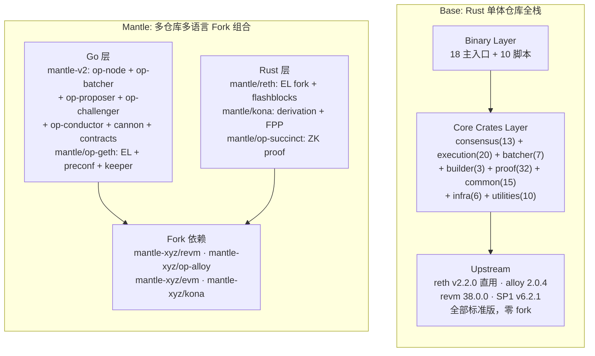

### B.1.2 Base Monorepo 分层架构

```mermaid
graph TB
    subgraph "Binary Layer (bin/)"
        B1["base-node"]
        B2["base-batcher"]
        B3["base-proposer"]
        B4["basectl"]
        B5["ingress-rpc"]
        B6["websocket-proxy"]
        B7["load-tester"]
        B8["zk-client"]
    end

    subgraph "Core Crates (crates/)"
        subgraph "consensus/ (13)"
            C1["derive (no_std)"]
            C2["engine"]
            C3["service"]
            C4["sources"]
            C5["gossip"]
            C6["safedb"]
        end
        subgraph "execution/ (20)"
            E1["evm"]
            E2["txpool"]
            E3["flashblocks"]
            E4["metering"]
            E5["trie"]
            E6["rpc"]
        end
        subgraph "batcher/ (7)"
            BA1["comp"]
            BA2["encoder"]
            BA3["core"]
            BA4["service"]
            BA5["source"]
            BA6["admin"]
        end
        subgraph "proof/ (32)"
            P1["client (no_std)"]
            P2["driver"]
            P3["executor"]
            P4["host"]
            P5["zk-client"]
            P6["nitro-enclave"]
        end
        subgraph "builder/ (3)"
            BU1["core"]
            BU2["flashblocks-service"]
        end
    end

    subgraph "Upstream Dependencies"
        U1["reth v2.2.0 (git tag)"]
        U2["alloy 2.0.4"]
        U3["revm 38.0.0"]
        U4["SP1 v6.2.1"]
    end

    B1 --> C3 & E1
    B2 --> BA4
    B8 --> P5
    C1 --> U1
    E1 --> U1 & U3
    P1 --> U1
```

### B.1.3 Mantle 五仓库架构

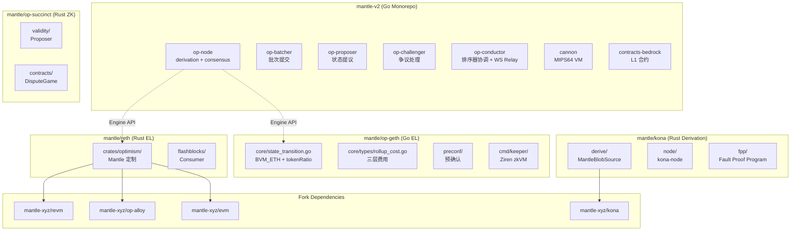

---

## B.2 上游依赖模型对比图

### B.2.1 Base: Pin & Extend 模型

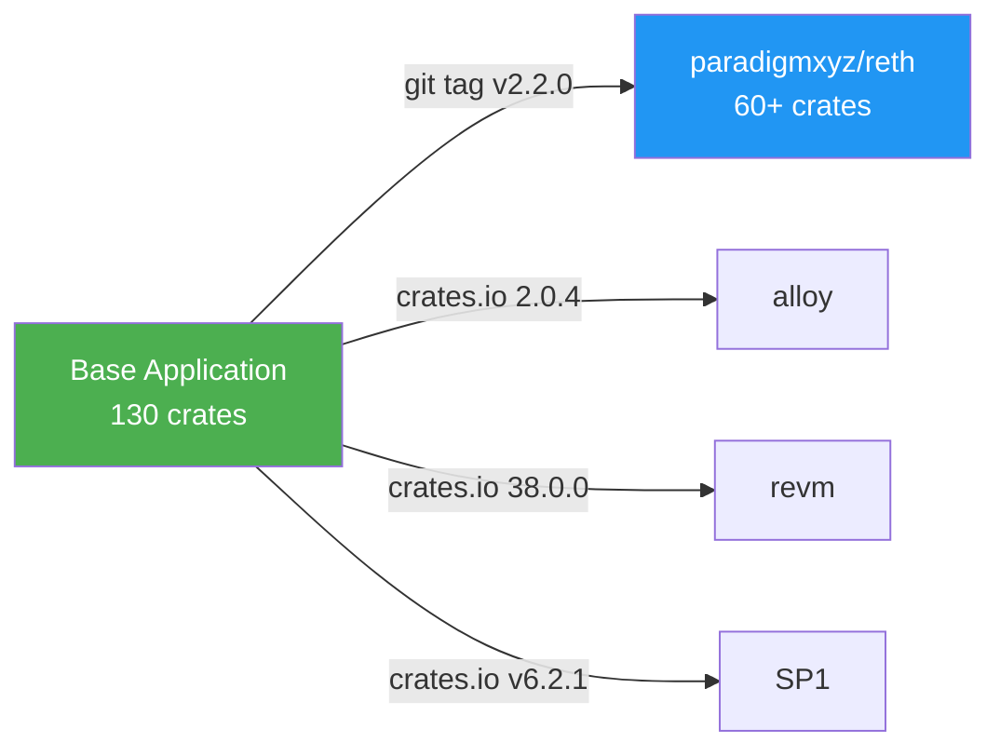

### B.2.2 Mantle: Fork & Modify 模型

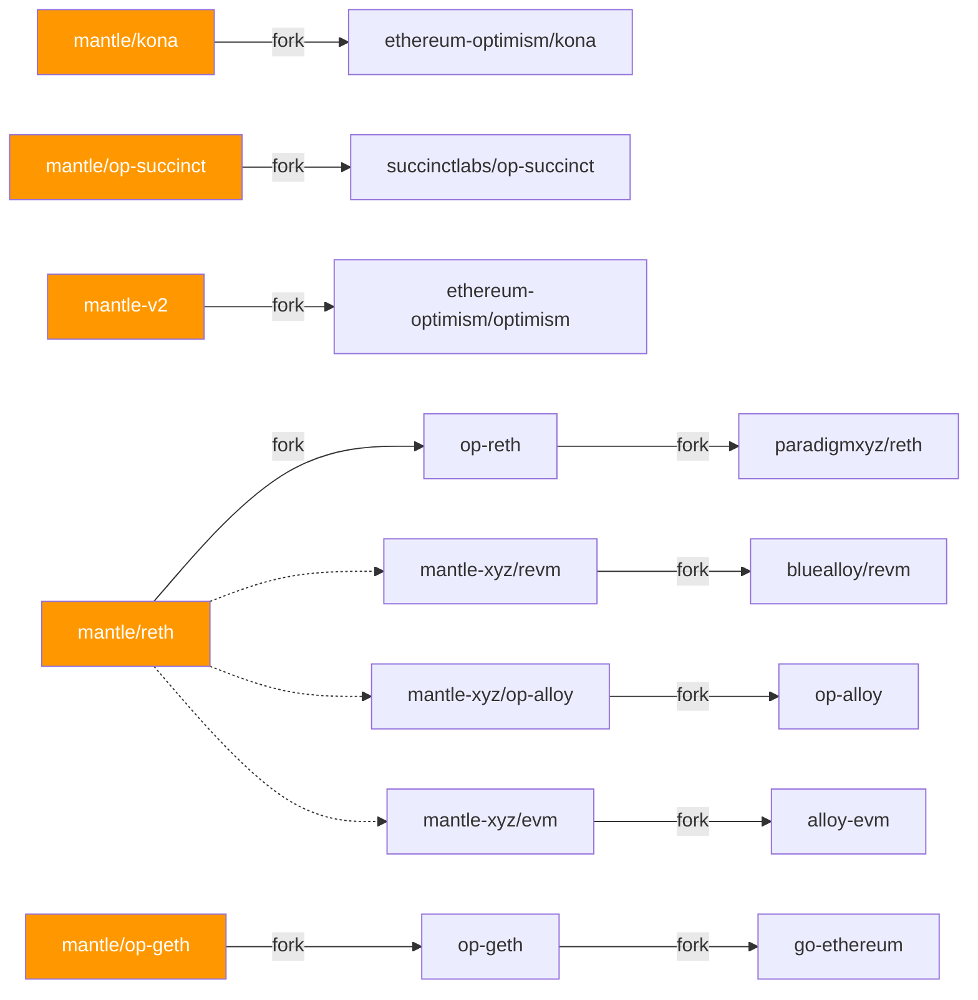

---

## B.3 场景流程图

### B.3.1 Batcher 提交流程对比

```mermaid
graph TD
    subgraph "Base Batcher (Rust)"
        B_SRC["HybridBlockSource<br/>WS + HTTP, 1s poll"]
        B_ENC["BatchEncoder<br/>Shadow + Brotli10 硬编码"]
        B_FRM["Frame 产出<br/>(DA-agnostic)"]
        B_PKG["提交队列<br/>Frame → Blob 打包"]
        B_TX["SimpleTxManager<br/>L1 提交"]
        B_DUP["256-block 去重"]
        B_SEL["biased select!<br/>Shutdown > Admin > L1 > Receipts > Blocks"]

        B_SRC --> B_ENC --> B_FRM --> B_PKG --> B_TX --> B_DUP
        B_SEL -.->|控制| B_SRC
    end

    subgraph "Mantle Batcher (Go)"
        M_SRC["HTTP Polling<br/>6s interval"]
        M_CH["Channel 层<br/>Zlib 默认"]
        M_BLOB["Blob 编码<br/>MantleBlobs/Blobs 耦合"]
        M_TX["SimpleTxManager<br/>L1 提交"]
        M_SEL["Go select<br/>随机优先级"]

        M_SRC --> M_CH --> M_BLOB --> M_TX
        M_SEL -.->|控制| M_SRC
    end
```

### B.3.2 Derivation Pipeline 路径对比

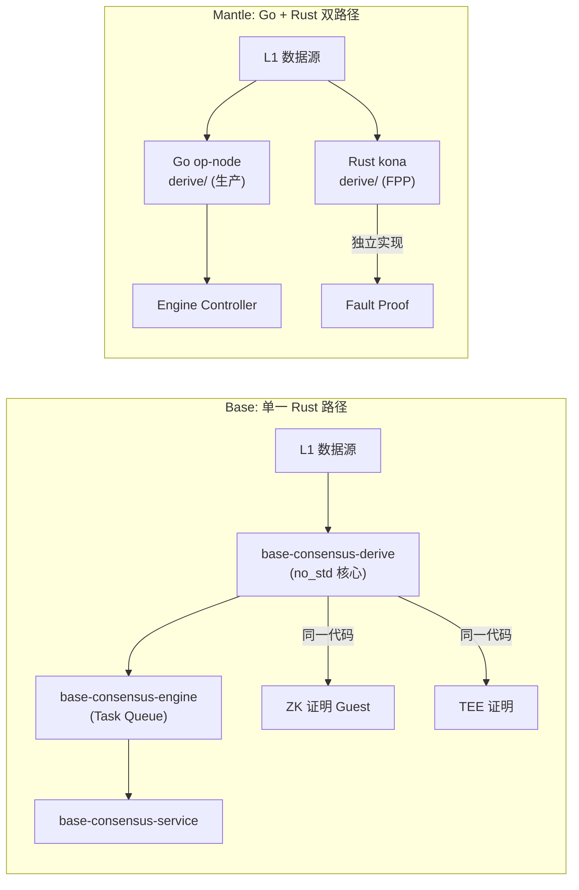

### B.3.3 证明系统路径对比

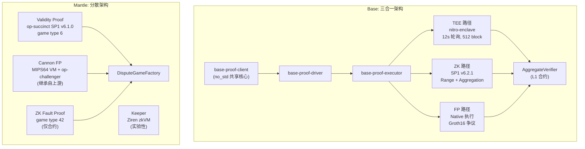

---

## B.4 Flashblocks 机制图

### B.4.1 Base Flashblocks 全栈

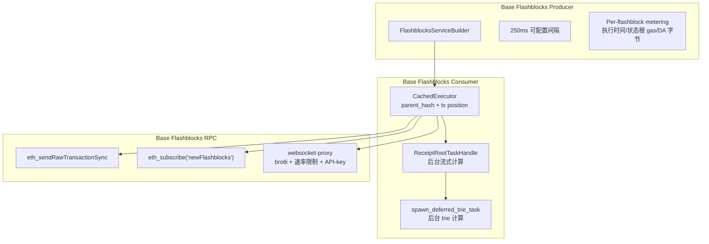

### B.4.2 Mantle Flashblocks 架构

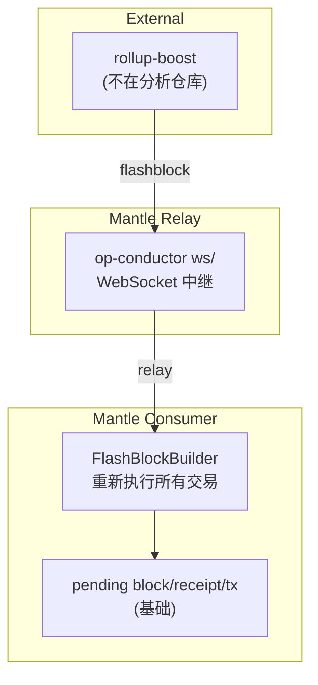

---

## B.5 实施路线图

### B.5.1 优化实施依赖关系图

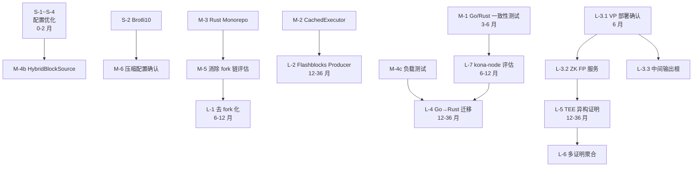

### B.5.2 分阶段时间线

```
月份  0───1───2───3───4───5───6───9───12───18───24───36
      ┌─────────┐
 P0   │ S-1~S-4 │  配置优化
      │ 0-2 月  │
      └─────────┘
            ┌───────────────────────────────┐
 P1         │ M-1~M-6                       │  架构微调
            │ 3-6 月                        │
            └───────────────────────────────┘
                              ┌──────────────────────────────┐
 P2                           │ L-3, L-7, L-9                │  能力扩展
                              │ 6-12 月                      │
                              └──────────────────────────────┘
                                          ┌─────────────────────────────┐
 P3                                       │ L-1, L-2, L-4, L-5, L-6    │  战略演进
                                          │ 12-36 月                   │
                                          └─────────────────────────────┘
```

---

## B.6 特性对比热力图

### B.6.1 功能覆盖对比

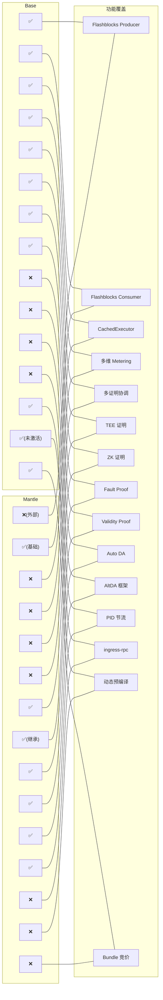

---

## B.7 升级路径对比图

### B.7.1 Base 升级流程


### B.7.2 Mantle 升级流程

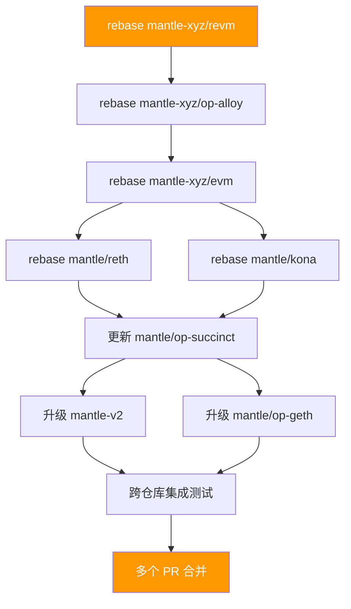

---

*本附录中的所有 Mermaid 图均基于本地代码分析，反映分析时点的代码结构。*
