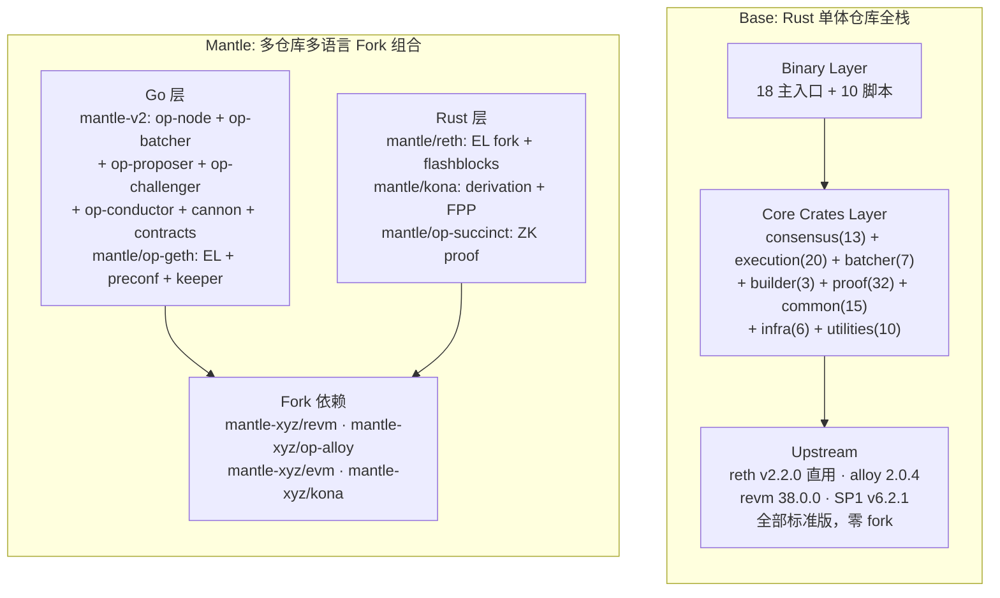
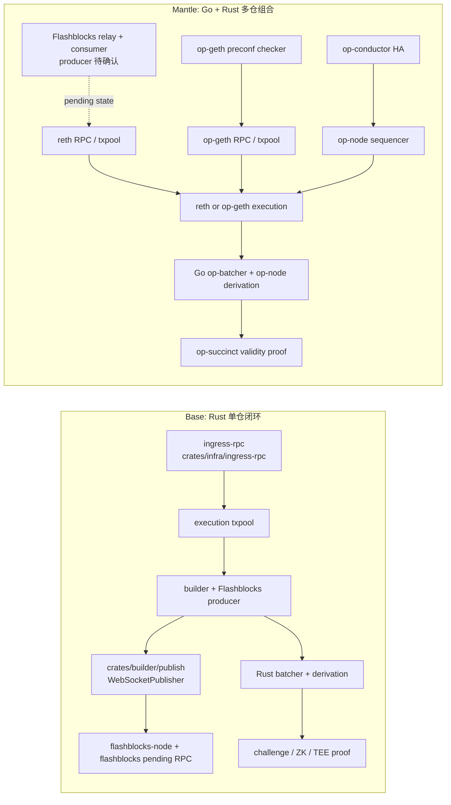
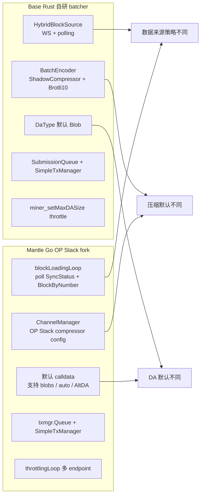
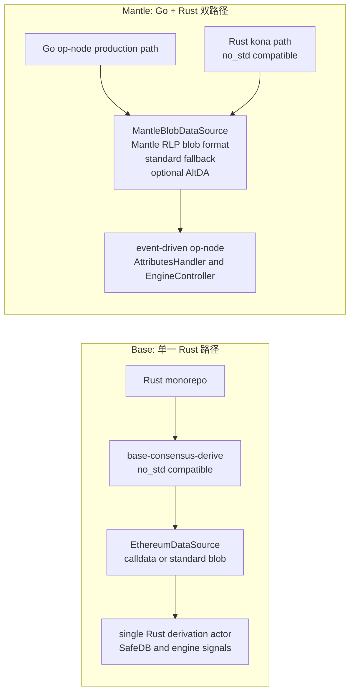
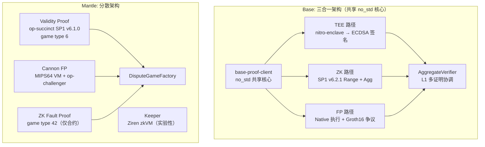
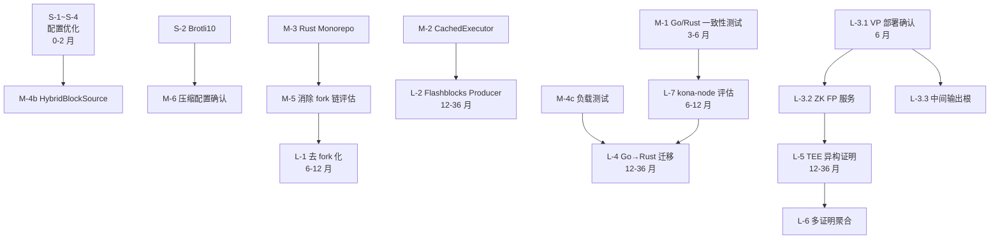

# Base vs Mantle Codebase 全面对比与优化建议

> **最终分析报告** — 面向 Mantle 内部工程团队
>
> 基于 base/base 与 mantle 五仓库（reth, kona, op-succinct, mantle-v2, op-geth）本地代码的深度分析
>
> 2026 年 5 月

---

## 目录

1. [Executive Summary](#1-executive-summary)
2. [研究限制与证据等级](#2-研究限制与证据等级)
3. [架构对比总览](#3-架构对比总览)
4. [场景化流程对比](#4-场景化流程对比)
5. [组件深度对比](#5-组件深度对比)
6. [Base 优势特性分析](#6-base-优势特性分析)
7. [Mantle 优化建议](#7-mantle-优化建议)
8. [结论与展望](#8-结论与展望)

---

## 1. Executive Summary

### 1.1 研究背景与目标

本报告是对 Base（Coinbase 的 L2）和 Mantle（Mantle Network）两条 OP Stack L2 链底层技术实现的全面对比分析。两者虽同属 OP Stack 生态，但在技术路线上做出了截然不同的选择：

- **Base**：采用 Rust 自研全栈 monorepo 路线，130 个 crate 构成单一仓库，直接依赖上游 reth（非 fork），全部 OP Stack 特定逻辑自行实现
- **Mantle**：采用 Fork 多项目组合路线，5 个主仓库 + 4 个依赖 fork = 9 个需同步管理的仓库，Go + Rust 双语言栈

本研究的目标是识别 Base 在设计和实现中的关键优势，并提出 Mantle 可借鉴的具体优化方向，服务于 Mantle 工程团队的技术决策。

### 1.2 核心发现

#### 已验证结论（基于本地代码分析的强证据）

1. **Base 的零 fork 上游策略显著降低了维护成本**：Base 直接 pin 上游 reth v2.2.0（git tag），升级仅需 bump tag + 适配 trait 变化，涉及 1 个仓库。Mantle 需在 9 个仓库中执行级联 rebase，其中 `state_transition.go`、`rollup_cost.go` 等核心文件的 fork diff 已达高 rebase 风险等级。这一结论可从两侧 `Cargo.toml` / `go.mod` 的依赖声明直接确认。

2. **Base 的 no_std 核心实现了"一份代码、三种证明"的复用**：`base-proof-client` 作为 no_std 程序可同时编译到 Native（Fault Proof）、SP1 zkVM（ZK Proof）和 AWS Nitro Enclave（TEE Proof）三种运行时。同理，`base-consensus-derive`（no_std，`#![cfg_attr(not(feature = "metrics"), no_std)]`）在共识节点和证明客户端间共享。Mantle 的 Go/Rust 双 derivation 实现（`op-node` Go 版 + `kona` Rust 版）是两套独立代码路径。

3. **Mantle 存在多项低成本即时配置优化**：Batcher 轮询间隔（Mantle 当前 `PollInterval=6s`，Base 为 `poll_interval=1s`）、默认压缩算法（Mantle CLI 默认 `derive.Zlib`，Base 硬编码 `Brotli10`）、冷启动恢复（Mantle `CheckRecentTxsDepth=0` 禁用，Base `MAX_CHECK_RECENT_TXS_DEPTH=128`）等参数差异可通过零代码变更修改。**注：收益量化（DA 成本降低幅度、延迟降低倍数）为基于压缩算法和轮询间隔的工程估算，非本地代码能直接证明的事实，实际收益需通过压测和生产数据验证。**

4. **两种技术路线各有不可替代的代码能力**：Base 仓库内包含 Flashblocks 完整栈（Producer + Consumer + CachedExecutor + Metering + WebSocket Proxy，共 5+ crate）、多证明协调框架（TEE + ZK + FP，共 32 crate）和多维资源计量（`crates/execution/metering/`）。Mantle 仓库内包含 Validity Proof 完整实现（`op-succinct/validity/`，经 Cantina 审计）、泛化 DA 注入（`OraclePipeline<O, L1, L2, DA>` 类型参数）、30+ Prometheus metrics 和 4 种 Throttling 策略（含 PID）。**注：以上均为代码能力，各功能的生产部署状态见 §2.3。**

#### 方向性建议（不计入已验证核心结论）

5. **Mantle 可评估扩大 Rust 路径使用范围**：合并 Rust 三仓库为 monorepo、消除 fork 链（`mantle/reth → op-reth → reth` 三层降为一层）、评估 kona-node 替代 op-node 作为生产路径，构成一条潜在的技术债务消解路线。**这不是已验证结论，而是基于维护成本对比推导出的候选方向；实际可行性取决于 MNT 双资产模型在 Rust trait 层的表达能力（需评估）和 kona-node 的生产稳定性（需 6+ 个月测试网验证）。**

### 1.3 关键建议摘要

| 优先级 | 时间范围 | 核心建议 | 预期收益 | 收益性质 |
|--------|----------|----------|----------|----------|
| P0 | 0-2 月 | Batcher 配置优化（轮询/压缩/冷启动） | DA 成本降低、提交延迟降低（具体幅度需压测验证） | 工程估算 |
| P1 | 3-6 月 | Go/Rust 一致性测试 + CachedExecutor + Rust Monorepo | 消除核心一致性风险 + 效率提升 | 代码分析确认 |
| P2 | 6-12 月 | 消除 fork 链 + kona-node 评估 + ZK FP 服务 | 技术债务大幅下降 | 代码分析确认 |
| P3 | 12-36 月 | Go→Rust 迁移评估 + 多证明框架 + 资源计量 | 架构层面能力提升 | 方向性判断 |

---

## 2. 研究限制与证据等级

### 2.1 研究范围

本分析基于以下本地代码快照：

| 仓库 | 版本/标签 | 说明 |
|------|-----------|------|
| `base/base` | 本地快照 | Rust monorepo，reth v2.2.0 依赖，SP1 v6.2.1 |
| `mantle/reth` | v1.9.3-mantle-arsia.1 | op-reth fork，Rust EL |
| `mantle/kona` | v2.2.3 | kona fork，Rust derivation/FPP |
| `mantle/op-succinct` | v3.4.1 fork | ZK 证明系统 fork |
| `mantle-v2` | 本地快照 | Go OP Stack monorepo fork |
| `mantle/op-geth` | 本地快照 | Go EL fork |

### 2.2 证据等级分类

本报告对每项结论标注以下证据等级：

| 等级 | 定义 | 示例 |
|------|------|------|
| **强证据** | 代码中明确存在且可确认为生产使用的功能或配置 | Base 的 `base-consensus-derive` 为 no_std crate，可在本地 `Cargo.toml` 中确认 |
| **中证据** | 代码中存在但部署/启用状态未确认 | Mantle 的 `preconf/` 子系统存在于 op-geth 中，但 `DefaultMinerConfig.EnablePreconfChecker = false` |
| **弱证据** | 基于代码结构推断，未直接验证 | Base 合约层的完整行为（仓库内仅有 Rust ABI 绑定，无 Solidity 源码） |

### 2.3 "代码能力" vs "生产部署"的关键区分

以下功能在代码中存在，但其生产部署状态需要额外确认：

| 功能 | 代码状态 | 部署状态 |
|------|----------|----------|
| **Base 多证明系统（TEE+ZK+FP）** | 强证据 — 完整的 20+ crate 实现 | 计划 2026-05-28 Azul 激活，尚未到计划时间 |
| **Base Flashblocks** | 强证据 — Producer + Consumer 全栈 | 代码中默认开启，生产部署细节未确认 |
| **Mantle Validity Proof** | 强证据 — op-succinct 完整实现 + Cantina 审计 | 据 Succinct 案例研究（2025-09-16）和 L2BEAT 已上线；具体链上地址未在本分析中确认 |
| **Mantle Preconfirmation** | 中证据 — op-geth 中完整子系统 | `EnablePreconfChecker = false`，生产启用状态待确认 |
| **Mantle EigenDA** | 弱证据 — 仅死代码引用 | 本地代码无 EigenDA 客户端实现 |
| **Base 动态预编译（Beryl）** | 强证据 — 代码完整 | Beryl 硬分叉尚未激活 |

### 2.4 无法在 Scoped Repos 内做同层对比的领域

| 领域 | 限制说明 |
|------|----------|
| **L1 合约（Solidity 源码）** | Base 仓库内仅有 Rust ABI 绑定（`sol!` 宏），无 Solidity 源码。生产合约源码仓库/路径未确认。因此合约层对比基于 ABI 绑定推断 vs Mantle 完整源码，不在同一层面 |
| **Rollup Boost / 外部 Builder** | Mantle 的 Flashblocks Producer 来自外部 `rollup-boost` 服务，不在分析仓库范围内 |
| **EigenDA** | 曾在 Everest 审计中提及，但本地代码无 EigenDA 客户端实现 |
| **运行时配置与部署拓扑** | 两者的生产环境配置（节点数量、region 分布、HA 架构）不在代码分析范围内 |

---

## 3. 架构对比总览

### 3.1 技术路线总览

**Base 路线 — "Rust 自研全栈 Monorepo"**

Base 选择了从零自建的路线。130 个 Rust crate 在单一仓库中，直接依赖上游 `paradigmxyz/reth v2.2.0`（60+ crates，通过 git tag 锁定），**不 fork** reth、kona、op-alloy、op-reth 中的任何一个。所有 OP Stack 特定逻辑（derivation、consensus、proof、batcher、builder）均自研。纯 Rust 技术栈，Rust edition 2024，MSRV 1.93。

**Mantle 路线 — "Fork 多项目 Go+Rust 组合"**

Mantle 选择了在成熟上游项目基础上添加定制的路线。5 个独立仓库 + 4 个额外依赖 fork，Go + Rust 双语言栈。在 OP Stack、reth、kona、op-succinct 等成熟项目基础上，通过添加式修改引入 Mantle 特有功能（MNT 双代币、Operator Fee、Flashblocks Consumer 等）。

### 3.2 组件映射表

| 功能模块 | Base 实现 | Mantle 实现 | 关键差异 | 证据路径 | 证据等级 |
|----------|----------|-------------|----------|----------|----------|
| **Execution Client** | `crates/execution/` (20 crates)，基于上游 reth v2.2.0 直用 | `mantle/reth` (fork of op-reth) + `mantle/op-geth` (fork of op-geth) | Base: 单一 Rust EL，零 fork；Mantle: 双 EL（Go+Rust），三层 fork 链 | Base: `crates/execution/evm/`, `Cargo.toml` reth git tag; Mantle: `mantle/reth/crates/optimism/`, `mantle/op-geth/core/state_transition.go` | 强 |
| **Derivation** | `crates/consensus/` (13 crates)，自研 `base-consensus-derive` (no_std) | `mantle-v2/op-node` (Go) + `mantle/kona` (Rust fork) | Base: 单路径 Rust no_std；Mantle: Go 生产 + Rust FPP 双路径 | Base: `crates/consensus/derive/src/pipeline/builder.rs`; Mantle Go: `mantle-v2/op-node/rollup/derive/pipeline.go`; Mantle Rust: `mantle/kona/crates/protocol/derive/` | 强 |
| **Batcher** | `crates/batcher/` (7 crates) + `bin/batcher/`，Rust 自研 | `mantle-v2/op-batcher/` (Go fork) + `kona/crates/batcher/comp/` (Rust 库) | Base: Rust 8 crate 模块化；Mantle: Go daemon + Rust 编码库（未运行时集成） | Base: `crates/batcher/core/src/driver.rs`, `crates/batcher/encoder/src/encoder.rs`; Mantle: `mantle-v2/op-batcher/batcher/` | 强 |
| **Builder / Flashblocks** | `crates/builder/` (3 crates) + `crates/execution/flashblocks*` (2 crates)，完整 Producer + Consumer | `mantle/reth: flashblocks/` (Consumer) + `mantle-v2/op-conductor: ws/` (Relay) | Base: 全链路自有；Mantle: 仅 Relay + Consumer，Producer 来自外部 rollup-boost | Base: `crates/builder/core/src/flashblocks/`, `crates/execution/flashblocks-node/`; Mantle: `mantle/reth/crates/optimism/flashblocks/`, `mantle-v2/op-conductor/rpc/ws/flashblocks_handler.go` | 强 |
| **证明系统** | `crates/proof/` (32 crates)，三合一：FP + ZK (SP1 v6.2.1) + TEE (Nitro) | Validity (op-succinct SP1 v6.1.0) + ZK FP (仅合约) + Cannon (继承自上游) | Base: 共享 no_std 核心三路径统一；Mantle: 多仓库多路径分散 | Base: `crates/proof/client/`, `crates/proof/driver/`, `crates/proof/host/`; Mantle: `mantle/op-succinct/validity/`, `mantle-v2/cannon/`, `mantle/kona/crates/proof/` | 强 |
| **合约层** | 仅 Rust ABI 绑定（`sol!` 宏），无 Solidity 源码 | `contracts-bedrock/` 完整 Solidity 源码（含 BVM_ETH、GasPriceOracle 等） | 两侧合约层不在同一层面，不可直接对比 | Base: `crates/proof/contracts/` (sol! 绑定); Mantle: `mantle-v2/packages/contracts-bedrock/` | 弱 |
| **DA** | 标准 EIP-4844 Blob | Mantle RLP 格式 + 标准 Blob 回退；AltDA 框架存在 | Base: 标准 OP；Mantle: 自定义 + 回退 + AltDA | Base: `crates/consensus/derive/src/sources/blobs.rs`; Mantle: `mantle-v2/op-node/rollup/derive/mantle_blob_source.go`, `mantle/kona/crates/protocol/derive/src/.../mantle_blob.rs` | 强 |

### 3.3 关键数字对比

| 维度 | Base | Mantle |
|------|------|--------|
| 仓库数量 | **1** | **5** (+ 4 依赖 fork = 9) |
| 编程语言 | **Rust only** | **Go + Rust** |
| Crate 总数 | **130** | reth ~200+ (fork 全量) + kona ~40+ + op-succinct ~15 + Go monorepo 多模块 |
| 上游 reth 依赖层数 | **1** (直接 git tag) | **3** (mantle/reth → op-reth → reth) |
| Fork 需 rebase 的仓库 | **0** | **9** |
| 证明路径 | **3** (FP + ZK + TEE) | **4** (Validity + Cannon + Keeper + ZK FP 合约) |
| no_std 支持 | consensus + proof + common 核心 | kona 部分 no_std |
| Flashblocks 完整度 | Producer + Consumer + Metering + WS Proxy | Consumer + Relay only |

### 3.4 架构差异总览图



### 3.5 上游依赖模型对比

Base 与 Mantle 在上游依赖管理上的差异，是两种技术路线最直接的体现：

**Base: Pin & Extend**
```
Base Application (130 crates)
  └── paradigmxyz/reth (git tag v2.2.0, 60+ crates)
  └── alloy (crates.io 2.0.4)
  └── revm (crates.io 38.0.0)
  └── SP1 (crates.io v6.2.1)
```
升级操作：修改 1 个 `Cargo.toml` 中的 git tag → 编译 → 修复 trait 变化 → 完成。涉及 1 个仓库，1 个 PR。

**Mantle: Fork & Modify**
```
mantle/reth → op-reth → paradigmxyz/reth     (3 层)
mantle/kona → ethereum-optimism/kona          (2 层)
mantle/op-succinct → succinctlabs/op-succinct (2 层)
mantle-v2 → ethereum-optimism/optimism        (2 层)
mantle/op-geth → ethereum-optimism/op-geth → ethereum/go-ethereum (3 层)
+ 4 个依赖 fork: revm, op-alloy, evm, kona
```
升级操作：rebase revm → rebase op-alloy → rebase evm → rebase reth/kona → 更新 op-succinct → 分别升级 mantle-v2/op-geth → 跨仓库集成测试。涉及最多 9 个仓库、多个 PR、大量合并冲突风险。

---

## 4. 场景化流程对比

### 4.1 L2 交易生命周期

**Base 流程**：用户交易通过 `ingress-rpc`（独立交易入口 + bundle 竞价）→ `BaseTransactionValidator`（支持 DA 估算的验证）→ `BaseOrdering` 排序 → `base-builder-core` 构建 Flashblocks（250ms 子块）→ `base-flashblocks` 消费端通过 `CachedExecutor` 高效执行 → `base-consensus-engine` 密封最终区块 → `websocket-proxy` 实时推送。

**Mantle 流程**：用户交易通过标准 RPC → op-geth 或 reth 的交易池（op-geth 含 preconf 验证，reth 含 MetaTx 拒绝）→ 外部 rollup-boost Producer 构建 → op-conductor Relay 转发 → reth Consumer 消费 Flashblocks（op-geth 无 Flashblocks 支持）→ op-node Engine API 驱动区块确认。



> 图源：WHI-445 L2 交易生命周期对比。完整的 Base 和 Mantle 独立流程图见 `appendix-diagrams.md` §B.1。

**关键差异**：

| 维度 | Base | Mantle |
|------|------|--------|
| 交易入口 | 独立 ingress-rpc + bundle 竞价 | 标准 RPC |
| Flashblocks 生产 | 自研 Builder，250ms 间隔 | 外部 rollup-boost（不在分析仓库） |
| Flashblocks 消费 | CachedExecutor 跳过重复执行 | 基础状态重建（无缓存优化） |
| 排序策略 | `BaseOrdering` + `TimestampOrdering` + DA 估算 | 标准 OP + preconf 白名单 |
| Pending 状态 | Flashblock-aware，丰富订阅 | reth opt-in 消费，op-geth 无支持 |

### 4.2 Batcher 批次提交流程

**Base 流程**：`HybridBlockSource`（WS + HTTP 混合）以 1s 间隔拉取 L2 区块 → `BatchEncoder` 使用 Shadow Compressor + Brotli10 硬编码编码 → Frame 产出（DA 无关）→ 提交队列层打包 Frames 到 Blob → `SimpleTxManager` 提交 L1 → 256-block 滑动窗口去重 → `biased select!` 确定性事件优先级（Shutdown > Admin > L1 Head > Receipts > Block Ingestion）。

**Mantle 流程**：HTTP polling 以 6s 间隔拉取 → Channel 层编码（Zlib 默认）→ Channel 层直接控制 Blob 编码格式（Pre-Arsia MantleBlobs RLP / Post-Arsia 标准）→ `SimpleTxManager` 提交 L1 → Go `select` 随机事件处理。



> 图源：WHI-446 Batcher 生命周期对比。完整的独立生命周期图见 `appendix-diagrams.md` §B.3.1。

**关键差异**：

| 维度 | Base | Mantle | 证据等级 |
|------|------|--------|----------|
| 轮询间隔 | 1s | 6s | 强 |
| 默认压缩 | Brotli10 硬编码 | Zlib CLI 默认 | 强 |
| Max Channel Duration | 2 L1 blocks (~24s) | 0 (无限制) | 强 |
| 默认 DA | Blob | Calldata | 强 |
| 数据源 | WS + HTTP 混合 | HTTP only | 强 |
| 去重 | 256-block 滑动窗口 | 无 | 强 |
| 编码器-DA 解耦 | Frame 产出与 Blob 打包分离 | Channel 层耦合 DA 格式 | 强 |
| 事件优先级 | `biased select!` 确定性 | Go `select` 随机 | 强 |

**设计哲学差异**：

Base 偏向 **"低延迟 > 压缩效率 > 灵活性"** — 激进超时、简单 DA、确定性事件处理。

Mantle 偏向 **"灵活性 > 压缩效率 > 低延迟"** — 宽松超时、多 DA 选项（Calldata/Blob/Auto/AltDA）、丰富配置（4 种节流策略）。

### 4.3 Derivation Pipeline 流程

**Base 流程**：`base-consensus-sources` L1 数据源 → `base-consensus-derive`（no_std 核心 Pipeline）→ `base-consensus-engine` 共识引擎（Task Queue 优先级堆）→ `base-consensus-service` 服务编排。Derivation 代码同时作为共识节点和 ZK 证明客户端的共享核心。

**Mantle 流程**：两条独立路径：
- **Go 生产路径**：`op-node/rollup/derive/mantle_pipeline.go` + `mantle_blob_source.go` + `mantle_system_config.go` → Engine API 事件驱动
- **Rust FPP/证明路径**：`kona/.../derive/DerivationPipeline` + `mantle_blob.rs` + `mantle_ethereum.rs` → Oracle-backed 证明执行



> *完整 Derivation Pipeline 路径对比图见 [附录 B §B.3.2](appendix-diagrams.md#b32-derivation-pipeline-路径对比)；详细 stage 构成和证据路径见 [WHI-447](../WHI-447_flowchart-derivation-pipeline/key-differences.md)。*

**关键差异**：

| 维度 | Base | Mantle | 证据等级 |
|------|------|--------|----------|
| 路径统一性 | 单一 Rust 路径（生产 = 证明） | Go + Rust 双路径（独立实现） | 强 |
| no_std 复用 | 生产和证明共享同一 pipeline | 证明专用路径（OraclePipeline） | 强 |
| 一致性风险 | 低（单路径） | 中高（双路径需同步） | 强 |
| Engine 交互 | Task Queue 优先级堆 | 事件驱动 Controller（路径较长） | 强 |
| DA Blob 格式 | 标准 OP codec | Mantle RLP + 标准回退（sticky fallback） | 强 |
| 新 fork 开发成本 | 改一次代码 | 改两次（Go + Rust） | 强 |

### 4.4 证明系统流程

**Base 流程**：三种证明路径共享 no_std 核心（`base-proof-client` → `base-proof-driver` → `base-proof-executor`）：

1. **TEE 路径**：`nitro-enclave` 运行 `base-proof-client` → ECDSA 签名 → L1 `AggregateVerifier` 验证。轮询间隔 12s，512 block 间隔，快速 soft finality。
2. **ZK 路径**：SP1 zkVM 运行 `base-zk-client`（编译自同一 `base-proof-client`）→ Range Proof + Aggregation Proof → L1 验证。默认 Plonk 验证。
3. **Fault Proof 路径**：`base-proof-host` Native 执行 → Challenger 使用 Groth16 争议。

**Mantle 流程**：多路径分散架构：

1. **Validity Proof**（完整）：`op-succinct/validity/` Rust Proposer → SP1 v6.1.0 Range + Aggregation → `OPSuccinctDisputeGame` (game type 6)。Groth16 默认。
2. **Cannon Fault Proof**（继承自上游）：`mantle-v2/cannon/` MIPS64 VM + `op-challenger/` Go Agent + `kona` FPP。代码存在但未部署。
3. **ZK Fault Proof**（仅合约）：`OPSuccinctFaultDisputeGame` (game type 42) 合约完整，Rust 服务层已从 workspace 移除。
4. **Keeper**（实验性）：`op-geth/cmd/keeper/` Ziren zkVM，MIPS ISA。



> *Base 完整多证明流程图见 [WHI-448 base-multi-proof-flowchart](../WHI-448_flowchart-proof-system/base-multi-proof-flowchart.md)；Mantle 完整证明流程图见 [WHI-448 mantle-proof-flowchart](../WHI-448_flowchart-proof-system/mantle-proof-flowchart.md)；综合路径对比图见 [附录 B §B.3.3](appendix-diagrams.md#b33-证明系统路径对比)。*

**关键差异**：

| 维度 | Base | Mantle | 证据等级 |
|------|------|--------|----------|
| 证明路径数 | 3（统一架构） | 4（分散架构） | 强 |
| no_std 核心复用 | 同一 client 跨 3 种运行时 | 仅 SP1 程序内部共享 | 强 |
| 异构安全假设 | TEE（硬件）+ ZK（数学）+ FP（经济） | ZK（数学）单一 | 强 |
| 多证明协调 | AggregateVerifier 已实现 | 未实现 | 强 |
| 分层 Finality | TEE 快速 → ZK 高安全 → 完全 | 单一 ZK Validity | 强 |
| 部署状态 | 计划 2026-05-28 激活 | Validity Proof 据公开资料已上线 | 中 |

### 4.5 补充场景

#### 4.5.1 Flashblocks 机制

```mermaid
flowchart TB
    subgraph Base["Base: producer + consumer 全栈"]
        BPool["交易池 / Payload attributes"]
        BBuilder["FlashblocksServiceBuilder<br/>250ms 可配置间隔"]
        BPublish["WebSocketPublisher<br/>broadcast + ring buffer"]
        BConsumer["FlashblocksSubscriber"]
        BState["CachedExecutor<br/>跳过已执行 tx"]
        BRpc["RPC: pending block/receipt/call<br/>sendRawTransactionSync<br/>newFlashblocks 订阅"]
        BPool --> BBuilder --> BPublish --> BConsumer --> BState --> BRpc
    end

    subgraph Mantle["Mantle: relay + consumer"]
        MProducer["外部 rollup-boost<br/>（不在分析仓库）"]
        MConductor["op-conductor<br/>WebSocket 中继"]
        MReth["FlashBlockBuilder<br/>重新执行所有交易"]
        MRpc2["RPC: pending block/receipt<br/>sendRawTransactionSync"]
        MProducer --> MConductor --> MReth --> MRpc2
    end
```



> *完整 Flashblocks 机制流程图（含 canonical reconciliation 和断线重连）见 [WHI-449 flashblocks-comparison](../WHI-449_flowchart-supplementary-scenarios/flashblocks-comparison.md)；简化架构图见 [附录 B §B.4](appendix-diagrams.md#b4-flashblocks-机制图)。*

| 维度 | Base | Mantle | 证据等级 |
|------|------|--------|----------|
| **生成端** | 自研 `FlashblocksServiceBuilder`，250ms 可配置间隔 | 外部 rollup-boost（不在分析仓库） | 强 |
| **消费端** | `CachedExecutor` 跳过已执行 tx + 后台 trie 计算 + 流式 receipt root | `FlashBlockBuilder` 重新执行所有交易 | 强 |
| **RPC 可见性** | `eth_sendRawTransactionSync`、`eth_subscribe("newFlashblocks")`、pending tag 支持 | pending block/receipt/tx（基础） | 强 |
| **资源预算** | per-flashblock 执行时间/状态根 gas/DA 字节 | 无 | 强 |
| **生产配置** | Producer 默认开启 | 关闭（opt-in），仅 reth 支持 | 中 |
| **op-geth 支持** | N/A | 无 Flashblocks 支持 | 强 |

#### 4.5.2 节点同步与 L1 Reorg 处理

**SafeDB 语义差异**：Base 的 `SafeDB` 使用 redb（Rust B-tree 引擎），其 `reset(number)` 操作删除所有 > number 的记录后，写入一条 `number → synthetic_anchor` 合成锚点，确保重启后 `get_last()` 返回正确的最新 safe head，即使所有原始记录都被删除。Mantle Go 使用 Pebble（LSM-tree），其 `reset` 操作策略不同——重写首个被删除的已有 key，但在 reset 到第一条记录之前时不写入锚点。这意味着在极端 reorg 场景（reset 到 genesis 附近）下，两者的 `get_last()` 返回值可能不同。

**L1 Reorg 传播**：Base 的 `DerivationActor` 通过 pipeline step 检测 L1 reorg（pipeline 返回 `StepResult::Reset`），随后清理 SafeDB 中 reset 点之后的所有记录并重新 derive。Mantle Go 的 `PipelineDeriver` 通过事件链传播 reset 信号到 `EngineController`，后者调用 `Rewind` 回滚 unsafe head 到 safe head，并通知 `FinalityData` 清理。两种实现的 reorg 恢复最终结果一致，但中间状态管理路径不同。

**Gossip 层**：Base 有独立的 `base-consensus-gossip`（`crates/consensus/gossip/`）和 `base-consensus-peers`（`crates/consensus/peers/`）crate 管理 P2P 区块分发和对等节点发现。Mantle 的 P2P 层继承自 OP Stack 上游的 Go 实现（`op-node/p2p/`）。

#### 4.5.3 升级机制

**Base 的 1:1 映射模型**：Base 使用 OP Stack 标准硬分叉时间戳（Bedrock、Regolith、Canyon、Delta、Ecotone、Fjord、Granite、Holocene、Isthmus），每个上游 fork 对应一个独立的激活时间戳。在此基础上，Base 自有的 fork（Jovian、Azul、Beryl）作为额外时间戳添加，不影响上游 fork 的 1:1 对应关系。这使得 Base 可以独立控制自有特性的激活节奏，同时保持与上游完全同步。

**Mantle 的 N:1 映射模型**：Mantle 使用压缩式映射——`Skadi` 一个时间戳同时激活 Regolith 到 Isthmus 的所有上游 fork，`Arsia` 对应 Jovian。这种设计减少了管理复杂度（只需维护少量 fork 时间戳），但增加了上游合并成本：每次新的上游 fork 发布时，Mantle 需要决定是独立激活还是打包到下一个 Mantle fork 中。N:1 映射还增加了在 hardfork 边界上调试问题的难度，因为多个行为变化在同一时间戳生效。

两者对 Arsia/Isthmus（Jovian）硬分叉时间线的对齐表明 OP Stack 生态正在向统一升级节奏收敛，这对 Mantle 的 N:1 策略构成长期压力——如果上游加速发布 fork，打包延迟可能导致功能落后。

---

## 5. 组件深度对比

### 5.1 Execution Client

#### 5.1.1 上游关系策略

Base 通过 reth 的 trait 系统（`ConfigureEvm`、`EvmFactory`、`EngineValidatorBuilder` 等）实现所有 rollup-specific 逻辑，20 个独立的 `crates/execution/` 子 crate 与上游代码有清晰的物理隔离，上游代码修改量为 0。

Mantle reth 的定制集中在 `crates/optimism/` 下（约 15 个修改文件），通过新增 `mantle.rs`、`mantle_ext.rs`、`mantle_hardforks/` 等文件添加 Mantle 特有逻辑。Mantle op-geth 则深度修改了 30+ 核心文件（`core/state_transition.go`、`core/types/rollup_cost.go` 等），rebase 冲突风险高。

| 维度 | Base | Mantle reth | Mantle op-geth | 证据等级 |
|------|------|-------------|----------------|----------|
| 上游代码修改 | 0 | 中（约 15 文件） | 高（30+ 文件） | 强 |
| 依赖库 fork | 0 | 3 (revm, alloy-evm, op-alloy) | 0（直接修改源码） | 强 |
| 升级成本 | 低 (bump tag) | 高 (5 仓库级联 rebase) | 高 (大量合并冲突) | 强 |
| 代码边界 | 清晰（独立 crate 目录） | 中（散布 + 新增 crate） | 模糊（嵌入核心路径） | 强 |

#### 5.1.2 EVM 定制

**Base 的 trait 组合模式**：Base 通过 `BaseEvmConfig<ChainSpec, N, R, EvmFactory>` 实现 `ConfigureEvm` 和 `ConfigureEngineEvm<ExecutionData>` trait，自定义类型链为 `BaseSpecId → BaseHaltReason → BaseTransaction<TxEnv> → BaseHandler → BaseEvm`。`BaseEvmFactory` 使用 `PrecompilesMap`（哈希表分发）而非传统的 spec-branch dispatch，支持运行时动态插入预编译。所有 EVM 定制通过 trait 组合完成，不修改 revm 或 reth 源码。

**Mantle reth 的 fork 注入模式**：`OpEvmConfig` 加上 `MantleHardforks` trait bound，所有 `evm_env*` 方法路由到 `for_mantle(MantleEvmEnvInput)`（`crates/optimism/evm/src/mantle.rs`），由 `revm_spec_at_timestamp` 选择 spec。Spec 映射在 `crates/mantle-hardforks/src/lib.rs` 中定义：Arsia → `OpSpecId::ARSIA`（Mantle revm fork 新增），Limb → `OpSpecId::OSAKA`，Skadi → `OpSpecId::ISTHMUS`。关键区别：Mantle 需要 fork revm 来添加 `OpSpecId::ARSIA`，而 Base 在 revm 的标准 spec 系统内完成所有定制。

**Mantle op-geth 的直接修改模式**：`core/vm/contracts.go` 中硬编码了 4 套 Mantle 特有预编译表（Everest/Skadi/Limb/Arsia），`activePrecompiledContracts(rules)` 按 Arsia → Limb → Skadi → Everest → upstream 顺序 dispatch。这是最侵入性的定制方式，每次预编译变更都需要修改核心代码。

**预编译对比**：

| 分叉/版本 | Base | Mantle |
|-----------|------|--------|
| P256 预编译 | Fjord 标准 EIP-7212 `P256VERIFY` | Everest 私有 `p256VerifyEverest` at `0x100`，Limb 后切换为标准实现 |
| BLS12-381 | Isthmus Prague 标准集（带修改） | Skadi Prague 标准集 |
| 动态预编译 | Beryl `install()` + `activation_admin_address` | 无 |
| 分发机制 | `PrecompilesMap` 哈希表（运行时可插入） | revm fork 编译时绑定 / op-geth 硬编码表 |

Beryl 的动态预编译设计值得特别关注——通过 `B20Factory`、`PolicyRegistry`、`ActivationRegistry` 实现运行时预编译注册，使得新预编译无需硬分叉即可上线。这是 Base 技术路线中最具前瞻性的设计之一，虽然 Beryl 硬分叉尚未激活。

#### 5.1.3 Gas 模型与费用

**Base 费用模型**：标准 OP Stack L1 data fee 模型（Ecotone → Fjord → Jovian 演进），以 ETH 计价，无额外转换。Gas 模型扩展集中在 `crates/execution/metering/` 中，实现超越 gas 的多维度资源计量：gas 使用、DA bytes、state-root 计算时间、opcode 计数。`MeteringCollector` 通过 EVM `Inspector` 收集数据，`PriorityFeeEstimator` 基于多资源滚动估算提供优先费建议。这种多维计量在 per-flashblock 资源预算分配中尤为关键——Builder 可以同时控制执行时间、状态根 gas 和 DA 字节三个维度的预算。

**Mantle 费用模型**：显著更复杂的三层结构：

1. **L2 执行费**：标准 gas 费用，但以 MNT（非 ETH）计价
2. **L1 数据费**：标准 OP Stack 公式（Bedrock/Ecotone/Fjord 演进）× `tokenRatio`（MNT/ETH 汇率缩放）
3. **Operator Fee**：Arsia 后新增的 `operatorFeeScalar × gas / operatorFeeConstant` 附加费

`tokenRatio` 从 `GasOracleAddr`（`0x420...000F`）的 slot 0 读取，Pre-Arsia 使用 `tokenRatio / Decimals` 格式，Post-Arsia 简化为 `currentTokenRatio` 直接乘法。这意味着每次 L1 data fee 计算都需要额外的状态读取和乘法运算。

**BVM_ETH 双代币系统**深度嵌入 op-geth 的 `core/state_transition.go`：交易执行前从用户账户扣除 MNT gas fee，同时操作 BVM_ETH 合约状态完成 ETH value transfer。退款逻辑也需要同步处理两种资产。这种 state-level 的双资产操作是 Mantle 技术栈中最具结构性约束的特性，任何架构迁移（如 op-geth → reth）都必须首先解决 MNT 在新架构中的完整表达——当前 reth 的 `EvmFactory` trait 假设单一原生代币。

#### 5.1.4 状态管理

**Base FP 窗口 Trie 存储**（`crates/execution/trie/`）：Base 构建了一个独立于 reth 通用 trie 的专用存储子系统，包含完整的双后端架构：

- **MDBX 后端**：`MdbxProofsStorage` + `MdbxBatchSession` + 专用 account/storage/trie cursor
- **内存后端**：`InMemoryProofsStorage` + `InMemoryBatchSession` + 对应 cursor 集
- **API 层**：`BaseProofsBatchSession`、`BaseProofsBatchStore`、`BaseProofsInitialStateStore` 提供统一接口
- **裁剪器**：`BaseProofStoragePruner` / `BaseProofStoragePrunerTask` 按 FP 窗口边界裁剪旧数据，与 reth 全局 pruning 独立运行
- **Cursor 工厂**：`BaseProofsHashedAccountCursorFactory` / `BaseProofsTrieCursorFactory` 等支持高效遍历

设计目的是将 FP 窗口内的 trie 数据与 reth 通用存储分离，实现：高效的状态证明查询（无需扫描整个 trie）、独立的裁剪策略（按 FP 窗口而非全局 pruning）、按场景选择 MDBX 或内存后端。此外，`spawn_deferred_trie_task` 实现后台 trie 计算，验证可立即返回而无需等待 trie 完成。Builder 开启 `reth-revm = { features = ["witness"] }` 支持 witness 收集。

**Base 交易池栈**（`crates/execution/txpool/`）：Base 构建了 4 个 crate 组成的完整交易池栈——核心 txpool（`BaseTransactionValidator` + `BaseOrdering` + `BundleTransaction`）、txpool-rpc（独立 RPC 表面）、txpool-tracing（可观测性）、tx-forwarding（交易转发）。`BaseTransactionValidator` 集成 `estimated_da_size` DA 大小估算，`BaseOrdering` 实现 DA 成本感知排序。`BundleTransaction` 支持私有 mempool 和 Builder API。

**Mantle 状态管理**：reth 使用上游默认的 MDBX 存储，op-geth 使用 Pebble/LevelDB（默认新库为 Pebble）。两者均无专用 trie 存储或 FP 窗口优化。交易池使用上游标准实现，reth 通过 `MetaTxValidator` 拒绝 meta-transaction 类型（op-geth 中 MetaTx 通过 `TxMeta` 类型标识后被交易池过滤）。

### 5.2 Batcher

#### 5.2.1 架构设计

**Base 的 Frame-DA 解耦架构**：8 个独立 crate 的职责边界非常清晰：

- **comp**（`BatchComposer`）：Block → SingleBatch 转换，不涉及压缩
- **encoder**（`BatchEncoder`）：压缩 + Channel 管理 + Frame 产出（DA-agnostic）
- **core**：提交队列，Frame → Blob 打包在此层完成
- **service**：服务编排，`biased select!` 确定性事件优先级（Shutdown > Admin > L1 > Receipts > Blocks）
- **source**（`HybridBlockSource`）：WS + HTTP 混合数据源，256-block `(number, hash)` 去重窗口
- **blobs**：Blob 编码专用
- **admin**：8 个 RPC 端点（start/stop/flush/status/setLogLevel 等）
- **binary**：可执行文件入口

关键架构决策：encoder 产出 DA-agnostic frames，blob 打包在 core 提交队列层完成，两层之间通过 frame 接口解耦。这意味着切换 DA 策略（如从 blob 到 calldata）不需要修改压缩和 channel 逻辑。

**Mantle 的 Channel-DA 耦合架构**：Go op-batcher 中，`NextTxData()` 在 channel 层直接决定 frame 提取数量（Calldata 1 frame/tx，Blob/Auto 6 frame/tx）并调用 `MantleBlobs()` 或 `Blobs()` 编码。这导致 channel 逻辑需要感知最终 DA 类型。Kona comp 库（`mantle/kona/crates/batcher/`）作为独立 Rust crate 存在，包含 `VariantCompressor` 等组件，但与 Go op-batcher 之间无运行时集成——目前仅服务于 Rust batcher 的未来可能。

#### 5.2.2 提交策略

| 参数 | Base | Mantle | 影响 | 证据等级 |
|------|------|--------|------|----------|
| Poll Interval | **1s** | **6s** | Base 轮询更频繁；实际延迟改善需压测 | 强 |
| Max Channel Duration | **2 L1 blocks** | **0 (无限制)** | Base 偏向低延迟 | 强 |
| 默认 DA | **Blob** | **Calldata** | Blob 通常更经济 | 强 |
| 默认压缩 | **Brotli10** | **Zlib** | Brotli10 通常压缩率更高；Mantle 实际收益需回放验证 | 强 |
| 节流策略 | Off/Step/Linear | Step/Linear/Quadratic/**PID** | Mantle 更丰富 | 强 |
| 节流时强制 Blob | 是 | Auto 模式偏向 blob | Base 更明确 | 强 |

#### 5.2.3 Mantle Batcher 优势

Mantle batcher 在以下方面优于 Base：
- **Prometheus metrics** 更丰富（~30+ vs ~10+），含 PID 控制器指标
- **节流策略** 更多样（4 种 vs 3 种），PID 控制器提供自适应能力
- **Auto DA 模式** 支持每 10 秒动态 blob/calldata 切换
- **AltDA 框架** 现成可用，为外部 DA 提供商预留扩展

### 5.3 Derivation Pipeline

#### 5.3.1 路径统一性

这是两种技术路线差异最直接的体现。Base 的 `base-consensus-derive`（no_std，`#![cfg_attr(not(feature = "metrics"), no_std)]`）同时服务两种运行时：

- **共识节点（在线模式）**：`OnlinePipeline` + std RPC provider，作为 `base-consensus-service` 中 `DerivationActor` 的核心驱动
- **ZK 证明（离线模式）**：oracle-backed provider，编译到 SP1 zkVM 作为 guest 程序

Pipeline stage 顺序由 `PipelineBuilder` 组合：`PollingTraversal → L1Retrieval → FrameQueue → ChannelProvider → ChannelReader → BatchStream → BatchProvider → AttributesQueue`。新 hardfork 只需新增一个 upgrade module 并修改 `StatefulAttributesBuilder`——例如 Ecotone/Fjord/Isthmus/Jovian 各自的 upgrade deposit tx 只需在此处添加，即可同时在线上线下路径生效。

Mantle 的双路径设计则需要在两处独立维护：

- **Go 生产路径**：`op-node/rollup/derive/` 中的 stage 顺序为 `L1Traversal → DataSourceFactory → L1Retrieval → FrameQueue → ChannelMux → ChannelInReader → BatchMux → AttributesQueue`，多出 `DataSourceFactory`、`ChannelMux`、`BatchMux` 和事件调度层
- **Rust FPP 路径**：`kona/.../derive/` 中的 stage 顺序与 Base 接近，但通过 `OraclePipeline<O, L1, L2, DA>` 实现泛化 DA 注入

例如 Arsia 硬分叉的 7 个 upgrade deposit tx 需在 Go（`mantle_pipeline.go`）和 Rust（`kona` 升级模块）中各实现一遍。`MantleBlobSource` 的 `mantle_format_failed` toggle 语义需手动对齐 Go `blobToggle()` 行为——一旦 sticky fallback 逻辑在某一侧有微妙差异，就会导致两条路径 derive 出不同的 L2 状态。

#### 5.3.2 Engine 交互模型

**Base task queue 模式**：`base-consensus-engine` 将所有 engine 操作抽象为带优先级的 task：`Seal(4) > Insert(3) > Consolidate(2) > Finalize(1)`。高优先级 task 抢占低优先级，保证关键路径（如 sealing 新 block）不被批量 insert 阻塞。`Engine::build()` 提供绕过 queue 的直接 FCU 调用，为 sequencer 提供低延迟路径。状态更新通过 `watch::Sender` 广播不可变快照，下游消费者无锁读取。`EngineClient` 通过 HTTP/JWT 调用 Engine API，支持 `forkchoiceUpdated` V2/V3、`newPayload` V2/V3/V4、`getPayload` V2/V3/V4 全版本矩阵。

**Mantle Go 事件驱动模式**：`EngineController` 以事件处理器接收 unsafe、local safe、payload、forkchoice、reset 等事件，通过 `TryUpdatePendingSafe` → `TryUpdateLocalSafe` → `PromoteSafe` → `PromoteFinalized` 链式推进状态。事件从 `PipelineDeriver` 经过 `AttributesHandler` 传递到 `EngineController`，路径较长且状态分散在多个组件中。这种设计继承自 OP Stack 上游，保留了 Go 事件链的可观测性优势——每个事件处理环节可独立追踪和调试。

**对比**：Base 的 task queue 路径更短（从 derivation 到 engine 更新只经过一层 queue），但调试需理解优先级抢占语义。Mantle 的事件链路径更长但每步可独立监控，更适合复杂的 incident response 场景。

#### 5.3.3 DA 注入模式

**Mantle kona 的泛型 DA 设计**：`OraclePipeline<O, L1, L2, DA>` 使用 DA 作为类型参数，`MantleEthereumDataSource` 通过实现 `DataAvailabilityProvider` trait 注入自定义 DA 逻辑，无需 fork pipeline 核心代码。`op-succinct` 中的 `WitnessExecutor` 通过一行 `type DA = MantleEthereumDataSource` 类型别名即可完成 DA 切换。这是 Mantle fork 策略的成功案例——通过上游预留的泛型接缝，以最小侵入性引入自定义功能。

值得注意的是，kona 的 `providers-alloy` online pipeline 当前构造的是标准 `EthereumDataSource`（而非 `MantleEthereumDataSource`），这意味着 Mantle 的自定义 DA source 目前仅在 proof/offline 路径中使用。若 kona-node 要作为 Mantle 的生产节点，需要在 online pipeline 中也切换到 Mantle DA source。

**Base 的标准 DA 模式**：`EthereumDataSource` 在 Ecotone 前走 calldata，之后走标准 blob（EIP-4844），calldata/blob 都按 batch inbox 和 batcher signer 过滤。设计更简洁但缺乏 DA 泛化能力——未来若需接入 AltDA 方案需要额外开发。

### 5.4 证明系统

#### 5.4.1 架构哲学

**Base 三合一架构**围绕共享 no_std 核心构建：

- **共享层**：`base-proof-client`（no_std 入口）→ `base-proof-driver`（derivation 驱动）→ `base-proof-executor`（状态执行）→ `base-proof-primitives`（原语定义）。核心证明逻辑编写一次。
- **TEE 运行时**：`base-proof-client` 编译到 AWS Nitro Enclave（`bin/prover/nitro-enclave`），通过 RISC Zero attestation 产生 ECDSA 签名。`nitro-host` 负责 preimage oracle 和 enclave 通信。轮询间隔 12s、512 block 间隔、`INTERMEDIATE_BLOCK_INTERVAL` 默认 512 用于中间输出根。
- **ZK 运行时**：`base-zk-client` 将同一 `base-proof-client` 编译到 SP1 v6.2.1 zkVM。Range program 处理单个 block range，Aggregation program 验证多个 range proof。ZK prover service 支持 cluster/network/dry-run 三种后端。
- **Native 运行时**：`base-proof-host` 在本地运行完整 proof execution，用于 Fault Proof 场景。Challenger 使用 Groth16 在 L1 争议。

Proposer 工作流程为：PLAN（扫描 anchor → target ranges）→ PROVE（当前提交路径预期 TEE 结果，ZK 结果返回但在 submit 验证中被拒绝——暗示 ZK 路径仍在集成中）→ SUBMIT（顺序提交到 `DisputeGameFactory.createWithInitData`）。

**Mantle 分散架构**：证明系统分散在 3 个仓库的 4 条路径中：

- **Validity Proof**（`op-succinct/validity/`）：唯一完整可运行路径。Rust `ValidityProposer` 管理 range request 和 aggregation，SP1 v6.1.0 Runtime，Groth16 默认验证。合约侧 `OPSuccinctDisputeGame`（game type 6）和 `OPSuccinctL2OutputOracle` 处理链上验证。经 Cantina 审计。
- **Cannon FP**（`mantle-v2/cannon/`）：MIPS64 VM + `op-challenger` Go Agent + kona FPP，代码从上游继承但未发现 Mantle 定制，部署状态未确认。
- **ZK Fault Proof**（`op-succinct/contracts/`）：`OPSuccinctFaultDisputeGame`（game type 42）合约完整（`challenge()` bond → `prove()` SP1 verifier → `resolve()`），但 Rust 服务层已从 workspace 移除，当前无法作为完整路径运行。
- **Keeper**（`op-geth/cmd/keeper/`）：Ziren zkVM，MIPS ISA，实验性质。

#### 5.4.2 安全模型

| 维度 | Base | Mantle |
|------|------|--------|
| 安全冗余度 | 三重（TEE + ZK + FP） | 单一（ZK Validity） |
| 安全假设类型 | 异构（硬件/数学/经济） | 同构（数学） |
| Proposer 准入 | 开放（TEE 注册后） | 白名单 + fallback |
| Challenger 准入 | 开放 | 白名单（无 fallback） |
| 争议机制 | 单轮 checkpoint（4 条路径） | 单轮 ZK 争议 |
| 逃生舱 | blacklist/retire game | optimisticMode |

#### 5.4.3 成本与复杂度权衡

Base 的多证明系统工程复杂度显著高于 Mantle（~20 crate vs ~10 crate，TEE + ZK 双重运行时维护，三种证明类型交互的 incident response 复杂），但换来了更高的安全冗余和可扩展性。

Mantle 的单一 ZK Validity 路径更简洁、调试更直接、incident response 更简单，但单一 SP1 依赖构成潜在风险点。

### 5.5 L1 合约与桥接

**分析限制**：Base 仓库内仅有 Rust `sol!` ABI 绑定（无 Solidity 源码），而 Mantle 有完整的 `contracts-bedrock/` Solidity 源码，两侧合约层不在同一层面。以下对比基于 Base 的 ABI 绑定推断和 Mantle 的源码分析。

**Base 合约体系**（基于 ABI 绑定推断，证据等级为中）：

| 合约 | 功能 | 推断依据 |
|------|------|----------|
| `DisputeGameFactory` | 争议游戏创建和管理 | `sol!` 绑定中的 `createWithInitData` 等方法 |
| `AggregateVerifier` | 多证明协调，支持 TEE + ZK 结果聚合 | Proposer submit 路径引用 |
| `AnchorStateRegistry` | 锚点状态注册和查询 | Proof client prologue 引用 |
| `DelayedWETH` | Bond 管理（延迟提取的 WETH） | Challenger bond 流程引用 |
| `TEEProverRegistry` | TEE 签名者注册和 PCR0 校验 | Nitro attestation 路径引用 |

这些合约绑定表明 Base 的链上层面已为多证明系统做好准备——`AggregateVerifier` 合约是三种证明路径的汇聚点，`TEEProverRegistry` 管理 TEE 签名者的准入和轮换。

**Mantle 合约体系**（基于源码分析，证据等级为强）：

| 合约 | 功能 | 特色 |
|------|------|------|
| `BVM_ETH` | ETH 包装合约 | Mantle 双代币系统核心 |
| `GasPriceOracle` | Gas 价格预言机 | 含 `tokenRatio` 和 `operatorFee` 扩展 |
| `OperatorFeeVault` | Operator Fee 收取 | Arsia 新增 |
| `LegacyERC20MNT` | MNT 代币合约 | L2 原生代币 |
| `OPSuccinctDisputeGame` | Validity Proof 争议（game type 6） | SP1 验证 |
| `OPSuccinctFaultDisputeGame` | ZK Fault Proof 争议（game type 42） | SP1 + bond 机制 |

Mantle 的合约层包含了完整的 OP Stack `contracts-bedrock` fork（含 `OptimismPortal2`、`L1StandardBridge` 等标准桥合约），并在此基础上添加了 MNT 双代币处理和 operator fee 收取逻辑。

---

## 6. Base 优势特性分析

### 6.1 架构层优势

#### 6.1.1 零 Fork 上游策略 [证据等级：强]

**优势**：Base 证明了一个 L2 可以在完全不 fork 上游 reth 的情况下实现深度定制。通过 reth 的 trait 系统注入所有 rollup-specific 逻辑，20 个独立 crate 与上游代码有清晰的物理隔离。

**实际价值**：
- 上游升级仅需 bump tag + 适配 trait 变化，而非多仓库 rebase
- 代码审计只需关注 `crates/` 目录，无需搜索散布修改
- 不引入 fork 带来的 bug divergence
- 团队精力集中在业务创新而非维护 fork

**限制**：需要团队对 reth trait 系统有深刻理解，且自研所有 OP Stack 逻辑的开发成本高。

#### 6.1.2 单体仓库统一管理 [证据等级：强]

**优势**：130 crates 单一 `Cargo.toml`，统一版本管理（`workspace.package.version = "0.0.0"`）、统一 lints/clippy/rustfmt、统一 CI/CD（Justfile）。跨组件的 API 变更由编译器强制检查。

**限制**：单仓库在团队规模大时可能面临 CI 时间增长和权限管理挑战。

#### 6.1.3 纯 Rust 单一语言栈 [证据等级：强]

**优势**：统一工具链、编译时类型安全跨组件传递、人才集中、消除序列化/反序列化边界开销。

**限制**：团队 Rust 技能要求高、编译时间长、生态中某些工具（如 EVM 调试）在 Go 生态更成熟。

### 6.2 功能层优势

#### 6.2.1 Flashblocks 完整栈 [证据等级：强（代码），中（生产部署）]

**优势**：从 builder 构建到 execution 消费到 RPC 广播的全链路自有实现：
- `base-builder-core` 生成 Flashblocks（250ms 可配置间隔）
- `CachedExecutor` 基于 `parent_hash + tx position` 跳过已执行交易
- `ReceiptRootTaskHandle` 后台流式计算 receipt root
- Per-flashblock metering（执行时间、状态根 gas、DA 字节预算）
- `websocket-proxy` 生产级扇出（brotli 压缩、速率限制、API-key 认证）

**限制**：这不是一个"附加功能"——它深度影响了 engine validator、payload builder、txpool、RPC 的设计，增加了整体架构复杂度。

#### 6.2.2 多证明系统三合一 [证据等级：强（代码），中（部署，计划 2026-05-28）]

**优势**：
- TEE + ZK + Fault Proof 三重冗余，异构安全假设
- 统一 no_std 核心，一份代码三种运行时
- 分层 Finality（TEE 快速确认 → ZK 高安全确认）
- AggregateVerifier 多证明协调框架已就绪
- 无权限参与（Proposer 注册后开放，Challenger 开放）

**限制**：工程复杂度极高（~20 crate），三种证明类型交互复杂，incident response 难度大。**尚未主网验证**。

#### 6.2.3 自研 no_std Derivation Pipeline [证据等级：强]

**优势**：`base-consensus-derive` 支持 no_std，可直接嵌入 ZK 证明 guest 程序，无需额外适配。生产和证明共享同一 pipeline，新 hardfork 只需改一次代码。

**限制**：自研实现需独立发现和修复 derivation 中的边界情况，无法直接受益于 kona 社区的 bug fix。可能在细微行为上与 OP Stack 标准产生偏差。

### 6.3 工程层优势

#### 6.3.1 多维资源计量 [证据等级：强]

`crates/execution/metering/` 实现超越 gas 的多维度资源计量：gas 使用、DA bytes、state-root 计算时间、opcode 计数。`PriorityFeeEstimator` 基于这些维度提供滚动优先费估算，Builder 强制执行 per-flashblock 资源预算。

#### 6.3.2 basectl 运维工具 [证据等级：强]

集成 Conductor 子命令 TUI 监控/控制面，提供统一的节点管理入口。相比 Mantle 依赖标准 OP Stack 分散式工具集，运维效率更高。

#### 6.3.3 完整的交易入口栈 [证据等级：强]

`ingress-rpc` + `base-bundles` 实现独立的交易入口、bundle 竞价、Tips MEV 支持。`BaseTransactionValidator` 集成 DA 估算（`estimated_da_size`），交易排序 DA 成本感知。

#### 6.3.4 专用 FP 窗口 Trie 存储 [证据等级：强]

独立于 reth 通用 trie 的存储子系统，双后端（MDBX + 内存）、独立裁剪策略、专用 cursor factory。为 Fault Proof 窗口内状态证明查询专门优化。

---

## 7. Mantle 优化建议

### 7.1 短期建议（0-2 个月）— 配置优化

以零代码或极少代码变更获取可量化收益。

#### S-1. Batcher 轮询间隔优化 [证据等级：强]

**当前状态**：`OP_BATCHER_POLL_INTERVAL=6s`
**代码依据**：Base `poll_interval = 1s`（`service.rs`）
**前置事实**：Mantle 的轮询间隔默认值高于 Base，缩短间隔无需修改核心代码，只需调整 batcher 配置。
**缺失证据**：Mantle 生产 L1 RPC provider 的承载余量、L2 block 生成频率、缩短轮询后对 txmgr 和 L1 nonce 管理的影响。
**建议**：先在测试网或 shadow 环境缩短至 2s，再根据 RPC 压力评估是否降至 1s。
**验证方式**：对比调整前后的 L2 safe head 滞后、batch 提交间隔、L1 RPC QPS、失败重试率和 txmgr pending transaction 数。
**预期收益**：提交响应速度可能提升；具体倍数需以上述指标实测确认。
**实施成本**：< 1 天

#### S-2. Brotli10 默认压缩 [证据等级：强]

**当前状态**：Mantle CLI 默认 `derive.Zlib`
**代码依据**：Base 硬编码 `CompressionAlgo::Brotli10 + CompressorType::Shadow`（`crates/batcher/encoder/src/encoder.rs:327-337`）
**前置事实**：Brotli 算法压缩率优于 Zlib 已被 OP Stack 社区广泛验证，Fjord 硬分叉引入 Brotli 解码支持
**缺失证据**：Mantle 生产链 Fjord 是否已完全激活；Brotli10 在 Mantle 实际 batch 数据上的压缩率提升精确值需压测确认（15-20% 为 OP Stack 社区经验数据，非 Mantle 特定数据）
**建议**：Fjord 已激活且 derivation 端兼容 Brotli 后，将默认压缩算法切换为 Brotli10。
**验证方式**：用同一批历史 L2 blocks 同时跑 Zlib 和 Brotli10，比较压缩后字节数、压缩 CPU 时间、derivation 解码结果和 L1 calldata/blob 成本。
**预期收益**：DA 成本降低（具体幅度需压测验证，OP Stack 社区经验约 15-20%）
**实施成本**：< 1 天

#### S-3. 启用 CheckRecentTxsDepth [证据等级：强]

**当前状态**：`CheckRecentTxsDepth = 0`（默认禁用）
**代码依据**：Base `RecentTxScanner`，`MAX_CHECK_RECENT_TXS_DEPTH = 128`，`SCAN_FETCH_CONCURRENCY = 16`
**前置事实**：Base 代码中该功能默认启用并有并发扫描优化；OP Stack 上游 `op-batcher` 也支持该配置项（`OP_BATCHER_CHECK_RECENT_TXS_DEPTH`）
**缺失证据**：Mantle 当前冷启动后重复提交的实际频率和 gas 浪费量；是否需配合 `OP_BATCHER_WAIT_NODE_SYNC=true` 使用
**建议**：先设为 10，在重启和 L1 reorg 演练中确认不会漏报已提交 batch。
**验证方式**：构造 batcher 重启、txmgr pending、L1 reorg 三类场景，检查是否正确识别最近已提交交易并避免重复提交。
**预期收益**：冷启动/重启后避免重复 L1 提交
**实施成本**：< 1 天

#### S-4. DA 模式评估 [证据等级：强]

**当前状态**：CLI 默认 Calldata
**代码依据**：Base 默认 Blob；blob gas 通常低于 calldata gas
**前置事实**：Mantle batcher 已有 blob、calldata、auto/AltDA 相关路径，切换默认 DA 模式不需要重写 batcher 主流程。
**缺失证据**：Mantle 生产链 fork 配置、beacon 配置、blob gas 历史成本、回滚策略和 AltDA 使用计划。
**建议**：先做 DA 成本回放评估，不直接改生产默认值。
**验证方式**：用历史 batch 数据分别模拟 calldata、blob、auto 模式，比较 L1 成本、失败率、回退次数和 derivation 兼容性。
**预期收益**：可能降低 DA 成本，但取决于 blob gas 市场和 Mantle 实际 batch 形态。
**实施成本**：3 天评估

**Phase 1 验证目标**：在不改核心代码的前提下，量化 DA 成本、提交延迟和重启恢复能力的改善空间；是否能达到 15% 成本下降或 3x 延迟改善，需要压测和生产回放确认。

### 7.2 中期建议（3-6 个月）— 架构微调

需要一定开发投入，但技术方案明确，收益显著。

#### M-1. 建立 Go/Rust Derivation 一致性测试 [证据等级：强]

**当前状态**：Go `op-node/rollup/derive/` 和 Rust `kona/.../derive/` 是独立实现，`MantleBlobSource` 的 `mantle_format_failed` toggle 语义需手动对齐。
**代码依据**：`mantle-v2/op-node/rollup/derive/` 与 `mantle/kona/.../derive/` 均实现 Mantle blob 和 upgrade 逻辑。
**前置事实**：双实现本身已由本地代码确认；只要两套路径都服务于安全或证明流程，就需要可重复的一致性测试。
**缺失证据**：当前是否已存在覆盖 Mantle blob、Arsia/Skadi upgrade deposit、AltDA fallback 的跨语言一致性测试。
**建议**：固定同一组 L1 输入，分别运行 Go derive 与 Rust kona derive，断言输出 payload attributes、safe head 和 error 行为一致。
**验证方式**：加入历史区块回放、fork 边界样本、损坏 blob 样本和 L1 reorg 样本；CI 中对两套输出做 byte-level 或结构化字段对比。
**预计耗时**：2-4 周

#### M-2. Flashblocks CachedExecutor [证据等级：强]

**当前状态**：Mantle reth consumer 端 `FlashBlockBuilder` 重新执行所有交易。
**代码依据**：Base `CachedExecutor` 位于 `crates/execution/flashblocks*/cached_execution.rs`，Mantle flashblocks consumer 位于 `mantle/reth/crates/optimism/flashblocks/`。
**前置事实**：Base 已实现按 `parent_hash + tx position` 复用执行结果的路径；Mantle 本地代码能看到 consumer 端，但 producer 在外部 rollup-boost，不在分析范围内。
**缺失证据**：Mantle flashblocks 是否已在生产启用、实际 TPS、重复执行 CPU 占比、rollup-boost 输出格式是否能提供足够缓存 key。
**建议**：参考 Base `CachedExecutor` 设计，先在 Mantle reth consumer 端做原型，基于 `parent_hash + tx position` 跳过已执行交易。
**验证方式**：用 flashblock trace 回放比较引入缓存前后的执行时间、状态 root 一致性、receipt root 一致性和 reorg 后缓存清理行为。
**预计耗时**：3-4 周

#### M-3. 合并 Rust 三仓库为 Monorepo [证据等级：强]

**当前状态**：`mantle/reth`、`mantle/kona`、`mantle/op-succinct` 三个独立仓库，升级顺序约束复杂（`revm → op-alloy → evm → reth/kona → op-succinct`）。
**代码依据**：三仓库各自拥有独立 workspace 和依赖锁定，且共享 Mantle fork 的 revm、op-alloy、evm、kona 等依赖链。
**前置事实**：Base 单仓库 workspace 已证明跨组件 API 变更可由同一次编译暴露；Mantle Rust 仓库之间存在版本协同成本。
**缺失证据**：Mantle 团队权限边界、CI 时间、发布节奏和仓库治理是否允许合并。
**建议**：合并为单一 Rust workspace，统一版本管理和 CI/CD。
**验证方式**：先建立只读 mirror workspace，跑 `cargo check`、关键测试和依赖树检查，确认不改变发布物的前提下能统一构建。
**预计耗时**：4-6 周

#### M-4. Batcher 可靠性增强

**M-4a. 去重窗口**（1-2 周）
- **建议**：引入 256-block 滑动窗口去重，防止 reorg/重启后重复 L1 提交
- **前置事实**：Base `HybridBlockSource` 中实现了 256-block `(number, hash)` 缓存去重（`crates/batcher/source/src/hybrid.rs`）；Mantle 当前无去重机制
- **缺失证据**：Mantle 生产环境中 reorg/重启导致的重复提交频率

**M-4b. HybridBlockSource**（2-3 周）
- **建议**：WS + HTTP 混合数据源，追赶模式自动切换
- **前置事实**：Base `HybridBlockSource` 启动/reorg 时仅用 HTTP 顺序拉取，正常时 WS 订阅优先（`crates/batcher/source/src/hybrid.rs:17`）；Mantle 当前仅 HTTP polling（`PollInterval=6s`）
- **缺失证据**：Mantle L2 节点是否已暴露 WS 订阅端点；WS 订阅在 Mantle 网络环境下的稳定性

**M-4c. 内置负载测试**（3-4 周）
- **建议**：开发 Mantle 特定的负载测试工具，覆盖 MNT 双资产交易、operator fee 等场景
- **前置事实**：Base 有完整的负载测试工具（`bin/load-tester/` + `crates/infra/load-tests/`）
- **缺失证据**：Mantle 当前使用的性能测试方法和工具；reth vs op-geth 在 Mantle 特有交易类型下的性能基线数据

#### M-5. 消除 Fork 链初步评估 [证据等级：强]

**当前状态**：`mantle/reth → op-reth → paradigmxyz/reth` 三层 fork 链。
**代码依据**：Mantle reth 依赖链和 `crates/optimism/` 下的 Mantle 定制文件可在本地仓库确认。
**前置事实**：Base 通过直接 pin 上游 reth 并在自有 crate 中实现 rollup-specific 逻辑，避免了 reth fork。
**缺失证据**：revm 当前 trait 接口是否足以表达 MNT 双资产模型、operator fee、Arsia hardfork 和 MetaTx 过滤。
**建议**：评估将 `OpSpecId::ARSIA` 等定制从 revm fork 迁移到 `MantleEvmFactory`（通过 `EvmFactory` trait 注入），实现直接依赖上游 reth。
**难点**：MNT 双资产模型需在 revm handler 层面定制，当前 revm trait 接口可能不足
**验证方式**：做最小 Spike：把一个低风险 Mantle EVM 定制从 fork 移到外部 crate，记录需要修改的 trait、handler 和类型边界。
**预计耗时**：2-3 月（评估阶段）

#### M-6. 压缩配置协同确认 [证据等级：强]

**当前状态**：Batcher 切换 Brotli10 前，必须确认 derivation 端解码兼容。
**前置事实**：Base `VariantCompressor::from_timestamp`（`crates/batcher/comp/src/variant.rs`）在 Fjord 后自动选择 Brotli10；OP Stack 的 Fjord 硬分叉在 derivation 端（`ChannelReader`）引入了 Brotli 解码支持
**缺失证据**：Mantle 生产链 Fjord 激活状态；Mantle Go `op-node` derivation 端和 Rust `kona` derivation 端是否均已包含 Brotli 解码器
**建议**：确认 Fjord 已激活且 derivation 端支持 Brotli 解码，再执行 S-2 的默认压缩切换。
**验证方式**：构造 Brotli10 batch，在 Go op-node 和 Rust kona 两条 derivation 路径分别解码并比较 payload attributes。
**预计耗时**：1-2 天

**Phase 2 预期总成果**：Go/Rust 一致性风险可量化，Flashblocks 效率提升，Rust 工程统一管理，Fork 消除可行性明确。总投入约 3-5 人月。

### 7.3 长期建议（6-12 个月）— 能力扩展

#### L-1. 消除上游 reth Fork 链 [证据等级：强]

**当前状态**：Mantle reth 仍通过 op-reth fork 链间接跟随上游 reth。
**代码依据**：`mantle/reth` 的依赖链、Mantle hardfork 和 EVM 定制位于本地 fork 中；Base `Cargo.toml` 直接 pin 上游 `reth = v2.2.0`。
**前置事实**：Base 已成功实践直接依赖上游 reth 的模式。
**缺失证据**：revm 当前 trait 接口是否足以支持 MNT 双资产模型的完整表达，需 M-5 评估确认。
**建议**：在 M-5 评估完成后，将 Mantle EVM 定制从 fork 迁移到独立 crate，通过 trait 注入，最终目标是 `Cargo.toml` 中只保留上游 reth tag。
**验证方式**：以同一组 Mantle 历史区块回放对比 fork 版本和去 fork 原型版本的状态根、receipt root、gas accounting、MNT/BVM_ETH 余额变化。

#### L-2. Flashblocks Producer 评估 [证据等级：强]

**当前状态**：Mantle 本地仓库只覆盖 flashblocks relay/consumer，producer 来自外部 rollup-boost，不在本次分析范围内。
**代码依据**：Base `FlashblocksServiceBuilder` 位于 `crates/builder/`，Mantle 本地可见路径为 `mantle/reth` consumer 和 `mantle-v2/op-conductor` relay。
**前置事实**：Base 自研 producer 让 builder、execution、metering、RPC 有更深集成。
**缺失证据**：rollup-boost 的功能覆盖度、Mantle 生产 flashblocks 流量、延迟目标和故障模式。
**建议**：先评估是否需要自研 Flashblocks Producer，不直接进入替换。
**验证方式**：对比 rollup-boost 与 Base producer 的接口、延迟、reorg 行为、资源计量支持和故障恢复能力。

#### L-3. 多证明系统演进

- **L-3.1 确认 Validity Proof 部署状态**（2 周）
  - **当前状态**：公开资料显示 Mantle Validity Proof 已上线，但本地分析未核验链上地址。
  - **前置事实**：`mantle/op-succinct/validity/` 代码完整，合约和 proposer 路径存在。
  - **缺失证据**：L1 合约地址、proxy 指向、game type 参数、当前运行 prover 配置。
  - **验证方式**：用链上合约地址、事件和 L2BEAT/官方配置交叉确认。
- **L-3.2 ZK Fault Proof 离线服务开发**（3-4 月）
  - **当前状态**：`OPSuccinctFaultDisputeGame` 合约存在，但 Rust 服务层不在 workspace。
  - **前置事实**：合约能力可由本地代码确认。
  - **缺失证据**：proposer/challenger 服务设计、运维成本、与现有 validity path 的交互。
  - **验证方式**：先做离线 proof generation 和 challenge/resolve 本地链演练。
- **L-3.3 中间输出根引入**（2-3 月）
  - **当前状态**：Base 有 `INTERMEDIATE_BLOCK_INTERVAL` 相关设计，Mantle 是否需要同类 checkpoint 未验证。
  - **前置事实**：Base 的 intermediate root 设计可在本地 proof 代码确认。
  - **缺失证据**：Mantle fault proof 争议粒度、合约改造成本、与 existing validity proof 的兼容性。
  - **验证方式**：在 devnet 合约中模拟长区间争议，比较无 checkpoint 和有 checkpoint 的证明成本与定位效率。

#### L-7. kona-node 测试网评估 [证据等级：强]

**当前状态**：Mantle 生产 derivation 路径仍以 Go op-node 为主，Rust kona 提供 FPP/derivation 路径。
**代码依据**：Mantle kona 已具备 node 层 crate 和 Mantle derive 扩展；Go op-node 路径位于 `mantle-v2/op-node/rollup/derive/`。
**前置事实**：Base 已使用纯 Rust derivation 作为唯一路径。
**缺失证据**：kona-node 在 Mantle 特有场景（MNT blob 格式、N:1 hardfork 映射）下的稳定性。
**建议**：先做测试网 shadow node，不直接替换生产 op-node。
**验证方式**：让 kona-node 跟随同一 L1 输入，持续比较 safe head、payload attributes、fork 边界处理和 reorg 后恢复。

#### L-9. 多维资源计量 [证据等级：强]

**当前状态**：Mantle 未见与 Base `crates/execution/metering/` 等价的多维资源计量层。
**建议**：参考 Base `crates/execution/metering/` 引入多维度计量（gas/DA/state-root/opcode）。特别是 MNT 双资产场景下，多维计量有助于更精准的 tokenRatio-aware 费用预估。
**前置事实**：Base 通过 `MeteringCollector`（EVM Inspector）采集 per-block 和 per-flashblock 的 gas/DA bytes/执行时间/opcode 统计；`PriorityFeeEstimator` 基于多维度数据提供滚动优先费估算
**缺失证据**：Mantle 当前 reth 的 EVM Inspector 扩展点是否足以注入计量逻辑；MNT tokenRatio 在多维计量中的具体集成方案
**验证方式**：在 Mantle reth 原型中加只读 inspector，回放历史区块并确认计量数据不改变执行结果。
**前置条件**：reth 成为主要执行客户端，或至少能稳定跑 shadow execution。

### 7.4 远期建议（12-36 个月）— 战略演进

#### L-4. Go → Rust 全面迁移评估

**当前状态**：Mantle 的 Go 组件仍承载 op-geth、op-node、op-batcher 等核心生产路径。
**代码依据**：MNT 双资产、operator fee、GasPriceOracle 等核心逻辑主要在 Go 仓库中可见。
**前置事实**：Base 的纯 Rust 路线证明单语言栈可以覆盖 EL、derivation、batcher、proof 等组件。
**缺失证据**：MNT 双资产模型在 Rust trait 层的完整表达、reth 生产验证、kona-node 稳定性、Rust batcher 对 Mantle DA 格式的支持。
**建议**：只纳入长期评估，不作为短中期迁移计划。
**验证方式**：通过 M-4c 负载测试、L-1 去 fork spike、L-7 shadow node 三类结果共同判断 Go/No-Go。

#### L-5. TEE 异构证明层

**当前状态**：Mantle 本地 proof 体系以 SP1 validity / fault proof 合约 / Cannon 等路径为主，未见 Base 式 TEE 运行层。
**前置事实**：Base 的 TEE 设计（Nitro Enclave + RISC Zero attestation）已在代码中完整实现。
**缺失证据**：Base Azul 激活后的 TEE 运行表现、AWS Nitro 运维成本。
**建议**：在现有 SP1 Validity Proof 基础上，观察 Base Azul 激活后 3+ 个月运行表现，再决定是否添加 TEE 快速确认层。
**验证方式**：跟踪 Base TEE 证明延迟、故障率、成本、incident response，再用 Mantle devnet 评估 Nitro attestation 与现有合约的集成成本。

#### L-6. 统一多证明争议框架

**当前状态**：Mantle proof 合约按 validity、ZK FP、Cannon 等路径分散。
**建议**：参考 Base `AggregateVerifier` 构建支持多种 proof type 的统一争议合约。
**前置事实**：Base `AggregateVerifier` 合约（通过 `sol!` ABI 绑定确认存在）协调 TEE + ZK 验证结果；支持多种 game type 的统一注册和验证
**缺失证据**：Base `AggregateVerifier` 的 Solidity 源码不在分析仓库内（仅有 ABI 绑定），合约内部逻辑基于推断；Base 多证明系统尚未主网激活（计划 2026-05-28 Azul），实际运行效果待观察
**验证方式**：先整理 Mantle 各 proof path 的统一状态机，再在本地链模拟多 proof type 注册、挑战、resolve 和 bond 管理。
**前置条件**：异构证明层已建立，且 L-3 的 ZK FP / validity 状态已确认。

### 7.5 不建议采纳的方向

| 编号 | 方向 | 不推荐理由 |
|------|------|-----------|
| NR-1 | 放弃 Go 组件立即全面切换 Rust | Go 组件（尤其 op-geth）承载核心业务逻辑，需充分测试网验证周期 |
| NR-2 | 放弃 MNT 双资产模型 | 深度嵌入整个技术栈（30+ 修改文件），不可逆 |
| NR-3 | 立即复制 Base 完整多证明系统 | Base 系统尚未主网验证，工程复杂度极高 |
| NR-4 | 放弃 Auto DA 模式 | 这是 Mantle 的运维灵活性优势 |
| NR-5 | 放弃 AltDA 框架 | 为未来 DA 扩展保留可能 |
| NR-6 | 放弃丰富的 Prometheus metrics | Mantle 的 30+ metrics 在可观测性上优于 Base |
| NR-7 | 完全复制 Base 的低延迟提交策略 | Mantle 的宽松超时策略适合成本敏感场景 |
| NR-8 | 放弃 PID 节流策略 | 虽标记实验性，但为自适应节流提供探索方向 |

### 7.6 实施路线图



### 7.7 资源估算

| Phase | 时间范围 | 预计人力 | 关键角色 |
|-------|----------|----------|----------|
| Phase 1 | 0-2 月 | < 1 人周 | 运维工程师 |
| Phase 2 | 3-6 月 | 3-5 人月 | Go + Rust 工程师、基础设施 |
| Phase 3 | 6-12 月 | 4-8 人月 | Rust 工程师、合约工程师 |
| Phase 4 | 12-36 月 | 持续投入 | Rust 高级工程师、安全、合约 |

### 7.8 关键决策点

| 编号 | 时间 | 决策 | 依据 |
|------|------|------|------|
| KD-1 | 第 1 周 | L1 RPC 是否需扩容 | S-1 实施前置 |
| KD-2 | 第 3 月 | Rust Monorepo 合并是否顺利 | M-3 进展 |
| KD-3 | 第 4 月 | Go/Rust 派生是否存在不一致 | M-1 测试结果 |
| KD-4 | 第 5 月 | reth trait 是否足以支持 MNT | M-5 评估结论 |
| KD-5 | 第 6 月 | Validity Proof 链上状态确认 | L-3.1 结果 |
| KD-6 | 第 9 月 | Base Azul 多证明运行表现 | 外部观察 |
| KD-7 | 第 12 月 | kona-node 测试网 6 个月稳定性 | L-7 运行数据 |
| KD-8 | 第 18 月 | Go→Rust 迁移 Go/No-Go | reth 性能 + kona 稳定性 + MNT trait |

### 7.9 Mantle 自身优势保留清单

在实施上述优化时，以下 Mantle 现有优势**必须保留和强化**：

| 优势 | 证据来源 | 保留理由 |
|------|----------|----------|
| Batcher ~30+ Prometheus 指标 | WHI-451 | 比 Base ~10+ 更丰富的可观测性 |
| 4 种 Throttling 策略（含 PID） | WHI-451 | 提供自适应节流探索方向 |
| Auto DA 模式 | WHI-451 | 动态 blob/calldata 切换，成本优化灵活性 |
| AltDA 框架 | WHI-451 | 为外部 DA 提供商预留扩展 |
| Validity Proof | WHI-453 | 据公开资料已上线（1h finality） |
| 泛化 DA 注入（`OraclePipeline<DA>` 类型参数） | WHI-452 | Fork 策略的成功案例 |
| 上游安全修复跟进能力 | WHI-444 | Fork 模式可 cherry-pick 上游修复 |
| 事件驱动可观测性 | WHI-452 | Go 事件链可逐步测试各环节 |
| MNT 双代币生态 | WHI-450 | Mantle 核心差异化特性 |

---

## 8. 结论与展望

### 8.1 两条技术路线的长期演进趋势

**Base 路线（自研全栈）的演进方向**：

Base 的技术路线代表了 L2 技术栈的**垂直整合趋势**。从 EVM 执行到 derivation 到证明系统到区块构建，Base 对全链路拥有完全控制。这种路线的长期价值在于：

- **深度优化空间**：跨组件优化（如 Flashblocks + CachedExecutor + Metering）只有在统一架构下才可能实现
- **多证明系统演进**：TEE/ZK/FP 的协调需要统一的架构基础
- **L2 差异化竞争力**：独有功能（动态预编译、资源计量、bundle 竞价）构成技术壁垒

**风险**：Pre-1.0 生产稳定性（版本 v0.0.0）、与 OP Stack 标准的行为偏差、高维护成本、单一技术栈的人才获取压力。

**Mantle 路线（Fork 组合）的演进方向**：

Mantle 的技术路线代表了**务实演进趋势**——在成熟上游基础上逐步差异化。长期来看，Mantle 面临两个方向选择：

1. **收敛方向**：逐步消除 fork、合并仓库、统一语言栈，向 Base 的统一架构靠拢。这条路径的核心挑战是 MNT 双资产模型在新架构中的表达。
2. **强化方向**：保持 Fork 策略但优化执行——改善添加式定制策略、自动化 rebase 流程、强化跨仓库 CI/CD。这条路径的核心挑战是随上游加速升级（Isthmus → Jovian → 未来 fork）维护成本持续增长。

**已验证结论**：收敛方向是更可持续的长期选择，但需要渐进式执行，且 MNT 双资产模型的 trait 表达可行性是关键 gate。

### 8.2 Mantle 的战略选择建议

**已验证的战略建议（基于强证据）**：

1. **立即行动**：执行 S-1 至 S-4 配置优化评估，以低风险方式量化 DA 成本和延迟改善空间
2. **3-6 个月内**：建立 Go/Rust 一致性测试框架，这是消除 Mantle 当前最大技术风险的关键步骤
3. **6 个月内**：合并 Rust 三仓库为 monorepo，为后续 fork 消除奠定基础
4. **持续**：保留和强化 Mantle 的现有优势（丰富 metrics、灵活 DA、Validity Proof），这些是 Mantle 的差异化价值

**方向性判断（基于中/弱证据，需持续验证）**：

1. **观察 Base Azul 激活后表现**（2026-05-28 计划）：多证明系统的实际运行效果将决定 Mantle 是否以及何时引入 TEE 层
2. **评估 Go→Rust 迁移时机**：取决于 reth 性能数据（需通过负载测试量化）、kona-node 稳定性（需 6+ 个月测试网验证）、MNT trait 可行性
3. **关注 OP Stack 生态演进**：Superchain Interop/Jovian 等协议级升级对两种路线都有冲击，Mantle 需评估其与统一升级节奏的兼容性

### 8.3 明确区分已验证结论和方向性判断

**已验证结论**：
- Base 的零 fork 策略客观降低了维护成本（0 vs 9 个需 rebase 的仓库）
- Base 的 no_std 核心实现了代码级别的多运行时复用
- Mantle 存在至少 3 项即时可行的低成本优化（Batcher 配置）
- Mantle 的 Go/Rust 双 derivation 路径是已确认的一致性风险点
- 两者的 Flashblocks consumer 集成深度存在显著差距

**方向性判断**（需持续验证）：
- Base 的多证明系统将在主网验证后证明其安全价值
- Mantle 是否扩大 Rust 路径使用范围，取决于 reth/kona-node 的验证结果和 MNT 双资产模型适配成本
- TEE 作为快速确认层的 ROI 需要 Base 实践数据支撑
- 动态预编译（Beryl）是否值得 Mantle 引入取决于 Base 激活后的实际效果

### 8.4 成功指标

| 阶段 | 关键指标 | 目标值 |
|------|----------|--------|
| Phase 1 完成 | DA 成本变化 | 形成 calldata/blob/auto/Brotli10 回放数据，给出可验证节省区间 |
| Phase 1 完成 | 批次提交延迟 | 形成 6s/2s/1s 轮询对比数据，给出可验证延迟区间 |
| Phase 2 完成 | Go/Rust 不一致缺陷 | 已知问题 = 0 |
| Phase 2 完成 | Rust 仓库数 | 3 → 1 |
| Phase 3 完成 | 证明路径数 | ≥ 2（VP + ZK FP） |
| Phase 3 完成 | kona-node 测试网 uptime | 99.9% |
| Phase 4 完成 | Fork 仓库数 | 显著减少 |
| Phase 4 完成 | Go 组件占比 | 逐步降低 |

---

*本报告基于 base/base 与 mantle 五仓库的本地代码快照分析，所有代码引用路径见附录 appendix-evidence-index.md，所有 Mermaid 图见附录 appendix-diagrams.md。*
