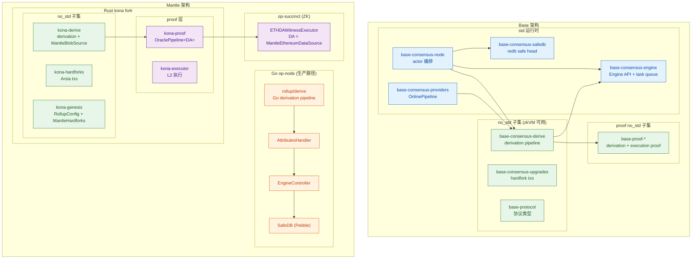
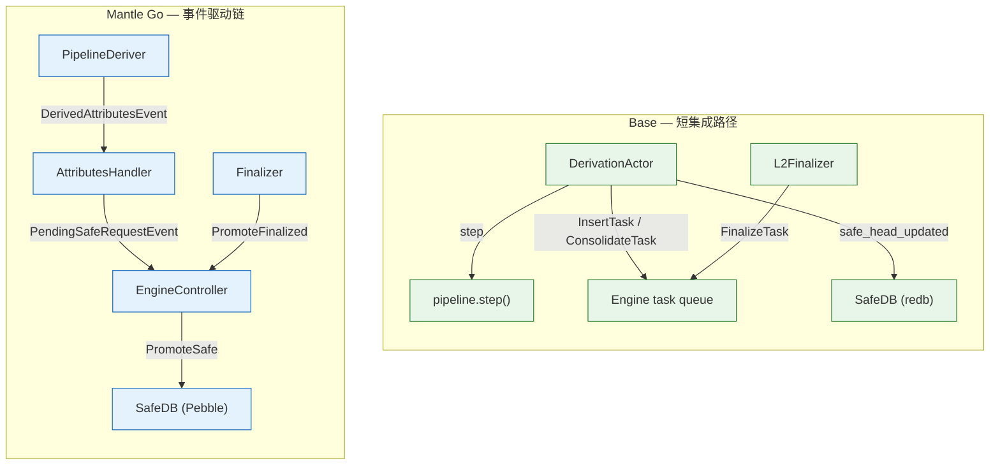
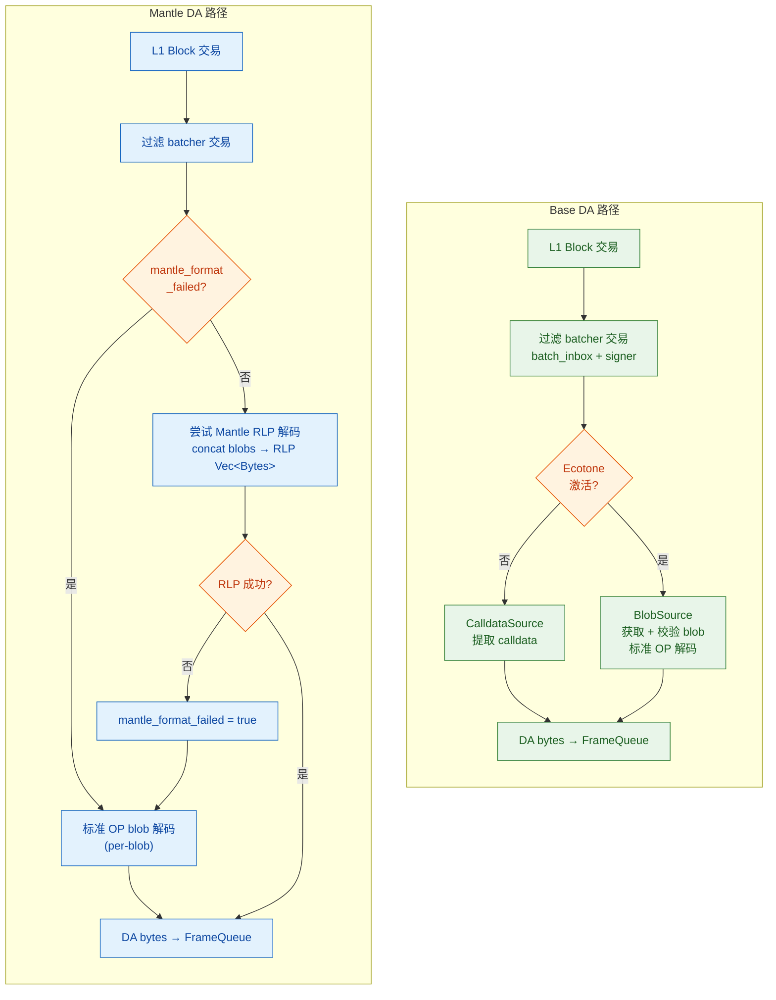

# Derivation Pipeline 架构设计对比

## 1. 总体定位

| 维度 | Base (`base-consensus-derive`) | Mantle (`kona-derive` fork) |
| --- | --- | --- |
| 路线 | 完全自研，独立于上游 kona | fork 自 `ethereum-optimism/kona`，持续同步 |
| 生产路径 | Rust 单一路径（共识 + 证明复用同一 crate） | Go `op-node` 为生产路径，Rust kona 用于 proof / zkVM |
| no_std | consensus derivation 子集 + proof 路径子集为 no_std | protocol + proof + batcher/utilities 中多处 no_std |
| 仓库组织 | 单仓库 (`base/base`)，13 个 consensus 子 crate | 多仓库 (`mantle/kona` + `mantle/mantle-v2` + `mantle/op-succinct`) |

## 2. 子 Crate 组织对比

### Base — 13 个 consensus 子 crate（按节点能力拆分）

```
crates/consensus/
├── cli         # base-consensus-cli — 节点二进制入口 (clap)
├── derive      # base-consensus-derive — 核心 derivation pipeline (no_std)
├── disc        # base-consensus-disc — discv5 节点发现
├── engine      # base-consensus-engine — Engine API client + task queue
├── gossip      # base-consensus-gossip — libp2p gossipsub 区块传播
├── peers       # base-consensus-peers — 对等节点管理 / 评分
├── protocol    # base-protocol — 纯协议类型 (Frame, Channel, Batch, L1BlockInfoTx 等)
├── providers   # base-consensus-providers — RPC-backed ChainProvider / BlobProvider / OnlinePipeline
├── rpc         # base-consensus-rpc — jsonrpsee server/client traits
├── safedb      # base-consensus-safedb — redb-backed L1→safe head 持久映射
├── service     # base-consensus-node — actor 编排层
├── sources     # base-consensus-sources — 区块签名器 (mTLS remote signer)
└── upgrades    # base-consensus-upgrades — hardfork deposit-tx 字节码 (no_std)
```

**设计哲学**：按节点组件能力横切，每个 crate 对应一个独立的运行时关注点。`derive` + `protocol` + `upgrades` 构成 consensus 层 no_std 子集；SP1 proof 还会链接 `crates/proof/` 下的 `base-proof-*` no_std 子集。其余 consensus crate 依赖 tokio / libp2p / jsonrpsee / redb 等 std 库。

> **命名陷阱**：`crates/consensus/sources/` 是区块签名器，**不是** L1 数据源。L1 数据源抽象（`EthereumDataSource` / `BlobSource` / `CalldataSource`）在 `derive/src/sources/` 内部。

### Mantle kona — 按 protocol / node / proof 域拆分

```
crates/
├── protocol/           # 纯协议层 (no_std 子集)
│   ├── derive          # kona-derive — 核心 derivation pipeline (no_std)
│   ├── hardforks       # kona-hardforks — hardfork 升级交易 (含 Mantle Arsia)
│   ├── genesis         # kona-genesis — RollupConfig + MantleHardForkConfig
│   ├── protocol        # kona-protocol — 协议类型
│   ├── registry        # kona-registry — 链注册表
│   └── interop         # kona-interop — 跨链互操作
├── node/               # 节点运行时 (std)
│   ├── engine          # kona-engine — Engine API + task queue
│   ├── derivation      # kona-derivation — 节点级 derivation 驱动
│   ├── service         # kona-service — actor 编排
│   ├── sources         # kona-sources — L1 数据源提供者
│   ├── rpc             # kona-rpc — RPC 接口
│   └── p2p             # kona-p2p — 网络层
├── proof/              # ZK/fault proof 层 (no_std)
│   ├── proof           # kona-proof — OraclePipeline 泛型组装
│   ├── executor        # kona-executor — L2 状态执行器
│   ├── driver          # kona-driver — proof 驱动器
│   ├── proof-interop   # kona-proof-interop — interop proof 支撑
│   ├── std-fpvm        # kona-std-fpvm — FPVM 标准接口
│   ├── std-fpvm-proc   # kona-std-fpvm-proc — FPVM proc macro
│   ├── mpt             # kona-mpt — Merkle Patricia Trie
│   └── preimage        # kona-preimage — 预映像通信
├── providers/          # RPC-backed providers (std)
├── batcher/
│   └── comp            # kona-comp — 压缩编解码
├── supervisor/         # Supervisor 组件
└── utilities/          # 工具库
```

**设计哲学**：按协议层级域纵切——`protocol` 是纯逻辑、无运行时依赖的 no_std 核心；`node` 是带 tokio / 网络的运行时；`proof` 是 zkVM 执行的最小子集。

### 关键差异

Base 的拆分更扁平（同级 13 crate），组合靠 `service` 统一 wire；Mantle/kona 的拆分更层次化（3 层域 + 子 crate），但 Mantle 还需要在 `mantle-v2` Go 仓库中维护一套平行的 derivation 实现。

## 3. Pipeline Stage Stack 对比

### Base

```
PollingTraversal         ← L1 头部追踪
  → L1Retrieval          ← 拉取 DA 数据 (calldata / blob)
    → FrameQueue         ← 字节流 → Frame (含 Holocene 帧修剪)
      → ChannelProvider  ← [Mux] pre-Holocene: ChannelBank / Holocene: ChannelAssembler
        → ChannelReader  ← channel 数据 → RLP 解码
          → BatchStream  ← span batch 拆分
            → BatchProvider  ← [Mux] pre-Holocene: BatchQueue / Holocene: BatchValidator
              → AttributesQueue  ← 生成 PayloadAttributes
```

- **构建方式**：`PipelineBuilder` 按上述固定顺序组合，类型层级嵌套——每个 stage 持有 `prev` 字段，无 `Box<dyn>`，编译期确定全栈类型
- **Mux 模式**：`ChannelProvider` 和 `BatchProvider` 各自拥有 `Option<PreFork>` + `Option<PostFork>`，`attempt_update()` 在每次操作前检查 Holocene 激活状态并迁移。前向迁移时携带 `l1_blocks` 和 `origin` 状态；反向 reorg 时仅携带 `l1_blocks`
- **信号机制**：`Signal` 枚举 (`Reset` / `Activation` / `FlushChannel`)，每个 stage 实现 `StageReset` trait 的 `reset()` / `activate()` / `flush_channel()` 方法，逐级向下转发

### Mantle kona (Rust 路径)

```
PollingTraversal / IndexedTraversal
  → L1Retrieval          ← 拉取 DA 数据 (含 Mantle reset 语义)
    → FrameQueue
      → ChannelProvider  ← [Mux] 同 Base
        → ChannelReader
          → BatchStream
            → BatchProvider  ← [Mux] 同 Base
              → AttributesQueue
```

- **结构几乎一致**：PipelineBuilder 的 `build_polled()` 方法与 Base 同构，stage 顺序和 Mux 模式完全一致
- **关键差异**：`L1Retrieval::signal(Reset)` 额外调用 `self.provider.reset()` 以清除 `MantleBlobSource` 的 `mantle_format_failed` toggle（注释明确写"matching Go's L1Retrieval.Reset() → dataSrc.Reset()"）
- **DA 注入点**：通过 `PipelineBuilder::dap_source(D)` 泛型注入，Mantle 在 `op-succinct` 侧传入 `MantleEthereumDataSource`

### Mantle Go 生产路径 (`mantle-v2/op-node`)

```
L1Traversal
  → DataSourceFactory   ← 工厂模式选择 DA source
    → L1Retrieval
      → FrameQueue
        → ChannelMux    ← pre-Holocene: ChannelBank / Holocene: ChannelAssembler
          → ChannelInReader
            → BatchMux  ← pre-Holocene: BatchQueue / Holocene: BatchStage
              → AttributesQueue
```

- **事件驱动**：`PipelineDeriver` 以事件方式 step pipeline，输出 derived attributes 或 idle / reset / temporary / critical 事件
- **额外抽象层**：`DataSourceFactory`、`ChannelMux`、`BatchMux` 均为独立结构体；Go path 还有 `AttributesHandler` + `EngineController` 事件链
- **Mantle Arsia → Holocene 映射**：`mantle_pipeline.go` 将 Mantle Arsia 映射为 OP Holocene transform，使 `ChannelMux` 和 `BatchMux` 在 Arsia 激活时自动切换到 Holocene stage

## 4. 架构可组合性对比

### 泛型 vs 接口

| 特性 | Base | Mantle kona | Mantle Go |
| --- | --- | --- | --- |
| stage 组合方式 | 嵌套泛型（编译期类型安全） | 同 Base（共享 kona 血统） | 接口 + 手动 stage 链 |
| DA 抽象 | `DataAvailabilityProvider` trait | 同 Base（泛型 `D`） | `DataIter` 接口 + 工厂 |
| 信号派发 | `StageReset` trait（类型安全，无枚举路由） | 同 Base | event-driven deriver |
| Mux 策略 | `Option<Pre>` + `Option<Post>` 状态机 | 同 Base | `ChannelMux` / `BatchMux` 结构体 |

### 可扩展性评估

**Base 的优势**：
1. **单路径**：共识和证明共享同一 Rust pipeline，新 stage 只需写一次
2. **编译期保证**：泛型嵌套使得 stage 组合在编译期检查类型一致性
3. **no_std 子集精确**：consensus derivation 边界清晰，proof 路径集中在 `crates/proof/`

**Mantle kona 的优势**：
1. **泛型 DA 注入**：`PipelineBuilder::dap_source(D)` 允许不修改 pipeline 核心即可插入自定义 DA（如 `MantleEthereumDataSource`）
2. **上游同步能力**：fork 自 kona，可以合并上游改进（但 Mantle 特有修改需要解决冲突）
3. **proof 层抽象完善**：`OraclePipeline<O, L1, L2, DA>` 完全泛型化，DA provider 为类型参数

**Mantle 的劣势**：
1. **双路径维护**：Go `op-node` 和 Rust `kona` 两套 derivation，每次协议升级需要同步两边
2. **Go/Rust 语义一致性风险**：如 `mantle_format_failed` toggle 的 `clear()` vs `reset()` 语义差异，需要手动对齐并测试
3. **Fork 债务**：workspace `Cargo.toml` 重定向了 `op-alloy`、`revm`、`alloy-evm` 等核心依赖到 Mantle 维护的 mirror，增加了合并上游的成本

## 5. 架构图



## 6. 本地源码证据

- Base pipeline builder stage 组合：`references/codebase/base/crates/consensus/derive/src/pipeline/builder.rs:121-139`
- Base ChannelProvider mux 模式：`references/codebase/base/crates/consensus/derive/src/stages/channel/channel_provider.rs:59-86`
- Base BatchProvider mux 模式：`references/codebase/base/crates/consensus/derive/src/stages/batch/batch_provider.rs:74-91`
- Mantle kona pipeline builder：`references/codebase/mantle/kona/crates/protocol/derive/src/pipeline/builder.rs:126-137`
- Mantle L1Retrieval reset 语义：`references/codebase/mantle/kona/crates/protocol/derive/src/stages/l1_retrieval.rs:125-131`
- Mantle kona workspace 依赖重定向：`references/codebase/mantle/kona/Cargo.toml`（op-alloy, revm 等均指向 mantle-xyz mirror）
- Mantle Go pipeline stage 顺序：`references/codebase/mantle/mantle-v2/op-node/rollup/derive/pipeline.go:99-137`
- Mantle Go Arsia→Holocene 映射：`references/codebase/mantle/mantle-v2/op-node/rollup/derive/mantle_pipeline.go:8-27`
- Base proof no_std：`references/codebase/base/crates/proof/proof/src/lib.rs:3`，`references/codebase/base/crates/proof/executor/src/lib.rs:3`
- OraclePipeline 泛型 DA：`references/codebase/mantle/kona/crates/proof/proof/src/l1/pipeline.rs:18-38`
- op-succinct DA 注入：`references/codebase/mantle/op-succinct/utils/ethereum/client/src/executor.rs`（`type DA = MantleEthereumDataSource`）


---

# 批处理与 Channel 管理对比

## 1. Frame → Channel → Batch 解码总览

两者遵循相同的 OP Stack derivation 规范，解码链路为：

```
DA bytes → Frame 解析 → Channel 组装 → Channel 读取(解压) → Batch 解码 → 验证
```

但在 Holocene hardfork 前后有不同的 stage 实现，通过 Mux (多路复用器) 模式切换。

## 2. Frame 解析

### 共同的 Frame 格式

| 字段 | 大小 | 说明 |
| --- | --- | --- |
| `channel_id` | 16 bytes | 唯一标识一个 channel |
| `frame_number` | 2 bytes (BE) | 帧序号 |
| `frame_data_length` | 4 bytes (BE) | 数据长度 |
| `frame_data` | 变长 | 帧数据 |
| `is_last` | 1 byte | 是否为 channel 最后一帧 |

固定开销 23 bytes + data。

### Frame 常量

| 常量 | Base | Mantle kona |
| --- | --- | --- |
| `DERIVATION_VERSION_0` | `0` | `0`（相同） |
| `BLOB_MAX_DATA_SIZE` | 130,044 bytes | 同上 |
| `MAX_BLOB_FRAME_SIZE` | 130,043 bytes | 同上 |
| `Frame::MAX_LEN` | 1,000,000 (1 MB) | 同上 |
| `Frame::OVERHEAD` | 200 bytes | 同上 |

### `FrameQueue` — Holocene 帧修剪

Base 和 Mantle kona 的 `FrameQueue` 实现一致（共享 kona 血统）：

**`prune()` 方法**（仅 Holocene 激活后生效）执行 4 条帧验证规则：

1. **同 channel 非连续帧**：`prev.id == next.id && prev.number + 1 != next.number` → 丢弃 next
2. **同 channel last 帧之后**：`prev.is_last == true` → 丢弃 next
3. **新 channel 不从 0 开始**：`prev.id != next.id && next.number != 0` → 丢弃 next
4. **替换未关闭的 channel**：前一个 channel 未 last 且新 channel 从 0 开始 → 清除队列中前一 channel 的所有帧

## 3. Channel 管理

### Pre-Holocene: `ChannelBank`

| 行为 | 说明 |
| --- | --- |
| 多 channel 并存 | 可以同时缓存多个 channel 的帧 |
| 乱序帧接受 | 同一 channel 的帧可以乱序到达 |
| 超时淘汰 | channel 超过 `channel_timeout` 后被丢弃 |
| 最大 channel 数 | 有上限，超出时最老的被淘汰 |

### Holocene+: `ChannelAssembler`

| 行为 | 说明 |
| --- | --- |
| 单 channel 模式 | 一次只处理一个 channel |
| 严格顺序 | 帧必须按序到达 |
| 无超时机制 | channel 不会因超时被丢弃 |
| 确定性 | 消除了多 channel 并发带来的不确定性 |

### Mux 切换模式（Base 和 Mantle kona 相同）

`ChannelProvider` 持有三个 `Option` 字段：

```rust
struct ChannelProvider<...> {
    prev: Option<P>,               // 上游 stage (首次初始化时持有)
    channel_bank: Option<ChannelBank<P>>,      // pre-Holocene
    channel_assembler: Option<ChannelAssembler<P>>,  // Holocene+
}
```

`attempt_update()` 在每次操作前检查 `cfg.is_holocene_active(origin.timestamp)`：
- **前向迁移**（non-Holocene → Holocene）：`channel_bank.prev` 所有权转移给 `ChannelAssembler::new(prev)`
- **反向 reorg**（Holocene → non-Holocene）：反向迁移回 `ChannelBank`

### Mantle Go — `ChannelMux`

Go `ChannelMux` 结构体实现相同的切换逻辑，但：
- Mantle Arsia 映射到 OP Holocene transform（`mantle_pipeline.go`）
- 切换通过 `ChannelMux.Transform()` 方法触发
- 额外支持 `MantleBlobDataSource` 特有的 channel 处理

## 4. Channel 读取与解压

### `ChannelReader`

两者的 `ChannelReader` 实现一致：
- 从 `ChannelProvider` 获取就绪的 channel
- 读取 channel 数据并解压
- 输出 RLP 编码的 batch 数据

### 压缩策略

| 压缩算法 | 引入时间 | 说明 |
| --- | --- | --- |
| zlib | Bedrock 起始 | 默认压缩 |
| brotli | Fjord (HF4) | 更高压缩率，`base-protocol/src/brotli.rs` |
| zstd | 未来计划 | 尚未在代码中出现 |

Base 和 Mantle kona 都支持 zlib 和 brotli 解压。压缩选择由第一个字节（compression type tag）决定。

### Channel 大小限制

| 参数 | Pre-Fjord | Fjord+ |
| --- | --- | --- |
| 最大 RLP bytes/channel | 10,000,000 (10 MB) | 100,000,000 (100 MB) |
| Channel timeout | 300 blocks | 50 blocks (Granite+) |

## 5. Batch 解码

### Batch 类型

`Batch` 枚举由 1 字节类型标签区分：

```rust
pub enum Batch {
    Single(SingleBatch),   // type tag = 0
    Span(SpanBatch),       // type tag = 1
}
```

### SingleBatch

| 字段 | 说明 |
| --- | --- |
| `parent_hash` | 父 L2 block hash |
| `epoch_num` | L1 epoch 编号 |
| `epoch_hash` | L1 epoch hash |
| `timestamp` | L2 时间戳 |
| `transactions` | 交易列表 |

### SpanBatch

Span batch 是对连续多个 single batch 的紧凑编码：

1. **前缀** (`SpanBatchPrefix`)：`rel_timestamp`, `l1_origin_num`, `parent_check`, `l2_safe_check`
2. **载荷** (`SpanBatchPayload`)：`block_count`, `origin_bits`, `block_tx_counts`, 按交易类型分组的交易数据

支持的交易类型：`Legacy`, `EIP-2930`, `EIP-1559`, `EIP-7702`。每种类型有对应的 `SpanBatch{Type}TransactionData` 结构。

### 解码流程

```
ChannelReader 输出 RLP bytes
  → BatchReader::next_batch()
    → 读取 1 byte type tag
    → BatchType::Single → SingleBatch::decode(rlp)
    → BatchType::Span → RawSpanBatch::decode(rlp)
                         → raw.derive(block_time, genesis_l2_time, chain_id)
                         → SpanBatch (展开为可迭代的 single batch 序列)
```

### `BatchStream` — Span Batch 拆分

`BatchStream` stage 将 `SpanBatch` 拆分为逐个的 `SingleBatch`，使下游 `BatchProvider` / `BatchQueue` 统一处理。

## 6. Batch 验证

### Pre-Holocene: `BatchQueue`

| 功能 | 说明 |
| --- | --- |
| 批次排队 | 将解码后的 batch 放入队列 |
| 排序 | 按 timestamp 排序 |
| 间隙填充 | 缺失的 batch 用空 batch 填充 |
| 有效性检查 | 检查 parent hash, timestamp, epoch 一致性 |

`BatchValidity` 枚举：
- `Accept` — 批次有效
- `Drop` — 批次无效，丢弃
- `Undecided` — 需要更多信息
- `Past` — 批次过旧
- `Future` — 批次过新

### Holocene+: `BatchValidator`

| 功能 | 说明 |
| --- | --- |
| 严格顺序 | batch 必须按序到达 |
| 无排序 | 不缓存、不排序 |
| 确定性验证 | 消除排序引入的不确定性 |

### Mux 切换（Base 和 Mantle kona 相同）

`BatchProvider` 持有 `Option<BatchQueue>` + `Option<BatchValidator>`，`attempt_update()` 检查 Holocene 激活状态：
- **前向迁移**：`batch_queue.l1_blocks` 和 `batch_queue.origin` 状态转移给 `BatchValidator`
- **反向 reorg**：仅 `l1_blocks` 转移回 `BatchQueue`（`origin` 不转移）

## 7. 实现差异总结

| 维度 | Base | Mantle kona | Mantle Go |
| --- | --- | --- | --- |
| Frame 格式 | 标准 OP | 标准 OP | 标准 OP |
| Frame 修剪 (Holocene) | `FrameQueue::prune()` | 同 Base | `FrameQueue` 内实现 |
| Channel Mux | `ChannelProvider` (Option 状态机) | 同 Base | `ChannelMux` (结构体) |
| Batch Mux | `BatchProvider` (Option 状态机) | 同 Base | `BatchMux` (结构体) |
| Span Batch 支持 | 完整（4 种交易类型） | 同 Base | 完整 |
| 压缩 | zlib + brotli | 同 Base | zlib + brotli |
| Batch 验证 | Queue / Validator | 同 Base | Queue / BatchStage |
| DA → Frame 编码 | 标准 OP blob codec | Mantle RLP `Vec<Bytes>` + 标准 fallback | Mantle RLP + 标准 fallback |

**关键结论**：从 Frame 到 Batch 的解码流程，Base 和 Mantle kona 几乎完全一致。唯一的差异在 DA 层——Mantle 的 blob 数据在标准 OP codec 之外多了一层 RLP 包装（`MantleBlobSource`），但这不影响 Frame / Channel / Batch 解码本身。

## 8. 本地源码证据

- Base Frame 结构与常量：`references/codebase/base/crates/consensus/protocol/src/frame.rs:1-50`
- Base Frame::parse_frames：`references/codebase/base/crates/consensus/protocol/src/frame.rs:245-271`
- Base FrameQueue prune 逻辑：`references/codebase/base/crates/consensus/derive/src/stages/frame_queue.rs:62-108`
- Base ChannelProvider mux：`references/codebase/base/crates/consensus/derive/src/stages/channel/channel_provider.rs:59-86`
- Base BatchProvider mux 状态迁移：`references/codebase/base/crates/consensus/derive/src/stages/batch/batch_provider.rs:74-91`
- Base Batch 枚举与类型标签：`references/codebase/base/crates/consensus/protocol/src/batch/core.rs`
- Base SpanBatch 结构：`references/codebase/base/crates/consensus/protocol/src/batch/` 目录
- Base brotli 编解码：`references/codebase/base/crates/consensus/protocol/src/brotli.rs`
- Mantle kona FrameQueue：`references/codebase/mantle/kona/crates/protocol/derive/src/stages/frame_queue.rs`
- Mantle kona ChannelProvider：`references/codebase/mantle/kona/crates/protocol/derive/src/stages/channel/`
- Mantle kona BatchProvider：`references/codebase/mantle/kona/crates/protocol/derive/src/stages/batch/`
- Mantle Go ChannelMux：`references/codebase/mantle/mantle-v2/op-node/rollup/derive/channel_mux.go:13-75`
- Mantle Go BatchMux：`references/codebase/mantle/mantle-v2/op-node/rollup/derive/batch_mux.go:14-77`


---

# Derivation Pipeline 各维度对比表

## 总览

| 维度 | Base (`base-consensus-derive`) | Mantle kona (Rust fork) | Mantle Go (`op-node`) | 评估 |
| --- | --- | --- | --- | --- |
| **路线** | 自研 Rust pipeline | fork 自 kona | fork 自 OP Stack | Base 自主性强，Mantle 跟随+扩展 |
| **生产路径** | Rust 唯一 | Rust (proof) + Go (node) | Go 生产路径 | Base 统一，Mantle 双路径 |
| **仓库** | 单仓 (`base/base`) | 多仓 (kona + mantle-v2 + op-succinct) | mantle-v2 | Base 集中管理优势明显 |

## 1. 架构设计

| 维度 | Base | Mantle kona | Mantle Go |
| --- | --- | --- | --- |
| 子 crate / 模块数 | 13 个 consensus crate | protocol(7) + node(6) + proof(7) = 20+ crate | ~10 个 Go package |
| 拆分哲学 | 按节点能力横切 | 按 protocol/node/proof 域纵切 | 按 OP Stack 目录组织 |
| Pipeline 构建 | `PipelineBuilder` 嵌套泛型 | 同 Base | 手动 stage chain |
| Stage 组合 | 编译期类型安全（无 `Box<dyn>`） | 同 Base | 接口 + 运行时 dispatch |
| Mux 模式 | `Option<Pre>` + `Option<Post>` 状态机 | 同 Base | `ChannelMux` / `BatchMux` 结构体 |
| 信号机制 | `StageReset` trait（类型安全，无 enum 路由） | 同 Base + Mantle reset 扩展 | 事件驱动 deriver |

## 2. no_std 与 ZK 兼容性

| 维度 | Base | Mantle kona |
| --- | --- | --- |
| no_std crate 数量 | consensus derivation 子集约 3 个；proof 路径另含 `base-proof-*` no_std 子集 | protocol + proof + batcher/utilities 中多处 no_std |
| no_std gate 方式 | `#![cfg_attr(not(feature = "metrics"), no_std)]` | 同 Base (derive crate) |
| alloc 支持 | 是 (`extern crate alloc`) | 是 |
| ZK 路径复用 | 生产和 proof 共享同一 pipeline | proof 专用路径 (via OraclePipeline) |
| zkVM 目标 | SP1（本地 range program 已存在） | SP1 v6.1.0 (Hypercube) |
| 加速预编译 | 不在 consensus crate 内 | sp1-patches 重写 sha2/sha3/k256/p256 |
| 一致性风险 | 低（单路径） | 中高（Go/Rust 双路径需同步） |
| 证明范围 | derivation + execution | derivation + execution |

## 3. L1 数据源与 DA

| 维度 | Base | Mantle kona | Mantle Go |
| --- | --- | --- | --- |
| DA trait | `DataAvailabilityProvider` | 同 Base | `DataIter` 接口 |
| DA 实现 | `EthereumDataSource` (唯一) | `EthereumDataSource` + `MantleEthereumDataSource`；op-succinct 注入后者 | `CalldataSource` + `MantleBlobDataSource` + `BlobDataSource` |
| Blob 编码 | 标准 OP codec | Mantle RLP `Vec<Bytes>` + 标准 fallback | 同 kona (Go 实现) |
| Fallback 机制 | 无（标准 OP 仅有一种编码） | `mantle_format_failed` toggle | `blobSourceChanged` toggle |
| Toggle 语义 | N/A | `clear()` 不重置，`reset()` 重置 | 同 kona |
| EigenDA | 不支持 | 不在 kona 中（未发现代码） | AltDA 可选包裹 |
| Calldata 支持 | pre-Ecotone；`CalldataSource` 支持 type-3 calldata | `CalldataSource` 不含 type-3 calldata；`MantleEthereumDataSource::next()` 当前始终走 `MantleBlobSource` | pre-Ecotone / pre-Everest |
| DA 注入方式 | 构造时固定 | `PipelineBuilder::dap_source(D)` 泛型 | `DataSourceFactory` 工厂 |

## 4. 批处理与 Channel

| 维度 | Base | Mantle kona | Mantle Go |
| --- | --- | --- | --- |
| Frame 格式 | 标准 OP (23 bytes 固定 + data) | 同 Base | 同 Base |
| Frame MAX_LEN | 1 MB | 同 Base | 同 Base |
| Holocene 帧修剪 | `FrameQueue::prune()` 4 规则 | 同 Base | 等价实现 |
| Channel 模式 (pre-Holocene) | `ChannelBank` (多 channel 并存) | 同 Base | 同 |
| Channel 模式 (Holocene+) | `ChannelAssembler` (单 channel) | 同 Base | 同 |
| Batch 类型 | Single (tag=0) + Span (tag=1) | 同 Base | 同 |
| Span Batch 交易类型 | Legacy, EIP-2930, EIP-1559, EIP-7702 | 同 Base | 同 |
| 压缩 | zlib + brotli (Fjord+) | 同 Base | 同 |
| 最大 RLP/channel (Fjord+) | 100 MB | 同 Base | 同 |
| Channel timeout (Granite+) | 50 blocks | 同 Base | 同 |
| Batch 验证 (pre-Holocene) | `BatchQueue` (排队 + 排序) | 同 Base | 同 |
| Batch 验证 (Holocene+) | `BatchValidator` (严格顺序) | 同 Base | `BatchStage` |

## 5. Engine 交互

| 维度 | Base | Mantle kona (node) | Mantle Go |
| --- | --- | --- | --- |
| 交互模式 | Task queue (优先级堆) | 同 Base (kona 血统) | 事件驱动 Controller |
| 任务优先级 | Seal(4) > Insert(3) > Consolidate(2) > Finalize(1) | 同 Base | 无优先级（事件顺序处理） |
| 直接构建路径 | `Engine::build()` (sequencer 低延迟) | 同 Base | FCU-with-attributes |
| Consolidation | `ConsolidateTask` + mismatch fallback | 同 Base | `AttributesHandler` 对齐 |
| FCU 版本 | V2, V3 | V2, V3 | V2, V3 |
| newPayload 版本 | V2, V3, V4 | V2, V3, V4 | V2, V3, V4 |
| getPayload 版本 | V2, V3, V4, V5 | V2, V3, V4, V5 | V2, V3, V4 |
| EL 种类支持 | Geth, Reth, Erigon (预留) | 同 Base | Geth (实际) |
| 状态广播 | `watch::Sender<EngineState>` | 同 Base | 事件 emit |

## 6. 状态管理

| 维度 | Base | Mantle kona (node) | Mantle Go |
| --- | --- | --- | --- |
| 安全等级 | unsafe / local_safe / safe / finalized | 同 Base | unsafe / pending_safe / local_safe / cross_safe / finalized |
| 状态更新 | `apply_update()` 不可变返回新状态 | 同 Base | 各 `TryUpdate*` / `Promote*` 方法 |
| SafeDB 引擎 | redb (Rust, B-tree) | N/A (node 模式) | Pebble (Go, LSM-tree) |
| SafeDB schema | `u64 → [u8; 72]` (L1 hash + L2 hash + L2 number) | N/A | `u64 → L2BlockRef` |
| Reset 语义 | 前向扫描 + 在 reset L1 origin 写合成锚点 | N/A | 重写首个删除 key；before-first-entry 不写锚点 |
| Disabled 降级 | `DisabledSafeDB` 返回错误 | N/A | 可选关闭 |
| 集成路径长度 | DerivationActor → Engine task queue → SafeDB (短) | 同 Base | Deriver → Handler → Controller → SafeDB (长) |

## 7. 升级与 Hardfork

| 维度 | Base | Mantle kona | Mantle Go |
| --- | --- | --- | --- |
| Hardfork 管理 | `base-consensus-upgrades` crate (no_std) | `kona-hardforks` crate (no_std) | `rollup/derive/attributes.go` |
| 支持的 hardfork | Ecotone, Fjord, Isthmus, Jovian | Ecotone, Fjord, Isthmus, Jovian + Arsia | 同 kona + Skadi |
| Mantle 特有 fork | 无 | Arsia (7 upgrade txs) | Skadi + Arsia |
| 升级 tx 注入 | `StatefulAttributesBuilder::prepare_payload_attributes` | 同 Base + Arsia | `FetchingAttributesBuilder` |
| Fork 激活检测 | `is_X_active(next_time) && !is_X_active(parent_time)` | 同 Base | 同 |
| Fork 映射 | 直接 (1:1) | Skadi → Regolith..Isthmus, Arsia → Jovian (N:1) | 同 kona |
| 新 fork 开发成本 | 新增 1 个 upgrade module + 修改 attributes builder | 同 Base + 改 MantleHardForkConfig + 改 RollupConfig | 同 kona Go 侧 + Rust kona 侧 = 2x |
| Bytecode 打包 | `include_str!` 编译时嵌入 | 同 Base | Go `embed` |

## 8. Trait 体系对比

| Trait 类别 | Base | Mantle kona | 说明 |
| --- | --- | --- | --- |
| Pipeline 驱动 | `Pipeline`, `SignalReceiver` | 同 Base | driver 接口 |
| Stage 组合 | `OriginProvider`, `OriginAdvancer`, `StageReset` | 同 Base | stage 生命周期 |
| 属性生成 | `NextAttributes`, `AttributesProvider`, `AttributesBuilder` | 同 Base | batch → attributes |
| 数据源 | `DataAvailabilityProvider`, `BlobProvider`, `ChainProvider`, `L2ChainProvider` | 同 Base | L1/L2 数据抽象 |
| Batch 验证 | `BatchValidationProviderDerive`, `NextBatchProvider` | 同 Base | batch 处理 |
| Engine | `EngineClient` | 同 Base | EL 交互 |
| SafeDB | `SafeHeadListener`, `SafeDBReader` | N/A (node crate) | 持久化 |

## 9. 综合评估

| 评估维度 | Base 优势 | Mantle 优势 | 权重 |
| --- | --- | --- | --- |
| 代码统一性 | 单路径 Rust，无 Go/Rust 同步负担 | — | 高 |
| 可维护性 | 新 fork 改一次代码 | — | 高 |
| DA 扩展性 | — | 泛型 DA 注入，支持自定义编码 | 中 |
| 上游跟随 | — | 可合并上游 kona 改进 | 中 |
| ZK 集成 | 生产路径即 proof 路径 | proof 层抽象完善 (OraclePipeline 泛型) | 高 |
| 事件可观测性 | — | Go 事件驱动链可独立测试各环节 | 低 |
| 性能 | Rust 原生（无 FFI） | Go 生产路径成熟 | 中 |


---

# Engine 交互与状态管理对比

## 1. Engine 交互架构

### Base — Task Queue 模式

Base 的 `base-consensus-engine` 采用基于优先级的任务队列架构：

```rust
pub struct Engine<EC: EngineClient> {
    state: EngineState,
    state_sender: watch::Sender<EngineState>,
    task_queue_length: watch::Sender<usize>,
    tasks: BinaryHeap<(EngineTask<EC>, Reverse<u64>)>,  // 优先级堆
    next_task_sequence: u64,  // FIFO 序号（相同优先级时按插入顺序）
}
```

**任务类型与优先级**：

| 任务 | 优先级 | Engine API 调用 | 说明 |
| --- | --- | --- | --- |
| `SealTask` | 4 (最高) | `engine_getPayload*` | 密封 payload (sequencer 模式) |
| `InsertTask` | 3 | `newPayload` + `forkchoiceUpdated` | 插入新 payload |
| `ConsolidateTask` | 2 | 验证 derived attrs 与 unsafe head | 推进 safe chain |
| `FinalizeTask` | 1 (最低) | `forkchoiceUpdated` | 提升 finalized head |

**调度规则**：
- `drain()` 按优先级弹出任务
- 相同优先级通过 `Reverse<u64>` 序号保证 FIFO
- `Temporary` 严重度的错误导致任务保留在队列中（retry via `yield_now().await`）
- `Flush` 严重度仍然弹出（不重试）
- `Critical` / `Reset` 错误向上传播

**直接构建路径**：

`Engine::build()` / `build_with_state()` 直接调用 FCU-with-attributes（不经过队列），用于 sequencer 模式下的低延迟 payload 构建。如果 FCU 返回 `Invalid`，则产生 `Flush` 严重度错误（pipeline flush）。

### Mantle kona (Rust) — 同类 Task Queue

`crates/node/engine/` 的结构与 Base 高度相似（共享 kona 血统）：
- 同样的 `task_queue/tasks/` 目录（build, consolidate, finalize, insert, synchronize）
- 同样的 Engine API client
- 同样的 state machine（`EngineState` / `EngineSyncState`）

这是节点运行时组件（std），仅用于 kona node 模式，不用于 zkVM proof。

### Mantle Go — 事件驱动 Controller 模式

Go `op-node` 的 `EngineController` 采用完全不同的事件驱动架构：

```go
type EngineController struct {
    engine       EngineSource
    pendingSafe  eth.L2BlockRef
    localSafe    eth.L2BlockRef
    crossSafe    eth.L2BlockRef
    finalized    eth.L2BlockRef
}
```

**事件处理链**：

```
PipelineDeriver.OnEvent()
  → DerivedAttributesEvent
    → AttributesHandler.OnEvent()
      → PendingSafeRequestEvent / InvalidEvent
        → EngineController.OnEvent()
          → TryUpdatePendingSafe()
          → TryUpdateLocalSafe()
          → PromoteSafe()
          → PromoteFinalized()
            → tryUpdateEngine()
              → ForkchoiceUpdateEvent
```

**关键差异**：
- 无优先级队列——每个事件直接处理
- 状态推进通过 `PromoteSafe` / `PromoteFinalized` 方法
- FCU 调用由状态推进触发（而非显式任务）

## 2. Engine API 版本支持

| API | Base | Mantle kona | Mantle Go |
| --- | --- | --- | --- |
| `forkchoiceUpdated` | V2, V3 | V2, V3 | V2, V3 |
| `newPayload` | V2, V3, V4 | V2, V3, V4 | V2, V3, V4 |
| `getPayload` | V2, V3, V4, V5 | V2, V3, V4, V5 | V2, V3, V4 |

Base 的 `EngineForkchoiceVersion` / `EngineNewPayloadVersion` / `EngineGetPayloadVersion` 枚举显式声明了支持的版本组合。`EngineKind { Geth, Reth, Erigon }` 已预留但当前行为一致。

## 3. 安全等级管理

### 状态层级

两者都维护 4 级安全状态：

```
unsafe_head        ← 来自 gossip 或 sequencer 的最新 L2 block
local_safe_head    ← 本地 derivation 验证过的 L2 block
safe_head          ← 跨节点共识的 safe L2 block
finalized_head     ← L1 finalized 后的 L2 block
```

### Base — `EngineState` + `EngineSyncState`

```rust
pub struct EngineSyncState {
    unsafe_head: L2BlockInfo,
    local_safe_head: L2BlockInfo,
    safe_head: L2BlockInfo,
    finalized_head: L2BlockInfo,
}

pub struct EngineState {
    pub sync_state: EngineSyncState,
    pub el_sync_finished: bool,
    pub need_fcu_call_backup_unsafe_reorg: bool,
}
```

- **不可变更新**：`apply_update(EngineSyncStateUpdate)` 返回新状态，同时更新 Prometheus gauges
- **广播机制**：通过 `watch::Sender<EngineState>` 广播，RPC / metrics 订阅者无需轮询
- **Consolidation**：`ConsolidateTask` 验证 derived attributes 与 unsafe head 匹配。不匹配时 fall back 到直接 build + seal（`util::build_and_seal`）

### Mantle Go — `EngineController` 状态机

```go
EngineController 状态推进：
  TryUpdatePendingSafe() → 尝试将 pending safe 前进
  TryUpdateLocalSafe()   → 将 local safe 前进到 pending safe
  PromoteSafe()          → 提升 safe head，调用 tryUpdateEngine()
  PromoteFinalized()     → 提升 finalized head，调用 tryUpdateEngine()
```

- **tryUpdateEngine()** 实际发送 FCU 到 EL
- **状态推进更分散**：4 个方法分别推进不同层级，而非一个统一的 apply_update

## 4. SafeDB — 安全状态持久化

### Base — redb

`base-consensus-safedb` 使用 redb（嵌入式 KV 数据库）：

```rust
TableDefinition<u64, &[u8; 72]>
// key: L1 block number
// value: L1 hash (32) | L2 hash (32) | L2 number BE (8)
```

**写入**（`SafeHeadListener` trait）：
- `safe_head_updated(safe_head, l1_block)` — derivation actor 在 pipeline 输出 safe head 时调用
- `safe_head_reset(reset_safe_head)` — pipeline reset 时调用

**Reset 语义**：
1. 前向扫描从 `reset.l1_origin.number..`
2. 找到第一个 L2 number >= target 的条目
3. 删除从该点往后的所有条目
4. 在 `reset.l1_origin.number` 写入合成锚点

**读取**（`SafeDBReader` trait）：
- `safe_head_at_l1(l1_block_num) -> SafeHeadResponse` — RPC 回答 `optimism_safeHeadAtL1`

**降级**：`DisabledSafeDB` 在读取时返回 `SafeDBError::Disabled`。数据库操作通过 `tokio::task::spawn_blocking` 避免阻塞事件循环。

### Mantle Go — Pebble

Go `op-node` 的 SafeDB 使用 Pebble（嵌入式 LSM 数据库）：

```go
// node/safedb/safedb.go
key: L1 block number (uint64 big-endian)
value: L2 safe head ref (序列化的 eth.L2BlockRef)
```

功能目标相同：记录 L1 block → L2 safe head 的映射，用于 `optimism_safeHeadAtL1` RPC。但 reset 细节不等价，不能直接视为同一语义。

**Reset 语义差异**：
- Base 删除命中的后续条目后，会在 `reset_safe_head.l1_origin.number` 写入合成锚点。
- Mantle Go 找到第一个 `l2Block.Number >= safeHead.Number` 的已有 key 后，删除该 key 及之后的范围；如果该 key 前面存在上一条记录，则在这个“第一个被删除的已有 key”上重写 safe head。
- 如果 reset 到第一条记录之前，Mantle Go 不写锚点，测试期望 `SafeHeadAtL1` 返回 `ErrNotFound`。

### SafeDB 对比

| 维度 | Base (redb) | Mantle Go (Pebble) |
| --- | --- | --- |
| 存储引擎 | redb (Rust, 嵌入式 B-tree) | Pebble (Go, LSM-tree) |
| ACID 保证 | redb 事务提交 | Pebble batch write |
| 单值大小 | 72 bytes 固定 | 变长序列化 |
| Reset 策略 | 前向扫描 + 在 reset L1 origin 写合成锚点 | 前向扫描 + 重写第一个被删除的已有 key；before-first-entry 不写锚点 |
| 并发模型 | spawn_blocking (Tokio) | 同步（Go 协程安全） |
| Disabled 降级 | `DisabledSafeDB` 返回错误 | 可选关闭 |

## 5. Finalization 流程

### Base — `L2Finalizer`

```rust
// service/src/actors/derivation/finalizer.rs
pub struct L2Finalizer {
    queue: VecDeque<(u64, u64)>,  // (L1 block number, highest L2 block number)
}
```

- 维护 L1 block → 最高 L2 block 的映射队列
- 当 finalized L1 推进时，查找对应的 L2 block 作为 finalized L2
- 通过 `FinalizeTask` 提交到 engine task queue

### Mantle Go — `Finalizer` / `AltDAFinalizer`

- `Finalizer` 找到可 finalize 的 L2 block 后调用 `engineController.PromoteFinalized()`
- AltDA 模式下 `AltDAFinalizer` 包裹普通 finalizer

### 整体集成路径对比



**Base 的路径更短**：DerivationActor 直接 step pipeline → 直接提交 engine task → 直接写 SafeDB。一个 actor 完成全部工作。

**Mantle Go 的路径更分散**：PipelineDeriver → AttributesHandler → EngineController → SafeDB，每一步通过事件系统解耦。解耦带来可测试性但增加了状态追踪复杂度。

## 6. 同步启动 (Sync Start)

### Base

`engine/src/sync/mod.rs` 的 `find_starting_forkchoice(cfg, engine_client)` 用于节点启动时确定初始 forkchoice：

1. 从 unsafe chain 向回遍历，找到 L1 origin 仍在 canonical chain 上的 L2 block
2. 从 safe chain 向回遍历，找到已过 sequencing window 的 L2 block
3. 组合为启动时的 forkchoice state

### Mantle Go

`EngineController` 通过 `OnEvent(EngineResetRequestEvent)` 处理启动同步；它也需要确定启动 forkchoice，但入口由事件系统触发。

## 7. 本地源码证据

- Base Engine task queue 结构：`references/codebase/base/crates/consensus/engine/src/task_queue/core.rs`
- Base 任务优先级：`references/codebase/base/crates/consensus/engine/src/task_queue/tasks/mod.rs`（Seal=4, Insert=3, Consolidate=2, Finalize=1）
- Base ConsolidateTask fallback：`references/codebase/base/crates/consensus/engine/src/task_queue/tasks/consolidate/`
- Base direct build path：`references/codebase/base/crates/consensus/engine/src/` (`Engine::build`, `build_with_state`)
- Base EngineState / EngineSyncState：`references/codebase/base/crates/consensus/engine/src/state/core.rs`
- Base EngineKind：`references/codebase/base/crates/consensus/engine/src/kinds.rs`
- Base find_starting_forkchoice：`references/codebase/base/crates/consensus/engine/src/sync/mod.rs`
- Base SafeDB redb：`references/codebase/base/crates/consensus/safedb/src/db.rs`
- Base SafeDB traits：`references/codebase/base/crates/consensus/safedb/src/traits.rs`
- Base SafeDB reset 语义：`references/codebase/base/crates/consensus/safedb/src/db.rs:183-192`（forward-scan + synthetic anchor）
- Base SafeDB reset 测试覆盖：`references/codebase/base/crates/consensus/safedb/src/db.rs:463-507`
- Base DerivationActor：`references/codebase/base/crates/consensus/service/src/actors/derivation/actor.rs:140-339`
- Base L2Finalizer：`references/codebase/base/crates/consensus/service/src/actors/derivation/finalizer.rs:13-66`
- Mantle Go EngineController：`references/codebase/mantle/mantle-v2/op-node/rollup/engine/engine_controller.go:706-847`
- Mantle Go PipelineDeriver：`references/codebase/mantle/mantle-v2/op-node/rollup/derive/deriver.go:128-208`
- Mantle Go AttributesHandler：`references/codebase/mantle/mantle-v2/op-node/rollup/attributes/attributes.go:135-235`
- Mantle Go SafeDB reset：`references/codebase/mantle/mantle-v2/op-node/node/safedb/safedb.go:124-151`
- Mantle Go before-first-entry 测试：`references/codebase/mantle/mantle-v2/op-node/node/safedb/safedb_test.go:205-214`
- Mantle Go Finalizer：`references/codebase/mantle/mantle-v2/op-node/rollup/finality/finalizer.go:291`


---

# Mantle 可借鉴的设计模式

## 核心发现

Base 的 derivation pipeline 在架构设计上最大的优势是**统一路径**——生产节点和 ZK 证明共享同一份 Rust 代码。这消除了 Mantle 当前面临的 Go / Rust 双路径同步问题，是 "自研 vs fork" 路线差异最直接的体现。

## 1. 统一 Rust 路径（最高优先级）

### 问题

Mantle 当前维护两套 derivation 实现：
- Go `op-node/rollup/derive/` — 生产节点
- Rust `kona-derive` — ZK proof / fault proof

每次协议升级（如 Arsia hardfork）需要在两边实现并验证一致性。具体风险：
- `MantleBlobSource` 的 `mantle_format_failed` toggle 语义需要手动对齐 Go `blobToggle()` 行为
- `OpHardforks` impl 的 N:1 时间戳映射（Skadi → 多个 OP fork）增加了两侧的对齐复杂度
- Arsia 的 7 个 upgrade deposit tx 需要在 Go 和 Rust 各实现一遍

### Base 的做法

`base-consensus-derive` 同时作为：
- 节点的 derivation actor 通过 `OnlinePipeline`（std，带 RPC provider）使用
- zkVM guest 通过 oracle-backed provider（no_std）使用
- 新 hardfork 只需新增一个 upgrade module 并修改 `StatefulAttributesBuilder`

### 建议

**长期方向**：逐步将 Rust `kona-derive` 提升为 Mantle 的生产路径，替代 Go `op-node` 的 derivation 组件。Mantle kona 已经具备了生产运行的能力（有完整的 node 层 crate），关键是验证和切换。

**短期措施**：
- 建立 Go / Rust derivation 输出的自动化一致性测试（相同 L1 输入，比对 L2 attributes 输出）
- 优先在 Rust 侧实现新 hardfork，Go 侧作为验证 / 回退

## 2. Task Queue 式 Engine 交互

### 问题

Mantle Go 的 `EngineController` 通过事件驱动链（PipelineDeriver → AttributesHandler → EngineController）推进状态，路径较长且状态分散。

### Base 的做法

`base-consensus-engine` 的 task queue 设计有几个值得学习的点：

1. **优先级排序**：`Seal(4) > Insert(3) > Consolidate(2) > Finalize(1)` 确保高优先级操作（如 sequencer 密封）不被低优先级操作（如 finalization）阻塞
2. **严重度驱动控制流**：`Temporary`（重试）/ `Flush`（弹出）/ `Critical`（传播）明确了错误处理策略
3. **直接构建路径**：`Engine::build()` 绕过 queue 直接 FCU，为 sequencer 模式提供低延迟路径
4. **不可变状态更新**：`apply_update()` 返回新状态并通过 `watch::Sender` 广播

### 建议

Mantle 的 Rust node 路径（kona engine crate）已经具备同类设计。如果最终走向统一 Rust 路径，这些模式可以直接复用。

## 3. 精确的 no_std 边界

### 问题

Mantle kona 的 no_std 覆盖面广（~14 crate），但并非所有 crate 都需要在 zkVM 中运行。过广的 no_std 约束会限制代码的表达力和调试能力。

### Base 的做法

Base 的 no_std 边界分为两层：
- consensus derivation 子集：`derive` + `upgrades` + `protocol` 子集，是节点 derivation 和 proof pipeline 共享的协议逻辑。
- proof 执行子集：`crates/proof/` 下的 `base-proof`, `base-proof-driver`, `base-proof-executor`, `base-proof-mpt`, `base-proof-preimage`, `base-proof-client` 等 crate，负责 SP1 range program 的 derivation + execution 证明路径。

其余 consensus 运行时 crate（engine, gossip, peers, service, rpc, providers, safedb 等）可以自由使用 std 库。

特别巧妙的是 `derive` crate 使用 `metrics` feature（而非 `std`）gate no_std：
```rust
#![cfg_attr(not(feature = "metrics"), no_std)]
```
这意味着在 std 环境下可以通过 `--features metrics` 获得 Prometheus 指标，而不需要一个模糊的 `std` feature flag。

### 建议

审视 Mantle kona 中哪些 no_std crate 实际会被 zkVM 链接。不在 proof 关键路径上的 crate（如 `kona-registry`、`kona-comp` 如果仅在 host 端使用）可以放松 no_std 约束，简化维护。

## 4. SafeDB 设计（合成锚点 Reset）

### 问题

SafeDB 的 reset 语义关系到 pipeline 重启后的正确性。

### Base 的做法

`SafeDB` 的 reset 策略特别值得注意：
1. 前向扫描从 `reset.l1_origin.number`
2. 找到第一个 L2 number >= target 的条目
3. 删除从该点往后的所有条目
4. **在 `reset.l1_origin.number` 写入合成锚点**

合成锚点确保了 reset 后的 `safe_head_at_l1` 查询有正确的返回值，避免了"gap"问题。

### 建议

本地代码已经发现差异：Base 在 `reset_safe_head.l1_origin.number` 写合成锚点；Mantle Go 重写第一个被删除的已有 key，且 reset 到第一条记录之前时不会写锚点。建议评估这是否是有意的 RPC 语义差异；如果不是，应补齐合成锚点行为或增加明确的兼容性说明。

## 5. 泛型 DA 注入模式（Mantle 已有优势）

### Mantle 已做好的

Mantle kona 的泛型 DA 注入设计值得保留和发扬：

```rust
// OraclePipeline<O, L1, L2, DA> — DA 为类型参数
// 无需修改 pipeline 核心，只需提供新的 DA 实现
type DA = MantleEthereumDataSource<Self::L1, Self::B>;
```

这种设计使得：
- `MantleEthereumDataSource` 的引入不需要 fork pipeline 核心代码
- 未来如果引入 EigenDA 或其他 DA 层，只需新增一个 `DataAvailabilityProvider` 实现
- op-succinct 通过 `WitnessExecutor` trait 的 `type DA` 关联类型注入，一行类型别名完成切换

### 建议

这是 Mantle fork 策略的成功案例——通过上游预留的泛型接缝，以最小侵入性引入自定义功能。未来的 DA 层演进应继续沿用这一模式。

## 6. Hardfork N:1 映射的简化

### 问题

Mantle 的 `OpHardforks` impl 将 Regolith→Isthmus 全部映射到 `mantle_skadi_time`，Jovian 映射到 `mantle_arsia_time`。这种 N:1 映射：
- **优点**：减少了 Mantle 自身的 hardfork 管理复杂度（一个 Skadi 激活 = OP Stack 全部追平）
- **缺点**：合并上游新 hardfork 时需要决定它属于哪个 Mantle 时间戳

### Base 的做法

Base 直接使用 OP Stack 的 hardfork 时间戳（1:1 映射），自有 fork（Jovian）作为额外的时间戳。无映射层。

### 建议

随着 OP Stack 加速升级（Isthmus → Jovian → 未来 fork），N:1 映射的维护成本会持续增长。建议：
- 评估是否可以逐步切换到 1:1 映射，即每个 OP fork 有独立的 Mantle 时间戳
- 至少为 `is_*_active()` 方法建立全面的单元测试，覆盖时间戳边界条件

## 7. 不应照搬的设计

### Base 的 crate 命名

Base 将 `crates/consensus/sources/` 用于区块签名器而非 L1 数据源，L1 数据源放在 `derive/src/sources/` 内。这个命名容易误导。Mantle kona 的 `node/sources/` 命名更清晰。

### Base 的深嵌套泛型类型

`OnlinePipeline` 的完整类型展开后极其冗长：
```
DerivationPipeline<
    PolledAttributesQueueStage<
        EthereumDataSource<ConfDepthProvider, OnlineBlobProvider<OnlineBeaconClient>>,
        ConfDepthProvider,
        AlloyL2ChainProvider,
        StatefulAttributesBuilder<ConfDepthProvider, AlloyL2ChainProvider>,
    >,
    AlloyL2ChainProvider,
>
```
这是编译期类型安全的代价——开发体验上不如 Go 的接口清晰。Mantle kona 通过 type alias（`ProviderDerivationPipeline`）缓解，但问题本质不变。

## 8. 行动优先级排序

| 优先级 | 建议 | 预期收益 | 实施难度 |
| --- | --- | --- | --- |
| P0 | 建立 Go/Rust derivation 一致性自动化测试 | 降低双路径同步的 bug 风险 | 中 |
| P1 | 评估 Rust kona node 作为生产路径的可行性 | 消除双路径维护，统一技术栈 | 高 |
| P1 | 评估并修正 SafeDB reset 锚点语义差异 | 确保 pipeline reset 后 RPC 正确性 | 低 |
| P2 | 审视 no_std crate 边界，放松非关键路径约束 | 简化维护、提升调试能力 | 低 |
| P2 | 评估 hardfork N:1 映射的长期可持续性 | 降低上游合并成本 | 中 |
| P3 | 保持泛型 DA 注入模式，为 EigenDA 等预留 | DA 层演进的灵活性 | 已完成 |


---

# L1 数据源与 DA 处理对比

## 1. 数据源抽象层

### Base — `DataAvailabilityProvider` trait

Base 的 L1 数据源抽象在 `derive/src/traits/data_sources.rs` 中定义：

```rust
pub trait DataAvailabilityProvider {
    type Item: Send + Sync + Debug + Into<Bytes>;
    fn next(&mut self, block_ref: BlockInfo, batcher_addr: Address) -> Result<Self::Item>;
    fn clear(&mut self);
}
```

唯一的实现是 `EthereumDataSource<C, B>`（`derive/src/sources/ethereum.rs`），内部包含：
- `CalldataSource<CP>` — pre-Ecotone 路径
- `BlobSource<F, B>` — Ecotone+ 路径

`EthereumDataSource::next()` 根据 `cfg.is_ecotone_active(block_ref.timestamp)` 选择路径。

### Mantle kona — 同一 trait，多个实现

Mantle kona 保留了相同的 `DataAvailabilityProvider` trait，但新增了 Mantle 特有的实现：

| 实现 | 位置 | 用途 |
| --- | --- | --- |
| `EthereumDataSource<C, B>` | `derive/src/sources/ethereum.rs` | 标准 OP 路径（非 Mantle 链） |
| `MantleEthereumDataSource<C, B>` | `derive/src/sources/mantle_ethereum.rs` | Mantle 链——内含 `MantleBlobSource` |

通过 `PipelineBuilder::dap_source(D)` 泛型注入，pipeline 核心代码完全不感知 Mantle vs 标准的区别。

需要注意：本地代码里的 `MantleEthereumDataSource` 虽然保存了 `ecotone_timestamp`、`mantle_arsia_timestamp` 和 `calldata_source` 字段，但 `next()` 当前没有按时间戳分支；op-succinct 注入的 Mantle proof DA 路径始终调用 `mantle_blob_source.next(...)`。标准 `EthereumDataSource` 仍然存在，并且仍会按 Ecotone 时间戳在 `CalldataSource` / `BlobSource` 之间选择，但它不是 Mantle proof 路径注入的 DA 类型。

### Mantle Go — 工厂模式

Go `op-node` 使用 `DataSourceFactory` 结构体（`data_source.go`），根据条件选择不同的 `DataIter` 接口实现：

```
条件判断顺序：
1. Ecotone 激活 && blobSourceChanged → 标准 BlobDataSource
2. Mantle Everest 激活 → MantleBlobDataSource
3. 否则 → CalldataSource
4. 如果 altDAEnabled → 包裹为 AltDADataSource
```

## 2. Blob 解码方式对比

### Base — 标准 OP 编码

`BlobSource`（`derive/src/sources/blobs.rs`）的解码逻辑：

1. **交易过滤**：遍历 block 内所有交易，筛选 `tx.to() == batch_inbox_address && signer == batcher_address`
2. **非 4844 交易**：提取 calldata 作为 `BlobData { calldata: Some(...), data: None }`
3. **EIP-4844 交易**：提取 `blob_versioned_hashes`，为每个 hash 创建空 `BlobData`；4844 交易的 calldata 被**忽略并警告**
4. **Blob 获取**：调用 `BlobProvider::get_and_validate_blobs(block_ref, hashes)` 从 beacon 节点获取 blob
5. **Blob 解码**：调用 `blob.fill(&blobs, blob_index)` 填充 `BlobData`，然后 `next_data.decode()` 使用标准 OP blob codec

**错误处理策略**：
- `BlobNotFound` → `PipelineErrorKind::Reset`（触发 pipeline 级别重置，而非重试）
- `Backend` → `Temporary`（临时错误，会重试）
- `BlobsOverFill` → `Reset`

### Mantle kona — RLP 包装编码 + Fallback

`MantleBlobSource`（`derive/src/sources/mantle_blob.rs`）引入了 Mantle 特有的 blob 编码格式：

**Mantle RLP 编码**：将同一 EIP-4844 交易的所有 blob 连接后，RLP 解码为 `Vec<Bytes>`（通过 `VecOfBytes` wrapper）：

```rust
pub(crate) fn decode_mantle_rlp_frames(data: &[u8]) -> Option<Vec<Bytes>> {
    let VecOfBytes(frames) = VecOfBytes::decode(&mut &data[..])?;
    // 要求完全消费——有剩余字节则返回 None
    Some(frames)
}
```

**完整解码流程**：

```
对每个 EIP-4844 batcher 交易:
  1. 收集该交易的所有 blob
  2. 对每个 blob 调用标准 OP decode → 得到 raw bytes
  3. 将所有 blob 的 raw bytes 拼接 → tx_whole_blob_data
  4. 尝试 Mantle RLP 解码:
     - 成功 → 使用 RLP 解码后的 Vec<Bytes> 作为帧数据
     - 失败 → 设置 mantle_format_failed = true
                → fallback 到逐个 blob 的标准 OP 解码
```

**`mantle_format_failed` toggle 语义**：

| 操作 | 是否重置 toggle | 说明 |
| --- | --- | --- |
| `clear()` | 否 | 换 L1 block 时不重置，持续使用 fallback |
| `reset()` | 是 | pipeline reset 时重置，重新尝试 Mantle 格式 |
| 首次 RLP 失败 | N/A | 无条件设为 true |

这精确匹配了 Go `MantleBlobDataSource` 的 `blobSourceChanged` / `blobToggle()` 行为。

### Mantle Go — 相同逻辑的 Go 实现

`MantleBlobDataSource`（`mantle_blob_source.go`）：
- `processTxBlobs` 函数对每个 blob tx 尝试 RLP 解码
- 失败时调用 `ds.blobToggle()` 切换到标准 blob 格式
- AltDA 可选包裹在外层

## 3. 无 EigenDA

**重要发现**：在 Mantle kona 整个仓库中搜索 `eigen`、`eigenda`、`MNT` 均无结果。Mantle 的 DA 仍然使用标准 EIP-4844 blob，只是 blob 内部的编码格式不同（RLP 包装 `Vec<Bytes>`）。

EigenDA 可能存在于 Go `op-node` 的 AltDA 抽象中（`altDAEnabled` flag），但在 Rust kona 和 op-succinct 中没有体现。

## 4. 数据缓存策略

### Base

- `BlobSource` 使用 `data: Vec<BlobData>` 作为内部缓存，`open` flag 控制是否已加载当前 block 的数据
- `clear()` 清空 `data` 和重置 `open = false`
- 无跨 block 的缓存策略——每个 block 独立加载

### Mantle kona

- `MantleBlobSource` 同样使用 `data: Vec<BlobData>` + `open: bool`
- `clear()` 清空 `data` + `open`，但**保留** `mantle_format_failed`
- 跨 block 的状态：`mantle_format_failed` 在同一 pipeline 生命周期内持续有效

### 两者共同点

- 都不使用 LRU 或磁盘缓存
- 数据源是"拉取式"——`next()` 按需加载单个 block 的数据
- 缓存粒度为单个 L1 block——切换 block 时 `clear()`

## 5. Calldata 处理

### Base — `CalldataSource`

`CalldataSource`（`derive/src/sources/calldata.rs`）：
- 过滤条件：`tx.to() == batch_inbox_address && signer == batcher_address`
- 接受所有交易类型（包括 EIP-4844 type-3 的 calldata）
- `next()` 返回 `Bytes`

### Mantle kona — `CalldataSource` 与 Mantle proof DA 路径

Mantle kona 的 `CalldataSource` 不是 Base 当前实现的完全同款：
- Mantle kona `CalldataSource` 只接受 Legacy / EIP-2930 / EIP-1559 交易，其他交易类型直接忽略。
- Base `CalldataSource` 额外接受 EIP-4844 type-3 交易中的 calldata。
- `MantleEthereumDataSource::next()` 当前不 delegate 到 `CalldataSource`，而是始终走 `MantleBlobSource`。因此不能把 Mantle proof DA 路径描述成 pre-Ecotone 时复用标准 calldata 路径。

这不等于 Mantle Go 生产路径没有 calldata 分支；Go `DataSourceFactory` 仍会按 hardfork 条件选择 calldata / blob / Mantle blob source。差异点在 Rust proof 路径当前注入的 `MantleEthereumDataSource`。

## 6. 流程对比图



## 7. 本地源码证据

- Base EthereumDataSource 选择逻辑：`references/codebase/base/crates/consensus/derive/src/sources/ethereum.rs:63-74`
- Base BlobSource 交易过滤：`references/codebase/base/crates/consensus/derive/src/sources/blobs.rs:46-103`
- Base BlobSource blob 获取与校验：`references/codebase/base/crates/consensus/derive/src/sources/blobs.rs:107-184`
- Base BlobSource 错误映射（BlobNotFound → Reset）：`references/codebase/base/crates/consensus/derive/src/sources/blobs.rs:160-170`
- Base CalldataSource 过滤：`references/codebase/base/crates/consensus/derive/src/sources/calldata.rs:49-80`
- Mantle MantleBlobSource 结构定义：`references/codebase/mantle/kona/crates/protocol/derive/src/sources/mantle_blob.rs:33-53`
- Mantle VecOfBytes RLP wrapper：`references/codebase/mantle/kona/crates/protocol/derive/src/sources/mantle_blob.rs:21-29`
- Mantle decode_mantle_rlp_frames：`references/codebase/mantle/kona/crates/protocol/derive/src/sources/mantle_blob.rs:72-76`
- Mantle load_blobs Mantle RLP 尝试：`references/codebase/mantle/kona/crates/protocol/derive/src/sources/mantle_blob.rs:195-267`
- Mantle clear() vs reset() 语义：`references/codebase/mantle/kona/crates/protocol/derive/src/sources/mantle_blob.rs:309-318`
- Mantle toggle 持久性测试：`references/codebase/mantle/kona/crates/protocol/derive/src/sources/mantle_blob.rs:741-795`
- Mantle MantleEthereumDataSource：`references/codebase/mantle/kona/crates/protocol/derive/src/sources/mantle_ethereum.rs:77-83`
- Mantle MantleEthereumDataSource 字段：`references/codebase/mantle/kona/crates/protocol/derive/src/sources/mantle_ethereum.rs:25-32`
- Mantle calldata 交易类型过滤：`references/codebase/mantle/kona/crates/protocol/derive/src/sources/calldata.rs:48-53`
- Mantle L1Retrieval reset 语义：`references/codebase/mantle/kona/crates/protocol/derive/src/stages/l1_retrieval.rs:125-131`
- Go DataSourceFactory 选择逻辑：`references/codebase/mantle/mantle-v2/op-node/rollup/derive/data_source.go:38-97`
- Go MantleBlobDataSource：`references/codebase/mantle/mantle-v2/op-node/rollup/derive/mantle_blob_source.go:168-206`


---

# no_std 与 ZK 兼容性分析

## 1. no_std 支持范围

### Base

Base 的 no_std 设计分成两层：consensus derivation 子集和 proof 执行子集。只看 `crates/consensus/` 时，no_std 边界主要是下面这些 crate：

| Crate | no_std 方式 | 默认特性 |
| --- | --- | --- |
| `base-consensus-derive` | `#![cfg_attr(not(feature = "metrics"), no_std)]` | `default = []` → 默认 no_std |
| `base-consensus-upgrades` | `#![cfg_attr(not(feature = "std"), no_std)]` | 无 `std` in default → 默认 no_std |
| `base-protocol` | `#[cfg(feature = "std")]` 门控 | `default = ["std"]` → 默认 std，但 no_std 可选 |

其余 10 个 consensus crate（engine, gossip, peers, disc, service, cli, rpc, providers, safedb, sources）均为 std-only，依赖 tokio / jsonrpsee / libp2p / redb 等运行时库。

但 Base 的 zkVM guest 不只链接这 3 个 consensus crate。`crates/proof/` 下的 `base-proof`, `base-proof-driver`, `base-proof-executor`, `base-proof-mpt`, `base-proof-preimage`, `base-proof-client` 等也是 no_std / 条件 no_std crate。它们与 `base-consensus-derive` 一起构成 SP1 range program 的 derivation + execution 证明路径。

**关键设计**：`derive` crate 使用 `metrics` feature 而非通用 `std` feature 来 gate no_std。这意味着在 no_std 模式下，derivation 的全部逻辑都可用，唯一丢失的是 Prometheus 指标收集。

```rust
// references/codebase/base/crates/consensus/derive/src/lib.rs:8
#![cfg_attr(not(feature = "metrics"), no_std)]
extern crate alloc;
```

### Mantle kona

Mantle kona 的 no_std 覆盖面也较广，但本地仓库中的 crate 分布需要区分 kona 和 op-succinct：

| 层级 | 包含的 no_std crate |
| --- | --- |
| protocol | `kona-derive`, `kona-hardforks`, `kona-genesis`, `kona-protocol`, `kona-registry`, `kona-interop` |
| proof | `kona-proof`, `kona-executor`, `kona-driver`, `kona-mpt`, `kona-preimage`, `kona-proof-interop`，以及按目标架构切换 no_std 的 `kona-std-fpvm` |
| batcher | `kona-comp`（位于 `crates/batcher/comp`） |
| utilities | `kona-serde`, `kona-macros` |

`kona-derive` 使用与 Base 相同的 gate 方式：

```rust
// references/codebase/mantle/kona/crates/protocol/derive/src/lib.rs:8
#![cfg_attr(not(feature = "metrics"), no_std)]
```

**差异点**：kona 的 proof 关键路径大多是 no_std / 条件 no_std（proof / executor / driver / mpt / preimage / proof-interop 等），形成了从 derivation 到执行验证的 no_std 闭环。Base 也有对应的 proof no_std 闭环，只是它不在 `crates/consensus/` 下，而是在 `crates/proof/` 下。

## 2. no_std 设计对代码的约束

### 内存分配

两者都使用 `extern crate alloc;`，允许 `Vec`, `String`, `Box` 等堆分配。这是 `no_std` + `alloc` 的标准实践，不是纯 `no_std`（无堆）。

实际约束：
- 不可用 `std::io::{Read, Write}` → 使用 alloy_rlp 的 `Decodable` / `Encodable` trait 替代
- 不可用 `std::collections::HashMap` → 使用 `alloc::collections::BTreeMap` 或 `alloc::vec::Vec`
- 不可用 `std::sync::{Mutex, RwLock}` → 不需要并发原语（pipeline 是单线程步进模型）
- 不可用 `std::net` → 网络操作由 host 端 provider 处理

### 错误处理

两者在 no_std 模式下使用 `core::fmt` 和自定义错误枚举替代 `std::error::Error`：
- Base: `PipelineErrorKind`, `StepResult`, `PipelineResult` 等枚举
- Mantle kona: 同上（共享 kona 血统）

### 日志

两者都通过 `tracing` crate（no_std 兼容）进行日志记录，zkVM 环境中 tracing subscriber 为空实现。

## 3. ZK 证明路径

### Base 的 ZK 路径

Base 的 ZK 集成路径已经在本地代码中明确存在。SP1 range program 通过 `ETHDAWitnessExecutor` 创建 oracle-backed pipeline，DA 类型为标准 `EthereumDataSource`：

```
SP1 Guest Program (crates/proof/succinct/programs/range/ethereum/src/main.rs)
  └── ETHDAWitnessExecutor
      ├── type DA = EthereumDataSource
      ├── create_pipeline() → OraclePipeline<O, L1, L2, DA>
      └── run() → Driver<BaseExecutor, ...>
          ├── base-consensus-derive — derivation pipeline
          ├── base-proof-executor — L2 状态执行
          ├── base-proof-driver — 驱动循环
          └── ZkvmBaseEvmFactory — zkVM 执行工厂
```

**核心优势**：节点 derivation 和 SP1 proof 共享同一个 `base-consensus-derive` pipeline。derivation bug fix 或协议升级不需要在另一套 derivation 实现里重写；execution 证明逻辑则由 `base-proof-*` crate 承担。

### Mantle 的 ZK 路径

Mantle 的 ZK 路径通过 `op-succinct` 调用 kona 的 proof 层：

```
SP1 Guest Program (programs/range/ethereum/src/main.rs)
  └── ETHDAWitnessExecutor
      ├── type DA = MantleEthereumDataSource  ← Mantle DA 注入点
      ├── create_pipeline() → OraclePipeline<O, L1, L2, DA>
      └── run() → Driver<KonaExecutor, ...>
          ├── kona-derive (no_std) — derivation pipeline
          ├── kona-executor (no_std) — L2 状态执行
          ├── kona-driver (no_std) — 驱动循环
          └── ZkvmOpEvmFactory — SP1 加速预编译
```

关键组件：
1. **`WitnessExecutor` trait**（`utils/client/src/witness/executor.rs`）：定义 `type DA` 关联类型，允许 Mantle 插入自定义 DA provider
2. **`OraclePipeline<O, L1, L2, DA>`**（`crates/proof/proof/src/l1/pipeline.rs`）：泛型化的 proof pipeline，`DA` 参数接受任何 `DataAvailabilityProvider` 实现
3. **`ZkvmOpEvmFactory`**（`utils/client/src/precompiles/factory.rs`）：使用 Mantle fork 的 `op_revm::OpContext`，包含 `OpSpecId::ARSIA` / `OSAKA` 等 Mantle 特有变体

### SP1 集成差异

| 方面 | Base | Mantle |
| --- | --- | --- |
| zkVM 目标 | SP1（本地 `crates/proof/succinct/programs/range/ethereum` 明确配置） | SP1 v6.1.0 (Hypercube)，明确在 op-succinct 中配置 |
| 加速预编译 | 未知（不在 consensus crate 中） | `sp1-patches/*` 重写 `sha2`, `sha3`, `k256`, `p256`, `tiny-keccak` 等 |
| DA provider | 标准 `EthereumDataSource` | `MantleEthereumDataSource`（含 RLP blob 解码 + fallback） |
| 执行器 | `base-proof-executor` + `ZkvmBaseEvmFactory` | `kona-executor` + `ZkvmOpEvmFactory` (Mantle revm fork) |
| 证明范围 | derivation + execution（完整 L2 状态转换） | derivation + execution（完整 L2 状态转换） |

## 4. 一致性风险分析

### Base — 低风险

- 生产路径和 proof 路径是**同一份代码**（`base-consensus-derive`）
- 不存在 Go/Rust 双路径同步问题
- 新 hardfork 只需更新一次

### Mantle — 中高风险

- **Go / Rust 双路径**：每次协议升级需要在 `mantle-v2` (Go) 和 `kona` (Rust) 两边实现并验证一致性
- **DA 语义一致性**：`MantleBlobSource` 的 `mantle_format_failed` toggle 必须与 Go `blobSourceChanged` / `blobToggle()` 行为精确匹配。Rust 侧通过单元测试（`test_mantle_format_failed_cached_across_blocks`、`test_mantle_format_failed_reset_on_pipeline_reset`）验证
- **Hardfork 时间戳映射**：`OpHardforks` impl 将 Regolith→Isthmus 映射到 `mantle_skadi_time`，Jovian 映射到 `mantle_arsia_time`，这种 N:1 映射增加了上游 hardfork 合并的复杂度
- **Fork 债务**：`op-alloy` / `revm` / `alloy-evm` 都是 Mantle 维护的 mirror，每次上游升级都需要 rebase 这些依赖

## 5. 对 ZK 证明效率的影响

### 共同点

两者的 derivation pipeline 都是确定性、无副作用的状态机（给定相同的 L1 输入，产生相同的 L2 attributes）。这是 ZK 可证明性的前提。

### 差异点

**Mantle blob 解码的额外开销**：`MantleBlobSource` 在 `load_blobs` 中对每个 blob tx 都尝试 Mantle RLP 解码（`decode_mantle_rlp_frames`），失败后 fallback 到标准解码。在 zkVM 中，这意味着：
- 成功路径：标准解码 + Mantle RLP 解码 = 约 2x 解码计算量
- 失败路径（toggle 后）：仅标准解码，但 toggle 状态需要在 proof 中追踪

**Base 的编码效率**：使用标准 OP blob 编码，无额外解码尝试开销，zkVM 中的 cycle 数更可预测。

## 6. 本地源码证据

- Base derive no_std 声明：`references/codebase/base/crates/consensus/derive/src/lib.rs:8`
- Base upgrades no_std 声明：`references/codebase/base/crates/consensus/upgrades/src/lib.rs:1`
- Base SP1 range program：`references/codebase/base/crates/proof/succinct/programs/range/ethereum/src/main.rs:1-10`
- Base ETHDAWitnessExecutor DA 类型：`references/codebase/base/crates/proof/succinct/utils/ethereum/client/src/executor.rs:42-69`
- Base OraclePipeline 泛型：`references/codebase/base/crates/proof/proof/src/l1/pipeline.rs:28-88`
- Base proof no_std：`references/codebase/base/crates/proof/proof/src/lib.rs:3`，`references/codebase/base/crates/proof/executor/src/lib.rs:3`
- Mantle kona derive no_std：`references/codebase/mantle/kona/crates/protocol/derive/src/lib.rs:8`
- Mantle kona proof no_std：`references/codebase/mantle/kona/crates/proof/proof/src/lib.rs:8`，`references/codebase/mantle/kona/crates/proof/std-fpvm/src/lib.rs:9`
- Mantle MantleBlobSource toggle：`references/codebase/mantle/kona/crates/protocol/derive/src/sources/mantle_blob.rs:52`（`mantle_format_failed: bool`）
- Mantle toggle 持久性测试：`references/codebase/mantle/kona/crates/protocol/derive/src/sources/mantle_blob.rs:741-816`
- op-succinct SP1 配置：`references/codebase/mantle/op-succinct/Cargo.toml`（SP1 v6.1.0）
- op-succinct 加速预编译：`references/codebase/mantle/op-succinct/Cargo.toml`（`[patch.crates-io]` 下 `sha2`, `sha3` 等指向 `sp1-patches`）
- ETHDAWitnessExecutor DA 类型：`references/codebase/mantle/op-succinct/utils/ethereum/client/src/executor.rs`（`type DA = MantleEthereumDataSource`）
- ZkvmOpEvmFactory：`references/codebase/mantle/op-succinct/utils/client/src/precompiles/factory.rs`
- OraclePipeline 泛型：`references/codebase/mantle/kona/crates/proof/proof/src/l1/pipeline.rs:18-38`
