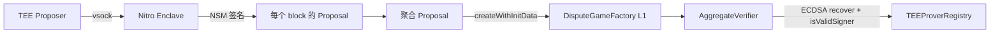
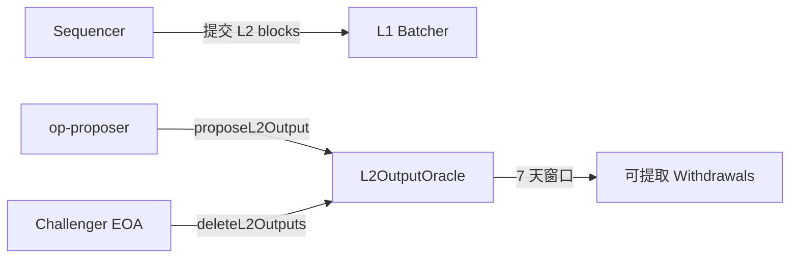
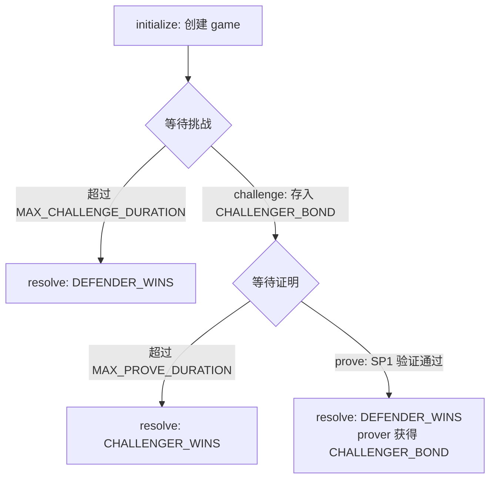

# Base 多证明架构分析（Fault + ZK + TEE）

## 1. 架构总览

Base 的证明系统位于 `crates/proof/` 下，采用 **TEE + ZK + Fault Proof 三合一** 的多证明架构。核心设计理念：多种证明类型互相验证和制衡，消除单一证明系统被攻破的风险。

```
crates/proof/
├── challenge/        # 链下 Challenger 驱动器
├── client/           # no_std Fault Proof 客户端程序（TEE/ZK 通用 guest）
├── contracts/        # L1 合约 Alloy 绑定
├── driver/           # 派生管道驱动器
├── executor/         # 状态转移执行器
├── host/             # Preimage Host 和 ProverService
├── mpt/              # MPT 辅助（witness 验证）
├── preimage/         # Preimage Oracle ABI
├── primitives/       # 共享类型（ProofJournal, Proposal, ProofRequest）
├── proof/            # no_std 核心（oracle, boot info, hint）
├── proposer/         # TEE 输出提议者
├── rpc/              # L1/L2/Rollup Provider 抽象
├── succinct/         # SP1 zkVM 程序 + ZK Validity Proposer
│   ├── programs/
│   │   ├── aggregation/   # 聚合证明 SP1 程序
│   │   └── range/         # 范围证明 SP1 程序
│   └── validity/          # ZK Validity Proposer 服务
├── tee/              # AWS Nitro Enclave 子系统
│   ├── nitro-enclave/           # guest 端（vsock, NSM 签名）
│   ├── nitro-host/              # host 端（gRPC, vsock 传输）
│   ├── nitro-verifier/          # COSE_Sign1 / PCR 验证
│   ├── nitro-attestation-prover/ # RISC Zero ZK 证明 attestation
│   └── registrar/               # 签名者注册驱动器
└── zk/               # ZK 证明服务 + gRPC 客户端
    ├── client/        # tonic gRPC 客户端
    ├── db/            # SQL 存储（proof 请求/会话）
    ├── outbox/        # 事务性 outbox 模式
    └── service/       # SP1 后端编排服务
```

**关键发现：**
- **TEE = 仅 AWS Nitro Enclave**，不支持 SGX、TDX
- **ZK = SP1 (Succinct)**，不使用其他 zkVM
- **Fault Proof = 单轮 checkpoint 争议**，不是交互式二分/Cannon MIPS VM
- 签名者注册的 attestation 证明使用 **RISC Zero**，不是 SP1

> 来源：`crates/proof/tee/nitro-verifier/src/types.rs:10-110` 中 `ZkCoProcessorType::Succinct` 注释明确标注 "not currently used — present for ABI compatibility"

---

## 2. TEE 证明路径（AWS Nitro Enclave）

### 2.1 架构

TEE 是 Base 的 **主要/快速** 证明路径。整个流程：



### 2.2 Nitro Enclave 组件

| 组件 | 位置 | 职责 |
|------|------|------|
| `nitro-enclave` | `tee/nitro-enclave/` | Enclave guest 端，NSM 签名，vsock 通信 |
| `nitro-host` | `tee/nitro-host/` | Host 端 gRPC 服务，vsock 传输，NitroBackend |
| `nitro-verifier` | `tee/nitro-verifier/` | 纯验证逻辑：AttestationDocument, COSE_Sign1, CertChain |
| `nitro-attestation-prover` | `tee/nitro-attestation-prover/` | RISC Zero 证明 Nitro attestation |
| `registrar` | `tee/registrar/` | 签名者注册驱动器，CRL 处理 |

### 2.3 签名者注册

签名者注册使用 **RISC Zero** 的 ZK 证明来验证 AWS Nitro attestation：

- `TEEProverRegistry.registerSigner(output, proofBytes)` — `proofBytes` 是 RISC Zero receipt
- 链上 `NitroEnclaveVerifier` 验证 RISC Zero receipt
- 注册表在 PCRs 匹配预期 image hash 后注册签名者
- 支持 `DirectProver` 和 `BoundlessProver`（Boundless 市场）

> 来源：`tee/nitro-attestation-prover/Cargo.toml` 确认依赖 `risc0-zkvm`, `risc0-ethereum-contracts`, `boundless-market`

### 2.4 TEE Proposer

TEE Proposer 位于 `crates/proof/proposer/`，是一个独立的服务：

**核心循环**（`pipeline.rs`, 2792 行）：PLAN → PROVE → SUBMIT

- **PLAN**：从 `finalized_l2`（默认用已最终化的 L2）开始，按 `block_interval` (512) 分段
- **PROVE**：通过 vsock RPC 到 Nitro Host，在 enclave 中对每个 block 签名 `Proposal`
- **SUBMIT**：组装 `ProofJournal`，调用 `DisputeGameFactory.createWithInitData()`

**关键限制**：TEE Proposer **仅处理 TEE 证明**。代码中明确拒绝 ZK 证明：
> "unexpected ZK proof result from TEE prover"
>
> 来源：`proposer/src/pipeline.rs`

**配置常量**：

| 参数 | 值 | 来源 |
|------|-----|------|
| Poll interval | 12 秒 | `proposer/src/driver.rs:60` |
| Block interval | 512 L2 blocks | `proposer/src/driver.rs:61` |
| Intermediate block interval | 512 L2 blocks | `proposer/src/driver.rs:62` |
| 默认 game type | 0 | `proposer/src/driver.rs:63` |
| L2 finality 输入 | `finalized_l2` | `proposer/src/driver.rs:64` |
| Proposal 超时 | 10 分钟 | `proposer/src/constants.rs:7` |
| Recovery 扫描并发度 | 8 | `proposer/src/constants.rs:10` |
| 最大证明重试次数 | 3 | `proposer/src/constants.rs:13` |
| Factory 扫描回溯 | 5000 | `proposer/README.md` |

### 2.5 Proposal 数据结构

`ProofJournal`（`primitives/src/proposal.rs:23-66`）：
```
proposer(20) + l1_origin_hash(32) + prev_output_root(32) + starting_l2_block(8) 
+ output_root(32) + ending_l2_block(8) + intermediate_roots(32×N) 
+ config_hash(32) + tee_image_hash(32) = 196 基础字节
```

`Proposal`（`primitives/src/proposal.rs:69-104`）包含 `output_root`, `signature`, `l1_origin_hash`, `l1_origin_number`, `l2_block_number`, `prev_output_root`, `config_hash`。

证明编码（`primitives/src/proof_encoder.rs:14-17`）：
- `PROOF_TYPE_TEE = 0`
- `PROOF_TYPE_ZK = 1`

---

## 3. ZK 证明路径（SP1 / Succinct）

### 3.1 SP1 程序

两个 SP1 guest 程序：

**Range 程序**（`succinct/programs/range/ethereum/src/main.rs`, 35 行）：
- 读取 rkyv 序列化的 `DefaultWitnessData`
- 使用 `ETHDAWitnessExecutor` 通过 Ethereum DA（blob provider）
- 执行完整的 Kona 派生管道 + 状态转移
- 提交 `BootInfoStruct`

**Aggregation 程序**（`succinct/programs/aggregation/src/main.rs`, 119 行）：
- 读取 `AggregationInputs`（多个 range boot infos + headers）
- 递归验证每个 range 证明：`sp1_lib::verify::verify_sp1_proof(multi_block_vkey, pv_digest)`
- 验证相邻 boot infos 的连续性：`prev.l2PostRoot == curr.l2PreRoot`
- 反向遍历 L1 header chain 验证所有 `l1Head` 在规范链上
- 提交 `AggregationOutputs { proverAddress, l1Head, l2PreRoot, l2PostRoot, ... }`
- 最终输出 `keccak256(packed)` 与链上 `keccak256(abi.encodePacked(...))` 匹配

### 3.2 ZK Validity Proposer

独立的 ZK 提议者服务，位于 `crates/proof/succinct/validity/`：

**主循环**（`validity/src/proposer.rs:1770-1837`）：
1. `add_new_ranges()` — 查找已最终化但未证明的 L2 block 范围，创建 range proof 请求
2. `handle_proving_requests()` — 轮询 Succinct Network 状态
3. `create_aggregation_proofs()` — 当连续已证明 blocks ≥ `submission_interval` 时创建聚合
4. `submit_agg_proofs()` — 提交聚合证明到链上

**提交路径**（`validity/src/proposer.rs:1360-1438`）：
- 如果 `dgf_address` 设置：创建 Validity Dispute Game（type 6），支付 init bond
- 否则：直接调用 `proposeL2Output()` 到 L2OutputOracle

**配置常量**（`validity/src/env.rs:111-172`）：

| 参数 | 默认值 | 说明 |
|------|--------|------|
| Loop interval | 60 秒 | 提议者迭代间隔 |
| Submission interval | 1800 blocks | 最小提交间隔 |
| Range proof interval | 1800 blocks | 每个 range proof 覆盖的 blocks |
| Max concurrent witness gen | 1 | 并发 witness 生成 |
| Max concurrent proof requests | 1 | 并发证明请求 |
| Proving timeout | 14400 秒 (4 小时) | 证明生成超时 |
| Max price per PGU | 0.3 PROVE/billion PGU | Succinct Network 定价 |
| 聚合证明模式 | **Plonk** (默认) | 可选 Groth16；注意 Challenger 的 ZK 证明请求使用 Groth16 (`challenge/src/driver.rs:633`) |
| 证明策略 | Reserved (默认) | 可选 Hosted |

> 注意：Base 的 ZK 证明在不同路径中使用不同模式。Validity Proposer（`succinct/validity/src/env.rs:131`）默认 Plonk；Challenger（`challenge/src/driver.rs:633`）请求 `ProofType::SnarkGroth16`。

### 3.3 ZK Service（gRPC 编排服务）

`crates/proof/zk/service/` 提供后端编排，支持 5 种 proving 后端：

| 后端 | 说明 |
|------|------|
| `OpSuccinctClusterBackend` | 本地 SP1 集群 |
| `OpSuccinctNetworkBackend` | Succinct Prover Network（默认） |
| `OpSuccinctMockBackend` | Mock 证明 |
| `OpSuccinctDryRunBackend` | 仅执行，不生成证明 |

使用事务性 outbox 模式（`zk/outbox/`）解耦 DB 提交和 SP1 集群提交。
支持 Redis 和 S3 作为 artifact 存储。

---

## 4. Challenger（多证明协调）

### 4.1 四条争议路径

Challenger 位于 `crates/proof/challenge/`，是多证明协调的核心。

`GameCategory` 枚举（`challenge/src/scanner.rs:55-90`）定义了四条争议路径：

| 路径 | 条件 | 处理方式 |
|------|------|----------|
| **Path 1: InvalidTeeProposal** | `teeProver != 0`, `zkProver == 0` | TEE nullify **或** ZK challenge |
| **Path 2: FraudulentZkChallenge** | `teeProver != 0`, `zkProver != 0`, `counteredByIntermediateRootIndexPlusOne > 0` | ZK nullify（用新 ZK 证明反驳错误的 ZK 挑战） |
| **Path 3: InvalidZkProposal** | `teeProver == 0`, `zkProver != 0`, 未被挑战 | ZK nullify |
| **Path 4: InvalidDualProposal** | 双方 prover 都设置, `counteredByIntermediateRootIndexPlusOne == 0` | 先 TEE nullify，再重新扫描为 Path 3 |

### 4.2 TEE-First, ZK-Fallback 策略

Challenger 的核心策略（`challenge/src/driver.rs:372-556`）：

1. 对每个候选 game 判断是否 `try_tee_first`
2. 如果可以 TEE-first：
   - 发起 TEE 证明请求（同步，快速）
   - **同时预构建 ZK fallback 请求**，避免重试时重新计算
   - TEE 超时或失败 → 切换到 ZK（`tee_proof_fallback_total` metric）
3. TEE 证明始终用 `nullify()`
4. ZK 可以用 `challenge()` (Path 1) 或 `nullify()` (Paths 2 & 3)

### 4.3 验证与提交

- `OutputValidator`（`challenge/src/validator.rs`）：从 L2 headers + `L2ToL1MessagePasser` storage proofs 重算 output roots，与链上声明比对
- `ChallengeSubmitter`（`challenge/src/submitter.rs`）：构建 `nullify` / `challenge` calldata，通过 `base-tx-manager` 发送
- `GameScanner`（`challenge/src/scanner.rs:156-206`）：并发扫描（`SCAN_CONCURRENCY = 32`），锚点搜索批量 1024

### 4.4 Bond 生命周期

```
NeedsResolve → NeedsUnlock → AwaitingDelay → NeedsWithdraw
```

通过 `DelayedWETH.delay()` 获取延迟时间，`AggregateVerifier.claimCredit()` 执行解锁和提取。

---

## 5. L1 合约体系

### 5.1 合约总览

| 合约 | 位置 | 职责 |
|------|------|------|
| `AggregateVerifier` | `contracts/src/aggregate_verifier.rs` | 每个 game 的核心合约，验证 TEE 和 ZK 证明 |
| `DisputeGameFactory` | `contracts/src/dispute_game_factory.rs` | 原子化 game 创建 + 初始化 |
| `TEEProverRegistry` | `contracts/src/tee_prover_registry.rs` | TEE 签名者注册，RISC Zero 验证 |
| `NitroEnclaveVerifier` | `contracts/src/nitro_enclave_verifier.rs` | Nitro attestation 验证，证书吊销 |
| `AnchorStateRegistry` | `contracts/src/anchor_state_registry.rs` | 锚定状态管理，game 最终化 |
| `DelayedWETH` | `contracts/src/delayed_weth.rs` | Bond 延迟提取 |

### 5.2 AggregateVerifier 核心接口

- `nullify(proofBytes, intermediateRootIndex, intermediateRootToProve)` — 首字节 `0=TEE`, `1=ZK`
- `challenge(proofBytes, intermediateRootIndex, intermediateRootToProve)` — 仅 ZK（首字节必须为 1）
- `resolve()` → `GameStatus { InProgress=0, ChallengerWins=1, DefenderWins=2 }`
- `claimCredit()` — 执行两次：解锁 + 提取

### 5.3 DisputeGameFactory

- `createWithInitData(gameType, rootClaim, extraData, initData)` — 原子创建并初始化
- `extraData` 编码：`l2BlockNumber(32) + parentAddress(20) + intermediateRoots(32×N)` — packed 编码
- Game UUID = `(gameType, rootClaim, extraData)` — 确定性，用于恢复

### 5.4 AnchorStateRegistry

- `setAnchorState(game)` — 无权限要求，任何人可以推进已最终化的 `DEFENDER_WINS` game
- 条件：`isGameFinalized && isGameRespected && !isGameBlacklisted && !isGameRetired && !paused`

---

## 6. 单一程序，多运行时

Base 最精妙的设计之一是 **同一个 fault proof 客户端程序**（`crates/proof/client/`）在不同运行时中产生不同类型的证明：

- **在 Nitro Enclave 中运行** → 产生 TEE 签名的 `Proposal`（ECDSA 签名）
- **在 SP1 zkVM 中运行** → 产生 ZK 证明（SP1 Groth16/Plonk）

这意味着：
1. 两种证明路径执行完全相同的状态转移逻辑
2. 代码维护成本降低——核心逻辑只需维护一份
3. 安全性增强——如果 TEE 和 ZK 对同一输入产生不同结果，说明至少一个有 bug

> 来源：`crates/proof/client/src/lib.rs` — no_std，导出 `FaultProofProgramError`, `Epilogue`, `Prologue`, `FaultProofDriver`

---

## 7. 链上部署状态

> ⚠️ 以下基于 Base 官方文档，非链上直接验证。

Base 官方文档的 Azul node operator 页面给出的主网激活时间为 **2026 年 5 月 28 日 18:00 UTC**（timestamp `1779991200`）。今天是 2026-05-23，尚未到该计划激活时间，因此本文不能把 Azul 多证明系统写成“已主网激活”。

- **TEE 证明**：权限制（permissioned），用于常规提案路径
- **ZK 证明**：无权限（permissionless），可覆盖无效 TEE 证明
- **两者一致时**：官方 proof spec 描述 short window 为 1 天
- **仅单一证明时**：官方 proof spec 描述 long window 为 7 天

> 来源：https://docs.base.org/base-chain/node-operators/base-v1-upgrade
> 来源：https://docs.base.org/base-chain/specs/upgrades/azul/proofs

**⚠️ 待链上确认**：2026-05-28 18:00 UTC 之后，需要验证当前 L1 上的 DisputeGameFactory、AggregateVerifier 等合约状态，确认 Azul 多证明系统是否按计划激活。

---

## 8. 关键架构决策总结

1. **无 Cannon/MIPS VM**：Base 不使用交互式二分争议，而是基于 intermediate root checkpoint 的单轮争议
2. **TEE 仅限 AWS Nitro**：聚焦单一 TEE 平台而非多 TEE 支持
3. **签名者注册用 RISC Zero**：链上验证 Nitro attestation 的 ZK 证明使用 RISC Zero，非 SP1
4. **两个独立 Proposer**：TEE Proposer 和 ZK Validity Proposer 各自独立运行，目标同一个 DisputeGameFactory
5. **TEE-First 策略**：Challenger 优先使用 TEE（更快），ZK 作为 fallback
6. **同一 guest 程序**：TEE 和 ZK 运行相同的 no_std 程序
7. **Intermediate Root Checkpoint**：每 512 个 L2 block 一个 checkpoint，用于细粒度争议


---

# 证明系统全维度对比表

> **方法论**：本文档严格区分两个层次：
> - **本地代码状态**：从本地 repo 快照直接验证
> - **当前链上部署状态**：需要链上地址/交易/官方公告验证；标注 ⚠️ 的项目需进一步链上确认
>
> 不将"部署状态"写入"代码状态"列。

---

## 1. 证明路径概览

| 维度 | Base | Mantle |
|------|------|--------|
| **本地代码中的证明路径** | TEE (Nitro) + ZK (SP1) + Fault Proof | Validity (SP1) + ZK Fault (SP1) + Cannon (MIPS64, 继承自上游) + Legacy L2OO |
| **当前链上部署状态** | ⚠️ Base Azul 计划 2026-05-28 18:00 UTC 激活多证明（TEE+ZK），尚未到计划时间 | ⚠️ 据 Succinct 公告 (2025-09-16) 与 L2BEAT 当前状态，已部署 Validity Proof；具体链上地址仍需确认 |
| **争议机制** | 单轮 checkpoint 争议（4 条路径） | Legacy: 中心化删除; op-succinct: 单轮 ZK 争议 |
| **交互式二分** | ❌ 不使用 | ❌ Cannon 代码继承自上游但未部署 |

---

## 2. 架构对比

### 2.1 证明系统组件

| 组件 | Base | Mantle (Legacy) | Mantle (op-succinct Validity) | Mantle (op-succinct ZK FP) |
|------|------|----------------|-------------------------------|---------------------------|
| **L1 核心合约** | AggregateVerifier | L2OutputOracle v1.3 | OPSuccinctL2OutputOracle v3.0 | OPSuccinctFaultDisputeGame v1.0 |
| **Factory 合约** | DisputeGameFactory | ❌ 无 | DisputeGameFactory (可选) | DisputeGameFactory |
| **Game Type** | 0 (自定义) | N/A | 6 (OP_SUCCINCT) | 42 (OP_SUCCINCT_FAULT) |
| **权限合约** | TEEProverRegistry | 单一 Proposer/Challenger | approvedProposers mapping | AccessManager (白名单) |
| **Anchor 管理** | AnchorStateRegistry | ❌ 无 | ❌ 无 | AnchorStateRegistry |
| **Bond 管理** | DelayedWETH | ❌ 无 | ❌ 无 | CHALLENGER_BOND (immutable) |
| **本地代码状态** | 完整实现 | 完整实现 | 完整实现 | 合约完整；链下服务在本地快照中未包含 |
| **链上部署** | ⚠️ 计划 2026-05-28 18:00 UTC 激活 | ⚠️ 可能已被 op-succinct 替代 | ⚠️ 据公告/L2BEAT 已上线 | ⚠️ 未确认 |

### 2.2 证明生成组件

| 组件 | Base | Mantle (Legacy) | Mantle (op-succinct) |
|------|------|----------------|---------------------|
| **TEE 运行时** | AWS Nitro Enclave (vsock) | ❌ 无 | ❌ 无 |
| **ZK 运行时** | SP1 zkVM | ❌ 无 | SP1 zkVM |
| **ZK 程序** | range (Ethereum DA) + aggregation | ❌ 无 | range (Ethereum DA) + aggregation |
| **ZK 验证类型** | Validity: **Plonk** (默认); Challenger: **Groth16** | N/A | **Groth16** (默认), 可选 Plonk |
| **Fault Proof 程序** | crates/proof/client (no_std) | op-program (Go, 未使用) | 共用 SP1 aggregation 程序 |
| **MIPS VM** | ❌ 不使用 | cannon/ (Go, 继承自上游) | ❌ 不使用 |
| **Attestation 验证** | RISC Zero (Nitro attestation) | ❌ 无 | ❌ 无 |
| **Proving 后端** | Cluster / Network / Mock / DryRun | N/A | Succinct Network (Reserved/Hosted) |

> **ZK 验证类型说明**：
> - Base Validity Proposer 默认 Plonk（`succinct/validity/src/env.rs:131`：`get_env_var("AGG_PROOF_MODE", Some("plonk"))`）
> - Base Challenger 请求 Groth16（`challenge/src/driver.rs:633`：`proof_type: ProofType::SnarkGroth16.into()`）
> - Mantle op-succinct 默认 Groth16（`validity/src/env.rs:84`：`get_env_var("AGG_PROOF_MODE", Some("groth16"))`）

### 2.3 链下服务

| 组件 | Base | Mantle (Legacy) | Mantle (op-succinct) |
|------|------|----------------|---------------------|
| **TEE Proposer** | ✅ Rust (crates/proof/proposer/) | ❌ 无 | ❌ 无 |
| **ZK Validity Proposer** | ✅ Rust (crates/proof/succinct/validity/) | ❌ 无 | ✅ Rust (validity/) |
| **Challenger** | ✅ Rust (crates/proof/challenge/) | 中心化 EOA (无自动软件) | 本地快照中未包含 ZK FP 链下服务 |
| **op-proposer (Go)** | ❌ 不使用 | ✅ L2OO 模式 | ❌ 被 Rust proposer 替代 |
| **op-challenger (Go)** | ❌ 不使用 | ❌ 未部署 | ❌ 不适用 |
| **Signer Registrar** | ✅ Rust (tee/registrar/) | ❌ 无 | ❌ 无 |
| **ZK Service** | ✅ gRPC 编排 (zk/service/) | ❌ 无 | ❌ Proposer 内置 SP1 调用 |

---

## 3. 技术参数对比

### 3.1 Proposer 配置

| 参数 | Base TEE Proposer | Base ZK Proposer | Mantle op-succinct | Mantle Legacy |
|------|------------------|-----------------|-------------------|---------------|
| Poll interval | 12s | 60s | 60s | N/A (Go) |
| Block interval | 512 L2 blocks | 1800 blocks | 1800 blocks | 1800 blocks |
| Intermediate interval | 512 L2 blocks | N/A | N/A | N/A |
| Proving timeout | 10 min (proposal) | 4h (proof gen) | 1h (proof gen) | N/A |
| Max retries | 3 | N/A | >2 后二分细分 | N/A |
| Recovery 并发 | 8 | N/A | 1 | N/A |
| 来源 | 📌 代码 | 📌 代码 | 📌 代码 | 📌 配置 |

### 3.2 Finality 参数

| 参数 | Base | Mantle (Legacy 配置) | Mantle Validity | Mantle ZK FP |
|------|------|---------------------|-----------------|--------------|
| L2 finality 输入 | finalized_l2 | ⚠️ 待确认 | ⚠️ 待确认 | ⚠️ 待确认 |
| 挑战窗口 | 无固定值（链上参数） | 7 天 (604800s) | ❌ 无（立即最终化） | MAX_CHALLENGE_DURATION |
| 证明窗口 | 无固定值 | N/A | N/A | MAX_PROVE_DURATION |
| Bond 延迟 | DelayedWETH.delay() | N/A | N/A | 合约内结算 |
| 来源 | 📌 代码 | 📌 mantle-mainnet.json (可能为旧配置) | 📌 合约 | 📌 合约 immutable |

> 注意：`mantle-mainnet.json` 中 7 天 finalization period 可能是历史配置。据 Succinct 公告，Mantle 当前 finality 为 1 小时，withdrawals 为 6 小时。

### 3.3 安全参数

| 参数 | Base | Mantle (Legacy 配置) | Mantle Validity | Mantle ZK FP |
|------|------|---------------------|-----------------|--------------|
| Proposer 准入 | 开放（TEE 注册后） | 单一地址 | 白名单 + fallback | 白名单 + fallback |
| Challenger 准入 | 开放 | 单一地址 | N/A（无挑战阶段） | 白名单（无 fallback） |
| 证明类型 | TEE (ECDSA) + ZK (SP1) | 无 | ZK (SP1) | ZK (SP1) |
| Owner 逃生舱 | blacklist/retire game | Portal Guardian pause | optimisticMode | N/A |
| 来源 | 📌 代码 | 📌 合约 | 📌 合约 | 📌 合约 |

---

## 4. 工程复杂度对比

### 4.1 代码量

| 维度 | Base | Mantle op-succinct | Mantle mantle-v2 (proof 相关) |
|------|------|-------------------|------------------------------|
| **证明系统 crates/目录** | ~20 个 Rust crate | ~10 个 Rust crate + Solidity | Go 代码 (继承自上游) |
| **核心 Rust 行数** | ~15,000+ 行 (proof/ 下) | ~5,000+ 行 (validity/) | N/A |
| **合约行数** | ~1,200 行 (5 个合约绑定) | ~1,600 行 (4 个 Solidity 合约) | ~200 行 (L2OutputOracle) |
| **SP1 程序** | 2 (range + aggregation) | 2 (range + aggregation) | N/A |
| **语言** | Rust (全栈) | Rust + Solidity | Go + Solidity |
| **依赖 fork 数** | 0 (直接使用上游) | 4 (kona, op-alloy, evm, revm) | 1 (op-geth) |
| **来源** | 📌 代码 | 📌 代码 | 📌 代码 |

### 4.2 依赖复杂度

| 依赖 | Base | Mantle op-succinct |
|------|------|-------------------|
| SP1 SDK | **v6.2.1** (`Cargo.toml:451`) | **v6.1.0** (`Cargo.toml:164`) |
| RISC Zero | ✅ (attestation prover) | ❌ |
| Kona | 上游版本 | mantle-xyz fork v2.2.3 |
| 数据库 | SQL (zk/db) | PostgreSQL (sqlx) |
| gRPC | tonic (zk/client, zk/service) | ❌ 无 |
| 来源 | 📌 Cargo.toml | 📌 Cargo.toml |

### 4.3 可维护性评估

| 维度 | Base | Mantle |
|------|------|--------|
| **单一程序复用** | ✅ client 同时用于 TEE 和 ZK | ✅ aggregation 同时用于 validity 和 fault proof |
| **多 runtime 维护** | 需维护 Nitro + SP1 + 链上三个运行时 | 需维护 SP1 + 链上两个运行时 |
| **Fork 同步成本** | 低（直接使用上游 reth/kona） | 高（4 个 Mantle fork 需持续同步） |
| **Debug 难度** | 高（三种证明类型交互复杂） | 中（单一 ZK 路径较直接） |
| **Incident response** | 复杂（需判断哪种证明出错） | 相对简单 |
| **来源** | 📌 架构分析 | 📌 架构分析 |

---

## 5. 可扩展性对比

### 5.1 新增证明类型的成本

| 维度 | Base | Mantle |
|------|------|--------|
| **架构准备度** | 高 — AggregateVerifier 已支持多种 proof type 切换 | 低 — 当前合约绑定到 SP1 |
| **新增 TEE 类型** | 中 — 需新增 `tee/*` 子系统，注册流程已通用化 | 从零开始 — 无 TEE 基础设施 |
| **新增 zkVM** | 中 — 需新增 zk/service backend + SP1 程序替换 | 需修改合约（ISP1Verifier 绑定） |
| **多证明协调** | 已实现 — challenger 支持 4 条路径 | 未实现 — 需全新设计 |
| **来源** | 📌 架构分析 | 📌 架构分析 |

### 5.2 吞吐量扩展

| 维度 | Base | Mantle op-succinct |
|------|------|-------------------|
| **TEE 扩展** | 增加 Nitro 实例 → 线性扩展 | N/A |
| **ZK 扩展** | 调整 Cluster/Network 后端资源 | 调整 Succinct Network 策略 (Reserved → Hosted) |
| **并发控制** | 多级并发：proposer (8) + scanner (32) + zk backend | 低并发默认 (witness_gen=1, proof_requests=1) |
| **来源** | 📌 代码配置 | 📌 代码配置 |

---

## 6. 总结矩阵

| 评估维度 | Base | Mantle (op-succinct) |
|---------|------|---------------------|
| 安全性 | ⭐⭐⭐⭐⭐ 三重冗余（TEE+ZK+Fault） | ⭐⭐⭐⭐ 单一 ZK（SP1 Validity） |
| Finality 速度 | ⭐⭐⭐⭐ 分层（TEE快→ZK慢→Full） | ⭐⭐⭐⭐ 据公告 1 小时 finality |
| 证明成本 | ⭐⭐ 高 (TEE+ZK 双重) | ⭐⭐⭐ 中 (SP1) |
| 工程复杂度 | ⭐⭐ 高 (~20 crates) | ⭐⭐⭐⭐ 中低 |
| 可扩展性 | ⭐⭐⭐⭐⭐ 多证明框架已就绪 | ⭐⭐⭐ SP1 绑定，需改合约扩展 |
| 去中心化 | ⭐⭐⭐⭐⭐ ZK 无权限参与 | ⭐⭐⭐ 白名单制 + fallback |
| 部署成熟度 | ⚠️ 计划 2026-05-28 18:00 UTC 激活，尚未到计划时间 | ⚠️ 据公告 2025-09 与 L2BEAT 当前状态已上线，待链上地址确认 |

> 注意：Base 链上部署状态基于官方文档中的计划激活时间；Mantle 链上部署状态基于 Succinct 案例研究和 L2BEAT 当前状态页。本文仍未直接核验具体 L1 合约地址，因此部署成熟度不做确定性判断。


---

# 成本与 Finality 对比

> **数据来源标注规则**：
> - 📌 代码配置 — 从源代码/配置文件直接读取
> - 📋 文档 — 从项目文档获取
> - 📢 外部公告 — 从官方博客/案例研究获取
> - ⚠️ 待确认 — 需要链上数据或运行时验证
>
> **部署状态说明**：据 Succinct 官方案例研究（2025-09-16）和 L2BEAT 当前状态页，Mantle 主网已部署 Validity Proof；Succinct 案例研究给出的运行结果为 1 小时 finality、6 小时 withdrawals。本地 `mantle-mainnet.json` 中的 Legacy 7 天配置可能为历史配置。

---

## 1. Finality 时间对比

### 1.1 Finality 定义

- **L2 Finality**：L2 交易何时可以安全地视为不可逆转
- **Withdrawal Finality**：L2→L1 提取何时可以在 L1 执行
- **Soft Finality**：基于某种信任假设的快速确认
- **Hard Finality**：无信任假设的最终确认

### 1.2 Base Finality 层级

Base 的多证明架构创造了 **分层 finality**：

| Finality 层级 | 触发条件 | 时间估计 | 信任假设 | 来源 |
|--------------|---------|---------|---------|------|
| **TEE Soft Finality** | TEE Proposer 提交 + AggregateVerifier 验证签名 | TEE 证明生成 + L1 确认时间 | 信任 AWS Nitro 硬件 | ⚠️ 待确认实际延迟 |
| **ZK Soft Finality** | SP1 Validity Proof 提交 + 链上验证 | 证明生成时间 + L1 确认时间 | 信任 SP1 soundness | ⚠️ 待确认实际延迟 |
| **Dispute Resolution** | AggregateVerifier.resolve() 返回终态 | 取决于是否有挑战 | 经济安全（Bond 机制） | 📌 代码 |
| **Hard Finality** | AnchorStateRegistry.setAnchorState() | resolve + DelayedWETH.delay() | 无信任假设 | 📌 代码 |

**关键配置**（📌 代码配置）：

| 参数 | 值 | 来源 |
|------|-----|------|
| TEE Proposer poll interval | 12 秒 | `proposer/src/driver.rs:60` |
| TEE block interval | 512 L2 blocks | `proposer/src/driver.rs:61` |
| TEE proposal 超时 | 10 分钟 | `proposer/src/constants.rs:7` |
| ZK validity loop interval | 60 秒 | `succinct/validity/src/env.rs:111` |
| ZK submission interval | 1800 blocks | `succinct/validity/src/env.rs:154` |
| ZK proving timeout | 4 小时 (14400 秒) | `succinct/validity/src/env.rs:164` |
| Bond 延迟 | `DelayedWETH.delay()` 运行时读取 | `contracts/src/delayed_weth.rs` |

**注意**：Base 代码中没有固定的 challenge period 或 finality window 常量。finality 依赖于：
1. L1 finality（默认等待 L2 finalized）
2. 链上 `DelayedWETH.delay()` 的 bond 释放延迟
3. `AnchorStateRegistry` 的最终化规则

### 1.3 Mantle Finality（Legacy 配置，历史参考）

> ⚠️ 以下基于本地 `mantle-mainnet.json` 配置。据 Succinct 官方案例研究（2025-09-16）和 L2BEAT 当前状态页，Mantle 主网已迁移到 Validity Proof；Succinct 案例研究给出的运行结果为 1 小时 finality、6 小时 withdrawals。此节 7 天 finality 可能为历史配置。

| Finality 层级 | 触发条件 | 时间 | 信任假设 | 来源 |
|--------------|---------|------|---------|------|
| **Sequencer Confirmation** | Sequencer 接收交易 | ~秒级 | 完全信任 Sequencer | 📌 架构 |
| **L1 Batch Inclusion** | Batcher 提交到 L1 | 分钟级 | L1 共识 | 📌 架构 |
| **Output Proposal** | op-proposer 提交 output root | 每 1800 blocks (~1 小时) | 信任 Proposer | 📌 `mantle-mainnet.json:11` |
| **Hard Finality (Withdrawal)** | Finalization period 过后 | output proposal + **7 天** | 信任 Challenger 会响应 | 📌 `mantle-mainnet.json:28`（⚠️ 可能为历史配置） |

### 1.4 Mantle Finality（Validity Proof，据公开资料已上线）

> 据 Succinct 案例研究（📢 2025-09-16）：Mantle 主网 finality 为 1 小时，withdrawals 为 6 小时。L2BEAT 当前状态页也将 Mantle 标记为 Validity Proof / ZK rollup。以下机制分析基于本地合约代码。

#### Validity Proof 路径（type 6）

| 层级 | 触发条件 | 时间 | 来源 |
|------|---------|------|------|
| **Soft Finality** | Validity proof 提交 + DisputeGame 立即 resolve | 证明生成时间 + L1 确认 | 📌 `OPSuccinctDisputeGame.sol` |
| **Hard Finality** | 证明验证通过即最终 | 同上（无挑战窗口） | 📌 Game 立即返回 `DEFENDER_WINS` |

证明生成时间因素：
- Range proof 超时：3600 秒 (1 小时)（📌 `validity/src/env.rs:PROVE_TIMEOUT`）
- 聚合 + 提交时间：⚠️ 待确认
- Succinct Network 队列等待：⚠️ 待确认

#### ZK Fault Proof 路径（type 42）

| 层级 | 触发条件 | 时间 | 来源 |
|------|---------|------|------|
| **Optimistic Finality** | 无人挑战 + MAX_CHALLENGE_DURATION 过期 | MAX_CHALLENGE_DURATION | 📌 `OPSuccinctFaultDisputeGame.sol` immutable |
| **Challenged Finality** | 被挑战 + 证明提交 + resolve | 挑战时间 + MAX_PROVE_DURATION | 📌 `OPSuccinctFaultDisputeGame.sol` |
| **Challenger Wins** | 被挑战 + 超时无证明 | MAX_CHALLENGE_DURATION + MAX_PROVE_DURATION | 📌 合约 |

> **注意**：`MAX_CHALLENGE_DURATION` 和 `MAX_PROVE_DURATION` 的具体值在合约 immutable 中设置，需要从部署脚本或链上数据获取，当前代码中未找到硬编码默认值。

### 1.5 Finality 对比总结

```
                    快                                                      慢
                    ├──────────┬───────────┬──────────────┬─────────────────┤
                    │          │           │              │                 │
Base TEE         ───┤          │           │              │                 │
(分钟级?)           │          │           │              │                 │
                    │          │           │              │                 │
Mantle Validity  ───┼──────────┤           │              │                 │
(SP1 证明时间)       │          │           │              │                 │
                    │          │           │              │                 │
Base ZK          ───┼──────────┼───────────┤              │                 │
(SP1 证明时间)       │          │           │              │                 │
                    │          │           │              │                 │
Mantle ZK FP     ───┼──────────┼───────────┼──────────────┤                 │
(挑战+证明窗口)      │          │           │              │                 │
                    │          │           │              │                 │
Mantle Legacy    ───┼──────────┼───────────┼──────────────┼─────────────────┤
(7 天, 历史)        │          │           │              │                 │
                  秒级       分钟级        小时级          天级            7天
```

> ⚠️ 上图中的时间估计基于架构推断，非精确测量。实际 TEE/ZK 证明生成时间需要运行时数据确认。
>
> 据 Succinct 案例研究，Mantle 当前实际 finality 为 1 小时，withdrawals 为 6 小时（对应 "Mantle Validity" 层级）。Legacy 7 天 finality 可能已为历史。

---

## 2. 证明生成的计算资源需求

### 2.1 Base

#### TEE (AWS Nitro)

| 资源 | 需求 | 来源 |
|------|------|------|
| 硬件 | AWS Nitro Enclave 实例 | 📌 `tee/nitro-enclave/` |
| 每个证明的计算 | Enclave 内执行 `client` 程序 + NSM 签名 | 📌 架构 |
| 并发度 | 受 Enclave 实例数限制 | ⚠️ 待确认 |
| 成本模型 | AWS EC2 实例费用（固定） | ⚠️ 待确认 |

#### ZK (SP1)

| 资源 | 需求 | 来源 |
|------|------|------|
| Range proof | SP1 执行完整派生+状态转移 | 📌 `programs/range/` |
| Aggregation proof | 递归 SP1 验证 + L1 header chain | 📌 `programs/aggregation/` |
| Cycle limit | 1,000,000,000,000 (1T) | 📌 `env.rs:166-169` |
| 最大价格/PGU | 0.3 PROVE/billion PGU | 📌 `env.rs:163` |
| Proving timeout | 4 小时 | 📌 `env.rs:164` |
| 后端选项 | 本地集群 / Succinct Network | 📌 `zk/service/` |

#### Signer Registration (RISC Zero)

| 资源 | 需求 | 来源 |
|------|------|------|
| 证明类型 | RISC Zero receipt | 📌 `tee/nitro-attestation-prover/` |
| 后端 | DirectProver 或 BoundlessProver (Boundless Market) | 📌 Cargo.toml |
| 频率 | 仅注册时（非每个提案） | 📌 `registrar/` |

### 2.2 Mantle（op-succinct）

| 资源 | 需求 | 来源 |
|------|------|------|
| Range proof | SP1 执行（同 Base 程序） | 📌 `programs/range/` |
| Aggregation proof | SP1 递归验证（同 Base 程序） | 📌 `programs/aggregation/` |
| Proving timeout | 1 小时 (3600 秒，默认) | 📌 `env.rs:PROVE_TIMEOUT` |
| 并发 witness gen | 1（默认） | 📌 `env.rs:MAX_CONCURRENT_WITNESS_GEN` |
| 并发 proof requests | 1（默认） | 📌 `env.rs:MAX_CONCURRENT_PROOF_REQUESTS` |
| 证明策略 | Reserved（默认），可选 Hosted | 📌 `env.rs:RANGE_PROOF_STRATEGY` |
| SP1 SDK 版本 | v6.1.0 | 📌 `Cargo.toml` |

### 2.3 Mantle（Legacy，历史参考）

> ⚠️ 此配置可能已被 op-succinct 替代。

| 资源 | 需求 | 来源 |
|------|------|------|
| 计算 | 仅 op-proposer（Go 进程）提交 output root | 📌 架构 |
| 证明 | 无 | 📌 无链上证明 |
| 成本 | 极低（仅 L1 交易费用） | 📌 架构 |

---

## 3. L1 验证的 Gas 消耗

### 3.1 Base

| 操作 | 预计 Gas | 来源 |
|------|---------|------|
| `createWithInitData` (TEE 提案) | 包含 ECDSA 验证 + game 创建 | ⚠️ 待链上确认 |
| `nullify` (TEE) | ECDSA recover + `isValidSigner` 查询 | ⚠️ 待链上确认 |
| `nullify` / `challenge` (ZK) | SP1 Groth16 on-chain 验证 | ⚠️ 待链上确认 |
| `resolve` | 状态读取 + 更新 | ⚠️ 待链上确认 |
| `setAnchorState` | AnchorStateRegistry 更新 | ⚠️ 待链上确认 |
| `claimCredit` (×2) | Bond unlock + withdraw | ⚠️ 待链上确认 |

**Gas 消耗特征**：
- TEE 验证（ECDSA）Gas 较低
- ZK 验证（SP1 Groth16）Gas 较高但为常量
- 多次交易（propose + resolve + claim），总 Gas 较高

### 3.2 Mantle Validity Proof

| 操作 | 预计 Gas | 来源 |
|------|---------|------|
| `proposeL2Output` (含 SP1 verify) | SP1 验证 Gas + storage 写入 | ⚠️ 待链上确认 |
| DisputeGame 创建 (type 6) | 包含 `proposeL2Output` + `resolve` | ⚠️ 待链上确认 |

**Gas 消耗特征**：
- 每个 output 都需要 ZK 验证 Gas（Groth16/Plonk）
- 高频率提交 = 高总 Gas

### 3.3 Mantle ZK Fault Proof

| 操作 | 预计 Gas | 来源 |
|------|---------|------|
| `initialize` (提案) | Game 创建 + bond | ⚠️ 待链上确认 |
| `challenge` | Bond 存入 | ⚠️ 待链上确认 |
| `prove` | SP1 验证（仅在被挑战时） | ⚠️ 待链上确认 |
| `resolve` | 状态更新 + bond 分配 | ⚠️ 待链上确认 |

**Gas 消耗特征**：
- 乐观情况：仅 `initialize` + `resolve` Gas（无 ZK 验证）
- 被挑战：额外 `challenge` + `prove`（含 SP1 验证）Gas

### 3.4 Mantle Legacy（历史参考）

> ⚠️ 此路径可能已被 op-succinct 替代。

| 操作 | 预计 Gas | 来源 |
|------|---------|------|
| `proposeL2Output` | 仅 storage 写入（无证明验证） | 📌 合约代码 |
| `deleteL2Outputs` (挑战) | storage 截断 | 📌 合约代码 |

**Gas 消耗特征**：
- 极低——无证明验证开销
- 每 1800 blocks (~1 小时) 一次 L1 交易

---

## 4. 成本-Finality 权衡总结

| 方案 | Finality | 证明生成成本 | L1 Gas 成本 | 安全等级 |
|------|----------|-------------|------------|---------|
| **Base (TEE+ZK)** | 多层级：TEE 快 → ZK 中 → Full 慢 | 高（Nitro + SP1） | 中-高（多次交易） | 最高 |
| **Mantle Validity** | 快（证明后立即最终化） | 高（每个 output 都需 SP1） | 高（每次含 ZK 验证） | 高 |
| **Mantle ZK FP** | 中（挑战+证明窗口） | 低-中（仅被挑战时 SP1） | 低-中（乐观情况无 ZK） | 中-高 |
| **Mantle Legacy** | 慢（7 天）⚠️ 可能为历史 | 无 | 极低 | 低 |

**核心权衡**：
- Base 用 **最高的复杂度和成本** 换取 **最高的安全性和最灵活的 finality**
- Mantle Validity 用 **持续的证明成本** 换取 **快速 finality + 高安全性**（据公告当前 finality 1 小时、withdrawals 6 小时）
- Mantle ZK FP 用 **更长的 finality** 换取 **更低的日常成本**
- Mantle Legacy 用 **最低的成本** 换取 **最低的安全性和最长的 finality**（⚠️ 可能已被 op-succinct 替代）

> 注意：Mantle 的链上部署状态基于 Succinct 官方案例研究（2025-09-16）和 L2BEAT 当前状态页，而非本文对具体 L1 合约地址的直接验证。


---

# Mantle 证明系统演进建议

> 基于 Base 多证明架构 vs Mantle 证明系统的深度对比，提出以下基于已验证事实的演进建议。
>
> **方法论**：本文档严格区分三个层次的证据：
> - **本地代码**：从本地 repo 快照中直接读取
> - **外部资料**：从官方博客、案例研究、L2BEAT 等公开资料获取
> - **待链上确认**：需要通过 L1 合约地址、交易记录等验证
>
> 据 Succinct 官方案例研究（2025-09-16）和 L2BEAT 当前状态页，Mantle 主网已部署 Validity Proof。本文建议基于此前提。

---

## 1. 核心发现

### 1.1 Base 的关键优势

| # | 优势 | 详情 | 来源 |
|---|------|------|------|
| 1 | **多证明冗余** | TEE + ZK + Fault 三重验证，无单点故障 | `crates/proof/challenge/src/scanner.rs` — 4 条争议路径 |
| 2 | **异构安全假设** | 硬件安全 (Nitro) + 数学证明 (SP1) + 经济激励 (Bond)，攻击面不重叠 | 架构分析 |
| 3 | **统一程序复用** | 同一个 no_std `client` 程序在 TEE 和 ZK 中运行 | `crates/proof/client/src/lib.rs` |
| 4 | **分层 Finality** | TEE 快速确认 → ZK 高安全确认 → Full finality | `crates/proof/proposer/` + `crates/proof/succinct/validity/` |
| 5 | **无权限参与** | Proposer（注册后）和 Challenger 均开放参与 | `contracts/src/aggregate_verifier.rs` |
| 6 | **单轮高效争议** | 基于 intermediate root checkpoint 的单轮争议，非交互式二分 | `challenge/src/scanner.rs` |

### 1.2 Mantle 的当前状况

| # | 事实 | 影响 | 来源 |
|---|------|------|------|
| 1 | **据公开资料已部署 Validity Proof** | 1 小时 finality、6 小时 withdrawals（⚠️ 具体链上地址待确认） | 📢 Succinct 案例研究 (2025-09-16) + L2BEAT |
| 2 | **Legacy 配置仍存在于本地代码** | `mantle-mainnet.json` 中 7 天 finalization period 可能为历史配置 | 📌 `mantle-mainnet.json:28` |
| 3 | **op-succinct 代码完整** | Validity Proof 路径链上+链下完整实现，已通过 Cantina（Spearbit 旗下）审计 | 📌 `op-succinct/validity/` + `audits/` 目录 + `book/faq.md` |
| 4 | **ZK Fault Proof 链下服务在本地快照中未包含** | 合约完整；链下服务可能位于独立仓库或私有部署中 | 📌 `book/repository-structure.md` 引用 `fault-proof/` 目录 |
| 5 | **Cannon 未投入** | MIPS64 Go 代码继承自上游，L1 合约完全缺失 | 📌 `src/` 中无 FaultDisputeGame.sol 等 |
| 6 | **4 个依赖 fork** | kona, op-alloy, evm, revm 的 Mantle fork 需持续同步 | 📌 `op-succinct/Cargo.toml` |

---

## 2. 演进路线建议

### Phase 1：巩固 op-succinct 部署（短期，0-6 个月）

**目标**：确认并优化已部署的 Validity Proof 系统

> 据 Succinct 官方案例研究（2025-09-16）和 L2BEAT 当前状态页，Mantle 主网已部署 Validity Proof。Succinct 案例研究给出的运行结果为 1 小时 finality、6 小时 withdrawals。以下建议基于此前提。

**当前状态**：
- Validity Proof（type 6）链上+链下代码完整，已通过 Cantina（Spearbit 旗下）审计（来源：`audits/` 目录 + `book/faq.md`）
- 据公开资料已在主网运行（⚠️ 具体链上地址待确认）
- 已有 Mantle 主网配置——`configs/5000/rollup.json` 已就绪

**建议行动**：
- [ ] 确认链上部署的合约地址和当前运行参数
- [ ] 评估 Succinct Network proving 成本（Reserved vs Hosted 策略）
- [ ] 持续同步 Mantle fork 依赖（kona, op-alloy, evm, revm）到最新上游版本
- [ ] 监控 proving 可靠性和成本指标
- [ ] 评估是否需要补充 ZK Fault Proof（type 42）路径作为成本更低的备选

### Phase 2：增加异构证明（中期，6-18 个月）

**目标**：从单一 SP1 提升到多证明系统

**建议方向**：

#### 方向 A：增加 TEE 证明层（参考 Base）

**学习 Base 的做法**：
1. 引入 AWS Nitro Enclave 作为快速确认层
2. 复用 Kona 派生程序作为 no_std TEE guest
3. 实现 TEE 签名者注册（可参考 Base 的 RISC Zero attestation 方案）
4. 在 op-succinct 合约中增加 TEE proof type 支持

**收益**：
- 快速 soft finality（TEE 证明秒-分钟级）
- 异构安全冗余（硬件 + 数学）
- 降低对 SP1 单一依赖

**挑战**：
- 需要 AWS Nitro 基础设施运维能力
- 需要修改链上合约支持多 proof type
- 工程复杂度显著增加

#### 方向 B：增加第二种 zkVM

**替代方案**：在 SP1 之外增加 RISC Zero 或 Jolt 作为备选 zkVM

**收益**：
- zkVM 层面的冗余
- 如果一个 zkVM 发现 soundness bug，另一个可以接管

**挑战**：
- 需要为第二个 zkVM 重写 range/aggregation 程序
- 两个 zkVM 的证明格式不同，链上验证逻辑需要适配
- 成本翻倍

### Phase 3：构建多证明框架（长期，18+ 个月）

**目标**：实现类 Base 的多证明协调架构

**关键组件**：

1. **统一争议合约**：类似 Base 的 `AggregateVerifier`
   - 支持多种 proof type 切换（首字节标识）
   - 支持 `nullify()` 和 `challenge()` 两种操作
   - Intermediate root checkpoint 机制

2. **多证明 Challenger**：类似 Base 的 `challenge/`
   - 多条争议路径的自动路由
   - TEE-first, ZK-fallback 策略
   - 自动 bond 管理

3. **证明选择策略**：类似 Base 的分层 finality
   - 快速路径（TEE）→ 高安全路径（ZK）→ 完全最终化

4. **去中心化参与**：
   - 从白名单制迁移到开放参与
   - TEE 签名者注册机制
   - 无权限的 challenger

---

## 3. 具体可借鉴的 Base 设计模式

### 3.1 单程序多运行时

Base 最值得学习的设计——同一个 `client` 程序在 TEE 和 ZK 中运行：

```
               ┌──────────────┐
               │  client 程序  │   (no_std, 纯逻辑)
               │  派生 + 执行   │
               └──────┬───────┘
                      │
         ┌────────────┼────────────┐
         ▼            ▼            ▼
    ┌─────────┐  ┌─────────┐  ┌─────────┐
    │  Nitro  │  │   SP1   │  │  未来    │
    │ Enclave │  │  zkVM   │  │ runtime  │
    └─────────┘  └─────────┘  └─────────┘
```

**Mantle 可以参考此模式**：将 Kona 派生程序抽象为 no_std 核心，同时在 SP1 和 TEE 中运行。

### 3.2 Intermediate Root Checkpoint

Base 使用 `intermediate_block_interval` (默认 512) 在每个 game 中嵌入多个 checkpoint：

- `extraData` 编码：`l2BlockNumber(32) + parentAddress(20) + intermediateRoots(32×N)`
- 争议精确到 checkpoint 粒度，无需执行整个区间

**Mantle 的 op-succinct 合约目前不支持 intermediate roots**——只有单个 `rootClaim`。引入 checkpoint 可以：
1. 减少争议时需要重新证明的区间
2. 提高错误检测的精度

### 3.3 TEE-First, ZK-Fallback 策略

Base Challenger 的分层证明策略：

```
1. 尝试 TEE 证明（快速、便宜）
2. 同时预构建 ZK fallback 请求（避免重新计算）
3. TEE 超时/失败 → 无缝切换到 ZK
```

**这个模式的价值**：TEE 可能在秒-分钟内返回结果，而 ZK 需要分钟-小时。TEE-first 策略显著减少了争议解决时间。

### 3.4 确定性 Game UUID

Base 的 `(gameType, rootClaim, extraData)` 确定性 UUID 设计：
- 支持 crash recovery——proposer 重启后可以恢复未完成的 game
- 防止重复创建——`GameAlreadyExists` 错误

Mantle op-succinct 的 `DisputeGameFactory.create()` 也使用类似机制，这一点已对齐。

### 3.5 事务性 Outbox 模式

Base 的 `zk/outbox/` 使用事务性 outbox 解耦 DB 提交和证明集群提交：
- 保证 exactly-once 语义
- 防止 DB 和证明集群之间的状态不一致

Mantle 的 `validity/` proposer 直接与 Succinct Network 交互，缺少此层抽象。

---

## 4. 风险与建议

### 4.1 Mantle 特有的风险

| 风险 | 严重性 | 建议 |
|------|--------|------|
| **Fork 同步滞后** | 高 | 建立自动化 fork 同步流程，定期合并上游 kona/revm 变更 |
| **SP1 单一依赖** | 中 | Phase 2 增加第二种证明系统 |
| **ZK FP 链下服务在本地快照中未包含** | 中 | 如选择 ZK FP 路径，需确认链下 challenger 服务的存在和状态 |
| **Challenger 白名单制** | 中 | 逐步向无权限参与过渡 |
| **optimisticMode 逃生舱** | 低 | 明确 owner 权限治理流程，最终移除此功能 |

### 4.2 从 Base 学习的优先级

| 优先级 | 学习项 | 理由 |
|--------|--------|------|
| **P0** | 巩固 op-succinct Validity Proof 部署 | 确认链上状态，优化 proving 成本和可靠性 |
| **P1** | 单程序多运行时设计 | 为未来 TEE 层奠定基础 |
| **P1** | 事务性 outbox 模式 | 提高 proving pipeline 可靠性 |
| **P2** | TEE 快速确认层 | 实现分层 finality |
| **P2** | Intermediate root checkpoint | 提高争议精度 |
| **P3** | 多证明协调框架 | 长期目标，实现 Base 级别的安全性 |

---

## 5. 结论

**Base 的多证明架构代表了 L2 证明系统的前沿水准**——三种独立证明系统（TEE、ZK、Fault Proof）协同工作，提供了分层 finality、异构安全冗余和无权限参与。

**Mantle 据公开资料已部署 Validity Proof**（Succinct 案例研究 2025-09-16 + L2BEAT 当前状态页），Succinct 给出的运行结果为 1 小时 finality 和 6 小时 withdrawals。这意味着 Mantle 已完成从 Legacy L2OutputOracle 到 ZK 证明系统的关键升级（⚠️ 具体链上地址待确认）。当前重点应从"部署"转向"巩固和扩展"。

**从 Base 学习的长期目标**是构建多证明框架。Mantle 不需要完全复制 Base 的架构（特别是 TEE 部分需要大量基础设施投入），但核心设计理念——异构冗余、单程序复用、分层 finality——值得 Mantle 在自身技术路线图中逐步吸收。


---

# Mantle 证明系统分析（逐路径确认代码与部署状态）

> **方法论说明**：本文档严格区分三个层次的证据：
> - **本地代码**：从本地 `references/codebase/mantle/` 快照中直接读取
> - **外部资料**：从官方博客、案例研究、L2BEAT 等公开资料获取
> - **待链上确认**：需要通过 L1 合约地址、交易记录或 L2BEAT 等资料验证

## 1. 证明路径总览

Mantle 的证明系统由三条独立路径组成，分布在两个代码仓库中：

| 路径 | 代码仓库 | 本地代码状态 | 当前链上部署状态 |
|------|----------|-------------|-----------------|
| op-succinct Validity Proof | `mantle/op-succinct` | 完整实现（链上+链下） | **据公开资料已上线主网**（⚠️ 具体链上地址待确认） |
| op-succinct ZK Fault Proof | `mantle/op-succinct` | 合约完整；链下服务在当前本地快照中未包含 | **未确认** |
| Cannon / 标准 Fault Proof | `mantle/mantle-v2` | Go 代码继承自上游，L1 合约未包含在本地 `src/` | **未部署** |
| Legacy L2OutputOracle | `mantle/mantle-v2` | 完整 | **历史部署**（可能已被 op-succinct 替代） |

### 1.1 关于部署状态的重要说明

**外部资料证据**：

Succinct 官方案例研究（2025-09-16）声明：

> "OP Succinct is now on Mantle mainnet" — 描述 Mantle 已完成主网升级，支持 1 小时 finality、6 小时 withdrawals，TVL 超过 $2B。
>
> 来源：https://blog.succinct.xyz/case-studies/mantle/

L2BEAT 当前 Mantle 页面也将 Mantle 归类为 ZK rollup / Validity Proof，并描述其使用 SP1 证明系统。

> 来源：https://l2beat.com/scaling/projects/mantle

**本地代码证据**：`mantle-v2/packages/contracts-bedrock/deploy-config/mantle-mainnet.json` 仍包含 Legacy L2OutputOracle 配置（7 天 finalization period），但这可能是旧配置文件，不反映当前链上状态。

**结论**：根据公开资料，Mantle 主网已经从 Legacy L2OutputOracle 迁移到 Validity Proof 路径的可信度较高。但本分析无法仅从本地代码确认当前 L1 使用的 output oracle / portal / verifier / proposer 地址。以下第 2 节保留 Legacy 分析作为历史参考，第 3 节作为当前/目标架构的主要分析。

---

## 2. Legacy L2OutputOracle（历史参考）

> ⚠️ 以下分析基于本地 `mantle-v2` 代码快照。根据外部公告，此路径可能已被 op-succinct 替代。

### 2.1 架构



### 2.2 合约分析

**L2OutputOracle**（`mantle-v2/packages/contracts-bedrock/src/L1/L2OutputOracle.sol`）：
- 版本 1.3.0
- `SUBMISSION_INTERVAL` = 1800 blocks（约 1 小时，基于 2 秒 block time）
- `PROPOSER` = `0x6667961f5e9C98A76a48767522150889703Ed77D` — **单一中心化提议者**
- `CHALLENGER` = `0x2F44BD2a54aC3fB20cd7783cF94334069641daC9` — **单一中心化挑战者**
- `FINALIZATION_PERIOD_SECONDS` = 604800（7 天）

**核心函数**：
- `proposeL2Output(bytes32, uint256, bytes32, uint256)` — 仅 `PROPOSER` 可调用，按顺序提交 output root
- `deleteL2Outputs(uint256 _l2OutputIndex)` — 仅 `CHALLENGER` 可调用，截断输出数组删除错误提案

**OptimismPortal**（`src/L1/OptimismPortal.sol`）：
- 使用 `L2_ORACLE`（L2OutputOracle）进行提取证明
- 包含 Mantle 特有的 `L1_MNT_ADDRESS` 用于 MNT token 桥接
- 无 DisputeGame 集成 — 这是 pre-OptimismPortal2 版本

> 来源：`mantle-v2/packages/contracts-bedrock/deploy-config/mantle-mainnet.json`

### 2.3 Legacy 部署配置（本地快照）

| 参数 | 值 | 来源 |
|------|-----|------|
| L1 Chain ID | 1 (Ethereum mainnet) | `mantle-mainnet.json:2` |
| L2 Chain ID | 5000 (Mantle) | `mantle-mainnet.json:3` |
| L2 Block Time | 2 秒 | `mantle-mainnet.json:4` |
| Submission Interval | 1800 blocks | `mantle-mainnet.json:11` |
| Finalization Period | 604800 秒 (7 天) | `mantle-mainnet.json:28` |
| L1 MNT Token | `0x3c3a81e81dc49a522a592e7622a7e711c06bf354` | `mantle-mainnet.json:15` |

**缺失的配置键**：`disputeGameFactoryProxy`, `useFaultProofs`, `faultGameAbsolutePrestate`, `faultGameMaxDepth`, `faultGameSplitDepth` 等标准 OP Stack fault proof 配置键均不存在。

---

## 3. op-succinct Validity Proof 路径

### 3.1 本地代码状态：完整

代码仓库版本：workspace v3.4.1。

**审计状态**：本地 `audits/` 目录包含两份审计报告 PDF（`OP Succinct Spearbit.pdf`, `OP Succinct Lite Spearbit.pdf`）。`book/faq.md` 记载 "Cantina has audited both OP Succinct and OP Succinct Lite"，并链接到 GitHub 上的审计报告。注意审计由 Cantina（Spearbit 旗下审计团队）执行，审计范围和时间需查阅报告原文确认。

> 来源：`op-succinct/audits/` 目录 + `op-succinct/book/faq.md:3-5`

### 3.2 链上合约

#### OPSuccinctL2OutputOracle（619 行）

位于 `op-succinct/contracts/src/validity/OPSuccinctL2OutputOracle.sol`，版本 `v3.0.0-rc.1`。

**核心特性**：
- **多配置支持**：`mapping(bytes32 => OpSuccinctConfig) public opSuccinctConfigs`，通过 `configName`（名称的 keccak256）索引
- **OpSuccinctConfig 结构体**（lines 19-29）：`{ aggregationVkey, rangeVkeyCommitment, rollupConfigHash }`
- **默认配置名**：`GENESIS_CONFIG_NAME = keccak256("opsuccinct_genesis")`
- **证明验证**：`ISP1Verifier(verifier).verifyProof(config.aggregationVkey, abi.encode(publicValues), _proof)`
- **乐观模式**：`optimisticMode` 标志可完全绕过证明验证（owner 控制）
- **Fallback 超时**：`fallbackTimeout` 允许任何人在超时后提交提案
- **批准的提议者**：`approvedProposers` mapping，`address(0)` = 无权限要求

**AggregationOutputs 编码**：
```
{ l1Head, l2PreRoot, claimRoot, claimBlockNum, rollupConfigHash, rangeVkeyCommitment, proverAddress }
```

#### OPSuccinctDisputeGame（172 行）

位于 `op-succinct/contracts/src/validity/OPSuccinctDisputeGame.sol`，版本 `v3.0.0-rc.1`。

**关键设计：Game 立即解决，无挑战阶段**

```solidity
function initialize() {
    oracle.proposeL2Output(configName(), rootClaim(), l2BlockNumber(), ...);
    this.resolve(); // 立即解决
}

function resolve() returns (GameStatus) {
    return GameStatus.DEFENDER_WINS; // 始终 DEFENDER_WINS
}
```

- Game type = 6（`GameTypes.OP_SUCCINCT`）
- 使用 CWIA（Clone With Immutable Args）模式
- 作用：为 OptimismPortal2 兼容性提供 DisputeGame 包装，实质是验证后立即确认

### 3.3 链下 Validity Proposer

位于 `op-succinct/validity/`，完整的 Rust 服务。

**主循环**（`validity/src/proposer.rs:1770-1837`）：
```
validate_contract_config → log_proposer_metrics → handle_ongoing_tasks 
→ set_orphaned_tasks_to_failed → handle_proving_requests → add_new_ranges 
→ create_aggregation_proofs → request_queued_proofs → submit_agg_proofs 
→ update_chain_lock
```

**证明生成流程**：
1. **Range Proof**：将 L2 block 范围分段，每段通过 SP1 range 程序生成证明
2. **Aggregation Proof**：当连续已证明 blocks ≥ `submission_interval` 时，聚合为单个 Groth16/Plonk 证明
3. **提交**：如果 `DGF_ADDRESS` 设置，创建 DisputeGame（type 6）；否则直接调用 L2OO

**失败处理**（`proof_requester.rs:318`）：Range proof 失败超过 2 次或 `Unexecutable` → 二分细分范围

**关键配置**（`validity/src/env.rs`）：

| 参数 | 默认值 | 环境变量 | 来源 |
|------|--------|----------|------|
| Loop interval | 60 秒 | `LOOP_INTERVAL` | `env.rs:91` |
| Range proof strategy | Reserved | `RANGE_PROOF_STRATEGY` | `env.rs:68-72` |
| Agg proof strategy | Reserved | `AGG_PROOF_STRATEGY` | `env.rs:74-79` |
| Agg proof mode | **Groth16** | `AGG_PROOF_MODE` | `env.rs:83-88` |
| Range proof interval | 1800 blocks | `RANGE_PROOF_INTERVAL` | `env.rs:104` |
| Submission interval | 1800 blocks | `SUBMISSION_INTERVAL` | `env.rs:106` |
| Proving timeout | 3600 秒 (1 小时) | `PROVE_TIMEOUT` | `env.rs:116` |
| Mock 模式 | false | `OP_SUCCINCT_MOCK` | `env.rs:112` |

> 注意：`AGG_PROOF_MODE` 默认值为 `"groth16"`（`env.rs:84`：`get_env_var("AGG_PROOF_MODE", Some("groth16".to_string()))`），设置为 `"plonk"` 时切换到 Plonk。

**基础设施**：
- 数据库：PostgreSQL（via `sqlx` 0.8.3）
- 分配器：`tikv-jemallocator`
- 监控：Prometheus exporter
- 签名：可插拔（环境变量私钥 / signer URL / GCP KMS）
- SP1 SDK：v6.1.0（`op-succinct/Cargo.toml:164`）

### 3.4 SP1 程序

**Range 程序**（`programs/range/ethereum/src/main.rs`, 35 行）：
- 读取 rkyv 序列化的 `DefaultWitnessData`
- 使用 `ETHDAWitnessExecutor` 通过 Ethereum DA
- 执行 Kona 派生管道 + 状态转移
- 提交 `BootInfoStruct`

**Aggregation 程序**（`programs/aggregation/src/main.rs`, 98 行）：
- 递归验证 range proofs：`sp1_lib::verify::verify_sp1_proof(&multi_block_vkey, &pv_digest)`
- 验证 boot infos 连续性
- 反向遍历 L1 header chain
- 提交 `AggregationOutputs`

### 3.5 Mantle 特有的依赖 fork

| 依赖 | Fork 来源 | 版本 |
|------|-----------|------|
| kona | `mantle-xyz/kona` | v2.2.3 |
| op-alloy | `mantle-xyz/op-alloy` | v2.2.0 |
| alloy-evm / op-evm | `mantle-xyz/evm` | v2.2.1 |
| revm / op-revm | `mantle-xyz/revm` | v2.2.2 |

这些 fork 包含 Mantle 特有的状态转移逻辑（MNT gas token、自定义 precompiles 等），确保 SP1 range 程序能正确重放 Mantle L2 交易。

---

## 4. op-succinct ZK Fault Proof 路径

### 4.1 本地代码状态：合约完整；链下服务在当前快照中未包含

#### 合约已实现

**OPSuccinctFaultDisputeGame**（658 行）

位于 `op-succinct/contracts/src/fp/OPSuccinctFaultDisputeGame.sol`，版本 `"1.0.0"`。

**Game Type = 42**（`OP_SUCCINCT_FAULT_DISPUTE_GAME_TYPE`）

**ProposalStatus 状态机**：
```
Unchallenged → Challenged → ChallengedAndValidProofProvided → Resolved
                          ↘ (超时无证明) → Resolved (CHALLENGER_WINS)
Unchallenged → UnchallengedAndValidProofProvided → Resolved
             ↘ (超时未挑战) → Resolved (DEFENDER_WINS)
```

**核心流程**（单轮争议，无二分）：



**Immutable 参数**：
- `MAX_CHALLENGE_DURATION` — 挑战窗口时长
- `MAX_PROVE_DURATION` — 被挑战后的证明窗口
- `GAME_TYPE` = 42
- `DISPUTE_GAME_FACTORY`
- `SP1_VERIFIER` — SP1 链上验证器
- `ROLLUP_CONFIG_HASH`
- `AGGREGATION_VKEY` — 聚合程序验证 key
- `RANGE_VKEY_COMMITMENT` — Range 程序验证 key commitment
- `CHALLENGER_BOND` — 挑战者保证金
- `ANCHOR_STATE_REGISTRY`
- `ACCESS_MANAGER`

**级联失效机制**：父 game `CHALLENGER_WINS` → 所有子 game 自动 `CHALLENGER_WINS`

**证明验证**（`prove()` lines 367-398）：
```solidity
SP1_VERIFIER.verifyProof(AGGREGATION_VKEY, abi.encode(publicValues), proofBytes)
```
公共输入包含：l1Head hash, starting output root, claimed output root, claimed L2 block number, rollup config hash, range vkey commitment, prover address。

**AccessManager**（144 行）

位于 `op-succinct/contracts/src/fp/AccessManager.sol`。

- 提议者权限：白名单制 + fallback 超时（`FALLBACK_TIMEOUT`，无提案超时后任何人可提议）
- 挑战者权限：仅白名单制，**无 fallback 超时**
- `isAllowedProposer()` — `proposers[address(0)]`（无权限）|| 显式白名单 || 超时
- `isAllowedChallenger()` — `challengers[address(0)]`（无权限）|| 显式白名单

#### 链下服务：当前本地快照中未包含

`book/repository-structure.md` 引用了顶层 `fault-proof/` 目录（"Fault proof system implementation"），但在当前本地 op-succinct 代码快照中 **未包含该目录**。这不能推出服务不存在——该服务可能位于独立仓库、私有部署中，或因其他原因未包含在本地快照中。

### 4.2 设计文档分析

`book/fault_proofs/fault_proof_architecture.md`（333 行）详细描述了 OP Succinct Lite 的设计：

- **设计灵感**：Kelvin Fichter 设计审查 + Zach Obront 与 Ithaca 团队的 MultiProof 原型
- **单轮争议**：challenge 无需提供证明，只需存入保证金
- **两个 bond + 两个时间窗口**：提案 bond + 挑战者 bond, 挑战窗口 + 证明窗口
- **与 Validity 共用 SP1 程序**：同一个 aggregation 程序用于 validity 和 fault proof 两条路径

---

## 5. Cannon / 标准 Fault Proof（mantle-v2）

### 5.1 本地代码状态：Go 代码继承自上游，L1 合约未包含

#### Go 代码存在但未修改

| 目录 | 状态 | Mantle 特有修改 |
|------|------|----------------|
| `cannon/` | MIPS64 多线程 VM | **无** |
| `op-challenger/` | 争议代理 | **无** |
| `op-program/` | Fault proof 程序 | **有**（仅 MantleSkadi 支持） |

**op-program 中的 Mantle 修改**：

`block_processor.go:119-128`：
```go
// Mantle: Set withdrawals and requests hash for both Isthmus and MantleSkadi (LIMB)
if provider.Config().IsIsthmus(header.Time) || provider.Config().IsOptimismWithSkadi(header.Time) {
```

`l2_engine_api.go:405-407`：
```go
// Mantle: V4 API is supported from MantleSkadi onwards
if !ea.config().IsIsthmus(uint64(params.Timestamp)) && !ea.config().IsMantleSkadi(uint64(params.Timestamp)) {
```

这表明 Mantle 的 `MantleSkadi` 硬分叉等效于 OP Stack 的 `Isthmus`。

#### L1 合约未包含在本地 `src/`

以下合约在 `packages/contracts-bedrock/src/` 中不存在：
- `FaultDisputeGame.sol`
- `DisputeGameFactory.sol`
- `MIPS.sol` / `MIPS64.sol`
- `PreimageOracle.sol`
- `OptimismPortal2.sol`
- `AnchorStateRegistry.sol`
- `DelayedWETH.sol`

> `snapshots/abi/` 中存在这些合约的 ABI JSON 文件，但这些是从上游继承的，没有对应的 `.sol` 源码。
> `foundry.toml` 中的 ignore paths 引用了不存在的文件（如 `src/dispute/FaultDisputeGame.sol`），是上游配置残留。

### 5.2 部署脚本验证

`scripts/deploy/Deploy.s.sol` 仅包含 legacy 合约的部署逻辑：
- 部署 `L2OutputOracleProxy`、`OptimismPortalProxy` 等
- 传入 `l2OutputOracleProposer`、`l2OutputOracleChallenger`、`l2OutputOracleFinalizationPeriodSeconds`
- 不包含 DisputeGameFactory、FaultDisputeGame、MIPS、PreimageOracle 的部署逻辑

---

## 6. Mantle 证明系统总结

### 6.1 代码中存在的证明能力清单

| # | 能力 | 本地代码完整度 | 证明类型 |
|---|------|--------------|---------|
| 1 | Legacy L2OutputOracle + 中心化 Challenger | 100% | 无链上证明 |
| 2 | op-succinct Validity Proof（SP1） | ~95%（链上 + 链下） | ZK Validity |
| 3 | op-succinct ZK Fault Proof（SP1） | 合约完整；链下服务在快照中未包含 | ZK Fault |
| 4 | Cannon MIPS64 Interactive Fault Proof | Go 代码继承自上游，合约未包含 | Interactive Fault |

### 6.2 当前链上部署状态

根据 **公开资料**（Succinct 官方案例研究 2025-09-16 + L2BEAT 当前状态页），Mantle 主网已部署 **Validity Proof** 路径：
- 1 小时 finality
- 6 小时 withdrawals
- TVL 超过 $2B，被描述为 "世界上最大的 ZK rollup by TVL"

> 来源：https://blog.succinct.xyz/case-studies/mantle/
> 来源：https://l2beat.com/scaling/projects/mantle

**⚠️ 待链上验证**：当前 L1 使用的 output oracle / portal / verifier / proposer 合约地址是什么，是否与本地 op-succinct validity path 完全一致，Legacy L2OO 是否仍在使用或仅作为旧配置残留。

**本地 `mantle-v2/deploy-config/mantle-mainnet.json`** 仍包含 Legacy 配置参数（7 天 finalization period，单一 proposer/challenger 地址），但这可能是历史配置，不反映当前链上部署状态。

### 6.3 多条路径之间的关系

```
              Legacy (历史)                    当前主网 (据公开资料)
          ┌─────────────┐                 ┌─────────────────────┐
          │   Legacy    │  ─── 升级 ───→  │  op-succinct        │
          │ L2OutputOracle │              │  Validity Proof     │
          │ + Challenger │                │  (type 6, SP1 ZK)   │
          └─────────────┘                 └─────────────────────┘

              代码中的其他路径（未确认部署）：
          ┌─────────────────────┐    ┌───────────────────┐
          │  op-succinct        │    │ Cannon Interactive │
          │  ZK Fault Proof     │    │ Fault Proof       │
          │  (type 42)          │    │ (Go, 未部署)       │
          └─────────────────────┘    └───────────────────┘
```

**关系分析**：
1. **Validity vs ZK Fault Proof**：互补路径，共用同一个 SP1 聚合程序
   - Validity：每个输出都证明，更高安全性，更高成本
   - ZK Fault Proof：仅被挑战时证明，更低成本，更长最终化时间
2. **Cannon**：从上游继承的代码，可能作为多 VM 验证的未来选项，当前未投入
3. **演进路径**：Legacy → op-succinct Validity（当前）→ 未来可能增加更多证明路径

### 6.4 op-succinct 迁移的证据汇总

| 证据 | 来源 | 类型 |
|------|------|------|
| "OP Succinct is now on Mantle mainnet" | Succinct 案例研究 (2025-09-16) | 外部公告 |
| Mantle 被标记为 ZK rollup / Validity Proof | L2BEAT Mantle 当前状态页 | 外部资料 |
| "trusted by teams like Mantle" | `op-succinct/book/introduction.md` | 本地代码 |
| Mantle 主网 rollup 配置存在 | `op-succinct/configs/5000/rollup.json` | 本地代码 |
| 硬分叉时间戳已设置 | `configs/5000/rollup.json` — holocene/isthmus/jovian/arsia = 1776841200 | 本地代码 |
| 4 个 Mantle 特有依赖 fork | `op-succinct/Cargo.toml` — mantle-xyz/kona, op-alloy, evm, revm | 本地代码 |
| 独立的 batch inbox 地址 | `configs/5000/rollup.json` — `0xffeeddcc...` vs legacy `0xff00...` | 本地代码 |
| Cantina 审计报告存在 | `op-succinct/audits/` 目录 + `book/faq.md` | 本地代码 |


---

# 安全模型对比

> **方法论**：本文档严格区分两个层次：
> - **本地代码状态**：从本地 repo 快照直接验证
> - **当前链上部署状态**：需要链上地址/交易/官方公告验证；标注 ⚠️ 的项目需进一步链上确认
>
> 据 Succinct 官方案例研究（2025-09-16）和 L2BEAT 当前状态页，Mantle 主网已部署 Validity Proof。但本分析无法仅从本地代码确认当前 L1 部署状态，因此保留 Legacy 分析作为历史参考。

## 1. 安全模型总览

| 维度 | Base | Mantle（Legacy 配置） | Mantle（op-succinct） |
|------|------|---------------------|---------------------|
| 信任假设 | TEE + ZK + 经济激励 | 信任 Proposer 和 Challenger | ZK 数学证明 + 经济激励 |
| 证明类型数量 | 3（TEE, ZK, Fault） | 0（无链上证明） | 1-2（Validity / ZK Fault） |
| 挑战者准入 | 无权限要求 | 单一中心化地址 | 白名单制（可开放） |
| 提议者准入 | 无权限要求（TEE 签名者注册后） | 单一中心化地址 | 白名单制 + fallback 超时 |
| 最大攻击窗口 | 链上争议解决时间 | 7 天 | MAX_CHALLENGE_DURATION + MAX_PROVE_DURATION |
| **链上部署** | ⚠️ 计划 2026-05-28 18:00 UTC 激活，尚未到计划时间 | ⚠️ 可能已被 op-succinct 替代 | ⚠️ 据公告和 L2BEAT 当前状态已上线，待链上地址确认 |

---

## 2. Base 多证明系统的安全性

### 2.1 三重验证架构

Base 的安全模型基于三种独立的证明系统互相验证：

```
             ┌─────────────────────────────────────────┐
             │          AggregateVerifier (L1)          │
             │                                         │
  TEE Proof ─┤  nullify(type=0, sig) — ECDSA 验证     │
             │  + TEEProverRegistry.isValidSigner()    │
             │                                         │
  ZK Proof  ─┤  nullify(type=1, proof) — SP1 验证     │
             │  challenge(type=1, proof) — ZK 挑战     │
             │                                         │
             │  resolve() → GameStatus                 │
             └─────────────────────────────────────────┘
```

**核心安全属性**：

1. **独立性**：TEE（硬件安全）和 ZK（数学证明）基于完全不同的安全假设
2. **互相挑战**：TEE 证明可以被 ZK 证明挑战（Path 1），ZK 证明也可以被 ZK 证明反驳（Path 2, 3）
3. **同一程序**：TEE 和 ZK 运行相同的 `client` 程序，差异必然来自运行时漏洞而非逻辑差异

### 2.2 TEE 安全假设

| 安全属性 | 依赖 | 风险 |
|---------|------|------|
| Enclave 完整性 | AWS Nitro 硬件安全 | 硬件侧信道攻击（历史上已有 SGX 攻击案例） |
| Attestation 可信 | RISC Zero 证明 + 链上验证 | 依赖 RISC Zero 的安全性 |
| 签名者注册 | PCR0 (image hash) 匹配 | Image hash 需要正确设置 |
| 证书吊销 | `NitroEnclaveVerifier.revokeCert()` | 需要及时响应（CHAIN-4194 / Immunefi #75608 修复） |

**TEE 的局限**：
- TEE 证明只能 `nullify()`，不能 `challenge()`
- TEE 仅作为快速路径，不能单独保证安全——必须有 ZK 作为后盾

### 2.3 ZK 安全假设

| 安全属性 | 依赖 | 风险 |
|---------|------|------|
| 证明正确性 | SP1 zkVM 的安全性 | zkVM 实现 bug、soundness 错误 |
| 链上验证 | SP1 Groth16/Plonk 验证器合约 | 验证器合约 bug |
| 程序正确性 | range + aggregation 程序逻辑 | 程序逻辑 bug（如状态转移不完整） |

### 2.4 Fault Proof 安全假设

| 安全属性 | 依赖 | 风险 |
|---------|------|------|
| Checkpoint 完整性 | 每 512 blocks 一个 intermediate root | Checkpoint 间隔内的细粒度错误难以定位 |
| 经济安全 | Bond 机制（`DelayedWETH`） | Bond 金额需足够高以威慑攻击 |
| Liveness | 至少一个诚实 challenger 在线 | 如果所有 challenger 下线，错误提案可能通过 |

### 2.5 多证明协同的安全增益

**攻破 Base 需要同时攻破**：
1. AWS Nitro Enclave 的硬件安全（产生错误的 TEE 签名）
2. SP1 zkVM 的数学安全（产生错误的 ZK 证明）
3. 经济激励系统（无人挑战错误提案）

三者独立，同时被攻破的概率极低。

**四条争议路径覆盖的攻击场景**：

| 攻击场景 | 争议路径 | 防御方式 |
|---------|---------|---------|
| 恶意 TEE 提案 | Path 1 | TEE nullify 或 ZK challenge |
| 恶意 ZK 挑战 | Path 2 | ZK nullify（用正确的 ZK 证明反驳） |
| 恶意 ZK 提案 | Path 3 | ZK nullify |
| 双方同时恶意 | Path 4 | TEE nullify → 重新扫描为 Path 3 |

---

## 3. Mantle Legacy 安全性（历史参考）

> ⚠️ 以下基于本地 `mantle-v2` 代码快照中的 Legacy L2OutputOracle 配置。根据 Succinct 官方案例研究（2025-09-16）和 L2BEAT 当前状态页，Mantle 主网已迁移到 Validity Proof 的可信度较高。此节保留作为历史参考。

### 3.1 信任模型

```
用户安全 = trust(Proposer) ∧ trust(Challenger)
```

**完全中心化的信任假设**：
- **Proposer 诚实性**：用户信任 `0x6667...d77D` 提交正确的 output root
- **Challenger 活跃性**：用户信任 `0x2F44...daC9` 会在 7 天内发现并删除错误提案
- **Challenger 诚实性**：用户信任 Challenger 不会恶意删除正确提案

### 3.2 攻击面

| 攻击向量 | 风险等级 | 影响 |
|---------|---------|------|
| Proposer 密钥泄露 | **严重** | 可提交任意 output root，如果 Challenger 未及时响应则 7 天后可提取 |
| Challenger 密钥泄露 | **严重** | 可删除正确提案，阻止用户提取 |
| Proposer + Challenger 合谋 | **致命** | 可以提交错误 output root 并阻止纠正 |
| Challenger 离线 | **高** | 错误提案 7 天后自动最终化 |
| L1 重组 | **中** | 已提交的 output root 可能与重组后的 L1 不一致 |

### 3.3 缓解措施

- Proposer/Challenger 地址可能是多签钱包（需链上确认）
- 7 天窗口提供人工干预时间
- Portal Guardian 可暂停系统

---

## 4. Mantle op-succinct 安全性

> 据 Succinct 官方案例研究（2025-09-16）和 L2BEAT 当前状态页，Mantle 主网已部署 Validity Proof；Succinct 案例研究给出的运行结果为 1 小时 finality、6 小时 withdrawals。以下分析基于本地代码中的合约实现。

### 4.1 Validity Proof 路径安全性

Mantle 已部署（⚠️ 待链上地址确认）Validity Proof（type 6），安全模型为：

```
用户安全 = soundness(SP1) ∧ correctness(verifier_contract)
```

**优势**：
- 每个 output 都有 ZK 证明，无需信任提议者
- Game 立即解决（`DEFENDER_WINS`），无挑战窗口风险
- 数学保证而非信任假设

**风险**：
- 单一证明系统——如果 SP1 有 soundness bug，所有证明都不可信
- `optimisticMode` 标志可绕过证明验证（owner 控制的逃生舱）
- `fallbackTimeout` 超时后任何人可提议（无证明要求）

### 4.2 ZK Fault Proof 路径安全性

ZK Fault Proof（type 42）路径的安全模型为：

```
用户安全 = (至少一个诚实 challenger) ∧ soundness(SP1) ∧ liveness(prover)
```

**与 Base 的差异**：
- Mantle 仅依赖 SP1 一种证明系统
- 挑战者需要白名单（无 fallback），可能限制去中心化
- 单轮争议（与 Base 类似，非交互式二分）

---

## 5. 攻击面对比

### 5.1 证明系统攻击面

| 攻击面 | Base | Mantle (Legacy) | Mantle (op-succinct) |
|--------|------|-----------------|---------------------|
| 硬件攻击 (TEE) | ✅ 需要攻破 Nitro | N/A | N/A |
| 数学攻击 (ZK) | ✅ 需要攻破 SP1 | N/A | ✅ 攻破 SP1 即可 |
| 密钥泄露 | TEE 签名者可吊销 | **致命** | 取决于 AccessManager 配置 |
| 合谋攻击 | 需要 TEE+ZK+经济 三重合谋 | Proposer+Challenger 即可 | 取决于白名单规模 |
| Liveness 攻击 | 需要所有 challenger 离线 | Challenger 单点故障 | 需要所有白名单 challenger 离线 |
| 证明系统 bug | 需同时影响 TEE 和 ZK | N/A | 单个 SP1 bug 即可 |

### 5.2 运营攻击面

| 攻击面 | Base | Mantle (Legacy) | Mantle (op-succinct) |
|--------|------|-----------------|---------------------|
| Owner 紧急控制 | AnchorStateRegistry blacklist/retire | Portal Guardian pause | optimisticMode + fallbackTimeout |
| 合约升级风险 | DisputeGameFactory.gameImpls | Proxy admin 控制 | L2OO owner 控制 |
| 证书/密钥管理 | CRL revocation (NitroEnclaveVerifier) | Proposer/Challenger 密钥 | AccessManager 白名单 |

---

## 6. 安全性等级评估

### 6.1 定性评估

```
Base (TEE+ZK+Fault) >> Mantle (op-succinct, 任一路径) >> Mantle (Legacy)
```

**Base 的优势**：
- 三重冗余，无单点故障
- 异构证明系统（硬件 + 数学），攻击面不重叠
- 无权限要求的挑战机制

**Mantle op-succinct 相比 Legacy 的提升**：
- 从信任假设提升到数学证明
- 减少对中心化角色的依赖

**Mantle op-succinct 相比 Base 的差距**：
- 单一证明系统（仅 SP1），无异构冗余
- 挑战者白名单制（ZK Fault Proof 路径）
- 无 TEE 快速确认层

### 6.2 建议

1. **短期**：确认 op-succinct 主网部署状态（据公告已上线），评估当前 Validity Proof 安全性
2. **中期**：考虑增加第二种证明系统（如 TEE 或替代 zkVM）实现异构冗余
3. **长期**：向 Base 式的多证明架构演进，实现去中心化 + 多重安全保证

> 注意：Base 链上部署状态基于官方文档中的计划激活时间；Mantle 链上部署状态基于 Succinct 案例研究和 L2BEAT 当前状态页。本文仍未直接核验具体 L1 合约地址。
