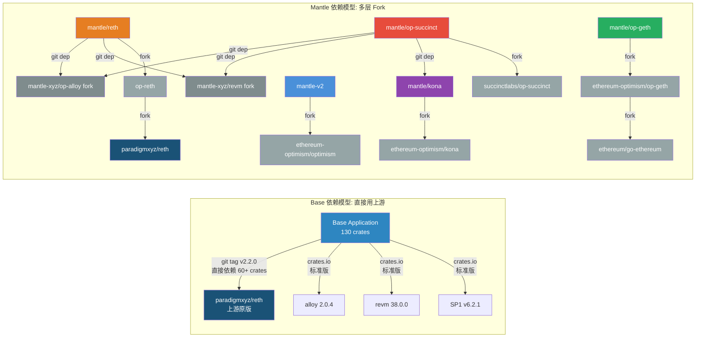
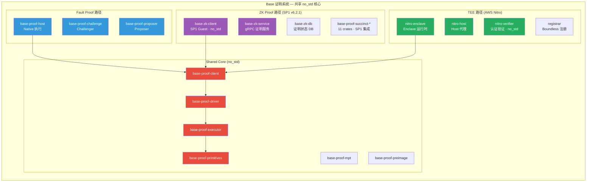
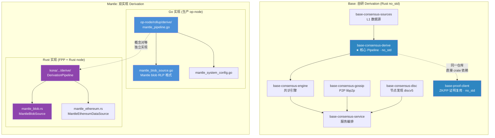
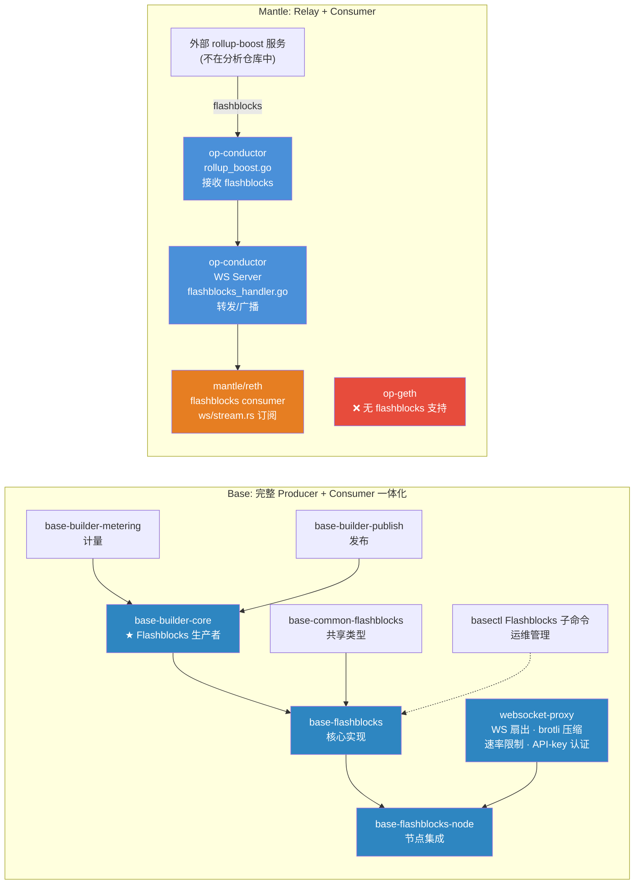
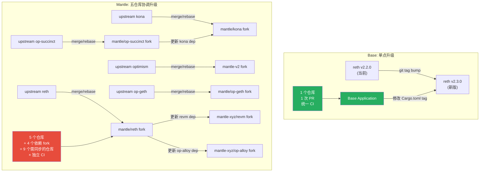

# Base vs Mantle 架构路线差异总览

> 本文档通过 Mermaid 图表对比 Base（自研全栈）与 Mantle（Fork 组合）两种截然不同的技术路线。

## 一、总体架构对比

### Base: Rust 单体仓库全栈架构

```mermaid
graph TB
    subgraph "Base Monorepo — 纯 Rust, 130 crates"
        direction TB

        subgraph "Binary Layer (bin/)"
            B1[base<br/>统一节点入口]
            B2[base-reth-node<br/>执行节点]
            B3[base-consensus<br/>共识节点]
            B4[base-builder<br/>区块构建器]
            B5[base-batcher<br/>L1 提交]
            B6[base-proposer<br/>Output 提交]
            B7[base-challenger<br/>争议挑战]
            B8[ingress-rpc<br/>交易入口]
            B9[base-prover-zk<br/>ZK 证明服务]
            B10[base-prover-nitro<br/>TEE 证明]
        end

        subgraph "Core Crates Layer (crates/)"
            C1[consensus/ — 13 crates<br/>自研 Derivation Pipeline<br/>base-consensus-derive ★ no_std]
            C2[execution/ — 20 crates<br/>基于 reth v2.2.0 直用<br/>含 Flashblocks 核心]
            C3[batcher/ — 7 crates<br/>自研 Batch 编码/提交]
            C4[builder/ — 3 crates<br/>区块构建 + Flashblocks 生成]
            C5[proof/ — 32 crates<br/>三合一证明系统<br/>FP + ZK SP1 + TEE Nitro]
            C6[common/ — 15 crates<br/>共享类型 ★ 大部分 no_std]
            C7[infra/ — 6 crates<br/>运维工具]
            C8[utilities/ — 10 crates<br/>CLI/Metrics/Health]
        end

        subgraph "Upstream Dependencies"
            U1["reth v2.2.0 (upstream)<br/>60+ crates · git tag 锁定<br/>非 op-reth fork"]
            U2["alloy 2.0.4 (标准)"]
            U3["revm 38.0.0 (标准)"]
            U4["SP1 v6.2.1 (标准)"]
        end
    end

    B3 --> C1
    B2 --> C2
    B4 --> C2
    B4 --> C4
    B5 --> C3
    B6 --> C5
    B7 --> C5
    B9 --> C5
    B10 --> C5
    C2 --> U1
    C2 --> U3
    C1 --> C6
    C5 --> C6

    style B1 fill:#2E86C1,color:white
    style B2 fill:#2E86C1,color:white
    style B3 fill:#2E86C1,color:white
    style B4 fill:#2E86C1,color:white
    style B5 fill:#2E86C1,color:white
    style B6 fill:#2E86C1,color:white
    style B7 fill:#2E86C1,color:white
    style B8 fill:#2E86C1,color:white
    style B9 fill:#2E86C1,color:white
    style B10 fill:#2E86C1,color:white
    style U1 fill:#1A5276,color:white
    style U2 fill:#1A5276,color:white
    style U3 fill:#1A5276,color:white
    style U4 fill:#1A5276,color:white
```



### Mantle: 多仓库多语言 Fork 组合架构

```mermaid
graph TB
    subgraph "mantle-v2 — Go OP Stack Monorepo (Fork)"
        direction TB
        M1[op-node<br/>Rollup 共识层<br/>Go Derivation]
        M2[op-batcher<br/>Batch 提交]
        M3[op-proposer<br/>Output 提交]
        M4[op-challenger<br/>争议挑战]
        M5[op-conductor<br/>HA Sequencer<br/>+ Flashblocks Relay]
        M6[cannon<br/>MIPS64 Fault Proof VM]
        M7[gas-oracle<br/>MNT/ETH Ratio 服务]
        M8[contracts-bedrock<br/>L1/L2 合约]
    end

    subgraph "mantle/reth — Rust EL (Fork of op-reth)"
        R1[op-reth Binary<br/>Rust 执行客户端]
        R2[Flashblocks Consumer<br/>WebSocket 订阅]
        R3[Mantle RPC Ext<br/>estimateTotalFee]
        R4[Mantle EVM Config<br/>硬分叉映射]
    end

    subgraph "mantle/op-geth — Go EL (Fork of op-geth)"
        G1[geth Binary<br/>Go 执行客户端]
        G2[Preconf Subsystem<br/>预确认]
        G3[MetaTx<br/>已废弃]
        G4[Keeper<br/>Ziren zkVM Guest]
        G5[BVM_ETH / TokenRatio<br/>双代币费用]
    end

    subgraph "mantle/kona — Rust Derivation (Fork of kona)"
        K1[Derivation Pipeline<br/>MantleBlobSource]
        K2[FPP Client/Host<br/>Fault Proof Program]
        K3[kona-node<br/>Rust Rollup Node]
        K4[batcher/comp<br/>Rust Batch 编码]
    end

    subgraph "mantle/op-succinct — ZK Proof (Fork of op-succinct)"
        S1[Validity Proposer<br/>Rust 服务]
        S2[Range Program<br/>SP1 Guest]
        S3[Aggregation Program<br/>SP1 Guest]
        S4[Validity Contracts<br/>OPSuccinctDisputeGame]
    end

    subgraph "Forked Dependencies"
        F1["mantle-xyz/revm v2.2.2"]
        F2["mantle-xyz/op-alloy v2.2.0"]
        F3["mantle-xyz/evm v2.2.1"]
        F4["mantle-xyz/kona v2.2.3"]
    end

    M1 -->|Engine API| R1
    M1 -->|Engine API| G1
    M5 -->|WebSocket| R2
    S2 -->|依赖| F4
    S2 -->|依赖| F1
    R1 -->|依赖| F1
    R1 -->|依赖| F2

    style M1 fill:#4A90D9,color:white
    style M2 fill:#4A90D9,color:white
    style M3 fill:#4A90D9,color:white
    style M4 fill:#4A90D9,color:white
    style M5 fill:#4A90D9,color:white
    style M6 fill:#4A90D9,color:white
    style M7 fill:#4A90D9,color:white
    style M8 fill:#4A90D9,color:white
    style R1 fill:#E67E22,color:white
    style R2 fill:#E67E22,color:white
    style R3 fill:#E67E22,color:white
    style R4 fill:#E67E22,color:white
    style G1 fill:#27AE60,color:white
    style G2 fill:#27AE60,color:white
    style G3 fill:#27AE60,color:white
    style G4 fill:#27AE60,color:white
    style G5 fill:#27AE60,color:white
    style K1 fill:#8E44AD,color:white
    style K2 fill:#8E44AD,color:white
    style K3 fill:#8E44AD,color:white
    style K4 fill:#8E44AD,color:white
    style S1 fill:#E74C3C,color:white
    style S2 fill:#E74C3C,color:white
    style S3 fill:#E74C3C,color:white
    style S4 fill:#E74C3C,color:white
    style F1 fill:#7F8C8D,color:white
    style F2 fill:#7F8C8D,color:white
    style F3 fill:#7F8C8D,color:white
    style F4 fill:#7F8C8D,color:white
```



## 二、上游依赖关系对比



## 三、证明系统架构对比

### Base: 三合一统一证明架构



### Mantle: 多路径分散证明架构

```mermaid
graph TB
    subgraph "Mantle 证明系统 — 多仓库多路径"
        direction TB

        subgraph "路径 A: Validity Proof ✅ 完整"
            VA1["op-succinct/validity/<br/>Rust Proposer 服务"]
            VA2["op-succinct/programs/<br/>SP1 v6.1.0 Guest<br/>(Range + Aggregation)"]
            VA3["op-succinct/contracts/<br/>OPSuccinctDisputeGame"]
            VA4["依赖: mantle-xyz/kona<br/>Derivation Pipeline"]
            VA5["依赖: mantle-xyz/revm<br/>EVM 执行"]
        end

        subgraph "路径 B: Cannon Fault Proof"
            VB1["mantle-v2/cannon/<br/>MIPS64 模拟器"]
            VB2["mantle-v2/op-challenger/<br/>Go 挑战代理"]
            VB3["mantle/kona FPP<br/>Client/Host"]
        end

        subgraph "路径 C: Keeper zkVM ⚠️ 实验性"
            VC1["op-geth/cmd/keeper/<br/>Go 无状态执行器"]
            VC2["Ziren zkVM<br/>MIPS ISA"]
        end

        subgraph "路径 D: ZK Fault Proof ⚠️ 仅合约"
            VD1["op-succinct/contracts/fp/<br/>OPSuccinctFaultDisputeGame<br/>game type = 42"]
            VD2["⚠️ Rust 服务层<br/>已从 workspace 移除"]
        end

        VA1 --> VA2
        VA2 --> VA4
        VA2 --> VA5
        VA1 --> VA3
        VB2 --> VB1
        VB3 -.->|"可证明 derivation"| VB2
        VC1 --> VC2
    end

    style VA1 fill:#27AE60,color:white
    style VA2 fill:#27AE60,color:white
    style VA3 fill:#27AE60,color:white
    style VB1 fill:#4A90D9,color:white
    style VB2 fill:#4A90D9,color:white
    style VB3 fill:#4A90D9,color:white
    style VC1 fill:#F39C12,color:white
    style VC2 fill:#F39C12,color:white
    style VD1 fill:#E74C3C,color:white
    style VD2 fill:#E74C3C,color:white
```



## 四、Derivation Pipeline 实现对比



## 五、Flashblocks 架构对比



## 六、版本升级路径对比



## 七、功能域覆盖热力图

```mermaid
%%{init: {'theme': 'base', 'themeVariables': {'fontSize': '14px'}}}%%
graph TD
    subgraph "功能域覆盖对比"
        direction TB
        H1["Execution Client<br/>Base: ✅ 自研 20 crates + reth 直用<br/>Mantle: ✅ reth fork + op-geth fork (双客户端)"]
        H2["Derivation Pipeline<br/>Base: ✅ 自研 no_std · 可嵌入 ZK<br/>Mantle: ✅ Go 生产 + Rust FPP (双实现)"]
        H3["Batcher<br/>Base: ✅ 自研 7 crates<br/>Mantle: ✅ Go op-batcher fork"]
        H4["Builder / Flashblocks<br/>Base: ✅✅ 完整 Producer + Consumer<br/>Mantle: ⚠️ 仅 Relay + Consumer"]
        H5["Proposer<br/>Base: ✅ 自研统一<br/>Mantle: ✅ Go + Rust Validity (两套)"]
        H6["Challenger<br/>Base: ✅ 自研<br/>Mantle: ✅ Go + Cannon"]
        H7["证明系统<br/>Base: ✅✅✅ FP + ZK + TEE 三合一<br/>Mantle: ⚠️ Validity ✅ / Cannon ✅ / Keeper ⚠️ / ZK FP ❌"]
        H8["Preconfirmation<br/>Base: ⚠️ Flashblocks 提供快速 pending 可见性（非等同 preconf 保证）<br/>Mantle: ✅ op-geth preconf 子系统"]
        H9["双代币 / 费用模型<br/>Base: — (标准 ETH)<br/>Mantle: ✅✅ MNT + BVM_ETH + TokenRatio + OperatorFee"]
    end
```



## 八、关键数字对比

| 维度 | Base | Mantle |
|------|------|--------|
| 仓库数量 | **1** | **5** (+ 4 依赖 fork = 9) |
| 编程语言 | **Rust only** | **Go + Rust** |
| Crate / 模块数 | **130** crates | reth ~200+ (fork 全量) + kona ~40+ + op-succinct ~15 + mantle-v2 多模块 + op-geth |
| Binary 入口 | **18** 主入口 + 10 脚本 | op-reth + geth + kona-node + kona-host + kona-client + validity + keeper + cannon + op-node + op-batcher + op-proposer + op-challenger + op-conductor + gas-oracle |
| 上游 reth 依赖层数 | **1** (直接 git tag) | **3** (mantle/reth → op-reth → reth) |
| Fork 需 rebase 的仓库 | **0** | **5** (reth + kona + op-succinct + optimism + op-geth) + **4** 依赖 fork |
| 证明路径 | **3** (FP + ZK + TEE) | **4** (Validity + Cannon + Keeper + ZK FP 合约) |
| no_std 支持 | ✅ consensus + proof + common 核心 | ⚠️ kona 部分 no_std |
| Flashblocks 完整度 | ✅ Producer + Consumer + Infra | ⚠️ Consumer + Relay only |
| Conductor / HA | 使用上游 `op-conductor:v0.9.2` + Rust 客户端接口 | Fork `op-conductor` 含 Raft + Flashblocks Relay |
| 合约源码 | 仅 Rust ABI 绑定（`sol!` 宏），无 Solidity 源码 | 完整 Solidity 源码 (`contracts-bedrock/`) |


---

# Base ↔ Mantle 组件映射关系表

> 基于 WHI-442（Base 架构分析）和 WHI-443（Mantle 多仓库分析）的已验证结论

## 一、核心组件映射

| 功能模块 | Base 实现 | Mantle 实现 | 关键差异 | 证据路径 / 待确认点 |
|----------|----------|-------------|----------|---------------------|
| **Execution Client** | `base/crates/execution/` (20 crates)<br/>基于上游 reth v2.2.0，非 op-reth fork | `mantle/reth` (fork of op-reth) +<br/>`mantle/op-geth` (fork of op-geth) | Base: 单一 Rust EL，直接用上游 reth<br/>Mantle: 双执行客户端 (Go+Rust)，三层 fork 链 | Base: 根 `Cargo.toml` 中 `reth-*` 均指向 `paradigmxyz/reth tag=v2.2.0`；执行客户端不 fork op-reth，也不直接依赖 kona/op-alloy<br/>Mantle: reth 依赖 mantle fork 的 revm/op-alloy/evm；op-geth 费用逻辑对齐确认于 `mantle_ext.rs` |
| **Rollup Node / Derivation** | `base/crates/consensus/` (13 crates)<br/>自研 `base-consensus-derive` (no_std) | `mantle-v2/op-node` (Go) +<br/>`mantle/kona` (Rust fork) | Base: 完全自研 Rust no_std derivation，无 kona 依赖<br/>Mantle: Go 生产 op-node + Rust kona fork（用于 FPP 和 Rust node） | Base: `base-consensus-derive` 位于 `crates/consensus/derive/`，支持 `no_std`<br/>Mantle Go: `op-node/rollup/derive/mantle_pipeline.go` + `mantle_blob_source.go`<br/>Mantle Rust: `kona/crates/protocol/derive/src/sources/mantle_blob.rs` |
| **Batcher** | `base/bin/batcher/` +<br/>`base/crates/batcher/` (7 crates)<br/>Rust 自研 | `mantle-v2/op-batcher/` (Go)<br/>OP Stack fork + `kona/crates/batcher/comp/` (Rust 移植) | Base: 自研 Rust batcher，含 encoder/service/admin<br/>Mantle: Go OP Stack batcher + Rust batch 编码库（kona 中） | Base: `bin/batcher/` 入口，`crates/batcher/` 含 core/service/encoder/source/admin/blobs/comp 7 个 crate<br/>Mantle Go: `mantle-v2/op-batcher/batcher/driver.go` 主驱动<br/>Mantle Rust: `kona/crates/batcher/comp/` 为 Mantle 新增 |
| **Builder / Flashblocks** | `base/bin/builder/` +<br/>`base/crates/builder/` (3 crates) +<br/>`base/crates/execution/flashblocks*` (2 crates)<br/>完整 Producer + Consumer 一体化 | `mantle/reth: crates/optimism/flashblocks/` (Consumer 端)<br/>`mantle-v2/op-conductor/rpc/ws/` (Relay/Proxy 端)<br/>`mantle-v2/op-conductor/client/rollup_boost.go` | Base: 拥有完整的 builder → flashblocks producer → consumer → metering → cache → RPC 全链路<br/>Mantle: 仅有 relay (op-conductor) + consumer (reth)，无自研 producer | Base: `base-builder-core` 生成 flashblocks，`base-flashblocks` 核心实现，`base-flashblocks-node` 节点集成<br/>Mantle relay: `op-conductor/rpc/ws/flashblocks_handler.go`<br/>Mantle consumer: `reth/crates/optimism/flashblocks/ws/stream.rs`<br/>Mantle producer: 来自外部 rollup-boost 服务（不在分析仓库中） |
| **Proposer** | `base/bin/proposer/` +<br/>`base/crates/proof/proposer/`<br/>Rust 自研 | `mantle-v2/op-proposer/` (Go OP Stack fork) +<br/>`mantle/op-succinct/validity/` (Rust Validity Proposer) | Base: 统一自研 proposer<br/>Mantle: Go 标准 proposer + Rust ZK validity proposer 两套 | Base: `base-proof-proposer` crate<br/>Mantle Go: `mantle-v2/op-proposer/proposer/`<br/>Mantle Rust: `op-succinct/validity/src/proposer.rs` 主循环 |
| **Challenger** | `base/bin/challenger/` +<br/>`base/crates/proof/challenge/`<br/>Rust 自研 | `mantle-v2/op-challenger/` (Go OP Stack fork) +<br/>`mantle-v2/cannon/` (MIPS64 VM) | Base: 自研 challenger，无 MIPS VM（原生/ZK/TEE 执行）<br/>Mantle: Go OP Stack challenger + Cannon MIPS VM | Base: `base-proof-challenge` crate<br/>Mantle: `mantle-v2/op-challenger/game/fault/` 含 solver/responder/contracts |
| **证明系统** | 三合一架构：<br/>• Fault Proof (`crates/proof/` 核心 no_std)<br/>• ZK SP1 (`crates/proof/succinct/` + `crates/proof/zk/`)<br/>• TEE Nitro (`crates/proof/tee/`) | 多路径架构：<br/>• Validity Proof (`op-succinct/validity/` SP1 v6.1.0) ✅ 完整<br/>• ZK Fault Proof (`op-succinct/contracts/src/fp/`) ⚠️ 仅合约<br/>• Cannon Fault Proof (`mantle-v2/cannon/` + `op-challenger/`)<br/>• Keeper zkVM (`op-geth/cmd/keeper/` Ziren MIPS) | Base: 共享 no_std 核心，三种证明路线统一架构<br/>Mantle: 分散在多仓库多语言中，Validity Proof Rust 服务完整，ZK FP Rust 服务已移除 | Base: `crates/proof/` 含 32 crates，核心 proof-client/driver/executor 均 no_std<br/>Mantle Validity: `op-succinct/validity/bin/validity.rs` 入口，SP1 v6.1.0<br/>Mantle ZK FP: `op-succinct/contracts/src/fp/OPSuccinctFaultDisputeGame.sol` 存在但 Rust 服务从 workspace 移除<br/>Mantle Cannon: `mantle-v2/cannon/mipsevm/` MIPS64 模拟器<br/>⚠️ **待确认**: Validity Proof 是否已在 Mantle 主网部署 |
| **合约层** | 仓库内仅有 Rust 合约绑定（alloy `sol!` 宏）：<br/>`crates/proof/contracts/` — dispute game management、anchor state registry、aggregate verifier 等 ABI 绑定<br/>⚠️ **无 Solidity 合约源码**（仅 `crates/utilities/test-utils/contracts/` 下有测试用 .sol）；生产合约源码仓库/路径待确认 | `mantle-v2/packages/contracts-bedrock/`<br/>含完整 Solidity 源码：BVM_ETH、GasPriceOracle、OperatorFeeVault、LegacyERC20MNT、MantlePreinstalls | Base: 仓库内无生产合约源码，仅有 Rust ABI 绑定<br/>Mantle: fork OP Stack contracts-bedrock，添加 MNT/BVM_ETH 双代币支持<br/>⚠️ **注意**：两侧合约层不在同一层面（源码 vs 绑定），不可直接对比 | Base: `crates/proof/contracts/src/` 含 `dispute_game_factory.rs`、`anchor_state_registry.rs` 等，使用 `alloy_sol_types::sol!` 宏声明接口；README 定义为 "Shared onchain contract bindings"<br/>Mantle: `contracts-bedrock/src/L2/BVM_ETH.sol`、`src/L2/GasPriceOracle.sol` 为完整 Solidity 源码<br/>⚠️ **待确认**: Base 生产合约源码所在的仓库（可能在 upstream Optimism contracts 或独立仓库） |
| **DA (数据可用性)** | EIP-4844 Blob 为主<br/>`base/crates/batcher/blobs/` blob 编解码<br/>`base/crates/batcher/encoder/` 支持 blob + calldata | Mantle blob 格式 (RLP 编码) + 标准 blob 回退<br/>`kona: MantleBlobSource` + `MantleEthereumDataSource`<br/>`mantle-v2: mantle_blob_source.go`<br/>`mantle-v2: op-alt-da/` Plasma 框架存在 | Base: 标准 EIP-4844 blob<br/>Mantle: 自定义 blob RLP 格式 + 标准格式回退机制 | Base: `crates/batcher/blobs/` — blob 处理<br/>Mantle Rust: `kona/.../sources/mantle_blob.rs` — Mantle blob 格式解码，失败后 `mantle_format_failed` 切换标准格式<br/>Mantle Go: `op-node/rollup/derive/mantle_blob_source.go` — Go 版 Mantle blob 源<br/>⚠️ **待确认**: EigenDA 曾在 Everest 审计中提及，但本地代码无 EigenDA 客户端实现，当前 DA 方案需确认 |

## 二、基础设施与运维组件映射

| 功能模块 | Base 实现 | Mantle 实现 | 关键差异 | 证据路径 |
|----------|----------|-------------|----------|----------|
| **Conductor / HA** | Sequencer 集成外部 op-conductor 兼容 API<br/>• `crates/consensus/service/src/actors/sequencer/conductor.rs` — Conductor trait + `ConductorClient` RPC 客户端<br/>• `bin/basectl/` Conductor 子命令 — TUI 监控/控制面<br/>• HA 服务端：使用上游 `op-conductor:v0.9.2` Docker 镜像 | `mantle-v2/op-conductor/`<br/>基于 Raft 共识的 HA Sequencer<br/>+ Flashblocks Relay | Base: 仓库内仅有 conductor 客户端接口和 TUI 监控；HA 服务端使用上游 Optimism 的 `op-conductor` Go 二进制<br/>Mantle: 独立 op-conductor 服务（fork），同时承担 flashblocks relay 职责 | Base: `conductor.rs` 定义 `trait Conductor` + `ConductorClient` HTTP wrapper；`etc/docker/docker-compose.ha.yml` 引用 `op-conductor:v0.9.2` 镜像；`crates/consensus/rpc/src/jsonrpsee.rs` 注释明确引用 upstream op-conductor<br/>Mantle: `op-conductor/conductor/service.go` + `consensus/raft.go` |
| **Gas 价格服务** | 标准 L1 → L2 gas 价格传递<br/>（通过 consensus 层处理） | `mantle-v2/gas-oracle/`<br/>独立服务，维护 MNT/ETH token ratio | Base: 标准 OP Stack L1 attributes 机制<br/>Mantle: 额外的 gas-oracle 服务，从 DEX 获取 MNT/ETH 实时比率写入 L2 GasPriceOracle predeploy | Mantle: `gas-oracle/tokenratio/tokenratio_dex.go` DEX 查询<br/>`gas-oracle/oracle/l1_client.go` L1 价格获取<br/>写入 `0x4200...000F` (GasPriceOracle) 的 `TOKEN_RATIO_SLOT` |
| **Ingress RPC** | `base/bin/ingress-rpc/`<br/>交易/Bundle 入口 + Tips 竞价 | 标准 RPC 端点<br/>（无独立 ingress 服务） | Base: 独立的交易入口 + bundle 竞价系统<br/>Mantle: 标准 RPC | Base: `ingress-rpc-lib` + `base-bundles`<br/>Mantle: 无等效组件 |
| **Preconfirmation** | 无独立 preconf 系统<br/>Flashblocks 提供快速 pending 状态可见性与订阅：<br/>• `eth_sendRawTransactionSync`（同步等待 flashblock 收录）<br/>• `eth_subscribe("newFlashblocks")`（pending 区块更新流）<br/>• pending tag 支持（getBalance/getTransactionCount/call/estimateGas 等） | `mantle/op-geth/preconf/` 完整子系统<br/>+ miner 集成 + RPC 扩展 | Base: 通过 Flashblocks 提供快速 pending 状态与订阅；是否构成 preconfirmation 级别保证需单独定义<br/>Mantle: 独立 preconf checker + miner 集成（op-geth 独有，reth 仅有 RPC 转发） | Base: `crates/execution/flashblocks/README.md` 文档列出 `eth_sendRawTransactionSync`、`newFlashblocks` 订阅、pending tag 支持；定位为 "pending transactions, blocks, and receipts before they are finalized on-chain" 可见性<br/>Mantle: `op-geth/preconf/` 包含 miner_config/tx_pool_config/preconf_checker<br/>`miner/preconf_checker.go` 集成到出块流程<br/>⚠️ `DefaultMinerConfig.EnablePreconfChecker = false`，**生产启用状态待确认** |
| **费用模型** | 标准 OP Stack L1 data fee 模型 | 三层费用：L2 Fee + L1 Data Fee × tokenRatio + Operator Fee<br/>MNT 原生代币 + BVM_ETH 双代币系统 | Base: 标准 ETH 计价<br/>Mantle: MNT 计价，需 tokenRatio 转换，额外 Operator Fee 层 | Mantle op-geth: `core/types/rollup_cost.go` 费用计算<br/>Mantle op-geth: `core/state_transition.go` tokenRatio 缩放<br/>Mantle reth: `optimism/rpc/src/eth/mantle_ext.rs` 对齐 op-geth 逻辑 |
| **MetaTx (Gas 赞助)** | 无 | `mantle/op-geth/core/types/meta_transaction.go`<br/>Everest 后已**完全禁用** | Base: 无此功能<br/>Mantle: 历史功能，已废弃但代码保留用于历史区块验证 | `op-geth/core/types/meta_transaction.go`: MetaTxV1→V2→V3→Everest 禁用<br/>`reth/docs/specs/2026-04-29-reject-mantle-metatx.md` |
| **监控/可观测性** | `base/bin/based/` 出块健康检查<br/>`base/crates/infra/` 含 metrics/health/load-tests | 标准 OP Stack 监控<br/>+ `gas-oracle` 内置 metrics | Base: 自研健康检查 sidecar + Prometheus + Datadog (StatsD)<br/>Mantle: 标准 OP Stack 方式 | Base: `based` binary + `base-metrics` + `base-health` crates |
| **WebSocket Proxy** | `base/bin/websocket-proxy/`<br/>独立扇出代理，brotli 压缩 + 速率限制 + API-key 认证 | 无独立 WS proxy<br/>（flashblocks WS 集成在 op-conductor 中） | Base: 生产级 WS 扇出基础设施<br/>Mantle: WS 功能内嵌于 op-conductor | Base: `websocket-proxy` crate，支持 brotli/rate-limit/API-key/Prometheus |

## 三、上游依赖关系映射

| 依赖维度 | Base | Mantle | 差异分析 |
|----------|------|--------|----------|
| **reth (EL 框架)** | 直接依赖上游 `paradigmxyz/reth v2.2.0`<br/>60+ crates，git tag 锁定 | Fork 链: `mantle/reth` → `op-reth` → `paradigmxyz/reth`<br/>三层 fork | Base 跳过 op-reth 层，直接构建差异层；Mantle 需经过两层 fork 合并 |
| **kona (Derivation)** | **不依赖**<br/>主 workspace 无 kona 任何 crate | Fork: `mantle-xyz/kona v2.2.3`<br/>→ `ethereum-optimism/kona` | Base 完全自研 derivation；Mantle fork kona 并添加 Mantle blob/hardfork 支持 |
| **op-alloy (OP 类型)** | 根 workspace **无直接依赖**，核心 OP 类型自研<br/>SP1 guest 子 workspace 的 `Cargo.lock` 中存在 `op-alloy-consensus` 传递依赖 | Fork: `mantle-xyz/op-alloy v2.2.0`<br/>→ `alloy-rs/op-alloy` | Base 不以 op-alloy 作为核心类型层；Mantle fork op-alloy 确保类型兼容 |
| **revm (EVM)** | 上游 `revm 38.0.0`<br/>标准 crates.io 发布版 | Fork: `mantle-xyz/revm v2.2.2`<br/>→ `bluealloy/revm` | Base 用标准 revm；Mantle fork revm 适配 Mantle EVM 行为 |
| **alloy (ETH 类型)** | `alloy 2.0.4`<br/>标准 crates.io 发布版 | Fork: `mantle-xyz/evm v2.2.1`<br/>→ `alloy-rs/evm` | Base 用标准 alloy；Mantle fork alloy evm 层 |
| **SP1 (ZK)** | `sp1-sdk v6.2.1`<br/>标准版 | `sp1-sdk v6.1.0`<br/>标准版 | Base 版本略新 (6.2.1 vs 6.1.0) |
| **Go OP Stack** | **不依赖** | Fork: `mantle-v2` → `ethereum-optimism/optimism`<br/>`mantle/op-geth` → `ethereum-optimism/op-geth` | Base 无 Go 组件；Mantle 核心生产组件仍为 Go |

## 四、编程语言与仓库结构映射

| 维度 | Base | Mantle |
|------|------|--------|
| **语言** | 纯 Rust | Go + Rust 混合 |
| **仓库数量** | 1 个单体仓库 | 5 个独立仓库 (reth + kona + op-succinct + mantle-v2 + op-geth) |
| **Workspace 规模** | 127 root-workspace members + 3 SP1 guest crates = 130 total | reth: ~200+ crates (fork 全量)<br/>kona: ~40+ crates<br/>op-succinct: ~15 crates<br/>mantle-v2: Go monorepo 多模块<br/>op-geth: Go 单模块 |
| **版本管理** | 统一 `workspace.package.version = "0.0.0"`<br/>单一 `Cargo.toml` | 各仓库独立版本 + 独立 fork tag<br/>(reth: v1.9.3-mantle-arsia.1, kona: v2.2.3, op-succinct: v3.4.1) |
| **Rust edition** | 2024, MSRV 1.93 | 各仓库跟随各自 upstream |
| **CI/CD** | 统一 (actions/harness, Justfile) | 各仓库独立 CI (GitHub Actions, CircleCI, Gitea) |


---

# "自研全栈" vs "Fork 组合" — 技术路线 Tradeoff 分析

> Base 基于上游 reth 从零自建全栈 vs Mantle fork 多个现成项目组合

## 一、两种技术路线概述

### Base 路线：基于上游 reth 从零自建

- 130 个 Rust crates 在单一 monorepo 中
- 直接依赖上游 `paradigmxyz/reth v2.2.0`（60+ crates），通过 git tag 锁定
- **不 fork** reth、kona、op-alloy、op-reth 中的任何一个；根工作区也不直接依赖 kona/op-alloy（SP1 guest 子工作区存在 op-alloy 的传递依赖）
- 所有 OP Stack 特定逻辑（derivation、consensus、proof、batcher、builder）均自研
- 纯 Rust 技术栈

### Mantle 路线：Fork 多个现成项目组合

- 5 个独立仓库：mantle/reth + mantle/kona + mantle/op-succinct + mantle-v2 + mantle/op-geth
- 4 个额外依赖 fork：mantle-xyz/revm + mantle-xyz/op-alloy + mantle-xyz/evm + mantle-xyz/kona
- Go + Rust 双语言栈
- 在成熟上游项目基础上添加 Mantle 特有定制

## 二、自研全栈的优势

### 2.1 完全架构掌控

Base 对从 EVM 执行到证明生成的全链路拥有完全控制：

| 层次 | Base 的掌控力 |
|------|-------------|
| EVM 执行 | 通过 `base-execution-evm` 直接定制预编译、gas metering、payload 构建 |
| Derivation | `base-consensus-derive` 完全自研，可自由设计 pipeline 阶段和数据源 |
| 证明系统 | 统一 no_std 核心，三种证明路线共享代码，架构层面一体化 |
| 区块构建 | Flashblocks 从 builder → producer → consumer → RPC 全链路自有 |
| Batcher | 完全自研编码器，无需适配上游 API 变化 |

**对比 Mantle**：Mantle 的定制空间受限于 fork diff 边界。例如 `mantle/reth` 的定制集中在 `crates/optimism/` 下的 EVM config、chainspec、RPC、flashblocks 几个模块，核心 reth 框架代码无法随意修改，否则会导致后续 rebase 冲突。

### 2.2 架构一致性与 no_std 复用

Base 最突出的架构优势是 **no_std 核心**在多个场景间的共享：

```
base-proof-client (no_std) ←── 同一份代码编译到：
├── Native 执行 (Fault Proof host)
├── SP1 zkVM   (ZK guest 程序)
└── AWS Nitro  (TEE enclave)

base-consensus-derive (no_std) ←── 同一份 derivation 代码用于：
├── 共识节点 (base-consensus-engine)
└── 证明客户端 (base-proof-client)
```

**对比 Mantle**：Mantle 的 derivation pipeline 存在 Go 和 Rust 两套独立实现。Go 版（`op-node/rollup/derive/`）用于生产，Rust 版（`kona/crates/protocol/derive/`）用于 FPP 证明。两者需保持功能一致但独立维护，增加了行为偏差风险。

### 2.3 零 Fork 维护负担

| 操作 | Base | Mantle |
|------|------|--------|
| 升级 reth | 修改 `Cargo.toml` 中 1 个 git tag | Rebase `mantle/reth` fork，解决冲突 |
| 升级 kona | 不适用（自研） | Rebase `mantle/kona` fork，更新 Mantle blob/hardfork 代码 |
| 升级 OP Stack | 不适用（自研） | 同时 rebase `mantle-v2` 和 `mantle/op-geth` |
| 升级 revm | 修改 crates.io 版本号 | Rebase `mantle-xyz/revm` fork |
| 总需 rebase 的仓库 | **0** | **9** (5 主 + 4 依赖 fork) |

### 2.4 单一语言栈优势

纯 Rust 带来：
- **统一工具链**：cargo、clippy、rustfmt、cargo-deny 一套配置覆盖全仓库
- **类型安全跨组件传递**：consensus 到 execution 到 proof 之间直接 crate 依赖，编译时类型检查
- **人才集中**：团队只需精通 Rust，无需同时维护 Go 技能栈
- **编译时安全保障**：跨组件的 API 变更由编译器强制检查

**对比 Mantle**：Go + Rust 双语言栈意味着：
- `op-node`（Go）通过 JSON-RPC Engine API 与 `reth`（Rust）通信，API 边界存在序列化/反序列化开销和类型不匹配风险
- 同一功能（如 `estimateTotalFee`）需在 Go 和 Rust 中分别实现并保持一致
- 团队需维护 Go 和 Rust 两套技能栈和工具链

### 2.5 深度优化空间

单仓库全自研允许 Base 做跨组件优化：
- **Flashblocks 架构级集成**：从 builder 构建到 execution 消费到 RPC 广播，无需跨仓库协调
- **证明系统统一优化**：ZK、FP、TEE 共享同一套 preimage oracle 和 proof driver
- **交易入口定制**：`ingress-rpc` + `base-bundles` 实现独立的交易入口和 tips 竞价，与 builder 紧密集成

## 三、自研全栈的劣势

### 3.1 开发成本高

Base 需自行实现和维护 OP Stack 的所有核心逻辑：

| 组件 | 自研工作量 |
|------|-----------|
| Derivation Pipeline | 13 crates (consensus 域)，涵盖 L1 遍历/检索/帧/通道/批次/属性全链路 |
| Batcher | 7 crates，含编码器/压缩/blob 处理/服务/管理 |
| Challenger | 自研 fault proof challenger，替代 OP Stack cannon + op-challenger |
| Proposer | 自研 output proposer |
| 证明系统 | 32 crates，三种证明路径并行开发维护 |

这些组件在 OP Stack 生态中已有成熟实现（kona、cannon、op-batcher 等），Mantle 通过 fork 即可获得基线功能。

### 3.2 需自行覆盖所有边界情况

OP Stack 社区发现的 bug 和边界情况通常直接反映在上游代码修复中。Base 自研实现意味着：
- 需独立发现和修复 derivation pipeline 中的边界情况
- 无法直接受益于 kona 社区的 bug fix
- 需自行处理 OP Stack 协议层面的兼容性要求

### 3.3 社区贡献受限

Base 的自研组件与 OP Stack 标准实现不兼容，限制了：
- 其他 Superchain 链直接复用 Base 的 Rust 实现
- 外部开发者对 Base 特有组件的贡献（学习曲线高）
- 与 OP Stack 生态工具的互操作

### 3.4 与 OP Stack 标准偏离风险

虽然 Base 作为 Superchain 成员需保持协议兼容，但自研实现可能在细微行为上产生偏差：
- Derivation pipeline 的边界行为（channel timeout、batch 重排等）
- Receipt 编码和 state root 计算的细微差异
- 未来 OP Stack 协议升级需完全自行适配

### 3.5 Pre-1.0 不确定性

Base 的 Rust 实现版本为 `v0.0.0`（workspace level），主网仍在从 Go OP Stack 迁移中：
- 尚未经历大规模生产验证
- 可能存在未发现的 edge case
- 迁移过渡期需同时维护新旧系统

## 四、Fork 组合的优势

### 4.1 快速复用成熟代码

Mantle 通过 fork 立即获得了经过生产验证的完整组件：

| 组件 | 上游 | 生产验证程度 |
|------|------|-------------|
| op-node | ethereum-optimism/optimism | OP Mainnet 主网运行 |
| op-geth | ethereum-optimism/op-geth | 多链主网运行 |
| op-batcher | ethereum-optimism/optimism | 多链主网运行 |
| cannon | ethereum-optimism/optimism | OP Mainnet fault proof |
| kona | ethereum-optimism/kona | 社区审计 |
| op-succinct | succinctlabs/op-succinct | 安全审计 (Spearbit) |

Mantle 的实际定制工作量相对集中：
- `mantle/reth`：主要修改 `crates/optimism/` 下 ~8 个文件（EVM config、chainspec、RPC ext、flashblocks）
- `mantle/kona`：新增 `mantle_blob.rs`、`mantle_ethereum.rs`、`mantle_hardfork.rs`、`batcher/comp/`
- `mantle/op-succinct`：仅替换底层依赖为 Mantle fork，几乎不修改 op-succinct 本身代码
- `mantle-v2`：添加并行的 `mantle_*.go` 文件，不修改 upstream 原文件
- `mantle/op-geth`：修改集中在 `state_transition.go`、`rollup_cost.go`、`meta_transaction.go` 等

### 4.2 跟进上游修复

当上游发现并修复安全漏洞或 bug 时，Mantle 可通过 rebase/merge 获取修复。这对于以下高风险组件尤其重要：
- EVM 执行正确性（revm）
- P2P 网络安全（libp2p/discv5）
- 共识层 bug（op-node）

### 4.3 社区共建

Fork 方式使 Mantle 自动受益于上游社区的：
- 功能增强（如 OP Stack 的 Interop/Jovian 升级）
- 性能优化
- 安全审计覆盖
- 文档和测试改进

### 4.4 添加式定制策略

Mantle 在大部分仓库中采用了明智的**添加式定制**策略：
- 新增并行文件（`mantle_*.go`、`mantle_*.rs`），不修改 upstream 原文件
- 通过 `mod.rs` 重导出扩展（kona）
- 通过依赖替换注入定制（op-succinct 替换 kona/revm/op-alloy 依赖）

这种策略显著降低了 rebase 冲突的概率。

## 五、Fork 组合的劣势

### 5.1 Fork Diff 维护成本

虽然 Mantle 尽量采用添加式修改，但部分核心文件的修改不可避免：

| 文件 | 修改性质 | Rebase 风险 |
|------|---------|------------|
| `op-geth/core/state_transition.go` | 重度修改（BVM_ETH、tokenRatio、MetaTx） | **高** — 每次 op-geth 升级都可能冲突 |
| `op-geth/core/types/rollup_cost.go` | 重度修改（Arsia 费用函数） | **高** |
| `op-geth/core/types/deposit_tx.go` | 扩展字段（EthValue/EthTxValue） | **中** |
| `reth/crates/optimism/evm/` | 添加 `mantle.rs` + 修改 mod | **低** — 添加式 |

### 5.2 上游 Breaking Change 跟进

当上游进行重大重构时，Mantle 需同步适配。历史上的风险点包括：
- reth 版本升级（v1.x → v2.x API 变化）
- OP Stack 协议升级（Holocene → Isthmus → Jovian）
- Go 版本升级要求

### 5.3 多仓库协调复杂度

5 个主仓库 + 4 个依赖 fork = 9 个需同步的仓库：

```
升级顺序约束:
1. mantle-xyz/revm → 2. mantle-xyz/op-alloy → 3. mantle-xyz/evm
       ↓                      ↓                        ↓
4. mantle/reth            5. mantle/kona
       ↓                      ↓
6. mantle/op-succinct (依赖 kona + revm)
7. mantle-v2 (独立 Go 升级)
8. mantle/op-geth (独立 Go 升级)
```

每个仓库有独立的 CI、独立的版本号、独立的发布流程。一次协议升级可能需要在 9 个仓库中创建对应的分支和 PR。

### 5.4 双语言一致性维护

Go 和 Rust 实现同一功能时需严格对齐：

| 功能 | Go 实现 | Rust 实现 | 一致性风险 |
|------|---------|----------|-----------|
| `estimateTotalFee` | `op-geth/internal/ethapi/api.go` | `reth/optimism/rpc/mantle_ext.rs` | reth 中注释 "精心对齐 op-geth 行为"，表明需手动保证一致 |
| Blob 数据源 | `mantle_blob_source.go` | `mantle_blob.rs` | 两种语言独立实现 Mantle RLP 格式解码 |
| 硬分叉配置 | `op-geth/params/mantle.go` + `op-core/forks/mantle_forks.go` | `reth/optimism/hardforks/` + `kona/.../mantle_hardfork.rs` | 4 处定义需同步 |
| Receipt root | `op-geth` 内置 | `reth/optimism/consensus/tests/mantle_receipt_root_from_rpc.rs` | 测试存在说明曾出现不一致 |

### 5.5 定制灵活性受限

Fork 模式下，Mantle 的创新空间受上游架构约束：
- **无法像 Base 那样实现 Flashblocks Producer**：需要修改 reth 核心的 payload builder 和 engine tree 逻辑，这会导致 fork diff 大幅增加
- **证明系统受 kona/op-succinct 架构限制**：Base 可以设计统一 no_std 核心共享三种证明路径，Mantle 的证明代码分散在 kona FPP + op-succinct validity + op-geth keeper 三个仓库中
- **EVM 定制需跨 revm fork 传递**：Mantle 的 EVM 行为定制需通过 `mantle-xyz/revm` fork 实现，再由 reth 和 op-succinct 引用，修改传播链长

## 六、上游跟进策略差异

### Base: Tag Bump

```
操作步骤:
1. 修改 Cargo.toml: reth-* tag = "v2.2.0" → "v2.3.0"
2. 编译，修复因 reth API 变化导致的编译错误
3. 运行测试套件
4. 完成

涉及: 1 个仓库, 1 个 PR
风险: API 兼容性破坏（但编译器会发现）
```

### Mantle: 多仓库 Rebase

```
操作步骤:
1. Rebase mantle-xyz/revm fork
2. Rebase mantle-xyz/op-alloy fork（依赖 revm）
3. Rebase mantle-xyz/evm fork
4. Rebase mantle/reth fork（依赖 revm + op-alloy + evm）
   → 解决 crates/optimism/ 中的冲突
5. Rebase mantle/kona fork
   → 解决 mantle_blob.rs / mantle_hardfork.rs 冲突
6. 更新 mantle/op-succinct 的 kona/revm 依赖版本
7. 分别升级 mantle-v2 和 mantle/op-geth（Go 仓库）
   → 解决 state_transition.go / rollup_cost.go 冲突
8. 跨仓库集成测试

涉及: 最多 9 个仓库, 多个 PR
风险: merge 冲突, 行为回归, 跨仓库版本不匹配
```

## 七、OP Stack 兼容性分析

### 7.1 Base 的兼容性策略

Base 虽然全部自研，但作为 Superchain 成员仍需保持 OP Stack 协议层面兼容：
- **Engine API 兼容**：通过标准 Engine API 与 OP Stack 生态工具交互
- **P2P 协议兼容**：使用标准 libp2p/discv5 gossip 协议
- **L1 合约兼容**：遵循 `SystemConfig`、`OptimismPortal`、`L2OutputOracle` 等标准合约接口
- **Derivation 语义兼容**：`base-consensus-derive` 需产出与标准 OP Stack derivation 相同的 L2 状态

**风险**：自研实现可能在边界行为上产生偏差。例如 channel timeout 处理、batch 重排逻辑、deposit 交易语义等细微差异，需通过全面的 E2E 测试覆盖。

### 7.2 Mantle 的兼容性策略

Mantle 通过 fork 天然保持协议兼容，但其定制引入了标准 OP Stack 所没有的特性：
- **MNT 原生代币 + BVM_ETH 双代币系统**：标准 OP Stack 不支持
- **Operator Fee**：额外费用层
- **Mantle Blob RLP 格式**：自定义 DA 编码
- **6 个 Mantle 特有硬分叉**：BaseFee → Everest → Euboea → Skadi → Limb → Arsia

这些定制使 Mantle 在功能上超出标准 OP Stack 范围，但保持了核心协议（derivation 语义、Engine API、L1 合约接口）的兼容性。

### 7.3 兼容性维度对比

| 兼容性维度 | Base | Mantle |
|-----------|------|--------|
| Derivation 语义 | 自研，需自行保证兼容 | Fork 天然兼容 + Mantle 扩展 |
| Engine API | ✅ 标准 | ✅ 标准 |
| P2P 协议 | ✅ 标准 libp2p | ✅ 标准 libp2p |
| L1 合约接口 | ✅ 标准（可能有定制合约） | ✅ 标准 + 定制合约 (BVM_ETH 等) |
| 协议升级跟进 | 需完全自行实现 | Rebase 上游即可获取 |
| 定制特性 | Flashblocks, TEE Proof, Ingress RPC | 双代币, Operator Fee, MetaTx(废弃), Preconf |

## 八、总结与建议

### 8.1 路线选择的核心决策因子

| 因子 | 倾向自研 | 倾向 Fork |
|------|---------|----------|
| 团队规模 | 大型专职团队 | 精简团队 |
| 技术栈偏好 | 统一单一语言 | 务实混合 |
| 创新自由度 | 需架构层创新（如 Flashblocks） | 功能层定制即可 |
| 上游跟进频率 | 上游 API 稳定，不频繁升级 | 需频繁跟进上游修复 |
| 生产验证要求 | 可接受 pre-1.0 风险 | 需要已验证的生产代码 |
| 差异化程度 | 深度定制（证明系统、构建器） | 参数和行为层面定制 |

### 8.2 Mantle 可从 Base 借鉴的方向

1. **统一 Derivation 实现**：考虑收敛到 Rust 单一 derivation pipeline（kona），减少 Go/Rust 双实现的一致性维护成本
2. **证明系统整合**：将分散在 op-succinct/kona FPP/op-geth keeper 三处的证明逻辑向统一架构收敛
3. **减少 Fork 层数**：评估是否可以像 Base 一样直接依赖上游 reth（而非通过 op-reth），减少 fork 维护层次
4. **no_std 核心复用**：在 Rust 组件中推广 no_std 设计，使同一份 derivation/proof 代码能在多种证明环境中复用

### 8.3 风险提示

- **Base 路线的主要风险**：Pre-1.0 的生产稳定性、与 OP Stack 标准的行为偏差、高维护成本
- **Mantle 路线的主要风险**：多仓库协调升级复杂度、Go/Rust 双实现一致性、fork diff 积累导致 rebase 困难
- **两者共同风险**：OP Stack 协议层面的重大变更（如 Interop/Superchain 新要求）对两种路线都会产生冲击
