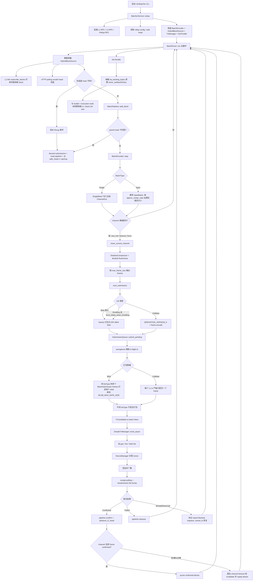
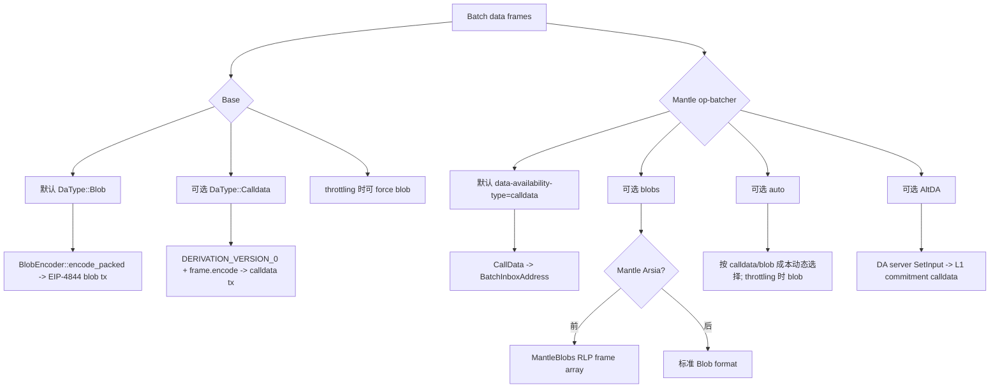
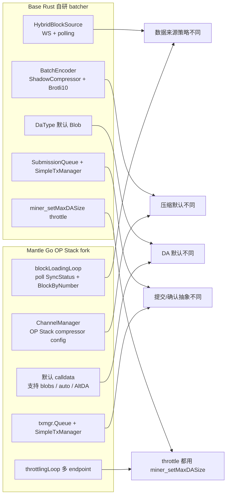
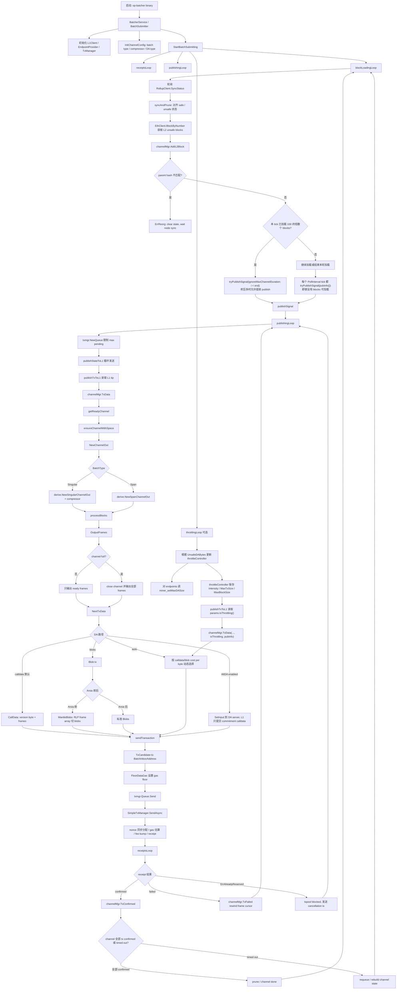

# Base Batcher 生命周期流程图

## 结论

Base 的 batcher 是 `base/bin/batcher` + `base/crates/batcher/*` 组成的 Rust 自研实现。主循环由 `BatchDriver` 驱动，把 L2 unsafe blocks 编码进 channel，按大小或 L1 高度超时关闭 channel，再按 `DaType` 生成 blob 或 calldata L1 交易，并通过自研 `SimpleTxManager` 做 nonce、gas、重试和确认跟踪。

## 生命周期图

## 阶段说明

| 阶段 | Base 实现 | 关键代码证据 |
|---|---|---|
| 数据收集 | `HybridBlockSource` 同时支持 L2 WS 订阅和 HTTP polling；catchup 时只走 polling，避免乱序。 | `references/codebase/base/crates/batcher/source/src/hybrid.rs:17`、`references/codebase/base/crates/batcher/source/src/hybrid.rs:140` |
| Reorg 处理 | 有两条触发路径：block source 检测同高度不同 hash；`BatchEncoder::add_block` 检测 parent hash 不匹配。两者都会让 driver 丢弃 in-flight submissions、reset encoder，并从 `safe_head + 1` 重新 catchup。 | `references/codebase/base/crates/batcher/source/src/hybrid.rs:76`、`references/codebase/base/crates/batcher/encoder/src/encoder.rs:463`、`references/codebase/base/crates/batcher/core/src/driver.rs:190`、`references/codebase/base/crates/batcher/core/src/driver.rs:263` |
| Channel 构建 | `BatchEncoder::open_new_channel` 使用 `ShadowCompressor`，压缩算法固定为 `Brotli10`。 | `references/codebase/base/crates/batcher/encoder/src/encoder.rs:327` |
| Batch 编码 | 支持 `SingleBatch` 和 `SpanBatch`；Span 通过 `approx_compr_ratio` 估算是否达到大小阈值。 | `references/codebase/base/crates/batcher/encoder/src/encoder.rs:482` |
| Frame 切分 | channel 关闭后 flush/close compressor，再按 `max_frame_size` 输出 frames。 | `references/codebase/base/crates/batcher/encoder/src/encoder.rs:255` |
| DA 选择 | `EncoderConfig` 默认 `DaType::Blob`，支持 `Blob` / `Calldata`；calldata 要求 `target_num_frames == 1`。 | `references/codebase/base/crates/batcher/encoder/src/config.rs:60`、`references/codebase/base/crates/batcher/encoder/src/config.rs:98`、`references/codebase/base/crates/batcher/encoder/src/submission.rs:18` |
| Throttle 与 Flashblocks builder 协同 | throttle 根据 backlog 调 `miner_setMaxDASize`，目标是 execution/builder 侧限制 DA size；这不是从 Flashblocks 读取 batch 数据，而是对出块侧的 DA 配额反馈。 | `references/codebase/base/crates/batcher/core/src/driver.rs:160`、`references/codebase/base/crates/batcher/service/src/throttle.rs:70` |
| L1 提交 | Blob 模式会把同 `DaType` 的多个 `BatchSubmission` frames 打包进一个 blob，直到 `BLOB_MAX_DATA_SIZE`；calldata 模式每个 L1 tx 严格只提交一个 frame；交易发送到 batch inbox。 | `references/codebase/base/crates/batcher/core/src/submissions.rs:45`、`references/codebase/base/crates/batcher/core/src/submissions.rs:69`、`references/codebase/base/crates/batcher/core/src/submissions.rs:74`、`references/codebase/base/crates/batcher/core/src/submissions.rs:83`、`references/codebase/base/crates/batcher/core/src/submissions.rs:94`、`references/codebase/base/crates/batcher/core/src/submissions.rs:109`、`references/codebase/base/crates/batcher/encoder/src/submission.rs:67` |
| gas / nonce / 重试 | `SimpleTxManager` 负责 gas/fee 估算、nonce 分配、签名、广播、receipt polling 和 fee bump。 | `references/codebase/base/crates/utilities/tx-manager/src/manager.rs:3`、`references/codebase/base/crates/utilities/tx-manager/src/manager.rs:16` |
| 确认跟踪 | confirmed 后 `pipeline.confirm` 并推进 L1 head；failed requeue；nonce slot 冲突则进入 txpool blocked 并尝试 cancel。 | `references/codebase/base/crates/batcher/core/src/submissions.rs:198` |

## 触发条件

| 触发 | 说明 | 证据 |
|---|---|---|
| 新 unsafe block | 来自 WS 或 polling，进入 encoder queue。 | `references/codebase/base/crates/batcher/source/src/hybrid.rs:162` |
| 大小阈值 | compressor 满、RLP 超限或 Span 估算压缩大小达到目标时关闭 channel。 | `references/codebase/base/crates/batcher/encoder/src/encoder.rs:546`、`references/codebase/base/crates/batcher/encoder/src/encoder.rs:580` |
| L1 高度超时 | `max_channel_duration - sub_safety_margin` 到达后关闭 channel；默认 `max_channel_duration = 2`。 | `references/codebase/base/crates/batcher/encoder/src/encoder.rs:358`、`references/codebase/base/crates/batcher/encoder/src/config.rs:98` |
| 手动 flush / shutdown | driver force close 当前 channel，再 drain in-flight receipts。 | `references/codebase/base/crates/batcher/core/src/driver.rs:174` |
| DA backlog throttle | backlog 过高时向 L2 execution/builder 发 `miner_setMaxDASize`，默认 throttle enabled 且 throttling 时强制 blob。 | `references/codebase/base/crates/batcher/service/src/config.rs:100` |
| Admin pause / resume | `Pause` 会 discard submissions、reset pipeline，并忽略后续 block / flush；`Resume` 后从最后 safe head 后重新 catchup。 | `references/codebase/base/crates/batcher/core/src/admin.rs:42`、`references/codebase/base/crates/batcher/core/src/driver.rs:305`、`references/codebase/base/crates/batcher/core/src/driver.rs:311`、`references/codebase/base/crates/batcher/core/src/driver.rs:353` |

---

# DA 路径确认结果

## 结论

Base 代码默认走 EIP-4844 Blob，并支持 calldata。Mantle `op-batcher` 代码默认走 calldata，支持 blobs、auto 和 AltDA；本地代码能确认这些能力，但不能仅凭仓库配置确认 Mantle 主网当前实际启动参数。

## DA 路径总览

## 代码能力 vs 本地可确认部署信息

| 项目 | 代码确认的 DA 能力 | 默认值 | 本地可确认的部署结论 | 证据 |
|---|---|---|---|---|
| Base batcher | `Blob` / `Calldata` 两种 `DaType`；Blob 可打包 frames，calldata 为 version byte + frame。 | `DaType::Blob`，CLI 默认 `blobs`。 | 仓库代码默认是 blob；生产是否显式覆盖为其他值，需要运行配置确认。 | `references/codebase/base/crates/batcher/encoder/src/config.rs:60`、`references/codebase/base/crates/batcher/encoder/src/config.rs:98`；`references/codebase/base/bin/batcher/src/cli.rs:124` |
| Base throttle | DA backlog throttle 可在配置为 calldata 时强制输出 blob，并调用 execution/builder 侧 `miner_setMaxDASize`。 | `force_blobs_when_throttling = true`。 | 可确认 batcher 与 builder/execution 的协同点是 DA quota 反馈，不是从 Flashblocks 读取数据。 | `references/codebase/base/crates/batcher/service/src/config.rs:100`；`references/codebase/base/crates/batcher/service/src/throttle.rs:70` |
| Mantle op-batcher | 支持 `calldata`、`blobs`、`auto`。 | `data-availability-type` 默认 `calldata`。 | 默认值可确认；主网实际启动参数未在本地仓库配置中直接确认。 | `references/codebase/mantle/mantle-v2/op-batcher/flags/types.go:8`；`references/codebase/mantle/mantle-v2/op-batcher/flags/flags.go:131` |
| Mantle blobs | `blobs` 模式会构造 blob tx；Arsia 前使用 Mantle RLP blob 格式，Arsia 后使用标准 blob。 | 非默认，需要 `data-availability-type=blobs` 或 `auto` 选择 blob。 | 代码能力可确认；是否当前生产启用 blobs 不能仅从本地代码确认。 | `references/codebase/mantle/mantle-v2/op-batcher/batcher/driver.go:1010`；`references/codebase/mantle/mantle-v2/op-batcher/batcher/tx_data.go:60` |
| Mantle auto | `auto` 使用动态 channel config，按 calldata/blob cost per byte 选择；throttle 通过 `params.IsThrottling()` 间接传入动态 config，throttling 时返回 blob config。 | 非默认。 | 代码能力可确认；是否部署使用 auto 需要运行参数确认。 | `references/codebase/mantle/mantle-v2/op-batcher/batcher/service.go:337`；`references/codebase/mantle/mantle-v2/op-batcher/batcher/driver.go:854`；`references/codebase/mantle/mantle-v2/op-batcher/batcher/channel_manager.go:227`；`references/codebase/mantle/mantle-v2/op-batcher/batcher/channel_config_provider.go:56` |
| Mantle AltDA | `UseAltDA` 时把 input 发到 DA server，L1 提交 commitment calldata；AltDA 与 blobs/auto 互斥。本地 `mantle-v2/op-alt-da/` 目录**不存在**（未被 fork 或已被移除），但 AltDA 接入代码分布在 `op-batcher` 和 `op-node` 中：batcher 侧 `publishToAltDAAndL1` 负责提交，derivation 侧 `altda_data_source.go` 负责读取，finality 侧 `altda.go` 负责挑战/确认。 | 非默认，取决于 AltDA CLI config。 | 本地代码确认 AltDA 接入能力（通过 `op-batcher` 和 `op-node` 中的 import 和调用），但没有确认生产启用。 | `references/codebase/mantle/mantle-v2/op-batcher/batcher/driver.go:914`；`references/codebase/mantle/mantle-v2/op-batcher/batcher/service.go:285`；`references/codebase/mantle/mantle-v2/op-node/rollup/derive/altda_data_source.go`（整个文件）；`references/codebase/mantle/mantle-v2/op-node/rollup/finality/altda.go`（整个文件） |
| Mantle EigenDA | `op-node/rollup/types.go` 有 legacy 字段注释提到 MantleDA(EigenDA)。 | 不是 op-batcher DA 类型默认值。 | 本地 `op-batcher` / `kona` 搜索未发现 EigenDA 客户端或直接提交路径实现；不能据此认定当前 batcher 生产使用 EigenDA。 | `references/codebase/mantle/mantle-v2/op-node/rollup/types.go:192`；本地搜索 `EigenDA/eigen` 仅命中该注释 |
| Mantle kona | `MantleBlobSource` 是 derivation 解码侧：识别 batcher 地址的 blob/call data，Mantle RLP decode 失败后 fallback 标准 blob。 | 不适用。 | 它证明 Mantle derivation 侧兼容 Mantle blob 格式和标准格式，不证明 op-batcher 运行参数。 | `references/codebase/mantle/kona/crates/protocol/derive/src/sources/mantle_blob.rs:31` |

## 需要避免的误读

- `mantle/kona/crates/batcher/comp` 不是 batcher daemon；它只是 compression types。完整提交、nonce、重试、receipt 逻辑在 `mantle-v2/op-batcher` 和 `op-service/txmgr`。
- 本地 `mantle-v2/op-alt-da/` 目录**不存在**（未被 fork 或已被移除）。AltDA 接入代码分布在 `op-batcher/batcher/driver.go`（`publishToAltDAAndL1`）、`op-node/rollup/derive/altda_data_source.go` 和 `op-node/rollup/finality/altda.go`；这证明代码支持 DA server + commitment/challenge 模式，实际启用需要部署参数。
- `op-node/rollup/types.go` 里 legacy EigenDA 注释不能单独作为当前 batcher DA 路径证据；本地代码未找到 EigenDA 客户端提交实现。

---

# Base vs Mantle Batcher 关键差异

## 差异总览

## 关键差异表

| 维度 | Base | Mantle | 影响 |
|---|---|---|---|
| 语言与架构 | Rust 自研，`bin/batcher` + `crates/batcher/*` 在 Base 单仓库内闭环。 | Go OP Stack fork，完整 daemon 在 `mantle-v2/op-batcher`；Rust `kona/crates/batcher/comp` 只是压缩库。 | Base 的 batcher 边界更集中；Mantle 需要同时看 `op-batcher`、`op-service/txmgr`、`op-node/kona` 的编码/解码兼容。 |
| 数据收集 | `HybridBlockSource` 可 WS 订阅 L2 blocks，并用 polling 兜底；catchup 时强制顺序 polling。 | `blockLoadingLoop` 按 tick 查询 rollup `SyncStatus`，再用 `BlockByNumber` 拉 unsafe block。 | Base 更偏事件流 + polling 混合；Mantle 更接近 OP Stack polling 驱动。 |
| Reorg 处理 | source 检测同高度不同 hash；`BatchEncoder::add_block` 也会检查 parent hash；driver discard submissions、reset pipeline、从 safe head 后 catchup。 | channel manager `AddL2Block` 检查 parent hash；reorg 后 clear state 并 wait node sync。 | 两者都会重置待提交状态；Base 同时有 source 侧和 pipeline 侧两条 reorg 入口。 |
| Channel / frame | Base `BatchEncoder` 内部状态机，无 async I/O；frames 只在 channel close 后进入 `ready_channels`，`next_submission()` 从 ready queue 读取，不支持 streaming frame 输出。 | Mantle `channelManager` / `ChannelBuilder` 可在 channel 未满时输出 ready frames，满时 close 并输出全部 frames。 | Mantle 保留 OP Stack 的 streaming frame 输出优化；Base 是 close-then-drain 模式。 |
| 压缩策略 | 默认 `ShadowCompressor + Brotli10`，配置里也用 `approx_compr_ratio` 支持 Span 估算。 | CLI 默认 compressor 是 `shadow`，compression algo 默认 `zlib`；Brotli 需要 Fjord 后才能启用。 | Base 默认压缩更激进；Mantle 默认更接近 OP Stack 兼容路径。 |
| DA 默认 | 默认 `Blob`，CLI 默认 `blobs`；calldata 是可选路径。 | CLI 默认 `calldata`；可选 `blobs`、`auto`、`AltDA`。 | 这是本地代码能确认的最大 DA 差异：Base 默认 blob 优先，Mantle 默认 calldata。 |
| DA 动态选择 | Base 没有按费用自动切 calldata/blob；但 throttling 时可强制 blob。 | `auto` 模式会按当前 calldata/blob 成本动态选；throttling 先更新 `throttleController` 状态，publish 时把 `isThrottling` 传入 `TxData`，动态 config 再返回 blob config。 | Mantle 的 auto 更偏成本选择，Base 的 override 更偏 backlog/throughput 控制。 |
| Blob 格式 | Base 使用标准 EIP-4844 blob packing。 | Arsia 前可使用 Mantle RLP frame array blob 格式；Arsia 后标准 blob。 | Mantle derivation 侧需要兼容历史 Mantle blob 格式和标准格式。 |
| L1 提交 | `SubmissionQueue` 把 frames 转成 `TxCandidate`，用 Rust `SimpleTxManager::send_async`。 | `publishStateToL1` 通过 `txmgr.Queue.Send` 和 Go `SimpleTxManager.SendAsync`。 | 两者都有 pending 限制、nonce 管理、fee bump、receipt 跟踪，但实现语言和抽象边界不同。 |
| 确认/重试 | Confirm 后 `pipeline.confirm + advance_l1_head`；failed requeue；`AlreadyReserved` 进入 txpool blocked 并 `cancel_tx`。 | Confirm 后 `TxConfirmed`；failed 调 `TxFailed` rewind；`ErrAlreadyReserved` 进入 blocked 并发 cancellation tx。 | 语义接近，Mantle 沿用 OP Stack txmgr 行为；Base 在 encoder/submission queue 内封装更集中。 |
| Flashblocks / builder | Base batcher 与 builder 的直接协同是 DA throttle RPC `miner_setMaxDASize`；没有证据显示 batcher 从 Flashblocks 读 batch 数据。 | Mantle 也有 `throttlingLoop` 调 endpoints 的 `miner_setMaxDASize`，并通过 `isThrottling` 状态间接影响 auto DA config；Flashblocks relay/consumer 在其他组件。 | Flashblocks 对 Base batcher 的影响应写成 DA backlog 反馈和出块限额，不应写成数据收集来源。 |

## 证据索引

| 结论 | 证据路径 |
|---|---|
| Base batcher 主循环 | `references/codebase/base/crates/batcher/core/src/driver.rs:142` |
| Base HybridBlockSource | `references/codebase/base/crates/batcher/source/src/hybrid.rs:17` |
| Base pipeline parent mismatch reorg | `references/codebase/base/crates/batcher/encoder/src/encoder.rs:463`、`references/codebase/base/crates/batcher/core/src/driver.rs:263` |
| Base close 后进入 ready queue | `references/codebase/base/crates/batcher/encoder/src/encoder.rs:261`、`references/codebase/base/crates/batcher/encoder/src/encoder.rs:312`、`references/codebase/base/crates/batcher/encoder/src/encoder.rs:592` |
| Base 默认 Blob | `references/codebase/base/crates/batcher/encoder/src/config.rs:98`、`references/codebase/base/bin/batcher/src/cli.rs:124` |
| Base Brotli10 ShadowCompressor | `references/codebase/base/crates/batcher/encoder/src/encoder.rs:327` |
| Base L1 提交和 requeue | `references/codebase/base/crates/batcher/core/src/submissions.rs:45`、`references/codebase/base/crates/batcher/core/src/submissions.rs:198` |
| Mantle batcher loops | `references/codebase/mantle/mantle-v2/op-batcher/batcher/driver.go:143` |
| Mantle block loading | `references/codebase/mantle/mantle-v2/op-batcher/batcher/driver.go:523` |
| Mantle publish signal | `references/codebase/mantle/mantle-v2/op-batcher/batcher/driver.go:300`、`references/codebase/mantle/mantle-v2/op-batcher/batcher/driver.go:305`、`references/codebase/mantle/mantle-v2/op-batcher/batcher/driver.go:559` |
| Mantle 默认 calldata | `references/codebase/mantle/mantle-v2/op-batcher/flags/flags.go:131` |
| Mantle auto DA / throttling 状态传递 | `references/codebase/mantle/mantle-v2/op-batcher/batcher/driver.go:854`、`references/codebase/mantle/mantle-v2/op-batcher/batcher/channel_manager.go:227`、`references/codebase/mantle/mantle-v2/op-batcher/batcher/channel_config_provider.go:49`、`references/codebase/mantle/mantle-v2/op-batcher/batcher/channel_config_provider.go:56` |
| Mantle blob/MantleBlobs | `references/codebase/mantle/mantle-v2/op-batcher/batcher/driver.go:1010`、`references/codebase/mantle/mantle-v2/op-batcher/batcher/tx_data.go:60` |
| Mantle txmgr queue | `references/codebase/mantle/mantle-v2/op-service/txmgr/queue.go:68` |
| Mantle kona comp 不是 daemon | `references/codebase/mantle/kona/crates/batcher/comp/README.md:8` |

---

# Mantle Batcher 生命周期流程图

## 结论

Mantle 的完整 batcher daemon 在 `references/codebase/mantle/mantle-v2/op-batcher`，是 Go 版 OP Stack fork。`references/codebase/mantle/kona/crates/batcher/comp` 是 Rust 压缩类型库，不是独立 batcher 进程。

## 生命周期图

## 阶段说明

| 阶段 | Mantle 实现 | 关键代码证据 |
|---|---|---|
| 进程边界 | 完整 daemon 是 `mantle-v2/op-batcher`；启动后开启 `receiptsLoop`、`publishingLoop`、`blockLoadingLoop`，以及可选 `throttlingLoop`。 | `references/codebase/mantle/mantle-v2/op-batcher/batcher/driver.go:143` |
| 数据收集 | `blockLoadingLoop` 按 `PollInterval` 轮询 rollup sync status，再用 active L2 endpoint 的 `BlockByNumber` 拉 unsafe blocks。 | `references/codebase/mantle/mantle-v2/op-batcher/batcher/driver.go:523`、`references/codebase/mantle/mantle-v2/op-batcher/batcher/driver.go:320` |
| Reorg 处理 | `AddL2Block` 按 parent hash 检测 reorg；发现 reorg 后清 state 并等待 node sync。 | `references/codebase/mantle/mantle-v2/op-batcher/batcher/driver.go:548`、`references/codebase/mantle/mantle-v2/op-batcher/batcher/channel_manager.go:494` |
| Channel 构建 | `channelManager` 通过 `NewChannelOut` 建 `SingularChannelOut` 或 `SpanChannelOut`，压缩参数来自 CLI/config。 | `references/codebase/mantle/mantle-v2/op-batcher/batcher/channel_builder.go:105` |
| Frame 生成 | channel 未满时只输出 ready frames；满时 close 并输出剩余全部 frames。 | `references/codebase/mantle/mantle-v2/op-batcher/batcher/channel_builder.go:292` |
| 触发条件 | 每个 polling tick 都 signal publish；大量积压时，每加载 100 blocks 也会发带 `ignoreMaxChannelDuration` 的特殊 signal 并通知 throttle；max channel duration、sequencer window、channel timeout 都可触发关闭。 | `references/codebase/mantle/mantle-v2/op-batcher/batcher/driver.go:300`、`references/codebase/mantle/mantle-v2/op-batcher/batcher/driver.go:305`、`references/codebase/mantle/mantle-v2/op-batcher/batcher/driver.go:559`、`references/codebase/mantle/mantle-v2/op-batcher/batcher/channel_builder.go:221` |
| DA 选择 | CLI 默认 `calldata`；支持 `calldata`、`blobs`、`auto`。`auto` 会按 gas/base/blob fee 估算 calldata vs blob 成本；throttle 通过 `params.IsThrottling()` 间接传入 `TxData`，再由动态 channel config 在 throttling 时返回 blob config。 | `references/codebase/mantle/mantle-v2/op-batcher/flags/flags.go:131`、`references/codebase/mantle/mantle-v2/op-batcher/batcher/driver.go:854`、`references/codebase/mantle/mantle-v2/op-batcher/batcher/channel_manager.go:227`、`references/codebase/mantle/mantle-v2/op-batcher/batcher/channel_config_provider.go:49`、`references/codebase/mantle/mantle-v2/op-batcher/batcher/channel_config_provider.go:56` |
| Mantle blob 格式 | Arsia 前使用 `MantleBlobs()`：每个 frame 加 version byte 后做 RLP frame array，再切分到 blobs；Arsia 后使用标准 blob。 | `references/codebase/mantle/mantle-v2/op-batcher/batcher/driver.go:1010`、`references/codebase/mantle/mantle-v2/op-batcher/batcher/tx_data.go:60` |
| AltDA | `UseAltDA` 时先把 calldata 形式的 txdata 发到 DA server，L1 只提交 commitment calldata；AltDA 与 blobs/auto 互斥。 | `references/codebase/mantle/mantle-v2/op-batcher/batcher/driver.go:914`、`references/codebase/mantle/mantle-v2/op-batcher/batcher/service.go:285` |
| L1 提交 | calldata/blob/AltDA commitment 最终都构造成 `TxCandidate`，目标为 `BatchInboxAddress`。 | `references/codebase/mantle/mantle-v2/op-batcher/batcher/driver.go:958` |
| gas / nonce / 重试 | `txmgr.Queue.Send` 限制 pending，nonce 在 `SendAsync` 返回前同步确定；`SimpleTxManager` 做 fee bump 和 receipt。 | `references/codebase/mantle/mantle-v2/op-service/txmgr/queue.go:68`、`references/codebase/mantle/mantle-v2/op-service/txmgr/txmgr.go:54` |
| 确认跟踪 | `receiptsLoop` 接收 txmgr receipt；成功调 `TxConfirmed`，失败调 `TxFailed` rewind frame cursor；`ErrAlreadyReserved` 进入 txpool blocked 并发送 cancellation tx。 | `references/codebase/mantle/mantle-v2/op-batcher/batcher/driver.go:567`、`references/codebase/mantle/mantle-v2/op-batcher/batcher/driver.go:1062`、`references/codebase/mantle/mantle-v2/op-batcher/batcher/driver.go:1091` |
| kona 关系 | `kona/crates/batcher/comp` 只是 compression types；kona 的 `MantleBlobSource` 是 derivation 解码侧，能识别 Mantle RLP blob 并 fallback 标准 blob。 | `references/codebase/mantle/kona/crates/batcher/comp/README.md:8`、`references/codebase/mantle/kona/crates/protocol/derive/src/sources/mantle_blob.rs:31` |
