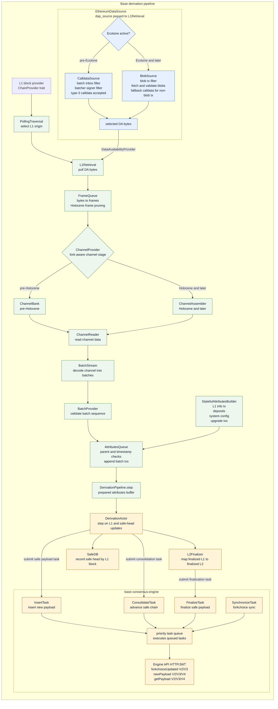
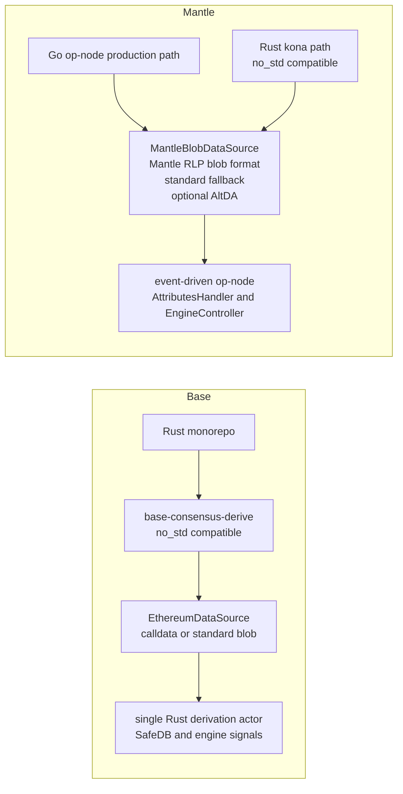
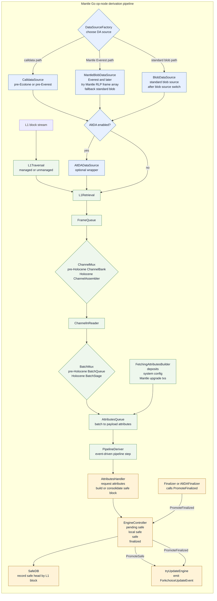
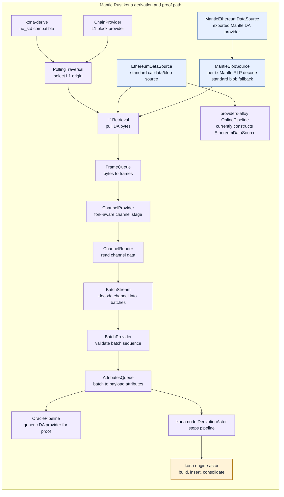

# Base Derivation Pipeline 流程图

## 结论

Base 的 L2 derivation 主要收敛在 `base-consensus-derive` 这个 Rust crate 中：它从 L1 calldata 或 blob 读取 batcher 数据，按 OP/Base derivation 规格依次解析 frame、channel、batch，最后生成 `BasePayloadAttributes` 并交给执行侧确认 safe / finalized L2 block。该 crate 明确声明为 `no_std` 兼容，适合复用到 fault proof VM 等受限环境。

## 流程图

## 本地源码证据

- crate 定位：`base-consensus-derive` README 说明它是 Base derivation pipeline 的 `no_std` 实现，并由 `EthereumDataSource`、`StatefulAttributesBuilder`、`PipelineBuilder` 组合完整 L2 derivation pipeline：`references/codebase/base/crates/consensus/derive/README.md:5`、`references/codebase/base/crates/consensus/derive/README.md:11-15`。`lib.rs` 在未启用 `metrics` 时启用 `no_std`：`references/codebase/base/crates/consensus/derive/src/lib.rs:8`。
- stage 组合顺序由 `PipelineBuilder` 写死：`PollingTraversal -> L1Retrieval -> FrameQueue -> ChannelProvider -> ChannelReader -> BatchStream -> BatchProvider -> AttributesQueue -> DerivationPipeline`，其中 `dap_source` 作为整体传入 `L1Retrieval::new(l1_traversal, dap_source)`：`references/codebase/base/crates/consensus/derive/src/pipeline/builder.rs:121-139`。
- DA 选择逻辑：`EthereumDataSource.next()` 在 Ecotone 之后调用内部 `blob_source`，否则调用内部 `calldata_source`，所以 `CalldataSource` / `BlobSource` 是 `EthereumDataSource` 的内部分支，而不是独立接到 `L1Retrieval` 的 pipeline stage：`references/codebase/base/crates/consensus/derive/src/sources/ethereum.rs:63-74`。calldata 读取会过滤 batch inbox 和 batcher signer，并接受 EIP-4844 type-3 calldata：`references/codebase/base/crates/consensus/derive/src/sources/calldata.rs:49-80`。blob source 会过滤 batcher tx、忽略 blob tx calldata、获取并校验 blob：`references/codebase/base/crates/consensus/derive/src/sources/blobs.rs:46-103`、`references/codebase/base/crates/consensus/derive/src/sources/blobs.rs:122-183`。
- frame 和 channel：`FrameQueue` 把 DA bytes 解析成 frames，并在 Holocene 后做 frame pruning：`references/codebase/base/crates/consensus/derive/src/stages/frame_queue.rs:28-145`。`ChannelProvider` 在 pre-Holocene 使用 `ChannelBank`，Holocene 后使用 `ChannelAssembler`：`references/codebase/base/crates/consensus/derive/src/stages/channel/channel_provider.rs:20-85`。
- attributes：`AttributesQueue` 从 batch 生成 payload attributes，校验 parent hash 和 timestamp，并追加 batch txs：`references/codebase/base/crates/consensus/derive/src/stages/attributes_queue.rs:22-34`、`references/codebase/base/crates/consensus/derive/src/stages/attributes_queue.rs:73-143`。`StatefulAttributesBuilder` 负责 deposits、system config update、L1 info tx 和升级交易：`references/codebase/base/crates/consensus/derive/src/attributes/stateful.rs:68-224`。
- pipeline 驱动：`DerivationPipeline.step` 从 attributes queue 拉取下一个 attributes，写入 prepared buffer，遇到 EOF 时推进 L1 origin：`references/codebase/base/crates/consensus/derive/src/pipeline/core.rs:221-257`。
- 节点集成：`DerivationActor` 调用 pipeline、把新 attributes 发给 engine、记录 SafeDB、处理 finalized L1 到 finalized L2：`references/codebase/base/crates/consensus/service/src/actors/derivation/actor.rs:140-213`、`references/codebase/base/crates/consensus/service/src/actors/derivation/actor.rs:227-339`。
- Engine 交互：`base-consensus-engine` README 描述的是 task-based engine client，通过 priority task queue 执行 `InsertTask`、`ConsolidateTask`、`FinalizeTask`、`SynchronizeTask`；`EngineClient` 通过 HTTP/JWT 调用 Engine API，并支持 `forkchoiceUpdated` V2/V3、`newPayload` V2/V3/V4、`getPayload` V2/V3/V4：`references/codebase/base/crates/consensus/engine/README.md:9-51`。
- finality 和 SafeDB：`L2Finalizer` 维护 L1 block number 到最高 L2 block number 的队列：`references/codebase/base/crates/consensus/service/src/actors/derivation/finalizer.rs:13-66`。SafeDB 是 derivation pipeline 的持久 safe head tracking，用来回答 `optimism_safeHeadAtL1`：`references/codebase/base/crates/consensus/safedb/README.md:3-14`。

---

# Base vs Mantle Derivation Pipeline 关键差异

## 总览图

## 差异表

| 维度 | Base | Mantle | 结论 |
| --- | --- | --- | --- |
| 主 derivation 实现 | `base-consensus-derive` 是 Base 自研 Rust pipeline，README 说明完整实现 L2 derivation，并可用于 fault proof VM：`references/codebase/base/crates/consensus/derive/README.md:11-15`。 | 可确认生产路径在 Go `op-node`，driver 直接装配 Go derivation pipeline 和 pipeline deriver：`references/codebase/mantle/mantle-v2/op-node/rollup/driver/driver.go:62-80`。Rust `kona-derive` 另有 no_std pipeline：`references/codebase/mantle/kona/crates/protocol/derive/README.md:8`。 | Base 的 derivation 更集中；Mantle 是 Go 生产路径加 Rust kona/proof 路径并存。 |
| 模块拆分 | Base 的 consensus 目录下有 13 个子 crate：`derive`、`engine`、`gossip`、`peers`、`disc`、`safedb`、`upgrades`、`protocol`、`sources`、`providers`、`rpc`、`cli`、`service`：`references/codebase/base/crates/consensus/`。 | Mantle Rust kona 按大域拆分为 `protocol/`、`node/`、`proof/`、`providers/`、`batcher/`、`supervisor/`、`utilities/`，其中 `protocol` 下含 derive/genesis/hardforks/interop/protocol/registry，`node` 下含 engine/gossip/peers/disc/sources/rpc/service，`proof` 下含 driver/executor/mpt/preimage/proof/std-fpvm 等：`references/codebase/mantle/kona/crates/`。Go op-node 则集中在 `rollup/derive`、`rollup/engine`、`rollup/attributes`、`rollup/finality`、`rollup/driver`、`node/safedb` 等目录：`references/codebase/mantle/mantle-v2/op-node/rollup/`、`references/codebase/mantle/mantle-v2/op-node/node/safedb/`。 | Base 在一个 consensus crate 家族内按节点能力拆分；Mantle Rust kona 按 protocol/node/proof/provider 域拆分，Go op-node 保留 OP Stack 的目录式模块组织。 |
| pipeline stage 形态 | stage 顺序由 Rust `PipelineBuilder` 组合：`PollingTraversal -> L1Retrieval -> FrameQueue -> ChannelProvider -> ChannelReader -> BatchStream -> BatchProvider -> AttributesQueue`：`references/codebase/base/crates/consensus/derive/src/pipeline/builder.rs:121-139`。 | Go path 的 stage 顺序为 `L1Traversal -> DataSourceFactory -> L1Retrieval -> FrameQueue -> ChannelMux -> ChannelInReader -> BatchMux -> AttributesQueue`：`references/codebase/mantle/mantle-v2/op-node/rollup/derive/pipeline.go:99-137`。Rust kona 的 stage 顺序与 Base 接近：`references/codebase/mantle/kona/crates/protocol/derive/src/pipeline/builder.rs:125-140`。 | 两边逻辑骨架接近，但 Mantle Go path 多了 `DataSourceFactory`、`ChannelMux`、`BatchMux` 和事件调度层。 |
| DA 数据格式 | Base `EthereumDataSource` 在 Ecotone 前走 calldata，之后走标准 blob：`references/codebase/base/crates/consensus/derive/src/sources/ethereum.rs:63-74`。calldata/blob 都按 batch inbox 和 batcher signer 过滤：`references/codebase/base/crates/consensus/derive/src/sources/calldata.rs:49-80`、`references/codebase/base/crates/consensus/derive/src/sources/blobs.rs:46-103`。 | Mantle Go `DataSourceFactory` 在 Mantle Everest 后先用 `MantleBlobDataSource`，Mantle RLP 解码失败后切到标准 blob fallback；AltDA 可外包裹：`references/codebase/mantle/mantle-v2/op-node/rollup/derive/data_source.go:72-97`、`references/codebase/mantle/mantle-v2/op-node/rollup/derive/mantle_blob_source.go:168-206`。 | Base 跟标准 OP blob/calldata 模型更一致；Mantle 为历史或自定义 blob 格式保留兼容层。 |
| fork / hardfork stage 切换 | Base `ChannelProvider` 按 Holocene 选择 `ChannelBank` 或 `ChannelAssembler`：`references/codebase/base/crates/consensus/derive/src/stages/channel/channel_provider.rs:20-85`。 | Mantle Go `ChannelMux` 和 `BatchMux` 都按 Holocene 切换 stage，并且 Mantle Arsia 会映射到 OP Holocene transform：`references/codebase/mantle/mantle-v2/op-node/rollup/derive/channel_mux.go:13-75`、`references/codebase/mantle/mantle-v2/op-node/rollup/derive/batch_mux.go:14-77`、`references/codebase/mantle/mantle-v2/op-node/rollup/derive/mantle_pipeline.go:8-27`。 | Mantle 的 stage 切换点更多，因为它同时承接 OP hardfork 和 Mantle 自有 hardfork。 |
| attributes builder | Base `StatefulAttributesBuilder` 处理 deposits、system config、L1 info tx，以及 Ecotone/Fjord/Isthmus/Jovian upgrade tx：`references/codebase/base/crates/consensus/derive/src/attributes/stateful.rs:68-224`。 | Mantle Go `FetchingAttributesBuilder` 处理 deposits、system config、Mantle Skadi/Arsia upgrade tx、Mantle base fee 等字段：`references/codebase/mantle/mantle-v2/op-node/rollup/derive/attributes.go:62-186`。 | 两边都按 parent safe head 和 L1 epoch 构造 deterministic payload attributes；Mantle 多了 Mantle 自有升级和费用字段。 |
| Engine 交互模式 | `base-consensus-engine` 是 task-based engine client：`Engine` 通过 priority task queue 原子执行 `InsertTask`、`ConsolidateTask`、`FinalizeTask`、`SynchronizeTask`；`EngineClient` 通过 HTTP/JWT 调用 Engine API，并支持 `forkchoiceUpdated` V2/V3、`newPayload` V2/V3/V4、`getPayload` V2/V3/V4：`references/codebase/base/crates/consensus/engine/README.md:9-51`。 | Mantle Go 的 `EngineController` 以事件处理器接收 unsafe、local safe、payload、forkchoice、reset 等事件，并通过 `TryUpdatePendingSafe`、`TryUpdateLocalSafe`、`PromoteSafe`、`PromoteFinalized` 推进状态；`PromoteSafe` 和 `PromoteFinalized` 都会调用 `tryUpdateEngine`：`references/codebase/mantle/mantle-v2/op-node/rollup/engine/engine_controller.go:706-847`。 | Base 把执行层交互抽象成任务队列；Mantle Go 继承 OP Stack 的事件驱动 controller，forkchoice 更新由状态推进触发。 |
| safe / finalized 集成 | Base `DerivationActor` 直接 step pipeline、发送 safe L2 signal、记录 SafeDB，并用 `L2Finalizer` 从 finalized L1 推导 finalized L2：`references/codebase/base/crates/consensus/service/src/actors/derivation/actor.rs:140-213`、`references/codebase/base/crates/consensus/service/src/actors/derivation/actor.rs:227-339`、`references/codebase/base/crates/consensus/service/src/actors/derivation/finalizer.rs:13-66`。 | Mantle Go 通过 `PipelineDeriver`、`AttributesHandler`、`EngineController` 事件链推进 pending safe、local safe、safe、finalized，并用 Pebble SafeDB 记录 safe head：`references/codebase/mantle/mantle-v2/op-node/rollup/derive/deriver.go:128-208`、`references/codebase/mantle/mantle-v2/op-node/rollup/attributes/attributes.go:135-235`、`references/codebase/mantle/mantle-v2/op-node/rollup/engine/engine_controller.go:767-845`、`references/codebase/mantle/mantle-v2/op-node/node/safedb/safedb.go:84-167`。 | Base 的节点集成路径更短；Mantle Go 继承 OP Stack 的事件驱动结构，状态推进更分散。 |
| Rust proof / no_std 复用 | Base derivation crate 明确是 `no_std`，并在 README 中说明用于 fault proof VM：`references/codebase/base/crates/consensus/derive/README.md:5-15`。 | Mantle `kona-derive` 也为 `no_std`，并导出 Mantle DA source：`references/codebase/mantle/kona/crates/protocol/derive/src/lib.rs:8`、`references/codebase/mantle/kona/crates/protocol/derive/src/lib.rs:31-35`。proof `OraclePipeline` 可接收泛型 DA provider：`references/codebase/mantle/kona/crates/proof/proof/src/l1/pipeline.rs:18-38`。 | 两边都有 Rust/no_std derivation 能力；Base 把主路径和 proof 复用集中在自研 Rust 栈，Mantle 则把 Go 生产路径与 Rust kona/proof 分开。 |

## 不应过度推断的点

- 不能写成“Rust kona online node 默认使用 Mantle DA source”。本地证据显示 `MantleEthereumDataSource` 和 `MantleBlobSource` 存在并导出，但 `providers-alloy` online pipeline 当前构造的是标准 `EthereumDataSource`：`references/codebase/mantle/kona/crates/providers/providers-alloy/src/pipeline.rs:6-10`、`references/codebase/mantle/kona/crates/providers/providers-alloy/src/pipeline.rs:38-40`、`references/codebase/mantle/kona/crates/providers/providers-alloy/src/pipeline.rs:100-124`、`references/codebase/mantle/kona/crates/providers/providers-alloy/src/pipeline.rs:134-158`。
- 不能把 Base 的 DA source 描述成 Mantle RLP 格式兼容。Base 本地代码只显示标准 calldata/blob 分支和 EIP-4844 blob 校验路径，没有 Mantle RLP frame array 兼容层：`references/codebase/base/crates/consensus/derive/src/sources/ethereum.rs:63-74`、`references/codebase/base/crates/consensus/derive/src/sources/blobs.rs:46-183`。

---

# Mantle Derivation Pipeline 流程图

## 结论

Mantle 当前可确认的生产 derivation 路径在 `mantle-v2/op-node` 的 Go 实现中。Mantle 另有 Rust `kona-derive` 路径，包含 Mantle blob source 和 `no_std` derivation crate，更多用于 kona node、proof / oracle pipeline 等 Rust 侧组件；但本次本地代码核对不能证明 `providers-alloy` 的 online pipeline 已默认使用 Mantle DA source。

## Go op-node 生产路径

### Go 路径证据

- driver 装配了 `EngineController`、finalizer、`AttributesHandler`、`NewDerivationPipeline` 和 `PipelineDeriver`：`references/codebase/mantle/mantle-v2/op-node/rollup/driver/driver.go:62-80`。
- pipeline stage 顺序为 `L1Traversal -> DataSourceFactory -> L1Retrieval -> FrameQueue -> ChannelMux -> ChannelInReader -> BatchMux -> AttributesQueue`：`references/codebase/mantle/mantle-v2/op-node/rollup/derive/pipeline.go:99-137`。
- DA source 选择逻辑：Ecotone 且 `blobSourceChanged` 后走标准 `BlobDataSource`；Mantle Everest 后走 `NewMantleBlobDataSource`；否则走 calldata；`altDAEnabled` 为 true 时才把已选 source 包裹成 `AltDADataSource`，否则直接返回已选 source：`references/codebase/mantle/mantle-v2/op-node/rollup/derive/data_source.go:38-97`。
- `MantleBlobDataSource` 先按 L1 交易顺序抽取 batcher tx；blob tx 会按交易聚合 blobs，先尝试 RLP 解码成 `[]eth.Data`，失败后触发 toggle 并 fallback 到标准 blob 数据：`references/codebase/mantle/mantle-v2/op-node/rollup/derive/mantle_blob_source.go:18-20`、`references/codebase/mantle/mantle-v2/op-node/rollup/derive/mantle_blob_source.go:70-117`、`references/codebase/mantle/mantle-v2/op-node/rollup/derive/mantle_blob_source.go:168-206`。
- Mantle fork transform 会把 Mantle Arsia 映射到 OP Holocene stage transform：`references/codebase/mantle/mantle-v2/op-node/rollup/derive/mantle_pipeline.go:8-27`。
- `ChannelMux` 在 reset / transform 时切换 `ChannelBank` 与 `ChannelAssembler`：`references/codebase/mantle/mantle-v2/op-node/rollup/derive/channel_mux.go:13-75`。`BatchMux` 在 reset / transform 时切换 `BatchQueue` 与 `BatchStage`：`references/codebase/mantle/mantle-v2/op-node/rollup/derive/batch_mux.go:14-77`。
- `AttributesQueue` 负责 batch 到 payload attributes 的转换，校验 parent hash 和 timestamp，并追加 batch transactions：`references/codebase/mantle/mantle-v2/op-node/rollup/derive/attributes_queue.go:16-25`、`references/codebase/mantle/mantle-v2/op-node/rollup/derive/attributes_queue.go:82-137`。
- `FetchingAttributesBuilder` 处理 deposits、system config、Mantle Skadi / Arsia upgrade tx、Mantle base fee 等字段：`references/codebase/mantle/mantle-v2/op-node/rollup/derive/attributes.go:62-186`。
- `PipelineDeriver` 以事件方式 step pipeline，并发出 derived attributes 或 idle/reset/temporary/critical 事件：`references/codebase/mantle/mantle-v2/op-node/rollup/derive/deriver.go:128-208`。
- `AttributesHandler` 请求新 attributes，或把 attributes 与已有 unsafe block 对齐并更新 pending/local safe：`references/codebase/mantle/mantle-v2/op-node/rollup/attributes/attributes.go:135-193`、`references/codebase/mantle/mantle-v2/op-node/rollup/attributes/attributes.go:196-235`。
- `EngineController` 以 `OnEvent` 处理 unsafe、local safe、payload、forkchoice、reset 等事件，并通过 `TryUpdatePendingSafe`、`TryUpdateLocalSafe`、`PromoteSafe`、`PromoteFinalized` 推进 pending safe、local safe、safe、finalized；`PromoteSafe` 和 `PromoteFinalized` 都会调用 `tryUpdateEngine`：`references/codebase/mantle/mantle-v2/op-node/rollup/engine/engine_controller.go:706-847`。
- `Finalizer` 在找到可 finalize 的 L2 block 后调用 `engineController.PromoteFinalized(ctx, finalizedL2)`；AltDA 模式下 `AltDAFinalizer` 包裹普通 finalizer：`references/codebase/mantle/mantle-v2/op-node/rollup/finality/finalizer.go:291`、`references/codebase/mantle/mantle-v2/op-node/rollup/finality/altda.go:21-46`。Go SafeDB 用 Pebble 记录 L1 block number 到 L2 safe head：`references/codebase/mantle/mantle-v2/op-node/node/safedb/safedb.go:84-167`。

## Rust kona 路径

### Rust kona 路径证据

- `kona-derive` README 声明它是 OP Stack derivation pipeline 的 `no_std` 实现：`references/codebase/mantle/kona/crates/protocol/derive/README.md:8`。`lib.rs` 在未启用 `metrics` 时启用 `no_std`，并导出 `MantleBlobSource` 与 `MantleEthereumDataSource`：`references/codebase/mantle/kona/crates/protocol/derive/src/lib.rs:8`、`references/codebase/mantle/kona/crates/protocol/derive/src/lib.rs:31-35`。
- Rust stage 组合与 Base 结构接近：`PollingTraversal -> L1Retrieval -> FrameQueue -> ChannelProvider -> ChannelReader -> BatchStream -> BatchProvider -> AttributesQueue`：`references/codebase/mantle/kona/crates/protocol/derive/src/pipeline/builder.rs:125-140`。
- `MantleEthereumDataSource` 是带 Mantle blob support 的 DA provider，但 `next()` 实际直接委托给 `MantleBlobSource`：`references/codebase/mantle/kona/crates/protocol/derive/src/sources/mantle_ethereum.rs:1-7`、`references/codebase/mantle/kona/crates/protocol/derive/src/sources/mantle_ethereum.rs:69-83`。
- `MantleBlobSource` 按交易处理 blobs，先尝试 Mantle RLP frame 格式，失败后设置 `mantle_format_failed` 并返回标准 blob 数据：`references/codebase/mantle/kona/crates/protocol/derive/src/sources/mantle_blob.rs:157-271`、`references/codebase/mantle/kona/crates/protocol/derive/src/sources/mantle_blob.rs:284-318`。
- proof 侧 `OraclePipeline` 接受泛型 `DA: DataAvailabilityProvider`，说明 proof pipeline 可以注入不同 DA provider：`references/codebase/mantle/kona/crates/proof/proof/src/l1/pipeline.rs:18-38`、`references/codebase/mantle/kona/crates/proof/proof/src/l1/pipeline.rs:50-75`。
- `providers-alloy` online pipeline 当前类型别名和构造函数使用的是标准 `EthereumDataSource`，不是 `MantleEthereumDataSource`：`references/codebase/mantle/kona/crates/providers/providers-alloy/src/pipeline.rs:6-10`、`references/codebase/mantle/kona/crates/providers/providers-alloy/src/pipeline.rs:38-40`、`references/codebase/mantle/kona/crates/providers/providers-alloy/src/pipeline.rs:100-124`、`references/codebase/mantle/kona/crates/providers/providers-alloy/src/pipeline.rs:134-158`。
- kona node derivation actor step pipeline，产出 attributes 后发送给 engine actor：`references/codebase/mantle/kona/crates/node/service/src/actors/derivation.rs:221-313`、`references/codebase/mantle/kona/crates/node/service/src/actors/derivation.rs:328-397`。

## 未确认点

- Rust `kona-derive` 中确实存在 Mantle DA provider，但 `providers-alloy` 的 online pipeline 当前直接构造标准 `EthereumDataSource`。因此不能从本次源码证据推出“Rust kona online node 默认使用 Mantle DA source”；只能确认 Mantle DA source 存在，并且 proof / generic pipeline 具备注入 DA provider 的结构。
