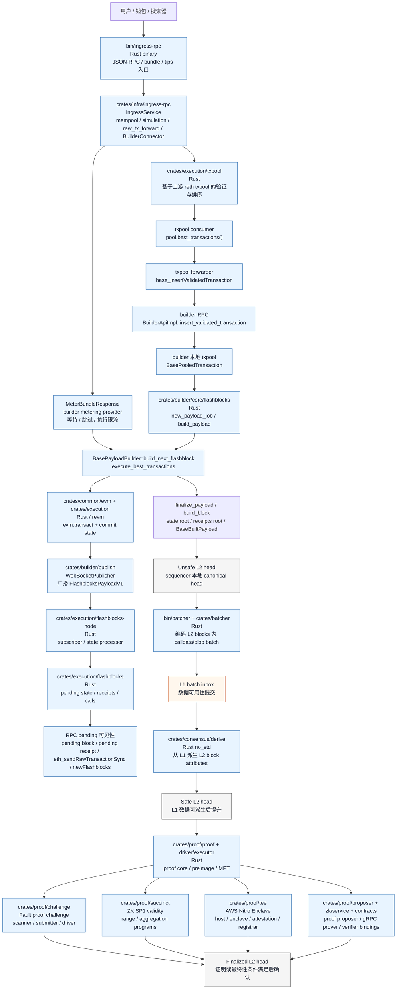
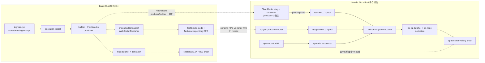
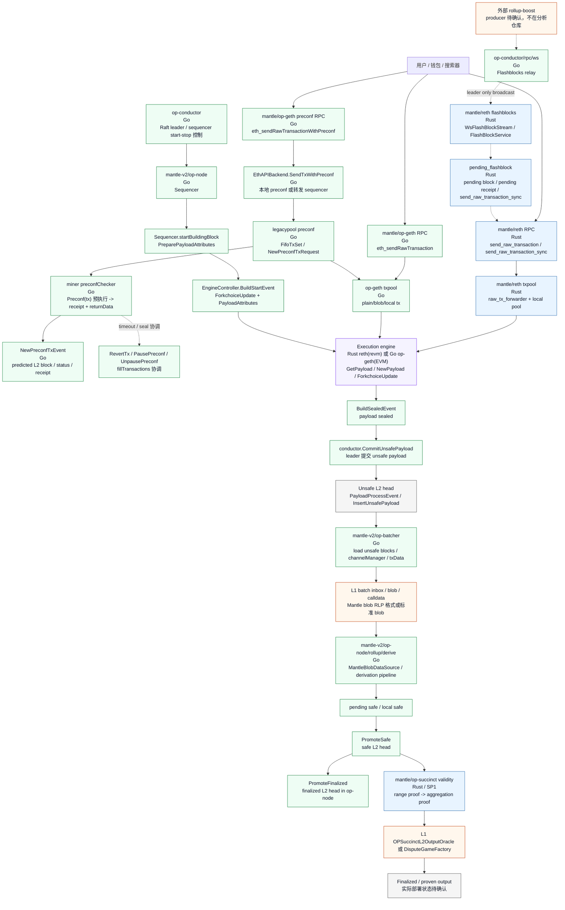

# Base L2 交易生命周期

## 结论

Base 的路径是单仓 Rust 链路：`bin/ingress-rpc` 是 binary 入口，核心 `IngressService` 在 `crates/infra/ingress-rpc/src/service.rs`，交易进入扩展 txpool 后转发给 builder。builder 生成 Flashblocks sub-block，`crates/builder/publish` 负责 WebSocket 广播，`crates/execution/flashblocks-node` 订阅并交给 `crates/execution/flashblocks` 管理 pending state 和 RPC 可见性。L1 batcher 提交数据后，op 派生路径把区块从 unsafe 推进到 safe；proof 目录下的 challenge、succinct、TEE、proposer、zk service 和 contracts 组成最终确认相关路径。

## Mermaid 流程图

## 调用链 / 组件路径

| 阶段 | 调用链 | 证据路径 |
|---|---|---|
| 用户提交 | `bin/ingress-rpc` 初始化 `IngressService::new`；`IngressService` 处理 mempool / simulation / raw_tx_forward / builder connector | `references/codebase/base/bin/ingress-rpc/src/main.rs`；`references/codebase/base/crates/infra/ingress-rpc/src/service.rs`；`references/codebase/base/crates/infra/ingress-rpc/README.md` |
| txpool 验证与转发 | `pool.best_transactions()` -> `Forwarder` -> `base_insertValidatedTransaction` -> `BuilderApiImpl::insert_validated_transaction` -> `pool.add_external_transaction` | `references/codebase/base/crates/execution/txpool/src/consumer/task.rs`；`references/codebase/base/crates/execution/txpool/src/forwarder/task.rs`；`references/codebase/base/crates/execution/txpool/src/builder/rpc.rs` |
| metering | `ingress-rpc` 广播 `MeterBundleResponse` -> `BuilderConnector` 转发给 builder；builder `metering_provider` 在 Flashblocks 执行时读取 metering 数据并处理 pending/limit | `references/codebase/base/crates/infra/ingress-rpc/src/service.rs`；`references/codebase/base/bin/ingress-rpc/src/main.rs`；`references/codebase/base/crates/builder/core/src/metering.rs`；`references/codebase/base/crates/builder/core/src/flashblocks/context.rs` |
| builder / Flashblocks producer | `BlockPayloadJobGenerator::new_payload_job` -> `BasePayloadBuilder::build_payload` -> `build_next_flashblock` -> `FlashblocksPayloadV1` | `references/codebase/base/crates/builder/core/src/flashblocks/generator.rs`；`references/codebase/base/crates/builder/core/src/flashblocks/payload.rs` |
| Flashblocks publisher | `FlashblocksServiceBuilder` 创建 `WebSocketPublisher`；`WebSocketPublisher::publish` 序列化并广播 payload | `references/codebase/base/crates/builder/core/src/flashblocks/service.rs`；`references/codebase/base/crates/builder/publish/src/publisher.rs`；`references/codebase/base/crates/builder/publish/README.md` |
| EVM 执行 | `execute_sequencer_transactions` / `execute_best_transactions` -> `evm.transact(...)` -> `evm.db_mut().commit(state)` | `references/codebase/base/crates/builder/core/src/flashblocks/context.rs`；`references/codebase/base/crates/common/evm/src/executor/block_executor.rs` |
| Flashblocks subscriber / pending state | builder 发布 `FlashblocksPayloadV1` -> node subscriber -> state processor -> pending blocks / receipts / calls / subscriptions | `references/codebase/base/crates/execution/flashblocks-node/src/extension.rs`；`references/codebase/base/crates/execution/flashblocks/src/state.rs`；`references/codebase/base/crates/execution/flashblocks/README.md` |
| Unsafe -> Safe | `crates/batcher` 提交 batch 到 L1；`crates/consensus/derive` 从 L1 数据派生 L2 状态 | `outputs/WHI-444_component-mapping-and-architecture-diff/component-mapping-table.md` |
| Safe -> Finalized | `crates/proof/challenge` 处理 fault proof challenge；`crates/proof/succinct` 处理 SP1 range / aggregation；`crates/proof/tee` 处理 Nitro Enclave；`crates/proof/proposer`、`crates/proof/zk`、`crates/proof/contracts` 提供 proposer、prover service 和合约绑定 | `references/codebase/base/crates/proof/challenge/src/scanner.rs`；`references/codebase/base/crates/proof/challenge/src/submitter.rs`；`references/codebase/base/crates/proof/challenge/src/driver.rs`；`references/codebase/base/crates/proof/succinct/programs/`；`references/codebase/base/crates/proof/tee/`；`references/codebase/base/crates/proof/proposer/`；`references/codebase/base/crates/proof/zk/service/`；`references/codebase/base/crates/proof/contracts/src/aggregate_verifier.rs`；`references/codebase/base/crates/proof/contracts/src/tee_prover_registry.rs` |

## 待确认点

- Base 生产合约源码不在本仓库内，本图只引用仓库内 Rust 合约绑定和证明组件。
- Safe -> Finalized 的实际生产策略可能按 Fault Proof、ZK、TEE 路线配置不同；本地代码能确认多套路径存在，但不能仅凭代码确认当前主网启用组合。

---

# L2 交易生命周期关键差异

## 差异摘要

| 维度 | Base | Mantle | 影响 |
|---|---|---|---|
| 交易入口 | 独立 `ingress-rpc`，统一接收交易、bundle、tips，并连接 builder；`IngressService` 在 `crates/infra/ingress-rpc` | 直连 execution RPC；reth 可转发到 sequencer；op-geth 另有 `eth_sendRawTransactionWithPreconf` | Base 入口更集中；Mantle 入口随执行客户端和 preconf 路径分散 |
| 语言栈 | Rust 单仓 | Go + Rust 多仓 | Base 调用链更短；Mantle 需要跨 repo、跨语言确认行为一致性 |
| txpool / builder 关系 | `txpool consumer/forwarder` 直接把已验证交易送到 builder RPC | `op-node` 通过 engine API 驱动 execution engine 构块，交易池在 reth/op-geth 侧；op-geth preconf 交易在 txpool 中被单独追踪并优先 seal | Base 的 builder 是一等组件；Mantle 更接近 OP Stack 标准 sequencer 架构，但 op-geth 增加了 Mantle 自有 preconf 扩展 |
| Flashblocks | builder 生成 sub-block delta，`crates/builder/publish` 广播，execution 节点订阅并写入 pending state/RPC | reth consumer 与 op-conductor relay 在仓库内；producer 看起来来自外部 rollup-boost | Base 可从本地代码闭环验证 producer -> consumer -> RPC；Mantle 的 Flashblocks 完整生产链路需部署配置和外部服务确认 |
| 预确认机制 | Flashblocks 通过 sub-block 增量和 pending RPC 提供更快可见性 | op-geth preconf 通过 `preconfChecker.Preconf(tx)` 在 miner env 中预执行交易，返回 receipt/status；必要时 `RevertTx` 回滚，`PausePreconf` / `UnpausePreconf` 和 seal 协调 | Mantle 有自己的 preconf 路径，但不是 Base Flashblocks 的同构实现 |
| 执行引擎 | 基于上游 reth + revm 的 Rust execution | mantle/reth(Rust/revm) 与 mantle/op-geth(Go/go-ethereum EVM) 并行 | Mantle 需要维护双 execution client 行为一致 |
| Unsafe -> Safe | Rust batcher + Rust derivation | Go op-batcher + Go op-node derivation，另有 Mantle blob RLP 格式 | Mantle 的 DA/derivation 路径有 Mantle 专用 blob 兼容逻辑 |
| Safe -> Finalized | `challenge`、`succinct`、`tee`、`proposer`、`zk`、`contracts` 等 proof 子目录覆盖 Fault Proof、ZK SP1、TEE 和 proposer/verifier 绑定 | op-succinct validity proof + fault-proof contracts + Go OP Stack challenger/Cannon 路径 | Base 证明系统集中在一个仓库下但子系统较多；Mantle 证明路径分散在多个仓库 |

## Mermaid 对比图

## 关键判断

- Base 的最大差异是把交易入口、builder、Flashblocks、execution pending state 和证明系统都放在 Rust 单仓内，代码链路可以本地闭环追踪。
- Mantle 的最大差异是多执行客户端和多仓组合：Go `op-node/op-batcher/op-conductor` 负责生产链路，Rust `reth/op-succinct` 负责 execution 替代实现和 ZK validity proof，op-geth 还增加了 Mantle 自有 preconf 路径。
- Flashblocks 对比需要分开看：Base 有 producer 到 RPC 可见性的完整路径；Mantle 本地代码确认 relay/consumer，但 producer 和生产启用状态仍需外部配置验证。
- 预确认不能简单写成 Base 有、Mantle 无：Mantle op-geth 的 preconf 是完整代码路径，但它通过 miner 预执行和 receipt/status 返回实现，不是 Flashblocks 的 sub-block 广播模型。
- 最终确认路径不能只按“有代码”判断：Base 的多证明路线和 Mantle 的 op-succinct validity 路线都需要结合实际部署配置确认主网使用状态。

## 证据索引

| 主题 | Base 路径 | Mantle 路径 |
|---|---|---|
| 入口 | `references/codebase/base/bin/ingress-rpc/`；`references/codebase/base/crates/infra/ingress-rpc/src/service.rs` | `references/codebase/mantle/reth/crates/optimism/rpc/src/eth/transaction.rs`；`references/codebase/mantle/op-geth/internal/ethapi/api.go` |
| txpool / builder | `references/codebase/base/crates/execution/txpool/`；`references/codebase/base/crates/builder/core/src/flashblocks/` | `references/codebase/mantle/mantle-v2/op-node/rollup/sequencing/sequencer.go`；`references/codebase/mantle/mantle-v2/op-node/rollup/engine/`；`references/codebase/mantle/op-geth/core/txpool/` |
| Flashblocks | `references/codebase/base/crates/builder/core/src/flashblocks/`；`references/codebase/base/crates/builder/publish/`；`references/codebase/base/crates/execution/flashblocks-node/`；`references/codebase/base/crates/execution/flashblocks/` | `references/codebase/mantle/reth/crates/optimism/flashblocks/`；`references/codebase/mantle/mantle-v2/op-conductor/rpc/ws/flashblocks_handler.go` |
| Preconf | Base Flashblocks 是主要预确认/快速可见路径 | `references/codebase/mantle/op-geth/internal/ethapi/api.go`；`references/codebase/mantle/op-geth/eth/api_backend.go`；`references/codebase/mantle/op-geth/core/txpool/legacypool/legacypool_preconf.go`；`references/codebase/mantle/op-geth/miner/preconf_checker.go`；`references/codebase/mantle/op-geth/tests/preconf/` |
| Batcher / derivation | `references/codebase/base/crates/batcher/`；`references/codebase/base/crates/consensus/derive/` | `references/codebase/mantle/mantle-v2/op-batcher/batcher/`；`references/codebase/mantle/mantle-v2/op-node/rollup/derive/` |
| Proof | `references/codebase/base/crates/proof/challenge/`；`references/codebase/base/crates/proof/succinct/`；`references/codebase/base/crates/proof/tee/`；`references/codebase/base/crates/proof/proposer/`；`references/codebase/base/crates/proof/zk/`；`references/codebase/base/crates/proof/contracts/` | `references/codebase/mantle/op-succinct/validity/`；`references/codebase/mantle/op-succinct/contracts/src/` |

## 待确认清单

- Mantle Flashblocks producer 是否为外部 rollup-boost，以及生产是否启用。
- Mantle op-geth preconf 是否在生产打开 `--miner.enablepreconfchecker`，以及 preconf tx 的 from/to/all 过滤规则。
- Mantle reth 与 op-geth 当前生产分工：哪一个服务公开 RPC，哪一个承担 sequencer execution。
- Base 当前主网最终确认采用 Fault Proof、ZK、TEE 中的哪一种或哪几种组合。
- Mantle op-succinct validity proof 是否已作为主网 finalized/proven output 的实际路径。

---

# Mantle L2 交易生命周期

## 结论

Mantle 的路径是 Go + Rust 混合链路：交易可进入 mantle/reth 或 mantle/op-geth 的 RPC/txpool，生产排序主体在 `mantle-v2/op-node`，execution engine 可由 reth 或 op-geth 执行。Flashblocks 在本地代码中主要表现为 reth consumer 和 op-conductor relay；另外，op-geth 有独立 preconf 预确认系统，`eth_sendRawTransactionWithPreconf` 会把交易送入 txpool preconf 路径，由 miner 内的 `preconfChecker` 预执行并返回 receipt/status。这个 preconf 机制和 Base Flashblocks 都服务于更快确认，但实现方式不同；本地代码能确认完整执行路径，生产是否开启仍需部署参数确认。

## Mermaid 流程图

## 调用链 / 组件路径

| 阶段 | 调用链 | 语言 | 证据路径 |
|---|---|---|---|
| 用户提交到 reth | `OpEthApi::send_raw_transaction` -> 可选 `raw_tx_forwarder.forward_raw_transaction` -> 本地 `pool.add_transaction` | Rust | `references/codebase/mantle/reth/crates/optimism/rpc/src/eth/transaction.rs` |
| reth pending / Flashblocks receipt | `send_raw_transaction_sync` 同时监听 canonical stream 和 `pending_block_rx`；`transaction_receipt` 可查 pending flashblock | Rust | `references/codebase/mantle/reth/crates/optimism/rpc/src/eth/transaction.rs`；`references/codebase/mantle/reth/crates/optimism/rpc/src/eth/pending_block.rs` |
| reth Flashblocks consumer | `WsFlashBlockStream` -> `FlashBlockService` -> `FlashBlockBuilder::execute` -> pending block | Rust | `references/codebase/mantle/reth/crates/optimism/flashblocks/src/service.rs`；`references/codebase/mantle/reth/crates/optimism/flashblocks/src/worker.rs`；`references/codebase/mantle/reth/crates/optimism/node/src/args.rs` |
| op-geth 普通交易入口 | `eth_sendRawTransaction` -> `SubmitTransaction` / `SendTx` -> txpool pending | Go | `references/codebase/mantle/op-geth/internal/ethapi/api.go`；`references/codebase/mantle/op-geth/eth/api_backend.go` |
| op-geth preconf RPC | `TransactionAPI.SendRawTransactionWithPreconf` -> `EthAPIBackend.SendTxWithPreconf` -> `sendTxWithPreconf` -> `SendTx` -> 等待 `NewPreconfTxEvent` 返回 status / receipt | Go | `references/codebase/mantle/op-geth/internal/ethapi/api.go`；`references/codebase/mantle/op-geth/eth/api_backend.go`；`references/codebase/mantle/op-geth/eth/filters/api.go` |
| op-geth preconf txpool / miner | `LegacyPool.addPreconfTx` -> `handlePreconfTx` -> `NewPreconfTxRequest` -> `Miner.preconfLoop` -> `preconfChecker.Preconf` -> `applyPreconfTransaction`；超时或冲突时 `RevertTx` 回滚快照 | Go | `references/codebase/mantle/op-geth/core/txpool/legacypool/legacypool_preconf.go`；`references/codebase/mantle/op-geth/core/txpool/txpool_preconf.go`；`references/codebase/mantle/op-geth/miner/miner_preconf.go`；`references/codebase/mantle/op-geth/miner/preconf_checker.go` |
| op-geth preconf sealing 协调 | `miner.fillTransactions` 调用 `PausePreconf`；优先提交 `PendingPreconfTxs`；结束后 `UnpausePreconf` 用新 env 恢复预确认 | Go | `references/codebase/mantle/op-geth/miner/worker.go`；`references/codebase/mantle/op-geth/miner/preconf_checker.go`；`references/codebase/mantle/op-geth/core/txpool/locals/preconf_tx_tracker.go` |
| op-geth preconf 配置与测试 | CLI 暴露 `--miner.enablepreconfchecker`、preconf txpool 过滤和 timeout 参数；`preconf/` 包含 config、FIFO、sync status、metrics、deposit log/source；`tests/preconf/` 覆盖压力和集成场景 | Go | `references/codebase/mantle/op-geth/cmd/utils/flags.go`；`references/codebase/mantle/op-geth/preconf/`；`references/codebase/mantle/op-geth/tests/preconf/` |
| op-conductor HA / relay | `OpConductor` 初始化 Raft、RPC、health monitor、flashblocks handler；handler 从 rollup-boost WS 读取消息，仅 leader 广播给客户端 | Go | `references/codebase/mantle/mantle-v2/op-conductor/conductor/service.go`；`references/codebase/mantle/mantle-v2/op-conductor/consensus/raft.go`；`references/codebase/mantle/mantle-v2/op-conductor/rpc/ws/flashblocks_handler.go` |
| op-node sequencer 排序 | `Sequencer.startBuildingBlock` -> `PreparePayloadAttributes` -> `BuildStartEvent` -> `EngineController.startPayload` | Go | `references/codebase/mantle/mantle-v2/op-node/rollup/sequencing/sequencer.go`；`references/codebase/mantle/mantle-v2/op-node/rollup/engine/build_start.go`；`references/codebase/mantle/mantle-v2/op-node/rollup/engine/engine_controller.go` |
| execution / unsafe 写入 | `BuildSealEvent` -> `GetPayload` -> `BuildSealedEvent` -> `PayloadProcessEvent` -> `InsertUnsafePayload` / `NewPayload` / `ForkchoiceUpdate` | Go 调度；执行端 Rust 或 Go | `references/codebase/mantle/mantle-v2/op-node/rollup/engine/build_seal.go`；`references/codebase/mantle/mantle-v2/op-node/rollup/engine/build_sealed.go`；`references/codebase/mantle/mantle-v2/op-node/rollup/engine/engine_controller.go` |
| unsafe -> safe | `op-batcher` 拉取 unsafe blocks -> `channelManager.AddL2Block` -> `TxData` -> blob/calldata tx -> L1；`op-node/derive` 读取 L1 batcher data 并推进 `TryUpdatePendingSafe` / `TryUpdateLocalSafe` / `PromoteSafe` | Go | `references/codebase/mantle/mantle-v2/op-batcher/batcher/driver.go`；`references/codebase/mantle/mantle-v2/op-batcher/batcher/channel_manager.go`；`references/codebase/mantle/mantle-v2/op-node/rollup/derive/mantle_blob_source.go`；`references/codebase/mantle/mantle-v2/op-node/rollup/engine/engine_controller.go` |
| safe -> finalized / proof | `op-succinct/validity` proposer 增加 range requests、请求 range/aggregation proof、提交 aggregation proof 到 `OPSuccinctL2OutputOracle` 或 `DisputeGameFactory` | Rust | `references/codebase/mantle/op-succinct/validity/bin/validity.rs`；`references/codebase/mantle/op-succinct/validity/src/proposer.rs`；`references/codebase/mantle/op-succinct/validity/src/proof_requester.rs` |

## 待确认点

- Mantle reth 的 Flashblocks consumer 和 op-conductor relay 在代码中存在，但生产是否启用 `--flashblocks-url` / `RollupBoostWsURL` 需要部署配置确认。
- 本地分析仓库没有看到 Flashblocks producer；op-conductor 连接的是外部 rollup-boost WebSocket，因此 producer 归属不能从本仓库确认。
- op-geth preconf 的 RPC、txpool、miner、config 和测试路径完整存在；默认 `EnablePreconfChecker=false`，生产是否启用 `--miner.enablepreconfchecker` 以及 preconf tx 过滤规则需要部署配置确认。
- op-succinct validity proof 服务和合约路径完整存在，但是否已在 Mantle 主网承担最终确认，需要部署状态确认。
