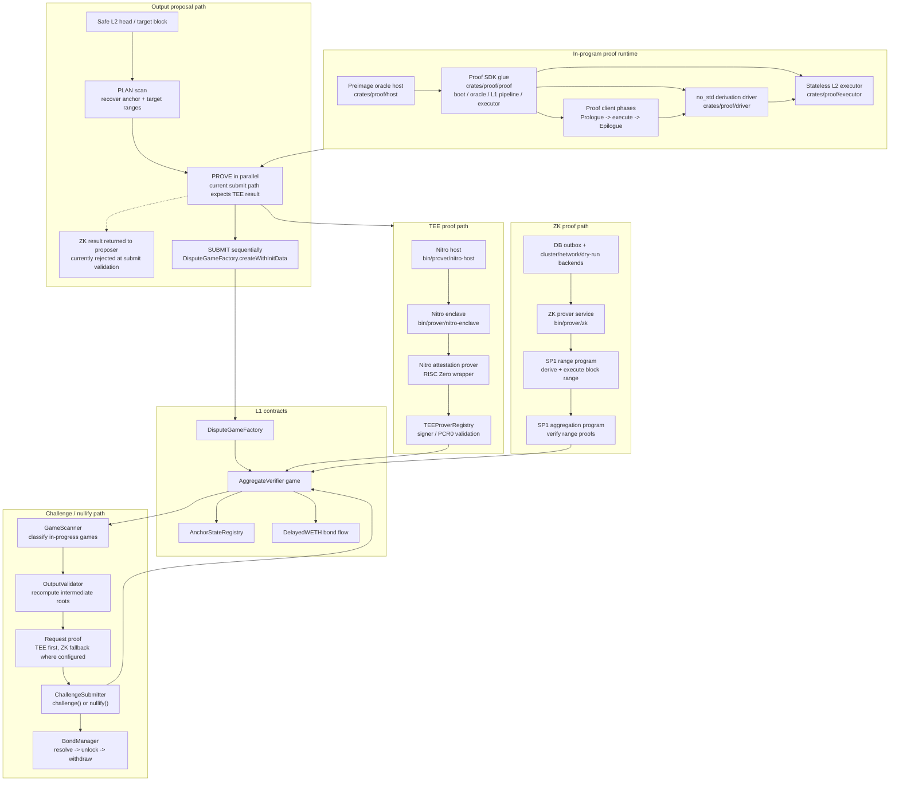
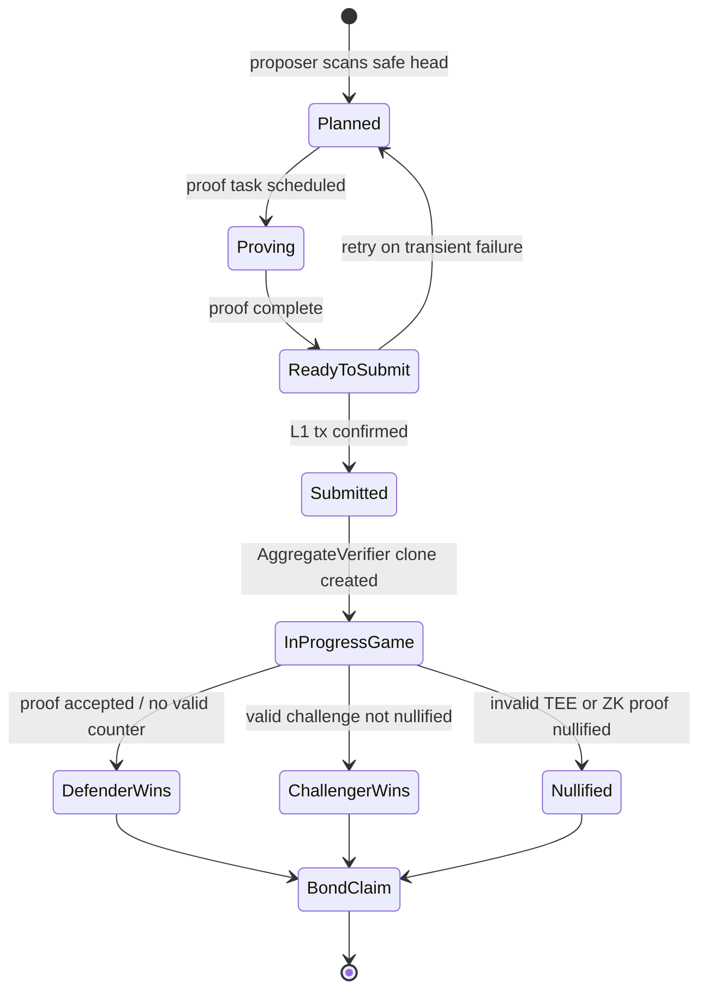
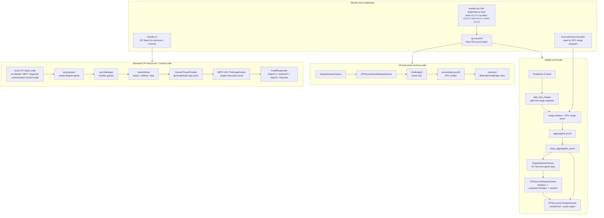
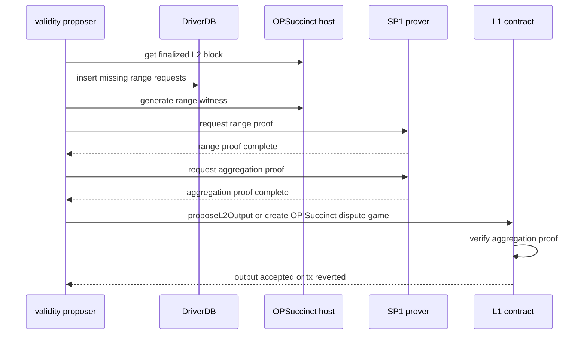
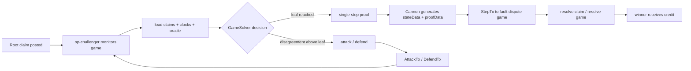

# Base multi-proof system flowchart

## 证据边界

本图只把本地 `references/codebase/base` 中能追溯到的流程画出来。部署状态单独标注：Base 官方 [Azul node operator 文档](https://docs.base.org/base-chain/node-operators/base-v1-upgrade)显示主网计划激活时间为 2026-05-28 18:00 UTC，当前日期为 2026-05-23，尚未到计划激活时间；因此本文件只写“本地代码能力/升级路径存在”，不写“当前主网已启用”。Base 官方 [Azul proof system 文档](https://docs.base.org/base-chain/specs/upgrades/azul/proofs)用于交叉核对 multi-proof、AggregateVerifier、TEE/ZK 角色描述。

## 主流程

## 关键状态机

## 本地代码路径与结论

| 流程节点 | 本地证据 | 结论 |
|---|---|---|
| Proof program 内部 runtime | `crates/proof/proof/README.md`, `crates/proof/proof/src/boot.rs`, `crates/proof/proof/src/caching_oracle.rs`, `crates/proof/proof/src/l1/pipeline.rs`, `crates/proof/proof/src/executor.rs`, `crates/proof/driver/README.md`, `crates/proof/client/README.md`, `crates/proof/executor/README.md` | `crates/proof/proof` 提供 boot、preimage oracle cache、oracle-backed derivation pipeline 和 `BaseExecutor`，把 `proof/client`、`proof/driver`、`proof/executor` 粘在 proof program 内。`crates/proof/driver` 是 no_std derivation driver，不是多证明调度器。 |
| proposer pipeline | `crates/proof/proposer/src/pipeline.rs`, `crates/proof/proposer/src/output_proposer.rs` | proposer 采用 PLAN/PROVE/SUBMIT：证明任务可并行，L1 提交保持顺序，通过 `createWithInitData()` 创建 dispute game。当前 `validate_and_submit()` 只接受 `ProofResult::Tee`；`ProofResult::Zk` 会被当成错误返回。 |
| AggregateVerifier game | `crates/proof/contracts/src/aggregate_verifier.rs` | 游戏合约暴露 `teeProver`、`zkProver`、`intermediateOutputRoot`、`challenge()`、`nullify()`、`resolve()`、`claimCredit()`。 |
| TEE path | `bin/prover/nitro-host/README.md`, `bin/prover/nitro-enclave/README.md`, `crates/proof/tee/nitro-attestation-prover/README.md` | TEE 证明路径围绕 Nitro Enclave、attestation、签名者注册表展开。 |
| ZK path | `bin/prover/zk/src/cli.rs`, `crates/proof/succinct/programs/range/ethereum/src/main.rs`, `crates/proof/succinct/programs/aggregation/src/main.rs` | ZK 服务支持 cluster/mock/network/dry-run 后端，range program 执行区块范围，aggregation program 聚合验证结果。 |
| challenger path | `crates/proof/challenge/src/scanner.rs`, `crates/proof/challenge/src/driver.rs`, `crates/proof/challenge/src/submitter.rs` | challenger 扫描游戏、重算 intermediate roots，按 `InvalidTeeProposal`、`FraudulentZkChallenge`、`InvalidZkProposal`、`InvalidDualProposal` 分类处理。 |
| bond lifecycle | `crates/proof/challenge/src/bond.rs` | dispute 后的资金领取流程被拆成 resolve、unlock、delay、withdraw。 |

## 注意点

- Base 的多证明选择不在 `crates/proof/driver` 里。proposer 侧由 `crates/proof/proposer/src/pipeline.rs` 的 `ProvingPipeline` 协调 PLAN/PROVE/SUBMIT；challenger 侧由 `crates/proof/challenge/src/driver.rs` 按 `GameCategory` 路由到 TEE/ZK prover 和 `challenge()` / `nullify()`。
- proposer 当前 output proposal 提交路径只接受 TEE 证明结果；ZK 证明代码能力存在，但在 proposer 的 `validate_and_submit()` 中被明确拒绝。ZK 当前主要体现在 challenger 的 `challenge()` / `nullify()` 路径和 SP1 range/aggregation 程序。
- 本地 Base proof 代码不是标准 OP Cannon 的二分争议树加单步 MIPS 执行模型；它围绕 AggregateVerifier、intermediate roots、TEE/ZK `challenge()` 和 `nullify()` 组织。
- `base-proof-client` 的 README 仍使用 fault proof 术语，但当前本地服务化路径主要体现为 AggregateVerifier 多证明游戏，而不是 Mantle V2 中的 `op-challenger` / `cannon` 路径。
- 生产启用状态需要结合链上合约和外部监控确认；本文件只把本地代码能力和已核对公开文档分开陈述。

---

# Mantle proof system flowchart

## 证据边界

本图覆盖本地 `references/codebase/mantle/op-succinct` 和 `references/codebase/mantle/mantle-v2` 中能确认的路径。Succinct 的 [Mantle case study](https://blog.succinct.xyz/case-studies/mantle/) 显示 Mantle 已采用 OP Succinct validity proof；但本地仓库只能证明代码能力和合约/服务路径，不能单独证明当前主网所有 game type、参数和运行服务状态。

## 总览

## Validity proof 生命周期

## Standard Cannon fault proof 生命周期

## 本地代码路径与结论

| 路径 | 本地证据 | 结论 |
|---|---|---|
| Validity proposer | `validity/bin/validity.rs`, `validity/src/proposer.rs`, `validity/src/proof_requester.rs` | 本地存在完整 Rust proposer：发现 finalized block、拆 range、请求 range/aggregation proofs、提交聚合证明。 |
| Validity 合约 | `contracts/src/validity/OPSuccinctL2OutputOracle.sol`, `contracts/src/validity/OPSuccinctDisputeGame.sol` | `OPSuccinctL2OutputOracle.proposeL2Output()` 校验 SP1 proof；validity dispute game 在初始化时提交 output 并直接 resolve 为 defender wins。 |
| Mantle DA / derivation 适配 | `utils/ethereum/client/src/executor.rs`, `programs/range/ethereum/src/main.rs`, `programs/range/utils/src/lib.rs` | `ETHDAWitnessExecutor` 在 `utils/ethereum/client/src/executor.rs` 中把 DA 类型设为 `MantleEthereumDataSource`，range program 入口在 `programs/range/ethereum/src/main.rs` 调用 `run_range_program(ETHDAWitnessExecutor::new(), ...)`。`programs/range/utils/src/lib.rs` 只是通用 runner，不直接引用 `MantleEthereumDataSource`。 |
| Mantle fork 依赖层 | `Cargo.toml`, `Cargo.lock` | op-succinct 的 Mantle 定制主要通过 fork 依赖传入：`mantle-xyz/kona` v2.2.3 承载 derivation/DA，`mantle-xyz/op-alloy` v2.2.0 承载 OP 类型，`mantle-xyz/evm` v2.2.1 和 `mantle-xyz/revm` v2.2.2 承载执行层。 |
| ZK fault proof 合约 | `contracts/src/fp/OPSuccinctFaultDisputeGame.sol`, `contracts/src/fp/AccessManager.sol` | 本地有单轮 ZK fault dispute game 合约：challenge 先质押，proposer 再用 SP1 proof 证明，最后 resolve。 |
| ZK fault proof 服务 | `references/codebase/mantle/op-succinct/Cargo.toml` 工作区 | 本地工作区未见对应 Rust fault-proof 服务目录；README 提到的 `fault-proof` 更像历史或文档描述，不能当作当前服务实现。 |
| Standard OP proposer | `mantle-v2/op-proposer/proposer/driver.go`, `op-proposer/contracts/disputegamefactory.go` | `op-proposer` 支持 L2OutputOracle 和 DisputeGameFactory 两种输出提交路径。 |
| Standard OP challenger | `mantle-v2/op-challenger/game/fault/agent.go`, `game/fault/solver/game_solver.go`, `game/fault/responder/responder.go` | `op-challenger` 按 claim 树计算 attack/defend/step，并发送对应交易。 |
| Cannon VM | `mantle-v2/cannon/main.go`, `mantle-v2/cannon/README.md`, `cannon/mipsevm/README.md`, `op-challenger/game/fault/trace/cannon/provider.go` | Cannon 是 Go 实现的 on-chain MIPS 单步证明路径；trace provider 会生成或读取指定 step 的 proof。本地 `cannon/main.go` 直接使用上游 `github.com/ethereum-optimism/optimism/cannon/cmd` 命令。 |
| Stock OP Stack 边界 | `mantle-v2/cannon/main.go`, `mantle-v2/op-challenger/cmd/main.go`, `mantle-v2/op-proposer/cmd/main.go` | `cannon`、`op-challenger`、`op-proposer` 入口直接引用上游 OP Stack 包；在这三个目录中检索 `Mantle`、`MNT`、`EigenDA` 未发现定制命中。 |

## 部署状态分层

| 层级 | 本地代码能力 | 部署/生产状态 |
|---|---|---|
| OP Succinct validity proof | 服务、SP1 programs、合约均在本地存在 | 公开资料显示 Mantle 已采用；具体链上参数仍需实时链上确认。 |
| OP Succinct ZK fault proof | 合约存在，服务目录未在本地工作区发现 | 只能写“合约能力存在”，不能写“生产运行”。 |
| Standard OP Cannon fault proof | `mantle-v2` 中 `op-proposer`、`op-challenger`、`cannon` 路径完整；本地未见 Mantle DA/执行定制 | 本地代码不能证明 Mantle 当前主网正在运行该路径。 |

---

# Base vs Mantle proof system comparison

## 对比结论

Base 的本地代码呈现为一个统一的多证明系统：proof program 内部 runtime 复用 derivation/execution，上层由 proposer pipeline 和 challenger driver 分别处理 TEE、ZK、AggregateVerifier 游戏。Mantle 的本地代码呈现为多套路径并存：OP Succinct validity proof、OP Succinct ZK fault proof 合约、以及 stock OP Stack Cannon fault proof。

## 核心差异表

| 维度 | Base | Mantle | 差异含义 |
|---|---|---|---|
| 证明路径组织 | TEE proposer、ZK prover、challenger 都围绕 `crates/proof/*` 和 AggregateVerifier 组织。 | `op-succinct` 负责 SP1 validity / ZK fault 合约，`mantle-v2` 保留 stock OP Stack proposer/challenger/Cannon。 | Base 更像一个统一 proof 产品面；Mantle 更像多个 proof 子系统并存。 |
| Proof program 内部 runtime | `crates/proof/proof` 提供 boot、preimage oracle cache、OraclePipeline、BaseExecutor；`base-proof-driver` 是 no_std derivation driver，`base-proof-client` 负责编排 prologue/execute/epilogue，`base-proof-executor` 提供 stateless execution。 | Validity proof 复用 Mantle fork 的 Kona / OP Succinct host；Cannon path 复用 OP Stack `op-program` / MIPS VM。 | Base 的 proof program 内部复用层更集中，但它不是多证明调度器；多证明选择发生在 proposer/challenger 服务层。 |
| proposer 模型 | `ProvingPipeline` 执行 PLAN/PROVE/SUBMIT，proof 并行、提交顺序化，最后 `createWithInitData()`；当前提交校验只接受 `ProofResult::Tee`，`ProofResult::Zk` 会报错。 | Validity proposer 拆 range、聚合证明后提交 L2OO 或 DGF；标准 `op-proposer` 也可走 DGF。 | Base 把当前 TEE output proposal scheduling 和 output proposal 做在同一套 Rust pipeline；ZK 在代码中存在，但当前 proposer submit 路径未启用。Mantle validity 和 OP proposer 是两套提交入口。 |
| challenger 模型 | `GameScanner` 分类 TEE/ZK/dual proposal，`ChallengeSubmitter` 调 `challenge()` 或 `nullify()`。 | Cannon challenger 用 claim tree、attack/defend/step；OP Succinct ZK fault 合约是 challenge 后单轮 `prove()`。 | Base 不是 Cannon 式二分单步游戏；Mantle 同时保留 Cannon 式和 SP1 单轮合约式。 |
| 合约中心 | `AggregateVerifier` game 同时记录 `teeProver`、`zkProver`、intermediate roots、bond 状态。 | Validity 用 `OPSuccinctL2OutputOracle` / `OPSuccinctDisputeGame`；ZK fault 用 `OPSuccinctFaultDisputeGame`；Cannon 用 OP Stack dispute game contracts。 | Base 的链上模型更集中；Mantle 合约模型按 proof 路径分开。 |
| TEE 支持 | 本地有 Nitro host、Nitro enclave、attestation prover、TEEProverRegistry。 | 本地 Mantle proof 路径未见同等 TEE 证明系统。 | TEE 是 Base 多证明设计的显著差异点。 |
| ZK validity | 本地有 SP1 range / aggregation programs 和 ZK prover service；proposer 当前不接受 `ProofResult::Zk` 作为 output proposal 提交结果。 | 本地有完整 OP Succinct validity proposer、range / aggregation programs、L2OO 合约。 | 两边都有 SP1 validity 能力；Mantle 的 validity 路径更接近标准 OP Succinct 集成。 |
| ZK fault proof | Base challenger 可请求 ZK proof 来 challenge/nullify AggregateVerifier game。 | 本地有 `OPSuccinctFaultDisputeGame.sol`，但未见 Rust fault-proof 服务目录。 | Base 的服务侧挑战流程更完整可见；Mantle 本地 ZK fault proof 更多体现为合约能力。 |
| Cannon fault proof | 本地 Base proof path 未见标准 OP Cannon 二分/单步 MIPS challenger 作为核心路径。 | `mantle-v2` 中有 `op-challenger`、`cannon`、MIPS VM、trace provider；本地未见 Mantle/MNT/EigenDA 定制，入口直接引用上游 OP Stack 包。 | “二分/单步执行证明”应归入 Mantle standard OP path；这条路径在 Mantle 本地代码中更像保留的 stock OP Stack 能力。 |
| 代码边界 | 单仓库内 Rust crates 和 bins 互相复用。 | Rust `op-succinct`、Rust `kona`、Go `mantle-v2`、Go `op-geth` 跨仓库协作；op-succinct 的 Mantle 定制主要从 fork 依赖传入。 | Mantle 的 review 和升级成本更受跨仓库版本一致性影响；op-succinct 自身更像 thin glue。 |
| Mantle DA / 执行定制 | 不适用。 | `op-succinct` 依赖 `mantle-xyz/kona` v2.2.3、`mantle-xyz/op-alloy` v2.2.0、`mantle-xyz/evm` v2.2.1、`mantle-xyz/revm` v2.2.2；`ETHDAWitnessExecutor` 使用 `MantleEthereumDataSource`。 | Mantle 的 DA 与执行差异不集中在 `op-succinct` 主流程文件，而是在 fork 依赖链和 witness executor 里体现。 |
| 部署状态 | 官方 [Azul node operator 文档](https://docs.base.org/base-chain/node-operators/base-v1-upgrade)显示主网计划激活时间为 2026-05-28 18:00 UTC；当前日期为 2026-05-23，尚未到计划激活时间。 | Succinct 的 [Mantle case study](https://blog.succinct.xyz/case-studies/mantle/) 显示 validity proof 已采用；ZK fault proof 服务和 Cannon 生产状态不能只凭本地代码确认。 | 对外报告必须区分“代码能力”和“生产启用”。 |

## 证据索引

| 系统 | 证据路径 |
|---|---|
| Base proof program runtime | `references/codebase/base/crates/proof/proof/README.md`, `crates/proof/proof/src/boot.rs`, `crates/proof/proof/src/caching_oracle.rs`, `crates/proof/proof/src/l1/pipeline.rs`, `crates/proof/proof/src/executor.rs`, `crates/proof/driver/README.md`, `crates/proof/client/README.md`, `crates/proof/executor/README.md` |
| Base proposer | `references/codebase/base/crates/proof/proposer/src/pipeline.rs`, `crates/proof/proposer/src/output_proposer.rs`, `crates/proof/proposer/src/config.rs` |
| Base challenger | `references/codebase/base/crates/proof/challenge/src/scanner.rs`, `crates/proof/challenge/src/driver.rs`, `crates/proof/challenge/src/submitter.rs`, `crates/proof/challenge/src/bond.rs` |
| Base contracts | `references/codebase/base/crates/proof/contracts/src/aggregate_verifier.rs`, `dispute_game_factory.rs`, `tee_prover_registry.rs` |
| Base ZK / TEE | `references/codebase/base/bin/prover/zk/src/cli.rs`, `crates/proof/succinct/programs/range/ethereum/src/main.rs`, `crates/proof/succinct/programs/aggregation/src/main.rs`, `crates/proof/tee/nitro-attestation-prover/README.md` |
| Mantle validity service | `references/codebase/mantle/op-succinct/validity/bin/validity.rs`, `validity/src/proposer.rs`, `validity/src/proof_requester.rs`, `validity/src/config.rs` |
| Mantle validity contracts | `references/codebase/mantle/op-succinct/contracts/src/validity/OPSuccinctL2OutputOracle.sol`, `contracts/src/validity/OPSuccinctDisputeGame.sol` |
| Mantle DA / fork dependency layer | `references/codebase/mantle/op-succinct/utils/ethereum/client/src/executor.rs`, `programs/range/ethereum/src/main.rs`, `programs/range/utils/src/lib.rs`, `Cargo.toml`, `Cargo.lock` |
| Mantle ZK fault contracts | `references/codebase/mantle/op-succinct/contracts/src/fp/OPSuccinctFaultDisputeGame.sol`, `contracts/src/fp/AccessManager.sol` |
| Mantle Cannon path | `references/codebase/mantle/mantle-v2/cannon/main.go`, `op-challenger/cmd/main.go`, `op-proposer/cmd/main.go`, `op-challenger/game/fault/agent.go`, `game/fault/solver/game_solver.go`, `game/fault/responder/responder.go`, `game/fault/trace/cannon/provider.go`, `cannon/README.md`, `cannon/mipsevm/README.md` |

## 待确认项

- Base 和 Mantle 当前主网上具体 game type、合约地址、参数、proposer/challenger 运行情况，需要实时链上查询确认。
- Mantle `op-succinct` README 中提到的 fault-proof 服务目录未出现在本地 Cargo workspace；除非补充另一个仓库或分支，否则只能按“文档提及但本地未见实现”处理。
- finality、证明成本、证明时间不能从这些本地代码路径直接得出，除非补充生产 telemetry 或链上交易数据。
