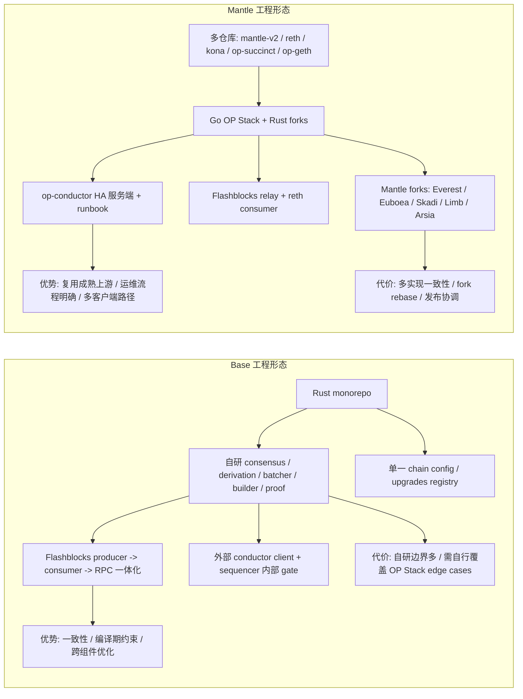
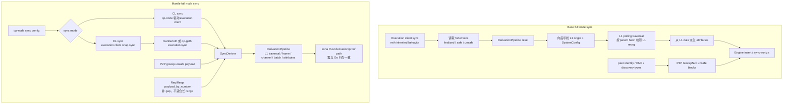
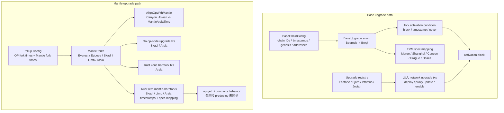

# 工程成熟度对比摘要

## 结论

Base 的成熟度体现在单仓库、单语言、从 builder 到 RPC 的纵向一体化，尤其适合快速做跨组件功能。Mantle 的成熟度体现在 OP Stack 继承、`op-conductor` HA runbook 和多客户端兼容，但每次升级和行为变更都要跨 Go/Rust、多仓库、多 fork 对齐。

本任务不把“更成熟”写成单一结论：Base 更强在集成一致性，Mantle 更强在既有 OP Stack 运维面和 HA 服务端完整度。

## 总览图

## 维度评分

| 维度 | Base | Mantle | 结论 |
|---|---|---|---|
| Flashblocks 完整性 | 生成、广播、消费、RPC 都在本地仓库内。 | consumer/relay 明确，producer 未在本地仓库确认。 | Base 更完整；Mantle 不能被写成“没有 Flashblocks”。 |
| HA / 故障恢复 | sequencer 内部 gate 完整，仓库内主要是 conductor client。 | `op-conductor` 服务端、Raft、runbook、failure table 都在仓库内。 | Mantle 运维面更完整。 |
| 节点同步 | Rust derivation + gossip/peers 自研，代码集中。 | OP Stack CL/EL sync、P2P req/resp、Go/Rust 多路径。 | Mantle 复用成熟模式；Base 一致性更好。 |
| 升级机制 | 单一 Rust config + upgrade tx registry。 | OP forks + Mantle forks 分布在 Go/Rust 多仓库。 | Base 协调成本更低；Mantle 上游兼容压力更低。 |
| L1 reorg | derivation reset + flashblocks pending reconciliation。 | OP Stack `FindL2Heads` / reset event / backup unsafe reorg 路径更完整可见。 | 两侧都有处理；Mantle sync start 逻辑更显式。 |
| 多实现一致性 | 单语言单仓库，类型变更更容易被编译器发现。 | reth/kona/op-node/op-geth 多实现需同步。 | Base 风险更低。 |
| 上游跟进 | 不 fork reth/kona/op-alloy，更多逻辑自研。 | 多 fork 可复用上游，但 rebase 和差异维护成本高。 | 两者是工程取舍，不是单向优劣。 |

## 建议给 Mantle 参考的方向

- Flashblocks 不应只补 consumer/RPC。若要达到 Base 同级产品能力，Mantle 需要二选一明确 producer 路线：维护自有 rollup-boost/builder producer，或接入外部 builder network 但把 SLA、fallback、消息格式、权限和回滚策略写进 runbook。
- Flashblocks producer 确定后，需要补端到端验收项：producer 生成频率、op-conductor leader relay、reth `--flashblocks-url` consumer、pending state/RPC、canonical reconciliation、WebSocket 重连、监控告警、200ms/250ms 等部署参数必须能从配置和指标追溯。
- HA 侧可以保留 `op-conductor` 优势，但要把 flashblocks relay 的 leader gating、producer 来源、reth consumer 配置写成可审计 runbook。
- 升级侧建议建立跨仓库 hard fork checklist，覆盖 Go op-node、op-geth、Rust reth、kona、op-succinct、revm/op-alloy forks 的配置和测试矩阵。
- Arsia 这类一次性对齐多个 OP forks 的升级，应单独列“激活块前后”测试矩阵：费用、receipt、L1 attributes、batch 格式、eth_call/estimateGas、同步恢复、reorg、proof program 都要覆盖。
- 同步和 L1 reorg 侧建议保留 OP Stack 的显式 `FindL2Heads` / `ResetEvent` 设计，同时为 reth consumer 和 flashblocks pending state 增加生产观测项。

## 未确认项

- 两侧当前主网部署与本地代码路径是否完全一致。
- Mantle flashblocks producer 的实际代码、部署方、启用链和参数。
- Base Rust stack 当前生产迁移阶段和具体组件占比。
- 两侧节点同步、reorg 恢复、flashblocks pending receipt 的真实生产指标。

## 证据

- WHI-444 已验证 Base 是 Rust monorepo，Mantle 是 `mantle-v2`、`reth`、`kona`、`op-succinct`、`op-geth` 多仓库组合：`outputs/WHI-444_component-mapping-and-architecture-diff/component-mapping-table.md:7-18`, `44-53`。
- WHI-444 已验证 Base Flashblocks 是 producer + consumer 一体化，Mantle 是 relay + consumer，producer 来自外部 rollup-boost 且不在分析仓库内：`outputs/WHI-444_component-mapping-and-architecture-diff/component-mapping-table.md:12-12`。
- WHI-444 tradeoff 已指出 Base 的自研全栈优势是架构掌控、no_std 复用、零 fork 维护负担；代价是自行覆盖 OP Stack 边界情况：`outputs/WHI-444_component-mapping-and-architecture-diff/tradeoff-analysis.md:22-84`, `85-128`。
- WHI-444 tradeoff 已指出 Mantle fork 组合优势是复用成熟代码和跟进上游；代价是多仓库、多语言、多 fork 协调：`outputs/WHI-444_component-mapping-and-architecture-diff/tradeoff-analysis.md:129-173`, `175-229`。
- Base Flashblocks producer 证据：`references/codebase/base/bin/builder/src/main.rs:39-45`; `references/codebase/base/crates/builder/core/src/flashblocks/service.rs:27-31`, `58-88`; `references/codebase/base/crates/builder/core/src/flashblocks/payload.rs:245-288`, `330-389`。
- Base Flashblocks consumer/RPC 证据：`references/codebase/base/crates/execution/flashblocks/README.md:6-31`; `references/codebase/base/crates/execution/flashblocks-node/src/extension.rs:34-99`。
- Mantle Flashblocks consumer/relay 证据：`references/codebase/mantle/reth/crates/optimism/node/src/args.rs:71-76`; `references/codebase/mantle/reth/crates/optimism/rpc/src/eth/mod.rs:565-590`; `references/codebase/mantle/mantle-v2/op-conductor/rpc/ws/flashblocks_handler.go:44-99`, `244-253`。
- Base sequencer HA gate 证据：`references/codebase/base/crates/consensus/service/src/actors/sequencer/admin_api_impl.rs:116-170`; `references/codebase/base/crates/consensus/service/src/actors/sequencer/seal.rs:16-24`, `92-117`。
- Mantle `op-conductor` HA 服务端证据：`references/codebase/mantle/mantle-v2/op-conductor/README.md:4-20`, `57-72`; `references/codebase/mantle/mantle-v2/op-conductor/consensus/raft.go:76-184`; `references/codebase/mantle/mantle-v2/op-conductor/RUNBOOK.md:36-78`。
- Base upgrade 证据：`references/codebase/base/crates/common/chains/README.md:3-12`; `references/codebase/base/crates/common/chains/src/upgrade.rs:6-109`; `references/codebase/base/crates/consensus/upgrades/src/forks.rs:37-70`。
- Mantle upgrade 证据：`references/codebase/mantle/mantle-v2/op-node/rollup/types.go:136-158`, `471-479`; `references/codebase/mantle/mantle-v2/op-node/rollup/mantle_types.go:88-192`; `references/codebase/mantle/reth/crates/mantle-hardforks/src/lib.rs:93-181`。
- Base/Mantle sync 和 L1 reorg 证据分别见本目录 `node-sync.md` 与 `l1-reorg-handling.md`。

---

# Flashblocks 机制对比

## 结论

| 维度 | Base | Mantle |
|---|---|---|
| 生成端 | 仓库内有 `base-builder` 和 `base-builder-core`，出块过程中直接生成 flashblocks。 | 本地分析仓库内未发现自研 producer；`op-conductor` 从外部 `rollup-boost` WebSocket 读取。 |
| 消费端 | `base-flashblocks-node` 订阅 builder WebSocket，维护 pending block/state。 | `mantle/reth` 通过 `--flashblocks-url` 订阅外部 stream，构建 pending block。 |
| RPC 可见性 | pending block、receipt、balance、call、estimateGas、logs、`sendRawTransactionSync`、`newFlashblocks` 均接入 flashblocks。 | pending block/state、receipt、`sendRawTransactionSync` 接入 flashblocks；前提是 `flashblocks_url` 已配置。 |
| 生产配置状态 | 代码默认 interval 为 250ms，测试/dev 配置可见 200ms；生产实际参数需从部署配置确认。 | 代码能力存在，但生产是否启用、是否只消费外部 stream、producer 来源均不能只靠本地代码确认。 |

Base 代码默认 `flashblocks.block-time=250ms`，测试参数里验证了 `200ms` 可配置；“200ms 预确认”更像产品/部署层目标，本地代码不能证明 Base 生产环境一定使用 200ms。Flashblocks 提供的是 soft confirmation：交易先通过 sub-block 进入 pending state 和 pending receipt，可被 RPC 查到；后续 canonical block 到达时还要做 reconciliation，若 canonical 交易序列不一致，pending state 会清理并重建。

## 流程图

```mermaid
flowchart TB
    subgraph Base["Base: producer + consumer 在同一 Rust monorepo"]
        BPool["交易池 / Payload attributes"]
        BBuilder["FlashblocksServiceBuilder<br/>安装 payload builder service"]
        BPre["fallback block + index 0 flashblock"]
        BDecision{"可继续按 interval 构建?"}
        BQuota["按 flashblock 拆分预算<br/>gas / DA / execution / state-root"]
        BPublish["WebSocketPublisher<br/>broadcast + ring buffer replay"]
        BConsumer["FlashblocksSubscriber<br/>收到 WebSocket 消息"]
        BState["StateProcessor<br/>更新 pending block/state"]
        BRpc{"RPC 查询 pending?"}
        BVisible["pending block / receipt / call / estimateGas / logs / sendRawTransactionSync 可见"]
        BLatest["回退 canonical latest"]
        BCanon["canonical block 到达"]
        BReorg{"pending tx hashes<br/>等于 canonical tx hashes?"}
        BKeep["继续保留 pending state"]
        BRebuild["清理或 rebuild future flashblocks"]
        BDisconnect{"WebSocket 断开?"}
        BReconnect["指数退避重连<br/>最多 10s backoff"]

        BPool --> BBuilder --> BPre --> BDecision
        BDecision -->|是| BQuota --> BPublish --> BConsumer --> BState --> BRpc
        BDecision -->|否: no_tx_pool / 太晚| BCanon
        BRpc -->|是| BVisible
        BRpc -->|否 / 无 pending state| BLatest
        BConsumer --> BDisconnect
        BDisconnect -->|是| BReconnect --> BConsumer
        BDisconnect -->|否| BState
        BCanon --> BReorg
        BReorg -->|是| BKeep
        BReorg -->|否| BRebuild
    end

    subgraph Mantle["Mantle: relay + consumer，producer 未在本地仓库确认"]
        MProducer["外部 rollup-boost / builder<br/>producer 来源待确认"]
        MConductor["op-conductor flashblocks handler<br/>读取 RollupBoostWsURL"]
        MLeader{"当前 op-conductor<br/>是 leader?"}
        MDrop["非 leader 不转发"]
        MReth{"mantle/reth<br/>配置 --flashblocks-url?"}
        MDisabled["未配置则不启动 FlashBlockService"]
        MPending["FlashBlockService<br/>构建 pending block/state"]
        MRpc["RPC pending 可见性<br/>pending state / receipt / sendRawTransactionSync"]
        MCanon["canonical tip 更新<br/>清理不匹配 pending"]

        MProducer --> MConductor --> MLeader
        MLeader -->|是| MReth
        MLeader -->|否| MDrop
        MReth -->|是| MPending --> MRpc
        MReth -->|否| MDisabled
        MCanon --> MPending
    end
```

## 预确认机制原理

Base 的“预确认”链路是：`base-builder` 通过 `FlashblocksServiceBuilder` 启动 payload builder；构建 block 时先发布 index 0 fallback flashblock，再按 `flashblocks_interval` 继续生成后续 flashblock；`WebSocketPublisher` 将每个 flashblock 写入 ring buffer 并广播；`base-flashblocks-node` 的 subscriber 收到 WebSocket 消息后把 flashblock 交给 `FlashblocksState`；`StateProcessor` 基于 canonical parent 构建 pending block/state；RPC 的 `pending` tag、receipt、call、estimateGas、logs 和 `sendRawTransactionSync` 就能在完整 canonical block 出现前读到这些 pending 结果。

这个结果不是最终性：canonical block stream 到达后，Base 会先查 canonical，再查 flashblocks；pending state 会比较 pending transaction hashes 和 canonical transaction hashes。若 canonical 已追上 pending，会清空 pending；若交易集合或顺序不同，会把超过该 canonical block 的 future flashblocks 拿出来重建。因此 flashblock confirmation 是 soft confirmation，不是 L2 canonical block，也不是 L1 data availability 或 L1 finality。

Mantle 侧本地代码能确认的是 consumer/relay 形态：`op-conductor` 需要 `RollupBoostWsURL` 并只在 leader 转发，`mantle/reth` 只有配置 `--flashblocks-url` 才启动 `WsFlashBlockStream` 和 `FlashBlockService`。本地仓库没有确认 Mantle 自研 producer，也不能确认生产启用状态。

## DeFi 影响

| 场景 | 影响 | 需要保留的边界 |
|---|---|---|
| DEX / AMM | 200ms 或 250ms 级别的 sub-block 可更快暴露交易和价格变化，套利机器人、做市系统和前端报价能更早看到 pending 结果，而不是等完整 2s block。 | pending 结果可能被 canonical reconciliation 改写，不能按 hard finality 使用。 |
| 前端 UX | 钱包和 dApp 可以用 pending receipt 或 `sendRawTransactionSync` 更快展示“已被 flashblock 接收/预确认”，减少用户空等。 | UI 应标注为预确认或 pending，不能替代 canonical confirmation。 |
| MEV 策略 | 更短 sub-block 间隔会压缩观察和响应窗口，也可能改变搜索者围绕 pending state 的排序、回滚和抢跑策略。 | 具体 MEV 收益或风险无法仅从代码证明，需要生产启用状态、builder 策略和链上数据。 |
| 桥 / 跨域操作 | 对接受 soft confirmation 的桥或跨链前端，可缩短用户看到“交易已进入 L2 pending 状态”的等待时间。 | L1 发布、挑战期、证明或最终确认时间不因此缩短。 |

## 关键差异

Base 的优势是生成、广播、消费、RPC 暴露、canonical reconciliation 都在同一套 Rust 代码里，feature 闭环更短。Mantle 的优势是可以把 flashblocks 转发放到 `op-conductor` 的 HA 语境里，但本地代码显示它更像“接收并转发外部 stream + reth 消费 pending state”，不是仓库内完整 producer。

需要避免的误读：不能说“Flashblocks 是 Base 独有机制”，因为 Mantle 本地代码已有 consumer 和 relay；也不能说“Mantle 生产已启用”，因为本地仓库只证明代码能力和配置入口存在。

## 未确认项

- Mantle 主网或测试网当前是否启用 flashblocks。
- Mantle flashblocks producer 是否为外部 `rollup-boost`，以及该 producer 的代码仓库和部署归属。
- Mantle 这部分代码中哪些来自 upstream `op-reth` / `optimism`，哪些是 Mantle 自研。
- Base 生产实际 flashblock interval 是 200ms、250ms 还是其他部署参数。

## 证据

- Base builder CLI 说明 Flashblocks always enabled，默认 WebSocket 端口/地址和 `flashblocks.block-time=250`：`references/codebase/base/bin/builder/src/cli.rs:18-29`。
- Base builder 将 CLI 参数转为 `BuilderConfig`：`references/codebase/base/bin/builder/src/cli.rs:198-207`。
- Base `BuilderConfig` 定义 WebSocket 地址、interval、`flashblocks_per_block()`，默认 250ms，测试配置 200ms：`references/codebase/base/crates/builder/core/src/config.rs:34-43`, `101-107`, `139-148`, `168-176`。
- Base `base-builder` 入口安装 `FlashblocksServiceBuilder`：`references/codebase/base/bin/builder/src/main.rs:39-45`。
- Base payload service 创建 WebSocket publisher 并启动 payload builder / flashblocks handler：`references/codebase/base/crates/builder/core/src/flashblocks/service.rs:27-31`, `58-88`。
- Base payload builder 构造 fallback block、发布 index 0 flashblock、按 interval 继续构建并最终 finalize：`references/codebase/base/crates/builder/core/src/flashblocks/payload.rs:245-288`, `330-389`, `431-455`。
- Base flashblock 资源预算拆分和交易提交/剪枝：`references/codebase/base/crates/builder/core/src/flashblocks/payload.rs:338-359`, `572-609`。
- Base WebSocket publisher 支持 broadcast 和 ring buffer replay：`references/codebase/base/crates/builder/publish/src/publisher.rs:32-39`, `95-123`; `references/codebase/base/crates/builder/publish/src/broadcast.rs:62-79`, `127-189`。
- Base flashblocks README 列出 pending RPC 和订阅能力：`references/codebase/base/crates/execution/flashblocks/README.md:6-31`。
- Base node extension 可禁用，也可通过 `--flashblocks-url` 启用，并安装 state processor、canonical subscription、RPC 和 subscriber：`references/codebase/base/crates/execution/flashblocks-node/README.md:32-58`; `references/codebase/base/crates/execution/flashblocks-node/src/extension.rs:34-99`。
- Base pending RPC 会先查 canonical，再查 flashblocks，`pending` tag 使用 pending overrides，`sendRawTransactionSync` 等待 flashblocks 或 canonical receipt：`references/codebase/base/crates/execution/flashblocks/src/rpc/eth.rs:200-260`, `321-374`, `392-548`。
- Base pending state 对 flashblock 顺序和 canonical reorg 做校验、清理和 rebuild：`references/codebase/base/crates/execution/flashblocks/src/processor.rs:126-178`, `200-239`, `345-493`; `references/codebase/base/crates/execution/flashblocks/src/validation.rs:36-75`, `106-188`。
- Mantle reth `--flashblocks-url` 文档说明 pending tag 会使用基于 flashblocks 的 pending state，默认值为 `None`：`references/codebase/mantle/reth/crates/optimism/node/src/args.rs:71-76`, `90-93`。
- Mantle reth flashblocks crate 明确是 downstream integration，并提供 pending block / sequence / received flashblocks channels：`references/codebase/mantle/reth/crates/optimism/flashblocks/src/lib.rs:1-4`, `32-64`。
- Mantle reth 仅在 `flashblocks_url` 存在时启动 `WsFlashBlockStream` 和 `FlashBlockService`：`references/codebase/mantle/reth/crates/optimism/rpc/src/eth/mod.rs:565-590`。
- Mantle reth WebSocket stream 失败后重连无上限，并解码 binary/text 消息：`references/codebase/mantle/reth/crates/optimism/flashblocks/src/ws/stream.rs:21-26`, `121-126`。
- Mantle reth 只在 flashblock attach 到 latest header 时构建 pending block：`references/codebase/mantle/reth/crates/optimism/flashblocks/src/service.rs:155-200`; `references/codebase/mantle/reth/crates/optimism/flashblocks/src/worker.rs:62-82`。
- Mantle reth pending RPC / receipt / `sendRawTransactionSync` 接入 flashblocks：`references/codebase/mantle/reth/crates/optimism/rpc/src/eth/mod.rs:119-181`; `references/codebase/mantle/reth/crates/optimism/rpc/src/eth/transaction.rs:81-168`; `references/codebase/mantle/reth/crates/optimism/rpc/src/eth/pending_block.rs:38-63`。其中 `sendRawTransactionSync` 位于 `reth/crates/optimism/rpc/src/eth/transaction.rs` 的通用 Optimism RPC 层，是 flashblocks-aware RPC 实现，不在 `crates/optimism/flashblocks` crate 内。
- Mantle `op-conductor` flashblocks handler 要求 `RollupBoostWsURL`，启动后监听 rollup boost，只有 leader 转发：`references/codebase/mantle/mantle-v2/op-conductor/rpc/ws/flashblocks_handler.go:44-99`, `192-253`。
- Mantle `op-conductor` 没有 `RollupBoostWsURL` 时禁用 flashblocks handler：`references/codebase/mantle/mantle-v2/op-conductor/conductor/service.go:326-348`, `435-440`。

---

# L1 Reorg 处理对比

## 结论

Base 和 Mantle 都把 L1 reorg 当成 derivation pipeline reset 的触发条件：L1 traversal 检查当前 origin 与下一块 parent hash 是否一致，不一致就 reset。Base 还在 flashblocks pending state 层做 canonical reconciliation，发现 pending 与 canonical transaction hash 不一致时会清理并重建 pending state；Mantle reth 的 flashblocks consumer 会在 canonical tip 改变后清理不再 attach 到 latest 的 pending flashblock。

L1 reorg 容忍度的代码差异主要在 sync start：Mantle `FindL2Heads` 明确限制过深 reorg，并会从 unsafe head 向 finalized head 回溯找新的 unsafe/safe/finalized。具体公式是 `MaxReorgSeqWindows * cfg.SyncLookback()`，其中 `MaxReorgSeqWindows = 5`；`SyncLookback()` 在未启用 AltDA 或 AltDA 窗口不更大时返回 `SeqWindowSize`。Base 本地代码能确认 reset/reconcile 行为，但未看到与 Mantle `FindL2Heads` 相同位置、相同语义的数值 reorg depth 限制。

## 流程图

```mermaid
flowchart TB
    subgraph Base["Base L1 reorg handling"]
        BA["L1 traversal advance"]
        BB["读取 next L1 block"]
        BC{"current hash == next.parent_hash?"}
        BD["继续推进 origin<br/>更新 SystemConfig"]
        BE["ResetError::ReorgDetected"]
        BF["DerivationPipeline reset"]
        BG["向后查找 L1 origin + SystemConfig"]
        BH["重新派生 attributes"]
        BI["Flashblocks pending reconciliation"]
        BJ{"pending tx hashes == canonical tx hashes?"}
        BK["继续 pending state"]
        BL["rebuild future flashblocks / clear pending"]

        BA --> BB --> BC
        BC -->|是| BD --> BH
        BC -->|否| BE --> BF --> BG --> BH
        BI --> BJ
        BJ -->|是| BK
        BJ -->|否| BL
    end

    subgraph Mantle["Mantle L1 reorg handling"]
        MA["op-node sync start"]
        MB["读取 finalized / safe / unsafe"]
        MC["从 unsafe 向 finalized 回溯"]
        MD{"L1 origin canonical?"}
        ME["保留 plausible unsafe"]
        MF["丢弃不 canonical candidate<br/>继续找 parent"]
        MG{"reorg 太深或 finalized 被 reorg?"}
        MH["返回新 unsafe/safe/finalized"]
        MI["Deriver ResetEvent -> Engine reset"]
        MJ["reth flashblocks<br/>canonical tip 清理 pending"]

        MA --> MB --> MC --> MD
        MD -->|是| ME --> MG
        MD -->|否| MF --> MC
        MG -->|否| MH --> MI
        MG -->|是| MI
        MJ --> MI
    end
```

## 行为差异

| 维度 | Base | Mantle |
|---|---|---|
| L1 traversal reorg detection | 下一块 parent hash 不等于当前 origin hash 时触发 `ReorgDetected`。 | 同样在 L1Traversal 中做 parent hash 检查，失败返回 reset error。 |
| sync start / 找新 head | 本地代码展示从 safe head 向后寻找 channel timeout 窗口内的 L1 origin；未看到与 Mantle 一样集中的 `FindL2Heads` 容忍度表述。 | `FindL2Heads` 从 unsafe head 回溯到 finalized，区分 unsafe/safe/finalized，并限制 finalized reorg 和 too deep reorg。 |
| unsafe block 回滚 | Base 在 sequencer 出块路径丢弃 stale build，flashblocks pending 与 canonical 不一致时 rebuild。 | Mantle driver 收到 reset event 后请求 engine reset；`TryBackupUnsafeReorg` 会尝试使用 backup unsafe 修复 forkchoice。 |
| Flashblocks pending | Base 对 pending flashblocks 有 sequence validator、reorg detector、depth limit、rebuild。 | Mantle reth 只在 flashblock attach latest 时构建，canonical tip 更新后清理不匹配 pending。 |

## Mantle Reorg Depth 限制

| 项 | 本地代码事实 |
|---|---|
| 固定倍数 | `MaxReorgSeqWindows = 5`。 |
| 计算公式 | 如果回溯到的 candidate 满足 `n.L1Origin.Number + (5 * cfg.SyncLookback()) < prevUnsafe.L1Origin.Number`，`FindL2Heads` 返回 `TooDeepReorgErr`。 |
| `SyncLookback()` | AltDA 启用且 `DAChallengeWindow + DAResolveWindow > SeqWindowSize` 时返回该 AltDA 窗口；否则返回 `SeqWindowSize`。 |
| 生产数值 | 本地代码给出公式，不给出 Mantle 生产 `SeqWindowSize` 的最终部署值；因此文档只能写公式和配置来源，不能把某个测试配置当作生产常量。 |
| Base 对照 | Base Flashblocks 有 `max_pending_blocks_depth`，但这是 pending flashblocks reconciliation 的深度，不是 L1 reorg sync-start 的同语义阈值。Base derivation reset 没看到 `MaxReorgSeqWindows` 这种直接可比常量。 |

## 未确认项

- Base 生产配置中针对 L1 reorg 的最大容忍窗口、告警阈值和手动恢复 runbook。
- Mantle 生产 `MaxReorgDepth` / `SyncLookback` 等参数实际配置值。
- 两侧在历史 L1 reorg 事件中的真实恢复耗时。

## 证据

- Base L1 traversal advance 按 number 取 next L1 origin，并在 parent hash 不匹配时返回 `ResetError::ReorgDetected`：`references/codebase/base/crates/consensus/derive/src/stages/traversal/polling.rs:101-124`。
- Base L1 traversal 同时取 receipts 更新 SystemConfig：`references/codebase/base/crates/consensus/derive/src/stages/traversal/polling.rs:126-154`。
- Base derivation reset 会向后查找合适的 L1 origin 和 SystemConfig，再 reset stages：`references/codebase/base/crates/consensus/derive/src/pipeline/core.rs:50-99`, `134-159`。
- Base derivation step 对 EOF/temporary/critical error 分流，critical error 需要 reset：`references/codebase/base/crates/consensus/derive/src/pipeline/core.rs:209-258`。
- Base sequencer stale build 检查处理 unsafe head advance 和 same-height reorg：`references/codebase/base/crates/consensus/service/src/actors/sequencer/actor.rs:122-160`。
- Base flashblocks processor 在 canonical block 到达时比较 pending/canonical tx hashes，reorg 时保留 future flashblocks 并 rebuild pending state：`references/codebase/base/crates/execution/flashblocks/src/processor.rs:180-239`。
- Base flashblocks validation 明确 `ReorgDetector` 和 reconciliation strategy：`references/codebase/base/crates/execution/flashblocks/src/validation.rs:106-188`。
- Mantle sync package 文档说明 L1 reorg 时需要搜索新的 safe/unsafe L2 block：`references/codebase/mantle/mantle-v2/op-node/rollup/sync/start.go:1-24`。
- Mantle `FindL2Heads` 的 reorg 常量和错误类型：`references/codebase/mantle/mantle-v2/op-node/rollup/sync/start.go:51-58`。
- Mantle `FindL2Heads` 定义 unsafe/safe/finalized 的含义，并从当前 forkchoice 回溯：`references/codebase/mantle/mantle-v2/op-node/rollup/sync/start.go:103-163`。
- Mantle `FindL2Heads` 对 finalized reorg、wrong chain、too deep reorg 做错误处理，too-deep 条件为 `MaxReorgSeqWindows * cfg.SyncLookback()`：`references/codebase/mantle/mantle-v2/op-node/rollup/sync/start.go:189-215`。
- Mantle `SyncLookback()` 默认返回 `SeqWindowSize`，AltDA 时取更大的 challenge+resolve 窗口：`references/codebase/mantle/mantle-v2/op-node/rollup/types.go:787-796`。
- Mantle `FindL2Heads` 判断 L1 origin 是否 canonical，不 canonical 时丢弃 candidate，并继续回溯 parent：`references/codebase/mantle/mantle-v2/op-node/rollup/sync/start.go:220-287`。
- Mantle L1 traversal parent hash 不匹配时返回 reset error：`references/codebase/mantle/mantle-v2/op-node/rollup/derive/l1_traversal.go:59-87`。
- Mantle `VerifyNewL1Origin` 检查 unsafe head 的 L1 origin 是否仍在 canonical chain：`references/codebase/mantle/mantle-v2/op-node/rollup/derive/check_l1.go:14-39`。
- Mantle SyncDeriver 收到 reset event 后请求 engine reset，并在 backup unsafe reorg 错误时分流 reset/temporary/critical：`references/codebase/mantle/mantle-v2/op-node/rollup/driver/sync_deriver.go:186-220`。
- Mantle reth flashblocks consumer 只构建 attach 到 latest header 的 pending block，canonical tip 改变时清理 current flashblock：`references/codebase/mantle/reth/crates/optimism/flashblocks/src/worker.rs:62-82`; `references/codebase/mantle/reth/crates/optimism/flashblocks/src/service.rs:203-224`, `315-329`。

---

# 全节点同步对比

## 结论

Base 和 Mantle 都有三类同步路径：execution layer 自身同步、从 L1 派生 safe chain、P2P unsafe block 获取。Mantle 本地代码明确把 OP node sync 分成 CL sync 和 EL sync，EL sync 允许 execution client 使用 snap sync；Base 本地代码显示 Rust consensus 会读取当前 finalized/safe/unsafe forkchoice，并在 EL sync 期间退避 reset，但没有直接给出可量化同步速度。

速度差异不能只靠代码静态分析确认；能确认的是 Mantle 继承 OP Stack 的 sync mode 设计，Base 用自研 Rust derivation 和 gossip/peers 组件整合到自身 consensus。

## 流程图

## 同步策略差异

| 维度 | Base | Mantle |
|---|---|---|
| Snap Sync | 本地 Base consensus 代码会在 EL sync 中退避 reset；具体 snap sync 速度依赖 execution client 行为，代码中未给出指标。 | `op-node` sync config 明确 EL sync 允许 execution client snap sync，更适合长 range。 |
| Derivation Sync | 自研 `base-consensus-derive` 从 L1 遍历、取 receipts、更新 SystemConfig、派生 attributes。 | Go `op-node/rollup/derive` 生产路径从 L1 traversal 到 attributes queue；另有 kona Rust derivation/proof path。 |
| P2P Sync | `base-consensus-gossip` 用 GossipSub 传播 unsafe blocks，`base-consensus-peers` 提供 peer / node record 类型。 | `op-node/p2p` 有 GossipSub block topics、peer scoring、req/resp payload sync。 |
| 多实现一致性 | 单一 Rust 实现，跨 consensus/execution/proof 的接口在同一 workspace 内维护。 | Go op-node、Rust kona、Rust reth、Go op-geth 多处同步/派生/执行边界需要一致。 |

## 未确认项

- Base 和 Mantle 在真实主网节点上的同步耗时、snap sync 吞吐、P2P gap fill 成功率。
- Base execution client 实际使用的 snap sync 参数和运维默认值。
- Mantle 当前生产节点主要使用 `mantle/reth` 还是 `op-geth`，以及二者的同步策略占比。

## 证据

- Base gossip README 说明 GossipSub P2P 传播 unsafe block，`BlockHandler` 校验 incoming blocks，`ConnectionGater` 做限流/ban：`references/codebase/base/crates/consensus/gossip/README.md:3-17`。
- Base peers README 说明 peer id、node record、ENR、admin RPC peer 类型来自 reth：`references/codebase/base/crates/consensus/peers/README.md:5-35`。
- Base derivation pipeline 负责从 L1 data 派生 L2 inputs：`references/codebase/base/crates/consensus/derive/src/pipeline/core.rs:17-34`。
- Base reset 时会向后查找足够旧的 L1 origin 和 SystemConfig，避免漏掉 channel timeout 窗口内的 batcher address 更新：`references/codebase/base/crates/consensus/derive/src/pipeline/core.rs:50-99`, `134-159`。
- Base derivation step 遇到 EOF 会 advance origin，其他错误会返回 reset 所需错误：`references/codebase/base/crates/consensus/derive/src/pipeline/core.rs:209-258`。
- Base L1 traversal advance 会按 block number 取下一块、校验 parent hash、取 receipts 更新 SystemConfig：`references/codebase/base/crates/consensus/derive/src/stages/traversal/polling.rs:101-154`。
- Base forkchoice start 会读取 finalized/safe/latest；safe/finalized 不存在时回退到 genesis/finalized：`references/codebase/base/crates/consensus/engine/src/sync/forkchoice.rs:41-89`。
- Base follow engine 对 unsafe payload 使用 InsertTask，对 safe/finalized 使用 SynchronizeTask：`references/codebase/base/crates/consensus/service/src/follow/engine.rs:57-92`。
- Base sequencer 初始 reset 遇到 EL sync 会退避，不发送可能打断 reth EL sync 的 forkchoice update：`references/codebase/base/crates/consensus/service/src/actors/sequencer/actor.rs:190-235`。
- Mantle sync config 明确区分 CL sync 和 EL sync，EL sync 允许 execution client snap sync：`references/codebase/mantle/mantle-v2/op-node/rollup/sync/config.go:10-18`, `64-80`。
- Mantle sync start 文档说明 L1 reorg 时要重新搜索 safe/unsafe L2 head，且定义 reorg 深度错误：`references/codebase/mantle/mantle-v2/op-node/rollup/sync/start.go:1-24`, `51-64`。
- Mantle `FindL2Heads` 从当前 forkchoice 回溯，校验 L1 origin 是否 canonical，并限制过深 reorg：`references/codebase/mantle/mantle-v2/op-node/rollup/sync/start.go:103-116`, `144-215`, `220-287`。
- Mantle derivation pipeline 阶段包括 L1 traversal、data source、frame queue、channel mux、batch mux、attributes queue：`references/codebase/mantle/mantle-v2/op-node/rollup/derive/pipeline.go:99-137`。
- Mantle derivation step 在 reset 时要求 engine 先 reset，并在 EOF 时推进 L1 origin：`references/codebase/mantle/mantle-v2/op-node/rollup/derive/pipeline.go:164-230`。
- Mantle SyncDeriver 会处理 unsafe payload：CL sync 直接 AddUnsafePayload，EL sync 时把 unsafe payload 插入以驱动 EL sync：`references/codebase/mantle/mantle-v2/op-node/rollup/driver/sync_deriver.go:106-128`。
- Mantle SyncDeriver 在 initial EL sync 中停止 derivation 前进并退避：`references/codebase/mantle/mantle-v2/op-node/rollup/driver/sync_deriver.go:223-258`。
- Mantle P2P req/resp sync 说明它用于补 existing chain 与 gossip chain 的 gap，长 range 更适合 EL snap sync：`references/codebase/mantle/mantle-v2/op-node/p2p/sync.go:162-225`。
- Mantle P2P gossip 定义 block topics、mesh 参数、message id、peer scoring 接入：`references/codebase/mantle/mantle-v2/op-node/p2p/gossip.go:30-49`, `75-99`, `150-203`。

---

# Sequencer 故障与恢复对比

## 结论

Base 在本地仓库中主要体现为 sequencer 对外部 conductor 的客户端集成：启动前检查 leader 和 unsafe head，出块后按 `commit -> gossip -> insert` 顺序推进，并在 EL sync 或 stale build 时退避/丢弃。Mantle 在本地仓库中有完整 `op-conductor` 服务端：Raft leader election、unsafe head FSM、健康检查、控制循环、cluster membership、leader transfer、runbook 都在仓库内。

这意味着 Base 的 Rust sequencer 内部安全检查更贴近出块路径；Mantle 的 HA 运维面更完整，但也依赖 `op-node`、execution client、`op-conductor` 多组件配置一致。

## 流程图

```mermaid
flowchart TB
    subgraph Base["Base: sequencer 内部 gate + 外部 conductor client"]
        BA["admin_startSequencer(unsafe_head)"]
        BB{"conductor leader?"}
        BC{"engine unsafe head<br/>匹配调用方?"}
        BD["开始构建 payload"]
        BE{"stale build?<br/>unsafe head advance / same-height reorg"}
        BDiscard["丢弃旧 payload"]
        BWait["等待下一 tick<br/>或立即重新 build"]
        BF["seal pipeline"]
        BG["commit to conductor"]
        BH["gossip unsafe payload"]
        BI["insert into engine"]
        BJ["stopSequencer<br/>丢弃 pre-built payload / 等 in-flight seal"]
        BK["EL sync 中<br/>reset forkchoice 退避重试"]
        BStopped["is_active=false<br/>ticker 不再触发 build"]
        BRestart{"再次 startSequencer?"}

        BA --> BB
        BB -->|是或未配置 conductor| BC
        BB -->|否| BStopped
        BC -->|匹配| BD
        BC -->|不匹配| BStopped
        BA --> BK --> BC
        BD --> BE
        BE -->|否| BF --> BG --> BH --> BI
        BE -->|是| BDiscard --> BWait --> BD
        BJ --> BStopped
        BStopped --> BRestart
        BRestart -->|是| BA
    end

    subgraph Mantle["Mantle: op-conductor 管理 HA sequencer"]
        MA["Raft cluster"]
        MB["unsafe head FSM"]
        MC["health monitor"]
        MD["leader update / health update"]
        ME["control loop action"]
        MF{"当前节点状态"}
        MG["leader + healthy + inactive<br/>start sequencer"]
        MH["not leader + active<br/>stop sequencer"]
        MI["leader unhealthy<br/>stop/transfer/retry"]
        MJ["manual recovery<br/>pause / overrideLeader / start sequencing"]
        MK{"commit unsafe payload 成功?"}
        ML["失败则不 gossip<br/>避免 split-brain 扩散"]

        MA --> MB
        MA --> MD
        MC --> MD --> ME --> MF
        MF -->|leader healthy inactive| MG --> MK
        MK -->|是| MB
        MK -->|否| ML --> ME
        MF -->|not leader active| MH
        MF -->|leader unhealthy| MI
        MJ --> ME
    end
```

## Base 宕机后组件表现

| 组件 | Sequencer 停止后的行为 | 代码可确认边界 |
|---|---|---|
| Sequencer actor | `stop_sequencer` 将 `is_active=false`，丢弃 pre-built payload；如果 seal pipeline 已经在执行，会等 commit/gossip/insert 完成后再返回当前 unsafe head。停止后 ticker 条件包含 `self.is_active`，不会继续启动新 build。 | 本地代码证明 stop 不会直接跳回 build；旧图中的 `stopSequencer -> 开始构建 payload` 语义不对，已修正。 |
| Batcher | 没有新 unsafe block 时，block source 会在 `recv().await` 上等待；encoder 没有 block 时 `encode_and_drain` 返回空，不会生成新的 L1 frames。若 source exhausted 或 shutdown，会 force close channel 并 drain in-flight submissions。 | 这说明它主要是等待/收尾，不是主动制造新区块。 |
| Derivation / follower | 正常 derivation 遇到数据不足会转为 `AwaitingL1Data`，等 L1/engine 信号继续；`FollowNode` 不跑完整 derivation，而是从远端 L2 source 拉 payload，源头停滞时本地不会凭空推进 unsafe payload。 | follower 能继续处理已有 L1 数据和 safe/finalized 更新，但没有新的 sequencer payload 时不会得到新的 unsafe 进展。 |
| Flashblocks consumer | WebSocket close、pong 超时或 send error 后会断开并指数退避重连；没有新 flashblock 时 pending state 不会被新 sub-block 推进，canonical block 到达时仍会做清理/重建。 | 这只说明 consumer 行为；producer 停止后是否还有 relay 层缓存，要看部署。 |

## 故障场景对比

| 场景 | Base | Mantle |
|---|---|---|
| Sequencer 宕机 | 本地 Rust sequencer 会停止出块；HA 依赖外部 conductor 兼容服务。 | `op-conductor` 检测 unhealthy 后尝试 transfer leadership 或在新 leader 上启动 sequencer。 |
| 旧 leader 恢复后仍 active | 出块路径先 commit conductor，再 gossip，再 insert；commit 可作为防 split-brain gate。 | `op-conductor` README 明确描述：非 leader commit 失败则不会 gossip，control loop 会停止非 leader active sequencer。 |
| 重启/同步落后 | Base 初始 reset 遇到 EL sync 会按 block time 退避，避免打断 execution sync。 | runbook 要求 redeploy 时先 pause conductor，等 sequencer 同步追上再 resume。 |
| 手动恢复 | Base 有 recovery mode、override leader、reset derivation pipeline 等 admin API。 | Mantle runbook 写明灾难恢复：pause、选择 sequencer、override leader、手动 start、重新 bootstrap。 |

## 证据

- Base Conductor trait 说明 conductor 负责 HA leader election 协调，并提供 leader/active/commit/override RPC client：`references/codebase/base/crates/consensus/service/src/actors/sequencer/conductor.rs:12-33`, `42-61`。
- Base `start_sequencer` 先检查 conductor leader，再要求调用方 unsafe head 与 engine unsafe head 匹配，避免从不同 tip 启动：`references/codebase/base/crates/consensus/service/src/actors/sequencer/admin_api_impl.rs:116-170`。
- Base `stop_sequencer` 会停用 sequencer、丢弃 pre-built payload，并在 seal pipeline in-flight 时延后返回：`references/codebase/base/crates/consensus/service/src/actors/sequencer/admin_api_impl.rs:180-207`。
- Base admin API 暴露 recovery mode、override leader、reset derivation pipeline：`references/codebase/base/crates/consensus/service/src/actors/sequencer/admin_api_impl.rs:221-259`。
- Base stale build 检查会在 unsafe head 已推进或同高度 reorg 时丢弃旧 payload：`references/codebase/base/crates/consensus/service/src/actors/sequencer/actor.rs:122-160`。
- Base 初始 engine reset 遇到 EL syncing 会按 block time 退避重试：`references/codebase/base/crates/consensus/service/src/actors/sequencer/actor.rs:190-235`。
- Base seal pipeline 固定为 conductor commit、gossip、engine insert，失败后同一步重试：`references/codebase/base/crates/consensus/service/src/actors/sequencer/seal.rs:16-24`, `47-77`, `92-117`。
- Base batcher 主循环没有新 unsafe block 时等待 source event；没有 block 的 encoder drain 返回空；source exhausted 或 shutdown 时 force close 并 drain in-flight submissions：`references/codebase/base/crates/batcher/core/src/driver.rs:142-181`, `222-248`, `353-361`; `references/codebase/base/crates/batcher/source/src/channel.rs:27-37`; `references/codebase/base/crates/batcher/encoder/src/encoder.rs:161-166`, `1980-1985`。
- Base derivation 在 `NotEnoughData` / 数据源耗尽时 yield，并由状态机进入 `AwaitingL1Data`；`FollowNode` 通过远端 L2 payload 驱动本地 engine：`references/codebase/base/crates/consensus/service/src/actors/derivation/actor.rs:155-169`; `references/codebase/base/crates/consensus/service/src/actors/derivation/state_machine.rs:84-100`, `130-136`; `references/codebase/base/crates/consensus/service/src/follow/node.rs:25-40`; `references/codebase/base/crates/consensus/service/src/follow/runtime.rs:51-91`。
- Base Flashblocks subscriber 在 upstream close、pong timeout、send error 或 connect error 后重连；pending state 在 canonical 到达后处理 catchup/reorg/depth limit：`references/codebase/base/crates/execution/flashblocks/src/subscription.rs:40-174`; `references/codebase/base/crates/execution/flashblocks/src/processor.rs:81-123`, `180-263`。
- Mantle `op-conductor` README 定义它是 HA 辅助服务，不是 BFT，并列出 3-node setup、Raft、unsafe head FSM、health monitor、control loop：`references/codebase/mantle/mantle-v2/op-conductor/README.md:4-20`, `32-42`。
- Mantle README 的故障场景表说明 sequencer failure、conductor failure、network partition、deployment split brain、disaster recovery 的处理方式：`references/codebase/mantle/mantle-v2/op-conductor/README.md:57-72`。
- Mantle leader transfer 依赖 FSM 存储最新 unsafe payload，并可能等待新 leader catch up：`references/codebase/mantle/mantle-v2/op-conductor/README.md:74-103`。
- Mantle runbook 写明 cluster bootstrap、redeploy pause/sync/resume、disaster recovery 手动步骤：`references/codebase/mantle/mantle-v2/op-conductor/RUNBOOK.md:36-78`。
- Mantle Consensus interface 包含 cluster membership、leader transfer、commit/latest unsafe payload：`references/codebase/mantle/mantle-v2/op-conductor/consensus/iface.go:41-79`。
- Mantle Raft 初始化包含 storage、snapshot、heartbeat、leader lease、TCP transport、bootstrap cluster：`references/codebase/mantle/mantle-v2/op-conductor/consensus/raft.go:24-38`, `76-84`, `93-139`, `145-184`。
- Mantle unsafe head FSM 只接受更高 block number 的 unsafe payload，并支持 restore/snapshot：`references/codebase/mantle/mantle-v2/op-conductor/consensus/raft_fsm.go:15-22`, `30-52`, `55-95`。
- Mantle `OpConductor` 记录 leader/healthy/active 状态，控制循环处理 leader update、health update、pause/resume/action：`references/codebase/mantle/mantle-v2/op-conductor/conductor/service.go:350-397`, `648-681`, `693-718`。
- Mantle action 状态机在 follower active 时 stop，在 leader healthy inactive 时 start，在 leader unhealthy 时 transfer/retry：`references/codebase/mantle/mantle-v2/op-conductor/conductor/service.go:720-810`。
- Mantle stopSequencer 注释说明即使 stop 失败，非 leader 也无法 commit/gossip 新块，之后会继续修正状态：`references/codebase/mantle/mantle-v2/op-conductor/conductor/service.go:835-848`。

---

# 链升级与 Hard Fork 机制对比

## 结论

Base 把链配置、升级时间表、upgrade tx registry 放在 Rust monorepo 中，`base-common-chains` 是配置单一来源，`base-consensus-upgrades` 负责 Ecotone/Fjord/Isthmus/Jovian 等升级交易。Mantle 的升级逻辑分散在 Go `op-node`、Rust `kona`、Rust `reth`、Go `op-geth` 等仓库：Go `rollup.Config` 保存 Mantle fork 时间，Arsia 会把多个 OP forks 对齐到同一个 Mantle 时间点，Rust 侧还要维护 Mantle hardfork schedule 和 revm spec 映射。

Base 的优点是一处配置驱动多个 Rust crate；Mantle 的优点是保留 OP Stack 升级框架并添加 Mantle forks，但协调成本更高。尤其是 Arsia：本地代码把 Canyon、Delta、Ecotone、Fjord、Granite、Holocene、Isthmus、Jovian 全部对齐到 `MantleArsiaTime`，同时引入 operator fee 和新的 L1 data fee 计算模型，属于一次性合并多个 OP-layer 行为的升级点。

## 流程图

## 对比表

| 维度 | Base | Mantle |
|---|---|---|
| 配置来源 | `base-common-chains` 声称是 Base chain config 和 network upgrade binding 的 single source of truth。 | `mantle-v2/op-node`、`mantle/kona`、`mantle/reth`、`op-geth` 都有 Mantle fork 相关逻辑。 |
| 激活方式 | `BaseUpgrade::forks_for` 以 block/timestamp/never 表达激活条件。 | `rollup.Config` 同时维护 OP forks 和 Mantle forks，`IsMantleActivationBlock` 判断跨区块激活。 |
| 升级交易 | Rust upgrade registry 返回 Ecotone/Fjord/Isthmus/Jovian 的 deposit txs。 | Go op-node 有 Skadi/Arsia upgrade txs，Rust kona 也有 Arsia txs。 |
| 协调风险 | 单仓库内编译和测试能较早发现接口不一致。 | 同一 hard fork 行为需要 Go/Rust 多实现对齐，尤其是费用、predeploy、receipt/EVM 行为。 |

## Mantle Fork 实际内容

| Fork | 本地代码可确认内容 |
|---|---|
| MantleBaseFee | 作为 Mantle fork schedule 的第一段存在，genesis/deploy config 可设置 `L2GenesisMantleBaseFeeTimeOffset`，op-geth 在 Arsia 前仍有 Mantle base fee / L1 cost 相关分支。 |
| Everest | `op-geth` 配置注释写明 Everest 确保 EIP-7212 并禁用 MetaTx；代码中启用 MantleEverest precompile 集合，包含 `p256VerifyEverest`，同时 state transition 和 `reth` txpool 都拒绝 MetaTx。 |
| Euboea | 本地代码主要体现为 schedule/config 中的独立 fork time；这次抽样未找到像 Skadi/Arsia 那样集中的 upgrade transaction 或 EVM 行为入口，因此不能凭本地代码展开更多行为。 |
| Skadi | Go op-node 有 2 笔 upgrade tx：部署 EIP-4788 beacon roots 合约和 EIP-2935 historical block hashes 合约；op-geth/engine 对 Skadi block 要求 withdrawals root / empty withdrawals / empty requests；reth 把 Skadi 标为 Prague-equivalent。 |
| Limb | 代码和测试说明 Limb 使用 RLP frame 格式，费用模型仍把 L1 cost / operator fee 嵌入 gas used；op-geth 把 Osaka 时间对齐到 MantleLimbTime，reth 把 Limb 标为 Osaka-equivalent。 |
| Arsia | Go op-node 和 kona 都构造 7 笔升级交易：部署并更新 L1Block、GasPriceOracle、OperatorFeeVault，再调用 `setArsia()`；Arsia 后 L1 fee 和 operator fee 独立计入，`estimateTotalFee` 等 RPC 只支持 Arsia+。 |

## Arsia 一次性对齐的风险

`AlignOpWithMantle` 把 Canyon、Delta、Ecotone、Fjord、Granite、Holocene、Isthmus、Jovian 都设置到 `MantleArsiaTime`。这不是普通单 fork 激活，而是把多个 OP Stack 历史升级语义压到同一个 Mantle 时间点：L1 attributes、EIP-1559 参数、blob fee scalar、Holocene/Jovian 规则、predeploy 升级、receipt fee 字段、RPC fee estimation 都需要在同一边界对齐。

和 Base 的逐步 fork registry 相比，Arsia 的风险更集中：上线前测试矩阵必须覆盖“Arsia 前一块 / 激活块 / Arsia 后一块”、Go op-node 与 op-geth、Rust reth 与 kona、batch derivation、receipt 派生、eth_call/estimateGas、费用 vault 入账和跨客户端 replay。优点是 Mantle 可以在一个升级点追齐多个 OP Stack 能力；代价是任何一个子 fork 语义理解错误都会在同一个时间点暴露。

## 未确认项

- Mantle `op-geth`、`mantle/reth`、`kona` 与 `op-node` 在每次 hard fork 上的生产发布顺序和版本锁定策略。
- Mantle 当前生产是否已完全切到 Arsia，以及 reth/op-geth 双执行客户端的生产占比。
- Base 生产链对 Azul/Beryl 的实际 activation schedule 是否已启用或仅为代码预置。

## 证据

- Base `base-common-chains` README 说明它是 chain config 和 network upgrade binding 的 single source of truth，包含 Bedrock 到 Azul 的升级序列：`references/codebase/base/crates/common/chains/README.md:3-12`。
- Base `BaseUpgrade` enum 包含 Bedrock/Regolith/Canyon/Ecotone/Fjord/Granite/Holocene/Isthmus/Jovian/Azul/Beryl，并映射到 Ethereum execution spec：`references/codebase/base/crates/common/chains/src/upgrade.rs:6-55`。
- Base `BaseUpgrade::from_timestamp` 和 `forks_for` 根据 timestamp/block/never 解析激活条件：`references/codebase/base/crates/common/chains/src/upgrade.rs:57-109`。
- Base consensus upgrades README 说明 `Upgrade` trait、`Upgrades` registry 和 Ecotone/Fjord/Isthmus/Jovian upgrade txs：`references/codebase/base/crates/consensus/upgrades/README.md:6-13`。
- Base upgrade registry 暴露 Ecotone/Fjord/Isthmus/Jovian 常量并测试各自 tx 数量：`references/codebase/base/crates/consensus/upgrades/src/forks.rs:37-70`。
- Base Ecotone/Fjord/Isthmus/Jovian 文件展示部署、proxy update、enable 等 deposit tx 构造：`references/codebase/base/crates/consensus/upgrades/src/ecotone.rs:94-181`; `references/codebase/base/crates/consensus/upgrades/src/fjord.rs:57-109`; `references/codebase/base/crates/consensus/upgrades/src/isthmus.rs:127-220`; `references/codebase/base/crates/consensus/upgrades/src/jovian.rs:81-147`。
- Mantle Go `rollup.Config` 同时包含 OP forks 和 Mantle-specific fork times：`references/codebase/mantle/mantle-v2/op-node/rollup/types.go:120-158`。
- Mantle Go `IsForkActive` / `IsMantleForkActive` 和 OP fork activation helpers：`references/codebase/mantle/mantle-v2/op-node/rollup/types.go:471-479`, `531-685`。
- Mantle Go `mantle_types.go` 定义 MantleBaseFee/Everest/Euboea/Skadi/Limb/Arsia 的 active 和 activation block helpers：`references/codebase/mantle/mantle-v2/op-node/rollup/mantle_types.go:10-86`。
- Mantle Go `MantleActivationTime`、`SetMantleActivationTime`、`IsMantleActivationBlock`、`CheckMantleForks` 管理 Mantle fork 顺序：`references/codebase/mantle/mantle-v2/op-node/rollup/mantle_types.go:88-137`, `195-230`。
- Mantle Go `AlignOpWithMantle` 将 Canyon、Delta、Ecotone、Fjord、Granite、Holocene、Isthmus、Jovian 对齐到 `MantleArsiaTime`：`references/codebase/mantle/mantle-v2/op-node/rollup/mantle_types.go:163-192`。
- Mantle genesis 配置同样说明 Arsia 会一次性包含 Canyon、Delta、Ecotone、Fjord、Granite、Holocene、Isthmus、Jovian：`references/codebase/mantle/mantle-v2/op-chain-ops/genesis/config.go:58`, `727-749`。
- Mantle Go op-node 有 Skadi 和 Arsia upgrade transactions：`references/codebase/mantle/mantle-v2/op-node/rollup/derive/skadi_upgrade_transactions.go:12-55`; `references/codebase/mantle/mantle-v2/op-node/rollup/derive/arsia_upgrade_transactions.go:13-178`。
- Mantle kona 定义 `MantleHardforks::ARSIA` 并测试 7 笔 Arsia tx：`references/codebase/mantle/kona/crates/protocol/hardforks/src/mantle_forks.rs:1-26`, `34-38`。
- Mantle kona Arsia 文件构造 7 笔升级 deposit tx：`references/codebase/mantle/kona/crates/protocol/hardforks/src/arsia.rs:11-31`, `123-230`。
- Mantle reth `mantle-hardforks` 定义 Skadi/Limb/Arsia 主网和 Sepolia 时间戳、reverse lookup、hardfork list、revm spec mapping：`references/codebase/mantle/reth/crates/mantle-hardforks/src/lib.rs:93-181`, `200-240`。
- Mantle Everest 启用 EIP-7212/P256 并禁用 MetaTx 的实现证据：`references/codebase/mantle/op-geth/params/mantle.go:68-79`; `references/codebase/mantle/op-geth/core/vm/contracts.go:180-191`, `288-297`, `1514-1526`; `references/codebase/mantle/reth/crates/mantle-hardforks/src/lib.rs:70-86`; `references/codebase/mantle/reth/crates/optimism/txpool/src/validator.rs:216-224`; `references/codebase/mantle/op-geth/core/state_transition.go:224`, `690`。
- Mantle Limb/Arsia batch 格式和费用模型测试说明：`references/codebase/mantle/mantle-v2/op-e2e/actions/helpers/l2_batcher.go:839-867`; `references/codebase/mantle/mantle-v2/op-e2e/actions/mantletests/derivation/system_config_test.go:1619-1630`, `1980-2005`。
