# Mantle 五仓库协作架构图

## 1. 总体架构

```mermaid
graph TB
    subgraph "L1 Ethereum"
        L1[L1 Ethereum Chain]
        L1C[L1 Contracts<br/>SystemConfig / OptimismPortal<br/>L2OutputOracle / DisputeGameFactory]
    end

    subgraph "mantle-v2 (Go OP Stack Monorepo)"
        OPNODE[op-node<br/>Rollup 共识层<br/>Go Derivation Pipeline]
        BATCHER[op-batcher<br/>L2 → L1 Batch 提交]
        PROPOSER[op-proposer<br/>L2 Output / Dispute Game 提交]
        CHALLENGER[op-challenger<br/>Fault Proof 挑战代理]
        CONDUCTOR[op-conductor<br/>HA Sequencer + Flashblocks Relay]
        GASORACLE[gas-oracle<br/>L1 Gas 价格 + MNT/ETH Ratio]
        CANNON[cannon<br/>MIPS Fault Proof VM]
    end

    subgraph "Execution Clients (并行替代)"
        subgraph "mantle/reth (Rust)"
            RETH[op-reth<br/>Rust Execution Client]
            RETH_FB[Flashblocks Consumer<br/>WebSocket 订阅]
            RETH_RPC[Mantle RPC Ext<br/>estimateTotalFee<br/>sendRawTransactionWithPreconf<br/>getBlockRange]
        end
        subgraph "mantle/op-geth (Go)"
            OPGETH[op-geth<br/>Go Execution Client]
            OPGETH_PC[Preconf Subsystem<br/>预确认检查器+交易池]
            OPGETH_RPC[Mantle RPC Ext<br/>EstimateTotalFee<br/>SendRawTransactionWithPreconf]
            KEEPER[cmd/keeper<br/>Ziren zkVM Guest]
        end
    end

    subgraph "mantle/kona (Rust Derivation & FPP)"
        KONA_DERIVE[Derivation Pipeline<br/>MantleBlobSource<br/>MantleEthereumDataSource]
        KONA_FPP[Fault Proof Program<br/>kona-client / kona-host]
        KONA_NODE[kona-node<br/>Rust Rollup Node]
        KONA_BATCHER[batcher/comp<br/>Batch 编码/压缩库]
    end

    subgraph "mantle/op-succinct (ZK Proof)"
        OPS_PROPOSER[Validity Proposer<br/>证明请求 + 提交]
        OPS_RANGE[Range Program<br/>SP1 Guest 状态转换验证]
        OPS_AGG[Aggregation Program<br/>SP1 Guest 证明聚合]
        OPS_CONTRACTS[L1 Contracts<br/>OPSuccinctDisputeGame<br/>OPSuccinctL2OutputOracle]
    end

    subgraph "SP1 Network"
        SP1[SP1 Prover Network<br/>v6.1.0 Hypercube]
    end

    subgraph "L2 Predeploys"
        GPO[L2 GasPriceOracle<br/>0x420...0F<br/>TOKEN_RATIO_SLOT]
    end

    %% op-node ↔ Execution Client (Engine API)
    OPNODE -->|"Engine API<br/>PayloadAttributes"| RETH
    OPNODE -->|"Engine API<br/>PayloadAttributes"| OPGETH

    %% op-conductor → Flashblocks
    CONDUCTOR -->|"Rollup Boost<br/>→ WebSocket"| RETH_FB
    CONDUCTOR -->|Raft 共识| OPNODE

    %% L1 交互
    OPNODE -->|"读取 L1 数据<br/>(derivation)"| L1
    BATCHER -->|"提交 Batch<br/>(blob/calldata)"| L1
    PROPOSER -->|"提交 Output<br/>或 Dispute Game"| L1C
    CHALLENGER -->|"挑战<br/>Dispute Game"| L1C
    GASORACLE -->|"读取 L1 Gas Price<br/>+ DEX MNT/ETH 比率"| L1

    %% Gas Oracle → L2 GasPriceOracle predeploy → Execution Clients
    GASORACLE -->|"写入 token ratio<br/>+ L1 gas 信息"| GPO
    RETH_RPC -.->|"读取 L2 storage"| GPO
    OPGETH_RPC -.->|"读取 L2 storage"| GPO

    %% Kona 关系
    KONA_DERIVE -.->|"Rust 版本<br/>Go Derivation 移植"| OPNODE
    KONA_FPP -->|"使用<br/>Derivation Pipeline"| KONA_DERIVE
    KONA_NODE -.->|"替代方案"| OPNODE

    %% op-succinct 依赖
    OPS_RANGE -->|"依赖<br/>mantle-xyz/kona v2.2.3"| KONA_DERIVE
    OPS_RANGE -->|"依赖<br/>mantle-xyz/revm"| RETH
    OPS_PROPOSER -->|"请求证明"| SP1
    OPS_PROPOSER -->|"提交证明"| OPS_CONTRACTS
    OPS_CONTRACTS -->|"部署到"| L1C

    %% Keeper zkVM
    KEEPER -.->|"互补 ZK 路径<br/>Ziren MIPS"| OPS_RANGE

    classDef mantleV2 fill:#4A90D9,stroke:#2C5F8A,color:white
    classDef reth fill:#E67E22,stroke:#B35A1A,color:white
    classDef opgeth fill:#27AE60,stroke:#1E8449,color:white
    classDef kona fill:#8E44AD,stroke:#6C3483,color:white
    classDef opSuccinct fill:#E74C3C,stroke:#C0392B,color:white
    classDef l1 fill:#95A5A6,stroke:#7F8C8D,color:white
    classDef sp1 fill:#F39C12,stroke:#D68910,color:white

    class OPNODE,BATCHER,PROPOSER,CHALLENGER,CONDUCTOR,GASORACLE,CANNON,GPO mantleV2
    class RETH,RETH_FB,RETH_RPC reth
    class OPGETH,OPGETH_PC,OPGETH_RPC,KEEPER opgeth
    class KONA_DERIVE,KONA_FPP,KONA_NODE,KONA_BATCHER kona
    class OPS_PROPOSER,OPS_RANGE,OPS_AGG,OPS_CONTRACTS opSuccinct
    class L1,L1C l1
    class SP1 sp1
```

## 2. 依赖链详解

### 2.1 运行时依赖（进程间通信）

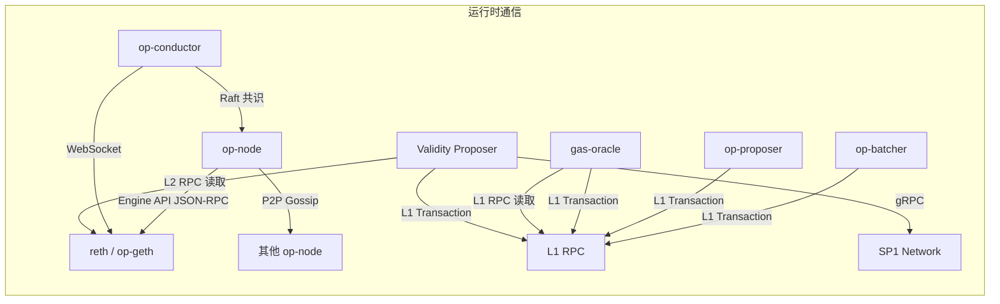

### 2.2 代码依赖（编译时）

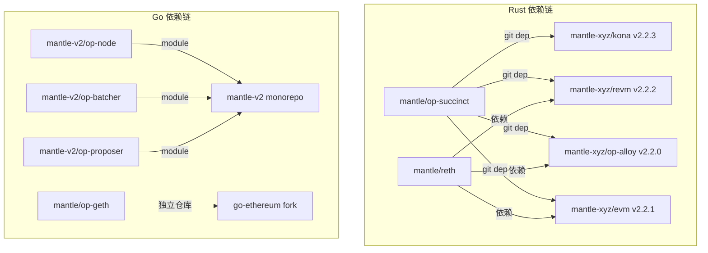

### 2.3 概念对等关系

| Go 实现 | Rust 实现 | 关系 |
|---------|----------|------|
| mantle-v2/op-node/rollup/derive/ | mantle/kona/crates/protocol/derive/ | 概念对等，独立实现 |
| mantle-v2/op-node/rollup/derive/mantle_blob_source.go | mantle/kona/.../sources/mantle_blob.rs | 功能一致 |
| mantle-v2/op-batcher (Go) | mantle/kona/crates/batcher/comp (Rust) | Rust 移植 |
| mantle/op-geth (Go Execution) | mantle/reth (Rust Execution) | 并行替代 |
| op-geth/cmd/keeper (Ziren MIPS) | op-succinct/programs/range (SP1 RISC-V) | 互补 ZK 路径 |
| mantle-v2/op-core/forks/mantle_forks.go | mantle/kona/.../chain/mantle_hardfork.rs | 硬分叉定义对等 |

## 3. 数据流：L2 交易全生命周期

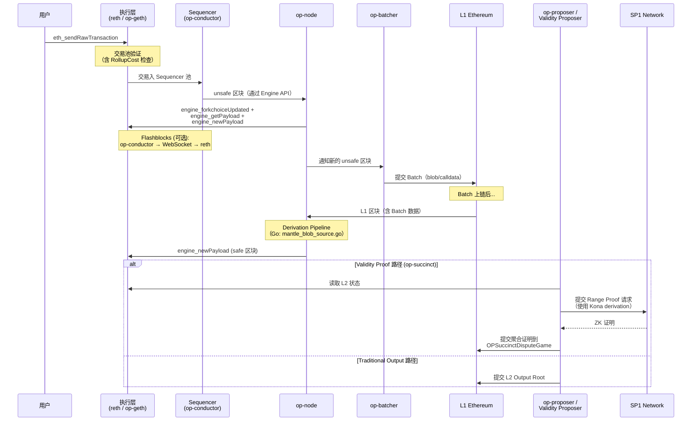

## 4. Mantle 硬分叉在各仓库中的映射

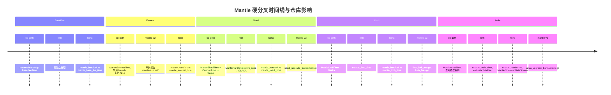

## 5. 费用模型跨仓库映射

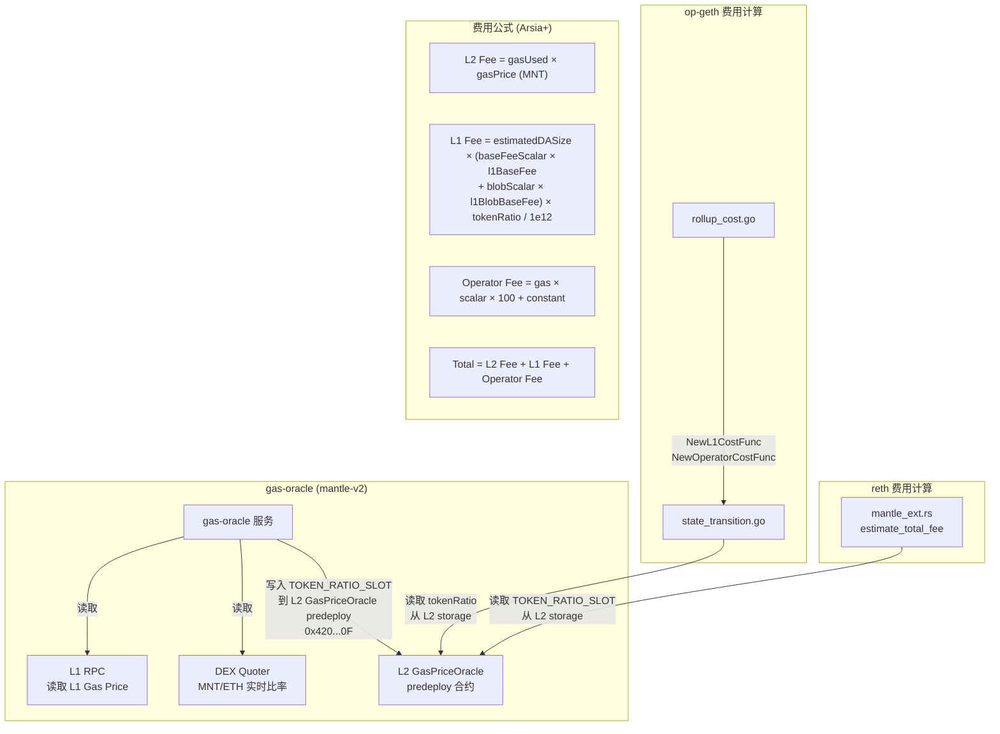

## 6. Flashblocks 跨仓库架构

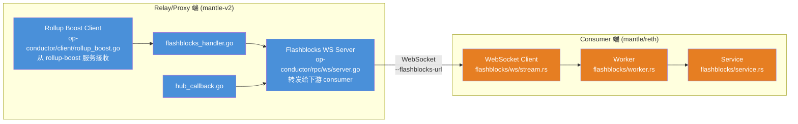

## 7. ZK 证明双路径

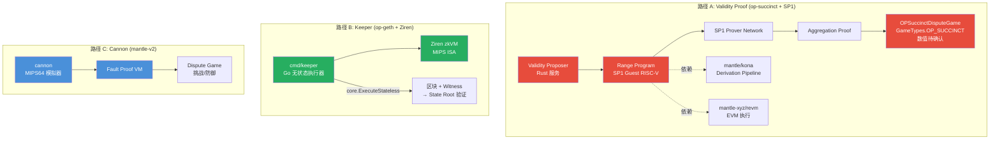


---

# mantle/kona — Rust Derivation & Fault Proof Program 分析

## 1. 仓库概述

mantle/kona 是 Mantle 对 [ethereum-optimism/kona](https://github.com/ethereum-optimism/kona) 的 fork。Kona 是 OP Stack 的 Rust 实现，提供 derivation pipeline、fault proof program (FPP)、rollup node 等组件。Mantle 在此基础上添加了 Mantle 特有的 blob 解码格式、硬分叉配置和 batcher 编码库。

## 2. 仓库结构

```
kona/
├── bin/                          # 可执行二进制
│   ├── client/                   # FPP 客户端（运行在 FPVM 中）
│   │   └── src/
│   │       ├── kona.rs           # 单链 FPP 入口
│   │       ├── kona_interop.rs   # 跨链 FPP 入口
│   │       ├── single.rs         # 单链状态转换
│   │       ├── interop/          # 跨链整合逻辑
│   │       └── fpvm_evm/         # FPVM EVM 工厂 + 加速预编译
│   ├── host/                     # FPP Host 进程
│   │   └── src/
│   │       ├── backend/          # offline/online 数据后端
│   │       ├── kv/               # Preimage KV 存储
│   │       ├── single/           # 单链 host 配置
│   │       └── interop/          # 跨链 host 配置
│   ├── node/                     # Rust Rollup Node（Rust 版 op-node）
│   ├── rollup/                   # Rollup 配置工具
│   └── supervisor/               # 跨链 Supervisor
├── crates/
│   ├── batcher/
│   │   └── comp/                 # ⭐ Batch 编码/压缩库（Mantle 添加）
│   ├── node/                     # Node 运行时库
│   │   ├── disc/                 # Discovery (discv5)
│   │   ├── engine/               # Engine API 驱动
│   │   ├── gossip/               # P2P Gossip（unsafe block 传播）
│   │   ├── peers/                # 对等节点管理
│   │   ├── rpc/                  # Node RPC 服务
│   │   ├── service/              # Actor 服务层（derivation/engine/network/sequencer actors）
│   │   └── sources/              # 签名/同步数据源
│   ├── proof/                    # Fault Proof 库
│   │   ├── driver/               # FPP 驱动（编排 derivation + execution）
│   │   ├── executor/             # 证明模式区块执行器
│   │   ├── mpt/                  # Merkle Patricia Trie
│   │   ├── preimage/             # Preimage Oracle ABI
│   │   ├── proof/                # FPP 核心程序
│   │   ├── proof-interop/        # 跨链 FPP
│   │   ├── std-fpvm/             # FPVM 运行时 shim（MIPS64/RISC-V64）
│   │   └── std-fpvm-proc/        # 配套 proc-macros
│   ├── protocol/                 # 协议层
│   │   ├── derive/               # ⭐ Derivation Pipeline（核心）
│   │   │   └── src/
│   │   │       ├── pipeline/     # DerivationPipeline 组装
│   │   │       ├── stages/       # 管道阶段
│   │   │       ├── sources/      # 数据源（含 mantle_blob.rs / mantle_ethereum.rs）
│   │   │       └── traits/       # DataAvailabilityProvider 等 trait
│   │   ├── genesis/              # Rollup 配置 / 链配置
│   │   │   └── src/chain/
│   │   │       ├── hardfork.rs         # OP 硬分叉
│   │   │       └── mantle_hardfork.rs  # ⭐ Mantle 硬分叉配置
│   │   ├── hardforks/            # 协议升级交易
│   │   │   └── src/
│   │   │       ├── ecotone.rs / fjord.rs / ...
│   │   │       └── mantle_forks.rs     # ⭐ Mantle 升级交易
│   │   ├── interop/              # 超链互操作原语
│   │   ├── protocol/             # 核心协议类型（batch/channel/frame/deposit）
│   │   └── registry/             # 超链注册表
│   ├── providers/                # 数据提供者
│   │   ├── providers-alloy/      # Alloy 驱动的 L1/L2/Beacon 提供者
│   │   └── providers-local/      # 本地/内存提供者
│   ├── supervisor/               # 超链 Supervisor 服务
│   └── utilities/                # CLI/宏/序列化工具
├── docker/                       # Docker 构建配置
│   ├── cannon/                   # MIPS64 目标规格
│   └── fpvm-prestates/           # FPVM 预状态构建
├── tests/                        # Go E2E 测试
└── docs/                         # 文档站点
```

## 3. Mantle 自定义修改

### 3.1 Mantle 硬分叉配置（`crates/protocol/genesis/src/chain/mantle_hardfork.rs`）

`MantleHardForkConfig` 定义了 6 个 Mantle 特有的网络升级：

| 硬分叉 | 字段 | 说明 |
|--------|------|------|
| **Mantle BaseFee** | `mantle_base_fee_time` | BaseFee 机制引入 |
| **Mantle Everest** | `mantle_everest_time` | Everest 升级 |
| **Mantle Euboea** | `mantle_euboea_time` | Euboea 升级 |
| **Mantle Skadi** | `mantle_skadi_time` | Skadi 升级（对应 EVM OpSpecId::OSAKA） |
| **Mantle Limb** | `mantle_limb_time` | Limb 升级 |
| **Mantle Arsia** | `mantle_arsia_time` | Arsia 升级（最新，影响 DA 和费用） |

升级历史顺序：BaseFee → Everest → Euboea → Skadi → Limb → Arsia

通过 `has_any_hardfork()` 方法判断是否为 Mantle 链（比硬编码 chain_id 更灵活，支持测试网和自定义部署）。

### 3.2 Mantle Blob 数据源（`crates/protocol/derive/src/sources/mantle_blob.rs`）

**`MantleBlobSource`** — Mantle 特有的 blob 解码器：

- **Mantle blob 格式**：将所有解码的 blob 数据拼接后进行 RLP 解码（`Vec<Bytes>` 的 RLP 列表）
- **回退机制**：如果 Mantle RLP 格式解码失败，设置 `mantle_format_failed = true`，之后所有后续区块切换到标准 blob 格式（与 Go 实现的 `blobSourceChanged` 开关匹配）
- **持久性**：`mantle_format_failed` 标志在 `clear()` 调用间持久化

### 3.3 Mantle Ethereum 数据源（`crates/protocol/derive/src/sources/mantle_ethereum.rs`）

**`MantleEthereumDataSource`** — 实现 `DataAvailabilityProvider` trait：

- 复合数据源：`MantleBlobSource`（blob 数据）+ `CalldataSource`（calldata 数据）
- 感知 Mantle Arsia 硬分叉时间戳（`mantle_arsia_timestamp`）
- 从 `RollupConfig.mantle_hardforks` 读取 Mantle 硬分叉配置

### 3.4 Batch 编码/压缩库（`crates/batcher/comp/`）

**Mantle 添加的全新 crate**（upstream Kona 无 `batcher/` 目录）：

- `channel_out.rs` — Channel 输出编码器
- `brotli.rs` / `zlib.rs` — 压缩算法实现
- `shadow.rs` — 可能用于影子模式（shadow mode）行为
- `config.rs` — 配置
- `ratio.rs` — 压缩比计算
- `traits.rs` / `types.rs` / `variant.rs` — 抽象层

这是 Go `op-batcher` channel-out + 压缩机制的 Rust 移植，旨在支持 Rust 版 batcher 或作为 ZK 证明中 batch 验证的共享库。

### 3.5 协议升级交易（`crates/protocol/hardforks/src/mantle_forks.rs`）

与 upstream 的 `ecotone.rs`、`fjord.rs`、`isthmus.rs` 等并列，定义 Mantle 硬分叉对应的系统 deposit 交易。

### 3.6 测试数据

- `crates/protocol/derive/src/sources/testdata/mantle_sepolia_blob.hex`
- `crates/protocol/derive/src/sources/testdata/mantle_sepolia_block_10001504_blob_{0,1,2}.hex`
- `crates/protocol/derive/src/sources/testdata/mantle_sepolia_mantle_blob.hex`

注意 `mantle_sepolia_blob.hex`（标准 blob 格式）和 `mantle_sepolia_mantle_blob.hex`（Mantle blob 格式）的区分，证实两种解码路径均有测试覆盖。

## 4. Derivation Pipeline

### 管道阶段

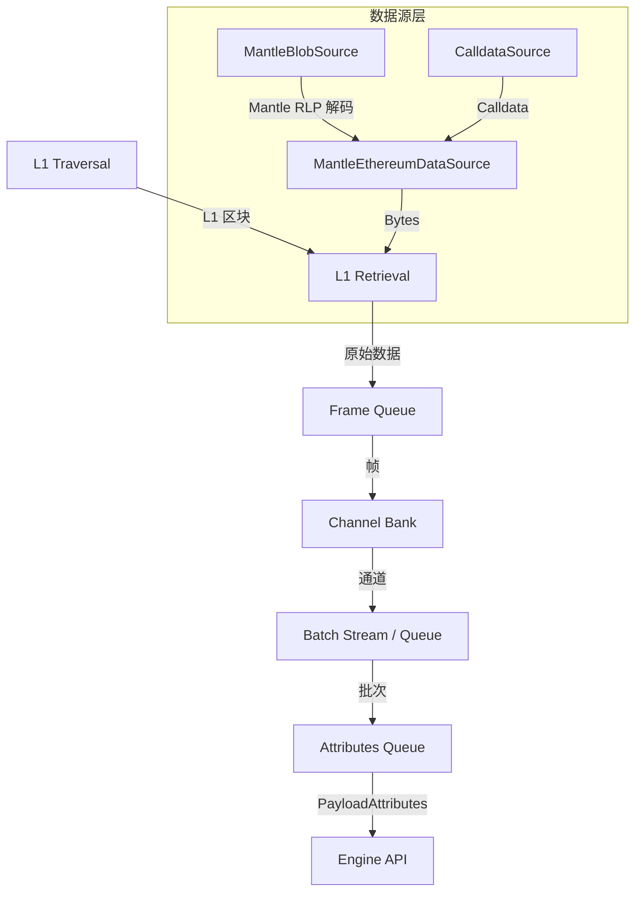

**阶段定义**（`crates/protocol/derive/src/stages/`）：
1. `traversal/` — L1 区块遍历（polling/indexed 模式）
2. `l1_retrieval.rs` — 通过 `DataAvailabilityProvider` 获取数据
3. `frame_queue.rs` — 解析 frame
4. `channel/` — frame → channel（channel_bank、channel_assembler、channel_reader）
5. `batch/` — channel → batch（batch_stream、batch_queue、batch_validator）
6. `attributes_queue.rs` — batch → `PayloadAttributes`

### 与 Go 版本的关系

| 方面 | Go (mantle-v2/op-node) | Rust (mantle/kona) |
|------|------------------------|---------------------|
| 位置 | `op-node/rollup/derive/` | `crates/protocol/derive/` |
| 数据源 | `data_source.go` + `mantle_blob_source.go` + `altda_data_source.go` | `mantle_blob.rs` + `mantle_ethereum.rs` |
| 硬分叉 | Go 实现 | `mantle_hardfork.rs` + `mantle_forks.rs` |
| 用途 | 生产 op-node | FPP 证明 + Rust node |

两个版本概念对等但独立实现。Rust 版用于 FPP（Fault Proof Program）中的可证明 derivation，Go 版用于生产 op-node。

## 5. Fault Proof Program (FPP)

### 架构

```
┌─────────────────────────────────────┐
│           Host (bin/host/)          │
│  ┌─────────┐  ┌──────────────────┐  │
│  │ KV Store│  │  Online/Offline  │  │
│  │(disk/mem)│  │    Backend       │  │
│  └─────────┘  └──────────────────┘  │
│       ↑ Preimage Oracle ABI         │
├───────┼─────────────────────────────┤
│       ↓                              │
│         Client (bin/client/)         │
│  ┌──────────────────────────────┐   │
│  │    FPVM EVM Factory          │   │
│  │  + 加速预编译 (BLS12, BN128, │   │
│  │    ECDSA, KZG)               │   │
│  ├──────────────────────────────┤   │
│  │  Derivation Pipeline         │   │
│  │  (MantleEthereumDataSource)  │   │
│  ├──────────────────────────────┤   │
│  │  Block Executor              │   │
│  │  (Proof Driver)              │   │
│  └──────────────────────────────┘   │
└─────────────────────────────────────┘
```

**目标 FPVM**：
- **Cannon** (MIPS64) — `docker/cannon/mips64-unknown-none.json`
- **Asterisc** (RISC-V64) — `crates/proof/std-fpvm/src/riscv64/`

**加速预编译**（`bin/client/src/fpvm_evm/precompiles/`）：
- BLS12-381: g1_add, g1_msm, g2_add, g2_msm, map_fp, map_fp2, pairing
- BN128: pairing
- ECRECOVER
- KZG point evaluation

## 6. 二进制入口点

| 二进制 | 入口文件 | 用途 |
|--------|---------|------|
| `kona-node` | `bin/node/src/main.rs` | Rust Rollup Node |
| `kona-supervisor` | `bin/supervisor/src/main.rs` | 跨链 Supervisor |
| `kona-host` | `bin/host/src/bin/host.rs` | FPP Host 进程 |
| `kona-client` | `bin/client/src/kona.rs` | FPP Client（单链） |
| `kona-client-interop` | `bin/client/src/kona_interop.rs` | FPP Client（跨链） |

## 7. 与其他仓库的关系

- **被 mantle/op-succinct 依赖**：op-succinct 通过 `mantle-xyz/kona v2.2.3` 引入 derivation pipeline 和 proof 原语
- **与 mantle-v2 的关系**：
  - Kona 的 Rust node 是 Go op-node 的替代方案
  - Derivation pipeline 是 Go 版的 Rust 移植
  - `batcher/comp` 是 Go op-batcher channel-out 的 Rust 移植
- **Fork 定制策略**：添加式修改（新增文件 + mod.rs 重导出），不修改 upstream 现有文件


---

# mantle/mantle-v2 — Go OP Stack 基础设施分析

## 1. 仓库概述

mantle-v2 是 Mantle 对 [ethereum-optimism/optimism](https://github.com/ethereum-optimism/optimism) 的 fork，是 Mantle 最大、最核心的仓库。它包含了 OP Stack 的所有 Go 基础设施组件：op-node、op-batcher、op-proposer、op-challenger、op-conductor、cannon，以及 L1/L2 智能合约和 Mantle 特有的 gas-oracle 服务。

## 2. 仓库结构

```
mantle-v2/
├── op-node/                    # Rollup 共识层客户端 + Derivation Pipeline
│   ├── mantle_service.go       # ⭐ Mantle 服务入口
│   ├── rollup/
│   │   ├── mantle_chain_spec.go
│   │   ├── mantle_types.go
│   │   └── derive/
│   │       ├── mantle_blob_source.go      # ⭐ Mantle blob 数据源
│   │       ├── mantle_pipeline.go         # ⭐ Mantle derivation pipeline
│   │       ├── mantle_system_config.go
│   │       ├── arsia_upgrade_transactions.go
│   │       └── skadi_upgrade_transactions.go
│   ├── bindings/               # Go bindings (L1Block, OptimismPortal, etc.)
│   ├── config/                 # 节点配置
│   └── p2p/                    # P2P 网络栈
├── op-batcher/                 # L2 Batch 提交器
│   ├── batcher/                # 核心驱动（driver, channel_builder, channel_manager）
│   │   └── throttler/          # 节流策略（linear, PID, quadratic, step）
│   └── compressor/             # 压缩器（ratio, shadow, non）
├── op-proposer/                # L2 Output 提交器
│   └── proposer/               # 驱动 + L2 output submitter
├── op-challenger/              # 争议游戏挑战代理
│   └── game/fault/             # Fault proof 游戏（solver, responder, contracts, trace providers）
├── op-conductor/               # ⭐ 高可用 Sequencer + Flashblocks
│   ├── conductor/              # 服务核心
│   ├── consensus/              # Raft 共识
│   ├── client/
│   │   └── rollup_boost.go     # ⭐ Rollup Boost 客户端
│   ├── rpc/
│   │   └── ws/                 # ⭐ Flashblocks WebSocket
│   │       ├── flashblocks_handler.go
│   │       ├── server.go
│   │       └── hub_callback.go
│   └── health/                 # 健康监控
├── cannon/                     # MIPS 指令模拟器 (Fault Proof VM)
│   ├── mipsevm/                # VM 核心（arch, exec, memory, multithreaded）
│   └── multicannon/            # 多版本调度器
├── packages/contracts-bedrock/ # L1/L2 智能合约
│   ├── src/
│   │   ├── L1/                 # L1 合约（SystemConfig, OptimismPortal, L2OutputOracle）
│   │   ├── L2/                 # L2 合约（BVM_ETH, GasPriceOracle, L1Block, OperatorFeeVault）
│   │   ├── legacy/             # 遗留合约（LegacyERC20MNT）
│   │   └── libraries/          # 库（MantlePreinstalls）
│   └── deploy-config/          # 部署配置（mantle-mainnet.json, mantle-sepolia.json）
├── gas-oracle/                 # ⭐ Mantle L1 Gas 价格 + Token Ratio 更新服务
│   ├── oracle/                 # L1 客户端 + 更新器
│   └── tokenratio/             # MNT/ETH 比率（DEX quoter 集成）
├── op-core/                    # Mantle 核心定义
│   └── forks/
│       ├── forks.go
│       └── mantle_forks.go     # ⭐ Mantle 硬分叉定义
├── op-alt-da/                  # 替代 DA 框架（Plasma 协议）
├── op-program/                 # Fault Proof 程序
├── op-service/                 # 共享工具库
│   └── flags/mantle_flags.go   # Mantle CLI flags
├── op-chain-ops/               # 链操作工具
│   ├── addresses/mantle_contracts.go
│   └── genesis/mantle_config.go
├── op-deployer/                # 部署器（含大量 mantle_*.go）
├── op-devstack/                # 开发栈预设（mantle_*.go, flashblocks.go）
├── op-e2e/                     # E2E 测试
│   └── actions/mantleupgrades/ # Mantle 升级测试
├── op-supervisor/              # 超链 Supervisor
└── docs/security-reviews/      # 安全审计报告
    ├── mantle-arsia/
    ├── mantle-euboea/
    ├── mantle-everest/
    ├── mantle-skadi/
    └── mantle-tectonic/
```

## 3. 核心组件分析

### 3.1 op-node — Rollup 共识层

**Mantle 定制**：

- **`mantle_service.go`**：Mantle 节点服务入口，扩展 upstream op-node 服务
- **`rollup/mantle_chain_spec.go`**：Mantle 链规格定义
- **`rollup/mantle_types.go`**：Mantle 特有类型（含 `AlignOpWithMantle()` 函数，被 reth 的 base fee 参数提取引用）
- **`rollup/derive/mantle_blob_source.go`**：Mantle blob 数据源（Go 版本，与 kona 的 `MantleBlobSource` 对应）
- **`rollup/derive/mantle_pipeline.go`**：Mantle derivation pipeline 定制
- **`rollup/derive/mantle_system_config.go`**：Mantle 系统配置解析
- **升级交易**：`arsia_upgrade_transactions.go`、`skadi_upgrade_transactions.go`

### 3.2 op-batcher — Batch 提交器

完整的 batcher daemon（Go 实现），组件包括：
- `driver.go` — 主驱动循环
- `batch_submitter.go` — 批次提交逻辑
- `channel_builder.go` / `channel_manager.go` — Channel 构建与管理
- `compressor/` — 压缩策略（ratio、shadow、non_compressor）
- `throttler/` — 节流控制器（linear、PID、quadratic、step 策略）

**注意**：op-batcher 目录中无 `mantle_*` 命名文件。Mantle 的 batcher 定制通过共享的 rollup/derive 层（`mantle_system_config.go`、`mantle_blob_source.go`）和 SystemConfig 间接实现。

### 3.3 op-proposer — Output 提交器

标准 OP Stack output proposer，支持：
- L2OutputOracle 模式
- DisputeGameFactory 模式
- Rollup / Supervisor 数据源

### 3.4 op-challenger — 争议游戏挑战器

支持多版本 dispute game 合约（0.8.0、1.1.1、1.3.1、1.8.0 + super 和 optimistic-zk）：
- `game/fault/contracts/optimisticzkdisputegame.go` — ZK 争议游戏支持
- `game/fault/trace/` — Cannon / Asterisc / Alphabet trace providers
- `game/fault/solver/` — 游戏求解器

### 3.5 op-conductor — 高可用 Sequencer + Flashblocks

**Mantle 核心定制区域**。在 upstream op-conductor（基于 Raft 的 sequencer HA）基础上添加：

**Flashblocks WebSocket**（`rpc/ws/`）：
- `flashblocks_handler.go` — Flashblocks WebSocket 消息处理器
- `server.go` — WebSocket 服务器
- `hub_callback.go` — Hub 回调机制

**Rollup Boost 集成**（`client/`）：
- `rollup_boost.go` — Rollup Boost 客户端（sequencer 侧的 flashblocks 发布端）

**测试覆盖**：
- `op-acceptance-tests/tests/flashblocks/` — stream 测试、transfer 测试
- `op-devstack/presets/flashblocks.go` — 开发栈预设

### 3.6 cannon — MIPS Fault Proof VM

标准 Cannon 实现：
- MIPS64 指令集模拟器
- 多线程支持（MT-Cannon）
- 多版本调度器（multicannon）
- EVM 差分测试

### 3.7 contracts-bedrock — 智能合约

**Mantle 特有合约**：
- `L2/BVM_ETH.sol` — Mantle 的 ETH 预部署包装器（MNT 是原生代币，ETH 通过此合约表示）
- `L2/GasPriceOracle.sol` — Gas 价格预言机
- `L2/OperatorFeeVault.sol` — Operator 费用金库
- `legacy/LegacyERC20MNT.sol` — 遗留 MNT ERC20 代币合约
- `libraries/MantlePreinstalls.sol` — Mantle 预安装合约字节码

**部署配置**：
- `deploy-config/mantle-mainnet.json`
- `deploy-config/mantle-sepolia.json`
- `deployments/mantle-mainnet/`, `mantle-goerli/` 等

**注意**：此 fork 的 contracts-bedrock 中**无 `src/cannon/` 或 `src/dispute/` 目录**（upstream Optimism 包含 `MIPS.sol`、`FaultDisputeGame.sol`），争议合约仅通过 Go bindings 引用。

### 3.8 gas-oracle — Gas 价格 + Token Ratio 服务

**Mantle 独有组件**（upstream 无此模块）：

- `oracle/l1_client.go` — L1 Gas 价格获取
- `tokenratio/tokenratio.go` — MNT/ETH 比率计算
- `tokenratio/tokenratio_dex.go` — 从 DEX Quoter 合约获取实时比率
- `tokenratio/tokenratio_v1.go` / `tokenratio_v5.go` — 不同版本的比率更新逻辑

此服务**读取 L1 / DEX 数据**，然后**向 L2 `GasPriceOracle` predeploy（`0x420000000000000000000000000000000000000F`）写入** token ratio 和 L1 gas 信息。reth / op-geth 的 `estimateTotalFee` RPC 再从该 L2 合约存储读取 `TOKEN_RATIO_SLOT`。注意：gas-oracle 连接的是 L2 Sequencer（通过 `l2Backend` + `L2ChainID`），不直接写入 L1 合约。

### 3.9 op-alt-da — 替代 DA

标准 Optimism Alt-DA plasma 框架，支持 file 和 S3 存储后端。**EigenDA 集成代码不在此仓库中**——仅有 Everest 升级的 EigenDA 安全审计报告。EigenDA 集成可能位于：
- 早期 mantle-v1 仓库
- op-geth 中
- 通过 `mantle_blob_source.go` 的 blob 路径间接支持

## 4. Mantle 升级历史

从代码和审计报告中确认的升级路径：

| 升级名称 | 证据来源 | 主要变更 |
|----------|---------|---------|
| **Tectonic** | 审计报告目录 | 基础架构（OpenZeppelin、SigmaPrime 审计）|
| **Everest** | 审计报告 | EigenDA 集成（Sigma Prime 审计）|
| **Euboea** | 审计报告 | Zenith + Pre-Confirmation |
| **Skadi** | 审计报告 + 代码 | `skadi_upgrade_transactions.go`、EVM 映射到 OSAKA |
| **Limb** | E2E 测试 | `limb_fork_test.go`、`limb_fees.go` |
| **Arsia** | 代码 + E2E 测试 | `arsia_upgrade_transactions.go`、DA/费用模型变更、`estimateTotalFee` |

## 5. Mantle 费用模型

Mantle 的费用结构是对标准 OP Stack 的显著定制：

```
Total Fee = L2 Execution Fee + L1 Data Fee + Operator Fee

L2 Execution Fee = gasUsed × gasPrice (以 MNT 计价)
L1 Data Fee = l1_data_fee × token_ratio (MNT/ETH 转换)
Operator Fee = gasUsed × operator_fee_scalar × 100 + operator_fee_constant
```

关键组件：
- **MNT 原生代币**：Mantle 的原生代币是 MNT（非 ETH）
- **BVM_ETH 合约**：ETH 通过 predeploy 合约 `BVM_ETH.sol` 表示
- **Token Ratio**：`gas-oracle` 服务从 DEX 获取 MNT/ETH 比率，写入 `GasPriceOracle` 合约
- **Operator Fee**：额外的运营商费用层

## 6. Flashblocks 架构

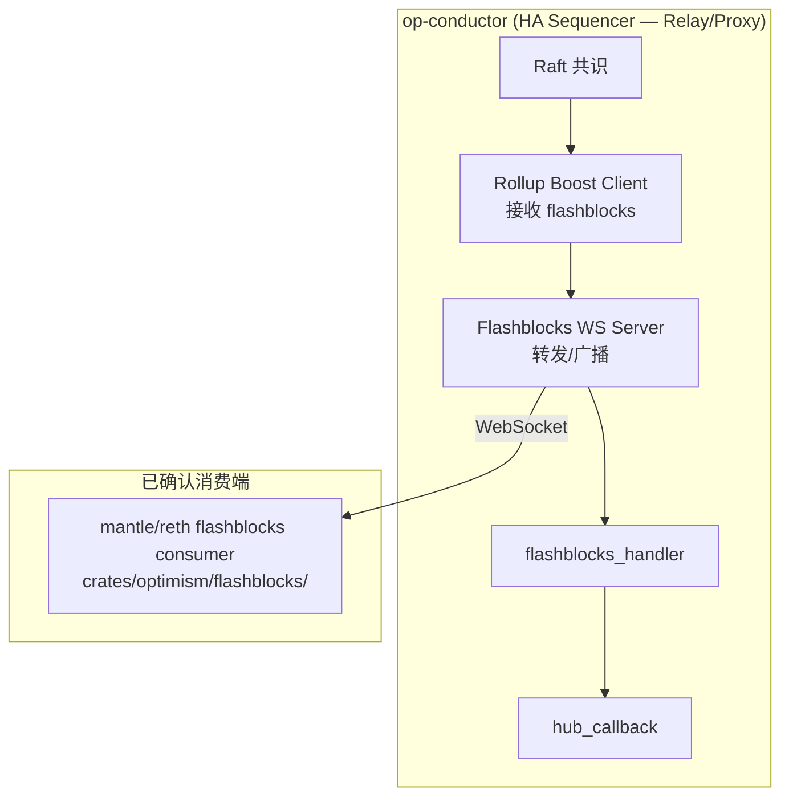

- **Relay 端**：op-conductor 通过 `rollup_boost.go` 客户端从 rollup-boost 服务接收 flashblocks，通过 WebSocket 服务器转发给下游 consumer。op-conductor 是 relay/proxy 角色，不是 flashblocks 的原始 producer
- **Consumer 端**：mantle/reth 的 `crates/optimism/flashblocks/` 通过 `--flashblocks-url` 订阅
- **注意**：mantle/op-geth 中**未发现 flashblocks 相关代码**，当前仅 reth 有 flashblocks consumer 实现

## 7. Fork 关系

- 直接 fork 自 `ethereum-optimism/optimism`
- 追踪到 post-Holocene / Isthmus / Jovian / Interop 时代
- 保持 upstream 目录布局不变，通过添加并行的 `mantle_*.go` 文件实现定制
- CI 从 upstream CircleCI 迁移而来（`ci-main-migrated.yml`）
- 保留了 upstream 从 2020-2025 的所有安全审计报告

## 8. 与其他仓库的关系

- **与 mantle/reth**：op-node 通过 Engine API 驱动 reth；gas-oracle 维护的 token ratio 被 reth RPC 读取
- **与 mantle/kona**：Go derivation pipeline 是 Kona Rust 版的源实现；`mantle_blob_source.go` 对应 `mantle_blob.rs`
- **与 mantle/op-geth**：op-node 同样可通过 Engine API 驱动 op-geth
- **与 mantle/op-succinct**：op-proposer 可配合 op-succinct 的 validity proposer 使用


---

# mantle/op-geth — Go Execution Client 分析

## 1. 仓库概述

mantle/op-geth 是 Mantle 对 [ethereum-optimism/op-geth](https://github.com/ethereum-optimism/op-geth) 的 fork（op-geth 本身 fork 自 `ethereum/go-ethereum`）。它是 Mantle L2 的 Go 执行客户端，与 mantle/reth（Rust 执行客户端）互为**并行替代方案**。当前活跃分支为 `mantle-arsia` 和 `mantle-elysium`。

## 2. 仓库结构

```
op-geth/
├── cmd/
│   ├── geth/                      # geth 主二进制入口
│   ├── keeper/                    # ⭐ Mantle 独有：zkVM Guest 无状态执行器
│   │   ├── main.go                # Payload(Block+Witness) → ExecuteStateless
│   │   ├── chainconfig.go         # 链配置查找
│   │   ├── getpayload_example.go  # 示例 payload 加载
│   │   ├── getpayload_ziren.go    # ⭐ Ziren zkVM 平台实现
│   │   └── stubs.go               # 平台 stub
│   └── ...                        # 其他标准 geth 命令
├── core/
│   ├── state_transition.go        # ⭐ 重度修改：tokenRatio、BVM_ETH、MetaTx、Arsia 费用
│   ├── types/
│   │   ├── deposit_tx.go          # ⭐ 扩展：EthValue、EthTxValue 字段
│   │   ├── transaction.go         # ⭐ 扩展：ETHValue()、ETHTxValue()、RollupCostData()
│   │   ├── meta_transaction.go    # ⭐ Mantle 独有：元交易（Gas 赞助）
│   │   ├── meta_transaction_test.go
│   │   ├── rollup_cost.go         # ⭐ 重度修改：Arsia 费用函数、tokenRatio、Operator 费
│   │   ├── rollup_cost_test.go
│   │   └── receipt_opstack.go     # ⭐ 修改：DAFootprintGasScalar
│   ├── txpool/
│   │   ├── rollup.go              # Rollup 费用函数接口
│   │   ├── txpool_preconf.go      # ⭐ 预确认交易池接口
│   │   ├── blobpool/blobpool_preconf.go
│   │   ├── legacypool/legacypool_preconf.go
│   │   ├── legacypool/rollup_cost_test.go
│   │   └── locals/preconf_tx_tracker.go
│   └── genesis.go                 # 创世配置
├── preconf/                       # ⭐ Mantle 独有：预确认子系统
│   ├── miner_config.go            # 预确认检查器配置
│   ├── tx_pool_config.go          # 预确认交易池配置
│   ├── deposit_log.go             # L1 Deposit 事件解析
│   ├── deposit_source.go          # Deposit 来源
│   ├── sync_status.go             # 同步状态（镜像 op-node）
│   ├── fifo_tx_set.go             # FIFO 交易集合
│   ├── id.go                      # ID 工具
│   └── metrics.go                 # 指标
├── miner/
│   ├── miner_preconf.go           # ⭐ 预确认出块集成
│   ├── preconf_checker.go         # ⭐ 预确认检查器（env 快照、Deposit 预应用）
│   └── preconf_checker_test.go
├── internal/ethapi/
│   └── api.go                     # ⭐ 修改：EstimateTotalFee、SendRawTransactionWithPreconf
├── params/
│   ├── mantle.go                  # ⭐ Mantle 链 ID、升级时间戳表
│   ├── mantle_test.go
│   ├── config.go                  # ⭐ 修改：9 个 Mantle 分叉时间字段
│   └── optimism_features.go       # ⭐ Mantle 特性门控
├── eth/                           # 标准 eth 协议栈（基本未修改）
├── consensus/                     # 共识（基本未修改）
├── p2p/                           # P2P 网络（未修改）
└── Dockerfile                     # 修改：自定义 entrypoint.sh
```

## 3. Fork 关系

| 项目 | 值 |
|------|-----|
| 上游 | `ethereum-optimism/op-geth` → `ethereum/go-ethereum` |
| 活跃分支 | `mantle-arsia`（当前主分支）、`mantle-elysium` |
| 构建 | `golang:1.24-alpine`，标准 `go build ./cmd/geth` |
| CI | CircleCI + Gitea（内部自托管）+ GitHub Actions |
| README | **未修改**，仍为 upstream go-ethereum 原文 |

## 4. Mantle 核心定制分析

### 4.1 双代币模型：MNT + BVM_ETH

Mantle 最根本的差异——MNT 是原生 gas 代币，ETH 通过 BVM_ETH predeploy 合约表示。

**`core/types/deposit_tx.go`** — 扩展 `DepositTx` 结构体：

```go
type DepositTx struct {
    SourceHash common.Hash
    From       common.Address
    To         *common.Address
    Mint       *big.Int      // MNT to mint on L2 (locked on L1)
    Value      *big.Int      // MNT transfer value
    Gas        uint64
    IsSystemTransaction bool
    EthValue   *big.Int      // ⭐ BVM_ETH mint amount
    Data       []byte
    EthTxValue *big.Int      // ⭐ BVM_ETH transfer amount (V1 新增)
}
```

**`core/state_transition.go`** — 状态转换核心修改：

- `mintBVMETH()` — 直接操作 BVM_ETH 合约（`0xdEAddEaDdeadDEadDEADDEAddEADDEAddead1111`）的存储 slot，模拟 ERC-20 mint 操作
- `transferBVMETH()` — 直接存储操作实现 BVM_ETH 转账
- `addBVMETHTotalSupply()` — 更新 totalSupply
- 发射 `Mint(address,uint256)` 和 `Transfer(address,address,uint256)` 日志事件
- BVMETHMintUpgrade 前：BVM_ETH mint 到 `msg.To`；升级后：mint 到 `msg.From`

### 4.2 元交易系统（MetaTx）— Gas 赞助

**`core/types/meta_transaction.go`** — Mantle 独有的 Gas 赞助机制：

```go
type MetaTxParams struct {
    ExpireHeight   uint64            // 过期高度
    SponsorPercent uint64            // 赞助比例 (1-100)
    Payload        []byte            // 原始交易数据
    GasFeeSponsor  common.Address    // 赞助者地址
    V, R, S        *big.Int          // 赞助者签名
}
```

关键特性：
- **前缀识别**：交易 Data 以 32 字节 `"MantleMetaTxPrefix"` ASCII 前缀开头
- **仅 DynamicFeeTxType**：只支持 EIP-1559 交易
- **签名验证**：赞助者对 `MetaTxSignData`（V1）或 `MetaTxSignDataV2`（V2，添加 `From` 字段）签名
- **V3 约束**：赞助者不能等于发送者
- **Everest 后禁用**：`IsMantleEverest` 激活后返回 `ErrMetaTxDisabled`
- **费用分割**：`CalculateSponsorPercentAmount()` 按比例分割 gas 费用给赞助者和发送者

**版本演进**：MetaTxV1 → MetaTxV2（添加 From 绑定）→ MetaTxV3（禁止自赞助）→ Everest（完全禁用）

### 4.3 Rollup 费用模型

**`core/types/rollup_cost.go`** — Mantle 的 L1 数据费用计算：

**Arsia 前（Bedrock 风格）**：
```
l1Cost = (rollupDataGas + overhead) × l1BaseFee × scalar × tokenRatio / Decimals
```
- 从 `L1BlockAddr`（`0x4200...0015`）读取 `l1BaseFee`（slot 1）、`overhead`（slot 5）、`scalar`（slot 6）
- 从 `GasOracleAddr`（`0x4200...000F`）读取 `tokenRatio`（slot 0）

**Arsia 后（Fjord 派生）**：
```
estimatedDASize = max(minTxSize, intercept + fastlzCoef × fastLzSize) / 1e6
l1Cost = estimatedDASize × (baseFeeScalar × l1BaseFee + blobBaseFeeScalar × l1BlobBaseFee) × tokenRatio / 1e12
```
- 使用 FastLZ 压缩长度线性回归模型（`L1CostIntercept = -42_585_600`，`L1CostFastlzCoef = 836_500`）
- `FlzCompressLen` — Solady FastLZ 长度计算的 Go 移植

**Operator 费用（Arsia+）**：
```
operatorFee = gasUsed × operatorFeeScalar × 100 + operatorFeeConstant
```
- 从 `L1BlockAddr` slot 8 提取 scalar（bytes 20-24）和 constant（bytes 24-32）

**总费用组合器**：`NewTotalRollupCostFunc = L1 cost + operator cost`

**关键常量**：
```go
MantleArsiaL1AttributesSelector = []byte{0x49, 0xe7, 0x23, 0x83}
L1BlockAddr   = 0x4200000000000000000000000000000000000015
GasOracleAddr = 0x420000000000000000000000000000000000000F
TokenRatioSlot = slot 0
OperatorFeeParamsSlot = slot 8
```

### 4.4 预确认子系统（Preconfirmation）

**`preconf/` 包** — 完全由 Mantle 新增的顶层包：

**MinerConfig**（`preconf/miner_config.go`）：
| 字段 | 默认值 | 说明 |
|------|--------|------|
| `EnablePreconfChecker` | `false` | 预确认检查器开关 |
| `OptimismNodeHTTP` | `http://localhost:7545` | L2 op-node RPC |
| `L1RPCHTTP` | `http://localhost:8545` | L1 RPC |
| `L1DepositAddress` | 合约地址 | L1 Deposit 合约 |
| `ToleranceBlock` | `6` | 容忍区块数 |
| `PreconfBufferBlock` | `6` | 预确认缓冲区块 |

派生容忍度：
- **Mantle 容忍时间** = `ToleranceBlock × 2s` = 12s（Mantle 2 秒出块）
- **ETH 容忍时间** = `(ToleranceBlock + 3) × 12s` = 108s（+3 为 op-node 开始 derivation 的固定延迟）

**TxPoolConfig**（`preconf/tx_pool_config.go`）：
- `FromPreconfs` / `ToPreconfs` — 预确认白名单地址
- `AllPreconfs` — 全局预确认开关
- `PreconfTimeout` — 超时时间（默认 1s）
- `IsPreconfTx()` — 需要 From AND To 都在白名单中

**Miner 集成**（`miner/preconf_checker.go`）：
- 维护模拟 `env`/`snapEnv` 快照
- `applyPreconfTransaction` — 预确认版 `core.ApplyTransaction`
- Deposit 预应用、暂停/恢复出块
- 新鲜度检查：`ErrEnvTooOld`、`ErrHeadL1BlockTooOld`、`ErrCurrentL1NumberAndHeadL1NumberDistanceTooLarge`

**Sync Status**（`preconf/sync_status.go`）：
- 从 `mantle-v2/op-node/eth/sync_status.go` 复制
- 包含 `OptimismSyncStatus`：CurrentL1、HeadL1、SafeL1、FinalizedL1、UnsafeL2、SafeL2、FinalizedL2

### 4.5 RPC 扩展

**`internal/ethapi/api.go`** 中的 Mantle 添加：

1. **`EstimateTotalFee`**（Arsia+ 专有）— 综合费用估算：L2 gas 费 + L1 数据费 + Operator 费
2. **`SendRawTransactionWithPreconf`** — 带预确认的交易提交
3. **Receipt 扩展字段**：`tokenRatio`、`operatorFeeScalar`、`operatorFeeConstant`（Isthmus）、`daFootprintGasScalar`（Jovian）
4. **RPCTransaction 扩展**：Deposit 交易添加 `EthValue`/`EthTxValue`/`Mint` 字段
5. **Gas 估算修改**：MetaTx 感知、1.2× buffer（Arsia 前）、`GasEstimationWithSkipCheckBalanceMode`
6. **`DefaultMantleBlockGasLimit`** 常量

### 4.6 Keeper — zkVM Guest 无状态执行器

**`cmd/keeper/`** — Mantle 独有的 zkVM Guest 程序：

```go
// main.go — 核心执行流程
func main() {
    input := getInput()                                    // 从 zkVM 读取输入
    var payload Payload
    rlp.DecodeBytes(input, &payload)                       // 解码 Payload
    chainConfig, _ := getChainConfig(payload.ChainID)      // 获取链配置
    crossStateRoot, crossReceiptRoot, _ :=
        core.ExecuteStateless(chainConfig, vmConfig, payload.Block, payload.Witness)
    // 验证 state root 和 receipt root
}
```

特点：
- **目标 zkVM**：Ziren（MIPS ISA），构建参数 `GOOS=linux GOARCH=mipsle GOMIPS=softfloat`
- **输入**：`Payload{ChainID, Block, Witness}` — 区块 + 无状态见证
- **输出**：验证 state root 和 receipt root 匹配
- **GC 禁用**：`debug.SetGCPercent(-1)` 优化 zkVM 性能
- **可扩展架构**：`getpayload_ziren.go` 实现 Ziren 平台，其他 zkVM 可添加自定义实现

与 op-succinct（SP1 zkVM）是**互补**关系——两种不同的 ZK 证明路径。

### 4.7 链配置与硬分叉

**`params/mantle.go`** — 9 个 Mantle 硬分叉时间戳：

| 硬分叉 | 主网时间戳 | Sepolia 时间戳 | 说明 |
|--------|-----------|---------------|------|
| BaseFee | 0（创世） | 1704891600 | EIP-1559 引入 |
| BVMETHMint | 0 | 1720594800 | BVM_ETH mint 升级 |
| MetaTxV2 | 0 | 1720594800 | MetaTx V2（添加 From） |
| MetaTxV3 | 1742367600 | 1720594800 | MetaTx V3（禁止自赞助） |
| ProxyOwnerUpgrade | 1742367600 | nil | L2ProxyAdmin 所有者 |
| MantleEverest | 1742367600 | 1737010800 | EIP-7212 + 禁用 MetaTx |
| MantleSkadi | 1756278000 | 1752649200 | Prague 升级 |
| MantleLimb | 1768374000 | 1764745200 | Osaka 升级 |
| MantleArsia | 1776841200 | 1774422000 | DA/费用模型重构 |

链 ID：
- 主网：`5000`
- Sepolia：`5003`
- 本地：`1337`

**`params/optimism_features.go`** — 特性门控：
- 强制 `CancunTime == MantleSkadiTime`
- `IsMinBaseFee`、`IsDAFootprintBlockLimit`、`IsOperatorFeeFix`（绑定到 Jovian）

**注意**：从 Arsia 开始，QA/dev/local 网络不再硬编码升级时间戳，改用 deploy-config JSON 或 CLI 标志。

## 5. State Transition 核心修改

`core/state_transition.go` 是**修改最重的文件**：

```
┌────────────────────────────────────────────────────┐
│                state_transition.go                  │
├────────────────────────────────────────────────────┤
│ Arsia 前：                                          │
│   gasPrice *= tokenRatio（内在 gas 缩放）              │
│   floorDataGas *= tokenRatio                        │
│   gasRemaining /= tokenRatio（EVM 执行）              │
│   refund *= tokenRatio（退款）                        │
│                                                     │
│ Arsia 后：                                          │
│   tokenRatio 缩放移除                                 │
│   L1 cost + operator cost 预扣（不可退）               │
│   mgval = l1Cost + operatorCost（预购买）              │
├────────────────────────────────────────────────────┤
│ BVM_ETH 操作：                                       │
│   mintBVMETH(addr, amount)                          │
│   transferBVMETH(from, to, amount)                  │
│   addBVMETHTotalSupply(amount)                      │
│   getBVMETHBalanceKey(addr) → storage key            │
├────────────────────────────────────────────────────┤
│ MetaTx Gas 分割：                                    │
│   buyGas：CalculateSponsorPercentAmount() 分割费用    │
│   returnGasMantle：按比例退还赞助者和发送者              │
│   V3 Sponsor Event → LEGACY_ERC20_MNT               │
├────────────────────────────────────────────────────┤
│ ProxyOwnerUpgrade：                                  │
│   一次性 L2ProxyAdmin 合约所有者更新                     │
└────────────────────────────────────────────────────┘
```

## 6. 与 mantle/reth 的关系

op-geth 和 reth 是**并行的执行客户端**，需保持功能一致性：

| 方面 | op-geth（Go） | mantle/reth（Rust） |
|------|--------------|---------------------|
| EVM 规格映射 | `params/config.go` 硬分叉→SpecId | `crates/optimism/evm/src/mantle.rs` |
| 费用模型 | `core/types/rollup_cost.go` | `crates/optimism/rpc/src/eth/mantle_ext.rs` |
| RPC：EstimateTotalFee | `internal/ethapi/api.go` | `mantle_ext.rs`（精心对齐 op-geth 行为） |
| RPC：SendRawTransactionWithPreconf | `internal/ethapi/api.go` | `mantle_ext.rs` |
| Flashblocks | 不在此仓库 | `crates/optimism/flashblocks/`（WebSocket 消费端） |
| MetaTx | `core/types/meta_transaction.go` | `docs/specs/2026-04-29-reject-mantle-metatx.md` |
| Deposit 扩展 | `core/types/deposit_tx.go`（EthValue/EthTxValue） | — |
| zkVM Guest | `cmd/keeper/`（Ziren MIPS） | — |

**关键差异**：
- op-geth 包含完整的 MetaTx 实现（已在 Everest 后禁用）
- op-geth 有独立的 preconf 子系统
- op-geth 有 keeper zkVM guest（Ziren MIPS）
- reth 有 Flashblocks WebSocket 消费端
- 两者在 `EstimateTotalFee` 上精心对齐

## 7. 与其他仓库的关系

- **与 mantle-v2/op-node**：通过 Engine API 接收来自 op-node 的 payload；`preconf/sync_status.go` 直接从 mantle-v2 复制
- **与 mantle/reth**：并行执行客户端，功能需一致
- **与 mantle/op-succinct**：keeper（Ziren zkVM）与 op-succinct（SP1 zkVM）是互补的 ZK 证明路径
- **无 `rollup/` 目录**：rollup 相关代码分散在 `core/types/rollup_cost.go` 和 `core/txpool/rollup.go`
- **无 EigenDA 代码**：DA 后端不在执行客户端中

## 8. 关键发现

1. **修改侵入性最高的文件**是 `core/state_transition.go`——tokenRatio 缩放、BVM_ETH 存储操作、MetaTx 赞助分割全部在此
2. **Keeper 是独特的 ZK 路径**——使用 geth 作为 zkVM guest 进行无状态区块验证，目标 Ziren（MIPS ISA）
3. **MetaTx 已废弃**——Everest 后完全禁用，但代码仍保留以支持历史区块验证
4. **预确认是 op-geth 独有**——reth 不包含对应的预确认子系统
5. **Arsia 是费用模型分水岭**——Arsia 前后的 gas 计算逻辑完全不同（tokenRatio 缩放 vs. L1+operator 预扣）


---

# mantle/op-succinct — ZK 证明系统分析

## 1. 仓库概述

mantle/op-succinct 是 Mantle 对 [succinctlabs/op-succinct](https://github.com/succinctlabs/op-succinct) 的 fork，版本基于 v3.4.1。op-succinct 是 OP Stack 的 ZK 证明引擎，基于 SP1 zkVM（v6.1.0，Hypercube 版本），支持 Validity Proof 和 ZK Fault Proof 两种证明路径。

## 2. 仓库结构

```
op-succinct/
├── Cargo.toml              # Workspace 根配置
├── README.md               # 项目说明（仍引用 upstream succinctlabs）
├── .gitmodules             # Git 子模块（forge-std, optimism, openzeppelin, sp1-contracts, solady）
├── audits/                 # 安全审计报告（Spearbit）
├── book/                   # mdBook 文档
├── contracts/              # Solidity 合约
│   ├── src/
│   │   ├── validity/       # Validity Proof 合约
│   │   │   ├── OPSuccinctDisputeGame.sol
│   │   │   └── OPSuccinctL2OutputOracle.sol
│   │   ├── fp/             # Fault Proof 合约
│   │   │   ├── OPSuccinctFaultDisputeGame.sol
│   │   │   ├── AccessManager.sol
│   │   │   └── lib/Errors.sol
│   │   └── lib/Types.sol   # 共享类型定义
│   ├── script/             # 部署脚本
│   │   ├── validity/       # Validity 模式部署
│   │   └── fp/             # Fault Proof 模式部署
│   └── test/               # 合约测试
├── programs/               # SP1 zkVM Guest 程序
│   ├── aggregation/        # 聚合证明 Guest 程序
│   └── range/
│       ├── ethereum/       # Ethereum DA Range 证明
│       └── utils/          # Range 程序共享工具
├── scripts/                # Rust CLI 工具
│   ├── prove/              # 证明生成脚本
│   └── utils/              # 工具脚本
├── validity/               # Validity Proposer 服务（核心）
│   ├── bin/validity.rs     # 入口点
│   └── src/
│       ├── proposer.rs     # Proposer 主循环
│       ├── proof_requester.rs
│       ├── contract.rs     # L1 合约交互
│       ├── config.rs       # 配置定义
│       └── db/             # 数据库客户端
└── utils/                  # 共享 Rust Crate
    ├── build/              # SP1 ELF 构建辅助
    ├── client/             # zkVM 侧运行时（oracle, precompiles, witness）
    ├── elfs/               # 编译好的 ELF 二进制
    ├── ethereum/           # Ethereum 特定的 client/host
    │   ├── client/
    │   └── host/
    ├── host/               # Host 侧证明基础设施（fetcher, witness gen, network）
    ├── proof/              # 证明类型和辅助
    ├── signer/             # 交易签名抽象
    └── signer-gcp/         # GCP KMS 签名实现
```

## 3. Fork 关系与 Mantle 定制

### 上游关系

- 直接 fork 自 `succinctlabs/op-succinct`，版本号保持一致（v3.4.1）
- README 仍引用 upstream 仓库和文档链接

### 关键 Mantle 定制：依赖替换

Mantle 的核心修改不在 op-succinct 本身的代码中，而是通过**替换底层依赖为 Mantle fork** 实现：

| 依赖类别 | Upstream | Mantle Fork | Tag |
|----------|----------|-------------|-----|
| Kona（derivation/proof） | `ethereum-optimism/kona` | `mantle-xyz/kona` | v2.2.3 |
| OP Alloy（OP 类型库） | `alloy-rs/op-alloy` | `mantle-xyz/op-alloy` | v2.2.0 |
| EVM 执行 | `alloy-rs/evm` | `mantle-xyz/evm` | v2.2.1 |
| REVM（EVM 实现） | `bluealloy/revm` | `mantle-xyz/revm` | v2.2.2 |

这意味着 ZK 证明生成过程中使用的 **derivation pipeline**、**EVM 执行**、**OP 共识类型** 全部是 Mantle 定制版本。

### 结构性删减

- **无 `fault-proof/` Rust crate**：upstream op-succinct 包含 `fault-proof/` 目录（含 proposer.rs 和 challenger.rs），但 Mantle fork 中已移除此目录，workspace members 中也不包含
- 这强烈表明 **Mantle 仅使用 Validity Proof 路径**，Fault Proof 的 Rust 服务层被剥离

### 文件级差异

- 无任何文件名包含 "mantle"
- `.gitmodules` 引用的合约子模块仍为 upstream（`ethereum-optimism/optimism`、`succinctlabs/sp1-contracts`）

## 4. 证明路径分析

### 4.1 Validity Proof 路径（主路径 ✅）

**架构流程**：

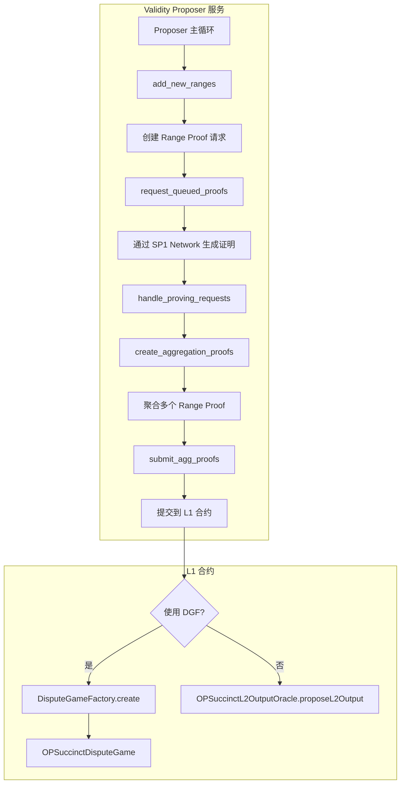

**核心组件**：

1. **Proposer（`validity/src/proposer.rs`）**：
   - 无限循环服务，管理证明生命周期
   - `add_new_ranges()` — 检测未证明的 L2 区块范围，拆分为 Range Proof 请求
   - `request_queued_proofs()` — 将请求提交到 SP1 Prover Network
   - `handle_proving_requests()` — 轮询证明状态
   - `create_aggregation_proofs()` — 将连续的 Range Proof 聚合为 Aggregation Proof
   - `submit_agg_proofs()` — 将完成的聚合证明提交到 L1

2. **SP1 Guest 程序（`programs/`）**：
   - `programs/range/ethereum/` — 验证 L2 状态转换正确性（使用 Ethereum DA）
   - `programs/aggregation/` — 聚合多个 Range Proof 为一个证明
   - 编译为 RISC-V ELF 字节码，由 SP1 zkVM 执行和证明

3. **L1 合约**：
   - `OPSuccinctL2OutputOracle` — 传统 L2OO 模式，接受带 ZK 证明的 output proposal
   - `OPSuccinctDisputeGame`（game type = `GameTypes.OP_SUCCINCT`，具体数值待确认） — 基于 DisputeGameFactory 的 validity dispute game

**配置结构（`config.rs`）**：
- `RequesterConfig`：L1/L2 chain ID、证明间隔、并发控制、DGF 地址、proof strategy（mock/real）
- `CommitmentConfig`：range_vkey_commitment、agg_vkey_hash、rollup_config_hash
- 支持通过 `prover_address` 防止证明前跑攻击

### 4.2 ZK Fault Proof 路径（仅合约层 ⚠️）

**状态**：Solidity 合约存在，但 Rust 服务层已移除。

**合约组件**：
- `OPSuccinctFaultDisputeGame`（game type = 42）：ZK Fault Proof 争议游戏
  - 支持挑战/反驳机制（Unchallenged → Challenged → Proven → Resolved）
  - 需要 SP1 验证器合约验证 ZK 证明
- `AccessManager`：权限管理
  - 白名单 proposer/challenger 机制
  - 支持 fallback timeout 后的无许可提案模式
  - 支持 `address(0)` 全局无许可模式

**结论**：从代码结构看，Validity Proof 路径的 Rust 服务完整可编译，而 ZK Fault Proof 的 Rust 服务已从 workspace 移除。Fault Proof 合约代码保留但缺少对应的 Rust 服务（proposer/challenger daemon），无法独立运行。**是否已在生产环境部署 Validity Proof 待确认。**

## 5. SP1 zkVM 集成

| 项目 | 值 |
|------|-----|
| SP1 版本 | v6.1.0（Hypercube） |
| Guest 程序 | `range/ethereum`（状态转换验证）、`aggregation`（聚合证明） |
| 编译目标 | RISC-V ELF |
| 证明模式 | Compressed / Groth16 / PLONK |
| Network 模式 | 支持 SP1 Prover Network（远程证明生成） |
| 加速补丁 | sha2、sha3、substrate-bn、p256、k256、tiny-keccak（SP1 专用优化补丁） |

**Guest 程序执行流程**（`programs/range/ethereum/src/main.rs`）：
1. 从 SP1 zkVM I/O 读取序列化的 witness 数据
2. 反序列化为 `DefaultWitnessData`
3. 构造 oracle 和 blob provider
4. 执行 `run_range_program(ETHDAWitnessExecutor)`，验证 L2 状态转换

## 6. 关键发现

### 6.1 Mantle 的定制策略
Mantle 对 op-succinct 的定制采用**依赖注入式修改**：不修改 op-succinct 的核心逻辑，而是替换底层的 kona、revm、op-alloy 等依赖为 Mantle fork。这使得 op-succinct 的升级维护相对容易。

### 6.2 证明系统部署状态
- **Validity Proof 路径完整**：`validity/` Rust 服务 + `contracts/src/validity/` 合约均存在且可编译
- **ZK Fault Proof 仅合约层保留**：`fault-proof/` Rust workspace 目录已从 Cargo.toml workspace members 中移除，Rust 服务不可运行
- **Validity game type**：`OPSuccinctDisputeGame.gameType()` 返回 `GameTypes.OP_SUCCINCT`，但该常量定义在 `contracts/lib/optimism` 子模块中，本地子模块为空，**无法从本地代码验证具体数值**。Fault game type = 42（本地 `Types.sol:6` 可确认）
- **注意**：从代码结构推断 Validity Proof 是主要路径（Rust 服务存在 + Fault Proof Rust 服务被移除），但**是否已在生产部署待确认**

### 6.3 与其他仓库的关系
- **依赖 mantle/kona**：通过 `mantle-xyz/kona` v2.2.3 获取 derivation pipeline 和 fault proof 原语
- **依赖 Mantle fork 的 revm/evm**：确保 ZK 证明中的 EVM 执行与 Mantle 链行为一致
- **依赖 Mantle fork 的 op-alloy**：确保 OP 共识类型与 Mantle 定制兼容


---

# 待确认事项与开放问题

## 1. Flashblocks 角色分工

### 已确认
- **Relay/Proxy 端**：mantle-v2 的 `op-conductor/rpc/ws/` 通过 `rollup_boost.go` 客户端从 rollup-boost 服务接收 flashblocks，再通过 WebSocket 服务器转发给下游 consumer。op-conductor 是 relay/proxy 角色，不是 flashblocks 的原始 producer
- **Consumer 端**：mantle/reth 的 `crates/optimism/flashblocks/` 通过 `--flashblocks-url` 订阅
- `feat/flashblocks-mantle-aware` 分支证实 reth 的 flashblocks consumer 做了 Mantle 适配
- **op-geth 无 Flashblocks**：本地 `references/codebase/mantle/op-geth` 中 Glob `**/flashblock*` 返回空——op-geth 不包含 flashblocks consumer 实现，这是 reth 相对于 op-geth 的功能差异点

### 待确认
- [ ] **Rollup Boost 的具体实现在哪里？** — op-conductor 中有 `rollup_boost.go` 客户端，但 rollup-boost 服务本身（如 flashblocks-relay / builder）可能在独立仓库中
- [ ] **Flashblocks 在生产环境的部署状态** — 是否已在 Mantle 主网启用？

## 2. DA（数据可用性）路径

### 已确认
- mantle/kona 中 `MantleBlobSource` 支持 Mantle 自定义 blob RLP 格式（拼接所有 blob → RLP 解码 `Vec<Bytes>`），失败后回退到标准 blob 格式
- mantle-v2 中 `op-node/rollup/derive/mantle_blob_source.go` 是对应的 Go 实现
- op-geth 中**无 EigenDA 代码** — DA 后端不在执行客户端中
- mantle-v2 中 `op-alt-da/` 存在标准 Plasma DA 框架，但**无 EigenDA 特定代码**

### 补充说明
- mantle-v2 中 `op-node/rollup/types.go:192-196` 存在 `MantleDA(EigenDA)` 的 legacy 配置字段，但这只是配置定义，不包含实际 EigenDA 客户端实现
- Go 数据源文件为 `data_source.go` + `mantle_blob_source.go` + `altda_data_source.go`（此前误引为 `da_input_translator.go`，已修正）
- `mantle_blob_source.go` 本身**不是** EigenDA 实现，而是处理 Mantle 自定义的 blob RLP 编码格式

### 待确认
- [ ] **EigenDA 集成代码在哪个仓库？** — 从审计报告（mantle-everest）看，EigenDA 集成确实存在。可能的位置：
  - 早期 mantle-v1 仓库
  - 独立的 EigenDA 适配器服务
  - 已弃用（Mantle 可能已从 EigenDA 迁移到 EIP-4844 blob）
- [ ] **当前生产使用的 DA 方案** — EIP-4844 blob（Ethereum L1）、EigenDA、还是混合模式？
- [ ] **`MantleBlobSource` 的 Mantle 格式和标准格式之间的切换条件是什么？** — 已知 `mantle_format_failed` flag 设置后永久切换到标准格式（在 `clear()` 间持久化），但**初始状态默认使用 Mantle 格式的判断条件**未完全清晰

## 3. 证明系统部署状态

### 已确认
- **Validity Proof 路径完整**：op-succinct 中 `validity/` Rust 服务 + `contracts/src/validity/` 合约均存在且可编译
  - Validity game type：`OPSuccinctDisputeGame.gameType()` 返回 `GameTypes.OP_SUCCINCT`，但该常量定义在 `contracts/lib/optimism` 子模块中，本地子模块为空，**具体数值无法从本地代码验证**
  - Fault game type = 42（`contracts/src/lib/Types.sol:6` 可确认）
  - 使用 SP1 v6.1.0 (Hypercube)
- **ZK Fault Proof** 仅合约层保留：`OPSuccinctFaultDisputeGame`（game type = 42）+ `AccessManager`
  - Rust 服务层（proposer/challenger daemon）已从 workspace 移除
- **Cannon Fault Proof** 完整存在于 mantle-v2：cannon MIPS64 模拟器 + op-challenger
- **Keeper** 存在于 op-geth：使用 Ziren zkVM (MIPS ISA) 的无状态执行器

### 待确认
- [ ] **Validity Proof 是否已在主网部署？** — 代码完整但需确认生产部署状态
- [ ] **Cannon Fault Proof 与 Validity Proof 的关系** — 是否为过渡方案（先 Cannon，后 Validity）？还是并行运行？
- [ ] **Keeper 的部署状态和定位** — Ziren zkVM guest 是否在生产使用？与 op-succinct 的 SP1 路径如何协调？
- [ ] **op-succinct 中 fault-proof Rust 服务被移除的原因** — 是因为 Mantle 不需要 ZK Fault Proof（已有 Validity Proof），还是尚未完成？

## 4. 预确认（Preconfirmation）系统

### 已确认
- op-geth 有完整的 `preconf/` 包 + miner 集成
- 包含 L1 deposit 事件解析、sync status 镜像、FIFO tx set
- `SendRawTransactionWithPreconf` RPC 方法在 op-geth 和 reth 中均存在
- mantle-v2 的 Euboea 审计报告标题为 "Zenith + Pre-Confirmation"

### 待确认
- [ ] **reth 中预确认的实现程度** — reth 有 `sendRawTransactionWithPreconf` RPC 方法（转发到 sequencer），但是否有 op-geth 级别的完整 `preconf_checker` 实现？
- [ ] **预确认是否已在主网启用？** — `DefaultMinerConfig.EnablePreconfChecker = false`
- [ ] **预确认与 Flashblocks 的关系** — 两者是否互补（preconf 提供保证，flashblocks 提供快速通知）？

## 5. 元交易（MetaTx）状态

### 已确认
- MetaTx 在 Everest 硬分叉后**完全禁用**（`ErrMetaTxDisabled`）
- 代码保留仅用于历史区块验证
- reth 中有 `docs/specs/2026-04-29-reject-mantle-metatx.md` 和 `fix/reject-mantle-metatx` 分支

### 待确认
- [ ] **reth 中 MetaTx 的处理方式** — reth 是否需要支持 Everest 前历史区块的 MetaTx 验证？还是只需要拒绝新的 MetaTx 交易？
- [ ] **MetaTx 的替代方案** — Everest 后是否有其他 gas 赞助机制取代 MetaTx？

## 6. reth 与 op-geth 的功能一致性

### 已确认对齐
- `estimateTotalFee` — reth 精心对齐 op-geth 行为
- `sendRawTransactionWithPreconf` — 两者均有
- EVM 规格映射 — Skadi → OSAKA / Prague
- 费用模型 — tokenRatio、operator fee 逻辑对齐

### 待确认差异
- [ ] **Preconf subsystem** — op-geth 有完整 preconf 包，reth 是否需要？
- [ ] **BVM_ETH storage manipulation** — op-geth 在 state_transition 中直接操作 BVM_ETH 合约存储。reth 是否有等效实现？（可能在 revm fork 中）
- [ ] **MetaTx 历史区块** — reth 是否能验证 Everest 前包含 MetaTx 的区块？
- [ ] **tokenRatio gas 缩放（Arsia 前）** — op-geth 在 `state_transition.go` 中对 intrinsic gas 做 tokenRatio 缩放。reth 的 Arsia 前行为是否一致？
- [ ] **Receipt root 差异** — reth 有 `mantle_receipt_root_from_rpc.rs` 测试，暗示 Mantle 的 receipt root 编码与标准不同，具体差异需确认

## 7. 仓库命名与组织

### 待确认
- [ ] **"mantle-v2" 中的 "v2" 含义** — 是否存在 mantle-v1 仓库？如果有，其当前状态和与 v2 的关系是什么？
- [ ] **op-geth 仓库的远程名称** — GitHub 上是 `mantlenetworkio/op-geth`，但在本项目中引用为 `mantle/op-geth`
- [ ] **是否有其他 Mantle 仓库？** — 例如 rollup-boost、EigenDA 适配器等

## 8. 分析置信度评估

| 仓库 | 分析完整度 | 置信度 | 说明 |
|------|-----------|--------|------|
| mantle/reth | 高 | ⭐⭐⭐⭐⭐ | 直接读取源码，定制点明确 |
| mantle/kona | 高 | ⭐⭐⭐⭐⭐ | 直接读取源码，概念清晰 |
| mantle/op-succinct | 高 | ⭐⭐⭐⭐⭐ | 直接读取源码 + Cargo.toml 依赖分析 |
| mantle/mantle-v2 | 高 | ⭐⭐⭐⭐ | 结构分析 + 文件级别确认，部分深入读取 |
| mantle/op-geth | 中高 | ⭐⭐⭐⭐ | 直接读取关键文件 + GitHub mirror 验证 |

所有分析基于**本地代码库直接检查**，不依赖训练数据推测。


---

# mantle/reth — Rust Execution Client 分析

## 1. 仓库概述

mantle/reth 是 Mantle 对 [paradigmxyz/reth](https://github.com/paradigmxyz/reth) 的 fork，用作 Mantle L2 的 Rust 执行客户端（op-reth）。当前版本跟踪 upstream v2.2.x，同时携带 Mantle 特有的硬分叉分支（Arsia、Elysium）和发布标签（如 `v1.9.3-mantle-arsia.1`）。

## 2. 仓库结构

```
reth/
├── bin/
│   ├── reth/                    # 以太坊 L1 reth 二进制
│   ├── reth-bench/              # 性能基准测试
│   └── reth-bench-compare/      # 基准比较工具
├── crates/
│   ├── optimism/                # OP Stack / Mantle 核心（主要修改区域）
│   │   ├── bin/                 # op-reth 二进制入口 (main.rs)
│   │   ├── chainspec/           # 链规格定义（含 Mantle mainnet/sepolia）
│   │   ├── cli/                 # OP 命令行
│   │   ├── consensus/           # OP 共识（含 Mantle receipt root 测试）
│   │   ├── evm/                 # EVM 配置（含 mantle.rs）
│   │   ├── flashblocks/         # Flashblocks 支持（WebSocket 消费端）
│   │   ├── hardforks/           # OP 硬分叉定义
│   │   ├── node/                # 节点组装（含 metatx 测试）
│   │   ├── payload/             # Payload 构建
│   │   ├── primitives/          # OP 原语
│   │   ├── rpc/                 # RPC（含 mantle_ext.rs）
│   │   ├── storage/             # OP 存储
│   │   └── txpool/              # 交易池
│   ├── ethereum/                # 以太坊 L1 支持
│   ├── engine/                  # Engine API
│   ├── evm/                     # 通用 EVM
│   ├── net/                     # P2P 网络层
│   ├── rpc/                     # 通用 RPC（含 tx_forward.rs）
│   ├── storage/                 # 存储层
│   ├── trie/                    # Merkle Trie
│   ├── stages/                  # 同步阶段
│   └── ...                      # 其他基础 crate
├── docs/specs/                  # 设计规格文档
│   └── 2026-04-29-reject-mantle-metatx.md
├── .github/workflows/
│   └── mantle-release.yml       # Mantle 专用发布流程
├── AGENTS.md                    # Mantle 添加
├── CLAUDE.md                    # Mantle 添加
└── DockerfileOp                 # OP 构建 Dockerfile
```

## 3. Fork 关系

| 项目 | 值 |
|------|-----|
| 上游 | `paradigmxyz/reth` |
| 版本追踪 | v2.2.x（标签 v2.2.0、v2.2.1 等） |
| Mantle 标签 | `v1.9.3-mantle-arsia.1` |
| Mantle 分支 | `mantle-arsia`、`mantle-elysium`、`feat/flashblocks-mantle-aware`、`feat/mantle-phase2-3`、`fix/reject-mantle-metatx` |
| 发布流程 | `.github/workflows/mantle-release.yml` |

## 4. Mantle 自定义修改

### 4.1 EVM 定制（`crates/optimism/evm/src/mantle.rs`）

Mantle 的核心 EVM 定制集中在**硬分叉感知的 EVM 环境构建**：

- **`MantleEvmEnvInput`**：封装区块环境参数，支持从 block header、next block attributes、OP execution payload 三种来源构造
- **`OpEvmConfig::for_mantle()`**：所有代码路径统一使用此方法创建 EVM 环境，确保 Mantle 硬分叉（如 Skadi）被正确检测
- **`MantleHardforks` trait**：通过 `revm_spec_at_timestamp()` 决定 EVM 规格
  - Skadi 硬分叉激活时返回 `OpSpecId::OSAKA`
  - 否则回退到标准 OP Stack 硬分叉逻辑
- 关键约束：`ChainSpec` 必须同时实现 `OpHardforks + MantleHardforks`

### 4.2 链规格定义（`crates/optimism/chainspec/src/mantle.rs`）

**Mantle 链参数**：
- `MANTLE_BASE_FEE_DENOMINATOR = 8`，`MANTLE_BASE_FEE_ELASTICITY = 2`（EIP-1559 参数）
- 支持的链 ID：`MANTLE_MAINNET_CHAIN_ID`、`MANTLE_SEPOLIA_CHAIN_ID`

**Mantle 硬分叉配置**（`MantleGenesisInfo`）：
- `mantle_skadi_time` — Skadi 升级时间戳
- `mantle_limb_time` — Limb 升级时间戳
- `mantle_arsia_time` — Arsia 升级时间戳

从 genesis 配置的 `extra_fields` 中提取（键名：`mantleSkadiTime`、`mantleLimbTime`、`mantleArsiaTime`）。

**Base Fee 参数提取**：`extract_mantle_base_fee_params()` 从 `OpChainInfo` 中提取 EIP-1559 参数，支持按硬分叉变化的可变 base fee 参数（`BaseFeeParamsKind::Variable`）。

**链规格文件**：
- `mantle_mainnet.rs` — Mantle 主网配置
- `mantle_sepolia.rs` — Mantle Sepolia 测试网配置

### 4.3 RPC 扩展（`crates/optimism/rpc/src/eth/mantle_ext.rs`）

`MantleEthApiExt` 提供 Mantle 特有的 RPC 方法：

1. **`eth_getBlockRange(start, end, fullTx)`**：
   - 批量获取区块范围（最大 1000 块）
   - 标记为已废弃，将在下次网络升级中移除

2. **`eth_sendRawTransactionWithPreconf(bytes)`**：
   - 带预确认的交易提交
   - 转发到 Sequencer Client（`SequencerClient::forward_raw_transaction_with_preconf()`）
   - 若无 sequencer 配置则返回错误

3. **`eth_estimateTotalFee(request, blockNumber)`**：
   - **仅 Arsia 硬分叉后可用**
   - 综合估算交易总费用：L2 执行费 + L1 数据费 + Operator 费
   - L1 数据费计算：
     - 从 `GAS_ORACLE_CONTRACT` 读取 `TOKEN_RATIO_SLOT`（token ratio）
     - 构建编码交易计算 FastLZ 压缩大小
     - 兼容 geth 的 Legacy/EIP-1559 路径选择逻辑
   - Operator 费计算：`gas_estimate * operator_fee_scalar * 100 + operator_fee_constant`
   - 精心对齐 op-geth 行为（gas cap、nonce 默认值、Legacy tx 编码等）

### 4.4 Flashblocks 支持（`crates/optimism/flashblocks/`）

**角色：消费端（Consumer）**

模块结构：
- `ws/stream.rs` + `ws/decoding.rs` — WebSocket 客户端，订阅远程 flashblocks 流
- `worker.rs` — 异步 worker 处理循环
- `service.rs` — Flashblocks 运行时服务
- `sequence.rs` — Flashblock 排序
- `consensus.rs` — Flashblock 共识校验
- `payload.rs` — Flashblock payload 类型

**结论**：这是 upstream op-reth 的 flashblocks **消费端**（订阅 `--flashblocks-url` 的 WebSocket 端点），由分支名 `feat/flashblocks-mantle-aware` 证实 Mantle 在 upstream 消费端基础上做了 Mantle 适配。**Producer 端**（发布 flashblocks）不在此仓库，而在 op-rbuilder 或 rollup-boost 中。

### 4.5 其他定制

- **Metatransaction支持/拒绝**：
  - `crates/optimism/node/tests/it/metatx.rs` — 集成测试
  - `docs/specs/2026-04-29-reject-mantle-metatx.md` — 设计规格
  - 分支 `fix/reject-mantle-metatx`
  - Mantle 支持一种元交易（sponsored tx）类型，此修改涉及拒绝逻辑

- **共识/Receipt Root 差异**：
  - `crates/optimism/consensus/tests/mantle_receipt_root_from_rpc.rs`
  - 表明 Mantle 有不同于标准 OP Stack 的 receipt root 或 receipt 编码语义

- **交易转发**：
  - `crates/rpc/rpc-eth-types/src/tx_forward.rs` — 可能用于将 Mantle 交易转发到 Sequencer

## 5. 关键定制点总结

| 定制领域 | 文件位置 | 说明 |
|----------|---------|------|
| EVM 规格 | `optimism/evm/src/mantle.rs` | Mantle 硬分叉→EVM SpecId 映射（Skadi→OSAKA） |
| 链定义 | `optimism/chainspec/src/mantle*.rs` | Mainnet/Sepolia 链参数、EIP-1559 参数 |
| 硬分叉 | `optimism/hardforks/` + `MantleHardforks` trait | Skadi、Limb、Arsia 三个 Mantle 硬分叉 |
| RPC | `optimism/rpc/src/eth/mantle_ext.rs` | getBlockRange、sendRawTransactionWithPreconf、estimateTotalFee |
| 费用模型 | RPC ext + EVM config | L1 data fee + token ratio + operator fee（对齐 op-geth） |
| Flashblocks | `optimism/flashblocks/` | WebSocket 消费端，Mantle 适配 |
| Metatx | `optimism/node/tests/it/metatx.rs` | 元交易拒绝逻辑 |
| Receipt | `optimism/consensus/tests/` | Mantle receipt root 差异 |

## 6. 与其他仓库的关系

- **依赖链**：mantle/reth 依赖 Mantle fork 的 `op-alloy`、`revm`、`evm` 等底层库（与 op-succinct 共享同一组 Mantle fork 依赖）
- **与 op-geth 的关系**：mantle/reth 作为 Rust 执行客户端，与 op-geth（Go 执行客户端）是**并行替代方案**。RPC 扩展中的 `estimateTotalFee` 精心对齐 op-geth 行为，表明两者需保持功能一致性
- **与 mantle-v2 的关系**：mantle/reth 通过 Engine API 接收来自 op-node 的 payload，通过 RPC 向用户提供服务
