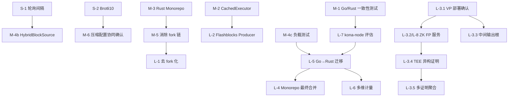

# 分阶段实施路线图

---

## 路线图总览

```
月份  0───1───2───3───4───5───6───9───12───18───24───36
      ┌─────────┐
 P1   │ S-1~S-4 │  配置优化
      │ 0-2 月  │
      └─────────┘
            ┌───────────────────────────────┐
 P2         │ M-1~M-6                       │  架构微调
            │ 3-6 月                        │
            └───────────────────────────────┘
                              ┌──────────────────────────────┐
 P3                           │ L-3, L-7, L-8, L-9           │  能力扩展
                              │ 6-12 月                      │
                              └──────────────────────────────┘
                                          ┌─────────────────────────────┐
 P4                                       │ L-1, L-2, L-4, L-5, L-6    │  战略演进
                                          │ 12-36 月                   │
                                          └─────────────────────────────┘
```

---

## Phase 1: 配置优化（0-2 个月）

### 目标
以零代码或极少代码变更获取可量化收益。

### 里程碑

| 编号 | 任务 | 具体操作 | 负责人 | 预计耗时 | 验收标准 |
|---|---|---|---|---|---|
| S-1 | Batcher 轮询间隔 | `OP_BATCHER_POLL_INTERVAL=1s` | 运维 | 1 天 | 48h 稳定运行 |
| S-2 | Brotli10 默认压缩 | `--compression-algo=brotli` | 运维 | 1 天 | DA 大小降低 ≥ 10% |
| S-3 | CheckRecentTxsDepth + WaitNodeSync | `OP_BATCHER_WAIT_NODE_SYNC=true` + `OP_BATCHER_CHECK_RECENT_TXS_DEPTH=10` | 运维 | 1 天 | 重启后零重复提交 |
| S-4 | DA 模式评估 | 确认生产 DA 配置 | 运维 + 分析 | 3 天 | 决策文档产出 |

### 关键决策点

- **KD-1**（第 1 周）：L1 RPC provider 是否需要扩容？
  - 若需要：先完成扩容再实施 S-1
  - 若不需要：直接实施

### 预期成果

- DA 成本降低 15-20%（S-2）
- 批次提交延迟降低 3-6x（S-1）
- 冷启动恢复改善（S-3）
- 总投入：< 1 人周

---

## Phase 2: 架构微调（3-6 个月）

### 目标
通过中等规模开发工作解决关键技术债务和效率问题。

### 里程碑

| 编号 | 任务 | 负责人 | 预计耗时 | 依赖 |
|---|---|---|---|---|
| M-1 | Go/Rust 一致性测试 | Rust + Go 工程师 | 2-4 周 | 无 |
| M-2 | CachedExecutor | Rust 工程师 | 3-4 周 | Flashblocks 生产使用 |
| M-3 | Rust Monorepo 合并 | 基础设施 + Rust | 4-6 周 | 无 |
| M-4a | Batcher 去重窗口 | Go 工程师 | 1-2 周 | 无 |
| M-4b | HybridBlockSource | Go 工程师 | 2-3 周 | 无 |
| M-4c | 内置负载测试 | 全栈工程师 | 3-4 周 | 无 |
| M-5 | 消除 fork 链（初步） | Rust 高级工程师 | 2-3 月 | M-3 |
| M-6 | 压缩配置协同确认 | 运维 + Go 工程师 | 1-2 天 | S-2 |

### 推荐执行顺序

```
第 3 个月:
  ├── M-1（Go/Rust 一致性测试）      ← 最高优先级，解决核心风险
  ├── M-3（Rust Monorepo 合并）       ← 并行启动，工程基础设施
  └── M-4a（Batcher 去重窗口）        ← 小任务，快速完成

第 4 个月:
  ├── M-2（CachedExecutor）            ← 依赖 flashblocks 使用数据
  ├── M-4b（HybridBlockSource）        ← 与 M-4a 同 batcher 域
  └── M-6（压缩配置协同确认）          ← 与 S-2 关联

第 5-6 个月:
  ├── M-4c（负载测试工具）             ← 为后续迁移评估提供数据
  └── M-5（消除 fork 链 — 评估阶段）  ← 依赖 M-3 完成
```

### 关键决策点

- **KD-2**（第 3 个月）：M-3 Rust Monorepo 合并是否顺利？
  - 若三仓库版本冲突严重：先解决版本对齐，推迟合并
  - 若顺利：加速 M-5（消除 fork 链）

- **KD-3**（第 4 个月）：M-1 一致性测试是否发现 Go/Rust 派生不一致？
  - 若发现不一致：立即修复，升级为 P0
  - 若一致：降低 L-7（kona-node 评估）的紧迫度

- **KD-4**（第 5 个月）：M-5 reth trait 评估结论？
  - 若 trait 可行：制定 fork 消除计划，进入 Phase 3
  - 若 trait 不足：等待上游 trait 演进，调整长期策略

### 预期成果

- Go/Rust 派生一致性风险可量化可追踪（M-1）
- Flashblocks consumer 效率提升（M-2）
- Rust 工程统一管理（M-3）
- Batcher 可靠性和性能提升（M-4a/b/c、M-6）
- Fork 消除可行性明确（M-5）
- 总投入：约 3-5 人月

---

## Phase 3: 能力扩展（6-12 个月）

### 目标
扩展核心能力：多证明系统、生产路径评估、基础设施层。

### 里程碑

| 编号 | 任务 | 负责人 | 预计耗时 | 依赖 |
|---|---|---|---|---|
| L-3.1 | 确认 Validity Proof 部署状态 | 合约 + 运维 | 2 周 | 无 |
| L-3.2 | ZK Fault Proof 离线服务（L-8） | Rust 工程师 | 3-4 月 | L-3.1 |
| L-3.3 | 中间输出根引入 | 合约 + Rust | 2-3 月 | L-3.1 |
| L-7 | kona-node 测试网评估 | Rust 工程师 | 6-12 月 | M-1 |
| L-9 | ingress-rpc 代理层 | 基础设施 | 2-3 月 | 无 |

### 推荐执行顺序

```
第 6 个月:
  ├── L-3.1（Validity Proof 部署确认）  ← 前置事实 gate
  ├── L-7（kona-node 测试网部署）        ← 启动长期评估
  └── L-9（ingress-rpc 代理）            ← 独立基础设施

第 7-9 个月:
  ├── L-3.2（ZK FP 离线服务开发）       ← 依赖 L-3.1
  └── L-3.3（中间输出根）               ← 依赖 L-3.1

第 10-12 个月:
  ├── L-3.2 完成 + 测试网验证
  ├── L-7 持续运行 + 数据收集
  └── 观察 Base Azul 多证明系统主网运行表现
```

### 关键决策点

- **KD-5**（第 6 个月）：Validity Proof 链上部署状态确认
  - 若已部署且运行正常：加速 L-3.2 和 L-3.3
  - 若未部署或有问题：先解决部署问题

- **KD-6**（第 9 个月）：Base Azul 多证明系统主网运行 3 个月后
  - 若运行稳定：Mantle 可参考其 TEE 设计加速 Phase 4
  - 若出现问题：调整 TEE 引入时间表

- **KD-7**（第 12 个月）：kona-node 测试网 6 个月运行报告
  - 若稳定：制定 op-node 替代计划
  - 若不稳定：继续作为备选，强化 M-1 一致性测试

### 预期成果

- 多证明系统初步形成（Validity + ZK FP）
- kona-node 生产可行性数据
- RPC 基础设施层建立
- 总投入：约 4-8 人月

---

## Phase 4: 战略演进（12-36 个月）

### 目标
完成架构层面的重大转型。

### 里程碑

| 编号 | 任务 | 负责人 | 预计耗时 | 依赖 |
|---|---|---|---|---|
| L-1 | 去 fork 化推进 | Rust 高级工程师 | 持续 | M-5, KD-4 |
| L-2 | Flashblocks Producer 评估 | Rust 工程师 | 6-8 月 | M-2 |
| L-3.4 | TEE 异构证明层 | 安全 + Rust | 6-8 月 | L-3.2, KD-6 |
| L-3.5 | 多证明聚合框架 | 合约 + Rust | 4-6 月 | L-3.4 |
| L-4 | Monorepo 最终合并 | 基础设施 | 与 L-5 关联 | M-3, L-5 |
| L-5 | Go → Rust 迁移评估 | 团队 | 持续 | L-7, M-4c |
| L-6 | 多维资源计量 | Rust 工程师 | 3-4 月 | L-5 进展 |

### 关键决策点

- **KD-8**（第 12 个月）：是否启动 TEE 引入？
  - 决策依据：Base Azul 运行表现、Mantle 安全需求、AWS Nitro 基础设施准备
  
- **KD-9**（第 18 个月）：Go → Rust 迁移的 Go/No-Go 决策
  - 决策依据：reth 性能数据（M-4c）、kona-node 稳定性（L-7）、MNT trait 可行性（M-5/L-1）
  
- **KD-10**（第 24 个月）：全面 monorepo 的 Go/No-Go 决策
  - 决策依据：Go → Rust 迁移进度、团队结构、维护成本对比

---

## 资源估算总览

| Phase | 时间范围 | 预计人力 | 关键角色 |
|---|---|---|---|
| Phase 1 | 0-2 月 | < 1 人周 | 运维工程师 |
| Phase 2 | 3-6 月 | 3-5 人月 | Go + Rust 工程师、基础设施 |
| Phase 3 | 6-12 月 | 4-8 人月 | Rust 工程师、合约工程师 |
| Phase 4 | 12-36 月 | 持续投入 | Rust 高级工程师、安全、合约 |

---

## 依赖关系图



---

## 风险登记表

| 风险 | 影响 | 概率 | 缓解措施 |
|---|---|---|---|
| MNT 双资产 trait 不可行 | 阻断 L-1、L-5 | 中 | M-5 提前评估，必要时推动上游 trait 扩展 |
| Base Azul 主网出现问题 | 推迟 TEE 引入 | 低 | 观察 3+ 个月再决策 |
| kona-node 不稳定 | 无法替代 op-node | 中 | 持续 M-1 一致性测试作为备选方案 |
| reth 性能不如 op-geth | 阻断 L-5 | 低 | M-4c 提前量化，性能优化优先 |
| 团队 Rust 人才不足 | 减缓全部 Rust 相关任务 | 中 | 提前规划招聘，Phase 2 期间评估 |
| 跨仓库版本冲突 | 推迟 M-3 | 低 | 先对齐核心依赖版本 |

---

## Mantle 自身优势保留清单

在实施上述优化时，以下 Mantle 现有优势**必须保留和强化**：

| 优势 | 来源 | 保留理由 |
|---|---|---|
| Batcher ~30+ 指标 | WHI-451 | 比 Base ~10+ 更丰富 |
| 4 种 Throttling 策略 | WHI-451 | Step/Linear/Quadratic/PID |
| Auto DA 模式 | WHI-451 | 动态 blob/calldata 切换 |
| AltDA 框架 | WHI-451 | Plasma 支持 |
| Validity Proof（代码完整，部署待 L-3.1 确认） | WHI-453 | 代码和合约完整，公开资料称已上线但链上地址未确认 |
| 泛化 DA 注入 | WHI-452 | `OraclePipeline` DA 类型参数 |
| 上游安全修复跟进 | WHI-444 | Fork 模式可 cherry-pick |
| 事件驱动可观测性 | WHI-452 | Go 事件链逐步测试 |

---

## 成功指标

| 阶段 | 关键指标 | 目标值 |
|---|---|---|
| Phase 1 完成 | DA 成本变化 | 降低 ≥ 15% |
| Phase 1 完成 | 批次提交延迟 | 降低 ≥ 3x |
| Phase 2 完成 | Go/Rust 不一致缺陷 | 已知问题 = 0 |
| Phase 2 完成 | Rust 仓库数 | 3 → 1 |
| Phase 3 完成 | 证明路径数 | ≥ 2（VP 链上确认 + ZK FP 服务上线），前提是 L-3.1 确认 VP 部署状态 |
| Phase 3 完成 | kona-node 测试网稳定性 | 99.9% uptime |
| Phase 4 完成 | Fork 仓库数 | 显著减少 |
| Phase 4 完成 | Go 组件占比 | 逐步降低 |


---

# 长期方向性建议（战略层面）

> Phase 3: 6-18+ 个月 | 涉及技术路线选择的重大决策

---

## 概述

以下建议涉及 Mantle 的核心技术路线选择，每一项都需要管理层决策和跨团队协作。建议按战略重要性排序，每项包含前置事实 gate 的确认结果、路径分析和 ROI 评估。

---

## L-1. Fork 组合 → 自研全栈的路径评估

### 核心问题

Mantle 是否应该走 Base 的路线，从 fork 迁移到自研？

### 前置事实

- **Mantle 当前状态**：5 个主仓库（reth、kona、op-succinct、mantle-v2、op-geth）+ 4 个依赖 fork（revm、op-alloy、evm、kona），共 9 个仓库需协调 rebase（WHI-443、WHI-444）
- **Base 当前状态**：130 crates 单一 Rust workspace，零 fork，通过 reth trait 系统扩展（WHI-442）
- **Base 的迁移成本**：Base 从零自建全栈，前期投入极高（130 crates 自研），但长期维护成本趋近于零
- **Mantle 的核心约束**：MNT 双资产模型深度侵入 op-geth（`core/state_transition.go` 中 `mintBVMETH()`、`transferBVMETH()` 等直接操作存储槽），~30+ 核心文件修改（WHI-450 key-takeaways.md）

### 路径分析

**路径 A：渐进式去 fork 化**（推荐）

```
现状 → 合并 Rust 仓库 → 消除依赖 fork → 评估 kona-node 替代 op-node → 评估 reth 替代 op-geth
```

- 优势：低风险、可逐步验证、每一步都有独立收益
- 时间线：18-36 个月
- 关键节点：MNT 双资产模型在 Rust trait 层面的完整表达

**路径 B：Base 式全面自研**

```
从零构建 Mantle Rust 全栈 → 逐步替换 fork 组件
```

- 优势：最终代码一致性最高
- 劣势：前期投入极大（Base 规模的团队 + 时间），与现有 fork 维护并行
- 时间线：24-48 个月
- 适用条件：团队规模 ≥ 15 Rust 工程师

### ROI 分析

| 维度 | 路径 A（渐进） | 路径 B（全面自研） |
|---|---|---|
| 前期投入 | 中 | 极高 |
| 风险 | 低 | 高 |
| 12 个月后收益 | 中（减少 fork 数量） | 低（仍在建设中） |
| 36 个月后收益 | 高（大部分 fork 消除） | 极高（零 fork 维护） |
| 团队要求 | 5-8 Rust 工程师 | 15+ Rust 工程师 |

### 建议

**推荐路径 A**。Mantle 的 MNT 双资产模型和 Go 遗产代码使路径 B 的风险过高。路径 A 允许在每个阶段验证可行性后再决定下一步。

---

## L-2. Flashblocks 完整栈评估

### 前置事实 gate 确认

**Mantle 现有 flashblocks consumer 代码来源**：已通过 git log 确认，`reth-optimism-flashblocks` crate **几乎完全继承自上游 op-reth**，Mantle 仅有 2 个提交（Adam `adam.xu@mantle.xyz`，2026-05-14/15）用于适配 Mantle 的 Jovian-era `extra_data` 解析。核心 service、worker、WebSocket stream、sequence 处理均为上游代码。

**生产启用状态**：`--flashblocks-url` 为 opt-in 参数，consumer 可用但需外部 producer（`op-rbuilder` + `rollup-boost` + `op-conductor` 中继）。Producer 路径：Mantle 依赖外部 `op-rbuilder`，非自建。

**缺失**：Producer/builder 一体化路径。Base 的 `FlashblocksServiceBuilder` 将 builder 嵌入执行客户端，零 IPC 开销。

### 建议

**分阶段引入**：

1. **Phase 1**（已在 M-2 建议）：引入 CachedExecutor，优化 consumer 端执行效率
2. **Phase 2**（6-12 个月）：评估自建 Flashblocks Producer 的 ROI
   - 若 Mantle 的 flashblocks 生产流量持续增长，自建 producer 可消除外部依赖和 IPC 延迟
   - 若流量稳定，维持外部 op-rbuilder 即可
3. **Phase 3**（12-18 个月）：若决定自建，参考 Base 的 `FlashblocksServiceBuilder` + `BlockPayloadJobGenerator` + `PayloadHandler` 设计

### 不可采用条件

- 若 Mantle 的 block 时间 > 1s 且无降低预确认延迟的需求，则 flashblocks producer 一体化的收益不足以证明投入
- 若外部 op-rbuilder 的功能和性能满足需求，无需自建

---

## L-3. 多证明系统完善

### 前置事实 gate 确认

**Mantle op-succinct 的 validity/fault-proof 实际部署状态**：

- **Validity Proof**：Rust 代码完整，`validity/` 目录包含完整 proposer 二进制（`validity/bin/validity.rs`）、SP1 v6.1.0 集成、Postgres 数据库（3 个 migration）、Dockerfile、Prometheus 监控。公开资料（Succinct 案例研究 2025-09-16、L2BEAT）称已上线（1h finality、6h withdrawals）。**链上地址和 proxy 指向未在本分析中确认。**
- **ZK Fault Proof**：`OPSuccinctFaultDisputeGame` 合约完整（game type 42），`AccessManager` 管理白名单和 `fallbackTimeoutFpSecs` 无许可降级。但 **Rust 服务层（proposer/challenger binary）已从 Cargo workspace 移除**。`fault-proof/` 目录不存在于 workspace members 中（仅 `utils/*`、`programs/*`、`scripts/*`、`validity`）。README 仍引用 `fault-proof` 目录但已过时。
- **Cannon**：`mantle-v2/cannon/` 继承自上游，MIPS64 多线程 VM，无 Mantle 修改，无 L1 合约，未部署（WHI-453 mantle-proof-paths.md）
- **部署配置**：无 `.env.example` 或预设地址文件。`opsuccinctl2ooconfig.json` 和 `opsuccinctfdgconfig.json` 均在 `.gitignore` 中

### 在已有能力基础上补充 vs 从头引入的路径差异

Mantle 的优势在于 **op-succinct 代码基础已经存在**（区别于完全从零引入）：

| 能力 | 当前状态 | 补充路径 |
|---|---|---|
| Validity Proof | 代码完整，部署状态待 L-3.1 链上确认 | **首要任务**：确认合约地址/proxy/verifier/proposer 链上状态 |
| ZK Fault Proof | 合约完整，Rust 服务已移除 | 开发离线 proposer/challenger 服务 |
| TEE | 无 | 从 Base 参考实现引入 |
| 多证明聚合 | 无 | 参考 Base `AggregateVerifier` |

### 建议路径

**Phase 1（6-12 个月）**：
1. 确认 Validity Proof 生产部署的合约地址和 proxy 链路
2. 开发 ZK Fault Proof 离线服务（合约已存在，需恢复或重建 Rust proposer/challenger）
3. 引入中间输出根（参考 Base `INTERMEDIATE_BLOCK_INTERVAL = 512`），增加细粒度验证

**Phase 2（12-24 个月）**：
4. 引入 TEE 异构证明层（AWS Nitro + RISC Zero attestation）
5. 建立保证金机制（参考 Base `DelayedWETH`）
6. 从白名单制走向无许可化

**Phase 3（24 个月+）**：
7. 统一争议合约框架（类似 Base `AggregateVerifier`）
8. 多证明 Challenger
9. 分层 finality

### ROI 分析

- Mantle 已有 Validity Proof 代码基础和合约，**补充成本远低于从零引入**
- ZK Fault Proof 合约已完整，仅需开发离线服务（约 3-4 个月）
- TEE 引入需要 AWS Nitro 基础设施和 RISC Zero 集成（约 6-8 个月）
- 注意：Base 的多证明系统 Azul 计划 2026-05-28 激活（尚未主网验证），建议 Mantle 观察其上线后的运行表现再决定 TEE 引入时间表

---

## L-4. 单体仓库迁移（五仓库合并为 monorepo）

### 前置事实

- Mantle 维护 5 个主仓库 + 4 个依赖 fork，共 9 个仓库
- 三个 Rust 仓库合并（M-3）是第一步
- Go 仓库（mantle-v2 + op-geth）的合并收益有限（op-geth 作为 go-ethereum 深度 fork，~30+ 核心文件修改）

### 建议路径

```
Step 1（中期）: Rust 三仓库合并 → 单一 Rust workspace      [M-3 已建议]
Step 2（长期）: Go 两仓库整合 → mantle-v2 + op-geth        [收益有限]
Step 3（远期）: 评估 Go → Rust 迁移后，最终合并为全栈 monorepo  [依赖 L-5]
```

### 不可采用条件

- 若 Mantle 决定长期保持 Go + Rust 双栈（不走 L-5 的 Go → Rust 迁移），则 Go 和 Rust 仓库不应强行合并（语言混合 monorepo 的工具链优势有限）

---

## L-5. Go → Rust 全面迁移评估

### 前置事实

- **Go 组件**：op-geth（执行客户端）、op-node（共识/派生）、op-batcher、op-proposer、op-challenger
- **Rust 替代方案**：reth（执行）、kona-node（共识/派生）、kona batcher comp（压缩模块）
- **核心约束**：MNT 双资产模型在 op-geth `core/state_transition.go` 中通过直接存储槽操作实现，迁移到 Rust 需要 revm handler 级定制

### 建议路径

```
Phase 1: reth 成为主 EL（reth + op-geth 双执行客户端共存）
Phase 2: kona-node 替代 op-node（评估生产可行性）
Phase 3: Rust batcher 替代 op-batcher
Phase 4: 评估 op-geth 完全退役
```

### 关键前置条件

1. MNT 双资产模型在 Rust trait 层面的完整表达（revm `ConfigureEvm` / `EvmFactory`）
2. reth 生产稳定性验证（至少 6 个月主网运行）
3. 负载测试覆盖 MNT 特有场景（M-4c）

### ROI 分析

| 维度 | 收益 | 成本 |
|---|---|---|
| 维护 | 消除 Go/Rust 双维护 | 迁移期双栈维护 |
| 一致性 | 编译时跨组件类型安全 | MNT 逻辑重写 |
| 人才 | 统一为 Rust 技能 | 需要更多 Rust 工程师 |
| 性能 | 无 GC、编译时内存安全 | 需要验证 |

### 不可采用条件

- 若 reth 在 Mantle 的 MNT 双资产场景下性能不如 op-geth
- 若 Rust trait 系统无法支撑 operator fee、preconf 等定制
- 时间线至少 18-36 个月

---

## L-6. 多维资源计量系统

### 前置事实

- Base 提供 EVM 级多维计量：gas、DA 字节、状态根计算时间、opcode 计数（`crates/execution/metering/`）
- `MeteringCollector` 通过 EVM `Inspector` 实现
- `PriorityFeeEstimator` 提供滚动优先费估算
- 3 个专用 Metering RPC 端点
- Mantle 无等价实现；Batcher 侧指标丰富（~30+），但 EVM 层面无计量

### 建议

- 前置条件：reth 成为主要执行客户端（reth 的 `Inspector` 框架原生支持此类扩展，op-geth Go EVM 无等价机制）
- 在 reth 侧实现 `MantleMeteringCollector`，参考 Base 设计
- 优先级低于 L-1 至 L-5

---

## L-7. 评估 Rust kona-node 作为生产路径

### 前置事实

- Go `op-node` 为当前生产路径
- Rust `kona-node` 为 FPP/备选路径（WHI-452 key-takeaways.md）
- 使用 kona-node 替代 op-node 可从根本上消除 Go/Rust 双派生路径的一致性风险

### 建议

1. 在测试网评估 kona-node 作为 CL 的稳定性（6-12 个月验证）
2. 与 M-1 一致性测试结合，量化 Go/Rust 派生差异
3. 若 kona-node 稳定，作为 op-node 的替代路径推进

---

## 长期方向性总结

| 建议 | 战略影响 | 时间线 | 前置条件 |
|---|---|---|---|
| L-1 去 fork 化路径 | 极高 | 18-36 月 | MNT trait 表达 |
| L-2 Flashblocks 完整栈 | 中 | 6-18 月 | CachedExecutor 先行 |
| L-3 多证明系统 | 极高 | 6-24 月 | 合约地址确认 |
| L-4 Monorepo 迁移 | 中 | 12-24 月 | Rust 仓库先合并 |
| L-5 Go → Rust 迁移 | 极高 | 18-36 月 | reth 生产验证 |
| L-6 多维计量 | 中 | 12-24 月 | reth 为主 EL |
| L-7 kona-node 评估 | 高 | 6-12 月 | 测试网验证 |


---

# 中期优化建议（需要架构调整）

> Phase 2: 3-6 个月 | 需要一定开发投入但技术方案明确 | 收益显著

---

## 概述

以下建议需要代码开发或架构微调，但不涉及根本性技术路线变更。每项建议均有来自 Base 的成熟参考实现和明确的 Mantle 代码基础，技术可行性已验证。

---

## M-1. 建立 Go/Rust 派生一致性测试

**前置事实**：

- Mantle 维护 Go（`op-node/rollup/derive/`）和 Rust（`kona/crates/protocol/derive/`）双路径派生实现（WHI-452 key-takeaways.md）
- `MantleBlobSource` 的 `mantle_format_failed` toggle 需手动与 Go `blobToggle()` 对齐（WHI-452 architecture-comparison.md）
- `OpHardforks` 的 N:1 时间戳映射（Skadi → 多个 OP forks）增加一致性维护复杂度（WHI-452 key-takeaways.md）
- 每个新硬分叉 = Go + Rust 双倍实现和测试成本

**建议**：建立跨语言端到端一致性测试框架

**实施步骤**：
1. 构建测试 fixture：固定同一组 L1 输入、blob 数据、hardfork 时间戳和 Mantle DA 参数
2. 分别运行 Go derive（`op-node`）与 Rust kona derive
3. 断言输出 L2 block/ref、batch 解码结果和错误分支一致
4. 特别覆盖 `mantle_format_failed` toggle 边界、N:1 hardfork 映射、MantleBlobs RLP 解码
5. 纳入 CI，每次 Go 或 Rust derive 变更时触发

**预期收益**：
- 极高 — Go/Rust 派生不一致是 Mantle 当前最大的一致性风险点
- 自动化检测替代人工 review

**成本与风险**：
- 开发成本：中（约 2-4 周，主要是 fixture 构建和测试框架搭建）
- 风险：低 — 纯测试基础设施，不影响生产代码

**前置事实 gate 确认**：
- Go derive 路径：`mantle-v2/op-node/rollup/derive/` ✅ 代码完整
- Rust derive 路径：`mantle/kona/crates/protocol/derive/` ✅ 代码完整
- 双路径存在且独立维护 ✅ 已确认

**证据来源**：WHI-452 key-takeaways.md、architecture-comparison.md、nostd-zk-compatibility.md

---

## M-2. Flashblocks CachedExecutor 引入

**前置事实**：

- Mantle reth 的 flashblocks consumer（`crates/optimism/flashblocks/`）几乎完全继承自上游 op-reth，仅有 2 个 Mantle 提交用于 `extra_data` 解析适配（git log 确认）
- 当前 `FlashBlockBuilder`（`worker.rs`）对每个 flashblock 重新执行所有交易，无缓存（WHI-450 flashblocks-integration.md）
- 状态根仅从 flashblock index ≥ 9 开始计算（`FB_STATE_ROOT_FROM_INDEX = 9`，`service.rs:32`，源自上游 PR #18721）

**建议**：参考 Base `CachedExecutor` 设计，在 consumer 端引入缓存执行

**Base 参考**：`FlashblocksCachedExecutionProvider`（`cached_execution.rs`），基于 `parent_hash + tx position` 验证跳过已执行交易

**实施步骤**：
1. 在 `FlashBlockBuilder` 中增加交易执行结果缓存，key 为 `(parent_hash, tx_index)`
2. 新 flashblock 到达时，对已缓存的交易跳过执行，仅执行新增交易
3. 实现 reorg 检测：`parent_hash` 不匹配时清空缓存
4. 验收测试：顺序 flashblock、parent hash 不匹配、交易位置错位、L2 reorg 后缓存失效、状态根重新计算

**预期收益**：
- 高 — 显著降低 consumer 端 CPU 计算开销
- 对高 TPS 场景下的 flashblock 处理尤为关键

**成本与风险**：
- 开发成本：中（约 3-4 周）
- 风险：中 — 缓存一致性在 reorg 场景下需严格验证

**不可采用条件**：
- 若 Mantle 的 flashblocks 生产流量极低或 flashblocks 功能未在生产环境启用，则收益不足以证明投入

**证据来源**：WHI-450 flashblocks-integration.md

---

## M-3. 合并 Rust 仓库为 Monorepo

**前置事实**：

- Mantle 维护 3 个独立 Rust 仓库：`mantle/reth`、`mantle/kona`、`mantle/op-succinct`（WHI-443）
- 升级顺序必须严格遵守：`revm → op-alloy → evm → reth/kona → op-succinct`（WHI-443 collaboration-diagram.md）
- 加上 4 个依赖 fork（`mantle-xyz/revm`、`op-alloy`、`evm`、`kona`），共 7 个 Rust 仓库需协调
- Base 将 130 crates 统一在单一 `Cargo.toml` workspace 中（WHI-442 repo-structure.md）

**建议**：将 `mantle/reth`、`mantle/kona`、`mantle/op-succinct` 合并为单一 Rust workspace

**实施步骤**：
1. 创建统一 workspace 根 `Cargo.toml`，将三仓库作为 workspace members
2. 统一 `mantle-xyz/*` 依赖 fork 版本，消除版本不一致
3. 建立统一 CI pipeline（替代三仓库各自的 CI）
4. 统一 lints/clippy/rustfmt 配置
5. 逐步将 `mantle-xyz/*` fork 中的定制代码迁移到 workspace 内的自研 crate

**预期收益**：
- 统一版本管理，消除跨仓库依赖协调
- 统一 CI/CD，减少维护成本
- 为后续消除 fork 链（M-5）奠定基础

**成本与风险**：
- 开发成本：中（约 4-6 周，主要是仓库结构重组和 CI 迁移）
- 风险：低 — 不涉及功能变更，纯工程结构优化

**证据来源**：WHI-442 repo-structure.md、WHI-443、WHI-444 component-mapping-table.md

---

## M-4. Batcher 工程优化组合

### M-4a. Batcher 去重窗口

**前置事实**：Mantle batcher 无 batch 去重机制（WHI-451 l1-submission-optimization.md）

**建议**：引入滑动窗口去重（参考 Base 256-block 窗口），防止 reorg/重启后重复 L1 提交

**Base 参考**：256-block 滑动窗口，reorg 检测时丢弃所有 in-flight + queued frames 并重置管道

**实施步骤**：
1. 维护最近 N（如 256）个 L1 block 内已提交 batch 的哈希集合
2. 新 batch 提交前检查是否已存在于窗口中
3. Reorg 检测时清空窗口
4. 成本：约 1-2 周开发

### M-4b. HybridBlockSource

**前置事实**：Mantle batcher 仅用 HTTP 轮询（`PollInterval = 6s`）（WHI-451 key-takeaways.md）

**建议**：引入 WS+HTTP 混合数据源

**Base 参考**：`HybridBlockSource`，启动/reorg 时 HTTP-only（WS 抑制），正常时 WS 订阅优先

**实施步骤**：
1. 增加 WS 订阅模式，正常运行时通过 WS 接收新区块通知
2. 追赶模式（启动/reorg）自动回退到 HTTP 轮询
3. 成本：约 2-3 周开发

### M-4c. 内置负载测试工具

**前置事实**：Mantle 无 Mantle 特定的负载测试工具（仅继承上游 `reth-bench`）

**建议**：开发覆盖 MNT 双资产交易、operator fee、preconf 等场景的负载测试

**Base 参考**：`bin/load-tester/` + `crates/infra/load-tests/`

**实施步骤**：
1. 定义 Mantle 特定测试场景（MNT 转账、operator fee 验证、gas oracle 准确性）
2. 实现自动化负载生成器
3. 集成 CI 进行性能回归检测
4. 成本：约 3-4 周开发

**预期收益**：
- M-4a: 防止重复 L1 提交，节省 gas
- M-4b: 更快的区块感知 + 更稳健的回退机制
- M-4c: 量化 reth vs op-geth 性能差异，支持迁移决策

**证据来源**：WHI-451 key-takeaways.md、l1-submission-optimization.md

---

## M-5. 消除上游 reth 依赖 fork 链（初步）

**前置事实**：

- Mantle reth 依赖链深达 3 层：`mantle/reth → op-reth → paradigmxyz/reth`（WHI-444 component-mapping-table.md）
- 4 个依赖 fork：`mantle-xyz/revm v2.2.2`（添加 `OpSpecId::ARSIA`）、`mantle-xyz/op-alloy v2.2.0`、`mantle-xyz/evm v2.2.1`、`mantle-xyz/kona v2.2.3`
- Base 直接依赖 `paradigmxyz/reth tag=v2.2.0`，零 fork

**建议**：初步将 `OpSpecId::ARSIA` 等定制从 revm fork 迁移到自研 `MantleEvmFactory`

**实施步骤**：
1. 分析 `mantle-xyz/revm` 中 `ARSIA` spec 的具体修改范围
2. 评估是否可通过 reth 的 `ConfigureEvm` / `EvmFactory` trait 实现等效功能
3. 若可行，创建自研 `mantle-evm` crate，通过 trait 组合替代 revm fork
4. 逐步对其他 `mantle-xyz/*` fork 执行相同评估
5. 最终目标：直接依赖 `paradigmxyz/reth` git tag

**预期收益**：
- 升级 reth 仅需 bump tag + 适配 trait 变更（vs 当前 9 仓库 rebase）
- 编译时检测 API 变更，降低升级风险

**成本与风险**：
- 开发成本：高（约 2-3 个月，需深入理解 reth trait 系统）
- 风险：中 — 需验证 reth trait 是否足够灵活以支撑 MNT 相关定制
- 这是长期迁移的第一步，可作为中期目标启动评估

**不可采用条件**：
- 若 reth 上游 trait 不支持 Mantle 的 `ARSIA` spec 所需的 handler 级定制，则需等待上游 trait 演进或采用其他方案

**证据来源**：WHI-450 upstream-model-comparison.md、WHI-444 component-mapping-table.md

---

## M-6. Batcher 压缩配置协同优化（前置事实 gate 已通过）

**前置事实 gate 确认**：

Mantle op-batcher (Go) 的完整实现和 DA 路径已验证：
- 入口：`op-batcher/cmd/main.go` → `batcher/service.go`
- DA 模式：`auto`/`blobs`/`calldata`，Auto 模式通过 `DynamicEthChannelConfig` 实现（`service.go:337-348`）
- 压缩算法：支持 Zlib/Brotli（通过 CLI flags 配置）
- **Shadow Compressor 已为默认**：`CompressorFlag` 默认值为 `compressor.ShadowKind`（`flags.go:98-103`），实现在 `compressor/shadow_compressor.go`，通过双缓冲区（主压缩器 + 影子压缩器）实现精确的大小估算
- Throttling：4 种策略（Step/Linear/Quadratic/PID），默认 `quadratic`（`throttle_flags.go`）
- Admin RPC：实际有 6 个端点（`startBatcher`/`stopBatcher`/`flushBatcher`/`setThrottleController`/`getThrottleController`/`resetThrottleController`）（`rpc/api.go`）

**修正说明**：
1. 前序分析 WHI-451 将 Admin RPC 记为 3 个端点，实际代码确认为 6 个。Mantle batcher 的 Admin 控制能力比前序分析评估的更完善
2. Shadow Compressor 已存在于 Mantle 代码库中且为默认压缩器类型，无需重新实现

**建议**：确认生产环境同时启用 Shadow Compressor + Brotli10 的协同配置，并监控重新分帧率

**实施步骤**：
1. 确认生产环境 `OP_BATCHER_COMPRESSOR` 是否为默认 `shadow`（应为默认值）
2. 在 S-2（Brotli10 切换）生效后，监控 Shadow Compressor + Brotli10 组合下的重新分帧率
3. 记录 `channel_compr_ratio` 指标变化
4. 若重新分帧率异常，调整 `safeCompressionOverhead`（当前 51 字节）

**预期收益**：
- 确认 Shadow + Brotli10 协同工作正常
- 量化压缩策略优化效果

**证据来源**：WHI-451 compression-strategy.md + 本轮代码验证（`flags.go:98-103`、`shadow_compressor.go`）

---

## 优先级排序

| 建议 | 实施难度 | 预期收益 | 风险 | 建议优先级 |
|---|---|---|---|---|
| M-1 Go/Rust 一致性测试 | 中 | 极高 | 低 | P1-最高 |
| M-2 CachedExecutor | 中 | 高 | 中 | P1 |
| M-3 Rust Monorepo | 中 | 中高 | 低 | P1 |
| M-4a 去重窗口 | 低 | 中 | 低 | P1 |
| M-4b HybridBlockSource | 中 | 中 | 低 | P1 |
| M-4c 负载测试工具 | 中 | 高 | 低 | P1 |
| M-5 消除 fork 链 | 高 | 高 | 中 | P1-P2 过渡 |
| M-6 压缩配置协同优化 | 低（配置确认） | 中 | 低 | P1 |

---

## 验收标准

- [ ] M-1: Go/Rust derive 一致性测试覆盖 ≥ 3 种 hardfork 配置，CI 自动运行
- [ ] M-2: CachedExecutor 在 flashblock 场景下 CPU 开销降低 ≥ 30%
- [ ] M-3: 三 Rust 仓库合并为单一 workspace，统一 CI 通过
- [ ] M-4a: Batcher 重启后 ≥ 100 block 内零重复提交
- [ ] M-4b: 正常模式 block 感知延迟 < 1s（WS 订阅）
- [ ] M-4c: 负载测试覆盖 MNT 转账、operator fee、gas oracle 三类场景
- [ ] M-5: 至少一个 `mantle-xyz/*` fork 被自研 crate 替代
- [ ] M-6: 确认 Shadow + Brotli10 协同配置正常，`channel_compr_ratio` 指标记录


---

# 不建议借鉴的特性

---

## 概述

并非所有 Base 优势特性都适合 Mantle 引入。以下特性因架构差异太大、收益不足、与 Mantle 战略方向不符或时机不成熟等原因，不建议在当前阶段借鉴。每项均附原因分析和替代方案。

---

## NR-1. `biased select!` 确定性事件优先级

### 特性描述

Base 的 Rust batcher 使用 `tokio::select!` 的 `biased` 模式，实现确定性事件处理优先级：

```
Shutdown > Admin > L1 Head > Safe Head > Receipts > Block Ingestion
```

（WHI-451 key-takeaways.md）

### 不建议原因

**Go 语言限制**：Go 的 `select` 语句在多个 case 就绪时随机选择一个执行，这是语言级别的设计决策，无法修改。Mantle 的 batcher 使用 Go 实现，无法引入等价的确定性优先级机制。

### 替代方案

- 在 Go 中使用优先级队列（`container/heap`）手动模拟优先级，但代码复杂度显著增加
- 接受 Go `select` 的公平性特性，通过其他方式（如独立 goroutine 处理高优先级事件）缓解
- 长期若迁移到 Rust batcher（L-5），此问题自然解决

---

## NR-2. Bridge 层保持上游一致（Base 模式）

### 特性描述

Base 的 Bridge 层（Portal、Messenger、CrossDomainMessenger）几乎完全保持与 OP Stack 上游一致，仅定制 proof layer（WHI-454 key-takeaways.md）。

### 不建议原因

**Mantle MNT 定制不可逆**：Mantle 的 Bridge 层因 MNT 原生代币而深度定制，这一差异是不可逆的结构性选择：

- `L1MantleToken`/`L2MantleToken`：独立的 MNT 代币合约（WHI-454 bridge-contracts.md）
- `CrossDomainMessenger.sendMessage` 要求 `msg.value ≥ _fee`（WHI-454 bridge-contracts.md）
- `StandardBridge.bridgeETH` 重定向到 BVM_ETH L2 地址（WHI-454 bridge-contracts.md）
- `OptimismPortal` 中 `L2_ORACLE` 为 immutable（WHI-454 key-takeaways.md），切换证明系统需部署新 Portal

**数量级**：Portal、Messenger、Bridge 等核心路径 ~30+ 文件修改，回归上游需重写 MNT 经济模型。

### 替代方案

- 保持 Bridge 层的 Mantle 定制，专注于确保安全审计覆盖
- 跟踪上游安全修复并 cherry-pick（Mantle fork 模式的优势）
- 考虑在 Portal 可升级性上做文章（解决 `L2_ORACLE` immutable 问题）

---

## NR-3. 动态预编译系统（Beryl 硬分叉）

### 特性描述

Base 的 Beryl 硬分叉引入运行时预编译安装机制（`B20Factory`、`ActivationRegistry`），通过 `install()` 方法和 `activation_admin_address` 控制，无需硬分叉即可添加新预编译（WHI-450 key-takeaways.md）。

### 不建议原因

1. **Beryl 尚未激活**：Base 的 Beryl 硬分叉本身尚未在主网激活，实际运行效果未经验证
2. **安全模型待观察**：运行时安装预编译引入新的安全向量（admin 密钥管理、恶意预编译注入等），需要观察 Base 激活后的安全审计和社区反馈
3. **Mantle 当前需求不迫切**：Mantle 的预编译需求通过硬编码分叉表管理（op-geth `core/vm/contracts.go`），虽不如动态方案灵活，但安全性更可控

### 替代方案

- 持续关注 Base Beryl 激活后的运行情况（预计 2026 年内）
- 若 Mantle 有频繁添加预编译的需求，可在 Beryl 模式经过 6+ 个月主网验证后再评估引入
- 短期内可通过优化硬分叉流程降低预编译添加成本

---

## NR-4. 自定义 P2P 网络层（libp2p gossipsub）

### 特性描述

Base 自研 P2P 层（`crates/consensus/gossip/`、`crates/consensus/peers/`），使用 libp2p gossipsub 协议，包含 `ConnectionGate`、`PeerScoreLevel`、`PeerMonitoring`、自定义 ENR + BootStore 等（WHI-450 comparison-table.md）。

### 不建议原因

1. **收益不足**：Mantle 当前 P2P 功能通过 OP Stack 标准实现已能满足需求（WHI-450 comparison-table.md grep 返回零 Mantle P2P 定制）
2. **投入产出不匹配**：自建 P2P 层需要大量专业知识（libp2p、gossipsub、NAT 穿透、peer scoring 等），维护成本高
3. **去中心化路径不同**：Base 作为 Coinbase 运营的链，可能有特殊的 P2P 需求（如 Flashblocks gossip）；Mantle 的序列器架构和治理模型不同

### 替代方案

- 保持使用 OP Stack 上游 P2P 实现
- 仅在出现具体 P2P 性能瓶颈时评估定制

---

## NR-5. Cannon MIPS VM

### 特性描述

Base 不使用 Cannon MIPS VM，而是采用单轮 checkpoint 争议 + ZK 证明的方式（WHI-453 base-multi-proof-analysis.md）。

### 不建议原因

1. **Base 反模式**：Base 是"不使用 Cannon"的一方，而 Mantle 也没有部署 Cannon（`mantle-v2/cannon/` 继承自上游但未部署）。双方都走了非 Cannon 的路线，这不是"借鉴"问题
2. **Mantle 已有 op-succinct**：Mantle 的证明路径已经是 SP1 ZK，不需要 Cannon MIPS VM

### 替代方案

- 不适用 — Mantle 已在走类似的非 Cannon 路线

---

## NR-6. Flashblocks Producer 一体化（当前阶段）

### 特性描述

Base 将 Flashblocks producer/builder 嵌入执行客户端内部，实现零 IPC 延迟的 250ms 子区块（WHI-450 flashblocks-integration.md）。

### 不建议原因（当前阶段）

1. **外部 producer 满足当前需求**：Mantle 通过 `op-rbuilder` + `rollup-boost` + `op-conductor` 中继实现 flashblocks，架构已成型
2. **改造成本极高**：将 builder 嵌入 reth 需要重写 payload 生成逻辑、资源计量、状态管理等核心模块
3. **前置条件未满足**：先完成 CachedExecutor 引入（M-2）再评估 producer 端优化更合理

### 替代方案

- 短中期：引入 CachedExecutor 优化 consumer 端（M-2）
- 长期：视 flashblocks 生产需求增长情况，重新评估 producer 一体化（L-2 Phase 2-3）

---

## NR-7. audit-archiver（低优先级非不推荐）

### 特性描述

Base 的 `audit-archiver`（S3 存储 + Moka LRU 缓存）用于链上数据的审计级归档（WHI-442 binary-inventory.md）。

### 不建议原因

1. **证据强度中等**：具体归档内容和策略未深入分析
2. **需求驱动**：审计归档应由合规需求驱动，而非技术跟随
3. **优先级极低**：在更高优先级的工程优化面前，audit-archiver 的收益不足以排入路线图

### 替代方案

- 结合 Mantle 的合规要求独立评估，不必参考 Base 实现
- 使用现有云服务（如 AWS S3 + Lambda）实现等效功能

---

## NR-8. 照搬 Base 的 Batcher Admin RPC 设计

### 说明

**前序分析修正**：WHI-451 将 Mantle Admin RPC 记为 3 个端点，但代码确认实际为 6 个（`startBatcher`/`stopBatcher`/`flushBatcher`/`setThrottleController`/`getThrottleController`/`resetThrottleController`，见 `rpc/api.go`）。

Mantle 的 Admin RPC 已经包含 Base 的核心能力（start/stop/flush + throttle 控制）。**不需要**照搬 Base 的额外端点：

- `getBatcherStatus`：Mantle 可通过 `getThrottleController` + Prometheus 指标获得等效信息
- `setLogLevel`：可通过环境变量或 Go 标准日志库实现

### 替代方案

- 如需 `getBatcherStatus` 等额外信息，可在现有 6 个端点基础上增量扩展，无需重新设计

---

## 总结

| 特性 | 不建议原因 | 严重程度 |
|---|---|---|
| `biased select!` | Go 语言限制 | 结构性（无法引入） |
| Bridge 上游一致 | MNT 定制不可逆 | 结构性（无法引入） |
| 动态预编译 | 未验证 + 需求不迫切 | 时机不成熟 |
| 自定义 P2P | 收益不足 | 投入产出不匹配 |
| Cannon MIPS | 双方均未使用 | 不适用 |
| Producer 一体化 | 前置条件未满足 | 时机不成熟 |
| audit-archiver | 优先级极低 | 需求驱动 |
| 照搬 Admin RPC | Mantle 已有等效能力 | 不必要 |


---

# 全部优化卡片

> 统一格式：目标 → 前置事实 → 缺失证据 → 不可采用条件 → 实施步骤 → 成本/风险/预期收益

---

## 短期优化（Phase 1: 0-2 个月）

---

### 卡片 S-1: Batcher 轮询间隔优化

**目标**：将 Batcher 轮询间隔从 6s 缩短至 1-2s，提升批次提交响应速度

**前置事实**（已确认的代码/部署证据）：
- Mantle 默认值 `PollInterval = 6s`（`op-batcher/flags/flags.go:57`，`6 * time.Second`）
- 运行时通过 `ticker := time.NewTicker(l.Config.PollInterval)` 驱动（`driver.go:528`）
- Base 默认值 `poll_interval = 1s`（`service.rs`）
- 证据来源：WHI-451 comparison-table.md

**缺失证据**：
- Mantle 当前 L1 RPC provider 的请求容量上限
- 缩短轮询后的实际 L1 gas 消耗变化（需实测）

**不可采用条件**：
- L1 RPC provider 无法承载 3-6x 请求增长
- 频繁轮询导致不必要的 nonce 竞争

**实施步骤**：
1. 设置 `OP_BATCHER_POLL_INTERVAL=2s`（先试 2s）
2. 监控 L1 RPC 请求量和错误率 48h
3. 若稳定，进一步缩短至 1s
4. 记录 DA 提交延迟改善数据

**成本**：极低（环境变量变更）
**风险**：低（L1 RPC 压力增加，可回滚）
**预期收益**：批次提交响应速度提升 3-6x

---

### 卡片 S-2: Batcher 默认压缩升级为 Brotli10

**目标**：将 Batcher 默认压缩算法从 Zlib 切换为 Brotli10，降低 DA 成本

**前置事实**：
- Mantle CLI 默认 `derive.Zlib`（`op-batcher/flags/flags.go`）
- Fjord 已激活，支持 Brotli 压缩
- Base 硬编码 `CompressionAlgo::Brotli10` + `CompressorType::Shadow`（`encoder.rs:331-337`）
- Brotli10 vs Zlib 压缩率提升约 15-20%（WHI-451 compression-strategy.md）
- 证据来源：WHI-451 compression-strategy.md

**缺失证据**：
- Mantle 生产环境 Brotli10 的实际压缩率和延迟数据

**不可采用条件**：
- Fjord 未激活（但 Mantle 已激活 Fjord）
- Brotli 压缩延迟不可接受（极端 L1 拥堵下 batcher 需要最快提交速度）

**实施步骤**：
1. 设置 `--compression-algo=brotli` 或等效环境变量
2. 监控压缩比和压缩延迟 48h
3. 量化 DA 成本节省

**成本**：极低（CLI 参数变更）
**风险**：低（Brotli CPU 开销约 3-5x，仅 batcher 端）
**预期收益**：DA 成本降低 15-20%

---

### 卡片 S-3: 启用 CheckRecentTxsDepth

**目标**：启用 Batcher 冷启动时的近期交易扫描，避免重复 L1 提交

**前置事实**：
- Mantle 默认 `CheckRecentTxsDepth = 0`（禁用）（`op-batcher/flags/flags.go:147`）
- Mantle 默认 `WaitNodeSync = false`（禁用）（`flags.go:154-159`）
- 上限硬编码 `128`（`config.go:188-189`）
- **关键依赖**：`CheckRecentTxsDepth` 仅在 `waitNodeSync()` 内部被调用（`driver.go:758-760`），而 `waitNodeSync()` 仅在 `WaitNodeSync == true` 时执行（`driver.go:163-168`）。单独设置 `CheckRecentTxsDepth` 而不启用 `WaitNodeSync` 不会生效
- Base `MAX_CHECK_RECENT_TXS_DEPTH = 128`，`SCAN_FETCH_CONCURRENCY = 16`
- 证据来源：WHI-451 l1-submission-optimization.md + 本轮代码验证

**缺失证据**：无 — 功能完整且依赖关系已确认

**不可采用条件**：
- 若 `WaitNodeSync` 导致的启动等待时间不可接受（但对 batcher 来说通常可接受）

**实施步骤**：
1. 设置 `OP_BATCHER_WAIT_NODE_SYNC=true`
2. 设置 `OP_BATCHER_CHECK_RECENT_TXS_DEPTH=10`
3. 验证重启后无重复提交

**成本**：极低
**风险**：极低（`WaitNodeSync` 会略增启动时间）
**预期收益**：冷启动/重启后避免重复 L1 batch 提交，节省 gas

---

### 卡片 S-4: Batcher DA 模式确认与优化

**目标**：确认生产环境 DA 模式配置，评估 Auto 模式收益

**前置事实**：
- Mantle 支持 `auto`/`blobs`/`calldata` 三种 DA 模式（`op-batcher/flags/types.go:12-14`）
- Auto 模式通过 `DynamicEthChannelConfig` 实现（`service.go:337-348`）
- 每 10s 评估 blob vs calldata 成本（`channel_config_provider.go`）
- EIP-7623 感知：Pectra 后 calldata 乘数从 4 升至 10（`channel_config_provider.go:56`）
- Auto 模式与 AltDA 不兼容（`service.go:285-291`）
- 证据来源：WHI-451 da-strategy.md

**缺失证据**：
- 当前生产环境的 DA 模式配置
- 历史 blob vs calldata 成本数据

**不可采用条件**：
- 若使用 AltDA，则不可使用 Auto 模式

**实施步骤**：
1. 检查当前 `OP_BATCHER_DATA_AVAILABILITY_TYPE`
2. 若为固定模式，分析历史 DA 成本数据
3. 评估切换至 Auto 模式的 ROI

**成本**：极低
**风险**：低
**预期收益**：L1 gas 价格波动时自动优化 DA 成本

---

## 中期优化（Phase 2: 3-6 个月）

---

### 卡片 M-1: Go/Rust 派生一致性测试

**目标**：建立跨语言端到端一致性测试，消除 Go/Rust 双路径派生的一致性风险

**前置事实**：
- Go derive：`mantle-v2/op-node/rollup/derive/` + `mantle_pipeline.go`、`mantle_blob_source.go` ✅
- Rust derive：`mantle/kona/crates/protocol/derive/` + `mantle_blob.rs`、`mantle_ethereum.rs` ✅
- `MantleBlobSource.mantle_format_failed` toggle 需与 Go `blobToggle()` 手动对齐（WHI-452）
- `OpHardforks` N:1 时间戳映射增加复杂度（WHI-452）
- 证据来源：WHI-452 key-takeaways.md、architecture-comparison.md

**缺失证据**：
- 历史上是否已发生过 Go/Rust 派生不一致事件
- 现有测试覆盖率

**不可采用条件**：
- 无 — 一致性测试对任何双路径系统都是必要的

**实施步骤**：
1. 构建测试 fixture：固定 L1 输入、blob 数据、hardfork 时间戳、Mantle DA 参数
2. 分别运行 Go derive 和 Rust kona derive
3. 断言输出 L2 block/ref、batch 解码结果、错误分支一致
4. 覆盖 `mantle_format_failed` toggle 边界、N:1 hardfork 映射、MantleBlobs RLP 解码
5. 纳入 CI 自动触发

**成本**：中（2-4 周）
**风险**：低（纯测试基础设施）
**预期收益**：极高 — 自动检测 Go/Rust 派生不一致

---

### 卡片 M-2: Flashblocks CachedExecutor

**目标**：在 Flashblocks consumer 端引入缓存执行，跳过已执行交易

**前置事实**：
- Mantle reth flashblocks consumer 继承自上游 op-reth，仅 2 个 Mantle 提交（git log 确认）
- `FlashBlockBuilder`（`worker.rs`）对每个 flashblock 重新执行所有交易（WHI-450）
- `FB_STATE_ROOT_FROM_INDEX = 9`（`service.rs:32`，源自上游 PR #18721）
- Base `FlashblocksCachedExecutionProvider`（`cached_execution.rs`）基于 `parent_hash + tx position` 跳过已执行交易
- 证据来源：WHI-450 flashblocks-integration.md

**缺失证据**：
- Mantle 生产环境 flashblocks 的使用频率和交易量
- 当前 consumer 端 CPU 消耗基线

**不可采用条件**：
- Flashblocks 功能未在生产环境启用或流量极低
- 无外部 producer 连接（`--flashblocks-url` 未配置）

**实施步骤**：
1. 在 `FlashBlockBuilder` 增加交易执行结果缓存，key = `(parent_hash, tx_index)`
2. 新 flashblock 到达时跳过已缓存交易，仅执行新增交易
3. Reorg 检测：`parent_hash` 不匹配时清空缓存
4. 验收测试：顺序 flashblock、parent hash 不匹配、交易位置错位、L2 reorg 后缓存失效、状态根重新计算

**成本**：中（3-4 周）
**风险**：中（缓存一致性在 reorg 场景需严格验证）
**预期收益**：高 — consumer 端 CPU 开销显著降低

---

### 卡片 M-3: Rust 仓库合并为 Monorepo

**目标**：将 3 个独立 Rust 仓库合并为单一 workspace

**前置事实**：
- 三仓库：`mantle/reth`、`mantle/kona`、`mantle/op-succinct`（WHI-443）
- 四依赖 fork：`mantle-xyz/revm`、`op-alloy`、`evm`、`kona`（WHI-443）
- 升级顺序约束：`revm → op-alloy → evm → reth/kona → op-succinct`（WHI-443）
- Base 130 crates 单一 workspace（WHI-442）
- 证据来源：WHI-442、WHI-443、WHI-444

**缺失证据**：
- 三仓库间的具体依赖冲突程度（版本兼容性）
- CI 迁移的具体工作量

**不可采用条件**：
- 三仓库使用的 Rust 版本不兼容
- 团队偏好独立仓库的代码所有权模型

**实施步骤**：
1. 创建统一 workspace 根 `Cargo.toml`
2. 将三仓库作为 workspace members
3. 统一 `mantle-xyz/*` 依赖版本
4. 建立统一 CI pipeline
5. 统一 lints/clippy/rustfmt 配置

**成本**：中（4-6 周）
**风险**：低（纯工程结构，不影响功能）
**预期收益**：统一版本管理、消除跨仓库依赖协调

---

### 卡片 M-4a: Batcher 去重窗口

**目标**：引入滑动窗口去重，防止重复 L1 batch 提交

**前置事实**：
- Mantle batcher 无 batch 去重机制（WHI-451 l1-submission-optimization.md）
- Base 使用 256-block 滑动窗口去重
- 证据来源：WHI-451 key-takeaways.md

**缺失证据**：
- Mantle 生产中重复提交的实际频率

**不可采用条件**：
- 无

**实施步骤**：
1. 维护最近 N（如 256）个 L1 block 内已提交 batch 哈希集合
2. 新 batch 提交前检查重复
3. Reorg 检测时清空窗口

**成本**：低（1-2 周）
**风险**：低
**预期收益**：防止 reorg/重启后重复提交，节省 gas

---

### 卡片 M-4b: HybridBlockSource

**目标**：引入 WS+HTTP 混合数据源，提升区块感知速度

**前置事实**：
- Mantle batcher 仅用 HTTP 轮询（WHI-451）
- Base `HybridBlockSource`：启动/reorg 时 HTTP-only，正常时 WS 优先
- 证据来源：WHI-451 key-takeaways.md

**缺失证据**：
- Mantle L2 节点 WS 端点的可用性和稳定性

**不可采用条件**：
- L2 节点不支持或未开启 WS 端点

**实施步骤**：
1. 增加 WS 订阅模式
2. 实现追赶模式（启动/reorg）自动回退到 HTTP
3. 监控 WS 连接稳定性

**成本**：中（2-3 周）
**风险**：低
**预期收益**：更快的区块感知 + 更稳健的回退

---

### 卡片 M-4c: 内置负载测试工具

**目标**：开发 Mantle 特定的负载测试工具

**前置事实**：
- Mantle 无 Mantle 特定负载测试工具（仅继承 `reth-bench`）
- Base `bin/load-tester/` + `crates/infra/load-tests/`
- 证据来源：WHI-442 binary-inventory.md

**缺失证据**：
- 当前性能测试流程和覆盖范围

**不可采用条件**：
- 团队已有独立的性能测试基础设施

**实施步骤**：
1. 定义 Mantle 特定测试场景（MNT 转账、operator fee、gas oracle）
2. 实现自动化负载生成器
3. 集成 CI 性能回归检测

**成本**：中（3-4 周）
**风险**：低
**预期收益**：量化 reth vs op-geth 性能差异，支持迁移决策

---

### 卡片 M-5: 消除上游 reth 依赖 fork 链（初步）

**目标**：将 `OpSpecId::ARSIA` 等定制从 revm fork 迁移到自研 crate

**前置事实**：
- 依赖链 3 层：`mantle/reth → op-reth → paradigmxyz/reth`（WHI-444）
- `mantle-xyz/revm v2.2.2` 添加 `OpSpecId::ARSIA`（WHI-443）
- Base 直接依赖 `paradigmxyz/reth tag=v2.2.0`，零 fork（WHI-442）
- Base 通过 `ConfigureEvm`/`EvmFactory` trait 实现定制（WHI-450）
- 证据来源：WHI-450 upstream-model-comparison.md

**缺失证据**：
- `OpSpecId::ARSIA` 的具体修改范围和 handler 级别需求
- reth trait 系统是否支撑所有 Mantle 定制

**不可采用条件**：
- reth 上游 trait 不支持 Mantle 的 handler 级定制
- 迁移破坏现有测试套件的通过率

**实施步骤**：
1. 分析 `mantle-xyz/revm` 中 ARSIA 修改范围
2. 评估 reth trait 可行性
3. 创建 `mantle-evm` crate 通过 trait 组合替代 fork
4. 逐步对其他 fork 执行相同评估

**成本**：高（2-3 个月）
**风险**：中（trait 兼容性不确定）
**预期收益**：升级 reth 仅需 bump tag

---

### 卡片 M-6: Batcher 压缩配置协同优化

**目标**：确认 Shadow Compressor + Brotli10 的协同配置正常工作，监控压缩效果

**前置事实**：
- **Shadow Compressor 已为 Mantle batcher 默认压缩器**：`CompressorFlag` 默认值为 `compressor.ShadowKind`（`op-batcher/flags/flags.go:98-103`）
- 实现在 `op-batcher/compressor/shadow_compressor.go`：维护双缓冲区（主压缩器 + 影子压缩器），影子压缩器在每次写入时 flush 以精确估算大小，`safeCompressionOverhead = 51` 字节
- 无需重新实现 Shadow Compressor，Mantle 已具备此能力
- 证据来源：WHI-451 compression-strategy.md + 本轮代码验证

**缺失证据**：
- 生产环境是否保持 `shadow` 默认（未被覆盖为 `ratio` 或 `none`）
- Shadow + Brotli10 组合下的实际重新分帧率

**不可采用条件**：
- 不适用 — 此为配置确认和监控任务

**实施步骤**：
1. 确认生产环境 `OP_BATCHER_COMPRESSOR` 配置（应为默认 `shadow`）
2. 在 S-2（Brotli10 切换）生效后，监控 `channel_compr_ratio` 指标
3. 记录重新分帧率变化
4. 若重新分帧率异常，评估调整 `safeCompressionOverhead` 常量

**成本**：极低（配置确认 + 监控）
**风险**：极低
**预期收益**：确认压缩策略最优配置，量化 DA 成本节省

---

## 长期优化（Phase 3: 6-18+ 个月）

---

### 卡片 L-1: Fork 组合 → 渐进式去 fork 化

**目标**：从 9 仓库 fork 模式逐步迁移到 Pin & Extend 模式

**前置事实**：
- Mantle 9 仓库（5 主 + 4 依赖 fork），升级顺序严格约束（WHI-443、WHI-444）
- Base 零 fork，通过 reth trait 系统扩展（WHI-442）
- 每次 OP Stack 升级 Mantle 需协调 9 仓库 rebase，Base 仅需 bump tag（WHI-444）
- MNT 双资产模型深度侵入 op-geth ~30+ 文件（WHI-450）
- 证据来源：WHI-442、WHI-443、WHI-444、WHI-450

**缺失证据**：
- MNT 双资产模型在 reth trait 层面表达的技术可行性验证
- 实际 rebase 维护成本量化（人天/次）

**不可采用条件**：
- reth trait 系统无法支撑 MNT 核心定制（需先验证）
- 团队 Rust 人才不足以支撑自研

**实施步骤**：
1. 合并 Rust 仓库（M-3）
2. 消除依赖 fork（M-5）
3. 评估 kona-node 替代 op-node（L-7）
4. 评估 reth 替代 op-geth（L-5）
5. 最终：直接依赖上游 git tag

**成本**：极高（18-36 个月持续投入）
**风险**：中高（MNT trait 可行性不确定）
**预期收益**：极高 — 消除 9 仓库 rebase 维护成本，编译时安全保证

---

### 卡片 L-2: Flashblocks 完整栈评估

**目标**：评估自建 Flashblocks Producer 的必要性

**前置事实**：
- Mantle flashblocks consumer 几乎完全继承自上游 op-reth，仅 2 个 Mantle 提交适配 `extra_data`（git log 确认）
- Producer 依赖外部 `op-rbuilder`（非自建）
- Base `FlashblocksServiceBuilder` 将 builder 嵌入执行客户端，零 IPC 延迟（WHI-450）
- 证据来源：WHI-450 flashblocks-integration.md

**缺失证据**：
- Mantle flashblocks 的生产使用率和交易量
- 外部 op-rbuilder 的性能瓶颈数据

**不可采用条件**：
- Block 时间 > 1s 且无降低预确认延迟的需求
- 外部 op-rbuilder 性能满足需求

**实施步骤**：
1. 引入 CachedExecutor（M-2，先行）
2. 收集 flashblocks 性能数据 6 个月
3. 评估自建 producer 的 ROI
4. 若决定自建，参考 Base 设计

**成本**：高（自建 producer 约 6-8 个月）
**风险**：中
**预期收益**：消除外部依赖、降低 IPC 延迟

---

### 卡片 L-3: 多证明系统完善

**目标**：从单一 SP1 Validity Proof 发展为异构多证明系统

**前置事实**：
- Validity Proof 代码完整（`validity/` 目录，SP1 v6.1.0，Postgres DB，Prometheus）；公开资料称已上线，但链上合约地址和 proxy 指向待 L-3.1 确认（WHI-453）
- ZK Fault Proof 合约完整（`OPSuccinctFaultDisputeGame`，game type 42），**Rust 服务层已从 workspace 移除**（Cargo.toml 确认）
- Cannon 继承自上游，未部署（WHI-453）
- 无 `.env.example` 或部署地址文件（`.gitignore` 确认）
- Base 多证明 Azul 计划 2026-05-28 激活（尚未主网验证）（WHI-453）
- 证据来源：WHI-453 base-multi-proof-analysis.md、mantle-proof-paths.md

**缺失证据**：
- Validity Proof 的链上合约地址和 proxy 指向
- ZK Fault Proof 服务移除的原因
- 当前证明生成成本（Reserved vs Hosted SP1 Network）

**不可采用条件**：
- 若 L-3.1 无法确认 Validity Proof 链上部署，需先解决部署确认或回退到 Legacy 路径分析
- 若链上确认后当前 Validity Proof 的安全性和 finality 时间已满足需求，且无监管或竞争压力要求多证明

**实施步骤**：
1. 确认 Validity Proof 链上部署状态
2. 恢复/重建 ZK Fault Proof Rust 服务（合约已有）
3. 引入中间输出根（参考 Base `INTERMEDIATE_BLOCK_INTERVAL = 512`）
4. 评估 TEE 层（AWS Nitro + RISC Zero attestation）
5. 引入保证金机制（参考 `DelayedWETH`）
6. 统一争议合约框架（参考 `AggregateVerifier`）

**成本**：极高（12-24 个月）
**风险**：高（异构证明的集成复杂度）
**预期收益**：极高 — 从单一 SP1 依赖升级为三重安全冗余

---

### 卡片 L-4: 单体仓库迁移

**目标**：五仓库最终合并为 monorepo

**前置事实**：
- 5 主仓库 + 4 依赖 fork = 9 仓库（WHI-443、WHI-444）
- Base 130 crates 单一 workspace（WHI-442）
- Go + Rust 混合 monorepo 的工具链优势有限
- 证据来源：WHI-442、WHI-443

**缺失证据**：
- Go + Rust monorepo 的实际维护成本 vs 独立仓库
- 团队对代码所有权模型的偏好

**不可采用条件**：
- 决定长期保持 Go + Rust 双栈（此时 Go 和 Rust 仓库不应强行合并）

**实施步骤**：
1. Rust 三仓库合并（M-3，先行）
2. Go 两仓库评估整合
3. 随 Go → Rust 迁移进展，最终合并

**成本**：中（与 Go → Rust 迁移关联）
**风险**：低
**预期收益**：统一代码管理

---

### 卡片 L-5: Go → Rust 全面迁移评估

**目标**：评估从 Go + Rust 双栈迁移到纯 Rust 栈的可行性

**前置事实**：
- Go 组件：op-geth（EL）、op-node（CL）、op-batcher、op-proposer、op-challenger
- Rust 替代方案：reth（EL）、kona-node（CL）、kona batcher comp（压缩）
- MNT 双资产模型在 op-geth `core/state_transition.go` 中通过存储槽操作实现（WHI-450）
- Base 纯 Rust 130 crates（WHI-442）
- 证据来源：WHI-442、WHI-444、WHI-450

**缺失证据**：
- reth 在 Mantle MNT 场景下的实际性能
- Rust trait 对 operator fee、preconf 等定制的支持程度
- kona-node 作为生产 CL 的稳定性

**不可采用条件**：
- reth 在 MNT 场景下性能不如 op-geth
- Rust trait 无法支撑核心定制
- 团队 Rust 人才不足

**实施步骤**：
1. reth 成为主 EL（与 op-geth 双执行客户端共存）
2. kona-node 替代 op-node 评估（L-7）
3. Rust batcher 替代 op-batcher
4. 评估 op-geth 完全退役

**成本**：极高（18-36 个月）
**风险**：高（MNT 迁移、性能验证）
**预期收益**：消除 Go/Rust 双维护，编译时类型安全

---

### 卡片 L-6: 多维资源计量系统

**目标**：在 reth 侧引入 EVM 级多维计量

**前置事实**：
- Base `crates/execution/metering/`：gas、DA 字节、状态根计算时间、opcode 计数（WHI-450）
- `MeteringCollector` 通过 EVM `Inspector` 实现
- Mantle 无等价实现（Batcher 指标丰富，但 EVM 层面无计量）
- 证据来源：WHI-450 key-takeaways.md

**缺失证据**：
- reth 在 Mantle 生产中的使用比例
- 计量开销对交易处理速度的影响

**不可采用条件**：
- reth 非主要执行客户端
- 计量 Inspector 开销不可接受

**实施步骤**：
1. 实现 `MantleMeteringCollector` 参考 Base 设计
2. 增加 Metering RPC 端点
3. 集成 Prometheus 指标

**成本**：高（3-4 个月）
**风险**：中（性能开销）
**预期收益**：EVM 级资源可视化、精细化成本分析

---

### 卡片 L-7: kona-node 生产路径评估

**目标**：评估 Rust kona-node 替代 Go op-node 作为生产共识客户端

**前置事实**：
- Go `op-node` 为当前生产路径
- Rust `kona-node` 为 FPP/备选路径（WHI-452）
- 替代后从根本上消除 Go/Rust 双派生一致性风险
- 证据来源：WHI-452 key-takeaways.md

**缺失证据**：
- kona-node 的功能完整度（vs op-node）
- kona-node 在 Mantle 测试网的稳定性
- 所有 Mantle 定制（MantleDA、hardfork mapping）在 kona-node 中的支持程度

**不可采用条件**：
- kona-node 功能不完整
- 测试网运行不稳定

**实施步骤**：
1. 在测试网部署 kona-node 并运行 6+ 个月
2. 对比 op-node 和 kona-node 的派生输出
3. 评估性能和稳定性
4. 若通过验证，制定生产切换计划

**成本**：中高（6-12 个月评估 + 切换）
**风险**：中（未经生产验证）
**预期收益**：消除 Go/Rust 双路径维护

---

### 卡片 L-8: ZK Fault Proof 离线服务开发

**目标**：为已有的 ZK Fault Proof 合约开发配套 Rust 服务

**前置事实**：
- `OPSuccinctFaultDisputeGame` 合约完整（game type 42）
- `AccessManager` 管理白名单和无许可降级
- Rust 服务层已从 workspace 移除（Cargo.toml 确认）
- README 仍引用 `fault-proof/` 目录但已过时
- 部署脚本（`DeployOPSuccinctFDG.s.sol`、`UpgradeOPSuccinctFDG.s.sol`）存在
- 证据来源：WHI-453 mantle-proof-paths.md + 代码验证

**缺失证据**：
- 服务移除的原因（可能是重构中、或决定暂不启用）
- 上游 op-succinct 中 fault-proof 服务的最新状态

**不可采用条件**：
- 若 L-3.1 无法确认 Validity Proof 链上部署，需先解决部署确认或回退到 Legacy 路径分析
- 若链上确认后 Validity Proof 已充分满足安全需求
- 若上游 op-succinct 废弃了 fault-proof 路径

**实施步骤**：
1. 评估上游 op-succinct fault-proof 服务的最新状态
2. 确定恢复 vs 重建的路径
3. 开发 Proposer 和 Challenger 二进制
4. 集成测试：与 `OPSuccinctFaultDisputeGame` 合约交互

**成本**：中高（3-4 个月）
**风险**：中
**预期收益**：激活已有合约能力，为 ZK 争议解决奠定基础

---

### 卡片 L-9: ingress-rpc 代理层

**目标**：在多执行客户端架构前引入统一 RPC 代理

**前置事实**：
- Base `bin/ingress-rpc/` + `crates/infra/ingress-rpc-lib/`（WHI-442）
- Mantle 无等价组件，交易直接进入 op-geth 或 reth 的标准 RPC
- 证据来源：WHI-442、WHI-444

**缺失证据**：
- Base ingress-rpc 的生产部署状态（仅确认代码结构）
- Mantle 当前 RPC 流量管理方案

**不可采用条件**：
- 现有 RPC 架构满足流量和安全需求
- 已有外部负载均衡器（如 Cloudflare、Nginx）替代

**实施步骤**：
1. 评估 Base ingress-rpc 功能
2. 设计 Mantle 版 RPC 代理（考虑 op-geth + reth 双后端）
3. 实现流量路由、安全隔离、速率限制
4. 部署和切换

**成本**：中（2-3 个月）
**风险**：低（独立服务，不修改现有客户端）
**预期收益**：统一流量管理、安全隔离、为多执行客户端提供统一入口


---

# 短期优化建议（可直接借鉴）

> Phase 1: 0-2 个月 | 仅需配置变更或小规模代码修改 | 风险极低

---

## 概述

以下建议均来自 WHI-450 至 WHI-455 的代码对比分析，证据强度为"强"，且不涉及架构性变更。Mantle 可在现有技术栈上以极低成本引入，预期在 DA 成本、提交延迟、冷启动恢复等方面获得可量化收益。

---

## S-1. Batcher 轮询间隔优化

**当前状态**：Mantle `PollInterval = 6s`（`op-batcher/flags/flags.go:57`，默认值 `6 * time.Second`）

**建议**：缩短至 1-2s

**Base 参考**：`poll_interval = 1s`（`base/crates/batcher/service/src/service.rs`）

**实施步骤**：
1. 修改环境变量 `OP_BATCHER_POLL_INTERVAL=1s`（或 CLI `--poll-interval=1s`）
2. 确认 L1 RPC provider 承载能力（请求量增加 3-6x）
3. 在测试网验证 1-2 天后上生产

**预期收益**：
- 批次提交响应速度提升 3-6x
- L2 finality 感知延迟降低

**风险**：
- L1 RPC 请求量增加；若使用限速 RPC，需扩容或切换 provider
- 可通过监控 `batcher_tx`（L1 提交事件）、`pending_blocks_count`（待处理块数）等指标验证

**证据来源**：WHI-451 comparison-table.md、l1-submission-optimization.md

---

## S-2. Batcher 默认压缩升级为 Brotli10

**当前状态**：Mantle CLI 默认使用 `derive.Zlib` 压缩（`op-batcher/flags/flags.go`，Fjord 已激活时实际可切换）

**建议**：在 Fjord 已激活的前提下，将默认压缩算法切换为 Brotli10

**Base 参考**：硬编码 `CompressionAlgo::Brotli10` + `CompressorType::Shadow`（`encoder.rs:331-337`）

**实施步骤**：
1. 设置 CLI 参数 `--compression-algo=brotli` 或等效环境变量
2. 监控 DA 提交大小变化和压缩耗时
3. 若延迟可接受（Brotli10 压缩耗时约 3-5x，仅在 batcher 端），保持生产配置

**预期收益**：
- 压缩率提升约 15-20%
- DA 成本（blob/calldata gas）同比降低

**风险**：
- Brotli 压缩 CPU 开销高于 Zlib，但仅影响 batcher 端，不影响节点共识
- 可通过 `channel_compr_ratio` 指标量化

**证据来源**：WHI-451 compression-strategy.md

---

## S-3. 启用 CheckRecentTxsDepth（需配合 WaitNodeSync）

**当前状态**：Mantle `CheckRecentTxsDepth = 0`（默认禁用）（`op-batcher/flags/flags.go:147`，默认值 `0`），`WaitNodeSync = false`（默认禁用）（`flags.go:154-159`）

**建议**：同时启用 `WaitNodeSync` 和 `CheckRecentTxsDepth`，设深度为 4-10

**Base 参考**：`RecentTxScanner`，`MAX_CHECK_RECENT_TXS_DEPTH = 128`，`SCAN_FETCH_CONCURRENCY = 16`

**关键依赖**：`CheckRecentTxsDepth` 仅在 `waitNodeSync()` 函数内部被调用（`driver.go:758-760`），而 `waitNodeSync()` 仅在 `WaitNodeSync == true` 时执行（`driver.go:163-168`）。**单独设置 `CheckRecentTxsDepth` 而不启用 `WaitNodeSync` 不会生效。**

**实施步骤**：
1. 设置环境变量 `OP_BATCHER_WAIT_NODE_SYNC=true`
2. 设置环境变量 `OP_BATCHER_CHECK_RECENT_TXS_DEPTH=10`
3. Batcher 启动时将先调用 `waitNodeSync()`，在其中扫描最近 10 个 L1 block 内的已提交 batch tx
4. 找到近期 batch tx 后，以该 block 为同步目标（而非 L1 tip），加速节点同步等待
5. 验证重启后无重复提交

**预期收益**：
- 冷启动/重启后避免重复 L1 提交，节省 gas
- 加速启动时的节点同步等待过程
- 特别在 Batcher 频繁重启的运维场景下效果显著

**风险**：
- 极低；仅增加启动时的 L1 RPC 查询
- 上限硬编码为 128（`config.go:188-189`），不会无限扫描
- `WaitNodeSync` 会使 batcher 在启动时等待节点同步完成，启动时间略增

**证据来源**：WHI-451 l1-submission-optimization.md + 本轮代码验证（`driver.go:163-168`、`driver.go:758-760`）

---

## S-4. Batcher DA 模式评估

**当前状态**：Mantle batcher 支持 `auto`/`blobs`/`calldata` 三种 DA 模式（`op-batcher/flags/types.go`），Auto 模式每 10s 评估 blob vs calldata 成本并动态切换（`channel_config_provider.go:56`）

**建议**：确认生产环境是否已启用 Auto 模式；若未启用，评估切换

**实施步骤**：
1. 检查当前生产配置 `OP_BATCHER_DATA_AVAILABILITY_TYPE`
2. 若为固定 `blobs`，评估历史 blob 和 calldata 成本数据
3. 在 gas 价格波动较大时段，Auto 模式可自动选择更经济的 DA 路径
4. 注意：Auto 模式与 AltDA 不兼容（`service.go:285-291` 有冲突检查）

**预期收益**：
- 在 L1 gas 价格波动时自动优化 DA 成本
- Mantle 已有此能力（这是 Mantle 的优势项），确保生产使用即可

**风险**：
- 低；切换逻辑已有生产级实现

**证据来源**：WHI-451 da-strategy.md

---

## 优先级排序

| 建议 | 实施难度 | 预期收益 | 风险 | 建议优先级 |
|---|---|---|---|---|
| S-1 轮询间隔优化 | 极低（配置变更） | 高（3-6x 提交频率） | 低 | P0 |
| S-2 Brotli10 压缩 | 极低（配置变更） | 中（15-20% DA 节省） | 低 | P0 |
| S-3 CheckRecentTxsDepth + WaitNodeSync | 极低（配置变更） | 中（防重复提交） | 极低 | P0 |
| S-4 DA 模式评估 | 极低（配置确认） | 中（DA 成本优化） | 极低 | P0 |

---

## 短期覆盖矩阵

WHI-456 要求短期建议覆盖：工程实践改进（CLI 工具、监控、测试框架）、RPC 架构优化（ingress proxy 模式）、配置管理优化。以下说明每个维度的归类决策及延后原因：

| WHI-456 要求维度 | 归入短期？ | 实际归类 | 原因 |
|---|---|---|---|
| **配置管理优化** | ✅ 是 | S-1 ~ S-4 | 仅需环境变量/CLI 参数变更，零代码修改 |
| **CLI 工具（basectl TUI）** | ❌ 延后至 P2 | 未纳入短期 | WHI-455 证据强度为"中"（`basectl` 完整功能列表未深入分析，仅基于二进制清单），且需要 ratatui Rust 开发，不符合"零代码/极少代码"标准（applicability-matrix.md） |
| **监控改进** | ❌ 延后 | 部分纳入 S-2/S-4 监控步骤 | Mantle batcher 指标（~30+）已比 Base（~10+）更丰富（WHI-451）；EVM 级计量（`MeteringCollector`）需要 reth 为主 EL 前置条件，归入 L-6 |
| **测试框架** | ❌ 延后至 M-1, M-4c | M-1（一致性测试）、M-4c（负载测试） | 需 2-4 周开发工作量，超出"仅需配置变更"标准；但 M-1 已标记为 P1-最高优先级 |
| **RPC 架构优化（ingress proxy）** | ❌ 延后至 L-9 | 长期 | WHI-455 证据强度为"中"（Base ingress-rpc 生产部署状态未核验），且需要独立服务开发和部署（applicability-matrix.md 标记为 P2） |
| **健康检查 sidecar（based）** | ❌ 延后至 P2 | 未纳入短期 | WHI-455 证据强度为"中"（部署未核验），引入难度低但需独立服务部署 |
| **WebSocket Proxy** | ❌ 延后至 P2 | 未纳入短期 | WHI-455 证据强度为"中"（部署未核验），Mantle 已有 op-conductor 内置 WS 处理 |

**延后标准**：本报告将"短期"严格定义为"仅需配置变更或极少代码修改"。WHI-455 applicability-matrix.md 的证据强度评级和 P0/P1 分级规则要求"证据强度为弱或部署状态为未核验的项不进入 P0/P1 高优先级建议"，因此证据强度为"中"的工具类项（basectl、ingress-rpc、WebSocket Proxy、健康检查）未纳入短期。需要代码开发的项（一致性测试、负载测试）按实施成本归入中期。

---

## 验收标准

- [ ] S-1: 测试网 batcher 以 1-2s 轮询稳定运行 48h 无异常
- [ ] S-2: Brotli10 压缩后 DA 提交大小降低 ≥ 10%
- [ ] S-3: Batcher 重启后无重复 L1 batch 提交（需同时启用 WaitNodeSync）
- [ ] S-4: 确认生产 DA 模式并记录优化决策
