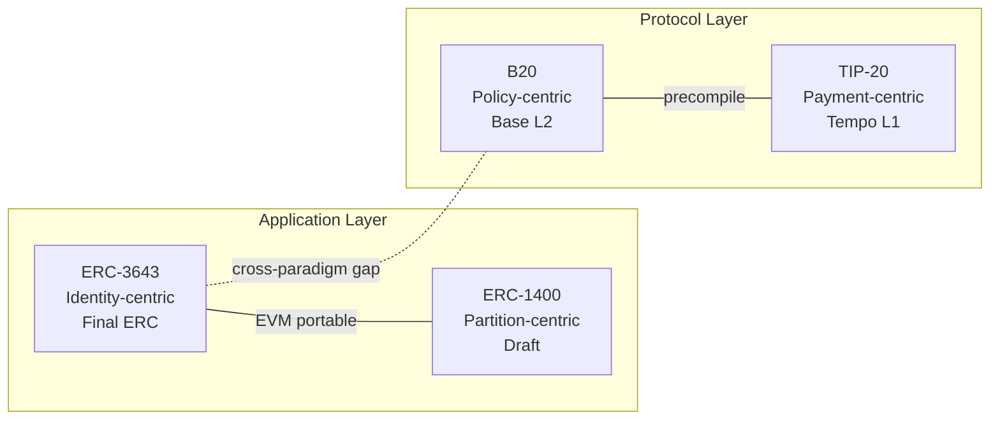
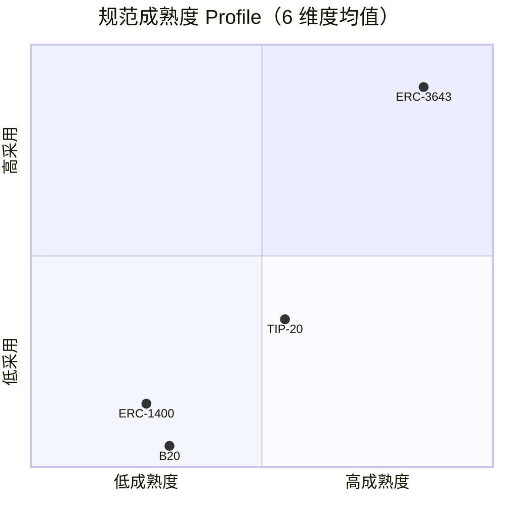
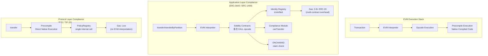
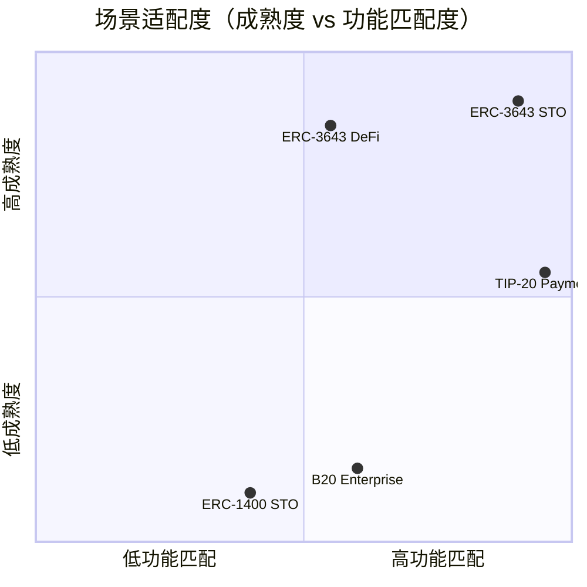

# 合规 Token 标准横向对比分析

## Executive Summary

本文基于 M1 阶段已完成的五份深度研究——WHI-177 landscape（合规能力 Taxonomy 与评估框架）、WHI-178 ERC-3643（T-REX）、WHI-179 ERC-1400（Security Token Standard）、WHI-180 TIP-20（Tempo）、WHI-181 B20（Base Beryl Precompile）——对四大合规 Token 标准进行系统性横向对比。

**核心发现**：

1. **设计范式分歧是结构性的**。应用层合规（ERC-3643/ERC-1400 通过 Solidity 合约在 EVM 解释层执行合规检查）与协议层合规（B20/TIP-20 通过 precompile 在原生执行层嵌入合规逻辑）的差异不是功能差异，而是架构位置差异——它决定了执行保证强度、Gas 成本结构和升级治理模型。

2. **成熟度梯度显著**。ERC-3643 是唯一 Final ERC 标准（$32B+ 代币化，DTCC/Apex/Invesco Association），ERC-1400 为从未 finalize 的 Draft（核心维护者全部流失），B20 为 Beryl 硬分叉前零生产部署的代码确认方案，TIP-20 为主网运行的链专属标准。成熟度差异直接影响机构可采纳性。

3. **跨链可移植性与协议层性能形成核心 trade-off**。ERC-3643 任意 EVM 链可部署但 Gas 开销高（约 2-8× ERC-20）；B20/TIP-20 的 precompile 执行 Gas 极低但完全锁定于单一链；这一 trade-off 无法调和，只能通过场景选择。

4. **合规能力覆盖呈互补格局**。ERC-3643 在 Identity/KYC 和 Recovery 上最强（ONCHAINID claim-based），B20/TIP-20 在 Transfer Policy（多 slot policy registry）和 Sanctions（BurnBlocked + BLOCKLIST）上更结构化，TIP-20 在 Payment Reconciliation 上独具全栈优势（Payment Lanes + Fee AMM + memo + StablecoinDEX），ERC-1400 在 Legal Document（ERC-1643）上有独特贡献。

5. **Precompile 路线处于 emerging signal 阶段**。B20 和 TIP-20 共同证明协议层合规的技术可行性，但 B20 零生产部署 + TIP-20 生态早期的现实意味着这一趋势尚未形成 established pattern。

---

## 1. 对比框架说明

### 1.1 对比对象与边界

本横向对比涵盖四大合规 Token 标准：

| 标准 | 设计范式 | 层级 | 状态 |
|------|---------|------|------|
| **ERC-3643** (T-REX) | 应用层合规 | Solidity smart contract | Final ERC (2023) |
| **ERC-1400** (Security Token Standard) | 应用层合规 | Solidity smart contract umbrella | Draft (2018, 从未 finalize) |
| **B20** (Base Beryl Precompile) | 协议层合规 | Precompile, EVM L2 | Code-confirmed, Beryl hardfork 前 |
| **TIP-20** (Tempo) | 协议层合规 | Precompile, 独立 L1 | Production (主网运行) |

**Circle Arc** 在 WHI-177 landscape 中作为补充参考方案分析，不纳入本横向对比矩阵的主列。

### 1.2 输入来源

所有 claim 可追溯至 M1 阶段 5 份研究产出：

| 来源 | 路径 | Issue ID |
|------|------|----------|
| WHI-177 landscape | `compliance-token-standards/research-sections/compliance-token-landscape/final.md` | f6a0c156 |
| WHI-178 ERC-3643 | `compliance-token-standards/research-sections/erc3643-trex-analysis/final.md` | 4036a12f |
| WHI-179 ERC-1400 | `compliance-token-standards/research-sections/erc1400-series-analysis/final.md` | cf57ea5d |
| WHI-180 TIP-20 | `compliance-token-standards/research-sections/tempo-tip20-analysis/final.md` | 586341f0 |
| WHI-181 B20 | `compliance-token-standards/research-sections/base-b20-analysis/final.md` | bc5cf45c |

### 1.3 对比维度体系

三个独立矩阵：

- **(a) 技术维度对比矩阵**：9 维度（扩展自 WHI-177 的 7 维度，新增跨链能力、支付优化、升级与治理），规范成熟度独立为 (b)
- **(b) 规范成熟度评估表**：6 子维度 × 4 标准，5 级评分
- **(c) 合规能力覆盖矩阵**：WHI-177 Taxonomy 8 类 × 4 标准

### 1.4 证据分类原则

| 证据类型 | 定义 | 适用标准 |
|---------|------|---------|
| primary-source | EIP 规范、官方文档可直接验证 | ERC-3643, ERC-1400 |
| code-confirmed | 代码分析可直接验证（pinned commit） | B20 |
| code-inferred pending spec | 代码推断但公开规范未发布 | B20 |
| docs-stated | 官方文档声明但源码未同步验证（C1 约束） | TIP-20 |
| secondary | 第三方分析 | 所有标准 |
| inferred | 跨源推理 | 所有标准 |

### 1.5 设计范式分类

**应用层合规**：合规逻辑作为 Solidity smart contract 在 EVM 解释执行层部署。合规检查通过跨合约 CALL opcode 完成。升级可通过 proxy pattern / module swap 独立进行。可在任何 EVM 兼容链部署。

**协议层合规**：合规逻辑作为 precompile 或链原生机制嵌入协议执行层。合规检查在 EVM precompile 层直接以编译后原生代码执行。升级需链级硬分叉协调。仅限特定链运行。

---

## 2. 技术维度对比矩阵表

### diag-1: 技术维度对比概览

### 9 维度 × 4 标准技术对比矩阵

| 维度 | ERC-3643 | ERC-1400 | B20 | TIP-20 |
|------|----------|----------|-----|--------|
| **1. 架构层级** | 应用层 Solidity，6 协作合约（Token/ONCHAINID/Identity Registry/Trusted Issuers Registry/Claim Topics Registry/Compliance Module）[primary-source: EIP-3643] | 应用层 Solidity，4 子标准 umbrella（ERC-1410 Partition + ERC-1594 Core + ERC-1643 Document + ERC-1644 Controller）[primary-source: EIP-1400] | 协议层 Precompile（Base EVM L2），B20Factory + PolicyRegistry + ActivationRegistry；Rust 实现，位于 `crates/common/precompiles/src/b20*/` [code-confirmed] | 协议层 Precompile（Tempo L1），TIP20Factory + TIP403Registry + TipFeeManager + StablecoinDEX；`tempo_precompile!` 宏强制 direct-call-only [docs-stated] |
| **2. 合规机制类型** | On-chain identity（claim-based）：ONCHAINID（ERC-734/735）+ Identity Registry + Trusted Issuers Registry + Compliance Module 可插拔规则引擎 [primary-source] | Off-chain certificate + operator：`_data` 参数注入（格式非标准化，各实现不兼容）+ on-chain whitelist/blacklist（实现依赖）[primary-source] | Policy registry 4-slot：TransferSender / TransferReceiver / TransferExecutor / MintReceiver；ALLOWLIST / BLOCKLIST 两种策略类型；policy 跨 token 共享 [code-confirmed] | Policy registry TIP-403：whitelist / blacklist + TIP-1015 compound policies（sender / recipient / mint recipient 三个独立子策略）；Chainalysis 集成监控 [docs-stated] |
| **3. 身份模型** | Self-sovereign ONCHAINID（ERC-734/735）：per-user 独立合约，4 类密钥（Management/Action/Claim Signer/Encryption），claim 存储 hash 而非 PII，跨 token 复用，密钥轮转不影响 claims [primary-source: WHI-178 §3.1] | Operator-controlled：无原生链上身份，依赖 `_data` 参数注入 off-chain KYC 证书；identity 管理完全委托给实现层 [primary-source: WHI-179 §2] | 无原生身份层：通过 PolicyRegistry ALLOWLIST/BLOCKLIST 实现 wallet-level 准入控制；身份验证依赖 off-chain KYC 写入 policy [code-confirmed: WHI-181 §5.3] | 无原生身份层：通过 TIP-403 whitelist/blacklist + Chainalysis 集成实现 wallet-level 准入控制 [docs-stated: WHI-180 §2.2] |
| **4. Gas 效率** | 高开销：每次 transfer 需 2-3 次外部合约调用（Identity Registry → ONCHAINID → Trusted Issuers + Compliance Module），估算约 2-8× ERC-20；7 种 batch 操作部分缓解 [inferred: WHI-178 §3.3] | 中-高开销：partition 嵌套 mapping（address → bytes32 → balance）+ 辅助数组 `_partitionsOf[]` 每次新 partition 交互产生 SSTORE (~20,000 gas) + array push；`balanceOf` 需遍历所有 partition [inferred: WHI-179 §4] | 低开销（code-inferred）：precompile 原生执行，绕过 EVM 解释器；PolicyRegistry 检查为单次内部调用非跨合约 CALL；B20_GAS_LIMIT = 10,000,000 [code-inferred pending spec] | 低开销：precompile 原生执行；TIP-1034 Channel Reserve 声称比 legacy 合约节省最高 72% Gas（secondary-source）；transfer 目标 < $0.001；Fee lifecycle pre-tx/post-tx 不消耗额外 Gas [docs-stated: WHI-180 §2.4] |
| **5. DeFi 可组合性** | ERC-20 compatible，但有结构性限制：合规检查失败导致 revert（DeFi 协议通常不处理 ERC-3643 revert reason = 用户侧静默失败）；持有者池受 isVerified 限制导致流动性受限 [primary-source: WHI-178 §3.4] | ERC-20 compatible，但 partition 概念非标准导致 DEX/lending 协议无法原生理解 partition；`_data` 要求破坏标准 ERC-20 接口预期；ERC-777 hook 架构已 deprecated [primary-source: WHI-179 §5] | Base 生态内（EVM L2 优势）：ERC-20 兼容接口，标准 DEX/lending 可集成；precompile 形式保证确定性执行；原生 ZK-provable traces [code-inferred: WHI-181 §12] | Tempo 生态内（独立 L1）：StablecoinDEX 原生集成（end-of-block batch matching）；TIP-1035 Implicit Approval List 免 DEX approve 步骤；TIP-403 政策在 DEX 交互中仍强制执行 [docs-stated: WHI-180 §2.6] |
| **6. 发行方控制力** | Agent role：freeze（全地址）/ partial freeze / forced transfer（绕过 canTransfer 但 receiver 仍需 isVerified）/ recovery（identity-level，asset + Identity Registry mapping 同步更新）/ pause / mint / burn + 7 种 batch ops；Owner + 多 Agent 架构 [primary-source: WHI-178 §6] | ERC-1644 Controller "God Mode"：controllerTransfer / controllerRedeem，可绕过所有限制；isControllable() 可永久不可逆禁用。最强单点控制力但权限过度集中，后续标准视为反模式 [primary-source: WHI-179 §6] | RBAC 7-role：DefaultAdmin / Mint / Burn / BurnBlocked / Pause / Unpause / Metadata；supply cap；renounceLastAdmin 永久安全设计；Asset 变体额外有 OPERATOR_ROLE + announcement 机制；无 forced transfer [code-confirmed: WHI-181 §5.4] | RBAC 4-role：ISSUER（mint/burn/mintWithMemo/burnWithMemo）/ PAUSE / UNPAUSE / BURN_BLOCKED；burnAt（TIP-1006）从任意地址 burn；Pause/Unpause 分离设计 [docs-stated: WHI-180 §2.3] |
| **7. 跨链能力** | 任意 EVM 链可部署（Ethereum/Polygon/Avalanche/Hedera/Base）；跨链需完整 ERC-3643 栈 + Trusted Issuer 互认 + 两链 ONCHAINID 部署；LayerZero DvP（2025-05）+ Wormhole Foundation 成员 [primary-source: WHI-178 §7] | 理论上 EVM 可移植但实现碎片化：`_data` 格式不兼容导致跨实现不可互操作；无原生桥接机制；ERC-7518 (DyCIST) 后续方案增加跨链能力 [primary-source: WHI-179 §7] | 仅限 Base 链：B20 precompile 仅在 Base Beryl hardfork 后可用；跨链依赖外部 L2-to-L1 canonical bridge；无内置跨链消息 [code-confirmed: WHI-181 §5.7] | 仅限 Tempo 链：LayerZero 集成支持桥接；AllUnity 稳定币发行基础设施集成 [docs-stated: WHI-180 §2.7] |
| **8. 支付优化** | 无原生支付优化：无 memo 字段、无 Payment Lanes、无 ISO 4217 货币标识、无交易费管理。定位为证券标准而非支付标准 [primary-source: WHI-178 §8] | 无原生支付优化：`_data` 参数理论上可传支付引用但格式非标准化，无法作为结构化支付对账工具 [primary-source: WHI-179 §8] | 有限支付能力：mintWithMemo / burnWithMemo（32-byte memo，token 操作级支付引用）[code-confirmed: WHI-181 §5.6]；Stablecoin 变体 currency() 返回 ISO 4217 标识符 [code-confirmed]。注：multiplier 属 B20Asset WAD-precision 缩放，非 Stablecoin 支付功能 | 全栈支付优化：32-byte memo（transferWithMemo/mintWithMemo/burnWithMemo）+ ISO 4217 currency() + Payment Lanes（55% 保证支付区块空间）+ Fee AMM（per-tx 固定汇率 0.9970）+ StablecoinDEX（end-of-block batch matching）+ TIP-1034 Channel Reserve（protocol-native 支付通道）[docs-stated: WHI-180 §2.4] |
| **9. 升级与治理** | Solidity 合约可独立升级：UUPS Proxy（ERC-1822）+ Implementation Authority pattern 实现多 token 统一升级；Compliance Module 可独立替换；风险：proxy admin 升级权力 [primary-source: WHI-178 §9] | 合约可重部署但无标准化 proxy pattern；ERC-1643 document 可更新（owner/controller 权限）；isIssuable()/isControllable() 不可逆冻结；无迁移机制规范 [primary-source: WHI-179 §9] | 升级需 Base 链级硬分叉：Beryl → Cobalt → ...；ActivationRegistry 支持特性级独立激活/停用；policy 可 renounce_admin 永久放弃管理权 [code-confirmed: WHI-181 §5.6-5.7] | 升级需 Tempo 链级硬分叉：T5 hardfork 引入 TIP-1034/1035；policy admin 两阶段转移（stageUpdateAdmin → finalizeUpdateAdmin）或 renounceAdmin 永久放弃 [docs-stated: WHI-180 §2.8] |

---

## 3. 规范成熟度评估表

### 评分标准

5 级评分：**5**=完全成熟（Final 标准 + 广泛采用 + 多实现）；**4**=高（production + 有限采用）；**3**=中（可用但有显著限制）；**2**=低（早期或衰退）；**1**=不适用/缺失。

### diag-2: 规范成熟度 Profile

### 6 维度 × 4 标准成熟度评估表

| 维度 | ERC-3643 | ERC-1400 | B20 | TIP-20 |
|------|----------|----------|-----|--------|
| **1. 正式标准化状态** | **5** — Final ERC (2023)，Ethereum 社区唯一正式获批合规代币标准 [primary-source: EIP-3643] | **2** — Draft proposal (2018)，从未达到 Last Call 或 Final；4 个子标准均为 Draft [primary-source: EIP-1400] | **1** — 无 EIP/ERC 流程，Base 链专属 precompile；公开 Beryl 规范尚未发布 [code-confirmed] | **3** — Tempo L1 TIP 标准，非跨链通用标准化流程；但在 Tempo 生态内为正式标准 [docs-stated] |
| **2. 公开 Spec 可用性** | **5** — EIP-3643 全文公开 + T-REX GitHub 开源 + Tokeny 文档 + 接口定义完整 [primary-source] | **3** — EIP-1400 系列 Draft 公开但 `_data` 参数和跨子标准集成未标准化，第三方无法独立实现兼容实现 [primary-source] | **2** — Beryl 公开规范未发布；pinned commit 代码可分析但不构成公开 spec；仅 base/docs@pinned 有有限文档 [code-confirmed] | **4** — docs.tempo.xyz 公开文档相对完整；C1 约束：源码未公开同步验证 [docs-stated] |
| **3. 网络激活状态** | **5** — 主网部署，$32B+ 资产代币化，180+ 司法管辖区，多链运行（Ethereum/Polygon/Avalanche/Hedera）[primary-source: WHI-178] | **2** — 多链零散部署但 Polymath 已迁移至 Polymesh；ConsenSys UniversalToken 2025-03 archived；活跃部署极少 [primary-source: WHI-179] | **1** — Beryl 硬分叉前，零网络激活，零生产部署 [code-confirmed] | **4** — Tempo 主网运行，KlarnaUSD（首个银行发行 token，2025-12 testnet）已部署；18,000 TPS testnet [docs-stated: WHI-180] |
| **4. 参考实现** | **5** — TokenySolutions/T-REX 多次审计（Hacken 10/10，Kaspersky）；EIP-3643 Security Considerations 引用审计报告 [primary-source: WHI-178 §3.5] | **2** — ConsenSys Universal Token（ConsenSys Diligence 2020 审计，发现 default partition bypass 关键漏洞，PR #13 修复）；2025-03 archived；Polymath 实现 2019 年起未公开维护 [primary-source: WHI-179 §10] | **3** — Base 链核心 codebase（base/base）Rust precompile 实现，与 Base 节点一体；ZK proving benchmark 存在（b20_zk_proving.rs）[code-confirmed: WHI-181] | **3** — tempo-std SDK + Tempo 链核心；源码仓库存在但未同步验证（C1 约束）[docs-stated: WHI-180] |
| **5. 真实采用** | **5** — $32B+（Association 自报）；DTCC（2025-03 加入 Association + ComposerX）、Fasanara Capital（Polygon MMF）、ABN AMRO（€5M green bond）、Apex Group ($3.5T AUM)、Invesco；92+ Association 成员；ISO 标准化推进中 [primary-source: WHI-178 §3.5] | **1** — 核心开发者全部流失（Polymath → Polymesh，Securitize → 自有协议，ConsenSys → archived）；活跃生产级部署趋近零 [primary-source: WHI-179 §10] | **1** — 零生产部署（pre-hardfork）[code-confirmed] | **3** — KlarnaUSD 首个银行发行 token（Klarna + Stripe 背景）；Chainalysis 自动覆盖；20+ 设计合作伙伴（Anthropic/DoorDash/Mastercard/Visa/Revolut/Shopify 等）；$500M Series A ($5B 估值) [docs-stated: WHI-180 §2.7] |
| **6. 单一依赖风险** | **3** — Association 治理（92+ 成员含 DTCC/Apex/Invesco/Deloitte），但核心实现和 T-REX 生态围绕 Tokeny；UUPS 升级权力集中 [primary-source: WHI-178] | **1** — Polymath 撤离后无核心维护者；ConsenSys archived；标准事实上处于无人维护状态 [primary-source: WHI-179] | **2** — 完全依赖 Base 团队 / Coinbase（Base 链专属）；但 Coinbase 为上市公司，Base 为头部 L2，单一依赖的对冲是依赖方的体量和稳定性 [code-confirmed] | **2** — 完全依赖 Tempo Labs（Tempo 链专属）；Stripe 孵化 + $500M Series A 提供一定持续性保障，但标准生态仅限 Tempo 链 [docs-stated] |
| **总分（/30）** | **28** | **11** | **10** | **19** |

> **总分说明**：总分仅供参考排序，不构成综合质量判断。单一维度的阻断性影响（如 B20 零网络激活、ERC-1400 无维护者）无法被其他维度的高分补偿。

---

## 4. 合规能力覆盖矩阵

### diag-3: 合规能力覆盖热力图

```mermaid
block-beta
    columns 5
    block:header
        columns 5
        h0["能力类别"] h1["ERC-3643"] h2["ERC-1400"] h3["B20"] h4["TIP-20"]
    end
    block:row1
        columns 5
        r1c0["Identity/KYC"] r1c1["Full ✓"] r1c2["Partial"] r1c3["Partial"] r1c4["Partial"]
    end
    block:row2
        columns 5
        r2c0["Transfer Policy"] r2c1["Full ✓"] r2c2["Partial"] r2c3["Full ✓"] r2c4["Full ✓"]
    end
    block:row3
        columns 5
        r3c0["Issuer Controls"] r3c1["Full ✓"] r3c2["Full ✓"] r3c3["Full ✓"] r3c4["Partial"]
    end
    block:row4
        columns 5
        r4c0["Sanctions"] r4c1["Partial"] r4c2["None ✗"] r4c3["Full ✓"] r4c4["Full ✓"]
    end
    block:row5
        columns 5
        r5c0["Recovery"] r5c1["Full ✓"] r5c2["Full ✓"] r5c3["Partial"] r5c4["Partial"]
    end
    block:row6
        columns 5
        r6c0["Legal Doc"] r6c1["None ✗"] r6c2["Full ✓"] r6c3["Partial"] r6c4["Partial"]
    end
    block:row7
        columns 5
        r7c0["Payment Recon"] r7c1["None ✗"] r7c2["None ✗"] r7c3["Partial"] r7c4["Full ✓"]
    end
    block:row8
        columns 5
        r8c0["Audit/Privacy"] r8c1["Partial"] r8c2["Partial"] r8c3["Partial"] r8c4["Partial"]
    end
```

### 8 类 × 4 标准合规能力覆盖矩阵

| 能力类别 | ERC-3643 | ERC-1400 | B20 | TIP-20 |
|---------|----------|----------|-----|--------|
| **1. Identity / KYC** | **Full** — ONCHAINID（ERC-734/735）claim-based 自主身份；per-user 独立合约；Identity Registry 绑定 wallet → ONCHAINID；isVerified() 检查；Trusted Issuers Registry 管理授权 KYC 提供者；密钥轮转不影响 claims [primary-source: WHI-178 §3.1] | **Partial** — 无原生身份层；依赖 `_data` 参数注入 off-chain KYC 证书（operator model）；身份管理完全委托给实现层；ConsenSys 实现使用 whitelist/blacklist 方式 [primary-source: WHI-179 §2] | **Partial** — 无原生身份层；通过 PolicyRegistry 4-slot 的 ALLOWLIST/BLOCKLIST 间接实现 wallet-level 准入控制；身份验证依赖 off-chain KYC 流程将地址写入 allowlist [code-confirmed: WHI-181 §5.3] | **Partial** — 无原生身份层；TIP-403 whitelist/blacklist 实现 wallet-level 准入；Chainalysis 集成提供自动 AML 监控和 memo 解码（但自动 policy 更新未在公开文档中确认）[docs-stated: WHI-180 §2.2, §2.5] |
| **2. Transfer Policy** | **Full** — Compliance Module 可插拔规则引擎：投资者上限、司法管辖限制、锁定期、认证状态等；模块可独立升级替换；标准 transfer 路径中 receiver-only identity 验证 + compliance check 双重保障 [primary-source: WHI-178 §3.2] | **Partial** — ERC-1594 `_data` 参数 + operator 验证（三种模式：off-chain certificate / on-chain rules / hybrid）；partition 级别权限控制；但 `_data` 格式非标准化破坏跨实现互操作 [primary-source: WHI-179 §3] | **Full** — PolicyRegistry 4-slot（TransferSender / TransferReceiver / TransferExecutor / MintReceiver）；ALLOWLIST / BLOCKLIST 两种策略；policy 跨 token 共享（external registry）；4 个 u64 policy ID packed into 2 U256 storage slots [code-confirmed: WHI-181 §5.3] | **Full** — TIP-403 whitelist / blacklist + TIP-1015 compound policies（sender / recipient / mint recipient 三个独立子策略，结构不可变但被引用策略可由各自 admin 修改）；policy 跨 token 共享；内置 always-reject (ID=0) / always-allow (ID=1) [docs-stated: WHI-180 §2.2] |
| **3. Issuer Controls** | **Full** — Agent role：freeze（全地址 setAddressFrozen）/ partial freeze（freezePartialTokens / unfreezePartialTokens）/ forced transfer（forcedTransfer，绕过 canTransfer 但 receiver 仍需 isVerified）/ recovery（identity-level，asset + IR mapping 同步更新）/ pause / mint / burn + 7 种 batch ops [primary-source: WHI-178 §6] | **Full** — ERC-1644 Controller "God Mode"（controllerTransfer / controllerRedeem）：最强单点控制力，可绕过所有限制；isControllable() 可永久不可逆禁用。但权限过度集中（conflates FREEZE/SEIZE/CONFISCATE/LIQUIDATE/RESTRICT/RECOVER 六类操作为单一 controllerTransfer）[primary-source: WHI-179 §6] | **Full** — RBAC 7-role（DefaultAdmin / Mint / Burn / BurnBlocked / Pause / Unpause / Metadata）；Pausable 按功能粒度（TRANSFER/MINT/BURN 独立暂停）；supply cap；renounceLastAdmin 永久安全设计；Asset 变体额外有 OPERATOR_ROLE + announcement 机制。无 forced transfer [code-confirmed: WHI-181 §5.4] | **Partial** — RBAC 4-role（ISSUER / PAUSE / UNPAUSE / BURN_BLOCKED）；burnAt（TIP-1006）从任意地址 burn；Pause/Unpause 分离设计（安全团队暂停，高管审批恢复）。无 forced transfer，无 partial freeze，无 supply cap（待验证）[docs-stated: WHI-180 §2.3] |
| **4. Sanctions / Blacklist** | **Partial** — 双重机制：(1) Compliance Module blacklist 规则；(2) Identity Registry claim 撤销。功能性但非原生专用；无 BurnBlocked role；无 Chainalysis 原生集成（可通过 Chainlink ACE 补充）[primary-source: WHI-178 §13] | **None** — 无标准级制裁机制；完全委托给 validator hook 实现（ConsenSys 实现有 blocklist check，但非标准要求）[primary-source: WHI-179 §13] | **Full** — BurnBlocked role（从 policy-blocked 账户销毁余额，需目标地址被 policy 阻止 `ensure_blocked`）+ BLOCKLIST policy type；结构化制裁执行路径 [code-confirmed: WHI-181 §5.4] | **Full** — BURN_BLOCKED role + blacklist policy + Chainalysis 原生集成（自动 token 监控 + memo 解码 AML 监控，2026-03 公告）；但自动 policy blacklist 更新未在公开文档中确认 [docs-stated: WHI-180 §2.5] |
| **5. Recovery** | **Full** — 专用 recovery 机制：`recoveryAddress(lostWallet, newWallet, investorONCHAINID)` 实现 identity-level 恢复（asset transfer + Identity Registry mapping 同步更新）+ ONCHAINID ERC-734 密钥轮转（非破坏性）。四大标准中唯一提供 identity-level 恢复的标准 [primary-source: WHI-178 §11] | **Full** — ERC-1644 controllerTransfer 可用于恢复场景：controller 可从任意地址强制转移 token 至新地址。最强恢复能力但依赖 controller 权限集中 [primary-source: WHI-179 §11] | **Partial** — 无专用 recovery 接口；BurnBlocked 可销毁被阻止地址余额但无法将 token 恢复至合法持有人新地址；可通过 Admin 组合 burnBlocked + mint 间接实现（非原子操作）[code-confirmed: WHI-181 §13] | **Partial** — 无 forced transfer；BURN_BLOCKED 可销毁被阻止地址余额；TIP-1022 Virtual Address Deposit Forwarding 提供存款恢复路径但非通用 token 恢复；与 B20 相同的 burn + mint 间接路径 [docs-stated: WHI-180 §11] |
| **6. Legal Document / Metadata** | **None** — 无原生文档管理机制；标准 ERC-20 元数据（name/symbol/decimals）；可通过外部合约或 claim 扩展补充但非标准 [primary-source: WHI-178 §12] | **Full** — ERC-1643 Document Management：`setDocument(bytes32 name, string URI, bytes32 documentHash)` + `getDocument()` → (URI, hash, timestamp) + `removeDocument()` + `getAllDocuments()`；设计被 CMTAT v3.0.0 采纳。四大标准中唯一原生文档管理的标准 [primary-source: WHI-179 §12] | **Partial** — Metadata role（updateName/updateSymbol/updateContractURI）；Asset 变体有 announcement 机制（announce() + reentrance guard + atomic execution）+ extraMetadata KV store（可存储 ISIN/CUSIP/FIGI）；Stablecoin 变体有 currency() 返回 ISO 4217；ERC-7572 contractURI 支持 [code-confirmed: WHI-181 §14] | **Partial** — ISO 4217 currency() 标识符（创建时设定不可更改）；TIP-1026 logoURI on-chain 元数据；32-byte memo 可携带支付引用。无结构化文档管理系统 [docs-stated: WHI-180 §12] |
| **7. Payment Reconciliation** | **None** — 无原生支付对账机制；定位为证券标准 [primary-source: WHI-178 §8] | **None** — `_data` 参数理论上可传支付引用但格式非标准化，不可作为结构化支付对账工具 [primary-source: WHI-179 §8] | **Partial** — mintWithMemo / burnWithMemo（32-byte memo，B256 类型，Memo event 记录 caller + memo）；Stablecoin 变体 currency() 返回 ISO 4217 标识符。注：multiplier 属于 B20Asset 的 WAD-precision 缩放能力，不属于支付对账 [code-confirmed: WHI-181 §6] | **Full** — 全栈支付对账：32-byte memo（transferWithMemo/mintWithMemo/burnWithMemo，event-level 记录，不上链存储）+ ISO 4217 currency() + Payment Lanes（55% 保证支付区块空间）+ Fee AMM（固定汇率 0.9970，0.3% LP fee）+ StablecoinDEX（end-of-block 批量匹配）+ TIP-1034 Channel Reserve（protocol-native 支付通道）[docs-stated: WHI-180 §2.4] |
| **8. Auditability / Privacy** | **Partial** — 全链上审计（Transfer/AddressFrozen/TokensFrozen/RecoverySuccess 事件）；ONCHAINID 不存储 PII（存储 claim hash/引用）提供隐私保护；但无 selective disclosure 或 ZKP 密码学机制，隐私保护为实现最佳实践而非协议层强制（ERC-735 bytes data/string uri 字段不限制 PII）[primary-source: WHI-178 §14] | **Partial** — 链上可审计（partition 级别事件）；无原生隐私设计 [primary-source: WHI-179 §14] | **Partial** — 全链上审计（Base L2 继承 Ethereum 透明性）；ZK proving benchmark 存在（b20_zk_proving.rs，10 种操作覆盖，900s timeout）表明 ZK 证明可行性已验证；无隐私层 [code-confirmed: WHI-181 §15] | **Partial** — 全链上审计 + memo 审计追踪；Tempo Zones 隐私执行环境（parallel blockchains + 高级密码学 ZKP/MPC）提供交易隐私保护（"privacy, not secrecy" 模型：Zone operator 有可见性，regulatory access keys 支持审计）；TIP-403 政策在 Zone 内仍强制执行 [docs-stated: WHI-180 §2.9] |

**B20 Evidence Constraint 应用**：B20 列中所有功能均基于 pinned commit `base/base@8e8767281d` 代码确认。B20Security/IB20Security（本地分支 a052beb 第三变体 Security=2）中的 `redeem`、`batchBurn`、`securityIdentifier` 等功能不纳入覆盖评级。如需引用这些功能，标注为 "local branch only / not evidenced at pinned resource commit"。

---

## 5. 架构层级对比图说明

### diag-4: EVM 执行栈分层对比

### diag-5: 四大标准 Transfer 路径并列对比

```mermaid
flowchart LR
    subgraph ERC-3643
        A1[transfer] --> A2[Token Contract]
        A2 --> A3[IR.isVerified<br/>receiver]
        A3 --> A4[Trusted Issuers<br/>verify claims]
        A4 --> A5[Compliance Module<br/>canTransfer]
        A5 --> A6{Pass?}
        A6 -->|Yes| A7[Execute]
        A6 -->|No| A8[Revert]
    end

    subgraph ERC-1400
        B1[transferByPartition] --> B2[Partition Check]
        B2 --> B3["_data Validation<br/>(off-chain cert)"]
        B3 --> B4[Operator Check]
        B4 --> B5{Pass?}
        B5 -->|Yes| B6[Execute]
        B5 -->|No| B7[Revert]
    end

    subgraph B20
        C1[transfer] --> C2[Precompile]
        C2 --> C3[ensure_not_paused]
        C3 --> C4[PolicyRegistry<br/>TransferSender]
        C4 --> C5[PolicyRegistry<br/>TransferReceiver]
        C5 --> C6{Pass?}
        C6 -->|Yes| C7[Execute]
        C6 -->|No| C8[Revert]
    end

    subgraph TIP-20
        D1[transfer] --> D2[Precompile]
        D2 --> D3[TIP-403<br/>Policy Check]
        D3 --> D4{Pass?}
        D4 -->|Yes| D5[Execute]
        D4 -->|No| D6[Revert]
    end
```

### 架构差异的技术后果

| 后果维度 | 应用层（ERC-3643/ERC-1400） | 协议层（B20/TIP-20） |
|---------|---------------------------|---------------------|
| **Gas 路径** | 多次 EVM CALL opcode（每次 ~2,600 gas base + memory/storage 开销）跨合约边界 | precompile 内部直接函数调用，无 EVM 解释开销 |
| **绕过风险** | 合约漏洞（如 ERC-1400 default partition bypass CVE）、proxy admin key 泄露 | 不可绕过（除非链级硬分叉修改 precompile 逻辑） |
| **行为一致性** | 各 token 部署可使用不同 Compliance Module 实现 → 行为差异 | 所有 token 共享同一 precompile 逻辑 → 行为完全一致 |
| **升级成本** | Module swap / proxy upgrade，低协调成本，单一 token 可独立升级 | 硬分叉全链协调，所有 token 同时升级 |
| **审计成本** | 每个 token 部署需独立审计 compliance 配置 | 审计一次 precompile 即信任所有 token |

### Factory/Registry 架构对比

| 组件 | ERC-3643 | ERC-1400 | B20 | TIP-20 |
|------|----------|----------|-----|--------|
| **Token 创建** | 标准 Solidity 合约部署（CREATE/CREATE2）| 标准 Solidity 合约部署 | B20Factory precompile（0xB20F...）确定性地址：`[0xb2][9 zero][variant byte][9 keccak256 hash bytes]` | TIP20Factory precompile（0x20Fc...）确定性地址：`[0x20C0 prefix][keccak256 lower 8 bytes]` |
| **Policy 注册** | Compliance Module 合约部署 + Token 绑定 | Validator hook 实现 | PolicyRegistry 全局单例 precompile（0x8453...02），policy 跨 token 共享 | TIP403Registry 全局 precompile（0x403c...），policy 跨 token 共享 |
| **身份注册** | Identity Registry + ONCHAINID 合约部署 | 无标准注册 | 无 | 无 |
| **激活机制** | 部署即激活 | 部署即激活 | ActivationRegistry（0x8453...01）按特性独立激活 | 部署即激活 / hardfork 激活 |

---

## 6. 关键 Insight

### Insight A: 合规在哪一层实现——趋势判断

**判断**：协议层合规（precompile 路线）正在形成 **emerging signal**，但尚未成为 established pattern。

**矩阵证据**：
- 架构层级维度：B20 和 TIP-20 均选择 precompile 而非 Solidity 合约实现合规逻辑，证明协议层路线在技术上可行
- Gas 效率维度：precompile 原生执行绕过 EVM 解释器，B20/TIP-20 的 per-transfer Gas 显著低于 ERC-3643 的 2-8× ERC-20 开销
- 升级与治理维度：precompile 升级需硬分叉协调，这是性能优势的结构性代价

**边界条件**：仅有 TIP-20 一例 production 部署 + B20 零生产部署 → 两个数据点不足以确立行业趋势。此外，Circle Arc（testnet 2025）和 Plume（Arbitrum Orbit L2 嵌入 KYC/AML）提供补充信号但均处于早期。precompile 路线的 **驱动力**（性能、Gas、标准化、监管确定性）清晰，但 **验证不足**（无大规模 production 验证）。

**趋势强度**：emerging（2/5）。

### Insight B: ERC-3643 vs B20/TIP-20——竞争还是互补？

**判断**：短期竞争，长期存在**互补路径**的结构性条件。

**矩阵证据**：
- Identity/KYC 覆盖：ERC-3643 是唯一具备完整链上身份层（ONCHAINID claim-based）的标准；B20/TIP-20 均依赖 wallet-level policy 间接实现，无原生身份
- Transfer Policy 覆盖：B20/TIP-20 的 policy registry 在结构化程度上与 ERC-3643 Compliance Module 相当（甚至更灵活，如 B20 4-slot / TIP-1015 compound）
- 跨链能力：ERC-3643 任意 EVM 链可部署 vs B20 限 Base / TIP-20 限 Tempo

**互补路径假设**：ERC-3643 ONCHAINID 作为跨链合规身份层（wallet → claim-based identity 绑定） + B20/TIP-20 policy registry 作为链内高效执行层（policy 检查 → precompile 原生执行）。实现条件：B20/TIP-20 的 policy registry 需能读取链上 ONCHAINID claim 状态作为 policy 判据——目前两者均不支持此集成。

**趋势强度**：speculative（1/5）。互补路径在架构上合理但缺乏任何实现或提案证据。

### Insight C: 成熟度对机构可采纳性的阻断效应

**判断**：成熟度评估的 6 个子维度中，**公开 Spec 可用性**和**真实采用**是阻断性维度。

**矩阵证据**：
- B20 公开 Spec 可用性 = 2：Beryl 公开规范未发布 → 第三方无法独立实现或审计 → 机构合规团队无法评估 → 机构无法采用（阻断）
- ERC-1400 真实采用 = 1：核心维护者全部流失 → 无持续支持保障 → 机构无法承担标准衰退风险（阻断）
- TIP-20 真实采用 = 3（KlarnaUSD + 设计合作伙伴）+ 公开 Spec = 4（docs.tempo.xyz）→ 阻断性条件不满足但 C1 约束（源码未公开验证）限制了技术尽调深度

**渐进性维度**：正式标准化状态、参考实现、单一依赖风险为渐进性——可通过生态演进逐步改善，不构成即时阻断。

### Insight D: ERC-1400 的设计遗产

**判断**：ERC-1400 虽然作为标准已失败，但其 **partition/tranche 概念**和 **文档管理接口**作为设计遗产影响了后续标准。

**矩阵证据**：
- ERC-1400 partition/tranche → ERC-7518 (DyCIST) 基于 ERC-1155 扩展 partition + 跨链互操作 + 动态合规
- ERC-1643 Document Management → CMTAT v3.0.0 采纳 `setDocument/getDocument/removeDocument` 接口
- B20 Asset 变体的 `multiplier` 机制（WAD-precision scaling）与 partition 的"同一 token 不同属性分组"理念有概念关联，但实现路径不同（precompile vs Solidity）

**启示**：标准的失败不等于设计的失败。ERC-1400 的教训是：_data 非标准化 + 子标准碎片化 + 核心维护者流失 → 实现不可互操作 → 生态瓦解。后续标准（ERC-3643 的 Compliance Module、B20/TIP-20 的 policy registry）均选择标准化合规接口而非灵活但非标准的 _data 注入。

### Insight E: TIP-20 支付优化的独特性

**判断**：TIP-20 的支付优化全栈（Payment Lanes + Fee AMM + memo + StablecoinDEX + Channel Reserve）在四大标准中 **无对应**，反映了 Tempo 作为支付专用链的差异化定位。

**矩阵证据**：
- 支付优化维度：ERC-3643/ERC-1400 无任何原生支付功能；B20 有 mintWithMemo/burnWithMemo + currency() 但无区块空间保证或 DEX 集成；TIP-20 提供从 memo 到 DEX 到 fee management 的完整支付栈
- Payment Reconciliation 覆盖：仅 TIP-20 评为 Full；B20 为 Partial（memo + currency）

**判断依据**：这不是其他标准的"功能缺口"——ERC-3643 定位为证券标准、B20 定位为通用合规 token 标准（Asset + Stablecoin 双变体覆盖），支付优化不在其核心 scope 内。TIP-20 的独特性来自 Tempo 链作为支付专用基础设施的架构决策（Stripe 孵化、Klarna 首发），而非标准设计的优劣。

### Insight F: B20 的演进潜力与当前限制

**判断**：B20 在 pinned commit 展现的架构设计（7-role RBAC + 4-slot policy + ActivationRegistry + ZK proving）具备较高的 **架构成熟度**，但成熟度评估表中的零网络激活和零生产部署构成当前的 **实质性限制**。

**B20Security 演进信号**：本地分支 a052beb 存在第三变体 Security (=2)，含 `redeem`、`batchBurn`、`securityIdentifier`、`SECURITY_OPERATOR_ROLE`、`BURN_FROM_ROLE` 等功能。这表明 B20 的设计方向可能扩展至证券 token，但这些功能不在 pinned commit 内，不纳入主线评分。

> **脚注**：B20Security/IB20Security 归类为"本地分支观察/演进线索"，不纳入 B20 主线成熟度评分、合规能力覆盖矩阵或 Mantle 策略判断的硬证据。

---

## 7. Trade-off 分析

### 7.1 标准级 Trade-off

| 标准 | 核心优势 | 核心代价 |
|------|---------|---------|
| **ERC-3643** | 跨链可移植性（任意 EVM 链）+ 成熟生态（$32B+, DTCC）+ 唯一 Final ERC + 完整链上身份（ONCHAINID）+ 机构信任 | Gas 开销高（2-8× ERC-20）+ DeFi 可组合性受限（合规检查静默 revert）+ 升级灵活但各部署行为可能不一致 + Tokeny 中心化风险 |
| **ERC-1400** | partition/tranche 模型强大的资本结构建模能力 + ERC-1643 文档管理（设计遗产）+ ERC-1644 最强 controller 恢复能力 | Draft 状态从未 finalize + `_data` 非标准化破坏互操作 + 核心维护者全部流失 + ERC-777 依赖已 deprecated + 事实上处于废弃状态 |
| **B20** | 协议层行为一致性（所有 token 共享 precompile 代码）+ Base/Ethereum 生态继承（EVM L2 优势）+ RBAC 7-role 粒度精细 + ZK proving 可行性已验证 + ActivationRegistry 特性级激活 | 仅限 Base 链 + Beryl 规范未公开发布 + 零生产部署 + 单一依赖 Coinbase/Base + 无 forced transfer 恢复能力 |
| **TIP-20** | 支付优化全栈（Payment Lanes + Fee AMM + memo + StablecoinDEX + Channel Reserve）+ precompile 低 Gas + Chainalysis 原生集成 + Stripe/Klarna 机构背景 | 仅限 Tempo 链 + 源码未公开（C1 约束）+ 生态早期 + 单一依赖 Tempo Labs + 4-role RBAC 粒度较粗 + 无 forced transfer |

### 7.2 场景化权重分析

### diag-6: 场景适配度矩阵

| 场景 | 最重要维度 | ERC-3643 | ERC-1400 | B20 | TIP-20 |
|------|-----------|----------|----------|-----|--------|
| **公链 DeFi 代币化证券** | 跨链 + DeFi 可组合 | **高** — 唯一可跨 EVM 链部署 + ERC-20 兼容，但合规检查 revert 限制 DeFi 深度集成 | **低** — ERC-20 兼容但 partition 非标准 + `_data` 破坏互操作 + 无人维护 | **中** — Base 生态内 ERC-20 兼容 + precompile 确定性执行，但限于 Base 链 | **低** — 限于 Tempo 链，DeFi 生态从零建设 |
| **合规机构发行（STO）** | 成熟度 + 监管确定性 + Identity | **最高** — Final ERC + $32B+ + DTCC/Apex + DTC no-action reference + ONCHAINID 完整 identity + 多链部署 | **不推荐** — Draft 从未 finalize + 无维护者 + 机构无法依赖 | **不可用** — 零生产部署 + 规范未发布 → 阻断性成熟度缺口 | **中** — 主网运行 + KlarnaUSD，但非证券定位 + C1 约束 + 单链限制 |
| **支付稳定币** | 支付优化 + Gas 效率 | **低** — 无支付功能 + Gas 高 | **不推荐** — 无支付功能 + 标准废弃 | **中** — Stablecoin 变体有 currency() + mintWithMemo/burnWithMemo，但无 Payment Lanes/DEX/fee 管理 | **最高** — Payment Lanes + Fee AMM + memo + StablecoinDEX + Channel Reserve + < $0.001 target + KlarnaUSD 验证 |
| **企业链/专用链部署** | 发行方控制 + 升级治理 + 跨链 | **高** — Agent role 粒度 + proxy 升级灵活 + 跨链可移植 | **中-低** — Controller 最强控制力但权限过度集中 + 无维护 | **中-高** — RBAC 7-role 最精细 + ActivationRegistry 特性级控制 + precompile 行为一致 + 但限于 Base 链 | **中** — RBAC 4-role + Payment Lanes 适合支付场景企业链，但限于 Tempo 链 |

---

## 8. B20 证据口径边界说明

### 8.1 Pinned Resource Commit 范围

B20 的所有横向对比 claim 基于以下两个 pinned commit：

| 来源 | Commit | 用途 |
|------|--------|------|
| `base/base` | `8e8767281d7c8768f6a0aed9124779cd4ed030ae` | 代码分析：B20Factory、B20Asset/Stablecoin 变体、PolicyRegistry、ActivationRegistry、RBAC、Transfer/Mint/Burn 流程、ZK proving benchmark |
| `base/docs` | `bfff9ef27f2333ff57c3a62417f6c1f0174992f0` | 文档分析：Beryl hardfork 说明（有限） |

超出此范围的信息不纳入矩阵评分。

### 8.2 B20Security/IB20Security 本地分支观察

本地分支 `a052beb` 存在第三变体 Security (=2)，位于 `b20_security/` 模块：

| 功能 | 存在位置 | 矩阵标注 |
|------|---------|---------|
| `redeem` | 本地分支 b20_security | local branch only / not evidenced at pinned resource commit |
| `batchBurn` | 本地分支 b20_security | local branch only / not evidenced at pinned resource commit |
| `securityIdentifier` | 本地分支 b20_security（专用字段，非 KV extraMetadata）| local branch only / not evidenced at pinned resource commit |
| `SECURITY_OPERATOR_ROLE` | 本地分支 b20_security | local branch only / not evidenced at pinned resource commit |
| `BURN_FROM_ROLE` | 本地分支 b20_security | local branch only / not evidenced at pinned resource commit |
| `sharesToTokensRatio` | 本地分支 b20_security（替代 Asset 的 multiplier）| local branch only / not evidenced at pinned resource commit |

这些功能归类为"本地分支观察/演进线索"，**不纳入 B20 主线成熟度评分或合规能力覆盖评级**。

### 8.3 Beryl 规范状态

截至本研究（2026-06-04），公开 Beryl hardfork 技术规范尚未发布。B20 的架构和功能分析基于代码推断（code-inferred），最终行为须以正式规范为准。所有 B20 矩阵格标注 "code-confirmed"（pinned commit 代码直接验证）或 "code-inferred pending Beryl spec"（代码推断但规范未发布）。

### 8.4 证据层级梯度

| 标准 | 主要证据类型 | 强度 |
|------|------------|------|
| ERC-3643 | primary-source（EIP-3643 Final 全文 + T-REX GitHub） | 最高 |
| ERC-1400 | primary-source（EIP-1400 系列 Draft） | 高（但标准为 Draft） |
| TIP-20 | docs-stated（docs.tempo.xyz；C1 约束：源码未公开同步验证） | 中 |
| B20 | code-confirmed / code-inferred pending spec（pinned commit 代码 + Beryl 规范未发布） | 中-低 |

---

## 9. 引用来源清单

### M1 阶段源 Section

| ID | 路径 | Issue ID | 引用 Item |
|----|------|----------|----------|
| S1 | compliance-token-standards/research-sections/compliance-token-landscape/final.md | f6a0c156 (WHI-177) | item-1 (Taxonomy/框架), item-4 (8 类能力) |
| S2 | compliance-token-standards/research-sections/erc3643-trex-analysis/final.md | 4036a12f (WHI-178) | item-2-9 (ERC-3643 列) |
| S3 | compliance-token-standards/research-sections/erc1400-series-analysis/final.md | cf57ea5d (WHI-179) | item-2-9 (ERC-1400 列) |
| S4 | compliance-token-standards/research-sections/tempo-tip20-analysis/final.md | 586341f0 (WHI-180) | item-2-9 (TIP-20 列) |
| S5 | compliance-token-standards/research-sections/base-b20-analysis/final.md | bc5cf45c (WHI-181) | item-2-9 (B20 列) |

### EIP/ERC 规范

| ID | 来源 | 引用 Item |
|----|------|----------|
| E1 | [EIP-3643](https://eips.ethereum.org/EIPS/eip-3643) — Final (2023) | item-2 (架构), item-3 (成熟度) |
| E2 | [EIP-1400](https://github.com/ethereum/EIPs/issues/1411) — Draft (2018) | item-2 (架构), item-3 (成熟度) |
| E3 | EIP-1410/1594/1643/1644 — Draft | item-2 (子标准), item-4 (文档管理) |

### 代码仓库

| ID | 来源 | Commit | 引用 Item |
|----|------|--------|----------|
| C1 | base/base | 8e8767281d7c8768f6a0aed9124779cd4ed030ae | item-2 (B20), item-4 (B20), item-8 |
| C2 | [TokenySolutions/T-REX](https://github.com/TokenySolutions/T-REX) | latest | item-2 (ERC-3643), item-3 (参考实现) |
| C3 | [ConsenSys/UniversalToken](https://github.com/ConsenSys/UniversalToken) | archived 2025-03 | item-2 (ERC-1400), item-3 (参考实现) |

### 官方文档

| ID | 来源 | 引用 Item |
|----|------|----------|
| D1 | [Tempo docs](https://docs.tempo.xyz) — TIP-20 spec, TIP-403, 扩展 TIP | item-2 (TIP-20), item-4 (TIP-20) |
| D2 | base/docs@bfff9ef27f2333ff57c3a62417f6c1f0174992f0 | item-8 (B20 证据边界) |
| D3 | [Tokeny / ERC3643.org](https://www.erc3643.org/) | item-3 (成熟度), item-6 (insight) |

### 监管文件

| ID | 来源 | 引用 Item |
|----|------|----------|
| R1 | [DTC no-action letter](https://www.sec.gov/files/tm/no-action/dtc-nal-121125.pdf) (2025-12-11) | item-3 (ERC-3643 成熟度) |
| R2 | [Commissioner Peirce statement](https://www.sec.gov/newsroom/speeches-statements/peirce-121125-tokenization-trending-statement-division-trading-markets-no-action-letter-related-dtcs-development) | item-3 (ERC-3643 成熟度) |

### 市场数据

| ID | 来源 | 查询日期 | 引用 Item |
|----|------|---------|----------|
| M1 | [RWA.xyz](https://app.rwa.xyz/) | 2026-05 | item-3 (真实采用) |

### 第三方分析

| ID | 来源 | 引用 Item |
|----|------|----------|
| T1 | [Chainalysis Tempo coverage](https://www.chainalysis.com/blog/tempo-automatic-token-coverage-march-2026/) | item-4 (TIP-20 Sanctions) |
| T2 | Oraclizer Research — ERC-1644 操作类型分析 | item-4 (ERC-1400 Issuer Controls) |

---

## Source Coverage

| Req | Status | Sources |
|-----|--------|---------|
| **src-1** (WHI-177 landscape) | **covered** | S1: Taxonomy 8 类, 评估维度 7 维度, 设计范式分类 |
| **src-2** (WHI-178 ERC-3643) | **covered** | S2: 架构组件, transfer 流程, Gas, DeFi, Agent role, 成熟度 |
| **src-3** (WHI-179 ERC-1400) | **covered** | S3: 子标准, partition, _data, ConsenSys 审计, 标准状态 |
| **src-4** (WHI-180 TIP-20) | **covered** | S4: precompile 架构, TIP-403, RBAC, Payment Lanes, 生态 |
| **src-5** (WHI-181 B20) | **covered** | S5: B20Factory, 双变体, PolicyRegistry, RBAC, ActivationRegistry |
| **src-6** (EIP/ERC 规范) | **covered** | E1 (EIP-3643), E2 (EIP-1400), E3 (子标准 Draft) |
| **src-7** (B20 代码) | **covered** | C1: base/base@8e8767281d pinned commit |
| **src-8** (Tempo docs) | **covered** | D1: docs.tempo.xyz |
| **src-9** (监管文件) | **covered** | R1 (DTC no-action letter), R2 (Peirce statement) |

## Gap Analysis

| Gap | Severity | Mitigation |
|-----|----------|------------|
| **Gas 定量对比缺失** | medium | 无公开 benchmark 数据跨四大标准的 per-transfer Gas 对比。矩阵使用定性描述（高/中-高/低）+ 证据分类标注。ERC-3643 的 2-8× 为架构推断；B20/TIP-20 的"低"为 precompile vs EVM 解释执行的架构对比。定量 benchmark 需 Beryl 上线后实测。 |
| **TIP-20 源码未验证（C1 约束）** | medium | 所有 TIP-20 claim 标注为 docs-stated 而非 code-confirmed。C1 约束已在矩阵中系统性标注。 |
| **B20 Beryl 规范未发布** | medium | 所有 B20 claim 标注为 code-confirmed 或 code-inferred pending Beryl spec。Module 8 独立说明 B20 证据口径边界。 |
| **跨链互补路径缺乏实现证据** | low | Insight B 的互补路径假设标注为 speculative (1/5)，明确说明无实现或提案证据。 |
| **ERC-3643 $32B+ 独立审计缺失** | low | 采用数据为 Association 自报，标注 [primary-source: WHI-178] 但注明无独立第三方审计验证。 |

## Revision Log

| Round | Action | Description |
|-------|--------|-------------|
| 1 | initial_draft | Full deep draft from approved outline (8343f49, round 2). 9 items, 9 fields, 6 diagrams, 9 source requirements. All 5 M1 source sections referenced. B20 evidence constraint applied throughout. 3 matrices produced: 9-dimension technical comparison, 6-dimension maturity assessment, 8-category compliance capability coverage. 6 cross-cutting insights extracted. Trade-off analysis with 4-scenario weighted matrix. |
