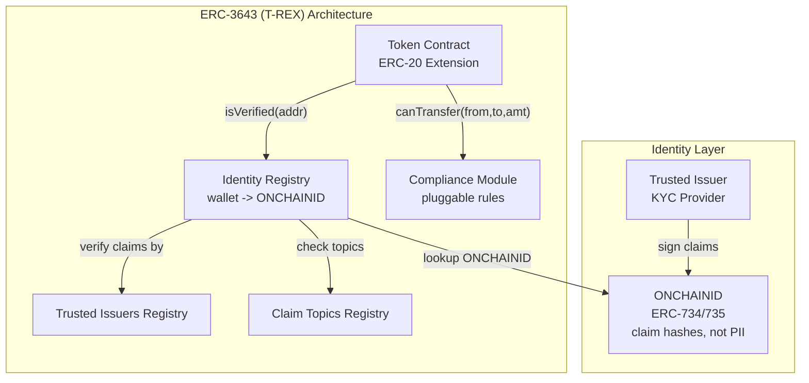
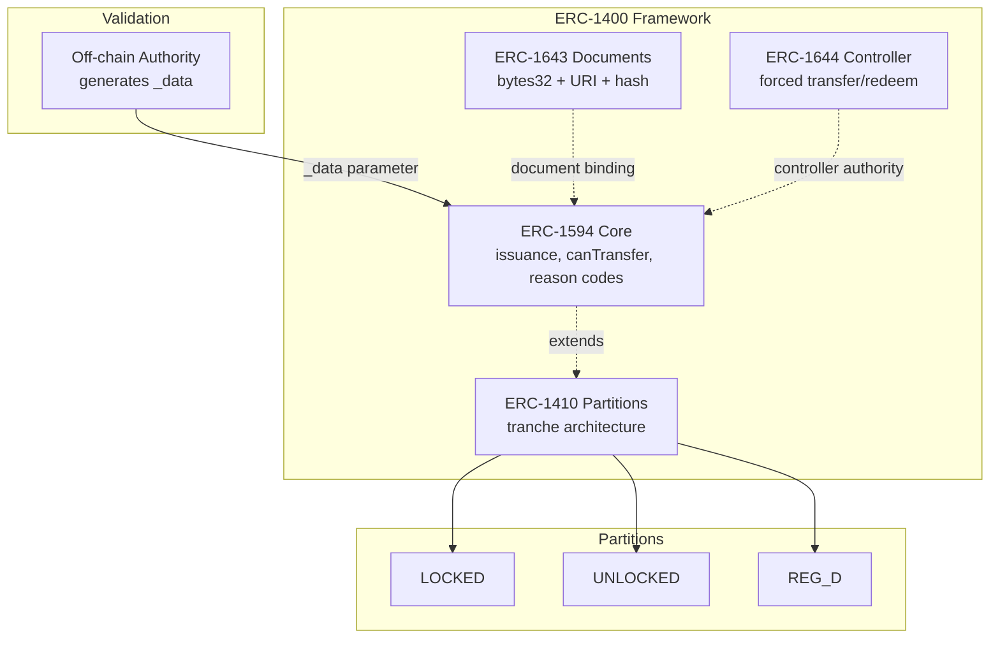
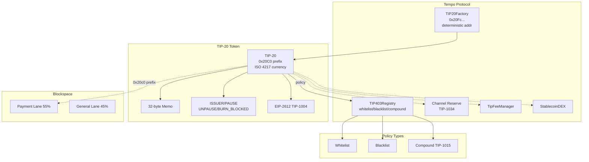
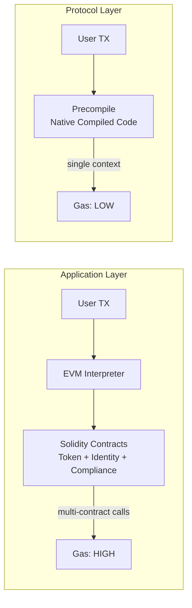
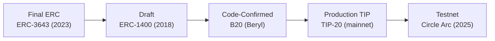

# 合规 Token 标准行业趋势与驱动力分析

## Executive Summary

2024-2026 年，全球监管环境发生了结构性转变，推动合规 Token 标准从可选功能演进为机构入场的前置条件。EU 代币化证券由 MiFID II / Prospectus / CSDR / DLT Pilot Regime 规制（MiCA Article 2 排除金融工具类加密资产，仅适用于 ART/EMT/CASP）(G1)；美国方面，DTC 在其 no-action 请求中将 ERC-3643 引用为合规感知协议示例，SEC 工作人员就该事实模式授予了有限的、事实限定的三年期 no-action relief (G2)，SEC 主席 Atkins 在 "Project Crypto" 演讲中将 ERC-3643 作为合规特性代币标准的示例，在 innovation exemption 框架的拟议条件中点名；GENIUS Act 于 2025 年 7 月签署为首部联邦稳定币立法；香港稳定币条例 2025 年 8 月生效；新加坡 MAS Project Guardian 扩展至 40+ 参与者。

RWA 链上资产规模（不含稳定币）已突破 $33B（2026 年 5 月，rwa.xyz），同比增长超 200%。DTCC、BlackRock、Franklin Templeton 的深度参与标志行业进入 institutional scaling 阶段。

技术路线上，合规 Token 标准沿两条设计范式演进：**应用层合规**（ERC-3643/ERC-1400 通过 Solidity 智能合约在 EVM 应用层执行 identity 验证和 transfer 限制）和**协议层合规**（B20/TIP-20/Circle Arc 通过 precompile 或链原生机制在协议层嵌入合规逻辑）。这不是功能差异，而是设计范式的根本分歧——它决定了执行保证强度、Gas 成本结构、标准化程度和升级治理模型。

本文建立统一的 8 类合规能力 Taxonomy 和 7 维度评估框架，从设计范式角度（而非功能清单）对比 ERC-3643、ERC-1400、B20、TIP-20 和 Circle Arc 五大标准/方案。

## Regulatory Scope Guardrails

> **G1 -- EU 监管框架分离**：EU 代币化证券（STO）受 **MiFID II、Prospectus Regulation、CSDR 和 DLT Pilot Regime（EU 2022/858）**规制。MiCA（EU 2023/1114）Article 2 明确排除构成金融工具的加密资产，其适用范围为非金融工具加密资产、ART、EMT 和 CASP。本文涉及 EU 代币化证券法律时，以 DLT Pilot / MiFID II / Prospectus / CSDR 为主要来源。
>
> **G2 -- DTC no-action letter 措辞限定**：DTC 在其 no-action 请求中将 ERC-3643 引用为合规感知协议示例之一；SEC 工作人员（2025 年 12 月）就该 DTC 初步服务事实模式授予了有限的、事实限定的 no-action relief；该工作人员回复不建立更广泛的法律结论。来源：[DTC no-action letter PDF](https://www.sec.gov/files/tm/no-action/dtc-nal-121125.pdf)、[Commissioner Peirce 声明](https://www.sec.gov/newsroom/speeches-statements/peirce-121125-tokenization-trending-statement-division-trading-markets-no-action-letter-related-dtcs-development)。

---

## 1. 监管环境变化与合规驱动力

### 1.1 EU 代币化证券框架（G1 适用）

EU 对区块链金融资产的监管形成两条并行的法律轨道：

**代币化证券（STO）法律框架**：
- **MiFID II**：规制投资服务和交易场所，代币化证券如满足金融工具定义则纳入其范围
- **Prospectus Regulation**（EU 2017/1129）：证券发行信息披露义务。2026 年 6 月起小额发行门槛从 EUR 8M 提高至 EUR 12M
- **CSDR**：规制证券结算和中央证券存管
- **DLT Pilot Regime**（EU 2022/858）：2023 年 3 月生效，为基于 DLT 的证券交易和结算基础设施创建监管沙盒

**DLT Pilot Regime 重大升级（2025 年 12 月）**：欧盟委员会提出升级方案，发行总额上限从 EUR 6B 提升至 EUR 100B；取消仅限市值 EUR 500M 以下公司股票的限制，扩展至所有 MiFID II 证券；允许 CASP 在 DLT Pilot 下发行代币化证券；允许 CSD 使用受监管的 e-money tokens（稳定币）进行结算；ESMA 将直接监管所有 CASP。此前参与度有限（仅 360X 等少数机构），升级方案旨在解决阈值限制和互操作性不足。

**MiCA**（EU 2023/1114）：2024 年 12 月 30 日全面生效。Article 2 明确排除构成金融工具的加密资产。适用于非金融工具加密资产（ART/EMT/CASP），提供市场结构和披露参考背景，**不适用于代币化证券的 transfer 控制或 KYC 要求**。截至 2025 年 11 月 EU 范围内已批出超 53 个 CASP 许可证，过渡期延至 2026 年 7 月 1 日。

> **证据分类**：regulatory_event | primary-source：EUR-Lex MiCA 全文、European Commission DLT Pilot 升级提案、ESMA DLT Pilot 报告（2025 年 6 月）

### 1.2 美国 SEC/DTC no-action letter（G2 适用）

**DTC no-action letter（2025 年 12 月 11 日）**：DTC 在其 no-action 请求中将 ERC-3643 引用为合规感知协议示例之一。SEC Division of Trading and Markets 工作人员就 DTC 初步服务的特定事实模式授予了有限的、事实限定的三年期 no-action relief。该回复明确不建立更广泛的法律结论，不构成对 ERC-3643 的正式批准、认可或背书。来源：[DTC no-action letter PDF](https://www.sec.gov/files/tm/no-action/dtc-nal-121125.pdf)；[Commissioner Peirce 声明](https://www.sec.gov/newsroom/speeches-statements/peirce-121125-tokenization-trending-statement-division-trading-markets-no-action-letter-related-dtcs-development)。

**SEC 主席 Paul Atkins "Project Crypto" 演讲（2025 年 7 月 31 日）**：Atkins 在 America First Policy Institute 发表演讲宣布 "Project Crypto" 委员会级倡议。演讲中提出 "innovation exemption" 框架，拟议条件可包括使用白名单或 "verified pool" 功能，以及限制不符合 ERC-3643 等合规特性代币标准（compliance-feature token standard）的代币化证券（原文："conditions may include whitelisting / verified-pool functionality and restrict tokenized securities that do not adhere to a compliance-feature token standard such as ERC3643"）。ERC-3643 在此作为具备合规特性的代币标准的示例被点名，而非对其特定机制的评价或背书。来源：[SEC 官方声明](https://www.sec.gov/about/sec-launches-project-crypto)；[Atkins 演讲全文](https://www.sec.gov/newsroom/speeches-statements/atkins-digital-finance-revolution-073125)；[WilmerHale 分析](https://www.wilmerhale.com/en/insights/client-alerts/20250801-sec-chair-atkins-unveils-project-crypto-to-modernize-us-securities-regulation)。

> **措辞精度说明**：Atkins 演讲中 ERC-3643 是在 innovation exemption 拟议条件下作为合规特性代币标准的示例被点名，不构成对该标准特定机制的评价。DTC no-action letter 是 SEC 工作人员对 DTC 特定事实模式的有限 relief，不建立更广泛法律结论。两者均不构成 SEC 对 ERC-3643 的正式批准、认可或背书。

### 1.3 美国 GENIUS Act

2025 年 7 月 18 日签署为法律（参议院 68-30，众议院 308-122），首部美国联邦稳定币立法。核心要求：仅"获准支付稳定币发行人"（PPSI）可在美国发行支付稳定币；1:1 高质量流动资产全额储备（现金、联邦储备余额、短期国债）；按面值即时赎回；禁止向持有者支付利息或收益；月度披露和审计要求；发行人作为 BSA 下的金融机构须遵守 AML 义务；明确将支付稳定币排除在证券和商品定义之外。2027 年 1 月 18 日或监管规则发布后 120 天生效。FDIC（2025 年 12 月审批 NPR）、OCC 和 Treasury 均已启动规则制定。来源：[Congress.gov 全文](https://www.congress.gov/bill/119th-congress/senate-bill/1582/text)。

### 1.4 亚太地区

**香港稳定币条例**：2025 年 5 月 21 日通过，8 月 1 日生效。HKMA 监管法币参考稳定币发行人许可。最低资本：HK$25M 实缴资本、HK$3M 流动资本；储备超额抵押（3 个月以内银行存款和 1 年以内到期国债）；仅 HKMA 授权发行人可向零售投资者发售。首批许可证预计 2026 年 Q1。来源：[Freshfields 概览](https://www.freshfields.com/en/our-thinking/briefings/2025/09/hong-kong-stablecoins-ordinance-overview)。

**新加坡 MAS Project Guardian**：2022 年启动的跨境协作倡议，已扩展至 40+ 行业参与者。2025 年关键里程碑：ISDA/Ant International 代币化银行负债 FX 结算报告；ICMA 固定收益工作流交付物；BLOOM 倡议（Borderless, Liquid, Open, Online, Multi-currency）。MAS 总经理在 2025 年 Singapore FinTech Festival 勾勒 10 年愿景，将代币化定位为与 AI 并列的两大结构性力量。来源：[MAS Project Guardian 官网](https://www.mas.gov.sg/schemes-and-initiatives/project-guardian)。

### 1.5 监管趋势判断

| 趋势 | 证据 |
|------|------|
| **许可准入制成为全球共识** | GENIUS Act（美国）、MiCA（EU）、香港稳定币条例、MAS 框架——核心原则趋同：许可制、1:1 储备、AML/KYC |
| **监管沙盒加速** | DLT Pilot Regime 大幅升级（EUR 100B 上限）、SEC "innovation exemption"、MAS BLOOM |
| **链上合规从建议变为条件** | Atkins 演讲在 innovation exemption 拟议条件中点名 ERC-3643 类合规特性代币标准 |
| **跨境互认萌芽** | GENIUS Act 外国发行人条款、DLT Pilot 拟允许 CASP 发行代币化证券 |

---

## 2. RWA 市场数据与机构采用

### 2.1 市场规模

截至 2026 年 5 月（来源：[RWA.xyz](https://app.rwa.xyz/)）：

| 指标 | 数值 | 同比变化 |
|------|------|----------|
| 链上分布式 RWA 总规模（不含稳定币） | ~$33.9B | +200%+ |
| 代表资产价值 | ~$229.7B | -- |
| 稳定币总规模 | ~$304.6B | -- |
| 资产持有者总数 | ~837,000+ | +12% (30 天) |

**资产类别分布**：美国国债代币化 $13.4B+（最大类别）；大宗商品（黄金为主）$7.3B；股票 ~$960M；私人信贷持续增长。Q1 2026 从年初 ~$21B 增至 ~$27.5-29B（季度增长 ~30%，同比增长 ~263%）。

**领先产品**：Circle USYC $2.7B、BlackRock BUIDL $2.4B、Ondo 系列 $2.6B、Franklin Templeton BENJI $1.0B、WisdomTree WTGXX $861M。

**链分布**：Ethereum 承载超 56% 代币化资产价值（2026 年 4 月）。Stellar 在国债产品有显著份额。Plume 在 RWA 持有者数量领先（259K）。

来源：[InvestAX Q1 2026 报告](https://investax.io/blog/q1-2026-real-world-asset-tokenization-market-report)、[Canton Network 状态报告](https://www.canton.network/blog/state-of-rwa-tokenization-2026)。

### 2.2 关键机构参与

| 机构 | 参与方式 | 相关标准/链 |
|------|----------|-------------|
| **DTCC** | 2025 年 3 月加入 ERC-3643 Association；ComposerX 平台集成 | ERC-3643 |
| **BlackRock** | BUIDL $2.4B；参投 Circle Arc $222M presale | 多链 / Arc |
| **Franklin Templeton** | BENJI $1.0B | Stellar / 多链 |
| **WisdomTree** | 14 支代币化基金在 Plume 上线（2025 年 10 月） | Plume |
| **Apollo Global** | $50M 私人信贷部署 | Plume |
| **Apex Group / Invesco** | 加入 ERC-3643 Association | ERC-3643 |
| **Klarna** | KlarnaUSD -- 首个银行发行 TIP-20 代币（2025 年 12 月测试网） | Tempo |
| **Stripe / Paradigm** | 孵化 Tempo；$500M Series A（$5B 估值） | Tempo |

### 2.3 阶段判断

市场处于 **institutional scaling** 阶段：$33B+ 规模和 837K+ 持有者超越实验阶段；DTCC/BlackRock 深度参与标志系统性基础设施建设。但相对全球 $900T 资产规模仍极早期（<0.01%）。McKinsey 预测 2030 年 $2-4T，BCG-Ripple 预测 $18.9T。

---

## 3. ERC-3643 (T-REX Protocol) 架构与合规机制

### 3.1 架构组件

ERC-3643 是唯一达到 Final 状态的 Ethereum 合规代币标准（2023 年批准）。来源：[ERC-3643 EIP](https://eips.ethereum.org/EIPS/eip-3643)。

| 组件 | 功能 | 技术特征 |
|------|------|----------|
| **Token Contract** | ERC-20 扩展，conditional transfer/transferFrom | 继承 ERC-20 完整接口 |
| **ONCHAINID** | 自主身份合约（ERC-734/735） | 存储 claim hash/引用而非 PII；每用户独立合约 |
| **Identity Registry** | wallet -> ONCHAINID 映射 | isVerified() 验证地址合规状态 |
| **Trusted Issuers Registry** | 授权 KYC 提供者 | 仅信任发行者签发的 claims 被接受 |
| **Claim Topics Registry** | 必需 claim 类型 | 每 token 可配不同 topics |
| **Compliance Module** | 可插拔合规规则引擎 | 独立可升级；支持投资者上限、司法管辖限制、锁定期 |

### diag-1: ERC-3643 架构图



### 3.2 Transfer 流程

1. 用户发起 `transfer(to, amount)` -> 2. Token Contract 调用 Identity Registry.isVerified(sender) 和 isVerified(receiver) -> 3. Identity Registry 查找 ONCHAINID，遍历 Claim Topics Registry 和 Trusted Issuers Registry 验证 claims -> 4. Token Contract 调用 Compliance Module.canTransfer(from, to, amount) 检查规则 -> 5. 通过则执行，失败则 revert。

### 3.3 Gas 成本特征

每次 transfer 需执行 identity 验证（跨合约调用 Identity Registry -> ONCHAINID -> Trusted Issuers）+ compliance 检查（Compliance Module）。估算 ERC-3643 transfer Gas 为标准 ERC-20 的 3-10x（取决于 claim 数量和 compliance 规则复杂度）。模块化设计和批量操作可部分缓解。

> **证据分类**：gas_characteristic | inferred（无公开 benchmark 数据）

### 3.4 DeFi 可组合性

基于 ERC-20 接口可与 DeFi 交互，但存在结构性限制：合规检查失败导致静默 revert（DeFi 协议不处理 ERC-3643 特定 revert reason）；持有者池受限（isVerified 要求）限制流动性；与 permissionless DeFi 的根本张力。

### 3.5 标准成熟度（G2 适用）

唯一 Final ERC 合规代币标准（2023）；>$32B 资产代币化（Association 声称）；180+ 司法管辖区；ERC-3643 Association 治理（DTCC、Apex、Invesco 等成员，2025 年新增 24 名含 Deloitte、Fireblocks、Ava Labs、Hedera）；DTC no-action 引用（事实限定 relief）；Atkins "Project Crypto" 演讲在 innovation exemption 拟议条件中点名；ISO 标准化推进（西班牙 ISO TC 307）。来源：[ERC3643.org](https://www.erc3643.org/)、[Tokeny 文档](https://tokeny.com/erc3643/)。

---

## 4. ERC-1400 (Security Token Standard) 架构与合规机制

### 4.1 模块化子标准

2018 年 Polymath 联合 25 家公司提出。四个独立子标准：

- **ERC-1410**（Partially Fungible Token）：partition/tranche 架构，嵌套 mapping（address -> bytes32 -> balance），支持 LOCKED/UNLOCKED/REG_D_RESTRICTED 等法律属性分组
- **ERC-1594**（Core Security Token）：发行验证、transfer 限制与原因码、off-chain 数据注入（`_data` 参数）
- **ERC-1643**（Document Management）：链上文档关联（bytes32 name + URI + hash + timestamp）
- **ERC-1644**（Controller Token Operation）：controllerTransfer/controllerRedeem，用于强制转移/合规操作/安全修复

### diag-2: ERC-1400 模块化架构图



### 4.2 标准成熟度

**Draft/Proposal（从未达到 Final）**。Polymath 实现自 2019 年不再公开维护（已转向 Polymesh 专用链）。ConsenSys Universal Token 2022 年发布但截至 2025 年不再积极维护。ERC-777 依赖已过时（OpenZeppelin v5.0.0 弃用）。`_data` 参数非标准化破坏互操作性。据行业分析仅满足约 40% 的 31 项监管要求。后续演进：ERC-7518 (DyCIST) 基于 ERC-1155。来源：[Polymath ERC-1400](https://www.polymath.network/erc-1400)、[ConsenSys UniversalToken](https://github.com/ConsenSys/UniversalToken)。

---

## 5. B20 (Base Beryl Precompile) 协议层合规架构

> **证据声明**：所有 B20 结论基于代码分析（`base/base@8e8767281d7c8768f6a0aed9124779cd4ed030ae`），公开 Beryl 规范尚未发布。所有结论归类为 **code-inferred pending 最终硬分叉规范**。

### 5.1 Precompile 架构

B20 token 通过 `B20Factory` precompile 创建，位于 `crates/common/precompiles/src/b20_factory/`。

**地址格式**（code-confirmed：`variant.rs`）：`[0xb2][9 零字节][variant discriminant][9 字节 keccak256(creator,salt)[:9]]`。前缀字节 `0xb2` + 9 零字节 + variant byte（Asset=0, Stablecoin=1），后接确定性 hash tail。`B20Variant::compute_address()` 方法实现地址派生。

### 5.2 Token 变体

`B20Variant` 枚举（code-confirmed：`crates/common/precompiles/src/b20_factory/variant.rs`）在 pinned commit 定义恰好两种变体：

- **Asset** (=0)：通用资产代币。`decimals()` 在此 commit 返回 6（代码确认，可能在最终规范中调整）
- **Stablecoin** (=1)：稳定币代币。`decimals()` 返回 6，Stablecoin 变体额外有 `currency()` 方法

每种变体有独立的 `supported_version()` 和 `activation_feature()`。`from_discriminant()` 仅接受 0 和 1。

**未来演进观察**：本地分支 `a052beb` 出现第三变体 Security (=2)，属 `b20_security/` 模块扩展，尚未合入 pinned commit，归类为未来演进观察。

### 5.3 Policy 系统

**PolicyRegistry**（code-confirmed：`crates/common/precompiles/src/policy/`）为全局单例 precompile。

**4 个内置 policy slot**（code-confirmed：`crates/common/precompiles/src/common/policy_type.rs`）：

| Policy Type | 检查对象 | 常量哈希 |
|-------------|----------|----------|
| TransferSender | 转账发送方 | `0xb817...27f5` |
| TransferReceiver | 转账接收方 | `0x8a4b...8363` |
| TransferExecutor | 委托转账执行者 | `0x10be...f7d8` |
| MintReceiver | Mint 接收方 | `0xa0d5...ffc8` |

**Policy 实现**（code-confirmed：`policy/handle.rs`、`common/policy.rs`）：`Policy` trait 提供 `is_authorized(policy_id, account)` 和 `policy_exists(policy_id)`。`PolicyRegistry` trait 扩展添加管理操作：`create_policy(admin, policy_type)` 支持 ALLOWLIST 和 BLOCKLIST 两种类型；`update_allowlist()` / `update_blocklist()` 修改成员；`stage_update_admin()` / `finalize_update_admin()` 两阶段 admin 转移；`renounce_admin()` 永久放弃管理权。内置策略：`ALWAYS_ALLOW` 和 `ALWAYS_BLOCK`。Policy 可跨 token 共享。

### 5.4 RBAC

**7 个内置角色**（code-confirmed：`crates/common/precompiles/src/common/ops/roles.rs`）：

| 角色 | 功能 | 角色 ID |
|------|------|---------|
| DefaultAdmin | 顶级管理员 | `0x00...00` |
| Mint | mint / mintWithMemo | `0x154c...3686` |
| Burn | burn / burnWithMemo | `0xe97b...fa22` |
| BurnBlocked | 从 policy-blocked 账户销毁余额 | `0x7408...1cae` |
| Pause | pause（暂停 transfer/mint/burn） | `0x139c...e46d` |
| Unpause | unpause | `0x265b...94ae` |
| Metadata | updateName / updateSymbol | `0x6bd6...2f80` |

**关键安全设计**（code-confirmed）：`renounceLastAdmin()` 永久移除最后一个 DefaultAdmin 并发出 `LastAdminRenounced` 事件，此后即使 privileged 路径也无法授予 DefaultAdmin。`revokeRole` 和 `renounceRole` 拒绝对最后一个 DefaultAdmin 的操作（`LastAdminCannotRenounce` 错误）。

Asset 变体额外有 `OPERATOR_ROLE` 和 announcement 机制（`in_announcement` 标志防止递归调用）。

### 5.5 Transfer 流程（code-confirmed：`common/ops/transferable.rs`）

```
1. transfer(from, to, amount) 或 transfer_from(spender, from, to, amount)
2. ensure_not_paused(TRANSFER)
3. 验证 to != Address::ZERO, from != Address::ZERO
4. 非 privileged 时：
   4a. ensure_policy_type(TransferSender, from)
   4b. ensure_policy_type(TransferReceiver, to)
   4c. [transfer_from 且 spender != from] ensure_policy_type(TransferExecutor, spender)
5. 检查 from 余额 >= amount
6. 扣减 from，增加 to
7. 发出 Transfer 事件
```

Mint 流程额外检查 `MintReceiver` policy 和 `supply_cap`。Burn 流程有 `burnBlocked` 变体：需 BurnBlocked 角色 + 目标地址必须被 policy 阻止（`ensure_blocked`）。

### 5.6 ActivationRegistry（code-confirmed）

```rust
pub enum ActivationFeature {
    PolicyRegistry,  // keccak256("base.policy_registry")
    B20Stablecoin,   // keccak256("base.b20_stablecoin")
    B20Asset,        // keccak256("base.b20_asset")
}
```

ActivationRegistry 地址：`0x8453000000000000000000000000000000000001`。允许 Beryl 各 precompile 特性独立激活。

### 5.7 硬分叉位置（code-confirmed：`crates/common/genesis/src/chain/hardfork.rs`）

```
Azul (v1) -> Beryl (v2) -> Cobalt (v3)
```

Beryl 是 Base 链自主架构演进的一部分，位于 Azul 之后，通过 L2 区块时间戳激活。

### diag-3: B20 Precompile 架构图

```mermaid
graph TB
    subgraph "Base Beryl Precompile System"
        BF[B20Factory<br/>deterministic address<br/>0xb2 prefix]
        AR[ActivationRegistry<br/>per-feature activation]
        PR[PolicyRegistry<br/>global singleton<br/>ALLOWLIST / BLOCKLIST]
    end
    subgraph "Token Variants"
        BA[B20 Asset<br/>variant=0, 6 dec<br/>Operator + Announcement]
        BS[B20 Stablecoin<br/>variant=1, 6 dec<br/>currency()]
    end
    subgraph "Shared Ops"
        TR[Transferable + memo]
        MI[Mintable + supply cap]
        BU[Burnable + burnBlocked]
        PA[Pausable per-feature]
        PM[Permittable EIP-2612]
        RM[RoleManaged 7 roles]
    end
    subgraph "Policy Slots"
        PS[TransferSender<br/>TransferReceiver<br/>TransferExecutor<br/>MintReceiver]
    end
    BF --> BA
    BF --> BS
    AR -->|"activate"| BF
    BA & BS --> TR & MI & BU & PA & PM & RM
    TR & MI --> PS
    PS --> PR
```

---

## 6. TIP-20 (Tempo) 协议层合规架构

> **证据说明**：TIP-20 源代码仓库（`tempoxyz/tempo@2b0bb3025ebc`）在本次分析中未同步到工作环境。技术细节主要依据官方文档（docs.tempo.xyz）和公开来源。标注为 "docs-stated" 而非 "code-confirmed"。

### 6.1 Precompile 架构

TIP-20 是 Tempo 原生代币标准，通过 precompile 实现。`tempo_precompile!` 宏强制 direct-call-only（禁止 delegatecall）并设置 storage context。

**TIP20Factory**：部署地址 `0x20Fc000000000000000000000000000000000000`。确定性地址派生：`TIP20_PREFIX || lowerBytes`，`TIP20_PREFIX` = 12 字节 `20C000000000000000000000`，`lowerBytes` = `keccak256(msg.sender, salt)` 最高 64 位。前 1000 地址保留给协议。

**Precompile 注册（PrecompilesMap）**：TIP-20 tokens（按前缀匹配）、TIP20Factory、TIP403Registry、TipFeeManager、StablecoinDEX、NonceManager、ValidatorConfig、AccountKeychain。

**Transfer 限制**：TIP-20 token 不能被发送到其他 TIP-20 token 合约地址。`validRecipient` 守卫拒绝零地址或 TIP-20 前缀地址。

### 6.2 TIP-403 Policy Registry

**Policy 类型**：
- **Whitelist**：仅列表地址可参与 transfer
- **Blacklist**：列表地址被阻止
- **Compound**（TIP-1015）：为 sender/recipient/mint recipient 指定不同简单策略

内置 Policy：`policyId = 0` always-reject；`policyId = 1` always-allow。Policy 可跨 token 共享。

**TIP-1015 Compound Policies**：一个 compound policy 引用三个简单策略（sender/recipient/mint recipient）。结构不可变（创建后不能修改引用），但被引用的简单策略本身可由各自 admin 修改。用例：接收方需 KYC whitelist，发送方允许任何持有人。

### 6.3 RBAC

| 角色 | 功能 |
|------|------|
| **ISSUER_ROLE** | mint / burn / mintWithMemo / burnWithMemo |
| **PAUSE_ROLE** | 暂停 token |
| **UNPAUSE_ROLE** | 恢复 token |
| **BURN_BLOCKED_ROLE** | 销毁未通过 TIP-403 授权的地址余额 |
| Admin | grantRole / revokeRole / renounceRole / setRoleAdmin |

### 6.4 支付优化

**32 字节 Memo**：`transferWithMemo(to, amount, memo)` / `mintWithMemo` / `burnWithMemo`。用于支付引用、发票 ID。Chainalysis 集成解码 TIP-20 memo 进行 AML 监控。

**ISO 4217 货币标识符**：`currency()` 返回三字母代码（"USD"/"EUR"/"GBP"）。`currency == "USD"` 的 token 可用于支付交易费。创建时设定不可更改。

**Payment Lanes**：非支付交易上限 45% 总 Gas 限制（225 MGas）。支付交易保证至少 55% 区块空间。分类方法：`tx.to` 的 `0x20c0` 前缀判断——纯交易数据分类，无需访问链上状态。

**Fee 支付**：无原生 Gas token，交易费用 TIP-20 稳定币支付。Fee AMM 自动转换用户偏好 token 为验证器偏好 token。

**TIP-1034 Channel Reserve Precompile**：将 channel reserve 内嵌为原生 precompile，声称比 legacy MPP 合约节省最高 72% Gas（此数字为宣传材料中的 secondary-source claim；TIP-1034 spec 原文提及 "reducing overhead and making gas behavior more predictable" 但无精确百分比）。

**系统级函数**：`systemTransferFrom`、`transferFeePreTx`、`transferFeePostTx` 仅可由其他 Tempo 协议 precompile 调用。`transferFeePreTx` 尊重暂停状态；`transferFeePostTx` 故意在暂停时仍可执行。

### 6.5 扩展 TIPs

| TIP | 功能 | 描述 |
|-----|------|------|
| TIP-1004 | EIP-2612 permit | Gasless 授权，off-chain 签名 |
| TIP-1006 | burnAt | 授权管理员从任意地址 burn |
| TIP-1015 | Compound policies | sender/recipient 不同授权规则 |
| TIP-1022 | Virtual address deposit forwarding | 虚拟存款地址自动转发至 master wallet，消除 sweep 交易 |
| TIP-1034 | Channel Reserve Precompile | 原生支付通道，声称 72% Gas 节省 |
| TIP-1035 | Implicit Approval List | 协议 precompile 白名单免 approve |

### 6.6 生态系统

Chainalysis 自动 token 覆盖 + memo 解码监控（[来源](https://www.chainalysis.com/blog/tempo-automatic-token-coverage-march-2026/)）。KlarnaUSD 首个银行发行 TIP-20 token（2025 年 12 月测试网）。设计合作伙伴：Anthropic、DoorDash、Mastercard、Nubank、OpenAI、Ramp、Revolut、Shopify、Standard Chartered、Visa。Stripe 孵化 + $500M Series A（$5B 估值）。

**性能数据**：20,000 TPS 测试网（docs-stated）；200,000+ TPS 路线图（docs-stated）；~0.5s 确定性终局（docs-stated）；< $0.001/transfer 目标（docs-stated）。

### diag-4: TIP-20 Precompile 架构图



---

## 7. Circle Arc 与其他协议层合规方案

### 7.1 Circle Arc

2025 年 8 月公开，定位 "purpose-built for stablecoin finance" L1。Malachite 共识引擎；USDC 原生 Gas（USD 计价）；确定性终局 < 1s（测试网 ~0.5s / 100 validators，前 90 天 150M+ 交易）；可选隐私子系统（EVM precompile，可插拔密码学后端）；StableFX 机构级 FX 引擎；CCTP 跨链；EVM 兼容；Nanopayments $0.000001 级。$222M ARC token presale（a16z/Apollo/BlackRock/ICE/Standard Chartered；$3B FDV）。主网计划 2026 年。来源：[Circle Arc 官网](https://www.arc.io/)、[Circle 公告](https://www.circle.com/blog/introducing-arc-an-open-layer-1-blockchain-purpose-built-for-stablecoin-finance)。

### 7.2 Plume Network

基于 Arbitrum Orbit + Caldera + Celestia DA 的 RWA 专用 L2。$645M 托管资产；259K+ RWA wallet 持有者。WisdomTree 14 支代币化基金；Apollo $50M；SEC 注册转让代理（2025 年 10 月）。协议层嵌入 KYC/AML；Arc 代币化引擎 + Nexus（zkTLS）+ Passport 智能钱包。来源：[Plume L2BEAT](https://l2beat.com/scaling/projects/plumenetwork)。

---

## 8. 应用层合规 vs 协议层合规 -- 设计范式对比

**核心问题：合规逻辑在 EVM 执行栈的哪一层执行？**

### diag-5: 范式对比图



| 维度 | 应用层（ERC-3643/ERC-1400） | 协议层（B20/TIP-20/Arc） |
|------|---------------------------|------------------------|
| **执行位置** | EVM Solidity 合约层，解释执行 | Precompile/链原生，编译执行 |
| **绕过风险** | 合约漏洞、proxy 升级可能绕过 | 不可绕过（除非链级硬分叉） |
| **Gas** | 多合约跨调用，ERC-20 的 3-10x（推断） | 单次原生执行，显著低于 Solidity |
| **一致性** | 各 token 实现可能不同 | 所有 token 共享同一 precompile 代码 |
| **升级** | 合约独立升级，低协调成本 | 硬分叉全链协调，高协调成本 |
| **可移植性** | 任何 EVM 链 | 仅限特定链 |
| **可组合性** | 与 $50B+ DeFi TVL 即插即用（有限制） | 受限于特定链生态 |
| **监管确定性** | 取决于合约质量 | 协议层强制 = 更强合规信号 |

---

## 9. 合规能力 Taxonomy

### diag-7: Taxonomy 树状图

```mermaid
graph TB
    ROOT[合规能力 Taxonomy 8 类]
    ROOT --> ID[Identity / KYC]
    ROOT --> TP[Transfer Policy]
    ROOT --> IC[Issuer Controls]
    ROOT --> SB[Sanctions / Blacklist]
    ROOT --> RC[Recovery]
    ROOT --> LD[Legal Document / Metadata]
    ROOT --> PR[Payment Reconciliation]
    ROOT --> AP[Auditability / Privacy]
    ID --> ID1[链上身份绑定] & ID2[claim-based verification] & ID3[trusted issuers]
    TP --> TP1[allowlist/blocklist] & TP2[sender/receiver 分离] & TP3[policy registry 共享]
    IC --> IC1[mint/burn] & IC2[freeze/pause] & IC3[forced transfer]
    SB --> SB1[Chainalysis] & SB2[BurnBlocked role]
    RC --> RC1[密钥恢复] & RC2[强制转移]
    LD --> LD1[文档关联] & LD2[security identifier] & LD3[ISO 4217]
    PR --> PR1[memo 字段] & PR2[Payment Lanes]
    AP --> AP1[链上可审计] & AP2[PII 保护] & AP3[隐私子系统]
```



### 合规能力 Taxonomy 表

| 能力类别 | 定义 | 子能力 | ERC-3643 | ERC-1400 | B20 (code-inferred) | TIP-20 | Circle Arc |
|---------|------|--------|----------|----------|-----|--------|------------|
| **Identity / KYC** | 链上身份绑定与验证 | 链上身份、claim-based、trusted issuers、self-sovereign | **强**：ONCHAINID（ERC-734/735）完整 claim 验证链 | **弱**：依赖 off-chain `_data` 注入 | **无原生身份**：wallet-level policy，依赖 off-chain KYC 写入 allowlist | **无原生身份**：TIP-403 wallet-level；Chainalysis 间接 KYC 监控 | **部分**：permissioned validator set 基础设施层信任 |
| **Transfer Policy** | 转账资格控制 | allowlist/blocklist、sender/receiver 分离、policy registry 共享、compound | **中**：Compliance Module 可插拔规则 | **中**：ERC-1594 + partition 级控制 | **强**：4-slot policy（Sender/Receiver/Executor/Mint）；跨 token 共享 | **强**：TIP-403 + TIP-1015 compound；Receive Policy 地址级控制 | **部分**：validator 层控制 |
| **Issuer Controls** | 发行方生命周期控制 | mint/burn、freeze/pause、forced transfer、supply cap | **强**：Agent role freeze/forced transfer/recovery | **强**：ERC-1644 controllerTransfer/Redeem（最强控制力） | **强**：7-role RBAC；Pausable 按功能粒度；supply cap；无 forced transfer | **中**：ISSUER/PAUSE/BURN_BLOCKED；burnAt (TIP-1006)；无 forced transfer | **部分**：待主网规范 |
| **Sanctions / Blacklist** | 制裁合规 | Chainalysis、OFAC、BurnBlocked | **中**：Compliance Module blacklist + Identity Registry revoke | **弱**：无专门机制 | **强**：BurnBlocked role + BLOCKLIST policy (code-confirmed) | **强**：BURN_BLOCKED + blacklist + Chainalysis 原生集成 | **中**：validator 层过滤 |
| **Recovery** | 资产恢复 | 密钥恢复、forced transfer、identity 恢复 | **强**：forced transfer + ONCHAINID 密钥轮转 | **强**：controllerTransfer | **有限**：BurnBlocked 可销毁但无 forced transfer | **有限**：burnBlocked + TIP-1022 recovery authority | **待确认** |
| **Legal Document** | 法律文档与元数据 | 文档关联、security identifier、ISO 4217、Metadata role | **弱**：无原生文档管理 | **强**：ERC-1643 完整文档管理 | **中**：Metadata role (name/symbol)；Asset announcement | **中**：ISO 4217 currency；logoURI | **待确认** |
| **Payment Reconciliation** | 支付对账 | memo、currency identifier、Payment Lanes | **无**：无原生支付功能 | **弱**：`_data` 可传支付引用但非标准 | **中**：mintWithMemo/burnWithMemo (code-confirmed)；Stablecoin currency() | **强**：32-byte memo；ISO 4217；Payment Lanes；Channel Reserve；Fee AMM + StablecoinDEX | **强**：USD Gas；StableFX；Nanopayments |
| **Auditability / Privacy** | 可审计性与隐私 | 链上审计、PII 保护、selective disclosure | **中**：全链上审计；ONCHAINID 不存 PII | **弱**：链上审计；无隐私设计 | **中**：全链上审计；无隐私层 | **中**：全链上审计；memo 审计追踪 | **强**：EVM precompile 隐私子系统；可插拔密码学 |

---

## 10. 评估维度框架与横向对比矩阵

### 7 个评估维度

1. **架构层级**：应用层（Solidity）/ 协议层（precompile）/ 链原生
2. **合规机制类型**：on-chain identity / off-chain certificate / policy registry / permissioned validator
3. **身份模型**：self-sovereign / operator-controlled / wallet-level / institutional
4. **DeFi 可组合性**：ERC-20 compatible / ecosystem-limited
5. **发行方控制力**：角色粒度和权限模型
6. **Gas 开销**：per-transfer 综合成本
7. **规范成熟度**：Final ERC / Draft / Chain-specific / Testnet

### 横向对比矩阵

| 维度 | ERC-3643 | ERC-1400 | B20 (code-inferred) | TIP-20 | Circle Arc |
|------|----------|----------|-----|--------|------------|
| **架构层级** | 应用层 Solidity [primary] | 应用层 Solidity [primary] | 协议层 Precompile, Base EVM L2 [code-inferred] | 协议层 Precompile, Tempo L1 [docs-stated] | 链原生 L1 [secondary] |
| **合规机制** | On-chain identity (claim-based): ONCHAINID + Identity Registry + Compliance Module | Off-chain certificate + operator: `_data` 参数 | Policy registry 4-slot: Sender/Receiver/Executor/Mint; ALLOWLIST/BLOCKLIST | Policy registry TIP-403: whitelist/blacklist/compound (TIP-1015) | Permissioned validators + EVM precompile privacy |
| **身份模型** | Self-sovereign ONCHAINID (ERC-734/735) | Operator-controlled | Wallet-level policy (no native identity) | Wallet-level policy (no native identity) | Institutional validator set |
| **DeFi 可组合性** | ERC-20 compatible（合规失败静默 revert；LP 需 KYC） | ERC-20 compatible（partition 非标准；`_data` 破坏互操作） | Base 生态内（EVM L2 优势） | Tempo 生态内（StablecoinDEX 原生集成） | Arc 生态内（极早期） |
| **发行方控制力** | Agent role: freeze/forced transfer/recovery | Controller: controllerTransfer/Redeem (ERC-1644) | RBAC 7-role + supply cap + renounceLastAdmin | RBAC 4-role (ISSUER/PAUSE/UNPAUSE/BURN_BLOCKED) | Institutional operator（待规范） |
| **Gas 开销** | 高（多合约调用，ERC-20 的 3-10x）[inferred] | 中-高（partition 存储 SSTORE/push）[inferred] | 低（precompile 原生执行）[code-inferred] | 低（precompile；TIP-1034 声称 72% 节省；< $0.001 目标）[docs-stated] | 低（链原生；Nanopayments $0.000001）[secondary] |
| **规范成熟度** | **Final ERC 2023**；$32B+ 代币化；180+ 司法管辖区；DTCC/Apex/Invesco Association；DTC no-action；Atkins 演讲点名 | **Draft 2018**；从未 finalize；Polymath/ConsenSys 不再维护 | **Chain precompile (code-confirmed)**；Beryl hardfork，公开规范未发布 | **Chain TIP (production)**；主网上线；KlarnaUSD；Chainalysis 集成 | **Testnet 2025**；$222M presale；主网 2026 |

### diag-6: 规范成熟度谱系



---

## 11. L2/新链为何倾向 precompile/协议层路线

### 11.1 性能驱动

Precompile 绕过 EVM 解释器，直接执行编译后原生代码。Tempo 20,000 TPS testnet + Payment Lanes 保证支付吞吐；Base B20 继承 Flashblocks sub-second confirmation（B20 性能数据待 Beryl）；Circle Arc < 1s finality。

### 11.2 Gas 成本驱动

TIP-1034 声称比 legacy 合约节省最高 72%（secondary-source）；TIP-20 Gas 目标 < $0.001/transfer；B20 precompile 避免 EVM 解释开销（code-inferred）；Arc Nanopayments $0.000001。ERC-3643 每次 transfer 多合约跨调用额外 50-150k gas（inferred）。

### 11.3 标准化驱动

协议层强制所有 token 行为一致，消除实现差异。Integrator 审计一次即信任所有 token。对比：ERC-20 是接口标准而非实现标准，SafeERC20 的存在就是实现不一致的证据。

### 11.4 监管确定性驱动

协议层执行 = 不可绕过的合规保证（vs 应用层可能存在合约漏洞/proxy admin key 泄露风险）。Permissioned validator set（Arc）提供额外监管信任层。对机构客户：合规的"技术不可绕过性"是差异化卖点。

### 11.5 新链优势与代价

**优势**：无历史包袱从 genesis/hardfork 嵌入合规。Base 通过 Beryl hardfork 在成熟 L2 上追加，证明对现有链同样可行。

**代价**：跨链可移植性丧失（B20 限 Base、TIP-20 限 Tempo、Arc 限 Arc）；生态需建设（B20 继承 Base/Ethereum 程度待评估；TIP-20/Arc 从零开始）；升级需全链协调；标准仅限本链。

**选择逻辑**：面向机构级支付和 RWA 场景，性能和合规确定性优先于 DeFi 可组合性。对 Stripe（Tempo）和 Circle（Arc）这类拥有大量商户网络的公司，标准化 token 行为大幅降低集成复杂度。

---

## Source Coverage

| Req | Status | Sources |
|-----|--------|---------|
| **src-1** (ERC-3643, >=4) | **covered** | [EIP-3643](https://eips.ethereum.org/EIPS/eip-3643), [Tokeny](https://tokeny.com/erc3643/), [ERC3643.org](https://www.erc3643.org/), [Association new members](https://www.erc3643.org/news/erc3643-association-welcomes-24-new-members-to-advance-the-institutional-tokenization-standard) |
| **src-2** (ERC-1400, >=3) | **covered** | [Polymath ERC-1400](https://www.polymath.network/erc-1400), [ConsenSys UniversalToken](https://github.com/ConsenSys/UniversalToken), [Taurus analysis](https://www.taurushq.com/blog/erc-1400-for-tokenized-securities-analysis-and-deployment-with-taurus-capital/) |
| **src-3** (B20 code, >=3) | **covered** | `base/base@8e8767281d`: variant.rs, policy_type.rs, roles.rs, transferable.rs, mintable.rs, burnable.rs, permittable.rs, pausable.rs, lib.rs, hardfork.rs, activation/storage.rs, policy/handle.rs, policy.rs |
| **src-4** (TIP-20, >=4) | **partially** | [Tempo TIP-20 Overview](https://docs.tempo.xyz/protocol/tip20/overview), [Tempo TIPs](https://docs.tempo.xyz/protocol/tips), [tempo-std](https://github.com/tempoxyz/tempo-std), [Tempo blog](https://tempo.xyz/blog/tip20/) (pages not directly fetchable; relied on web search summaries) |
| **src-5** (Arc/Plume, >=3) | **covered** | [Circle Arc](https://www.arc.io/), [Circle announcement](https://www.circle.com/blog/introducing-arc-an-open-layer-1-blockchain-purpose-built-for-stablecoin-finance), [Plume L2BEAT](https://l2beat.com/scaling/projects/plumenetwork) |
| **src-6** (regulatory, >=5) | **covered** | EUR-Lex MiCA, [DTC no-action letter](https://www.sec.gov/files/tm/no-action/dtc-nal-121125.pdf), [Commissioner Peirce statement](https://www.sec.gov/newsroom/speeches-statements/peirce-121125-tokenization-trending-statement-division-trading-markets-no-action-letter-related-dtcs-development), [SEC Project Crypto](https://www.sec.gov/about/sec-launches-project-crypto), [Atkins speech](https://www.sec.gov/newsroom/speeches-statements/atkins-digital-finance-revolution-073125), [GENIUS Act](https://www.congress.gov/bill/119th-congress/senate-bill/1582/text), [MAS Project Guardian](https://www.mas.gov.sg/schemes-and-initiatives/project-guardian), [HK Stablecoins Ordinance](https://www.freshfields.com/en/our-thinking/briefings/2025/09/hong-kong-stablecoins-ordinance-overview) |
| **src-7** (on-chain data, >=2) | **covered** | [RWA.xyz](https://app.rwa.xyz/), [InvestAX Q1 2026](https://investax.io/blog/q1-2026-real-world-asset-tokenization-market-report), [Canton Network](https://www.canton.network/blog/state-of-rwa-tokenization-2026) |
| **src-8** (industry, >=3) | **covered** | [Chainalysis RWA](https://www.chainalysis.com/blog/tokenized-real-world-assets-on-chain-commodities/), [Finextra ERC-3643](https://www.finextra.com/blogposting/31460/what-is-erc-3643-the-token-standard-powering-institutional-finance), [Chainstack Tempo](https://chainstack.com/tempo-blockchain-stablecoin-payments-infrastructure/) |
| **src-9** (institutional, >=3) | **covered** | DTCC Association, BlackRock BUIDL, KlarnaUSD ([Chainalysis](https://www.chainalysis.com/blog/tempo-automatic-token-coverage-march-2026/)), Circle Arc presale |

## Gap Analysis

| Gap | Severity | Mitigation |
|-----|----------|------------|
| **TIP-20 source code inaccessible** | medium | Repo `tempoxyz/tempo@2b0bb3025ebc` not synced to workspace. Relied on official docs and web search. Key claims tagged "docs-stated" not "code-confirmed". |
| **B20 Gas quantitative data** | medium | Beryl not yet live. All Gas conclusions "code-inferred pending Beryl spec". Qualitative architecture analysis provided. |
| **ERC-3643 Gas benchmark** | low | No standardized benchmark found. Estimated 3-10x ERC-20 based on call chain analysis. Tagged "inferred". |
| **Circle Arc technical details** | low | Pre-mainnet. Tagged "secondary". |
| **B20 decimals** | low | Code shows both variants return 6 decimals, which differs from typical 18-decimal assets. May be intentional or interim. Tagged "code-inferred, may change in hardfork spec". |
| **TIP-1034 "72% Gas savings"** | low | Appears in marketing materials. TIP-1034 spec text says "reducing overhead" without precise percentage. Tagged "secondary-source claim". |

## Revision Log

| Round | Action | Description |
|-------|--------|-------------|
| 1 | initial_draft | Full deep draft from approved outline (d5b9aa6, round 3). 11 items, 10 fields, 7 diagrams, 9 source requirements. B20 analysis based on direct code reading at `base/base@8e8767281d`. TIP-20 analysis based on official docs + web search (source code inaccessible). |
| 2 | revision | **Fix 1**: Softened SEC/Atkins ERC-3643 claim across 6 locations — removed "formal SEC cognition", "signal significance", "首次点名" language; replaced with accurate framing: ERC-3643 named as example of compliance-feature token standard in innovation exemption proposed conditions; included near-verbatim quote from speech; clarified neither speech nor DTC no-action constitutes approval/endorsement. **Fix 2**: B20 policy source path `b20/policies.rs` → `common/policy_type.rs` already corrected in round-1 enrichment (7a07dee); verified no stale references remain. |
| 2 | final_promotion | Promoted from round-2.md (0a6f1d1). Approval: Review Verdict 972c2a20 (approve, Round 2). Minor polish applied: added direct Atkins speech URL (atkins-digital-finance-revolution-073125) alongside Project Crypto page in section 1.2 citation and src-6 source table; all src-6 entries now hyperlinked. |
