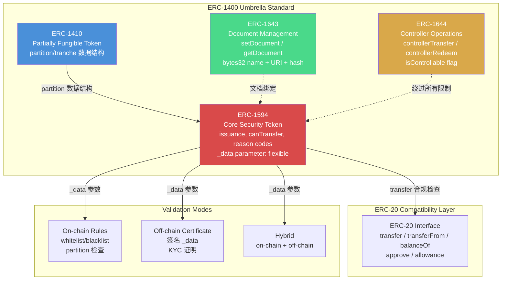
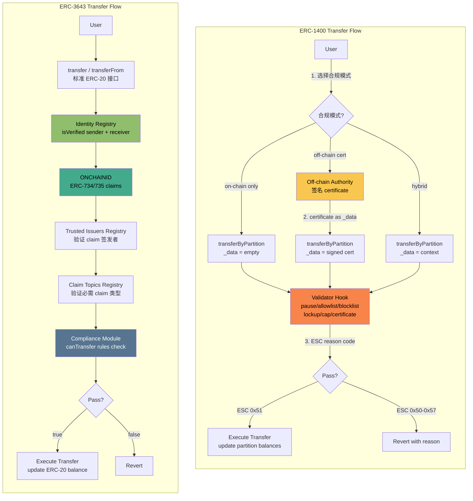
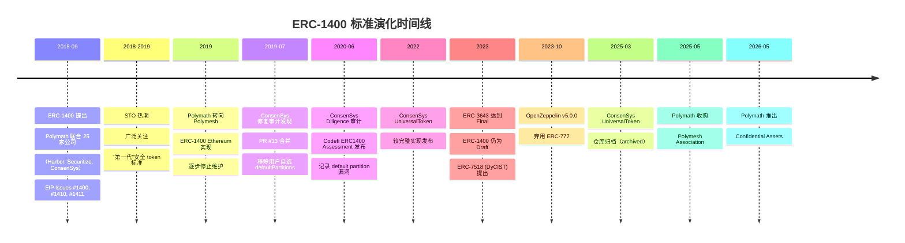

# ERC-1400 系列标准分析

## Executive Summary

ERC-1400 是 2018 年由 Polymath 联合 25 家公司提出的模块化安全 token 框架，由四个独立子标准组成：ERC-1410（partition/tranche 架构）、ERC-1594（transfer 限制与 reason codes）、ERC-1643（文档管理）、ERC-1644（controller 强制操作）。作为"第一代"安全 token 标准的代表，ERC-1400 引入了 partition 数据结构和链上文档管理等创新设计，但始终未达到 ERC Final 状态。

**核心设计哲学差异**：ERC-1400 采用 **asset-centric**（partition 建模资产结构）+ **operator-flexible**（`_data` 参数支持 on-chain 规则、off-chain certificate 或 hybrid 模式）的设计；ERC-3643 采用 **identity-centric**（ONCHAINID 建模持有者身份）+ **on-chain-centric**（全链上合规验证）的设计。两者在相同的应用层 Solidity 架构下，选择了不同的合规建模维度。

**当前状态**：ERC-1400 作为标准已被 ERC-3643 在生态位上取代。Polymath 已转向 Polymesh 专用链（official-doc），ConsenSys UniversalToken 仓库于 2025 年 3 月归档（github-confirmed），Securitize 采用自有协议栈和多链策略（inferred，具体协议栈细节未经官方技术文档确认）。但 ERC-1400 的设计遗产仍在延续——ERC-7518 (DyCIST) 继承了 partition 思想，Polymath 从应用层到协议层的转向与 B20/TIP-20 的设计选择形成呼应。

本文基于 WHI-177（compliance-token-landscape）建立的 8 类合规能力 Taxonomy 和 7 维度评估框架，从 ERC-1400 自身视角深入分析其设计选择、trade-off 和演化教训，不重复 landscape 已覆盖的横向对比。

---

## 1. ERC-1400 模块化子标准架构

ERC-1400 不是一个单一标准，而是一个 umbrella standard，由四个独立提出的子标准组成。这种模块化设计允许开发者按需选择子标准，但也导致了集成复杂度高和实现碎片化的问题。

### 1.1 ERC-1410: Partially Fungible Token — Partition 架构

ERC-1410 是 ERC-1400 最具创新性的组件，引入了 **partition/tranche** 数据结构，实现同一 token 合约内同一地址下的代币按法律属性分组。

**核心数据结构**：

```solidity
// 嵌套 mapping：address -> partition -> balance
mapping(address => mapping(bytes32 => uint256)) internal _balanceOfByPartition;

// 辅助数组：枚举用户持有的 partition
mapping(address => bytes32[]) internal _partitionsOf;

// partition key 示例
bytes32 constant LOCKED = keccak256("LOCKED");
bytes32 constant UNLOCKED = keccak256("UNLOCKED");
bytes32 constant REG_D_RESTRICTED = keccak256("REG_D_RESTRICTED");
```

**关键接口**（primary-source：[EIP Issue #1410](https://github.com/ethereum/EIPs/issues/1410)）：

| 函数 | 签名 | 描述 |
|------|------|------|
| `balanceOfByPartition` | `(bytes32 _partition, address _tokenHolder) -> uint256` | 查询特定 partition 余额 |
| `partitionsOf` | `(address _tokenHolder) -> bytes32[]` | 列举用户所有 partition |
| `transferByPartition` | `(bytes32 _partition, address _to, uint256 _value, bytes _data) -> bytes32` | partition-aware 转账，携带 `_data` |
| `operatorTransferByPartition` | `(bytes32 _partition, address _from, address _to, uint256 _value, bytes _data, bytes _operatorData) -> bytes32` | 操作者代理的 partition 转账 |

**双入口设计**：ERC-1410 同时支持两种 transfer 路径：
- `transferByPartition`：指定 partition，携带 `_data` 参数
- `transfer`（继承自 ERC-20）：操作默认 partition（default partition），不指定 `_data`

在 ConsenSys UniversalToken 实现中，ERC-20 `transfer` 调用 `_transferByDefaultPartitions`，后者调用 `_transferByPartition`，确保 ERC-20 路径也通过 partition 逻辑（github-confirmed：[ERC1400.sol](https://github.com/Consensys/UniversalToken/blob/master/contracts/ERC1400.sol)）。默认 partition 在 token 合约中统一配置（审计修复后不再允许持有者自行设置，见 Section 3.2 安全分析）。

**Gas 考量**（inferred）：
- 每个新 partition 交互需 SSTORE（~20,000 gas 写入新 slot）+ `_partitionsOf` 数组 push
- `balanceOf`（ERC-20 兼容）需遍历所有 partition 累加余额
- 复杂 cap table（多 partition）场景下 Gas 开销显著高于平面 ERC-20 mapping

**Partition 的应用场景**：
- Vesting schedule：`VESTING_CLIFF` / `VESTING_LINEAR` 分别管理不同释放规则
- 监管分类：`REG_D` / `REG_S` / `REG_CF` 按美国证券法豁免类型分组
- 资本结构：不同 share class、优先级、投票权的代币分组

> **证据分类**：sub_standard_interface | primary-source（EIP Issue #1410）+ github-confirmed（ConsenSys UniversalToken）

### 1.2 ERC-1594: Core Security Token — 发行控制与 Transfer 验证

ERC-1594 提供安全 token 的核心生命周期管理接口，包括发行验证、transfer 限制和 reason code 反馈。

**关键接口**（primary-source：[EIP Issue #1594](https://github.com/ethereum/EIPs/issues/1594)）：

| 函数 | 签名 | 描述 |
|------|------|------|
| `transferWithData` | `(address _to, uint256 _value, bytes _data)` | 携带 `_data` 的转账 |
| `transferFromWithData` | `(address _from, address _to, uint256 _value, bytes _data)` | 携带 `_data` 的代理转账 |
| `isIssuable` | `() -> bool` | 发行是否终止（设为 false 后不可逆） |
| `issue` | `(address _tokenHolder, uint256 _value, bytes _data)` | 发行新代币 |
| `redeem` | `(uint256 _value, bytes _data)` | 赎回/销毁 |
| `canTransfer` | `(address _to, uint256 _value, bytes _data) -> (byte, bytes32)` | 验证 transfer 是否合法，返回 ESC reason code |

**`_data` 参数的灵活性**（对应 adversarial caveat #1）：

ERC-1594 的 `_data` 参数设计为**实现无关**的扩展点——标准规范使用 "MAY" 语言描述 off-chain 签名数据注入，并非强制要求（primary-source：EIP Issue #1594 原文 "implementations MAY require signed data to be passed into a transfer transaction"）。实际使用模式包括：

1. **Off-chain certificate 模式**：合规服务器 off-chain 签名 permission certificate，用户将签名作为 `_data` 传入，合约链上验证签名。这是 ConsenSys UniversalToken 等实现采用的主要模式。
2. **On-chain rules 模式**：`_data` 可为空或携带链上可解析的上下文信息，合规逻辑完全在链上执行。
3. **Hybrid 模式**：结合链上 whitelist/blacklist 检查和 off-chain 签名验证。

这种灵活性是有意的设计选择——ERC-1594 旨在为安全 token 提供通用框架，而非强制特定合规实现。但 `_data` 格式的非标准化也是其最大弱点：不同实现对 `_data` 的编码/解码方式不同，导致跨实现互操作困难。

**Reason Code 机制**：

`canTransfer` 返回基于 [EIP-1066](https://eips.ethereum.org/EIPS/eip-1066) 的 ESC (Ethereum Status Code)，提供结构化的 transfer 失败原因。

| ESC Code (byte) | 含义 |
|-----------------|------|
| `0x50` | Transfer failure |
| `0x51` | Transfer success |
| `0x52` | Insufficient balance |
| `0x53` | Insufficient allowance |
| `0x54` | Transfers halted (paused) |
| `0x55` | Funds locked (in partition with lock) |
| `0x56` | Invalid sender |
| `0x57` | Invalid receiver |

这是 ERC-1400 相对于 ERC-3643 的一个设计优点——ERC-3643 的 Compliance Module `canTransfer` 通常返回 bool，transfer 失败时 DApp 需解析 revert data 获取失败原因，开发体验较差。

**`isIssuable()` 不可逆标志**：一旦设为 `false`，`issue` 和 `issueByPartition` 永久失效。这为 token 提供了"总量上限"的链上承诺，适用于发行完成后需要冻结 supply 的场景。

> **证据分类**：sub_standard_interface | primary-source（EIP Issue #1594）

### 1.3 ERC-1643: Document Management — 链上文档关联

ERC-1643 提供 token 合约到法律文档的链上绑定机制，是 ERC-1400 相对于其他安全 token 标准的独有功能。

**关键接口**（primary-source：[EIP Issue #1643](https://github.com/ethereum/EIPs/issues/1643)）：

| 函数 | 签名 | 描述 |
|------|------|------|
| `getDocument` | `(bytes32 _name) -> (string, bytes32, uint256)` | 返回 URI + documentHash + timestamp |
| `setDocument` | `(bytes32 _name, string _uri, bytes32 _documentHash)` | 设置/更新文档 |
| `removeDocument` | `(bytes32 _name)` | 移除文档 |
| `getAllDocuments` | `() -> bytes32[]` | 列举所有文档名 |

**设计原理**：安全 token 通常关联法律文档——招股说明书、合规证书、投资备忘录、公司章程等。ERC-1643 通过 `bytes32 name` + `URI` + `documentHash` 三元组实现链上绑定：URI 指向文档存储位置（IPFS/HTTP），hash 允许链下验证文档完整性。timestamp 记录最后更新时间。

**与其他标准的对比**：
- ERC-3643：无原生文档管理功能
- CMTAT：v3.0.0 集成了 ERC-1643 文档管理接口（third-party-analysis：[CMTA comparison 2025](https://cmta.ch/news-articles/a-comparison-of-different-security-token-standards-2025)），说明 ERC-1643 的设计理念仍被认可
- B20/TIP-20：协议层方案有 Metadata role 但无文档管理

**局限性**：仅存储 URI 和 hash，不存储文档内容；文档可用性依赖 off-chain 存储；`setDocument` 权限控制依赖具体实现（通常限于 owner/controller）。

> **证据分类**：sub_standard_interface | primary-source（EIP Issue #1643）

### 1.4 ERC-1644: Controller Token Operation — 强制转移

ERC-1644 为监管执行提供"最终手段"——允许 controller 地址绕过所有 transfer 限制执行强制操作。

**关键接口**（primary-source：[EIP Issue #1644](https://github.com/ethereum/EIPs/issues/1644)）：

| 函数 | 签名 | 描述 |
|------|------|------|
| `isControllable` | `() -> bool` | controller 功能是否启用 |
| `controllerTransfer` | `(address _from, address _to, uint256 _value, bytes _data, bytes _operatorData)` | 强制转移 |
| `controllerRedeem` | `(address _tokenHolder, uint256 _value, bytes _data, bytes _operatorData)` | 强制赎回/销毁 |

**"God Mode" 设计的安全考量**：

ERC-1644 的 controller 是所有安全 token 标准中控制力最集中的设计。controller 可以：
- 在任何时候从任何地址强制转移任意数量的代币
- 强制赎回/销毁任何持有者的代币
- 绕过所有 transfer 限制和 partition 约束

这种设计满足了法律要求（法院命令的资产冻结/转移、密钥丢失的恢复），但创造了极高的攻击面。安全审计普遍建议（third-party-analysis：[QuillAudits ERC-1400 analysis](https://www.quillaudits.com/research/rwa-development/relevant-standards/erc-1400-token-standard)）：
- controller 必须为多签合约（Gnosis Safe），不应为 EOA
- 应实施 48 小时 timelock 延迟
- 治理稳定后应调用 `isControllable = false` 永久禁用

**与 ERC-3643 Agent role 的对比**：ERC-3643 将发行方权限分散到 Agent role（freeze/forced transfer/recovery 分别授权），不存在单一全权 controller。B20 采用 7-role RBAC（DefaultAdmin/Mint/Burn/BurnBlocked/Pause/Unpause/Metadata），权限粒度更细。TIP-20 采用 ISSUER/PAUSE/UNPAUSE/BURN_BLOCKED 四角色模型。ERC-1644 的 controller 集中度在所有标准中最高。

Oraclizer Research 指出 ERC-1644 的 `controllerTransfer` 无法区分六类监管操作——FREEZE、SEIZE、CONFISCATE、LIQUIDATE、RESTRICT、RECOVER——它们在法律上有不同的授权要求和执行条件，但在 ERC-1644 中都通过同一个 `controllerTransfer` 执行（third-party-analysis：[Oraclizer Research, 2026-03](https://research.oraclizer.io/dissecting-erc-1400-and-erc-3643-the-technical-case-for-a-new-standard/)）。

> **证据分类**：sub_standard_interface + security_risk | primary-source（EIP Issue #1644）+ third-party-analysis（QuillAudits, Oraclizer）

### 1.5 子标准协作与模块化架构

### diag-1: ERC-1400 模块化子标准关系图



四个子标准的协作关系：ERC-1410 提供 partition 数据结构基础 -> ERC-1594 在此基础上实现 transfer 验证和发行控制 -> ERC-1643 为 token 合约附加法律文档引用 -> ERC-1644 提供绕过所有限制的监管执行手段。ERC-20 兼容层通过默认 partition 路由实现 backward compatibility。

子标准独立提出的设计既是优势（按需选择）也是弱点（集成复杂、跨标准依赖关系不够清晰）。在实践中，大多数 ERC-1400 部署会同时使用全部四个子标准。

---

## 2. 合规机制与 Transfer 流程

### 2.1 ERC-1594 `_data` 参数的合规模式谱系

ERC-1594 的 `_data` 参数是 ERC-1400 合规架构的扩展点，标准规范有意将其设计为实现无关（primary-source：EIP Issue #1594 原文 "allows security tokens to more flexibly implement transfer restrictions without depending on on-chain whitelists exclusively"）。实际实现形成三种合规模式：

**模式一：Off-chain Certificate（实现模式，非标准强制）**

ConsenSys UniversalToken 的 `ERC1400TokensValidator` 实现了 certificate-based 验证：off-chain 合规服务器签名 permission certificate，用户将签名作为 `_data` 传入 `transferWithData` 或 `transferByPartition`，链上 validator 验证签名有效性和 nonce（github-confirmed：[ERC1400TokensValidator.sol](https://github.com/ConsenSys/UniversalToken/blob/4206fcb7fec12f4eee216aaf2bc030c2c58763a7/contracts/extensions/tokenExtensions/ERC1400TokensValidator.sol)）。

此模式的特征：
- 合规决策逻辑在链下执行，链上仅验证密码学授权
- 每次 transfer 需与 off-chain 服务交互获取新 certificate
- `_data` 编码格式由各实现自定义——ConsenSys 使用特定的 certificate 编码，其他实现可能完全不同

**模式二：On-chain Rules**

`_data` 为空或不使用，合规检查完全依赖链上逻辑。实现可在 `canTransfer` / validator hook 中检查链上 whitelist/blacklist、partition 状态、锁定期等。ERC-1594 标准明确支持此模式——"on-chain restriction checking with error signalling" 是其三大核心能力之一（primary-source：EIP Issue #1594）。

**模式三：Hybrid**

结合链上 whitelist/blacklist 检查和 off-chain certificate 验证。ConsenSys UniversalToken 的 validator 实际上支持多种验证策略——certificate、allowlist、blocklist、pause、lock-up periods、investor caps——通过 token extension 机制组合使用（github-confirmed：[README.md](https://github.com/ConsenSys/UniversalToken/blob/master/README.md)）。

**`_data` 非标准化的代价**：

无论采用哪种模式，`_data` 的格式由各实现自定义。这意味着：
- 不同 ERC-1400 实现之间的 token 无法互操作（ConsenSys 的 certificate 格式与 Polymath 的不同）
- DApp 和 DEX 无法编写通用的 ERC-1400 transfer 逻辑
- 审计难度增加——每个实现的 `_data` 处理逻辑需单独审计

### 2.2 Transfer 流程详解

**ERC-1400 Transfer 流程**（以 ConsenSys UniversalToken 为例）：

```
1. User 调用 transferByPartition(partition, to, amount, data)
   ├── 或 transfer(to, amount) → _transferByDefaultPartitions → _transferByPartition
2. _transferByPartition 内部：
   ├── 2a. 检查 from 在该 partition 的余额 >= amount
   ├── 2b. 调用 validator hook (ERC1400TokensValidator)
   │   ├── 检查 paused 状态
   │   ├── 检查 allowlist/blocklist
   │   ├── 检查 lock-up period
   │   ├── 检查 investor cap
   │   └── [如果 certificate 模式] 验证 _data 中的签名
   ├── 2c. 调用 ERC-1820 sender hook (tokensToTransferByPartition)
   ├── 2d. 更新 _balanceOfByPartition[from][partition] 和 [to][partition]
   │   └── 如果 to 在该 partition 的余额从 0 变为正，push 到 _partitionsOf[to]
   ├── 2e. 调用 ERC-1820 recipient hook (tokensReceivedByPartition)
   └── 2f. 发出 TransferByPartition 事件
3. 返回目标 partition（可能因 data 中的 flag 而改变）
```

**分区变更约定**：当 `_data` 以 flag `0xffffffffffffffffffffffffffffffffffffffffffffffffffffffffffffffff` 开头时，后续 32 字节指定目标 partition。这允许在一次 transfer 中从一个 partition 转移到另一个 partition（github-confirmed：ConsenSys UniversalToken 源码注释）。

### 2.3 与 ERC-3643 Transfer 流程的根本差异

### diag-2: ERC-1400 vs ERC-3643 Transfer 流程对比图



**关键差异分析**：

| 维度 | ERC-1400 | ERC-3643 |
|------|----------|----------|
| **合规决策位置** | 灵活：可 on-chain、off-chain 或 hybrid | 全链上：Identity Registry + Compliance Module |
| **合规数据来源** | `_data` 参数（格式非标准化） | ONCHAINID claims（标准化 ERC-734/735） |
| **活性依赖** | certificate 模式依赖 off-chain 服务可用性 | 无外部依赖（claims 已预存在链上） |
| **透明性** | on-chain 部分可审计；off-chain 部分不透明 | 全链上可审计 |
| **灵活性** | off-chain 逻辑可任意复杂且易更新 | Compliance Module 升级需部署新合约 |
| **互操作性** | `_data` 非标准化破坏跨实现互操作 | 标准接口利于生态集成 |
| **失败反馈** | ESC reason code（结构化） | 通常 bool + revert data |

**核心洞察**：ERC-1400 的灵活性是一把双刃剑。标准规范有意避免强制特定合规模式，给予实现最大自由度。但这种自由度也意味着没有"ERC-1400 token"的一致行为预期——两个 ERC-1400 token 可能使用完全不同的合规逻辑和 `_data` 格式。ERC-3643 通过强制 ONCHAINID + Identity Registry + Compliance Module 架构，牺牲灵活性换取一致性和互操作性。

> **证据分类**：compliance_flow | primary-source（EIP Issues #1594, #1410）+ github-confirmed（ConsenSys UniversalToken）

---

## 3. ERC-20 Fallback 安全风险分析

### 3.1 风险定性：已验证的 Implementation/Integration Hazard

ERC-1400 为保持 ERC-20 backward compatibility，同时暴露两套 transfer 接口：`transferByPartition`（partition-aware）和 `transfer/transferFrom`（ERC-20 标准接口）。这引入了一个 **implementation/integration 层面的安全风险**——如果实现不正确地处理 ERC-20 路径上的合规检查，合规控制可能被绕过。

**重要定性**：这不是 ERC-1400 标准本身的"universal bypass"——ERC-1594 要求 `canTransfer` 覆盖空 `_data` 场景，标准的 ERC-20 兼容性设计意图是通过默认 partition 路由所有 ERC-20 调用。但 ConsenSys Diligence 2020 年审计发现（见 3.2），即使在路由机制正确实现的情况下，default partition 的选择机制本身也可构成攻击面。因此，此风险是 **已验证的 implementation/integration hazard**——有审计证据支撑，而非仅为理论分析。

### 3.2 审计证据：ConsenSys Codefi ERC1400 Default Partition 漏洞

ConsenSys UniversalToken（Codefi ERC1400 实现）是 ERC-1400 最完整的开源实现，也是 default partition 路由模式的主要实例。其 ERC-20 `transfer` 路由机制如下（github-confirmed）：

```
ERC-20 transfer(to, amount)
  → ERC1400ERC20._transferByDefaultPartitions(msg.sender, msg.sender, to, amount, "")
    → ERC1410._transferByPartition(defaultPartition, operator, from, to, amount, "", "")
      → validator hook 检查
```

**ConsenSys Diligence 审计发现（2020-06 发布）**：

ConsenSys Diligence 对 Codefi ERC1400 实现的安全审计（审计 commit `f6de24d`，Daniel Luca 主审，10 人日）发现了一个 **critical 级别的安全问题**：ERC-1410 的 `setDefaultPartitions` 函数允许 token 持有者**自行选择**默认 partition（primary-source：[Codefi ERC1400 Assessment, ConsenSys Diligence, 2020-06](https://consensys.net/diligence/audits/2020/06/codefi-erc1400-assessment/)）。

**攻击路径**：
1. Token 发行方为不同 partition 设置了不同的 whitelist 限制（如 `REG_D` partition 仅限 accredited investors）
2. 持有者调用 `setDefaultPartitions` 将默认 partition 设为一个无 whitelist 限制或限制较宽松的 partition
3. 持有者通过 ERC-20 `transfer()` 转账——代币从其自选的默认 partition 转出
4. ERC-20 路径上的唯一检查是接收方是否在 whitelist 中（且审计指出注释和错误消息暗示 whitelist 原本应同时适用于发送方和接收方）
5. 结果：partition 级别的合规控制被绕过

**审计建议的缓解方案**（编号沿用审计报告原始编号）：
1. 确保 whitelist 中的接收方仅为实现了 partition 限制的合约（通过 ERC-777 receiving hook 检查源 partition 并拒绝不当转账），且要求发送方和接收方均在 whitelist 中
2. 将 ERC-20 转出分离为独立的标准 ERC-20 token（ERC-1400 转出时执行 partition 限制，获得 ERC-20 token 后自由转账）
4. **不允许持有者自行设置默认 partition**，由 token 合约指定一个统一的、无限制的 partition 用于所有 ERC-20 转账

**修复状态**：ConsenSys 团队选择了方案 1 + 方案 4 的组合，在 [PR #13](https://github.com/Consensys/UniversalToken/pull/13)（2019-07-05 合并）中修复：移除了持有者自选默认 partition 的能力，改为 token 级统一默认 partition 配置；同时要求发送方和接收方均在 whitelist 中（github-confirmed）。修复后的 `_transferByDefaultPartitions` 使用 token 合约配置的统一 partition，持有者无法更改。

**关键洞察**：ConsenSys Codefi 实现同时是 default partition 路由模式的主要实例**和**该模式安全风险的审计证据。这一审计发现证明：即使在实现了 partition 路由的 ERC-1400 合约中，如果 default partition 选择机制设计不当（如允许用户自选），ERC-20 路径仍然是一个 **已验证的攻击面**。修复后的实现通过限制 partition 选择权有效缓解了此问题，但这也证实了 ERC-1400 标准本身未对 ERC-20 路径的安全处理提供充分约束——安全性完全依赖实现质量。

### 3.3 扩展风险场景

ConsenSys Diligence 审计提供了 default partition 选择漏洞的直接证据。此外，以下场景进一步扩展了 ERC-20 fallback 的风险面：

**场景一：不完整实现（无 partition 路由）**

如果 ERC-1400 实现仅在 `transferByPartition` 中添加合规检查，但未 override ERC-20 `transfer/transferFrom` 以路由到 partition 逻辑，则 ERC-20 路径完全无保护。由于 ERC-1400 标准本身不强制特定 `transfer` 实现（各子标准独立提出），不同实现的安全质量参差不齐。这一风险比 default partition 漏洞更为基础——在 ConsenSys 实现中至少存在路由机制，而不完整实现中连路由都没有。

**场景二：DeFi 集成风险**

DeFi 协议（DEX、lending）通常通过标准 ERC-20 接口与 token 交互。即使 ERC-1400 实现正确路由了 ERC-20 calls：
- 合规检查可能阻止 DeFi 合约地址的 transfer（合约地址可能不在 whitelist 中）
- 合规失败导致的 revert 可能不被 DeFi 协议正确处理
- 如果使用 certificate 模式，DeFi 协议无法提供 off-chain `_data`

这不是"绕过"而是"不兼容"——但对用户来说效果类似：ERC-1400 token 在 permissionless DeFi 中可能无法正常交易。

**场景三：Approved Controllable TransferFrom (ACT)**

通过已授权但合规状态已变更的 spender 路由 `transferFrom`。如果实现未在 `transferFrom` 中重新验证 spender 和 owner 的当前合规状态（而非仅检查 allowance），则过期合规状态下的 transfer 仍可执行（third-party-analysis：[Zealynx ERC-1400 security analysis](https://www.zealynx.io/blogs/erc1400-compliance)）。

**场景四：Partition 隔离突破**

`transferByPartition` 中的验证逻辑不充分可能允许跨 partition 转移（如从 `LOCKED` 到 `UNLOCKED`），破坏 partition 设计的语义完整性。正确实现需在 `canTransferByPartition` 中严格校验源 partition 和目标 partition 的合法性。ERC-1410 的 partition 变更 flag（`0xfff...fff` 前缀）如果使用不当，可能被利用进行非授权的 partition 间转移。

### diag-3: ERC-20 Fallback 风险图

```mermaid
graph TB
    subgraph "ConsenSys Codefi（审计前：用户可选 partition）"
        T_PRE[ERC-20 transfer] --> DP_PRE[_transferByDefaultPartitions]
        DP_PRE --> SD[setDefaultPartitions<br/>持有者自选默认 partition]
        SD --> TP_PRE[_transferByPartition<br/>用户选择的 partition]
        TP_PRE --> WL_PRE[仅检查接收方 whitelist<br/>不检查 partition 级限制]
        WL_PRE --> EX_PRE[Execute<br/>partition 级合规被绕过]
    end

    subgraph "ConsenSys Codefi（修复后：统一 partition）"
        T_POST[ERC-20 transfer] --> DP_POST[_transferByDefaultPartitions]
        DP_POST --> TP_POST[_transferByPartition<br/>token 级统一默认 partition]
        TP_POST --> WL_POST[检查发送方 + 接收方 whitelist<br/>+ validator hook]
        WL_POST --> |"pass"| EX_POST[Execute]
        WL_POST --> |"fail"| RV_POST[Revert]
    end

    subgraph "不完整实现（无 partition 路由）"
        T_BAD[ERC-20 transfer] --> |"未 override"| DIRECT[直接 ERC-20 逻辑<br/>无合规检查]
        DIRECT --> EX2[Execute<br/>合规控制被完全绕过]
    end

    style SD fill:#e63946,color:#fff
    style EX_PRE fill:#e63946,color:#fff
    style DIRECT fill:#e63946,color:#fff
    style EX2 fill:#e63946,color:#fff
    style WL_POST fill:#90be6d,color:#000
```



### 3.4 与 ERC-3643 的设计对比

ERC-3643 从架构层面避免了 ERC-20 fallback 风险：`transfer` 和 `transferFrom` 在 Token Contract 中直接内置 Identity Registry + Compliance Module 检查。不存在"受保护入口"和"未受保护入口"的区分——所有 transfer 路径一致经过合规验证。

这是 ERC-3643 的 **identity-centric** 设计相对于 ERC-1400 的 **partition-centric** 设计的结构性安全优势。ERC-3643 的合规检查绑定在身份层（"who are you?"），而非资产层（"which partition?"），因此无论通过哪个接口发起 transfer，身份验证都不可绕过。

**根因分析**：ERC-1400 的安全风险根源不在 ERC-20 兼容性本身，而在标准碎片化——四个独立子标准没有强制统一的合规检查入口。ERC-1594 的 `canTransfer` 应该是统一入口，但由于子标准独立性，具体如何将 ERC-20 调用路由到 `canTransfer` 由各实现自行决定。ConsenSys Diligence 审计证明，即使实现了路由机制，路由目标（default partition）的选择逻辑本身也可被利用。

### 3.5 小结

ERC-20 fallback 安全风险是一个 **已验证的 implementation/integration hazard**，有 ConsenSys Diligence 审计的直接证据支撑。风险的核心不在于 ERC-20 兼容性概念本身，而在于：(1) ERC-1400 标准未对 ERC-20 路径的安全处理提供强制约束；(2) default partition 选择机制如果设计不当（如允许用户自选），会创建已验证的攻击面；(3) 不同实现的安全质量参差不齐。ConsenSys 的修复（PR #13）通过限制 partition 选择权有效缓解了特定攻击向量，但 ERC-1400 生态中其他实现的安全状态未知。

> **证据分类**：security_risk | primary-source（[ConsenSys Diligence Codefi ERC1400 Assessment, 2020-06](https://consensys.net/diligence/audits/2020/06/codefi-erc1400-assessment/)）+ github-confirmed（[ConsenSys/UniversalToken PR #13](https://github.com/Consensys/UniversalToken/pull/13)）+ third-party-analysis（Zealynx, QuillAudits）

---

## 4. ERC-1400 vs ERC-3643 差异化分析（基于统一 Taxonomy）

基于 WHI-177（compliance-token-landscape final.md）建立的 8 类合规能力 Taxonomy 和 7 维度评估框架，从 ERC-1400 视角分析其设计选择的 trade-off。

### 4.1 合规能力 Taxonomy 深度对比

| 能力类别 | ERC-1400 设计选择 | 评级 | 与 ERC-3643 的关键差异 |
|---------|-----------------|------|---------------------|
| **Identity / KYC** | 无原生链上身份；通过 `_data` 参数注入 off-chain 合规证明，或使用 on-chain whitelist。无标准化身份合约 | **弱** | ERC-3643 通过 ONCHAINID（ERC-734/735）提供 self-sovereign 链上身份；claims 由 Trusted Issuers 签发并链上存储。ERC-1400 的 identity 完全由实现定义 |
| **Transfer Policy** | ERC-1594 `canTransfer` + ERC-1410 partition-level 控制；ESC reason codes 提供结构化反馈；`_data` 支持灵活的验证模式 | **中** | ERC-3643 使用可插拔 Compliance Module（独立合约，可升级）。ERC-1400 通过 partition 分组实现差异化控制——同一 token 的不同 partition 可有不同规则 |
| **Issuer Controls** | ERC-1644 controllerTransfer/controllerRedeem（最强单点控制力）；`isIssuable()` 不可逆发行终止；`isControllable()` 标志 | **强（但风险最高）** | ERC-3643 Agent role 更细粒度；B20 7-role RBAC 最平衡。ERC-1644 controller 权限过度集中，是反面教材 |
| **Sanctions / Blacklist** | 无标准级专门机制；依赖 validator hook 实现 blocklist（implementation-dependent） | **弱** | ERC-3643 通过 Identity Registry revoke + Compliance Module blacklist 实现标准化制裁合规。B20/TIP-20 有原生 BLOCKLIST policy + BurnBlocked role |
| **Recovery** | controllerTransfer 可从任何地址强制转移（最强恢复能力，但权限过于集中） | **强（附带风险）** | ERC-3643 通过 Agent forced transfer + ONCHAINID 密钥轮转。ERC-1400 的 controller 恢复能力最强但安全风险最高 |
| **Legal Document / Metadata** | **ERC-1643 完整文档管理**（setDocument/getDocument/removeDocument/getAllDocuments） | **强（独有优势）** | **ERC-1400 在此维度独有优势**——ERC-3643 无原生文档管理；CMTAT v3.0.0 采纳了 ERC-1643 接口；B20 仅有 Metadata role（name/symbol） |
| **Payment Reconciliation** | `_data` 可传支付引用（非标准化，实现依赖） | **弱** | 两个应用层标准都弱于协议层方案。TIP-20 的 32-byte memo + Payment Lanes + ISO 4217 远超两者 |
| **Auditability / Privacy** | 链上操作可审计；off-chain certificate 模式下合规决策过程不可审计 | **中（混合）** | ERC-3643 全链上更可审计。ERC-1400 在 on-chain rules 模式下审计能力与 ERC-3643 相当，但 certificate 模式下 off-chain 部分不透明 |

### 4.2 评估维度对比

| 维度 | ERC-1400 | 与 ERC-3643 对比判断 | 证据来源 |
|------|----------|-------------------|---------|
| **架构层级** | 应用层 Solidity | 相同层级，不同设计哲学 | primary-source |
| **合规机制** | Flexible：on-chain / off-chain cert / hybrid | ERC-3643 全链上更透明一致；ERC-1400 更灵活但互操作性差 | primary-source (EIP #1594) |
| **身份模型** | 无原生身份；operator/implementation dependent | ERC-3643 self-sovereign（ONCHAINID）更先进、更标准化 | primary-source |
| **DeFi 可组合性** | 受限：partition 非标准概念，`_data` 依赖，DeFi 协议不感知 partition | 两者都受限于合规检查与 permissionless DeFi 的张力。ERC-3643 的 ERC-20 兼容性稍好（无 partition 复杂度） | inferred |
| **发行方控制力** | Controller "God Mode"（ERC-1644）：最强单点控制 | ERC-3643 Agent role 更细粒度、更安全。ERC-1400 极端集中度是反面教训 | primary-source |
| **Gas 开销** | 中-高：partition 存储（SSTORE）+ 辅助数组维护 + 余额遍历 | ERC-3643 高（多合约跨调用：Token -> Identity Registry -> ONCHAINID -> Compliance Module）。两者都显著高于 ERC-20 | inferred |
| **规范成熟度** | **Draft/Proposal 2018（从未达到 Final）** | ERC-3643 Final 2023——成熟度差距不可逆。ERC-1400 生态系统已停滞 | primary-source |

### 4.3 核心设计哲学差异

| 维度 | ERC-1400 | ERC-3643 |
|------|----------|----------|
| **核心建模对象** | **资产结构**（partition/tranche） | **持有者身份**（ONCHAINID） |
| **合规决策位置** | 灵活（可 on-chain 或 off-chain） | 强制链上（Identity Registry + Compliance Module） |
| **设计哲学** | Asset-centric + Operator-flexible | Identity-centric + On-chain-centric |
| **一致性** | 低（各实现行为可能不同） | 高（标准强制统一架构） |
| **灵活性** | 高（`_data` + partition 组合） | 中（Compliance Module 可插拔但架构固定） |
| **互操作性** | 差（`_data` 非标准化） | 好（标准化接口） |

**核心洞察**：ERC-1400 和 ERC-3643 对"什么是安全 token 合规的核心问题"给出了不同答案。ERC-1400 认为核心是"资产应该如何分类和管理"（partition 架构），ERC-3643 认为核心是"谁有权持有和转让"（identity 架构）。从监管合规的角度看，ERC-3643 的 identity-centric 方法更直接回应了 KYC/AML 要求——大多数合规问题归结为"这个人是否有资格参与这笔交易"，而非"这个代币属于哪个分类"。

> **证据分类**：taxonomy_capability + evaluation_dimension | primary-source + WHI-177 框架基准

---

## 5. 历史地位、采用现状与演化路径

### 5.1 ERC-1400 时间线

### diag-4: ERC-1400 演化时间线



### 5.2 采用现状评估

| 项目/实现 | 当前状态 | 与 ERC-1400 关系 | 证据来源 |
|----------|---------|----------------|---------|
| **Polymath** | Active（转向 Polymesh） | 原始提出者，已完全离开 ERC-1400。2025 年 5 月完成 Polymesh Association 收购，推进 Polymesh Asset Standard（协议层原生标准）。2026 年 5 月推出 Confidential Assets（协议层隐私功能）。约 $100M 代币化房地产通过 Polymesh | official-doc：[Polymath PR, 2025-05](https://info.polymath.network/news/polymath-acquires-polymesh-labs-to-unify-blockchain-and-platform-infrastructure-for-institutional-tokenization)；[Polymesh Confidential Assets, 2026-05](https://www.prnewswire.com/news-releases/polymath-launches-confidential-assets-on-polymesh-bringing-institutional-grade-privacy-to-tokenization-302782428.html) |
| **Securitize** | Active（市场领导者） | 早期 ERC-1400 参与者之一，现使用自有协议栈和多链策略。AUM $4B+；与 NYSE 合作代币化证券；SEC 注册 broker-dealer + transfer agent + ATS；EU DLT Pilot 授权 | AUM/NYSE/SEC 注册：official-doc（[Securitize Q1 2026 Results](https://www.prnewswire.com/news-releases/securitize-reports-first-quarter-2026-results-302777848.html)；[NYSE partnership, 2026-03](https://ir.theice.com/press/news-details/2026/New-York-Stock-Exchange-and-Securitize-Agree-to-Memorandum-of-Understanding-to-Support-Tokenized-Securities/default.aspx)）；协议栈细节（DS Protocol + ERC-20 + 多链）：inferred（基于公开资料综合推断，无单一官方技术文档详述完整协议栈） |
| **ConsenSys UniversalToken** | Archived（2025-03-25） | 最完整的开源 ERC-1400 实现。仓库已归档为只读。2020 年 ConsenSys Diligence 审计发现 default partition 安全漏洞并已修复（PR #13）。关联产品 Codefi Assets 的当前状态未知 | github-confirmed：[GitHub repo archived](https://github.com/ConsenSys/UniversalToken)；primary-source：[ConsenSys Diligence Codefi ERC1400 Assessment](https://consensys.net/diligence/audits/2020/06/codefi-erc1400-assessment/) |
| **ERC-1400 EIP 状态** | Draft/Proposal（从未 finalize） | 子标准（ERC-1410/1594/1643/1644）停留在 EIP Issue/Discussion 阶段，从未进入 ERC Draft -> Review -> Final 流程 | primary-source：[EIP Issues](https://github.com/ethereum/EIPs/issues/1411) |
| **ERC-777 依赖** | Deprecated | OpenZeppelin v5.0.0（2023-10）弃用 ERC-777 实现，原因包括 reentrancy 风险和 hook abuse。ERC-1400 的 sender/recipient hooks 继承自 ERC-777 设计 | primary-source：[OpenZeppelin issue #2620](https://github.com/OpenZeppelin/openzeppelin-contracts/issues/2620) |

**"40% of 31 regulatory requirements" 来源说明**：此数据来自 Oraclizer Research（2026 年 3 月发表），其方法论为分析 15 个全球金融监管机构的要求，提炼出 31 项核心监管要求，其中 25 项可在区块链上实现。Oraclizer 评估 ERC-1400 仅满足约 40% 的这些要求。**证据分类：third-party-analysis**——这是一个第三方研究机构的分析结论，其具体评估方法论未经独立验证。Oraclizer 同时在提出其自有标准 ERC-TRUST，可能存在利益冲突。本文引用此数据作为行业视角参考，不作为权威结论。来源：[Oraclizer Research, 2026-03](https://research.oraclizer.io/dissecting-erc-1400-and-erc-3643-the-technical-case-for-a-new-standard/)。

### 5.3 设计遗产与思想传承

ERC-1400 虽然作为标准已事实衰落，但其设计思想在多个方向上被继承和发展：

**Partition 思想 → ERC-7518 (DyCIST)**

ERC-7518（Dynamic Compliant Interoperable Security Token，由 Zoniqx 提出，2023-09）继承了 ERC-1400 的 partition 概念，但选择 ERC-1155 而非 ERC-20 作为基础（primary-source：[EIP-7518](https://eips.ethereum.org/EIPS/eip-7518)）：

| 设计维度 | ERC-1410 (ERC-1400) | ERC-7518 (DyCIST) |
|---------|--------------------|--------------------|
| 基础标准 | ERC-20 扩展 | ERC-1155 扩展 |
| Partition 表示 | `bytes32` key + 嵌套 mapping | `tokenId` 即 partition |
| Gas 效率 | 需维护辅助数组 `userPartitions` | ERC-1155 原生 multi-token 支持，无额外数组 |
| 跨链支持 | 无 | 原生跨链互操作设计 |
| 合规模式 | `_data` 非标准化 | Dynamic compliance + voucher-based |
| 标准状态 | Draft (2018，从未 finalize) | Draft (2023，活跃开发) |

ERC-7518 保留了 partition 的核心价值（同一合约内不同权利/限制的代币分组），同时解决了 ERC-1410 的 Gas 效率问题和跨链限制。这表明 partition 作为概念仍有价值，但 ERC-1400 的具体实现路径已不再适用。

**文档管理 → CMTAT 集成**

CMTAT（Capital Markets and Technology Association Token）v3.0.0 集成了 ERC-1643 文档管理接口（third-party-analysis：[CMTA comparison 2025](https://cmta.ch/news-articles/a-comparison-of-different-security-token-standards-2025)）。CMTAT 是瑞士银行和金融机构广泛采用的代币化标准，由 CMTA 维护，Taurus 等公司使用。CMTAT 对 ERC-1643 的采纳说明链上文档关联理念仍被认可——即使 ERC-1400 整体已衰落，ERC-1643 作为独立功能模块仍有生命力。

**Reason Codes → 行业影响**

ERC-1594 的 ESC reason code 设计影响了后续标准对 transfer 失败反馈的思考。ERC-3643 的 Compliance Module 虽然通常返回 bool，但社区讨论中多次提到需要更丰富的失败原因反馈——这正是 ERC-1594 率先解决的问题。

**Controller 模型 → 反面教训**

ERC-1644 的"God Mode"controller 被后续标准视为过度中心化的设计反面教训：
- ERC-3643 采用 Agent role 更细粒度的权限模型（不同操作分别授权）
- B20 采用 7-role RBAC（DefaultAdmin/Mint/Burn/BurnBlocked/Pause/Unpause/Metadata），并设计了 `renounceLastAdmin` 永久放弃机制
- TIP-20 采用 ISSUER/PAUSE/UNPAUSE/BURN_BLOCKED 四角色模型
- Oraclizer 提出的 ERC-TRUST 将 `controllerTransfer` 细分为 FREEZE/SEIZE/CONFISCATE/LIQUIDATE/RESTRICT/RECOVER 六种独立操作

**应用层 → 协议层转向**

Polymath 从 ERC-1400（EVM 应用层 Solidity）到 Polymesh（专用链协议层原生标准）的转向，是合规 Token 标准演化方向的缩影：

- Polymath 认识到"通用 EVM + 应用层合规"的局限性——Gas 开销、实现碎片化、标准化困难——因此选择构建专用链嵌入合规逻辑（official-doc：[Polymesh Origin Story](https://polymesh.network/origin-story)）
- 这与 Base B20（EVM L2 precompile）、Tempo TIP-20（独立 L1 precompile）、Circle Arc（专用 L1）的设计选择形成呼应
- 共同趋势：复杂合规逻辑需要协议层支持才能实现高效率、强一致性和不可绕过的执行保证

### 5.4 核心判断

ERC-1400 是合规 Token 标准历史上的重要先驱。它首次系统性地提出了安全 token 需要的功能集——partition 资产分组、链上文档管理、强制转移、结构化 reason codes——为后续标准的设计提供了参考框架。

但 ERC-1400 作为标准本身已无法恢复生命力，原因是结构性的：
1. **标准碎片化**：四个独立子标准缺乏强制统一的合规入口
2. **`_data` 非标准化**：互操作性的致命伤
3. **ERC-777 过时依赖**：安全库弃用带来维护风险
4. **生态系统断裂**：三个主要利益方（Polymath、Securitize、ConsenSys）全部转向其他路径
5. **竞争标准 finalize**：ERC-3643 在 2023 年达到 Final 状态，占据了"EVM 合规 token 标准"的生态位

ERC-1400 的失败教训对标准设计者有持久价值：灵活性过度（标准不强制关键行为）会导致互操作性崩塌；模块化需要强协调（独立子标准需要统一入口）；合规建模应以身份而非资产为中心（大多数监管要求关注"who"而非"what"）。

> **证据分类**：adoption_evidence + design_legacy | official-doc + github-confirmed + third-party-analysis

---

## Source Coverage

| Req | Status | Sources |
|-----|--------|---------|
| **src-1** (official_standard, >=3) | **covered** | [EIP Issue #1411 (ERC-1400)](https://github.com/ethereum/EIPs/issues/1411)、[EIP Issue #1410 (ERC-1410)](https://github.com/ethereum/EIPs/issues/1410)、[EIP Issue #1594](https://github.com/ethereum/EIPs/issues/1594)、[Polymath ERC-1400 官方页面](https://www.polymath.network/erc-1400)、[Polymath 博客: Evolution of a Security Token Standard](https://blog.polymath.network/erc-1400-evolution-of-a-security-token-standard-1e25d12b9261) |
| **src-2** (implementation, >=2) | **covered** | [ConsenSys UniversalToken GitHub](https://github.com/ConsenSys/UniversalToken)（archived 2025-03-25）、[ERC1400.sol 源码](https://github.com/Consensys/UniversalToken/blob/master/contracts/ERC1400.sol)、[ERC1400TokensValidator.sol](https://github.com/ConsenSys/UniversalToken/blob/4206fcb7fec12f4eee216aaf2bc030c2c58763a7/contracts/extensions/tokenExtensions/ERC1400TokensValidator.sol)、[ConsenSys/UniversalToken PR #13（审计修复）](https://github.com/Consensys/UniversalToken/pull/13) |
| **src-3** (comparison_analysis, >=3) | **covered** | [Tokeny ERC-3643 vs ERC-1400](https://tokeny.com/erc3643-vs-erc1400/)、[Taurus CMTAT vs ERC-1400 vs ERC-3643](https://www.taurushq.com/blog/security-token-standards-compared-cmtat-solidity-code-vs-erc-1400-vs-erc-3643/)、[CMTA comparison 2025](https://cmta.ch/news-articles/a-comparison-of-different-security-token-standards-2025)、[NYALA 对比分析](https://www.nyala.de/en/blog/erc-3643-vs-erc-1400-and-why-we-believe-in-the-former)、[Zealynx RWA 安全分析](https://www.zealynx.io/blogs/rwa-security) |
| **src-4** (security_analysis, >=2) | **covered** | [ConsenSys Diligence Codefi ERC1400 Assessment, 2020-06](https://consensys.net/diligence/audits/2020/06/codefi-erc1400-assessment/)（**primary-source: 审计报告，记录 default partition 绕过漏洞和修复**）、[ConsenSys/UniversalToken PR #13（审计修复，2019-07-05 合并）](https://github.com/Consensys/UniversalToken/pull/13)、[QuillAudits ERC-1400 analysis](https://www.quillaudits.com/research/rwa-development/relevant-standards/erc-1400-token-standard)、[Zealynx ERC-1400 security analysis](https://www.zealynx.io/blogs/erc1400-compliance) |
| **src-5** (ecosystem_status, >=2) | **covered** | [Polymath 收购 Polymesh Association, 2025-05](https://info.polymath.network/news/polymath-acquires-polymesh-labs-to-unify-blockchain-and-platform-infrastructure-for-institutional-tokenization)、[Polymath Confidential Assets, 2026-05](https://www.prnewswire.com/news-releases/polymath-launches-confidential-assets-on-polymesh-bringing-institutional-grade-privacy-to-tokenization-302782428.html)、[Securitize Q1 2026](https://www.prnewswire.com/news-releases/securitize-reports-first-quarter-2026-results-302777848.html)、[ConsenSys UniversalToken archived](https://github.com/ConsenSys/UniversalToken) |
| **src-6** (successor_standard, >=2) | **covered** | [EIP-7518 (DyCIST)](https://eips.ethereum.org/EIPS/eip-7518)、[Zoniqx DyCIST 文档](https://www.zoniqx.com/product/dycist)、[Zoniqx: Why ERC-7518 Is the Next Step](https://www.zoniqx.com/resources/tokenization-standards-erc-20-erc-721-erc-1400-and-why-erc-7518-is-the-next-step) |
| **src-7** (landscape_reference, >=1) | **covered** | WHI-177 compliance-token-landscape final.md（本项目已有产出，commit 008e66b on main） |

## Gap Analysis

| Gap | Severity | Mitigation |
|-----|----------|------------|
| **ERC-1400 Gas 量化数据** | low | 无公开 benchmark 对比 ERC-1400 vs ERC-20 Gas 开销。定性分析基于 partition 存储结构（SSTORE + array push）和余额遍历。标注为 "inferred"。 |
| **Securitize 协议栈技术细节** | low | Securitize 使用自有协议栈，具体技术实现非公开。DS Protocol + ERC-20 + 多链策略的描述基于公开资料综合推断，标注为 "inferred"。AUM/NYSE/SEC 注册信息保持 "official-doc"。 |
| **"40% of 31 requirements" 独立验证** | medium | Oraclizer Research 的评估方法论未经独立验证，且 Oraclizer 同时推广自有标准（ERC-TRUST），可能存在利益冲突。明确标注为 "third-party-analysis" 并说明局限性。 |
| **ConsenSys UniversalToken 的实际部署数量** | low | 仓库已归档，无公开的部署统计。Codefi Assets 平台的当前状态和使用 UniversalToken 的项目数量未知。ConsenSys Diligence 审计确认了实现质量，但部署规模不明。 |

## Revision Log

| Round | Action | Description |
|-------|--------|-------------|
| 1 | initial_draft | Full deep draft from approved outline (00cbab8, round 1). 5 items, 8 fields, 4 diagrams, 7 source requirements. Applied 3 adversarial caveats: (1) ERC-1594 `_data` flexibility — distinguished standard spec (on-chain/off-chain/hybrid all supported) from implementation patterns (certificate is one pattern, not mandatory); (2) ERC-20 fallback framing — classified as implementation/integration hazard with ConsenSys UniversalToken as correct implementation example, not universal bypass; (3) source classification — all historical/adoption claims tagged with evidence type (official-doc/github-confirmed/third-party-analysis/inferred), including explicit caveat on "40% of 31 requirements" Oraclizer source. |
| 2 | revision | Targeted revision from adversarial draft review (Orchestrator Decision 8329df2a, major severity). Changes: **(1) Section 3 rewrite [MAJOR]** — Removed framing of ConsenSys UniversalToken as "correct implementation" (正确实现范例). Reframed ConsenSys/Codefi as both the primary instance of the default partition routing pattern AND audited evidence of the fallback/default-partition hazard. Added ConsenSys Diligence 2020 audit finding detail: `setDefaultPartitions` allowed holder-chosen default partitions, enabling bypass of partition-level whitelist restrictions (primary-source). Added fix details: PR #13 (merged 2019-07-05), remediation = remove user-selectable defaults + require sender+receiver whitelisting (github-confirmed). Distinguished pre-fix vs post-fix behavior. Updated diag-3 to show audit-before/after states. Added Section 3.5 conclusion: ERC-20 fallback is a demonstrated integration risk with audited evidence, not merely theoretical. Updated Section 1.1 forward-reference. Updated diag-4 timeline with audit/fix events. **(2) Securitize evidence [minor]** — DS Protocol + ERC-20 + multichain protocol stack description reclassified from official-doc to inferred; AUM/NYSE/SEC data remains official-doc. Updated Gap Analysis and Source Coverage accordingly. |
