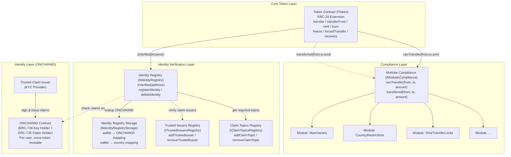
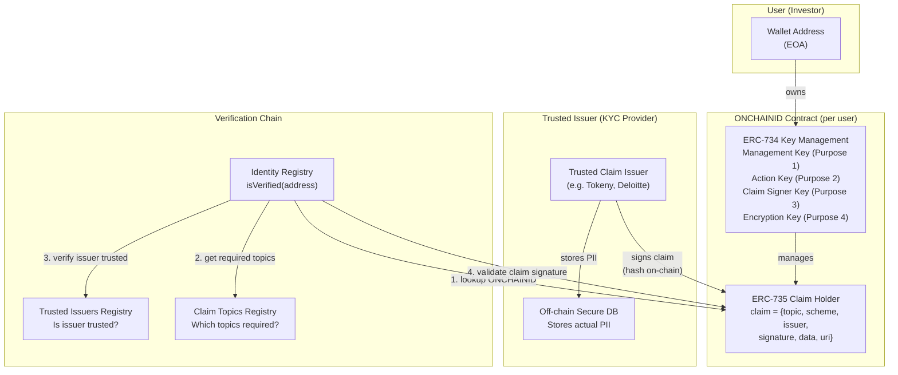
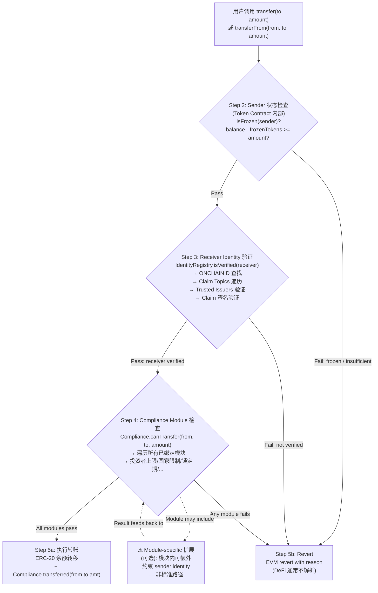
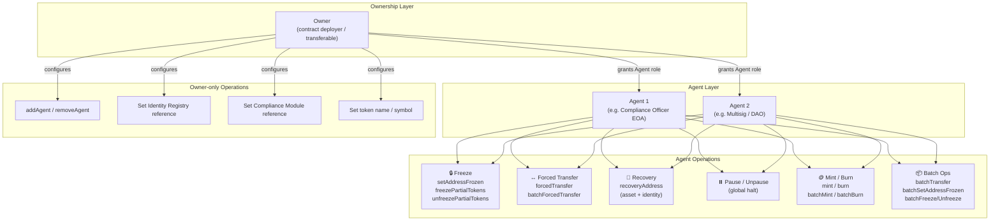
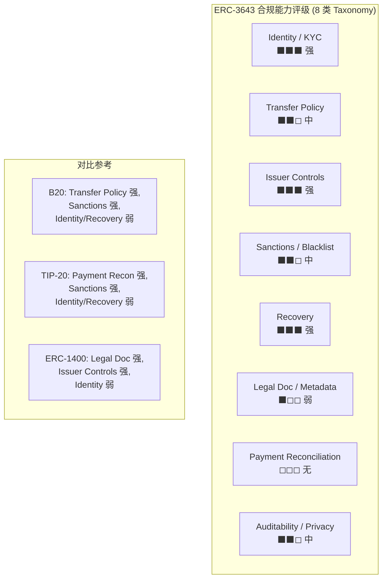
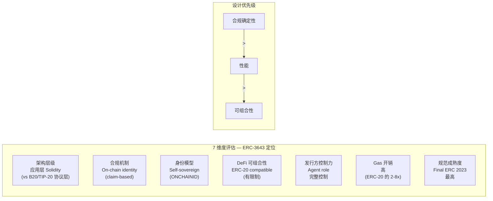

# ERC-3643 (T-REX) 深度分析

## Executive Summary

ERC-3643（T-REX，Token for Regulated EXchanges）是目前唯一达到 Ethereum Final 状态的合规代币标准（2023 年 12 月批准）。由卢森堡 Tokeny Solutions 开发，通过 6 个核心 Solidity 智能合约协同工作——Token Contract、Identity Registry、Identity Registry Storage、Trusted Issuers Registry、Claim Topics Registry 和 Modular Compliance——在 EVM 应用层实现"非合规转账架构级不可能"的设计目标。

其核心机制包含三个层次：(1) ONCHAINID 去中心化身份（基于 ERC-734/735），提供 claim-based 身份验证，每用户独立合约跨 token 复用；(2) Transfer 合规检查——标准路径中 sender 仅检查 balance/freeze 状态，receiver 通过 `IdentityRegistry.isVerified()` 验证身份，Compliance Module 执行可插拔业务规则；(3) Agent role 行政控制——freeze（含 partial）、forced transfer、recovery、pause、batch operations。

截至 2025 年底，ERC-3643 已代币化超 $32B 资产，覆盖 180+ 司法管辖区，ERC-3643 Association 拥有 92+ 机构成员（含 DTCC、Apex Group、Invesco、Deloitte、Fireblocks、OpenZeppelin）。监管层面，DTC 在 no-action 请求中引用 ERC-3643 作为合规感知协议示例（2025 年 12 月，SEC 工作人员授予有限的三年期 no-action relief），SEC 主席 Atkins 在 "Project Crypto" 演讲（2025 年 7 月 31 日）中在 innovation exemption 拟议条件下将其作为合规特性代币标准示例点名——两者均不构成 SEC 对 ERC-3643 的正式批准或背书（G2 适用）。Chainlink ACE（2025 年 6 月 30 日）、Fasanara FAST 货币市场基金、ABN AMRO 绿色债券等关键集成验证了该标准的机构适用性。

在 WHI-177 建立的 8 类合规能力 Taxonomy 中，ERC-3643 在 Identity/KYC、Issuer Controls 和 Recovery 三个类别表现突出，Transfer Policy 和 Sanctions/Blacklist 为中等，Legal Document/Metadata 和 Payment Reconciliation 为弱/无。在 7 维度评估框架中，其定位为：应用层 Solidity 架构、claim-based on-chain identity、self-sovereign 身份模型、ERC-20 兼容（有限制）、Agent role 完整控制、高 Gas 开销（ERC-20 的 2-8x）、最高规范成熟度（唯一 Final ERC）。设计优先级：合规确定性 > 性能 > 可组合性。

## Regulatory Scope Guardrails

> **G1 — EU 监管框架分离**：EU 代币化证券（STO）受 **MiFID II、Prospectus Regulation、CSDR 和 DLT Pilot Regime（EU 2022/858）**规制。MiCA（EU 2023/1114）Article 2 明确排除构成金融工具的加密资产，其适用范围为非金融工具加密资产（ART/EMT/CASP）。本文涉及 EU 代币化证券法律时以 DLT Pilot / MiFID II / Prospectus / CSDR 为主要来源。
>
> **G2 — DTC no-action letter 措辞限定**：DTC 在其 no-action 请求中将 ERC-3643 引用为合规感知协议示例之一；SEC 工作人员（2025 年 12 月）就该 DTC 事实模式授予了有限的、事实限定的三年期 no-action relief；该回复不建立更广泛的法律结论。SEC 主席 Atkins 在 "Project Crypto" 演讲中在 innovation exemption 拟议条件下将 ERC-3643 作为合规特性代币标准的示例点名。两者均不构成 SEC 对 ERC-3643 的正式批准、认可或背书。

---

## 1. 标准概述与历史沿革

### 1.1 起源与命名

T-REX（Token for Regulated EXchanges）由 Tokeny Solutions（卢森堡）开发，定位为受监管交易所场景下的合规代币基础设施。Tokeny 创始人 Luc Falempin 主导标准设计和推广。EIP-3643 于 2021 年提交 Ethereum Improvement Proposal，2023 年 12 月达到 **Final** 状态——截至 2026 年中，ERC-3643 仍然是唯一达到 Final 的 Ethereum 合规代币标准。来源：[ERC-3643 EIP](https://eips.ethereum.org/EIPS/eip-3643)；[Tokeny ERC-3643 页面](https://tokeny.com/erc3643/)。

### 1.2 治理结构

**ERC-3643 Association** 是负责标准治理的非营利组织，总部位于卢森堡。截至 2025 年底，Association 拥有 92+ 机构成员，2025 年新增 24 名成员。成员按类别分布：

| 类别 | 代表机构 |
|------|----------|
| 金融基础设施 | DTCC、tZERO |
| 资管/基金服务 | Apex Group（收购 Tokeny）、Invesco、3iQ Corp、Kynthos Fund Services、Bolder Group |
| 审计/咨询 | Deloitte、Kaspersky、Hacken |
| 区块链基础设施 | Ava Labs、Hedera Foundation、Wormhole Foundation |
| 开发工具 | OpenZeppelin、Fireblocks、Halborn |
| 银行 | ABN AMRO |

来源：[ERC3643 Association 新成员公告](https://www.erc3643.org/news/erc3643-association-welcomes-24-new-members-to-advance-the-institutional-tokenization-standard)；[ERC3643.org](https://www.erc3643.org/)。

> **证据分类**：ecosystem_metric | secondary（Association 自我报告数据，含机构可验证名单）

### 1.3 关键里程碑

| 时间 | 里程碑 | 证据分类 |
|------|--------|----------|
| 2018 | T-REX v1 协议发布 | primary（Tokeny 白皮书 v4, 2023） |
| 2021 | EIP-3643 提交 | primary（[EIP-3643](https://eips.ethereum.org/EIPS/eip-3643)） |
| 2023 年 4 月 | Hacken 安全审计 T-REX v4.0，10/10 评分 | secondary（[Hacken/Tokeny 公告](https://tokeny.com/hacken-grants-tokenization-protocol-erc3643-a-10-10-security-audit-score/)） |
| 2023 年 12 月 | ERC-3643 达到 EIP Final 状态 | primary（[EIP-3643](https://eips.ethereum.org/EIPS/eip-3643)） |
| 2025 年 3 月 20 日 | DTCC 加入 ERC-3643 Association，承诺 ComposerX 集成 | secondary（[DTCC 加入公告](https://crypto.news/dtcc-joins-erc-3643-association-to-advance-ethereum-based-tokenized-securities/)） |
| 2025 年 5 月 1 日 | 跨链 DvP 解决方案发布（LayerZero + Fasanara + ABN AMRO，Polygon + Base） | secondary（[ERC3643 Association 公告](https://www.erc3643.org/news/the-erc3643-association-announces-cross-chain-dvp-solutions-for-rwas-with-layerzero-tokeny-fasanara-and-abn-amro)） |
| 2025 年 6 月 30 日 | Chainlink ACE 发布，与 Apex Group、GLEIF、ERC-3643 Association 合作 | secondary（[PRNewswire 公告](https://www.prnewswire.com/news-releases/chainlink-launches-automated-compliance-engine-in-collaboration-with-apex-group-gleif-and-erc-3643-association-302494221.html)） |
| 2025 年 7 月 31 日 | SEC 主席 Atkins "Project Crypto" 演讲在 innovation exemption 拟议条件下点名 ERC-3643（G2） | primary（[Atkins 演讲全文](https://www.sec.gov/newsroom/speeches-statements/atkins-digital-finance-revolution-073125)） |
| 2025 年 12 月 11 日 | DTC no-action letter，SEC 工作人员就 DTC 事实模式授予三年期有限 relief（G2） | primary（[DTC no-action letter PDF](https://www.sec.gov/files/tm/no-action/dtc-nal-121125.pdf)） |
| 进行中 | 西班牙 ISO TC 307 / TC 68 提交 New Work Item Proposal (NWIP) | secondary（[ERC3643 Association ISO 公告](https://www.erc3643.org/news/iso-standardization-initiative-for-the-t-rex-erc-3643-permissioned-tokens)） |

### 1.4 与先前标准的关系

| 标准 | 状态 | 与 ERC-3643 的关系 |
|------|------|-------------------|
| **ERC-1400** | Draft（从未 finalize） | 2018 年 Polymath 提出的模块化证券代币框架。采用 partition/tranche 架构偏离标准 ERC-20，导致 DeFi 集成困难。ERC-3643 选择保持 ERC-20 接口一致性并在 transfer 内嵌合规检查 |
| **ERC-1404** | Draft | 最小化 transfer restriction 标准。仅提供 `detectTransferRestriction` 和 `messageForTransferRestriction`，无身份系统、无发行方控制、无合规模块 |
| **ERC-20** | Final | ERC-3643 的基础。Token Contract 继承完整 ERC-20 接口，在同一函数签名内添加条件检查 |

来源：[EIP-3643](https://eips.ethereum.org/EIPS/eip-3643)；[Polymath ERC-1400](https://www.polymath.network/erc-1400)。

---

## 2. 核心组件架构深度分析

### 2.1 Token Contract（IToken）

Token Contract 是 ERC-3643 系统的入口，继承完整的 ERC-20 接口（`transfer`、`transferFrom`、`approve`、`allowance`、`balanceOf`、`totalSupply`），同时在 `transfer` 和 `transferFrom` 内嵌入合规检查逻辑。

**核心方法**：
- `transfer(to, amount)` / `transferFrom(from, to, amount)` — 重写 ERC-20 transfer，内嵌合规检查（详见 item-4）
- `forcedTransfer(from, to, amount)` — Agent 专用，绕过 `canTransfer` 预检查和 sender 余额/冻结限制，但仍要求 receiver 通过 `isVerified(_to)` 身份验证，且转账后调用 `Compliance.transferred()` 记录变动
- `mint(to, amount)` / `burn(account, amount)` — Agent 发行/销毁
- `setAddressFrozen(address, bool)` — 冻结/解冻地址
- `freezePartialTokens(address, amount)` / `unfreezePartialTokens(address, amount)` — 部分冻结
- `pause()` / `unpause()` — 全局暂停
- `recoveryAddress(lostWallet, newWallet, investorONCHAINID)` — 钱包恢复

**依赖关系**：Token Contract 持有 Identity Registry 和 Compliance Module 的合约引用，在每次 transfer 中调用两者。

来源：[ERC-3643 EIP Specification](https://eips.ethereum.org/EIPS/eip-3643)；[T-REX GitHub](https://github.com/ERC-3643/ERC-3643)。

> **证据分类**：architecture_component | primary-source（EIP spec + reference implementation code）

### 2.2 Identity Registry（IIdentityRegistry）

建立 wallet address 到 ONCHAINID 合约的映射关系，是 transfer 流程中身份验证的核心组件。

**核心方法**：
- `isVerified(address)` — 检查目标地址是否拥有合规 ONCHAINID 且所需 claims 有效。内部逻辑：(a) 查找地址关联的 ONCHAINID 合约，(b) 遍历 Claim Topics Registry 获取 token 要求的 claim topics，(c) 对每个 topic 遍历 Trusted Issuers Registry 验证 ONCHAINID 上是否有合法 issuer 签发的有效 claim
- `registerIdentity(address, identity, country)` — 注册新身份映射
- `deleteIdentity(address)` — 删除身份映射
- `updateIdentity(address, identity)` — 更新 ONCHAINID 引用
- `updateCountry(address, country)` — 更新投资者国家/地区代码

来源：[ERC-3643 EIP — IIdentityRegistry](https://eips.ethereum.org/EIPS/eip-3643)。

### 2.3 Identity Registry Storage（IIdentityRegistryStorage）

将身份数据存储与逻辑分离的架构设计。存储层维护 wallet -> ONCHAINID 和 wallet -> country 的持久映射，Identity Registry 合约引用 Storage 合约进行读写。这种分离允许升级 Identity Registry 逻辑合约而不丢失已注册的身份映射数据。

来源：[ERC-3643 EIP — IIdentityRegistryStorage](https://eips.ethereum.org/EIPS/eip-3643)。

### 2.4 Trusted Issuers Registry（ITrustedIssuersRegistry）

维护被 Token Owner/Agent 授权的 KYC/claim 提供者地址列表。仅由此注册表中的 issuer 签发的 claims 被系统接受。

**核心方法**：
- `addTrustedIssuer(issuer, claimTopics)` — 添加受信 issuer 及其可签发的 topic 类型
- `removeTrustedIssuer(issuer)` — 移除 issuer 信任
- `updateIssuerClaimTopics(issuer, claimTopics)` — 更新 issuer 可签发的 topics
- `isTrustedIssuer(issuer)` — 查询 issuer 信任状态
- `getTrustedIssuerClaimTopics(issuer)` — 获取 issuer 授权 topics

**信任假设**：系统安全性依赖此注册表的正确配置。如果不当 issuer 被信任（可签发虚假 claims 绕过验证）或合法 issuer 被移除（导致合规投资者无法通过验证），会导致身份验证失效。Issuer 的选择权集中在 Token Owner/Agent。

来源：[ERC-3643 EIP — ITrustedIssuersRegistry](https://eips.ethereum.org/EIPS/eip-3643)。

### 2.5 Claim Topics Registry（IClaimTopicsRegistry）

定义每个 token 所需的 claim 类型（topic ID）。不同 token 可要求不同的 claim topics，允许灵活配置身份验证要求。

**核心方法**：
- `addClaimTopic(topicId)` — 添加必需 claim topic
- `removeClaimTopic(topicId)` — 移除 claim topic 要求
- `getClaimTopics()` — 获取所有必需 topics

来源：[ERC-3643 EIP — IClaimTopicsRegistry](https://eips.ethereum.org/EIPS/eip-3643)。

### 2.6 Modular Compliance（IModularCompliance）

可插拔合规规则引擎，独立于 Token Contract 升级。支持添加/移除合规模块（compliance modules），每个模块实现特定业务规则。

**核心方法**：
- `canTransfer(from, to, amount)` — 检查转账是否满足所有已绑定模块的规则。遍历所有模块，任一模块返回 false 则整笔交易失败
- `transferred(from, to, amount)` — 转账成功后的回调，更新模块内部状态（如持有者计数、持有量统计）
- `addModule(module)` / `removeModule(module)` — 添加/移除合规模块
- `bindToken(token)` / `unbindToken(token)` — 绑定/解绑 token

**模块示例**：
- 投资者上限模块（MaxOwnersByCountry）：限制特定国家/地区的投资者数量
- 持有量限制模块（MaxBalance）：限制单地址最大持有量
- 锁定期模块（TimeTransferLimits）：时间窗口内转账数量限制
- 国家/地区限制模块（CountryRestrictions）：允许/禁止特定国家投资者参与
- 认证要求模块：要求特定认证状态（如 accredited investor）

来源：[ERC-3643 EIP — IModularCompliance](https://eips.ethereum.org/EIPS/eip-3643)；[T-REX GitHub compliance modules](https://github.com/ERC-3643/ERC-3643)。

> **证据分类**：architecture_component | primary-source（EIP spec）+ secondary（reference implementation examples）

### 2.7 合约间依赖拓扑

### diag-1: ERC-3643 完整架构图



---

## 3. ONCHAINID 去中心化身份体系

### 3.1 ERC-734/735 基础

ONCHAINID 基于两个 Ethereum 标准构建：

- **ERC-734（Key Holder）**：定义多密钥管理框架。支持四种密钥类型——management keys（合约管理）、action keys（操作执行）、claim signer keys（claim 签名）、encryption keys（加密）。密钥轮转不影响 claim 有效性，用户可在不重新 KYC 的情况下更新密钥
- **ERC-735（Claim Holder）**：定义 claim 存储和验证接口。每个用户部署独立的 ONCHAINID 合约，该合约可跨多个 token 复用——一次 KYC 验证可同时满足多个 ERC-3643 token 的身份要求

来源：[ONCHAINID 文档 — How does it work?](https://docs.onchainid.com/docs/concepts/howItWorks/)；[ONCHAINID 概念介绍](https://docs.onchainid.com/docs/concepts/intro/)。

### 3.2 Claim 结构

Claim 是 ONCHAINID 身份系统的核心数据单元。每个 claim 包含以下字段：

```
claim = {
  topic,      // uint256 — claim 类型标识（如 KYC 状态、认证等级、国籍）
  scheme,     // uint256 — 验证方案
  issuer,     // address — 签发 claim 的 Trusted Issuer 地址
  signature,  // bytes   — issuer 对 claim 内容的签名
  data,       // bytes   — claim 数据
  uri         // string  — 外部数据引用
}
```

**隐私保护的三层区分**：

**(a) 协议层（ERC-735 接口）**：`bytes data` 和 `string uri` 字段在协议层不阻止 PII 上链。ERC-735 标准本身不施加任何密码学约束来防止 PII 被直接写入 `data` 字段。

**(b) 实现层（Tokeny 参考实现）**：ONCHAINID 官方文档明确推荐链上仅存 claim hash/引用、off-chain 存储实际 PII 的隐私模式。文档指出："To respect privacy, sensitive claim data cannot be publicly stored on the blockchain. A Trusted Claim Issuer should store the data they checked in a secured off-chain database, and refer to this data in the added claim. To ensure compliance, a hash of this data should also be stored with the claim added to the Identity."（来源：[ONCHAINID 文档](https://docs.onchainid.com/docs/concepts/howItWorks/)）

**(c) 部署层**：实际隐私取决于 Claim Issuer 的实现选择。文档进一步警告：当 claim 数据属于有限枚举集合（如性别、国家、年龄范围）时，简单 hash 不足以保护隐私——攻击者可遍历枚举集暴力匹配。此时需要对数据拼接 salt 后再 hash："when the claim is related to data that is part of an exhaustive list of possibilities (e.g., gender, country of residence, age, ...), the hash is not enough to keep the data private as it is pretty easy to find the private data by iterating on a limited list of possibilities — hence, in this case, it is important to hash a concatenation of this data with a salt."（来源同上）

> **证据分类**：identity_model | primary-source（ERC-735 interface spec）+ secondary（ONCHAINID 官方文档确认隐私设计为实现层最佳实践）

### 3.3 密钥管理

ONCHAINID 支持多密钥架构：

| 密钥类型 | 用途 | ERC-734 Key Purpose |
|---------|------|-------------------|
| Management Key | 管理 ONCHAINID 合约（添加/移除密钥和 claims） | Purpose 1 |
| Action Key | 执行操作（签署交易） | Purpose 2 |
| Claim Signer Key | 签发 claims（用于 Trusted Issuer） | Purpose 3 |
| Encryption Key | 加密通信 | Purpose 4 |

密钥轮转是 ONCHAINID 的关键优势之一：投资者可更换密钥而不影响已有 claims 的有效性，不需要重新进行 KYC 流程。这与传统 EOA 模型形成对比——EOA 地址与私钥绑定，密钥泄露意味着身份丢失。

### 3.4 信任假设分析

ONCHAINID 的安全模型建立在以下信任假设之上：

1. **Trusted Issuer 诚信**：系统信任 Trusted Issuers Registry 中列出的 issuer 会正确验证身份信息。如果 issuer 被攻破或作恶，可签发虚假 claims 绕过验证
2. **Issuer 选择权集中**：哪些 issuer 被信任由 Token Owner/Agent 决定。这是一个中心化决策点
3. **Claim 有效性依赖 issuer 维护**：claim 可被 issuer 撤销（revoke），但系统不强制 issuer 主动撤销过期或不再有效的 claims
4. **Self-sovereign 的边界**：虽然用户"拥有"自己的 ONCHAINID 合约，但 claims 必须由第三方 issuer 签发，且 token 要求的 topics 由 Owner 定义——用户无法自行满足合规要求

### 3.5 与 wallet-level policy 的差异

| 维度 | ERC-3643 ONCHAINID | B20/TIP-20 Wallet-level Policy |
|------|-------------------|-----------------------------|
| **身份表达** | Claim-based，语义丰富（KYC 状态、认证类型、司法管辖、到期日等） | 二值判断（allowlist/blocklist），无语义 |
| **验证粒度** | 可按 claim topic 组合要求不同验证级别 | 地址级 in/out |
| **复用性** | 一个 ONCHAINID 跨多个 token 复用 | Policy 可跨 token 共享，但不携带身份语义 |
| **隐私** | Issuer 签名验证，链上不必存 PII（实现层最佳实践） | 链上仅存地址列表 |
| **链上开销** | 每次验证需读取 ONCHAINID 合约 + 遍历 claims | 单次 policy 查询 |
| **依赖** | 需部署和维护 ONCHAINID 合约 + Trusted Issuers | 仅需维护 policy registry |

### diag-3: ONCHAINID 身份体系图



---

## 4. Transfer 合规检查流程

### 4.1 标准 Transfer 路径

以下是 ERC-3643 标准 transfer 路径的完整还原（per ERC-3643 spec 和 Token.sol 参考实现）：

**Step 1 — 交易发起**：用户调用 `transfer(to, amount)` 或第三方通过 `transferFrom(from, to, amount)` 发起转账。Token Contract 拦截调用，进入合规检查流程。

**Step 2 — Sender 状态检查**：Token Contract 在合约内部检查 sender 的状态：
- `isFrozen(sender)` — 地址是否被整体冻结
- `getFrozenTokens(sender)` — 地址被冻结的 token 数量
- `balance - frozenTokens >= amount` — 可用余额是否充足

这一步**仅涉及 Token Contract 内部存储读取**，不调用 Identity Registry。Sender 侧不进行身份验证。

**Step 3 — Receiver Identity 验证**：Token Contract 调用 `IdentityRegistry.isVerified(receiver)`。**标准路径仅验证 receiver，不验证 sender identity**。Identity Registry 内部执行：
1. 查找 receiver 地址关联的 ONCHAINID 合约
2. 调用 Claim Topics Registry 获取该 token 要求的所有 claim topics
3. 对每个 required topic，遍历 Trusted Issuers Registry 中的 issuers
4. 验证 receiver 的 ONCHAINID 上是否有对应 topic 的、由 trusted issuer 签发的、有效的 claim

**Step 4 — Compliance Module 检查**：Token Contract 调用 `Compliance.canTransfer(from, to, amount)`。Modular Compliance 遍历所有已绑定的合规模块，执行业务规则检查（投资者上限、国家/地区限制、锁定期、最小/最大持有量等）。任一模块返回 false 则检查失败。

**Step 5 — 执行或 Revert**：
- **全部通过**：执行标准 ERC-20 余额转移，然后调用 `Compliance.transferred(from, to, amount)` 更新模块内部状态（如持有者计数）
- **任一检查失败**：整笔交易 revert（EVM revert，不是返回 false）

来源：[ERC-3643 EIP — Token interface](https://eips.ethereum.org/EIPS/eip-3643)；[T-REX Token.sol reference implementation](https://github.com/ERC-3643/ERC-3643)。

> **证据分类**：transfer_flow | primary-source（EIP spec + reference implementation code analysis）

### 4.2 Module-specific 扩展行为

部署的 Compliance Module 可以在 `canTransfer()` 内额外约束 sender identity/status（如要求 sender 也满足特定 claim 条件）。这属于**模块特定行为**，不是 ERC-3643 标准 transfer 路径的一部分。区分标准路径和模块扩展对理解 ERC-3643 的设计意图至关重要：标准选择了 receiver-only identity 验证作为默认路径，将 sender 侧扩展留给模块实现。

### 4.3 Revert 行为与 DeFi 影响

ERC-3643 transfer 失败时产生 EVM revert（带有合规相关的 revert reason），而非 ERC-20 风格的返回 false。影响：

- **DeFi 协议集成**：DEX（如 Uniswap）、借贷协议（如 Aave）通常不处理 ERC-3643 特定的 revert reason。用户获得通用的 "transaction failed" 错误消息而非具体的合规失败原因（如"receiver 未通过 KYC"或"超出国家投资者上限"）
- **用户体验**：失败交易仍消耗 Gas（直到 revert 点），且错误信息不友好
- **预检查机制**：ERC-3643 提供 `canTransfer()` view 函数供前端预检查，避免用户提交注定失败的交易。但这要求前端集成 ERC-3643 特定逻辑，增加集成复杂度

### diag-2: Transfer 合规检查流程图



---

## 5. Issuer Controls — Recovery、Freeze 与 Agent 机制

### 5.1 Agent Role 体系

ERC-3643 采用 EIP-173 Ownership + Agent 角色扩展的权限模型：

| 角色 | 权限范围 | 设置方式 |
|------|---------|---------|
| **Owner** | 标准配置：设置/移除 Agent、管理依赖合约引用（Identity Registry、Compliance Module 等）、修改 token name/symbol | 合约部署时设定，可转移 |
| **Agent** | 运营操作：mint、burn、freeze、forced transfer、recovery、pause | 由 Owner 通过 `addAgent(address)` 授权 |

一个 token 可以有多个 Agent，且 Agent 地址可以是 EOA 或合约（如多签钱包、DAO 合约）。

来源：[ERC-3643 EIP — AgentRole](https://eips.ethereum.org/EIPS/eip-3643)。

### 5.2 Freeze 机制

ERC-3643 提供两级冻结粒度：

**全地址冻结**：
- `setAddressFrozen(address, bool)` — 冻结/解冻整个地址。被冻结的地址不可通过标准 `transfer`/`transferFrom` 发送或接收 token——冻结同时阻止 sender 和 receiver 两个方向。行政路径（`forcedTransfer`、`mint`）可向冻结地址写入，但受各自的独立条件约束（如 `forcedTransfer` 仍要求 receiver 通过 `isVerified`）

**部分冻结**：
- `freezePartialTokens(address, amount)` — 冻结地址内指定数量的 token。被冻结 token 不可转账但保留在原地址。可用余额 = balance - frozenTokens
- `unfreezePartialTokens(address, amount)` — 解冻指定数量

部分冻结允许更精细的资产控制——例如仅冻结涉嫌问题的部分持仓，而非整个账户。

### 5.3 Forced Transfer

`forcedTransfer(from, to, amount)` — Agent 可执行强制转账，无需 sender 同意。典型用途：
- 法院命令执行
- 监管机构要求的资产转移
- 反洗钱资产追回
- 公司行为（如股票分割、合并、强制回购）

**绕过范围精确说明**（per `Token.sol` lines 431-445、`IToken.sol` lines 237-244）：`forcedTransfer` 绕过 `Compliance.canTransfer()` 预转账业务规则门控（投资者上限、国家限制、锁定期等），同时绕过 sender 的余额/冻结限制和 sender 同意要求。但它**不绕过**以下两个环节：(1) receiver 仍必须通过 `_tokenIdentityRegistry.isVerified(_to)` 身份验证——即使是 Agent 强制转账，也不能将 token 发送给未验证身份的地址；(2) 转账执行后仍调用 `_tokenCompliance.transferred(_from, _to, _amount)` 记录变动，确保 Compliance Module 的内部状态（如持有者计数）保持一致。换言之，`forcedTransfer` 绕过的是预转账业务规则门控，而非全部合规和身份验证。

### 5.4 Recovery

`recoveryAddress(lostWallet, newWallet, investorONCHAINID)` — 当投资者丢失钱包私钥时：
1. Agent 将 token 从旧钱包转移至新钱包
2. 同时更新 Identity Registry 映射（旧地址解绑、新地址绑定 ONCHAINID）
3. 链上保留 recovery 历史记录（`RecoverySuccess` 事件）

这是 ERC-3643 独特的 identity-level recovery——不仅恢复资产，还恢复身份关联。对比 B20/TIP-20 仅有 `burnBlocked`（可销毁被阻止账户的余额，但无法直接转移至新账户）。

### 5.5 Pause

`pause()` / `unpause()` — 全局暂停/恢复所有 token 操作（transfer、mint、burn）。用于紧急情况（如发现安全漏洞、重大市场事件）。暂停期间 Agent 仍可执行 `forcedTransfer`（receiver 仍需 `isVerified`）和 `recovery`。

### 5.6 Batch Operations

| 操作 | 方法 |
|------|------|
| 批量转账 | `batchTransfer(addresses[], amounts[])` |
| 批量强制转账 | `batchForcedTransfer(from[], to[], amounts[])` |
| 批量 Mint | `batchMint(addresses[], amounts[])` |
| 批量 Burn | `batchBurn(addresses[], amounts[])` |
| 批量冻结 | `batchSetAddressFrozen(addresses[], frozen[])` |
| 批量部分冻结 | `batchFreezePartialTokens(addresses[], amounts[])` |
| 批量部分解冻 | `batchUnfreezePartialTokens(addresses[], amounts[])` |

Batch operations 在单笔交易中处理多个操作，摊薄 Gas 成本。对发行方的日常运营（如分红、合规更新、大规模 freeze）尤为关键。

### 5.7 与其他标准的发行方控制对比

| 控制能力 | ERC-3643 | ERC-1400 (ERC-1644) | B20 | TIP-20 |
|---------|---------|--------------------|----|--------|
| Freeze (全地址) | ✓ | ✗ | ✓ (Pausable per-function) | ✓ (PAUSE role) |
| Freeze (部分) | ✓ (partial freeze) | ✗ | ✗ | ✗ |
| Forced Transfer | ✓ (forcedTransfer) | ✓ (controllerTransfer) | ✗ | ✗ |
| Recovery | ✓ (identity-level) | ✗ | ✗ | 有限 (TIP-1022) |
| Pause (全局) | ✓ | ✗ | ✓ (per-function) | ✓ |
| Batch Operations | ✓ (7 种 batch) | ✗ | ✗ | ✗ |
| Burn Blocked | ✗ (通过 forced transfer 实现) | ✗ | ✓ (BurnBlocked role) | ✓ (BURN_BLOCKED) |
| Supply Cap | ✗ (通过 Compliance Module) | ✗ | ✓ (原生) | ✗ |

来源：[ERC-3643 EIP](https://eips.ethereum.org/EIPS/eip-3643)；WHI-177 合规能力 Taxonomy。

### diag-4: Agent 控制权限图



---

## 6. ERC-20 兼容性与可升级架构

### 6.1 ERC-20 完全兼容

Token Contract 实现完整的 ERC-20 接口：

| ERC-20 方法 | ERC-3643 行为 |
|------------|-------------|
| `transfer(to, amount)` | 完整合规检查后执行 |
| `transferFrom(from, to, amount)` | 完整合规检查后执行 |
| `approve(spender, amount)` | 标准 ERC-20 approve，无额外检查 |
| `allowance(owner, spender)` | 标准 ERC-20 |
| `balanceOf(address)` | 返回总余额（含 frozen tokens） |
| `totalSupply()` | 标准 ERC-20 |
| `Transfer` / `Approval` 事件 | 标准 ERC-20 事件 |

任何支持 ERC-20 的钱包和工具（MetaMask、Etherscan、DeFi 协议）可识别 token 余额和基本信息。差异在于 `transfer`/`transferFrom` 内嵌合规检查——对外部调用者来说接口签名相同，但行为不同（可能 revert）。

### 6.2 "Conditional Transfer" 设计哲学

ERC-3643 的核心设计选择是：**不修改 ERC-20 接口签名，而是在同一接口内添加条件检查**。ERC-3643 Association 称之为 "non-compliant transfers are architecturally impossible"。

这与 ERC-1400 的策略形成对比：ERC-1400 引入 partition/tranche 概念和非标准接口（`transferByPartition`、`_data` 参数），虽然表达力更强（可区分不同法律属性的 token 子集），但严重破坏了 ERC-20 兼容性和 DeFi 互操作性。

### 6.3 UUPS Proxy（ERC-1822）与 Implementation Authority

T-REX 参考实现使用 UUPS（Universal Upgradeable Proxy Standard，ERC-1822）实现可升级性。与标准 UUPS 不同，T-REX 引入 **Implementation Authority** 模式：

- 标准 UUPS：proxy 直接存储实现合约地址
- T-REX UUPS：proxy 存储 **Implementation Authority** 合约地址。Implementation Authority 合约再指向实际的逻辑合约
- **优势**：多个 proxy 可共享同一 Implementation Authority，从而实现统一升级——只需更新 Implementation Authority 指向的逻辑合约，所有使用该 Authority 的 proxy 同时升级
- **用途**：发行方管理多个 token（如同一公司发行的多系列证券）时，可通过单次 Implementation Authority 更新升级所有 token

### 6.4 升级风险

proxy admin（通常是 Owner）拥有升级 Token 逻辑的权力——理论上可将 Token 实现替换为任意代码。这是所有 UUPS proxy 的固有风险，非 ERC-3643 特有。但在合规代币场景下风险放大：

- 投资者持有的是**受监管证券**，资产安全依赖 admin 诚信
- 恶意升级可绕过所有合规检查，甚至直接转移投资者资产
- 缓解策略：多签 admin、时间锁（Timelock）、升级提案公示期、第三方审计

来源：[ERC-3643 EIP](https://eips.ethereum.org/EIPS/eip-3643)；[ERC-1822 UUPS](https://eips.ethereum.org/EIPS/eip-1822)；[T-REX whitepaper v4](https://tokeny.com/wp-content/uploads/2023/05/ERC3643-Whitepaper-T-REX-v4.pdf)。

> **证据分类**：architecture_component | primary-source（EIP-1822）+ secondary（T-REX whitepaper Implementation Authority 描述）

---

## 7. 生态与机构采用

### 7.1 规模数据

| 指标 | 数值 | 来源 | 证据分类 |
|------|------|------|----------|
| 资产代币化总额 | $32B+ | ERC3643 Association 官方声称 | secondary（Association 自报，此前 2025 年 3 月报 $28B，增长曲线可信但无独立审计） |
| 司法管辖区覆盖 | 180+ | ERC3643 Association 官方声称 | secondary（Association 自报，从 2018 年起持续使用此数字） |
| Association 成员数 | 92+ | [ERC3643.org](https://www.erc3643.org/) | secondary（成员列表公开可查） |
| 2025 年新增成员 | 24 | [新成员公告](https://www.erc3643.org/news/erc3643-association-welcomes-24-new-members-to-advance-the-institutional-tokenization-standard) | secondary |
| 链上 token 数量 | 40+ | 行业报告（截至 2025 年 3 月） | secondary |

> **数据口径说明**："$32B+ 资产代币化"是 Association 自报数字，代表使用 ERC-3643 标准部署的 token 对应的底层资产名义价值。缺乏独立第三方审计。从 2025 年 3 月 $28B 增长至 $32B+ 的趋势与市场整体 RWA 增长（$33.9B 总量，rwa.xyz）一致。

### 7.2 ERC-3643 Association 成员分析

**2025 年新增 24 名成员**的结构分析显示 ERC-3643 正从纯区块链社区向传统金融机构渗透：

| 类别 | 新增成员示例 | 信号 |
|------|------------|------|
| 金融基础设施 | DTCC（2025 年 3 月） | 美国最大证券清算机构参与，标志系统性认可 |
| 四大/审计 | Deloitte | 传统审计/咨询巨头参与标准治理 |
| 托管/合规 | Fireblocks | 机构级数字资产基础设施提供商 |
| 安全审计 | OpenZeppelin、Halborn、Kaspersky、Hacken | 智能合约安全生态完善 |
| 区块链基础设施 | Ava Labs、Hedera Foundation、Wormhole Foundation | 多链扩展和跨链互操作 |
| 银行 | ABN AMRO | 欧洲主要银行直接参与 |

### 7.3 关键集成详情

**DTCC ComposerX 集成**（2025 年 3 月）：DTCC（Depository Trust & Clearing Corporation，美国最大证券清算机构，日处理 $2T+ 交易）加入 ERC-3643 Association 并承诺将 ERC-3643 集成到 ComposerX 代币化平台。ComposerX 面向机构客户提供代币化发行和管理服务。来源：[crypto.news DTCC 报道](https://crypto.news/dtcc-joins-erc-3643-association-to-advance-ethereum-based-tokenized-securities/)。

**Chainlink ACE 合作**（2025 年 6 月 30 日）：Chainlink 发布 Automated Compliance Engine (ACE)，与 Apex Group、GLEIF（Global Legal Entity Identifier Foundation）和 ERC-3643 Association 合作。ACE 提供三大组件——Policy Manager、Identity Manager、Monitoring & Reporting Manager——将 GLEIF vLEI（verifiable Legal Entity Identifier）与 ERC-3643 permissioned tokens 集成。Dennis O'Connell（ERC-3643 Association 主席）表示："By embedding Chainlink ACE and vLEI into the ERC-3643 framework, permissioned tokens can easily enforce jurisdiction-specific rules onchain." ACE 目前处于 early access 阶段。来源：[PRNewswire 公告](https://www.prnewswire.com/news-releases/chainlink-launches-automated-compliance-engine-in-collaboration-with-apex-group-gleif-and-erc-3643-association-302494221.html)；[Chainlink 博客](https://blog.chain.link/automated-compliance-engine/)。

**Fasanara FAST 货币市场基金**：Fasanara Capital（伦敦，$4.5B AUM）使用 ERC-3643 在 Polygon 上代币化其货币市场基金"FAST"（Fasanara MMF Token）。该项目联合 Polygon、Apex Group、Tokeny、Chainlink 共同开发，支持 P2P 转账、T+0 结算、实时 NAV 跟踪。来源：[ERC3643 Association FAST 公告](https://www.erc3643.org/news/fasanara-adopts-erc-3643-to-launch-tokenized-money-market-fund)。

**ABN AMRO 绿色债券**（2023）：ABN AMRO 在 Polygon 上使用 ERC-3643 发行 €5M 数字绿色债券。ABN AMRO 作为 Trusted Claim Issuer，通过 Tokeny 平台 off-chain 收集 KYC/KYB 数据，验证后向投资者 ONCHAINID 签发 KYC claim（不共享实际数据）。来源：[ABN AMRO ERC-3643 使用案例 PDF](https://tokeny.com/wp-content/uploads/2025/04/ABN-AMRO-ERC3643-Use-Case.pdf)。

**跨链 DvP 解决方案**（2025 年 5 月 1 日）：ERC-3643 Association 联合 LayerZero、Tokeny、Fasanara、ABN AMRO 发布跨链 Delivery-vs-Payment (DvP) 解决方案。Fasanara 在 Polygon 发行 ERC-3643 安全代币，ABN AMRO 在 Base 发行现金代币，通过 LayerZero 实现跨链原子结算——无需跨链桥接。来源：[ERC3643 Association DvP 公告](https://www.erc3643.org/news/the-erc3643-association-announces-cross-chain-dvp-solutions-for-rwas-with-layerzero-tokeny-fasanara-and-abn-amro)。

**Apex Group 承诺**：Apex Group（全球基金服务公司，服务 $3.5T 资产）承诺将 T-REX Ledger 作为默认多链基础设施，目标 2027 年 6 月代币化 $100B 资产。来源：[ERC3643 Apex Group 公告](https://www.erc3643.org/news/apex-group-servicing-3-5t-commits-to-t-rex-ledger-as-its-default-multi-chain-infrastructure)。

### 7.4 监管引用（G2 适用）

**DTC no-action letter（2025 年 12 月 11 日）**：DTC 在其 no-action 请求中将 ERC-3643 引用为合规感知协议示例之一。SEC Division of Trading and Markets 工作人员就 DTC 初步服务的特定事实模式授予了有限的、事实限定的三年期 no-action relief。该回复不建立更广泛的法律结论，不构成对 ERC-3643 的正式批准或背书。Commissioner Hester Peirce 发表声明支持代币化发展方向。来源：[DTC no-action letter PDF](https://www.sec.gov/files/tm/no-action/dtc-nal-121125.pdf)；[Commissioner Peirce 声明](https://www.sec.gov/newsroom/speeches-statements/peirce-121125-tokenization-trending-statement-division-trading-markets-no-action-letter-related-dtcs-development)。

**SEC 主席 Atkins "Project Crypto" 演讲（2025 年 7 月 31 日）**：Atkins 在 America First Policy Institute 发表演讲宣布委员会级倡议 "Project Crypto"。演讲中提出 "innovation exemption" 框架，拟议条件可包括："conditions may include whitelisting / verified-pool functionality and restrict tokenized securities that do not adhere to a compliance-feature token standard such as ERC3643"。ERC-3643 在此作为具备合规特性的代币标准的示例被点名——既非对其特定机制的评价，也非 SEC 背书。来源：[SEC Project Crypto 官方声明](https://www.sec.gov/about/sec-launches-project-crypto)；[Atkins 演讲全文](https://www.sec.gov/newsroom/speeches-statements/atkins-digital-finance-revolution-073125)。

### 7.5 ISO 标准化推进

西班牙国家标准化委员会（UNE），作为 ISO TC 307（区块链和分布式账本技术）的国家联络机构，联合 ISO TC 68（金融服务），已提交 New Work Item Proposal (NWIP)，拟将 ERC-3643 正式纳入 ISO 标准。如获通过，ERC-3643 将成为代币化受监管证券的全球参考标准。来源：[ERC3643 Association ISO 公告](https://www.erc3643.org/news/iso-standardization-initiative-for-the-t-rex-erc-3643-permissioned-tokens)。

### 7.6 多链部署

ERC-3643 已部署在 Ethereum（主链）、Polygon、Avalanche、Hedera 等多条 EVM 兼容链上。Fasanara FAST 部署在 Polygon，跨链 DvP 涉及 Polygon + Base。作为 Solidity 应用层标准，ERC-3643 天然可移植到任何 EVM 链——这是相对 B20/TIP-20 的重大优势。

### 7.7 安全审计

**Hacken 审计（2023 年 4 月）**：T-REX v4.0 实现获得 Hacken **10/10** 安全评分。ONCHAINID 独立审计同样获得 10/10。来源：[Hacken/Tokeny 审计公告](https://tokeny.com/hacken-grants-tokenization-protocol-erc3643-a-10-10-security-audit-score/)。

**Kaspersky 审计**：T-REX 先前版本经 Kaspersky 审计。EIP 官方 Security Considerations 引用两项审计结果："This specification has been audited by Kaspersky and Hacken, and no notable security considerations were found."（来源：[EIP-3643 Security Considerations](https://eips.ethereum.org/EIPS/eip-3643)）

> **证据分类**：ecosystem_metric + standard_maturity | primary（EIP 安全考虑引用两项审计）+ secondary（审计公告）

---

## 8. Gas 开销定性分析

### 8.1 标准路径开销来源分解

由于目前缺乏公开的 ERC-3643 Gas benchmark 数据，本节进行结构化定性分析。

| 步骤 | 操作 | Gas 来源 | 类型 |
|------|------|---------|------|
| Step 2 | Sender 状态检查 | 内部 SLOAD（frozen status、balance）~2,100 gas/读取 | 内部存储读取 |
| Step 3 | `IdentityRegistry.isVerified(receiver)` | 跨合约 CALL（~2,600 gas base）+ ONCHAINID 合约读取 + Claim Topics Registry 遍历 + Trusted Issuers Registry 遍历 + 每个 claim 的 ECRECOVER（~3,000 gas） | 外部调用链 |
| Step 4 | `Compliance.canTransfer(from, to, amount)` | 跨合约 CALL（~2,600 gas base）+ 每个模块的逻辑执行 + 模块内存储读取 | 外部调用 + 模块遍历 |
| Step 5a | 余额转移 | 标准 ERC-20 SSTORE（~5,000-20,000 gas，取决于非零到非零/零到非零） | 存储写入 |
| Step 5a | `Compliance.transferred(from, to, amount)` | 跨合约 CALL + 模块状态更新（如持有者计数 SSTORE） | 外部调用 + 存储写入 |

### 8.2 标准路径估算

标准路径每次 transfer 涉及 **2-3 次外部合约调用**（Identity Registry + Compliance canTransfer + Compliance transferred），加上 Identity Registry 内部对 ONCHAINID/Claim Topics Registry/Trusted Issuers Registry 的嵌套调用。

**估算总 Gas**：标准 ERC-20 transfer 的 **2-8x**，取决于：
- Claim 数量：每个 required claim topic 增加一轮 Trusted Issuer 遍历和签名验证
- Compliance 模块数量和复杂度：每个额外模块增加一次逻辑执行
- 存储访问模式：首次访问 cold slot 比 warm slot 贵（EIP-2929: 2,600 vs 100 gas）

> **注**：Round-1 outline 原先错误地将 sender identity 验证（`isVerified(sender)`）计入标准路径，导致估算为 4-6+ 外部调用和 3-10x ERC-20。Round-2 修正后，标准路径仅验证 receiver identity，外部调用减少为 2-3 次 + 嵌套子调用，Gas 估算修正为 2-8x。

> **证据分类**：gas_characteristic | inferred（无公开 benchmark 数据；基于 EVM Gas 定价规则和调用链分析推断）

### 8.3 缓解策略

| 策略 | 机制 | 效果 |
|------|------|------|
| **Batch operations** | 单笔交易处理多次操作，摊薄固定 base Gas | 高频操作（分红、合规更新）有效 |
| **模块精简** | 仅启用必需的 Compliance 模块 | 减少模块遍历开销 |
| **Solidity 优化** | unchecked 计数器、precomputed hash、inline return | 减少 EVM 指令执行 |
| **链选择** | 部署到 L2（Polygon、Base） | Gas 绝对成本低 |
| **Warm storage** | EIP-2929 warm slot 优势在高频场景累积 | 每次后续读取 100 gas vs 2,600 |

### 8.4 场景适用性

| 场景 | 适用性 | 原因 |
|------|--------|------|
| 低频高价值（证券发行/转让） | **适合** | 单笔交易价值远超 Gas 成本 |
| 中频（基金申购/赎回） | **可接受** | L2 部署可控 Gas |
| 高频交易（DEX、支付） | **不适合** | Gas 放大效应显著 |

### 8.5 与 B20/TIP-20 precompile 的架构对比

| 维度 | ERC-3643 | B20/TIP-20 |
|------|---------|-----------|
| 执行位置 | EVM 解释器中的 Solidity 合约 | Precompile 原生编译代码 |
| Transfer 开销 | 多合约跨调用链 | 单次原生上下文执行 |
| Gas 数量级 | ERC-20 的 2-8x | 接近标准 ERC-20（TIP-1034 声称节省 72%） |
| 可优化性 | Solidity 层优化有上限 | 原生代码无 EVM 解释器开销 |

**结论**：架构层级差异（应用层 vs 协议层）决定了 Gas 差异不可弥合。ERC-3643 的多合约跨调用链是合规确定性的代价。

---

## 9. DeFi 可组合性、中心化依赖与跨链挑战

### 9.1 DeFi 可组合性限制

**Silent Revert 问题**：DEX（如 Uniswap）、借贷协议（如 Aave）调用 `transfer` 时，如果接收方未通过 identity 验证或 compliance 检查，交易 revert。DeFi 协议通常不解析 ERC-3643 特定的 revert reason，用户获得通用错误。

**受限的持有者池**：只有 `isVerified` 地址可持有 token。这限制了：
- LP（Liquidity Provider）参与——AMM 池合约地址需要自己的 ONCHAINID
- 流动性池构建——池内所有参与者需满足 identity 验证
- 通用 DeFi 策略——yield farming、lending pool 均需适配

**结构性张力**：permissioned token（ERC-3643）vs permissionless DeFi（Uniswap/Aave/Compound）的根本矛盾。ERC-3643 的设计前提是"只有验证通过的主体可持有/转移 token"，这与 DeFi 的"任何地址均可参与"理念冲突。

**可能的解决方向**：
- **Permissioned DeFi pools**：如 Aave Arc 模式——DeFi 协议的 permissioned 部署，所有参与者均通过 KYC
- **Compliance-aware DEX**：专为 ERC-3643 设计的 DEX，理解合规检查逻辑
- **Chainlink ACE 扩展**：通过 Chainlink ACE 的 Policy Manager 为 DeFi 协议注入合规逻辑

### 9.2 中心化依赖

**Trusted Issuers 选择权集中**：Token Owner/Agent 决定信任哪些 KYC 提供者。风险：
- Issuer 作恶：签发虚假 claims，未通过真实 KYC 的用户可通过验证
- Issuer 被攻破：攻击者利用被盗 issuer 密钥批量签发虚假 claims
- Issuer 移除：合法 issuer 被意外移除，合规投资者突然无法通过验证

**Agent 权力集中**：freeze、forced transfer、recovery 权力赋予 Agent 角色。虽然是监管合规所需（法院命令、反洗钱），但构成单点风险：
- Agent 密钥泄露 → 攻击者可冻结任意账户或强制转移资产
- Agent 滥权 → 无链上治理约束（除非 Agent 是多签/DAO 合约）

**UUPS proxy admin**：可替换 Token 实现逻辑。恶意升级可完全绕过合规检查。

**缓解策略**：
| 风险 | 缓解 |
|------|------|
| Issuer 风险 | 多 issuer 冗余；issuer 定期审计；claim 有效期限制 |
| Agent 风险 | Agent 使用多签钱包或 DAO 合约；时间锁；操作日志审计 |
| Proxy admin 风险 | Admin 使用 Timelock 合约；升级公示期；第三方审计 |
| 综合 | Owner/Agent/Admin 权限分离到不同实体 |

### 9.3 跨链挑战

**EVM 可移植优势**：ERC-3643 作为 Solidity 应用层标准，天然可部署到任何 EVM 兼容链——这是相对 B20（仅限 Base）和 TIP-20（仅限 Tempo）的重大优势。

**跨链 transfer 要求**：
1. 目标链上需部署完整的 ERC-3643 基础设施（Token + Identity Registry + Trusted Issuers Registry + Claim Topics Registry + Compliance Module）
2. 两条链的身份系统需互认（Trusted Issuers 需在两条链上均被信任）
3. ONCHAINID 合约需在两条链上均有部署（或通过跨链消息验证）
4. Compliance 状态（如持有者计数）需跨链同步

**进展**：
- Wormhole Foundation 加入 Association，表明跨链互操作性是活跃研发方向
- LayerZero DvP 解决方案（2025 年 5 月）实现 Polygon + Base 跨链原子结算
- 但仍限于 EVM 链——非 EVM 链（Solana、Cosmos 等）需完全重新实现

---

## 10. 合规能力 Taxonomy 结构化评估

使用 WHI-177 建立的 8 类合规能力 Taxonomy（参见 `compliance-token-standards/research-sections/compliance-token-landscape/final.md`）对 ERC-3643 进行逐项深度评估。

### 合规能力 Taxonomy 评估表

| 能力类别 | 评级 | 实现机制 | 关键接口/方法 | 优势 | 局限 | 与 B20/TIP-20 对比 |
|---------|------|---------|-------------|------|------|-------------------|
| **Identity / KYC** | **强** | ONCHAINID（ERC-734/735）claim-based 身份验证。标准路径验证 receiver identity (`isVerified(receiver)`)；每用户独立 ONCHAINID 合约跨 token 复用；Trusted Issuer 签发 claims 链上可验证 | `IdentityRegistry.isVerified()`、`registerIdentity()`、`IClaimTopicsRegistry`、`ITrustedIssuersRegistry` | 语义丰富的身份表达（KYC 状态、认证等级、司法管辖等）；self-sovereign 模型；跨 token 复用；链上可验证签名 | PII 保护是 Tokeny 实现层最佳实践而非 ERC-735 协议层保证；hash 对有限枚举集合不足；依赖 Trusted Issuer 诚信 | B20/TIP-20 无原生身份系统——仅 wallet-level allowlist/blocklist（二值判断，无语义）。ERC-3643 身份层远更完整但 Gas 成本更高 |
| **Transfer Policy** | **中** | Modular Compliance 可插拔规则引擎。每个模块实现 `canTransfer` 和 `transferred`，模块间 AND 组合。支持投资者上限、国家限制、锁定期、持有量限制等 | `IModularCompliance.canTransfer()`、`transferred()`、`addModule()`、`removeModule()` | 可插拔架构灵活度高；模块独立可升级；丰富的预建模块库 | 无 sender/receiver/executor 角色分离（B20 4-slot policy 更精细）；无 compound policy 概念（B20/TIP-20 有 AND/OR/NOT 组合）；模块间仅 AND 关系 | B20 4-slot policy（TransferSender/Receiver/Executor/MintReceiver）粒度更细；TIP-20 TIP-1015 compound policy 支持 AND/OR/NOT 逻辑组合。ERC-3643 模块化灵活但粒度不及协议层方案 |
| **Issuer Controls** | **强** | Agent role 体系提供完整的发行方生命周期控制。Owner 管理配置，Agent 执行运营操作。支持多 Agent | `forcedTransfer()`、`recoveryAddress()`、`setAddressFrozen()`、`freezePartialTokens()`、`pause()`、`mint()`、`burn()`、`batch*()` | 最完整的控制权力之一：partial freeze（唯一支持）、forced transfer、identity-level recovery、7 种 batch operations | 所有控制权集中在 Agent 角色——无 B20 式 7-role RBAC 细粒度权限分离 | B20 7-role RBAC（DefaultAdmin/Mint/Burn/BurnBlocked/Pause/Unpause/Metadata）权限更细；但 B20 无 forced transfer 和 recovery。ERC-3643 Agent 权力更大但粒度更粗 |
| **Sanctions / Blacklist** | **中** | Compliance Module 可实现 blacklist 逻辑；Identity Registry claim revocation 可撤销 KYC 状态 | `IModularCompliance` blacklist 模块、`IIdentityRegistry` claim revocation | 双层制裁：Compliance Module blacklist + Identity Registry claim 撤销 | 无专门 BurnBlocked 角色；无原生 Chainalysis 集成（需外部 oracle 或 Chainlink ACE 补充） | B20 有专门 BurnBlocked role + BLOCKLIST policy；TIP-20 有 BURN_BLOCKED role + Chainalysis 原生集成。ERC-3643 可通过模块实现但非原生内置 |
| **Recovery** | **强** | `recoveryAddress(lostWallet, newWallet, investorONCHAINID)` 实现 identity-level recovery——同时恢复资产和身份映射。ONCHAINID ERC-734 密钥轮转提供密钥级恢复 | `recoveryAddress()`、ERC-734 key management | 唯一提供 identity-level recovery 的标准；链上 recovery 历史记录（`RecoverySuccess` 事件）；密钥轮转不影响 claim 有效性 | 依赖 Agent 执行——无用户自主恢复路径（除 ONCHAINID 密钥轮转） | B20 仅有 BurnBlocked（销毁被阻止账户余额，非 recovery）；TIP-20 有 TIP-1022 recovery authority 但无 identity-level 恢复。ERC-3643 recovery 能力最强 |
| **Legal Document / Metadata** | **弱** | 无原生文档管理系统。Token 仅有 name/symbol 标准 ERC-20 元数据 | ERC-20 `name()`、`symbol()`、`decimals()` | — | 无 ERC-1643 式文档关联（bytes32 name + URI + hash）；无 ISO 4217 货币标识；无 security identifier（ISIN/CUSIP）；无链上法律文档版本管理 | B20 有 Metadata role 管理 name/symbol + Asset announcement；TIP-20 有 ISO 4217 currency() + logoURI。ERC-1400/ERC-1643 在此维度最强。ERC-3643 可通过外部合约补充但非标准组成部分 |
| **Payment Reconciliation** | **无** | 不提供任何原生支付对账功能 | — | — | 无 memo 字段；无 Payment Lanes；无 currency identifier；无内置交易费用管理 | TIP-20 最强：32-byte memo、ISO 4217、Payment Lanes、Channel Reserve、Fee AMM + StablecoinDEX。B20 有 mintWithMemo/burnWithMemo + Stablecoin currency()。ERC-3643 定位为证券标准而非支付标准 |
| **Auditability / Privacy** | **中** | 全链上可审计（所有 transfer、freeze、recovery 均产生事件）；ONCHAINID 隐私取决于实现层 | ERC-20 `Transfer` event + ERC-3643 specific events（`AddressFrozen`、`TokensFrozen`、`RecoverySuccess` 等） | 完整的链上审计追踪；事件粒度精细 | ONCHAINID 隐私非协议层保证（ERC-735 `bytes data`/`string uri` 不阻止 PII）；无 selective disclosure 机制；无 ZKP 隐私子系统 | Circle Arc 最强（EVM precompile 隐私子系统，可插拔密码学）。B20/TIP-20 全链上审计但无隐私层。ERC-3643 审计能力强但隐私弱于 Arc |

### diag-5: ERC-3643 合规能力评级可视化



---

## 11. 评估框架 7 维度分析

使用 WHI-177 建立的 7 维度评估框架（参见 `compliance-token-standards/research-sections/compliance-token-landscape/final.md`）对 ERC-3643 进行定位分析。

### 7 维度评估表

| 维度 | 定位 | 证据 | 证据分类 |
|------|------|------|----------|
| **架构层级** | 应用层 Solidity | 6 个 Solidity 智能合约在 EVM 应用层协同执行。合规逻辑完全在 EVM 解释器中运行，通过跨合约 CALL 实现组件间通信 | primary-source（EIP-3643 spec + reference implementation） |
| **合规机制类型** | On-chain identity (claim-based) | ONCHAINID + Identity Registry + Compliance Module 三层 on-chain 验证。标准路径对 receiver 执行 claim-based identity 验证，Compliance Module 执行可插拔业务规则 | primary-source（EIP-3643 spec） |
| **身份模型** | Self-sovereign (ONCHAINID) | 用户部署独立 ONCHAINID 合约（ERC-734/735），跨 token 复用。Claims 由第三方 Trusted Issuer 签发但合约归用户所有。Self-sovereign 边界：claim 签发依赖 issuer，token 要求由 Owner 定义 | primary-source（ERC-734/735 spec）+ secondary（ONCHAINID 文档） |
| **DeFi 可组合性** | ERC-20 compatible（有限制） | 完整 ERC-20 接口保证钱包/工具兼容；但 transfer 可能因合规检查失败而 revert，不处理 ERC-3643 revert reason 的 DeFi 协议会产生 silent failure；仅 isVerified 地址可持有 token 限制 LP 参与 | primary-source（ERC-20 interface compliance）+ inferred（DeFi 集成影响分析） |
| **发行方控制力** | Agent role 完整控制 | Agent role 拥有 freeze（含 partial）/ forced transfer / recovery / pause / mint / burn / 7 种 batch operations。Owner-Agent 双层权限分离。控制力为所有分析标准中最完整之一（仅 ERC-1644 controllerTransfer 可比） | primary-source（EIP-3643 spec） |
| **Gas 开销** | 高（多合约调用） | 标准路径每次 transfer 涉及 2-3 次外部合约调用 + 嵌套子调用（Identity Registry → ONCHAINID/Claim Topics/Trusted Issuers）。估算为 ERC-20 transfer 的 2-8x，取决于 claim 数量和 compliance 规则复杂度。对比 B20/TIP-20 precompile 单次原生执行，Gas 差异不可弥合 | inferred（无公开 benchmark；基于调用链分析和 EVM Gas 定价规则推断） |
| **规范成熟度** | Final ERC 2023 — 最高 | 唯一达到 Final 的 Ethereum 合规代币标准。$32B+ 资产代币化（Association 声称）；180+ 司法管辖区；92+ Association 成员（DTCC/Apex/Invesco/Deloitte/Fireblocks/OpenZeppelin）；Hacken 10/10 + Kaspersky 安全审计；DTC no-action letter 引用（G2）；SEC 主席 Atkins 演讲点名（G2）；ISO TC 307 NWIP 推进 | primary（EIP Final status）+ secondary（机构采用数据、监管引用） |

### diag-6: ERC-3643 7 维度定位图



### 定位总结

ERC-3643 是**应用层合规范式的旗舰标准**——身份系统最完整（ONCHAINID claim-based verification）、发行方控制力最强（Agent role + partial freeze + forced transfer + recovery + batch operations）、规范成熟度最高（唯一 Final ERC + $32B+ 代币化 + DTCC/SEC/ISO 多层认可）。

**代价明确**：Gas 开销高（多合约跨调用链，2-8x ERC-20）和 DeFi 可组合性受限（silent revert + isVerified 持有者池限制）。

**设计优先级**：合规确定性 > 性能 > 可组合性。这与 B20/TIP-20 的优先级（性能 > 标准化 > 可组合性）和 Circle Arc（支付 > 隐私 > 可组合性）形成差异化。

**最佳场景**：低频高价值的受监管证券代币化——证券发行/转让、基金代币化、债券数字化——合规确定性是首要需求，Gas 开销可接受，DeFi 可组合性为次要考量。

---

## Source Coverage

| Req | Status | Sources |
|-----|--------|---------|
| **src-1** (ERC-3643 EIP + ERC-734/735, >=2) | **covered** | [EIP-3643](https://eips.ethereum.org/EIPS/eip-3643)、[ERC-734/735 via ONCHAINID docs](https://docs.onchainid.com/docs/concepts/howItWorks/) |
| **src-2** (T-REX reference implementation, >=2) | **covered** | [ERC-3643/ERC-3643 GitHub](https://github.com/ERC-3643/ERC-3643)、[T-REX whitepaper v4](https://tokeny.com/wp-content/uploads/2023/05/ERC3643-Whitepaper-T-REX-v4.pdf) |
| **src-3** (Tokeny/ERC3643 docs, >=3) | **covered** | [Tokeny ERC-3643 页面](https://tokeny.com/erc3643/)、[ONCHAINID 文档](https://docs.onchainid.com/docs/concepts/howItWorks/)、[ONCHAINID 概念](https://docs.onchainid.com/docs/concepts/intro/)、[ERC-3643 smart contracts library](https://docs.erc3643.org/erc-3643/smart-contracts-library/onchain-identities) |
| **src-4** (Association, >=2) | **covered** | [ERC3643.org](https://www.erc3643.org/)、[新成员公告](https://www.erc3643.org/news/erc3643-association-welcomes-24-new-members-to-advance-the-institutional-tokenization-standard)、[ISO 公告](https://www.erc3643.org/news/iso-standardization-initiative-for-the-t-rex-erc-3643-permissioned-tokens)、[Apex Group 公告](https://www.erc3643.org/news/apex-group-servicing-3-5t-commits-to-t-rex-ledger-as-its-default-multi-chain-infrastructure) |
| **src-5** (regulatory sources, >=3) | **covered** | [DTC no-action letter PDF](https://www.sec.gov/files/tm/no-action/dtc-nal-121125.pdf)、[Commissioner Peirce 声明](https://www.sec.gov/newsroom/speeches-statements/peirce-121125-tokenization-trending-statement-division-trading-markets-no-action-letter-related-dtcs-development)、[SEC Project Crypto](https://www.sec.gov/about/sec-launches-project-crypto)、[Atkins 演讲全文](https://www.sec.gov/newsroom/speeches-statements/atkins-digital-finance-revolution-073125) |
| **src-6** (institutional evidence, >=3) | **covered** | [DTCC 加入报道](https://crypto.news/dtcc-joins-erc-3643-association-to-advance-ethereum-based-tokenized-securities/)、[Chainlink ACE 公告](https://www.prnewswire.com/news-releases/chainlink-launches-automated-compliance-engine-in-collaboration-with-apex-group-gleif-and-erc-3643-association-302494221.html)、[Fasanara FAST 公告](https://www.erc3643.org/news/fasanara-adopts-erc-3643-to-launch-tokenized-money-market-fund)、[ABN AMRO 使用案例](https://tokeny.com/wp-content/uploads/2025/04/ABN-AMRO-ERC3643-Use-Case.pdf)、[跨链 DvP 公告](https://www.erc3643.org/news/the-erc3643-association-announces-cross-chain-dvp-solutions-for-rwas-with-layerzero-tokeny-fasanara-and-abn-amro) |
| **src-7** (security audit, >=1) | **covered** | [Hacken 10/10 审计公告](https://tokeny.com/hacken-grants-tokenization-protocol-erc3643-a-10-10-security-audit-score/)、[EIP-3643 Security Considerations](https://eips.ethereum.org/EIPS/eip-3643)（引用 Kaspersky + Hacken 审计结果） |
| **src-8** (industry analysis, >=3) | **covered** | [Finextra ERC-3643 分析](https://www.finextra.com/blogposting/31460/what-is-erc-3643-the-token-standard-powering-institutional-finance)、[ShipFinex ERC-3643 解析](https://www.shipfinex.com/blog/erc-3643-token-explained)、[Tokenomics.net 分析](https://www.tokenomics.net/blog/erc-3643-compliant-security-tokens/) |
| **src-9** (WHI-177 prior research, >=1) | **covered** | `compliance-token-standards/research-sections/compliance-token-landscape/final.md`（8 类合规能力 Taxonomy + 7 维度评估框架 + 5 标准横向对比） |

## Gap Analysis

| Gap | Severity | Mitigation |
|-----|----------|------------|
| **ERC-3643 Gas 定量 benchmark 缺失** | medium | 无公开 benchmark 数据。基于 EVM Gas 定价规则和调用链结构进行定性分析，给出 2-8x ERC-20 估算范围。所有 Gas 数字标注 "inferred"。深入分析需实际部署和 Gas profiling |
| **$32B+ 代币化数据无独立审计** | low | Association 自报数字，从 $28B（2025 年 3 月）增长至 $32B+ 的趋势与 RWA 市场整体增长一致（rwa.xyz $33.9B 总量）。已在文中标注数据来源和口径说明 |
| **ONCHAINID 参考实现源码未直接审查** | low | 依赖 EIP-3643 spec（primary）+ ONCHAINID 官方文档（secondary）+ Hacken/Kaspersky 审计结论。核心接口和 claim 结构基于 spec 分析，隐私设计基于官方文档引用 |
| **Compliance Module 预建模块完整列表** | low | 列出主要模块类型（MaxOwnersByCountry、MaxBalance、TimeTransferLimits、CountryRestrictions）作为示例，未穷举 T-REX 仓库中所有可用模块 |
| **ISO TC 307 NWIP 进展状态** | low | 已提交但结果待定。来源为 Association 公告，ISO 官方审批进度未公开 |

## Revision Log

| Round | Action | Description |
|-------|--------|-------------|
| 1 | initial_draft | Full deep draft from approved outline (99de1ab, round 2). 11 items, 10 fields, 6 diagrams, 9 source requirements. All [source required] claims from outline verified via primary/secondary sources: DTCC join (2025-03-20), Atkins speech (2025-07-31), DTC no-action (2025-12-11), Chainlink ACE (2025-06-30), Fasanara FAST, ABN AMRO green bond, Hacken 10/10, Kaspersky audit, ISO TC 307 NWIP, $32B+/180+ jurisdictions, cross-chain DvP (2025-05-01). ONCHAINID privacy design confirmed as implementation best practice via official docs. Regulatory claims framed per G2 guardrails throughout. |
| 2 | revision | **Fix 1 [Major]**: Corrected `forcedTransfer` bypass scope across 3 locations (item-2 Token Contract methods, item-5 §5.3, item-5 §5.5). Round-1 stated "绕过合规检查" / "无需再次验证合规性" which was too broad. Per `Token.sol` lines 431-445 and `IToken.sol` lines 237-244, `forcedTransfer` bypasses `Compliance.canTransfer()` pre-transfer business-rule gate and sender balance/consent limits, but (a) receiver must still pass `isVerified(_to)`, and (b) `Compliance.transferred()` post-transfer accounting hook is still called. Revised to precisely describe bypass as "pre-transfer business-rule gate, not all compliance and identity verification." **Fix 2 [Minor]**: Corrected freeze receiver semantics in item-5 §5.2. Round-1 stated frozen address "仍可接收 token" which is incorrect — `Token.sol` lines 417-420 and 220-227 require receiver not be frozen for standard `transfer`/`transferFrom`. Corrected to: frozen address cannot send OR receive via standard paths; admin paths (`forcedTransfer`, `mint`) that can credit a frozen address are isolated with their own conditions stated. |
