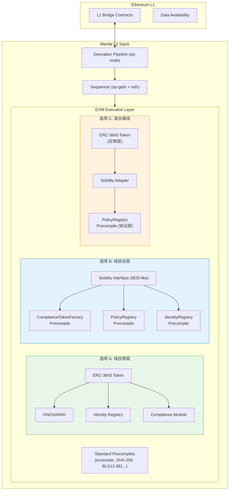
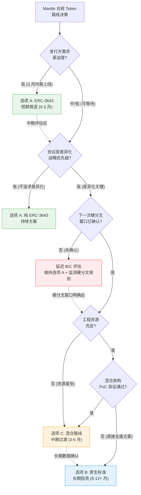

# Mantle 合规 Token 策略建议

## Executive Summary

本研究基于前序四项调研成果（合规 Token 全景、ERC-3643 深度分析、TIP-20 深度分析、四标准横评）以及 Mantle 本地代码仓库的一手技术验证，为 Mantle（OP Stack L2 / RWA 机构化定位）输出针对性合规 token 策略建议。

**核心发现：**

1. **技术栈现状**：Mantle 当前运行 op-geth + reth 双执行客户端架构，已完成全部四次硬分叉——Everest（2025-03-19）、Skadi（2025-08-27，Prague 对齐）、Limb（2026-01-14，Osaka 对齐）、Arsia（2026-04-22，Gas 基础设施重构）。经代码验证，Mantle **当前不存在任何自定义 precompile**，仅包含标准 EVM 预编译合约与 BLS12-381 曲线操作。代码仓库中无 Arsia 之后的下一次硬分叉规划（仅有 `// ADD NEW FORKS HERE!` 占位符），这意味着引入协议层合规 precompile 的部署窗口当前不确定。

2. **三条路线评估**：
   - **选项 A（ERC-3643 智能合约路线）**：最成熟的即时可用方案。ERC-3643 成熟度 28/30，已 tokenize 超 $32B 资产，拥有 Final ERC 状态与完整生态。在 Mantle EVM 上完全兼容，Gas 开销 2-8x ERC-20 在 L2 低 Gas 环境下可控。**推荐作为短期首选**。
   - **选项 B（Precompile 原生标准路线）**：以 Base B20（pinned commit `base/base@8e87672`）为主要 EVM L2 precompile 类比。B20 展示了 Rust trait 组合、4-slot PolicyRegistry、7-role RBAC 的协议层合规设计范式，但成熟度仅 10/30 且尚未进入生产。TIP-20 提供了协议层合规方案可以生产部署的经验验证，但其支付链定位与 Mantle RWA 场景存在显著差异。**适合中长期差异化战略，但需 12+ 月投入且部署依赖尚未公布的硬分叉**。
   - **选项 C（混合路线）**：PolicyRegistry precompile + ERC-3643/ERC-20 adapter，兼具协议层 Gas 效率与应用层标准兼容。架构复杂度高，但提供渐进式过渡路径。**推荐作为中期探索方向，但同样受限于硬分叉窗口不确定性**。

3. **策略建议**：采用 **"ERC-3643 先行 + 混合路线评估 + 原生标准远期决策"** 的分阶段策略。短期（0-3 月）以 ERC-3643 PoC 验证需求并建立合规基础设施；中期（3-6 月）评估 PolicyRegistry precompile 原型与混合架构可行性；长期（6-12 月）基于数据做出原生标准的最终路线决策。

---

## 模块一：Mantle 现状评估与技术栈约束

### item-1: Mantle 技术栈现状评估

#### 1.1 OP Stack 架构约束分析

Mantle 基于 OP Stack 构建，采用 Optimistic Rollup 架构，继承了 OP Stack 的 L1-L2 消息传递机制、跨链桥合约体系与 derivation pipeline。这一架构对合规 token 实现产生以下关键约束：

**L1-L2 消息传递约束**：跨链消息（deposit/withdrawal）需经过 derivation pipeline 处理，合规 token 的跨链转移必须在 L2 侧维护完整的身份验证与合规检查逻辑。L1 → L2 的 deposit 交易通过 `op-node` 的 derivation 流程派生，无法在 L1 层面预先执行 L2 的合规逻辑。这意味着跨链场景下合规检查存在固有延迟——deposit 到达 L2 后才能触发合规验证，不合规的 deposit 只能在 L2 侧回滚或冻结。

**跨链桥合约体系**：Mantle 的标准桥（`L1StandardBridge` / `L2StandardBridge`）基于 `OptimismMintableERC20` 模式，要求 L2 token 实现特定的 mint/burn 接口。ERC-3643 合规 token 需要自定义桥接逻辑，在 L2 侧 mint 时同步执行身份验证与合规检查，而非使用标准桥的无条件 mint 路径。

**Derivation Pipeline 影响**：sequencer 对交易排序的控制权意味着合规检查可以在 sequencer 层面实现（如果引入 precompile），但也增加了 sequencer 中心化风险——合规判定完全依赖 sequencer 的正确执行。在 Optimistic Rollup 模型下，fraud proof 机制可验证 sequencer 的合规判定是否正确执行了预定义规则。

#### 1.2 reth Sequencer 技术特性

Mantle 运行 **op-geth 与 reth 双执行客户端架构**。经本地代码仓库验证（`/Users/whisker/Work/src/networks/mantle/`），关键技术特征如下：

**硬分叉演进路径**（源自 `mantle-v2/op-core/forks/mantle_forks.go`）：

| 硬分叉 | 对齐 | 主网激活日期 | 状态 |
|---|---|---|---|
| MantleEverest | — | 2025-03-19（timestamp 1742367600） | 已激活 |
| MantleSkadi | Ethereum Prague | 2025-08-27（timestamp 1756278000） | 已激活 |
| MantleLimb | Ethereum Osaka | 2026-01-14（timestamp 1768374000） | 已激活 |
| MantleArsia | 重大架构升级（Gas 重构，OperatorFeeVault） | 2026-04-22（timestamp 1776841200） | 已激活 |

> **硬分叉时间线确认（2026-06-04）**：截至本文撰写日期，上述四次硬分叉均已在 Mantle 主网激活。代码仓库中 Arsia 之后仅有 `// ADD NEW FORKS HERE!` 占位符，**无下一次硬分叉的定义或时间规划**。"Hoodi" 在代码中出现但其为 Ethereum 测试网配置（ChainID 560048），非 Mantle 主网硬分叉。

**Custom Precompile 可行性**：经 `mantle-v2/op-program/client/l2/engineapi/precompiles.go` 验证，Mantle 当前仅注册标准 EVM 预编译合约（ecrecover、SHA-256、RIPEMD-160、identity、modexp、bn256 系列、blake2f）与 BLS12-381 曲线操作。**不存在任何 Mantle 自定义 precompile**。这意味着：

- 引入合规 precompile 需要修改执行客户端代码（op-geth 与/或 reth）
- 需要通过硬分叉流程部署，但**下一次硬分叉尚未规划**——部署窗口当前不确定
- 需要同时更新 op-geth 与 reth 两套客户端实现以保持一致性
- 需要在 fraud proof 系统中纳入新 precompile 的验证逻辑

**EVM 兼容性边界**：Mantle 保持与 Ethereum EVM 的高度兼容。reth 客户端基于 Rust 实现，理论上适合 Rust trait 组合模式的 precompile 开发（与 Base B20 的 Rust precompile 实现模式一致），但需要建立 Mantle 特有的 precompile 注册与管理框架。

#### 1.3 当前 ERC-20 生态

Mantle 当前的 token 标准生态完全基于标准 ERC-20，不具备原生合规层。具体局限包括：

- **无链上身份验证**：标准 ERC-20 的 `transfer`/`transferFrom` 不执行任何身份检查，任何地址均可接收 token
- **无合规规则引擎**：缺乏 policy-based 的转移限制机制（如转移额度限制、持有人数量上限、锁仓期约束）
- **无监管操作接口**：缺乏 freeze（冻结）、forcedTransfer（强制转移）、recovery（身份恢复）等监管要求的操作能力
- **无角色权限系统**：标准 ERC-20 仅有 `owner` 概念，缺乏 RBAC 多角色权限模型

这些局限意味着 Mantle 上的 RWA token 发行方必须在应用层自行构建合规能力，或采用 ERC-3643 等合规 token 标准。

#### 1.4 Gas 成本基线

Mantle L2 的 Gas 模型具有以下特征：

**EIP-1559 基础费用模型**（源自 `op-geth/consensus/misc/eip1559/`）：Mantle 实现了 EIP-1559 动态基础费用机制，设有 `MinBaseFee` 下限。L2 execution gas 成本显著低于 Ethereum L1（通常低 1-2 个数量级）。

**L1 数据可用性成本**：作为 OP Stack L2，Mantle 的交易成本包含两部分——L2 execution gas + L1 data gas（batch submission 分摊）。ERC-3643 transfer 的额外合约调用（2-3 次外部调用 + 嵌套调用）主要增加 L2 execution gas，而 L1 data gas 增量有限（calldata 长度增加较小）。

**Gas 兼容性评估**：ERC-3643 的 2-8x Gas 开销在 Mantle L2 低 Gas 环境下绝对成本可控。以 Mantle L2 典型 Gas price 估算，ERC-3643 transfer 的额外 Gas 成本在用户可接受范围内（与 Ethereum L1 相比降低约 95%+）。precompile 路线（选项 B/C）可进一步降低 Gas 开销（原生执行 vs Solidity 字节码解释），但边际收益在 L2 低 Gas 环境下不如 L1 显著。

**Arsia Gas 重构**：Arsia 硬分叉（2026-04-22 已激活）引入了 GasPriceOracle 升级与 OperatorFeeVault（源自 `op-node/rollup/derive/arsia_upgrade_transactions.go`）。这些 Gas 定价机制变更已生效，合规 token 的成本评估应基于 Arsia 后的 Gas 模型。

### item-2: Mantle 市场定位与合规需求映射

#### 2.1 RWA 机构化定位分析

Mantle 的战略定位明确指向 **RWA（Real World Assets）机构化**场景，目标发行方画像包括：

- **机构投资者**：对冲基金、资产管理公司、家族办公室——需要合规的链上资产管理与交易基础设施
- **RWA 发行方**：证券化产品发行商、房地产 token 化平台、债券 token 化机构——需要满足监管要求的 token 标准
- **合规金融机构**：银行、券商、信托公司——受严格监管约束，需要链上合规能力与链下合规流程的无缝对接

这一定位要求 Mantle 的合规 token 框架优先满足以下能力需求：
- **身份验证与 KYC/AML 集成**：机构发行方的首要合规要求
- **转移限制与投资者资格验证**：证券类 token 的法律强制要求
- **监管操作（冻结、强制转移、恢复）**：满足各司法管辖区的监管执法需求
- **合规审计与报告能力**：机构级别的合规审计与报告生成

#### 2.2 mETH/cmETH 协同分析

Mantle 的 LST（Liquid Staking Token）生态以 mETH 和 cmETH 为核心资产。合规 token 框架与 LST 资产的协同可能性包括：

**身份层复用**：若 Mantle 建立统一的链上身份基础设施（无论是 ONCHAINID 还是自建身份层），mETH/cmETH 的持有者身份验证可复用同一身份注册表。机构投资者完成一次 KYC 即可同时参与 LST 质押与合规 token 投资。

**合规状态继承**：cmETH 作为 mETH 的衍生资产，若 mETH 引入合规包装（compliance wrapper），cmETH 的合规状态可从底层资产继承，减少重复合规验证。

**机构化增量价值**：
- mETH 的合规包装可使其进入机构投资者的可投资资产池（许多机构基金对投资标的有合规标准要求）
- cmETH 的合规版本可作为机构级抵押品，进入 DeFi 借贷协议的机构池
- LST + 合规 token 的组合可为 Mantle 创造独特的机构化 DeFi 生态

**技术可行性约束**：mETH/cmETH 合规包装需要解决以下技术问题：
- 合规 wrapper 合约的 Gas 开销对 staking yield 的影响
- 合规状态变更（如身份过期）对 LST 流动性的影响
- DeFi 协议组合性（composability）与合规转移限制的冲突
- 需要协议层支持（precompile）还是应用层即可满足

> **GAP-2 注意**：mETH/cmETH 合规包装的具体技术方案尚未设计，上述分析为方向性评估。具体可行性需通过独立 PoC 验证。

#### 2.3 监管需求映射

基于前序全景调研（compliance-token-landscape/final.md）的 8 类合规能力分类，Mantle 目标场景的优先能力需求映射如下：

| 合规能力类别 | Mantle RWA 场景优先级 | 关键需求描述 |
|---|---|---|
| 身份验证与准入控制 | **P0 — 必需** | KYC/AML 合规是所有机构场景的前提 |
| 转移限制与规则引擎 | **P0 — 必需** | 证券类 token 的法律强制要求 |
| 资产生命周期管理 | **P0 — 必需** | mint/burn/pause 能力满足监管要求 |
| 监管操作（冻结/强制转移/恢复） | **P0 — 必需** | 司法管辖区执法合规 |
| 角色权限管理（RBAC） | **P1 — 高度需要** | 多方参与的机构场景需要细粒度权限 |
| 合规审计与链上可追溯 | **P1 — 高度需要** | 机构级审计与报告 |
| 跨链合规一致性 | **P2 — 重要** | 多链 RWA 生态的互操作性 |
| 隐私保护合规 | **P2 — 重要** | 机构交易隐私与合规透明度平衡 |

#### 2.4 竞争差异化定位

Mantle 合规 token 能力的差异化价值点：

1. **L2 低 Gas + 合规能力**：ERC-3643 在 Ethereum L1 的 Gas 开销是主要采用障碍之一，Mantle L2 的低 Gas 环境可显著降低合规 token 操作成本
2. **mETH/cmETH 原生集成**：竞争链缺乏与原生 LST 资产的深度合规集成，Mantle 可通过 LST + 合规 token 组合构建独特的机构化 DeFi 生态
3. **OP Stack 生态效应**：Mantle 的合规方案可与 OP Stack 生态中的其他链（如 Base）形成互操作性，但也面临 Base B20 的直接竞争
4. **机构化 L2 定位**：不同于 Base 的消费者/开发者导向，Mantle 的机构化定位更直接匹配合规 token 的核心受众

---

## 模块二：三条路线技术分析

### item-3: 选项 A — ERC-3643 智能合约路线技术分析

#### 3.1 部署可行性

ERC-3643（T-REX 协议）由六核心 Solidity 合约组成（源自 erc3643-trex-analysis/final.md）：

1. **Token 合约**：ERC-20 兼容的合规 token 主合约，集成转移前合规验证钩子
2. **ONCHAINID（Identity 合约）**：链上身份容器，存储 Claim（声明）
3. **Identity Registry**：地址 → 身份映射注册表，transfer 时查询接收方身份
4. **Trusted Issuers Registry**：受信任的 Claim 签发者白名单
5. **Claim Topics Registry**：token 要求的 Claim 主题（如 KYC、合格投资者认证）
6. **Compliance Module**：可组合的合规规则模块（转移额度、持有人数量限制等）

**Mantle EVM 兼容性验证**：ERC-3643 全部合约以标准 Solidity 编写，无特殊操作码或 L1 特定依赖。Mantle 的 EVM 兼容性确保这些合约可直接部署，无需修改。ONCHAINID 的 Claim 签名验证（`ecrecover`）使用标准 EVM precompile，在 Mantle 上完全可用。

**部署确认**：ERC-3643 可在 Mantle 上**无修改直接部署**，兼容性风险极低。

#### 3.2 实现成本评估

| 成本维度 | 估算 | 说明 |
|---|---|---|
| 合约部署 Gas | 低 | Mantle L2 Gas 成本约为 L1 的 1-5%，六合约 + Compliance Module 部署总成本可控 |
| ONCHAINID 基础设施 | 中 | 需建立或对接 Claim 签发体系（ClaimIssuer 合约 + 链下 KYC 服务集成） |
| 工具链与集成 | 低 | T-REX 开源工具链（SDK、dashboard）可直接复用 |
| 审计成本 | 低 | ERC-3643 已有大量审计资源与最佳实践，增量审计范围有限 |
| 运营维护 | 中 | ClaimIssuer 运营、Claim 过期管理、Compliance Module 配置维护 |
| **合计开发周期** | **1-3 月** | 从 PoC 到生产部署（假设 KYC 服务已有对接渠道） |

#### 3.3 优势分析

1. **最高标准成熟度（28/30）**（源自 compliance-token-comparison/final.md）：六维度评估中，标准化程度（ERC Final）、生态系统成熟度（$32B+、92+ 协会成员含 DTCC/Apex/Invesco）、生产验证、工具链支持均领先
2. **无协议层改动**：不需要 Mantle 执行客户端修改或硬分叉，完全在应用层部署
3. **监管认可度最高**：DTC no-action letter、SEC Atkins 演讲引用、EU DLT Pilot Regime 认可——机构发行方最信任的标准
4. **ERC Final 状态**：Ethereum 社区正式标准，非实验性方案
5. **即时可用**：无需等待 Mantle 硬分叉窗口，可立即开始 PoC 与生产部署
6. **审计资源丰富**：已有大量合约审计报告与安全最佳实践可参考

#### 3.4 劣势分析

1. **Gas 开销 2-8x ERC-20**（源自 erc3643-trex-analysis/final.md）：标准 transfer 路径需 2-3 次外部合约调用（Identity Registry 查询 + Claim 验证 + Compliance Module 检查），每次涉及嵌套调用。在 Mantle L2 低 Gas 环境下绝对成本可控，但相对开销仍显著
2. **transfer 路径身份验证延迟**：标准 ERC-3643 transfer 仅验证接收方身份（receiver-only verification），增加了 transfer 的执行时间
3. **无法利用 Mantle 协议层差异化**：纯应用层方案意味着 Mantle 与任何其他 EVM L2 上的 ERC-3643 部署无差异化——竞争优势仅来自 Mantle 的低 Gas 与 LST 生态，而非技术独特性
4. **应用层合约升级复杂性**：ERC-3643 合约升级需要代理模式（proxy pattern），合规规则变更影响范围需审慎评估
5. **身份基础设施依赖外部**：ONCHAINID 与 ClaimIssuer 生态主要在 Ethereum 主网，Mantle 上需建立或桥接身份基础设施

#### 3.5 适用场景

选项 A 最适合以下场景：
- 合规需求明确且时间紧迫（需在 3 月内上线合规 token 能力）的机构发行场景
- 不追求协议层差异化、优先标准合规认可度的保守策略
- 作为任何长期策略的**短期基础设施奠基**——即使最终选择选项 B 或 C，ERC-3643 的身份基础设施（ONCHAINID）与合规经验仍具长期复用价值

### item-4: 选项 B — Precompile 自建原生标准路线技术分析

#### 4.1 Precompile 设计空间

> **分析框架说明**：遵循对抗性反馈，本节以 **Base B20（pinned commit `base/base@8e8767281d7c8768f6a0aed9124779cd4ed030ae`）作为 Mantle 原生标准路线的主要 EVM L2 precompile 类比**，因其 RWA/Security Token 场景定位与 Mantle 高度一致。TIP-20 作为已生产部署的协议层合规方案提供经验参考，但其支付链特性（Payment Lanes、Fee AMM、StablecoinDEX）不直接适用于 Mantle 的 RWA 场景。

**B20 precompile 架构参考**（pinned commit 可验证证据，源自 base-b20-analysis/final.md）：

B20 设计了以预编译合约为核心的协议层合规框架：
- **B20Factory（0xB20F）**：token 创建工厂，支持两种 variant——B20Asset（variant=0，通用合规资产）和 B20Stablecoin（variant=1，合规稳定币）
- **PolicyRegistry 4-slot 架构**：TransferSender / TransferReceiver / TransferExecutor / MintReceiver 四个策略槽位，每笔转移前由 precompile 原生查询策略
- **7-role RBAC**：DefaultAdmin / Mint / Burn / BurnBlocked / Pause / Unpause / Metadata——比 ERC-3643 的 AgentRole 更细粒度
- **ActivationRegistry**：功能级激活控制，允许渐进式开启合规特性
- **IB20 Solidity 接口**：50 个函数、16 个事件、22 个错误定义——应用层通过标准 Solidity 接口调用 precompile

**Rust trait 组合模式**：B20 在 Rust 执行客户端中使用 trait 组合实现 precompile 逻辑，这与 Mantle 的 reth 客户端架构高度兼容——Mantle 可复用类似的 Rust trait 模式进行 precompile 开发。

> **B20 证据边界声明**：B20 公开规范尚未发布，上述结论均为代码推断（code-inferred），Beryl 最终发布为权威确认门控。B20Security/IB20Security、`redeem`、`batchBurn`、`securityIdentifier` 等接口 **[本地分支演进线索]** 仅作为方向性信号参考，不纳入 B20 当前主线能力评估。

**TIP-20 生产经验参考**（源自 tempo-tip20-analysis/final.md）：

TIP-20 作为已在 Tempo 链生产部署的协议层合规方案，提供以下经验参考：
- **Precompile 套件部署验证**：TIP20Factory（0x20Fc）、TIP403Registry（0x403c）、TipFeeManager（0xfeec）、StablecoinDEX（0xdec0）——证明多 precompile 协同在生产环境可行
- **TIP-403 Policy 机制**：whitelist / blacklist / compound（TIP-1015）/ always-reject（0）/ always-allow（1）——验证了策略注册表的生产可行性
- **RBAC 4-role 模型**：ISSUER / PAUSE / UNPAUSE / BURN_BLOCKED——比 B20 的 7-role 更精简，但经过生产验证

> **TIP-20 适用性边界**：TIP-20 的 Payment Lanes（55% 手续费分配）、Fee AMM、StablecoinDEX、Channel Reserve 等核心特性面向稳定币支付场景，与 Mantle 的 RWA/证券 token 场景存在显著差异。Mantle 不应直接移植这些支付特性，而应聚焦 TIP-20 在 precompile 开发流程、策略注册表设计、生产部署经验方面的可转移教训。

#### 4.2 Mantle reth Sequencer 上的实现路径

基于 Mantle 技术栈现状（item-1），precompile 原生标准的实现路径：

**Step 1 — Precompile 框架搭建**：
- 在 reth 执行客户端中建立 Mantle 自定义 precompile 注册机制
- 定义 precompile 地址空间（参考 B20 的 0xB20F、TIP-20 的 0x20Fc 等）
- 实现 Rust trait 组合的 precompile 基础类型系统

**Step 2 — 核心合规 Precompile 开发**：
- **ComplianceTokenFactory**：token 创建工厂 precompile（参考 B20Factory）
- **PolicyRegistry**：策略注册表 precompile（参考 B20 4-slot 或 TIP-403）
- **IdentityRegistry**（可选）：链上身份注册 precompile，或复用应用层 ONCHAINID

**Step 3 — op-geth 同步**：
- 在 op-geth 中实现等价的 precompile 逻辑（Go 语言），保持双客户端一致性
- 或决定是否放弃 op-geth 的 precompile 同步，仅在 reth 中实现

**Step 4 — 硬分叉部署**：
- 将新 precompile 纳入下一次硬分叉——但截至 2026-06-04，**Arsia 之后的下一次硬分叉尚未规划**，部署窗口不确定
- 更新 fraud proof 系统以支持新 precompile 的验证

#### 4.3 实现成本评估

| 成本维度 | 估算 | 说明 |
|---|---|---|
| Precompile 开发 | **高** | Rust + Go 双客户端实现，无现有框架可复用 |
| 设计与标准化 | **高** | 从零设计 Mantle 合规标准（token 结构、策略模型、RBAC、接口规范） |
| 测试网验证 | **高** | 需要完整的 testnet 部署、安全审计、压力测试 |
| 硬分叉协调 | **高** | 治理流程、节点运营商升级协调、社区共识；且下一次硬分叉时间未定 |
| 生态工具链 | **高** | SDK、dashboard、explorer 集成均需从零开发 |
| **合计开发周期** | **12-18 月** | 从设计到主网部署（参考 TIP-20 经验：设计到生产 12+ 月），不含等待硬分叉窗口的时间 |

#### 4.4 优势分析

1. **Gas 效率**：precompile 原生执行绕过 Solidity 字节码解释，合规检查 Gas 开销可降至 ERC-3643 的 1/3-1/5（参考 TIP-20 vs Solidity 实现的 Gas 对比，tempo-tip20-analysis/final.md）。但在 Mantle L2 低 Gas 环境下，绝对节省有限
2. **协议层差异化**：Mantle 成为原生支持合规 token 的 L2，与其他"仅部署应用层合约"的 L2 形成技术壁垒
3. **深度集成 Mantle 特有功能**：合规逻辑可与 sequencer 排序、Gas 定价（Arsia OperatorFeeVault，已生效）、跨链桥等原生功能深度集成
4. **与 B20 竞争对称**：B20 在 Base 上推进协议层合规预编译，Mantle 推进同级别方案可形成竞争对等，避免被 Base 在机构化场景拉开差距

#### 4.5 劣势分析

1. **开发周期长（12-18 月）**：TIP-20 从设计到生产耗时 12+ 月，Mantle 从零开始预期不会更短
2. **标准化风险**：自建标准非 ERC Final，生态接受度不确定。B20 同样面临此风险（成熟度 10/30，源自 compliance-token-comparison/final.md）
3. **双客户端维护负担**：op-geth + reth 双客户端均需实现和维护 precompile 逻辑
4. **生态工具缺失**：无现成 SDK、审计框架、合规 dashboard
5. **硬分叉窗口不确定**：Arsia 已于 2026-04-22 激活，但下一次硬分叉尚未规划——部署时间窗口当前无法预测
6. **机会成本**：开发资源投入合规 precompile 意味着其他优先级（性能优化、DA 层、跨链桥改进）可能延迟

#### 4.6 适用场景

选项 B 最适合：
- Mantle 战略层面决定将协议层合规能力作为核心竞争力，愿意承担长期开发投入
- 目标是与 Base B20 形成竞争对等或超越，在 EVM L2 机构化赛道建立技术壁垒
- 有充足的工程资源且合规 token 不是短期紧急需求

### item-5: 选项 C — 混合路线技术分析

#### 5.1 混合架构设计

选项 C 采用 **PolicyRegistry precompile + 应用层 ERC-20/ERC-3643 adapter** 的混合架构：

**协议层（Precompile）**：
- 仅实现 **PolicyRegistry precompile**——策略注册与查询的原生执行
- PolicyRegistry 存储合规策略（whitelist、blacklist、compound 规则），提供 O(1) 原生查询
- 不在协议层实现完整的 token 逻辑（mint/burn/transfer）

**应用层（Solidity Adapter）**：
- ERC-20 或 ERC-3643 token 合约在 transfer 路径中调用 PolicyRegistry precompile 执行合规检查
- Adapter 合约封装 precompile 调用接口，向应用层暴露标准 Solidity API
- token 逻辑（mint/burn/pause/freeze）保留在应用层 Solidity 实现

**交互流程**：
```
User → ERC-3643 Token Contract → Adapter → PolicyRegistry Precompile
                                              ↓ (native query)
                                          Policy Result (allow/deny)
                                              ↓
                                 ← Transfer Execution or Revert ←
```

#### 5.2 接口设计要点

**Precompile ↔ Solidity Adapter 调用约定**：
- Adapter 合约通过 `staticcall` 调用 PolicyRegistry precompile（只读查询），Gas 开销为 precompile 固定成本 + 数据编码
- 策略更新（管理操作）通过 `call` 调用 precompile，需要 RBAC 权限验证
- 数据编码采用 ABI-compatible 格式，确保 Solidity 端可直接解码

**Gas 分摊**：
- 合规检查的热路径（transfer 时的策略查询）由 precompile 原生执行，Gas 开销低
- 应用层逻辑（token mint/burn/transfer 执行、事件发送）仍为 Solidity 执行
- 总体 Gas = Solidity 执行 Gas + precompile 查询 Gas（显著低于纯 Solidity 的策略查询）

**状态一致性**：
- PolicyRegistry precompile 维护策略状态（在 precompile 的存储空间内）
- 应用层 token 合约维护 token 状态（balance、allowance）
- 两层状态通过 adapter 的原子调用保证一致性——如果 precompile 查询返回 deny，整个 transaction 回滚

#### 5.3 实现成本评估

| 成本维度 | 估算 | 说明 |
|---|---|---|
| PolicyRegistry precompile | **中** | 范围远小于完整合规标准，仅策略注册与查询 |
| Adapter 合约 | **低-中** | Solidity 实现，对接标准 ERC-3643 或 ERC-20 |
| 硬分叉协调 | **中** | 仅一个 precompile，影响范围比选项 B 小；但部署同样依赖下一次硬分叉窗口（尚未公布） |
| 测试验证 | **中** | precompile + adapter 的集成测试 |
| 生态工具 | **中** | adapter SDK，但可复用 ERC-3643 工具链 |
| **合计开发周期** | **6-9 月** | precompile 开发 3-4 月 + 集成测试 2-3 月 + 硬分叉部署 1-2 月（不含等待硬分叉窗口的时间） |

#### 5.4 优势分析

1. **热路径 Gas 效率**：transfer 最频繁的合规检查操作（策略查询）由 precompile 原生执行，Gas 开销显著低于纯 Solidity 方案
2. **应用层标准兼容**：token 逻辑保留在 ERC-3643/ERC-20 Solidity 合约中，保持与现有生态工具链的兼容性
3. **渐进式引入**：可先部署 PolicyRegistry precompile，再逐步扩展协议层能力（如后续添加 IdentityRegistry precompile）
4. **复用 ERC-3643 生态**：ERC-3643 的审计资源、SDK、Compliance Module 可在应用层继续使用
5. **协议层差异化**：虽然 token 逻辑在应用层，但 PolicyRegistry precompile 仍为 Mantle 提供协议层差异化——其他 L2 的 ERC-3643 部署没有原生策略查询能力

#### 5.5 劣势分析

1. **架构复杂性**：两层架构增加了系统复杂度——precompile 与 Solidity adapter 的接口设计、状态同步、错误处理
2. **两层状态同步**：PolicyRegistry（precompile 存储）与 token 状态（Solidity 存储）需通过 adapter 保持一致，异常场景（如 precompile 升级）的状态迁移需审慎处理
3. **升级协调难度**：precompile 升级需硬分叉，adapter 合约升级需代理模式——两层升级节奏不同，版本兼容性管理复杂
4. **非标准化路径**：混合架构既非纯 ERC-3643 标准，也非完整的协议层标准，可能面临生态接受度挑战
5. **有限的协议层收益**：仅 PolicyRegistry 一个 precompile 的 Gas 收益有限——在 L2 低 Gas 环境下，precompile 带来的绝对 Gas 节省可能不足以证明额外复杂度
6. **硬分叉窗口不确定**：与选项 B 同样受限于下一次硬分叉尚未规划的现实

#### 5.6 与前序交叉洞察的关联

横评报告（compliance-token-comparison/final.md）Insight B 提出 "ERC-3643 vs B20/TIP-20 互补路径"假说（可信度 1/5 "投机性"）——即应用层成熟标准与协议层新兴标准可能形成互补而非替代关系。

选项 C 正是这一假说的具体技术实现路径：PolicyRegistry precompile 提供协议层优化，ERC-3643 adapter 保持应用层标准兼容。然而，这一路径的可行性需要在 Mantle 上进行实际 PoC 验证——Insight B 的 1/5 可信度反映了目前缺乏生产环境中混合架构成功案例的现实。

#### 5.7 适用场景

选项 C 最适合：
- 希望渐进式引入协议层能力，同时保持应用层标准兼容的过渡场景
- 作为选项 A → 选项 B 的中间跳板——先建立 PolicyRegistry precompile 基础，后续按需扩展
- 中期（3-6 月）的技术探索方向，为长期路线决策提供数据

---

## 模块三：关键决策因素与竞争态势分析

### item-6: 关键决策因素分析

#### 6.1 发行方合规能力需求评估

**目标发行方画像与需求分层**：

| 发行方类型 | 合规成熟度 | 身份基础设施 | 标准化偏好 | 推荐路线 |
|---|---|---|---|---|
| 传统金融机构（银行/券商） | 高 | 已有 KYC 体系，需链上映射 | 强烈偏好 ERC Final 标准 | 选项 A |
| 资产管理公司 | 中-高 | 部分有 KYC 体系 | 偏好行业标准 | 选项 A 或 C |
| RWA 原生发行平台 | 中 | 需新建链上身份 | 愿意接受定制化 | 选项 A → C 渐进 |
| DeFi 机构化项目 | 低-中 | 通常无传统 KYC | 技术优先 | 选项 C 或 B |

**关键发现**：短期最可能的 Mantle 合规 token 发行方（传统金融机构、资产管理公司）**强烈偏好 ERC-3643 等已获监管认可的标准**。自建标准（选项 B）需要 12+ 月才能达到基本成熟度，难以满足这些发行方的即时需求。

> **GAP-6 注意**：上述发行方画像基于行业观察与监管框架推断，尚未经 Mantle 目标发行方的实际调研验证。短期行动 #4（发行方需求访谈）可校准此分析。

#### 6.2 Hardfork 节奏约束

**Mantle 硬分叉时间线**（源自本地代码仓库验证，截至 2026-06-04）：

| 硬分叉 | 对齐 | 主网激活日期 | 状态 |
|---|---|---|---|
| Everest | — | 2025-03-19 | 已激活 |
| Skadi | Ethereum Prague | 2025-08-27 | 已激活 |
| Limb | Ethereum Osaka | 2026-01-14 | 已激活 |
| Arsia | 重大架构（Gas 重构） | 2026-04-22 | 已激活 |
| 下一次 | 未知 | 未公布 | 代码中仅有 `// ADD NEW FORKS HERE!` 占位符 |

**Precompile 引入的最早可行窗口**：Arsia 已于 2026-04-22 激活完成，Mantle 当前处于 Arsia 后的稳定运行阶段。下一次硬分叉的内容与时间均未公布，因此 precompile 部署窗口**当前无法确定**。

> **hardfork 时间线不确定性声明**：下一次 Mantle 硬分叉的规划信息未在代码仓库或公开治理提案中找到。以下对 precompile 部署时间的讨论基于"下一次硬分叉将在某个时间点发生"的合理假设，但具体时间线无法预测。

**对路线选择的影响**：
- 选项 A（ERC-3643）：不受硬分叉限制，可立即启动——这一优势因硬分叉时间不确定而更加突出
- 选项 B（完整 precompile）：12-18 月开发周期为绑定约束，加之硬分叉窗口不确定，总体上线时间难以预估
- 选项 C（混合 precompile）：6-9 月开发周期，但同样需等待硬分叉窗口
- **策略推论**：硬分叉窗口的不确定性进一步强化了"选项 A 先行"的策略合理性。选项 B/C 的开发可并行推进，但部署需等待硬分叉窗口明确

#### 6.3 mETH/cmETH 协同决策点

| 决策维度 | 选项 A 支持度 | 选项 B/C 支持度 | 说明 |
|---|---|---|---|
| 合规 wrapper 技术可行性 | 高 | 高 | 两条路线均可为 mETH 提供合规包装 |
| 身份层复用效率 | 中 | 高（理论上） | precompile 身份查询更高效，但具体设计未展开（GAP-2） |
| DeFi composability 影响 | 低影响 | 需评估 | precompile 路线可能影响 DeFi 协议集成 |
| 实现优先级 | 可早期实现 | 需等待 precompile 与硬分叉 | 选项 A 可在 3 月内实现 mETH 合规 wrapper |

**关键判断**：mETH/cmETH 合规包装不是路线选择的决定性因素——两条路线均可实现。但**时间因素有利于选项 A**，因为早期的 mETH 合规包装可为 Mantle 机构化叙事提供实质支撑。precompile 路线的身份查询效率优势仅为理论推断（GAP-2：具体技术方案未设计）。

#### 6.4 开发资源与优先级权衡

合规 token 开发需与 Mantle 其他技术优先级竞争资源：

| 技术优先级 | 资源竞争度 | 影响评估 |
|---|---|---|
| 性能优化（sequencer、batch） | 高 | 选项 B/C 的 precompile 开发直接竞争执行客户端工程资源 |
| DA 层优化 | 中 | 较少直接竞争 |
| 跨链桥改进 | 中 | 合规 token 的跨链桥扩展需要桥接团队协作 |
| 下一次硬分叉规划与实施 | 高 | 合规 precompile 需纳入下一次硬分叉范围，与其他升级内容竞争 |

**资源约束推论**：Arsia 已完成激活，核心工程团队理论上有更多带宽投入新方向。但选项 B/C 仍需要执行客户端核心工程师深度参与（Rust + Go 双客户端 precompile 开发），资源竞争依然显著。选项 A 的资源需求最低（智能合约团队即可执行），不影响核心基础设施开发。

#### 6.5 标准化与生态接受度

| 维度 | ERC-3643（选项 A） | 自建标准（选项 B） | 混合（选项 C） |
|---|---|---|---|
| 标准化状态 | ERC Final ✓ | 无标准 ✗ | 部分标准 ○ |
| 生态信任度 | 最高（92+ 协会成员） | 极低（需从零建立） | 中等（复用 ERC-3643） |
| 工具链支持 | 完整（SDK/dashboard/审计） | 无 | 部分复用 |
| 监管认可 | 最高（DTC/SEC/EU） | 无 | 部分继承 |
| 互操作性 | 跨链 ERC-3643 兼容 | 仅限 Mantle | 部分兼容 |

#### 6.6 决策矩阵

基于上述六个决策因素构建加权评估。**每个评分附带证据来源与置信度标注**：

| 决策因素 | 权重 | 选项 A | 选项 B | 选项 C | 证据 / 理由 |
|---|---|---|---|---|---|
| 发行方需求匹配度 | 25% | 9/10 | 4/10 | 7/10 | A: ERC Final + 92+ 协会成员 + DTC/SEC 认可（WHI-178, WHI-182）。B: 12-18 月开发期无法满足机构即时需求（item-4.3）；机构偏好 ERC Final（item-6.1）。C: 保持 ERC-3643 兼容但非标路径可能降低机构信任（item-5.5）。**GAP-6: 发行方需求未经实际调研验证** |
| 上市时间 | 20% | 10/10 | 2/10 | 5/10 | A: 无硬分叉依赖，1-3 月 PoC 到生产（item-3.2）。B: 12-18 月开发 + 硬分叉窗口不确定（item-4.3, item-6.2）。C: 6-9 月开发 + 硬分叉窗口不确定（item-5.3, item-6.2）。**硬分叉时间线不确定——B/C 部署时间无法精确估计** |
| 协议层差异化价值 | 15% | 2/10 | 9/10 | 6/10 | A: 纯应用层，与其他 EVM L2 无差异（item-3.4）。B: 原生 precompile 合规，类比 B20 架构（base-b20-analysis, code-inferred）。C: 仅 PolicyRegistry precompile，部分差异化（item-5.4） |
| 标准化与生态接受度 | 15% | 10/10 | 2/10 | 6/10 | A: ERC Final，$32B+，92+ 成员（WHI-178, WHI-182 成熟度 28/30）。B: 无标准、零生态（WHI-182 成熟度 10/30）。C: 复用 ERC-3643 生态但引入非标组件（item-5.5） |
| 资源效率 | 15% | 9/10 | 4/10 | 6/10 | A: 智能合约团队即可，不影响核心基础设施（item-6.4）。B: 双客户端开发，高资源竞争（item-4.3）；Arsia 已完成释放部分带宽。C: 单 precompile 范围较小，Arsia 已完成释放部分带宽（item-5.3, item-6.4） |
| mETH/cmETH 协同 | 10% | 7/10 | 5/10 | 6/10 | 三条路线均可实现 mETH 合规包装（item-2.2, item-6.3）。A: 可在 3 月内实现（时间优势）。B: 需等待 precompile + 硬分叉（时间劣势），precompile 身份查询理论上更高效但**具体设计未展开（GAP-2，投机性评估）**。C: 混合架构可能提供部分 precompile 效率，但同样受 GAP-2 约束。**三者评分差距有限反映了 GAP-2 的不确定性** |
| **加权总分** | **100%** | **8.10** | **4.15** | **6.05** |  |

**决策矩阵结论**：选项 A 在当前条件下综合评分最高（8.10/10），主要优势为发行方需求匹配、上市时间与标准化。选项 C 作为中期过渡方案（6.05/10）优于选项 B 的纯长期投资（4.15/10）。

**矩阵置信度说明**：
- **高置信度维度**：标准化与生态接受度（基于 WHI-178/WHI-182 硬数据）、协议层差异化价值（基于架构分析）
- **中置信度维度**：上市时间（开发周期估算基于 TIP-20 类比，硬分叉窗口不确定）、资源效率（Arsia 后资源释放程度为估计值）
- **需验证维度**：发行方需求匹配度（GAP-6：需实际调研验证）、mETH/cmETH 协同（GAP-2：具体方案未设计，投机性评估）

若战略层面提升"协议层差异化"权重（如从 15% 提升至 25%），选项 B/C 的相对优势将增大——但这一权重调整本身需要战略团队基于竞争态势做出判断。

### item-7: 竞争态势与 B20 证据边界分析

#### 7.1 Base B20 主线证据分析（pinned commit `base/base@8e87672`）

> **证据边界声明**：以下分析严格基于 pinned commit `base/base@8e8767281d7c8768f6a0aed9124779cd4ed030ae` 可验证的证据。所有能力评估仅反映该 commit 的代码状态。

**已验证的 B20 主线能力**：

1. **Precompile 架构**：
   - B20Factory（0xB20F）：token 创建工厂 precompile，支持 B20Asset（variant=0）与 B20Stablecoin（variant=1）
   - PolicyRegistry 4-slot：TransferSender / TransferReceiver / TransferExecutor / MintReceiver
   - ActivationRegistry：功能级激活控制

2. **RBAC 模型**：7-role（DefaultAdmin / Mint / Burn / BurnBlocked / Pause / Unpause / Metadata）

3. **Solidity 接口**：IB20 定义了 50 个函数、16 个事件、22 个错误——完整的应用层交互规范

4. **Hardfork 规划**：B20 定位于 Beryl hardfork（Azul → **Beryl** → Cobalt），当前处于 pre-Beryl 状态

5. **实现方式**：Rust trait 组合 precompile，在 Base 执行客户端中原生运行

**B20 当前成熟度**（源自 compliance-token-comparison/final.md）：10/30，主要受限于：
- 无生产部署（pre-Beryl）
- 公开规范未发布
- 无生态工具链
- 无审计记录
- 零市场采用

**对 Mantle 的策略信号**：B20 的架构设计（特别是 PolicyRegistry 4-slot 与 Rust precompile 模式）展示了 EVM L2 协议层合规的具体实现路径。Base 将合规 token 能力纳入 Beryl hardfork 计划，表明 EVM L2 协议层合规是一个有意识的战略方向，而非实验性探索。Mantle 需要评估是否跟进这一方向。

#### 7.2 B20 本地分支演进线索

> **[本地分支演进线索]** — 以下信息来源于本地分支代码，**不作为 B20 当前主线能力的硬证据**，仅作为方向性信号参考。

- **B20Security / IB20Security**：暗示 B20 未来可能增加证券 token 专用的合规能力层——`securityIdentifier` 字段可能映射到证券标识符（ISIN、CUSIP 等）
- **`redeem` 机制**：证券 token 赎回功能，表明 B20 演进方向包括资产生命周期管理
- **`batchBurn`**：批量销毁操作，暗示机构级批量操作需求

**对 Mantle 的方向性启示**：B20 的本地分支演进 **[本地分支演进线索]** 暗示 Base 可能在 Beryl 之后扩展证券 token 专用能力。如果 Mantle 选择推进原生标准（选项 B/C），应将证券 token 能力纳入设计范围，以避免被 Base 在 RWA 证券化场景建立先发优势。但需强调：这些信号的可信度有限，不应作为 Mantle 路线决策的硬依据。

#### 7.3 Tempo TIP-20 竞争信号

TIP-20 的竞争信号对 Mantle 的启示（源自 tempo-tip20-analysis/final.md）：

**已验证的竞争能力**：
- **唯一生产部署的协议层合规方案**：TIP-20 在 Tempo 链上已进入生产，证明 precompile 合规方案的技术可行性
- **完整商业模式创新**：Payment Lanes 手续费分配（55% 给发行方）、Fee AMM、StablecoinDEX——但这些面向支付场景，不直接适用于 Mantle RWA
- **成熟度 19/30**（源自 compliance-token-comparison/final.md）：在非 ERC-3643 标准中最高

**对 Mantle 的战略启示**：
1. TIP-20 证明协议层合规方案**可以**从设计走到生产——这是选项 B/C 的信心锚点
2. TIP-20 的 12+ 月从设计到生产的时间线是选项 B/C 的现实参考
3. TIP-20 的支付链定位与 Mantle 的 RWA 定位差异化——Mantle 无需在支付场景与 Tempo 直接竞争

> **C1 约束提示**：TIP-20 源代码未公开验证，上述分析基于文档声明证据。

#### 7.4 竞争格局综合评估

基于横评的 6 维成熟度框架（compliance-token-comparison/final.md），各链合规 token 成熟度对比：

| 维度 | ERC-3643（任何 EVM 链） | Base B20 | Tempo TIP-20 | Mantle（当前） |
|---|---|---|---|---|
| 标准化程度 | ★★★★★ ERC Final | ★★☆☆☆ 内部代码 | ★★★☆☆ 协议规范 | ★☆☆☆☆ 无 |
| 生产验证 | ★★★★★ $32B+ | ★☆☆☆☆ 零 | ★★★★☆ 生产中 | ★☆☆☆☆ 无 |
| 生态系统 | ★★★★★ 92+ 成员 | ★☆☆☆☆ 极早期 | ★★★☆☆ 建设中 | ★☆☆☆☆ 无 |
| 工具链 | ★★★★☆ SDK/审计 | ★☆☆☆☆ 无 | ★★★☆☆ CLI/SDK | ★☆☆☆☆ 无 |
| 监管认可 | ★★★★★ DTC/SEC/EU | ★☆☆☆☆ 无 | ★★☆☆☆ 有限 | ★☆☆☆☆ 无 |
| 合规能力覆盖 | ★★★★★ 8/8 类 | ★★★☆☆ 5/8 类 | ★★★★☆ 7/8 类 | ★☆☆☆☆ 0/8 类 |

**Mantle 的差异化窗口**：Mantle 当前在合规 token 领域处于零起步状态，但其 RWA/机构化定位赋予了合规能力以战略紧迫性。差异化窗口来自：
- **B20 pre-Beryl 状态**：Base B20 尚未生产，Mantle 有时间在 ERC-3643 应用层率先建立合规基础
- **L2 低 Gas + mETH/cmETH**：独特的 LST 合规集成机会是其他链不具备的
- **机构化 L2 叙事**：Mantle 的机构化定位比 Base（更偏开发者/消费者）更直接匹配合规 token 受众

#### 7.5 时间窗口分析

```
时间轴         现在(2026-06)  3 月后       6 月后        12 月后
                │              │            │             │
ERC-3643:       █████████████████████████████████████████ (持续主导, $32B+)
                │              │            │             │
B20:        [pre-Beryl]      [Beryl?]    [生产?]       [生态建设?]
            代码就绪           hardfork     初始部署       工具/生态
                │              │            │             │
TIP-20:     █████████████████████████████████████████████ (已生产, 支付链)
                │              │            │             │
Mantle:     [全部 hardfork   [ERC-3643   [混合路线     [原生标准
             已激活,           PoC完成]     评估]         决策]
             无合规能力]
```

**最优介入时机分析**：
1. **立即介入（选项 A）**：在 B20 Beryl 之前建立 ERC-3643 合规基础，抢占"首个 EVM L2 合规 token 生态"叙事
2. **3 月后评估（选项 C）**：观察 B20 Beryl 发布后的实际状态，评估混合路线是否值得投入
3. **6-12 月决策（选项 B）**：基于 ERC-3643 使用数据、B20 Beryl 后生态反应、Mantle 下一次硬分叉规划做出原生标准最终决策

---

## 模块四：分阶段实施建议

### item-8: 分阶段实施建议

#### 8.1 短期 0-3 月：需求验证 + ERC-3643 可行性

**目标**：验证 Mantle RWA 合规 token 需求，建立 ERC-3643 基础设施，输出 PoC 验证数据。

| 行动项 | 时间 | 产出 | 负责方 |
|---|---|---|---|
| 目标发行方需求调研 | M1 | 需求矩阵（合规能力需求 × 发行方类型） | 商务/战略团队 |
| ERC-3643 Mantle testnet PoC | M1-M2 | 完整部署报告（兼容性、Gas 基准、功能验证） | 智能合约团队 |
| ONCHAINID 身份基础设施评估 | M1-M2 | ClaimIssuer 对接方案、KYC 服务集成架构 | 合规/工程团队 |
| Gas 基准测试 | M2 | ERC-3643 vs ERC-20 Gas 对比数据（含 L1 data gas，基于 Arsia 后 Gas 模型） | 工程团队 |
| mETH 合规 wrapper PoC | M2-M3 | mETH 合规包装可行性报告 | DeFi 团队 |
| MVP 范围定义 | M3 | 最小可行产品规格文档（功能范围、发行方对接、上线计划） | 产品/战略团队 |

**关键里程碑**：
- M1 end：发行方需求调研完成，ERC-3643 PoC 部署上 testnet
- M2 end：Gas 基准数据输出，身份基础设施方案确定
- M3 end：MVP 范围锁定，mETH 合规 wrapper 可行性确认

**Go/No-go 决策门控**：
- 若发行方需求调研确认 RWA 合规 token 有实质需求 → 继续中期阶段
- 若需求不足 → 暂缓合规 token 投入，资源转向其他优先级

#### 8.2 中期 3-6 月：混合路线评估

**目标**：评估 PolicyRegistry precompile 的技术可行性，探索混合路线（选项 C）的增量价值。

| 行动项 | 时间 | 产出 | 负责方 |
|---|---|---|---|
| PolicyRegistry precompile 原型设计 | M4-M5 | 技术设计文档（接口规范、状态模型、Gas 估算） | 核心工程团队 |
| ERC-3643 ↔ precompile adapter PoC | M5-M6 | 混合架构 PoC + 对比测试数据 | 智能合约 + 核心工程 |
| 下一次硬分叉窗口评估 | M4 | precompile 部署的最早可行硬分叉窗口确认（如有规划） | 治理团队 |
| mETH/cmETH 合规包装验证 | M5-M6 | 基于 ERC-3643 的 mETH 合规包装生产就绪评估 | DeFi 团队 |
| B20 Beryl 发布后竞争分析更新 | M4-M6 | 竞争态势更新报告（B20 实际能力 vs 预期） | 研究团队 |

**关键里程碑**：
- M4 end：PolicyRegistry precompile 设计完成，硬分叉窗口评估（可能仍无定论）
- M5 end：混合架构 PoC 初步数据
- M6 end：混合路线 go/no-go 决策，ERC-3643 MVP 生产部署

**Go/No-go 决策门控**：
- 混合路线 PoC 展示显著 Gas 收益且架构复杂度可控，且硬分叉窗口已明确 → 纳入下一次硬分叉
- 混合路线 Gas 收益有限、架构过于复杂、或硬分叉窗口仍不明确 → 维持纯 ERC-3643 方案，选项 B 延后评估

#### 8.3 长期 6-12 月：全面原生标准决策

**目标**：基于短期/中期数据做出原生合规标准的最终路线决策。

| 行动项 | 时间 | 产出 | 负责方 |
|---|---|---|---|
| 路线最终决策 | M7 | 基于数据的路线选择报告（A only / A+C / A+B） | 技术/战略委员会 |
| 完整协议层设计（若选 B/C） | M7-M10 | 完整 Mantle 合规标准规范 | 核心工程团队 |
| 生态合作伙伴对接 | M8-M12 | Claim 签发机构、审计公司、工具链开发者合作 | 生态团队 |
| 主网部署路线图 | M10-M12 | 硬分叉包含合规 precompile 的主网部署计划（前提：硬分叉窗口已确认） | 全团队 |

**最终路线情景**：
- **情景 1 — 纯 ERC-3643**：发行方需求满足、Gas 可控、差异化需求不强 → 维持选项 A
- **情景 2 — 混合路线**：PolicyRegistry precompile 验证成功、发行方需要更高 Gas 效率、硬分叉窗口已确认 → 选项 A + C
- **情景 3 — 完整原生标准**：战略决定全面差异化、资源充足、B20 竞争压力明确、硬分叉窗口已确认 → 选项 A + B（远期）

### item-9: 最小可行动建议与风险缓释

#### 9.1 即时可行动清单

以下基础工作无需等待路线决策即可启动：

| # | 行动 | 所需资源 | 时间 | 路线无关性 |
|---|---|---|---|---|
| 1 | 建立 KYC/AML 服务对接评估 | 合规团队 | 2 周 | ✓ 所有路线均需身份验证 |
| 2 | ERC-3643 在 Mantle testnet 的部署测试 | 1 智能合约工程师 | 1-2 周 | ✓ PoC 数据支持所有路线决策 |
| 3 | Gas 基准测试（ERC-3643 + 标准 ERC-20） | 1 工程师 | 1 周 | ✓ Gas 数据支持所有路线成本分析 |
| 4 | 发行方需求访谈（3-5 家目标机构） | 商务团队 | 2-3 周 | ✓ 需求数据驱动路线选择 |
| 5 | ONCHAINID 文档与 SDK 评估 | 1 工程师 | 1 周 | ✓ 身份基础设施选型支持所有路线 |

#### 9.2 路线锁定前的期权策略

**最大化选择权的策略**：在路线未最终锁定前，通过以下方式保留最大选择空间：

1. **ERC-3643 PoC 即合规基础设施投资**：无论最终选择哪条路线，ERC-3643 PoC 阶段建立的身份基础设施（ONCHAINID 或等价方案）、KYC 对接流程、合规经验均可复用
2. **并行 precompile 可行性预研**：在 ERC-3643 PoC 期间，以 1-2 名核心工程师投入 PolicyRegistry precompile 的设计预研（非实现），产出技术设计文档作为中期决策输入
3. **监测 B20 Beryl 进展**：B20 Beryl 的发布是重要外部信号——若 B20 进展快于预期，可加速选项 B/C 决策；若 B20 延迟或缩减范围，Mantle 压力降低
4. **建立合规 token 工作组**：跨职能小组（工程、合规、商务、DeFi），负责持续评估三条路线并在各决策门控点提供建议
5. **推进下一次硬分叉规划**：如果合规 precompile 是战略优先级，应尽早将其纳入下一次硬分叉的范围讨论，缩短从"设计完成"到"可部署"的等待时间

#### 9.3 关键风险识别与缓释

| 风险 | 影响 | 概率 | 缓释措施 |
|---|---|---|---|
| 下一次硬分叉延迟或范围排除合规 precompile | 选项 B/C 部署时间无限推迟 | 中-高 | 选项 A 先行覆盖；推动合规 precompile 纳入硬分叉规划 |
| ERC-3643 Gas 开销超预期 | 发行方采用意愿下降 | 低 | Gas 基准测试前置验证；必要时优化 Compliance Module |
| B20 Beryl 快速推进 | Mantle 差异化窗口缩短 | 中 | 加速混合路线评估；必要时提前启动选项 B |
| 发行方需求不足 | 合规 token 投入 ROI 不足 | 中 | 需求调研前置，go/no-go 门控 |
| 自建标准生态接受度低 | 选项 B 长期价值不确定 | 中-高 | 混合路线（选项 C）降低风险——保持 ERC-3643 兼容 |
| mETH/cmETH 合规整合失败 | 机构化 DeFi 叙事受损 | 低-中 | PoC 前置验证，必要时降低协同目标 |
| 竞争窗口关闭 | 其他 L2 率先建立合规生态 | 中 | ERC-3643 快速上线保持市场存在感 |

#### 9.4 决策门控机制

```
     M0                M3                 M6                M12
      │                 │                  │                 │
      ▼                 ▼                  ▼                 ▼
  [启动]           [门控 G1]          [门控 G2]         [门控 G3]
  即时行动         需求验证             路线评估           最终决策
                   ERC-3643 PoC        混合路线 PoC      生产规划
                                                         
  Go 条件:        Go 条件:            Go 条件:          Go 条件:
  - 无             - 发行方需求确认    - 混合路线数据     - B/C 验证通过
  (立即启动)       - Gas 数据可接受      正面             - 资源确认
                   - MVP 范围清晰     - 硬分叉窗口       - 硬分叉窗口
                                        已确认或           已确认
                                        有明确规划
                                                         
  No-go:          No-go:              No-go:            No-go:
  - N/A           - 需求不足 →         - 混合架构         - 继续纯
                    暂缓投入             复杂/收益         ERC-3643
                                        有限 →            方案
                                        维持选项 A
                                      - 硬分叉窗口
                                        仍不明确 →
                                        延迟 B/C 评估
```

---

## 图表

### diag-1: 三条路线架构对比图



### diag-2: Mantle 合规 Token 决策树



### diag-3: 分阶段实施时间线

```mermaid
gantt
    title Mantle 合规 Token 分阶段实施时间线
    dateFormat  YYYY-MM
    axisFormat  %Y-%m
    
    section 已完成硬分叉
    Arsia 已激活 (2026-04-22)          :done, hf1, 2026-04, 1M
    
    section 短期 (0-3 月)
    发行方需求调研                    :a1, 2026-06, 1M
    ERC-3643 Testnet PoC              :a2, 2026-06, 2M
    ONCHAINID 基础设施评估            :a3, 2026-06, 2M
    Gas 基准测试 (Arsia 后模型)       :a4, 2026-07, 1M
    mETH 合规 Wrapper PoC             :a5, 2026-07, 2M
    MVP 范围定义                      :a6, 2026-08, 1M
    门控 G1: 需求验证                 :milestone, g1, 2026-09, 0d
    
    section 中期 (3-6 月)
    PolicyRegistry Precompile 设计    :b1, 2026-09, 2M
    ERC-3643 + Precompile Adapter PoC :b2, 2026-10, 2M
    下一次硬分叉窗口评估             :b3, 2026-09, 1M
    mETH/cmETH 合规包装生产验证      :b4, 2026-10, 2M
    B20 Beryl 竞争分析更新            :b5, 2026-09, 3M
    门控 G2: 路线评估                 :milestone, g2, 2026-12, 0d
    
    section 长期 (6-12 月)
    路线最终决策                      :c1, 2026-12, 1M
    协议层合规标准设计 (若选 B/C)     :c2, 2027-01, 4M
    生态合作伙伴对接                  :c3, 2027-02, 5M
    主网部署路线图                    :c4, 2027-04, 3M
    门控 G3: 最终决策                 :milestone, g3, 2027-06, 0d
    
    section 关键外部事件
    B20 Beryl Hardfork (预期)         :crit, ext1, 2026-09, 1M
    Mantle 下一次硬分叉 (⚠️日期未确认—待官方公告) :crit, ext2, 2027-01, 3M
```

> **⚠️ 日期未确认**：上图中 "Mantle 下一次硬分叉" 所示的 2027 Q1 时间段 **不是官方公告日期**，仅为图表布局所需的占位值。截至 2026-06-05，Mantle 下一次硬分叉的内容与时间均未公布。请勿将此占位视为预测或时间承诺——实际日期待 Mantle 治理团队公告。

---

## Source Coverage

| 来源 | 使用的 Item | 证据类型 | 关键数据点 |
|---|---|---|---|
| compliance-token-landscape/final.md | 1, 2, 6 | 前序调研 | 8 类合规能力分类、监管环境（DTC/SEC/EU/HK）、RWA 市场 $33.9B |
| erc3643-trex-analysis/final.md | 3, 6 | 前序调研 | 六核心合约架构、Gas 2-8x、$32B+ tokenized、92+ 协会成员、ERC Final |
| tempo-tip20-analysis/final.md | 4, 7 | 前序调研 | Precompile 套件（4 合约）、TIP-403 policy、RBAC 4-role、Payment Lanes、生产验证 |
| compliance-token-comparison/final.md | 3, 4, 5, 6, 7 | 前序调研 | 9 维技术矩阵、6 维成熟度（ERC-3643: 28/30, TIP-20: 19/30, B20: 10/30）、8 类合规覆盖、6 交叉洞察 |
| compliant-token-standards base-b20-analysis/final.md | 4, 7 | 前序调研 | B20Factory/B20Asset/B20Stablecoin、PolicyRegistry 4-slot、7-role RBAC、IB20 接口、Beryl hardfork |
| Mantle 本地代码仓库 | 1, 4, 6 | 一手代码验证 | 硬分叉定义与激活时间（Everest 2025-03-19, Skadi 2025-08-27, Limb 2026-01-14, Arsia 2026-04-22 均已激活）、无自定义 precompile、无 Arsia 后硬分叉规划、EIP-1559 Gas、Arsia Gas 重构已生效 |
| B20 pinned commit (base/base@8e87672) | 7 | pinned commit 代码推断 | B20 主线能力确认（经前序 B20 分析间接引用） |
| B20 本地分支 | 7 | [本地分支演进线索] | B20Security/IB20Security、redeem、batchBurn、securityIdentifier（方向性信号） |

## Gap Analysis

| Gap ID | 描述 | 影响范围 | 缓释措施 |
|---|---|---|---|
| GAP-1 | Mantle ERC-3643 实际部署的 Gas 数据缺失（仅有理论估算） | item-3 Gas 评估精确度 | 短期 PoC 阶段前置 Gas 基准测试 |
| GAP-2 | mETH/cmETH 合规包装的具体技术方案未展开 | item-2 LST 协同分析深度、item-6.6 决策矩阵 mETH/cmETH 维度评分（标注为投机性） | 需单独 PoC 验证，超出本策略建议范围 |
| GAP-3 | Mantle 下一次硬分叉（Arsia 之后）未规划——代码仓库中无定义，公开治理提案中未找到 | item-6.2 Hardfork 约束、item-6.6 上市时间评分（B/C 部署窗口不确定）、item-8/9 分阶段实施时间线 | 推动合规 precompile 纳入下一次硬分叉范围讨论 |
| GAP-4 | B20 Beryl 实际发布内容不确定 | item-7 竞争评估的可靠性 | 持续监测 B20 进展，M4-M6 更新竞争分析 |
| GAP-5 | TIP-20 源代码未公开验证（C1 约束） | item-4 TIP-20 经验参考可靠性 | 明确标注证据边界，核心论证不依赖 TIP-20 源码细节 |
| GAP-6 | 发行方需求未经实际调研验证 | item-6.1 发行方画像、item-6.6 决策矩阵发行方需求匹配度评分 | 短期行动 #4：发行方需求访谈前置 |
| GAP-7 | 混合路线（选项 C）缺乏任何先例验证 | item-5 可行性评估的信心水平 | 中期阶段 PoC 前置验证 |

## Revision Log

| Round | Date | Summary |
|-------|------|---------|
| R1 | 2026-06-04 | Initial draft: 4 modules (9 items), 3 diagrams, B20 evidence boundary enforced, adversarial feedback integrated (B20 as primary precompile analogue in Option B), decision matrix and phased implementation plan included |
| R2 | 2026-06-05 | **Change 1**: Corrected hardfork timeline — Skadi (2025-08-27), Limb (2026-01-14), Arsia (2026-04-22) all marked as "已激活"; next hardfork is unannounced (code has only `// ADD NEW FORKS HERE!` placeholder); "Hoodi" confirmed as Ethereum testnet, not Mantle hardfork; all downstream text updated (precompile deployment window → "unannounced", resource constraint → Arsia done, decision tree → hardfork confirmation gate). **Change 2**: Decision matrix enhanced with evidence/rationale column per dimension; mETH/cmETH Option B score revised 8→5 (speculative — GAP-2 undeveloped design, both routes can implement, time favors A); resource efficiency B revised 3→4, C revised 5→6 (Arsia completed, partial resource release); confidence levels annotated (high/medium/needs-validation); arithmetic corrected (A: 8.15→8.10). Preserved: B20 evidence boundary, Option B framing (B20 primary analogue), 4-module/9-item structure, phased 0-3/3-6/6-12 month plan. |
| Final | 2026-06-05 | Promoted from approved R2 draft. Minor caveat applied: diag-3 Gantt chart hardfork milestone explicitly labeled with "⚠️日期未确认—待官方公告" and strengthened note below diagram to prevent readers from mistaking placeholder date for published forecast. Status → final. |
