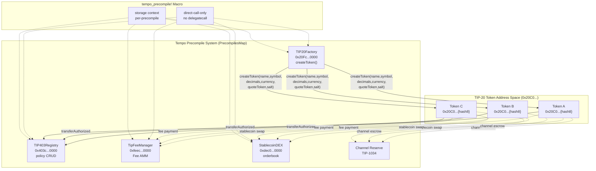
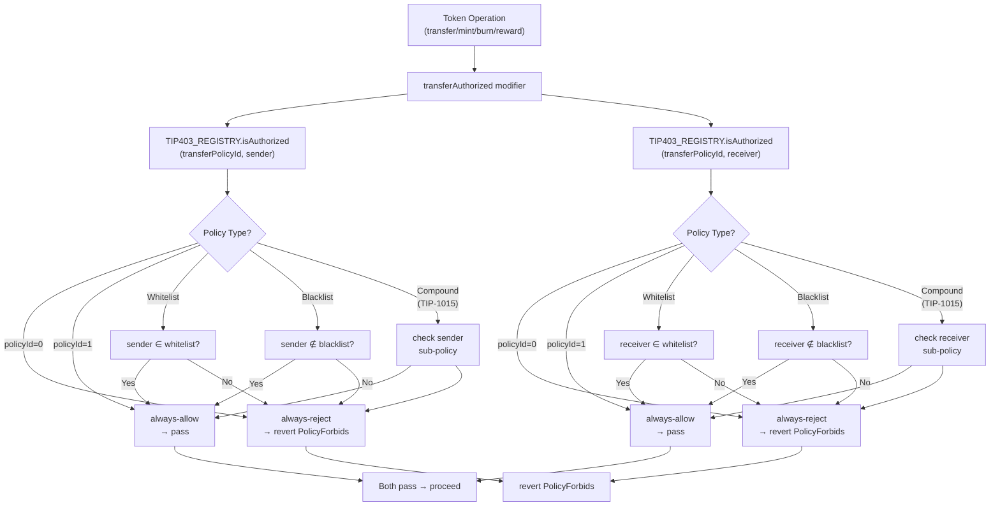
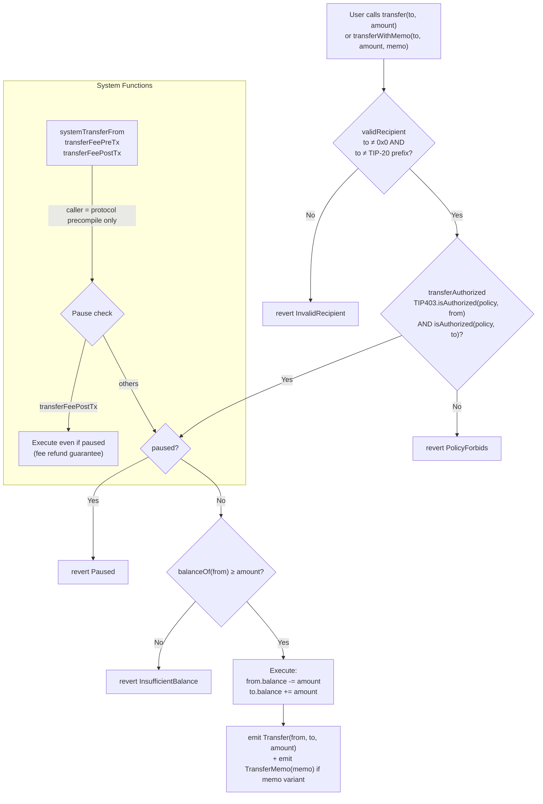
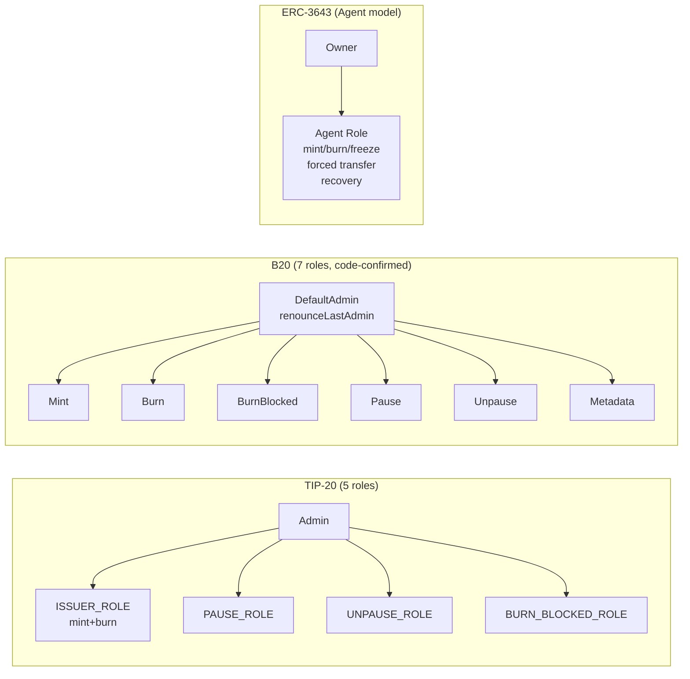
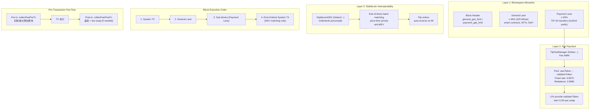
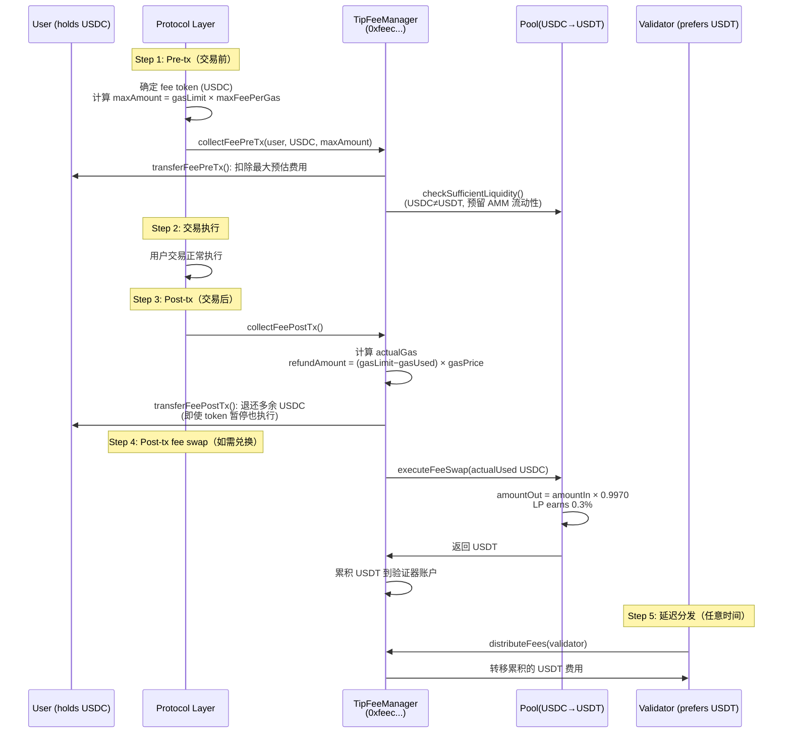
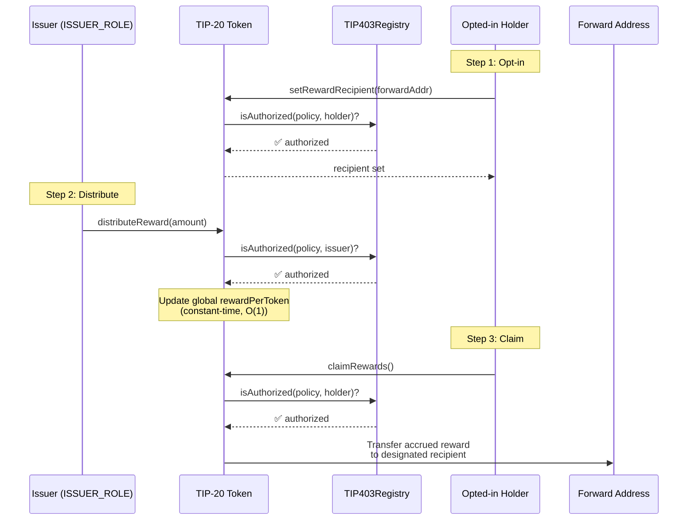
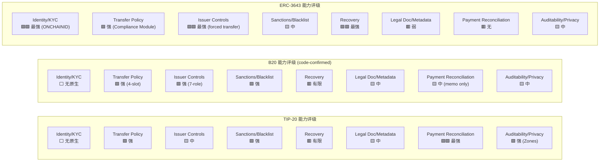

# Tempo TIP-20 + TIP-403 深度分析

## Executive Summary

TIP-20 是 Tempo 链的原生 token 标准，以 precompile suite 形式实现，代表了「支付型合规 token」的设计范式。与 ERC-3643 在应用层通过 Solidity 合约堆栈实现 identity 验证和 transfer 控制不同，TIP-20 将 token 操作、合规 policy、支付基础设施和 rewards 分发统一内嵌于协议层 precompile。与 Base 的 B20 同属协议层合规路线，但 TIP-20 在支付优化维度——Payment Lanes、Fee AMM、StablecoinDEX、32-byte memo、Channel Reserve——具有显著差异化。

本文基于 Tempo 官方文档站（docs.tempo.xyz）和公开技术资料，对 TIP-20 及其配套的 TIP-403 Policy Registry 进行系统技术分析。涵盖核心 precompile 架构（Factory、确定性地址派生、ERC-20 兼容层）、TIP-403 合规机制（whitelist/blacklist/compound policy、跨 token 共享）、完整 transfer 流程、RBAC 权限模型、三层支付基础设施（Payment Lanes + Fee AMM + StablecoinDEX）、rewards 分发、7 个扩展 TIPs、生态集成（Chainalysis、Zones、KlarnaUSD），以及按 WHI-177 建立的 8 类合规能力 Taxonomy 进行的焦点映射与 B20/ERC-3643 对比。

> **证据约束声明**：`tempoxyz/tempo`（pinned commit `2b0bb3025ebc`）和 `tempoxyz/docs`（pinned commit `7035c72cdc`）源码仓库在本次分析中未同步到工作环境（C1 约束）。所有技术声明标注为 docs-stated 而非 code-confirmed，除非另有说明。B20 对比数据来自 WHI-177 landscape research（code-confirmed at `base/base@8e8767281d`）。

---

## 1. TIP-20 核心架构——Precompile Suite 实现

### 1.1 Precompile 注册与地址空间

TIP-20 tokens 是 Tempo 核心协议的内置优化 token 实现。与 Solidity 合约不同，TIP-20 tokens 作为 precompile 存在于 `0x20C0…` 地址空间，没有部署 bytecode 和创建交易 [docs-stated: [TIP-20 Spec](https://docs.tempo.xyz/protocol/tip20/spec)]。

Tempo 将特定 precompile 注册到 PrecompilesMap 中，通过安装一个按地址匹配的 lookup function 完成注册。`tempo_precompile!` 宏为每个 precompile 强制 direct-call-only（禁止 delegatecall）并设置 storage context [docs-stated: [TIP-20 Spec](https://docs.tempo.xyz/protocol/tip20/spec)]。

**PrecompilesMap 完整注册列表**（docs-stated）：

| Precompile | 地址 / 前缀 | 功能 |
|-----------|------------|------|
| TIP-20 Tokens | `0x20C0…`（12 字节前缀匹配） | TIP-20 token 实例 |
| TIP20Factory | `0x20Fc000000000000000000000000000000000000` | Token 创建入口 |
| TIP403Registry | `0x403c000000000000000000000000000000000000` | Policy 注册与管理 |
| TipFeeManager | `0xfeec000000000000000000000000000000000000` | Fee AMM 与交易费管理 |
| StablecoinDEX | `0xdec0000000000000000000000000000000000000` | 稳定币交易所 |
| NonceManager | 地址待确认 | Nonce 管理 |
| ValidatorConfig | 地址待确认 | 验证器配置 |
| AccountKeychain | 地址待确认 | 账户密钥链 |
| ValidatorConfigV2 | 地址待确认 | 验证器配置 V2 |

> **证据分类**：precompile_architecture | docs-stated（TIP-20 Spec、Fee AMM Spec、Stablecoin DEX 文档交叉确认。TipFeeManager 地址 `0xfeec…` 来自 [Fee AMM Spec](https://docs.tempo.xyz/protocol/fees/spec-fee-amm)；StablecoinDEX 地址 `0xdec0…` 来自 [DEX 文档](https://docs.tempo.xyz/protocol/exchange)。NonceManager/ValidatorConfig/AccountKeychain 地址未在公开文档中确认。）

### 1.2 TIP20Factory

TIP20Factory 是 TIP-20 token 创建的唯一规范入口 [docs-stated: [TIP-20 Spec](https://docs.tempo.xyz/protocol/tip20/spec)]。

**createToken 参数**：

| 参数 | 描述 | 约束 |
|------|------|------|
| name | Token 名称 | 字符串 |
| symbol | Token 符号 | 字符串 |
| decimals | 小数位数 | TIP-20 始终返回 6 [docs-stated] |
| currency | ISO 4217 三字母货币代码 | "USD" / "EUR" / "GBP" 等；创建时设定不可更改 |
| quoteToken | 报价 token 地址 | 必须为已部署 TIP-20；currency=="USD" 的 token 必须指定 USD quoteToken |
| salt | 地址派生种子 | 用于确定性地址计算 |
| supplyCap | 最大供应量上限 | 默认 `type(uint128).max` |

**初始化默认值**（docs-stated）：`transferPolicyId = 1`（always-allow）、`supplyCap = type(uint128).max`、`paused = false`、`totalSupply = 0`。

### 1.3 确定性地址派生

新创建的 TIP-20 token 地址由确定性算法派生 [docs-stated: [TIP-20 Spec](https://docs.tempo.xyz/protocol/tip20/spec)]：

```
address = TIP20_PREFIX || lowerBytes
```

- `TIP20_PREFIX`：12 字节 `20C000000000000000000000`
- `lowerBytes`：`keccak256(msg.sender, salt)` 的最高 64 位（8 字节）

前 1000 地址（`lowerBytes < 1000`）保留给协议，不可通过 Factory 部署。

**碰撞概率分析**（inferred）：地址由 8 字节（64 位）hash 输出决定，理论碰撞概率约 1/2^64 ≈ 5.4×10^-20。由于 salt 由创建者控制，且 keccak256 被认为是抗碰撞的，在预期部署数量范围内碰撞概率可忽略。

### 1.4 ERC-20 向后兼容

TIP-20 暴露完整的 ERC-20 接口 [docs-stated]：

**标准 ERC-20 函数**：`name()`、`symbol()`、`decimals()`（始终返回 6）、`totalSupply()`、`balanceOf(address)`、`transfer(to, amount)`、`transferFrom(from, to, amount)`、`approve(spender, amount)`、`allowance(owner, spender)`。

**TIP-20 扩展**：
- **Memo 支持**：`transferWithMemo(to, amount, memo)`、`transferFromWithMemo(from, to, amount, memo)`、`mintWithMemo(to, amount, memo)`、`burnWithMemo(from, amount, memo)` — 32-byte memo 参数
- **Rewards**：`setRewardRecipient(address)`、`distributeReward(amount)`、`claimRewards()`
- **配置**：`currency()`（ISO 4217）、`quoteToken()`、`transferPolicyId()`、`supplyCap()`、`paused()`

### 1.5 Transfer 限制

TIP-20 token 不能被发送到其他 TIP-20 token 合约地址。`validRecipient` 守卫拒绝 [docs-stated]：
- 零地址（`address(0)`）
- 具有 TIP-20 前缀 `0x20c000000000000000000000` 的地址

### 1.6 ERC-7572 Contract URI / TIP-1026 logoURI

**TIP-1026**：添加可选 onchain `logoURI` 元数据字段。钱包、浏览器和 token-list 工具可直接使用链上元数据，替代依赖链下 token registry [docs-stated: [TIPs 页面](https://docs.tempo.xyz/protocol/tips)]。

**ERC-7572 contractURI()**：标准化 `contractURI()` 返回合约级元数据。TIP-20 是否实现 ERC-7572 接口尚未在公开文档中明确确认 [待验证]。

### diag-1: TIP-20 Precompile 架构图



---

## 2. TIP-403 Policy Registry 合规机制

### 2.1 Registry 架构

TIP403Registry 是全局单例 precompile，部署于 `0x403c000000000000000000000000000000000000` [docs-stated: [TIP-403 Spec](https://docs.tempo.xyz/protocol/tip403/spec)]。所有 TIP-20 token 的合规 policy 在此注册和管理。

**Policy ID 分配**：
- `policyId = 0`：always-reject（拒绝所有 token transfer）[docs-stated]
- `policyId = 1`：always-allow（允许所有 token transfer；Factory 创建 token 的默认 transferPolicyId）[docs-stated]
- `policyId >= 2`：用户创建的自定义 policy，policyIdCounter 从 2 开始自增 [docs-stated]

### 2.2 Policy 类型

**Whitelist Policy**：仅列表中地址可参与 transfer。所有不在列表中的地址被阻止。适用场景：KYC 验证后的合格投资者池。[docs-stated]

**Blacklist Policy**：列表中地址被阻止，其他所有地址允许。适用场景：制裁合规（OFAC 名单等）。[docs-stated]

**Compound Policy（TIP-1015 扩展）**：为 sender、recipient 和 mint recipient 指定不同的简单策略。结构不可变（创建后不能修改引用的简单策略 ID），但被引用的简单策略本身可由各自 admin 修改 [docs-stated: [TIPs 页面](https://docs.tempo.xyz/protocol/tips)]。

典型场景：receiver 需要 KYC whitelist（仅验证过的地址可接收），sender 使用 always-allow（任何持有者可发送）。通过 compound policy 实现差异化的 sender/receiver 合规规则，无需为每种组合创建独立 token。

### 2.3 Policy 管理接口

| 函数 | 功能 | 权限 |
|------|------|------|
| createPolicy(admin, policyType) | 创建新 whitelist 或 blacklist policy | 任何人可调用 |
| updateAllowlist(policyId, addresses, allow) | 添加/移除 whitelist 成员 | Policy admin |
| updateBlocklist(policyId, addresses, block) | 添加/移除 blacklist 成员 | Policy admin |
| stageUpdateAdmin(policyId, newAdmin) | 发起 admin 转移（两阶段） | 当前 admin |
| finalizeUpdateAdmin(policyId) | 完成 admin 转移 | 新 admin |
| renounceAdmin(policyId) | 永久放弃管理权 | 当前 admin |

> **证据分类**：policy_mechanism | docs-stated（TIP-403 Spec + tempo-std ITIP403Registry.sol 接口描述）

### 2.4 跨 Token 共享

一个 policy 可被多个 TIP-20 token 引用。当 policy 更新（如 whitelist 添加/移除地址），**所有引用该 policy 的 token 立即生效** [docs-stated]。

关键设计：同一 policy 不仅在 token transfer 中生效，还在 StablecoinDEX 和 Rewards 系统中强制执行。被 blocked 的地址无法通过 DEX 交换或 reward 领取绕过 policy [docs-stated: [TIP-20 Overview](https://docs.tempo.xyz/protocol/tip20/overview)]。

### 2.5 Chainalysis 集成

Chainalysis 于 2026 年 3 月宣布对 Tempo 的自动 token 覆盖支持 [secondary-source: [Chainalysis Blog](https://www.chainalysis.com/blog/tempo-automatic-token-coverage-march-2026/)]。

**已确认的能力**：
- **自动 token 监控**：TIP-20 token 自动纳入 Chainalysis 监控范围 [secondary-source]
- **Memo 解码**：Chainalysis 解码 TIP-20 transfer memo 进行 AML 合规监控 [secondary-source]

**未确认的能力**（审稿人 caveat #2 适用）：
- Chainalysis 是否自动维护 TIP-403 blacklist policy（即检测到制裁地址后自动更新 policy 的地址列表）——**公开文档和 Chainalysis 公告均未明确确认此功能**。现有证据仅支持 Chainalysis 提供监控和告警，policy 更新是否由 Chainalysis 自动触发还是需要发行方手动操作，需要进一步确认 [待验证]。

### 2.6 Tempo Zones 集成

TIP-403 policy 控制 token 在 Zones（隐私执行环境）中的参与资格 [docs-stated: [Tempo Zones Blog](https://tempo.xyz/blog/introducing-tempo-zones/)]：
- **Whitelist policy 的 token**：issuer 需显式 enable zone 才可在该 zone 内转账
- **Blacklist policy 的 token**：除非 issuer 显式 disable zone，否则默认可在 zone 内转账
- **Zone 内转账保留 TIP-403 policy 检查**：zone 内的所有 token 操作仍受 policy 约束

### diag-2: TIP-403 Policy 执行流程图



---

## 3. Transfer 流程与合规执行路径

### 3.1 标准 Transfer 流程

完整执行路径 [docs-stated: [TIP-20 Spec](https://docs.tempo.xyz/protocol/tip20/spec)]：

1. **用户调用** `transfer(to, amount)` 或 `transferFrom(from, to, amount)`
2. **validRecipient 守卫**：检查 `to != address(0)` 且 `to` 不具有 TIP-20 前缀 `0x20c000000000000000000000`
3. **transferAuthorized modifier**：
   - 调用 `TIP403_REGISTRY.isAuthorized(transferPolicyId, from)` 检查 sender
   - 调用 `TIP403_REGISTRY.isAuthorized(transferPolicyId, to)` 检查 receiver
   - 两者必须都返回 true，否则 revert `PolicyForbids`
4. **Pause 检查**：token 处于 paused 状态时 revert
5. **余额检查**：`balanceOf(from) >= amount`
6. **状态变更**：扣减 `from` 余额，增加 `to` 余额
7. **事件发出**：`Transfer(from, to, amount)`

### 3.2 Memo Transfer 变体

`transferWithMemo(to, amount, memo)` 和 `transferFromWithMemo(from, to, amount, memo)` 执行与标准 transfer 相同的检查流程，额外接受 32-byte `memo` 参数。Memo 通过事件发出，不存储在链上状态中 [docs-stated]。

同理，`mintWithMemo(to, amount, memo)` 和 `burnWithMemo(from, amount, memo)` 在 mint/burn 基础上附加 memo。

### 3.3 Mint/Burn 流程

**Mint**：需要 ISSUER_ROLE。执行 transferAuthorized 检查（sender=address(0), receiver=to）。额外检查 `totalSupply + amount <= supplyCap` [docs-stated]。

**Burn**：需要 ISSUER_ROLE。执行 transferAuthorized 检查 [docs-stated]。

**BurnBlocked**：需要 BURN_BLOCKED_ROLE。目标地址必须被当前 TIP-403 policy 阻止（即 `isAuthorized(transferPolicyId, target)` 返回 false）。用于销毁制裁地址的余额 [docs-stated]。

### 3.4 Reward 操作

`distributeReward`、`setRewardRecipient`、`claimRewards` 同样执行 TIP-403 authorization 检查 [docs-stated]。被 blocked 的地址无法设置 reward recipient、分发 reward 或领取 reward。Pause 状态覆盖所有 reward 操作 [docs-stated]。

### 3.5 系统级函数

| 函数 | 调用权限 | Pause 行为 | 用途 |
|------|---------|-----------|------|
| `systemTransferFrom` | 仅其他 Tempo 协议 precompile | 尊重 pause [docs-stated] | 内部 accounting |
| `transferFeePreTx` | 仅其他 Tempo 协议 precompile | 尊重 pause（暂停时 revert）[docs-stated] | 交易费预扣 |
| `transferFeePostTx` | 仅其他 Tempo 协议 precompile | **故意在暂停时仍可执行** [docs-stated] | 交易费退还 |

`transferFeePostTx` 的特殊设计：确保暂停 token 的交易本身能成功完成并获得 fee refund。除此特定退还操作外，暂停后不允许其他 token 转移 [docs-stated]。

### diag-3: TIP-20 完整 Transfer 流程图



---

## 4. RBAC 与发行方控制

### 4.1 TIP-20 角色模型

TIP-20 使用基于角色的访问控制系统（TIP20Roles），通过 `grantRole`、`revokeRole`、`renounceRole` 和 `setRoleAdmin` 管理 [docs-stated: [TIP-20 Spec](https://docs.tempo.xyz/protocol/tip20/spec), [tempo-std ITIP20RolesAuth.sol](https://github.com/tempoxyz/tempo-std)]。

| 角色 | 功能 | 权限范围 |
|------|------|----------|
| **Admin** | grantRole / revokeRole / renounceRole / setRoleAdmin | 角色管理元权限 |
| **ISSUER_ROLE** | mint / burn / mintWithMemo / burnWithMemo | 供应量控制（铸造/销毁） |
| **PAUSE_ROLE** | pause token | 紧急暂停——冻结所有 transfer、mint、burn、reward 操作 |
| **UNPAUSE_ROLE** | unpause token | 恢复操作——解除暂停 |
| **BURN_BLOCKED_ROLE** | burnBlocked(target, amount) | 销毁被 TIP-403 policy 阻止的地址余额（制裁执行） |

**Pause 和 Unpause 分离设计**：不同于某些实现中 pause/unpause 由同一角色控制，TIP-20 将二者分离为独立角色，允许更细粒度的权限委派。例如，安全团队持有 PAUSE_ROLE 用于紧急响应，高级管理层持有 UNPAUSE_ROLE 确保恢复操作经过审批 [docs-stated]。

### 4.2 与 B20 RBAC 对比

B20 定义 7 个内置角色（code-confirmed at `base/base@8e8767281d`，`crates/common/precompiles/src/common/ops/roles.rs`）[来源: WHI-177 landscape research]：

| 对比维度 | TIP-20 | B20 (code-confirmed) |
|---------|--------|---------------------|
| 角色数量 | 5（含 Admin） | 7（含 DefaultAdmin） |
| Mint | ISSUER_ROLE（含 mintWithMemo） | Mint role |
| Burn | ISSUER_ROLE（同时控制 mint 和 burn） | Burn role（与 Mint 分离） |
| BurnBlocked | BURN_BLOCKED_ROLE | BurnBlocked role |
| Pause | PAUSE_ROLE | Pause role |
| Unpause | UNPAUSE_ROLE | Unpause role |
| Metadata | 无专门角色（TIP-1026 logoURI 管理方式待确认） | Metadata role（updateName/updateSymbol） |
| Operator | 无 | OPERATOR_ROLE（仅 Asset 变体） |
| Admin 安全 | renounceRole 标准实现 | renounceLastAdmin 保护——拒绝对最后一个 DefaultAdmin 的 revoke/renounce |

**关键差异**：
1. TIP-20 将 mint 和 burn 合并为 ISSUER_ROLE；B20 将二者分离，允许更细粒度的供应量操作权限委派
2. B20 的 renounceLastAdmin 安全机制防止意外放弃所有管理权限——TIP-20 是否有等价保护机制未在公开文档中确认 [待验证]
3. B20 Asset 变体额外有 OPERATOR_ROLE 和 announcement 机制（in_announcement 标志防止递归调用）

### 4.3 与 ERC-3643 对比

ERC-3643 使用 Agent role 模型 [来源: WHI-177 landscape research]：

| 控制能力 | TIP-20 | B20 (code-confirmed) | ERC-3643 |
|---------|--------|---------------------|----------|
| Mint | ✅ ISSUER_ROLE | ✅ Mint role | ✅ Agent role |
| Burn | ✅ ISSUER_ROLE | ✅ Burn role | ✅ Agent role |
| Burn Blocked | ✅ BURN_BLOCKED_ROLE | ✅ BurnBlocked role | ❌ 通过 freeze + burn 间接实现 |
| Pause (global) | ✅ PAUSE_ROLE | ✅ Pause role | ✅ Agent role |
| Unpause | ✅ UNPAUSE_ROLE | ✅ Unpause role | ✅ Agent role |
| Freeze (address-level) | ❌ 通过 TIP-403 blacklist 间接实现 | ❌ 通过 policy blocklist 间接实现 | ✅ Agent freeze/unfreeze |
| Forced Transfer | ❌ 不支持 | ❌ 不支持 | ✅ Agent forced transfer |
| Recovery | ❌ 仅 burnBlocked | ❌ 仅 burnBlocked | ✅ ONCHAINID 密钥轮转 + forced transfer |
| Metadata Update | ❌ 无专门机制 | ✅ Metadata role | ❌ 无原生支持 |
| Supply Cap | ✅ 创建时设定 | ✅ code-confirmed | ❌ 无原生支持 |

**核心差异**：TIP-20 和 B20 均不支持 forced transfer（只能 burn 被阻止地址的余额，不能将 token 转移到其他地址）。这是协议层方案与应用层方案在 Recovery 能力上的根本差异——ERC-3643 可通过 Agent forced transfer 将 token 恢复给合法所有者，而协议层方案只能销毁。

### diag-4: RBAC 权限矩阵



---

## 5. 支付优化——Payment Lanes、Fee AMM 与 StablecoinDEX

### 5.1 Payment Lanes

Payment Lanes 是 TIP-20 最显著的差异化特性之一——在区块空间层面为支付交易保留专用容量 [docs-stated: [TIP-20 Overview](https://docs.tempo.xyz/protocol/tip20/overview)]。

**分类方法**：如果交易调用的合约具有 TIP-20 地址前缀 `0x20c0`，该交易被分类为支付交易。分类基于纯交易数据（`tx.to` 地址前缀），无需访问链上状态 [docs-stated]。

**Blockspace 分配** [docs-stated]：
- 非支付交易：上限 45% 总 Gas 限制（225 MGas）
- 支付交易：保证至少 55% 区块空间
- TIP-1045（T5 hardfork）：形式化 payment-lane 资格，引入显式共识 allow-list [docs-stated: [TIPs 页面](https://docs.tempo.xyz/protocol/tips)]

**Block 执行顺序** [docs-stated, secondary-source: [Seungmin Jeon 分析](https://medium.com/@organmo/tempo-architecture-analysis-2-stablecoin-gas-and-the-payment-only-lane-134f2150b9ae)]：
1. System transactions（协议级操作）
2. General lane（proposer transactions，非支付交易受 45% 上限约束）
3. Sub-blocks（payment lane 交易）
4. End-of-block system transactions（StablecoinDEX 撮合）

> **Fee AMM 时序说明**：Fee AMM（fee swap）不在 end-of-block 批量执行。每笔交易有独立的 pre-tx/post-tx fee 步骤：pre-tx 收取最大预估费用，post-tx 计算实际 Gas、退还多余费用并在需要时立即执行 fee swap（见 5.2 节）[docs-stated: [Fee Spec](https://docs.tempo.xyz/protocol/fees/spec-fee), [Fee AMM Spec](https://docs.tempo.xyz/protocol/fees/spec-fee-amm)]。仅 StablecoinDEX 撮合在 end-of-block 批量执行。

### 5.2 Fee AMM

Fee AMM 是内嵌于 Tempo 网络的单向 AMM 系统，定位为支付基础设施而非通用交易所 [docs-stated: [Fee AMM Spec](https://docs.tempo.xyz/protocol/fees/spec-fee-amm)]。

**核心设计**：Tempo 无原生 Gas token。用户用任意 USD 计价的 TIP-20 稳定币支付交易费。Fee AMM 自动将用户支付的稳定币转换为验证器偏好的稳定币。

**FeeManager Precompile**：地址 `0xfeec000000000000000000000000000000000000`。单例合约，实现所有 Fee AMM 池的功能。FeeManager 处理每笔交易中的 fee 收取与退还、立即执行 fee swap、存储用户和验证器的 fee token 偏好、以及累积验证器费用供 `distributeFees()` 提取 [docs-stated: [Fee AMM Spec](https://docs.tempo.xyz/protocol/fees/spec-fee-amm)]。

**逐笔交易 Fee 生命周期** [docs-stated: [Fee Spec](https://docs.tempo.xyz/protocol/fees/spec-fee), [Fee AMM Spec](https://docs.tempo.xyz/protocol/fees/spec-fee-amm)]：

1. **Pre-tx（交易前）**：协议确定用户的 fee token（优先级：显式 tx fee token → `setUserToken` 调用 → 存储的用户偏好 → `tx.to` 如为 TIP-20 地址），计算最大费用 `maxAmount = gasLimit × maxFeePerGas`。调用 `FeeManager.collectFeePreTx(user, userToken, maxAmount)`：通过 `transferFeePreTx()` 从用户扣除最大预估费用；若 userToken ≠ validatorToken，调用 `checkSufficientLiquidity()` 预留 AMM 流动性。余额不足或流动性不足时交易无效 [docs-stated]。
2. **交易执行**：用户交易正常执行。
3. **Post-tx（交易后）**：协议调用 `FeeManager.collectFeePostTx()`：计算实际 Gas 使用量，`refundAmount = (gasLimit − gasUsed) × gasPrice`；通过 `transferFeePostTx()` 将多余费用退还给用户（**即使 token 处于暂停状态也执行**，保证 fee refund）；若 userToken ≠ validatorToken 且 `actualUsed > 0`，立即通过 `executeFeeSwap()` 执行 fee swap（`amountOut = amountIn × 0.9970 / SCALE`），将费用从 userToken 转换为 validatorToken [docs-stated]。
4. **延迟分发**：验证器费用在 FeeManager 合约中累积。验证器（或任何人）可随时调用 `distributeFees(validator)` 提取累积费用 [docs-stated]。

> **关键区分**：Fee swap 是逐笔交易（per-transaction）在 post-tx 步骤中立即执行的，不是 end-of-block 批量操作。Pre-tx 和 post-tx 步骤不消耗额外 Gas [docs-stated]。

**Pool 结构** [docs-stated]：
- 每个 pool 由 userToken（用户持有的稳定币）和 validatorToken（验证器偏好的结算稳定币）组成
- 对于 token A 和 B，存在两个独立 pool：Pool(A,B) 和 Pool(B,A)
- 仅 `currency == "USD"` 的 token 可用于支付交易费

**固定汇率模型** [docs-stated]：
- Fee Swap：固定汇率 0.9970 validatorToken per userToken（用户支付 0.3% 费用）
- Rebalancing Swap：固定汇率 0.9985 validatorToken per userToken（任何人可执行反向操作）
- 不依赖外部市场价格；不使用 xy=k 等价格发现机制

**MEV 保护** [docs-stated: [Fee AMM Spec](https://docs.tempo.xyz/protocol/fees/spec-fee-amm)]：
- 固定汇率 fee swap 消除了 backrunning 的盈利空间（No Probabilistic MEV）
- 无法通过 spam 交易获利
- Fee swap 在固定汇率下执行，消除三明治攻击向量

**流动性提供** [docs-stated]：
- 仅 validatorToken 可作为流动性存入；不允许存入 userToken
- LP 在每次 swap 中赚取 0.3% 费用
- LP 角色类似于出售一个以固定汇率兑换稳定币的永续期权

**已知风险**：stablecoin 脱锚事件会导致固定汇率与市场价格脱离，产生套利机会，LP 可能遭受损失 [secondary-source: [Seungmin Jeon 分析](https://medium.com/@organmo/tempo-architecture-analysis-2-stablecoin-gas-and-the-payment-only-lane-134f2150b9ae)]。

### 5.3 StablecoinDEX

StablecoinDEX 是 singleton orderbook precompile，部署于 `0xdec0000000000000000000000000000000000000`，专门用于同一底层资产的稳定币之间交易 [docs-stated: [DEX 文档](https://docs.tempo.xyz/protocol/exchange)]。

**撮合模型** [docs-stated]：
- 不连续撮合：新订单在 block 内积累，end-of-block system call 批量撮合
- 减少 MEV：无法在订单提交和撮合之间插入额外交易
- 按 price tick 分组，price-time priority 排序

**Flip Orders** [docs-stated]：
- 自动反向订单类型：被成交后自动切换到对立方向
- TIP-1030：允许 flip order 在同一 tick 反转
- TIP-1056：flip 后保持 orderId 不变

**交易对确定**：每个 TIP-20 token 在创建时指定 quoteToken，交易对由此确定 [docs-stated]。

**TIP-403 Policy 执行**：DEX 内的交换同样受 TIP-403 policy 约束——被 blocked 地址无法通过 DEX 获取 token [docs-stated]。

### 5.4 TIP-1034 Channel Reserve Precompile

TIP-1034（T5 hardfork）将 channel reserve 内嵌为原生 precompile [docs-stated: [TIPs 页面](https://docs.tempo.xyz/protocol/tips)]：

**功能**：channel open、settle、top-up、close、request-close、withdraw — 完整的链上支付通道生命周期管理。

**Gas 声明**：声称比 legacy MPP（Machine Payments Protocol）合约节省最高 72% Gas。此数字出现在宣传材料中；TIP-1034 spec 原文描述为 "reducing overhead and making gas behavior more predictable" [docs-stated/secondary-source: 72% 数字为 secondary-source claim，精确百分比未在 spec 中找到]。

**Payment-lane 资格**：MPP 迁移到 protocol-native channel reserve 路径以获得 payment-lane 资格 [docs-stated]。

### 5.5 Sub-millidollar 成本与性能

| 指标 | 数值 | 证据等级 |
|------|------|---------|
| TPS | 18,000（T5 hardfork） | docs-stated |
| Block time | 500ms 平均 | docs-stated |
| Finality | ~0.5s deterministic | docs-stated |
| Transfer cost | < $0.001 目标 | docs-stated |
| TPS 路线图 | 200,000+ | docs-stated |

### diag-5: 支付基础设施三层架构图



### diag-6: Fee AMM 逐笔交易生命周期图



---

## 6. Transfer Memos 与 Payment Reconciliation

### 6.1 32-byte Memo 字段

TIP-20 在标准 ERC-20 transfer 基础上添加 32-byte memo 参数 [docs-stated: [TIP-20 Spec](https://docs.tempo.xyz/protocol/tip20/spec)]。

**支持的函数**：
- `transferWithMemo(address to, uint256 amount, bytes32 memo)`
- `transferFromWithMemo(address from, address to, uint256 amount, bytes32 memo)`
- `mintWithMemo(address to, uint256 amount, bytes32 memo)`
- `burnWithMemo(address from, uint256 amount, bytes32 memo)`

**Memo 语义**：memo 通过事件发出（event log），不存储在链上状态中。32 字节可编码多种支付标识：UUID（16 字节 + 填充）、数字发票号、自定义对账标识 [docs-stated]。

### 6.2 ISO 4217 Currency Identifier

每个 TIP-20 token 在创建时通过 `currency` 参数指定 ISO 4217 三字母代码 [docs-stated]。

**生态功能**：
- `currency()` 返回三字母代码（"USD"/"EUR"/"GBP" 等），创建后不可更改
- `currency == "USD"` 是支付交易费的前提条件——只有 USD token 可用于 Fee AMM
- StablecoinDEX 利用 currency 标识路由同一底层资产的不同 token
- 跨 token 的同一底层资产识别：所有 `currency == "USD"` 的 token 被视为同质化的 USD 表示

### 6.3 Chainalysis Memo 解码

Chainalysis 原生集成 TIP-20 memo 解码进行 AML 监控 [secondary-source: [Chainalysis Blog](https://www.chainalysis.com/blog/tempo-automatic-token-coverage-march-2026/)]。使得传统支付系统的 reference ID 在链上可追溯、可审计——支付处理商可在 memo 中嵌入发票 ID，Chainalysis 可解析此信息进行合规交叉核对。

### 6.4 与传统支付系统对接

**模式 A：单一 Hot Wallet + Memo**
- Exchange 使用一个 master hot wallet 接收所有客户存款
- 客户在 transfer memo 中包含其客户 ID
- 后端解析 Transfer 事件中的 memo 进行入账
- 优势：无需管理大量存款地址，Gas 成本最低

**模式 B：TIP-1022 Virtual Address**
- 为每个客户生成虚拟存款地址
- Deposit 自动在协议层转发到 master wallet
- 消除传统 sweep 交易的 Gas 成本和运维复杂度
- 消除 per-deposit-address 的状态创建和 state bloat [docs-stated]

---

## 7. Rewards 分发机制

### 7.1 Opt-in 模型

TIP-20 内置 rewards distribution system，不需要单独的 staking 合约或 merkle drop [docs-stated: [TIP-20 Rewards Overview](https://docs.tempo.xyz/protocol/tip20-rewards/overview)]。

**Opt-in 流程**：
1. 用户调用 `setRewardRecipient(address recipient)` 设置 reward recipient
2. `recipient` 可以是用户自身地址（直接领取）或指定的转发地址（如基金管理公司地址）
3. 未调用 `setRewardRecipient` 的用户不参与 reward 分配
4. `setRewardRecipient` 同样执行 TIP-403 authorization 检查 [docs-stated]

### 7.2 分发与领取

**distributeReward(amount)**：
- 可由任何人调用，向所有 opted-in 持有者按持有比例分配 reward [docs-stated]
- Constant-time 更新：无论 token 持有者数量多少，单次 distributeReward 的 Gas 恒定 [docs-stated]
- 实现算法推测（inferred）：使用 cumulative reward-per-token 记账模型——每次 distribute 时更新全局 rewardPerToken 值，每个用户在 claim 时根据其 balance 和上次 claim 时的 rewardPerToken 差值计算应得 reward

**claimRewards()**：
- 由 opted-in 持有者调用领取累积 reward [docs-stated]
- 执行 TIP-403 authorization 检查——被 blocked 地址无法 claim [docs-stated]

### 7.3 合规整合

所有 reward 操作受 TIP-403 policy 和 pause 控制约束 [docs-stated]：
- `distributeReward`：执行 policy 检查
- `setRewardRecipient`：执行 policy 检查
- `claimRewards`：执行 policy 检查
- 暂停状态覆盖所有 reward 操作

不存在通过 reward 侧信道绕过 policy 的漏洞——被 blocked 地址无法通过 reward 领取接收 token [docs-stated]。

### 7.4 与传统方案对比

| 方案 | TIP-20 Rewards | Solidity Staking Contract | Merkle Drop |
|------|---------------|--------------------------|-------------|
| 部署成本 | 零（内置于 precompile） | 合约部署 Gas | 合约部署 + root 更新 Gas |
| 分发 Gas | O(1) constant-time [docs-stated] | O(n) 或 O(1)（取决于实现） | O(1) per claim |
| 合规整合 | 自动 TIP-403 检查 | 需额外实现 | 无内置合规 |
| 标准化 | 所有 TIP-20 token 统一支持 | 每 token 独立实现 | 每 token 独立实现 |
| 用例 | 利息型稳定币收益分发 | DeFi staking/farming | 空投/回溯奖励 |

### diag-7: Rewards 分发流程图



---

## 8. 扩展 TIPs 技术分析

### 8.1 TIP-1004: EIP-2612 Permit

**问题**：标准 ERC-20 approve 需要单独交易，增加用户操作步骤和 Gas 成本。
**方案**：实现 EIP-2612 permit，允许通过 off-chain 签名授权 token 使用，避免单独 approve 交易 [docs-stated]。
**合规能力映射**：提升用户体验，与 B20 的 Permittable（EIP-2612 permit, code-confirmed）对等。

### 8.2 TIP-1006: burnAt

**问题**：ISSUER_ROLE 的 burn 函数仅允许 burn 自身持有的 token（`burn(amount)`）。
**方案**：`burnAt(address, amount)` 授权管理员从任意地址 burn token。扩展 ISSUER_ROLE 能力边界 [docs-stated]。
**合规能力映射**：Issuer Controls——增强发行方对供应量的控制粒度。

### 8.3 TIP-1015: Compound Policies

**问题**：基础 TIP-403 policy 对 sender 和 receiver 应用同一规则，无法实现差异化合规。
**方案**：compound policy 引用三个简单策略（sender policy / recipient policy / mint recipient policy），结构创建后不可变，但被引用的简单策略可由各自 admin 独立修改 [docs-stated]。
**合规能力映射**：Transfer Policy——与 B20 的 4-slot policy（TransferSender/TransferReceiver/TransferExecutor/MintReceiver）对比：TIP-1015 支持 3 slot（sender/receiver/mint receiver），B20 额外支持 TransferExecutor slot（委托转账执行者检查）[B20 data: code-confirmed]。

### 8.4 TIP-1022: Virtual Address Deposit Forwarding

**问题**：传统 exchange 为每个客户创建独立存款地址，需要初始化、监控和 sweep 每个地址——Gas 成本高且运维复杂。
**方案**：precompile-native 虚拟地址，deposit 自动在协议层转发到注册的 master wallet。消除 per-address 状态创建和 state bloat [docs-stated]。
**合规能力映射**：Payment Reconciliation——TIP-20 独有功能，B20 和 ERC-3643 无等价机制。

> **审稿人 caveat #3**：TIP-1022 是否具有 "recovery authority" 语义（即虚拟地址的资金恢复能力）——**公开文档未明确描述此功能用于 Recovery 场景**。将 TIP-1022 的 Recovery 能力标注为 [待验证]。

### 8.5 TIP-1026: Token Logo URI

**问题**：token 品牌信息（logo）依赖链下 registry，存在中心化风险和更新延迟。
**方案**：可选 onchain `logoURI` 元数据字段。钱包和浏览器可直接读取链上数据 [docs-stated]。
**合规能力映射**：Legal Document / Metadata——增强 token 链上可发现性。

### 8.6 TIP-1034: Channel Reserve Precompile

**问题**：legacy MPP 合约作为 Solidity 实现，Gas 开销高且不具备 payment-lane 资格。
**方案**：将 channel reserve 内嵌为原生 precompile，支持 channel open/settle/top-up/close/request-close/withdraw 完整生命周期。声称比 legacy 合约节省最高 72% Gas [docs-stated/secondary-source: 72% 数字为 secondary-source claim]。
**合规能力映射**：Payment Reconciliation——支撑 Machine Payments Protocol 等 channel-based 支付应用。

### 8.7 TIP-1035: Implicit Approval List

**问题**：协议 precompile（如 DEX、Fee AMM、Channel Reserve）与 TIP-20 token 交互前需要用户 approve，增加额外交易步骤。
**方案**：建立 approved protocol precompile 白名单，这些 precompile 可直接从用户 TIP-20 余额中 pull 资金，无需 approve。保留 normal TIP-20 allowance semantics 不受影响 [docs-stated]。
**合规能力映射**：系统效率优化——确保协议级操作（fee 支付、DEX 交换、channel escrow）不因 approve 步骤中断。

### 扩展 TIPs 能力矩阵

| TIP | 类别 | 对应合规能力 | TIP-20 独有? | B20 等价机制 | 状态 |
|-----|------|-------------|-------------|-------------|------|
| TIP-1004 | 授权优化 | — | 否 | Permittable (EIP-2612, code-confirmed) | 已上线 [docs-stated] |
| TIP-1006 | 发行方控制 | Issuer Controls | 部分（burnAt 为 admin burn from arbitrary address） | Burnable trait 含类似能力 (code-confirmed) | 已上线 [docs-stated] |
| TIP-1015 | 合规策略 | Transfer Policy | 设计差异（3-slot vs B20 4-slot） | 4-slot policy（含 Executor）(code-confirmed) | 已上线 [docs-stated] |
| TIP-1022 | 支付基础设施 | Payment Reconciliation | ✅ 是 | 无等价机制 | 已上线 [docs-stated] |
| TIP-1026 | 元数据 | Legal Document / Metadata | 部分 | Metadata role (code-confirmed) | 已上线 [docs-stated] |
| TIP-1034 | 支付通道 | Payment Reconciliation | ✅ 是 | 无等价机制 | T5 hardfork [docs-stated] |
| TIP-1035 | 系统优化 | — | ✅ 是（协议 precompile 免 approve） | 无等价机制 | T5 hardfork [docs-stated] |

---

## 9. 生态合作与集成

### 9.1 Chainalysis 集成

Chainalysis 于 2026 年 3 月宣布对 Tempo 的支持 [secondary-source: [Chainalysis Blog](https://www.chainalysis.com/blog/tempo-automatic-token-coverage-march-2026/)]。

**已确认能力**：
- **自动 token 监控**：TIP-20 token 自动纳入 Chainalysis KYT（Know Your Transaction）覆盖范围
- **Memo 解码**：Chainalysis 解码 TIP-20 transfer memo 进行 AML 合规监控

**能力边界**（审稿人 caveat #2）：
- Chainalysis 提供监控和告警能力。是否自动更新 TIP-403 blacklist policy（即检测到制裁地址后自动写入 policy 地址列表）——公开文档未明确确认。
- 更可能的模型：Chainalysis 负责检测和告警，发行方（或其合规运营商）根据告警手动或半自动更新 TIP-403 policy。
- 此区分重要：automatic monitoring ≠ automatic policy enforcement。

### 9.2 跨链基础设施

**LayerZero 集成**：跨链消息传递和 token 桥接基础设施 [docs-stated: [TIP-20 Overview](https://docs.tempo.xyz/protocol/tip20/overview)]。

**Bridge 支持**：TIP-20 token 支持跨链桥接 [docs-stated]。

**AllUnity**：AllUnity 作为稳定币发行基础设施集成（具体角色和集成深度待进一步调研）[secondary-source]。

### 9.3 KlarnaUSD

首个银行发行 TIP-20 token（2025 年 12 月测试网）[secondary-source]。KlarnaUSD 验证了 TIP-20 对传统金融机构发行合规稳定币的可行性——Klarna 是一家受欧洲银行监管的机构，其选择在 Tempo 上发行 TIP-20 token 表明对 TIP-20 合规架构的信任。

### 9.4 Tempo Zones（隐私执行环境）

Tempo Zones 于 2026 年 6 月公开，定位为平行区块链形式的隐私执行环境 [secondary-source: [The Block](https://www.theblock.co/post/397820/tempo-unveils-pragmatic-privacy-solution-called-zones-a-way-to-run-permissioned-parallel-blockchains), [Tempo Blog](https://tempo.xyz/blog/introducing-tempo-zones/)]。

**架构**：
- Zone 作为独立的平行区块链连接 Tempo Mainnet
- Zone 内交易保持隐私——利用高级密码学技术（ZKP 或 MPC）验证交易有效性而不暴露底层数据
- 资产与 Mainnet、其他 Zone、onramp、流动性池完全互操作

**运营者模型**：
- 每个 Zone 由受信任实体（operator）管理
- Operator 可监控活动和控制访问，但**不控制资产**——用户保留从 mainnet 合约提取资金的能力
- 公共网络验证 batched state updates 和 proofs

**TIP-403 Policy 适用**：
- Whitelist policy 的 token：issuer 需显式 enable zone
- Blacklist policy 的 token：除非 issuer 显式 disable zone
- Zone 内所有 token 操作仍受 TIP-403 policy 约束

**合规设计**："Privacy, not secrecy"——授权实体（监管者、内部审计）可获得特殊访问密钥进行审计 [secondary-source]。

**用例**：payroll（薪资发放不暴露薪资数据）、treasury management（企业财务管理）、confidential supply chain finance（供应链金融不暴露定价条款）。

### 9.5 设计合作伙伴与性能数据

**设计合作伙伴**：Anthropic、DoorDash、Mastercard、Nubank、OpenAI、Ramp、Revolut、Shopify、Standard Chartered、Visa [secondary-source: [Tempo 官网](https://tempo.xyz/)]。

**性能数据**：

| 指标 | 数值 | 证据等级 |
|------|------|---------|
| 当前 TPS（T5） | 18,000 | docs-stated |
| Block time | 500ms | docs-stated |
| Finality | ~0.5s deterministic（Simplex consensus via Commonware） | docs-stated |
| Transfer cost | < $0.001 目标 | docs-stated |
| TPS 路线图 | 200,000+ | docs-stated |
| 共识引擎 | Reth（Paradigm）+ Simplex（Commonware） | docs-stated |

---

## 10. 合规能力 Taxonomy 映射与焦点对比

按 [WHI-177](mention://issue/f6a0c156-96f4-49df-b7c3-70109c308c5f) 建立的 8 类合规能力 Taxonomy，系统评估 TIP-20 在每一类的实现深度，并与 B20（code-confirmed at `base/base@8e8767281d`）和 ERC-3643 进行焦点对比。

### 合规能力 Taxonomy 映射表（TIP-20 深度评估）

| 能力类别 | TIP-20 实现方式 | TIP-20 设计取舍 | B20 对比 (code-confirmed) | ERC-3643 对比 | 证据等级 |
|---------|----------------|----------------|-------------------------|--------------|---------|
| **Identity / KYC** | 无原生身份层。Wallet-level TIP-403 policy（whitelist/blacklist）控制地址资格。Chainalysis 提供间接 AML 监控和 memo 解码。无链上身份合约或 claim 验证。 | 选择不在协议层实现身份模型——identity 验证委托给 off-chain KYC 流程，由发行方维护 whitelist。降低协议复杂度但牺牲链上身份可验证性。 | 同样无原生身份层。Wallet-level policy（ALLOWLIST/BLOCKLIST）。无链上身份合约。 | **最强**：ONCHAINID（ERC-734/735）完整 claim-based 身份验证链。Self-sovereign identity，链上存储 claim hash/引用（非 PII），Trusted Issuers Registry 和 Claim Topics Registry 多层验证。 | TIP-20: docs-stated; B20: code-confirmed; ERC-3643: primary-source |
| **Transfer Policy** | TIP-403 registry + TIP-1015 compound policies。3 slot：sender/recipient/mint recipient。Policy 可跨 token 共享。Built-in always-allow（1）和 always-reject（0）。StablecoinDEX 和 Rewards 同样受 policy 约束。 | Compound policy 支持差异化 sender/receiver 规则。无 executor slot（委托转账执行者不单独受检）。Policy 跨 token 共享减少管理开销但增加 policy 变更的影响范围。 | 4-slot policy：TransferSender/TransferReceiver/**TransferExecutor**/MintReceiver。Policy 跨 token 共享。ALLOWLIST + BLOCKLIST。B20 额外有 TransferExecutor slot 检查委托转账执行者。 | Compliance Module 可插拔规则引擎（投资者上限、司法管辖限制、锁定期）。Identity Registry isVerified() 检查。规则可独立升级。 | TIP-20: docs-stated; B20: code-confirmed; ERC-3643: primary-source |
| **Issuer Controls** | 4-role RBAC：ISSUER_ROLE（mint/burn）、PAUSE/UNPAUSE（分离）、BURN_BLOCKED。Supply cap 创建时设定。TIP-1006 burnAt 扩展。无 forced transfer。 | Mint 和 burn 合并为单一 ISSUER_ROLE（简化但降低粒度）。Pause/Unpause 分离是安全优势。无 forced transfer = 无法将 blocked 地址 token 恢复给合法所有者。 | 7-role RBAC：DefaultAdmin/Mint/Burn/BurnBlocked/Pause/Unpause/Metadata。Mint 和 Burn 分离角色。renounceLastAdmin 安全保护。无 forced transfer。Supply cap。 | Agent role：mint/burn/freeze(地址级)/forced transfer/recovery。最强控制力但中心化风险最高（Agent 可强制转移任意 token）。 | TIP-20: docs-stated; B20: code-confirmed; ERC-3643: primary-source |
| **Sanctions / Blacklist** | BURN_BLOCKED_ROLE + blacklist policy 执行。Chainalysis 提供自动监控和 memo 解码（监控能力 [secondary-source]；是否自动更新 policy 待验证）。 | Chainalysis 集成提供行业标准 AML 监控。但 Chainalysis automatic monitoring ≠ automatic TIP-403 blacklist enforcement——公开文档未确认自动 policy 更新能力。 | BurnBlocked role + BLOCKLIST policy。无原生 Chainalysis 集成（Base 生态可通过第三方集成）。 | Compliance Module blacklist + Identity Registry revoke。无原生 Chainalysis 集成但可通过 Trusted Issuers 间接实现。 | TIP-20: docs-stated + secondary-source (Chainalysis); B20: code-confirmed; ERC-3643: primary-source |
| **Recovery** | 仅 burnBlocked（销毁被阻止地址余额）。TIP-1022 virtual address 自动转发（是否具有 recovery authority 语义 [待验证]）。无 forced transfer = 无法将 token 恢复给合法所有者。 | 协议层方案的根本限制：只能销毁被阻止地址的 token，不能转移。密钥丢失场景下，用户 token 实质上不可恢复（除非通过 burn + re-mint 间接流程）。 | 同样仅 burnBlocked。无 forced transfer。Recovery 能力与 TIP-20 对等，均受协议层限制。 | **最强**：ONCHAINID 密钥轮转 + Agent forced transfer + Agent recovery。可将 token 从丢失密钥的地址转移到新地址。 | TIP-20: docs-stated; B20: code-confirmed; ERC-3643: primary-source |
| **Legal Document / Metadata** | ISO 4217 currency identifier（创建时设定不可更改）。TIP-1026 logoURI（可选链上元数据）。ERC-7572 contractURI 支持 [待验证]。无等价 ERC-1643 文档管理系统。 | Metadata 设计偏向支付场景（currency、logo）而非证券场景（prospectus、legal documents）。ISO 4217 标识在支付生态中具有高实用价值。 | Metadata role（updateName/updateSymbol）。Asset 变体有 announcement 机制。无 ISO 4217。无等价 ERC-1643。 | 无原生文档管理。但 ERC-1400 系列的 ERC-1643 提供完整文档管理（bytes32 name + URI + hash + timestamp）。 | TIP-20: docs-stated; B20: code-confirmed; ERC-3643: primary-source |
| **Payment Reconciliation** | **TIP-20 最强差异化领域**。32-byte transfer memo（支付引用/发票 ID）+ ISO 4217 currency + Payment Lanes（55% 保证区块空间）+ Fee AMM（stablecoin 自动兑换无需原生 Gas token）+ StablecoinDEX（end-of-block 批量撮合）+ TIP-1022 virtual address（消除 sweep）+ TIP-1034 Channel Reserve（链上支付通道）。 | 为支付场景深度优化的全栈设计。牺牲跨链可移植性和通用 DeFi 可组合性，换取支付性能、成本和对账的极致优化。 | mintWithMemo/burnWithMemo (code-confirmed)。Stablecoin 变体有 currency()。无 Payment Lanes、无 Fee AMM、无 StablecoinDEX、无 virtual address、无 channel reserve。 | 无原生支付功能。无 memo、无 currency、无 payment lane。ERC-1400 的 `_data` 参数可传支付引用但非标准化。 | TIP-20: docs-stated; B20: code-confirmed; ERC-3643: primary-source |
| **Auditability / Privacy** | 全链上审计（所有 transfer 可追溯）+ memo 审计追踪（Chainalysis 解码）+ **Tempo Zones 隐私层**（平行区块链形式的隐私执行环境，operator 监控 + 监管者特殊访问密钥）。 | "Privacy, not secrecy" 模型——Zone operator 有可见性和访问控制权，监管者可获得审计密钥。平衡隐私需求和合规要求。与 Circle Arc 的 EVM precompile privacy（可插拔密码学后端）模型不同。 | 全链上审计。无隐私层。 | 全链上审计。ONCHAINID 不存储 PII（存储 hash/引用）。无等价隐私层。 | TIP-20: docs-stated + secondary-source (Zones); B20: code-confirmed; ERC-3643: primary-source |

### RBAC 角色对比矩阵

| 控制操作 | TIP-20 | B20 (code-confirmed) | ERC-3643 | 备注 |
|---------|--------|---------------------|----------|------|
| Mint | ✅ ISSUER_ROLE | ✅ Mint role | ✅ Agent role | TIP-20 将 mint/burn 合并为 ISSUER_ROLE |
| Burn | ✅ ISSUER_ROLE | ✅ Burn role（独立） | ✅ Agent role | B20 分离 Mint/Burn 角色 |
| Burn Blocked | ✅ BURN_BLOCKED_ROLE | ✅ BurnBlocked role | ❌ 通过 freeze+burn 间接 | 协议层方案的标志性能力 |
| Pause (global) | ✅ PAUSE_ROLE | ✅ Pause role | ✅ Agent role | TIP-20 Pause/Unpause 分离 |
| Unpause | ✅ UNPAUSE_ROLE | ✅ Unpause role | ✅ Agent role | 安全设计：分离暂停和恢复权限 |
| Freeze (address-level) | ❌ 通过 TIP-403 blacklist 间接 | ❌ 通过 policy blocklist 间接 | ✅ Agent freeze/unfreeze | 协议层方案无原生地址级冻结 |
| Forced Transfer | ❌ 不支持 | ❌ 不支持 | ✅ Agent forced transfer | 协议层方案的根本限制 |
| Recovery | ❌ 仅 burnBlocked | ❌ 仅 burnBlocked | ✅ ONCHAINID 密钥轮转 + forced transfer | 协议层方案无法转移 token |
| Metadata Update | ❌ 无专门角色（TIP-1026 logoURI 管理方式待确认） | ✅ Metadata role | ❌ 无原生支持 | B20 独有 Metadata role |
| Supply Cap | ✅ 创建时设定 | ✅ supply cap (code-confirmed) | ❌ 无原生支持 | 协议层方案的共同特性 |

### diag-8: 合规能力 Taxonomy 映射



---

## Source Coverage

| Req | Status | Sources |
|-----|--------|---------|
| **src-1** (TIP-20 docs, >=4) | **covered** | [TIP-20 Spec](https://docs.tempo.xyz/protocol/tip20/spec), [TIP-20 Overview](https://docs.tempo.xyz/protocol/tip20/overview), [TIP-20 Rewards Overview](https://docs.tempo.xyz/protocol/tip20-rewards/overview), [tempo-std](https://github.com/tempoxyz/tempo-std) |
| **src-2** (TIP-403 docs, >=2) | **covered** | [TIP-403 Spec](https://docs.tempo.xyz/protocol/tip403/spec), [TIPs 页面](https://docs.tempo.xyz/protocol/tips) |
| **src-3** (扩展 TIPs, >=3) | **covered** | [TIPs 页面](https://docs.tempo.xyz/protocol/tips), [Changelog](https://docs.tempo.xyz/changelog), [tips.sh](https://tips.sh/) |
| **src-4** (支付基础设施, >=3) | **covered** | [Fee AMM Spec](https://docs.tempo.xyz/protocol/fees/spec-fee-amm), [DEX 文档](https://docs.tempo.xyz/protocol/exchange), [Managing Fee Liquidity](https://docs.tempo.xyz/guide/stablecoin-dex/managing-fee-liquidity), [Fee Spec](https://docs.tempo.xyz/protocol/fees/spec-fee) |
| **src-5** (源码, >=3) | **not_available** | C1 约束：`tempoxyz/tempo@2b0bb3025ebc` 和 `tempoxyz/docs@7035c72cdc` 未同步到工作环境。所有技术声明降级为 docs-stated。 |
| **src-6** (Rust API / tempo-std, >=2) | **partially_covered** | [tempo-std GitHub](https://github.com/tempoxyz/tempo-std)（接口描述可用）；[Rust API docs](https://rustdocs.tempo.xyz/tempo_precompiles/index.html)（网络限制无法直接获取内容） |
| **src-7** (WHI-177 baseline, >=1) | **covered** | [WHI-177 final section](compliance-token-standards/research-sections/compliance-token-landscape/final.md)（B20 code-confirmed at `base/base@8e8767281d`；ERC-3643 primary-source analysis） |
| **src-8** (第三方分析, >=3) | **covered** | [Sentora/Rodriguez 技术观察](https://medium.com/sentora/fine-tuning-the-world-computer-on-payments-some-technical-observations-about-tempo-1d1bfa4a70d5), [Seungmin Jeon 架构分析](https://medium.com/@organmo/tempo-architecture-analysis-2-stablecoin-gas-and-the-payment-only-lane-134f2150b9ae), [Chainstack 开发指南](https://docs.chainstack.com/docs/tempo-tutorial-first-payment-app), [Datawallet 介绍](https://www.datawallet.com/crypto/tempo-explained) |
| **src-9** (生态 evidence, >=3) | **covered** | [Chainalysis Tempo 覆盖公告](https://www.chainalysis.com/blog/tempo-automatic-token-coverage-march-2026/), [Tempo Zones Blog](https://tempo.xyz/blog/introducing-tempo-zones/), [The Block Zones 报道](https://www.theblock.co/post/397820/tempo-unveils-pragmatic-privacy-solution-called-zones-a-way-to-run-permissioned-parallel-blockchains) |

## Gap Analysis

| Gap | Severity | Mitigation |
|-----|----------|------------|
| **源码不可用（C1）** | medium | `tempoxyz/tempo@2b0bb3025ebc` 和 `tempoxyz/docs@7035c72cdc` 未同步。所有技术声明标注 docs-stated 而非 code-confirmed。C2 证据分级协议严格执行。 |
| **Chainalysis 自动 policy 更新** | medium | 公开文档仅确认 automatic monitoring + memo decoding。是否自动更新 TIP-403 blacklist policy 未确认。已在 Section 2.5 和 Section 10 明确区分 monitoring vs enforcement（审稿人 caveat #2）。 |
| **TIP-1022 recovery authority** | low | Virtual address deposit forwarding 的 recovery 语义未在公开文档中明确描述。已标注 [待验证]（审稿人 caveat #3）。 |
| **Rust API 文档不可访问** | low | rustdocs.tempo.xyz 网络限制无法直接获取。通过 tempo-std Solidity 接口和 TIP-20 Spec 文档交叉验证核心函数签名。 |
| **Rewards constant-time 算法细节** | low | 文档确认 constant-time distribution 但未描述具体算法。推测使用 cumulative reward-per-token 模型，标注为 inferred。 |
| **ERC-7572 contractURI 实现状态** | low | TIP-20 是否实现 ERC-7572 接口未在公开文档中明确确认。标注 [待验证]。 |
| **TIP-20 renounceLastAdmin 安全机制** | low | TIP-20 是否有等价 B20 的 renounceLastAdmin 保护机制未在公开文档中确认。标注 [待验证]。 |
| **TIP-1034 72% Gas 节省精确来源** | low | 72% 数字出现在宣传材料中。TIP-1034 spec 原文描述为 "reducing overhead" 未给出精确百分比。标注 secondary-source claim。 |

## Revision Log

| Round | Action | Description |
|-------|--------|-------------|
| 1 | initial_draft | Full deep draft from approved outline (fd8a63f, round 1). 10 items, 12 fields, 8 diagrams, 9 source requirement groups. TIP-20 analysis based on official docs (docs.tempo.xyz) + web research (source code inaccessible, C1 constraint). B20 comparison data from WHI-177 landscape research (code-confirmed at base/base@8e8767281d). Applied 3 adversarial caveats from outline review: (1) rigorous evidence classification throughout, (2) Chainalysis monitoring vs enforcement separation, (3) TIP-1022 recovery authority marked 待验证. |
| 2 | revision | Targeted revision per adversarial review verdict (needs-attention, major). **Scope: Item 5 (支付优化) and diag-6 only; all other sections unchanged.** Fixed Fee AMM lifecycle description: replaced incorrect end-of-block "Fee AMM 结算" model with correct per-transaction flow sourced from [Fee Spec](https://docs.tempo.xyz/protocol/fees/spec-fee) and [Fee AMM Spec](https://docs.tempo.xyz/protocol/fees/spec-fee-amm). Added detailed 5-step per-transaction lifecycle (pre-tx collectFeePreTx → tx execution → post-tx collectFeePostTx with refund via transferFeePostTx → post-tx executeFeeSwap if conversion needed → deferred distributeFees). Rewrote diag-6 to show correct per-transaction timing with labeled steps. Updated diag-5 Block Execution Order subgraph to separate DEX matching (end-of-block) from Fee AMM (per-tx). Added MEV protection description. |
