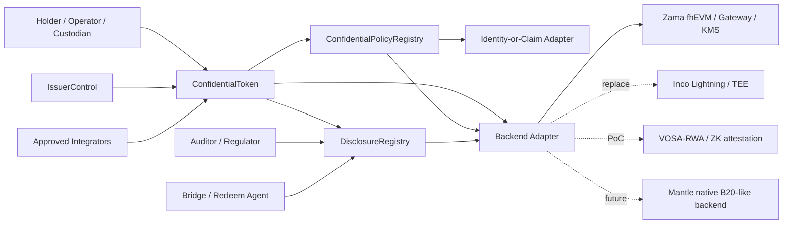

# Research Outline: 设计 Mantle Confidential Compliance Token 协议

本 outline 将 WHI-271 的路线裁决落成协议设计任务：**phase 1 主推 ERC-3643-style compliance substrate + ERC-7984/OZ-style confidential value interface + replaceable confidential backend adapter**。Base B20 是产品直觉和能力语言，不是 phase 1 要复制的 Mantle native precompile。Deep draft 必须把“合规平面”和“密文会计平面”分开建模，并把 Zama/Inco/VOSA/native B20-like 路线都收敛到同一个接口边界内。

## Items

### item-1: 协议目标、非目标与 phase boundary

本项定义 Mantle CCT 的协议目标与非目标，作为后续接口和流程的裁剪依据。Phase 1 目标是可部署、可审计、backend-replaceable 的 confidential asset：隐藏 balance/transfer amount，保留 issuer controls、identity/KYC policy、freeze/recovery、scoped disclosure 和 redeem/unshield 边界。Phase 1 非目标包括匿名 shielded pool、private identity、通用私密合约、fully private DeFi、order-flow privacy、native FHE/B20 precompile 和协议级 disclosure registry。Phase 2 只保留 native B20-like precompile、native encrypted accounting、native bridge/redeem adapter 和 protocol policy engine 的演进接口，不把它们写成 MVP 依赖。

Deep draft must include this table:

| Category | Phase 1 position | Phase 2 / excluded position | Evidence target |
|---|---|---|---|
| Confidential accounting | Encrypted balance, encrypted transfer amount, encrypted frozen/recoverable balance if backend supports it | Native encrypted accounting/precompile only after protocol roadmap | ERC-7984 EIP; OZ docs; route-comparison final |
| Compliance policy | Plain identity/KYC/sanctions first; encrypted amount policy via backend adapter or explicit disclosure fallback | Native encrypted policy engine later | ERC-3643 EIP; compliance-token-private-extension final |
| Disclosure/audit | Scoped grants, request logs, actor/payload/scope/expiry/revocation state | Protocol disclosure registry later | Zama ACL/Gateway/KMS docs; route-comparison disclosure constraints |
| Issuer controls | mint/burn/pause/freeze/recovery/redeem with ciphertext semantics | Native agent precompile optional | ERC-3643; B20 docs; OZ RWA/Freezable |
| Anonymity / graph privacy | Non-goal; addresses/events remain visible unless product chooses extra component | Could add pool/Privacy Pools/Railgun-style component outside token core | route-comparison final; PSE constraints inherited via WHI-271 |
| Generic private contracts | Non-goal; token-specific protocol only | Separate private workflow track | Zama deep dive; route-comparison final |
| Native Mantle precompile | Non-goal for phase 1 | Phase 2 native B20-like route | B20 docs; compliance-token-private-extension final |

- **Priority**: high
- **Dependencies**: none

### item-2: 模块边界与 architecture text diagram

本项设计六个协议模块的职责边界，并说明哪些模块是 protocol/core，哪些是 adapter/service。核心原则是：ConfidentialToken 不直接依赖某个 backend vendor；PolicyRegistry 不假设能直接读明文金额；DisclosureRegistry 不存储明文值，只存储授权、请求、范围、结果引用和审计日志；IssuerControl 以最小权限和多角色治理替代单 owner；Identity-or-Claim Adapter 保持 claim provider 可替换；Backend Adapter 把 Zama/Inco/VOSA/native B20-like 的差异隔离在能力接口中。

Module boundary table:

| Module | Owns | Must not own | Evidence target |
|---|---|---|---|
| ConfidentialToken | ERC-7984-like confidential balances/transfers, encrypted supply accounting, token events, hook points to policy/disclosure/backend | KYC source of truth, plaintext audit payload, backend-specific key material | ERC-7984 EIP; OZ ERC7984 docs |
| ConfidentialPolicyRegistry | Policy IDs, scopes, rule classes, public identity/blocklist rules, encrypted-rule routing, policy versioning | Raw ciphertext operations not behind adapter; full legal identity registry | ERC-3643 Compliance; Base B20 PolicyRegistry |
| DisclosureRegistry | Disclosure request/grant/log lifecycle, actor authority, payload scope, expiry, revocation status, offchain result references | Plaintext decrypted balances/amounts as durable public state | Zama ACL/Gateway/KMS; OZ ObserverAccess; WHI-271 disclosure constraints |
| IssuerControl | Mint/burn/freeze/recovery/pause/redeem roles, timelock/multisig admin, emergency procedures | Omnipotent unlogged owner powers | ERC-3643 Agent roles; B20 RBAC; OZ RWA/Freezable |
| Identity-or-Claim Adapter | Address-to-identity/claim binding, KYC/sanctions/accreditation status, trusted issuer mapping | Private identity protocol or global DID mandate | ERC-3643 Identity Registry; B20/TIP policy concepts |
| Backend Adapter | Encrypted input validation, arithmetic/comparison/select/decrypt/re-encrypt/grant capabilities, backend capability flags and SLA hooks | Token policy semantics or issuer governance | Zama fhEVM; Inco Lightning; VOSA/native replacement points |

Architecture text diagram to turn into final diagram:

- **Priority**: high
- **Dependencies**: item-1

### item-3: 核心接口与 alignment matrix

本项把用户点名的接口收敛为一个 minimal CCT interface set，并逐项标注来源：ERC-7984-aligned、ERC-3643-aligned、B20-inspired 或 Mantle-specific。Deep draft 必须明确 bytes32/ciphertext-handle 只是接口中立占位，不能把 Zama `euint64`、Inco encrypted type 或 VOSA proof encoding 泄漏到公共协议接口中。所有接口要说明是否同步返回、异步 disclosure、是否需要 backend capability flag，以及不支持时的 fail-closed 行为。

Core interface table:

| Interface | Sketch | Alignment | Phase | Notes / evidence |
|---|---|---|---|---|
| `confidentialBalanceOf(address account)` | returns encrypted balance handle or viewer-targeted encrypted payload | ERC-7984-aligned | phase 1 | Must not return plaintext; ERC-7984/OZ ciphertext-handle model |
| `confidentialTransfer(address to, bytes32 encryptedAmount, bytes proof)` | transfer with encrypted amount/input proof | ERC-7984-aligned | phase 1 | Plain receiver policy + encrypted amount validity |
| `confidentialTransferFrom(address from, address to, bytes32 encryptedAmount, bytes proof)` | operator/custody transfer | ERC-7984-aligned + Mantle-specific operator policy | phase 1 | Allowance/operator model must be explicit; DeFi risk item |
| `mint(address to, bytes32 encryptedAmount, bytes proof)` | issuer mint into encrypted balance | ERC-3643-aligned issuer role + ERC-7984 value | phase 1 | Mint receiver KYC/policy required |
| `burn(address from, bytes32 encryptedAmount, bytes proof)` | issuer/user burn confidential amount | ERC-3643-aligned + ERC-7984 value | phase 1 | Burn may feed redeem/unshield flow |
| `shield(address to, uint256 clearAmount)` | deposit/wrap public asset into confidential representation | OZ Wrapper-aligned + Mantle-specific | phase 1 optional | Exposes clear amount at shield boundary |
| `unshield(address from, uint256 clearAmount or bytes32 handle, address recipient)` | unwrap/redeem to public asset/cash leg | OZ Wrapper-aligned + Mantle-specific | phase 1 optional/must define if bridge/redeem exists | Intentional disclosure boundary |
| `freeze(address account, bytes32 encryptedAmount or FreezeMode mode)` | full/partial confidential freeze | ERC-3643-aligned + OZ Freezable/RWA | phase 1 minimum semantics | Partial freeze only if backend supports |
| `recover(address lost, address replacement, bytes recoveryData)` | migrate encrypted balance/rights | ERC-3643-aligned + Mantle-specific | phase 1 semantics | Must define re-encryption and audit log |
| `disclose(bytes32 handle, DisclosureRequest request)` | authorized disclosure/audit request | ERC-7984/OZ disclosure-aligned + Mantle-specific registry | phase 1 | Scope, actor, payload, expiry and revocation required |
| `updatePolicy(bytes32 policyId, PolicyConfig config)` | bind/upgrade scoped policy | B20-inspired + ERC-3643-aligned | phase 1 | Timelock/versioning; unsupported encrypted rules fail closed |

- **Priority**: high
- **Dependencies**: item-1, item-2

### item-4: 状态模型：public / ciphertext / policy / disclosure / issuer-admin

本项定义协议状态分区，尤其是哪些状态不应加密。Phase 1 不应该把所有东西都加密：metadata、policy ID、role assignment、identity eligibility status、disclosure logs、freeze/redeem events 往往需要公开或至少可审计。密文状态应聚焦 value plane：balances、amounts、frozen balances、possibly allowances/operator spend limits、encrypted policy counters。Deep draft 必须明确每类状态的 owner、读权限、更新权限、事件策略、泄漏面和证据锚点。

State model table:

| State class | Examples | Visibility | Owner / updater | Evidence target |
|---|---|---|---|---|
| Public state | token metadata, total supply policy, holder addresses/events, policy IDs, role IDs, registry addresses, pause status | public or permissioned public | ConfidentialToken / IssuerControl | ERC-3643; B20 docs; ERC-7984 events |
| Ciphertext state | balances, transfer amounts, frozen balances, recoverable balances, encrypted counters, optional confidential operator limits | ciphertext handle; plaintext only via disclosure | ConfidentialToken + Backend Adapter | ERC-7984; OZ; Zama FHE docs |
| Policy state | rule scopes, trusted issuers, claim topics, sanctions/blocklist refs, amount-limit rule class, backend capability requirements | mostly public; encrypted thresholds optional | ConfidentialPolicyRegistry | ERC-3643 Compliance; B20 PolicyRegistry |
| Disclosure state | request IDs, grantee, authority, payload, scope, expiry, revocation, result hash/log reference | public or restricted log; no raw plaintext | DisclosureRegistry | Zama ACL; OZ ObserverAccess; WHI-271 constraints |
| Issuer/admin state | issuer roles, compliance officer, recovery agent, auditor admin, emergency pause, upgrade admin, timelock | public governance state; keys offchain | IssuerControl | ERC-3643 Agent roles; B20 RBAC |

- **Priority**: high
- **Dependencies**: item-2, item-3

### item-5: 关键流程：issuance, onboarding, transfer, audit, freeze, redeem, bridge

本项把协议行为写成可审查的流程列表。每个流程都要标注 actors、public inputs、ciphertext inputs、policy gate、disclosure point、failure semantics 和 evidence source。Deep draft 必须特别处理 ERC-3643 plaintext `canTransfer(from,to,amount)` 与 encrypted ERC-7984 amount 的张力：identity/blocklist 可以同步 plaintext 检查；amount/balance limits 必须走 FHE-native policy、selective decrypt 或 unsupported/fail-closed 三选一。

Required flows:

| Flow | Actors | Required steps | Disclosure boundary | Evidence target |
|---|---|---|---|---|
| Issuance/deployment | issuer/admin, policy admin, backend operator | deploy token, set backend adapter, set policy registry, bind identity adapter, configure disclosure registry, assign roles | admin/role state public | ERC-3643; B20 factory/policy concepts |
| KYC onboarding | holder, KYC provider, issuer | create/bind identity, verify claims, record eligibility and jurisdiction/sanctions status | identity facts likely visible to issuer/policy; private identity non-goal | ERC-3643 Identity Registry |
| Mint / wrap / shield | issuer or holder + wrapper | validate mint receiver, create/accept encrypted amount, update encrypted balance, emit non-amount event | shield from public asset reveals clear deposit amount | ERC-7984/OZ Wrapper; B20 asset/stablecoin variants |
| Confidential transfer | sender/operator, receiver, policy, backend | validate encrypted input/proof, run plaintext policy, run encrypted policy or fallback, update encrypted balances, log handle/event | no amount disclosure unless policy/audit requests | ERC-7984; Zama/OZ; ERC-3643 tension |
| Compliance check | token, policy registry, identity adapter, backend | address/claim/blocklist checks; amount threshold via backend or selective decrypt; unsupported rule fail closed | selective decrypt to compliance actor is explicit privacy tradeoff | Zama deep dive; compliance extension final |
| Audit disclosure | auditor/regulator/issuer, disclosure admin, backend/KMS | request, authorize, grant/re-encrypt/decrypt, record result hash/log, revoke/expire grant | payload/account/window scoped; historical access risk recorded | Zama ACL/Gateway/KMS; OZ ObserverAccess |
| Freeze/recovery | issuer agent, recovery agent, holder/replacement | pause/freeze, calculate frozen encrypted amount, migrate/re-encrypt balance or rights, log ceremony | may disclose amount to issuer/auditor if legally required | ERC-3643 agent controls; OZ Freezable/RWA |
| Redeem/unshield | holder, issuer/custodian, bridge/redeem agent | burn/lock confidential amount, decrypt or prove amount to settlement leg, release public ERC20/cash/bridge asset | intentional plaintext amount and destination disclosure | OZ Wrapper; route-comparison bridge/redeem constraints |
| Bridge constraint | holder, bridge, remote token/issuer | phase 1 defaults to unshield/re-shield or approved wrapped bridge with disclosure log | no claim of fully private cross-chain transfer | WHI-271 constraints; Zama bridge/decrypt caveats |

- **Priority**: high
- **Dependencies**: item-3, item-4

### item-6: 后端抽象与 replaceability plan

本项设计 Backend Adapter 的能力抽象，并评估 Zama 主候选与 Inco / VOSA-RWA / native B20-like 替换点。Deep draft 要避免 backend-specific API 泄漏进核心 token interface：公开接口使用 encrypted handle/proof/capability flags；backend adapter 负责把它映射到 Zama `euint`/ACL/Gateway/KMS、Inco encrypted type/TEE callback、VOSA proof/attestation 或未来 native precompile。每个 backend 都要标注可复用、不可复用、production gate 和 lock-in risk。

Backend abstraction table:

| Backend | Reusable for phase 1 | Not reusable / gate | Adapter capabilities to require | Evidence target |
|---|---|---|---|---|
| Zama fhEVM + OZ | Primary candidate for encrypted balances/transfers, FHE comparison/select, ACL, public/user decrypt, ObserverAccess/RWA/Freezable | Mantle host-chain support unproven; Gateway/KMS/coprocessor governance; ACL historical revocation; OZ audit/version | encrypted ops, decrypt request, viewer grant, re-encrypt, confidential freeze, wrapper | Zama docs; OZ docs; zama-confidential-rwa final |
| Inco Lightning | Backup backend candidate; lower-latency TEE-first confidential compute; Base mainnet signal; confidential ERC20 framework useful as PoC boundary reference | Mantle support not evidenced; TEE trust/attestation/liveness/force-exit; Atlas FHE roadmap vs live capability | confidential state update, delegated viewing, TEE attestation proof, callback/finality semantics | Inco site accessed 2026-06-24; route-comparison final |
| Inco confidential ERC20 framework | Engineering PoC reference for modules/tests, not production route | Do not copy unaudited PoC into production; may be backend-specific | interface and test pattern extraction only | route-comparison final; WHI-270 inherited evidence |
| VOSA-RWA / VOSA-20 | Lightweight PoC fallback for exposed-graph compliance attestation and wrapper-style RWA trials | Forum/PoC maturity, audit gap, freeze/force-transfer weakness, graph exposure | proof/attestation verification, disclosure memo, explicit graph-leak flag | route-comparison final |
| Native B20-like future backend | Phase 2 path for native precompile, protocol policy registry, native disclosure/redeem adapters | Requires Mantle client/fork/governance/audit; not phase 1 lightweight | same token interface, native backend adapter implementation | Base B20 docs; compliance-token-private-extension final |
| Generic future backend | Keeps interface neutral for Fhenix/CoFHE/ZK coprocessor | Must pass security/SLA/audit/capability gate before production | capability flags: encrypted add/sub/compare/select, decrypt, grant, revoke, re-encrypt | route-comparison final |

Adapter capability checklist:

| Capability | Phase 1 requirement | Fallback if absent |
|---|---|---|
| encrypted input validation | required | backend cannot support phase 1 confidential transfer |
| encrypted balance update | required | backend cannot support phase 1 confidential accounting |
| encrypted compare/select | required for amount policy; optional for identity-only policy PoC | selective decrypt or fail closed |
| scoped decrypt/re-encrypt | required for audit/redeem/recovery | no production audit/redeem |
| grant/revoke/expiry semantics | required for disclosure governance | mark historical access persistent |
| latency/SLA observability | required before production | PoC/testnet only |

- **Priority**: high
- **Dependencies**: item-2, item-5

### item-7: 风险、开放问题与 review gates

本项整理 production risk register 和 open questions。Deep draft 必须把风险分成 cryptographic/backend, governance/compliance, protocol/interface, integration/UX and bridge/redeem 四类，并为每项给出 mitigation、owner 和 blocking severity。特别要避免四类 overclaim：把 Zama/Inco vendor claim 当 Mantle production SLA；把 B20 native precompile 当 phase 1；把 ERC-3643 当 privacy solution；把 viewing key / observer access 当无风险合规披露。

Risk and open-question table:

| Risk | Severity | Why it matters | Required mitigation / open question | Evidence target |
|---|---|---|---|---|
| KMS/Gateway/coprocessor liveness and governance | high | decrypt, recovery and audit depend on external operators | operator set, SLA, key ceremony, incident process | Zama docs; Zama final |
| TEE/trusted setup assumptions | high | Inco/VOSA/native alternatives have different trust roots | attestation model, audit, fallback, force-exit semantics | route-comparison final; Inco public source |
| Auditor key/disclosure governance | high | observer access can become privacy backdoor | scope, expiry, revocation, logs, compromise response | Zama ACL; OZ ObserverAccess |
| Issuer abuse/admin capture | high | freeze/recovery/force-transfer are powerful | role split, timelock, multisig, legal triggers, transparency logs | ERC-3643; B20 RBAC |
| Amount-dependent compliance gap | high | plaintext ERC-3643 modules cannot read encrypted amount | FHE-native policy, selective decrypt, or unsupported/fail closed | Zama final; ERC-3643/EIP-7984 |
| DeFi composability breakage | medium/high | confidential allowances/operator semantics differ from ERC-20 | approved integrator model, operator limits, UX warning | ERC-7984/OZ docs |
| Bridge/redeem leakage | medium/high | settlement often reveals amount/destination | treat as intentional disclosure; log and constrain | OZ Wrapper; route-comparison |
| Metadata/timing/address graph leakage | medium | phase 1 does not hide graph | document residual leakage; optional source-of-funds supplement | route-comparison; PSE constraints inherited |
| Backend lock-in | medium | Zama/Inco-specific handles and services can leak into app | capability interface + adapter conformance tests | route-comparison |
| Performance/SLA uncertainty | medium/high | transfer/disclosure/recovery latency affects production | measurable p50/p95, failure semantics, PoC benchmarks | route-comparison performance constraints |

- **Priority**: high
- **Dependencies**: item-1, item-5, item-6

### item-8: Evidence map, section traceability and diagram deliverables

本项确保 final section 的每个 interface/process conclusion 能回溯到 ERC-7984、B20、ERC-3643 或 backend evidence。Deep draft 必须在每个 major section 末尾给出 evidence note：local source path + commit, or external URL + access date/version. It also must produce a diagram-ready architecture explanation: modules, trust boundaries, policy/disclosure paths, backend replacement points and public/ciphertext state separation.

Traceability requirements:

| Section | Minimum evidence anchors |
|---|---|
| Goals/non-goals | `route-comparison/final.md`; `compliance-token-private-extension/final.md`; ERC-7984; ERC-3643 |
| Module boundaries | ERC-7984/OZ docs; ERC-3643; Base B20 docs; Zama Gateway/KMS/ACL |
| Interfaces | ERC-7984 EIP; OZ token API; ERC-3643 agent controls; B20 PolicyRegistry |
| State model | ERC-7984/OZ ciphertext handles; ERC-3643 registries; Zama ACL/Gateway/KMS |
| Flows | Zama final lifecycle; compliance extension phase table; route-comparison bridge/redeem constraints |
| Backend abstraction | Zama docs/final; Inco public source; route-comparison backend ranking; VOSA/native evidence through WHI-271 |
| Risks/open questions | Zama final risk table; route-comparison constraints; compliance extension risk table |

- **Priority**: medium
- **Dependencies**: item-1, item-2, item-3, item-4, item-5, item-6, item-7

## Fields

| Field | Description | Applies To |
|-------|-------------|------------|
| source_anchor | Exact local path + commit SHA or URL + access date supporting the claim | all |
| alignment | ERC-7984-aligned / ERC-3643-aligned / B20-inspired / OZ-aligned / Zama-specific / Mantle-specific / backend-neutral | item-2, item-3, item-4, item-5 |
| phase_boundary | phase_1_must_have / phase_1_optional / phase_2_native / non_goal / backend_gate | item-1, item-3, item-5, item-6 |
| architecture_layer | token_core / policy_registry / disclosure_registry / issuer_control / identity_adapter / backend_adapter / offchain_service / native_future | item-2, item-4, item-6 |
| state_class | public_state / ciphertext_state / policy_state / disclosure_state / issuer_admin_state | item-4, item-5 |
| actor_scope | holder / operator / issuer / compliance_officer / auditor / regulator / recovery_agent / policy_admin / backend_operator / bridge_or_redeem_agent / defi_integrator | item-3, item-5, item-7 |
| disclosure_vector | authority / trigger / payload / scope / expiry / revocation / residual_leakage / audit_log_reference | item-2, item-5, item-7 |
| backend_capability | encrypted_input / encrypted_add_sub / encrypted_compare_select / scoped_decrypt / reencrypt / grant_revoke / confidential_freeze / latency_sla | item-3, item-5, item-6 |
| failure_semantics | fail_closed / selective_decrypt_required / async_callback / zero_transfer_or_select / unsupported_in_phase_1 / emergency_pause | item-3, item-5, item-7 |
| risk_label | kms_gateway_governance / tee_trust / acl_revocation / issuer_abuse / amount_policy_gap / defi_composability / bridge_redeem_leakage / metadata_leakage / backend_lock_in / performance_sla | item-7 |

## Diagram Expectations

| ID | Type | Description | Format | Applies To |
|----|------|-------------|--------|------------|
| diag-1 | architecture | Six-module protocol architecture: ConfidentialToken, ConfidentialPolicyRegistry, DisclosureRegistry, IssuerControl, Identity-or-Claim Adapter, Backend Adapter, plus Zama/Inco/VOSA/native replacement points | mermaid | item-2, item-6 |
| diag-2 | flow | Confidential transfer with plaintext identity policy + encrypted amount policy + disclosure hooks | mermaid | item-3, item-5 |
| diag-3 | flow | Audit disclosure lifecycle: request, authorize, backend grant/decrypt/re-encrypt, result logging, expiry/revocation | mermaid | item-5, item-7 |
| diag-4 | flow | Freeze/recovery/redeem boundaries showing when plaintext amount is intentionally disclosed | mermaid | item-5, item-7 |
| diag-5 | comparison | Backend abstraction matrix for Zama, Inco, VOSA-RWA, native B20-like future backend and generic future backend | ascii | item-6 |
| diag-6 | hierarchy | State model separation: public, ciphertext, policy, disclosure, issuer/admin | ascii | item-4 |

## Source Requirements

| ID | Type | Description | Min Count |
|----|------|-------------|-----------|
| src-1 | prior_research_final | Commit-pinned local finals: route-comparison, compliance-token-private-extension, zama-confidential-rwa; reuse their inherited WHI-266/268/270 evidence only through explicit source notes | 3 |
| src-2 | official_standard | ERC-7984 and ERC-3643 official EIP pages, accessed 2026-06-24 or current access date in deep draft | 2 |
| src-3 | official_implementation_docs | OpenZeppelin Confidential Contracts token/API docs and Zama protocol docs for ACL/Gateway/KMS/fhEVM | 4 |
| src-4 | official_or_primary_backend_docs | Zama docs plus Inco public docs/site; VOSA/native claims may be through prior final if no stronger primary source exists | 2 |
| src-5 | official_b20_docs | Base B20/Beryl documentation or local commit-pinned B20 evidence; used only for B20-inspired capability language and native phase-2 boundary | 1 |
| src-6 | risk_evidence | At least one evidence note for each high-severity risk showing whether it comes from prior final, official docs, or synthesis | 8 |

## Patch Log

| Round | Action | Target | Reason | Source |
|-------|--------|--------|--------|--------|
