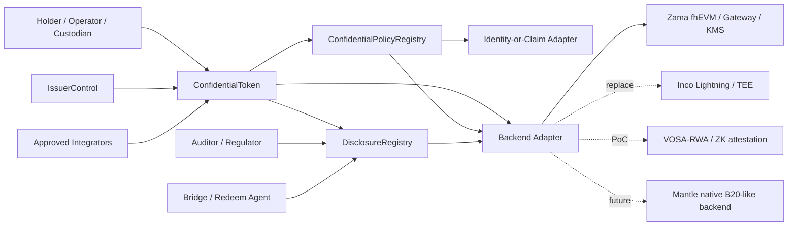

# 研究 Outline：设计 Mantle Confidential Compliance Token 协议

本 outline 将 WHI-271 的路线裁决落成协议设计任务：**phase 1 主推 ERC-3643-style compliance substrate + ERC-7984/OZ-style confidential value interface + replaceable confidential backend adapter**。Base B20 是产品直觉和能力语言，不是 phase 1 要复制的 Mantle native precompile。Deep draft 必须把“合规平面”和“密文会计平面”分开建模，并把 Zama/Inco/VOSA/native B20-like 路线都收敛到同一个接口边界内。

## 条目（Items）

### item-1: 协议目标、非目标与 phase boundary

本项定义 Mantle CCT 的协议目标与非目标，作为后续接口和流程的裁剪依据。Phase 1 目标是可部署、可审计、backend-replaceable 的 confidential asset：隐藏 balance/transfer amount，保留 issuer controls、identity/KYC policy、freeze/recovery、scoped disclosure 和 redeem/unshield 边界。Phase 1 非目标包括匿名 shielded pool、private identity、通用私密合约、fully private DeFi、order-flow privacy、native FHE/B20 precompile 和协议级 disclosure registry。Phase 2 只保留 native B20-like precompile、native encrypted accounting、native bridge/redeem adapter 和 protocol policy engine 的演进接口，不把它们写成 MVP 依赖。

Deep draft 必须包含下表：

| 类别 | Phase 1 立场 | Phase 2 / 排除立场 | 证据目标 |
|---|---|---|---|
| 机密会计（Confidential accounting） | 加密余额、加密转账金额，若后端支持则包含加密的冻结/可恢复余额 | 仅在协议路线图之后才引入 native encrypted accounting/precompile | ERC-7984 EIP；OZ 文档；route-comparison final |
| 合规策略（Compliance policy） | 先做明文 identity/KYC/sanctions；加密金额策略通过 backend adapter 或显式披露回退实现 | 后续再引入 native encrypted policy engine | ERC-3643 EIP；compliance-token-private-extension final |
| 披露/审计（Disclosure/audit） | scoped grants、请求日志、actor/payload/scope/expiry/revocation 状态 | 后续再引入 protocol disclosure registry | Zama ACL/Gateway/KMS 文档；route-comparison 披露约束 |
| 发行方控制（Issuer controls） | 带密文语义的 mint/burn/pause/freeze/recovery/redeem | native agent precompile 可选 | ERC-3643；B20 文档；OZ RWA/Freezable |
| 匿名性 / 图隐私（Anonymity / graph privacy） | 非目标；除非产品选择额外组件，否则地址/事件仍可见 | 可在 token core 之外增加 pool/Privacy Pools/Railgun-style 组件 | route-comparison final；通过 WHI-271 继承的 PSE 约束 |
| 通用私密合约（Generic private contracts） | 非目标；仅针对 token 的协议 | 独立的私密工作流轨道 | Zama deep dive；route-comparison final |
| Native Mantle precompile | phase 1 的非目标 | Phase 2 native B20-like 路线 | B20 文档；compliance-token-private-extension final |

- **优先级（Priority）**：high
- **依赖（Dependencies）**：none

### item-2: 模块边界与 architecture text diagram

本项设计六个协议模块的职责边界，并说明哪些模块是 protocol/core，哪些是 adapter/service。核心原则是：ConfidentialToken 不直接依赖某个 backend vendor；PolicyRegistry 不假设能直接读明文金额；DisclosureRegistry 不存储明文值，只存储授权、请求、范围、结果引用和审计日志；IssuerControl 以最小权限和多角色治理替代单 owner；Identity-or-Claim Adapter 保持 claim provider 可替换；Backend Adapter 把 Zama/Inco/VOSA/native B20-like 的差异隔离在能力接口中。

模块边界表：

| 模块 | 拥有（Owns） | 不得拥有（Must not own） | 证据目标 |
|---|---|---|---|
| ConfidentialToken | ERC-7984-like 的机密余额/转账、加密供应量会计、token 事件、指向 policy/disclosure/backend 的 hook 点 | KYC 真实来源、明文审计 payload、后端专属的密钥材料 | ERC-7984 EIP；OZ ERC7984 文档 |
| ConfidentialPolicyRegistry | Policy ID、scope、规则类别、公开的 identity/blocklist 规则、加密规则路由、策略版本管理 | 不经 adapter 的原始密文操作；完整的法律身份注册表 | ERC-3643 Compliance；Base B20 PolicyRegistry |
| DisclosureRegistry | 披露请求/授权/日志生命周期、actor 权限、payload 范围、过期、撤销状态、链下结果引用 | 作为持久公共状态的明文解密余额/金额 | Zama ACL/Gateway/KMS；OZ ObserverAccess；WHI-271 披露约束 |
| IssuerControl | Mint/burn/freeze/recovery/pause/redeem 角色、timelock/multisig 管理、紧急流程 | 无所不能且不记录日志的 owner 权限 | ERC-3643 Agent roles；B20 RBAC；OZ RWA/Freezable |
| Identity-or-Claim Adapter | 地址到 identity/claim 的绑定、KYC/sanctions/accreditation 状态、trusted issuer 映射 | private identity protocol 或全局 DID 强制要求 | ERC-3643 Identity Registry；B20/TIP policy 概念 |
| Backend Adapter | 加密输入校验，算术/比较/select/decrypt/re-encrypt/grant 能力，后端能力标志与 SLA hook | token policy 语义或 issuer 治理 | Zama fhEVM；Inco Lightning；VOSA/native 替换点 |

待转为最终图的 architecture text diagram：

- **优先级（Priority）**：high
- **依赖（Dependencies）**：item-1

### item-3: 核心接口与 alignment matrix

本项把用户点名的接口收敛为一个 minimal CCT interface set，并逐项标注来源：ERC-7984-aligned、ERC-3643-aligned、B20-inspired 或 Mantle-specific。Deep draft 必须明确 bytes32/ciphertext-handle 只是接口中立占位，不能把 Zama `euint64`、Inco encrypted type 或 VOSA proof encoding 泄漏到公共协议接口中。所有接口要说明是否同步返回、异步 disclosure、是否需要 backend capability flag，以及不支持时的失败即拒绝（fail-closed）行为。

核心接口表：

| 接口 | 草图（Sketch） | 对齐（Alignment） | Phase | 备注 / 证据 |
|---|---|---|---|---|
| `confidentialBalanceOf(address account)` | 返回加密余额 handle 或面向 viewer 的加密 payload | ERC-7984-aligned | phase 1 | 不得返回明文；遵循 ERC-7984/OZ 的密文 handle 模型 |
| `confidentialTransfer(address to, bytes32 encryptedAmount, bytes proof)` | 带加密金额/输入证明的转账 | ERC-7984-aligned | phase 1 | 明文接收方策略 + 加密金额有效性 |
| `confidentialTransferFrom(address from, address to, bytes32 encryptedAmount, bytes proof)` | operator/托管转账 | ERC-7984-aligned + Mantle-specific operator 策略 | phase 1 | Allowance/operator 模型必须明确；DeFi 风险项 |
| `mint(address to, bytes32 encryptedAmount, bytes proof)` | 发行方 mint 进加密余额 | ERC-3643-aligned issuer role + ERC-7984 value | phase 1 | Mint 接收方需通过 KYC/policy |
| `burn(address from, bytes32 encryptedAmount, bytes proof)` | 发行方/用户销毁机密金额 | ERC-3643-aligned + ERC-7984 value | phase 1 | Burn 可对接 redeem/unshield 流程 |
| `shield(address to, uint256 clearAmount)` | 存入/包装公开资产为机密表示 | OZ Wrapper-aligned + Mantle-specific | phase 1 可选 | 在 shield 边界暴露明文金额 |
| `unshield(address from, uint256 clearAmount or bytes32 handle, address recipient)` | 解包/赎回为公开资产/现金腿 | OZ Wrapper-aligned + Mantle-specific | phase 1 可选 / 若存在 bridge/redeem 则必须定义 | 有意为之的披露边界 |
| `freeze(address account, bytes32 encryptedAmount or FreezeMode mode)` | 全额/部分机密冻结 | ERC-3643-aligned + OZ Freezable/RWA | phase 1 最低语义 | 仅在后端支持时做部分冻结 |
| `recover(address lost, address replacement, bytes recoveryData)` | 迁移加密余额/权利 | ERC-3643-aligned + Mantle-specific | phase 1 语义 | 必须定义 re-encryption 与审计日志 |
| `disclose(bytes32 handle, DisclosureRequest request)` | 授权披露/审计请求 | ERC-7984/OZ disclosure-aligned + Mantle-specific registry | phase 1 | 需包含 scope、actor、payload、expiry 和 revocation |
| `updatePolicy(bytes32 policyId, PolicyConfig config)` | 绑定/升级 scoped policy | B20-inspired + ERC-3643-aligned | phase 1 | Timelock/版本管理；不支持的加密规则失败即拒绝（fail-closed） |

- **优先级（Priority）**：high
- **依赖（Dependencies）**：item-1, item-2

### item-4: 状态模型：public / ciphertext / policy / disclosure / issuer-admin

本项定义协议状态分区，尤其是哪些状态不应加密。Phase 1 不应该把所有东西都加密：metadata、policy ID、role assignment、identity eligibility status、disclosure logs、freeze/redeem events 往往需要公开或至少可审计。密文状态应聚焦 value plane：balances、amounts、frozen balances、possibly allowances/operator spend limits、encrypted policy counters。Deep draft 必须明确每类状态的 owner、读权限、更新权限、事件策略、泄漏面和证据锚点。

状态模型表：

| 状态类别 | 示例 | 可见性 | Owner / 更新者 | 证据目标 |
|---|---|---|---|---|
| 公开状态（Public state） | token metadata、总供应量策略、holder 地址/事件、policy ID、role ID、registry 地址、pause 状态 | 公开或受权限的公开 | ConfidentialToken / IssuerControl | ERC-3643；B20 文档；ERC-7984 事件 |
| 密文状态（Ciphertext state） | 余额、转账金额、冻结余额、可恢复余额、加密计数器、可选的机密 operator 限额 | 密文 handle；仅通过披露才有明文 | ConfidentialToken + Backend Adapter | ERC-7984；OZ；Zama FHE 文档 |
| 策略状态（Policy state） | 规则范围、trusted issuers、claim topics、sanctions/blocklist 引用、金额限额规则类别、后端能力要求 | 大多公开；加密阈值可选 | ConfidentialPolicyRegistry | ERC-3643 Compliance；B20 PolicyRegistry |
| 披露状态（Disclosure state） | 请求 ID、grantee、authority、payload、scope、expiry、revocation、结果 hash/日志引用 | 公开或受限日志；无原始明文 | DisclosureRegistry | Zama ACL；OZ ObserverAccess；WHI-271 约束 |
| 发行方/管理状态（Issuer/admin state） | issuer 角色、合规官、recovery agent、auditor 管理员、紧急 pause、升级管理员、timelock | 公开治理状态；密钥在链下 | IssuerControl | ERC-3643 Agent roles；B20 RBAC |

- **优先级（Priority）**：high
- **依赖（Dependencies）**：item-2, item-3

### item-5: 关键流程：issuance, onboarding, transfer, audit, freeze, redeem, bridge

本项把协议行为写成可审查的流程列表。每个流程都要标注 actors、public inputs、ciphertext inputs、policy gate、disclosure point、failure semantics 和 evidence source。Deep draft 必须特别处理 ERC-3643 plaintext `canTransfer(from,to,amount)` 与 encrypted ERC-7984 amount 的张力：identity/blocklist 可以同步 plaintext 检查；amount/balance limits 必须走 FHE-native policy、selective decrypt 或 unsupported/fail-closed 三选一。

必备流程：

| 流程 | 参与方（Actors） | 必备步骤 | 披露边界 | 证据目标 |
|---|---|---|---|---|
| 发行/部署（Issuance/deployment） | issuer/admin、policy admin、backend operator | 部署 token、设置 backend adapter、设置 policy registry、绑定 identity adapter、配置 disclosure registry、分配角色 | admin/role 状态公开 | ERC-3643；B20 factory/policy 概念 |
| KYC 准入（KYC onboarding） | holder、KYC provider、issuer | 创建/绑定身份、验证 claim、记录资格与司法辖区/sanctions 状态 | identity 事实可能对 issuer/policy 可见；private identity 为非目标 | ERC-3643 Identity Registry |
| Mint / wrap / shield | issuer 或 holder + wrapper | 校验 mint 接收方、创建/接受加密金额、更新加密余额、发出不含金额的事件 | 从公开资产 shield 会暴露明文存入金额 | ERC-7984/OZ Wrapper；B20 asset/stablecoin 变体 |
| 机密转账（Confidential transfer） | sender/operator、receiver、policy、backend | 校验加密输入/证明、运行明文策略、运行加密策略或回退、更新加密余额、记录 handle/事件 | 除非策略/审计请求，否则不披露金额 | ERC-7984；Zama/OZ；ERC-3643 张力 |
| 合规检查（Compliance check） | token、policy registry、identity adapter、backend | 地址/claim/blocklist 检查；金额阈值经 backend 或 selective decrypt；不支持的规则失败即拒绝（fail-closed） | 向合规方做 selective decrypt 是明确的隐私权衡 | Zama deep dive；compliance extension final |
| 审计披露（Audit disclosure） | auditor/regulator/issuer、disclosure admin、backend/KMS | 请求、授权、grant/re-encrypt/decrypt、记录结果 hash/日志、撤销/过期授权 | payload/account/window 范围受限；记录历史访问风险 | Zama ACL/Gateway/KMS；OZ ObserverAccess |
| 冻结/恢复（Freeze/recovery） | issuer agent、recovery agent、holder/replacement | pause/freeze、计算冻结的加密金额、迁移/re-encrypt 余额或权利、记录仪式 | 若法律要求，可向 issuer/auditor 披露金额 | ERC-3643 agent controls；OZ Freezable/RWA |
| 赎回/解包（Redeem/unshield） | holder、issuer/custodian、bridge/redeem agent | burn/锁定机密金额、向结算腿 decrypt 或证明金额、释放公开 ERC20/现金/bridge 资产 | 有意为之的明文金额与目的地披露 | OZ Wrapper；route-comparison bridge/redeem 约束 |
| Bridge 约束（Bridge constraint） | holder、bridge、远端 token/issuer | phase 1 默认走 unshield/re-shield 或带披露日志的获批 wrapped bridge | 不声称完全私密的跨链转账 | WHI-271 约束；Zama bridge/decrypt 注意事项 |

- **优先级（Priority）**：high
- **依赖（Dependencies）**：item-3, item-4

### item-6: 后端抽象与 replaceability plan

本项设计 Backend Adapter 的能力抽象，并评估 Zama 主候选与 Inco / VOSA-RWA / native B20-like 替换点。Deep draft 要避免 backend-specific API 泄漏进核心 token interface：公开接口使用 encrypted handle/proof/capability flags；backend adapter 负责把它映射到 Zama `euint`/ACL/Gateway/KMS、Inco encrypted type/TEE callback、VOSA proof/attestation 或未来 native precompile。每个 backend 都要标注可复用、不可复用、production gate 和 lock-in risk。

后端抽象表：

| Backend | Phase 1 可复用之处 | 不可复用 / gate | 需要的 adapter 能力 | 证据目标 |
|---|---|---|---|---|
| Zama fhEVM + OZ | 加密余额/转账、FHE 比较/select、ACL、public/user decrypt、ObserverAccess/RWA/Freezable 的主候选 | Mantle 宿主链支持尚未证实；Gateway/KMS/coprocessor 治理；ACL 历史撤销；OZ 审计/版本 | 加密运算、decrypt 请求、viewer grant、re-encrypt、机密冻结、wrapper | Zama 文档；OZ 文档；zama-confidential-rwa final |
| Inco Lightning | 备选 backend 候选；更低延迟的 TEE-first 机密计算；Base mainnet 信号；机密 ERC20 框架可作为 PoC 边界参考 | Mantle 支持无证据；TEE 信任/attestation/liveness/force-exit；Atlas FHE 路线图 vs 当前能力 | 机密状态更新、委托查看、TEE attestation 证明、callback/finality 语义 | Inco 站点（访问于 2026-06-24）；route-comparison final |
| Inco confidential ERC20 framework | 模块/测试的工程 PoC 参考，非生产路线 | 不要把未经审计的 PoC 复制进生产；可能 backend-specific | 仅提取接口与测试模式 | route-comparison final；WHI-270 继承证据 |
| VOSA-RWA / VOSA-20 | 面向暴露图合规 attestation 与 wrapper-style RWA 试验的轻量 PoC 回退 | Forum/PoC 成熟度、审计缺口、freeze/force-transfer 弱点、图暴露 | proof/attestation 验证、披露备忘、显式图泄漏标志 | route-comparison final |
| Native B20-like 未来 backend | native precompile、protocol policy registry、native disclosure/redeem adapters 的 Phase 2 路径 | 需要 Mantle client/fork/治理/审计；非 phase 1 轻量 | 同一 token 接口、native backend adapter 实现 | Base B20 文档；compliance-token-private-extension final |
| 通用未来 backend（Generic future backend） | 为 Fhenix/CoFHE/ZK coprocessor 保持接口中立 | 生产前必须通过安全/SLA/审计/能力 gate | 能力标志：encrypted add/sub/compare/select、decrypt、grant、revoke、re-encrypt | route-comparison final |

Adapter 能力清单（capability checklist）：

| 能力 | Phase 1 要求 | 缺失时的回退 |
|---|---|---|
| 加密输入校验（encrypted input validation） | 必需 | backend 无法支持 phase 1 机密转账 |
| 加密余额更新（encrypted balance update） | 必需 | backend 无法支持 phase 1 机密会计 |
| 加密比较/select（encrypted compare/select） | 金额策略必需；仅 identity policy 的 PoC 可选 | selective decrypt 或失败即拒绝（fail-closed） |
| scoped decrypt/re-encrypt | 审计/赎回/恢复必需 | 无法做生产级审计/赎回 |
| grant/revoke/expiry 语义 | 披露治理必需 | 标记历史访问为持久 |
| 延迟/SLA 可观测性（latency/SLA observability） | 生产前必需 | 仅限 PoC/testnet |

- **优先级（Priority）**：high
- **依赖（Dependencies）**：item-2, item-5

### item-7: 风险、开放问题与 review gates

本项整理 production risk register 和 open questions。Deep draft 必须把风险分成 cryptographic/backend, governance/compliance, protocol/interface, integration/UX and bridge/redeem 四类，并为每项给出 mitigation、owner 和 blocking severity。特别要避免四类 overclaim：把 Zama/Inco vendor claim 当 Mantle production SLA；把 B20 native precompile 当 phase 1；把 ERC-3643 当 privacy solution；把 viewing key / observer access 当无风险合规披露。

风险与开放问题表：

| 风险 | 严重度 | 为何重要 | 必需的缓解 / 开放问题 | 证据目标 |
|---|---|---|---|---|
| KMS/Gateway/coprocessor 的 liveness 与治理 | high | decrypt、recovery 和审计依赖外部 operator | operator 集合、SLA、密钥仪式、事件处理流程 | Zama 文档；Zama final |
| TEE/trusted setup 假设 | high | Inco/VOSA/native 替代方案有不同的信任根 | attestation 模型、审计、回退、force-exit 语义 | route-comparison final；Inco 公开来源 |
| Auditor 密钥/披露治理 | high | observer access 可能变成隐私后门 | scope、expiry、revocation、日志、被攻陷后的响应 | Zama ACL；OZ ObserverAccess |
| Issuer 滥用/管理权被夺 | high | freeze/recovery/force-transfer 权力强大 | 角色拆分、timelock、multisig、法律触发、透明日志 | ERC-3643；B20 RBAC |
| 依赖金额的合规缺口 | high | 明文 ERC-3643 模块无法读取加密金额 | FHE-native policy、selective decrypt，或 unsupported/失败即拒绝（fail-closed） | Zama final；ERC-3643/EIP-7984 |
| DeFi 可组合性破坏 | medium/high | 机密 allowance/operator 语义与 ERC-20 不同 | 获批 integrator 模型、operator 限额、UX 警示 | ERC-7984/OZ 文档 |
| Bridge/redeem 泄漏 | medium/high | 结算常会暴露金额/目的地 | 视为有意披露；记录并约束 | OZ Wrapper；route-comparison |
| Metadata/timing/地址图泄漏 | medium | phase 1 不隐藏交易图 | 记录残余泄漏；可选的 source-of-funds 补充 | route-comparison；继承的 PSE 约束 |
| Backend lock-in | medium | Zama/Inco 专属 handle 与服务可能泄漏进应用 | capability interface + adapter 一致性测试 | route-comparison |
| 性能/SLA 不确定性 | medium/high | 转账/披露/恢复延迟影响生产 | 可测量的 p50/p95、failure semantics、PoC 基准 | route-comparison 性能约束 |

- **优先级（Priority）**：high
- **依赖（Dependencies）**：item-1, item-5, item-6

### item-8: Evidence map, section traceability and diagram deliverables

本项确保 final section 的每个 interface/process conclusion 能回溯到 ERC-7984、B20、ERC-3643 或 backend evidence。Deep draft 必须在每个 major section 末尾给出 evidence note：本地源路径 + commit，或外部 URL + 访问日期/版本。它还必须产出一份可供绘图的架构说明：模块、信任边界、policy/disclosure 路径、backend 替换点，以及 public/ciphertext 状态分离。

可追溯性要求：

| 章节 | 最少证据锚点 |
|---|---|
| 目标/非目标 | `route-comparison/final.md`；`compliance-token-private-extension/final.md`；ERC-7984；ERC-3643 |
| 模块边界 | ERC-7984/OZ 文档；ERC-3643；Base B20 文档；Zama Gateway/KMS/ACL |
| 接口 | ERC-7984 EIP；OZ token API；ERC-3643 agent controls；B20 PolicyRegistry |
| 状态模型 | ERC-7984/OZ 密文 handle；ERC-3643 注册表；Zama ACL/Gateway/KMS |
| 流程 | Zama final 生命周期；compliance extension phase 表；route-comparison bridge/redeem 约束 |
| 后端抽象 | Zama 文档/final；Inco 公开来源；route-comparison 后端排名；通过 WHI-271 获取的 VOSA/native 证据 |
| 风险/开放问题 | Zama final 风险表；route-comparison 约束；compliance extension 风险表 |

- **优先级（Priority）**：medium
- **依赖（Dependencies）**：item-1, item-2, item-3, item-4, item-5, item-6, item-7

## 字段（Fields）

| 字段 | 描述 | 适用于 |
|-------|-------------|------------|
| source_anchor | 支撑该结论的精确本地路径 + commit SHA，或 URL + 访问日期 | all |
| alignment | ERC-7984-aligned / ERC-3643-aligned / B20-inspired / OZ-aligned / Zama-specific / Mantle-specific / backend-neutral | item-2, item-3, item-4, item-5 |
| phase_boundary | phase_1_must_have / phase_1_optional / phase_2_native / non_goal / backend_gate | item-1, item-3, item-5, item-6 |
| architecture_layer | token_core / policy_registry / disclosure_registry / issuer_control / identity_adapter / backend_adapter / offchain_service / native_future | item-2, item-4, item-6 |
| state_class | public_state / ciphertext_state / policy_state / disclosure_state / issuer_admin_state | item-4, item-5 |
| actor_scope | holder / operator / issuer / compliance_officer / auditor / regulator / recovery_agent / policy_admin / backend_operator / bridge_or_redeem_agent / defi_integrator | item-3, item-5, item-7 |
| disclosure_vector | authority / trigger / payload / scope / expiry / revocation / residual_leakage / audit_log_reference | item-2, item-5, item-7 |
| backend_capability | encrypted_input / encrypted_add_sub / encrypted_compare_select / scoped_decrypt / reencrypt / grant_revoke / confidential_freeze / latency_sla | item-3, item-5, item-6 |
| failure_semantics | fail_closed / selective_decrypt_required / async_callback / zero_transfer_or_select / unsupported_in_phase_1 / emergency_pause | item-3, item-5, item-7 |
| risk_label | kms_gateway_governance / tee_trust / acl_revocation / issuer_abuse / amount_policy_gap / defi_composability / bridge_redeem_leakage / metadata_leakage / backend_lock_in / performance_sla | item-7 |

## 图表预期（Diagram Expectations）

| ID | 类型 | 描述 | 格式 | 适用于 |
|----|------|-------------|--------|------------|
| diag-1 | architecture | 六模块协议架构：ConfidentialToken、ConfidentialPolicyRegistry、DisclosureRegistry、IssuerControl、Identity-or-Claim Adapter、Backend Adapter，外加 Zama/Inco/VOSA/native 替换点 | mermaid | item-2, item-6 |
| diag-2 | flow | 机密转账：明文 identity policy + 加密 amount policy + disclosure hook | mermaid | item-3, item-5 |
| diag-3 | flow | 审计披露生命周期：请求、授权、backend grant/decrypt/re-encrypt、结果记录、expiry/revocation | mermaid | item-5, item-7 |
| diag-4 | flow | Freeze/recovery/redeem 边界，展示何时有意披露明文金额 | mermaid | item-5, item-7 |
| diag-5 | comparison | Zama、Inco、VOSA-RWA、native B20-like 未来 backend 与通用未来 backend 的后端抽象矩阵 | ascii | item-6 |
| diag-6 | hierarchy | 状态模型分离：public、ciphertext、policy、disclosure、issuer/admin | ascii | item-4 |

## 来源要求（Source Requirements）

| ID | 类型 | 描述 | 最少数量 |
|----|------|-------------|-----------|
| src-1 | prior_research_final | commit 锚定的本地 final：route-comparison、compliance-token-private-extension、zama-confidential-rwa；仅通过显式 source note 复用其继承的 WHI-266/268/270 证据 | 3 |
| src-2 | official_standard | ERC-7984 与 ERC-3643 官方 EIP 页面，访问于 2026-06-24 或 deep draft 中的当前访问日期 | 2 |
| src-3 | official_implementation_docs | OpenZeppelin Confidential Contracts 的 token/API 文档，以及 Zama 协议中 ACL/Gateway/KMS/fhEVM 的文档 | 4 |
| src-4 | official_or_primary_backend_docs | Zama 文档加 Inco 公开文档/站点；若无更强的一手来源，VOSA/native 声明可经先前 final 引用 | 2 |
| src-5 | official_b20_docs | Base B20/Beryl 文档或本地 commit 锚定的 B20 证据；仅用于 B20-inspired 能力语言与 native phase-2 边界 | 1 |
| src-6 | risk_evidence | 为每个 high-severity 风险至少给出一条 evidence note，说明它来自先前 final、官方文档还是综合推断 | 8 |

## 补丁日志（Patch Log）

| Round | 动作 | 目标 | 原因 | 来源 |
|-------|--------|--------|--------|--------|
