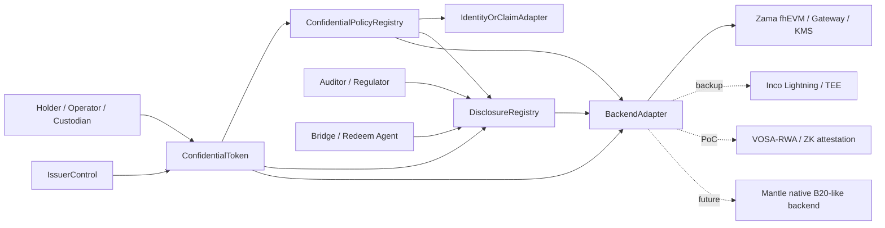
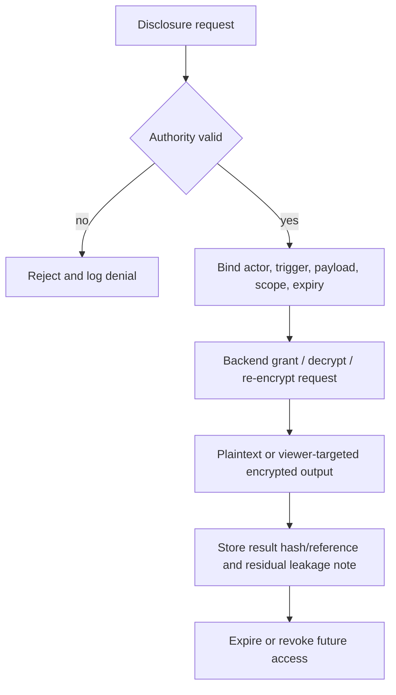

# Confidential Compliance Token 最终研究报告

> **Project slug**: `confidential-compliance-token-research`
> **Issue**: `7b29e4a8-01eb-4cbf-9b59-8e363f9a40e4`
> **Branch**: `research/confidential-compliance-token-research/final-report`
> **Source index**: `confidential-compliance-token-research/research-sections/_index.md` @ `cd5ba23`
> **Data anchor**: all 8 final research sections confirmed on `main` as of 2026-06-24
> **Synthesis role**: Technical Writer Agent
> **Traceability matrix**: `confidential-compliance-token-research/report/traceability-matrix.md`

This report synthesizes the 8 accepted final sections into one decision document for Mantle decision makers and engineering reviewers. It does not perform new research. Claims marked `[TW inference]` combine multiple accepted sections into a report-level recommendation; all such claims are traceable in the matrix.

## Executive Summary

Mantle should pursue a **gated application/coprocessor hybrid** for Confidential Compliance Token, not a native precompile or production launch commitment in phase 1. The recommended route is:

> **ERC-3643-style identity / compliance / issuer controls + ERC-7984 / OpenZeppelin-style confidential value interface + scoped DisclosureRegistry + replaceable BackendAdapter.**

Zama / OpenZeppelin is the first backend path to validate because it has the clearest confidential-token and RWA extension surface. This is not a single-vendor bet: the protocol boundary should preserve backend replacement so Inco Lightning, Fhenix/CoFHE, VOSA-style PoC paths, or a future Mantle-native backend can be evaluated without rewriting the token/compliance surface.

**Decision summary**

| Decision area | Recommendation | Reason |
|---|---|---|
| Main route | ERC-3643 + ERC-7984/OZ confidential overlay, Zama-first but backend-replaceable | Best combined fit for compliance lifecycle, selective disclosure, encrypted amount/balance interface, and Mantle lightweight integration. |
| First gate | Backend maturity and Mantle support | Encrypted amount/balance is mandatory for CCT, but production delivery requires a named backend with Mantle support, self-host path, audits, SLA, and failure semantics. |
| Backup backend | Inco Lightning | Strongest non-Zama backup signal because of Base mainnet proximity and lower-latency TEE path, but Mantle support, TEE trust, and public audit scope remain unverified. |
| PoC fallback | VOSA-RWA/VOSA-20 | Useful for a lightweight exposed-graph compliance-attestation test, but forum-draft maturity and audit gaps block production positioning. |
| Components | Railgun/Privacy Pools, Paladin/Pente, Inco confidential ERC20 PoC | Useful as source-of-funds, workflow privacy, or engineering references; not standalone CCT routes. |
| References | Optalysys, Aztec, Starknet STRK20, EIP-8182, B20-like native precompile | Performance, privacy ceiling, non-EVM/native-token, protocol-pool, or phase-2 references. Not phase-1 Mantle routes. |

**Most important caveats**

- ERC-3643 is a six-core-contract T-REX architecture plus the ONCHAINID identity layer: Token, Identity Registry, Identity Registry Storage, Claim Topics Registry, Trusted Issuers Registry, Modular Compliance, plus ONCHAINID. It is not one flat compliance contract.
- Current Base and Mantle code observations are `current-state-checked` / `code_verification_required`; they are not production roadmap facts.
- Phase-1 encrypted balances and encrypted transfer amounts are a product requirement, but production delivery is gated on a named confidential backend being production-ready for the target chain.
- The Inco confidential ERC20 framework is an unaudited proof of concept and should be used only as an interface/state reference.
- Optalysys is an FHE performance and productionization reference, not a token standard or Mantle integration route.
- Vendor roadmap, performance, audit, partnership, and mainnet-support claims remain unverified unless the source section explicitly pinned independent evidence.

## 1. Requirement Baseline

CCT is not ordinary privacy token design and not ordinary compliance token design. The minimum product boundary is:

1. **Compliance token lifecycle**: identity/KYC, transfer policy, issuer controls, freeze, recovery, redemption, and audit workflow.
2. **Confidential accounting**: transfer amount, balance, frozen balance, and relevant value fields are not public plaintext.
3. **Selective disclosure**: authorized actors can see scoped payloads under an explicit authority, trigger, payload, scope, revocation, leakage, and audit-log model.
4. **Mantle lightweight integration**: phase 1 should avoid new chain/VM, new bridge, full-node privacy infrastructure, Mantle execution-client changes, or hardfork dependency.
5. **Bridge/redeem boundary**: RWA production needs an explicit point where confidential value becomes settlement evidence.

[TW inference] The first Mantle decision is not "which privacy protocol is best"; it is whether Mantle wants a **regulated confidential asset program** whose first measurable output is an app-layer PoC with production gates.

### MVP Capability Model

| Capability | Phase-1 treatment | Evidence basis |
|---|---|---|
| Identity/KYC and sanctions | Mostly plaintext or permissioned compliance facts | ERC-3643 and B20/TIP policy research |
| Encrypted amount/balance | Mandatory CCT product requirement | WHI-266, WHI-267, WHI-269 |
| Amount-sensitive policy | Must use FHE-native logic, scoped selective decrypt, or rule-configuration fail-closed exclusion | WHI-267, WHI-272 |
| Issuer controls | Mint, burn, pause, freeze, recovery, force action, and redeem semantics must be defined under ciphertext | WHI-269, WHI-272 |
| Disclosure | Must be scoped and logged; full-history viewing keys are an anti-pattern | WHI-266, WHI-268, WHI-272 |
| DeFi compatibility | Not a generic phase-1 promise; adapter-specific only | WHI-268, WHI-271 |
| Native precompile | Phase 2 only | WHI-269, WHI-271, WHI-273 |

## 2. Recommended Architecture

The recommended phase-1 protocol has six modules. The split prevents policy code from treating ciphertext as plaintext, prevents token contracts from becoming legal identity registries, and prevents disclosure from collapsing into an unbounded viewing key.

| Module | Owns | Does not own |
|---|---|---|
| `ConfidentialToken` | ERC-7984-like balances, confidential transfer, encrypted handles, token events, hooks | KYC source of truth, backend keys |
| `ConfidentialPolicyRegistry` | policy IDs, public identity rules, blocklist/allowlist, encrypted-rule routing, policy versioning | raw FHE or TEE operations |
| `DisclosureRegistry` | request, grant, actor, payload, scope, expiry, revocation status, result reference | durable plaintext balances or transfer amounts |
| `IssuerControl` | mint, burn, pause, freeze, recovery, redeem roles, governance logs | silent owner superpower, backend key material |
| `IdentityOrClaimAdapter` | address-to-identity mapping, claim/trusted issuer checks, KYC/sanctions state | private identity protocol mandate |
| `BackendAdapter` | encrypted input validation, arithmetic, compare/select, decrypt/re-encrypt, grant/revoke hooks, health/SLA signals | product policy semantics |

### Failure Semantics

Plaintext checks may revert or fail closed when the checked fact is already public or intentionally visible: role, identity registry presence, blocklist, operator right, malformed proof, or backend availability.

Encrypted predicates must not leak by predicate-dependent revert. Insufficient encrypted balance, amount threshold, holder cap, frozen-balance check, or amount-limit failure should use one of:

- FHE-native `select` / zero-transfer / encrypted denial state;
- explicit selective decrypt to an authorized actor;
- rule-configuration fail-closed exclusion when the backend cannot support the rule.

This failure rule is a production gate, not an implementation detail.

## 3. Route Decision

### Primary Route

**Main recommendation**: `ERC-3643 + ERC-7984/OZ confidential overlay`, with Zama/OZ as first backend validation path and backend replacement preserved.

This route wins because it combines:

- ERC-3643-style identity, claims, transfer policy, issuer controls, freeze/recovery, and compliance lifecycle;
- ERC-7984/OZ-style encrypted amount/balance interface, RWA, ObserverAccess, Restricted, Freezable, Hooked, and Wrapper concepts;
- scoped disclosure as a first-class registry;
- application-layer deployability with no default Mantle client or hardfork dependency.

The route is **gated**, not production-ready by assertion. Zama/OZ gives the clearest standard and implementation surface, but the hard input bundle does not prove Mantle host-chain support or production SLA. A production decision needs partner support or a self-hosted Gateway/KMS/coprocessor plan.

### Backup and Component Roles

| Bucket | Candidate | Report role | Trigger to upgrade | Trigger to downgrade |
|---|---|---|---|---|
| Backup backend | Inco Lightning | fastest non-Zama pressure test | Mantle support, public audit/scope, TEE attestation, liveness, force-exit, SLA | no Mantle path, unacceptable TEE trust, unclear disclosure semantics |
| PoC fallback | VOSA-RWA/VOSA-20 | lightweight exposed-graph compliance-attestation experiment | audited implementation and accepted graph-leak model | remains forum draft or lacks issuer controls |
| Backend observe | Fhenix/CoFHE | backend-replaceable FHE watchlist | production mainnet proof, audit, RWA/compliance modules | status remains ambiguous or compliance modules stay weak |
| Component | Railgun/Privacy Pools | source-of-funds / association-set / PPOI supplement | issuer lifecycle adapter appears | issuer lifecycle remains missing |
| Component | Paladin/Pente | private business workflow supplement | business-state privacy becomes phase-1 scope | token-ledger MVP stays the target |
| Engineering reference | Inco confidential ERC20 framework | wrapper, delegated viewing, transfer-rule module reference | never production without redesign/audit | any attempt to copy PoC directly |
| Performance reference | Optalysys | FHE production/SLA question generator | independent benchmark against actual CCT path | used as token/compliance evidence |
| Phase 2 | Native B20-like private precompile | future native optimization | PoC proves demand and app-layer bottleneck | required for phase-1 success |

## 4. Compliance And Disclosure Model

The compliance plane and privacy plane should be intentionally separate.

| Plane | Public or permissioned | Confidential | Notes |
|---|---|---|---|
| Identity and eligibility | address, identity registry, KYC state, jurisdiction class, trusted issuer, policy ID | optional future private identity only | private identity is not phase-1 scope |
| Token accounting | token address, event existence, sender/receiver addresses, policy event | amount, balance, frozen balance, recoverable balance | graph/timing remain residual leakage |
| Issuer controls | role action, legal trigger reference, policy version | affected confidential amount when not legally disclosed | freeze/recovery must be logged |
| Disclosure | request metadata, actor, purpose, scope, expiry, result hash/reference | scoped amount/balance payload | full-history viewing key is an anti-pattern |
| Bridge/redeem | settlement rail, recipient, legal record | encrypted amount until settlement boundary | redeem intentionally discloses value to settlement actor |

[TW inference] Mantle should treat disclosure UX and audit export as core product surfaces. If a holder, issuer, auditor, or regulator cannot answer "who can see what, why, for how long, and whether old access is still valid," the PoC has not proven institutional readiness.

## 5. Mantle Integration Roadmap

### Roadmap

| Window | Phase | Objective | Deliverables | Decision gate |
|---|---|---|---|---|
| 0-3 months | Phase 0: feasibility spike | decide whether a lightweight Mantle CCT PoC is feasible without client change | PoC spec, backend memo, BackendAdapter interface, authority matrix, threat model, mock tests, source trace, cost estimate | proceed only if backend path, scoped disclosure, and adapter boundary are credible |
| 3-6 months | Phase 1a: testnet PoC | demonstrate minimum closed loop | contracts, SDK demo, KYC/policy fixture, backend conformance, indexer dashboard, wallet/custody script, runbook | pass no-leak and no-hardfork checklist |
| 3-6 months | Phase 1b: pilot readiness | decide whether PoC can become limited pilot | p50/p95/p99/cost metrics, KMS/operator runbook, incident drill, compliance memo, security review scope, numeric SLA/cost thresholds | pilot only if governance, latency, disclosure, security, UX, and cost gates pass |
| 6-12 months | Phase 2: native evaluation | evaluate B20-like / PolicyRegistry / native encrypted accounting only if evidence justifies it | native scorecard, Mantle code/governance feasibility, protocol proposal outline, audit/fork cost | open native proposal only if phase-1 metrics show real demand and app-layer bottleneck |

### Minimum PoC Loop

1. Register issuer, compliance officer, auditor, freeze/recovery role, and two holders.
2. Mint encrypted amount to an eligible holder.
3. Show no plaintext amount or balance in public event/indexer surfaces.
4. Execute confidential transfer to an eligible receiver.
5. Execute a failing transfer to an ineligible receiver.
6. Request scoped disclosure for one account or transfer window.
7. Execute freeze or recovery ceremony with logged authority.
8. Trigger one backend failure, denied disclosure, malformed proof, or indexer-lag case.
9. Export evidence linking every operation to policy, disclosure, and no-leak artifacts.

### PoC Checklist For Report Packaging

| ID | Phase | Task | Evidence | Stop condition |
|---|---|---|---|---|
| C-01 | Phase 0 | Confirm PoC asset scope | scope memo | no asset/legal scope |
| C-02 | Phase 0 | Pin success criteria | accepted pass/fail checklist | missing material evidence |
| C-03 | Phase 0 | Select backend or bounded fallback | support statement or conformance plan | no credible backend path |
| C-04 | Phase 0 | Freeze `BackendAdapter` interface | ABI/API review | public API exposes vendor-specific encrypted types |
| C-05 | Phase 0 | Define plaintext/encrypted policy split | policy matrix and unsupported-rule list | amount policy uses leaky revert |
| C-06 | Phase 0 | Define disclosure authority matrix | actor/payload/scope/expiry/revocation table | unbounded historical viewing key |
| C-07 | Phase 0 | Define roles and governance | role matrix and multisig/timelock plan | single silent superuser |
| C-08 | Phase 0 | Write residual leakage note | threat model | graph/timing/privacy overclaim |
| C-09 | Phase 0 | Build mock backend tests | unit/integration logs | no repeatable demo skeleton |
| C-10 | Phase 0 | Prepare metrics plan | dashboard schema | no metrics for Phase 1 |
| C-11 | Phase 1a | Deploy contracts and fixtures | addresses and config hash | requires Mantle client change |
| C-12 | Phase 1a | Integrate real or conformance backend | encrypted input/decrypt traces | backend cannot run target operations |
| C-13 | Phase 1a | Execute confidential mint | tx trace and encrypted handle | plaintext amount leak |
| C-14 | Phase 1a | Execute transfer pass/fail cases | eligible success, ineligible fail, no amount leak | eligibility cannot be enforced |
| C-15 | Phase 1a | Execute scoped audit disclosure | request/grant/result/expiry/revocation logs | disclosure scope cannot be bounded |
| C-16 | Phase 1a | Execute freeze or recovery ceremony | role proof and audit trail | silent seizure/decrypt path |
| C-17 | Phase 1a | Run failure drills | runbook and failure logs | unlogged state divergence |
| C-18 | Phase 1a | Verify no plaintext value in UI/indexer logs | leakage review | public leakage found |
| C-19 | Phase 1a | Complete wallet/custody manual acceptance | script results and UX notes | operator cannot complete flow reliably |
| C-20 | Phase 1b | Measure p50/p95/p99 and cost; set numeric thresholds | metrics report and decision memo | only vendor claims, or no threshold |
| C-21 | Phase 1b | Produce KMS/operator runbook | key ceremony and alert plan | unacceptable key governance |
| C-22 | Phase 1b | Define security review scope | review package | production depends on unaudited PoC code |
| C-23 | Phase 1b | Produce compliance memo | compliance and leakage memo | auditor/regulator minimum not satisfied |
| C-24 | Phase 1b | Decide start, narrow, stop, or Phase 2 study | decision memo tied to gates | decision ignores stop-condition evidence |
| C-25 | Phase 2 | If triggered, write native precompile evaluation issue | separate proposal scope | no measured demand or app-layer bottleneck |

## 6. Risks And Gates

| Risk | Severity | Gate |
|---|---|---|
| Backend lacks Mantle support | blocking | supported host chain, self-host path, or deliberately non-Mantle PoC boundary |
| Amount policy is incompatible with encrypted values | blocking | FHE-native rule, authorized selective decrypt, or unsupported-rule exclusion |
| Engineering/deployment surface is under-owned | blocking | deployment runbook, registry ownership, conformance tests, audit scope, operator SLA, incident playbook |
| KMS/Gateway/coprocessor governance is unclear | high | operator set, threshold policy, key rotation, incident response, security review |
| TEE trust is unacceptable | high | attestation model, enclave upgrade policy, force-exit and fallback semantics |
| Disclosure becomes a backdoor | high | scoped grants, expiry, role split, logs, compromise response |
| Issuer/admin capture | high | multisig, timelock, legal trigger, transparency log |
| Historical ACL revocation remains unproven | high | treat old access as persistent unless backend proves otherwise |
| Bridge/redeem leaks are under-modeled | high | intentional disclosure boundary and recipient/scope logging |
| Metadata graph leakage is overclaimed away | medium/high | publish residual leakage model |
| DeFi compatibility is overstated | medium/high | adapter-specific integration only |
| Vendor lock-in leaks into API | medium/high | backend-neutral interface and migration plan |
| Performance/SLA evidence is weak | medium/high | p50/p95/p99, cost, retry, timeout, and operator dashboard |

## 7. Cross-Cutting Analysis

### Consensus

- The first useful Mantle CCT is a **token-ledger** product: confidential amounts and balances with compliance controls. Private business-state execution, private identity, private DeFi, and order-flow privacy are separate tracks.
- Account-based confidential token design is the best near-term substrate for regulated assets. Note-based pools and privacy groups are important supplements but do not replace issuer lifecycle controls.
- Backend maturity is the largest production gate. Contract architecture can be specified now, but production claims require named backend evidence.
- Disclosure must be productized. Viewing keys, ObserverAccess, admin views, ASPs, TEE decrypts, and auditor exports are all disclosure surfaces with governance risk.
- Native precompile work belongs after the PoC proves demand and identifies app-layer bottlenecks.

### Conflicts And Reconciliations

| Tension | Reconciliation |
|---|---|
| ERC-3643 expects plaintext `amount`, while ERC-7984 hides amount as ciphertext | Split plaintext identity checks from encrypted amount policy. Amount policy must use backend-safe encrypted logic, selective decrypt, or be excluded. |
| Compliance wants visibility, privacy wants minimization | DisclosureRegistry encodes authority, trigger, payload, scope, expiry, revocation, residual leakage, and result reference. |
| B20 is attractive as native token infrastructure | Use B20 as policy/compliance vocabulary in phase 1; native confidential B20-like design is phase 2. |
| Inco may be faster than Zama, but has TEE trust | Treat Inco as backend backup and pressure test, not automatic main route. |
| VOSA is lightweight and compliance-friendly, but immature | Use as PoC fallback for exposed-graph appetite; do not present as production route. |
| Optalysys makes FHE production feel closer | Use it only to define SLA and hardware questions, not as implementation evidence. |

### Open Questions

1. Which backend will provide a credible Mantle support path: Zama, Inco, self-hosted stack, or non-Mantle validation first?
2. Which amount-sensitive policies are required for the first regulated asset, and can they be expressed without leaking encrypted predicates?
3. What disclosure payloads are legally and operationally sufficient for issuer, auditor, regulator, custodian, and bridge/redeem agent?
4. What latency, cost, and availability thresholds are acceptable before a pilot decision?
5. Which party owns backend operations, KMS/key ceremony, incident response, audit logs, and failure recovery?
6. What exact bridge/redeem settlement path is in scope for the first PoC asset?

## 8. Recommended Next Actions

1. Start Phase 0 as a feasibility spike with a hard stop if no backend path is credible.
2. Ask Zama and Inco for Mantle-specific support, self-hosting, audit, SLA, key-governance, and disclosure semantics.
3. Draft the `BackendAdapter`, `DisclosureRegistry`, and policy split before writing production-facing contracts.
4. Select one or two amount-dependent policy rules for the spike and prove their failure semantics do not leak values.
5. Build the PoC evidence export from day one: transactions, encrypted handles, disclosure logs, no-leak indexer output, failure drills, and traceability.
6. Keep native precompile work as a separate Phase 2 issue only after Phase 1 produces measured demand and app-layer bottleneck evidence.

## Appendix A: Input Research Sections

| Order | Topic | Issue | Main merge commit | Final path |
|---:|---|---|---|---|
| 1 | requirements-framework | `7d7fa951-8160-4b03-a7ae-8ff1a6a9664c` | `9eb29a1` | `confidential-compliance-token-research/research-sections/requirements-framework/final.md` |
| 2 | zama-confidential-rwa | `22741382-2866-4221-8b39-17551f5f400e` | `1a9fad0` | `confidential-compliance-token-research/research-sections/zama-confidential-rwa/final.md` |
| 3 | pse-private-transfers-constraints | `687a44f7-c9b1-42a3-b435-99ea6fd09a29` | `b54e21b` | `confidential-compliance-token-research/research-sections/pse-private-transfers-constraints/final.md` |
| 4 | compliance-token-private-extension | `18fbd577-47e2-47f6-bfbf-a7519114df13` | `bb27379` | `confidential-compliance-token-research/research-sections/compliance-token-private-extension/final.md` |
| 5 | confidential-rwa-candidates | `84e8d44a-f970-4531-a351-f9d801da4947` | `29269d9` | `confidential-compliance-token-research/research-sections/confidential-rwa-candidates/final.md` |
| 6 | route-comparison | `d44834f3-e3f7-4174-9200-395052956c18` | `1728cac` | `confidential-compliance-token-research/research-sections/route-comparison/final.md` |
| 7 | mantle-protocol-design | `dfd8a3e5-1841-4eac-8050-daaecfff89dd` | `0a058bd` | `confidential-compliance-token-research/research-sections/mantle-protocol-design/final.md` |
| 8 | integration-roadmap | `cf06b8fa-ed51-4b1e-8f3f-bfcd2f76197a` | `0d11f05` | `confidential-compliance-token-research/research-sections/integration-roadmap/final.md` |

## Appendix B: Sections Index Reference

The accepted section order and dependencies are recorded in `confidential-compliance-token-research/research-sections/_index.md` @ `cd5ba23`. All eight entries are `status=done`.

## Appendix C: Diagram Assets

No standalone rendered diagram assets were generated. Architecture, disclosure, and roadmap diagrams are embedded as Mermaid blocks in this report. The reserved assets path is `confidential-compliance-token-research/report/assets/`.

## Appendix D: Methodology Notes

- Synthesis used only accepted final sections, the updated section index, and the dispatch caveats.
- Vendor roadmap, performance, audit, and partnership claims are carried as unverified unless the source section pinned independent support.
- Local code checks are treated as bounded current-state checks, not product roadmap or production readiness proof.
- Report-level synthesis claims are marked `[TW inference]` when they combine multiple sections rather than restating a single research finding.
