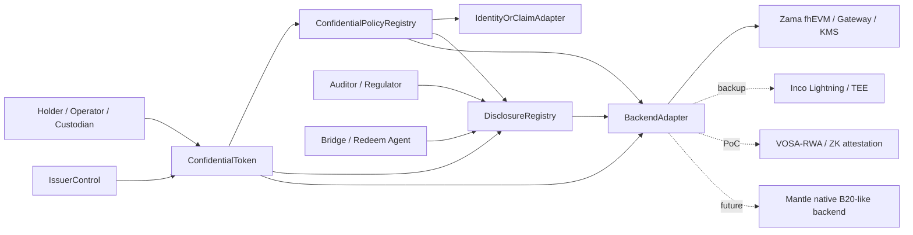
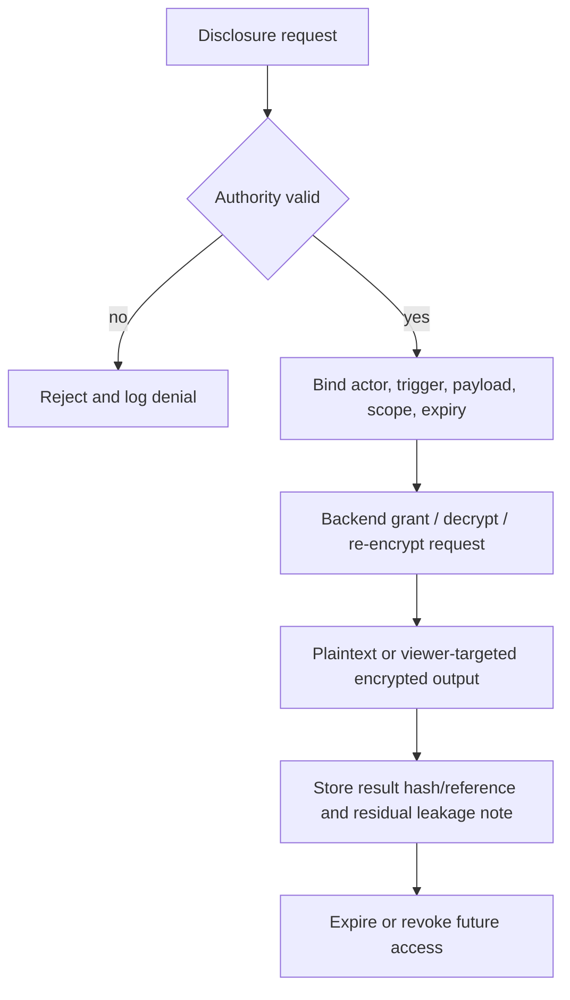

# Confidential Compliance Token 最终研究报告

> **项目标识（Project slug）**: `confidential-compliance-token-research`
> **议题（Issue）**: `7b29e4a8-01eb-4cbf-9b59-8e363f9a40e4`
> **分支（Branch）**: `research/confidential-compliance-token-research/final-report`
> **来源索引（Source index）**: `confidential-compliance-token-research/research-sections/_index.md` @ `cd5ba23`
> **数据锚点（Data anchor）**: 全部 8 个 final 研究章节已于 2026-06-24 在 `main` 上确认
> **综合角色（Synthesis role）**: Technical Writer Agent
> **可追溯矩阵（Traceability matrix）**: `confidential-compliance-token-research/report/traceability-matrix.md`

本报告将 8 个已接受的 final 章节综合为一份面向 Mantle 决策者与工程评审者的决策文档。它不进行新的研究。标注为 `[TW inference]` 的结论是将多个已接受章节合并而成的报告级建议；所有此类结论均可在矩阵中追溯。

## 执行摘要（Executive Summary）

对于 Confidential Compliance Token，Mantle 应在第 1 阶段采用**门控的应用层/协处理器（coprocessor）混合方案**，而非原生 precompile 或生产上线承诺。推荐路线为：

> **ERC-3643 式的身份 / 合规 / 发行方控制 + ERC-7984 / OpenZeppelin 式机密价值接口 + 限定作用域的 DisclosureRegistry + 可替换的 BackendAdapter。**

Zama / OpenZeppelin 是首先要验证的后端路径，因为它具备最清晰的机密代币与 RWA 扩展面。这并非押注单一供应商：协议边界应保留后端可替换能力，以便在不重写代币/合规接口面的前提下，对 Inco Lightning、Fhenix/CoFHE、VOSA 式 PoC 路径，或未来某个 Mantle 原生后端进行评估。

**决策摘要**

| 决策领域 | 建议 | 理由 |
|---|---|---|
| 主路线 | ERC-3643 + ERC-7984/OZ 机密叠加层，Zama 优先但后端可替换 | 在合规生命周期、选择性披露、加密金额/加密余额接口，以及 Mantle 轻量集成方面的综合契合度最佳。 |
| 首个门控 | 后端成熟度与 Mantle 支持 | 加密金额/加密余额对 CCT 是强制要求，但生产交付需要一个具名后端，且该后端须支持 Mantle、具备自托管路径、审计、SLA 与失败语义。 |
| 备用后端 | Inco Lightning | 因接近 Base mainnet 且具备更低延迟的 TEE 路径，是最强的非 Zama 备用信号；但其对 Mantle 的支持、TEE 信任，以及公开审计范围仍未经核实。 |
| PoC 回退方案 | VOSA-RWA/VOSA-20 | 适合做一次轻量的暴露图（exposed-graph）合规证明测试，但论坛草案级别的成熟度与审计缺口阻碍其进入生产定位。 |
| 组件 | Railgun/Privacy Pools、Paladin/Pente、Inco confidential ERC20 PoC | 可用作资金来源、工作流隐私或工程参考；并非独立的 CCT 路线。 |
| 参考项 | Optalysys、Aztec、Starknet STRK20、EIP-8182、B20 式原生 precompile | 分别作为性能、隐私上限、非 EVM/原生代币、协议池或第 2 阶段参考。并非第 1 阶段的 Mantle 路线。 |

**最重要的注意事项**

- ERC-3643 是一个由六个核心合约构成的 T-REX 架构，外加 ONCHAINID 身份层：Token、Identity Registry、Identity Registry Storage、Claim Topics Registry、Trusted Issuers Registry、Modular Compliance，再加上 ONCHAINID。它不是单个扁平的合规合约。
- 当前对 Base 与 Mantle 代码的观察处于 `current-state-checked` / `code_verification_required` 状态；它们不是生产路线图事实。
- 第 1 阶段的加密余额与加密转账金额是产品需求，但生产交付以一个具名机密后端在目标链上达到生产就绪为门控前提。
- Inco confidential ERC20 框架是未经审计的概念验证（proof of concept），仅应作为接口/状态参考使用。
- Optalysys 是 FHE 性能与产品化参考，不是代币标准，也不是 Mantle 集成路线。
- 供应商的路线图、性能、审计、合作关系与 mainnet 支持等声明，除非来源章节明确锚定了独立证据，否则一律视为未经核实。

## 1. 需求基线（Requirement Baseline）

CCT 既不是普通的隐私代币设计，也不是普通的合规代币设计。其最小产品边界为：

1. **合规代币生命周期**：身份/KYC、转账策略、发行方控制、冻结、恢复、赎回与审计工作流。
2. **机密记账**：转账金额、余额、冻结余额及相关价值字段不以公开明文形式存在。
3. **选择性披露**：被授权的参与者可在明确的授权、触发、载荷、作用域、撤销、泄漏与审计日志模型下，查看限定作用域的载荷。
4. **Mantle 轻量集成**：第 1 阶段应避免引入新链/VM、新桥、全节点隐私基础设施、Mantle 执行客户端改动或 hardfork 依赖。
5. **桥接/赎回边界**：RWA 生产需要一个明确的环节，让机密价值在该处转化为结算证据。

[TW inference] Mantle 的首要决策不是「哪种隐私协议最好」；而是 Mantle 是否想要一个**受监管的机密资产项目**，其首个可衡量产出是一个带生产门控的应用层 PoC。

### MVP 能力模型（MVP Capability Model）

| 能力 | 第 1 阶段处理方式 | 证据依据 |
|---|---|---|
| 身份/KYC 与制裁筛查 | 多为明文或经许可的合规事实 | ERC-3643 与 B20/TIP 策略研究 |
| 加密金额/加密余额 | 强制的 CCT 产品需求 | WHI-266、WHI-267、WHI-269 |
| 金额敏感型策略 | 必须使用 FHE 原生逻辑、限定作用域的选择性解密，或规则配置层面的失败即拒绝（fail-closed）排除 | WHI-267、WHI-272 |
| 发行方控制 | mint、burn、pause、freeze、recovery、force action 与 redeem 语义必须在密文下定义 | WHI-269、WHI-272 |
| 披露 | 必须限定作用域并记录日志；全历史 viewing key 是一种反模式 | WHI-266、WHI-268、WHI-272 |
| DeFi 兼容性 | 并非第 1 阶段的通用承诺；仅针对特定 adapter | WHI-268、WHI-271 |
| 原生 precompile | 仅限第 2 阶段 | WHI-269、WHI-271、WHI-273 |

## 2. 推荐架构（Recommended Architecture）

推荐的第 1 阶段协议包含六个模块。这种拆分可防止策略代码把密文当作明文处理，防止代币合约沦为法律身份注册表，并防止披露退化为无界的 viewing key。

| 模块 | 拥有 | 不拥有 |
|---|---|---|
| `ConfidentialToken` | ERC-7984 式余额、机密转账、加密 handle、代币事件、hooks | KYC 真相来源、后端密钥 |
| `ConfidentialPolicyRegistry` | 策略 ID、公开身份规则、blocklist/allowlist、加密规则路由、策略版本管理 | 原始 FHE 或 TEE 运算 |
| `DisclosureRegistry` | 请求、授予、参与者、载荷、作用域、过期、撤销状态、结果引用 | 持久化的明文余额或转账金额 |
| `IssuerControl` | mint、burn、pause、freeze、recovery、redeem 角色、治理日志 | 静默的所有者超级权限、后端密钥材料 |
| `IdentityOrClaimAdapter` | 地址到身份的映射、claim/trusted issuer 检查、KYC/制裁状态 | 强制采用某一私有身份协议 |
| `BackendAdapter` | 加密输入校验、算术运算、compare/select、decrypt/re-encrypt、grant/revoke hooks、health/SLA 信号 | 产品策略语义 |

### 失败语义（Failure Semantics）

当被检查的事实本就公开或有意可见时，明文检查可以 revert 或失败即拒绝（fail-closed）：角色、身份注册表中的存在性、blocklist、operator 权利、格式错误的证明，或后端可用性等。

加密谓词不得通过依赖谓词结果的 revert 泄漏信息。加密余额不足、金额阈值、持有人上限、冻结余额检查或金额限额失败，应采用以下方式之一：

- FHE 原生 `select` / 零额转账 / 加密拒绝状态；
- 向被授权参与者进行显式的选择性解密；
- 当后端无法支持该规则时，采用规则配置层面的失败即拒绝（fail-closed）排除。

该失败规则是一项生产门控，而非实现细节。

## 3. 路线决策（Route Decision）

### 主路线（Primary Route）

**主建议**：`ERC-3643 + ERC-7984/OZ 机密叠加层`，以 Zama/OZ 作为首个后端验证路径，并保留后端可替换能力。

该路线胜出的原因在于它整合了：

- ERC-3643 式的身份、claims、转账策略、发行方控制、freeze/recovery 与合规生命周期；
- ERC-7984/OZ 式的加密金额/加密余额接口，以及 RWA、ObserverAccess、Restricted、Freezable、Hooked 与 Wrapper 等概念；
- 作为一等公民注册表的限定作用域披露；
- 应用层可部署性，不依赖默认 Mantle 客户端或 hardfork。

该路线是**门控的（gated）**，而非凭断言即生产就绪。Zama/OZ 提供了最清晰的标准与实现接口面，但这一硬性输入组合并不能证明 Mantle 主机链支持或生产 SLA。生产决策需要合作方支持，或一套自托管的 Gateway/KMS/coprocessor 方案。

### 备用与组件角色（Backup and Component Roles）

| 类别 | 候选 | 报告角色 | 升级触发条件 | 降级触发条件 |
|---|---|---|---|---|
| 备用后端 | Inco Lightning | 最快的非 Zama 压力测试 | Mantle 支持、公开审计/范围、TEE 证明、活性、强制退出、SLA | 无 Mantle 路径、不可接受的 TEE 信任、披露语义不清 |
| PoC 回退方案 | VOSA-RWA/VOSA-20 | 轻量的暴露图（exposed-graph）合规证明实验 | 经审计的实现，以及被接受的图泄漏（graph-leak）模型 | 仍停留在论坛草案，或缺少发行方控制 |
| 后端观察 | Fhenix/CoFHE | 后端可替换的 FHE 观察名单 | 生产 mainnet 证据、审计、RWA/合规模块 | 状态仍含糊，或合规模块仍薄弱 |
| 组件 | Railgun/Privacy Pools | 资金来源 / association-set / PPOI 补充 | 出现发行方生命周期 adapter | 发行方生命周期仍缺失 |
| 组件 | Paladin/Pente | 私有业务工作流补充 | 业务状态隐私进入第 1 阶段范围 | 代币账本 MVP 仍为目标 |
| 工程参考 | Inco confidential ERC20 框架 | wrapper、委托查看、转账规则模块参考 | 未经重新设计/审计永不进入生产 | 任何直接照搬 PoC 的尝试 |
| 性能参考 | Optalysys | FHE 生产/SLA 问题生成器 | 针对真实 CCT 路径的独立基准测试 | 被当作代币/合规证据使用 |
| 第 2 阶段 | B20 式原生私有 precompile | 未来原生优化 | PoC 证明存在需求且存在应用层瓶颈 | 被视为第 1 阶段成功所必需 |

## 4. 合规与披露模型（Compliance And Disclosure Model）

合规平面与隐私平面应有意保持分离。

| 平面 | 公开或经许可 | 机密 | 备注 |
|---|---|---|---|
| 身份与资格 | 地址、身份注册表、KYC 状态、司法辖区类别、trusted issuer、策略 ID | 仅可选的未来私有身份 | 私有身份不在第 1 阶段范围内 |
| 代币记账 | 代币地址、事件存在性、发送方/接收方地址、策略事件 | 金额、余额、冻结余额、可恢复余额 | 图/时序仍属残留泄漏 |
| 发行方控制 | 角色操作、法律触发引用、策略版本 | 在不依法披露时的受影响机密金额 | freeze/recovery 必须记录日志 |
| 披露 | 请求元数据、参与者、目的、作用域、过期、结果哈希/引用 | 限定作用域的金额/余额载荷 | 全历史 viewing key 是一种反模式 |
| 桥接/赎回 | 结算通道、收款方、法律记录 | 在到达结算边界前为加密金额 | 赎回会有意地向结算参与者披露价值 |

[TW inference] Mantle 应把披露 UX 与审计导出视为核心产品接口面。如果持有人、发行方、审计方或监管方无法回答「谁能看到什么、为什么、看多久，以及旧的访问权是否仍然有效」，那么该 PoC 就尚未证明其机构级就绪度。

## 5. Mantle 集成路线图（Mantle Integration Roadmap）

### 路线图（Roadmap）

| 时间窗 | 阶段 | 目标 | 交付物 | 决策门控 |
|---|---|---|---|---|
| 0-3 个月 | Phase 0：可行性冲刺 | 判定能否在不改动客户端的前提下做出一个轻量的 Mantle CCT PoC | PoC 规格、后端备忘录、BackendAdapter 接口、授权矩阵、威胁模型、mock 测试、源码追溯、成本估算 | 仅当后端路径、限定作用域披露与 adapter 边界均可信时方可推进 |
| 3-6 个月 | Phase 1a：testnet PoC | 演示最小闭环 | 合约、SDK demo、KYC/策略 fixture、后端一致性、indexer 仪表盘、wallet/custody 脚本、runbook | 通过无泄漏与无 hardfork 检查清单 |
| 3-6 个月 | Phase 1b：试点就绪 | 判定 PoC 能否转为有限试点 | p50/p95/p99/成本指标、KMS/operator runbook、事故演练、合规备忘录、安全评审范围、数值化 SLA/成本阈值 | 仅当治理、延迟、披露、安全、UX 与成本门控均通过时方可试点 |
| 6-12 个月 | Phase 2：原生评估 | 仅当证据足以支撑时，才评估 B20 式 / PolicyRegistry / 原生加密记账 | 原生评分卡、Mantle 代码/治理可行性、协议提案大纲、审计/分叉成本 | 仅当第 1 阶段指标显示真实需求且存在应用层瓶颈时，才启动原生提案 |

### 最小 PoC 闭环（Minimum PoC Loop）

1. 注册发行方、合规官、审计方、freeze/recovery 角色，以及两名持有人。
2. 向一名合格持有人 mint 加密金额。
3. 在公开的事件/indexer 接口面中不出现任何明文金额或余额。
4. 向一名合格接收方执行机密转账。
5. 向一名不合格接收方执行一次失败的转账。
6. 针对某一账户或某一转账时间窗请求限定作用域的披露。
7. 在记录授权的前提下，执行 freeze 或 recovery 仪式。
8. 触发一次后端失败、被拒披露、格式错误证明或 indexer 滞后场景。
9. 导出证据，将每一操作关联到策略、披露与无泄漏工件。

### 用于报告打包的 PoC 检查清单（PoC Checklist For Report Packaging）

| ID | 阶段 | 任务 | 证据 | 停止条件 |
|---|---|---|---|---|
| C-01 | Phase 0 | 确认 PoC 资产范围 | 范围备忘录 | 无资产/法律范围 |
| C-02 | Phase 0 | 锚定成功标准 | 已接受的通过/失败检查清单 | 缺少实质性证据 |
| C-03 | Phase 0 | 选定后端或有界回退方案 | 支持声明或一致性计划 | 无可信的后端路径 |
| C-04 | Phase 0 | 冻结 `BackendAdapter` 接口 | ABI/API 评审 | 公开 API 暴露了供应商特定的加密类型 |
| C-05 | Phase 0 | 定义明文/加密策略拆分 | 策略矩阵与不支持规则清单 | 金额策略使用了会泄漏的 revert |
| C-06 | Phase 0 | 定义披露授权矩阵 | 参与者/载荷/作用域/过期/撤销表 | 无界的历史 viewing key |
| C-07 | Phase 0 | 定义角色与治理 | 角色矩阵与 multisig/timelock 方案 | 单一静默超级用户 |
| C-08 | Phase 0 | 编写残留泄漏说明 | 威胁模型 | 图/时序/隐私的过度声称 |
| C-09 | Phase 0 | 构建 mock 后端测试 | 单元/集成日志 | 无可重复的 demo 骨架 |
| C-10 | Phase 0 | 准备指标方案 | 仪表盘 schema | Phase 1 无指标 |
| C-11 | Phase 1a | 部署合约与 fixture | 地址与配置哈希 | 需要改动 Mantle 客户端 |
| C-12 | Phase 1a | 集成真实或一致性后端 | 加密输入/解密追踪 | 后端无法运行目标操作 |
| C-13 | Phase 1a | 执行机密 mint | tx 追踪与加密 handle | 明文金额泄漏 |
| C-14 | Phase 1a | 执行转账通过/失败用例 | 合格者成功、不合格者失败、无金额泄漏 | 无法强制执行资格校验 |
| C-15 | Phase 1a | 执行限定作用域的审计披露 | 请求/授予/结果/过期/撤销日志 | 披露作用域无法限定 |
| C-16 | Phase 1a | 执行 freeze 或 recovery 仪式 | 角色证明与审计轨迹 | 存在静默扣押/解密路径 |
| C-17 | Phase 1a | 运行失败演练 | runbook 与失败日志 | 未记录的状态分歧 |
| C-18 | Phase 1a | 核实 UI/indexer 日志中无明文价值 | 泄漏评审 | 发现公开泄漏 |
| C-19 | Phase 1a | 完成 wallet/custody 人工验收 | 脚本结果与 UX 说明 | operator 无法可靠完成流程 |
| C-20 | Phase 1b | 测量 p50/p95/p99 与成本；设定数值阈值 | 指标报告与决策备忘录 | 仅有供应商声称，或无阈值 |
| C-21 | Phase 1b | 产出 KMS/operator runbook | 密钥仪式与告警方案 | 不可接受的密钥治理 |
| C-22 | Phase 1b | 定义安全评审范围 | 评审材料包 | 生产依赖未经审计的 PoC 代码 |
| C-23 | Phase 1b | 产出合规备忘录 | 合规与泄漏备忘录 | 未满足审计方/监管方最低要求 |
| C-24 | Phase 1b | 决定启动、收窄、停止或进入 Phase 2 研究 | 与门控挂钩的决策备忘录 | 决策忽视停止条件证据 |
| C-25 | Phase 2 | 若被触发，撰写原生 precompile 评估议题 | 单独的提案范围 | 无可衡量需求或应用层瓶颈 |

## 6. 风险与门控（Risks And Gates）

| 风险 | 严重度 | 门控 |
|---|---|---|
| 后端缺乏 Mantle 支持 | 阻断性 | 受支持的主机链、自托管路径，或有意设定的非 Mantle PoC 边界 |
| 金额策略与加密值不兼容 | 阻断性 | FHE 原生规则、授权下的选择性解密，或不支持规则的排除 |
| 工程/部署接口面归属不清 | 阻断性 | 部署 runbook、注册表归属、一致性测试、审计范围、operator SLA、事故处置手册 |
| KMS/Gateway/coprocessor 治理不清 | 高 | operator 集合、阈值策略、密钥轮换、事故响应、安全评审 |
| TEE 信任不可接受 | 高 | 证明模型、enclave 升级策略、强制退出与回退语义 |
| 披露沦为后门 | 高 | 限定作用域的授予、过期、角色拆分、日志、泄露应对 |
| 发行方/管理员权力俘获 | 高 | multisig、timelock、法律触发、透明日志 |
| 历史 ACL 撤销仍未获证明 | 高 | 除非后端能证明否则将旧访问权视为持久有效 |
| 桥接/赎回泄漏建模不足 | 高 | 有意的披露边界与收款方/作用域日志 |
| 元数据图泄漏被过度声称已消除 | 中/高 | 发布残留泄漏模型 |
| DeFi 兼容性被夸大 | 中/高 | 仅做针对特定 adapter 的集成 |
| 供应商锁定渗入 API | 中/高 | 后端中立接口与迁移计划 |
| 性能/SLA 证据薄弱 | 中/高 | p50/p95/p99、成本、重试、超时与 operator 仪表盘 |

## 7. 横切分析（Cross-Cutting Analysis）

### 共识（Consensus）

- 首个有用的 Mantle CCT 是一个**代币账本（token-ledger）**产品：带合规控制的机密金额与余额。私有业务状态执行、私有身份、私有 DeFi 与订单流隐私是各自独立的赛道。
- 基于账户的机密代币设计是受监管资产在近期内的最佳底层基底。基于 note 的池与 privacy groups 是重要补充，但不能替代发行方生命周期控制。
- 后端成熟度是最大的生产门控。合约架构现在即可定义，但生产层面的声称需要具名后端的证据。
- 披露必须被产品化。viewing key、ObserverAccess、管理员视图、ASP、TEE 解密与审计方导出都是带治理风险的披露接口面。
- 原生 precompile 工作应在 PoC 证明需求并识别出应用层瓶颈之后再进行。

### 冲突与调和（Conflicts And Reconciliations）

| 张力 | 调和方式 |
|---|---|
| ERC-3643 期望明文 `amount`，而 ERC-7984 将金额隐藏为密文 | 将明文身份检查与加密金额策略拆分开。金额策略必须使用后端安全的加密逻辑、选择性解密，或将其排除。 |
| 合规希望可见，隐私希望最小化 | DisclosureRegistry 编码授权、触发、载荷、作用域、过期、撤销、残留泄漏与结果引用。 |
| B20 作为原生代币基础设施颇具吸引力 | 第 1 阶段把 B20 用作策略/合规词汇；原生机密 B20 式设计属于第 2 阶段。 |
| Inco 可能比 Zama 更快，但存在 TEE 信任问题 | 将 Inco 视为后端备用与压力测试，而非自动的主路线。 |
| VOSA 轻量且对合规友好，但不成熟 | 用作面向暴露图诉求的 PoC 回退方案；不要将其呈现为生产路线。 |
| Optalysys 让 FHE 生产显得更近 | 仅用它来界定 SLA 与硬件相关问题，而非作为实现证据。 |

### 待解问题（Open Questions）

1. 哪个后端能提供可信的 Mantle 支持路径：Zama、Inco、自托管栈，还是先做非 Mantle 验证？
2. 首个受监管资产需要哪些金额敏感型策略，它们能否在不泄漏加密谓词的前提下表达？
3. 对发行方、审计方、监管方、托管方与桥接/赎回代理而言，哪些披露载荷在法律与运营上是充分的？
4. 在做出试点决策前，可接受的延迟、成本与可用性阈值是多少？
5. 哪一方负责后端运营、KMS/密钥仪式、事故响应、审计日志与失败恢复？
6. 首个 PoC 资产纳入范围的桥接/赎回结算路径具体是什么？

## 8. 推荐的下一步行动（Recommended Next Actions）

1. 以可行性冲刺方式启动 Phase 0，若无可信后端路径则设硬性停止点。
2. 向 Zama 与 Inco 询问针对 Mantle 的支持、自托管、审计、SLA、密钥治理与披露语义。
3. 在编写面向生产的合约之前，先起草 `BackendAdapter`、`DisclosureRegistry` 与策略拆分。
4. 为冲刺选取一到两条金额依赖型策略规则，并证明其失败语义不会泄漏价值。
5. 从第一天起就构建 PoC 证据导出：交易、加密 handle、披露日志、无泄漏 indexer 输出、失败演练与可追溯性。
6. 仅在 Phase 1 产出可衡量需求与应用层瓶颈证据之后，才将原生 precompile 工作作为单独的 Phase 2 议题保留。

## 附录 A：输入研究章节（Appendix A: Input Research Sections）

| 顺序 | 主题 | 议题 | 主合并 commit | Final 路径 |
|---:|---|---|---|---|
| 1 | requirements-framework | `7d7fa951-8160-4b03-a7ae-8ff1a6a9664c` | `9eb29a1` | `confidential-compliance-token-research/research-sections/requirements-framework/final.md` |
| 2 | zama-confidential-rwa | `22741382-2866-4221-8b39-17551f5f400e` | `1a9fad0` | `confidential-compliance-token-research/research-sections/zama-confidential-rwa/final.md` |
| 3 | pse-private-transfers-constraints | `687a44f7-c9b1-42a3-b435-99ea6fd09a29` | `b54e21b` | `confidential-compliance-token-research/research-sections/pse-private-transfers-constraints/final.md` |
| 4 | compliance-token-private-extension | `18fbd577-47e2-47f6-bfbf-a7519114df13` | `bb27379` | `confidential-compliance-token-research/research-sections/compliance-token-private-extension/final.md` |
| 5 | confidential-rwa-candidates | `84e8d44a-f970-4531-a351-f9d801da4947` | `29269d9` | `confidential-compliance-token-research/research-sections/confidential-rwa-candidates/final.md` |
| 6 | route-comparison | `d44834f3-e3f7-4174-9200-395052956c18` | `1728cac` | `confidential-compliance-token-research/research-sections/route-comparison/final.md` |
| 7 | mantle-protocol-design | `dfd8a3e5-1841-4eac-8050-daaecfff89dd` | `0a058bd` | `confidential-compliance-token-research/research-sections/mantle-protocol-design/final.md` |
| 8 | integration-roadmap | `cf06b8fa-ed51-4b1e-8f3f-bfcd2f76197a` | `0d11f05` | `confidential-compliance-token-research/research-sections/integration-roadmap/final.md` |

## 附录 B：章节索引参考（Appendix B: Sections Index Reference）

已接受的章节顺序与依赖关系记录于 `confidential-compliance-token-research/research-sections/_index.md` @ `cd5ba23`。全部八条记录均为 `status=done`。

## 附录 C：图示资产（Appendix C: Diagram Assets）

未生成独立渲染的图示资产。架构、披露与路线图图示均以 Mermaid 块嵌入本报告中。预留的资产路径为 `confidential-compliance-token-research/report/assets/`。

## 附录 D：方法论说明（Appendix D: Methodology Notes）

- 综合仅使用了已接受的 final 章节、更新后的章节索引以及分派注意事项。
- 供应商的路线图、性能、审计与合作关系声称，除非来源章节锚定了独立支持，否则一律视为未经核实。
- 本地代码检查被视为有界的当前状态检查，而非产品路线图或生产就绪度证明。
- 当报告级综合结论是合并多个章节而非复述单一研究发现时，将其标注为 `[TW inference]`。
