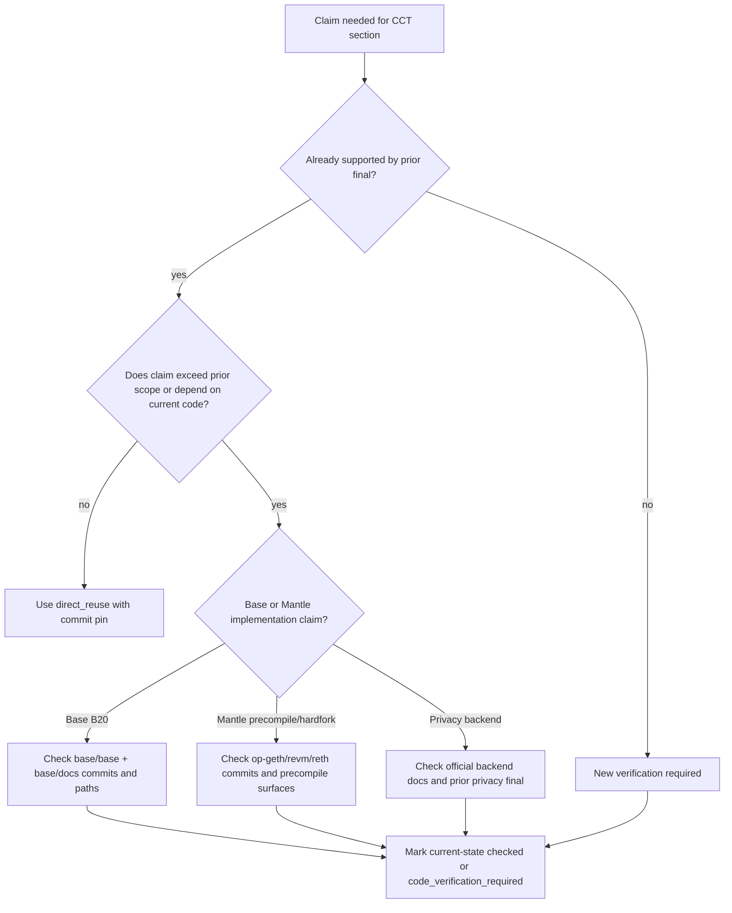
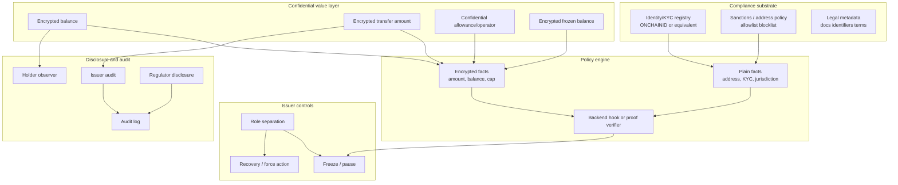
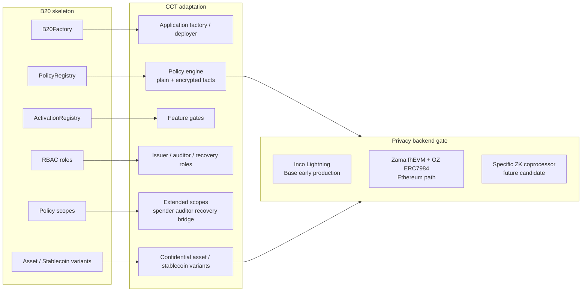
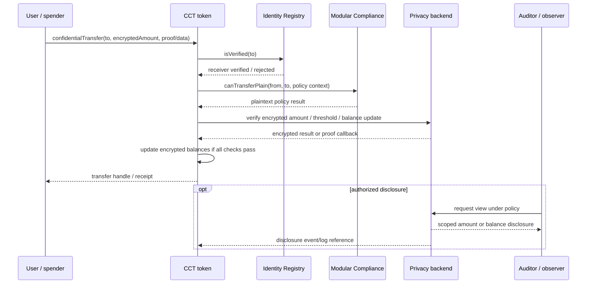

# 合规 Token 底座与 B20 私密扩展需求分析

## 1. 执行摘要（Executive Summary）

本 draft 的结论是：Mantle 的 Confidential Compliance Token（CCT）应把 Base B20 作为能力骨架和产品语言，把 ERC-3643 作为 phase 1 应用层合规基线，把 TIP-20 作为支付和对账能力参考；但不应把 `B20 + private feature` 理解为 phase 1 复制 Base 的原生 B20 precompile。短期路线应是应用层合规合约 + confidential accounting backend + 明确的选择性披露/审计流程；native precompile、原生密文策略引擎和硬分叉级优化应留在 phase 2。

Phase 1 的真正硬约束不是 B20 precompile，而是 confidential backend maturity。`encrypted balance/amount` 是 CCT 的产品 must-have；但它只有在某个具名 backend 能在目标链生产可用或有可信近期开通路径时，才是 phase 1 production deliverable。当前最具体的两个候选是：

- **Inco Lightning**：已由既有隐私研究记录为 2026-06-15 上线 Base 主网，生产成熟度为“Base 早期生产可用”。但它是 TEE-first，Atlas FHE 是 roadmap；且目前证据只覆盖 Base，不覆盖 Mantle。因此它可作为 Base/跨链 PoC 或近期开通候选，不能直接证明 Mantle phase 1 production-ready。
- **Zama fhEVM + OpenZeppelin Confidential Contracts / ERC-7984**：生态和 RWA 扩展最完整，Zama 路线在既有隐私研究中被记录为 Ethereum 主网 + Sepolia 可用，OZ 有 ERC7984Rwa/ObserverAccess/Hooked/IdentityCheck 等合规扩展。但 Mantle 接入需等待官方多链支持或自托管 Coprocessor + Gateway + KMS；同时 FHE ACL 撤销性与 OZ v0.5 audit 风险必须进入合规叙事。

因此，phase 1 表述应拆成两层：**需求层必须支持 encrypted balance/amount、最小 encrypted amount policy、auditor disclosure、freeze/recovery semantics；实现层必须先通过 backend maturity gate**。若 Inco/Zama/等价 ZK coprocessor 不能给出 Mantle production path，phase 1 只能交付 design + PoC/testnet 或 Base-only validation，不能宣称 Mantle production CCT 已可落地。

## 2. 逐项发现（Item Findings）

### item-1: 合规 Token 能力模型抽取与 CCT 映射

既有 `requirements-framework/final.md` 已把 CCT 定义为 compliance token + confidential accounting + selective disclosure；这意味着合规能力和隐私能力不能互相替代。ERC-3643 解决身份/KYC、receiver verification、Agent 控制和 recovery；B20 解决原生 policy slots、RBAC、activation 和资产/稳定币变体；TIP-20 解决支付 memo、currency 和 reconciliation。CCT 需要把这些能力映射到 encrypted value layer，而不是简单叠加一个加密余额字段。

#### 表 1：合规 Token 能力 → 机密扩展需求矩阵（Compliance Token Capability -> Confidential Extension Requirement Matrix）

| 合规能力 | 既有标准来源 | 机密扩展需求 | 阶段目标 | 验证类别 |
|---|---|---|---|---|
| identity_kyc | ERC-3643 ONCHAINID / Identity Registry；B20/TIP wallet policy | 在转账金额与余额被加密的同时，KYC 事实可保持链下或基于明文 claim。策略引擎必须记录哪些身份事实可见。 | phase_1_must_have | direct_reuse + new_synthesis |
| transfer_policy | B20 sender/receiver/executor/mint receiver scopes；ERC-3643 Modular Compliance；TIP-403 policy registry | 将明文地址/身份校验与加密金额/限额校验拆开。基于金额的阈值需要 backend 支持的比较/证明，或明确的披露兜底。 | phase_1_must_have | direct_reuse + private feature analysis |
| issuer_controls | B20 RBAC；ERC-3643 Agent roles | Mint/burn/pause/freeze/recover/force-transfer 必须定义密文行为、审计日志，以及谁可以请求解密或重加密。 | phase_1_must_have | direct_reuse + new_synthesis |
| sanctions_blacklist | B20 BLOCKLIST/ALLOWLIST；TIP-403 blacklist；ERC-3643 modules | 在监管要求确定性执行的场景下，地址与身份制裁校验应保持明文；对金额加密并不免除黑名单义务。 | phase_1_must_have | direct_reuse |
| recovery | ERC-3643 identity-level recovery；B20 burnBlocked-like controls | 恢复加密余额；若 allowance/operator 状态是机密的，则在不泄露无关持有人状态的前提下撤销或迁移消费权。 | 初始为 phase_1_optional；但必须定义语义 | direct_reuse + new_synthesis |
| legal_metadata | ERC-1643 legacy reference；B20 metadata / Asset extra metadata；TIP-20 token metadata | 法律文件、标识符与披露条款大概率保持公开或链下许可。它们不是核心密文状态，但需要不可变引用。 | phase_1_optional | direct_reuse |
| payment_reconciliation | TIP-20 memo / payment lanes / stablecoin currency；B20 memo/currency | 加密转账需要不暴露金额的支付引用策略。Memo 可见性与可关联风险必须明确。 | phase_1_optional | direct_reuse + new_synthesis |
| audit_privacy | requirements-framework CCT rubric；ERC-7984/OZ ObserverAccess；Inco delegated viewing | 区分公开审计轨迹、issuer 审计、持有人授权的 observer 与监管披露。每个披露向量都需要权限、触发条件、payload、范围、可撤销性、残留泄露和审计日志。 | phase_1_must_have | requirements-framework reuse + private backend assessment |

**关键综合（Key synthesis）**：CCT phase 1 应把 KYC/sanctions 视为大体明文的合规输入，把金额/余额视为加密的价值输入。过早地把身份也加密会把范围扩大到隐私身份或匿名转账设计，这对本 issue 并非必需，且会使监管审计复杂化。

### item-2: B20 协议骨架与可复用能力语言

B20 贡献了一套强有力的能力词汇：

- `B20Factory`：确定性创建与按变体的初始化。
- `PolicyRegistry`：通过数字 policy ID 引用的共享 allowlist/blocklist 策略。
- `ActivationRegistry`：围绕状态变更函数与 token 变体的功能激活门控。
- RBAC：分离的 admin/mint/burn/burnBlocked/pause/unpause/metadata 角色，外加当前文档/代码中的 Asset `OPERATOR_ROLE`。
- Policy scopes：sender、receiver、executor 与 mint receiver。
- Variants：Asset 面向通用/RWA-like 资产；Stablecoin 面向固定小数、以币种计价的 token。

当前本地验证支持该骨架，但同时也相对于较旧的 B20 报告改变了证据立场。旧 final 使用 `base/base` commit `8e8767281d7c8768f6a0aed9124779cd4ed030ae`，并称未核对正式 B20 文档。当前本地文档现已包含 `base/docs/docs/base-chain/specs/upgrades/beryl/b20.mdx`（位于 `base/docs` commit `9aace7f56ce94320f46e90fb485c4cc0147c34e9`），其中明确描述了 B20 variants、B20Factory、PolicyRegistry、ActivationRegistry、四个 policy scopes、Asset 与 Stablecoin。当前本地实现（`base/base` commit `01e732cdbae0c624d652da9e608d7d3fe0f9c74b`）在 `crates/common/precompiles/src/` 下仍有 `b20_factory`、`activation`、`policy`、`b20_asset` 与 `b20_stablecoin` 模块。

对当前 B20 模块的定向搜索，在 B20 precompile 目录中未发现 `confidential`、`encrypted`、`FHE`、`ERC7984`、`ONCHAINID` 或 ERC-3643 专属 hook。因此，B20 可作为合规骨架复用，但并非一个既有的私密 token 实现。

#### 表 2：B20 骨架 → CCT 产品类比（B20 Skeleton -> CCT Product Analogy）

| B20 组件 | 复用思路 | CCT 适配 | 不要假定 |
|---|---|---|---|
| B20Factory | 确定性 token 创建与按变体配置 | 应用层 factory 或 deployer 可以创建具有一致角色与策略引导的合规机密 asset/stablecoin 变体。 | Mantle phase 1 需要一个 precompile factory。 |
| PolicyRegistry | 共享 policy registry 与 policy ID | 策略引擎可将地址/KYC/sanctions/阈值规则绑定到 token 实例；policy ID 成为产品级引用。 | 策略可在没有隐私 backend 的情况下检视加密事实。 |
| ActivationRegistry | 功能激活门控 | 产品功能开关或升级门控可分阶段上线机密功能，并禁用未完成的 backend 路径。 | Mantle 硬分叉激活在短期内可用。 |
| RBAC | 分离 admin/mint/burn/pause/metadata/operator 权限 | CCT 应拆分 issuer、合规官、recovery agent、auditor、observer admin 与 policy admin。 | 一个全能 owner 对受监管的生产环境是可接受的。 |
| Policy scopes | Sender/receiver/executor/mint receiver 槽位 | 在需要时扩展到 spender/operator、auditor/disclosure、freeze/recovery 与 bridge/redeem scopes。 | B20 scopes 已经覆盖加密 allowance 或 auditor disclosure。 |
| Asset/Stablecoin variants | 按资产类型拆分产品 | RWA/security-like 资产与 stablecoin/payment 变体可能需要不同的披露、对账与 metadata 默认值。 | 两种变体需要完全相同的 private feature 集。 |

**B20Security/redeem 说明**：先前 B20 研究把 B20Security 视为本地/演进信号，而非远端主线事实。当前本地快速搜索浮现出 security 风格的测试辅助代码与 storage-test 信号，但在当前 precompile 模块列表中没有独立部署的 `b20_security` precompile 目录。这仍属 `local_branch_signal` / `code_verification_required`，并非 phase 1 需求。

### item-3: ERC-3643 应用层合规骨架与短期路线价值

ERC-3643 是最强的短期合规底座，因为它是应用层 Solidity、可在 EVM 上移植，且已定义身份与 issuer controls。它的六部分架构是：Token、ONCHAINID、Identity Registry、Identity Registry Storage、Claim Topics Registry、Trusted Issuers Registry 与 Modular Compliance。它让 Mantle 无需等待硬分叉或自定义 precompile，就能获得一个可部署的 phase 1 合规基线。

它的局限同样重要：ERC-3643 假定普通的 ERC-20 价值语义。`canTransfer(from, to, amount)` 及相关 module 期望明文金额，或至少是 module 能推理的某种金额表示。它没有定义 encrypted balances、encrypted transfer amounts、confidential allowance、auditor decryption 或密文 recovery。Agent 角色很有价值，但它们的动作必须针对密文状态重新规范。

#### 表 3：ERC-3643 骨架 → Private Feature 缺口（ERC-3643 Skeleton -> Private Feature Gaps）

| ERC-3643 组件 | 它解决了什么 | 对 CCT 的缺口 | 候选适配 |
|---|---|---|---|
| ONCHAINID | 基于 claim 的身份/KYC；每用户身份合约；Trusted Issuer claims | 不隐藏 token 金额/余额；claim 隐私取决于实现，并非一个机密价值层 | 复用 identity registry，由机密 token 处理价值隐私 |
| Identity Registry | Receiver 校验与 wallet 到 identity 的映射 | Sender/spender/auditor 策略可能需要比默认 receiver 校验更多的 scopes | 为 sender、operator、auditor 与 recovery 角色添加 policy adapters |
| Claim Topics / Trusted Issuers | KYC claim 信任模型与 issuer 治理 | 对加密值的策略需要 backend 专属证明/校验；仅靠 claim 校验无法评估金额阈值 | 让 claim 大体保持明文/链下；加密金额与余额 |
| Modular Compliance | 通过 `canTransfer` 与 `transferred` modules 实现业务转账规则 | 使用金额/余额阈值的规则需要加密比较、证明、披露或保守的明文兜底 | 挂接到 FHE/ZK/coprocessor backend；定义不支持的规则类别 |
| Agent roles | Freeze、partial freeze、forced transfer、recovery、pause、mint、burn | 密文下的动作需要密钥/披露/重加密语义；forced transfer 不能简单绕过机密状态完整性 | 定义特权加密操作、observer 日志与 recovery ceremony |

**Phase 1 适配**：先以 ERC-3643-like 身份与合规 registry 作为可见的合规底层，再为余额/金额附加一个机密价值层。不要把 ERC-3643 本身重塑为一个隐私标准。

### item-4: TIP-20 / 支付对账能力的边界复用

TIP-20/TIP-403 适合作为支付链参考，而非主要的 RWA CCT 架构。其最相关的思路是 memo 字段、ISO 风格的 currency metadata、payment lanes、stablecoin/payment 基础设施，以及面向 sender/recipient/mint-recipient 校验的 policy registry。这些对 CCT 的 stablecoin 或 payment 变体最有价值，尤其是在对账必须在金额加密后仍可存续的场景下。

对 phase 1，payment reconciliation 应为可选。若 CCT 目标是 RWA/security 发行，最小系统在需要 payment lanes 或 DEX 式 stablecoin 基础设施之前，先需要身份、policy、issuer controls、confidential accounting 与审计披露。若目标是机密 stablecoin，则 memo/currency/payment 引用策略变得更重要，但仍必须做隐私范围限定：即便金额已加密，一个公开 memo 也可能泄露业务上下文。

**边界（Boundary）**：TIP-20 为 `payment_reconciliation` 与 stablecoin UX 提供信息；它不应在 phase 1 把 Mantle 推向某种支付链专属的 native precompile。

### item-5: Private Feature 新增需求定义

Private features 从四个方面改变合规骨架：

1. **价值状态变为加密（Value state becomes encrypted）**：余额、转账金额，以及可能的 allowances/frozen balances 不再是普通合约可见的明文整数。
2. **策略分裂为明文事实与加密事实（Policy splits into plaintext and encrypted facts）**：地址/KYC/sanctions 可保持普通 registry 校验；金额阈值、holder caps、per-investor limits、frozen balances 与 redeem limits 需要加密比较、证明或披露。
3. **Issuer controls 需要密文语义（Issuer controls need ciphertext semantics）**：pause 很简单；mint/burn/freeze/recovery/force-transfer 必须定义谁创建密文、谁能解密、如何撤销旧访问权，以及发出什么事件。
4. **审计不再是“一切都公开”（Audit is no longer “everything is public”）**：公开事件、issuer 仪表盘、持有人授权的 observers、监管者、bridge/redeem agents 与 auditors 需要不同的披露向量。

#### 必需的 phase-1 机密 backend 成熟度评估

outline review 的注意事项是对的：phase 1 不能只说“encrypted balance 是 must-have”而不指明让它可行的那个 backend。本 draft 采用以下生产就绪门控：

| Backend 候选 | 成熟度评估 | 链适配 | 对 phase-1 的含义 |
|---|---|---|---|
| Inco Lightning | 先前 confidential-coprocessor 研究记录了 2025-04 的 Base Sepolia 与 2026-06-15 的 Base 主网。它在 Base 上属早期生产，经由 Intel TDX 的 TEE-first；Atlas/FHE 是 roadmap，而非已上线的生产证据。 | 最强的具体 Base 路径；Mantle 支持未有证据，需要 Inco 团队扩展。 | 适合 Base 对齐的 PoC，或在 Inco 承诺 Mantle 支持时使用。目前不足以断言 Mantle phase 1 生产就绪。 |
| Zama fhEVM + OZ ERC-7984/Confidential Contracts | 先前研究记录了 Ethereum 主网 + Sepolia 可用，以及最完整的机密 token/RWA 扩展栈。风险包括 KMS/Coprocessor/Gateway 运维、商业/许可约束、FHE ACL 撤销，以及 OZ audit 发现。 | Mantle 路径需要官方 EVM 扩展到 Mantle，或自托管完整的 Coprocessor + Gateway + KMS 栈。 | 最佳密码学参考路径，但在 phase 1 上线承诺前必须验证 Mantle 生产路径。 |
| Fhenix CoFHE | 先前研究标注其 testnet/early-mainnet 状态含糊，官方文档称生产主网支持即将到来，且 RWA/合规生态较弱。 | 理论上的 EVM-coprocessor 路径；当前输入中没有强 Mantle 生产证据。 | 备选候选，而非 phase 1 生产锚点。 |
| PSE/private-transfers 或通用 ZK coprocessor | 已批准的 source bundle 未深入到足以支撑生产断言的程度。若选定具体实现，可支持转账有效性与选择性披露。 | 在具体项目、证明模型与链部署被锁定前未知。 | 仅为未来候选；不能作为本 draft phase 1 可行性的证据。 |

**门控陈述（Gate statement）**：`encrypted balance/amount = phase_1_must_have` 是一项产品需求与 MVP 验收标准。它仅在 Inco、Zama 或等价的具名 backend 对 Mantle 已生产就绪，或有承诺的近期 Mantle 路径（并具备可审计的安全与运维假设）时，才成为 phase 1 生产实现。否则，phase 1 交付物应限于架构、PoC/testnet 或 Base-only validation。

#### 披露向量（Disclosure vectors）

| 向量 | 权限 | 触发条件 | Payload | 可撤销性 | 残留泄露 |
|---|---|---|---|---|---|
| Holder observer | 持有人或账户 admin | 持有人授予 auditor/custodian 查看权 | 余额和/或选定的转账金额 | 取决于 backend；FHE ACL 历史撤销可能较弱 | 地址图谱与事件时序仍然公开 |
| Issuer compliance | Issuer/合规官 | KYC 审查、sanctions 警报、recovery、强制动作 | 账户余额、frozen amount、选定的转账金额 | 必须记录并受策略约束；不可假定其在密码学上可撤销 | Issuer 获知敏感的金额事实 |
| Regulator/auditor | 监管者、法院命令、基金 auditor | 法律请求或审计周期 | 定义好的账户/时间/窗口 payload | 必须在法律文件与访问策略中明确 | 披露可能成为永久记录 |
| Bridge/redeem agent | Bridge 或赎回运营方 | Wrap/unwrap/redeem/settlement | 金额与目标上下文 | 通常结算后不可撤销 | Bridge/redeem 流程可去匿名化支付目的 |
| Public chain | 任何人 | Transfer/mint/burn/freeze 事件 | 地址、时间戳、事件类型、handles/pointers | 不可撤销 | 图谱隐私未被解决 |

### item-6: B20 + Private Feature 阶段边界表（Phase Boundary Table）

#### 表 4：B20 + Private Feature 阶段边界（B20 + Private Feature Phase Boundary）

| 能力 | Phase 1 must-have | Phase 1 optional | Phase 2 / native only | 原因 |
|---|---|---|---|---|
| encrypted balance/amount | 作为产品需求为 Yes；生产交付取决于某个具名 backend（如 Inco Lightning 或 Zama）对目标链已生产就绪或有承诺的近期路径 | - | 后续做 native optimization | CCT 最小要求 confidential accounting，但 phase 1 在未通过 backend maturity gate 前不能断言可行性。 |
| confidential allowance/operator | 为 ERC-20-like UX 为 Yes，但具体模型可能是基于 operator 而非金额 allowance | - | Native allowance registry 可选 | 若消费权泄露过多，或在缺乏审计控制下变得无界，DeFi/custody 审批流将被破坏。 |
| plaintext KYC/sanctions policy | Yes | - | - | 可复用 ERC-3643/B20/TIP-403 风格的地址/身份策略，无需机密 backend。 |
| policy over encrypted amount | 仅在 backend 支持加密比较/证明时才支持最小阈值/限额；否则走 PoC/testnet 或披露兜底 | 更丰富的自定义 modules | Native encrypted policy engine | 金额规则正是隐私 backend 成熟度最关键之处。 |
| auditor disclosure | Yes | 更丰富的监管工作流与报告仪表盘 | Protocol disclosure registry | 机构使用要求授权可见性，但披露可先做在 application/backend 层。 |
| freeze/recovery under ciphertext | 需要最小语义：freeze 权限、recovery ceremony、事件日志与访问策略 | 若 backend 能安全支持，则 partial freeze 与 force-transfer | Native encrypted recovery/precompile | 必须定义谁能移动、解密、重加密或作废加密余额。 |
| legal metadata | - | Yes | - | 对 RWA 重要，但非机密核心。 |
| payment reconciliation | - | Yes | Payment lane/native memo infra | 对 stablecoin/payment 变体有用；非 CCT 最小集。 |
| native B20-like precompile | - | - | Yes | Mantle 硬分叉/客户端成本使其归入 phase 2。 |
| native encrypted accounting/precompile | - | - | Yes | 需要协议/客户端集成，且很可能需要超出 phase 1 的密码学 backend 集成。 |
| bridge/redeem confidential flow | 若存在 wrap/unwrap，则需最小披露边界 | 完整的隐私保护赎回工作流 | Native bridge/redeem adapter | Redeem 通常需要明文结算数据；隐私边界必须明确。 |

#### diag-4: Phase boundary matrix

```text
Phase 1 must-have (if backend gate passes)
  - ERC-3643-style identity/KYC baseline
  - Plaintext sanctions/address policy
  - Encrypted balance + encrypted transfer amount
  - Minimum encrypted amount policy or proof/disclosure fallback
  - Auditor/issuer disclosure vectors
  - Freeze/recovery semantics under ciphertext

Phase 1 optional
  - Legal metadata/document registry
  - Payment memo/reconciliation strategy
  - Partial freeze/force-transfer if backend supports it safely
  - Stablecoin-specific currency and settlement metadata

Phase 2 / native only
  - B20-like Mantle precompile factory
  - Native encrypted accounting/precompile
  - Protocol-level encrypted policy engine
  - Native disclosure registry
  - Native bridge/redeem adapter
```

### item-7: Base/Mantle 代码验证边界（Code Verification Boundary）

本 draft 将先前研究复用与当前本地代码验证区分开。

| 断言类别 | 状态 | 来源锚点 | Draft 结论 |
|---|---|---|---|
| B20 architecture skeleton | 已复用并经当前状态抽检 | `base-b20-analysis/final.md` @ `f42915e`；本地 `base/base` @ `01e732c`；本地 `base/docs` @ `9aace7f` | 可作为能力骨架复用。当前代码/文档仍暴露 Factory、PolicyRegistry、ActivationRegistry、Asset、Stablecoin。 |
| B20 formal docs availability | 新增当前状态更新 | `base/docs/docs/base-chain/specs/upgrades/beryl/b20.mdx` @ `9aace7f` | 先前“未核对正式文档”的注意事项应在 final 中更新：本地文档现已包含一个 B20 spec 页面。 |
| B20 confidential/private feature | 新增当前状态抽检 | 对当前 B20 precompile 模块执行 `rg confidential/encrypted/FHE/ERC7984/ONCHAINID` | 定向扫描中未发现当前 B20 私密扩展；在做出 final 生产断言前需更深入复核。 |
| B20Security/redeem | 需代码验证（Code verification required） | 先前 B20 final；当前快速搜索在 tests/storage 中有信号，但模块列表中无独立 precompile 目录 | 保留为本地/演进信号，而非 phase 1 依赖。 |
| Mantle native precompile route | 已复用并经当前状态抽检 | `mantle-compliance-token-strategy/final.md` @ `f42915e`；本地 `mantle/revm` @ `bcf1a6a`；`op-geth` @ `3c1c571`；`reth` @ `a881fee` | 当前定向搜索未发现 B20/合规/机密 token 的 native precompile。`revm` 显示的是 OP/EVM 密码学 precompile 管线与 fork 标签，而非 CCT precompile 路径。 |
| Mantle hardfork roadmap | 先前 final 大体复用；当前代码显示更新的 fork 标签 | 先前 strategy final @ `f42915e`；本地 `revm` 的 `OpSpecId` 含 ARSIA/JOVIAN/OSAKA 管线 | 不要从代码标签推断时间表。关于硬分叉时间的 final 断言仍需 Mantle 治理/发布确认。 |

#### diag-5: Code verification decision tree



### item-8: 设计风险、待解问题与非目标（Design Risks, Open Questions, and Non-Goals）

| 风险标签 | 风险 | Draft 处置 |
|---|---|---|
| overcommit_precompile | 把 `B20 + private feature` 当作立即可用的 Mantle native precompile | 仅限 phase 2。Phase 1 把 B20 用作能力语言。 |
| vendor_or_branch_overclaim | 把 Inco/Zama/Fhenix、B20Security 或本地测试信号当作生产事实 | Backend 与代码断言被来源锚点与成熟度检查明确门控。 |
| privacy_not_compliance | 假定加密余额能解决 KYC/sanctions | KYC/sanctions 仍是明文或基于 claim 的合规输入。 |
| compliance_not_privacy | 假定 ERC-3643 或 B20 policy registries 提供隐私 | 它们并不提供；需要 confidential accounting backend。 |
| acl_revocation | FHE ACL 或 observer 权限可能是永久的或历史上不可撤销的 | 披露向量必须记录可撤销性与审计日志；不要承诺 GDPR 删除权。 |
| defi_breakage | Confidential allowance/operator 语义可能破坏 ERC-20/DeFi 预期 | Phase 1 必须选定明确的 allowance/operator 模型与 wallet UX。 |
| bridge_redeem_gap | Wrap/unwrap/redeem 通常需要明文金额或目标数据 | 视为可选，或在生产前定义披露边界。 |
| payment_metadata_leakage | Memo/currency/reference 数据即便金额被隐藏也可能泄露业务目的 | Payment reconciliation 为可选，且必须做隐私范围限定。 |

**Phase 1 的非目标（Non-goals for phase 1）**：

- 隐私身份或匿名转账图谱。
- Native Mantle B20 precompile。
- Native FHE precompile 或协议级密文策略引擎。
- 完全私密的 DeFi/order-flow/mempool 保护。
- 支付链专属基础设施，除非产品目标是机密 stablecoin/payments。

## 3. 图示（Diagrams）

### diag-1: CCT capability stack



### diag-2: B20 skeleton mapped to CCT adaptation



### diag-3: ERC-3643 transfer path with private feature inserts



### diag-4: Phase boundary matrix

见 item-6 中的表 4。

### diag-5: Code verification decision tree

见 item-7。

## 4. 来源覆盖（Source Coverage）

### 先前研究 finals（Prior research finals）

| 来源要求 | 覆盖情况 | 来源锚点 |
|---|---|---|
| src-1 先前研究 final，至少 7 个 | 已覆盖 | `confidential-compliance-token-research/research-sections/requirements-framework/final.md` @ `9eb29a150f380f21add9b431b66fea2ee5d12881`；`compliance-token-standards/report/final-report.md` @ `79d472632bd30a5354fbec396f807e0bb63bdea1`；`base-b20-analysis/final.md` @ `f42915ecd33c7f099d4ac0de89997390fc52d0b9`；`erc3643-trex-analysis/final.md` @ `a260e40f58b0d8d2e15ba7bd263ab67a3288b6bd`；`tempo-tip20-analysis/final.md` @ `67c509b757699152095a8872b810817f6104aaba`；`compliance-token-comparison/final.md` @ `f42915ecd33c7f099d4ac0de89997390fc52d0b9`；`mantle-compliance-token-strategy/final.md` @ `f42915ecd33c7f099d4ac0de89997390fc52d0b9`；隐私 backend 上下文来自 `evm-privacy-research/research-sections/confidential-coprocessor/final.md` @ `0041e3a1598751a7d121fecc600ba3d6ad42ad05` 与 `evm-privacy-research/research-sections/erc7984-confidential-token/final.md` @ `fdbda370e9e9137890c5bd2deb7752e03d76d0bc`。 |
| src-2 Base 本地代码，至少 1 个 | 已覆盖 | `/Users/whisker/Work/src/networks/base/base` @ `01e732cdbae0c624d652da9e608d7d3fe0f9c74b`；`/Users/whisker/Work/src/networks/base/docs` @ `9aace7f56ce94320f46e90fb485c4cc0147c34e9`；已核对文件包括 `crates/common/precompiles/src/{b20_factory,activation,policy,b20_asset,b20_stablecoin}` 与 `docs/docs/base-chain/specs/upgrades/beryl/b20.mdx`。 |
| src-3 Mantle 本地代码，至少 1 个 | 已覆盖 | `/Users/whisker/Work/src/networks/mantle/op-geth` @ `3c1c571e57874019991f28fe99c36cddac7b4bef`；`/Users/whisker/Work/src/networks/mantle/revm` @ `bcf1a6ab0e6cc15f15697df107dd1276bcfea703`；`/Users/whisker/Work/src/networks/mantle/reth` @ `a881fee21317f8156a150b99e4bf3db5804a39f4`；对 precompile 与关键词面进行了定向检查。 |
| src-4 官方/spec 文档，至少 2 个 | 通过先前 finals 与当前本地文档覆盖 | ERC-3643 EIP `https://eips.ethereum.org/EIPS/eip-3643`；ERC-7984 EIP `https://eips.ethereum.org/EIPS/eip-7984`；OpenZeppelin Confidential Contracts `https://docs.openzeppelin.com/confidential-contracts`；Zama 文档 `https://docs.zama.org/protocol/protocol/overview`；上述本地 Base B20 文档页面。 |
| src-5 issue 记录，至少 1 个 | 已覆盖 | Multica issue `18fbd577-47e2-47f6-bfbf-a7519114df13`；outline approval comment `bb732b08-68ff-4d6b-9c01-0233a8919fe6`；deep-draft dispatch `ad9a35d6-87c5-41e5-8c89-c58cb56cfde2`。 |

### 复用类别图例（Reuse class legend）

| 复用类别 | 在本 draft 中的含义 |
|---|---|
| direct_reuse | 断言来自已接受的先前 final，且未超出其范围。 |
| bounded_reuse | 断言来自先前 final，但为 CCT 用途做了收窄或加注意事项。 |
| new_synthesis | 断言由组合已接受来源推导得出；应作为新分析复核。 |
| code_verification_required | Draft 没有足够代码证据将该断言提升为事实。 |
| local_branch_signal | 证据出现在本地/当前代码或测试中，但尚非生产/主线协议承诺。 |
| out_of_scope | 相关但非 WHI-269 phase 1 范围所必需。 |

## 5. 缺口分析（Gap Analysis）

| 缺口 | 对 final 的严重度 | 当前处理 | 下一步所需验证 |
|---|---|---|---|
| Inco 的 Mantle 生产支持无证据 | High | 把 Inco Lightning 视为 Base 早期生产候选，而非 Mantle-ready。 | 取得 Inco 官方 Mantle 支持声明、合约部署路径、SLA、审计/安全文档。 |
| Zama 的 Mantle 路径需要官方扩展或自托管 | High | 把 Zama/OZ 视为最强的密码学/RWA 参考，但不自动等同于 Mantle phase 1。 | 验证 Zama 多链 roadmap、Mantle 支持、自托管成本与运维模型。 |
| FHE ACL 撤销 / 历史披露 | High | 标记为来自先前 ERC-7984/OZ 研究的结构性风险。 | 测试当前 backend 的 ACL 撤销语义并锁定经审计的 release。 |
| Confidential allowance 模型未定 | Medium | Phase 1 必须选定明确模型：ERC-7984 operator、ERC-7945-like allowance 或应用专属消费权。 | 原型化 wallet/custody/DeFi 审批 UX 与威胁模型。 |
| 密文下的 freeze/recovery 未完全规范 | Medium | 需要最小语义；除非 backend 能安全支持，否则 partial freeze/force-transfer 为可选。 | 规范 recovery ceremony、重加密、访问撤销与事件日志。 |
| B20 当前代码自先前 final 后已变化 | Medium | 已记录更新后的 Base 代码/文档 commit；定向扫描中未发现 B20 私密扩展。 | 若依赖当前实现细节，在 final 提升前从先前 B20 commit 到当前 Base 代码做更深入 diff。 |
| 当前 revm 代码中的 Mantle fork 标签与先前报告时间不符 | Medium | 不要从代码标签推断硬分叉时间表。 | 验证 Mantle 治理/发布文档中已激活/计划的 forks。 |
| PSE/private-transfers 或通用 ZK 候选未调查 | Low/Medium | 仅标记为未来候选。 | 若 Orchestrator 想要非 FHE backend 选项，新增一个专门的 backend 对比 issue。 |
| Payment reconciliation 隐私泄露 | 对 stablecoin 为 Medium；对 RWA 为 low | Phase 1 可选；memo/reference 必须做范围限定。 | 定义 stablecoin 专属的隐私/对账产品需求。 |

## 6. 修订日志（Revision Log）

| 轮次 | 类型 | 摘要 |
|---|---|---|
| 1 | initial_draft | 从已批准 outline 产出完整 deep draft。覆盖全部八个 outline items、必需字段、五张图、四张必需表格、Base/Mantle 本地代码边界，以及 outline-review 要求的 phase-1 机密 backend 成熟度评估注意事项。 |
