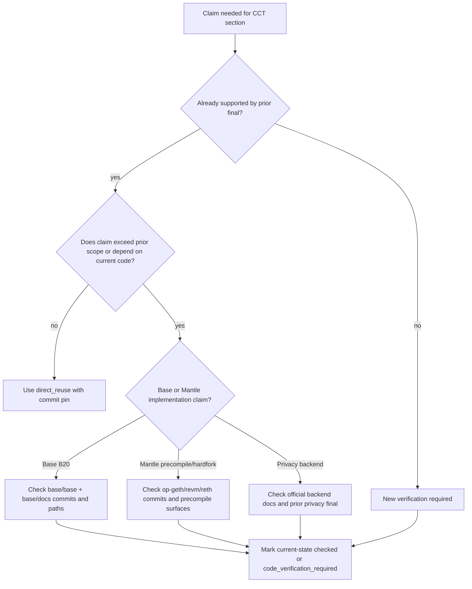
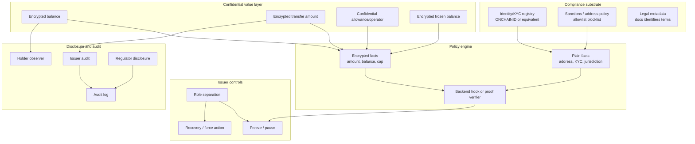
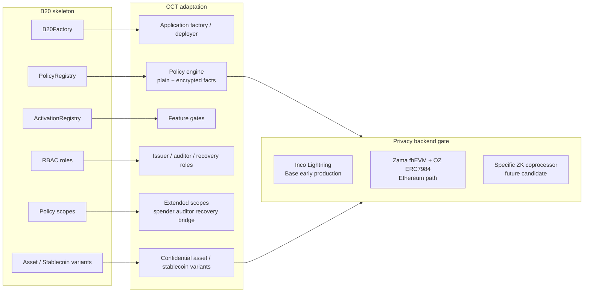
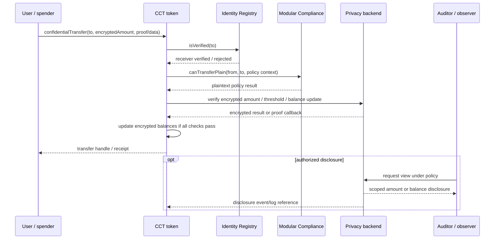

# 合规 Token 底座与 B20 私密扩展需求分析

## 1. Executive Summary

本 final section 的结论是：Mantle 的 Confidential Compliance Token（CCT）应把 Base B20 作为能力骨架和产品语言，把 ERC-3643 作为 phase 1 应用层合规基线，把 TIP-20 作为支付和对账能力参考；但不应把 `B20 + private feature` 理解为 phase 1 复制 Base 的原生 B20 precompile。短期路线应是应用层合规合约 + confidential accounting backend + 明确的选择性披露/审计流程；native precompile、原生密文策略引擎和硬分叉级优化应留在 phase 2。

Phase 1 的真正硬约束不是 B20 precompile，而是 confidential backend maturity。`encrypted balance/amount` 是 CCT 的产品 must-have；但它只有在某个具名 backend 能在目标链生产可用或有可信近期开通路径时，才是 phase 1 production deliverable。当前最具体的两个候选是：

- **Inco Lightning**：已由既有隐私研究记录为 2026-06-15 上线 Base 主网，生产成熟度为“Base 早期生产可用”。但它是 TEE-first，Atlas FHE 是 roadmap；且目前证据只覆盖 Base，不覆盖 Mantle。因此它可作为 Base/跨链 PoC 或近期开通候选，不能直接证明 Mantle phase 1 production-ready。
- **Zama fhEVM + OpenZeppelin Confidential Contracts / ERC-7984**：生态和 RWA 扩展最完整，Zama 路线在既有隐私研究中被记录为 Ethereum 主网 + Sepolia 可用，OZ 有 ERC7984Rwa/ObserverAccess/Hooked/IdentityCheck 等合规扩展。但 Mantle 接入需等待官方多链支持或自托管 Coprocessor + Gateway + KMS；同时 FHE ACL 撤销性与 OZ v0.5 audit 风险必须进入合规叙事。

因此，phase 1 表述应拆成两层：**需求层必须支持 encrypted balance/amount、最小 encrypted amount policy、auditor disclosure、freeze/recovery semantics；实现层必须先通过 backend maturity gate**。若 Inco/Zama/等价 ZK coprocessor 不能给出 Mantle production path，phase 1 只能交付 design + PoC/testnet 或 Base-only validation，不能宣称 Mantle production CCT 已可落地。

## 2. Item Findings

### item-1: 合规 Token 能力模型抽取与 CCT 映射

既有 `requirements-framework/final.md` 已把 CCT 定义为 compliance token + confidential accounting + selective disclosure；这意味着合规能力和隐私能力不能互相替代。ERC-3643 解决身份/KYC、receiver verification、Agent 控制和 recovery；B20 解决原生 policy slots、RBAC、activation 和资产/稳定币变体；TIP-20 解决支付 memo、currency 和 reconciliation。CCT 需要把这些能力映射到 encrypted value layer，而不是简单叠加一个加密余额字段。

#### Table 1: Compliance Token Capability -> Confidential Extension Requirement Matrix

| Compliance capability | Existing standard source | Confidential extension requirement | Phase target | Verification class |
|---|---|---|---|---|
| identity_kyc | ERC-3643 ONCHAINID / Identity Registry；B20/TIP wallet policy | KYC facts can remain offchain or plaintext-claim based while transfer amount and balance are encrypted. Policy engine must document which identity facts are visible. | phase_1_must_have | direct_reuse + new_synthesis |
| transfer_policy | B20 sender/receiver/executor/mint receiver scopes；ERC-3643 Modular Compliance；TIP-403 policy registry | Split plaintext address/identity checks from encrypted amount/limit checks. Amount-based thresholds require backend-supported comparison/proof or explicit disclosure fallback. | phase_1_must_have | direct_reuse + private feature analysis |
| issuer_controls | B20 RBAC；ERC-3643 Agent roles | Mint/burn/pause/freeze/recover/force-transfer must define ciphertext behavior, audit log, and who can request decryption or re-encryption. | phase_1_must_have | direct_reuse + new_synthesis |
| sanctions_blacklist | B20 BLOCKLIST/ALLOWLIST；TIP-403 blacklist；ERC-3643 modules | Address and identity sanctions checks should stay plaintext where regulation requires deterministic enforcement; encryption of amount does not remove blacklist duties. | phase_1_must_have | direct_reuse |
| recovery | ERC-3643 identity-level recovery；B20 burnBlocked-like controls | Recover encrypted balances and, if allowance/operator state is confidential, revoke or migrate spend rights without leaking unrelated holder state. | phase_1_optional initially; must define semantics | direct_reuse + new_synthesis |
| legal_metadata | ERC-1643 legacy reference；B20 metadata / Asset extra metadata；TIP-20 token metadata | Legal docs, identifiers, and disclosure terms likely remain public or permissioned offchain. They are not core ciphertext state, but need immutable references. | phase_1_optional | direct_reuse |
| payment_reconciliation | TIP-20 memo / payment lanes / stablecoin currency；B20 memo/currency | Encrypted transfers need payment reference strategy that does not reveal amount. Memo visibility and linkage risk must be explicit. | phase_1_optional | direct_reuse + new_synthesis |
| audit_privacy | requirements-framework CCT rubric；ERC-7984/OZ ObserverAccess；Inco delegated viewing | Separate public audit trail, issuer audit, holder-authorized observer, and regulator disclosure. Each disclosure vector needs authority, trigger, payload, scope, revocability, residual leakage, and audit log. | phase_1_must_have | requirements-framework reuse + private backend assessment |

**Key synthesis**: CCT phase 1 should treat KYC/sanctions as mostly plaintext compliance inputs and amount/balance as encrypted value inputs. Encrypting identity too early would widen scope into private identity or anonymous transfer design, which is not required for this issue and would complicate regulatory audit.

### item-2: B20 协议骨架与可复用能力语言

B20 contributes a strong capability vocabulary:

- `B20Factory`: deterministic creation and variant-specific initialization.
- `PolicyRegistry`: shared allowlist/blocklist policies referenced by numeric policy IDs.
- `ActivationRegistry`: feature activation gates around state-changing functions and token variants.
- RBAC: separated admin/mint/burn/burnBlocked/pause/unpause/metadata roles, plus Asset `OPERATOR_ROLE` in current docs/code.
- Policy scopes: sender, receiver, executor, and mint receiver.
- Variants: Asset for general/RWA-like assets; Stablecoin for fixed-decimal currency-denominated tokens.

Current local verification supports the skeleton but also changes the evidence posture from the older B20 report. The old final used `base/base` commit `8e8767281d7c8768f6a0aed9124779cd4ed030ae` and said no formal B20 docs were checked. Current local docs now include `base/docs/docs/base-chain/specs/upgrades/beryl/b20.mdx` at `base/docs` commit `9aace7f56ce94320f46e90fb485c4cc0147c34e9`, which explicitly describes B20 variants, B20Factory, PolicyRegistry, ActivationRegistry, four policy scopes, Asset and Stablecoin. Current local implementation at `base/base` commit `01e732cdbae0c624d652da9e608d7d3fe0f9c74b` still has `b20_factory`, `activation`, `policy`, `b20_asset`, and `b20_stablecoin` modules under `crates/common/precompiles/src/`.

Targeted search of the current B20 modules found no `confidential`, `encrypted`, `FHE`, `ERC7984`, `ONCHAINID`, or ERC-3643-specific hook in the B20 precompile directories. Therefore, B20 is reusable as compliance skeleton, not as an existing private-token implementation.

#### Table 2: B20 Skeleton -> CCT Product Analogy

| B20 component | Reused idea | CCT adaptation | Do not assume |
|---|---|---|---|
| B20Factory | Deterministic token creation and variant configuration | Application factory or deployer can create compliant confidential asset/stablecoin variants with consistent role and policy bootstrap. | Mantle phase 1 requires a precompile factory. |
| PolicyRegistry | Shared policy registry and policy IDs | Policy engine can bind address/KYC/sanctions/threshold rules to token instances; policy IDs become product-level references. | Policy can inspect encrypted facts without a privacy backend. |
| ActivationRegistry | Feature activation gate | Product feature flags or upgrade gates can stage confidential functionality and disable unfinished backend paths. | Mantle hardfork activation is available short term. |
| RBAC | Separate admin/mint/burn/pause/metadata/operator powers | CCT should split issuer, compliance officer, recovery agent, auditor, observer admin, and policy admin. | One omnipotent owner is acceptable for regulated production. |
| Policy scopes | Sender/receiver/executor/mint receiver slots | Extend to spender/operator, auditor/disclosure, freeze/recovery, and bridge/redeem scopes where needed. | B20 scopes already cover encrypted allowance or auditor disclosure. |
| Asset/Stablecoin variants | Product split by asset type | RWA/security-like asset and stablecoin/payment variants may need different disclosure, reconciliation, and metadata defaults. | Both variants need identical private feature set. |

**B20Security/redeem note**: prior B20 research treated B20Security as a local/evolutionary signal, not remote mainline fact. Current local quick search surfaced security-style test helpers and storage-test signals, but not a separate deployed `b20_security` precompile directory in the current precompile module listing. This remains `local_branch_signal` / `code_verification_required`, not a phase 1 requirement.

### item-3: ERC-3643 应用层合规骨架与短期路线价值

ERC-3643 is the strongest short-term compliance base because it is application-layer Solidity, EVM-portable, and already defines identity and issuer controls. Its architecture consists of six core T-REX contracts plus the ONCHAINID identity layer: Token, Identity Registry, Identity Registry Storage, Claim Topics Registry, Trusted Issuers Registry, Modular Compliance, and the separate ONCHAINID ERC-734/735 identity layer. It gives Mantle a deployable phase 1 compliance baseline without waiting for a hardfork or custom precompile.

Its limitation is equally important: ERC-3643 assumes ordinary ERC-20 value semantics. `canTransfer(from, to, amount)` and related modules expect a plaintext amount or at least an amount representation the module can reason about. It does not define encrypted balances, encrypted transfer amounts, confidential allowance, auditor decryption, or ciphertext recovery. Agent roles are valuable, but their actions must be re-specified for ciphertext state.

#### Table 3: ERC-3643 Skeleton -> Private Feature Gaps

| ERC-3643 component | What it solves | Gap for CCT | Candidate adaptation |
|---|---|---|---|
| ONCHAINID | Claim-based identity/KYC; per-user identity contract; Trusted Issuer claims | Does not hide token amount/balance; claim privacy is implementation-dependent and not a confidential value layer | Reuse identity registry while the confidential token handles value privacy |
| Identity Registry | Receiver verification and wallet-to-identity mapping | Sender/spender/auditor policies may need more scopes than default receiver validation | Add policy adapters for sender, operator, auditor, and recovery roles |
| Claim Topics / Trusted Issuers | KYC claim trust model and issuer governance | Policy over encrypted values needs backend-specific proof/check; claim checks alone cannot evaluate amount thresholds | Keep claims mostly plaintext/offchain; encrypt amounts and balances |
| Modular Compliance | Business transfer rules through `canTransfer` and `transferred` modules | Rules using amount/balance thresholds need encrypted comparison, proof, disclosure, or conservative plaintext fallback | Hook to FHE/ZK/coprocessor backend; define unsupported rule classes |
| Agent roles | Freeze, partial freeze, forced transfer, recovery, pause, mint, burn | Actions under ciphertext need key/disclosure/re-encryption semantics; forced transfer cannot simply bypass confidential state integrity | Define privileged encrypted operations, observer logs, and recovery ceremony |

**Phase 1 adaptation**: start with ERC-3643-like identity and compliance registry as the visible compliance substrate, then attach a confidential value layer for balance/amount. Do not recast ERC-3643 itself as a privacy standard.

### item-4: TIP-20 / 支付对账能力的边界复用

TIP-20/TIP-403 is useful as a payment-chain reference, not as the primary RWA CCT architecture. Its most relevant ideas are memo fields, ISO-style currency metadata, payment lanes, stablecoin/payment infrastructure, and a policy registry for sender/recipient/mint-recipient checks. These are most valuable for a stablecoin or payment variant of CCT, especially where reconciliation must survive amount encryption.

For phase 1, payment reconciliation should be optional. If the CCT target is RWA/security issuance, the minimum system needs identity, policy, issuer controls, confidential accounting, and audit disclosure before it needs payment lanes or DEX-style stablecoin infrastructure. If the target is a confidential stablecoin, then memo/currency/payment reference strategy becomes more important but still must be privacy-scoped: a public memo may reveal business context even if amount is encrypted.

**Boundary**: TIP-20 informs `payment_reconciliation` and stablecoin UX; it should not drive Mantle toward a payment-chain-specific native precompile in phase 1.

### item-5: Private Feature 新增需求定义

Private features change the compliance skeleton in four ways:

1. **Value state becomes encrypted**: balances, transfer amounts, and potentially allowances/frozen balances are no longer plain integers visible to ordinary contracts.
2. **Policy splits into plaintext and encrypted facts**: address/KYC/sanctions can remain ordinary registry checks; amount thresholds, holder caps, per-investor limits, frozen balances, and redeem limits need encrypted comparison, proof, or disclosure.
3. **Issuer controls need ciphertext semantics**: pause is simple; mint/burn/freeze/recovery/force-transfer must define who creates ciphertext, who can decrypt, how old access is revoked, and what is emitted.
4. **Audit is no longer “everything is public”**: public events, issuer dashboards, holder-authorized observers, regulators, bridge/redeem agents, and auditors need distinct disclosure vectors.

#### Required phase-1 confidential backend maturity assessment

The outline review caveat is correct: phase 1 cannot simply say “encrypted balance is must-have” without naming the backend that makes it feasible. This section uses the following production-readiness gate:

| Backend candidate | Maturity assessment | Chain fit | Phase-1 implication |
|---|---|---|---|
| Inco Lightning | Prior confidential-coprocessor research records Base Sepolia in 2025-04 and Base mainnet on 2026-06-15. It is early production on Base, TEE-first via Intel TDX; Atlas/FHE is roadmap, not live production evidence. | Strongest concrete Base path; Mantle support not evidenced and would require Inco team extension. | Good candidate for Base-aligned PoC or if Inco commits Mantle support. Not enough to assert Mantle phase 1 production readiness today. |
| Zama fhEVM + OZ ERC-7984/Confidential Contracts | Prior research records Ethereum mainnet + Sepolia availability and the most complete confidential token/RWA extension stack. Risks include KMS/Coprocessor/Gateway operations, commercial/licensing constraints, FHE ACL revocation, and OZ audit findings. | Mantle path requires official EVM expansion to Mantle or self-hosting full Coprocessor + Gateway + KMS stack. | Best cryptographic reference path, but Mantle production path must be validated before phase 1 launch commitment. |
| Fhenix CoFHE | Prior research marks it testnet/early-mainnet ambiguous, with official docs saying production mainnet support coming soon and weaker RWA/compliance ecosystem. | Theoretical EVM-coprocessor path; no strong Mantle production evidence in current inputs. | Backup candidate, not phase 1 production anchor. |
| PSE/private-transfers or generic ZK coprocessor | Not covered by the approved source bundle deeply enough for a production claim. Could support transfer validity and selective disclosure if a concrete implementation is selected. | Unknown until a specific project, proof model, and chain deployment are pinned. | Future candidate only; cannot be used as evidence for this section's phase 1 feasibility. |

**Gate statement**: `encrypted balance/amount = phase_1_must_have` is a product requirement and MVP acceptance criterion. It becomes a phase 1 production implementation only if Inco, Zama, or an equivalent named backend is production-ready for Mantle or has a committed near-term Mantle path with auditable security and operational assumptions. Without that, phase 1 deliverable should be limited to architecture, PoC/testnet, or Base-only validation.

#### Disclosure vectors

| Vector | Authority | Trigger | Payload | Revocability | Residual leakage |
|---|---|---|---|---|---|
| Holder observer | Holder or account admin | Holder grants auditor/custodian view | Balance and/or selected transfer amounts | Backend-specific; FHE ACL historical revocation may be weak | Address graph and event timing remain public |
| Issuer compliance | Issuer/compliance officer | KYC review, sanctions alert, recovery, forced action | Account balance, frozen amount, selected transfer amount | Must be logged and policy-bound; not assumed cryptographically revocable | Issuer learns sensitive value facts |
| Regulator/auditor | Regulator, court order, fund auditor | Legal request or audit period | Defined account/time/window payload | Must be explicit in legal docs and access policy | Disclosure may become permanent record |
| Bridge/redeem agent | Bridge or redemption operator | Wrap/unwrap/redeem/settlement | Amount and destination context | Usually non-revocable after settlement | Bridge/redeem flow can deanonymize payment purpose |
| Public chain | Anyone | Transfer/mint/burn/freeze events | Addresses, timestamps, event type, handles/pointers | Not revocable | Graph privacy is not solved |

### item-6: B20 + Private Feature Phase Boundary Table

#### Table 4: B20 + Private Feature Phase Boundary

| Capability | Phase 1 must-have | Phase 1 optional | Phase 2 / native only | Reason |
|---|---|---|---|---|
| encrypted balance/amount | Yes as product requirement; production delivery is contingent on a named backend such as Inco Lightning or Zama being production-ready for target chain or committed near term | - | Native optimization later | CCT minimum requires confidential accounting, but phase 1 cannot assert feasibility without backend maturity gate. |
| confidential allowance/operator | Yes for ERC-20-like UX, but exact model may be operator-based rather than amount allowance | - | Native allowance registry optional | DeFi/custody approval flow breaks if spend authority leaks too much or becomes unbounded without audit controls. |
| plaintext KYC/sanctions policy | Yes | - | - | Can reuse ERC-3643/B20/TIP-403 style address/identity policy without confidential backend. |
| policy over encrypted amount | Minimum threshold/limit support only if backend supports encrypted comparison/proof; otherwise PoC/testnet or disclosure fallback | Richer custom modules | Native encrypted policy engine | Amount rules are where privacy backend maturity matters most. |
| auditor disclosure | Yes | Richer regulator workflows and reporting dashboards | Protocol disclosure registry | Institutional use requires authorized visibility, but disclosure can be application/backend-level first. |
| freeze/recovery under ciphertext | Minimum semantics required: freeze authority, recovery ceremony, event logs, and access policy | Partial freeze and force-transfer if backend supports safely | Native encrypted recovery/precompile | Must define who can move, decrypt, re-encrypt, or invalidate encrypted balances. |
| legal metadata | - | Yes | - | Important for RWA but not confidential core. |
| payment reconciliation | - | Yes | Payment lane/native memo infra | Useful for stablecoin/payment variant; not CCT minimum. |
| native B20-like precompile | - | - | Yes | Mantle hardfork/client cost makes this phase 2. |
| native encrypted accounting/precompile | - | - | Yes | Requires protocol/client integration and likely cryptographic backend integration beyond phase 1. |
| bridge/redeem confidential flow | Minimum disclosure boundary if wrap/unwrap exists | Full privacy-preserving redemption workflow | Native bridge/redeem adapter | Redeem often requires plaintext settlement data; privacy boundary must be explicit. |

#### diag-4: Phase boundary matrix

```text
Phase 1 must-have (if backend gate passes)
  - ERC-3643-style identity/KYC baseline
  - Plaintext sanctions/address policy
  - Encrypted balance + encrypted transfer amount
  - Minimum encrypted amount policy or proof/disclosure fallback
  - Auditor/issuer disclosure vectors
  - Freeze/recovery semantics under ciphertext

Phase 1 optional
  - Legal metadata/document registry
  - Payment memo/reconciliation strategy
  - Partial freeze/force-transfer if backend supports it safely
  - Stablecoin-specific currency and settlement metadata

Phase 2 / native only
  - B20-like Mantle precompile factory
  - Native encrypted accounting/precompile
  - Protocol-level encrypted policy engine
  - Native disclosure registry
  - Native bridge/redeem adapter
```

### item-7: Base/Mantle Code Verification Boundary

This final section separates prior research reuse from local/current-state code verification.

| Claim class | Status | Source anchor | Final conclusion |
|---|---|---|---|
| B20 architecture skeleton | direct_reuse + local/current-state `current-state-checked` | `base-b20-analysis/final.md` @ `f42915e`; local `base/base` @ `01e732c`; local `base/docs` @ `9aace7f` | Reusable as capability skeleton. Current local code/docs still expose Factory, PolicyRegistry, ActivationRegistry, Asset, Stablecoin; this is a local/current-state check, not a production release assertion. |
| B20 formal docs availability | local/current-state `current-state-checked` | `base/docs/docs/base-chain/specs/upgrades/beryl/b20.mdx` @ `9aace7f` | Prior “no formal docs checked” caveat should be updated in final: local docs now include a B20 spec page. This is local/current-state evidence. |
| B20 confidential/private feature | local/current-state `current-state-checked` + `code_verification_required` | `rg confidential/encrypted/FHE/ERC7984/ONCHAINID` over current B20 precompile modules | No current local B20 private extension found in targeted scan; needs deeper review before any production claim. |
| B20Security/redeem | `local_branch_signal` + `code_verification_required` | prior B20 final; current quick search signals in tests/storage but no separate precompile dir in module listing | Keep as local/evolutionary signal, not phase 1 dependency or production fact. |
| Mantle native precompile route | direct_reuse + local/current-state `current-state-checked` | `mantle-compliance-token-strategy/final.md` @ `f42915e`; local `mantle/revm` @ `bcf1a6a`; `op-geth` @ `3c1c571`; `reth` @ `a881fee` | Current targeted local search did not find B20/compliance/confidential-token native precompile. `revm` shows OP/EVM cryptographic precompile plumbing and fork labels, not a CCT precompile path. This remains local/current-state evidence. |
| Mantle hardfork roadmap | Prior final mostly reused; current code shows newer fork labels | prior strategy final @ `f42915e`; local `revm` `OpSpecId` includes ARSIA/JOVIAN/OSAKA plumbing | Do not infer schedule from code labels. A final claim about hardfork timing still needs Mantle governance/release confirmation. |

#### diag-5: Code verification decision tree



### item-8: Design Risks, Open Questions, and Non-Goals

| Risk label | Risk | Draft disposition |
|---|---|---|
| overcommit_precompile | Treating `B20 + private feature` as immediate Mantle native precompile | Phase 2 only. Phase 1 uses B20 as capability language. |
| vendor_or_branch_overclaim | Treating Inco/Zama/Fhenix, B20Security, or local test signals as production fact | Backend and code claims are explicitly gated by source anchors and maturity checks. |
| privacy_not_compliance | Assuming encrypted balances solve KYC/sanctions | KYC/sanctions remain plaintext or claim-based compliance inputs. |
| compliance_not_privacy | Assuming ERC-3643 or B20 policy registries provide privacy | They do not; confidential accounting backend is required. |
| acl_revocation | FHE ACL or observer permissions may be permanent or historically non-revocable | Disclosure vectors must document revocability and audit logs; do not promise GDPR erasure. |
| defi_breakage | Confidential allowance/operator semantics may break ERC-20/DeFi expectations | Phase 1 must choose explicit allowance/operator model and wallet UX. |
| bridge_redeem_gap | Wrap/unwrap/redeem often requires plaintext amount or destination data | Treat as optional or define disclosure boundary before production. |
| payment_metadata_leakage | Memo/currency/reference data can reveal business purpose even if amount is hidden | Payment reconciliation is optional and must be privacy-scoped. |

**Non-goals for phase 1**:

- Private identity or anonymous transfer graph.
- Native Mantle B20 precompile.
- Native FHE precompile or protocol-level encrypted policy engine.
- Fully private DeFi/order-flow/mempool protection.
- Payment-chain-specific infrastructure unless the product target is confidential stablecoin/payments.

## 3. Diagrams

### diag-1: CCT capability stack



### diag-2: B20 skeleton mapped to CCT adaptation



### diag-3: ERC-3643 transfer path with private feature inserts



### diag-4: Phase boundary matrix

See Table 4 in item-6.

### diag-5: Code verification decision tree

See item-7.

## 4. Source Coverage

### Prior research finals

| Source requirement | Coverage | Source anchors |
|---|---|---|
| src-1 prior research final, min 7 | Covered | `confidential-compliance-token-research/research-sections/requirements-framework/final.md` @ `9eb29a150f380f21add9b431b66fea2ee5d12881`; `compliance-token-standards/report/final-report.md` @ `79d472632bd30a5354fbec396f807e0bb63bdea1`; `base-b20-analysis/final.md` @ `f42915ecd33c7f099d4ac0de89997390fc52d0b9`; `erc3643-trex-analysis/final.md` @ `a260e40f58b0d8d2e15ba7bd263ab67a3288b6bd`; `tempo-tip20-analysis/final.md` @ `67c509b757699152095a8872b810817f6104aaba`; `compliance-token-comparison/final.md` @ `f42915ecd33c7f099d4ac0de89997390fc52d0b9`; `mantle-compliance-token-strategy/final.md` @ `f42915ecd33c7f099d4ac0de89997390fc52d0b9`; privacy backend context from `evm-privacy-research/research-sections/confidential-coprocessor/final.md` @ `0041e3a1598751a7d121fecc600ba3d6ad42ad05` and `evm-privacy-research/research-sections/erc7984-confidential-token/final.md` @ `fdbda370e9e9137890c5bd2deb7752e03d76d0bc`. |
| src-2 Base local code, min 1 | Covered | `/Users/whisker/Work/src/networks/base/base` @ `01e732cdbae0c624d652da9e608d7d3fe0f9c74b`; `/Users/whisker/Work/src/networks/base/docs` @ `9aace7f56ce94320f46e90fb485c4cc0147c34e9`; files checked include `crates/common/precompiles/src/{b20_factory,activation,policy,b20_asset,b20_stablecoin}` and `docs/docs/base-chain/specs/upgrades/beryl/b20.mdx`. |
| src-3 Mantle local code, min 1 | Covered | `/Users/whisker/Work/src/networks/mantle/op-geth` @ `3c1c571e57874019991f28fe99c36cddac7b4bef`; `/Users/whisker/Work/src/networks/mantle/revm` @ `bcf1a6ab0e6cc15f15697df107dd1276bcfea703`; `/Users/whisker/Work/src/networks/mantle/reth` @ `a881fee21317f8156a150b99e4bf3db5804a39f4`; targeted checks over precompile and keyword surfaces. |
| src-4 official/spec docs, min 2 | Covered through prior finals and current local docs | ERC-3643 EIP `https://eips.ethereum.org/EIPS/eip-3643`; ERC-7984 EIP `https://eips.ethereum.org/EIPS/eip-7984`; OpenZeppelin Confidential Contracts `https://docs.openzeppelin.com/confidential-contracts`; Zama docs `https://docs.zama.org/protocol/protocol/overview`; local Base B20 docs page above. |
| src-5 issue record, min 1 | Covered | Multica issue `18fbd577-47e2-47f6-bfbf-a7519114df13`; outline approval comment `bb732b08-68ff-4d6b-9c01-0233a8919fe6`; deep-draft dispatch `ad9a35d6-87c5-41e5-8c89-c58cb56cfde2`. |

### Reuse class legend

| Reuse class | Meaning in this section |
|---|---|
| direct_reuse | Claim comes from an accepted prior final and does not exceed its scope. |
| bounded_reuse | Claim comes from prior final but is narrowed or caveated for CCT use. |
| new_synthesis | Claim is derived by combining accepted sources; should be reviewed as new analysis. |
| code_verification_required | This section does not have enough code evidence to promote claim as production fact. |
| local_branch_signal | Evidence appears in local/current code or tests but is not yet production/mainline protocol commitment. |
| out_of_scope | Relevant but not required for WHI-269 phase 1 scope. |

## 5. Gap Analysis

| Gap | Severity for final | Current handling | Next verification needed |
|---|---|---|---|
| Inco Mantle production support not evidenced | High | Treat Inco Lightning as Base early-production candidate, not Mantle-ready. | Obtain official Inco Mantle support statement, contract deployment path, SLA, audit/security docs. |
| Zama Mantle path requires official expansion or self-hosting | High | Treat Zama/OZ as strongest cryptographic/RWA reference, but not automatically Mantle phase 1. | Verify Zama multi-chain roadmap, Mantle support, self-host cost and operational model. |
| FHE ACL revocation / historical disclosure | High | Flagged as structural risk from prior ERC-7984/OZ research. | Test current backend ACL revocation semantics and pin audited release. |
| Confidential allowance model unresolved | Medium | Phase 1 must choose explicit model: ERC-7984 operator, ERC-7945-like allowance, or app-specific spend authority. | Prototype wallet/custody/DeFi approval UX and threat model. |
| Freeze/recovery under ciphertext not fully specified | Medium | Minimum semantics required; partial freeze/force-transfer optional unless backend supports safely. | Specify recovery ceremony, re-encryption, access revocation, and event logs. |
| B20 current code changed since prior final | Medium | Updated Base code/docs commits recorded; B20 private extension not found in targeted scan. | Deeper diff from prior B20 commit to current Base code before final promotion if relying on current implementation details. |
| Mantle fork labels in current revm code differ from prior report timing | Medium | Do not infer hardfork schedule from code labels. | Verify Mantle governance/release docs for active/planned forks. |
| PSE/private-transfers or generic ZK candidate not investigated | Low/Medium | Marked future candidate only. | Add a dedicated backend comparison issue if Orchestrator wants non-FHE backend option. |
| Payment reconciliation privacy leakage | Medium for stablecoin; low for RWA | Phase 1 optional; memo/reference must be scoped. | Define stablecoin-specific privacy/reconciliation product requirements. |

## 6. Revision Log

| Round | Type | Summary |
|---|---|---|
| 1 | initial_draft | Produced full deep draft from approved outline. Covered all eight outline items, required fields, five diagrams, four required tables, Base/Mantle local code boundaries, and the outline-review caveat requiring a phase-1 confidential backend maturity assessment. |
| 1 | final_promotion | Promoted approved draft to final after Review Verdict approve. Applied two minor polish fixes: ERC-3643 architecture count wording and explicit local/current-state labels for Base/Mantle code checks. |
