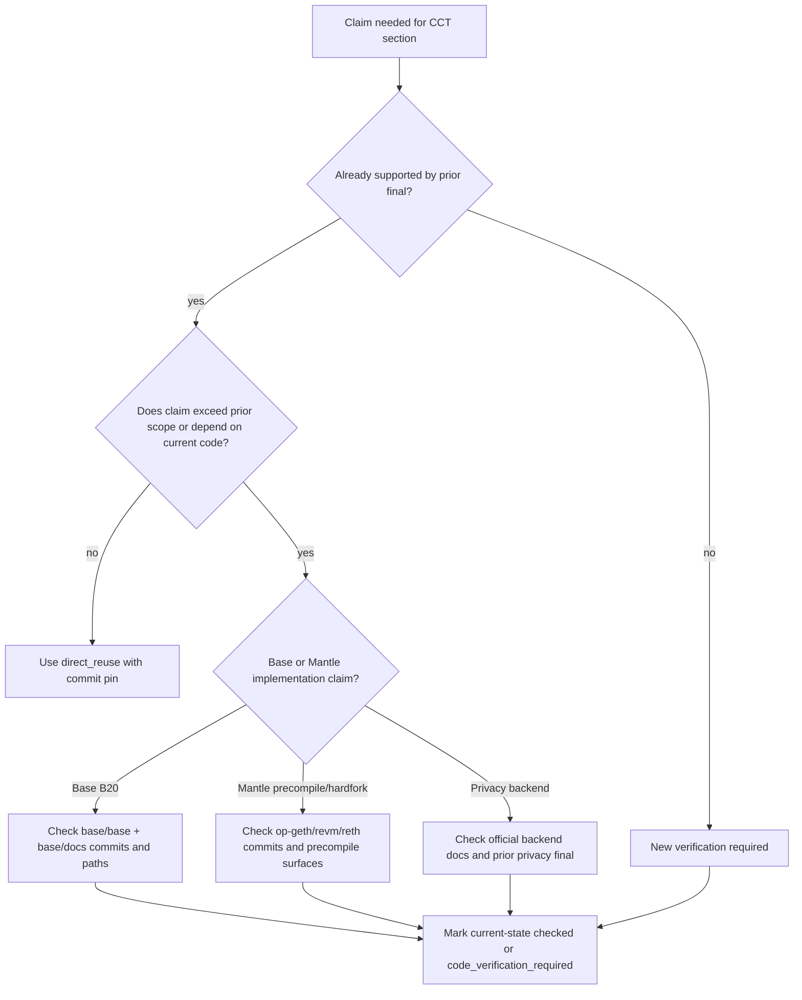
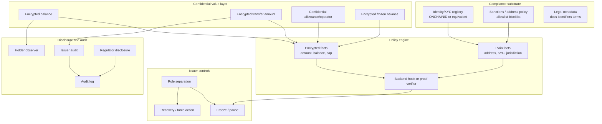
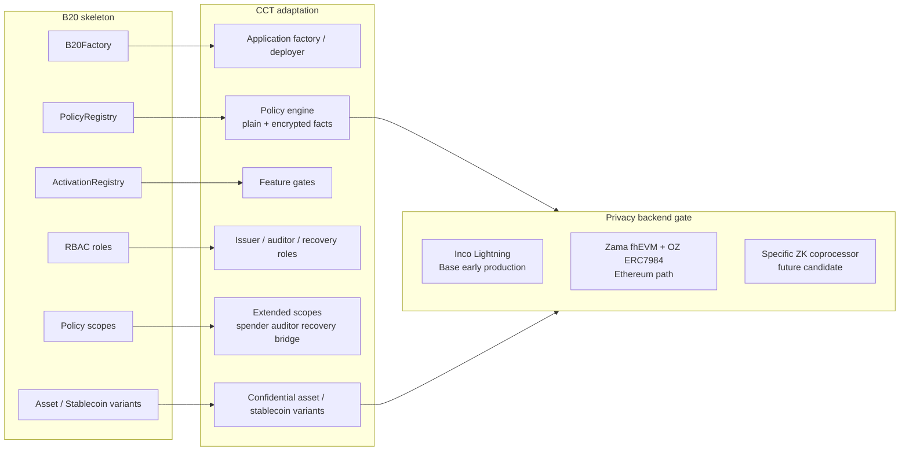
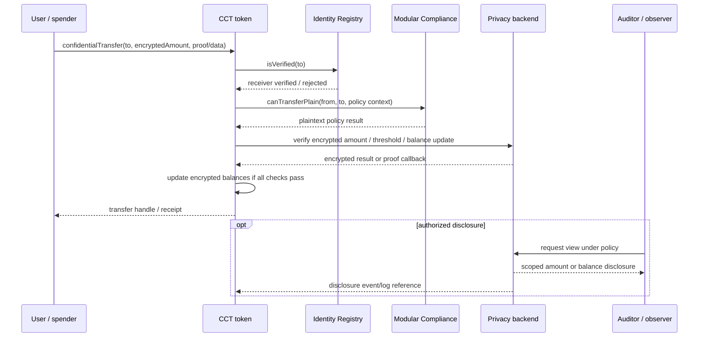

# 合规 Token 底座与 B20 私密扩展需求分析

## 1. 执行摘要（Executive Summary）

本最终章节的结论是：Mantle 的机密合规 Token（Confidential Compliance Token，CCT）应把 Base B20 作为能力骨架和产品语言，把 ERC-3643 作为第一阶段应用层合规基线，把 TIP-20 作为支付和对账能力参考；但不应把 `B20 + private feature` 理解为第一阶段复制 Base 的原生 B20 precompile。短期路线应是应用层合规合约 + 机密记账后端（confidential accounting backend）+ 明确的选择性披露/审计流程；native precompile、原生密文策略引擎和硬分叉级优化应留在第二阶段。

第一阶段的真正硬约束不是 B20 precompile，而是机密后端成熟度（confidential backend maturity）。`encrypted balance/amount` 是 CCT 的产品必备项（must-have）；但它只有在某个具名后端能在目标链生产可用或有可信近期开通路径时，才是第一阶段的生产交付物。当前最具体的两个候选是：

- **Inco Lightning**：已由既有隐私研究记录为 2026-06-15 上线 Base 主网，生产成熟度为“Base 早期生产可用”。但它是 TEE 优先（TEE-first），Atlas FHE 仍在路线图上；且目前证据只覆盖 Base，不覆盖 Mantle。因此它可作为 Base/跨链 PoC 或近期开通候选，不能直接证明 Mantle 第一阶段生产就绪（production-ready）。
- **Zama fhEVM + OpenZeppelin Confidential Contracts / ERC-7984**：生态和 RWA 扩展最完整，Zama 路线在既有隐私研究中被记录为 Ethereum 主网 + Sepolia 可用，OZ 有 ERC7984Rwa/ObserverAccess/Hooked/IdentityCheck 等合规扩展。但 Mantle 接入需等待官方多链支持或自托管 Coprocessor + Gateway + KMS；同时 FHE ACL 撤销性与 OZ v0.5 审计风险必须进入合规叙事。

因此，第一阶段表述应拆成两层：**需求层必须支持加密余额/加密金额、最小加密金额策略、审计方披露、freeze/recovery 语义；实现层必须先通过后端成熟度门控（backend maturity gate）**。若 Inco/Zama/等价 ZK coprocessor 不能给出 Mantle 生产路径，第一阶段只能交付设计 + PoC/testnet 或仅限 Base 的验证（Base-only validation），不能宣称 Mantle 生产级 CCT 已可落地。

## 2. 逐项发现（Item Findings）

### item-1：合规 Token 能力模型抽取与 CCT 映射

既有 `requirements-framework/final.md` 已把 CCT 定义为合规 token + 机密记账 + 选择性披露；这意味着合规能力和隐私能力不能互相替代。ERC-3643 解决身份/KYC、接收方校验（receiver verification）、Agent 控制和 recovery；B20 解决原生策略槽位（policy slots）、RBAC、激活（activation）和资产/稳定币变体；TIP-20 解决支付 memo、currency 和对账（reconciliation）。CCT 需要把这些能力映射到加密价值层（encrypted value layer），而不是简单叠加一个加密余额字段。

#### 表 1：合规 Token 能力 -> 机密扩展需求矩阵（Compliance Token Capability -> Confidential Extension Requirement Matrix）

| 合规能力 | 既有标准来源 | 机密扩展需求 | 阶段目标 | 验证类别 |
|---|---|---|---|---|
| identity_kyc | ERC-3643 ONCHAINID / Identity Registry；B20/TIP 钱包策略 | KYC 事实可保留在链下或基于明文 claim，同时转账金额和余额加密。策略引擎必须记录哪些身份事实是可见的。 | phase_1_must_have | direct_reuse + new_synthesis |
| transfer_policy | B20 sender/receiver/executor/mint receiver scopes；ERC-3643 Modular Compliance；TIP-403 policy registry | 将明文地址/身份检查与加密金额/限额检查分离。基于金额的阈值需要后端支持的比较/证明，或显式披露回退方案。 | phase_1_must_have | direct_reuse + private feature analysis |
| issuer_controls | B20 RBAC；ERC-3643 Agent roles | Mint/burn/pause/freeze/recover/force-transfer 必须定义密文行为、审计日志，以及谁可以请求解密或重加密。 | phase_1_must_have | direct_reuse + new_synthesis |
| sanctions_blacklist | B20 BLOCKLIST/ALLOWLIST；TIP-403 blacklist；ERC-3643 modules | 在监管要求确定性执行之处，地址和身份制裁检查应保持明文；金额加密并不免除黑名单义务。 | phase_1_must_have | direct_reuse |
| recovery | ERC-3643 身份层级 recovery；B20 类 burnBlocked 控制 | 恢复加密余额，并在 allowance/operator 状态为机密的情况下，撤销或迁移花费权限而不泄露无关持有者状态。 | 初始为 phase_1_optional；但必须定义语义 | direct_reuse + new_synthesis |
| legal_metadata | ERC-1643 历史引用；B20 metadata / Asset extra metadata；TIP-20 token metadata | 法律文档、标识符和披露条款很可能保持链下公开或受许可访问。它们不是核心密文状态，但需要不可变引用。 | phase_1_optional | direct_reuse |
| payment_reconciliation | TIP-20 memo / payment lanes / stablecoin currency；B20 memo/currency | 加密转账需要一种不暴露金额的支付引用策略。Memo 可见性和关联风险必须显式说明。 | phase_1_optional | direct_reuse + new_synthesis |
| audit_privacy | requirements-framework CCT 评估准则；ERC-7984/OZ ObserverAccess；Inco 委托查看（delegated viewing） | 区分公开审计轨迹、发行方审计、持有者授权的观察者，以及监管者披露。每个披露向量都需要明确权限、触发条件、payload、范围、可撤销性、残余泄露和审计日志。 | phase_1_must_have | requirements-framework reuse + private backend assessment |

**关键综合（Key synthesis）**：CCT 第一阶段应把 KYC/sanctions 主要视为明文合规输入，把金额/余额视为加密价值输入。过早加密身份会把范围扩大到私密身份或匿名转账设计，这对本 issue 并非必需，且会使监管审计复杂化。

### item-2：B20 协议骨架与可复用能力语言

B20 贡献了一套强大的能力词汇：

- `B20Factory`：确定性创建以及变体特定的初始化。
- `PolicyRegistry`：由数字 policy ID 引用的共享 allowlist/blocklist 策略。
- `ActivationRegistry`：围绕状态变更函数和 token 变体的特性激活门控。
- RBAC：分离的 admin/mint/burn/burnBlocked/pause/unpause/metadata 角色，外加当前文档/代码中的 Asset `OPERATOR_ROLE`。
- Policy scopes：sender、receiver、executor 和 mint receiver。
- Variants：Asset 用于一般/类 RWA 资产；Stablecoin 用于固定精度的计价货币 token。

当前本地验证支持该骨架，但同时也改变了相对于旧版 B20 报告的证据态势。旧版 final 使用 `base/base` commit `8e8767281d7c8768f6a0aed9124779cd4ed030ae`，并声称未检查任何正式的 B20 文档。当前本地文档现在包含 `base/docs` commit `9aace7f56ce94320f46e90fb485c4cc0147c34e9` 下的 `base/docs/docs/base-chain/specs/upgrades/beryl/b20.mdx`，其中明确描述了 B20 变体、B20Factory、PolicyRegistry、ActivationRegistry、四个 policy scopes、Asset 和 Stablecoin。当前位于 `base/base` commit `01e732cdbae0c624d652da9e608d7d3fe0f9c74b` 的本地实现仍在 `crates/common/precompiles/src/` 下保留了 `b20_factory`、`activation`、`policy`、`b20_asset` 和 `b20_stablecoin` 模块。

对当前 B20 模块的针对性搜索未在 B20 precompile 目录中发现 `confidential`、`encrypted`、`FHE`、`ERC7984`、`ONCHAINID` 或 ERC-3643 特定的 hook。因此，B20 可作为合规骨架复用，而不是作为一个已有的私密 token 实现。

#### 表 2：B20 骨架 -> CCT 产品类比（B20 Skeleton -> CCT Product Analogy）

| B20 组件 | 复用思路 | CCT 适配 | 不要假设 |
|---|---|---|---|
| B20Factory | 确定性 token 创建和变体配置 | 应用层 factory 或 deployer 可以创建合规的机密 asset/stablecoin 变体，并具备一致的角色和策略初始化。 | Mantle 第一阶段需要一个 precompile factory。 |
| PolicyRegistry | 共享 policy registry 和 policy ID | 策略引擎可以把 address/KYC/sanctions/threshold 规则绑定到 token 实例；policy ID 成为产品级引用。 | 策略可以在没有隐私后端的情况下检查加密事实。 |
| ActivationRegistry | 特性激活门控 | 产品特性开关或升级门控可以分阶段上线机密功能，并禁用尚未完成的后端路径。 | Mantle hardfork 激活在短期内可用。 |
| RBAC | 分离的 admin/mint/burn/pause/metadata/operator 权限 | CCT 应拆分出发行方、合规官（compliance officer）、recovery agent、审计方（auditor）、observer admin 和 policy admin。 | 一个全能 owner 对受监管的生产环境是可接受的。 |
| Policy scopes | Sender/receiver/executor/mint receiver 槽位 | 在需要时扩展到 spender/operator、auditor/disclosure、freeze/recovery 以及 bridge/redeem scopes。 | B20 scopes 已经覆盖加密 allowance 或审计方披露。 |
| Asset/Stablecoin variants | 按资产类型拆分产品 | 类 RWA/证券资产和 stablecoin/payment 变体可能需要不同的披露、对账和 metadata 默认值。 | 两个变体需要相同的私密特性集（private feature set）。 |

**B20Security/redeem 说明**：先前的 B20 研究把 B20Security 视为本地/演进性信号，而非远程主线事实。当前本地快速搜索浮现出安全风格的测试辅助代码和存储测试信号，但在当前 precompile 模块清单中未发现单独部署的 `b20_security` precompile 目录。这仍属于 `local_branch_signal` / `code_verification_required`，并非第一阶段需求。

### item-3：ERC-3643 应用层合规骨架与短期路线价值

ERC-3643 是最强的短期合规底座，因为它是应用层 Solidity、可在 EVM 间移植，并且已经定义了身份和发行方控制。其架构由六个核心 T-REX 合约加上 ONCHAINID 身份层构成：Token、Identity Registry、Identity Registry Storage、Claim Topics Registry、Trusted Issuers Registry、Modular Compliance，以及独立的 ONCHAINID ERC-734/735 身份层。它为 Mantle 提供了一个可部署的第一阶段合规基线，无需等待 hardfork 或自定义 precompile。

其局限同样重要：ERC-3643 假定普通的 ERC-20 价值语义。`canTransfer(from, to, amount)` 及相关模块期望一个明文金额，或至少是模块可以推理的金额表示。它没有定义加密余额、加密转账金额、机密 allowance、审计方解密（auditor decryption）或密文 recovery。Agent 角色很有价值，但它们的动作必须针对密文状态重新规约。

#### 表 3：ERC-3643 骨架 -> 私密特性缺口（ERC-3643 Skeleton -> Private Feature Gaps）

| ERC-3643 组件 | 解决了什么 | 对 CCT 的缺口 | 候选适配方案 |
|---|---|---|---|
| ONCHAINID | 基于 claim 的身份/KYC；每用户身份合约；Trusted Issuer claims | 不隐藏 token 金额/余额；claim 隐私依赖于实现，且不是机密价值层 | 复用 identity registry，由机密 token 处理价值隐私 |
| Identity Registry | 接收方校验（receiver verification）和钱包到身份的映射 | Sender/spender/auditor 策略可能需要比默认接收方校验更多的 scopes | 为 sender、operator、auditor 和 recovery 角色添加 policy adapters |
| Claim Topics / Trusted Issuers | KYC claim 信任模型和发行方治理 | 对加密值的策略需要后端特定的 proof/check；仅靠 claim 检查无法评估金额阈值 | 让 claims 大体保持明文/链下；加密金额和余额 |
| Modular Compliance | 通过 `canTransfer` 和 `transferred` 模块实现的业务转账规则 | 使用金额/余额阈值的规则需要加密比较、证明、披露或保守的明文回退 | 挂接到 FHE/ZK/coprocessor 后端；定义不支持的规则类别 |
| Agent roles | Freeze、partial freeze、forced transfer、recovery、pause、mint、burn | 密文下的动作需要密钥/披露/重加密语义；forced transfer 不能简单绕过机密状态完整性 | 定义特权加密操作、observer 日志和 recovery ceremony |

**第一阶段适配（Phase 1 adaptation）**：以类 ERC-3643 的身份和合规 registry 作为可见的合规基底起步，然后为余额/金额附加一个机密价值层。不要把 ERC-3643 本身重塑为一个隐私标准。

### item-4：TIP-20 / 支付对账能力的边界复用

TIP-20/TIP-403 作为支付链参考是有用的，但不是 RWA CCT 的主架构。其最相关的思路是 memo 字段、ISO 风格的 currency metadata、payment lanes、stablecoin/payment 基础设施，以及一个用于 sender/recipient/mint-recipient 检查的 policy registry。这些对 CCT 的 stablecoin 或 payment 变体最有价值，尤其是在对账必须在金额加密后仍然成立的场景。

对于第一阶段，支付对账应为可选项。如果 CCT 目标是 RWA/证券发行，那么最小系统在需要 payment lanes 或 DEX 风格的 stablecoin 基础设施之前，先需要身份、策略、发行方控制、机密记账和审计披露。如果目标是机密 stablecoin，那么 memo/currency/payment 引用策略变得更重要，但仍必须做隐私范围限定：即使金额已加密，公开的 memo 也可能暴露业务上下文。

**边界（Boundary）**：TIP-20 为 `payment_reconciliation` 和 stablecoin 用户体验提供参考；它不应在第一阶段将 Mantle 推向支付链特定的 native precompile。

### item-5：私密特性（Private Feature）新增需求定义

私密特性以四种方式改变合规骨架：

1. **价值状态变为加密**：余额、转账金额，以及可能的 allowances/frozen balances 不再是普通合约可见的明文整数。
2. **策略分裂为明文事实和加密事实**：address/KYC/sanctions 可保持普通 registry 检查；金额阈值、holder caps、per-investor limits、frozen balances 和 redeem limits 需要加密比较、证明或披露。
3. **发行方控制需要密文语义**：pause 很简单；mint/burn/freeze/recovery/force-transfer 必须定义谁创建密文、谁可以解密、如何撤销旧的访问权限，以及发出什么。
4. **审计不再是“一切都公开”**：公开事件、发行方仪表盘、持有者授权的观察者、监管者、bridge/redeem agents 和审计方需要各自不同的披露向量。

#### 第一阶段必需的机密后端成熟度评估（Required phase-1 confidential backend maturity assessment）

outline review 的重要说明是正确的：第一阶段不能在不指名使其可行的后端的情况下，简单地说“加密余额是 must-have”。本节使用以下生产就绪门控：

| 后端候选 | 成熟度评估 | 链适配性 | 第一阶段含义 |
|---|---|---|---|
| Inco Lightning | 先前的 confidential-coprocessor 研究记录了 2025-04 的 Base Sepolia 和 2026-06-15 的 Base 主网。它在 Base 上属于早期生产，通过 Intel TDX 实现 TEE 优先（TEE-first）；Atlas/FHE 是路线图，而非已上线的生产证据。 | 最强的具体 Base 路径；Mantle 支持未有证据，且需要 Inco 团队扩展。 | 适合作为 Base 对齐的 PoC 候选，或在 Inco 承诺 Mantle 支持时使用。不足以在今天断言 Mantle 第一阶段生产就绪。 |
| Zama fhEVM + OZ ERC-7984/Confidential Contracts | 先前研究记录了 Ethereum 主网 + Sepolia 可用性，以及最完整的机密 token/RWA 扩展栈。风险包括 KMS/Coprocessor/Gateway 运维、商业/许可约束、FHE ACL 撤销，以及 OZ 审计发现（audit findings）。 | Mantle 路径需要官方将 EVM 扩展到 Mantle，或自托管完整的 Coprocessor + Gateway + KMS 栈。 | 最佳的密码学参考路径，但在第一阶段上线承诺之前，必须验证 Mantle 生产路径。 |
| Fhenix CoFHE | 先前研究将其标记为 testnet/早期主网含糊状态，官方文档称生产主网支持即将到来，且 RWA/合规生态较弱。 | 理论上的 EVM-coprocessor 路径；当前输入中没有强有力的 Mantle 生产证据。 | 备选候选，而非第一阶段生产锚点。 |
| PSE/private-transfers 或通用 ZK coprocessor | 已批准的来源包未足够深入地覆盖，无法支撑生产主张。若选定具体实现，可支持转账有效性（transfer validity）和选择性披露。 | 在具体项目、proof 模型和链上部署确定之前未知。 | 仅为未来候选；不能用作本节第一阶段可行性的证据。 |

**门控声明（Gate statement）**：`encrypted balance/amount = phase_1_must_have` 是一项产品需求和 MVP 验收标准。仅当 Inco、Zama 或等价的具名后端对 Mantle 生产就绪，或具备已承诺的、带可审计安全与运维假设的近期 Mantle 路径时，它才成为第一阶段生产实现。否则，第一阶段交付物应限于架构、PoC/testnet 或仅限 Base 的验证（Base-only validation）。

#### 披露向量（Disclosure vectors）

| 向量 | 权限主体 | 触发条件 | 载荷（Payload） | 可撤销性 | 残余泄露 |
|---|---|---|---|---|---|
| 持有者观察者（Holder observer） | 持有者或 account admin | 持有者授予 auditor/custodian 查看权 | 余额和/或选定的转账金额 | 取决于后端（backend-specific）；FHE ACL 历史撤销可能较弱 | 地址图谱和事件时序仍然公开 |
| 发行方合规（Issuer compliance） | 发行方/合规官 | KYC 审查、sanctions alert、recovery、强制操作 | 账户余额、冻结金额（frozen amount）、选定的转账金额 | 必须记录日志并受策略约束；不假定密码学上可撤销 | 发行方获知敏感的价值事实 |
| 监管者/审计方（Regulator/auditor） | 监管者、法院命令（court order）、基金审计方 | 法律请求或审计周期 | 定义好的账户/时间/时间窗载荷 | 必须在法律文档和访问策略中显式说明 | 披露可能成为永久记录 |
| Bridge/redeem agent | Bridge 或赎回操作方（redemption operator） | Wrap/unwrap/redeem/结算 | 金额和目的地上下文 | 结算后通常不可撤销 | Bridge/redeem 流程可能去匿名化支付目的 |
| 公链（Public chain） | 任何人 | Transfer/mint/burn/freeze 事件 | 地址、时间戳、事件类型、handles/pointers | 不可撤销 | 图谱隐私未解决 |

### item-6：B20 + 私密特性阶段边界表（B20 + Private Feature Phase Boundary Table）

#### 表 4：B20 + 私密特性阶段边界（B20 + Private Feature Phase Boundary）

| 能力 | 第一阶段必备 | 第一阶段可选 | 仅第二阶段/native | 理由 |
|---|---|---|---|---|
| 加密余额/金额（encrypted balance/amount） | 是，作为产品需求；生产交付取决于某个具名后端（如 Inco Lightning 或 Zama）对目标链生产就绪或近期承诺 | - | 后续做 native 优化 | CCT 最低限度需要机密记账，但第一阶段在通过后端成熟度门控之前不能断言可行性。 |
| 机密 allowance/operator | 是，用于类 ERC-20 的用户体验，但确切模型可能是基于 operator 而非金额 allowance | - | Native allowance registry 可选 | 若花费权限泄露过多，或在没有审计控制的情况下变得无界，DeFi/custody 审批流程将被破坏。 |
| 明文 KYC/sanctions 策略 | 是 | - | - | 可复用 ERC-3643/B20/TIP-403 风格的 address/identity 策略，无需机密后端。 |
| 针对加密金额的策略 | 仅当后端支持加密比较/证明时才支持最小阈值/限额；否则用 PoC/testnet 或披露回退 | 更丰富的自定义模块 | Native 加密策略引擎 | 金额规则正是隐私后端成熟度最关键之处。 |
| 审计方披露（auditor disclosure） | 是 | 更丰富的监管工作流和报告仪表盘 | 协议级披露 registry | 机构使用需要授权可见性，但披露可以先做在应用/后端层。 |
| 密文下的 freeze/recovery | 需要最小语义：冻结权限（freeze authority）、recovery ceremony、event logs 和访问策略 | 若后端能安全支持，则 partial freeze 和 force-transfer | Native 加密 recovery/precompile | 必须定义谁可以移动、解密、重加密或作废加密余额。 |
| 法律元数据（legal metadata） | - | 是 | - | 对 RWA 重要，但不是机密核心。 |
| 支付对账（payment reconciliation） | - | 是 | Payment lane/native memo 基础设施 | 对 stablecoin/payment 变体有用；不是 CCT 最低限度。 |
| 类 B20 的 native precompile | - | - | 是 | Mantle hardfork/客户端成本使其成为第二阶段。 |
| Native 加密记账/precompile | - | - | 是 | 需要协议/客户端集成，且很可能需要超出第一阶段的密码学后端集成。 |
| Bridge/redeem 机密流程 | 若存在 wrap/unwrap 则需最小披露边界 | 完整的保护隐私的赎回（redemption）工作流 | Native bridge/redeem adapter | Redeem 常需要明文结算数据；隐私边界必须显式。 |

#### diag-4：阶段边界矩阵（Phase boundary matrix）

```text
Phase 1 must-have (if backend gate passes)
  - ERC-3643-style identity/KYC baseline
  - Plaintext sanctions/address policy
  - Encrypted balance + encrypted transfer amount
  - Minimum encrypted amount policy or proof/disclosure fallback
  - Auditor/issuer disclosure vectors
  - Freeze/recovery semantics under ciphertext

Phase 1 optional
  - Legal metadata/document registry
  - Payment memo/reconciliation strategy
  - Partial freeze/force-transfer if backend supports it safely
  - Stablecoin-specific currency and settlement metadata

Phase 2 / native only
  - B20-like Mantle precompile factory
  - Native encrypted accounting/precompile
  - Protocol-level encrypted policy engine
  - Native disclosure registry
  - Native bridge/redeem adapter
```

### item-7：Base/Mantle 代码验证边界（Base/Mantle Code Verification Boundary）

本最终章节将先前研究的复用与本地/当前状态的代码验证分开。

| 主张类别 | 状态 | 来源锚点 | 最终结论 |
|---|---|---|---|
| B20 架构骨架 | direct_reuse + 本地/当前状态 `current-state-checked` | `base-b20-analysis/final.md` @ `f42915e`；本地 `base/base` @ `01e732c`；本地 `base/docs` @ `9aace7f` | 可作为能力骨架复用。当前本地代码/文档仍暴露 Factory、PolicyRegistry、ActivationRegistry、Asset、Stablecoin；这是一次本地/当前状态检查，而非生产发布断言。 |
| B20 正式文档可用性 | 本地/当前状态 `current-state-checked` | `base/docs/docs/base-chain/specs/upgrades/beryl/b20.mdx` @ `9aace7f` | 先前“未检查正式文档”的重要说明应在 final 中更新：本地文档现在包含一个 B20 spec 页面。这是本地/当前状态证据。 |
| B20 机密/私密特性 | 本地/当前状态 `current-state-checked` + `code_verification_required` | 对当前 B20 precompile 模块执行 `rg confidential/encrypted/FHE/ERC7984/ONCHAINID` | 针对性扫描未在当前本地 B20 中发现私密扩展；在做出任何生产主张前需要更深入的审查。 |
| B20Security/redeem | `local_branch_signal` + `code_verification_required` | 先前的 B20 final；当前快速搜索在测试/存储中有信号，但模块清单中无单独 precompile 目录 | 保留为本地/演进性信号，而非第一阶段依赖或生产事实。 |
| Mantle native precompile 路线 | direct_reuse + 本地/当前状态 `current-state-checked` | `mantle-compliance-token-strategy/final.md` @ `f42915e`；本地 `mantle/revm` @ `bcf1a6a`；`op-geth` @ `3c1c571`；`reth` @ `a881fee` | 当前针对性的本地搜索未发现 B20/compliance/confidential-token native precompile。`revm` 显示了 OP/EVM 密码学 precompile 管线和 fork 标签，而非 CCT precompile 路径。这仍属于本地/当前状态证据。 |
| Mantle hardfork 路线图 | 先前 final 大体复用；当前代码显示更新的 fork 标签 | 先前 strategy final @ `f42915e`；本地 `revm` `OpSpecId` 包含 ARSIA/JOVIAN/OSAKA 管线 | 不要从代码标签推断时间表。关于 hardfork 时间的 final 主张仍需 Mantle 治理/发布确认。 |

#### diag-5：代码验证决策树（Code verification decision tree）



### item-8：设计风险、开放问题与非目标（Design Risks, Open Questions, and Non-Goals）

| 风险标签 | 风险 | 草稿处置 |
|---|---|---|
| overcommit_precompile | 把 `B20 + private feature` 当作即时的 Mantle native precompile | 仅限第二阶段。第一阶段把 B20 用作能力语言。 |
| vendor_or_branch_overclaim | 把 Inco/Zama/Fhenix、B20Security 或本地测试信号当作生产事实 | 后端和代码主张被 source anchors 和成熟度检查显式门控。 |
| privacy_not_compliance | 假设加密余额能解决 KYC/sanctions | KYC/sanctions 仍是明文或基于 claim 的合规输入。 |
| compliance_not_privacy | 假设 ERC-3643 或 B20 policy registries 提供隐私 | 它们不提供；需要机密记账后端（confidential accounting backend）。 |
| acl_revocation | FHE ACL 或 observer 权限可能是永久的或历史上不可撤销的 | 披露向量必须记录可撤销性和审计日志；不要承诺 GDPR 删除权。 |
| defi_breakage | 机密 allowance/operator 语义可能破坏 ERC-20/DeFi 预期 | 第一阶段必须选择明确的 allowance/operator 模型和钱包用户体验。 |
| bridge_redeem_gap | Wrap/unwrap/redeem 常需要明文金额或目的地数据 | 视为可选，或在生产前定义披露边界。 |
| payment_metadata_leakage | Memo/currency/reference 数据即使金额被隐藏也可能暴露业务目的 | 支付对账为可选，且必须做隐私范围限定。 |

**第一阶段的非目标（Non-goals for phase 1）**：

- 私密身份或匿名转账图谱。
- Native Mantle B20 precompile。
- Native FHE precompile 或协议级密文策略引擎。
- 完全私密的 DeFi/order-flow/mempool 保护。
- 支付链特定的基础设施，除非产品目标是机密 stablecoin/payments。

## 3. 示意图（Diagrams）

### diag-1：CCT 能力栈（CCT capability stack）



### diag-2：B20 骨架映射到 CCT 适配（B20 skeleton mapped to CCT adaptation）



### diag-3：插入私密特性的 ERC-3643 转账路径（ERC-3643 transfer path with private feature inserts）



### diag-4：阶段边界矩阵（Phase boundary matrix）

参见 item-6 中的表 4。

### diag-5：代码验证决策树（Code verification decision tree）

参见 item-7。

## 4. 来源覆盖（Source Coverage）

### 先前研究最终稿（Prior research finals）

| 来源要求 | 覆盖情况 | 来源锚点 |
|---|---|---|
| src-1 先前研究 final，最少 7 篇 | 已覆盖 | `confidential-compliance-token-research/research-sections/requirements-framework/final.md` @ `9eb29a150f380f21add9b431b66fea2ee5d12881`；`compliance-token-standards/report/final-report.md` @ `79d472632bd30a5354fbec396f807e0bb63bdea1`；`base-b20-analysis/final.md` @ `f42915ecd33c7f099d4ac0de89997390fc52d0b9`；`erc3643-trex-analysis/final.md` @ `a260e40f58b0d8d2e15ba7bd263ab67a3288b6bd`；`tempo-tip20-analysis/final.md` @ `67c509b757699152095a8872b810817f6104aaba`；`compliance-token-comparison/final.md` @ `f42915ecd33c7f099d4ac0de89997390fc52d0b9`；`mantle-compliance-token-strategy/final.md` @ `f42915ecd33c7f099d4ac0de89997390fc52d0b9`；隐私后端上下文来自 `evm-privacy-research/research-sections/confidential-coprocessor/final.md` @ `0041e3a1598751a7d121fecc600ba3d6ad42ad05` 和 `evm-privacy-research/research-sections/erc7984-confidential-token/final.md` @ `fdbda370e9e9137890c5bd2deb7752e03d76d0bc`。 |
| src-2 Base 本地代码，最少 1 处 | 已覆盖 | `/Users/whisker/Work/src/networks/base/base` @ `01e732cdbae0c624d652da9e608d7d3fe0f9c74b`；`/Users/whisker/Work/src/networks/base/docs` @ `9aace7f56ce94320f46e90fb485c4cc0147c34e9`；检查的文件包括 `crates/common/precompiles/src/{b20_factory,activation,policy,b20_asset,b20_stablecoin}` 和 `docs/docs/base-chain/specs/upgrades/beryl/b20.mdx`。 |
| src-3 Mantle 本地代码，最少 1 处 | 已覆盖 | `/Users/whisker/Work/src/networks/mantle/op-geth` @ `3c1c571e57874019991f28fe99c36cddac7b4bef`；`/Users/whisker/Work/src/networks/mantle/revm` @ `bcf1a6ab0e6cc15f15697df107dd1276bcfea703`；`/Users/whisker/Work/src/networks/mantle/reth` @ `a881fee21317f8156a150b99e4bf3db5804a39f4`；对 precompile 和关键词表面的针对性检查。 |
| src-4 官方/规范文档，最少 2 处 | 通过先前 finals 和当前本地文档覆盖 | ERC-3643 EIP `https://eips.ethereum.org/EIPS/eip-3643`；ERC-7984 EIP `https://eips.ethereum.org/EIPS/eip-7984`；OpenZeppelin Confidential Contracts `https://docs.openzeppelin.com/confidential-contracts`；Zama docs `https://docs.zama.org/protocol/protocol/overview`；上述本地 Base B20 文档页面。 |
| src-5 issue 记录，最少 1 处 | 已覆盖 | Multica issue `18fbd577-47e2-47f6-bfbf-a7519114df13`；outline approval comment `bb732b08-68ff-4d6b-9c01-0233a8919fe6`；deep-draft dispatch `ad9a35d6-87c5-41e5-8c89-c58cb56cfde2`。 |

### 复用类别图例（Reuse class legend）

| 复用类别 | 在本节中的含义 |
|---|---|
| direct_reuse | 主张来自已接受的先前 final，且不超出其范围。 |
| bounded_reuse | 主张来自先前 final，但针对 CCT 用途做了收窄或加注重要说明。 |
| new_synthesis | 主张由组合已接受来源推导而来；应作为新分析进行审查。 |
| code_verification_required | 本节没有足够的代码证据将主张提升为生产事实。 |
| local_branch_signal | 证据出现在本地/当前代码或测试中，但尚未成为生产/主线协议承诺。 |
| out_of_scope | 相关但不属于 WHI-269 第一阶段范围所需。 |

## 5. 缺口分析（Gap Analysis）

| 缺口 | 对 final 的严重程度 | 当前处理 | 下一步所需验证 |
|---|---|---|---|
| Inco Mantle 生产支持未有证据 | 高 | 把 Inco Lightning 视为 Base 早期生产候选，而非 Mantle 就绪（Mantle-ready）。 | 获取官方 Inco Mantle 支持声明、合约部署路径、SLA、审计/安全文档。 |
| Zama Mantle 路径需要官方扩展或自托管 | 高 | 把 Zama/OZ 视为最强的密码学/RWA 参考，但不自动等同于 Mantle 第一阶段。 | 验证 Zama 多链路线图、Mantle 支持、自托管成本和运维模型。 |
| FHE ACL 撤销 / 历史披露 | 高 | 标记为来自先前 ERC-7984/OZ 研究的结构性风险。 | 测试当前后端的 ACL 撤销语义并固定已审计的发布版本。 |
| 机密 allowance 模型未决 | 中 | 第一阶段必须选择明确模型：ERC-7984 operator、类 ERC-7945 allowance 或应用特定的花费权限。 | 原型化钱包/托管/DeFi 审批用户体验和威胁模型。 |
| 密文下的 freeze/recovery 未完全规约 | 中 | 需要最小语义；partial freeze/force-transfer 为可选，除非后端能安全支持。 | 规约 recovery ceremony、重加密、访问撤销和 event logs。 |
| B20 当前代码自先前 final 后已变化 | 中 | 已记录更新的 Base 代码/文档 commits；针对性扫描未发现 B20 私密扩展。 | 若依赖当前实现细节，在 final 提升前做从先前 B20 commit 到当前 Base 代码的更深 diff。 |
| 当前 revm 代码中的 Mantle fork 标签与先前报告时间不同 | 中 | 不要从代码标签推断 hardfork 时间表。 | 验证 Mantle 治理/发布文档中的已激活/计划中的 forks。 |
| PSE/private-transfers 或通用 ZK 候选未调研 | 低/中 | 仅标记为未来候选。 | 若 Orchestrator 想要非 FHE 后端选项，新增一个专门的后端对比 issue。 |
| 支付对账隐私泄露 | 对 stablecoin 为中；对 RWA 为低 | 第一阶段可选；memo/reference 必须做范围限定。 | 定义 stablecoin 特定的隐私/对账产品需求。 |

## 6. 修订记录（Revision Log）

| 轮次 | 类型 | 摘要 |
|---|---|---|
| 1 | initial_draft | 从已批准的 outline 产出完整 deep draft。覆盖了全部八个 outline items、所需字段、五张图、四张必需表格、Base/Mantle 本地代码边界，以及要求做第一阶段机密后端成熟度评估的 outline-review 重要说明。 |
| 1 | final_promotion | 在 Review Verdict approve 后将已批准 draft 提升为 final。应用了两处 minor polish 修正：ERC-3643 架构计数措辞，以及对 Base/Mantle 代码检查的显式本地/当前状态标签。 |
