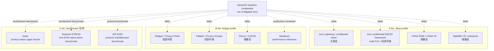
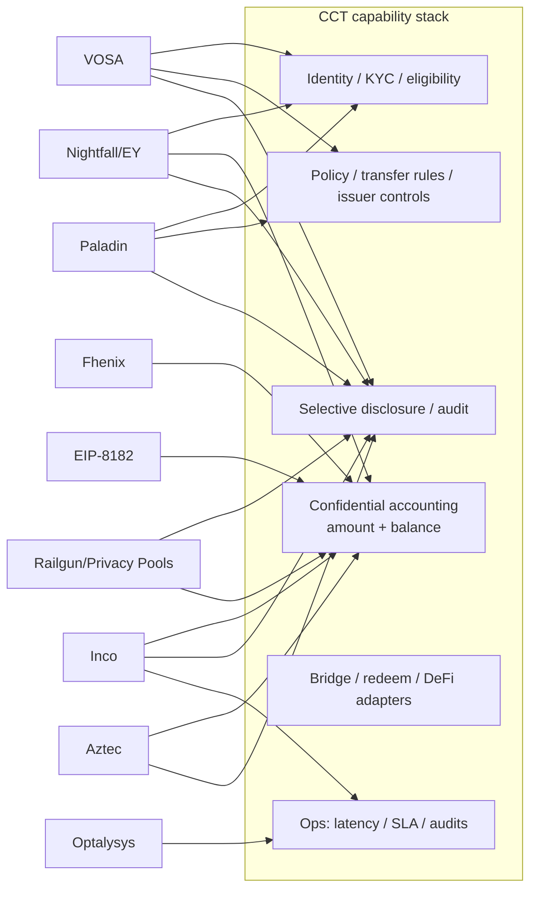

# Confidential RWA 候选方案补充调研

## Executive Summary

本 draft 只筛选 Zama 之外的候选方案，不替 WHI-271 做最终路线裁决。初筛结果是：**Inco Lightning / Inco confidential token 路线是最接近 Mantle private RWA / confidential compliance token 的非 Zama 主候选**，原因是它满足轻量 bolt-on、金额/余额隐私、合规披露叙事和 Base 生态近邻；但它把当前信任模型押在 TEE / Intel TDX 与 Inco 网络可用性上，且 Mantle 支持仍需厂商扩展。**VOSA-RWA/VOSA-20、Nightfall/EY 与 Fhenix/CoFHE 是强备选或强参考**，分别代表轻量 exposed-graph 合规草案、企业 ZK rollup 经验、可替换 FHE backend。**Railgun/Privacy Pools、Paladin、Optalysys 是局部补强**，不能直接升格为 RWA token 主路线。**Aztec、Starknet STRK20、EIP-8182 是 C 层 benchmark / 反例**，用于界定隐私上限、非 EVM/非 Mantle 集成代价和协议层路径边界。

强制审查要求在本 draft 中显式落地：所有 `主候选 / 强备选 / 局部补强 / 参考 / 出局` verdict 均由 WHI-266 五维 rubric 驱动，即 `RWA/合规相关性`、`轻量集成可能`、`选择性披露`、`成熟度`、`Mantle 适配`。表中分值为 0-5：0=无证据或不适用；3=可 PoC/部分满足；5=生产级或强证据。候选 verdict 是本 issue 的初筛角色，不是路线选择结论。

### 复用 final artifacts 与 commit pins

| Reuse artifact | Commit SHA | 本 draft 复用内容 | 边界 |
|---|---:|---|---|
| `confidential-compliance-token-research/research-sections/requirements-framework/final.md` | `9eb29a150f380f21add9b431b66fea2ee5d12881` | CCT 定义、五维 rubric、Inco PoC/Optalysys 分类边界、Mantle lightweight 约束 | 本 section 不重写 WHI-266 需求框架，只引用 scoring baseline。 |
| `evm-privacy-research/research-sections/erc7984-confidential-token/final.md` | `fdbda370e9e9137890c5bd2deb7752e03d76d0bc` | ERC-7984/OZ confidential token baseline、RWA/Observer/Hooked caveat、Zama comparator | 只作为 Zama/OZ 差异锚点，不把 ERC-7984 当本 issue 的新候选。 |
| `evm-privacy-research/research-sections/confidential-coprocessor/final.md` | `0041e3a1598751a7d121fecc600ba3d6ad42ad05` | Zama/Inco/Fhenix 架构、Inco Base mainnet、Fhenix mainnet-status tension、TEE/FHE/economic trust 差异 | 厂商自报性能、roadmap 和链支持仍需当前一手源确认。 |
| `evm-privacy-research/research-sections/vosa-standards/final.md` | `c9c16b3eb8956584d63efcf2fe155d9acc271f2f` | VOSA/VOSA-20/VOSA-RWA exposed-graph、合规服务方、forum maturity、未审计结论 | 单作者论坛草案，不能作为生产 standard maturity。 |
| `evm-privacy-research/research-sections/zk-shielded-pool/final.md` | `788453b4097f37003337b943bcf6d7f8f68b02ba` | Railgun、Privacy Pools、STRK20 的 shielded-pool / association-set 结论 | 不重复完整 shielded-pool landscape，只抽取 RWA/CCT 相关 fit/gap。 |
| `evm-privacy-research/research-sections/zk-privacy-chain-aztec/final.md` | `eceaef1e1b4f7a17d7fc3eb4dd91560207f40629` | Aztec privacy-native L2 upper-bound、非 EVM/非轻量 caveat | 仅作为 C 层 benchmark。 |
| `evm-privacy-research/research-sections/eea-enterprise-benchmark/final.md` | `1eac19ed837c8e9a4df1bb1594d5b23cc5a2e9f0` | Nightfall/EY、Paladin/Privacy Groups、enterprise privacy benchmark | 不采用其中任何路线裁决，只复用企业隐私能力/约束。 |
| `evm-privacy-research/research-sections/privacy-eips-survey/final.md` | `957773b13b2f5a66354ccda4b7d0c79a7236b222` | EIP-8182、Privacy Pools、标准层 EIP 边界 | EIP 动态信息以 2026-06-24 当前源补充。 |

### 候选分层 profile 表

| Candidate | Tier | candidate_role | protected_data | compliance_capabilities | disclosure_vector | deployment_shape | maturity_status | evidence_weight | Zama difference | Key gap |
|---|---|---|---|---|---|---|---|---|---|---|
| Inco Lightning / Inco confidential token/RWA route | A | 主候选 | 金额、余额、部分合约状态；地址/交易图仍公开 | programmable access、confidential ERC20/Circle 叙事、ERC-3643 association 相关叙事；发行方强制动作需方案化 | Inco-style access control / re-encryption；scope 与 revocation 需厂商确认 | bolt-on confidential layer / TEE_network；当前 Base mainnet | mainnet_single_chain_vendor; vendor_claimed_Trail_of_Bits_audit; Atlas_FHE_roadmap | official_primary + direct_reuse + vendor_self_report | 比 Zama 更像低延迟 TEE layer，当前 Base 近邻强；但少了 Zama/OZ RWA extension 的成熟合规合约栈 | Mantle chain support、TEE threat model、force-exit、public audit report/SLA package |
| Inco confidential ERC20 framework code PoC | A | 局部补强 | encrypted balances、encrypted transfer amounts；sender/receiver linkage remains | `Identity`、`ExampleTransferRules`、admin view、blacklist/age/limit examples | owner/admin TFHE allow + user re-encryption; no production audit log design | wrapper + FHE contracts on Rivest/fhEVM-style test environment | **unaudited_poc; not production maturity evidence** | **engineering_poc_not_production; code_analysis; must_not_be_used_as_production_evidence** | 与 Zama/OZ 类似 FHE token shape，但更窄、更 PoC；可借鉴 module split | README 明确 not audited/proof of concept；failure semantics、ACL revocation、upgrade/security missing |
| VOSA-RWA / VOSA-20 | A | 强备选 | amount、balance、stealth recipient identity；transfer graph deliberately exposed | compliance service attestation、RWA compliance-gated entrances、auditing extension | auditor memo / off-chain compliance proof；residual graph leakage is structural | contract-only ZK wrapper / fat token; no new chain | forum_draft; unaudited; no known mainnet | direct_reuse + community_primary + unverified_self_claims | 比 Zama 更轻、合规友好但隐私弱；不是 FHE/confidential accounting backend | single author、zero/low forum validation、freeze/force-transfer weakness |
| Nightfall / EY enterprise | A | 强备选 | private token transfers for ERC20/ERC721/ERC1155/ERC3525; business identity bound by X.509 | decentralized permissioning / certificate gating; enterprise disclosure controls | x509 identity + enterprise audit/access model | ZK-ZK rollup/operator stack | public_domain_experimental_code; enterprise_pilot_reference | official_primary + code_pin + direct_reuse | 比 Zama 更偏企业 rollup/payment rail，不是 Mantle contract-only token standard | operator stack、not direct RWA token framework、experimental warning in CE repo |
| Railgun + Privacy Pools | B | 局部补强 | transaction graph/source link hidden inside pools; balances inside shielded notes | PPOI, association sets, ASP screening, viewing key readout | user viewing key, PPOI, ASP roots; ragequit/association-set governance caveats | shielded pool contracts + wallets + relayers/ASP | Railgun mature-ish app; Privacy Pools early/compliance-focused | official_primary + direct_reuse + code_pin | 比 Zama 更强 anonymity set/graph privacy；缺 issuer token lifecycle controls | RWA issuer freeze/redeem mismatch、pool UX、regulatory acceptance |
| Paladin / Pente Privacy Groups | B | 局部补强 | business workflows, private EVM world state, private tokens via domains | known-party workflows, private approvals, notary/ZK token domains | selective data sharing among privacy group participants | client/runtime + privacy domains; unmodified EVM base ledger | active LFDT open source; enterprise framework, not CCT standard | official_primary + code_pin + direct_reuse | 比 Zama 更适合 enterprise workflow/state privacy；不像 value-level confidential token backend | heavier client/runtime, privacy group ops, token ledger standard gap |
| Fhenix / CoFHE | B | 强备选 | encrypted contract variables and token state; addresses/graph generally public | basic `FHE.allow`/sealed outputs; weak RWA compliance modules | permit/sealed outputs; revocation and audit model under-specified | bolt-on FHE coprocessor; Base Sepolia support; mainnet status mixed | testnet_or_early_limited; mainnet_support_coming_soon_in_docs | official_primary + code_pin + direct_reuse | 与 Zama 同为 FHE coprocessor family，但 economic security/EigenLayer route and weaker compliance ecosystem | mainnet production proof、compliance extension set、audit/security posture |
| Optalysys / LightLocker / photonic FHE | B | 参考 | not a token privacy model; performance reference for encrypted compute/RWA metadata | none as token standard; may support infra-level confidentiality claims | none as CCT disclosure design | hardware_reference / FHE acceleration | vendor_self_report; performance_reference | performance_reference + vendor_self_report + limited_secondary | 不是 Zama competitor at protocol layer；更多是 Zama/FHE productionization input | no independent benchmark in this review、no token standard、hardware ops dependency |
| Aztec | C | 参考 | private smart contracts, private state, notes, transaction data | app-defined; compliance must be built on Aztec stack | app-specific viewing/disclosure; strong privacy but new VM | native privacy L2 / non-EVM VM | active privacy L2; not Mantle bolt-on | official_primary + direct_reuse | 隐私上限高于 Zama token-only use cases；但 requires Aztec app/bridge/VM | non-EVM, new chain/liquidity, not phase-1 Mantle feature |
| Starknet STRK20 | C | 参考 | private token balances/transfers on Starknet | claimed built-in compliance/viewing keys; early ecosystem | viewing-key style; details still early | Starknet/Cairo native privacy token framework | early mainnet/announced capability | official_primary + direct_reuse + secondary_current | Benchmark for native privacy token on another stack, not Mantle EVM bolt-on | Cairo/Starknet migration, maturity/audit clarity |
| EIP-8182 | C | 参考 / phase-1 出局 | private ETH/ERC20 transfers via protocol shielded pool | Privacy Pools compatibility claimed as direction, concrete compliance TBD | protocol-level shielded pool; auth-verifier flexibility | protocol_hardfork/system_contract | Draft EIP / protocol proposal | official_spec + direct_reuse | Potentially stronger shared anonymity than Zama token contracts but requires Ethereum protocol activation | hardfork dependency, not Mantle immediate route, no RWA issuer controls |

## Item Findings

### item-1: 研究边界、复用输入与候选纳入规则

WHI-266 defines CCT as `compliance token + confidential accounting + selective disclosure + auditability + bridge/redeem/DeFi interoperability` and warns that generic privacy tokens or generic compliance tokens should not be over-scored. This section therefore admits candidates only if they answer at least one of these CCT questions:

- Does it protect amount/balance/accounting data in a token or RWA lifecycle?
- Does it preserve issuer/regulatory controls and selective disclosure?
- Can Mantle integrate it without a new chain, new bridge, protocol hardfork, full privacy node stack, or non-EVM migration?
- Is the evidence production-grade, code-grade, draft-grade, or vendor self-report?
- Does it produce reusable inputs for WHI-271 without deciding WHI-271?

The reused `evm-privacy-research` finals are treated as commit-pinned hard inputs only where cited by full path and commit SHA. Current external URLs are treated as point-in-time sources accessed 2026-06-24; vendor roadmap, partnership and benchmark claims are labeled vendor/self-reported unless supported by independent code, audits, or chain data.

### item-2: A 层候选一 - Inco confidential token/RWA 方案与代码级 PoC

#### 2.1 Inco product route

Inco is the strongest non-Zama main-candidate input because its current product message is directly aligned with "confidential apps in standard Solidity" and it has a Base-mainnet availability signal. Inco's Base mainnet announcement at `https://www.inco.org/blog/inco-lightning-live-on-base-mainnet` is dated 2026-06-15 and says Inco Lightning is live on Base mainnet; the earlier Base Sepolia launch page anchors the testnet phase. The same announcement says Inco Lightning was extensively audited by Trail of Bits, but this draft treats that as a vendor/source-page claim until a public audit report or engagement scope is pinned. This matches `evm-privacy-research/research-sections/confidential-coprocessor/final.md` @ `0041e3a1598751a7d121fecc600ba3d6ad42ad05`, which classifies Inco Lightning as TEE-first, Base-mainnet current support, with Atlas/FHE still roadmap.

For Mantle, this is attractive because the integration shape is not a native chain or hardfork. It is, however, not automatically "lighter" than Zama in governance terms: Inco shifts the core trust story from Zama-style FHE/MPC/KMS toward TEE hardware, callback relayers and vendor-operated confidential compute. This may be easier for short-latency pilots but harder for a regulator-facing security narrative unless the TEE node set, attestation evidence, SLA and failure recovery are explicit.

#### 2.2 Inco confidential ERC20 framework code-level PoC

Pinned code source: `https://github.com/Inco-fhevm/confidential-erc20-framework` @ `bb39e4f788742121f2fc93de33af58758360545b` (2024-11-21, verified locally 2026-06-24).

The README states the design transforms ERC20 tokens into a confidential form that conceals balances and transaction amounts, keeps sender-receiver linkage, and adds optional viewing/transfer rules for compliance or risk management. The README also states the repository is not audited and is intended solely as proof of concept; this is why the profile table marks `maturity_status=unaudited_poc` and `evidence_weight=engineering_poc_not_production`.

Code modules:

| Module | Role | CCT relevance | Caveat |
|---|---|---|---|
| `contracts/ConfidentialERC20/ConfidentialERC20.sol` | Core encrypted-balance ERC20-like implementation using `euint64`, `TFHE.select`, `TFHE.allow`, encrypted allowance and encrypted transfer values | Shows confidential accounting shape for balances/amounts | Does not emit normal ERC20 transfer value; address graph still visible; failure often selects zero-transfer rather than ordinary revert semantics. |
| `contracts/ConfidentialERC20Wrapper.sol` | Wraps an existing ERC20 into confidential token, supports `wrap()` and async `unwrap()` via Gateway decryption callback | Direct bridge/redeem analogy for existing RWA/stablecoin assets | Decimals <= 6 constraint, async burn callback, unwrap disable hook but no full legal redeem/failure model. |
| `contracts/CompliantConfidentialERC20/CompliantConfidentialERC20.sol` | Applies transfer rules before encrypted transfer and has `adminViewUserBalance()` | Shows policy hook + admin viewing pattern | Central owner visibility not sufficient audit/disclosure governance. |
| `contracts/CompliantConfidentialERC20/Identity.sol` | Stores encrypted DOB and computes age checks | Demonstrates encrypted credential field and policy predicate | Example identity only; not KYC/AML/claims registry. |
| `contracts/CompliantConfidentialERC20/ExampleTransferRules.sol` | Blocklist + minimum age + encrypted amount limit | Demonstrates transfer policy composition over encrypted amount | Example only; no sanctions oracle, jurisdiction routing, governance or audit log. |
| `test/ComplianceTests/CompliantERC.ts` | Tests mint, encrypted transfer, transfer rules and blacklist path | Demonstrates expected PoC behavior | Test coverage is not production audit evidence. |
| `test/ConfidentialWrapperTests/ConfidentialWrapper.ts` | Tests wrap, confidential transfer and unwrap | Directly relevant to RWA wrap/unwrap PoC | Does not establish production bridge/redeem controls. |

PoC fit: high for engineering inspiration, low for production maturity. Mantle can reuse the module boundaries in a later PoC: wrapper, confidential token core, transfer-rule contract, identity/credential contract, delegated/admin viewing, and async redeem/burn callback. Mantle must not reuse the repo as security evidence.

### item-3: A 层候选二 - VOSA-RWA/VOSA-20 与 Nightfall/EY enterprise confidential token

#### 3.1 VOSA-RWA / VOSA-20

VOSA is a useful A-tier comparator because it is intentionally compliance-friendly and lightweight. The accepted final `evm-privacy-research/research-sections/vosa-standards/final.md` @ `c9c16b3eb8956584d63efcf2fe155d9acc271f2f` found that VOSA hides amounts, balances and real-world identity via stealth-address style use, but deliberately exposes the VOSA-to-VOSA transfer graph. VOSA-RWA adds compliance-gated operations backed by an off-chain compliance service and proof flow. The relevant primary forum sources include VOSA-20 at `https://ethereum-magicians.org/t/draft-erc-vosa-20-privacy-preserving-wrapped-erc-20-token-standard/27832` and VOSA-RWA at `https://ethereum-magicians.org/t/draft-erc-vosa-rwa-compliance-gated-privacy-token-for-real-world-assets/27908`.

Fit: VOSA is lighter than Inco/Zama/Fhenix because it is closer to pure contract/circuit application logic and avoids a confidential compute network. It is a strong backup concept if Mantle values "auditability by exposed graph" over stronger transaction-graph privacy. It should be downgraded from main candidate because the maturity is forum-draft, single-author, unaudited, with no known mainnet deployment and structural limits around freezing/force-transfer in a one-time-address model.

#### 3.2 Nightfall / EY enterprise

Nightfall is not a CCT token standard, but it is the best A-tier enterprise privacy experience source. EY's technology page describes Nightfall as a ZK-ZK rollup for private transactions on public Ethereum and EVM-compatible blockchains, with decentralized permissioning because counterparties must be scrutinized when transactions are private. EY's 2025 newsroom article states Nightfall_4 replaces the prior version with a ZK rollup architecture and public-domain source code. The Nightfall_4 CE GitHub README says it enables private transfer of ERC20, ERC721, ERC1155 and ERC3525 tokens, while warning that the community edition should be treated as experimental and not used for significant value.

Pinned code source: `https://github.com/EYBlockchain/nightfall_4_CE` @ `e3203ea24bd302222f2e071876d756eb66b1e67c` (verified by `git ls-remote`, 2026-06-24).

Fit: Nightfall is a strong backup/reference for enterprise identity, X.509/permissioning, audit and operational design. It is not a Mantle phase-1 main candidate because it implies a rollup/operator architecture and private-transfer rail rather than a lightweight CCT contract standard directly deployable on Mantle.

### item-4: B 层候选 - Railgun/Privacy Pools、Paladin/Privacy Groups、Fhenix/CoFHE、Optalysys

#### 4.1 Railgun / Privacy Pools

Railgun and Privacy Pools should be treated as compliance-disclosure supplements, not RWA token standards. Railgun documentation describes Private Proofs of Innocence as a ZK assurance system using public on-chain bad-actor datasets while not exposing user balances/activity; L2BEAT also notes Railgun viewing keys can expose sent/received private transactions to a regulator or enforcer, while protocol-level compliance is not directly enforced. Privacy Pools documentation says users deposit assets and later withdraw without an on-chain deposit-withdrawal link, while an Association Set Provider maintains approved deposits and posts roots; 0xbow positions ASP as a compliance tool.

Pinned code source: `https://github.com/0xbow-io/privacy-pools-core` @ `a80836a47451e662f127af17e11430ffa976c234` (verified by `git ls-remote`, 2026-06-24).

Fit: These tools are useful for `source-of-funds` proofs, association sets, viewing-key disclosure and anonymity-set design. They are not enough for issuer-controlled RWA token lifecycle because the pool model is asset-flow privacy, not issuer policy, freeze/recovery, redemption, omnibus accounting or investor eligibility.

#### 4.2 Paladin / Privacy Groups

Paladin is valuable because it targets enterprise programmable privacy on unmodified EVM chains. LFDT and Paladin docs describe privacy groups via Pente, private token domains, ZKP/notary-backed token models, private smart contracts and atomic workflows. Kaleido's Paladin page emphasizes deploying on any unmodified EVM-compatible chain and protecting transaction details/business logic.

Pinned code source: `https://github.com/LFDT-Paladin/paladin` @ `c8ece88ed391e663612c5d51fd9e83289730a816` (verified by `git ls-remote`, 2026-06-24).

Fit: Paladin is better for multi-party institutional workflows, DvP/PvP and business logic privacy than for a minimal confidential RWA token standard. If Mantle's product goal becomes private institutional workflow orchestration rather than just confidential token ledger, Paladin becomes more important. For WHI-270 it remains `局部补强`: privacy groups can complement a token route but introduce a heavier client/runtime and domain coordination model.

#### 4.3 Fhenix / CoFHE

Fhenix is the closest B-tier backend-replaceable confidential compute candidate. Its docs describe CoFHE as a coprocessor for encrypted computation with standard Solidity integration; the Quick Start lists Ethereum Sepolia, Arbitrum Sepolia and Base Sepolia as supported testnets and says production mainnet support is coming soon. Fhenix's Base blog says developers can build private dApps using CoFHE on Base. This creates a source tension: product/blog language implies active expansion, while docs still put production mainnet support in roadmap. This draft uses the conservative docs-first status.

Pinned code source: `https://github.com/FhenixProtocol/fhenix-confidential-contracts` @ `ad03449120a29a900e6c8223347cc5ac8add63c4` (verified by `git ls-remote`, 2026-06-24).

Fit: Fhenix can be a strong backup confidential compute backend if Mantle wants a Zama/Inco alternative and accepts EigenLayer/economic-security style assumptions. It is downgraded because RWA compliance modules, maturity, audits and production deployment evidence are weaker than the main-candidate threshold.

#### 4.4 Optalysys performance / productionization reference

Optalysys is not a token standard, not a compliance protocol and not a Mantle integration path. It is included because WHI-266 explicitly classifies it as an FHE production/performance reference. Optalysys' current RWA page claims confidential RWA tokenisation can encrypt sensitive metadata like owner identity or asset value. Its RWA article frames tokenized RWAs as needing confidentiality for institutional adoption, and its Zama partnership/photonic acceleration pages frame Lightmatter-style hardware as an FHE acceleration route.

Fit: Useful for WHI-271 questions about FHE latency, cost curves, hardware dependency, SLA ownership, deployment model and independent benchmarking. It should not affect candidate verdicts except by reminding Mantle that any FHE-based route needs measurable performance budgets and operational ownership.

### item-5: C 层架构 benchmark - Aztec、Starknet STRK20、EIP-8182

Aztec is the upper-bound benchmark for privacy-native application design. Aztec docs describe a privacy-first Ethereum L2 with private smart contracts and private state, while also stating it is not EVM compatible and uses a new privacy-preserving VM. This makes Aztec a reference for what full private state can look like, but a negative example for Mantle phase-1 lightweight integration.

Starknet STRK20 is a benchmark for native privacy-token capability on a non-EVM/Cairo stack. Starknet's v0.14.2 privacy blog presents STRK20 as private ERC-20-style token privacy for Starknet, with compliance positioning. It is valuable as evidence that ecosystems are moving privacy-token features into chain-specific native frameworks. It is not a Mantle candidate because it requires Starknet/Cairo migration rather than Mantle EVM integration.

EIP-8182 is a protocol-layer benchmark. The official EIP says it introduces private ETH and ERC-20 transfers through a shielded-pool system contract installed at fork activation, with flexible spend authorization and no new precompile/opcode/transaction type. This is architecturally important because it points toward a unified privacy pool, but for Mantle CCT phase 1 it is out: it depends on protocol activation, does not itself solve issuer controls, and should be treated as reference design for future native/private pool thinking.

### item-6: 候选分层 profile 表与逐候选 source pack

| Candidate | Primary/current source pack | Reused final source pack | Code / version pin | Source confidence |
|---|---|---|---|---|
| Inco product | `https://www.inco.org/blog/inco-lightning-live-on-base-mainnet`, `https://www.inco.org/blog/inco-lightning-launched-on-base-sepolia`, `https://www.inco.org/blog/circle-research-inco-confidential-erc20-report`, `https://www.circle.com/blog/confidential-erc-20-framework-for-compliant-on-chain-privacy` | `evm-privacy-research/research-sections/confidential-coprocessor/final.md` @ `0041e3a1598751a7d121fecc600ba3d6ad42ad05` | no product repo pinned beyond PoC | Medium-high for Base availability/architecture; medium for audit scope/roadmap/SLA |
| Inco ERC20 PoC | `https://github.com/Inco-fhevm/confidential-erc20-framework`, local code read | `confidential-compliance-token-research/research-sections/requirements-framework/final.md` @ `9eb29a150f380f21add9b431b66fea2ee5d12881` | `bb39e4f788742121f2fc93de33af58758360545b` | High for code facts; low for production maturity |
| VOSA | Ethereum Magicians VOSA-20/VOSA-RWA topics | `evm-privacy-research/research-sections/vosa-standards/final.md` @ `c9c16b3eb8956584d63efcf2fe155d9acc271f2f` | no audited repo pin | Medium for forum design; low for production |
| Nightfall/EY | `https://blockchain.ey.com/technology`, EY 2025 Nightfall newsroom, `https://github.com/EYBlockchain/nightfall_4_CE` | `evm-privacy-research/research-sections/eea-enterprise-benchmark/final.md` @ `1eac19ed837c8e9a4df1bb1594d5b23cc5a2e9f0` | `e3203ea24bd302222f2e071876d756eb66b1e67c` | High for enterprise architecture; medium for current production fit |
| Railgun/Privacy Pools | `https://docs.railgun.org/wiki/assurance/private-proofs-of-innocence`, `https://docs.privacypools.com/`, `https://docs.privacypools.com/layers/contracts/entrypoint`, `https://0xbow.io/` | `evm-privacy-research/research-sections/zk-shielded-pool/final.md` @ `788453b4097f37003337b943bcf6d7f8f68b02ba`; `evm-privacy-research/research-sections/privacy-eips-survey/final.md` @ `957773b13b2f5a66354ccda4b7d0c79a7236b222` | Privacy Pools core `a80836a47451e662f127af17e11430ffa976c234` | Medium-high for privacy/compliance supplement |
| Paladin | `https://www.lfdecentralizedtrust.org/projects/paladin`, `https://lfdt-paladin.github.io/paladin/head/`, `https://www.kaleido.io/paladin`, `https://github.com/LFDT-Paladin/paladin` | `evm-privacy-research/research-sections/eea-enterprise-benchmark/final.md` @ `1eac19ed837c8e9a4df1bb1594d5b23cc5a2e9f0` | `c8ece88ed391e663612c5d51fd9e83289730a816` | Medium-high for workflow privacy; medium for CCT token fit |
| Fhenix | `https://cofhe-docs.fhenix.zone/fhe-library/introduction/quick-start`, `https://www.fhenix.io/blog/fhenix-adds-base-support-to-cofhe----expanding-privacy-to-ethereum-l2`, `https://www.fhenix.io/blog/what-is-fhenix` | `evm-privacy-research/research-sections/confidential-coprocessor/final.md` @ `0041e3a1598751a7d121fecc600ba3d6ad42ad05` | `ad03449120a29a900e6c8223347cc5ac8add63c4` | Medium; status tension explicitly noted |
| Optalysys | `https://optalysys.com/confidential-rwa-tokenisation-blockchain-use-case/`, `https://optalysys.com/resource/real-world-assets-on-blockchain-the-trillion-dollar-opportunity-that-needs-confidentiality/`, `https://optalysys.com/resource/optalysys-and-zama-partnership/` | `confidential-compliance-token-research/research-sections/requirements-framework/final.md` @ `9eb29a150f380f21add9b431b66fea2ee5d12881` | no protocol repo | Low for hard performance claims; useful for production questions |
| Aztec | `https://docs.aztec.network/`, `https://aztec.network/` | `evm-privacy-research/research-sections/zk-privacy-chain-aztec/final.md` @ `eceaef1e1b4f7a17d7fc3eb4dd91560207f40629` | no repo pin needed for benchmark | High for architecture; low for Mantle direct fit |
| Starknet STRK20 | `https://www.starknet.io/blog/starknet-v0-14-2-the-privacy-engine-arrives/` | `evm-privacy-research/research-sections/zk-shielded-pool/final.md` @ `788453b4097f37003337b943bcf6d7f8f68b02ba` | no repo pin found in scope | Medium; early ecosystem evidence |
| EIP-8182 | `https://eips.ethereum.org/EIPS/eip-8182`, `https://ethereum-magicians.org/t/eip-8182-private-eth-and-erc-20-transfers/27889` | `evm-privacy-research/research-sections/privacy-eips-survey/final.md` @ `957773b13b2f5a66354ccda4b7d0c79a7236b222` | EIP page current as of access date | High for spec text; low for deployment |

### item-7: 候选初筛矩阵与 Zama 差异标注

#### WHI-266 rubric traceability matrix

| Candidate | RWA/合规相关性 | 轻量集成可能 | 选择性披露 | 成熟度 | Mantle 适配 | Verdict | 为何纳入 / 降权 |
|---|---:|---:|---:|---:|---:|---|---|
| Inco Lightning / product route | 4 | 4 | 3 | 3 | 4 | 主候选 | RWA/confidential ERC20 叙事与 Base mainnet 近邻强；因 TEE trust、Mantle support 未就绪、Atlas roadmap 限制，不能直接裁决胜出。 |
| Inco ERC20 framework PoC | 4 | 3 | 3 | 1 | 3 | 局部补强 | 代码正中 confidential token + viewing/transfer rules，但 README 明确 unaudited PoC；只可作 PoC module reference。 |
| VOSA-RWA/VOSA-20 | 4 | 5 | 3 | 1 | 4 | 强备选 | 合规门控+轻量强，exposed graph 有监管友好取舍；因论坛草案/未审计/冻结弱点降权。 |
| Nightfall/EY | 3 | 2 | 4 | 3 | 2 | 强备选 | 企业身份、ZK private transfer、permissioning 强；rollup/operator stack 和 CE experimental warning 使其不像 phase-1 Mantle token route。 |
| Railgun/Privacy Pools | 2 | 3 | 4 | 3 | 3 | 局部补强 | PPOI/ASP/viewing key 补足 source-of-funds 和选择性披露；缺 issuer lifecycle controls。 |
| Paladin/Pente | 3 | 3 | 4 | 3 | 3 | 局部补强 | 对企业 private workflow 很强，可部署 unmodified EVM；对 CCT token ledger 不是最短路径。 |
| Fhenix/CoFHE | 2 | 4 | 2 | 2 | 3 | 强备选 | 可作为 backend-replaceable FHE coprocessor；合规模块和 production status 弱于 Inco/Zama。 |
| Optalysys | 1 | 1 | 0 | 2 | 1 | 参考 | 只回答 FHE production/performance constraints，不回答 token standard/compliance/disclosure。 |
| Aztec | 3 | 1 | 4 | 3 | 1 | 参考 | 隐私上限强，非 EVM/新 L2/桥和流动性迁移使 Mantle phase-1 出局。 |
| Starknet STRK20 | 3 | 1 | 3 | 2 | 1 | 参考 | 证明 native privacy token trend，但 Cairo/Starknet 栈不可轻量移植到 Mantle。 |
| EIP-8182 | 2 | 0 | 3 | 1 | 0 | 参考 / phase-1 出局 | 协议层 unified shielded pool 重要，但依赖硬分叉且缺 RWA issuer controls。 |

#### Screening verdicts

| Verdict bucket | Candidates | Zama delta | WHI-271 input, not decision |
|---|---|---|---|
| 主候选 | Inco Lightning / Inco confidential token route | TEE-first, Base-mainnet, potentially lower latency and product adjacency; weaker cryptographic trust and less mature RWA extension stack than Zama/OZ | Ask whether Mantle wants TEE-backed faster go-to-market as an alternative to Zama FHE/MPC. |
| 强备选 | VOSA-RWA/VOSA-20, Nightfall/EY, Fhenix/CoFHE | VOSA: lighter/exposed graph; Nightfall: enterprise ZK rollup; Fhenix: FHE backend alternative | Use as fallback route, design contrast, or phase-2 backend shortlist. |
| 局部补强 | Inco PoC, Railgun/Privacy Pools, Paladin | Code modules, compliance-pool disclosure, business workflow privacy | Borrow design components; do not promote to full route alone. |
| 参考 | Optalysys, Aztec, Starknet STRK20, EIP-8182 | Performance constraints; privacy-native chain upper bound; non-Mantle token standard; protocol pool benchmark | Use as benchmark/constraint, not candidate implementation path. |
| 出局 for phase 1 | Aztec as direct route, STRK20 direct route, EIP-8182 direct route | New chain/VM or protocol hardfork | Only revisit if Mantle strategy changes from lightweight CCT to native privacy chain/protocol feature. |

### item-8: Gap Register、降权/出局理由与后续 WHI-271 输入

| Gap | Affected candidates | Why it matters | WHI-271 / follow-up question |
|---|---|---|---|
| Mantle support and deployment commitments | Inco, Fhenix | Base support does not imply Mantle support; callbacks/finality/relayer/KMS/TEE endpoints need chain-specific proof | Ask vendors for Mantle support plan, contracts, latency and operational responsibilities. |
| TEE trust and attestation narrative | Inco | Institutional RWA users may require clear hardware trust, side-channel, operator and jurisdiction risk treatment | Decide whether TEE-backed confidentiality is acceptable for Mantle's compliance story. |
| FHE ACL revocation and over-disclosure | Zama comparator, Fhenix, Inco PoC | WHI-266/OZ caveat: historical access may be hard to revoke; GDPR/minimal disclosure concerns | Require a disclosure authority lifecycle and audit log design in any PoC. |
| Production audit posture | Inco PoC, VOSA, Fhenix, Privacy Pools, Paladin; Inco product audit scope | Unaudited or early code cannot support production RWA; Inco product page claims Trail of Bits auditing but this draft has not pinned a public report/scope | Collect public audits or scope a Mantle-funded audit before production ranking. |
| Issuer lifecycle controls | Railgun/Privacy Pools, VOSA, Nightfall, Fhenix | RWA needs freeze, recovery, forced transfer, redemption and legal issuer workflows | Map each candidate to ERC-3643-style controls and bridge/redeem events. |
| Performance/SLA evidence | Zama comparator, Inco, Fhenix, Optalysys | FHE/TEE latency and availability affects UX, market operations, redemption and compliance monitoring | Define latency/cost budgets; treat Optalysys as question generator, not proof. |
| Independent validation of current mainnet claims | Inco, Fhenix, STRK20 | Vendor/blog claims can move faster than docs/audits | Require chain addresses, contract versions, audit links and observed usage before final route. |

## Diagrams

### diag-1: Candidate landscape map



### diag-2: Capability stack comparison



### diag-3: Inco confidential ERC20 PoC flow

```mermaid
sequenceDiagram
  participant User
  participant BaseERC20
  participant Wrapper as ConfidentialERC20Wrapper
  participant CToken as ConfidentialERC20/CompliantConfidentialERC20
  participant Rules as ExampleTransferRules
  participant Identity
  participant Gateway
  participant Admin

  User->>BaseERC20: approve(wrapper, amount)
  User->>Wrapper: wrap(amount)
  Wrapper->>BaseERC20: transferFrom(user, wrapper, amount)
  Wrapper->>CToken: _mint(user, amount as euint64 balance)
  User->>CToken: transfer(to, encryptedAmount, inputProof)
  CToken->>Rules: transferAllowed(from, to, encrypted amount)
  Rules->>Identity: encrypted age / registration checks
  Rules-->>CToken: encrypted boolean
  CToken->>CToken: TFHE.select(pass, amount, 0)
  CToken->>CToken: encrypted balance updates
  Admin->>CToken: adminViewUserBalance(user)
  User->>Wrapper: unwrap(amount)
  Wrapper->>Gateway: request decryption of enoughBalance
  Gateway-->>Wrapper: _burnCallback(result)
  Wrapper->>BaseERC20: transfer(user, amount)
  Note over Wrapper,CToken: README says unaudited proof of concept; do not use as production maturity evidence.
```

### diag-4: Screening matrix flow

```text
Evidence pack
  ├─ prior final path + commit SHA
  ├─ official URL + access date
  ├─ code repo + pinned commit
  └─ vendor claim / roadmap / gap marker
        │
        ▼
WHI-266 five-axis rubric
  1. RWA/合规相关性
  2. 轻量集成可能
  3. 选择性披露
  4. 成熟度
  5. Mantle 适配
        │
        ▼
Initial role only
  主候选 / 强备选 / 局部补强 / 参考 / 出局
        │
        ▼
NOT WHI-271 final decision
  WHI-271 still chooses route after cross-candidate trade-off,
  vendor validation, security review and Mantle engineering feasibility.
```

## Source Coverage

| Source requirement | Status | Evidence |
|---|---|---|
| src-1 prior requirements framework | covered | `confidential-compliance-token-research/research-sections/requirements-framework/final.md` @ `9eb29a150f380f21add9b431b66fea2ee5d12881` |
| src-2 prior privacy finals | covered | Full path+SHA reuse table includes ERC-7984, coprocessor, VOSA, shielded pool, Aztec, EEA, privacy EIPs. |
| src-3 Inco primary | covered | Inco blog, Inco Base Sepolia page, Inco/Circle report, Circle blog; accessed 2026-06-24. |
| src-4 Inco code analysis | covered | `Inco-fhevm/confidential-erc20-framework` @ `bb39e4f788742121f2fc93de33af58758360545b`, local code read. |
| src-5 VOSA primary | covered by reuse + URLs | VOSA-20/VOSA-RWA Magicians threads from `vosa-standards/final.md`; this draft cites full path+SHA. |
| src-6 Nightfall/EY primary | covered | EY technology page, EY 2025 newsroom, `EYBlockchain/nightfall_4_CE` @ `e3203ea24bd302222f2e071876d756eb66b1e67c`. |
| src-7 shielded pool primary | covered | Railgun PPOI docs, Privacy Pools docs/entrypoint, 0xbow website, Privacy Pools core commit. |
| src-8 Paladin primary/prior | covered | LFDT Paladin project page, Paladin docs, Kaleido page, GitHub pin, EEA benchmark final path+SHA. |
| src-9 Fhenix primary | covered | CoFHE Quick Start, Base support blog, Fhenix FAQ, confidential contracts commit pin. |
| src-10 Optalysys performance | covered with vendor-label caveat | Confidential RWA page, RWA confidentiality article, Zama partnership/photonic FHE material; all vendor self-report unless independently verified later. |
| src-11 C benchmark sources | covered | Aztec docs, Starknet STRK20 blog, EIP-8182 official spec/Magicians plus prior finals. |
| src-12 Zama comparator | covered by reuse | ERC-7984 and confidential-coprocessor finals; no new Zama landscape repeated. |
| src-13 audit/security | partially covered | Explicit no-public-audit/experimental caveats for Inco PoC, VOSA, Nightfall CE; public audit status remains gap for several candidates. |
| src-14 issue record | covered | Multica outline-approved comment `b85ef488-71fb-4527-8a86-70aaee2578aa`; deep-draft dispatch `7f69f0fc-31ff-4e42-8dae-1dca9c5839d6`. |

## Gap Analysis

1. **No candidate outside Zama cleanly satisfies the full CCT MVP today.** Inco is closest, but its current route needs Mantle support and TEE governance. VOSA is light but immature and deliberately leaks graph. Nightfall/Paladin are enterprise-workflow heavy. Fhenix is backend-replaceable but weak on compliance evidence.
2. **Inco PoC must remain an engineering reference.** The structured profile table explicitly marks `maturity_status=unaudited_poc` and `evidence_weight=engineering_poc_not_production`; this should be preserved into final and any TW synthesis.
3. **Optalysys must remain a performance reference.** It informs FHE hardware/SLA questions but does not define token interfaces, compliance controls, disclosure vectors or Mantle integration.
4. **Public audit posture is incomplete.** The draft found explicit experimental/unaudited caveats for Inco PoC, VOSA and Nightfall CE. Inco Lightning's Base mainnet page claims extensive Trail of Bits auditing, but this draft has not pinned a public audit report or scope; that should be verified before any production ranking.
5. **Current status is dynamic.** Inco, Fhenix, STRK20 and EIP-8182 are all moving. Final route work must refresh chain deployment addresses, audit links and roadmap claims rather than relying on marketing/blog language.
6. **Issuer lifecycle remains the hard RWA gap.** Privacy pools and private chains can hide flows; CCT still needs issuer controls, freeze/recovery/force transfer, redemption, bridge accounting, and regulator/issuer disclosure governance.

## Revision Log

| Round | Date | Change |
|---:|---|---|
| 1 | 2026-06-24 | Initial deep draft from approved outline. Covered all A/B/C candidates, added candidate profile table, per-candidate x five-axis rubric traceability matrix, Inco code-level PoC profile with pinned commit, Optalysys performance-reference profile, Zama deltas, diagrams, source coverage and gap register. Incorporated mandatory outline-review guidance: full path+SHA reuse citations, structured Inco PoC unaudited warning, and rubric-grounded screening verdicts. |
