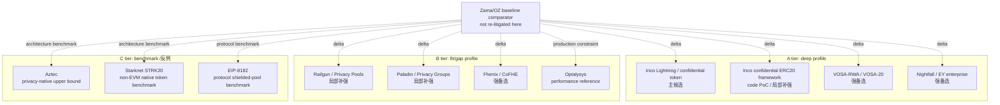
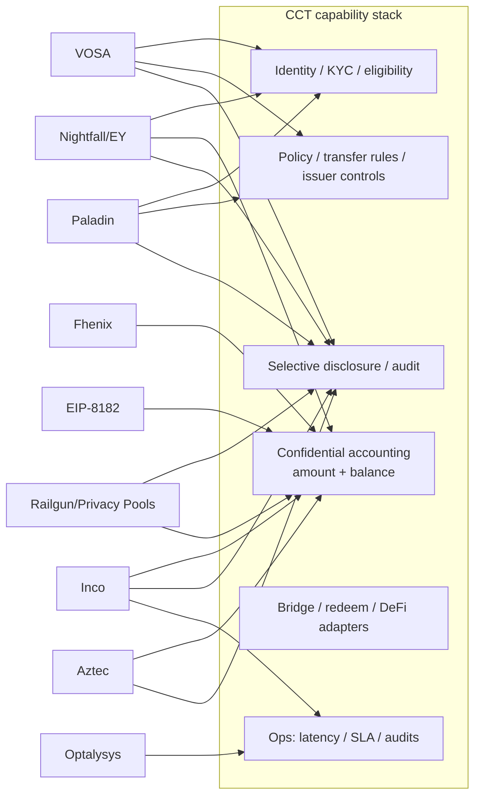

# Confidential RWA 候选方案补充调研

## 执行摘要（Executive Summary）

本 draft 只筛选 Zama 之外的候选方案，不替 WHI-271 做最终路线裁决。初筛结果是：**Inco Lightning / Inco confidential token 路线是最接近 Mantle private RWA / confidential compliance token 的非 Zama 主候选**，原因是它满足轻量 bolt-on、金额/余额隐私、合规披露叙事和 Base 生态近邻；但它把当前信任模型押在 TEE / Intel TDX 与 Inco 网络可用性上，且 Mantle 支持仍需厂商扩展。**VOSA-RWA/VOSA-20、Nightfall/EY 与 Fhenix/CoFHE 是强备选或强参考**，分别代表轻量 exposed-graph 合规草案、企业 ZK rollup 经验、可替换 FHE backend。**Railgun/Privacy Pools、Paladin、Optalysys 是局部补强**，不能直接升格为 RWA token 主路线。**Aztec、Starknet STRK20、EIP-8182 是 C 层 benchmark / 反例**，用于界定隐私上限、非 EVM/非 Mantle 集成代价和协议层路径边界。

强制审查要求在本 draft 中显式落地：所有 `主候选 / 强备选 / 局部补强 / 参考 / 出局` verdict 均由 WHI-266 五维 rubric 驱动，即 `RWA/合规相关性`、`轻量集成可能`、`选择性披露`、`成熟度`、`Mantle 适配`。表中分值为 0-5：0=无证据或不适用；3=可 PoC/部分满足；5=生产级或强证据。候选 verdict 是本 issue 的初筛角色，不是路线选择结论。

### 复用 final artifacts 与 commit pins

| 复用 artifact | Commit SHA | 本 draft 复用内容 | 边界 |
|---|---:|---|---|
| `confidential-compliance-token-research/research-sections/requirements-framework/final.md` | `9eb29a150f380f21add9b431b66fea2ee5d12881` | CCT 定义、五维 rubric、Inco PoC/Optalysys 分类边界、Mantle lightweight 约束 | 本 section 不重写 WHI-266 需求框架，只引用评分基线（scoring baseline）。 |
| `evm-privacy-research/research-sections/erc7984-confidential-token/final.md` | `fdbda370e9e9137890c5bd2deb7752e03d76d0bc` | ERC-7984/OZ confidential token 基线、RWA/Observer/Hooked 注意事项、Zama 对照 | 只作为 Zama/OZ 差异锚点，不把 ERC-7984 当本 issue 的新候选。 |
| `evm-privacy-research/research-sections/confidential-coprocessor/final.md` | `0041e3a1598751a7d121fecc600ba3d6ad42ad05` | Zama/Inco/Fhenix 架构、Inco Base mainnet、Fhenix mainnet 状态张力、TEE/FHE/经济信任差异 | 厂商自报性能、roadmap 和链支持仍需当前一手源确认。 |
| `evm-privacy-research/research-sections/vosa-standards/final.md` | `c9c16b3eb8956584d63efcf2fe155d9acc271f2f` | VOSA/VOSA-20/VOSA-RWA exposed-graph、合规服务方、forum 成熟度、未审计结论 | 单作者论坛草案，不能作为生产级 standard maturity。 |
| `evm-privacy-research/research-sections/zk-shielded-pool/final.md` | `788453b4097f37003337b943bcf6d7f8f68b02ba` | Railgun、Privacy Pools、STRK20 的 shielded-pool / association-set 结论 | 不重复完整 shielded-pool landscape，只抽取 RWA/CCT 相关 fit/gap。 |
| `evm-privacy-research/research-sections/zk-privacy-chain-aztec/final.md` | `eceaef1e1b4f7a17d7fc3eb4dd91560207f40629` | Aztec privacy-native L2 上限、非 EVM/非轻量注意事项 | 仅作为 C 层 benchmark。 |
| `evm-privacy-research/research-sections/eea-enterprise-benchmark/final.md` | `1eac19ed837c8e9a4df1bb1594d5b23cc5a2e9f0` | Nightfall/EY、Paladin/Privacy Groups、企业隐私 benchmark | 不采用其中任何路线裁决，只复用企业隐私能力/约束。 |
| `evm-privacy-research/research-sections/privacy-eips-survey/final.md` | `957773b13b2f5a66354ccda4b7d0c79a7236b222` | EIP-8182、Privacy Pools、标准层 EIP 边界 | EIP 动态信息以 2026-06-24 当前源补充。 |

### 候选分层 profile 表

| 候选方案 | 层级 | candidate_role | protected_data | compliance_capabilities | disclosure_vector | deployment_shape | maturity_status | evidence_weight | 与 Zama 差异 | 关键 gap |
|---|---|---|---|---|---|---|---|---|---|---|
| Inco Lightning / Inco confidential token/RWA 路线 | A | 主候选 | 金额、余额、部分合约状态；地址/交易图仍公开 | programmable access、confidential ERC20/Circle 叙事、ERC-3643 association 相关叙事；发行方强制动作需方案化 | Inco-style access control / re-encryption；scope 与 revocation 需厂商确认 | bolt-on confidential layer / TEE_network；当前 Base mainnet | mainnet_single_chain_vendor; vendor_claimed_Trail_of_Bits_audit; Atlas_FHE_roadmap | official_primary + direct_reuse + vendor_self_report | 比 Zama 更像低延迟 TEE layer，当前 Base 近邻强；但少了 Zama/OZ RWA extension 的成熟合规合约栈 | Mantle 链支持、TEE 威胁模型、强制退出（force-exit）、公开审计报告/SLA 包 |
| Inco confidential ERC20 framework 代码 PoC | A | 局部补强 | 加密余额、加密转账金额；sender/receiver linkage 仍保留 | `Identity`、`ExampleTransferRules`、admin view、blacklist/age/limit 示例 | owner/admin TFHE allow + user re-encryption；无生产级审计日志设计 | wrapper + FHE 合约，运行于 Rivest/fhEVM 风格测试环境 | **unaudited_poc; 非生产级成熟度证据** | **engineering_poc_not_production; code_analysis; must_not_be_used_as_production_evidence** | 与 Zama/OZ 类似 FHE token 形态，但更窄、更偏 PoC；可借鉴 module split | README 明确 not audited/proof of concept；缺失故障语义、ACL revocation、升级/安全设计 |
| VOSA-RWA / VOSA-20 | A | 强备选 | 金额、余额、stealth 收款方身份；transfer graph 有意暴露 | compliance service attestation、RWA 合规门控入口、auditing extension | auditor memo / off-chain compliance proof；残留 graph 泄露是结构性的 | 仅合约的 ZK wrapper / fat token；无新链 | forum_draft; unaudited; 无已知 mainnet | direct_reuse + community_primary + unverified_self_claims | 比 Zama 更轻、更合规友好但隐私更弱；不是 FHE/confidential accounting backend | 单作者、论坛验证零/低、freeze/force-transfer 弱点 |
| Nightfall / EY 企业方案 | A | 强备选 | ERC20/ERC721/ERC1155/ERC3525 的私密 token transfer；业务身份由 X.509 绑定 | decentralized permissioning / 证书门控；企业披露控制 | x509 身份 + 企业审计/访问模型 | ZK-ZK rollup/operator 栈 | public_domain_experimental_code; enterprise_pilot_reference | official_primary + code_pin + direct_reuse | 比 Zama 更偏企业 rollup/payment rail，不是 Mantle 仅合约的 token standard | operator 栈、并非直接的 RWA token framework、CE repo 中有 experimental 警告 |
| Railgun + Privacy Pools | B | 局部补强 | transaction graph/来源链接隐藏在 pool 内；余额在 shielded note 内 | PPOI、association sets、ASP screening、viewing key 读出 | user viewing key、PPOI、ASP roots；ragequit/association-set 治理注意事项 | shielded pool 合约 + 钱包 + relayer/ASP | Railgun 应用较成熟；Privacy Pools 早期/侧重合规 | official_primary + direct_reuse + code_pin | 比 Zama 更强的匿名集/graph 隐私；缺 issuer token lifecycle 控制 | RWA issuer freeze/redeem 不匹配、pool UX、监管接受度 |
| Paladin / Pente Privacy Groups | B | 局部补强 | 业务工作流、私密 EVM world state、通过 domain 实现的私密 token | known-party 工作流、私密审批、notary/ZK token domain | privacy group 参与方之间的选择性数据共享 | client/runtime + privacy domain；底层 base ledger 为未修改的 EVM | 活跃的 LFDT 开源项目；企业 framework，非 CCT standard | official_primary + code_pin + direct_reuse | 比 Zama 更适合企业工作流/状态隐私；不像 value-level confidential token backend | 更重的 client/runtime、privacy group 运维、token ledger standard gap |
| Fhenix / CoFHE | B | 强备选 | 加密合约变量与 token state；地址/graph 一般公开 | 基础 `FHE.allow`/sealed outputs；RWA 合规模块弱 | permit/sealed outputs；revocation 与审计模型未充分定义 | bolt-on FHE coprocessor；支持 Base Sepolia；mainnet 状态不一 | testnet_or_early_limited; 文档中 mainnet_support_coming_soon_in_docs | official_primary + code_pin + direct_reuse | 与 Zama 同为 FHE coprocessor 家族，但走经济安全/EigenLayer 路线且合规生态更弱 | mainnet 生产证明、合规扩展集、审计/安全态势 |
| Optalysys / LightLocker / photonic FHE | B | 参考 | 不是 token 隐私模型；用于加密计算/RWA metadata 的性能参考 | 作为 token standard 无；可能支持基础设施层的机密性主张 | 作为 CCT 披露设计无 | hardware_reference / FHE 加速 | vendor_self_report; performance_reference | performance_reference + vendor_self_report + limited_secondary | 在协议层不是 Zama 竞品；更多是 Zama/FHE 产品化的输入 | 本次评审中无独立 benchmark、无 token standard、依赖硬件运维 |
| Aztec | C | 参考 | 私密智能合约、私密 state、note、交易数据 | app 自定义；合规需构建在 Aztec 栈之上 | app 特定的 viewing/disclosure；隐私强但 VM 全新 | 原生隐私 L2 / 非 EVM VM | 活跃的隐私 L2；非 Mantle bolt-on | official_primary + direct_reuse | 隐私上限高于 Zama 仅 token 的用例；但需要 Aztec app/bridge/VM | 非 EVM、新链/流动性、非 phase-1 Mantle 特性 |
| Starknet STRK20 | C | 参考 | Starknet 上的私密 token 余额/转账 | 声称内置合规/viewing key；生态早期 | viewing-key 风格；细节仍处早期 | Starknet/Cairo 原生隐私 token framework | 早期 mainnet/已宣布能力 | official_primary + direct_reuse + secondary_current | 是另一技术栈上原生隐私 token 的 benchmark，而非 Mantle EVM bolt-on | Cairo/Starknet 迁移、成熟度/审计清晰度 |
| EIP-8182 | C | 参考 / phase-1 出局 | 通过协议级 shielded pool 实现私密 ETH/ERC20 转账 | 声称兼容 Privacy Pools 为方向，具体合规待定（TBD） | 协议级 shielded pool；auth-verifier 灵活性 | protocol_hardfork/system_contract | Draft EIP / 协议提案 | official_spec + direct_reuse | 相比 Zama token 合约可能有更强的共享匿名性，但需要以太坊协议激活 | 依赖硬分叉、非 Mantle 即时路线、无 RWA issuer 控制 |

## 逐项发现（Item Findings）

### item-1：研究边界、复用输入与候选纳入规则

WHI-266 将 CCT 定义为 `compliance token + confidential accounting + selective disclosure + auditability + bridge/redeem/DeFi interoperability`，并警告不应给通用隐私 token 或通用合规 token 过度评分。因此本 section 仅在候选方案至少能回答下列某一 CCT 问题时才予以纳入：

- 它是否在 token 或 RWA 生命周期中保护金额/余额/会计数据？
- 它是否保留 issuer/监管控制与选择性披露？
- Mantle 能否在不新增链、不新增桥、不做协议硬分叉、不部署完整隐私节点栈、不做非 EVM 迁移的前提下集成它？
- 其证据属于生产级、代码级、草案级，还是厂商自报？
- 它是否能为 WHI-271 产出可复用输入，而不替 WHI-271 做决定？

被复用的 `evm-privacy-research` finals 仅在以完整路径与 commit SHA 引用之处，才被当作 commit-pinned 的硬输入。当前的外部 URL 被视为访问于 2026-06-24 的时点源；厂商 roadmap、合作伙伴关系与 benchmark 主张，除非有独立代码、审计或链上数据支撑，否则标注为厂商/自报。

### item-2：A 层候选一 - Inco confidential token/RWA 方案与代码级 PoC

#### 2.1 Inco 产品路线

Inco 是最强的非 Zama 主候选输入，因为其当前产品信息与「以标准 Solidity 构建 confidential apps」直接对齐，并具备 Base-mainnet 可用性信号。Inco 在 `https://www.inco.org/blog/inco-lightning-live-on-base-mainnet` 的 Base mainnet 公告日期为 2026-06-15，称 Inco Lightning 已上线 Base mainnet；更早的 Base Sepolia 启动页面锚定了 testnet 阶段。同一公告称 Inco Lightning 经过 Trail of Bits 的充分审计，但本 draft 在公开审计报告或 engagement scope 被固定（pin）之前，仅将其视为厂商/源页面主张。这与 `evm-privacy-research/research-sections/confidential-coprocessor/final.md` @ `0041e3a1598751a7d121fecc600ba3d6ad42ad05` 一致——该 final 将 Inco Lightning 归类为 TEE-first、当前支持 Base-mainnet、Atlas/FHE 仍在 roadmap。

对 Mantle 而言，这一点有吸引力，因为其集成形态不是原生链也不是硬分叉。然而，从治理角度看它并不自动比 Zama「更轻」：Inco 把核心信任叙事从 Zama 风格的 FHE/MPC/KMS 转向 TEE 硬件、callback relayer 与厂商运营的 confidential compute。这对短延迟 pilot 可能更容易，但对面向监管的安全叙事可能更难——除非 TEE 节点集合、attestation 证据、SLA 与故障恢复都被明确。

#### 2.2 Inco confidential ERC20 framework 代码级 PoC

固定代码源：`https://github.com/Inco-fhevm/confidential-erc20-framework` @ `bb39e4f788742121f2fc93de33af58758360545b`（2024-11-21，于 2026-06-24 本地核实）。

README 指出该设计将 ERC20 token 转换为一种 confidential 形态，隐藏余额与交易金额，保留 sender-receiver linkage，并为合规或风险管理添加可选的 viewing/transfer rule。README 还指出该仓库未经审计、仅作为概念验证（proof of concept）；这正是 profile 表将其标注为 `maturity_status=unaudited_poc` 与 `evidence_weight=engineering_poc_not_production` 的原因。

代码模块：

| 模块 | 角色 | CCT 相关性 | 注意事项 |
|---|---|---|---|
| `contracts/ConfidentialERC20/ConfidentialERC20.sol` | 核心的加密余额、类 ERC20 实现，使用 `euint64`、`TFHE.select`、`TFHE.allow`、加密 allowance 和加密 transfer value | 展示余额/金额的 confidential accounting 形态 | 不发出常规 ERC20 transfer value；地址 graph 仍可见；失败时往往 select zero-transfer 而非常规 revert 语义。 |
| `contracts/ConfidentialERC20Wrapper.sol` | 将既有 ERC20 包装为 confidential token，支持 `wrap()` 与通过 Gateway decryption callback 的异步 `unwrap()` | 对既有 RWA/stablecoin 资产的直接 bridge/redeem 类比 | decimals <= 6 约束、异步 burn callback、unwrap disable hook，但无完整的法律 redeem/失败模型。 |
| `contracts/CompliantConfidentialERC20/CompliantConfidentialERC20.sol` | 在加密 transfer 前应用 transfer rule，并具有 `adminViewUserBalance()` | 展示 policy hook + admin viewing 模式 | 中心化 owner 可见性不足以构成审计/披露治理。 |
| `contracts/CompliantConfidentialERC20/Identity.sol` | 存储加密的 DOB 并计算年龄检查 | 演示加密的凭证字段与 policy 谓词 | 仅为示例 identity；不是 KYC/AML/claims registry。 |
| `contracts/CompliantConfidentialERC20/ExampleTransferRules.sol` | blocklist + 最低年龄 + 加密金额上限 | 演示在加密金额之上的 transfer policy 组合 | 仅为示例；无制裁 oracle、jurisdiction routing、治理或审计日志。 |
| `test/ComplianceTests/CompliantERC.ts` | 测试 mint、加密 transfer、transfer rule 和 blacklist 路径 | 演示预期的 PoC 行为 | 测试覆盖不是生产级审计证据。 |
| `test/ConfidentialWrapperTests/ConfidentialWrapper.ts` | 测试 wrap、confidential transfer 和 unwrap | 与 RWA wrap/unwrap PoC 直接相关 | 不构成生产级 bridge/redeem 控制。 |

PoC 适配度：对工程启发而言高，对生产级成熟度而言低。Mantle 可在后续 PoC 中复用其模块边界：wrapper、confidential token core、transfer-rule 合约、identity/credential 合约、delegated/admin viewing，以及异步 redeem/burn callback。Mantle 不得把该 repo 当作安全证据复用。

### item-3：A 层候选二 - VOSA-RWA/VOSA-20 与 Nightfall/EY 企业 confidential token

#### 3.1 VOSA-RWA / VOSA-20

VOSA 是一个有用的 A 层对照，因为它有意做到合规友好且轻量。已接受的 final `evm-privacy-research/research-sections/vosa-standards/final.md` @ `c9c16b3eb8956584d63efcf2fe155d9acc271f2f` 发现，VOSA 通过 stealth-address 风格用法隐藏金额、余额和真实世界身份，但有意暴露 VOSA-to-VOSA 的 transfer graph。VOSA-RWA 添加了由 off-chain compliance service 与 proof flow 支撑的合规门控操作。相关的一手论坛源包括 VOSA-20（`https://ethereum-magicians.org/t/draft-erc-vosa-20-privacy-preserving-wrapped-erc-20-token-standard/27832`）与 VOSA-RWA（`https://ethereum-magicians.org/t/draft-erc-vosa-rwa-compliance-gated-privacy-token-for-real-world-assets/27908`）。

适配度：VOSA 比 Inco/Zama/Fhenix 更轻，因为它更接近纯合约/电路应用逻辑，并避免了 confidential compute network。如果 Mantle 看重「以暴露 graph 换取可审计性」而非更强的 transaction-graph 隐私，它是一个强备选概念。它应从主候选下调，因为其成熟度为论坛草案、单作者、未审计，无已知 mainnet 部署，并且在 one-time-address 模型下围绕 freezing/force-transfer 存在结构性限制。

#### 3.2 Nightfall / EY 企业方案

Nightfall 不是 CCT token standard，但它是最好的 A 层企业隐私经验来源。EY 的技术页面将 Nightfall 描述为一个用于在公共以太坊及 EVM 兼容区块链上进行私密交易的 ZK-ZK rollup，并采用 decentralized permissioning——因为交易私密时，交易对手必须经过审查。EY 的 2025 newsroom 文章称 Nightfall_4 以 ZK rollup 架构替代了此前版本，并采用公共领域（public-domain）源码。Nightfall_4 CE 的 GitHub README 称它支持 ERC20、ERC721、ERC1155 和 ERC3525 token 的私密 transfer，同时警告该社区版应被视为实验性，不应用于重大价值。

固定代码源：`https://github.com/EYBlockchain/nightfall_4_CE` @ `e3203ea24bd302222f2e071876d756eb66b1e67c`（通过 `git ls-remote` 核实，2026-06-24）。

适配度：Nightfall 在企业身份、X.509/permissioning、审计与运营设计方面是强备选/参考。它不是 Mantle phase-1 主候选，因为它意味着一个 rollup/operator 架构和私密 transfer rail，而非可直接在 Mantle 上部署的轻量 CCT 合约标准。

### item-4：B 层候选 - Railgun/Privacy Pools、Paladin/Privacy Groups、Fhenix/CoFHE、Optalysys

#### 4.1 Railgun / Privacy Pools

Railgun 与 Privacy Pools 应被视为合规披露的补充，而非 RWA token standard。Railgun 文档将 Private Proofs of Innocence 描述为一个 ZK 保证系统，它使用公开的链上 bad-actor 数据集，同时不暴露用户余额/活动；L2BEAT 也指出 Railgun 的 viewing key 可向监管者或执法者暴露已发送/已接收的私密交易，而协议层并不直接强制合规。Privacy Pools 文档称用户存入资产、之后在不暴露链上 deposit-withdrawal 链接的情况下提取，而 Association Set Provider 维护已批准的 deposit 并发布 root；0xbow 将 ASP 定位为一种合规工具。

固定代码源：`https://github.com/0xbow-io/privacy-pools-core` @ `a80836a47451e662f127af17e11430ffa976c234`（通过 `git ls-remote` 核实，2026-06-24）。

适配度：这些工具对 `source-of-funds` 证明、association set、viewing-key 披露和匿名集设计有用。但对 issuer 控制的 RWA token lifecycle 而言不够，因为 pool 模型是资产流（asset-flow）隐私，而非 issuer policy、freeze/recovery、redemption、omnibus accounting 或投资者资格。

#### 4.2 Paladin / Privacy Groups

Paladin 之所以有价值，是因为它针对的是未修改 EVM 链上的企业可编程隐私。LFDT 与 Paladin 文档通过 Pente 描述了 privacy group、私密 token domain、ZKP/notary 支撑的 token 模型、私密智能合约与原子工作流。Kaleido 的 Paladin 页面强调可部署在任意未修改的 EVM 兼容链上，并保护交易细节/业务逻辑。

固定代码源：`https://github.com/LFDT-Paladin/paladin` @ `c8ece88ed391e663612c5d51fd9e83289730a816`（通过 `git ls-remote` 核实，2026-06-24）。

适配度：相比一个极简的 confidential RWA token standard，Paladin 更适合多方机构工作流、DvP/PvP 与业务逻辑隐私。如果 Mantle 的产品目标变成私密机构工作流编排，而不只是 confidential token ledger，Paladin 会变得更重要。对 WHI-270 而言，它仍是 `局部补强`：privacy group 可补充一条 token 路线，但会引入更重的 client/runtime 与 domain 协调模型。

#### 4.3 Fhenix / CoFHE

Fhenix 是最接近的 B 层后端可替换 confidential compute 候选。其文档将 CoFHE 描述为一个用于加密计算、可标准 Solidity 集成的 coprocessor；Quick Start 列出 Ethereum Sepolia、Arbitrum Sepolia 和 Base Sepolia 为受支持的 testnet，并称生产 mainnet 支持即将到来（coming soon）。Fhenix 的 Base 博客称开发者可在 Base 上使用 CoFHE 构建私密 dApp。这造成了一个源张力：产品/博客措辞暗示正在积极扩张，而文档仍将生产 mainnet 支持放在 roadmap。本 draft 采用保守的「文档优先」状态。

固定代码源：`https://github.com/FhenixProtocol/fhenix-confidential-contracts` @ `ad03449120a29a900e6c8223347cc5ac8add63c4`（通过 `git ls-remote` 核实，2026-06-24）。

适配度：如果 Mantle 想要一个 Zama/Inco 的替代方案，并接受 EigenLayer/经济安全式假设，Fhenix 可作为强备选 confidential compute backend。它被下调，是因为 RWA 合规模块、成熟度、审计与生产部署证据弱于主候选门槛。

#### 4.4 Optalysys 性能 / 产品化参考

Optalysys 不是 token standard，不是合规协议，也不是 Mantle 集成路径。纳入它是因为 WHI-266 明确将其归类为 FHE 生产/性能参考。Optalysys 当前的 RWA 页面声称 confidential RWA 代币化可加密敏感 metadata，如 owner 身份或资产价值。其 RWA 文章将代币化 RWA 描述为需要机密性才能被机构采用，而其 Zama 合作/photonic 加速页面将 Lightmatter 风格硬件描述为一条 FHE 加速路线。

适配度：对 WHI-271 中关于 FHE 延迟、成本曲线、硬件依赖、SLA 归属、部署模型与独立 benchmark 的问题有用。除了提醒 Mantle 任何基于 FHE 的路线都需要可测量的性能预算与运营归属外，它不应影响候选 verdict。

### item-5：C 层架构 benchmark - Aztec、Starknet STRK20、EIP-8182

Aztec 是 privacy-native 应用设计的上限 benchmark。Aztec 文档将其描述为一个 privacy-first 的以太坊 L2，具有私密智能合约与私密 state，同时也声明它不兼容 EVM 并使用一个全新的隐私保护 VM。这使 Aztec 成为「完整私密 state 能是什么样」的参考，但对 Mantle phase-1 轻量集成而言是一个反例。

Starknet STRK20 是非 EVM/Cairo 栈上原生隐私 token 能力的 benchmark。Starknet 的 v0.14.2 隐私博客将 STRK20 呈现为面向 Starknet 的类 ERC-20 私密 token 隐私，并带有合规定位。它作为「生态正在把隐私 token 特性纳入链特定原生 framework」的证据很有价值。它不是 Mantle 候选，因为它需要 Starknet/Cairo 迁移，而非 Mantle EVM 集成。

EIP-8182 是协议层 benchmark。官方 EIP 称它通过一个在 fork 激活时安装的 shielded-pool system contract 引入私密 ETH 与 ERC-20 转账，具有灵活的 spend authorization，且不新增 precompile/opcode/transaction type。这在架构上很重要，因为它指向一个统一的 privacy pool；但对 Mantle CCT phase 1 而言它出局：它依赖协议激活，本身不解决 issuer 控制，应被视为面向未来原生/私密 pool 思考的参考设计。

### item-6：候选分层 profile 表与逐候选 source pack

| 候选方案 | 一手/当前 source pack | 复用 final source pack | 代码 / 版本固定 | 源置信度 |
|---|---|---|---|---|
| Inco product | `https://www.inco.org/blog/inco-lightning-live-on-base-mainnet`, `https://www.inco.org/blog/inco-lightning-launched-on-base-sepolia`, `https://www.inco.org/blog/circle-research-inco-confidential-erc20-report`, `https://www.circle.com/blog/confidential-erc-20-framework-for-compliant-on-chain-privacy` | `evm-privacy-research/research-sections/confidential-coprocessor/final.md` @ `0041e3a1598751a7d121fecc600ba3d6ad42ad05` | 除 PoC 外无固定的产品 repo | 对 Base 可用性/架构为中高；对审计范围/roadmap/SLA 为中 |
| Inco ERC20 PoC | `https://github.com/Inco-fhevm/confidential-erc20-framework`，本地代码阅读 | `confidential-compliance-token-research/research-sections/requirements-framework/final.md` @ `9eb29a150f380f21add9b431b66fea2ee5d12881` | `bb39e4f788742121f2fc93de33af58758360545b` | 对代码事实为高；对生产成熟度为低 |
| VOSA | Ethereum Magicians 的 VOSA-20/VOSA-RWA 主题帖 | `evm-privacy-research/research-sections/vosa-standards/final.md` @ `c9c16b3eb8956584d63efcf2fe155d9acc271f2f` | 无经审计的 repo 固定 | 对论坛设计为中；对生产为低 |
| Nightfall/EY | `https://blockchain.ey.com/technology`、EY 2025 Nightfall newsroom、`https://github.com/EYBlockchain/nightfall_4_CE` | `evm-privacy-research/research-sections/eea-enterprise-benchmark/final.md` @ `1eac19ed837c8e9a4df1bb1594d5b23cc5a2e9f0` | `e3203ea24bd302222f2e071876d756eb66b1e67c` | 对企业架构为高；对当前生产适配为中 |
| Railgun/Privacy Pools | `https://docs.railgun.org/wiki/assurance/private-proofs-of-innocence`, `https://docs.privacypools.com/`, `https://docs.privacypools.com/layers/contracts/entrypoint`, `https://0xbow.io/` | `evm-privacy-research/research-sections/zk-shielded-pool/final.md` @ `788453b4097f37003337b943bcf6d7f8f68b02ba`；`evm-privacy-research/research-sections/privacy-eips-survey/final.md` @ `957773b13b2f5a66354ccda4b7d0c79a7236b222` | Privacy Pools core `a80836a47451e662f127af17e11430ffa976c234` | 对隐私/合规补充为中高 |
| Paladin | `https://www.lfdecentralizedtrust.org/projects/paladin`, `https://lfdt-paladin.github.io/paladin/head/`, `https://www.kaleido.io/paladin`, `https://github.com/LFDT-Paladin/paladin` | `evm-privacy-research/research-sections/eea-enterprise-benchmark/final.md` @ `1eac19ed837c8e9a4df1bb1594d5b23cc5a2e9f0` | `c8ece88ed391e663612c5d51fd9e83289730a816` | 对工作流隐私为中高；对 CCT token 适配为中 |
| Fhenix | `https://cofhe-docs.fhenix.zone/fhe-library/introduction/quick-start`, `https://www.fhenix.io/blog/fhenix-adds-base-support-to-cofhe----expanding-privacy-to-ethereum-l2`, `https://www.fhenix.io/blog/what-is-fhenix` | `evm-privacy-research/research-sections/confidential-coprocessor/final.md` @ `0041e3a1598751a7d121fecc600ba3d6ad42ad05` | `ad03449120a29a900e6c8223347cc5ac8add63c4` | 中；状态张力已显式标注 |
| Optalysys | `https://optalysys.com/confidential-rwa-tokenisation-blockchain-use-case/`, `https://optalysys.com/resource/real-world-assets-on-blockchain-the-trillion-dollar-opportunity-that-needs-confidentiality/`, `https://optalysys.com/resource/optalysys-and-zama-partnership/` | `confidential-compliance-token-research/research-sections/requirements-framework/final.md` @ `9eb29a150f380f21add9b431b66fea2ee5d12881` | 无协议 repo | 对硬性能主张为低；对生产化问题有用 |
| Aztec | `https://docs.aztec.network/`, `https://aztec.network/` | `evm-privacy-research/research-sections/zk-privacy-chain-aztec/final.md` @ `eceaef1e1b4f7a17d7fc3eb4dd91560207f40629` | benchmark 无需 repo 固定 | 对架构为高；对 Mantle 直接适配为低 |
| Starknet STRK20 | `https://www.starknet.io/blog/starknet-v0-14-2-the-privacy-engine-arrives/` | `evm-privacy-research/research-sections/zk-shielded-pool/final.md` @ `788453b4097f37003337b943bcf6d7f8f68b02ba` | 范围内未找到 repo 固定 | 中；早期生态证据 |
| EIP-8182 | `https://eips.ethereum.org/EIPS/eip-8182`, `https://ethereum-magicians.org/t/eip-8182-private-eth-and-erc-20-transfers/27889` | `evm-privacy-research/research-sections/privacy-eips-survey/final.md` @ `957773b13b2f5a66354ccda4b7d0c79a7236b222` | EIP 页面截至访问日期为当前 | 对 spec 文本为高；对部署为低 |

### item-7：候选初筛矩阵与 Zama 差异标注

#### WHI-266 rubric 可追溯矩阵

| 候选方案 | RWA/合规相关性 | 轻量集成可能 | 选择性披露 | 成熟度 | Mantle 适配 | Verdict | 为何纳入 / 降权 |
|---|---:|---:|---:|---:|---:|---|---|
| Inco Lightning / 产品路线 | 4 | 4 | 3 | 3 | 4 | 主候选 | RWA/confidential ERC20 叙事与 Base mainnet 近邻强；因 TEE trust、Mantle support 未就绪、Atlas roadmap 限制，不能直接裁决胜出。 |
| Inco ERC20 framework PoC | 4 | 3 | 3 | 1 | 3 | 局部补强 | 代码正中 confidential token + viewing/transfer rules，但 README 明确 unaudited PoC；只可作 PoC module reference。 |
| VOSA-RWA/VOSA-20 | 4 | 5 | 3 | 1 | 4 | 强备选 | 合规门控+轻量强，exposed graph 有监管友好取舍；因论坛草案/未审计/冻结弱点降权。 |
| Nightfall/EY | 3 | 2 | 4 | 3 | 2 | 强备选 | 企业身份、ZK private transfer、permissioning 强；rollup/operator stack 和 CE experimental warning 使其不像 phase-1 Mantle token route。 |
| Railgun/Privacy Pools | 2 | 3 | 4 | 3 | 3 | 局部补强 | PPOI/ASP/viewing key 补足 source-of-funds 和选择性披露；缺 issuer lifecycle controls。 |
| Paladin/Pente | 3 | 3 | 4 | 3 | 3 | 局部补强 | 对企业 private workflow 很强，可部署 unmodified EVM；对 CCT token ledger 不是最短路径。 |
| Fhenix/CoFHE | 2 | 4 | 2 | 2 | 3 | 强备选 | 可作为 backend-replaceable FHE coprocessor；合规模块和 production status 弱于 Inco/Zama。 |
| Optalysys | 1 | 1 | 0 | 2 | 1 | 参考 | 只回答 FHE production/performance constraints，不回答 token standard/compliance/disclosure。 |
| Aztec | 3 | 1 | 4 | 3 | 1 | 参考 | 隐私上限强，非 EVM/新 L2/桥和流动性迁移使 Mantle phase-1 出局。 |
| Starknet STRK20 | 3 | 1 | 3 | 2 | 1 | 参考 | 证明 native privacy token trend，但 Cairo/Starknet 栈不可轻量移植到 Mantle。 |
| EIP-8182 | 2 | 0 | 3 | 1 | 0 | 参考 / phase-1 出局 | 协议层 unified shielded pool 重要，但依赖硬分叉且缺 RWA issuer controls。 |

#### 初筛 verdict

| Verdict 分桶 | 候选方案 | 与 Zama 的差异（delta） | WHI-271 的输入，而非决定 |
|---|---|---|---|
| 主候选 | Inco Lightning / Inco confidential token 路线 | TEE-first、Base-mainnet、可能更低延迟且产品近邻；密码学信任更弱、RWA extension 栈不如 Zama/OZ 成熟 | 询问 Mantle 是否想以 TEE 支撑的更快上市作为 Zama FHE/MPC 的替代。 |
| 强备选 | VOSA-RWA/VOSA-20、Nightfall/EY、Fhenix/CoFHE | VOSA：更轻/暴露 graph；Nightfall：企业 ZK rollup；Fhenix：FHE backend 替代 | 用作 fallback 路线、设计对照，或 phase-2 backend 候选短名单。 |
| 局部补强 | Inco PoC、Railgun/Privacy Pools、Paladin | 代码模块、compliance-pool 披露、业务工作流隐私 | 借用设计组件；不要单独升格为完整路线。 |
| 参考 | Optalysys、Aztec、Starknet STRK20、EIP-8182 | 性能约束；privacy-native 链上限；非 Mantle token standard；协议 pool benchmark | 用作 benchmark/约束，而非候选实现路径。 |
| phase 1 出局 | Aztec 作为直接路线、STRK20 直接路线、EIP-8182 直接路线 | 新链/VM 或协议硬分叉 | 仅在 Mantle 策略从轻量 CCT 转向原生隐私链/协议特性时才重新考虑。 |

### item-8：Gap Register、降权/出局理由与后续 WHI-271 输入

| Gap | 受影响候选 | 为何重要 | WHI-271 / 后续问题 |
|---|---|---|---|
| Mantle 支持与部署承诺 | Inco、Fhenix | Base 支持并不意味着 Mantle 支持；callback/finality/relayer/KMS/TEE 端点需要链特定证明 | 向厂商索取 Mantle 支持计划、合约、延迟与运营责任。 |
| TEE 信任与 attestation 叙事 | Inco | 机构 RWA 用户可能要求清晰的硬件信任、侧信道、operator 与 jurisdiction 风险处理 | 决定 TEE 支撑的机密性对 Mantle 合规叙事是否可接受。 |
| FHE ACL revocation 与过度披露 | Zama 对照、Fhenix、Inco PoC | WHI-266/OZ 注意事项：历史访问可能难以撤销；存在 GDPR/最小披露顾虑 | 在任何 PoC 中要求 disclosure authority 生命周期与审计日志设计。 |
| 生产审计态势 | Inco PoC、VOSA、Fhenix、Privacy Pools、Paladin；Inco 产品审计范围 | 未审计或早期代码无法支撑生产 RWA；Inco 产品页声称 Trail of Bits 审计，但本 draft 未固定公开报告/范围 | 在生产排序前收集公开审计或为 Mantle 出资 scope 一次审计。 |
| Issuer 生命周期控制 | Railgun/Privacy Pools、VOSA、Nightfall、Fhenix | RWA 需要 freeze、recovery、强制 transfer、redemption 与法律 issuer 工作流 | 将每个候选映射到 ERC-3643 风格控制与 bridge/redeem 事件。 |
| 性能/SLA 证据 | Zama 对照、Inco、Fhenix、Optalysys | FHE/TEE 延迟与可用性影响 UX、市场运作、redemption 与合规监控 | 定义延迟/成本预算；把 Optalysys 当作问题生成器，而非证据。 |
| 当前 mainnet 主张的独立验证 | Inco、Fhenix、STRK20 | 厂商/博客主张可能比文档/审计移动得更快 | 在最终路线前要求链上地址、合约版本、审计链接与可观测使用量。 |

## 图示（Diagrams）

### diag-1：候选格局图（Candidate landscape map）



### diag-2：能力栈对比（Capability stack comparison）



### diag-3：Inco confidential ERC20 PoC 流程（Inco confidential ERC20 PoC flow）

```mermaid
sequenceDiagram
  participant User
  participant BaseERC20
  participant Wrapper as ConfidentialERC20Wrapper
  participant CToken as ConfidentialERC20/CompliantConfidentialERC20
  participant Rules as ExampleTransferRules
  participant Identity
  participant Gateway
  participant Admin

  User->>BaseERC20: approve(wrapper, amount)
  User->>Wrapper: wrap(amount)
  Wrapper->>BaseERC20: transferFrom(user, wrapper, amount)
  Wrapper->>CToken: _mint(user, amount as euint64 balance)
  User->>CToken: transfer(to, encryptedAmount, inputProof)
  CToken->>Rules: transferAllowed(from, to, encrypted amount)
  Rules->>Identity: encrypted age / registration checks
  Rules-->>CToken: encrypted boolean
  CToken->>CToken: TFHE.select(pass, amount, 0)
  CToken->>CToken: encrypted balance updates
  Admin->>CToken: adminViewUserBalance(user)
  User->>Wrapper: unwrap(amount)
  Wrapper->>Gateway: request decryption of enoughBalance
  Gateway-->>Wrapper: _burnCallback(result)
  Wrapper->>BaseERC20: transfer(user, amount)
  Note over Wrapper,CToken: README says unaudited proof of concept; do not use as production maturity evidence.
```

### diag-4：初筛矩阵流程（Screening matrix flow）

```text
Evidence pack
  ├─ prior final path + commit SHA
  ├─ official URL + access date
  ├─ code repo + pinned commit
  └─ vendor claim / roadmap / gap marker
        │
        ▼
WHI-266 five-axis rubric
  1. RWA/合规相关性
  2. 轻量集成可能
  3. 选择性披露
  4. 成熟度
  5. Mantle 适配
        │
        ▼
Initial role only
  主候选 / 强备选 / 局部补强 / 参考 / 出局
        │
        ▼
NOT WHI-271 final decision
  WHI-271 still chooses route after cross-candidate trade-off,
  vendor validation, security review and Mantle engineering feasibility.
```

## 源覆盖（Source Coverage）

| 源需求 | 状态 | 证据 |
|---|---|---|
| src-1 先前的 requirements framework | covered | `confidential-compliance-token-research/research-sections/requirements-framework/final.md` @ `9eb29a150f380f21add9b431b66fea2ee5d12881` |
| src-2 先前的 privacy finals | covered | 完整 path+SHA 复用表包含 ERC-7984、coprocessor、VOSA、shielded pool、Aztec、EEA、privacy EIPs。 |
| src-3 Inco 一手源 | covered | Inco 博客、Inco Base Sepolia 页面、Inco/Circle 报告、Circle 博客；访问于 2026-06-24。 |
| src-4 Inco 代码分析 | covered | `Inco-fhevm/confidential-erc20-framework` @ `bb39e4f788742121f2fc93de33af58758360545b`，本地代码阅读。 |
| src-5 VOSA 一手源 | 由复用 + URL 覆盖 | 来自 `vosa-standards/final.md` 的 VOSA-20/VOSA-RWA Magicians 帖；本 draft 引用完整 path+SHA。 |
| src-6 Nightfall/EY 一手源 | covered | EY 技术页面、EY 2025 newsroom、`EYBlockchain/nightfall_4_CE` @ `e3203ea24bd302222f2e071876d756eb66b1e67c`。 |
| src-7 shielded pool 一手源 | covered | Railgun PPOI 文档、Privacy Pools 文档/entrypoint、0xbow 网站、Privacy Pools core commit。 |
| src-8 Paladin 一手源/先前 | covered | LFDT Paladin 项目页、Paladin 文档、Kaleido 页面、GitHub 固定、EEA benchmark final path+SHA。 |
| src-9 Fhenix 一手源 | covered | CoFHE Quick Start、Base support 博客、Fhenix FAQ、confidential contracts commit 固定。 |
| src-10 Optalysys 性能 | 已覆盖，带 vendor-label 注意事项 | Confidential RWA 页面、RWA 机密性文章、Zama 合作/photonic FHE 材料；除非后续独立核实，否则均为厂商自报。 |
| src-11 C 层 benchmark 源 | covered | Aztec 文档、Starknet STRK20 博客、EIP-8182 官方 spec/Magicians，加上先前 finals。 |
| src-12 Zama 对照 | 由复用覆盖 | ERC-7984 与 confidential-coprocessor finals；不重复任何新的 Zama landscape。 |
| src-13 审计/安全 | 部分覆盖 | 对 Inco PoC、VOSA、Nightfall CE 有显式的无公开审计/实验性注意事项；多个候选的公开审计状态仍是 gap。 |
| src-14 issue 记录 | covered | Multica outline-approved 评论 `b85ef488-71fb-4527-8a86-70aaee2578aa`；deep-draft dispatch `7f69f0fc-31ff-4e42-8dae-1dca9c5839d6`。 |

## Gap 分析（Gap Analysis）

1. **Zama 之外没有任何候选今天能干净地满足完整的 CCT MVP。** Inco 最接近，但其当前路线需要 Mantle 支持与 TEE 治理。VOSA 轻但不成熟且有意泄露 graph。Nightfall/Paladin 偏重企业工作流。Fhenix 后端可替换，但合规证据弱。
2. **Inco PoC 必须保持为工程参考。** 结构化 profile 表显式标注 `maturity_status=unaudited_poc` 与 `evidence_weight=engineering_poc_not_production`；这应被保留进 final 及任何 TW 综合。
3. **Optalysys 必须保持为性能参考。** 它为 FHE 硬件/SLA 问题提供输入，但不定义 token 接口、合规控制、披露 vector 或 Mantle 集成。
4. **公开审计态势不完整。** 本 draft 发现 Inco PoC、VOSA 与 Nightfall CE 有显式的实验性/未审计注意事项。Inco Lightning 的 Base mainnet 页面声称经过 Trail of Bits 的充分审计，但本 draft 未固定公开审计报告或范围；这应在任何生产排序前核实。
5. **当前状态是动态的。** Inco、Fhenix、STRK20 与 EIP-8182 都在变动。最终路线工作必须刷新链部署地址、审计链接与 roadmap 主张，而非依赖营销/博客措辞。
6. **Issuer 生命周期仍是 RWA 的硬 gap。** privacy pool 与私密链能隐藏资金流；CCT 仍需要 issuer 控制、freeze/recovery/强制 transfer、redemption、bridge 会计，以及监管者/issuer 披露治理。

## 修订日志（Revision Log）

| Round | 日期 | 变更 |
|---:|---|---|
| 1 | 2026-06-24 | 从已批准 outline 完成首版 deep draft。覆盖所有 A/B/C 候选，添加候选 profile 表、逐候选 × 五维 rubric 可追溯矩阵、带固定 commit 的 Inco 代码级 PoC profile、Optalysys 性能参考 profile、Zama deltas、图示、源覆盖与 gap register。纳入强制 outline-review 指引：完整 path+SHA 复用引用、结构化的 Inco PoC 未审计警告，以及基于 rubric 的初筛 verdict。 |
