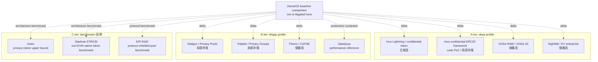
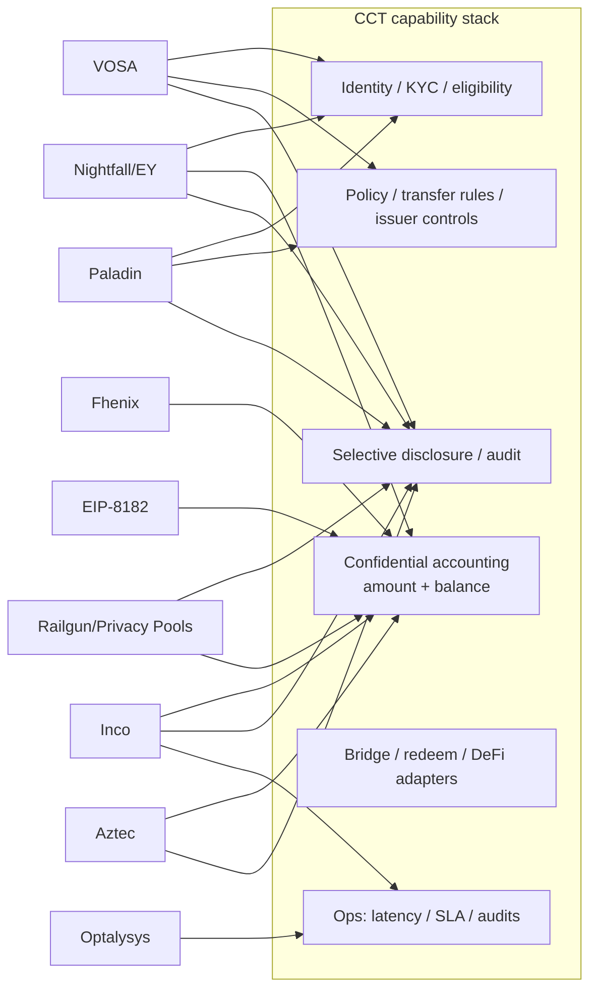

# Confidential RWA 候选方案补充调研

## 执行摘要（Executive Summary）

本 draft 只筛选 Zama 之外的候选方案，不替 WHI-271 做最终路线裁决。初筛结果是：**Inco Lightning / Inco confidential token 路线是最接近 Mantle private RWA / confidential compliance token 的非 Zama 主候选**，原因是它满足轻量 bolt-on、金额/余额隐私、合规披露叙事和 Base 生态近邻；但它把当前信任模型押在 TEE / Intel TDX 与 Inco 网络可用性上，且 Mantle 支持仍需厂商扩展。**VOSA-RWA/VOSA-20、Nightfall/EY 与 Fhenix/CoFHE 是强备选或强参考**，分别代表轻量 exposed-graph 合规草案、企业 ZK rollup 经验、可替换 FHE backend。**Railgun/Privacy Pools、Paladin、Optalysys 是局部补强**，不能直接升格为 RWA token 主路线。**Aztec、Starknet STRK20、EIP-8182 是 C 层 benchmark / 反例**，用于界定隐私上限、非 EVM/非 Mantle 集成代价和协议层路径边界。

强制审查要求在本 draft 中显式落地：所有 `主候选 / 强备选 / 局部补强 / 参考 / 出局` verdict 均由 WHI-266 五维 rubric 驱动，即 `RWA/合规相关性`、`轻量集成可能`、`选择性披露`、`成熟度`、`Mantle 适配`。表中分值为 0-5：0=无证据或不适用；3=可 PoC/部分满足；5=生产级或强证据。Round-2 明确补充：**分数总和不是 bucket 排序器**；先判断候选是否能独立承载一条 CCT route，再用五维分数解释风险与降权。因此 Paladin/Railgun 这类 component-only 候选可以在单项能力上高分，但仍低于 Nightfall/Fhenix 这类 route-capable backup。候选 verdict 是本 issue 的初筛角色，不是路线选择结论。

### 复用 final artifacts 与 commit pins

| 复用 artifact | Commit SHA | 本 draft 复用内容 | 边界 |
|---|---:|---|---|
| `confidential-compliance-token-research/research-sections/requirements-framework/final.md` | `9eb29a150f380f21add9b431b66fea2ee5d12881` | CCT 定义、五维 rubric、Inco PoC/Optalysys 分类边界、Mantle lightweight 约束 | 本 section 不重写 WHI-266 需求框架，只引用 scoring baseline。 |
| `evm-privacy-research/research-sections/erc7984-confidential-token/final.md` | `fdbda370e9e9137890c5bd2deb7752e03d76d0bc` | ERC-7984/OZ confidential token baseline、RWA/Observer/Hooked caveat、Zama comparator | 只作为 Zama/OZ 差异锚点，不把 ERC-7984 当本 issue 的新候选。 |
| `evm-privacy-research/research-sections/confidential-coprocessor/final.md` | `0041e3a1598751a7d121fecc600ba3d6ad42ad05` | Zama/Inco/Fhenix 架构、Inco Base mainnet、Fhenix mainnet-status tension、TEE/FHE/economic trust 差异 | 厂商自报性能、roadmap 和链支持仍需当前一手源确认。 |
| `evm-privacy-research/research-sections/vosa-standards/final.md` | `c9c16b3eb8956584d63efcf2fe155d9acc271f2f` | VOSA/VOSA-20/VOSA-RWA exposed-graph、合规服务方、forum maturity、未审计结论 | 单作者论坛草案，不能作为生产 standard maturity。 |
| `evm-privacy-research/research-sections/zk-shielded-pool/final.md` | `788453b4097f37003337b943bcf6d7f8f68b02ba` | Railgun、Privacy Pools、STRK20 的 shielded-pool / association-set 结论 | 不重复完整 shielded-pool landscape，只抽取 RWA/CCT 相关 fit/gap。 |
| `evm-privacy-research/research-sections/zk-privacy-chain-aztec/final.md` | `eceaef1e1b4f7a17d7fc3eb4dd91560207f40629` | Aztec privacy-native L2 upper-bound、非 EVM/非轻量 caveat | 仅作为 C 层 benchmark。 |
| `evm-privacy-research/research-sections/eea-enterprise-benchmark/final.md` | `1eac19ed837c8e9a4df1bb1594d5b23cc5a2e9f0` | Nightfall/EY、Paladin/Privacy Groups、enterprise privacy benchmark | 不采用其中任何路线裁决，只复用企业隐私能力/约束。 |
| `evm-privacy-research/research-sections/privacy-eips-survey/final.md` | `957773b13b2f5a66354ccda4b7d0c79a7236b222` | EIP-8182、Privacy Pools、标准层 EIP 边界 | EIP 动态信息以 2026-06-24 当前源补充。 |

### 候选分层 profile 表

| 候选方案 | 层级 | candidate_role | protected_data | compliance_capabilities | disclosure_vector | deployment_shape | maturity_status | evidence_weight | audit_coverage | 与 Zama 的差异 | 关键 gap |
|---|---|---|---|---|---|---|---|---|---|---|---|
| Inco Lightning / Inco confidential token/RWA route | A | 主候选 | 金额、余额、部分合约状态；地址/交易图仍公开 | programmable access、confidential ERC20/Circle 叙事、ERC-3643 association 相关叙事；发行方强制动作需方案化 | Inco-style access control / re-encryption；scope 与 revocation 需厂商确认 | bolt-on confidential layer / TEE_network；当前 Base mainnet | mainnet_single_chain_vendor; vendor_claimed_Trail_of_Bits_audit; Atlas_FHE_roadmap | official_primary + direct_reuse + vendor_self_report | Trail of Bits 审计声明在 Inco 页面上为自报；本 draft 未固定任何公开报告/范围；未经独立核实 | 比 Zama 更像低延迟 TEE layer，当前 Base 近邻强；但少了 Zama/OZ RWA extension 的成熟合规合约栈 | Mantle chain support、TEE threat model、force-exit、public audit report/SLA package |
| Inco confidential ERC20 framework code PoC | A | 局部补强 | encrypted balances、encrypted transfer amounts；sender/receiver linkage 仍保留 | `Identity`、`ExampleTransferRules`、admin view、blacklist/age/limit 示例 | owner/admin TFHE allow + user re-encryption；无生产级审计日志设计 | wrapper + FHE contracts，运行于 Rivest/fhEVM 风格测试环境 | **unaudited_poc；非生产级成熟度证据** | **engineering_poc_not_production；code_analysis；must_not_be_used_as_production_evidence** | README 明确写明未审计、仅为概念验证；无公开审计固定记录 | 与 Zama/OZ 类似 FHE token shape，但更窄、更 PoC；可借鉴 module split | README 明确 not audited/proof of concept；缺 failure semantics、ACL revocation、upgrade/security |
| VOSA-RWA / VOSA-20 | A | 强备选 | 金额、余额、stealth recipient identity；transfer graph 被刻意暴露 | compliance service attestation、RWA compliance-gated entrances、auditing extension | auditor memo / off-chain compliance proof；残留 graph 泄漏是结构性的 | contract-only ZK wrapper / fat token；无新链 | forum_draft; unaudited; no known mainnet | direct_reuse + community_primary + unverified_self_claims | 既有 final 将其归类为单作者论坛草案、未审计；无公开审计固定记录 | 比 Zama 更轻、合规友好但隐私弱；不是 FHE/confidential accounting backend | single author、论坛验证为零或很低、freeze/force-transfer 弱点 |
| Nightfall / EY enterprise | A | 强备选 | 面向 ERC20/ERC721/ERC1155/ERC3525 的私密 token transfer；业务身份由 X.509 绑定 | decentralized permissioning / certificate gating；企业披露控制 | x509 identity + 企业审计/访问模型 | ZK-ZK rollup/operator stack | public_domain_experimental_code; enterprise_pilot_reference | official_primary + code_pin + direct_reuse | CE repo 警告为实验性/无重大价值；本 draft 未为该路线固定公开审计 | 比 Zama 更偏企业 rollup/payment rail，不是 Mantle contract-only token standard | operator stack、不是直接的 RWA token framework、CE repo 中的实验性警告 |
| Railgun + Privacy Pools | B | 局部补强 | transaction graph/source link 隐藏在 pool 内部；余额藏于 shielded notes | PPOI、association sets、ASP screening、viewing key readout | user viewing key、PPOI、ASP roots；ragequit/association-set 治理注意事项 | shielded pool contracts + wallets + relayers/ASP | Railgun 相对成熟的 app；Privacy Pools 早期/合规导向 | official_primary + direct_reuse + code_pin | 本 draft 未为组合 RWA/CCT 用例固定公开审计；即便有 pool 审计，也不能证明 issuer lifecycle 适配 | 比 Zama 更强 anonymity set/graph privacy；缺 issuer token lifecycle controls | RWA issuer freeze/redeem 不匹配、pool UX、监管接受度 |
| Paladin / Pente Privacy Groups | B | 局部补强 | 业务工作流、私密 EVM world state、通过 domain 实现的私密 token | known-party workflows、私密审批、notary/ZK token domains | privacy group 参与方之间的选择性数据共享 | client/runtime + privacy domains；未改动的 EVM base ledger | active LFDT open source；企业框架，非 CCT standard | official_primary + code_pin + direct_reuse | 本 draft 未为 Paladin/Pente 作为 CCT 组件固定公开审计报告 | 比 Zama 更适合 enterprise workflow/state privacy；不像 value-level confidential token backend | 较重的 client/runtime、privacy group 运维、token ledger standard gap |
| Fhenix / CoFHE | B | 强备选 | encrypted contract variables 与 token state；地址/图通常公开 | 基础 `FHE.allow`/sealed outputs；RWA 合规模块较弱 | permit/sealed outputs；revocation 与 audit 模型未充分定义 | bolt-on FHE coprocessor；Base Sepolia 支持；mainnet 状态混杂 | testnet_or_early_limited; mainnet_support_coming_soon_in_docs | official_primary + code_pin + direct_reuse | 本 draft 未固定公开生产审计报告；安全态势仍为 gap | 与 Zama 同为 FHE coprocessor family，但走 economic security/EigenLayer 路线且合规生态更弱 | mainnet production proof、compliance extension set、audit/security posture |
| Optalysys / LightLocker / photonic FHE | B | 参考 | 非 token 隐私模型；用于 encrypted compute/RWA metadata 的性能参考 | 作为 token standard 无合规能力；可能支持 infra 级机密性主张 | 作为 CCT disclosure design 无能力 | hardware_reference / FHE acceleration | vendor_self_report; performance_reference | performance_reference + vendor_self_report + limited_secondary | 在协议层并非 Zama 竞争者；更多是 Zama/FHE 生产化的输入 | 本 review 无独立 benchmark、无 token standard、依赖硬件运维 |
| Aztec | C | 参考 | private smart contracts、private state、notes、transaction data | app 自定义；合规须在 Aztec stack 上构建 | app 专属 viewing/disclosure；隐私强但属新 VM | native privacy L2 / 非 EVM VM | active privacy L2；非 Mantle bolt-on | official_primary + direct_reuse | 隐私上限高于 Zama 仅 token 的用例；但需要 Aztec app/bridge/VM | 非 EVM、新链/流动性、非 phase-1 Mantle 特性 |
| Starknet STRK20 | C | 参考 | Starknet 上的私密 token 余额/转账 | 声称内建合规/viewing keys；生态早期 | viewing-key 风格；细节仍处早期 | Starknet/Cairo native privacy token framework | early mainnet/已宣布能力 | official_primary + direct_reuse + secondary_current | 另一技术栈上 native privacy token 的 benchmark，不是 Mantle EVM bolt-on | Cairo/Starknet 迁移、成熟度/审计清晰度 |
| EIP-8182 | C | 参考 / phase-1 出局 | 通过协议 shielded pool 实现的私密 ETH/ERC20 transfer | 声称以 Privacy Pools 兼容为方向，具体合规待定 | protocol 级 shielded pool；auth-verifier 灵活性 | protocol_hardfork/system_contract | Draft EIP / 协议提案 | official_spec + direct_reuse | 相比 Zama token 合约可能有更强的共享匿名性，但需 Ethereum 协议激活 | hardfork 依赖、非 Mantle 即时路线、无 RWA issuer controls |

## 逐项发现（Item Findings）

### item-1: 研究边界、复用输入与候选纳入规则

WHI-266 将 CCT 定义为 `compliance token + confidential accounting + selective disclosure + auditability + bridge/redeem/DeFi interoperability`，并警告不应对通用隐私 token 或通用合规 token 过度打分。因此本 section 只在候选方案至少回答以下某一个 CCT 问题时才纳入：

- 它是否在 token 或 RWA 生命周期中保护金额/余额/accounting 数据？
- 它是否保留 issuer/监管控制与选择性披露？
- Mantle 能否在不引入新链、新桥、协议硬分叉、完整隐私节点栈或非 EVM 迁移的前提下集成它？
- 证据是生产级、代码级、草案级，还是厂商自报？
- 它能否在不替 WHI-271 做决策的前提下产出可复用的输入？

被复用的 `evm-privacy-research` finals 只有在被以完整路径与 commit SHA 引用时，才作为 commit-pinned 硬输入处理。当前外部 URL 被视为 2026-06-24 访问的时点性来源；厂商 roadmap、合作关系与 benchmark 主张除非有独立代码、审计或链上数据支撑，否则一律标注为 vendor/self-reported。

### item-2: A 层候选一 - Inco confidential token/RWA 方案与代码级 PoC

#### 2.1 Inco 产品路线（Inco product route）

Inco 是最强的非 Zama 主候选输入，因为其当前产品口号直接对齐「在标准 Solidity 里构建 confidential apps」，并有 Base-mainnet 可用性信号。Inco 的 Base mainnet 公告 `https://www.inco.org/blog/inco-lightning-live-on-base-mainnet` 日期为 2026-06-15，称 Inco Lightning 已在 Base mainnet 上线；更早的 Base Sepolia 上线页面锚定了 testnet 阶段。同一公告称 Inco Lightning 经过 Trail of Bits 的大量审计，但本 draft 在固定到一份公开审计报告或委托范围之前，将其视为 vendor/source-page 主张。这与 `evm-privacy-research/research-sections/confidential-coprocessor/final.md` @ `0041e3a1598751a7d121fecc600ba3d6ad42ad05` 一致——该 final 将 Inco Lightning 归类为 TEE-first、当前 Base-mainnet 支持，Atlas/FHE 仍处 roadmap。

对 Mantle 而言，这一点有吸引力，因为集成形态不是 native chain 也不是 hardfork。但从治理角度看，它并不自动比 Zama「更轻」：Inco 把核心信任叙事从 Zama 式的 FHE/MPC/KMS 转向 TEE 硬件、callback relayers 和 vendor-operated confidential compute。对短延迟试点这可能更容易，但对面向监管的安全叙事可能更难，除非 TEE node set、attestation 证据、SLA 和失败恢复都是显式的。

#### 2.2 Inco confidential ERC20 framework 代码级 PoC（code-level PoC）

固定代码来源：`https://github.com/Inco-fhevm/confidential-erc20-framework` @ `bb39e4f788742121f2fc93de33af58758360545b`（2024-11-21，2026-06-24 本地核实）。

README 说明该设计将 ERC20 token 转换为隐藏余额和交易金额的 confidential 形态，保留 sender-receiver linkage，并为合规或风险管理添加可选的 viewing/transfer rules。README 同时声明该仓库未经审计、仅作为概念验证；这正是 profile 表将其标为 `maturity_status=unaudited_poc` 和 `evidence_weight=engineering_poc_not_production` 的原因。

代码模块：

| 模块 | 角色 | CCT 相关性 | 注意事项 |
|---|---|---|---|
| `contracts/ConfidentialERC20/ConfidentialERC20.sol` | 使用 `euint64`、`TFHE.select`、`TFHE.allow`、加密 allowance 与加密 transfer value 的核心 encrypted-balance ERC20 风格实现 | 展示了余额/金额的 confidential accounting 形态 | 不发出普通 ERC20 transfer value；地址图仍可见；失败时常选择 zero-transfer 而非普通 revert 语义。 |
| `contracts/ConfidentialERC20Wrapper.sol` | 将现有 ERC20 包装为 confidential token，支持 `wrap()` 与通过 Gateway 解密 callback 的异步 `unwrap()` | 对现有 RWA/stablecoin 资产的直接 bridge/redeem 类比 | decimals <= 6 约束、异步 burn callback、unwrap disable hook，但无完整的法律 redeem/failure 模型。 |
| `contracts/CompliantConfidentialERC20/CompliantConfidentialERC20.sol` | 在加密 transfer 之前应用 transfer rules，并有 `adminViewUserBalance()` | 展示了 policy hook + admin viewing 模式 | 中心化 owner 可见性不足以构成审计/披露治理。 |
| `contracts/CompliantConfidentialERC20/Identity.sol` | 存储加密 DOB 并计算 age checks | 演示加密凭证字段与 policy predicate | 仅为示例 identity；不是 KYC/AML/claims registry。 |
| `contracts/CompliantConfidentialERC20/ExampleTransferRules.sol` | Blocklist + 最小年龄 + 加密金额上限 | 演示在加密金额之上组合 transfer policy | 仅为示例；无 sanctions oracle、jurisdiction routing、治理或审计日志。 |
| `test/ComplianceTests/CompliantERC.ts` | 测试 mint、加密 transfer、transfer rules 与 blacklist 路径 | 演示预期的 PoC 行为 | 测试覆盖率不是生产级审计证据。 |
| `test/ConfidentialWrapperTests/ConfidentialWrapper.ts` | 测试 wrap、confidential transfer 与 unwrap | 与 RWA wrap/unwrap PoC 直接相关 | 不构成生产级 bridge/redeem 控制。 |

PoC 契合度：对工程灵感而言高，对生产成熟度而言低。Mantle 可在后续 PoC 中复用其模块边界：wrapper、confidential token core、transfer-rule 合约、identity/credential 合约、delegated/admin viewing，以及异步 redeem/burn callback。Mantle 不得将该仓库作为安全证据复用。

### item-3: A 层候选二 - VOSA-RWA/VOSA-20 与 Nightfall/EY enterprise confidential token

#### 3.1 VOSA-RWA / VOSA-20

VOSA 是有用的 A 层对照项，因为它刻意做到合规友好且轻量。已接受的 final `evm-privacy-research/research-sections/vosa-standards/final.md` @ `c9c16b3eb8956584d63efcf2fe155d9acc271f2f` 发现，VOSA 通过 stealth-address 风格的用法隐藏金额、余额和真实世界身份，但刻意暴露 VOSA-to-VOSA transfer graph。VOSA-RWA 增加了由 off-chain 合规服务与 proof 流程支撑的 compliance-gated 操作。相关的一手论坛来源包括 VOSA-20（`https://ethereum-magicians.org/t/draft-erc-vosa-20-privacy-preserving-wrapped-erc-20-token-standard/27832`）和 VOSA-RWA（`https://ethereum-magicians.org/t/draft-erc-vosa-rwa-compliance-gated-privacy-token-for-real-world-assets/27908`）。

契合度：VOSA 比 Inco/Zama/Fhenix 更轻，因为它更接近纯 contract/circuit 应用逻辑，并避开了 confidential compute 网络。若 Mantle 更看重「通过 exposed graph 实现的 auditability」而非更强的 transaction-graph privacy，它是一个强备选概念。它应从主候选降级，因为其成熟度为 forum-draft、单作者、未审计，无已知 mainnet 部署，且在 one-time-address 模型下围绕 freezing/force-transfer 存在结构性限制。

#### 3.2 Nightfall / EY 企业方案（enterprise）

Nightfall 不是 CCT token standard，但它是最佳的 A 层企业隐私经验来源。EY 的 technology 页面将 Nightfall 描述为面向 public Ethereum 及 EVM 兼容链做私密交易的 ZK-ZK rollup，并带 decentralized permissioning，因为当交易私密时对手方必须接受审查。EY 2025 newsroom 文章称 Nightfall_4 以 ZK rollup 架构替换前一版本，并采用 public-domain 源代码。Nightfall_4 CE GitHub README 称它支持 ERC20、ERC721、ERC1155 和 ERC3525 token 的私密转账，同时警告 community edition 应被视为实验性、不应用于重大价值。

固定代码来源：`https://github.com/EYBlockchain/nightfall_4_CE` @ `e3203ea24bd302222f2e071876d756eb66b1e67c`（通过 `git ls-remote` 核实，2026-06-24）。

契合度：Nightfall 是企业身份、X.509/permissioning、审计与运维设计的强备选/参考。它不是 Mantle phase-1 主候选，因为它意味着 rollup/operator 架构和 private-transfer rail，而非可直接部署在 Mantle 上的轻量 CCT 合约标准。

### item-4: B 层候选 - Railgun/Privacy Pools、Paladin/Privacy Groups、Fhenix/CoFHE、Optalysys

#### 4.1 Railgun / Privacy Pools

Railgun 与 Privacy Pools 应被视为合规披露补充，而非 RWA token standard。Railgun 文档将 Private Proofs of Innocence 描述为一套使用公开链上 bad-actor 数据集、同时不暴露用户余额/活动的 ZK 保证系统；L2BEAT 也指出 Railgun viewing keys 可向监管者或执法者暴露已发送/接收的私密交易，而协议层合规并未被直接强制执行。Privacy Pools 文档称用户存入资产后在不带链上 deposit-withdrawal 关联的情况下提款，同时由 Association Set Provider 维护已批准的存款并发布 roots；0xbow 将 ASP 定位为合规工具。

固定代码来源：`https://github.com/0xbow-io/privacy-pools-core` @ `a80836a47451e662f127af17e11430ffa976c234`（通过 `git ls-remote` 核实，2026-06-24）。

契合度：这些工具对 `source-of-funds` 证明、association sets、viewing-key 披露和 anonymity-set 设计有用。它们不足以支撑 issuer-controlled RWA token 生命周期，因为 pool 模型是 asset-flow privacy，而非 issuer policy、freeze/recovery、redemption、omnibus accounting 或 investor eligibility。

#### 4.2 Paladin / Privacy Groups

Paladin 有价值，因为它瞄准在未改动的 EVM 链上实现企业级可编程隐私。LFDT 与 Paladin 文档描述了通过 Pente 实现的 privacy groups、private token domains、ZKP/notary 支撑的 token 模型、private smart contracts 与 atomic workflows。Kaleido 的 Paladin 页面强调可部署到任意未改动的 EVM 兼容链，并保护交易细节/业务逻辑。

固定代码来源：`https://github.com/LFDT-Paladin/paladin` @ `c8ece88ed391e663612c5d51fd9e83289730a816`（通过 `git ls-remote` 核实，2026-06-24）。

契合度：相比一个最小化的 confidential RWA token standard，Paladin 更适合多方机构工作流、DvP/PvP 和业务逻辑隐私。如果 Mantle 的产品目标从单纯的 confidential token ledger 变为私密机构工作流编排，Paladin 会变得更重要。对 WHI-270 而言它仍是 `局部补强`：privacy groups 可补足一条 token route，但引入了更重的 client/runtime 与 domain 协调模型。

#### 4.3 Fhenix / CoFHE

Fhenix 是最接近的 B 层 backend-replaceable confidential compute 候选。其文档将 CoFHE 描述为面向加密计算、支持标准 Solidity 集成的 coprocessor；Quick Start 列出 Ethereum Sepolia、Arbitrum Sepolia 和 Base Sepolia 为受支持的 testnet，并称生产 mainnet 支持即将到来。Fhenix 的 Base 博客称开发者可在 Base 上使用 CoFHE 构建私密 dApp。这造成了来源张力：产品/博客措辞暗示正在积极扩张，而文档仍把生产 mainnet 支持放在 roadmap 中。本 draft 采用保守的 docs-first 状态。

固定代码来源：`https://github.com/FhenixProtocol/fhenix-confidential-contracts` @ `ad03449120a29a900e6c8223347cc5ac8add63c4`（通过 `git ls-remote` 核实，2026-06-24）。

契合度：如果 Mantle 想要一个 Zama/Inco 替代方案并接受 EigenLayer/economic-security 式的假设，Fhenix 可作为强备选 confidential compute backend。它被降级是因为其 RWA 合规模块、成熟度、审计与生产部署证据弱于主候选门槛。

#### 4.4 Optalysys 性能 / 生产化参考（performance / productionization reference）

Optalysys 不是 token standard、不是合规协议，也不是 Mantle 集成路径。纳入它是因为 WHI-266 明确将其归类为 FHE production/performance 参考。Optalysys 当前的 RWA 页面声称 confidential RWA tokenisation 可加密 owner identity 或 asset value 等敏感 metadata。其 RWA 文章将 tokenized RWA 框定为需要机密性才能被机构采用，而其 Zama 合作/photonic acceleration 页面将 Lightmatter 式硬件框定为一条 FHE acceleration 路线。

契合度：对 WHI-271 关于 FHE 延迟、成本曲线、硬件依赖、SLA 归属、部署模型和独立 benchmark 的问题有用。除了提醒 Mantle 任何基于 FHE 的路线都需要可度量的性能预算与运维归属外，它不应影响候选 verdict。

### item-5: C 层架构 benchmark - Aztec、Starknet STRK20、EIP-8182

Aztec 是 privacy-native 应用设计的上限 benchmark。Aztec 文档将其描述为带 private smart contracts 与 private state 的 privacy-first Ethereum L2，同时声明其不兼容 EVM 并使用一套新的 privacy-preserving VM。这使 Aztec 成为「完整 private state 可以是什么样子」的参考，但对 Mantle phase-1 轻量集成而言是反例。

Starknet STRK20 是非 EVM/Cairo 栈上 native privacy-token 能力的 benchmark。Starknet 的 v0.14.2 隐私博客将 STRK20 呈现为面向 Starknet 的 private ERC-20 风格 token privacy，并带合规定位。它作为生态正在把隐私 token 特性纳入链专属 native 框架的证据很有价值。它不是 Mantle 候选，因为它需要 Starknet/Cairo 迁移而非 Mantle EVM 集成。

EIP-8182 是协议层 benchmark。官方 EIP 称它通过在 fork 激活时安装的 shielded-pool system contract 引入私密 ETH 和 ERC-20 transfer，带灵活的 spend authorization，且不新增 precompile/opcode/transaction type。这在架构上很重要，因为它指向一个统一的 privacy pool；但对 Mantle CCT phase 1 而言它出局：它依赖协议激活、本身不解决 issuer controls，应被视为未来 native/private pool 思路的参考设计。

### item-6: 候选分层 profile 表与逐候选 source pack

| 候选方案 | 一手/当前 source pack | 复用 final source pack | 代码 / 版本 pin | 来源置信度 |
|---|---|---|---|---|
| Inco product | `https://www.inco.org/blog/inco-lightning-live-on-base-mainnet`, `https://www.inco.org/blog/inco-lightning-launched-on-base-sepolia`, `https://www.inco.org/blog/circle-research-inco-confidential-erc20-report`, `https://www.circle.com/blog/confidential-erc-20-framework-for-compliant-on-chain-privacy` | `evm-privacy-research/research-sections/confidential-coprocessor/final.md` @ `0041e3a1598751a7d121fecc600ba3d6ad42ad05` | 除 PoC 外未固定产品仓库 | Base 可用性/架构方面中高；审计范围/roadmap/SLA 方面中等 |
| Inco ERC20 PoC | `https://github.com/Inco-fhevm/confidential-erc20-framework`, 本地代码阅读 | `confidential-compliance-token-research/research-sections/requirements-framework/final.md` @ `9eb29a150f380f21add9b431b66fea2ee5d12881` | `bb39e4f788742121f2fc93de33af58758360545b` | 代码事实方面高；生产成熟度方面低 |
| VOSA | Ethereum Magicians VOSA-20/VOSA-RWA 主题帖 | `evm-privacy-research/research-sections/vosa-standards/final.md` @ `c9c16b3eb8956584d63efcf2fe155d9acc271f2f` | 无已审计仓库 pin | 论坛设计方面中等；生产方面低 |
| Nightfall/EY | `https://blockchain.ey.com/technology`, EY 2025 Nightfall newsroom, `https://github.com/EYBlockchain/nightfall_4_CE` | `evm-privacy-research/research-sections/eea-enterprise-benchmark/final.md` @ `1eac19ed837c8e9a4df1bb1594d5b23cc5a2e9f0` | `e3203ea24bd302222f2e071876d756eb66b1e67c` | 企业架构方面高；当前生产契合度方面中等 |
| Railgun/Privacy Pools | `https://docs.railgun.org/wiki/assurance/private-proofs-of-innocence`, `https://docs.privacypools.com/`, `https://docs.privacypools.com/layers/contracts/entrypoint`, `https://0xbow.io/` | `evm-privacy-research/research-sections/zk-shielded-pool/final.md` @ `788453b4097f37003337b943bcf6d7f8f68b02ba`; `evm-privacy-research/research-sections/privacy-eips-survey/final.md` @ `957773b13b2f5a66354ccda4b7d0c79a7236b222` | Privacy Pools core `a80836a47451e662f127af17e11430ffa976c234` | 隐私/合规补充方面中高 |
| Paladin | `https://www.lfdecentralizedtrust.org/projects/paladin`, `https://lfdt-paladin.github.io/paladin/head/`, `https://www.kaleido.io/paladin`, `https://github.com/LFDT-Paladin/paladin` | `evm-privacy-research/research-sections/eea-enterprise-benchmark/final.md` @ `1eac19ed837c8e9a4df1bb1594d5b23cc5a2e9f0` | `c8ece88ed391e663612c5d51fd9e83289730a816` | 工作流隐私方面中高；CCT token 契合度方面中等 |
| Fhenix | `https://cofhe-docs.fhenix.zone/fhe-library/introduction/quick-start`, `https://www.fhenix.io/blog/fhenix-adds-base-support-to-cofhe----expanding-privacy-to-ethereum-l2`, `https://www.fhenix.io/blog/what-is-fhenix` | `evm-privacy-research/research-sections/confidential-coprocessor/final.md` @ `0041e3a1598751a7d121fecc600ba3d6ad42ad05` | `ad03449120a29a900e6c8223347cc5ac8add63c4` | 中等；已明确标注状态张力 |
| Optalysys | `https://optalysys.com/confidential-rwa-tokenisation-blockchain-use-case/`, `https://optalysys.com/resource/real-world-assets-on-blockchain-the-trillion-dollar-opportunity-that-needs-confidentiality/`, `https://optalysys.com/resource/optalysys-and-zama-partnership/` | `confidential-compliance-token-research/research-sections/requirements-framework/final.md` @ `9eb29a150f380f21add9b431b66fea2ee5d12881` | 无协议仓库 | 硬性能主张方面低；对生产问题有用 |
| Aztec | `https://docs.aztec.network/`, `https://aztec.network/` | `evm-privacy-research/research-sections/zk-privacy-chain-aztec/final.md` @ `eceaef1e1b4f7a17d7fc3eb4dd91560207f40629` | benchmark 无需仓库 pin | 架构方面高；Mantle 直接契合度方面低 |
| Starknet STRK20 | `https://www.starknet.io/blog/starknet-v0-14-2-the-privacy-engine-arrives/` | `evm-privacy-research/research-sections/zk-shielded-pool/final.md` @ `788453b4097f37003337b943bcf6d7f8f68b02ba` | 范围内未找到仓库 pin | 中等；生态早期证据 |
| EIP-8182 | `https://eips.ethereum.org/EIPS/eip-8182`, `https://ethereum-magicians.org/t/eip-8182-private-eth-and-erc-20-transfers/27889` | `evm-privacy-research/research-sections/privacy-eips-survey/final.md` @ `957773b13b2f5a66354ccda4b7d0c79a7236b222` | EIP 页面截至访问日期为当前 | 规范文本方面高；部署方面低 |

### item-7: 候选初筛矩阵与 Zama 差异标注

#### 桶位裁决规则（Bucket-decision rule）

本 section 的 bucket 不是五项分数的简单求和排序。分数用于暴露每个候选在 WHI-266 五维 rubric 上的强弱；bucket 则先由 **standalone-route capability** 这个分类门决定，再由分数解释升降级。规则如下：

1. **Route-capable gate**：只有候选能独立承载一条 CCT 路线，才可进入 `主候选` 或 `强备选`。最低要求是：(a) 对 CCT 核心问题有直接答案，即 `RWA/合规相关性 >= 3` 或能作为 confidential-compute backend 支撑 CCT；(b) 有可描述的 Mantle 或 EVM 集成路径，即 `Mantle 适配 >= 2` 且不是必须迁移到另一条链/VM/硬分叉；(c) 不是纯 component、纯性能参考、纯 benchmark 或单一披露工具。
2. **主候选**：route-capable，并且在 RWA/合规相关性、轻量集成、Mantle 适配三项上整体最接近 Mantle phase-1 CCT 需求；成熟度可以有 gap，但必须有当前产品/部署信号。本 draft 只有 Inco Lightning 满足。
3. **强备选**：route-capable，但存在明确降权项，如 maturity 低、集成较重、合规模块不足或安全模型需要额外接受。它们可作为 fallback route、phase-2 route 或路线对照。
4. **局部补强**：候选在若干轴上可高分，但其最佳用途是作为另一条 route 的组件、模块、披露补丁、workflow layer 或 code reference；它不能独立回答完整 CCT route。因此 `局部补强` 可以在 raw score 上高于 `强备选`，因为二者比较的是不同层级：component value vs route capability。
5. **参考**：候选主要提供 architecture/performance/standard benchmark，或反例边界；不应被当作实现路线。
6. **出局**：作为 Mantle phase-1 direct route 需要新链/非 EVM VM/硬分叉/协议 activation，或者缺少 RWA issuer controls。某些候选可同时是 `参考` 与 direct-route `出局`，如 EIP-8182 和 Aztec。

Round-2 一致性核对：保留所有 round-1 verdict 与本规则一致。Paladin/Pente 与 Railgun/Privacy Pools 在原始总分上高于 Nightfall/EY 与 Fhenix/CoFHE，因为它们是强组件/披露/工作流工具，但它们未通过面向 Mantle CCT token route 的 standalone-route gate。Nightfall/EY 与 Fhenix 分数较低是因为集成/成熟度 gap，但仍是 route-capable backup：Nightfall 提供一条连贯的企业 private-transfer/permissioning route；Fhenix 提供一条连贯的 confidential-compute backend route。

| 候选方案 | 原始总分 | Standalone-route gate | 规则结果 | 当前 verdict | 一致性核对 |
|---|---:|---|---|---|---|
| Inco Lightning / product route | 18 | pass：直接的 confidential token/RWA route，EVM/Base 近邻，当前产品信号 | 主候选 | 主候选 | 一致：尽管公开审计未固定、Mantle 支持有 gap，仍是最强的非 Zama standalone route。 |
| Inco ERC20 framework PoC | 14 | fail：代码 PoC/模块参考，不是生产 route | 局部补强 | 局部补强 | 一致：主题契合度高，但 unaudited PoC 不能 route-capable。 |
| VOSA-RWA/VOSA-20 | 17 | pass（带成熟度注意事项）：连贯的轻量 compliance-gated privacy token 概念 | 强备选 | 强备选 | 一致：route-capable 概念，因 forum-draft/未审计状态而降至主候选之下。 |
| Nightfall/EY | 14 | pass（带集成注意事项）：连贯的企业 private-transfer/permissioned rollup route | 强备选 | 强备选 | 一致：因更重的栈/Mantle 契合度而分数较低，但仍 route-capable。 |
| Railgun/Privacy Pools | 15 | fail：披露/source-of-funds pool 组件，缺 issuer token lifecycle route | 局部补强 | 局部补强 | 一致：披露价值高，不是 standalone CCT route。 |
| Paladin/Pente | 16 | 对 token route fail：企业 workflow/privacy group 层，不是最小化 confidential token ledger | 局部补强 | 局部补强 | 一致：工作流价值高，对 WHI-270 范围仅为 component/layer。 |
| Fhenix/CoFHE | 13 | pass（带合规/成熟度注意事项）：confidential-compute backend 可支撑一条 CCT route | 强备选 | 强备选 | 一致：分数较低，但是 route-capable backend 替代方案。 |
| Optalysys | 5 | fail：仅性能/硬件参考 | 参考 | 参考 | 一致。 |
| Aztec | 12 | 对 Mantle phase-1 fail：非 EVM/native privacy L2 | 参考 / direct-route 出局 | 参考 | 一致：仅 benchmark，不是 direct route。 |
| Starknet STRK20 | 10 | 对 Mantle phase-1 fail：Starknet/Cairo native route | 参考 / direct-route 出局 | 参考 | 一致：仅 benchmark。 |
| EIP-8182 | 6 | 对 Mantle phase-1 fail：协议硬分叉/system contract route | 参考 / phase-1 出局 | 参考 / phase-1 出局 | 一致。 |

#### WHI-266 rubric 可追溯矩阵

| 候选方案 | RWA/合规相关性 | 轻量集成可能 | 选择性披露 | 成熟度 | Mantle 适配 | Verdict | 为何纳入 / 降权 |
|---|---:|---:|---:|---:|---:|---|---|
| Inco Lightning / product route | 4 | 4 | 3 | 3 | 4 | 主候选 | RWA/confidential ERC20 叙事与 Base mainnet 近邻强；因 TEE trust、Mantle support 未就绪、Atlas roadmap 限制，不能直接裁决胜出。 |
| Inco ERC20 framework PoC | 4 | 3 | 3 | 1 | 3 | 局部补强 | 代码正中 confidential token + viewing/transfer rules，但 README 明确 unaudited PoC；只可作 PoC module reference。 |
| VOSA-RWA/VOSA-20 | 4 | 5 | 3 | 1 | 4 | 强备选 | 合规门控+轻量强，exposed graph 有监管友好取舍；因论坛草案/未审计/冻结弱点降权。 |
| Nightfall/EY | 3 | 2 | 4 | 3 | 2 | 强备选 | 企业身份、ZK private transfer、permissioning 强；rollup/operator stack 和 CE experimental warning 使其不像 phase-1 Mantle token route。 |
| Railgun/Privacy Pools | 2 | 3 | 4 | 3 | 3 | 局部补强 | PPOI/ASP/viewing key 补足 source-of-funds 和选择性披露；缺 issuer lifecycle controls。 |
| Paladin/Pente | 3 | 3 | 4 | 3 | 3 | 局部补强 | 对企业 private workflow 很强，可部署 unmodified EVM；对 CCT token ledger 不是最短路径。 |
| Fhenix/CoFHE | 2 | 4 | 2 | 2 | 3 | 强备选 | 可作为 backend-replaceable FHE coprocessor；合规模块和 production status 弱于 Inco/Zama。 |
| Optalysys | 1 | 1 | 0 | 2 | 1 | 参考 | 只回答 FHE production/performance constraints，不回答 token standard/compliance/disclosure。 |
| Aztec | 3 | 1 | 4 | 3 | 1 | 参考 | 隐私上限强，非 EVM/新 L2/桥和流动性迁移使 Mantle phase-1 出局。 |
| Starknet STRK20 | 3 | 1 | 3 | 2 | 1 | 参考 | 证明 native privacy token trend，但 Cairo/Starknet 栈不可轻量移植到 Mantle。 |
| EIP-8182 | 2 | 0 | 3 | 1 | 0 | 参考 / phase-1 出局 | 协议层 unified shielded pool 重要，但依赖硬分叉且缺 RWA issuer controls。 |

#### 初筛裁决（Screening verdicts）

| Verdict bucket | 候选方案 | 与 Zama 的差异（delta） | WHI-271 输入，非决策 |
|---|---|---|---|
| 主候选 | Inco Lightning / Inco confidential token route | TEE-first、Base-mainnet，可能更低延迟且产品近邻；密码学信任弱于 Zama/OZ，且 RWA extension 栈成熟度不如 Zama/OZ | 询问 Mantle 是否想要 TEE 支撑的更快 go-to-market 作为 Zama FHE/MPC 的替代。 |
| 强备选 | VOSA-RWA/VOSA-20, Nightfall/EY, Fhenix/CoFHE | VOSA：更轻/exposed graph；Nightfall：企业 ZK rollup；Fhenix：FHE backend 替代 | 用作 fallback route、设计对照，或 phase-2 backend 候选清单。 |
| 局部补强 | Inco PoC, Railgun/Privacy Pools, Paladin | 代码模块、compliance-pool 披露、业务 workflow 隐私 | 借用设计组件；不要单独升格为完整 route。 |
| 参考 | Optalysys, Aztec, Starknet STRK20, EIP-8182 | 性能约束；privacy-native 链上限；非 Mantle token standard；协议 pool benchmark | 用作 benchmark/约束，不是候选实现路径。 |
| phase 1 出局 | 作为 direct route 的 Aztec、STRK20 direct route、EIP-8182 direct route | 新链/VM 或协议硬分叉 | 仅当 Mantle 战略从轻量 CCT 转向 native privacy chain/protocol 特性时再重新考虑。 |

### item-8: Gap Register、降权/出局理由与后续 WHI-271 输入

| Gap | 受影响候选 | 为何重要 | WHI-271 / 后续问题 |
|---|---|---|---|
| Mantle 支持与部署承诺 | Inco, Fhenix | Base 支持不意味着 Mantle 支持；callbacks/finality/relayer/KMS/TEE endpoints 需要链专属证明 | 向厂商索取 Mantle 支持计划、合约、延迟与运维责任。 |
| TEE 信任与 attestation 叙事 | Inco | 机构 RWA 用户可能要求清晰的硬件信任、side-channel、operator 与司法管辖风险处理 | 决定 TEE 支撑的机密性是否可被 Mantle 的合规叙事接受。 |
| FHE ACL revocation 与过度披露 | Zama comparator, Fhenix, Inco PoC | WHI-266/OZ 注意事项：历史访问可能难以撤销；GDPR/最小披露顾虑 | 在任何 PoC 中要求一套 disclosure authority lifecycle 与审计日志设计。 |
| 生产审计态势 | Inco PoC, VOSA, Fhenix, Privacy Pools, Paladin；Inco 产品审计范围 | 未审计或早期代码不能支撑生产级 RWA；Inco 产品页声称有 Trail of Bits 审计，但本 draft 未固定公开报告/范围 | 在生产排名前收集公开审计或界定一次 Mantle 出资的审计范围。 |
| Issuer 生命周期控制 | Railgun/Privacy Pools, VOSA, Nightfall, Fhenix | RWA 需要 freeze、recovery、forced transfer、redemption 与法律 issuer workflows | 将每个候选映射到 ERC-3643 式控制以及 bridge/redeem 事件。 |
| 性能/SLA 证据 | Zama comparator, Inco, Fhenix, Optalysys | FHE/TEE 延迟与可用性影响 UX、市场运作、redemption 与合规监控 | 定义延迟/成本预算；把 Optalysys 当作问题生成器而非证据。 |
| 当前 mainnet 主张的独立验证 | Inco, Fhenix, STRK20 | 厂商/博客主张可能比文档/审计更新得快 | 在最终路线前要求链上地址、合约版本、审计链接和观测到的使用情况。 |

## 架构图（Diagrams）

### diag-1: 候选格局图（Candidate landscape map）



### diag-2: 能力栈对比（Capability stack comparison）



### diag-3: Inco confidential ERC20 PoC 流程（Inco confidential ERC20 PoC flow）

```mermaid
sequenceDiagram
  participant User
  participant BaseERC20
  participant Wrapper as ConfidentialERC20Wrapper
  participant CToken as ConfidentialERC20/CompliantConfidentialERC20
  participant Rules as ExampleTransferRules
  participant Identity
  participant Gateway
  participant Admin

  User->>BaseERC20: approve(wrapper, amount)
  User->>Wrapper: wrap(amount)
  Wrapper->>BaseERC20: transferFrom(user, wrapper, amount)
  Wrapper->>CToken: _mint(user, amount as euint64 balance)
  User->>CToken: transfer(to, encryptedAmount, inputProof)
  CToken->>Rules: transferAllowed(from, to, encrypted amount)
  Rules->>Identity: encrypted age / registration checks
  Rules-->>CToken: encrypted boolean
  CToken->>CToken: TFHE.select(pass, amount, 0)
  CToken->>CToken: encrypted balance updates
  Admin->>CToken: adminViewUserBalance(user)
  User->>Wrapper: unwrap(amount)
  Wrapper->>Gateway: request decryption of enoughBalance
  Gateway-->>Wrapper: _burnCallback(result)
  Wrapper->>BaseERC20: transfer(user, amount)
  Note over Wrapper,CToken: README says unaudited proof of concept; do not use as production maturity evidence.
```

### diag-4: 初筛矩阵流程（Screening matrix flow）

```text
Evidence pack
  ├─ prior final path + commit SHA
  ├─ official URL + access date
  ├─ code repo + pinned commit
  └─ vendor claim / roadmap / gap marker
        │
        ▼
WHI-266 five-axis rubric
  1. RWA/合规相关性
  2. 轻量集成可能
  3. 选择性披露
  4. 成熟度
  5. Mantle 适配
        │
        ▼
Initial role only
  主候选 / 强备选 / 局部补强 / 参考 / 出局
        │
        ▼
NOT WHI-271 final decision
  WHI-271 still chooses route after cross-candidate trade-off,
  vendor validation, security review and Mantle engineering feasibility.
```

## 来源覆盖（Source Coverage）

| 来源要求 | 状态 | 证据 |
|---|---|---|
| src-1 既有 requirements framework | covered | `confidential-compliance-token-research/research-sections/requirements-framework/final.md` @ `9eb29a150f380f21add9b431b66fea2ee5d12881` |
| src-2 既有隐私 finals | covered | 完整 path+SHA 复用表包含 ERC-7984、coprocessor、VOSA、shielded pool、Aztec、EEA、privacy EIPs。 |
| src-3 Inco 一手 | covered | Inco Base mainnet 页、Inco Base Sepolia 页、Inco/Circle 报告、Circle 博客；访问于 2026-06-24。 |
| src-4 Inco 代码分析 | covered | `Inco-fhevm/confidential-erc20-framework` @ `bb39e4f788742121f2fc93de33af58758360545b`，本地代码阅读。 |
| src-5 VOSA 一手 | 通过复用 + URL 覆盖 | 来自 `vosa-standards/final.md` 的 VOSA-20/VOSA-RWA Magicians 帖；本 draft 引用完整 path+SHA。 |
| src-6 Nightfall/EY 一手 | covered | EY technology 页、EY 2025 newsroom、`EYBlockchain/nightfall_4_CE` @ `e3203ea24bd302222f2e071876d756eb66b1e67c`。 |
| src-7 shielded pool 一手 | covered | Railgun PPOI 文档、Privacy Pools 文档/entrypoint、0xbow 网站、Privacy Pools core commit。 |
| src-8 Paladin 一手/既有 | covered | LFDT Paladin 项目页、Paladin 文档、Kaleido 页、GitHub pin、EEA benchmark final path+SHA。 |
| src-9 Fhenix 一手 | covered | CoFHE Quick Start、Base support 博客、Fhenix FAQ、confidential contracts commit pin。 |
| src-10 Optalysys 性能 | 覆盖（带 vendor-label 注意事项） | Confidential RWA 页、RWA 机密性文章、Zama 合作/photonic FHE 材料；除非日后独立验证，否则均为 vendor self-report。 |
| src-11 C benchmark 来源 | covered | Aztec 文档、Starknet STRK20 博客、EIP-8182 官方规范/Magicians 及既有 finals。 |
| src-12 Zama comparator | 通过复用覆盖 | ERC-7984 与 confidential-coprocessor finals；未重复任何新的 Zama landscape。 |
| src-13 审计/安全 | 部分覆盖 | Profile 表现在为每个高于 `参考` 的 bucket 携带逐候选 audit coverage：Inco Lightning 的 Trail-of-Bits 主张为自报/无公开报告固定；Inco PoC 与 VOSA 未审计；Nightfall CE 为实验性；Railgun/Privacy Pools、Paladin/Pente 与 Fhenix 在本 draft 中未为 CCT 用例固定公开审计报告。 |
| src-14 issue 记录 | covered | Multica outline-approved 评论 `b85ef488-71fb-4527-8a86-70aaee2578aa`；round-1 deep-draft dispatch `7f69f0fc-31ff-4e42-8dae-1dca9c5839d6`；round-2 修订请求 `f94717ac-55de-4e8f-b0e4-d2f179ac78a4`。 |

## Gap 分析（Gap Analysis）

1. **如今没有任何 Zama 之外的候选能干净地满足完整 CCT MVP。** Inco 最接近，但其当前路线需要 Mantle 支持与 TEE 治理。VOSA 轻量但不成熟且刻意泄漏 graph。Nightfall/Paladin 偏重企业工作流。Fhenix 是 backend-replaceable，但合规证据薄弱。
2. **Inco PoC 必须保持为工程参考。** 结构化 profile 表明确标注 `maturity_status=unaudited_poc` 和 `evidence_weight=engineering_poc_not_production`；这应保留到 final 及任何 TW synthesis 中。
3. **Optalysys 必须保持为性能参考。** 它为 FHE 硬件/SLA 问题提供信息，但不定义 token 接口、合规控制、disclosure vectors 或 Mantle 集成。
4. **公开审计态势不完整，必须逐候选携带。** 高于参考层的候选在 profile 表中有显式 audit coverage：Inco Lightning 的 Base mainnet 页声称经过大量 Trail of Bits 审计，但这是自报，本处未固定公开报告/范围；Inco PoC 与 VOSA 未审计；Nightfall CE 为实验性；Railgun/Privacy Pools、Paladin/Pente 与 Fhenix 在本 draft 中未为该 CCT 用例固定公开审计报告。这些陈述应进入 TW synthesis，而不应从通用 gap 推断。
5. **当前状态是动态的。** Inco、Fhenix、STRK20 和 EIP-8182 都在变化。最终路线工作必须刷新链部署地址、审计链接和 roadmap 主张，而非依赖营销/博客措辞。
6. **Issuer 生命周期仍是 RWA 的硬 gap。** Privacy pools 和 private chains 可以隐藏流向；CCT 仍需 issuer controls、freeze/recovery/force transfer、redemption、bridge accounting，以及面向监管/issuer 的披露治理。
7. **桶位规则先分类后看数值。** Round-2 明确：`主候选/强备选` 要求 standalone-route 能力，而 `局部补强` 意味着即使原始五维总分更高，也只是 component-only。WHI-271 在将 route 候选与组件比较时应保留这一区分。

## 修订记录（Revision Log）

| Round | 日期 | 变更 |
|---:|---|---|
| 1 | 2026-06-24 | 基于已批准 outline 的初始 deep draft。覆盖全部 A/B/C 候选，新增候选 profile 表、逐候选 x 五维 rubric 可追溯矩阵、带固定 commit 的 Inco 代码级 PoC profile、Optalysys 性能参考 profile、Zama deltas、架构图、来源覆盖与 gap register。纳入强制 outline-review 指引：完整 path+SHA 复用引用、结构化 Inco PoC 未审计警告，以及基于 rubric 的初筛 verdict。 |
| 2 | 2026-06-24 | draft-review `needs-attention` major finding 后的修订。新增显式桶位裁决规则，区分 route-capable 候选与 component-only/reference 候选；为每个 verdict 新增 raw-total + standalone-route-gate 一致性核对，且不改动分数或 verdict；为每个高于 `参考` 的 bucket 新增逐候选 audit coverage，包括将 Inco Lightning 的 Trail-of-Bits 标注为自报/无公开报告固定。 |
