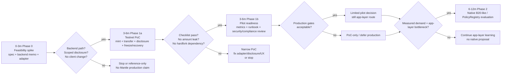
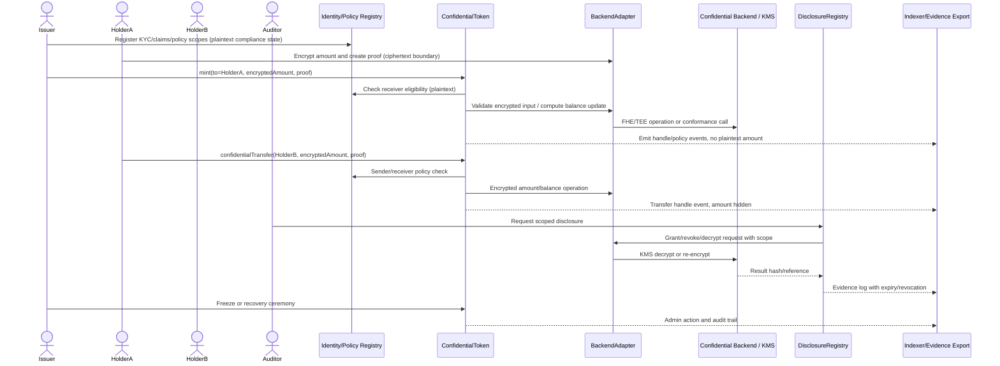
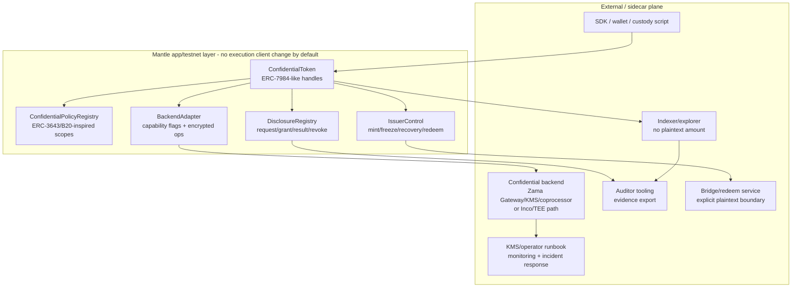
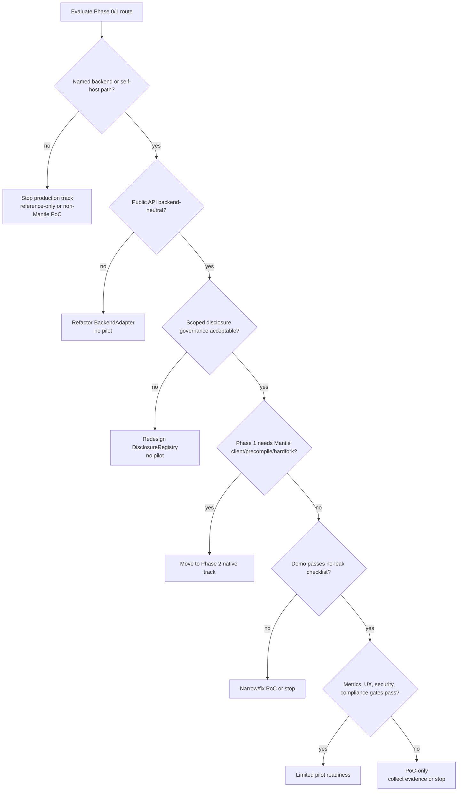

# Mantle 轻量级集成路线与 PoC 计划

## 执行摘要（Executive Summary）

建议 Mantle 把 Confidential Compliance Token（机密合规代币，简称 CCT）拆成 **0-3 个月可停止的可行性冲刺（feasibility spike）**、**3-6 个月窄口径 testnet PoC / 试点就绪（pilot readiness）**、**6-12 个月 native 路线评估** 三段，而不是一开始就改 Mantle execution client、做 precompile 或承诺硬分叉（hardfork）。默认路线是 WHI-272 已定的 application / coprocessor 混合架构：ERC-3643 风格的 identity / policy / issuer controls（发行方控制）+ ERC-7984 / OpenZeppelin 风格的机密价值接口 + 受限范围的 DisclosureRegistry + 可替换的 BackendAdapter。Phase 0/1 不要求 Mantle client change；一旦发现 Phase 1 必须依赖 precompile、hardfork 或双客户端修改，应立即降级为 Phase 2 native track。

PoC 的最小闭环是：KYC/policy onboarding -> 机密 mint -> 机密 transfer -> 受限范围的审计披露 -> freeze 或 recovery ceremony -> 证据导出。它必须能证明金额/余额不会以明文 event、indexer 字段或普通 ERC-20 state 暴露；也必须承认这些非目标（non-goal）:地址图、交易存在性、时间模式、mempool / order-flow、私密身份（private identity）、完整的私密 DeFi 以及生产级 native 加密记账（native encrypted accounting）均不在 Phase 1 的承诺范围内。

关键门槛不是合约能不能写，而是后端成熟度（backend maturity）:Zama / ERC-7984 / OpenZeppelin 路线是最完整的 FHE/机密记账参考，Inco Lightning 是备选/压力测试路径，Inco confidential ERC20 framework 只能作为未经审计（unaudited）的工程 PoC 参考，Optalysys 只能作为 FHE 性能与生产化问题的生成器。任何 Mantle 生产承诺都要先拿到具名后端对 Mantle 的支持路径、自托管方案、KMS/operator 治理、审计版本、latency/cost 数据以及失败恢复（failure recovery）语义。

本 draft 明确解决 outline review 的 minor 注意事项（caveat）:`confidential-compliance-token-research/report/poc-checklist.md` 是 Technical Writer / report packaging 的目标产物。本 section 不在 deep-draft 阶段写 `report/` 文件，而是在 item-8 和 diag-6 中完整输出 checklist 内容、owner、evidence、blocker 和默认状态，供 TW 后续打包成独立的 `poc-checklist.md`，避免交付物被遗漏。

## 逐项发现（Item Findings）

### item-1: 最小 PoC 成功标准与演示闭环

Phase 1 PoC 只证明 Mantle 可以在不改执行客户端的前提下运行一个合规机密代币的最小闭环。它不是 production launch、不是私密 DeFi、不是 native B20 precompile，也不是私密身份系统。

| 能力 | 最小 PoC 标准 | 所需证据 | 通过 / 失败门槛 | 除非显式加入，否则不在范围内 |
|---|---|---|---|---|
| KYC / policy | 通过 ERC-3643 风格的 identity/policy 基底或等效 adapter 检查发送方与接收方的资格。地址、角色、claim topic、blocklist、司法辖区类别与 policy ID 可保持明文。 | 通过与失败的转账用例;policy 配置快照;trusted issuer/claim registry 的 fixture;source anchor。 | 必须通过。若非 KYC 接收方能收到 mint/transfer，或 policy 失败泄露了加密金额谓词（predicate），则失败。 | 私密身份、完全加密的 KYC 事实、匿名接收方验证。 |
| Mint | 授权 issuer 可向合格持有者 mint 加密金额。检查 mint 角色、接收方资格与加密输入证明。 | Tx/log 证据;前后的加密余额 handle;issuer 角色证明;无明文金额 event。 | 必须通过。若 mint 需要 native precompile，或在 event/indexer 中泄露金额，则失败。 | Native mint precompile、超出 PoC handle 检查的全局机密供应量证明。 |
| 机密转账 | 合格持有者可在不泄露金额或余额明文的前提下转移加密金额。明文身份规则可 revert;加密金额规则必须使用 backend 安全的 select/zero-transfer/选择性披露，否则视为不支持。 | 转账 trace;前后的加密 handle;显示无金额字段的 indexer 样本;针对不合格接收方的负向测试。 | 必须通过。若转账金额出现在公开 logs 中，或谓词相关的 revert 泄露了加密比较结果，则失败。 | 隐藏地址图、时间、event 存在性、公开 calldata 元数据、mempool 隐私。 |
| 审计披露 | 授权的 auditor/issuer/regulator 流程可请求受限范围的披露，并记录请求/授予/结果引用。范围包括 actor、trigger、payload、过期时间、撤销状态与残余泄露。 | 披露请求;批准 log;backend decrypt/re-encrypt 或公开 decrypt 证据;结果 hash/引用;过期/撤销 log。 | 至少对一个受限范围的账户或转账 payload 必须通过。若披露是无界的历史 viewing key，则失败。 | 全历史 viewing key、未记录日志的 regulator 超级权限、匿名审计。 |
| Freeze / recovery | 定义并可演示最小的 freeze 或 recovery ceremony。至少有一个必须在 PoC 中可执行;另一个可作为延后项，附带法律理由与测试 stub 进行记录。 | Freeze/recovery 交易;admin 角色证明;审计轨迹;失败语义;持有者影响说明。 | freeze/recovery 二者之一必须通过。若 issuer 能在无 log 的情况下静默扣押或解密余额，则失败。 | 生产级法院命令工作流、多司法辖区争议自动化。 |
| 失败 / 降级模式 | Backend 中断、披露拒绝、policy 失败、畸形证明与 indexer 滞后均有记录在案的结果。 | 人工 runbook;失败测试或模拟中断;重试/回滚说明;监控告警样本。 | 必须在 runbook/test 层面通过。若中断可造成未记录日志的状态分歧，则失败。 | 自动化生产事件管理。 |
| Source trace | 每条实质性主张都映射到固定的本地 final、官方 URL/访问日期，或 Mantle 本地代码路径/commit。 | item-7/source coverage 中的证据映射。 | 必须通过 review。 | 把未引用的 vendor 叙述当作证据。 |

最小演示脚本:

1. 针对所选 backend 或 mock-real 一致性测试框架（conformance harness）部署 identity/policy fixtures、CCT contracts、disclosure registry 与 BackendAdapter。
2. 注册 issuer、合规官、auditor、recovery/freeze admin 与两个持有者;一个持有者合格，一个不合格。
3. 向合格持有者 mint 加密金额;在 events/indexer 中仅显示加密 handle，无明文金额。
4. 向合格接收方执行机密转账;向不合格接收方执行失败的转账。
5. 针对一笔转账或账户窗口请求受限范围的审计披露;授予;取回 decrypt/re-encrypt 结果;记录过期/撤销。
6. 执行 freeze 或 recovery ceremony;捕获 admin 角色、范围、结果与审计轨迹。
7. 触发一条 backend 失败或被拒披露路径;展示失败即拒绝（fail-closed）行为与 runbook。

Source anchors: `mantle-protocol-design/final.md` @ `0a058bd286ab95d3a1ff7b76421a9e8627b675b4` §§Executive Summary, item-2, item-5, item-7; `zama-confidential-rwa/final.md` @ same base commit §§2-5; `compliance-token-private-extension/final.md` @ same base commit §§1, 4, 6; ERC-7984 EIP 与 ERC-3643 EIP 访问于 2026-06-24。

### item-2: Phase 0/1 轻量级集成路线

Phase 0/1 应有意保持在应用层（application-level）。Mantle 工程团队负责合约与集成的清晰性;机密计算 backend 可以是合作伙伴或自托管栈，但其细节必须保留在 `BackendAdapter` 之后，以便未来的 Zama/Inco/native 替换仍然可行。

| Phase | 时间窗口 | 目标 | 交付物 | Go/no-go 门槛 | Chain change class |
|---|---:|---|---|---|---|
| Phase 0 | 0-3 个月 | 可行性冲刺与设计冻结。在构建试点 UX 之前决定 Mantle 是否有可信的 backend 路径。 | PoC spec;backend 选型备忘录;BackendAdapter 接口;policy/disclosure 权限矩阵;mock 披露服务;威胁模型;source trace map;演示脚本骨架;成本估算 v0。 | 仅当存在具名 backend 支持路径、自托管路径，或有界的非 Mantle 验证目标时方可推进。若均无，停止生产 track，仅保留设计/参考。 | `no_chain_change` + `sidecar_operator_dependency` |
| Phase 1a | 3-6 个月 | 带最小闭环的 testnet PoC。 | Contracts;SDK demo;KYC/policy fixture;mint/transfer/disclosure/freeze 或 recovery 测试;indexer dashboard;wallet/custody 脚本;backend 一致性日志。 | Demo 通过 item-1 checklist;未发现 hardfork 依赖;logs/indexer 中无明文金额泄露。 | `app_integration` |
| Phase 1b | 3-6 个月 | 试点就绪评估，默认并非 production launch。 | 安全审查范围;operator/KMS runbook;p50/p95/p99/成本测量;wallet/indexer UX 验收;事件演练;合规备忘录。 | 仅当 backend 治理、披露证据、latency/cost、UX 与安全范围可接受时继续。否则保持 PoC-only。 | `app_integration` + `sidecar_operator_dependency` |
| Phase 2 评估 | 6-12 个月 | 决定 native Mantle 集成是否值得一份独立的协议提案。 | Native 选项评分卡;client/precompile 可行性检查;治理/分叉/审计成本;来自 PoC 的产品需求证据。 | 仅当 Phase 1 指标显示真实需求与应用层瓶颈时，才开启独立的 native 提案。 | `client_or_hardfork_required` |

建议的 Phase 0 合约/API 包:

| 组件 | Phase 0 形态 | Phase 1 PoC 形态 | 不得泄露 |
|---|---|---|---|
| `ConfidentialToken` | 使用不透明 `bytes32`/`bytes` 加密 handle 的 ERC-7984 风格接口。 | Mint、transfer、余额 handle、freeze/recovery hook、disclosure hook。 | Backend 专属的 `euint`、Inco callback 形态、native precompile selector。 |
| `ConfidentialPolicyRegistry` | 受 ERC-3643/B20 启发的 policy ID、identity claims、scopes、版本化。 | 发送方/接收方/mint 接收方/operator/disclosure scopes;明文地址规则;加密金额规则仅在 backend 安全时使用。 | 错误地宣称 B20/PolicyRegistry 本身就能提供机密性。 |
| `DisclosureRegistry` | 请求/授予/结果/过期/撤销生命周期。 | Auditor 请求、issuer/合规批准、decrypt/re-encrypt 结果引用、导出。 | 无界 viewing key 或未记录日志的历史访问。 |
| `IssuerControl` | 对 issuer、合规、freeze、recovery、auditor admin、policy admin 的角色拆分。 | Mint/burn/freeze/recover/redeem stubs;在可行处采用 multisig/timelock。 | 单一 owner 拥有静默扣押/解密的权力。 |
| `BackendAdapter` | 能力标志（capability flags）、加密输入校验、compute/decrypt 请求、grant/revoke、health/SLA hooks。 | 用于 mint/transfer/disclosure 的真实或一致性 backend;mock 中断。 | 在公开 CCT 接口中暴露 vendor 专属类型。 |
| SDK/demo | 加密金额、提交证明、解码加密 handle、请求披露、导出证据。 | CLI 或最小的 web/custody 脚本。 | 前端日志中持久化明文金额。 |

Phase 0 中的 backend 选型:

| 候选 | 在本路线中的用途 | 原因 | Phase 1 之前的门槛 |
|---|---|---|---|
| Zama fhEVM + OpenZeppelin Confidential Contracts | 主架构与 PoC 参考路径。 | 对 ERC-7984 风格加密余额、ACL、Gateway、KMS 与 RWA 扩展而言，是最强的标准与实现面。 | 验证 Mantle host-chain 支持，或自托管 Gateway/KMS/coprocessor 的可行性;固定 OZ 版本/审计状态;测量 policy/decrypt 延迟。 |
| Inco Lightning | 若能取得 Mantle 支持，则作为 backup/backend 压力测试;若无 Mantle 支持，则作为 Base 对齐的有界 PoC。 | 提供独立的 TEE/机密计算路线与工程对比。 | 取得官方 Mantle 支持声明、TEE attestation/liveness 模型与披露语义。 |
| Inco confidential ERC20 framework | 仅作工程 PoC/测试/接口灵感参考。 | 既有研究将其归类为未经审计的概念验证，含有用的 wrapper/委托查看（delegated-viewing）/转账规则形态。 | 不要复制进生产;仅作为测试结构参考。 |
| Optalysys | 仅作性能/生产化问题生成器。 | 对 FHE 吞吐、数据搬运与加速问题有用。 | 切勿当作 CCT 路线、标准、Mantle 集成证明或基准证明。 |

Source anchors: `route-comparison/final.md` @ `0a058bd...` §§2.4, 5, 6, 8; `requirements-framework/final.md` @ `0a058bd...` §§5, 6; Zama docs (`https://docs.zama.org/protocol/protocol/overview`, `/gateway`, `/kms`, `/solidity-guides/smart-contract/acl`) 访问于 2026-06-24; OpenZeppelin Confidential Contracts docs 访问于 2026-06-24; Inco docs 访问于 2026-06-24。

### item-3: Phase 2 native B20-like / PolicyRegistry precompile 评估

Native Mantle 工作应被视为独立的协议计划。若 PoC 证明了需求且应用层执行是瓶颈，它可能有价值，但它不属于轻量级 Phase 1 计划。

| Native 选项 | 评估触发条件 | 所需证据 | 预期成本面 | 默认处置 |
|---|---|---|---|---|
| B20 风格代币 precompile | Phase 1 显示需求，且应用层 gas/UX/标准化是真正的瓶颈。 | 产品 spec;B20 类比;Mantle op-geth/reth/revm precompile 面;fraud-proof/op-program 影响;双客户端一致性计划;安全模型。 | 执行客户端修改、分叉激活、审计、治理、indexer/explorer 更新、SDK/wallet 更新。 | 仅 Phase 2。 |
| PolicyRegistry precompile | Policy 语义跨 issuer 趋于稳定并被反复复用。 | 稳定的 policy 词汇、升级规则、storage/API 模型、失败语义、与 ERC-3643 风格 identity 及披露日志的兼容性。 | 协议治理、storage/API 固化、合规责任、客户端测试。 | 仅 Phase 2。 |
| Native 加密记账 | 外部 backend 的 latency/cost/operator 依赖不可接受，但 CCT 需求已被验证。 | 密码学 backend spec、precompile/API 设计、密钥治理、加密 state 可用性、披露路径。 | 高昂的密码学、协议、安全、运维与治理成本。 | 长期研究，而非 6 个月试点。 |
| 协议级 disclosure registry | 应用层披露日志证明有用，但不足以满足监管证据要求。 | 法律/审计要求、撤销模型、留存/导出策略、隐私影响、治理负责人。 | 链级数据留存承诺与法律审查。 | Phase 2 候选。 |
| Native bridge/redeem adapter | 试点需要链级结算/unshield 集成。 | Bridge/redeem 法律流程、明文边界、储备记账、失败恢复、bridge 安全审查。 | Bridge/安全/责任面;运维与托管。 | PoC 之后的独立提案。 |

当前本地 Mantle 代码检查:

| Repo 路径 | Commit SHA | 检查的文件 / 方法 | 对本 draft 的结果 |
|---|---|---|---|
| `/Users/whisker/Work/src/networks/mantle/op-geth` | `3c1c571e57874019991f28fe99c36cddac7b4bef` | 针对 `B20`、`PolicyRegistry`、`ActivationRegistry`、`ERC7984`、`FHE`、`fhEVM`、`ConfidentialToken`、`DisclosureRegistry` 的定向 `rg`;`core/vm/contracts.go` 与 `core/vm/evm.go` 中的通用 precompile 面。 | 对这些 CCT 术语的搜索仅在 tests/assets/crypto 常量中产生通用误报;在此有界扫描中未发现 CCT/B20/PolicyRegistry/ERC-7984 的 native 面。 |
| `/Users/whisker/Work/src/networks/mantle/revm` | `bcf1a6ab0e6cc15f15697df107dd1276bcfea703` | 相同的定向关键字扫描;`crates/precompile` 下的 precompile 管线;repo 中的 fork/spec 标签。 | 无定向的 CCT/B20/PolicyRegistry/ERC-7984/FHE 命中。存在通用的 revm precompile 管线，但那不是产品路线。 |
| `/Users/whisker/Work/src/networks/mantle/reth` | `a881fee21317f8156a150b99e4bf3db5804a39f4` | 相同的定向关键字扫描;Mantle chain-spec 区域如 `mantle-reth/crates/chainspec/src/`;通用自定义 precompile 测试面。 | 仅在 Ethereum 测试中出现无关的、形似 B20 的 hex/测试数据命中;未发现 CCT/B20/PolicyRegistry/ERC-7984/FHE 的 native 面。 |

解读:这 **不是不存在的证据（not evidence of absence）**，也不裁定未来治理。它只支持以下有界主张:对当前本地 checkout 的检查未揭示一条 Phase 1 可以假定的、既有的 Mantle 原生 B20/CCT 机密 precompile 路径。任何 hardfork 时间表或 native 路线就绪状态都必须来自 Mantle 治理/发布文档与独立的协议 spec，而非来自 fork 标签或通用 precompile 管线。

### item-4: 工程面与归属映射

小团队的姿态是让工作流显式化，在适当处外包或合作，并避免把运维依赖隐藏在「只要部署合约就行」之下。

| 工作面 | Phase 0/1 工作 | Owner / operator | 测试产物 | 生产阻塞项 |
|---|---|---|---|---|
| Contracts | 代币核心、policy registry、disclosure registry、issuer controls、identity adapter、BackendAdapter、wrapper/redeem stubs。 | Mantle 应用团队或 issuer 集成方。 | 单元/集成测试;ABI 审查;升级审查;event 泄露检查。 | 审计、升级治理、金额-policy 语义。 |
| SDK / backend adapter | 加密输入生成、证明提交、decrypt/re-encrypt 请求、grant/revoke、能力标志、backend 健康。 | Backend 合作伙伴或 Mantle 集成团队。 | CLI/web SDK demo;mock 与真实 backend 一致性测试。 | Backend 支持路径、SLA、许可/商业条款。 |
| Wallet / custody UX | 加密金额、授权时查看/解密余额、批准披露、显示 policy 失败、提示 operator 批准。 | Wallet/custody 合作伙伴。 | 人工 demo 与 UX 验收脚本。 | 用户/operator 无法可靠完成加密流程。 |
| Indexer / explorer | 显示加密活动、policy/disclosure 日志、角色操作，无明文金额泄露。 | Indexer/explorer 提供方或 Mantle 应用团队。 | 已索引的 event 样本;dashboard;泄露审查。 | 缺失审计证据或显示具误导性。 |
| Auditor tooling | 请求/授予/结果跟踪;证据导出;留存引用;撤销状态。 | Issuer/auditor operator。 | 含结果 hash/引用的披露报告样本。 | 无受限范围证据、无撤销机制，或无界历史查看。 |
| KMS / operator | 密钥 ceremony、阈值/解密治理、Gateway/coprocessor 或 TEE operator 监控、中断响应。 | Backend 提供方、issuer operator 集合，或自托管参与方。 | Runbook、密钥 ceremony 记录、事件演练、健康 dashboard。 | 密钥治理不可接受或 operator SLA 缺失。 |
| Bridge / redeem | 显式的明文结算边界;unwrap/redeem 金额披露;fallback/force-exit。 | Issuer/custodian/bridge 提供方。 | Redeem/unshield demo 或延后理由。 | 无法律结算路径，或 bridge 风险超出 PoC 范围。 |
| Docs / security review | 部署指南、威胁模型、失败模式、审计范围、合规备忘录、source trace。 | 项目负责人 + 安全审查者。 | 审查包与对抗性回应包。 | 审查范围对小团队过大，或需要未经审计的 PoC 代码。 |
| Governance / roles | 拆分 issuer、合规官、auditor admin、freeze/recovery、policy admin、backend admin。 | Issuer 治理 + Mantle 集成方。 | 角色矩阵、multisig/timelock 配置、break-glass 日志。 | 单一未记录日志的 superuser，或法律权限不明。 |

工程排序:

| 顺序 | 工作流 | 为何现在做 | 退出证据 |
|---:|---|---|---|
| 1 | Backend 支持验证 | 没有具名 backend 路径，合约工作有沦为纸上设计的风险。 | 书面 backend 备忘录加一致性测试框架结果。 |
| 2 | 接口冻结 | 防止 vendor 锁定并保持 backend 可替换性。 | `BackendAdapter` ABI/API 审查与能力标志。 |
| 3 | 合约骨架 + mock backend | 允许在真实 backend 集成之前测试 policy/disclosure/freeze 语义。 | 本地测试与泄露审查。 |
| 4 | 真实 backend 一致性 | 把架构转化为真实的机密操作。 | Mint/transfer/disclosure traces。 |
| 5 | Wallet/indexer/auditor tooling | 使 PoC 对非合约相关方可演示、可审查。 | 演示脚本、dashboard、导出样本。 |
| 6 | 安全/合规审查 | 防止演示成功被误认为生产就绪。 | 发现项、已接受的注意事项与停止/继续决策。 |

### item-5: 性能、成本与生产可观测性

PoC 应在设定生产 SLA 之前记录指标。数值阈值应在基线测量之后选定;go/no-go 门槛是:被测路径对预期试点工作流是否可用，以及失败是否可观测且可恢复。

| 指标组 | 指标 | 测量方法 | 决策用途 |
|---|---|---|---|
| 用户侧延迟 | mint、机密转账、policy 检查、披露请求、余额查看、freeze/recovery 的 p50/p95/p99。 | Testnet 脚本、wallet/custody 脚本时间戳、dashboard。 | UX go/no-go 与 custody/wallet 需求。 |
| Backend 延迟 | 加密输入校验、加密 op 延迟、decrypt/re-encrypt 时间、KMS quorum 时间、Gateway/coprocessor/TEE 重试时间。 | Backend 日志、合成探针、与 tx/event 时间戳关联的 request ID。 | Backend 成熟度门槛与 operator SLA。 |
| 成本 | Gas、backend 费用、operator/KMS 成本、监控成本、审计/审查成本、集成工作量。 | 交易 trace、vendor/operator 估算、工程时间估算。 | 预算与试点可行性。 |
| 突发 / 可靠性 | 并发转账、披露突发、policy 更新突发、KMS/Gateway 中断恢复时间、卡住的 decrypt 比率。 | 负载测试、失败演练、重试模拟。 | 试点就绪与事件响应。 |
| 审计证据 | 披露日志、policy 日志、角色/admin 日志、结果 hash、留存/导出时间、撤销记录。 | Auditor 报告样本、导出的证据包。 | 合规验收。 |
| 监控 | Backend 健康、event 索引滞后、decrypt 队列深度、失败率、卡住的请求、policy 配置漂移、告警确认。 | Dashboard spec、告警测试、runbook 演练。 | 运维就绪。 |
| 隐私泄露 | tx/event/indexer/前端日志中的明文金额、未授权 decrypt、元数据泄露说明。 | 静态 event schema 审查、demo 日志审查、人工负向测试。 | 防止过度宣称，若金额泄露则停止。 |

建议的指标 schema:

| 操作 | 需要 p50/p95/p99? | 需要成本? | 需要证据? | 失败演练 |
|---|---|---|---|---|
| Mint | 是 | Gas + backend | 加密 handle + issuer/policy 日志 | 畸形证明 |
| Transfer | 是 | Gas + backend | 无明文金额 + policy 通过/失败 | backend 不可用 |
| 披露请求/授予/结果 | 是 | backend + operator | 受限范围请求/结果 hash/导出 | 拒绝 + 过期 |
| Freeze/recovery | 是 | gas + operator | admin 日志 + 持有者影响 | 未授权 admin |
| 余额查看 | 是 | 如使用则 backend/用户 decrypt | 仅授权查看者 | 未授权查看者 |
| 索引 | p50/p95/p99 滞后 | infra | dashboard 与证据导出 | indexer 滞后 |

停止把 vendor 宣称当作基准。Zama 与 Inco docs 可定义架构与能力;Optalysys 可框定 FHE 性能/数据搬运问题。真正的 Mantle 决策数据必须来自 PoC 路径。

### item-6: 风险门槛、停止条件与降级路径

风险门槛必须可执行并与可观测证据绑定。一个生产阻塞项在注意事项显式说明时仍可允许窄口径 PoC;但 Phase 1 的 hardfork 依赖不行。

| 风险门槛 | 停止条件 | 降级路径 | 所需证据 | PoC 可接受? |
|---|---|---|---|---|
| Backend 支持 | 无 Mantle 支持、无自托管路径，且无有界的非 Mantle 验证目标。 | 仅参考的设计，或在 Mantle-native 宣称之外做 Base 对齐的 PoC。 | Backend 声明、部署测试、一致性测试框架。 | 仅当范围声明为非 Mantle 验证时。 |
| 披露治理 | 授予/撤销/记录权限不明;历史访问无界;无 actor/scope/expiry/result 引用。 | 试点前重新设计 disclosure registry。 | 权限矩阵、审计日志样本、撤销测试。 | 演示不可;披露必须受限范围。 |
| 性能/SLA | p95/p99 或失败率使 wallet/custody 流程对演示或试点不可靠。 | 仅 PoC、缩小范围、延后生产。 | 实测基准与失败演练，而非 vendor 宣称。 | 若已测量并加注意事项，对研究而言可以。 |
| Vendor 锁定 | 公开接口泄露 backend 专属类型或 API。 | 试点前重构 adapter 边界。 | ABI/API 审查。 | 不可;继续前先修复。 |
| 合规充分性 | 审计披露或 policy 证明无法满足 issuer/regulator 的最低要求。 | 停止生产路径;仅继续架构研究。 | 合规审查备忘录。 | 仅当演示对此显式标注时。 |
| Wallet/UX 负担 | 用户/operator 无法可靠完成 encrypt/decrypt/disclosure 流程。 | 仅 custody 试点、引导式演示，或停止。 | 人工验收与错误日志。 | 若有记录，内部演示可以。 |
| Hardfork 依赖 | Phase 1 路径需要 Mantle client change、native precompile、分叉激活，或双客户端协议工作。 | 转入 Phase 2 native track;不要称其为轻量级 PoC。 | 架构决策加本地代码/治理审查。 | Phase 1 不可。 |
| 安全范围 | 审计范围超出小团队能力，或生产路线需要复制未经审计的 PoC 代码。 | 收窄 PoC、移除代码复用，或停止。 | 安全估算与代码来源。 | 仅作可丢弃的演示/参考时可以。 |
| 金额-policy 缺口 | ERC-3643 金额/余额规则无法在不产生泄露性 revert 或不可接受 decrypt 的前提下表达。 | 标记该金额规则为不支持;使用 FHE-native select/zero-transfer 或授权的选择性披露。 | 负向测试与 policy 能力矩阵。 | 若该规则类别显式划出范围之外则可以。 |
| Bridge/redeem 缺口 | 生产资产无法律结算/unshield 边界。 | 保持 PoC 为合成资产，不做生产 RWA 宣称。 | Redeem 理由或法律/custody 备忘录。 | 对合成测试资产可以。 |

决策规则:

- **启动 Phase 1a**：仅当 backend 路径、adapter 边界、最低披露治理与合成资产范围清晰时。
- **保持 PoC-only**：若延迟、wallet UX、KMS 治理、审计版本或合规证据不完整，但演示诚实。
- **停止 / 仅参考**：若无 backend 路径、无受限范围披露，或出现任何 Phase 1 hardfork 依赖。
- **开启 Phase 2 native 提案**：仅在 PoC 指标显示需求与应用层瓶颈之后，而不是因为 native precompile 听起来更干净。

### item-7: 验证计划、来源可追溯性与成本估算

验证既是产物验证，也是未来的 PoC 验证。

| 验证层 | 待验证内容 | 产物 | 最低通过条件 |
|---|---|---|---|
| 来源可追溯性 | 每条实质性结论都映射到本地 final 路径 + commit SHA、官方 URL + 访问日期，或本地 repo 路径 + commit SHA + 文件路径/方法。 | 证据映射与 source coverage。 | 不存在承载性的未引用主张。 |
| 合约单元测试 | Policy 通过/失败、加密转账路径、disclosure registry 生命周期、issuer 角色、freeze/recovery 语义。 | 测试清单与通过标准。 | item-1 每条「必须通过」能力都有正向与负向测试。 |
| 集成测试 | SDK 加密输入、backend decrypt/re-encrypt、indexer events、wallet/custody 流程、backend 中断。 | Testnet 脚本与日志。 | 演示脚本可被审查者重复执行。 |
| 人工验收 | Mint -> 机密转账 -> 审计披露 -> freeze/recovery 演示。 | Checklist、截图/日志引用、证据导出。 | 非工程审查者可循证通过/失败。 |
| 对抗性审查 | 路线保持轻量;native 路线正确分期;停止条件可执行。 | 审查回应包。 | 无未解决的 critical/major 发现。 |
| 成本估算 | 合约/审计/backend/operator/wallet/indexer/安全/文档工作量。 | 粗略数量级表。 | 足够清晰以决定 start/narrow/stop。 |
| 本地代码验证 | 仅限当前 Mantle hardfork/precompile/client 面陈述。 | Repo 路径、commit SHA、文件路径与所搜术语。 | 主张有界，且不被推断为治理时间表。 |
| 事件演练 | Backend 中断、被拒披露、indexer 滞后、卡住的 decrypt、坏证明。 | Runbook 与演练日志。 | 失败即拒绝（fail-closed）语义且恢复负责人明确。 |

Phase 0/1 的粗略数量级工作量:

| 工作流 | Phase 0 工作量 | Phase 1 工作量 | 主要不确定性 |
|---|---:|---:|---|
| 架构/spec/source trace | S | S | 范围纪律与证据完整性。 |
| 合约 + mock backend | M | M/L | 金额-policy 语义与披露生命周期。 |
| 真实 backend 集成 | M/L | L/XL | Mantle 支持、自托管复杂度、SDK 成熟度。 |
| SDK/demo/wallet 脚本 | S/M | M | 加密/解密 UX 与 custody 假设。 |
| Indexer/auditor tooling | S/M | M | 证据 schema 与无泄露显示。 |
| KMS/operator runbook | S/M | M/L | Operator 模型、密钥 ceremony、SLA、事件流程。 |
| 安全/合规审查 | M | L | 审计范围与法律披露验收。 |
| Bridge/redeem | 若延后则 S | 若纳入则 M/L | 生产法律结算边界。 |
| Native Phase 2 研究 | 不含 | 仅研究 M | 双客户端/分叉/协议 spec 成本。 |

成本分类有意采用 T-shirt sizing。确切预算应在 Phase 0 backend 选型与安全范围确定后生成。

### item-8: 一页路线图与 PoC checklist 打包

本 section 是 `confidential-compliance-token-research/report/poc-checklist.md` 的源内容。Research Agent 所拥有的产物仍是本 draft/final section;TW/report integration 应把下述路线图与 checklist 打包进独立的 report 文件。

#### 一页路线图

| 窗口 | Phase | 主要目标 | 交付物 | Owner | Go/no-go / 降级 |
|---|---|---|---|---|---|
| 0-3 个月 | Phase 0: 可行性冲刺 | 决定在不改客户端的前提下，轻量级 Mantle CCT PoC 是否可行。 | PoC spec、backend 备忘录、adapter 接口、权限矩阵、威胁模型、mock 测试、source trace、成本估算。 | Mantle 应用/协议负责人 + backend 合作伙伴 + 安全/合规审查者。 | 若 backend 路径 + 受限范围披露 + adapter 边界可信则 Go。若无 backend 路径则停止或仅参考。 |
| 3-6 个月 | Phase 1a: testnet PoC | 演示 mint、机密转账、披露、freeze/recovery 与证据导出。 | Contracts、SDK demo、KYC/policy fixture、backend 一致性、indexer dashboard、wallet/custody 脚本、runbook。 | 应用团队 + backend 合作伙伴 + wallet/indexer/auditor tooling 负责人。 | 若 checklist 通过且无明文金额泄露/hardfork 依赖则 Go。若 UX/SLA/安全不完整则保持 PoC-only。 |
| 3-6 个月 | Phase 1b: 试点就绪 | 判断 PoC 能否成为有限试点。 | p50/p95/p99/成本指标、KMS/operator runbook、事件演练、合规备忘录、安全审查范围。 | 项目负责人 + operator/安全/合规。 | 仅当治理、延迟、披露、安全与 UX 门槛通过时方可试点。否则收窄或停止。 |
| 6-12 个月 | Phase 2: native 评估 | 仅当证据充分时，评估 B20-like / PolicyRegistry / native 加密记账。 | Native 评分卡、Mantle 代码/治理可行性、协议提案大纲、审计/分叉成本。 | Mantle 协议/客户端/安全/治理。 | 仅当应用层瓶颈已被测量且需求已验证时，才开启独立的协议提案。 |

#### PoC checklist 内容

| ID | Phase | 任务 | Owner | 证据 | 默认状态 | Blocker / 停止条件 |
|---|---|---|---|---|---|---|
| C-01 | Phase 0 | 确认 PoC 资产范围:合成演示资产、RWA/证券类代币，或 stablecoin 变体。 | 产品 + 合规 | 范围备忘录。 | planned | 无资产/法律范围 -> 不做生产试点宣称。 |
| C-02 | Phase 0 | 固定最低成功标准:KYC/policy、mint、机密转账、披露、freeze/recovery、失败模式。 | 研究 + 工程负责人 | item-1 checklist 已接受。 | planned | 缺失通过/失败证据。 |
| C-03 | Phase 0 | 选择 backend 路径或有界 fallback:Zama、Inco、自托管，或非 Mantle 验证。 | 工程负责人 + backend 合作伙伴 | Backend 备忘录;支持声明或一致性计划。 | planned | 无可信 backend 路径。 |
| C-04 | Phase 0 | 冻结 `BackendAdapter` 公开接口与能力标志。 | 合约负责人 | ABI/API 审查。 | planned | 公开 API 暴露 vendor 专属加密类型。 |
| C-05 | Phase 0 | 定义 policy scopes 与明文/加密规则拆分。 | 合约 + 合规 | Policy 矩阵与不支持规则清单。 | planned | 金额 policy 通过泄露性 revert 实现。 |
| C-06 | Phase 0 | 定义披露权限矩阵:actor、trigger、payload、scope、expiry、revocation、result 引用。 | 合规 + auditor tooling | 权限矩阵。 | planned | 无界历史 viewing key。 |
| C-07 | Phase 0 | 定义角色与治理:issuer、合规、auditor admin、freeze/recovery、policy admin、backend admin。 | Issuer + 安全 | 角色矩阵;multisig/timelock 计划。 | planned | 单一静默 superuser。 |
| C-08 | Phase 0 | 撰写威胁模型与残余泄露说明。 | 安全 | 威胁模型。 | planned | 过度宣称地址图/时间/隐私覆盖。 |
| C-09 | Phase 0 | 为 mint/transfer/disclosure/freeze 或 recovery 构建 mock backend 测试。 | 合约团队 | 单元/集成测试日志。 | planned | 无可重复的演示骨架。 |
| C-10 | Phase 0 | 准备指标计划:p50/p95/p99、gas、backend 成本、突发、审计导出、索引滞后、恢复时间。 | 工程 + 运维 | Dashboard schema。 | planned | Phase 1 指标不可得。 |
| C-11 | Phase 1a | 在所选测试环境上部署 CCT contracts 与 identity/policy fixtures。 | 合约团队 | 部署地址与配置 hash。 | not_started | 需要 Mantle client change。 |
| C-12 | Phase 1a | 用 SDK 集成真实 backend 或一致性 backend。 | Backend/SDK 团队 | 加密输入与 decrypt 请求 trace。 | not_started | Backend 无法运行目标操作。 |
| C-13 | Phase 1a | 向合格持有者执行机密 mint。 | 演示 operator | Tx trace、加密 handle、无明文金额 event。 | not_started | 明文金额泄露。 |
| C-14 | Phase 1a | 执行机密转账的通过/失败用例。 | 演示 operator | 合格转账成功;不合格接收方失败;无金额泄露。 | not_started | Policy 无法强制发送方/接收方资格。 |
| C-15 | Phase 1a | 执行受限范围的审计披露。 | Auditor tooling 负责人 | 请求/授予/结果/过期/撤销日志;证据导出。 | not_started | 披露范围无法限定。 |
| C-16 | Phase 1a | 执行 freeze 或 recovery ceremony。 | Issuer/安全 | Admin 角色证明与审计轨迹。 | not_started | 静默扣押/解密路径。 |
| C-17 | Phase 1a | 运行失败演练:backend 中断、被拒披露、畸形证明、indexer 滞后。 | 运维 + QA | Runbook 与失败日志。 | not_started | 失败造成未记录日志的状态分歧。 |
| C-18 | Phase 1a | 验证 indexer/explorer 与前端日志不含明文金额/余额。 | Indexer + 安全 | 泄露审查报告。 | not_started | 发现公开泄露。 |
| C-19 | Phase 1a | 完成 wallet/custody 人工验收。 | Wallet/custody 合作伙伴 | 脚本结果与 UX 说明。 | not_started | Operator 无法可靠完成流程。 |
| C-20 | Phase 1b | 为所有 PoC 操作产出 p50/p95/p99 与成本测量。 | 工程 + 运维 | 指标报告。 | not_started | 无实测数据，仅有 vendor 宣称。 |
| C-21 | Phase 1b | 产出 KMS/operator runbook 与密钥 ceremony 说明。 | Backend/operator 负责人 | Runbook、密钥 ceremony 记录、告警计划。 | not_started | 密钥治理不可接受。 |
| C-22 | Phase 1b | 定义安全审查范围与未经审计代码政策。 | 安全负责人 | 安全审查包。 | not_started | 生产路线需要未经审计的 PoC 代码。 |
| C-23 | Phase 1b | 产出关于披露充分性与残余隐私泄露的合规备忘录。 | 合规 + 法务 | 合规备忘录。 | not_started | 未满足 auditor/regulator 最低要求。 |
| C-24 | Phase 1b | 决定 start / narrow / stop / Phase 2 native 研究。 | 产品 + 工程 + 合规 | 与门槛绑定的决策备忘录。 | not_started | 决策忽略停止条件证据。 |
| C-25 | Phase 2 | 若触发，撰写 native B20-like / PolicyRegistry precompile 评估 issue。 | 协议负责人 | 独立提案范围。 | deferred | Phase 1 指标未显示需求或应用层瓶颈。 |

## 图示（Diagrams）

### diag-1: 0-3 / 3-6 / 6-12 月路线图



### diag-2: 最小 PoC 流程



### diag-3: 轻量级 Phase 0/1 架构



### diag-4: 工程面矩阵

```text
+------------------+---------------------------+--------------------------+----------------------------+-----------------------------+
| Surface          | Phase 0/1 work            | Owner/operator           | Test artifact              | Main blocker                |
+------------------+---------------------------+--------------------------+----------------------------+-----------------------------+
| Contracts        | Token/policy/disclosure   | App team / issuer        | Unit + integration tests   | Audit + upgrade governance  |
| SDK/backend      | Encrypt/proof/decrypt API | Backend partner / app    | Conformance demo           | Support path + SLA          |
| Wallet/custody   | Encrypt/view/disclose UX  | Wallet/custody partner   | Manual acceptance script   | Unusable operator flow      |
| Indexer/explorer | Encrypted activity logs   | Indexer/explorer owner   | Dashboard + leak review    | Missing evidence / leakage  |
| Auditor tooling  | Request/grant/export      | Issuer/auditor operator  | Disclosure report sample   | Unbounded or no evidence    |
| KMS/operator     | Keys, quorum, outage      | Backend/operator set     | Runbook + incident drill   | Governance unacceptable     |
| Bridge/redeem    | Plaintext boundary        | Issuer/custodian/bridge  | Redeem demo or deferral    | Legal settlement gap        |
| Docs/security    | Threat model/review pack  | Lead + security reviewer | Review package             | Scope too large             |
+------------------+---------------------------+--------------------------+----------------------------+-----------------------------+
```

### diag-5: 风险门槛决策树



### diag-6: 供 TW 打包的 PoC checklist 表

参见 item-8「PoC checklist 内容」。它有意采用表格形态，以便 Technical Writer 能在不重新解释归属或验收门槛的前提下，将其转换为 `confidential-compliance-token-research/report/poc-checklist.md`。

## 来源覆盖（Source Coverage）

| 需求 | 状态 | Source anchors 与用途 |
|---|---|---|
| src-1 既有研究 final，至少 3 篇 | covered | `mantle-protocol-design/final.md`、`zama-confidential-rwa/final.md`、`compliance-token-private-extension/final.md`，均于项目基线 commit `0a058bd286ab95d3a1ff7b76421a9e8627b675b4`。用于 WHI-272 协议架构、Zama/OZ 集成、B20/私密阶段边界与 backend 成熟度门槛。 |
| src-2 支撑性既有研究，至少 2 篇 | covered | `requirements-framework/final.md` 与 `route-comparison/final.md`，均于 `0a058bd286ab95d3a1ff7b76421a9e8627b675b4`。用于 CCT 评估标准（rubric）、Inco/Optalysys 分类、工程差异与路线裁定。 |
| src-3 本地 Mantle 代码分析 | covered with bounded claim | `/Users/whisker/Work/src/networks/mantle/op-geth` @ `3c1c571e57874019991f28fe99c36cddac7b4bef`;`/revm` @ `bcf1a6ab0e6cc15f15697df107dd1276bcfea703`;`/reth` @ `a881fee21317f8156a150b99e4bf3db5804a39f4`;针对 CCT/B20/PolicyRegistry/ERC-7984/FHE 术语的定向扫描，加上通用 precompile 面检查。仅用于限定当前本地 precompile 假设。 |
| src-4 官方 backend docs / 标准 | covered | ERC-7984 EIP `https://eips.ethereum.org/EIPS/eip-7984`;ERC-3643 EIP `https://eips.ethereum.org/EIPS/eip-3643`;OpenZeppelin Confidential Contracts docs `https://docs.openzeppelin.com/confidential-contracts`;Zama docs `https://docs.zama.org/protocol/protocol/overview`, `/gateway`, `/kms`, `/solidity-guides/smart-contract/acl`;Inco docs `https://docs.inco.org/introduction` 与 `https://docs.inco.org/architecture/overview`;均访问于 2026-06-24。 |
| src-5 性能参考 | covered with caveat | 来自 `optalysys.com` 的 Optalysys RWA 隐私扩展、FHE 数据搬运墙、硅光子加速与机密 RWA 代币化页面，于 2026-06-24 经既有 final 访问。仅用于性能/生产化问题，而非基准证明。 |
| src-6 工程 PoC 参考 | covered through prior final | `Inco-fhevm/confidential-erc20-framework` GitHub HEAD `bb39e4f788742121f2fc93de33af58758360545b`，于 2026-06-24 在 `requirements-framework/final.md` 中核实;仅归类为未经审计的概念验证参考。 |
| src-7 issue 记录 | covered | Multica issue `cf06b8fa-ed51-4b1e-8f3f-bfcd2f76197a` 描述与 Orchestrator deep-draft dispatch 评论 `bcadcfd6-3ca9-431f-b945-d4691d346cbe`;用于范围、所需交付物、注意事项与交接目标。 |

## 缺口分析（Gap Analysis）

1. **Mantle backend 支持仍未被证明**。本 draft 可以定义一条轻量级路线，但在 Zama、Inco 或等效 backend 提供受支持或可自托管的 Mantle 路径之前，Phase 1 无法宣称 Mantle-native 生产就绪。
2. **金额相关的合规仍是最难的冲刺**。ERC-3643 风格的地址/身份 policy 组合良好;金额/余额 policy 需要 FHE-native 逻辑、授权的选择性披露，或显式的不支持规则处理。谓词相关的加密 revert 不可接受。
3. **披露撤销是 backend 专属的**。Registry 撤销可阻止未来的授权使用，但除非所选 backend 另有证明，否则历史访问可能持久存在。
4. **当前 Mantle 本地代码检查是有界的**。它未揭示一条现成的 native CCT/B20 机密 precompile 面，但那不是不存在的证明或治理声明。Phase 2 需要独立的 Mantle 协议审查。
5. **性能证据必须被生成**。Vendor docs 与 Optalysys 材料是有用的输入，但 p50/p95/p99、加密操作成本、突发与失败恢复必须在真实 PoC 路径上测量。
6. **安全范围可能主导小团队产能**。合约、backend、KMS/operator、wallet、indexer 与披露 tooling 合在一起，构成比普通代币 PoC 更宽的审查面。
7. **Bridge/redeem 无法靠机密转账解决**。生产级 RWA/stablecoin 用途需要显式的明文结算边界、储备/custody 负责人与失败路径。
8. **独立的 `report/poc-checklist.md` 归属在 TW/report 一侧**。本 draft 输出 checklist 源内容;最终 promotion 应保留该陈述，除非 Orchestrator 显式将 report 文件归属重新指派给 Research Agent。

## 修订记录（Revision Log）

| Round | 日期 | 操作 | 说明 |
|---|---|---|---|
| 1 | 2026-06-24 | 初始 deep draft | 从已批准 outline 产出完整 draft。覆盖全部八个 outline items、六项图示预期、source coverage 与缺口分析。通过明确说明本 section 为 TW/report packaging 输出完整 checklist 内容，而非在 deep-draft 期间写 `report/poc-checklist.md`，解决了 outline-review 的注意事项。 |
