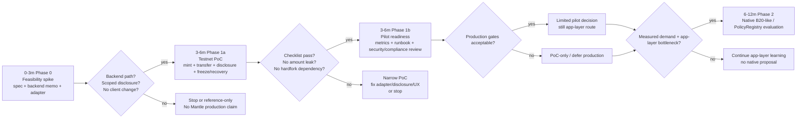
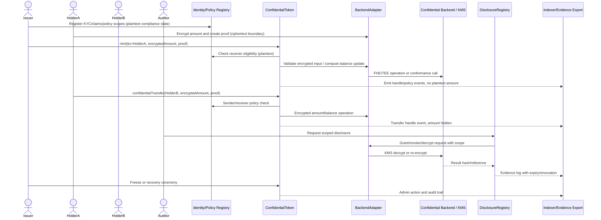
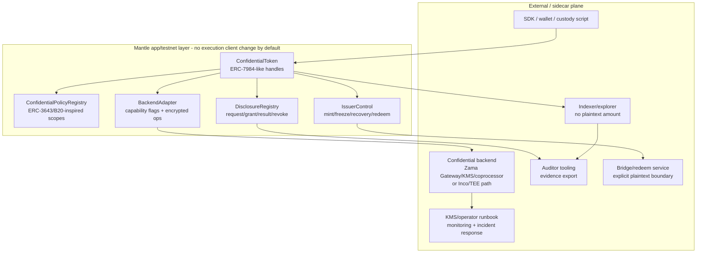
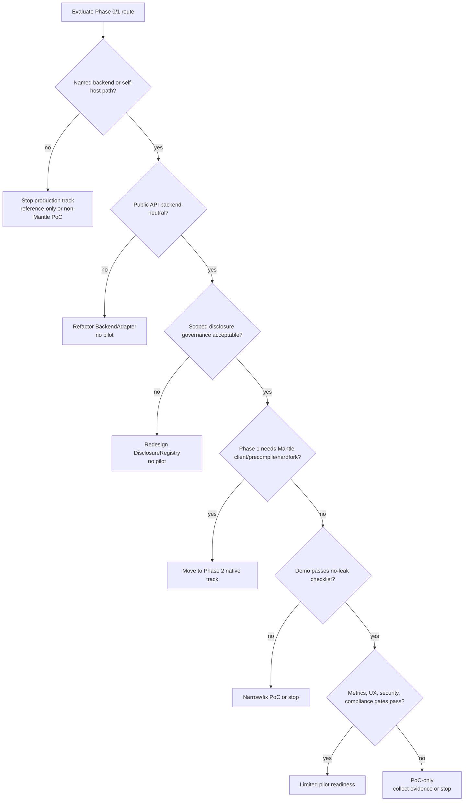

# Mantle 轻量级集成路线与 PoC 计划

## Executive Summary

建议 Mantle 把 Confidential Compliance Token, 简称 CCT, 拆成 **0-3 个月可停止 feasibility spike**、**3-6 个月窄口径 testnet PoC / pilot readiness**、**6-12 个月 native route 评估** 三段，而不是一开始改 Mantle execution client、做 precompile 或承诺硬分叉。默认路线是 WHI-272 已定的 application / coprocessor hybrid：ERC-3643-style identity / policy / issuer controls + ERC-7984 / OpenZeppelin-style confidential value interface + scoped DisclosureRegistry + replaceable BackendAdapter。Phase 0/1 不要求 Mantle client change；一旦发现 Phase 1 必须依赖 precompile、hardfork 或双客户端修改，应立即降级为 Phase 2 native track。

PoC 的最小闭环是：KYC/policy onboarding -> confidential mint -> confidential transfer -> scoped audit disclosure -> freeze 或 recovery ceremony -> evidence export。它必须能证明金额/余额不会以 plaintext event、indexer 字段或普通 ERC-20 state 暴露；也必须承认非目标：地址图、交易存在性、时间模式、mempool / order-flow、private identity、full private DeFi 和 production-grade native encrypted accounting 不在 Phase 1 承诺内。

关键门槛不是合约能不能写，而是 backend maturity：Zama / ERC-7984 / OpenZeppelin 路线是最完整的 FHE/confidential accounting 参考，Inco Lightning 是备选/压力测试路径，Inco confidential ERC20 framework 只能作为 unaudited engineering PoC 参考，Optalysys 只能作为 FHE 性能与生产化问题生成器。任何 Mantle production 承诺都要先拿到具名 backend 对 Mantle 的支持路径、自托管方案、KMS/operator 治理、审计版本、latency/cost 数据和 failure recovery 语义。

本 draft 明确解决 outline review 的 minor caveat：`confidential-compliance-token-research/report/poc-checklist.md` 是 Technical Writer / report packaging target。本 section 不在 deep-draft 阶段写 `report/` 文件，而是在 item-8 和 diag-6 中完整输出 checklist 内容、owner、evidence、blocker 和默认状态，供 TW 后续打包成 standalone `poc-checklist.md`，避免交付物被遗漏。

## Item Findings

### item-1: 最小 PoC 成功标准与演示闭环

Phase 1 PoC 只证明 Mantle 可以在不改执行客户端的前提下运行一个合规 confidential token 最小闭环。它不是 production launch、不是 private DeFi、不是 native B20 precompile，也不是私密身份系统。

| Capability | Minimum PoC standard | Evidence required | Pass / fail gate | Out of scope unless explicitly added |
|---|---|---|---|---|
| KYC / policy | Sender and receiver eligibility checked through ERC-3643-style identity/policy substrate or equivalent adapter. Address, role, claim topic, blocklist, jurisdiction class and policy ID may remain plaintext. | Passing and failing transfer cases; policy config snapshot; trusted issuer/claim registry fixture; source anchor. | Must pass. Fail if a non-KYC receiver can receive mint/transfer or if policy failure leaks encrypted amount predicate. | Private identity, fully encrypted KYC facts, anonymous receiver verification. |
| Mint | Authorized issuer can mint encrypted amount to eligible holder. Mint role, receiver eligibility and encrypted input proof are checked. | Tx/log evidence; encrypted balance handle before/after; issuer role proof; no plaintext amount event. | Must pass. Fail if mint requires native precompile or leaks amount in event/indexer. | Native mint precompile, global confidential supply proof beyond PoC handle checks. |
| Confidential transfer | Eligible holder can transfer encrypted amount without revealing amount or balance plaintext. Plain identity rules can revert; encrypted amount rules must use backend-safe select/zero-transfer/selective disclosure or be unsupported. | Transfer trace; before/after encrypted handles; indexer sample showing no amount field; negative test for ineligible receiver. | Must pass. Fail if transfer amount appears in public logs or if predicate-dependent revert leaks encrypted comparison result. | Hiding address graph, timing, event existence, public calldata metadata, mempool privacy. |
| Audit disclosure | Authorized auditor/issuer/regulator flow can request scoped disclosure and log request/grant/result reference. Scope includes actor, trigger, payload, expiry, revocation status and residual leakage. | Disclosure request; approval log; backend decrypt/re-encrypt or public decrypt evidence; result hash/reference; expiry/revocation log. | Must pass for at least one scoped account or transfer payload. Fail if disclosure is unbounded historical viewing key. | Full-history viewing key, unlogged regulator superpower, anonymous audit. |
| Freeze / recovery | Minimum freeze or recovery ceremony is defined and demonstrable. At least one must be executable in PoC; the other may be documented as deferred with legal rationale and test stub. | Freeze/recovery transaction; admin role proof; audit trail; failure semantics; holder impact note. | Must pass one of freeze/recovery. Fail if issuer can silently seize or decrypt balances without log. | Production court-order workflow, multi-jurisdiction dispute automation. |
| Failure / degraded mode | Backend outage, disclosure denial, policy failure, malformed proof and indexer lag have documented outcomes. | Manual runbook; failing test or mocked outage; retry/rollback notes; monitoring alert sample. | Must pass at runbook/test level. Fail if outage can create unlogged state divergence. | Automated production incident management. |
| Source trace | Every material claim maps to pinned local final, official URL/access date, or Mantle local code path/commit. | Evidence map in item-7/source coverage. | Must pass for review. | Uncited vendor narrative as proof. |

Minimum demo script:

1. Deploy identity/policy fixtures, CCT contracts, disclosure registry and BackendAdapter against the chosen backend or mock-real conformance harness.
2. Register issuer, compliance officer, auditor, recovery/freeze admin and two holders; one holder is eligible and one is not.
3. Mint encrypted amount to eligible holder; show only encrypted handle and no plaintext amount in events/indexer.
4. Execute confidential transfer to eligible receiver; execute failing transfer to ineligible receiver.
5. Request scoped audit disclosure for one transfer or account window; grant; retrieve decrypt/re-encrypt result; log expiry/revocation.
6. Execute freeze or recovery ceremony; capture admin role, scope, result and audit trail.
7. Trigger one backend failure or denied disclosure path; show fail-closed behavior and runbook.

Source anchors: `mantle-protocol-design/final.md` @ `0a058bd286ab95d3a1ff7b76421a9e8627b675b4` §§Executive Summary, item-2, item-5, item-7; `zama-confidential-rwa/final.md` @ same base commit §§2-5; `compliance-token-private-extension/final.md` @ same base commit §§1, 4, 6; ERC-7984 EIP and ERC-3643 EIP accessed 2026-06-24.

### item-2: Phase 0/1 lightweight integration route

Phase 0/1 should be intentionally application-level. Mantle engineering owns contract and integration clarity; the confidential compute backend may be a partner or self-hosted stack, but its details must stay behind `BackendAdapter` so future Zama/Inco/native replacement remains possible.

| Phase | Time window | Goal | Deliverables | Go/no-go gate | Chain change class |
|---|---:|---|---|---|---|
| Phase 0 | 0-3 months | Feasibility spike and design freeze. Decide whether Mantle has a credible backend path before building pilot UX. | PoC spec; backend selection memo; BackendAdapter interface; policy/disclosure authority matrix; mock disclosure service; threat model; source trace map; demo script skeleton; cost estimate v0. | Proceed only if there is a named backend support path, self-hosted path, or bounded non-Mantle validation target. If none, stop production track and keep design/reference only. | `no_chain_change` + `sidecar_operator_dependency` |
| Phase 1a | 3-6 months | Testnet PoC with minimal closed loop. | Contracts; SDK demo; KYC/policy fixture; mint/transfer/disclosure/freeze or recovery tests; indexer dashboard; wallet/custody script; backend conformance logs. | Demo passes the item-1 checklist; no hardfork dependency discovered; no plaintext amount leaks in logs/indexer. | `app_integration` |
| Phase 1b | 3-6 months | Pilot readiness assessment, not production launch by default. | Security review scope; operator/KMS runbook; p50/p95/p99/cost measurements; wallet/indexer UX acceptance; incident drill; compliance memo. | Continue only if backend governance, disclosure evidence, latency/cost, UX and security scope are acceptable. Otherwise remain PoC-only. | `app_integration` + `sidecar_operator_dependency` |
| Phase 2 evaluation | 6-12 months | Decide if native Mantle integration is worth a separate protocol proposal. | Native option scorecard; client/precompile feasibility check; governance/fork/audit cost; product demand evidence from PoC. | Open a separate native proposal only if Phase 1 metrics show real demand and app-layer bottleneck. | `client_or_hardfork_required` |

Recommended Phase 0 contract/API package:

| Component | Phase 0 shape | Phase 1 PoC shape | Must not leak |
|---|---|---|---|
| `ConfidentialToken` | ERC-7984-like interface using opaque `bytes32`/`bytes` encrypted handles. | Mint, transfer, balance handle, freeze/recovery hook, disclosure hook. | Backend-specific `euint`, Inco callback shape, native precompile selector. |
| `ConfidentialPolicyRegistry` | ERC-3643/B20-inspired policy IDs, identity claims, scopes, versioning. | Sender/receiver/mint receiver/operator/disclosure scopes; plaintext address rules; encrypted amount rules only if backend-safe. | False claim that B20/PolicyRegistry itself gives confidentiality. |
| `DisclosureRegistry` | Request/grant/result/expiry/revocation lifecycle. | Auditor request, issuer/compliance approval, decrypt/re-encrypt result reference, export. | Unbounded viewing key or unlogged historical access. |
| `IssuerControl` | Role split for issuer, compliance, freeze, recovery, auditor admin, policy admin. | Mint/burn/freeze/recover/redeem stubs; multisig/timelock where feasible. | One owner with silent seize/decrypt power. |
| `BackendAdapter` | Capability flags, encrypted input validation, compute/decrypt request, grant/revoke, health/SLA hooks. | Real or conformance backend for mint/transfer/disclosure; mock outage. | Vendor-specific types in public CCT interface. |
| SDK/demo | Encrypt amount, submit proof, decode encrypted handles, request disclosure, export evidence. | CLI or minimal web/custody script. | Plaintext amount persistence in frontend logs. |

Backend selection in Phase 0:

| Candidate | Use in this roadmap | Why | Gate before Phase 1 |
|---|---|---|---|
| Zama fhEVM + OpenZeppelin Confidential Contracts | Primary architecture and PoC reference path. | Strongest standard and implementation surface for ERC-7984-style encrypted balances, ACL, Gateway, KMS and RWA extensions. | Verify Mantle host-chain support or self-host Gateway/KMS/coprocessor feasibility; pin OZ version/audit posture; measure policy/decrypt latency. |
| Inco Lightning | Backup/backend pressure test if Mantle support can be obtained, or Base-aligned bounded PoC if Mantle support is absent. | Gives independent TEE/confidential compute route and engineering comparison. | Obtain official Mantle support statement, TEE attestation/liveness model and disclosure semantics. |
| Inco confidential ERC20 framework | Engineering PoC/test/interface inspiration only. | Prior research classifies it as unaudited proof of concept with useful wrapper/delegated-viewing/transfer-rule shapes. | Do not copy into production; only use as test-structure reference. |
| Optalysys | Performance/production question generator only. | Useful for FHE throughput, data-movement and acceleration questions. | Never treat as CCT route, standard, Mantle integration proof or benchmark proof. |

Source anchors: `route-comparison/final.md` @ `0a058bd...` §§2.4, 5, 6, 8; `requirements-framework/final.md` @ `0a058bd...` §§5, 6; Zama docs (`https://docs.zama.org/protocol/protocol/overview`, `/gateway`, `/kms`, `/solidity-guides/smart-contract/acl`) accessed 2026-06-24; OpenZeppelin Confidential Contracts docs accessed 2026-06-24; Inco docs accessed 2026-06-24.

### item-3: Phase 2 native B20-like / PolicyRegistry precompile assessment

Native Mantle work should be treated as a separate protocol program. It may be valuable if the PoC proves demand and app-layer execution is the bottleneck, but it is not part of the lightweight Phase 1 plan.

| Native option | Evaluation trigger | Evidence needed | Expected cost surface | Default disposition |
|---|---|---|---|---|
| B20-like token precompile | Phase 1 shows demand and app-layer gas/UX/standardization is the real bottleneck. | Product spec; B20 analogy; Mantle op-geth/reth/revm precompile surface; fraud-proof/op-program implications; dual-client parity plan; security model. | Execution-client changes, fork activation, audits, governance, indexer/explorer updates, SDK/wallet updates. | Phase 2 only. |
| PolicyRegistry precompile | Policy semantics stabilize across issuers and are repeatedly reused. | Stable policy vocabulary, upgrade rules, storage/API model, failure semantics, compatibility with ERC-3643-style identity and disclosure logs. | Protocol governance, storage/API ossification, compliance liability, client tests. | Phase 2 only. |
| Native encrypted accounting | External backend latency/cost/operator dependency is unacceptable, but CCT demand is validated. | Cryptographic backend spec, precompile/API design, key governance, encrypted state availability, disclosure path. | High cryptography, protocol, security, ops and governance cost. | Long-term research, not 6-month pilot. |
| Protocol disclosure registry | App-layer disclosure logs prove useful but insufficient for regulatory evidence. | Legal/audit requirements, revocation model, retention/export policy, privacy impact, governance owner. | Chain-level data-retention commitment and legal review. | Phase 2 candidate. |
| Native bridge/redeem adapter | Pilot needs chain-level settlement/unshield integration. | Bridge/redeem legal flow, plaintext boundary, reserve accounting, failure recovery, bridge security review. | Bridge/security/liability surface; operations and custody. | Separate proposal after PoC. |

Current local Mantle code check:

| Repo path | Commit SHA | Files / method checked | Result for this draft |
|---|---|---|---|
| `/Users/whisker/Work/src/networks/mantle/op-geth` | `3c1c571e57874019991f28fe99c36cddac7b4bef` | Targeted `rg` for `B20`, `PolicyRegistry`, `ActivationRegistry`, `ERC7984`, `FHE`, `fhEVM`, `ConfidentialToken`, `DisclosureRegistry`; generic precompile surface in `core/vm/contracts.go` and `core/vm/evm.go`. | Search produced only generic false positives in tests/assets/crypto constants for these CCT terms; no CCT/B20/PolicyRegistry/ERC-7984 native surface found in this bounded scan. |
| `/Users/whisker/Work/src/networks/mantle/revm` | `bcf1a6ab0e6cc15f15697df107dd1276bcfea703` | Same targeted keyword scan; precompile plumbing under `crates/precompile`; fork/spec labels in repo. | No targeted CCT/B20/PolicyRegistry/ERC-7984/FHE hits. Generic revm precompile plumbing exists, but that is not a product route. |
| `/Users/whisker/Work/src/networks/mantle/reth` | `a881fee21317f8156a150b99e4bf3db5804a39f4` | Same targeted keyword scan; Mantle chain-spec areas such as `mantle-reth/crates/chainspec/src/`; generic custom-precompile test surface. | Only irrelevant B20-looking hex/test-data hits in Ethereum tests; no CCT/B20/PolicyRegistry/ERC-7984/FHE native surface found. |

Interpretation: this is **not evidence of absence** and does not settle future governance. It only supports the bounded claim that current local checkout inspection did not reveal an existing Mantle-native B20/CCT confidential precompile path that Phase 1 can assume. Any hardfork schedule or native route readiness must come from Mantle governance/release docs and a separate protocol spec, not from fork labels or generic precompile plumbing.

### item-4: Engineering surface and ownership map

The small-team posture is to make work streams explicit, outsource or partner where appropriate, and avoid hiding operational dependencies under “just deploy contracts.”

| Surface | Phase 0/1 work | Owner / operator | Test artifact | Production blocker |
|---|---|---|---|---|
| Contracts | Token core, policy registry, disclosure registry, issuer controls, identity adapter, BackendAdapter, wrapper/redeem stubs. | Mantle app team or issuer integrator. | Unit/integration tests; ABI review; upgrade review; event leakage check. | Audit, upgrade governance, amount-policy semantics. |
| SDK / backend adapter | Encrypted input generation, proof submission, decrypt/re-encrypt request, grant/revoke, capability flags, backend health. | Backend partner or Mantle integration team. | CLI/web SDK demo; mock and real backend conformance tests. | Backend support path, SLA, licensing/commercial terms. |
| Wallet / custody UX | Encrypt amount, view/decrypt balance when authorized, approve disclosure, show policy failure, warn operator approval. | Wallet/custody partner. | Manual demo and UX acceptance script. | Users/operators cannot complete encrypted flow reliably. |
| Indexer / explorer | Show encrypted activity, policy/disclosure logs, role actions, no plaintext amount leakage. | Indexer/explorer provider or Mantle app team. | Indexed event sample; dashboard; leakage review. | Missing audit evidence or misleading display. |
| Auditor tooling | Request/grant/result tracking; evidence export; retention references; revocation state. | Issuer/auditor operator. | Disclosure report sample with result hashes/references. | No scoped evidence, no revocation story, or unbounded historical view. |
| KMS / operator | Key ceremony, threshold/decrypt governance, Gateway/coprocessor or TEE operator monitoring, outage response. | Backend provider, issuer operator set, or self-hosted participants. | Runbook, key ceremony record, incident drill, health dashboard. | Key governance unacceptable or operator SLA missing. |
| Bridge / redeem | Explicit plaintext settlement boundary; unwrap/redeem amount disclosure; fallback/force-exit. | Issuer/custodian/bridge provider. | Redeem/unshield demo or deferred rationale. | No legal settlement path or bridge risk exceeds PoC scope. |
| Docs / security review | Deployment guide, threat model, failure modes, audit scope, compliance memo, source trace. | Project lead + security reviewer. | Review package and adversarial response pack. | Review scope too large for small team or unaudited PoC code required. |
| Governance / roles | Split issuer, compliance officer, auditor admin, freeze/recovery, policy admin, backend admin. | Issuer governance + Mantle integrator. | Role matrix, multisig/timelock config, break-glass log. | One unlogged superuser or unclear legal authority. |

Engineering sequencing:

| Order | Workstream | Why now | Exit evidence |
|---:|---|---|---|
| 1 | Backend support validation | Without a named backend path, contract work risks becoming a paper design. | Written backend memo plus conformance harness result. |
| 2 | Interface freeze | Prevent vendor lock-in and preserve backend replaceability. | `BackendAdapter` ABI/API review and capability flags. |
| 3 | Contract skeleton + mock backend | Allows policy/disclosure/freeze semantics to be tested before real backend integration. | Local tests and leakage review. |
| 4 | Real backend conformance | Converts architecture into actual confidential operations. | Mint/transfer/disclosure traces. |
| 5 | Wallet/indexer/auditor tooling | Makes PoC demonstrable and reviewable by non-contract stakeholders. | Demo script, dashboard, export sample. |
| 6 | Security/compliance review | Prevents demo success from being mistaken for production readiness. | Findings, accepted caveats and stop/continue decision. |

### item-5: Performance, cost and production observability

The PoC should record metrics before setting production SLA. Numeric thresholds should be chosen after baseline measurement; the go/no-go gate is whether the measured path is usable for the intended pilot workflow and whether failures are observable and recoverable.

| Metric group | Metrics | Measurement method | Decision use |
|---|---|---|---|
| User-facing latency | p50/p95/p99 for mint, confidential transfer, policy check, disclosure request, balance view, freeze/recovery. | Testnet script, wallet/custody script timestamps, dashboard. | UX go/no-go and custody/wallet requirements. |
| Backend latency | Encrypted input validation, encrypted op latency, decrypt/re-encrypt time, KMS quorum time, Gateway/coprocessor/TEE retry time. | Backend logs, synthetic probes, request IDs correlated with tx/event timestamps. | Backend maturity gate and operator SLA. |
| Cost | Gas, backend fee, operator/KMS cost, monitoring cost, audit/review cost, integration effort. | Transaction traces, vendor/operator estimate, engineering time estimate. | Budget and pilot feasibility. |
| Burst / reliability | Concurrent transfers, disclosure burst, policy update burst, KMS/Gateway outage recovery time, stuck decrypt rate. | Load test, failure drill, retry simulation. | Pilot readiness and incident response. |
| Audit evidence | Disclosure logs, policy logs, role/admin logs, result hashes, retention/export time, revocation records. | Auditor report sample, exported evidence bundle. | Compliance acceptance. |
| Monitoring | Backend health, event indexing lag, decrypt queue depth, failure rate, stuck requests, policy config drift, alert acknowledgement. | Dashboard spec, alert test, runbook walkthrough. | Operations readiness. |
| Privacy leakage | Plaintext amount in tx/event/indexer/frontend logs, unauthorized decrypt, metadata leakage note. | Static event schema review, demo log review, manual negative tests. | Prevent overclaim and stop if amount leaks. |

Suggested metric schema:

| Operation | Required p50/p95/p99? | Required cost? | Required evidence? | Failure drill |
|---|---|---|---|---|
| Mint | Yes | Gas + backend | encrypted handle + issuer/policy log | malformed proof |
| Transfer | Yes | Gas + backend | no plaintext amount + policy pass/fail | backend unavailable |
| Disclosure request/grant/result | Yes | backend + operator | scoped request/result hash/export | denial + expiry |
| Freeze/recovery | Yes | gas + operator | admin log + holder impact | unauthorized admin |
| Balance view | Yes | backend/user decrypt if used | authorized viewer only | unauthorized viewer |
| Indexing | p50/p95/p99 lag | infra | dashboard and evidence export | indexer lag |

Stop using vendor claims as benchmarks. Zama and Inco docs can define architecture and capabilities; Optalysys can frame FHE performance/data-movement questions. Actual Mantle decision data must come from the PoC path.

### item-6: Risk gates, stop conditions and downgrade paths

Risk gates must be enforceable and tied to observable evidence. A production blocker can still permit a narrow PoC if the caveat is explicit; a Phase 1 hardfork dependency cannot.

| Risk gate | Stop condition | Downgrade path | Evidence required | PoC-acceptable? |
|---|---|---|---|---|
| Backend support | No Mantle support, no self-host path, and no bounded non-Mantle validation target. | Reference-only design or Base-aligned PoC outside Mantle-native claim. | Backend statement, deployment test, conformance harness. | Only if scope says non-Mantle validation. |
| Disclosure governance | Grant/revoke/log authority unclear; historical access unbounded; no actor/scope/expiry/result reference. | Redesign disclosure registry before pilot. | Authority matrix, audit log sample, revocation test. | No for demo; disclosure must be scoped. |
| Performance/SLA | p95/p99 or failure rate makes wallet/custody flow unreliable for demo or pilot. | PoC-only, reduce scope, defer production. | Measured benchmark and failure drill, not vendor claim. | Yes for research if measured and caveated. |
| Vendor lock-in | Public interface leaks backend-specific types or APIs. | Refactor adapter boundary before pilot. | ABI/API review. | No; fix before continuing. |
| Compliance sufficiency | Audit disclosure or policy proof cannot satisfy issuer/regulator minimum. | Stop production path; continue architecture research only. | Compliance review memo. | Only if demo labels this explicitly. |
| Wallet/UX burden | Users/operators cannot complete encrypt/decrypt/disclosure flow reliably. | Custody-only pilot, guided demo, or stop. | Manual acceptance and error logs. | Yes for internal demo if documented. |
| Hardfork dependency | Phase 1 path requires Mantle client change, native precompile, fork activation, or dual-client protocol work. | Move to Phase 2 native track; do not call it lightweight PoC. | Architecture decision plus local code/governance review. | No for Phase 1. |
| Security scope | Audit scope exceeds small-team ability, or production route requires copying unaudited PoC code. | Narrow PoC, remove code reuse, or stop. | Security estimate and code provenance. | Yes only as disposable demo/reference. |
| Amount-policy gap | ERC-3643 amount/balance rule cannot be expressed without leaky revert or unacceptable decrypt. | Mark amount rule unsupported; use FHE-native select/zero-transfer or authorized selective disclosure. | Negative tests and policy capability matrix. | Yes if rule class is explicitly out of scope. |
| Bridge/redeem gap | No legal settlement/unshield boundary for production asset. | Keep PoC synthetic, no production RWA claim. | Redeem rationale or legal/custody memo. | Yes for synthetic test asset. |

Decision rule:

- **Start Phase 1a** only if backend path, adapter boundary, minimum disclosure governance and synthetic asset scope are clear.
- **Stay PoC-only** if latency, wallet UX, KMS governance, audit versioning or compliance evidence is incomplete but the demo is honest.
- **Stop / reference-only** if no backend path, no scoped disclosure, or any Phase 1 hardfork dependency appears.
- **Open Phase 2 native proposal** only after PoC metrics show demand and app-layer bottleneck, not because native precompile sounds cleaner.

### item-7: Validation plan, source traceability and cost estimate

Validation is both artifact validation and future PoC validation.

| Validation layer | What to verify | Artifact | Minimum pass condition |
|---|---|---|---|
| Source traceability | Every material conclusion maps to local final path + commit SHA, official URL + access date, or local repo path + commit SHA + file path/method. | Evidence map and source coverage. | No load-bearing uncited claim. |
| Contract unit tests | Policy pass/fail, encrypted transfer path, disclosure registry lifecycle, issuer roles, freeze/recovery semantics. | Test list and pass criteria. | Positive and negative tests for every item-1 must-pass capability. |
| Integration tests | SDK encrypted input, backend decrypt/re-encrypt, indexer events, wallet/custody flow, backend outage. | Testnet script and logs. | Demo script can be repeated by reviewer. |
| Manual acceptance | Mint -> confidential transfer -> audit disclosure -> freeze/recovery demo. | Checklist, screenshots/log refs, evidence export. | Non-engineer reviewer can follow pass/fail evidence. |
| Adversarial review | Route remains lightweight; native route staged correctly; stop conditions are enforceable. | Review response package. | No unresolved critical/major finding. |
| Cost estimate | Contract/audit/backend/operator/wallet/indexer/security/docs effort. | Rough order-of-magnitude table. | Clear enough to decide start/narrow/stop. |
| Local code verification | Current Mantle hardfork/precompile/client-surface statements only. | Repo path, commit SHA, file paths and searched terms. | Claim is bounded and not inferred as governance schedule. |
| Incident drill | Backend outage, denied disclosure, indexer lag, stuck decrypt, bad proof. | Runbook and drill log. | Fail-closed semantics and recovery owner known. |

Rough order-of-magnitude effort for Phase 0/1:

| Workstream | Phase 0 effort | Phase 1 effort | Main uncertainty |
|---|---:|---:|---|
| Architecture/spec/source trace | S | S | Scope discipline and evidence completeness. |
| Contracts + mock backend | M | M/L | Amount-policy semantics and disclosure lifecycle. |
| Real backend integration | M/L | L/XL | Mantle support, self-host complexity, SDK maturity. |
| SDK/demo/wallet script | S/M | M | Encryption/decrypt UX and custody assumptions. |
| Indexer/auditor tooling | S/M | M | Evidence schema and no-leak display. |
| KMS/operator runbook | S/M | M/L | Operator model, key ceremony, SLA, incident process. |
| Security/compliance review | M | L | Audit scope and legal disclosure acceptance. |
| Bridge/redeem | S if deferred | M/L if included | Production legal settlement boundary. |
| Native Phase 2 study | Not included | M for study only | Dual-client/fork/protocol spec cost. |

Cost classification is intentionally T-shirt sizing. Exact budget should be generated after Phase 0 backend selection and security scope.

### item-8: One-page roadmap and PoC checklist packaging

This section is the source content for `confidential-compliance-token-research/report/poc-checklist.md`. The Research Agent-owned artifact remains this draft/final section; TW/report integration should package the following roadmap and checklist into the standalone report file.

#### One-page roadmap

| Window | Phase | Primary objective | Deliverables | Owner | Go/no-go / downgrade |
|---|---|---|---|---|---|
| 0-3 months | Phase 0: feasibility spike | Decide whether a lightweight Mantle CCT PoC is feasible without client change. | PoC spec, backend memo, adapter interface, authority matrix, threat model, mock tests, source trace, cost estimate. | Mantle app/protocol lead + backend partner + security/compliance reviewer. | Go if backend path + scoped disclosure + adapter boundary are credible. Stop or reference-only if no backend path. |
| 3-6 months | Phase 1a: testnet PoC | Demonstrate mint, confidential transfer, disclosure, freeze/recovery and evidence export. | Contracts, SDK demo, KYC/policy fixture, backend conformance, indexer dashboard, wallet/custody script, runbook. | App team + backend partner + wallet/indexer/auditor tooling owners. | Go if checklist passes and no plaintext amount leak/hardfork dependency. Remain PoC-only if UX/SLA/security incomplete. |
| 3-6 months | Phase 1b: pilot readiness | Determine whether PoC can become a limited pilot. | p50/p95/p99/cost metrics, KMS/operator runbook, incident drill, compliance memo, security review scope. | Project lead + operator/security/compliance. | Pilot only if governance, latency, disclosure, security and UX gates pass. Otherwise narrow or stop. |
| 6-12 months | Phase 2: native evaluation | Evaluate B20-like / PolicyRegistry / native encrypted accounting only if evidence justifies it. | Native scorecard, Mantle code/governance feasibility, protocol proposal outline, audit/fork cost. | Mantle protocol/client/security/governance. | Open separate protocol proposal only if app-layer bottleneck is measured and demand is validated. |

#### PoC checklist content

| ID | Phase | Task | Owner | Evidence | Default status | Blocker / stop condition |
|---|---|---|---|---|---|---|
| C-01 | Phase 0 | Confirm PoC asset scope: synthetic demo asset, RWA/security-like token, or stablecoin variant. | Product + compliance | Scope memo. | planned | No asset/legal scope -> no production pilot claim. |
| C-02 | Phase 0 | Pin minimum success criteria: KYC/policy, mint, confidential transfer, disclosure, freeze/recovery, failure mode. | Research + engineering lead | Item-1 checklist accepted. | planned | Missing pass/fail evidence. |
| C-03 | Phase 0 | Select backend path or bounded fallback: Zama, Inco, self-host, or non-Mantle validation. | Engineering lead + backend partner | Backend memo; support statement or conformance plan. | planned | No credible backend path. |
| C-04 | Phase 0 | Freeze `BackendAdapter` public interface and capability flags. | Contract lead | ABI/API review. | planned | Public API exposes vendor-specific encrypted types. |
| C-05 | Phase 0 | Define policy scopes and plaintext/encrypted rule split. | Contract + compliance | Policy matrix and unsupported-rule list. | planned | Amount policy implemented through leaky revert. |
| C-06 | Phase 0 | Define disclosure authority matrix: actor, trigger, payload, scope, expiry, revocation, result reference. | Compliance + auditor tooling | Authority matrix. | planned | Unbounded historical viewing key. |
| C-07 | Phase 0 | Define roles and governance: issuer, compliance, auditor admin, freeze/recovery, policy admin, backend admin. | Issuer + security | Role matrix; multisig/timelock plan. | planned | Single silent superuser. |
| C-08 | Phase 0 | Write threat model and residual leakage note. | Security | Threat model. | planned | Overclaiming graph/timing/privacy coverage. |
| C-09 | Phase 0 | Build mock backend tests for mint/transfer/disclosure/freeze or recovery. | Contract team | Unit/integration test logs. | planned | No repeatable demo skeleton. |
| C-10 | Phase 0 | Prepare metrics plan: p50/p95/p99, gas, backend cost, burst, audit export, indexing lag, recovery time. | Engineering + ops | Dashboard schema. | planned | Metrics unavailable for Phase 1. |
| C-11 | Phase 1a | Deploy CCT contracts and identity/policy fixtures on selected test environment. | Contract team | Deployment addresses and config hash. | not_started | Requires Mantle client change. |
| C-12 | Phase 1a | Integrate real backend or conformance backend with SDK. | Backend/SDK team | Encrypted input and decrypt request traces. | not_started | Backend cannot run target operations. |
| C-13 | Phase 1a | Execute confidential mint to eligible holder. | Demo operator | Tx trace, encrypted handle, no plaintext amount event. | not_started | Plaintext amount leak. |
| C-14 | Phase 1a | Execute confidential transfer pass/fail cases. | Demo operator | Eligible transfer succeeds; ineligible receiver fails; no amount leak. | not_started | Policy cannot enforce sender/receiver eligibility. |
| C-15 | Phase 1a | Execute scoped audit disclosure. | Auditor tooling owner | Request/grant/result/expiry/revocation logs; evidence export. | not_started | Disclosure scope cannot be bounded. |
| C-16 | Phase 1a | Execute freeze or recovery ceremony. | Issuer/security | Admin role proof and audit trail. | not_started | Silent seizure/decrypt path. |
| C-17 | Phase 1a | Run failure drills: backend outage, denied disclosure, malformed proof, indexer lag. | Ops + QA | Runbook and failure logs. | not_started | Failure creates unlogged state divergence. |
| C-18 | Phase 1a | Verify indexer/explorer and frontend logs contain no plaintext amount/balance. | Indexer + security | Leakage review report. | not_started | Public leakage found. |
| C-19 | Phase 1a | Complete wallet/custody manual acceptance. | Wallet/custody partner | Script results and UX notes. | not_started | Operator cannot complete flow reliably. |
| C-20 | Phase 1b | Produce p50/p95/p99 and cost measurements for all PoC operations. | Engineering + ops | Metrics report. | not_started | No measured data, only vendor claims. |
| C-21 | Phase 1b | Produce KMS/operator runbook and key ceremony notes. | Backend/operator owner | Runbook, key ceremony record, alert plan. | not_started | Key governance unacceptable. |
| C-22 | Phase 1b | Define security review scope and unaudited-code policy. | Security lead | Security review package. | not_started | Production route requires unaudited PoC code. |
| C-23 | Phase 1b | Produce compliance memo for disclosure sufficiency and residual privacy leakage. | Compliance + legal | Compliance memo. | not_started | Auditor/regulator minimum not satisfied. |
| C-24 | Phase 1b | Decide start / narrow / stop / Phase 2 native study. | Product + engineering + compliance | Decision memo tied to gates. | not_started | Decision ignores stop-condition evidence. |
| C-25 | Phase 2 | If triggered, write native B20-like / PolicyRegistry precompile evaluation issue. | Protocol lead | Separate proposal scope. | deferred | Phase 1 metrics do not show demand or app-layer bottleneck. |

## Diagrams

### diag-1: 0-3 / 3-6 / 6-12 month roadmap



### diag-2: Minimum PoC flow



### diag-3: Lightweight Phase 0/1 architecture



### diag-4: Engineering surface matrix

```text
+------------------+---------------------------+--------------------------+----------------------------+-----------------------------+
| Surface          | Phase 0/1 work            | Owner/operator           | Test artifact              | Main blocker                |
+------------------+---------------------------+--------------------------+----------------------------+-----------------------------+
| Contracts        | Token/policy/disclosure   | App team / issuer        | Unit + integration tests   | Audit + upgrade governance  |
| SDK/backend      | Encrypt/proof/decrypt API | Backend partner / app    | Conformance demo           | Support path + SLA          |
| Wallet/custody   | Encrypt/view/disclose UX  | Wallet/custody partner   | Manual acceptance script   | Unusable operator flow      |
| Indexer/explorer | Encrypted activity logs   | Indexer/explorer owner   | Dashboard + leak review    | Missing evidence / leakage  |
| Auditor tooling  | Request/grant/export      | Issuer/auditor operator  | Disclosure report sample   | Unbounded or no evidence    |
| KMS/operator     | Keys, quorum, outage      | Backend/operator set     | Runbook + incident drill   | Governance unacceptable     |
| Bridge/redeem    | Plaintext boundary        | Issuer/custodian/bridge  | Redeem demo or deferral    | Legal settlement gap        |
| Docs/security    | Threat model/review pack  | Lead + security reviewer | Review package             | Scope too large             |
+------------------+---------------------------+--------------------------+----------------------------+-----------------------------+
```

### diag-5: Risk gate decision tree



### diag-6: PoC checklist table for TW packaging

See item-8 "PoC checklist content." It is intentionally table-shaped so Technical Writer can convert it into `confidential-compliance-token-research/report/poc-checklist.md` without reinterpreting ownership or acceptance gates.

## Source Coverage

| Requirement | Status | Source anchors and use |
|---|---|---|
| src-1 prior research final, min 3 | covered | `mantle-protocol-design/final.md`, `zama-confidential-rwa/final.md`, `compliance-token-private-extension/final.md` at project base commit `0a058bd286ab95d3a1ff7b76421a9e8627b675b4`. Used for WHI-272 protocol architecture, Zama/OZ integration, B20/private phase boundary and backend maturity gates. |
| src-2 supporting prior research, min 2 | covered | `requirements-framework/final.md` and `route-comparison/final.md` at `0a058bd286ab95d3a1ff7b76421a9e8627b675b4`. Used for CCT rubric, Inco/Optalysys classification, engineering delta and route verdicts. |
| src-3 local Mantle code analysis | covered with bounded claim | `/Users/whisker/Work/src/networks/mantle/op-geth` @ `3c1c571e57874019991f28fe99c36cddac7b4bef`; `/revm` @ `bcf1a6ab0e6cc15f15697df107dd1276bcfea703`; `/reth` @ `a881fee21317f8156a150b99e4bf3db5804a39f4`; targeted scans for CCT/B20/PolicyRegistry/ERC-7984/FHE terms plus generic precompile surface inspection. Used only to bound current local precompile assumptions. |
| src-4 official backend docs / standards | covered | ERC-7984 EIP `https://eips.ethereum.org/EIPS/eip-7984`; ERC-3643 EIP `https://eips.ethereum.org/EIPS/eip-3643`; OpenZeppelin Confidential Contracts docs `https://docs.openzeppelin.com/confidential-contracts`; Zama docs `https://docs.zama.org/protocol/protocol/overview`, `/gateway`, `/kms`, `/solidity-guides/smart-contract/acl`; Inco docs `https://docs.inco.org/introduction` and `https://docs.inco.org/architecture/overview`; all accessed 2026-06-24. |
| src-5 performance reference | covered with caveat | Optalysys RWA privacy scaling, FHE data movement wall, silicon photonics acceleration and confidential RWA tokenisation pages from `optalysys.com`, accessed 2026-06-24 via prior finals. Used only for performance/productionization questions, not benchmark proof. |
| src-6 engineering PoC reference | covered through prior final | `Inco-fhevm/confidential-erc20-framework` GitHub HEAD `bb39e4f788742121f2fc93de33af58758360545b` verified 2026-06-24 in `requirements-framework/final.md`; classified as unaudited proof-of-concept reference only. |
| src-7 issue record | covered | Multica issue `cf06b8fa-ed51-4b1e-8f3f-bfcd2f76197a` description and Orchestrator deep-draft dispatch comment `bcadcfd6-3ca9-431f-b945-d4691d346cbe`; used for scope, required deliverables, caveat and handoff target. |

## Gap Analysis

1. **Mantle backend support remains unproven**. This draft can define a lightweight route, but Phase 1 cannot claim Mantle-native production readiness until Zama, Inco or an equivalent backend provides a supported or self-hostable Mantle path.
2. **Amount-dependent compliance remains the hardest spike**. ERC-3643-style address/identity policy composes well; amount/balance policy requires FHE-native logic, authorized selective disclosure or explicit unsupported-rule handling. Predicate-dependent encrypted reverts are not acceptable.
3. **Disclosure revocation is backend-specific**. Registry revocation can stop future authorized use, but historical access may be persistent unless the chosen backend proves otherwise.
4. **Current Mantle local code inspection is bounded**. It did not reveal a ready native CCT/B20 confidential precompile surface, but that is not a proof of absence or governance statement. Phase 2 needs separate Mantle protocol review.
5. **Performance evidence must be generated**. Vendor docs and Optalysys material are useful inputs, but p50/p95/p99, encrypted operation cost, burst and failure recovery must be measured on the actual PoC path.
6. **Security scope may dominate small-team capacity**. Contracts, backend, KMS/operator, wallet, indexer and disclosure tooling together create a wider review surface than a normal token PoC.
7. **Bridge/redeem is not solved by confidential transfer**. Production RWA/stablecoin use needs an explicit plaintext settlement boundary, reserve/custody owner and failure path.
8. **Standalone `report/poc-checklist.md` ownership is TW/report-side**. This draft emits the checklist source content; final promotion should preserve that statement unless Orchestrator explicitly reassigns report file ownership to Research Agent.

## Revision Log

| Round | Date | Action | Notes |
|---|---|---|---|
| 1 | 2026-06-24 | Initial deep draft | Produced full draft from approved outline. Covered all eight outline items, six diagram expectations, source coverage and gap analysis. Resolved the outline-review caveat by explicitly stating that this section emits complete checklist content for TW/report packaging rather than writing `report/poc-checklist.md` during deep-draft. |
