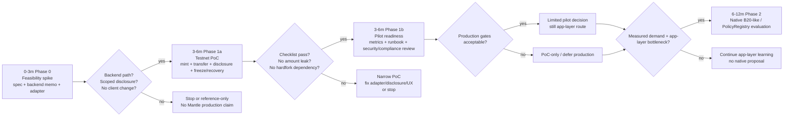
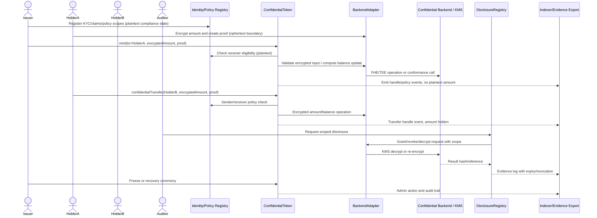
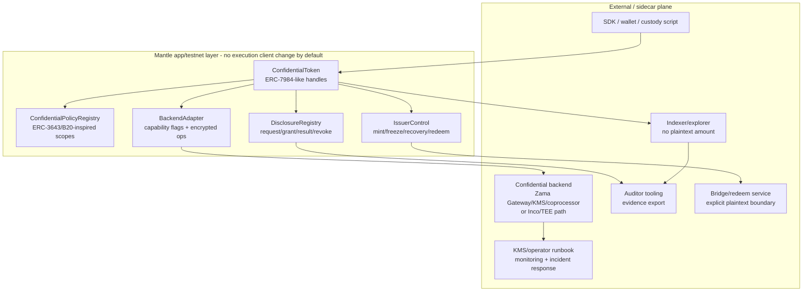
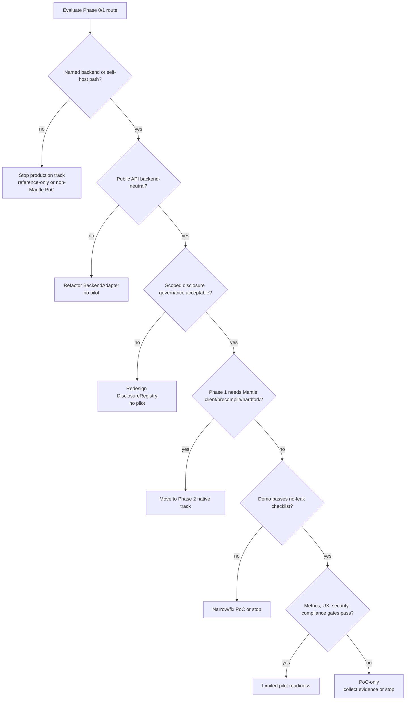

# Mantle 轻量级集成路线与 PoC 计划

## 执行摘要（Executive Summary）

建议 Mantle 把 Confidential Compliance Token（机密合规代币，简称 CCT）拆成 **0-3 个月可停止 feasibility spike（可行性探针）**、**3-6 个月窄口径 testnet PoC / pilot readiness（试点就绪度）**、**6-12 个月 native route 评估** 三段，而不是一开始改 Mantle execution client、做 precompile 或承诺硬分叉。默认路线是 WHI-272 已定的 application / coprocessor hybrid：ERC-3643-style identity / policy / issuer controls + ERC-7984 / OpenZeppelin-style confidential value interface + scoped DisclosureRegistry + replaceable BackendAdapter。Phase 0/1 不要求 Mantle client change；一旦发现 Phase 1 必须依赖 precompile、hardfork 或双客户端修改，应立即降级为 Phase 2 native track。

PoC 的最小闭环是：KYC/policy onboarding -> confidential mint -> confidential transfer -> scoped audit disclosure -> freeze 或 recovery ceremony -> evidence export。它必须能证明金额/余额不会以 plaintext event、indexer 字段或普通 ERC-20 state 暴露；也必须承认非目标：地址图、交易存在性、时间模式、mempool / order-flow、private identity、full private DeFi 和 production-grade native encrypted accounting 不在 Phase 1 承诺内。

关键门槛不是合约能不能写，而是 backend maturity（后端成熟度）：Zama / ERC-7984 / OpenZeppelin 路线是最完整的 FHE/confidential accounting 参考，Inco Lightning 是备选/压力测试路径，Inco confidential ERC20 framework 只能作为 unaudited engineering PoC 参考，Optalysys 只能作为 FHE 性能与生产化问题生成器。任何 Mantle production 承诺都要先拿到具名 backend 对 Mantle 的支持路径、自托管方案、KMS/operator 治理、审计版本、latency/cost 数据和 failure recovery 语义。

本 final 明确解决 outline review 的 minor caveat（轻微注意事项）：`confidential-compliance-token-research/report/poc-checklist.md` 是 Technical Writer / report packaging target。本 section 不在 final-promotion 阶段写 `report/` 文件，而是在 item-8 和 diag-6 中完整输出 checklist 内容、owner、evidence、blocker 和默认状态，供 TW 后续打包成 standalone `poc-checklist.md`，避免交付物被遗漏。

Draft review 的 SLA caveat 也在 final 中固定为硬门槛：Phase 0/1 可以先测量 baseline，不能预先编造 p50/p95/p99 数字；但 **任何 pilot 决策前必须把 transfer、policy check、disclosure、freeze/recovery、backend decrypt、indexing lag 和 cost 的具体 numeric thresholds 写入 Phase 1b gate / decision memo**。如果只有观测数据而没有阈值，结论只能停留在 PoC-only，不能进入 pilot readiness。

## 逐项发现（Item Findings）

### item-1: 最小 PoC 成功标准与演示闭环

Phase 1 PoC 只证明 Mantle 可以在不改执行客户端的前提下运行一个合规 confidential token 最小闭环。它不是 production launch、不是 private DeFi、不是 native B20 precompile，也不是私密身份系统。

| 能力 | 最小 PoC 标准 | 所需证据 | 通过 / 失败门槛 | 除非显式加入否则不在范围内 |
|---|---|---|---|---|
| KYC / policy | 通过 ERC-3643-style identity/policy substrate 或等价 adapter 检查发送方与接收方的资格。地址、角色、claim topic、blocklist、jurisdiction class 和 policy ID 可保持 plaintext。 | 通过和失败的 transfer 案例；policy config 快照；trusted issuer/claim registry fixture；source anchor。 | 必须通过。若非 KYC 接收方能收到 mint/transfer，或 policy 失败泄露 encrypted amount predicate，则判失败。 | Private identity、完全加密的 KYC 事实、匿名接收方验证。 |
| Mint | 授权的 issuer 可向合格 holder mint encrypted amount。检查 mint role、接收方资格和 encrypted input proof。 | Tx/log 证据；前后的 encrypted balance handle；issuer role proof；无 plaintext amount event。 | 必须通过。若 mint 需要 native precompile，或在 event/indexer 中泄露金额，则判失败。 | Native mint precompile、超出 PoC handle 检查范围的全局 confidential supply proof。 |
| Confidential transfer | 合格 holder 可在不暴露金额或余额 plaintext 的前提下 transfer encrypted amount。Plain identity rules 可 revert；encrypted amount rules 必须使用 backend-safe select/zero-transfer/selective disclosure，否则视为不支持。 | Transfer trace；前后的 encrypted handles；显示无 amount 字段的 indexer 样本；对不合格接收方的 negative test。 | 必须通过。若 transfer amount 出现在公开 logs 中，或 predicate-dependent revert 泄露 encrypted 比较结果，则判失败。 | 隐藏地址图、时间、event 存在性、公开 calldata 元数据、mempool 隐私。 |
| Audit disclosure | 授权的 auditor/issuer/regulator 流程可请求 scoped disclosure 并记录 request/grant/result 引用。Scope 包括 actor、trigger、payload、expiry、revocation status 和 residual leakage（残余泄露）。 | Disclosure request；approval log；backend decrypt/re-encrypt 或 public decrypt 证据；result hash/reference；expiry/revocation log。 | 至少对一个 scoped account 或 transfer payload 必须通过。若 disclosure 是无界的 historical viewing key，则判失败。 | Full-history viewing key、未记录的 regulator superpower、匿名 audit。 |
| Freeze / recovery | 定义并可演示最小的 freeze 或 recovery ceremony。PoC 中至少有一个可执行；另一个可记录为延期，并附法律依据和 test stub。 | Freeze/recovery transaction；admin role proof；audit trail；failure semantics；holder impact note。 | freeze/recovery 中必须通过其一。若 issuer 能在无 log 的情况下静默扣押或解密余额，则判失败。 | Production court-order workflow、多法域争议自动化。 |
| Failure / degraded mode | Backend outage、disclosure denial、policy failure、malformed proof 和 indexer lag 都有书面化的结果。 | Manual runbook；failing test 或 mocked outage；retry/rollback notes；monitoring alert sample。 | 必须在 runbook/test 层面通过。若 outage 能造成未记录的状态分叉，则判失败。 | Automated production incident management。 |
| Source trace | 每条关键主张都映射到 pinned local final、official URL/access date，或 Mantle local code path/commit。 | item-7/source coverage 中的 evidence map。 | review 必须通过。 | 把未经引用的 vendor narrative 当作证据。 |

最小演示脚本：

1. 针对所选 backend 或 mock-real conformance harness，部署 identity/policy fixtures、CCT contracts、disclosure registry 和 BackendAdapter。
2. 注册 issuer、compliance officer、auditor、recovery/freeze admin 和两个 holders；一个 holder 合格，一个不合格。
3. 向合格 holder mint encrypted amount；仅展示 encrypted handle，event/indexer 中无 plaintext amount。
4. 对合格接收方执行 confidential transfer；对不合格接收方执行失败的 transfer。
5. 针对一个 transfer 或 account window 请求 scoped audit disclosure；授予；获取 decrypt/re-encrypt 结果；记录 expiry/revocation。
6. 执行 freeze 或 recovery ceremony；捕获 admin role、scope、result 和 audit trail。
7. 触发一个 backend failure 或被拒绝的 disclosure path；展示 fail-closed 行为和 runbook。

Source anchors: `mantle-protocol-design/final.md` @ `0a058bd286ab95d3a1ff7b76421a9e8627b675b4` §§Executive Summary, item-2, item-5, item-7; `zama-confidential-rwa/final.md` @ same base commit §§2-5; `compliance-token-private-extension/final.md` @ same base commit §§1, 4, 6; ERC-7984 EIP and ERC-3643 EIP accessed 2026-06-24.

### item-2: Phase 0/1 轻量级集成路线

Phase 0/1 应有意保持在 application 层级。Mantle engineering 负责合约和集成的清晰度；confidential compute backend 可以是合作伙伴或自托管 stack，但其细节必须留在 `BackendAdapter` 之后，以便未来的 Zama/Inco/native 替换仍然可能。

| 阶段 | 时间窗口 | 目标 | 交付物 | Go/no-go 门槛 | 链改动类别 |
|---|---:|---|---|---|---|
| Phase 0 | 0-3 months | Feasibility spike 和 design freeze。在构建 pilot UX 之前，先判断 Mantle 是否有可信的 backend 路径。 | PoC spec；backend selection memo；BackendAdapter interface；policy/disclosure authority matrix；mock disclosure service；threat model；source trace map；demo script skeleton；cost estimate v0。 | 仅当存在具名 backend support path、self-hosted path 或有界的 non-Mantle validation target 时才继续。若都没有，则停止 production track，仅保留 design/reference。 | `no_chain_change` + `sidecar_operator_dependency` |
| Phase 1a | 3-6 months | 带最小闭环的 Testnet PoC。 | Contracts；SDK demo；KYC/policy fixture；mint/transfer/disclosure/freeze 或 recovery tests；indexer dashboard；wallet/custody script；backend conformance logs。 | Demo 通过 item-1 checklist；未发现 hardfork dependency；logs/indexer 中无 plaintext amount 泄露。 | `app_integration` |
| Phase 1b | 3-6 months | Pilot readiness 评估，默认不是 production launch。 | Security review scope；operator/KMS runbook；p50/p95/p99/cost measurements；wallet/indexer UX acceptance；incident drill；compliance memo；用于 pilot 决策的 numeric SLA/cost thresholds。 | 仅当 backend governance、disclosure evidence、latency/cost thresholds、UX 和 security scope 可接受时才继续。若阈值未设定或未达标，则保持 PoC-only。 | `app_integration` + `sidecar_operator_dependency` |
| Phase 2 evaluation | 6-12 months | 判断 native Mantle integration 是否值得单独的 protocol proposal。 | Native option scorecard；client/precompile feasibility check；governance/fork/audit cost；来自 PoC 的产品需求证据。 | 仅当 Phase 1 metrics 显示真实需求和 app-layer bottleneck 时，才开立单独的 native proposal。 | `client_or_hardfork_required` |

推荐的 Phase 0 contract/API package：

| 组件 | Phase 0 形态 | Phase 1 PoC 形态 | 不得泄露 |
|---|---|---|---|
| `ConfidentialToken` | 使用不透明的 `bytes32`/`bytes` encrypted handles 的 ERC-7984-like interface。 | Mint、transfer、balance handle、freeze/recovery hook、disclosure hook。 | Backend-specific `euint`、Inco callback shape、native precompile selector。 |
| `ConfidentialPolicyRegistry` | ERC-3643/B20-inspired 的 policy IDs、identity claims、scopes、versioning。 | Sender/receiver/mint receiver/operator/disclosure scopes；plaintext address rules；encrypted amount rules 仅在 backend-safe 时使用。 | 错误地宣称 B20/PolicyRegistry 本身提供机密性。 |
| `DisclosureRegistry` | Request/grant/result/expiry/revocation 生命周期。 | Auditor request、issuer/compliance approval、decrypt/re-encrypt result reference、export。 | 无界的 viewing key 或未记录的 historical access。 |
| `IssuerControl` | issuer、compliance、freeze、recovery、auditor admin、policy admin 的角色划分。 | Mint/burn/freeze/recover/redeem stubs；在可行处使用 multisig/timelock。 | 单一 owner 拥有静默扣押/解密权力。 |
| `BackendAdapter` | Capability flags、encrypted input validation、compute/decrypt request、grant/revoke、health/SLA hooks。 | 用于 mint/transfer/disclosure 的真实或 conformance backend；mock outage。 | 在公开 CCT interface 中暴露 vendor-specific types。 |
| SDK/demo | 加密金额、提交 proof、解码 encrypted handles、请求 disclosure、导出 evidence。 | CLI 或最小 web/custody script。 | 前端 logs 中持久化 plaintext amount。 |

Phase 0 的 backend 选择：

| 候选 | 在本路线中的用途 | 原因 | Phase 1 前的门槛 |
|---|---|---|---|
| Zama fhEVM + OpenZeppelin Confidential Contracts | 主架构与 PoC reference path。 | 对于 ERC-7984-style encrypted balances、ACL、Gateway、KMS 和 RWA extensions，具有最强的标准与实现面。 | 验证 Mantle host-chain 支持，或 self-host Gateway/KMS/coprocessor 的可行性；锁定 OZ version/audit posture；测量 policy/decrypt latency。 |
| Inco Lightning | 若能获得 Mantle 支持，则作为 Backup/backend 压力测试；若无 Mantle 支持，则作为 Base-aligned 有界 PoC。 | 提供独立的 TEE/confidential compute 路线和工程对比。 | 获取官方 Mantle support statement、TEE attestation/liveness model 和 disclosure semantics。 |
| Inco confidential ERC20 framework | 仅作为 Engineering PoC/test/interface 灵感来源。 | 先前研究将其归类为 unaudited proof of concept，具有有用的 wrapper/delegated-viewing/transfer-rule 形态。 | 不要复制到 production；仅作 test-structure 参考。 |
| Optalysys | 仅作为 Performance/production 问题生成器。 | 对 FHE throughput、data-movement 和 acceleration 问题有用。 | 切勿当作 CCT route、标准、Mantle integration proof 或 benchmark proof。 |

Source anchors: `route-comparison/final.md` @ `0a058bd...` §§2.4, 5, 6, 8; `requirements-framework/final.md` @ `0a058bd...` §§5, 6; Zama docs (`https://docs.zama.org/protocol/protocol/overview`, `/gateway`, `/kms`, `/solidity-guides/smart-contract/acl`) accessed 2026-06-24; OpenZeppelin Confidential Contracts docs accessed 2026-06-24; Inco docs accessed 2026-06-24.

### item-3: Phase 2 native B20-like / PolicyRegistry precompile 评估

Native Mantle 工作应被视为单独的 protocol program。如果 PoC 证明了需求且 app-layer 执行是瓶颈，它可能有价值，但它不属于轻量级 Phase 1 计划。

| Native 选项 | 评估触发条件 | 所需证据 | 预期成本面 | 默认处置 |
|---|---|---|---|---|
| B20-like token precompile | Phase 1 显示需求，且 app-layer gas/UX/standardization 是真正的瓶颈。 | Product spec；B20 类比；Mantle op-geth/reth/revm precompile surface；fraud-proof/op-program 影响；dual-client parity plan；security model。 | Execution-client changes、fork activation、audits、governance、indexer/explorer 更新、SDK/wallet 更新。 | 仅 Phase 2。 |
| PolicyRegistry precompile | Policy semantics 在各 issuers 间稳定下来并被反复复用。 | 稳定的 policy vocabulary、upgrade rules、storage/API model、failure semantics、与 ERC-3643-style identity 和 disclosure logs 的兼容性。 | Protocol governance、storage/API 固化、compliance liability、client tests。 | 仅 Phase 2。 |
| Native encrypted accounting | 外部 backend 的 latency/cost/operator dependency 不可接受，但 CCT 需求已被验证。 | Cryptographic backend spec、precompile/API design、key governance、encrypted state availability、disclosure path。 | 高昂的 cryptography、protocol、security、ops 和 governance 成本。 | 长期研究，而非 6 个月试点。 |
| Protocol disclosure registry | App-layer disclosure logs 被证明有用，但不足以作为监管证据。 | Legal/audit 要求、revocation model、retention/export policy、隐私影响、governance owner。 | Chain-level data-retention 承诺和法律审查。 | Phase 2 候选。 |
| Native bridge/redeem adapter | 试点需要 chain-level settlement/unshield 集成。 | Bridge/redeem 法律流程、plaintext boundary、reserve accounting、failure recovery、bridge security review。 | Bridge/security/liability 面；operations 和 custody。 | PoC 之后的单独 proposal。 |

当前本地 Mantle 代码检查：

| Repo path | Commit SHA | 检查的文件 / 方法 | 本 draft 的检查结果 |
|---|---|---|---|
| `/Users/whisker/Work/src/networks/mantle/op-geth` | `3c1c571e57874019991f28fe99c36cddac7b4bef` | 对 `B20`、`PolicyRegistry`、`ActivationRegistry`、`ERC7984`、`FHE`、`fhEVM`、`ConfidentialToken`、`DisclosureRegistry` 进行定向 `rg`；`core/vm/contracts.go` 和 `core/vm/evm.go` 中的通用 precompile surface。 | 对这些 CCT 术语的搜索仅在 tests/assets/crypto constants 中产生通用的误报；在此有界扫描中未发现 CCT/B20/PolicyRegistry/ERC-7984 native surface。 |
| `/Users/whisker/Work/src/networks/mantle/revm` | `bcf1a6ab0e6cc15f15697df107dd1276bcfea703` | 相同的定向 keyword 扫描；`crates/precompile` 下的 precompile plumbing；repo 中的 fork/spec labels。 | 无定向的 CCT/B20/PolicyRegistry/ERC-7984/FHE 命中。存在通用的 revm precompile plumbing，但那不是产品路线。 |
| `/Users/whisker/Work/src/networks/mantle/reth` | `a881fee21317f8156a150b99e4bf3db5804a39f4` | 相同的定向 keyword 扫描；Mantle chain-spec 区域如 `mantle-reth/crates/chainspec/src/`；通用的 custom-precompile test surface。 | 仅在 Ethereum tests 中出现无关的、看起来像 B20 的 hex/test-data 命中；未发现 CCT/B20/PolicyRegistry/ERC-7984/FHE native surface。 |

解读：这 **并非缺失的证据（not evidence of absence）**，也不对未来治理下定论。它仅支持一个有界主张：当前本地 checkout 检查未发现可供 Phase 1 假设的、现有的 Mantle-native B20/CCT confidential precompile path。任何 hardfork schedule 或 native route readiness 都必须来自 Mantle governance/release docs 和单独的 protocol spec，而非来自 fork labels 或通用 precompile plumbing。

### item-4: 工程面与归属图（Engineering surface and ownership map）

小团队的姿态是把工作流明确化，在适当处外包或合作，并避免把运营依赖隐藏在「just deploy contracts」之下。

| 工程面 | Phase 0/1 工作 | Owner / operator | 测试 artifact | Production blocker |
|---|---|---|---|---|
| Contracts | Token core、policy registry、disclosure registry、issuer controls、identity adapter、BackendAdapter、wrapper/redeem stubs。 | Mantle app team 或 issuer integrator。 | Unit/integration tests；ABI review；upgrade review；event leakage check。 | Audit、upgrade governance、amount-policy semantics。 |
| SDK / backend adapter | Encrypted input generation、proof submission、decrypt/re-encrypt request、grant/revoke、capability flags、backend health。 | Backend partner 或 Mantle integration team。 | CLI/web SDK demo；mock 与 real backend conformance tests。 | Backend support path、SLA、licensing/commercial terms。 |
| Wallet / custody UX | 加密金额、获授权时查看/解密余额、批准 disclosure、显示 policy failure、提示 operator approval。 | Wallet/custody partner。 | Manual demo 和 UX acceptance script。 | Users/operators 无法可靠完成 encrypted flow。 |
| Indexer / explorer | 显示 encrypted activity、policy/disclosure logs、role actions，无 plaintext amount 泄露。 | Indexer/explorer provider 或 Mantle app team。 | Indexed event sample；dashboard；leakage review。 | 缺少 audit evidence 或误导性显示。 |
| Auditor tooling | Request/grant/result tracking；evidence export；retention references；revocation state。 | Issuer/auditor operator。 | 带 result hashes/references 的 disclosure report sample。 | 无 scoped evidence、无 revocation story 或无界的 historical view。 |
| KMS / operator | Key ceremony、threshold/decrypt governance、Gateway/coprocessor 或 TEE operator monitoring、outage response。 | Backend provider、issuer operator set 或 self-hosted participants。 | Runbook、key ceremony record、incident drill、health dashboard。 | Key governance 不可接受或 operator SLA 缺失。 |
| Bridge / redeem | 明确的 plaintext settlement boundary；unwrap/redeem amount disclosure；fallback/force-exit。 | Issuer/custodian/bridge provider。 | Redeem/unshield demo 或延期理由。 | 无合法的 settlement path 或 bridge risk 超出 PoC scope。 |
| Docs / security review | Deployment guide、threat model、failure modes、audit scope、compliance memo、source trace。 | Project lead + security reviewer。 | Review package 和 adversarial response pack。 | Review scope 对小团队过大，或需要 unaudited PoC code。 |
| Governance / roles | 划分 issuer、compliance officer、auditor admin、freeze/recovery、policy admin、backend admin。 | Issuer governance + Mantle integrator。 | Role matrix、multisig/timelock config、break-glass log。 | 一个未记录的 superuser 或不清晰的法律授权。 |

工程排序：

| 顺序 | 工作流 | 为何现在做 | 退出证据 |
|---:|---|---|---|
| 1 | Backend support validation | 若无具名 backend path，合约工作有沦为纸面设计之险。 | 书面 backend memo 加 conformance harness 结果。 |
| 2 | Interface freeze | 防止 vendor lock-in 并保持 backend replaceability。 | `BackendAdapter` ABI/API review 和 capability flags。 |
| 3 | Contract skeleton + mock backend | 允许在真实 backend 集成前测试 policy/disclosure/freeze semantics。 | Local tests 和 leakage review。 |
| 4 | Real backend conformance | 把架构转化为实际的 confidential operations。 | Mint/transfer/disclosure traces。 |
| 5 | Wallet/indexer/auditor tooling | 使 PoC 对非合约方可演示、可审阅。 | Demo script、dashboard、export sample。 |
| 6 | Security/compliance review | 防止 demo 成功被误认为 production readiness。 | Findings、已接受的 caveats 和 stop/continue 决策。 |

### item-5: 性能、成本与生产可观测性（Performance, cost and production observability）

PoC 应在设定 production SLA 之前记录 metrics。Numeric thresholds 应在 baseline 测量之后选取；go/no-go gate 在于所测路径对预期的试点工作流是否可用，以及 failures 是否可观测、可恢复。这是一条排序规则，而非豁免：**在任何 Phase 1b pilot 决策之前，团队必须设定具体的 numeric p50/p95/p99、cost、indexing-lag 和 recovery-time thresholds，并将所测 PoC 数据与之对比**。若阈值缺失，唯一有效的决策是 PoC-only / 延期试点。

| 指标分组（Metric group） | 指标（Metrics） | 测量方法 | 决策用途 |
|---|---|---|---|
| 面向用户的延迟（User-facing latency） | mint、confidential transfer、policy check、disclosure request、balance view、freeze/recovery 的 p50/p95/p99。 | Testnet script、wallet/custody script 时间戳、dashboard。 | UX go/no-go 和 custody/wallet 要求。 |
| 后端延迟（Backend latency） | 加密输入校验、加密运算延迟、decrypt/re-encrypt 耗时、KMS quorum 耗时、Gateway/coprocessor/TEE 重试耗时。 | Backend logs、synthetic probes、与 tx/event 时间戳关联的 request IDs。 | Backend maturity gate 和 operator SLA。 |
| 成本（Cost） | Gas、backend fee、operator/KMS 成本、监控成本、审计/复核成本、集成投入。 | Transaction traces、vendor/operator estimate、engineering time estimate。 | 预算和试点可行性。 |
| 突发/可靠性（Burst / reliability） | 并发转账、披露突发量、策略更新突发量、KMS/Gateway 故障恢复时间、卡住的 decrypt 比率。 | Load test、failure drill、retry simulation。 | Pilot readiness 和 incident response。 |
| 审计证据（Audit evidence） | 披露日志、策略日志、角色/管理员日志、结果哈希、保留/导出时间、撤销记录。 | 审计员报告样本、导出的证据包。 | 合规验收。 |
| 监控（Monitoring） | 后端健康度、事件索引延迟、decrypt 队列深度、失败率、卡住的请求、策略配置漂移、告警确认。 | Dashboard spec、alert test、runbook walkthrough。 | 运维就绪度。 |
| 隐私泄露（Privacy leakage） | tx/event/indexer/frontend logs 中的明文金额、未授权 decrypt、元数据泄露说明。 | Static event schema review、demo log review、manual negative tests。 | 防止 overclaim，并在金额泄露时停止。 |

建议的 metric schema：

| 操作 | 需要 p50/p95/p99？ | 需要 cost？ | 需要 evidence？ | Failure drill |
|---|---|---|---|---|
| Mint | 是 | Gas + backend | encrypted handle + issuer/policy log | malformed proof |
| Transfer | 是 | Gas + backend | no plaintext amount + policy pass/fail | backend unavailable |
| Disclosure request/grant/result | 是 | backend + operator | scoped request/result hash/export | denial + expiry |
| Freeze/recovery | 是 | gas + operator | admin log + holder impact | unauthorized admin |
| Balance view | 是 | 若使用则 backend/user decrypt | authorized viewer only | unauthorized viewer |
| 索引（Indexing） | p50/p95/p99 延迟 | 基础设施 | 仪表盘与证据导出 | 索引器延迟 |

停止把 vendor claims 当作 benchmarks。Zama 和 Inco docs 可以定义架构和能力；Optalysys 可以框定 FHE 性能/data-movement 问题。实际的 Mantle 决策数据必须来自 PoC path。

### item-6: 风险门槛、停止条件与降级路径（Risk gates, stop conditions and downgrade paths）

Risk gates 必须可执行，并与可观测的证据挂钩。只要 caveat 明确，一个 production blocker 仍可允许窄口径 PoC；但 Phase 1 hardfork dependency 不可。

| Risk gate | 停止条件 | 降级路径 | 所需证据 | PoC 可接受？ |
|---|---|---|---|---|
| Backend support | 无 Mantle 支持、无 self-host path，且无有界的 non-Mantle validation target。 | Reference-only design 或不主张 Mantle-native 的 Base-aligned PoC。 | Backend statement、deployment test、conformance harness。 | 仅当 scope 声明为 non-Mantle validation 时。 |
| Disclosure governance | Grant/revoke/log authority 不清晰；historical access 无界；无 actor/scope/expiry/result reference。 | 在试点前重新设计 disclosure registry。 | Authority matrix、audit log sample、revocation test。 | demo 阶段不可；disclosure 必须 scoped。 |
| Performance/SLA | p95/p99 或 failure rate 使 wallet/custody flow 在 demo 或 pilot 中不可靠。 | PoC-only、缩小 scope、延期 production。 | 实测 benchmark 和 failure drill，而非 vendor claim。 | 若经测量并加注 caveat，则研究阶段可。 |
| Vendor lock-in | 公开 interface 泄露 backend-specific types 或 APIs。 | 在试点前重构 adapter boundary。 | ABI/API review。 | 不可；继续前先修复。 |
| Compliance sufficiency | Audit disclosure 或 policy proof 无法满足 issuer/regulator 最低要求。 | 停止 production path；仅继续架构研究。 | Compliance review memo。 | 仅当 demo 明确标注此点时。 |
| Wallet/UX burden | Users/operators 无法可靠完成 encrypt/decrypt/disclosure flow。 | Custody-only pilot、guided demo 或停止。 | Manual acceptance 和 error logs。 | 若有书面记录，内部 demo 可。 |
| Hardfork dependency | Phase 1 path 需要 Mantle client change、native precompile、fork activation 或 dual-client protocol work。 | 转入 Phase 2 native track；不要称之为 lightweight PoC。 | Architecture decision 加 local code/governance review。 | Phase 1 不可。 |
| Security scope | Audit scope 超出小团队能力，或 production route 需要复制 unaudited PoC code。 | 收窄 PoC、移除 code reuse 或停止。 | Security estimate 和 code provenance。 | 仅作为一次性 demo/reference 时可。 |
| Amount-policy gap | ERC-3643 amount/balance rule 无法在不出现 leaky revert 或不可接受的 decrypt 的情况下表达。 | 标记 amount rule 为不支持；使用 FHE-native select/zero-transfer 或授权的 selective disclosure。 | Negative tests 和 policy capability matrix。 | 若该 rule class 明确列为 out of scope，则可。 |
| Bridge/redeem gap | Production asset 无合法的 settlement/unshield boundary。 | 保持 PoC 为合成资产，不作 production RWA claim。 | Redeem rationale 或 legal/custody memo。 | 对合成测试资产可。 |

决策规则：

- **启动 Phase 1a** 仅当 backend path、adapter boundary、最低 disclosure governance 和 synthetic asset scope 清晰时。
- **保持 PoC-only** 如果 latency、wallet UX、KMS governance、audit versioning 或 compliance evidence 不完整，但 demo 是诚实的。
- **停止 / reference-only** 如果无 backend path、无 scoped disclosure，或出现任何 Phase 1 hardfork dependency。
- **开立 Phase 2 native proposal** 仅在 PoC metrics 显示需求和 app-layer bottleneck 之后，而非因为 native precompile 听起来更干净。

### item-7: 验证计划、源可追溯性与成本估算（Validation plan, source traceability and cost estimate）

Validation 既是 artifact validation，也是未来的 PoC validation。

| Validation 层 | 验证内容 | Artifact | 最低通过条件 |
|---|---|---|---|
| Source traceability | 每条关键结论映射到 local final path + commit SHA、official URL + access date，或 local repo path + commit SHA + file path/method。 | Evidence map 和 source coverage。 | 无承重的未引用主张。 |
| Contract unit tests | Policy pass/fail、encrypted transfer path、disclosure registry lifecycle、issuer roles、freeze/recovery semantics。 | Test list 和 pass criteria。 | 对每个 item-1 must-pass capability 都有 positive 和 negative tests。 |
| Integration tests | SDK encrypted input、backend decrypt/re-encrypt、indexer events、wallet/custody flow、backend outage。 | Testnet script 和 logs。 | Demo script 可由 reviewer 复现。 |
| Manual acceptance | Mint -> confidential transfer -> audit disclosure -> freeze/recovery demo。 | Checklist、screenshots/log refs、evidence export。 | 非工程师 reviewer 能跟随 pass/fail evidence。 |
| Adversarial review | 路线保持 lightweight；native route 正确分期；stop conditions 可执行。 | Review response package。 | 无未解决的 critical/major finding。 |
| Cost estimate | Contract/audit/backend/operator/wallet/indexer/security/docs effort。 | Rough order-of-magnitude 表。 | 清晰到足以决定 start/narrow/stop。 |
| Local code verification | 仅限当前 Mantle hardfork/precompile/client-surface 陈述。 | Repo path、commit SHA、file paths 和 searched terms。 | Claim 是有界的，不被推断为 governance schedule。 |
| Incident drill | Backend outage、denied disclosure、indexer lag、stuck decrypt、bad proof。 | Runbook 和 drill log。 | Fail-closed semantics 且已知 recovery owner。 |

Phase 0/1 的粗略数量级工作量（rough order-of-magnitude effort）：

| 工作流 | Phase 0 工作量 | Phase 1 工作量 | 主要不确定性 |
|---|---:|---:|---|
| Architecture/spec/source trace | S | S | Scope discipline 和 evidence completeness。 |
| Contracts + mock backend | M | M/L | Amount-policy semantics 和 disclosure lifecycle。 |
| 真实后端集成（Real backend integration） | M/L | L/XL | Mantle 支持、自托管复杂度、SDK 成熟度。 |
| SDK/demo/wallet script | S/M | M | Encryption/decrypt UX 和 custody assumptions。 |
| Indexer/auditor tooling | S/M | M | Evidence schema 和 no-leak display。 |
| KMS/运维 runbook | S/M | M/L | 运维模型、密钥仪式、SLA、事件处理流程。 |
| Security/compliance review | M | L | Audit scope 和 legal disclosure acceptance。 |
| Bridge/redeem | 若延期则 S | 若纳入则 M/L | Production legal settlement boundary。 |
| Native Phase 2 study | 不纳入 | 仅研究则 M | Dual-client/fork/protocol spec 成本。 |

成本分级有意采用 T-shirt sizing。精确预算应在 Phase 0 backend selection 和 security scope 之后生成。

### item-8: 一页路线图与 PoC 清单打包（One-page roadmap and PoC checklist packaging）

本 section 是 `confidential-compliance-token-research/report/poc-checklist.md` 的源内容。Research Agent 拥有的 artifact 仍是本 draft/final section；TW/report integration 应把以下 roadmap 和 checklist 打包进 standalone report 文件。

#### 一页路线图（One-page roadmap）

| 时间窗口 | 阶段 | 主要目标 | 交付物 | Owner | Go/no-go / 降级 |
|---|---|---|---|---|---|
| 0-3 months | Phase 0: feasibility spike | 判断一个 lightweight Mantle CCT PoC 是否能在不改 client 的前提下可行。 | PoC spec、backend memo、adapter interface、authority matrix、threat model、mock tests、source trace、cost estimate。 | Mantle app/protocol lead + backend partner + security/compliance reviewer。 | 若 backend path + scoped disclosure + adapter boundary 可信，则 Go。若无 backend path，则停止或 reference-only。 |
| 3-6 months | Phase 1a: testnet PoC | 演示 mint、confidential transfer、disclosure、freeze/recovery 和 evidence export。 | Contracts、SDK demo、KYC/policy fixture、backend conformance、indexer dashboard、wallet/custody script、runbook。 | App team + backend partner + wallet/indexer/auditor tooling owners。 | 若 checklist 通过且无 plaintext amount leak/hardfork dependency，则 Go。若 UX/SLA/security 不完整，则保持 PoC-only。 |
| 3-6 months | Phase 1b: pilot readiness | 判断 PoC 能否成为有限试点。 | p50/p95/p99/cost metrics、KMS/operator runbook、incident drill、compliance memo、security review scope、numeric SLA/cost thresholds。 | Project lead + operator/security/compliance。 | 仅当 governance、latency/disclosure/security/UX gates 通过且 numeric thresholds 已设定并达标时才试点。否则收窄或停止。 |
| 6-12 months | Phase 2: native evaluation | 仅当证据足以支撑时，评估 B20-like / PolicyRegistry / native encrypted accounting。 | Native scorecard、Mantle code/governance feasibility、protocol proposal outline、audit/fork cost。 | Mantle protocol/client/security/governance。 | 仅当 app-layer bottleneck 被测量且需求被验证时，才开立单独的 protocol proposal。 |

#### PoC 清单内容（PoC checklist content）

| ID | 阶段 | 任务 | Owner | Evidence | 默认状态 | Blocker / 停止条件 |
|---|---|---|---|---|---|---|
| C-01 | Phase 0 | 确认 PoC 资产范围：synthetic demo asset、RWA/security-like token 或 stablecoin variant。 | Product + compliance | Scope memo。 | planned | 无 asset/legal scope -> 不作 production pilot claim。 |
| C-02 | Phase 0 | 锁定最低成功标准：KYC/policy、mint、confidential transfer、disclosure、freeze/recovery、failure mode。 | Research + engineering lead | Item-1 checklist accepted。 | planned | 缺少 pass/fail evidence。 |
| C-03 | Phase 0 | 选择 backend path 或有界 fallback：Zama、Inco、self-host 或 non-Mantle validation。 | Engineering lead + backend partner | Backend memo；support statement 或 conformance plan。 | planned | 无可信的 backend path。 |
| C-04 | Phase 0 | 冻结 `BackendAdapter` public interface 和 capability flags。 | Contract lead | ABI/API review。 | planned | Public API 暴露 vendor-specific encrypted types。 |
| C-05 | Phase 0 | 定义 policy scopes 和 plaintext/encrypted rule split。 | Contract + compliance | Policy matrix 和 unsupported-rule list。 | planned | Amount policy 通过 leaky revert 实现。 |
| C-06 | Phase 0 | 定义 disclosure authority matrix：actor、trigger、payload、scope、expiry、revocation、result reference。 | Compliance + auditor tooling | Authority matrix。 | planned | 无界的 historical viewing key。 |
| C-07 | Phase 0 | 定义 roles 和 governance：issuer、compliance、auditor admin、freeze/recovery、policy admin、backend admin。 | Issuer + security | Role matrix；multisig/timelock plan。 | planned | 单一静默 superuser。 |
| C-08 | Phase 0 | 编写 threat model 和 residual leakage note。 | Security | Threat model。 | planned | 过度宣称 graph/timing/privacy 覆盖。 |
| C-09 | Phase 0 | 为 mint/transfer/disclosure/freeze 或 recovery 构建 mock backend tests。 | Contract team | Unit/integration test logs。 | planned | 无可复现的 demo skeleton。 |
| C-10 | Phase 0 | 准备 metrics plan：p50/p95/p99、gas、backend cost、burst、audit export、indexing lag、recovery time。 | Engineering + ops | Dashboard schema。 | planned | Phase 1 无可用 metrics。 |
| C-11 | Phase 1a | 在所选测试环境部署 CCT contracts 和 identity/policy fixtures。 | Contract team | Deployment addresses 和 config hash。 | not_started | 需要 Mantle client change。 |
| C-12 | Phase 1a | 通过 SDK 集成 real backend 或 conformance backend。 | Backend/SDK team | Encrypted input 和 decrypt request traces。 | not_started | Backend 无法运行目标操作。 |
| C-13 | Phase 1a | 向合格 holder 执行 confidential mint。 | Demo operator | Tx trace、encrypted handle、无 plaintext amount event。 | not_started | Plaintext amount 泄露。 |
| C-14 | Phase 1a | 执行 confidential transfer 的 pass/fail 案例。 | Demo operator | 合格 transfer 成功；不合格接收方失败；无 amount 泄露。 | not_started | Policy 无法强制 sender/receiver eligibility。 |
| C-15 | Phase 1a | 执行 scoped audit disclosure。 | Auditor tooling owner | Request/grant/result/expiry/revocation logs；evidence export。 | not_started | Disclosure scope 无法被限定。 |
| C-16 | Phase 1a | 执行 freeze 或 recovery ceremony。 | Issuer/security | Admin role proof 和 audit trail。 | not_started | 静默 seizure/decrypt path。 |
| C-17 | Phase 1a | 运行 failure drills：backend outage、denied disclosure、malformed proof、indexer lag。 | Ops + QA | Runbook 和 failure logs。 | not_started | Failure 造成未记录的状态分叉。 |
| C-18 | Phase 1a | 验证 indexer/explorer 和 frontend logs 不含 plaintext amount/balance。 | Indexer + security | Leakage review report。 | not_started | 发现公开泄露。 |
| C-19 | Phase 1a | 完成 wallet/custody manual acceptance。 | Wallet/custody partner | Script results 和 UX notes。 | not_started | Operator 无法可靠完成 flow。 |
| C-20 | Phase 1b | 为所有 PoC 操作产出 p50/p95/p99 和 cost measurements，然后在试点决策前设定具体的 numeric SLA/cost thresholds。 | Engineering + ops | Metrics report 加 decision memo 中的 threshold table。 | not_started | 无实测数据、仅有 vendor claims，或试点决策前无 numeric threshold。 |
| C-21 | Phase 1b | 产出 KMS/operator runbook 和 key ceremony notes。 | Backend/operator owner | Runbook、key ceremony record、alert plan。 | not_started | Key governance 不可接受。 |
| C-22 | Phase 1b | 定义 security review scope 和 unaudited-code policy。 | Security lead | Security review package。 | not_started | Production route 需要 unaudited PoC code。 |
| C-23 | Phase 1b | 为 disclosure sufficiency 和 residual privacy leakage 产出 compliance memo。 | Compliance + legal | Compliance memo。 | not_started | 未满足 auditor/regulator 最低要求。 |
| C-24 | Phase 1b | 决定 start / narrow / stop / Phase 2 native study。 | Product + engineering + compliance | 与 gates 挂钩的 Decision memo。 | not_started | 决策忽视 stop-condition evidence。 |
| C-25 | Phase 2 | 若被触发，编写 native B20-like / PolicyRegistry precompile evaluation issue。 | Protocol lead | Separate proposal scope。 | deferred | Phase 1 metrics 未显示需求或 app-layer bottleneck。 |

## 图表（Diagrams）

### diag-1: 0-3 / 3-6 / 6-12 月路线图



### diag-2: 最小 PoC 流程



### diag-3: 轻量级 Phase 0/1 架构



### diag-4: 工程面矩阵

```text
+------------------+---------------------------+--------------------------+----------------------------+-----------------------------+
| Surface          | Phase 0/1 work            | Owner/operator           | Test artifact              | Main blocker                |
+------------------+---------------------------+--------------------------+----------------------------+-----------------------------+
| Contracts        | Token/policy/disclosure   | App team / issuer        | Unit + integration tests   | Audit + upgrade governance  |
| SDK/backend      | Encrypt/proof/decrypt API | Backend partner / app    | Conformance demo           | Support path + SLA          |
| Wallet/custody   | Encrypt/view/disclose UX  | Wallet/custody partner   | Manual acceptance script   | Unusable operator flow      |
| Indexer/explorer | Encrypted activity logs   | Indexer/explorer owner   | Dashboard + leak review    | Missing evidence / leakage  |
| Auditor tooling  | Request/grant/export      | Issuer/auditor operator  | Disclosure report sample   | Unbounded or no evidence    |
| KMS/operator     | Keys, quorum, outage      | Backend/operator set     | Runbook + incident drill   | Governance unacceptable     |
| Bridge/redeem    | Plaintext boundary        | Issuer/custodian/bridge  | Redeem demo or deferral    | Legal settlement gap        |
| Docs/security    | Threat model/review pack  | Lead + security reviewer | Review package             | Scope too large             |
+------------------+---------------------------+--------------------------+----------------------------+-----------------------------+
```

### diag-5: 风险门槛决策树



### diag-6: 供 TW 打包的 PoC 清单表

参见 item-8「PoC checklist content」。它有意采用表格形态，以便 Technical Writer 能将其转换为 `confidential-compliance-token-research/report/poc-checklist.md`，而无需重新诠释 ownership 或 acceptance gates。

## 来源覆盖（Source Coverage）

| 要求 | 状态 | 来源锚点与用途 |
|---|---|---|
| src-1 prior research final, min 3 | covered | `mantle-protocol-design/final.md`、`zama-confidential-rwa/final.md`、`compliance-token-private-extension/final.md`，均在项目基准 commit `0a058bd286ab95d3a1ff7b76421a9e8627b675b4`。用于 WHI-272 protocol architecture、Zama/OZ integration、B20/private phase boundary 和 backend maturity gates。 |
| src-2 supporting prior research, min 2 | covered | `requirements-framework/final.md` 和 `route-comparison/final.md`，在 `0a058bd286ab95d3a1ff7b76421a9e8627b675b4`。用于 CCT rubric、Inco/Optalysys classification、engineering delta 和 route verdicts。 |
| src-3 local Mantle code analysis | covered with bounded claim | `/Users/whisker/Work/src/networks/mantle/op-geth` @ `3c1c571e57874019991f28fe99c36cddac7b4bef`；`/revm` @ `bcf1a6ab0e6cc15f15697df107dd1276bcfea703`；`/reth` @ `a881fee21317f8156a150b99e4bf3db5804a39f4`；对 CCT/B20/PolicyRegistry/ERC-7984/FHE 术语的定向扫描加通用 precompile surface 检查。仅用于限定当前本地 precompile 假设。 |
| src-4 official backend docs / standards | covered | ERC-7984 EIP `https://eips.ethereum.org/EIPS/eip-7984`；ERC-3643 EIP `https://eips.ethereum.org/EIPS/eip-3643`；OpenZeppelin Confidential Contracts docs `https://docs.openzeppelin.com/confidential-contracts`；Zama docs `https://docs.zama.org/protocol/protocol/overview`、`/gateway`、`/kms`、`/solidity-guides/smart-contract/acl`；Inco docs `https://docs.inco.org/introduction` 和 `https://docs.inco.org/architecture/overview`；均于 2026-06-24 访问。 |
| src-5 performance reference | covered with caveat | 来自 `optalysys.com` 的 Optalysys RWA privacy scaling、FHE data movement wall、silicon photonics acceleration 和 confidential RWA tokenisation 页面，于 2026-06-24 通过先前 finals 访问。仅用于 performance/productionization 问题，非 benchmark proof。 |
| src-6 engineering PoC reference | covered through prior final | `Inco-fhevm/confidential-erc20-framework` GitHub HEAD `bb39e4f788742121f2fc93de33af58758360545b`，于 2026-06-24 在 `requirements-framework/final.md` 中验证；归类为 unaudited proof-of-concept reference only。 |
| src-7 issue record | covered | Multica issue `cf06b8fa-ed51-4b1e-8f3f-bfcd2f76197a` description 和 Orchestrator deep-draft dispatch comment `bcadcfd6-3ca9-431f-b945-d4691d346cbe`；用于 scope、required deliverables、caveat 和 handoff target。 |

## 差距分析（Gap Analysis）

1. **Mantle backend support 仍未被证明**。本 draft 可以定义一条 lightweight route，但在 Zama、Inco 或等价 backend 提供受支持或可自托管的 Mantle path 之前，Phase 1 不能宣称 Mantle-native production readiness。
2. **依赖金额的合规仍是最难的 spike**。ERC-3643-style address/identity policy 组合良好；amount/balance policy 需要 FHE-native logic、授权的 selective disclosure 或明确的 unsupported-rule 处理。Predicate-dependent encrypted reverts 不可接受。
3. **Disclosure revocation 是 backend-specific 的**。Registry revocation 可阻止未来的授权使用，但 historical access 可能持续存在，除非所选 backend 能证明并非如此。
4. **当前 Mantle 本地代码检查是有界的**。它未发现现成的 native CCT/B20 confidential precompile surface，但这不是缺失的证据，也非治理声明。Phase 2 需要单独的 Mantle protocol review。
5. **Performance evidence 和 thresholds 必须生成**。Vendor docs 和 Optalysys 材料是有用的输入，但 p50/p95/p99、encrypted operation cost、burst 和 failure recovery 必须在实际 PoC path 上测量。随后必须在任何 pilot 决策前设定具体的 numeric SLA/cost thresholds；否则结果仍为 PoC-only。
6. **Security scope 可能耗尽小团队产能**。Contracts、backend、KMS/operator、wallet、indexer 和 disclosure tooling 合在一起，产生的 review surface 比普通 token PoC 更宽。
7. **Bridge/redeem 不会被 confidential transfer 解决**。Production RWA/stablecoin 使用需要明确的 plaintext settlement boundary、reserve/custody owner 和 failure path。
8. **Standalone `report/poc-checklist.md` 的归属在 TW/report 一侧**。本 draft 输出 checklist 源内容；final promotion 应保留该陈述，除非 Orchestrator 明确把 report 文件归属重新指派给 Research Agent。

## 修订日志（Revision Log）

| 轮次 | 日期 | 操作 | 备注 |
|---|---|---|---|
| 1 | 2026-06-24 | Initial deep draft | 从已批准的 outline 产出完整 draft。覆盖全部八个 outline items、六项 diagram 预期、source coverage 和 gap analysis。通过明确声明本 section 为 TW/report packaging 输出完整 checklist 内容、而非在 deep-draft 阶段写 `report/poc-checklist.md`，解决了 outline-review caveat。 |
| final | 2026-06-24 | Final promotion | 在 Review Verdict approve（`fdeb3b3b-5e7f-4f82-9059-701de8dbbbdd`）后，将已批准 draft `299931f6ba4bcdd53aafebad7616e2b93849e3c8` 提升为 final。通过把 numeric SLA/cost thresholds 设为任何 pilot 决策前的强制项，并将 outline frontmatter 调和为 `status: approved`，解决了 minor caveats。 |
