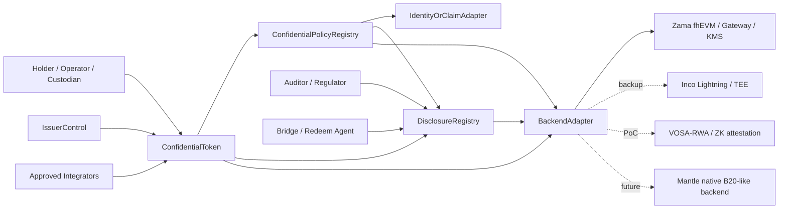
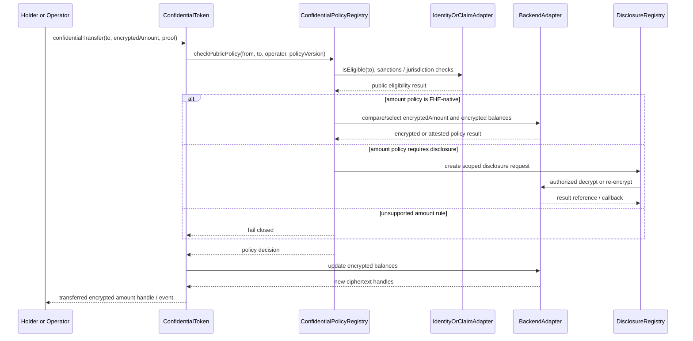
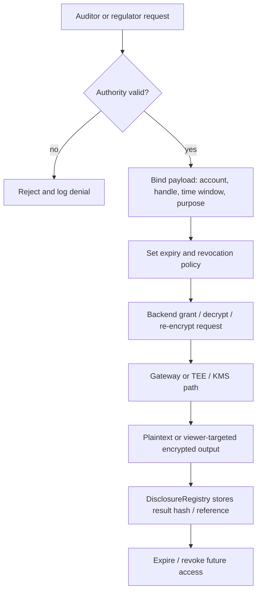
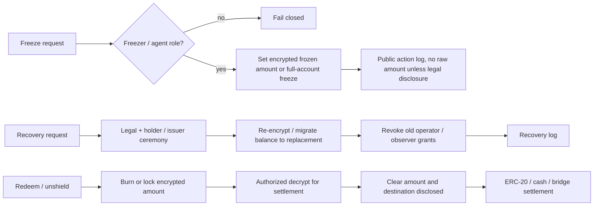

# Mantle Confidential Compliance Token 协议设计

## Executive Summary

本 draft 将 WHI-271 的路线裁决落成 Mantle Confidential Compliance Token, 简称 CCT, 的 phase 1 协议方案。核心建议是：**phase 1 采用 ERC-3643-style identity / policy / issuer controls + ERC-7984 / OpenZeppelin-style confidential value interface + scoped DisclosureRegistry + replaceable Backend Adapter**。这不是把 Mantle 改造成 Base B20 的 native precompile，也不是押注单一隐私厂商；它是一个 application / coprocessor hybrid，目标是在不硬分叉、不换 VM 的前提下，先把 confidential asset 的最小闭环做出来。

必须先澄清用户直觉中的 "Base B20 token + private feature"：B20 对本方案有价值，但价值在 **合规和 policy 语汇**，例如 PolicyRegistry、ActivationRegistry、RBAC、sender / receiver / executor / mint receiver scopes、Asset / Stablecoin variants。`route-comparison/final.md` §3.2 的靶向检查没有在 Base B20 precompile surface 中发现任何 confidential / private extension。换言之，B20 的 PolicyRegistry / ActivationRegistry 是权限和合规原语，不是隐私原语。今天可落地的 "B20 + private feature" 实现路径是 **ERC-7984 / backend overlay**；未来如果 Mantle 愿意投入 client / fork / audit / governance 成本，才可能演进为 native B20-like confidential backend。

Phase 1 的协议边界如下：

| Plane | Phase 1 decision | Reason |
|---|---|---|
| Compliance policy plane | 使用公开或许可公开的 identity, KYC, sanctions, blocklist, policy ID, issuer role | ERC-3643 和 B20 都是合规 / 权限语汇；监管执行通常需要可审计规则 |
| Confidential accounting plane | 使用 encrypted balance, encrypted transfer amount, encrypted frozen / recoverable balance, backend-specific ciphertext handle | ERC-7984 明确以 pointer / handle 表示 amount 和 balance；OZ 实现用 Zama fhEVM encrypted values |
| Disclosure plane | 独立 DisclosureRegistry 记录 request, grant, actor, payload, scope, expiry, revocation, result reference | 避免 "full history viewing key" 成为默认合规方案 |
| Issuer control plane | mint, burn, pause, freeze, recovery, redeem roles 分权并记录审计日志 | ERC-3643 Agent role 和 B20 RBAC 都要求发行方控制，但 confidential state 需要重新定义语义 |
| Backend plane | Zama / ERC-7984-like backend 为主候选，Inco / VOSA-RWA / native B20-like 为替换点 | WHI-271 选择 backend-replaceable overlay；Zama 最完整但 Mantle support 仍是 gate |

本设计的最小 MVP 是：发行方能部署 CCT；合格 holder 能 shield / mint 后获得 encrypted balance；holder 或 operator 能 confidential transfer；policy layer 能同步执行明文 identity / blocklist 检查，并对 amount-sensitive rules 走 FHE-native policy、selective decrypt 或 fail-closed；auditor / regulator / issuer agent 能按 scope 做 disclosure；issuer 能 freeze / recover / burn / redeem；redeem / bridge 明确成为有意披露边界。

**Verdict**: phase 1 可进入 architecture spike / PoC / backend readiness evaluation。生产发布前的 blocking gates 是 Mantle backend availability, amount-dependent policy implementation, disclosure governance, issuer/admin governance, and engineering / deployment delta。

Evidence note: derived from `route-comparison/final.md` @ `1728caccb5c0d3ffe1d1d9ee1c1d860ab435736c`, especially §§1, 2.4, 3.1, 3.2, 8.1; `compliance-token-private-extension/final.md` @ same commit, especially §§1, 2, 3, 5, 6, 8; `zama-confidential-rwa/final.md` @ same commit, especially §§1, 2, 3.3, 4, 5, 6.

## Item Findings

### item-1: 协议目标、非目标与 phase boundary

Mantle CCT 的目标不是 "隐私版 ERC-20" 的泛化版本，而是 regulated confidential asset 的最小协议闭环。它必须同时满足：

1. **资产隐私**：ordinary public observers 不能读取 holder balance 或 transfer amount。
2. **合规执行**：issuer / policy admin 能阻止不合规 sender, receiver, operator, mint receiver 和受限操作。
3. **选择性披露**：合法 actor 能按账户、时间、交易、金额、余额或 redeem request 的 scope 获得披露。
4. **发行方控制**：mint, burn, pause, freeze, recovery, forced action 和 redeem 仍可被授权角色执行。
5. **后端可替换**：公开接口不暴露 Zama `euint64`, Inco encrypted type, VOSA proof encoding 或 future native precompile 的内部表示。

#### Goals / non-goals table

| Category | Phase 1 position | Phase 2 / excluded position | Source anchor |
|---|---|---|---|
| Confidential accounting | Must support encrypted balances and encrypted transfer amounts through ERC-7984-like handles | Native encrypted accounting only if Mantle later funds protocol route | ERC-7984 EIP, accessed 2026-06-24; OZ token docs, accessed 2026-06-24 |
| Compliance policy | Plain identity, KYC, sanctions, receiver eligibility, policy ID and role state are first-class | Private identity and encrypted legal identity are non-goals | ERC-3643 EIP, accessed 2026-06-24 |
| Amount-sensitive compliance | Must choose FHE-native rule, selective decrypt, or unsupported / fail-closed per policy | Generic encrypted policy engine is phase 2 | `zama-confidential-rwa/final.md` §3.3 |
| B20 capability language | Reuse PolicyRegistry / ActivationRegistry / RBAC / scopes as vocabulary | Do not claim current B20 confidentiality; native B20-like private route is phase 2 | Base B20 docs, accessed 2026-06-24; `route-comparison/final.md` §3.2 |
| Disclosure / audit | Scoped DisclosureRegistry plus backend grants / decrypt / re-encrypt | Protocol disclosure registry later | Zama ACL, Gateway, KMS docs, accessed 2026-06-24 |
| Issuer controls | Define confidential mint, burn, freeze, recovery, pause, redeem and audit logging | Native agent precompile optional later | ERC-3643 EIP; OZ ERC7984Rwa / Freezable docs |
| Anonymity / graph privacy | Non-goal; addresses, event types and timings remain visible unless add-on component is chosen | Privacy Pools / Railgun / note-pool component outside CCT core | `route-comparison/final.md` §§3.3, 8 |
| Generic private contracts | Non-goal; token-specific confidential value only | Separate private workflow track | `route-comparison/final.md` §4 |
| Native Mantle precompile | Non-goal for phase 1 | Phase 2 native B20-like optimization | `compliance-token-private-extension/final.md` §§2, 6, 7 |

The most important phase boundary is the separation between **product requirement** and **production implementation**. Encrypted balance / amount is mandatory for the product to be CCT. It becomes a phase 1 production implementation only if a named backend has Mantle production support or a credible near-term self-host / partner support path. Otherwise phase 1 should be labeled design + PoC / testnet, not production-ready.

### item-2: 模块边界与 architecture

The protocol should be split into six modules. The split exists to prevent three failure modes: policy code trying to read ciphertext as plaintext, token code holding legal identity state, and disclosure logic becoming a hidden global viewing key.

| Module | Layer | Owns | Must not own | Evidence |
|---|---|---|---|---|
| `ConfidentialToken` | token_core | ERC-7984-like confidential balances, transfer functions, encrypted total supply, events, hooks to policy / disclosure / backend | KYC source of truth, legal identity registry, backend key material | ERC-7984 EIP; OZ ERC7984 docs |
| `ConfidentialPolicyRegistry` | policy_registry | policy IDs, scopes, public identity / blocklist rules, encrypted-rule routing, policy versioning, B20-inspired `updatePolicy` | raw FHE operations except through backend adapter; issuer legal docs | ERC-3643 Compliance; Base B20 PolicyRegistry |
| `DisclosureRegistry` | disclosure_registry | disclosure request / grant / log lifecycle, actor authority, payload, scope, expiry, revocation, result hash / reference | raw plaintext balances or transfer amounts as durable state | Zama ACL / Gateway / KMS; OZ ObserverAccess |
| `IssuerControl` | issuer_control | mint, burn, pause, freeze, recovery, redeem roles; multisig / timelock; emergency actions | unlogged owner superpower, backend keys | ERC-3643 Agent role; B20 RBAC; OZ ERC7984Rwa |
| `IdentityOrClaimAdapter` | identity_adapter | address-to-identity / claim binding, KYC / sanctions / accreditation status, trusted issuer mapping | private identity protocol, global DID mandate | ERC-3643 Identity Registry |
| `BackendAdapter` | backend_adapter | encrypted input validation, arithmetic, compare / select, decrypt, re-encrypt, grant, revoke, capability flags, SLA hooks | token policy semantics, issuer governance | Zama docs; Inco docs; route comparison |

#### diag-1: six-module protocol architecture



Implementation note: `BackendAdapter` is not optional if values are confidential. Even if phase 1 uses a single backend, the core token interface should see only opaque encrypted handles, input proofs, decrypt request IDs, and capability flags.

### item-3: 核心接口与 alignment matrix

The public protocol should use backend-neutral types at the CCT boundary:

- `bytes32 encryptedAmount` or `bytes ciphertextHandle` in interface sketches, with implementation adapters mapping to `euint64`, Inco handles, VOSA proofs or native handles.
- `bytes proof` for input validity, attestation, authorization or implementation-specific payloads.
- `DisclosureRequest` and `PolicyConfig` structs whose fields are public metadata, not raw plaintext amounts unless the function is explicitly a disclosure / redeem boundary.

#### Core interface table

| Interface | Sketch | Alignment | Phase | Failure semantics | Notes |
|---|---|---|---|---|---|
| `confidentialBalanceOf(address account)` | returns encrypted handle or viewer-targeted encrypted payload | ERC-7984-aligned | phase_1_must_have | no plaintext return; unauthorized viewer gets no decrypt path | ERC-7984 defines confidential balance as pointer / handle; OZ returns `euint64` |
| `confidentialTransfer(address to, bytes32 encryptedAmount, bytes proof)` | sender transfers encrypted amount | ERC-7984-aligned | phase_1_must_have | fail closed if identity, proof, backend, or policy gate fails | Amount is encrypted; receiver address remains visible |
| `confidentialTransferFrom(address from, address to, bytes32 encryptedAmount, bytes proof)` | operator / custody transfer | ERC-7984-aligned + Mantle-specific policy | phase_1_must_have | fail closed if caller lacks operator right or policy blocks executor | ERC-7984 operator is time-bounded but may move any amount while active; requires UX warning |
| `mint(address to, bytes32 encryptedAmount, bytes proof)` | issuer mints encrypted amount | ERC-3643-aligned issuer + ERC-7984 value | phase_1_must_have | fail closed if receiver not eligible or amount proof invalid | Receiver KYC / mint-receiver policy is plaintext |
| `burn(address from, bytes32 encryptedAmount, bytes proof)` | issuer or holder burns encrypted amount | ERC-3643-aligned + ERC-7984 value | phase_1_must_have | fail closed unless burn actor and amount handle are valid | May feed redeem / unshield |
| `shield(address to, uint256 clearAmount)` | wrap public ERC-20 / asset into confidential representation | OZ Wrapper-aligned + Mantle-specific | phase_1_optional | revert if underlying transfer fails; clear amount visible | This is a deliberate privacy boundary at entry |
| `unshield(address from, bytes32 encryptedAmount, address recipient)` | unwrap / redeem to public asset, cash leg or bridge | OZ Wrapper-aligned + Mantle-specific | phase_1_optional, required if redeem exists | async decrypt / finalize; fail closed on invalid proof | Clear amount and destination become settlement evidence |
| `freeze(address account, bytes32 encryptedAmount, FreezeMode mode)` | full or partial confidential freeze | ERC-3643-aligned + OZ Freezable / RWA | phase_1_must_define | if backend lacks partial freeze, full freeze only | Partial freeze needs encrypted available balance logic |
| `recover(address lost, address replacement, bytes recoveryData)` | migrate encrypted balance / rights | ERC-3643-aligned + Mantle-specific | phase_1_must_define | require recovery ceremony, re-encryption, revocation and log | Must not leak unrelated holder state |
| `disclose(bytes32 handle, DisclosureRequest request)` | authorized audit / compliance disclosure | ERC-7984 / OZ disclosure-aligned + Mantle-specific | phase_1_must_have | async callback or offchain result; unauthorized requests fail closed | Scope, actor, payload, expiry, revocation required |
| `updatePolicy(bytes32 policyId, PolicyConfig config)` | bind or upgrade scoped policy | B20-inspired + ERC-3643-aligned | phase_1_must_have | timelock/version; unsupported encrypted rules fail closed | B20-inspired means policy vocabulary only, not B20 confidentiality |

#### B20 language guardrail

`updatePolicy` is intentionally marked `B20-inspired`, not `B20-confidential`. Base B20 docs describe policy IDs, allowlist / blocklist policy types, ActivationRegistry gating, and fixed transfer / mint policy scopes. They do not provide confidential balances, encrypted transfer amounts, FHE operations, selective decrypt, or private policy evaluation. Any phase 1 CCT implementation claiming B20 compatibility must state that confidentiality is supplied by ERC-7984 / backend overlay, not by current B20.

Evidence note: ERC-7984 EIP accessed 2026-06-24; OpenZeppelin Confidential Contracts token and API docs accessed 2026-06-24; Base B20 docs accessed 2026-06-24; `route-comparison/final.md` §3.2; `compliance-token-private-extension/final.md` §2.

### item-4: 状态模型

Phase 1 should not encrypt every state variable. Over-encryption would make policy, indexing, issuer operations and legal audit harder without solving the actual leakage goals. The correct split is:

| State class | Examples | Visibility | Owner / updater | Leakage and control note |
|---|---|---|---|---|
| public_state | token metadata, symbol, decimals, contract URI, role IDs, registry addresses, policy IDs, pause status, events that a transfer happened | public or permissioned public | ConfidentialToken / IssuerControl | Address graph and timing remain visible |
| ciphertext_state | balances, transfer amounts, frozen balance, recoverable balance, confidential total supply, optional confidential operator spend limit | ciphertext handle; plaintext only via disclosure | ConfidentialToken + BackendAdapter | Must track ACL and authorized computations |
| policy_state | policy scopes, trusted issuers, claim topics, sanctions list refs, jurisdiction class, amount-limit rule class, backend capability requirement | mostly public; thresholds may be encrypted | ConfidentialPolicyRegistry | Public rules are acceptable; encrypted threshold requires backend |
| disclosure_state | request ID, requester, authority, payload, account, time window, expiry, revocation, result hash, offchain reference | public or restricted log; no raw plaintext | DisclosureRegistry | Logs prove process without publishing values |
| issuer_admin_state | issuer, policy admin, compliance officer, recovery agent, freezer, auditor admin, upgrade admin, timelock | public governance state | IssuerControl | Powerful roles need multisig, timelock and legal trigger policy |
| offchain_backend_state | KMS key shares, Gateway state, attestation, decrypt result delivery, TEE logs, FHE coprocessor state | backend-specific | backend operators | Must be covered by SLA, audit and incident process |

#### diag-6: state model hierarchy

```text
Mantle CCT state
├── public_state
│   ├── metadata, registry addresses, policy IDs, roles
│   └── address / event graph and operation type
├── ciphertext_state
│   ├── balances, amounts, frozen balances
│   └── optional encrypted counters and spend limits
├── policy_state
│   ├── KYC / sanctions / blocklist / allowlist
│   └── encrypted-policy capability requirements
├── disclosure_state
│   ├── request / grant / expiry / revocation
│   └── result hash or offchain reference, not raw plaintext
└── issuer_admin_state
    ├── issuer, agent, freezer, recovery, auditor roles
    └── timelock, upgrade and emergency controls
```

The practical implication is that compliance facts and ciphertext facts meet only through explicitly modeled gateways: plaintext policy checks, FHE-native checks, selective decrypt, or fail-closed. There should be no implicit assumption that a Solidity policy module can inspect `encryptedAmount`.

### item-5: 关键流程

#### Required flow table

| Flow | Actors | Public inputs / state | Ciphertext inputs / state | Policy gate | Disclosure boundary | Failure semantics |
|---|---|---|---|---|---|---|
| Issuance / deployment | issuer, policy admin, backend operator | token metadata, registry addresses, roles, policy IDs | none initially | admin / timelock | role setup public | block launch if backend or registry missing |
| KYC onboarding | holder, KYC provider, issuer | address, identity claim, jurisdiction, sanctions status if chosen | optional encrypted identity attributes are out of scope | identity / claim eligibility | issuer can see KYC by design | not verified means cannot receive / mint |
| Mint / wrap / shield | issuer or holder, wrapper | receiver, underlying deposit amount if shield, mint event metadata | encrypted minted amount and new balance | mint role, receiver policy | shield amount visible if public ERC-20 enters wrapper | fail closed on receiver, proof or backend error |
| Confidential transfer | sender / operator, receiver, token, policy, backend | from, to, operator, policy IDs, event existence | encrypted amount, balances, frozen balances | identity / blocklist plus FHE-native or decrypt amount policy | none unless policy requests disclosure | fail closed or zero-transfer/select pattern, explicitly chosen |
| Compliance check | token, policy registry, identity adapter, backend | KYC, sanctions, jurisdiction, policy version | amount, balance, holder limit, encrypted counters | public check plus encrypted check | selective decrypt only if policy allows | unsupported amount rule blocks production or fails closed |
| Audit disclosure | auditor, regulator, issuer, disclosure admin, backend | request, actor, scope, expiry, legal basis, result ref | balance / amount handle | disclosure authority and scope | decrypt / re-encrypt to authorized actor | reject unauthorized or expired request |
| Freeze / recovery | issuer agent, recovery agent, holder | account, legal trigger, role event | frozen balance, recovered balance, re-encryption handle | freezer / recovery role, policy | optional legal disclosure to issuer / auditor | full freeze if partial unavailable; recovery ceremony required |
| Redeem / unshield | holder, issuer, custodian, bridge / redeem agent | recipient, settlement rail, legal redemption record | burn / unwrap encrypted amount until finalization | holder eligibility and issuer liquidity | clear amount and destination disclosed to settlement leg | async decrypt / finalize or fail closed |
| Bridge constraint | holder, bridge, remote issuer | source / destination account and bridge event | amount handle until bridge settlement | bridge allowlist and disclosure policy | phase 1 defaults to unshield / re-shield or logged approved bridge | no claim of fully private cross-chain transfer |

#### diag-2: confidential transfer with public policy plus encrypted policy



#### diag-3: audit disclosure lifecycle



#### diag-4: freeze, recovery, redeem boundaries



### item-6: 后端抽象与 replaceability plan

Backend replacement is a protocol requirement, not just an engineering preference. If the token API exposes a Zama-specific type, Inco callback shape, or native precompile selector, Mantle loses the option to re-run the WHI-271 route comparison later.

#### Backend capability interface

| Capability | Phase 1 requirement | Fallback if absent |
|---|---|---|
| encrypted input validation | required | backend cannot support CCT transfer |
| encrypted add / sub | required | backend cannot support encrypted accounting |
| encrypted compare / select | required for amount policy; optional for identity-only PoC | selective decrypt or fail closed |
| scoped decrypt | required for audit / redeem / recovery | no production audit / redeem |
| re-encrypt / viewer-targeted output | required for holder / auditor UX | plaintext disclosure only, lower privacy |
| grant / revoke / expiry metadata | required at registry level even if backend revocation is future-only | mark historical access persistent |
| confidential freeze | required to avoid exposing frozen amount | full-account freeze fallback |
| latency / SLA observability | required before production | PoC only |
| attestation / proof verification | required for TEE / ZK backend | backend not production-eligible |

#### diag-5: backend abstraction matrix

```text
Backend                    | Reusable in phase 1                         | Not reusable / gate
-------------------------- | ------------------------------------------- | ----------------------------------------------
Zama fhEVM + OZ            | encrypted balances, FHE ops, ACL, Gateway,  | Mantle support unproven; KMS/Gateway governance;
                           | KMS, ObserverAccess, Wrapper, Freezable     | ACL history and performance SLA need validation

Inco Lightning             | confidential compute on Base, TEE path,     | Mantle support not evidenced; TEE trust,
                           | private data types and access controls      | attestation, callback and force-exit model

Inco confidential ERC20    | engineering PoC reference for module shape  | do not copy unaudited PoC into production

VOSA-RWA / VOSA-20         | lightweight PoC for exposed-graph RWA       | forum / PoC maturity, audit gap, graph leakage,
                           | compliance attestation                      | freeze / force-transfer weakness

Native B20-like future     | policy / RBAC / activation native route     | phase 2 only; requires Mantle client, fork,
                           | if Mantle funds protocol work               | governance, audit and native confidentiality

Generic future backend     | keeps interface neutral                     | must pass same capability, audit and SLA gates
```

#### Backend-specific conclusions

| Backend | Draft disposition | Required Mantle gate |
|---|---|---|
| Zama / ERC-7984 / OZ | Primary candidate for architecture and PoC because it has the clearest standard and implementation surface | Verify Mantle host-chain support or self-host Gateway / KMS / coprocessor feasibility; build FHE-native policy or accepted selective-decrypt path |
| Inco Lightning | Backup candidate and independent pressure test because docs claim Base Mainnet / Base Sepolia live and no new chain / wallet | Obtain Mantle support statement, TEE attestation model, decryption and liveness guarantees, audit posture |
| VOSA-RWA | PoC fallback for compliance-attestation appetite, not production route | Security review, production code, issuer controls and graph-leak acceptance |
| Native B20-like | Phase 2 future backend, not phase 1 requirement | Mantle client / fork budget, spec, security review and governance approval |

Evidence note: Zama overview, ACL, Gateway and KMS docs accessed 2026-06-24; Inco introduction and architecture docs accessed 2026-06-24; `route-comparison/final.md` §§2.4, 5, 6, 7; `compliance-token-private-extension/final.md` §5.

### item-7: 风险、开放问题与 review gates

The risk register is organized by blocking effect. A `blocking` severity means the project should not claim phase 1 production readiness until the mitigation is designed and verified. A `high` severity can pass for PoC with explicit caveat but not for production without owner acceptance.

| Risk label | Category | Severity | Why it matters | Required mitigation | Owner |
|---|---|---|---|---|---|
| backend_mantle_support | cryptographic/backend | blocking | No CCT production deployment exists if the chosen backend cannot run on Mantle or an accepted host path | Confirm supported host chain, self-host path, or Base-first PoC boundary; pin deployment target | protocol + backend partner |
| amount_policy_gap | compliance/protocol | blocking | ERC-3643 `canTransfer(from,to,amount)` assumes plaintext amount; CCT amount is encrypted | Implement FHE-native policy, selective decrypt policy, or mark amount rules unsupported / fail-closed | protocol + compliance engineering |
| engineering_complexity_deployment_delta | engineering/operations | blocking | Running FHE backend plus six registries adds contract, SDK, indexer, disclosure service, auditor UX, key ceremony, monitoring, audits and incident response burden; this is not captured by performance alone | Create deployment runbook, registry ownership model, adapter conformance tests, audit scope, operator SLA, incident playbook and phased PoC-to-prod gate | engineering lead + security + operations |
| kms_gateway_governance | cryptographic/backend | high | Decrypt, audit and recovery depend on Gateway / KMS / coprocessor liveness and governance | Operator set, threshold policy, key rotation, incident process, independent security review | backend partner + security |
| tee_trust | cryptographic/backend | high | Inco / TEE path shifts trust to enclave, attestation and operator liveness | Public attestation model, enclave upgrade policy, force-exit and fallback semantics | backend partner + security |
| auditor_disclosure_backdoor | disclosure/governance | high | Observer / auditor access can become a privacy backdoor | Scope grants, expiry, revocation status, role split, audit logs, compromise response | compliance + security |
| issuer_abuse_admin_capture | governance | high | Freeze, recovery and force action are powerful and can be abused | Multisig, timelock, legal trigger policy, transparency log, emergency pause limit | issuer + governance |
| acl_revocation_history | disclosure/backend | high | Permanent or historical grants may remain usable even after UI-level revocation | Prefer transient / scoped grants; mark historical access persistent unless cryptographically disproven | security + backend partner |
| bridge_redeem_leakage | integration | high | Settlement often reveals amount, destination and legal context | Treat redeem / bridge as intentional disclosure; log scope and recipient; avoid private bridge overclaim | bridge / custodian |
| metadata_graph_leakage | privacy | medium/high | Phase 1 does not hide address graph, timing, event type, policy status or memo linkage | Document residual leakage; avoid public memo; optional source-of-funds supplement outside CCT core | product + privacy review |
| defi_composability | integration | medium/high | ERC-7984 operator semantics and encrypted balances break ERC-20 allowance assumptions | Approved integrator model, operator UX warnings, time limits, simulation / decrypt UX | protocol + wallet |
| backend_lock_in | architecture | medium/high | Backend-specific handles and services can leak into app code | Backend-neutral interface, adapter tests, migration plan, capability flags | protocol architecture |
| performance_sla | operations | medium/high | Transfer, disclosure, recovery and redeem latency affects user trust and settlement | p50 / p95 benchmarks, retry semantics, timeout handling, dashboard | engineering + backend partner |
| privacy_not_compliance | product | medium | Encrypted balances do not solve KYC, sanctions or issuer obligations | Keep identity / policy plane explicit and auditable | compliance |
| compliance_not_privacy | product | medium | ERC-3643 or B20 policy registries do not provide confidentiality | Ensure CCT claims always name confidential backend | product + protocol |

#### Review gates before production claim

1. Chosen backend has a documented Mantle support path or a deliberate non-Mantle PoC boundary.
2. At least one amount-dependent policy is implemented and tested with encrypted values, or the product explicitly excludes amount rules.
3. DisclosureRegistry has role split, request approval, expiry, revocation status, result reference and compromise response.
4. IssuerControl roles are separated and governed by multisig / timelock / legal trigger policy.
5. Engineering complexity runbook exists: deployment, monitoring, audits, conformance tests, operator ownership, incident response.
6. Redeem / bridge flow documents exact plaintext disclosure boundary.
7. B20 language is reviewed so no reader can infer current B20 confidential capability.

### item-8: Evidence map and traceability

| Claim / section | Source anchors |
|---|---|
| Route shape: ERC-3643 + ERC-7984/OZ overlay, backend-replaceable | `confidential-compliance-token-research/research-sections/route-comparison/final.md` @ `1728caccb5c0d3ffe1d1d9ee1c1d860ab435736c`, §§1, 2.4, 3.1, 8 |
| B20 supplies policy vocabulary, not confidentiality | `route-comparison/final.md` §3.2; `compliance-token-private-extension/final.md` §§2, 6, 7; Base B20 docs accessed 2026-06-24 |
| ERC-7984 pointer / handle confidential amount model | `https://eips.ethereum.org/EIPS/eip-7984`, accessed 2026-06-24 |
| ERC-3643 identity / compliance / agent model and plaintext amount tension | `https://eips.ethereum.org/EIPS/eip-3643`, accessed 2026-06-24; `zama-confidential-rwa/final.md` §3.3 |
| OZ confidential token, wrapper, freezable, observer, restricted and RWA extensions | `https://docs.openzeppelin.com/confidential-contracts/token`, `https://docs.openzeppelin.com/confidential-contracts/api/token`, accessed 2026-06-24 |
| Zama Gateway / KMS / ACL and FHE backend risks | `https://docs.zama.org/protocol/protocol/overview`, `/gateway`, `/kms`, `/solidity-guides/smart-contract/acl`, accessed 2026-06-24; `zama-confidential-rwa/final.md` §§2, 5, 6 |
| Inco as backup backend | `https://docs.inco.org/introduction`, `https://docs.inco.org/architecture/overview`, accessed 2026-06-24; `route-comparison/final.md` §§2.4, 7 |
| VOSA and other candidates | `route-comparison/final.md` §§2.4, 7; prior candidate survey through WHI-271 source bundle |
| Bridge / redeem disclosure boundary | `route-comparison/final.md` §§1, 8; OZ wrapper docs; `zama-confidential-rwa/final.md` §§4, 5 |
| Engineering / deployment delta | Synthesized from `route-comparison/final.md` dimensions `engineering_delta`, `deployment_lightweight`, `performance_predictability`; Zama / Inco operational docs; six-module CCT architecture in this draft |

## Diagrams

All required diagrams are embedded in Item Findings:

| ID | Location | Status |
|---|---|---|
| diag-1 | item-2 | six-module architecture produced |
| diag-2 | item-5 | confidential transfer flow produced |
| diag-3 | item-5 | audit disclosure lifecycle produced |
| diag-4 | item-5 | freeze / recovery / redeem boundary produced |
| diag-5 | item-6 | backend matrix produced |
| diag-6 | item-4 | state hierarchy produced |

## Source Coverage

| Requirement | Coverage | Notes |
|---|---|---|
| src-1 prior_research_final, min 3 | covered | route-comparison, compliance-token-private-extension, zama-confidential-rwa finals read from current branch at commit `40c8f77`; their integrated base commit is `1728caccb5c0d3ffe1d1d9ee1c1d860ab435736c` |
| src-2 official_standard, min 2 | covered | ERC-7984 EIP and ERC-3643 EIP, accessed 2026-06-24 |
| src-3 official_implementation_docs, min 4 | covered | OpenZeppelin token docs and API docs; Zama overview, ACL, Gateway and KMS docs, accessed 2026-06-24 |
| src-4 official_or_primary_backend_docs, min 2 | covered | Zama docs and Inco docs, accessed 2026-06-24; VOSA handled through prior route comparison because no stronger primary source was required for this draft |
| src-5 official_b20_docs, min 1 | covered | Base B20 docs, accessed 2026-06-24 |
| src-6 risk_evidence, min 8 | covered | risk table includes evidence from prior finals, official standards/docs and synthesis notes for all high/blocking rows |

## Gap Analysis

1. **Mantle backend support remains unproven**. This draft can specify a backend-neutral protocol, but production readiness requires Zama, Inco or an equivalent backend to support Mantle or a deliberately scoped non-Mantle PoC.
2. **Amount-dependent compliance is the hardest technical spike**. Plain ERC-3643 modules are not compatible with encrypted amounts as-is. The project must choose FHE-native policy, selective decrypt, or fail-closed exclusion.
3. **Disclosure revocation is backend-specific**. Registry-level revocation can stop future authorized use, but historical backend access must be treated as persistent unless the chosen backend proves otherwise.
4. **Inco evidence is backup evidence, not Mantle proof**. Inco docs say Lightning is live on Base Mainnet / Base Sepolia and uses TEEs; they do not prove Mantle support.
5. **VOSA remains PoC-only in this design**. It may test institutional appetite for exposed-graph compliance attestation, but it should not be a production route without audit, code and issuer-control evidence.
6. **B20 native path remains phase 2**. Base B20 is native, policy-rich and useful as a vocabulary, but current evidence does not show confidential/private extension. Mantle native confidential B20-like design needs a separate protocol specification and fork plan.
7. **Graph, timing and metadata privacy are residual leaks**. CCT phase 1 hides values, not transaction existence, address graph, policy events or public memo linkage.
8. **Engineering/deployment delta needs its own owner**. A six-module protocol plus confidential backend is an operational system, not a single token contract. The product should not progress beyond PoC without a deployment owner and runbook.

## Revision Log

| Round | Action | Summary |
|---|---|---|
| 1 | initial_draft | Produced full deep draft from approved outline. Covered all eight outline items, six diagrams, source coverage, gaps and a risk register. Addressed required minor feedback by explicitly bounding B20 as policy/compliance vocabulary only and adding a standalone engineering-complexity / deployment-delta blocking risk. |
