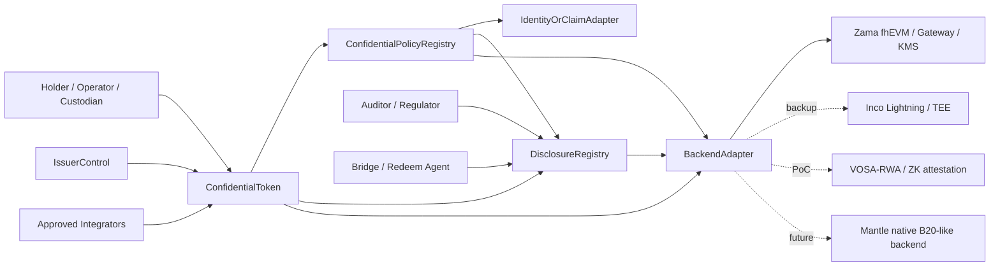
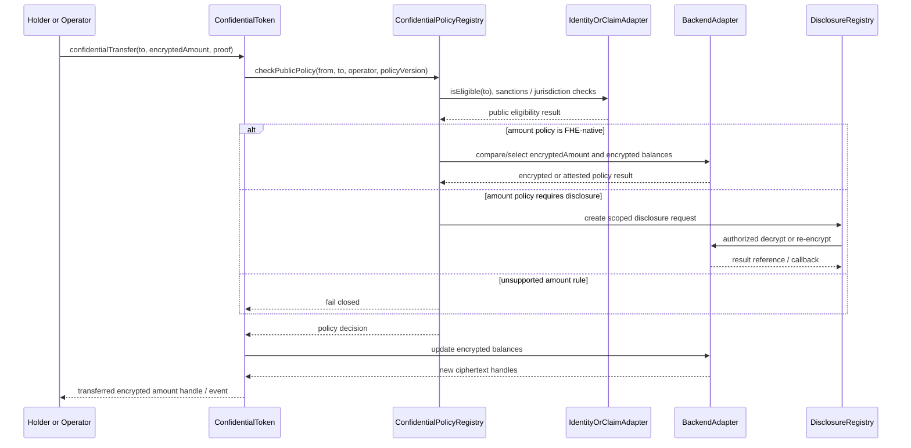
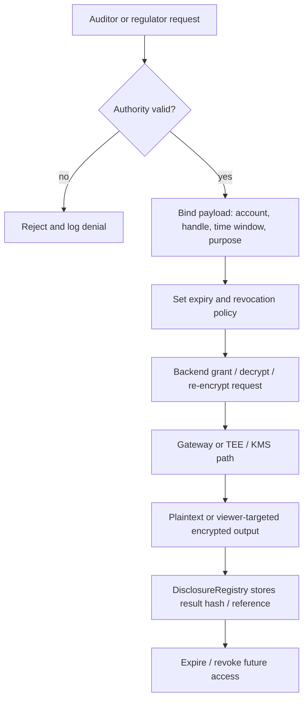
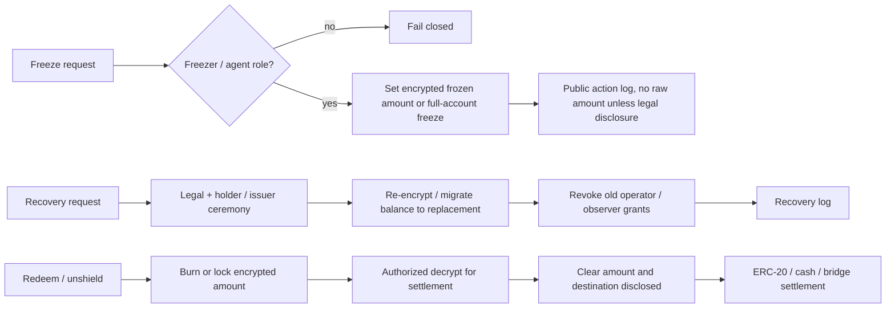

# Mantle Confidential Compliance Token 协议设计

## 执行摘要（Executive Summary）

本 draft 将 WHI-271 的路线裁决落成 Mantle Confidential Compliance Token, 简称 CCT, 的 phase 1 协议方案。核心建议是：**phase 1 采用 ERC-3643-style identity / policy / issuer controls + ERC-7984 / OpenZeppelin-style confidential value interface + scoped DisclosureRegistry + replaceable Backend Adapter**。这不是把 Mantle 改造成 Base B20 的 native precompile，也不是押注单一隐私厂商；它是一个 application / coprocessor hybrid，目标是在不硬分叉、不换 VM 的前提下，先把 confidential asset 的最小闭环做出来。

必须先澄清用户直觉中的 "Base B20 token + private feature"：B20 对本方案有价值，但价值在 **合规和 policy 语汇**，例如 PolicyRegistry、ActivationRegistry、RBAC、sender / receiver / executor / mint receiver scopes、Asset / Stablecoin variants。`route-comparison/final.md` §3.2 的靶向检查没有在 Base B20 precompile surface 中发现任何 confidential / private extension。换言之，B20 的 PolicyRegistry / ActivationRegistry 是权限和合规原语，不是隐私原语。今天可落地的 "B20 + private feature" 实现路径是 **ERC-7984 / backend overlay**；未来如果 Mantle 愿意投入 client / fork / audit / governance 成本，才可能演进为 native B20-like confidential backend。

Phase 1 的协议边界如下：

| 平面（Plane） | Phase 1 决策 | 理由 |
|---|---|---|
| 合规策略平面（Compliance policy plane） | 使用公开或许可公开的 identity, KYC, sanctions, blocklist, policy ID, issuer role | ERC-3643 和 B20 都是合规 / 权限语汇；监管执行通常需要可审计规则 |
| 机密记账平面（Confidential accounting plane） | 使用 encrypted balance, encrypted transfer amount, encrypted frozen / recoverable balance, backend-specific ciphertext handle | ERC-7984 明确以 pointer / handle 表示 amount 和 balance；OZ 实现用 Zama fhEVM encrypted values |
| 披露平面（Disclosure plane） | 独立 DisclosureRegistry 记录 request, grant, actor, payload, scope, expiry, revocation, result reference | 避免 "full history viewing key" 成为默认合规方案 |
| 发行方控制平面（Issuer control plane） | mint, burn, pause, freeze, recovery, redeem roles 分权并记录审计日志 | ERC-3643 Agent role 和 B20 RBAC 都要求发行方控制，但 confidential state 需要重新定义语义 |
| 后端平面（Backend plane） | Zama / ERC-7984-like backend 为主候选，Inco / VOSA-RWA / native B20-like 为替换点 | WHI-271 选择 backend-replaceable overlay；Zama 最完整但 Mantle support 仍是 gate |

本设计的最小 MVP 是：发行方能部署 CCT；合格 holder 能 shield / mint 后获得 encrypted balance；holder 或 operator 能 confidential transfer；policy layer 能同步执行明文 identity / blocklist 检查，并对 amount-sensitive rules 走 FHE-native policy、selective decrypt 或 fail-closed；auditor / regulator / issuer agent 能按 scope 做 disclosure；issuer 能 freeze / recover / burn / redeem；redeem / bridge 明确成为有意披露边界。

**裁决（Verdict）**: phase 1 可进入 architecture spike / PoC / backend readiness evaluation。生产发布前的 blocking gates 是 Mantle backend availability, amount-dependent policy implementation, disclosure governance, issuer/admin governance, 以及 engineering / deployment delta。

证据说明：源自 `route-comparison/final.md` @ `1728caccb5c0d3ffe1d1d9ee1c1d860ab435736c`，尤其是 §§1, 2.4, 3.1, 3.2, 8.1；`compliance-token-private-extension/final.md` @ 同一 commit，尤其是 §§1, 2, 3, 5, 6, 8；`zama-confidential-rwa/final.md` @ 同一 commit，尤其是 §§1, 2, 3.3, 4, 5, 6。

## 逐项发现（Item Findings）

### item-1: 协议目标、非目标与 phase boundary

Mantle CCT 的目标不是 "隐私版 ERC-20" 的泛化版本，而是 regulated confidential asset 的最小协议闭环。它必须同时满足：

1. **资产隐私**：ordinary public observers 不能读取 holder balance 或 transfer amount。
2. **合规执行**：issuer / policy admin 能阻止不合规 sender, receiver, operator, mint receiver 和受限操作。
3. **选择性披露**：合法 actor 能按账户、时间、交易、金额、余额或 redeem request 的 scope 获得披露。
4. **发行方控制**：mint, burn, pause, freeze, recovery, forced action 和 redeem 仍可被授权角色执行。
5. **后端可替换**：公开接口不暴露 Zama `euint64`, Inco encrypted type, VOSA proof encoding 或 future native precompile 的内部表示。

#### 目标 / 非目标表（Goals / non-goals table）

| 类别（Category） | Phase 1 立场 | Phase 2 / 排除立场 | 来源锚点（Source anchor） |
|---|---|---|---|
| 机密记账（Confidential accounting） | 必须通过 ERC-7984-like handles 支持加密余额与加密转账金额 | 仅当 Mantle 后续出资走 protocol route 时才提供原生加密记账 | ERC-7984 EIP, 访问于 2026-06-24; OZ token docs, 访问于 2026-06-24 |
| 合规策略（Compliance policy） | 明文 identity, KYC, sanctions, receiver eligibility, policy ID 与 role state 是一等公民 | 隐私身份与加密法律身份是非目标 | ERC-3643 EIP, 访问于 2026-06-24 |
| 金额敏感合规（Amount-sensitive compliance） | 必须按 policy 选择 FHE-native rule、selective decrypt 或 unsupported / fail-closed | 通用加密 policy engine 属于 phase 2 | `zama-confidential-rwa/final.md` §3.3 |
| B20 能力语汇（B20 capability language） | 复用 PolicyRegistry / ActivationRegistry / RBAC / scopes 作为语汇 | 不声称当前 B20 具备机密性；native B20-like private route 属于 phase 2 | Base B20 docs, 访问于 2026-06-24; `route-comparison/final.md` §3.2 |
| 披露 / 审计（Disclosure / audit） | scoped DisclosureRegistry 加 backend grants / decrypt / re-encrypt | protocol 级披露注册表留待以后 | Zama ACL, Gateway, KMS docs, 访问于 2026-06-24 |
| 发行方控制（Issuer controls） | 定义 confidential mint, burn, freeze, recovery, pause, redeem 及审计日志 | native agent precompile 可选，留待以后 | ERC-3643 EIP; OZ ERC7984Rwa / Freezable docs |
| 匿名 / 图隐私（Anonymity / graph privacy） | 非目标；除非选用附加组件，否则 addresses, event types 与 timings 仍可见 | Privacy Pools / Railgun / note-pool 组件位于 CCT core 之外 | `route-comparison/final.md` §§3.3, 8 |
| 通用私有合约（Generic private contracts） | 非目标；仅限 token-specific confidential value | 单独的 private workflow track | `route-comparison/final.md` §4 |
| Mantle 原生 precompile（Native Mantle precompile） | phase 1 的非目标 | Phase 2 native B20-like 优化 | `compliance-token-private-extension/final.md` §§2, 6, 7 |

最重要的 phase boundary 是 **product requirement** 与 **production implementation** 之间的区分。加密余额 / 金额对于让该产品成为 CCT 是强制要求。只有当某个具名 backend 具备 Mantle 生产支持，或有可信的近期 self-host / partner 支持路径时，它才成为 phase 1 production implementation。否则 phase 1 应被标记为 design + PoC / testnet，而非 production-ready。

### item-2: 模块边界与 architecture

协议应拆分为六个模块。该拆分的目的是防止三种失效模式：policy code 把 ciphertext 当作 plaintext 读取、token code 持有 legal identity state、以及 disclosure logic 变成一把隐藏的 global viewing key。

| 模块（Module） | 层（Layer） | 拥有（Owns） | 不得拥有（Must not own） | 证据（Evidence） |
|---|---|---|---|---|
| `ConfidentialToken` | token_core | ERC-7984-like confidential balances, transfer functions, encrypted total supply, events, 以及对 policy / disclosure / backend 的 hooks | KYC source of truth, legal identity registry, backend key material | ERC-7984 EIP; OZ ERC7984 docs |
| `ConfidentialPolicyRegistry` | policy_registry | policy IDs, scopes, public identity / blocklist rules, encrypted-rule routing, policy versioning, B20-inspired `updatePolicy` | 除经 backend adapter 外的原始 FHE operations；issuer legal docs | ERC-3643 Compliance; Base B20 PolicyRegistry |
| `DisclosureRegistry` | disclosure_registry | disclosure request / grant / log lifecycle, actor authority, payload, scope, expiry, revocation, result hash / reference | 作为持久 state 的原始明文余额或转账金额 | Zama ACL / Gateway / KMS; OZ ObserverAccess |
| `IssuerControl` | issuer_control | mint, burn, pause, freeze, recovery, redeem roles; multisig / timelock; emergency actions | 未记录日志的 owner superpower, backend keys | ERC-3643 Agent role; B20 RBAC; OZ ERC7984Rwa |
| `IdentityOrClaimAdapter` | identity_adapter | address-to-identity / claim binding, KYC / sanctions / accreditation status, trusted issuer mapping | private identity protocol, global DID mandate | ERC-3643 Identity Registry |
| `BackendAdapter` | backend_adapter | encrypted input validation, arithmetic, compare / select, decrypt, re-encrypt, grant, revoke, capability flags, SLA hooks | token policy semantics, issuer governance | Zama docs; Inco docs; route comparison |

#### diag-1: 六模块协议架构（six-module protocol architecture）



实现说明：如果 values 是 confidential，则 `BackendAdapter` 不是可选项。即便 phase 1 只用单一 backend，核心 token interface 也应只看到 opaque encrypted handles, input proofs, decrypt request IDs 与 capability flags。

### item-3: 核心接口与 alignment matrix

公开协议应在 CCT 边界使用 backend-neutral types：

- 在接口草图中使用 `bytes32 encryptedAmount` 或 `bytes ciphertextHandle`，由实现层 adapters 映射到 `euint64`, Inco handles, VOSA proofs 或 native handles。
- `bytes proof` 用于 input validity, attestation, authorization 或实现专有 payloads。
- `DisclosureRequest` 与 `PolicyConfig` 结构体的字段是公开 metadata，而非原始明文金额——除非该函数明确是 disclosure / redeem 边界。

#### 核心接口表（Core interface table）

| 接口（Interface） | 草图（Sketch） | 对齐（Alignment） | 阶段（Phase） | 失败语义（Failure semantics） | 备注（Notes） |
|---|---|---|---|---|---|
| `confidentialBalanceOf(address account)` | 返回 encrypted handle 或 viewer-targeted encrypted payload | ERC-7984-aligned | phase_1_must_have | 无明文返回；未授权 viewer 得不到 decrypt path | ERC-7984 将 confidential balance 定义为 pointer / handle；OZ 返回 `euint64` |
| `confidentialTransfer(address to, bytes32 encryptedAmount, bytes proof)` | sender 转移加密金额 | ERC-7984-aligned | phase_1_must_have | 若 identity, proof, backend 或 policy gate 失败则 fail closed | 金额加密；receiver address 仍可见 |
| `confidentialTransferFrom(address from, address to, bytes32 encryptedAmount, bytes proof)` | operator / custody 转账 | ERC-7984-aligned + Mantle-specific policy | phase_1_must_have | 若 caller 缺少 operator right 或 policy 阻止 executor 则 fail closed | ERC-7984 operator 受时间限制，但在生效期间可移动任意金额；需要 UX warning |
| `mint(address to, bytes32 encryptedAmount, bytes proof)` | issuer 铸造加密金额 | ERC-3643-aligned issuer + ERC-7984 value | phase_1_must_have | 若 receiver 不合格或 amount proof 无效则 fail closed | Receiver KYC / mint-receiver policy 为明文 |
| `burn(address from, bytes32 encryptedAmount, bytes proof)` | issuer 或 holder 销毁加密金额 | ERC-3643-aligned + ERC-7984 value | phase_1_must_have | 除非 burn actor 与 amount handle 均有效，否则 fail closed | 可能接入 redeem / unshield |
| `shield(address to, uint256 clearAmount)` | 将公开 ERC-20 / asset 包裹成机密表示 | OZ Wrapper-aligned + Mantle-specific | phase_1_optional | 若底层 transfer 失败则 revert；clear amount 可见 | 这是入口处一个有意的隐私边界 |
| `unshield(address from, bytes32 encryptedAmount, address recipient)` | 解包 / 赎回为公开资产、现金腿或 bridge | OZ Wrapper-aligned + Mantle-specific | phase_1_optional, 若存在 redeem 则必需 | async decrypt / finalize；proof 无效则 fail closed | Clear amount 与 destination 成为结算凭据 |
| `freeze(address account, bytes32 encryptedAmount, FreezeMode mode)` | 全量或部分机密冻结 | ERC-3643-aligned + OZ Freezable / RWA | phase_1_must_define | 若 backend 不支持 partial freeze，则仅全量冻结 | Partial freeze 需要 encrypted available balance 逻辑 |
| `recover(address lost, address replacement, bytes recoveryData)` | 迁移加密余额 / 权利 | ERC-3643-aligned + Mantle-specific | phase_1_must_define | 要求 recovery ceremony, re-encryption, revocation 与日志 | 不得泄露无关 holder state |
| `disclose(bytes32 handle, DisclosureRequest request)` | 授权 audit / compliance disclosure | ERC-7984 / OZ disclosure-aligned + Mantle-specific | phase_1_must_have | async callback 或链下结果；未授权请求 fail closed | 需要 scope, actor, payload, expiry, revocation |
| `updatePolicy(bytes32 policyId, PolicyConfig config)` | 绑定或升级 scoped policy | B20-inspired + ERC-3643-aligned | phase_1_must_have | timelock/version；不支持的 encrypted rules 则 fail closed | B20-inspired 仅指 policy 语汇，而非 B20 机密性 |

#### B20 语汇护栏（B20 language guardrail）

`updatePolicy` 被有意标记为 `B20-inspired`，而非 `B20-confidential`。Base B20 docs 描述的是 policy IDs, allowlist / blocklist policy types, ActivationRegistry gating 以及固定的 transfer / mint policy scopes。它们并不提供 confidential balances, encrypted transfer amounts, FHE operations, selective decrypt 或 private policy evaluation。任何声称 B20 兼容的 phase 1 CCT 实现都必须声明：机密性由 ERC-7984 / backend overlay 提供，而非由当前 B20 提供。

证据说明：ERC-7984 EIP 访问于 2026-06-24；OpenZeppelin Confidential Contracts token 与 API docs 访问于 2026-06-24；Base B20 docs 访问于 2026-06-24；`route-comparison/final.md` §3.2；`compliance-token-private-extension/final.md` §2。

### item-4: 状态模型

Phase 1 不应加密每一个 state variable。过度加密会在没有解决真正泄露目标的前提下，让 policy, indexing, issuer operations 与 legal audit 更困难。正确的拆分是：

| 状态类（State class） | 示例（Examples） | 可见性（Visibility） | 拥有者 / 更新者（Owner / updater） | 泄露与控制说明 |
|---|---|---|---|---|
| public_state | token metadata, symbol, decimals, contract URI, role IDs, registry addresses, policy IDs, pause status, 以及"发生过一次 transfer"的 events | 公开或许可公开 | ConfidentialToken / IssuerControl | Address graph 与 timing 仍可见 |
| ciphertext_state | balances, transfer amounts, frozen balance, recoverable balance, confidential total supply, 可选的 confidential operator spend limit | ciphertext handle；只能经 disclosure 得到明文 | ConfidentialToken + BackendAdapter | 必须跟踪 ACL 与已授权计算 |
| policy_state | policy scopes, trusted issuers, claim topics, sanctions list refs, jurisdiction class, amount-limit rule class, backend capability requirement | 多数公开；阈值可加密 | ConfidentialPolicyRegistry | 公开规则可接受；加密阈值需要 backend |
| disclosure_state | request ID, requester, authority, payload, account, time window, expiry, revocation, result hash, 链下引用 | 公开或受限日志；无原始明文 | DisclosureRegistry | 日志在不公开数值的前提下证明流程 |
| issuer_admin_state | issuer, policy admin, compliance officer, recovery agent, freezer, auditor admin, upgrade admin, timelock | 公开治理状态 | IssuerControl | 强权角色需要 multisig, timelock 与 legal trigger policy |
| offchain_backend_state | KMS key shares, Gateway state, attestation, decrypt result delivery, TEE logs, FHE coprocessor state | backend-specific | backend operators | 必须由 SLA, audit 与 incident process 覆盖 |

#### diag-6: 状态模型层级（state model hierarchy）

```text
Mantle CCT state
├── public_state
│   ├── metadata, registry addresses, policy IDs, roles
│   └── address / event graph and operation type
├── ciphertext_state
│   ├── balances, amounts, frozen balances
│   └── optional encrypted counters and spend limits
├── policy_state
│   ├── KYC / sanctions / blocklist / allowlist
│   └── encrypted-policy capability requirements
├── disclosure_state
│   ├── request / grant / expiry / revocation
│   └── result hash or offchain reference, not raw plaintext
└── issuer_admin_state
    ├── issuer, agent, freezer, recovery, auditor roles
    └── timelock, upgrade and emergency controls
```

实践含义是：compliance facts 与 ciphertext facts 只能通过被显式建模的网关相遇：明文 policy 检查、FHE-native 检查、selective decrypt 或 fail-closed。绝不应隐含假设 Solidity policy module 可以检视 `encryptedAmount`。

### item-5: 关键流程

#### 必需流程表（Required flow table）

| 流程（Flow） | 参与者（Actors） | 公开输入 / 状态 | 密文输入 / 状态 | 策略门（Policy gate） | 披露边界（Disclosure boundary） | 失败语义（Failure semantics） |
|---|---|---|---|---|---|---|
| 发行 / 部署（Issuance / deployment） | issuer, policy admin, backend operator | token metadata, registry addresses, roles, policy IDs | 初始无 | admin / timelock | role setup 公开 | 若 backend 或 registry 缺失则阻止 launch |
| KYC 入网（KYC onboarding） | holder, KYC provider, issuer | address, identity claim, jurisdiction, 选用时的 sanctions status | 可选加密身份属性不在范围内 | identity / claim eligibility | issuer 按设计可见 KYC | not verified 即不能接收 / mint |
| 铸造 / 包裹 / Shield（Mint / wrap / shield） | issuer 或 holder, wrapper | receiver, 若 shield 则含 underlying deposit amount, mint event metadata | 加密的 minted amount 与 new balance | mint role, receiver policy | 若公开 ERC-20 进入 wrapper 则 shield amount 可见 | 若 receiver, proof 或 backend 出错则 fail closed |
| 机密转账（Confidential transfer） | sender / operator, receiver, token, policy, backend | from, to, operator, policy IDs, event 是否存在 | encrypted amount, balances, frozen balances | identity / blocklist 加上 FHE-native 或 decrypt amount policy | 除非 policy 请求披露，否则无 | fail closed 或 zero-transfer/select 模式，需显式选择 |
| 合规检查（Compliance check） | token, policy registry, identity adapter, backend | KYC, sanctions, jurisdiction, policy version | amount, balance, holder limit, encrypted counters | 公开检查加上加密检查 | 仅当 policy 允许时才 selective decrypt | 不支持的 amount rule 阻止生产或 fail closed |
| 审计披露（Audit disclosure） | auditor, regulator, issuer, disclosure admin, backend | request, actor, scope, expiry, legal basis, result ref | balance / amount handle | disclosure authority 与 scope | decrypt / re-encrypt 给已授权 actor | 拒绝未授权或已过期请求 |
| 冻结 / 恢复（Freeze / recovery） | issuer agent, recovery agent, holder | account, legal trigger, role event | frozen balance, recovered balance, re-encryption handle | freezer / recovery role, policy | 可选向 issuer / auditor 的法律披露 | 若 partial 不可用则 full freeze；需要 recovery ceremony |
| 赎回 / Unshield（Redeem / unshield） | holder, issuer, custodian, bridge / redeem agent | recipient, settlement rail, legal redemption record | burn / unwrap encrypted amount 直至 finalization | holder eligibility 与 issuer liquidity | clear amount 与 destination 向 settlement leg 披露 | async decrypt / finalize 或 fail closed |
| 跨链约束（Bridge constraint） | holder, bridge, remote issuer | source / destination account 与 bridge event | amount handle 直至 bridge settlement | bridge allowlist 与 disclosure policy | phase 1 默认走 unshield / re-shield 或有日志的已批准 bridge | 不声称完全私密的跨链转账 |

#### diag-2: 公开策略加加密策略的机密转账（confidential transfer with public policy plus encrypted policy）



#### diag-3: 审计披露生命周期（audit disclosure lifecycle）



#### diag-4: 冻结、恢复、赎回边界（freeze, recovery, redeem boundaries）



### item-6: 后端抽象与 replaceability plan

Backend replacement 是协议要求，而不仅是工程偏好。如果 token API 暴露了 Zama-specific type, Inco callback shape 或 native precompile selector，Mantle 就失去了日后重跑 WHI-271 route comparison 的选项。

#### 后端能力接口（Backend capability interface）

| 能力（Capability） | Phase 1 要求 | 缺失时的回退（Fallback if absent） |
|---|---|---|
| 加密输入校验（encrypted input validation） | 必需 | backend 无法支持 CCT transfer |
| 加密加 / 减（encrypted add / sub） | 必需 | backend 无法支持加密记账 |
| 加密比较 / 选择（encrypted compare / select） | amount policy 必需；identity-only PoC 可选 | selective decrypt 或 fail closed |
| 范围解密（scoped decrypt） | audit / redeem / recovery 必需 | 无生产级 audit / redeem |
| 重加密 / 面向 viewer 的输出（re-encrypt / viewer-targeted output） | holder / auditor UX 必需 | 仅明文披露，隐私更低 |
| 授予 / 撤销 / 过期元数据（grant / revoke / expiry metadata） | 即便 backend revocation 只能面向未来，registry 层也必需 | 将历史访问标记为持久 |
| 机密冻结（confidential freeze） | 为避免暴露 frozen amount 而必需 | full-account freeze 回退 |
| 延迟 / SLA 可观测性（latency / SLA observability） | 生产前必需 | 仅 PoC |
| 证明 / proof 验证（attestation / proof verification） | TEE / ZK backend 必需 | backend 不具备生产资格 |

#### diag-5: 后端抽象矩阵（backend abstraction matrix）

```text
Backend                    | Reusable in phase 1                         | Not reusable / gate
-------------------------- | ------------------------------------------- | ----------------------------------------------
Zama fhEVM + OZ            | encrypted balances, FHE ops, ACL, Gateway,  | Mantle support unproven; KMS/Gateway governance;
                           | KMS, ObserverAccess, Wrapper, Freezable     | ACL history and performance SLA need validation

Inco Lightning             | confidential compute on Base, TEE path,     | Mantle support not evidenced; TEE trust,
                           | private data types and access controls      | attestation, callback and force-exit model

Inco confidential ERC20    | engineering PoC reference for module shape  | do not copy unaudited PoC into production

VOSA-RWA / VOSA-20         | lightweight PoC for exposed-graph RWA       | forum / PoC maturity, audit gap, graph leakage,
                           | compliance attestation                      | freeze / force-transfer weakness

Native B20-like future     | policy / RBAC / activation native route     | phase 2 only; requires Mantle client, fork,
                           | if Mantle funds protocol work               | governance, audit and native confidentiality

Generic future backend     | keeps interface neutral                     | must pass same capability, audit and SLA gates
```

#### 后端专项结论（Backend-specific conclusions）

| 后端（Backend） | Draft 处置（Draft disposition） | 所需 Mantle gate |
|---|---|---|
| Zama / ERC-7984 / OZ | architecture 与 PoC 的首选候选，因为它有最清晰的标准与实现面 | 验证 Mantle host-chain support 或 self-host Gateway / KMS / coprocessor 的可行性；构建 FHE-native policy 或被接受的 selective-decrypt path |
| Inco Lightning | 备选候选与独立压力测试，因为文档声称 Base Mainnet / Base Sepolia 已上线且不需新链 / 新钱包 | 取得 Mantle 支持声明、TEE attestation 模型、decryption 与 liveness 保证、audit posture |
| VOSA-RWA | 面向 compliance-attestation 需求的 PoC 回退，不是生产路线 | Security review, production code, issuer controls 与 graph-leak 接受度 |
| Native B20-like | phase 2 的未来 backend，不是 phase 1 要求 | Mantle client / fork 预算、spec、security review 与 governance 批准 |

证据说明：Zama overview, ACL, Gateway 与 KMS docs 访问于 2026-06-24；Inco introduction 与 architecture docs 访问于 2026-06-24；`route-comparison/final.md` §§2.4, 5, 6, 7；`compliance-token-private-extension/final.md` §5。

### item-7: 风险、开放问题与 review gates

风险登记表按 blocking effect 组织。`blocking` 严重度表示：在 mitigation 完成设计与验证之前，项目不应声称 phase 1 production readiness。`high` 严重度可在带显式 caveat 的情况下通过 PoC，但未经 owner 接受不可用于生产。

| 风险标签（Risk label） | 类别（Category） | 严重度（Severity） | 为何重要（Why it matters） | 所需缓解（Required mitigation） | 责任方（Owner） |
|---|---|---|---|---|---|
| backend_mantle_support | cryptographic/backend | blocking | 若所选 backend 无法在 Mantle 或被接受的 host path 上运行，就不存在 CCT 生产部署 | 确认受支持的 host chain、self-host path 或 Base-first PoC 边界；固定部署目标 | protocol + backend partner |
| amount_policy_gap | compliance/protocol | blocking | ERC-3643 `canTransfer(from,to,amount)` 假设明文金额；CCT 金额是加密的 | 实现 FHE-native policy、selective decrypt policy，或将 amount rules 标记为 unsupported / fail-closed | protocol + compliance engineering |
| engineering_complexity_deployment_delta | engineering/operations | blocking | 运行 FHE backend 加六个 registries，会增加 contract, SDK, indexer, disclosure service, auditor UX, key ceremony, monitoring, audits 与 incident response 的负担；这不是单看 performance 能体现的 | 制定 deployment runbook, registry ownership model, adapter conformance tests, audit scope, operator SLA, incident playbook 与分阶段 PoC-to-prod gate | engineering lead + security + operations |
| kms_gateway_governance | cryptographic/backend | high | Decrypt, audit 与 recovery 依赖 Gateway / KMS / coprocessor 的 liveness 与 governance | Operator set, threshold policy, key rotation, incident process, 独立 security review | backend partner + security |
| tee_trust | cryptographic/backend | high | Inco / TEE path 把信任转移到 enclave, attestation 与 operator liveness | 公开的 attestation 模型、enclave upgrade policy、force-exit 与 fallback 语义 | backend partner + security |
| auditor_disclosure_backdoor | disclosure/governance | high | Observer / auditor 访问可能变成隐私后门 | Scope grants, expiry, revocation status, role split, audit logs, compromise response | compliance + security |
| issuer_abuse_admin_capture | governance | high | Freeze, recovery 与 force action 权力很大且可能被滥用 | Multisig, timelock, legal trigger policy, transparency log, emergency pause limit | issuer + governance |
| acl_revocation_history | disclosure/backend | high | 永久或历史 grants 即使在 UI 层撤销后仍可能可用 | 优先 transient / scoped grants；除非密码学上可证否，否则将历史访问标记为持久 | security + backend partner |
| bridge_redeem_leakage | integration | high | 结算常常暴露 amount, destination 与 legal context | 将 redeem / bridge 视为有意披露；记录 scope 与 recipient；避免 private bridge 的过度声称 | bridge / custodian |
| metadata_graph_leakage | privacy | medium/high | Phase 1 不隐藏 address graph, timing, event type, policy status 或 memo linkage | 记录残余泄露；避免公开 memo；在 CCT core 之外可选地补充 source-of-funds | product + privacy review |
| defi_composability | integration | medium/high | ERC-7984 operator 语义与加密余额破坏了 ERC-20 allowance 假设 | Approved integrator 模型、operator UX 警告、time limits、simulation / decrypt UX | protocol + wallet |
| backend_lock_in | architecture | medium/high | Backend-specific handles 与服务可能渗入应用代码 | Backend-neutral interface, adapter tests, migration plan, capability flags | protocol architecture |
| performance_sla | operations | medium/high | Transfer, disclosure, recovery 与 redeem 的延迟影响用户信任与结算 | p50 / p95 基准、retry semantics、timeout handling、dashboard | engineering + backend partner |
| privacy_not_compliance | product | medium | 加密余额并不解决 KYC, sanctions 或 issuer obligations | 保持 identity / policy plane 显式且可审计 | compliance |
| compliance_not_privacy | product | medium | ERC-3643 或 B20 policy registries 并不提供机密性 | 确保 CCT 声称中始终点明 confidential backend | product + protocol |

#### 生产声称前的 review gates（Review gates before production claim）

1. 所选 backend 有记录在案的 Mantle support path，或有意为之的 non-Mantle PoC 边界。
2. 至少有一条 amount-dependent policy 已用加密值实现并测试，或产品显式排除 amount rules。
3. DisclosureRegistry 具备 role split, request approval, expiry, revocation status, result reference 与 compromise response。
4. IssuerControl roles 已分离，并由 multisig / timelock / legal trigger policy 治理。
5. 存在 engineering complexity runbook：deployment, monitoring, audits, conformance tests, operator ownership, incident response。
6. Redeem / bridge 流程记录了精确的明文披露边界。
7. B20 语汇已经过审查，确保任何读者都无法推断出当前 B20 具备机密能力。

### item-8: 证据图谱与可追溯性（Evidence map and traceability）

| 主张 / 章节（Claim / section） | 来源锚点（Source anchors） |
|---|---|
| 路线形态：ERC-3643 + ERC-7984/OZ overlay, backend-replaceable | `confidential-compliance-token-research/research-sections/route-comparison/final.md` @ `1728caccb5c0d3ffe1d1d9ee1c1d860ab435736c`, §§1, 2.4, 3.1, 8 |
| B20 提供 policy 语汇，而非机密性 | `route-comparison/final.md` §3.2; `compliance-token-private-extension/final.md` §§2, 6, 7; Base B20 docs 访问于 2026-06-24 |
| ERC-7984 pointer / handle 机密金额模型 | `https://eips.ethereum.org/EIPS/eip-7984`, 访问于 2026-06-24 |
| ERC-3643 identity / compliance / agent 模型与明文金额张力 | `https://eips.ethereum.org/EIPS/eip-3643`, 访问于 2026-06-24; `zama-confidential-rwa/final.md` §3.3 |
| OZ confidential token, wrapper, freezable, observer, restricted 与 RWA extensions | `https://docs.openzeppelin.com/confidential-contracts/token`, `https://docs.openzeppelin.com/confidential-contracts/api/token`, 访问于 2026-06-24 |
| Zama Gateway / KMS / ACL 与 FHE backend 风险 | `https://docs.zama.org/protocol/protocol/overview`, `/gateway`, `/kms`, `/solidity-guides/smart-contract/acl`, 访问于 2026-06-24; `zama-confidential-rwa/final.md` §§2, 5, 6 |
| Inco 作为备选 backend | `https://docs.inco.org/introduction`, `https://docs.inco.org/architecture/overview`, 访问于 2026-06-24; `route-comparison/final.md` §§2.4, 7 |
| VOSA 与其他候选 | `route-comparison/final.md` §§2.4, 7; 经 WHI-271 source bundle 的先前候选调研 |
| Bridge / redeem 披露边界 | `route-comparison/final.md` §§1, 8; OZ wrapper docs; `zama-confidential-rwa/final.md` §§4, 5 |
| 工程 / 部署增量（Engineering / deployment delta） | 综合自 `route-comparison/final.md` 维度 `engineering_delta`, `deployment_lightweight`, `performance_predictability`；Zama / Inco operational docs；本 draft 中的 six-module CCT architecture |

## 图表（Diagrams）

所有必需图表均已嵌入逐项发现（Item Findings）：

| ID | 位置（Location） | 状态（Status） |
|---|---|---|
| diag-1 | item-2 | 六模块架构已产出 |
| diag-2 | item-5 | 机密转账流程已产出 |
| diag-3 | item-5 | 审计披露生命周期已产出 |
| diag-4 | item-5 | 冻结 / 恢复 / 赎回边界已产出 |
| diag-5 | item-6 | 后端矩阵已产出 |
| diag-6 | item-4 | 状态层级已产出 |

## 来源覆盖（Source Coverage）

| 要求（Requirement） | 覆盖（Coverage） | 备注（Notes） |
|---|---|---|
| src-1 prior_research_final, 最少 3 | 已覆盖 | route-comparison, compliance-token-private-extension, zama-confidential-rwa 的 finals，读取自当前分支 commit `40c8f77`；其集成基础 commit 为 `1728caccb5c0d3ffe1d1d9ee1c1d860ab435736c` |
| src-2 official_standard, 最少 2 | 已覆盖 | ERC-7984 EIP 与 ERC-3643 EIP, 访问于 2026-06-24 |
| src-3 official_implementation_docs, 最少 4 | 已覆盖 | OpenZeppelin token docs 与 API docs; Zama overview, ACL, Gateway 与 KMS docs, 访问于 2026-06-24 |
| src-4 official_or_primary_backend_docs, 最少 2 | 已覆盖 | Zama docs 与 Inco docs, 访问于 2026-06-24; VOSA 通过先前 route comparison 处理，因为本 draft 不需要更强的 primary source |
| src-5 official_b20_docs, 最少 1 | 已覆盖 | Base B20 docs, 访问于 2026-06-24 |
| src-6 risk_evidence, 最少 8 | 已覆盖 | 风险表对所有 high/blocking 行均包含来自先前 finals、官方 standards/docs 与 synthesis notes 的证据 |

## 差距分析（Gap Analysis）

1. **Mantle backend support 仍未经证实**。本 draft 可以指定一个 backend-neutral 协议，但生产就绪要求 Zama、Inco 或等效 backend 支持 Mantle，或有意限定范围的 non-Mantle PoC。
2. **金额相关合规是最难的技术 spike**。普通 ERC-3643 模块按现状不兼容加密金额。项目必须选择 FHE-native policy、selective decrypt 或 fail-closed 排除。
3. **披露撤销是 backend-specific 的**。Registry 层撤销可以阻止未来的授权使用，但历史 backend access 必须被视为持久，除非所选 backend 证明并非如此。
4. **Inco 证据是备选证据，而非 Mantle 证明**。Inco docs 声称 Lightning 在 Base Mainnet / Base Sepolia 上线并使用 TEEs；它们并不证明 Mantle support。
5. **VOSA 在本设计中仍仅限 PoC**。它可以测试机构对 exposed-graph compliance attestation 的接受度，但在没有 audit、code 与 issuer-control 证据之前不应作为生产路线。
6. **B20 native path 仍属 phase 2**。Base B20 是原生的、policy 丰富的，作为语汇很有用，但当前证据并未显示 confidential/private extension。Mantle 原生机密 B20-like 设计需要单独的协议规范与 fork plan。
7. **图、时序与元数据隐私属残余泄露**。CCT phase 1 隐藏的是数值，而非交易存在性、address graph、policy events 或公开 memo linkage。
8. **工程/部署增量需要自己的 owner**。六模块协议加机密 backend 是一个运维系统，而非单个 token contract。在没有部署 owner 与 runbook 之前，产品不应推进到 PoC 之外。

## 修订日志（Revision Log）

| 轮次（Round） | 动作（Action） | 摘要（Summary） |
|---|---|---|
| 1 | initial_draft | 从已批准的 outline 产出完整 deep draft。覆盖了全部八个 outline items、六张图、来源覆盖、差距与一份风险登记表。通过将 B20 显式限定为仅 policy/compliance 语汇，并新增一条独立的 engineering-complexity / deployment-delta blocking risk，处理了所需的轻微反馈。 |
