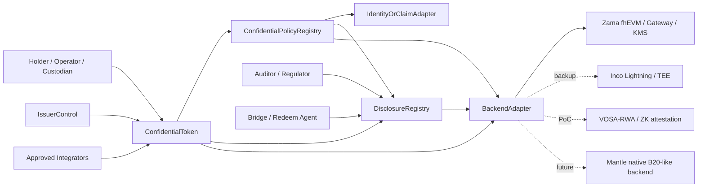
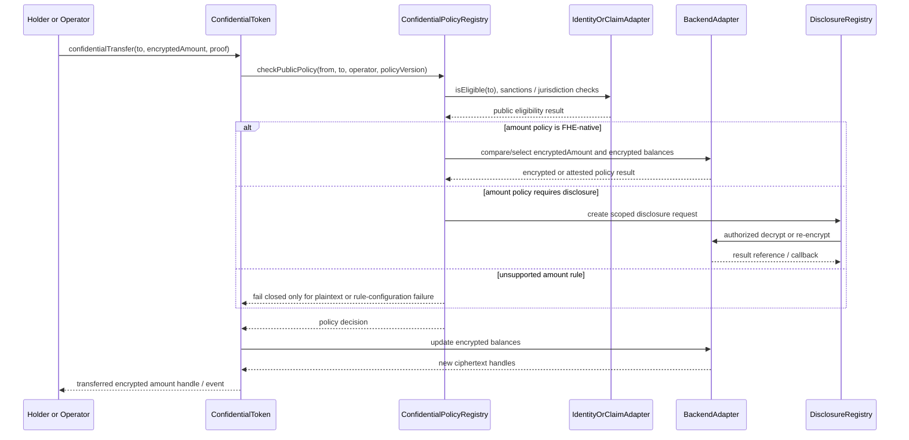
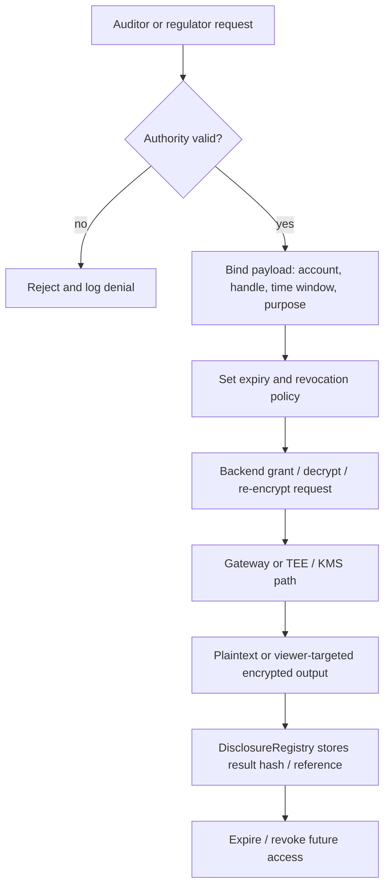
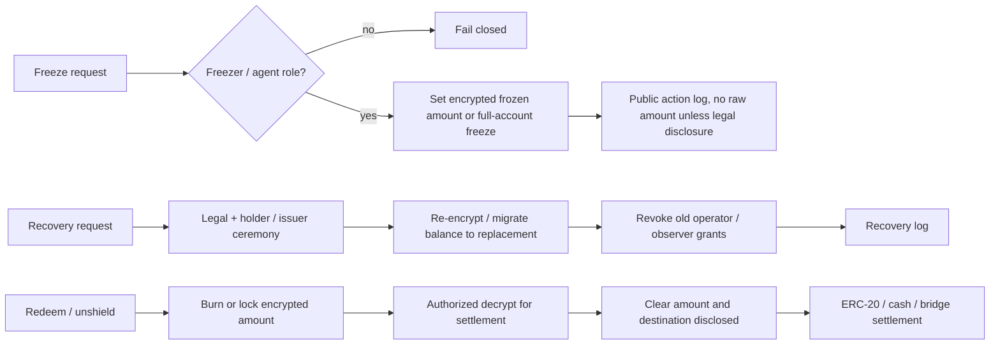

# Mantle Confidential Compliance Token 协议设计

## 执行摘要（Executive Summary）

本 final section 将 WHI-271 的路线裁决落成 Mantle Confidential Compliance Token（简称 CCT）的 phase 1 协议方案。核心建议是：**phase 1 采用 ERC-3643-style identity / policy / issuer controls + ERC-7984 / OpenZeppelin-style confidential value interface + scoped DisclosureRegistry + replaceable Backend Adapter**。这不是把 Mantle 改造成 Base B20 的 native precompile，也不是押注单一隐私厂商；它是一个 application / coprocessor hybrid，目标是在不硬分叉、不换 VM 的前提下，先把机密资产（confidential asset）的最小闭环做出来。

必须先澄清用户直觉中的 "Base B20 token + private feature"：B20 对本方案有价值，但价值在 **合规和 policy 语汇**，例如 PolicyRegistry、ActivationRegistry、RBAC、sender / receiver / executor / mint receiver scopes、Asset / Stablecoin variants。`route-comparison/final.md` §3.2 的靶向检查没有在 Base B20 precompile surface 中发现任何 confidential / private extension。换言之，B20 的 PolicyRegistry / ActivationRegistry 是权限和合规原语，不是隐私原语。今天可落地的 "B20 + private feature" 实现路径是 **ERC-7984 / backend overlay**；未来如果 Mantle 愿意投入 client / fork / audit / governance 成本，才可能演进为 native B20-like confidential backend。

Phase 1 的协议边界如下：

| 平面（Plane） | Phase 1 决策 | 理由 |
|---|---|---|
| 合规策略平面（Compliance policy plane） | 使用公开或许可公开的 identity、KYC、sanctions、blocklist、policy ID、issuer role | ERC-3643 和 B20 都是合规 / 权限语汇；监管执行通常需要可审计规则 |
| 机密记账平面（Confidential accounting plane） | 使用 encrypted balance、encrypted transfer amount、encrypted frozen / recoverable balance、backend-specific ciphertext handle | ERC-7984 明确以 pointer / handle 表示 amount 和 balance；OZ 实现用 Zama fhEVM encrypted values |
| 披露平面（Disclosure plane） | 独立 DisclosureRegistry 记录 request、grant、actor、payload、scope、expiry、revocation、result reference | 避免 "full history viewing key" 成为默认合规方案 |
| 发行方控制平面（Issuer control plane） | mint、burn、pause、freeze、recovery、redeem roles 分权并记录审计日志 | ERC-3643 Agent role 和 B20 RBAC 都要求发行方控制，但 confidential state 需要重新定义语义 |
| 后端平面（Backend plane） | Zama / ERC-7984-like backend 为主候选，Inco / VOSA-RWA / native B20-like 为替换点 | WHI-271 选择 backend-replaceable overlay；Zama 最完整但 Mantle support 仍是 gate |

本设计的最小 MVP 是：发行方能部署 CCT；合格 holder 能 shield / mint 后获得 encrypted balance；holder 或 operator 能 confidential transfer；policy layer 能同步执行明文 identity / blocklist 检查，并对 amount-sensitive rules 走 FHE-native `select` / zero-transfer pattern、selective decrypt 或 unsupported / fail-closed exclusion；auditor / regulator / issuer agent 能按 scope 做 disclosure；issuer 能 freeze / recover / burn / redeem；redeem / bridge 明确成为有意披露边界。

**裁决**：phase 1 可进入 architecture spike / PoC / backend readiness evaluation。生产发布前的 blocking gates 是 Mantle backend availability、amount-dependent policy implementation、disclosure governance、issuer/admin governance，以及 engineering / deployment delta。

证据说明：源自 `route-comparison/final.md` @ `1728caccb5c0d3ffe1d1d9ee1c1d860ab435736c`，特别是 §§1, 2.4, 3.1, 3.2, 8.1；`compliance-token-private-extension/final.md` @ 同一 commit，特别是 §§1, 2, 3, 5, 6, 8；`zama-confidential-rwa/final.md` @ 同一 commit，特别是 §§1, 2, 3.3, 4, 5, 6。

## 各项发现（Item Findings）

### item-1：协议目标、非目标与 phase boundary

Mantle CCT 的目标不是 "隐私版 ERC-20" 的泛化版本，而是受监管机密资产（regulated confidential asset）的最小协议闭环。它必须同时满足：

1. **资产隐私**：ordinary public observers 不能读取 holder balance 或 transfer amount。
2. **合规执行**：issuer / policy admin 能阻止不合规 sender, receiver, operator, mint receiver 和受限操作。
3. **选择性披露**：合法 actor 能按账户、时间、交易、金额、余额或 redeem request 的 scope 获得披露。
4. **发行方控制**：mint, burn, pause, freeze, recovery, forced action 和 redeem 仍可被授权角色执行。
5. **后端可替换**：公开接口不暴露 Zama `euint64`、Inco encrypted type、VOSA proof encoding 或 future native precompile 的内部表示。

#### 目标 / 非目标表

| 类别（Category） | Phase 1 立场 | Phase 2 / 排除的立场 | 来源锚点（Source anchor） |
|---|---|---|---|
| 机密记账（Confidential accounting） | 必须通过 ERC-7984-like handles 支持加密余额与加密转账金额 | 仅当 Mantle 日后出资走协议路线时才采用原生加密记账 | ERC-7984 EIP，accessed 2026-06-24；OZ token docs，accessed 2026-06-24 |
| 合规策略（Compliance policy） | 明文 identity、KYC、sanctions、receiver eligibility、policy ID 与 role state 为一等公民 | 私密身份与加密法律身份属于非目标 | ERC-3643 EIP，accessed 2026-06-24 |
| 金额敏感型合规（Amount-sensitive compliance） | 每条策略必须在 FHE-native rule、selective decrypt 或 unsupported / fail-closed 之间作出选择 | 通用加密策略引擎属于 phase 2 | `zama-confidential-rwa/final.md` §3.3 |
| B20 能力用语（B20 capability language） | 复用 PolicyRegistry / ActivationRegistry / RBAC / scopes 作为语汇 | 不得声称当前 B20 具备机密性；native B20-like private route 属于 phase 2 | Base B20 docs，accessed 2026-06-24；`route-comparison/final.md` §3.2 |
| 披露 / 审计（Disclosure / audit） | scoped DisclosureRegistry 加上 backend grants / decrypt / re-encrypt | 协议级披露登记表留待日后 | Zama ACL、Gateway、KMS docs，accessed 2026-06-24 |
| 发行方控制（Issuer controls） | 定义机密的 mint、burn、freeze、recovery、pause、redeem 与审计日志 | 原生 agent precompile 日后可选 | ERC-3643 EIP；OZ ERC7984Rwa / Freezable docs |
| 匿名性 / 图隐私（Anonymity / graph privacy） | 非目标；除非选用附加组件，否则地址、事件类型与时间戳仍可见 | Privacy Pools / Railgun / note-pool 组件位于 CCT core 之外 | `route-comparison/final.md` §§3.3, 8 |
| 通用私密合约（Generic private contracts） | 非目标；仅限 token-specific confidential value | 单独的私密工作流轨道 | `route-comparison/final.md` §4 |
| Mantle 原生 precompile（Native Mantle precompile） | phase 1 非目标 | Phase 2 native B20-like 优化 | `compliance-token-private-extension/final.md` §§2, 6, 7 |

最重要的 phase boundary 是 **产品需求**（product requirement）与 **生产实现**（production implementation）之间的区分。Encrypted balance / amount 是产品成为 CCT 的强制要求；但它只有在某个具名 backend 已具备 Mantle 生产支持，或存在可信的近期 self-host / partner support 路径时，才会成为 phase 1 的生产实现。否则 phase 1 应被标注为 design + PoC / testnet，而非 production-ready。

### item-2：模块边界与 architecture

协议应拆分为六个模块。这种拆分的存在是为了防止三种失败模式：policy code 试图把 ciphertext 当作 plaintext 读取；token code 持有法律身份状态；以及 disclosure logic 沦为隐藏的全局 viewing key。

| 模块（Module） | 层（Layer） | 职责（Owns） | 不应承担（Must not own） | 证据（Evidence） |
|---|---|---|---|---|
| `ConfidentialToken` | token_core | ERC-7984-like 加密余额、转账函数、加密总供应量、事件，以及指向 policy / disclosure / backend 的 hooks | KYC source of truth、法律身份登记表、backend key material | ERC-7984 EIP；OZ ERC7984 docs |
| `ConfidentialPolicyRegistry` | policy_registry | policy IDs、scopes、公开 identity / blocklist 规则、encrypted-rule routing、policy versioning、受 B20 启发的 `updatePolicy` | 除经由 backend adapter 外的 raw FHE operations；issuer legal docs | ERC-3643 Compliance；Base B20 PolicyRegistry |
| `DisclosureRegistry` | disclosure_registry | disclosure request / grant / log 生命周期、actor authority、payload、scope、expiry、revocation、result hash / reference | 作为持久状态的 raw plaintext balances 或 transfer amounts | Zama ACL / Gateway / KMS；OZ ObserverAccess |
| `IssuerControl` | issuer_control | mint、burn、pause、freeze、recovery、redeem roles；multisig / timelock；紧急操作 | 未记录日志的 owner superpower、backend keys | ERC-3643 Agent role；B20 RBAC；OZ ERC7984Rwa |
| `IdentityOrClaimAdapter` | identity_adapter | address-to-identity / claim 绑定、KYC / sanctions / accreditation status、trusted issuer mapping | 私密身份协议、全局 DID 强制要求 | ERC-3643 Identity Registry |
| `BackendAdapter` | backend_adapter | encrypted input validation、arithmetic、compare / select、decrypt、re-encrypt、grant、revoke、capability flags、SLA hooks | token policy semantics、issuer governance | Zama docs；Inco docs；route comparison |

#### diag-1：六模块协议架构（six-module protocol architecture）



实现说明：若 value 是机密的，则 `BackendAdapter` 并非可选项。即使 phase 1 只使用单一 backend，core token interface 也应只看到不透明的 encrypted handles、input proofs、decrypt request IDs 和 capability flags。

### item-3：核心接口与 alignment matrix

公开协议应在 CCT 边界使用 backend-neutral 类型：

- 在接口草图中使用 `bytes32 encryptedAmount` 或 `bytes ciphertextHandle`，由实现层 adapters 映射到 `euint64`、Inco handles、VOSA proofs 或 native handles。
- `bytes proof` 用于 input validity、attestation、authorization 或特定实现的 payload。
- `DisclosureRequest` 和 `PolicyConfig` 结构体的字段为公开元数据，而非原始明文金额——除非该函数被明确定义为 disclosure / redeem 边界。

#### 核心接口表

| 接口（Interface） | 草图（Sketch） | 对齐（Alignment） | 阶段（Phase） | 失败语义（Failure semantics） | 备注（Notes） |
|---|---|---|---|---|---|
| `confidentialBalanceOf(address account)` | 返回 encrypted handle 或面向特定 viewer 的 encrypted payload | ERC-7984-aligned | phase_1_must_have | 明文授权检查可以 revert；balance value 绝不在公开控制流中比较，且未授权 viewer 没有 decrypt path | ERC-7984 将 confidential balance 定义为 pointer / handle；OZ 返回 `euint64` |
| `confidentialTransfer(address to, bytes32 encryptedAmount, bytes proof)` | sender 转移 encrypted amount | ERC-7984-aligned | phase_1_must_have | 明文检查（receiver identity、blocklist、registry lookup、proof format、backend availability）可以 revert；encrypted balance / amount-limit predicates 必须使用 `FHE.select(ok, amount, 0)`、zero-transfer、encrypted failure flag 或显式 selective decrypt。对 encrypted predicates 做 revert 会泄漏比较结果 | amount 是加密的；receiver address 仍然可见 |
| `confidentialTransferFrom(address from, address to, bytes32 encryptedAmount, bytes proof)` | operator / custody transfer | ERC-7984-aligned + Mantle-specific policy | phase_1_must_have | 明文检查（operator right、executor scope、sender / receiver eligibility）可以 revert；encrypted insufficient-balance、operator-limit 或 amount-policy predicates 必须使用 select / zero-transfer 或 selective decrypt，而非依赖 predicate 的 revert | ERC-7984 operator 受时间限制，但在生效期间可移动任意 amount；需要 UX 警告 |
| `mint(address to, bytes32 encryptedAmount, bytes proof)` | issuer 铸造 encrypted amount | ERC-3643-aligned issuer + ERC-7984 value | phase_1_must_have | 明文检查（issuer role、receiver eligibility、mint policy ID）可以 revert；encrypted cap / threshold / supply predicates 必须使用 select / zero-mint、encrypted denial state 或 selective decrypt | receiver KYC / mint-receiver policy 是明文 |
| `burn(address from, bytes32 encryptedAmount, bytes proof)` | issuer 或 holder 销毁 encrypted amount | ERC-3643-aligned + ERC-7984 value | phase_1_must_have | 明文检查（burn role、account authorization、redeem request existence）可以 revert；encrypted balance / burn-limit predicates 必须使用 select / zero-burn 或 selective decrypt | 可能对接 redeem / unshield |
| `shield(address to, uint256 clearAmount)` | 将公开 ERC-20 / asset 封装为机密表示 | OZ Wrapper-aligned + Mantle-specific | phase_1_optional | 若底层 transfer 失败则 revert；clear amount 可见 | 这是入口处一个刻意设置的隐私边界 |
| `unshield(address from, bytes32 encryptedAmount, address recipient)` | unwrap / redeem 到公开资产、cash leg 或 bridge | OZ Wrapper-aligned + Mantle-specific | phase_1_optional，若存在 redeem 则必备 | 明文检查（redeem authorization、recipient、settlement rail）可以 revert；encrypted available-balance predicates 应在释放 clear funds 之前由 decrypt-to-settlement actor 或 select / zero-finalize 解决 | clear amount 与 destination 成为结算证据 |
| `freeze(address account, bytes32 encryptedAmount, FreezeMode mode)` | 全额或部分机密冻结 | ERC-3643-aligned + OZ Freezable / RWA | phase_1_must_define | 明文检查（freezer role、legal trigger、account target）可以 revert；encrypted available-balance / partial-freeze amount predicates 必须使用 select 或 full-freeze fallback，而非通过 revert 泄漏 predicate | partial freeze 需要 encrypted available balance 逻辑 |
| `recover(address lost, address replacement, bytes recoveryData)` | 迁移 encrypted balance / rights | ERC-3643-aligned + Mantle-specific | phase_1_must_define | 要求 recovery ceremony、re-encryption、revocation 与日志记录 | 不得泄漏无关 holder 的状态 |
| `disclose(bytes32 handle, DisclosureRequest request)` | 授权的审计 / 合规披露 | ERC-7984 / OZ disclosure-aligned + Mantle-specific | phase_1_must_have | 异步 callback 或链下结果；未授权请求失败即拒绝（fail-closed） | 需要 scope、actor、payload、expiry、revocation |
| `updatePolicy(bytes32 policyId, PolicyConfig config)` | 绑定或升级 scoped policy | B20-inspired + ERC-3643-aligned | phase_1_must_have | 明文检查（policy admin、timelock、registry presence、version）可以 revert；encrypted-rule unsupported 意味着该规则类被禁用 / 不可用，而非由泄漏型 encrypted-condition revert 来评估 | B20-inspired 仅指 policy 语汇，而非 B20 机密性 |

失败语义（failure-semantics）规则：**对于已经公开或有意可见的明文事实，revert / fail-closed 是安全的**：identity registry presence、blocklist、operator-right、issuer-agent authorization、role、registry lookup 以及格式错误的 proof。**对于 encrypted amount / balance predicates，revert 是不安全的**，例如余额不足、金额上限、holder cap、阈值或机密 frozen balance。这些检查必须使用 FHE-native `select` / zero-transfer、encrypted failure state、向授权 actor 的显式 selective decrypt，或将该规则排除在 phase 1 之外。

#### B20 用语护栏

`updatePolicy` 被有意标注为 `B20-inspired`，而非 `B20-confidential`。Base B20 文档描述了 policy IDs、allowlist / blocklist policy types、ActivationRegistry gating 以及固定的 transfer / mint policy scopes。它们并未提供 confidential balances、encrypted transfer amounts、FHE operations、selective decrypt 或私密的 policy evaluation。任何声称兼容 B20 的 phase 1 CCT 实现都必须声明：机密性由 ERC-7984 / backend overlay 提供，而非由当前的 B20 提供。

证据说明：ERC-7984 EIP，accessed 2026-06-24；OpenZeppelin Confidential Contracts token 与 API 文档，accessed 2026-06-24；Base B20 docs，accessed 2026-06-24；`route-comparison/final.md` §3.2；`compliance-token-private-extension/final.md` §2。

### item-4：状态模型

Phase 1 不应加密每一个状态变量。过度加密（over-encryption）会使 policy、indexing、issuer operations 和法律审计更困难，却无法解决真正的泄漏目标。正确的拆分如下：

| 状态类别（State class） | 示例（Examples） | 可见性（Visibility） | 所有者 / 更新者（Owner / updater） | 泄漏与控制说明（Leakage and control note） |
|---|---|---|---|---|
| public_state | token metadata、symbol、decimals、contract URI、role IDs、registry addresses、policy IDs、pause status、表示发生了一笔转账的事件 | 公开或许可公开 | ConfidentialToken / IssuerControl | address graph 与时间戳仍然可见 |
| ciphertext_state | balances、transfer amounts、frozen balance、recoverable balance、机密总供应量、可选的机密 operator spend limit | ciphertext handle；仅通过 disclosure 得到明文 | ConfidentialToken + BackendAdapter | 必须跟踪 ACL 与授权的计算 |
| policy_state | policy scopes、trusted issuers、claim topics、sanctions list refs、jurisdiction class、amount-limit rule class、backend capability requirement | 大多公开；阈值可能加密 | ConfidentialPolicyRegistry | 公开规则可接受；加密阈值需要 backend |
| disclosure_state | request ID、requester、authority、payload、account、time window、expiry、revocation、result hash、链下 reference | 公开或受限日志；无 raw plaintext | DisclosureRegistry | 日志在不公布数值的前提下证明流程 |
| issuer_admin_state | issuer、policy admin、compliance officer、recovery agent、freezer、auditor admin、upgrade admin、timelock | 公开治理状态 | IssuerControl | 强权角色需要 multisig、timelock 与 legal trigger policy |
| offchain_backend_state | KMS key shares、Gateway state、attestation、decrypt result delivery、TEE logs、FHE coprocessor state | backend-specific | backend operators | 必须由 SLA、审计与事件处理流程覆盖 |

#### diag-6：状态模型层级（state model hierarchy）

```text
Mantle CCT state
├── public_state
│   ├── metadata, registry addresses, policy IDs, roles
│   └── address / event graph and operation type
├── ciphertext_state
│   ├── balances, amounts, frozen balances
│   └── optional encrypted counters and spend limits
├── policy_state
│   ├── KYC / sanctions / blocklist / allowlist
│   └── encrypted-policy capability requirements
├── disclosure_state
│   ├── request / grant / expiry / revocation
│   └── result hash or offchain reference, not raw plaintext
└── issuer_admin_state
    ├── issuer, agent, freezer, recovery, auditor roles
    └── timelock, upgrade and emergency controls
```

实际含义是：合规事实与 ciphertext 事实只通过明确建模的网关相遇——明文 policy checks、FHE-native checks、selective decrypt 或 fail-closed。不应隐含假设某个 Solidity policy module 可以检视 `encryptedAmount`。

### item-5：关键流程

#### 必备流程表

| 流程（Flow） | 参与方（Actors） | 公开输入 / 状态（Public inputs / state） | 密文输入 / 状态（Ciphertext inputs / state） | 策略门控（Policy gate） | 披露边界（Disclosure boundary） | 失败语义（Failure semantics） |
|---|---|---|---|---|---|---|
| 发行 / 部署（Issuance / deployment） | issuer、policy admin、backend operator | token metadata、registry addresses、roles、policy IDs | 初始无 | admin / timelock | role setup 公开 | 若 backend 或 registry 缺失则阻止上线 |
| KYC 引导（KYC onboarding） | holder、KYC provider、issuer | address、identity claim、jurisdiction，若选用则含 sanctions status | 可选的加密身份属性不在范围内 | identity / claim eligibility | issuer 按设计可见 KYC | 未通过验证意味着无法接收 / 铸造 |
| 铸造 / 封装 / shield（Mint / wrap / shield） | issuer 或 holder、wrapper | receiver、若 shield 则含 underlying deposit amount、mint 事件元数据 | 加密的铸造金额与新余额 | mint role、receiver policy | 若公开 ERC-20 进入 wrapper 则 shield amount 可见 | 明文 receiver / role / proof 检查可以失败即拒绝；encrypted cap predicates 使用 select / zero-mint 或 selective decrypt |
| 机密转账（Confidential transfer） | sender / operator、receiver、token、policy、backend | from、to、operator、policy IDs、事件存在性 | encrypted amount、balances、frozen balances | identity / blocklist 加上 FHE-native 或 decrypt amount policy | 无，除非 policy 请求披露 | 明文检查可以失败即拒绝；encrypted amount / balance 检查使用 zero-transfer/select 或 selective decrypt |
| 合规检查（Compliance check） | token、policy registry、identity adapter、backend | KYC、sanctions、jurisdiction、policy version | amount、balance、holder limit、encrypted counters | 公开检查加上加密检查 | 仅当 policy 允许时才 selective decrypt | unsupported amount rule 阻止生产或失败即拒绝 |
| 审计披露（Audit disclosure） | auditor、regulator、issuer、disclosure admin、backend | request、actor、scope、expiry、legal basis、result ref | balance / amount handle | disclosure authority 与 scope | decrypt / re-encrypt 给授权 actor | 拒绝未授权或已过期的请求 |
| 冻结 / 恢复（Freeze / recovery） | issuer agent、recovery agent、holder | account、legal trigger、role event | frozen balance、recovered balance、re-encryption handle | freezer / recovery role、policy | 可选地向 issuer / auditor 作法律披露 | 若 partial 不可用则 full freeze；要求 recovery ceremony |
| 赎回 / unshield（Redeem / unshield） | holder、issuer、custodian、bridge / redeem agent | recipient、settlement rail、legal redemption record | 在 finalization 之前 burn / unwrap encrypted amount | holder eligibility 与 issuer liquidity | clear amount 与 destination 向 settlement leg 披露 | 明文 settlement 检查可以失败即拒绝；encrypted availability 通过 decrypt-to-settlement 或 select / zero-finalize 解决 |
| 跨链约束（Bridge constraint） | holder、bridge、remote issuer | source / destination account 与 bridge 事件 | 直到 bridge settlement 的 amount handle | bridge allowlist 与 disclosure policy | phase 1 默认走 unshield / re-shield 或已记录的 approved bridge | 不声称完全私密的跨链转账 |

#### diag-2：含公开策略与加密策略的机密转账（confidential transfer with public policy plus encrypted policy）



#### diag-3：审计披露生命周期（audit disclosure lifecycle）



#### diag-4：冻结、恢复、赎回边界（freeze, recovery, redeem boundaries）



### item-6：后端抽象与 replaceability plan

后端替换是一项协议要求，不仅仅是工程偏好。如果 token API 暴露了 Zama-specific type、Inco callback shape 或 native precompile selector，Mantle 将失去日后重新运行 WHI-271 路线对比的选择权。

#### 后端能力接口（Backend capability interface）

| 能力（Capability） | Phase 1 要求 | 缺失时的退路（Fallback if absent） |
|---|---|---|
| encrypted input validation | 必需 | backend 无法支持 CCT transfer |
| encrypted add / sub | 必需 | backend 无法支持加密记账 |
| encrypted compare / select | amount policy 必需；identity-only PoC 可选 | 在 rule-configuration 时走 selective decrypt 或失败即拒绝；不要对 encrypted predicate result 做 revert |
| scoped decrypt | 审计 / redeem / recovery 必需 | 无生产级审计 / redeem |
| re-encrypt / viewer-targeted output | holder / auditor UX 必需 | 仅明文披露，隐私更低 |
| grant / revoke / expiry metadata | 即便 backend revocation 是 future-only，registry 级别也必需 | 将历史访问标记为持久 |
| confidential freeze | 必需，以避免暴露 frozen amount | full-account freeze fallback |
| latency / SLA observability | 生产前必需 | 仅 PoC |
| attestation / proof verification | TEE / ZK backend 必需 | backend 不具备生产资格 |

#### diag-5：后端抽象矩阵（backend abstraction matrix）

```text
Backend                    | Reusable in phase 1                         | Not reusable / gate
-------------------------- | ------------------------------------------- | ----------------------------------------------
Zama fhEVM + OZ            | encrypted balances, FHE ops, ACL, Gateway,  | Mantle support unproven; KMS/Gateway governance;
                           | KMS, ObserverAccess, Wrapper, Freezable     | ACL history and performance SLA need validation

Inco Lightning             | confidential compute on Base, TEE path,     | Mantle support not evidenced; TEE trust,
                           | private data types and access controls      | attestation, callback and force-exit model

Inco confidential ERC20    | engineering PoC reference for module shape  | do not copy unaudited PoC into production

VOSA-RWA / VOSA-20         | lightweight PoC for exposed-graph RWA       | forum / PoC maturity, audit gap, graph leakage,
                           | compliance attestation                      | freeze / force-transfer weakness

Native B20-like future     | policy / RBAC / activation native route     | phase 2 only; requires Mantle client, fork,
                           | if Mantle funds protocol work               | governance, audit and native confidentiality

Generic future backend     | keeps interface neutral                     | must pass same capability, audit and SLA gates
```

#### Backend 专项结论

| Backend | 草案处置（Draft disposition） | 所需 Mantle gate（Required Mantle gate） |
|---|---|---|
| Zama / ERC-7984 / OZ | architecture 与 PoC 的首选候选，因为它具备最清晰的标准与实现面 | 核实 Mantle host-chain support，或自托管 Gateway / KMS / coprocessor 的可行性；构建 FHE-native policy 或可接受的 selective-decrypt 路径 |
| Inco Lightning | 备选候选，并作为独立的压力测试，因为文档声称已在 Base Mainnet / Base Sepolia 上线且无需新链 / 钱包 | 取得 Mantle support 声明、TEE attestation 模型、解密与活性保证、审计态势 |
| VOSA-RWA | 面向 compliance-attestation 需求的 PoC 退路，而非生产路线 | 安全审查、生产代码、issuer controls 与对 graph-leak 的接受 |
| Native B20-like | phase 2 的未来 backend，而非 phase 1 要求 | Mantle client / fork 预算、规范、安全审查与治理批准 |

证据说明：Zama overview、ACL、Gateway 与 KMS 文档，accessed 2026-06-24；Inco introduction 与 architecture 文档，accessed 2026-06-24；`route-comparison/final.md` §§2.4, 5, 6, 7；`compliance-token-private-extension/final.md` §5。

### item-7：风险、开放问题与 review gates

风险登记表按 blocking effect 组织。`blocking` 严重级别意味着：在缓解措施完成设计并验证之前，本项目不应声称已具备 phase 1 production readiness。`high` 严重级别在带有明确注意事项（caveat）的前提下可通过 PoC，但在 owner 接受之前不可用于生产。

| 风险标签（Risk label） | 类别（Category） | 严重级别（Severity） | 为何重要（Why it matters） | 所需缓解（Required mitigation） | 负责人（Owner） |
|---|---|---|---|---|---|
| backend_mantle_support | cryptographic/backend | blocking | 若所选 backend 无法在 Mantle 或可接受的 host path 上运行，则不存在 CCT 生产部署 | 确认受支持的 host chain、self-host path 或 Base-first PoC 边界；锁定部署目标 | protocol + backend partner |
| amount_policy_gap | compliance/protocol | blocking | ERC-3643 `canTransfer(from,to,amount)` 假定 amount 为明文；CCT amount 是加密的。对 encrypted amount / balance predicates（如余额不足、阈值或金额上限失败）做 revert 会泄漏比较结果，并重新引入金额侧信道 | 用 `FHE.select(ok, amount, 0)` / zero-transfer 或 encrypted denial state 实现 FHE-native policy；仅在明确授权时使用 selective decrypt；否则将 amount rules 标记为 unsupported 并在 rule-configuration 时失败即拒绝，而非通过依赖 predicate 的 encrypted revert | protocol + compliance engineering |
| engineering_complexity_deployment_delta | engineering/operations | blocking | 运行 FHE backend 加上六个 registries 会增加 contract、SDK、indexer、disclosure service、auditor UX、key ceremony、monitoring、audits 与 incident response 的负担；仅靠性能无法体现这一点 | 制定 deployment runbook、registry ownership model、adapter conformance tests、audit scope、operator SLA、incident playbook 与分阶段 PoC-to-prod gate | engineering lead + security + operations |
| kms_gateway_governance | cryptographic/backend | high | decrypt、audit 与 recovery 依赖 Gateway / KMS / coprocessor 的活性与治理 | operator set、threshold policy、key rotation、incident process、独立安全审查 | backend partner + security |
| tee_trust | cryptographic/backend | high | Inco / TEE path 将信任转移到 enclave、attestation 与 operator 活性 | 公开的 attestation model、enclave upgrade policy、force-exit 与 fallback 语义 | backend partner + security |
| auditor_disclosure_backdoor | disclosure/governance | high | observer / auditor 访问可能成为隐私后门 | scope grants、expiry、revocation status、role split、audit logs、入侵响应 | compliance + security |
| issuer_abuse_admin_capture | governance | high | freeze、recovery 与 force action 权力强大且可能被滥用 | multisig、timelock、legal trigger policy、transparency log、紧急暂停限制 | issuer + governance |
| acl_revocation_history | disclosure/backend | high | 永久或历史性的 grants 即使在 UI 级别撤销后仍可能可用 | 优先使用 transient / scoped grants；除非以密码学方式证伪，否则将历史访问标记为持久 | security + backend partner |
| bridge_redeem_leakage | integration | high | 结算通常会揭示 amount、destination 与法律语境 | 将 redeem / bridge 视为有意披露；记录 scope 与 recipient；避免对私密 bridge 过度声称 | bridge / custodian |
| metadata_graph_leakage | privacy | medium/high | phase 1 不隐藏 address graph、时间戳、event type、policy status 或 memo linkage | 记录残留泄漏；避免公开 memo；可选的 source-of-funds 补充位于 CCT core 之外 | product + privacy review |
| defi_composability | integration | medium/high | ERC-7984 operator semantics 与加密余额打破了 ERC-20 allowance 假设 | approved integrator model、operator UX 警告、time limits、simulation / decrypt UX | protocol + wallet |
| backend_lock_in | architecture | medium/high | backend-specific handles 与 services 可能泄漏进应用代码 | backend-neutral interface、adapter tests、migration plan、capability flags | protocol architecture |
| performance_sla | operations | medium/high | transfer、disclosure、recovery 与 redeem 的延迟影响用户信任与结算 | p50 / p95 benchmarks、retry semantics、timeout handling、dashboard | engineering + backend partner |
| privacy_not_compliance | product | medium | 加密余额并不能解决 KYC、sanctions 或 issuer 义务 | 保持 identity / policy plane 显式且可审计 | compliance |
| compliance_not_privacy | product | medium | ERC-3643 或 B20 policy registries 并不提供机密性 | 确保 CCT 的声称始终具名 confidential backend | product + protocol |

#### 声称生产就绪前的 review gates

1. 所选 backend 具备书面记录的 Mantle support path，或一个刻意设定的 non-Mantle PoC 边界。
2. 至少有一条 amount-dependent policy 已实现，并在 encrypted values 上使用两路失败规则进行测试：plaintext checks 可以 revert；encrypted amount / balance predicates 必须使用 FHE-native select / zero-transfer、encrypted denial state 或显式 selective decrypt。Predicate-dependent encrypted reverts 被阻止，除非被刻意接受为一种披露。
3. DisclosureRegistry 具备 role split、request approval、expiry、revocation status、result reference 以及 compromise response。
4. IssuerControl 角色互相分离，并由 multisig / timelock / legal trigger policy 治理。
5. 存在 engineering complexity runbook：deployment、monitoring、audits、conformance tests、operator ownership、incident response。
6. Redeem / bridge 流程记录了确切的明文披露边界。
7. B20 用语经过审查，使任何读者都无法推断出当前 B20 具备机密能力。

### item-8：证据图谱与可追溯性（Evidence map and traceability）

| 主张 / 章节（Claim / section） | 来源锚点（Source anchors） |
|---|---|
| 路线形态：ERC-3643 + ERC-7984/OZ overlay，backend-replaceable | `confidential-compliance-token-research/research-sections/route-comparison/final.md` @ `1728caccb5c0d3ffe1d1d9ee1c1d860ab435736c`, §§1, 2.4, 3.1, 8 |
| B20 提供 policy 语汇，而非机密性 | `route-comparison/final.md` §3.2；`compliance-token-private-extension/final.md` §§2, 6, 7；Base B20 docs accessed 2026-06-24 |
| ERC-7984 pointer / handle 机密金额模型 | `https://eips.ethereum.org/EIPS/eip-7984`, accessed 2026-06-24 |
| ERC-3643 identity / compliance / agent 模型与明文金额张力 | `https://eips.ethereum.org/EIPS/eip-3643`, accessed 2026-06-24；`zama-confidential-rwa/final.md` §3.3 |
| OZ confidential token、wrapper、freezable、observer、restricted 与 RWA 扩展 | `https://docs.openzeppelin.com/confidential-contracts/token`, `https://docs.openzeppelin.com/confidential-contracts/api/token`, accessed 2026-06-24 |
| Zama Gateway / KMS / ACL 与 FHE backend 风险 | `https://docs.zama.org/protocol/protocol/overview`, `/gateway`, `/kms`, `/solidity-guides/smart-contract/acl`, accessed 2026-06-24；`zama-confidential-rwa/final.md` §§2, 5, 6 |
| Inco 作为备选 backend | `https://docs.inco.org/introduction`, `https://docs.inco.org/architecture/overview`, accessed 2026-06-24；`route-comparison/final.md` §§2.4, 7 |
| VOSA 与其他候选 | `route-comparison/final.md` §§2.4, 7；经由 WHI-271 source bundle 的先前候选调研 |
| Bridge / redeem 披露边界 | `route-comparison/final.md` §§1, 8；OZ wrapper docs；`zama-confidential-rwa/final.md` §§4, 5 |
| Engineering / deployment delta | 综合自 `route-comparison/final.md` 各维度 `engineering_delta`、`deployment_lightweight`、`performance_predictability`；Zama / Inco 运营文档；本草案中的 six-module CCT architecture |

## 图表（Diagrams）

所有必备图表均已嵌入「各项发现（Item Findings）」中：

| ID | 位置（Location） | 状态（Status） |
|---|---|---|
| diag-1 | item-2 | 已产出 six-module architecture |
| diag-2 | item-5 | 已产出 confidential transfer flow |
| diag-3 | item-5 | 已产出 audit disclosure lifecycle |
| diag-4 | item-5 | 已产出 freeze / recovery / redeem boundary |
| diag-5 | item-6 | 已产出 backend matrix |
| diag-6 | item-4 | 已产出 state hierarchy |

## 源覆盖（Source Coverage）

| 需求（Requirement） | 覆盖情况（Coverage） | 备注（Notes） |
|---|---|---|
| src-1 prior_research_final，最少 3 | 已覆盖 | route-comparison、compliance-token-private-extension、zama-confidential-rwa 三份 finals 在 commit `40c8f77` 处从当前分支读取；其集成基线 commit 为 `1728caccb5c0d3ffe1d1d9ee1c1d860ab435736c` |
| src-2 official_standard，最少 2 | 已覆盖 | ERC-7984 EIP 与 ERC-3643 EIP，accessed 2026-06-24 |
| src-3 official_implementation_docs，最少 4 | 已覆盖 | OpenZeppelin token docs 与 API docs；Zama overview、ACL、Gateway 与 KMS docs，accessed 2026-06-24 |
| src-4 official_or_primary_backend_docs，最少 2 | 已覆盖 | Zama docs 与 Inco docs，accessed 2026-06-24；VOSA 经由先前的 route comparison 处理，因为本草案不需要更强的一手来源 |
| src-5 official_b20_docs，最少 1 | 已覆盖 | Base B20 docs，accessed 2026-06-24 |
| src-6 risk_evidence，最少 8 | 已覆盖 | 风险表为所有 high/blocking 行纳入了来自先前 finals、官方标准/文档与综合说明的证据 |

## 差距分析（Gap Analysis）

1. **Mantle backend support 仍未得到证实**。本草案可以指定一个 backend-neutral 协议，但 production readiness 需要 Zama、Inco 或等效 backend 支持 Mantle，或一个刻意限定范围的 non-Mantle PoC。
2. **Amount-dependent compliance 是最艰难的技术 spike**。原生 ERC-3643 模块无法直接兼容 encrypted amounts。本项目必须选择 FHE-native policy、selective decrypt，或 rule-configuration fail-closed exclusion。对 encrypted amount / balance 的 predicate-dependent revert 不是可接受的默认做法，因为它会泄漏比较结果。
3. **Disclosure revocation 是 backend-specific 的**。Registry 级别的 revocation 可以阻止未来的授权使用，但历史性的 backend access 必须被视为持久的，除非所选 backend 能证明并非如此。
4. **Inco 证据是后备证据，而非 Mantle 证明**。Inco 文档称 Lightning 已在 Base Mainnet / Base Sepolia 上线并使用 TEEs；它们并未证明支持 Mantle。
5. **VOSA 在本设计中仍仅限 PoC**。它可以测试机构对 exposed-graph compliance attestation 的接受意愿，但在缺乏审计、代码与 issuer-control 证据的情况下，不应作为生产路线。
6. **B20 native path 仍属 phase 2**。Base B20 是 native 的、policy 丰富的，并作为一套语汇有其价值，但当前证据并未显示其具备 confidential/private extension。Mantle native confidential B20-like 设计需要独立的协议规范与 fork plan。
7. **Graph、timing 与 metadata privacy 是残留泄漏**。CCT phase 1 隐藏的是数值，而非交易存在性、address graph、policy events 或公开 memo 关联。
8. **Engineering/deployment delta 需要专属 owner**。一个六模块协议加上机密 backend 是一个运营系统，而非单一的 token 合约。在缺乏 deployment owner 与 runbook 的情况下，产品不应推进至 PoC 阶段之后。

## 修订日志（Revision Log）

| 轮次（Round） | 操作（Action） | 摘要（Summary） |
|---|---|---|
| 1 | initial_draft | 从已批准的 outline 产出完整 deep draft。覆盖全部八个 outline items、六张图表、源覆盖、差距与一份风险登记表。通过将 B20 明确限定为仅 policy/compliance 语汇，并新增一条独立的 engineering-complexity / deployment-delta blocking risk，回应了所需的 minor 反馈。 |
| final | final_promotion | 在 Review Verdict approve（`919e9d20-7ba4-4aea-9f58-f9844ba7bb15`）后，将已批准的草案 `fb0fa996b2fc4a3ad4762b16b733d895be3fc243` 提升为 `final.md`。应用了所需的最终细化：plaintext checks 可以 revert / 失败即拒绝，而 encrypted amount / balance predicates 必须使用 select / zero-transfer、encrypted denial state 或显式 selective decrypt，因为 revert 会泄漏 predicate。 |
