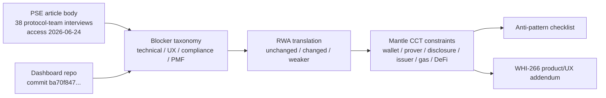
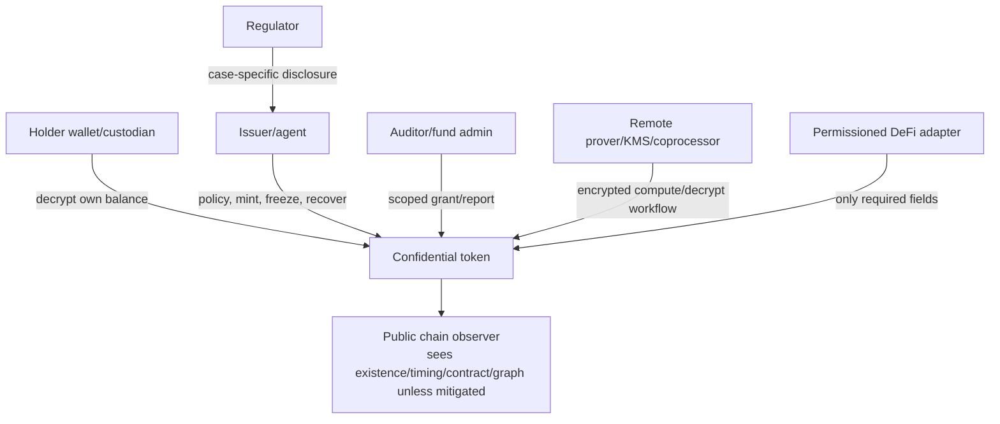

# PSE Private Transfers 用户研究与产品约束分析

## Executive Summary

PSE Private Transfers 的材料对 Mantle CCT（Confidential Compliance Token）的价值，不是替 Mantle 选择某一个 privacy protocol，而是把“隐私转账真实落地时最容易失败的地方”系统化。PSE 文章基于 **38 次与生态团队的访谈**；该数字和后文 approximate topic counts 均来自 PSE RSS 中的文章正文，访问日期 2026-06-24。重要 caveat：PSE 明确说访谈对象是“protocol teams building for end users”，不是终端用户样本；文中 topic counts 也明确不是代表性定量调查。

核心结论：

1. **PSE 的 blocker 可以分成四类：技术、产品/UX、合规、生态/PMF。** 技术侧最高频是 ZK 证明生成时间（14）、ZK verification gas（13）、DeFi composability（11）、deposit/withdraw leakage（10）、private state sync（6）。产品/UX 侧集中在 wallet support（10）、key management、mobile proving、gas/relayer、private-state scanning。合规侧集中在 regulatory uncertainty（11）、legal risk（7）、viewing key 不够 programmable。生态/PMF 侧包括 low demand/PMF（6）、liquidity constraints、fragmented anonymity sets（5）、standards/coordination（8/3）和 resource sustainability（8）。
2. **Mantle confidential RWA 不应照搬 retail private-transfer 的“最大匿名性”目标。** 机构场景更需要 confidential accounting、发行方控制、选择性披露、审计、gas sponsor、可解释的钱包/托管流程。匿名性和 unlinkability 仍有价值，但它们必须服务于 RWA adoption，而不能压过 issuer controls 和监管披露。
3. **Account-based confidential token 更像 Mantle CCT 的短期产品 substrate；note-based shielded pool 更像 privacy ceiling / 对照方案。** ERC-7984/OZ/fhEVM 路线能更自然地表达账户余额、issuer controls、RWA agent、wrapper 和 observer，但不隐藏地址/交易图/时间元数据，且有 ACL 撤销、coprocessor/KMS 和 DeFi adapter 风险。Railgun/Privacy Pools 式 note pool 具备更强 unlinkability，但带来 note scanning、匿名集冷启动、deposit/withdraw leakage、合规举证和 DeFi 适配成本。
4. **Mantle CCT 的产品底线是“合规 token + confidential accounting + scoped disclosure + wallet/prover/gas 可用性”。** 如果一个设计没有披露通道、不能让机构解释谁能看什么、要求移动端长时间证明、依赖未启动匿名集、或让用户先从公开地址充值 gas，它即使密码学上成立，也不应被评为产品可用。
5. **Product/UX supplement 只能调节边界分，不得推翻 WHI-266。** 尤其是 WHI-266 的轻量级一票否决仍然生效：非轻量方案的 `mantle_fit` 最高为 3，除非被明确定位为长期协议路线而不是短期轻量集成。

## Item Findings

### item-1: PSE blocker taxonomy

#### Source verification gate

PSE article source used here:

| Source | Verification |
|---|---|
| PSE article URL | `https://pse.dev/blog/private-transfers-engineering-user-research`, article title "User Research: Uncovering Problems in the Private Transfers Space", published 2026-05-08, author John Guilding. Accessed 2026-06-24. |
| Body capture | `https://pse.dev/api/rss`, RSS item for the same URL, captured 2026-06-24. The RSS body includes the article content, the 38-interview figure, the caveat on non-representative counts, and the Top Topics table. |
| Stability caveat | The rendered page's GitHub edit link returned 404 during outline prep; the draft therefore cites the RSS/body capture and access date. The Techtimes report dated 2026-06-23 says EF is shutting down the ZK privacy research unit PSE, increasing source movement risk. |

PSE says the research interviewed 38 teams in the ecosystem, not end users. It also says ZK shielded pools and L2 teams were overrepresented, and the rough mention-count table should not be treated as representative quantitative data. This section therefore uses PSE counts as **directional protocol-team pain signals**, not as market sizing or end-user PMF evidence.

#### Blocker taxonomy

| Category | PSE evidence | Product interpretation for Mantle |
|---|---|---|
| Technical blockers | ZK proof generation time (14), verification gas (13), DeFi composability (11), deposit/withdraw leakage (10), external networks (9), hash inefficiency (8), private sync (6), throughput (4), large ciphertexts (3). | Privacy is not a UI toggle; it changes proving, gas, state, storage, relayer, and DeFi execution constraints. |
| Product/UX blockers | Lack of native wallet support (10), key management complexity, mobile client-side proving, private state scanning, stealth-address gas funding, lack of hardware-wallet support for ZK-friendly primitives. | CCT must be usable through wallets/custodians without making users manage invisible proof, key, scan, and gas workflows manually. |
| Compliance blockers | Regulatory uncertainty (11), legal risk (7), traditional viewing key not programmable enough, institutions prefer confidentiality over anonymity (4), risks of institutions setting privacy bar too low. | Institutional adoption requires scoped disclosure, auditability, issuer controls, and clear compliance operations; one full-history viewing key is not enough. |
| Ecosystem/PMF blockers | Low demand/PMF (6), liquidity constraints, fragmented anonymity sets (5), lack of standards (8), resource constraints (8), shared-roadmap gap (3). | Mantle should not rely on a cold-start anonymous retail network; it should define institution-first utility, standards surface, and integration boundaries. |

### item-2: Private-transfer blockers mapped to Mantle confidential RWA constraints

The most important translation is that **institutional confidentiality is not the same product as retail anonymity**. For retail private transfers, the hero metric is often unlinkability. For confidential RWA, the hero metric is closer to: can authorized parties use, audit, redeem, finance, and disclose a tokenized asset without leaking sensitive balances and trade intent to the public?

#### Private transfers blocker -> Mantle RWA design constraints

| PSE/dashboard evidence | blocker_category | retail private-transfer pain | RWA carryover | institutional change | Mantle requirement | anti-pattern risk | rubric impact |
|---|---|---|---|---|---|---|---|
| PSE: proof generation time 14; mobile/client proving is slow; sub-second cited as threshold where it stops being a problem. | technical/product_ux | Users abandon privacy if every transfer needs long local proving. | changed | Institutions may use custodians or remote provers, but mobile approval, desk workflows, and SLA still matter. | Support delegated/remote proving with encrypted inputs, SLA, fallback, and custody boundaries. | Mobile proving unusable; opaque remote prover/KMS. | maturity, engineering_delta, mantle_fit |
| PSE: proof verification gas 13; Groth16 several hundred thousand gas, Halo2 small circuit near 1M gas. | technical | Private transfers are too expensive for normal payments. | unchanged | RWA transfers may tolerate more cost than retail, but recurring fund/custody operations still need predictable economics. | Gas sponsor/paymaster/fee abstraction; choose proof/backend with bounded gas. | Gas sponsor missing; cost hidden from PMF model. | deployment_lightweight, engineering_delta |
| PSE: DeFi composability 11; private state isolated from shared contract state. Dashboard: Railgun uses relay adapt; Privacy Pools has no DeFi access except limited/yield notes. | technical/ecosystem | Users must unwrap or leak intent to use DeFi. | changed | RWA DeFi is constrained by KYC/KYB, venue permissioning, liquidation/oracle needs, and issuer policy. | Define safe MVP DeFi boundary: transfer/redeem first, adapter-based collateral/settlement second, encrypted AMM/lending later. | Unqualified DeFi composability claim. | mantle_fit, engineering_delta |
| PSE: deposit/withdraw leakage 10; dashboard: Privacy Pools deposit/withdraw amounts public; Railgun asset privacy absent at entry/exit. | technical/privacy | Entry/exit timing and amount correlate identities. | unchanged | Mint/redeem/bridge and issuer/custodian flows are the RWA equivalent of entry/exit. | Batch, sponsor, delay, or policy-design mint/redeem flows; disclose leakage boundaries. | Timing/metadata leakage ignored. | privacy_coverage, selective_disclosure |
| PSE: wallet support 10; key management complexity; hardware wallet gap. | product_ux | Users cannot access privacy through normal wallets. | changed | Institutional users may use custodians/MPC, but operators still need readable balances, approvals, recovery, and audit exports. | Wallet/custody SDK with balance decrypt, transfer approve, disclosure grants, recovery, and admin views. | Product requires specialist dapp only; no custodian workflow. | maturity, mantle_fit |
| PSE: traditional viewing key not programmable enough. Railgun dashboard: viewing key full read, pre-defined; ERC-7984 prior research: ObserverAccess permanent ACL caveat. | compliance/product_ux | Sharing viewing key overdiscloses history. | amplified | Auditors, issuers, regulators, fund admins need scoped, logged, revocable, explainable access. | Disclosure matrix by actor/scope/duration/revocation/log; avoid full-history default. | Viewing keys permanent and overbroad; over-collection/privacy theater. | selective_disclosure, compliance_capability |
| PSE: regulatory uncertainty 11, legal risk 7; institutional demand conditional on compliance. | compliance/pmf | Builders fear open privacy tools attract enforcement. | amplified | RWA cannot launch without issuer controls, policy, audit, redemption, and sanctions handling. | Treat compliance workflows as product surface, not appendix. | Anonymity-only framing. | compliance_capability, mantle_fit |
| PSE: fragmented anonymity sets 5 and liquidity constraints. | ecosystem_pmf | New pools have weak anonymity and low utility. | weaker/changed | Institutional CCT can deliver balance confidentiality with issuer-gated participants before a public anonymity set exists. | Do not make MVP depend on a huge permissionless anonymity set; use account confidentiality and controlled disclosure first. | Anonymous-set dependency cannot start. | privacy_coverage, mantle_fit |
| PSE: low demand/PMF 6; retail users unwilling to pay/suffer friction; institutional demand theoretical but conditional. | ecosystem_pmf | Privacy is valued in narrative but not in revealed behavior. | amplified | Institutions will not adopt unless confidentiality reduces concrete business leakage while preserving compliance. | Anchor use cases: cap table/fund units, OTC/RWA settlement, treasury flows, collateral transfer, audit exports. | Privacy theater; unclear buyer. | mantle_fit, maturity |

#### What still holds versus what changes

Still holds unchanged:

- Proving, gas, wallet, relayer, metadata leakage, and DeFi integration costs remain real even if the user segment changes.
- Entry/exit leakage maps directly to RWA mint/redeem/bridge/custody flows.
- Viewing-key and disclosure design remain central; a single all-history key is especially dangerous.

Changes under institutional confidentiality:

- The target is often confidentiality of amounts, balances, positions, and counterparties from the public, not unconditional anonymity from all counterparties.
- Issuer controls, transfer policy, freeze/recover, redemption, and audit logs become must-have, not privacy failures.
- Anonymous-set cold start is less fatal if the design is account-based confidential accounting for a known KYB/KYC participant set.

Becomes weaker as a design driver:

- Pure permissionless retail PMF is not the right launch criterion for Mantle CCT.
- Maximal unlinkability is not sufficient if it prevents issuer controls or scoped disclosure.

### item-3: Account-based confidential token vs note-based shielded pool

#### Product comparison

| Model | Privacy coverage | Balance model | Composability | Anonymity/cold start | Wallet UX | Proof/decryption | Disclosure/compliance | Issuer controls | Mantle fit |
|---|---|---|---|---|---|---|---|---|---|
| Account-based confidential token (ERC-7984/OZ/fhEVM style) | Strong amount/balance confidentiality; address, transfer existence, timing, token contract, and graph often visible. | Per-account encrypted balance / `bytes32` pointer / FHE handle. | Closer to EVM token/account model; still needs wrappers/adapters because not ERC-20 compatible. | Does not require large anonymous pool for balance privacy; weak graph anonymity. | Familiar account balance, but wallet must decrypt/re-encrypt handles and surface ACL/disclosure. | FHE/coprocessor/Gateway/KMS path; input proof/ACL/decryption proof; remote infra risk. | Richer extension surface: ObserverAccess, Rwa, Restricted, Freezable, Hooked; caveat permanent ACL and trusted hooks. | Strong: mint/burn/freeze/block/recover/force transfer via RWA modules. | Better short-term CCT substrate if backend is lightweight enough; cap by WHI-266 if heavy. |
| Note-based shielded pool (Railgun style) | Stronger unlinkability and asset privacy inside pool; entry/exit leakage remains. | UTXO notes; balance reconstructed by scanning/decrypting notes. | DeFi via relay/adapt/multicall patterns; intent and edge interactions still complex. | Needs liquidity/anonymity set; fragmented across chains/apps. | Requires note scanning; secrets/viewing keys; dashboard says sync can take minutes. | Client-side Groth16 proving, browser/node/mobile prover variants. | Viewing key + PPOI; viewing key current full-history/pre-defined; PPOI app/wallet/broadcaster layer. | Weak for issuer-native controls unless wrapped/gated externally. | Useful privacy ceiling and adapter reference, not the cleanest CCT core. |
| Note-based compliance pool (Privacy Pools style) | Unlinkability only; dashboard marks confidentiality and asset privacy as No. | UTXO commitments; no account balance; no scanning if note secret retained. | Dashboard: no DeFi access beyond limited yield module; only payments. | Association set liquidity matters; withdrawal depends on ASP. | Deposit then wait up to 8 hours for ASP vetting; ragequit exits publicly. | Local withdrawal proof. | Association Set Provider at withdrawal; no viewing key/selective disclosure mechanism. | Weak issuer controls; compliance is ASP-set based, not issuer token lifecycle. | Good compliance-privacy design lesson; insufficient CCT accounting substrate alone. |
| Protocol-level native private transfers (EIP-8182 reference) | Potentially unified anonymity set and value confidentiality; Core/hardfork route. | Note/UTXO system contract. | Would require protocol support; not immediate Mantle L2 bolt-on. | Best if adopted broadly; no short-term local liquidity solution. | Depends on future wallet/protocol UX. | Groth16/BN254 reference in prior research; details dynamic. | Compliance compatibility TBD. | Not issuer-token-specific. | Long-term reference only; non-lightweight unless Mantle explicitly chooses protocol route. |

Conclusion: for **Mantle CCT**, account-based confidential token design is the better near-term product anchor because it maps to issuer-controlled RWA balances, disclosure, and institutional operations. Note-based pools remain essential negative and positive examples: they show what stronger unlinkability costs in wallet scanning, gas, liquidity, disclosure, and composability.

### item-4: Wallet, prover, encryption SDK, and gas sponsor constraints

#### First institutional holder journey

```text
Issuer/KYB
  -> institution receives wallet/custody setup
  -> holder receives confidential token
  -> wallet shows decrypted balance and disclosure status
  -> holder initiates transfer with policy pre-check
  -> proof/encrypted input generated locally or delegated remotely
  -> gas sponsor/paymaster submits without public funding link
  -> recipient wallet/custodian decrypts balance
  -> auditor/issuer receives scoped disclosure grant or report
  -> redemption/force action/freeze path remains explainable and logged
```

#### MVP / should-have / risky-later constraints

| Priority | Constraint |
|---|---|
| MVP | Wallet/custody integration must show decrypted balance, pending proof/decryption state, failed-policy state, and disclosure grants. |
| MVP | Gas sponsor/paymaster must prevent a public funding hop from linking identity and transfer intent. |
| MVP | Remote proving or encryption service must have a clear trust boundary: what plaintext/ciphertext/metadata it sees, what it can censor, and how failures recover. |
| MVP | SDK must make confidential transfer, decrypt balance, grant disclosure, revoke future disclosure, and export audit report first-class operations. |
| Should-have | Mobile and browser flows should not require long proof generation on the user device; delegated proving must avoid sending private state in cleartext. |
| Should-have | Wallets should surface entry/exit and timing leakage warnings for mint/redeem/bridge and DeFi adapter flows. |
| Risky-later | Fully private DeFi against encrypted balances, unless supported by purpose-built adapters, oracle/risk engines, and liquidation semantics. |
| Risky-later | Protocol-level native private transfer or precompile route; WHI-266 treats non-lightweight routes as capped unless long-term. |

### item-5: Selective disclosure, auditor key, issuer control, and compliance operations

CCT disclosure must be modeled as product functionality. It is not enough to say “viewing key exists”.

| Actor | What they may see | Who grants | Duration | Revocation semantics | Audit trail | Risk |
|---|---|---|---|---|---|---|
| Holder | Own balance, transfers, disclosure grants | Wallet/key holder | Continuous | Account recovery path required | Wallet/custody logs | Lost key blocks usability |
| Issuer/agent | Eligibility, freezes, forced transfer/recovery amounts when acting | Governance/RBAC | Role duration | Future role revocation; prior knowledge persists | Mandatory on-chain/offchain logs | Overpowered issuer controls |
| Auditor/fund admin | Scoped balances/transfers/period reports | Holder or issuer policy | Time/asset/account scoped | Must be future-revocable; historical access must be treated as persistent unless proven otherwise | Report hash + grant logs | Permanent full-history access |
| Regulator | Case-specific records or legally required reports | Issuer/legal workflow | Case scoped | Legal/process revocation, not purely technical | Case log and disclosure receipt | Over-collection |
| DeFi venue/risk engine | Only fields needed for eligibility, collateral, limit, or liquidation | Holder/issuer/adapter | Position scoped | Adapter-specific | Risk/audit logs | DeFi sees too much |
| Remote prover/KMS/coprocessor | Ideally encrypted inputs/handles only; never broad plaintext | Protocol/infrastructure config | Service session | Key rotation/operator governance | SLA + access logs | Opaque operational trust |

Product requirement: every disclosure UI must answer “who can see what, for how long, why, and whether old access can actually be revoked.” ERC-7984/OZ prior research makes this especially important because ObserverAccess gives permanent ACL access to relevant handles and Hooked module ACL grants can persist after module uninstall.

### item-6: DeFi composability and institutional onboarding boundaries

#### DeFi boundary map

| Boundary | Use cases | Reason |
|---|---|---|
| Safe MVP | confidential holder-to-holder transfer; mint/burn/redeem; issuer freeze/recover; scoped audit export; simple allowlisted settlement. | Fits CCT core without pretending encrypted balances work everywhere. |
| Possible with adapters | Collateral transfer to permissioned venue, OTC settlement, RWA fund subscription/redemption, treasury transfer, limited DEX/RFQ adapter. | Adapter can define what values must be disclosed to whom. |
| Research-only | AMM/lending with fully encrypted balances, confidential liquidation, encrypted oracle/risk engine, cross-chain private liquidity. | Requires protocol-specific math, risk, oracle, and audit design. |
| Anti-pattern | “ERC-20 DeFi compatible” claim with no wrapper, disclosure, price, liquidation, indexer, or failure semantics. | This repeats PSE’s composability blocker as marketing copy. |

#### Institutional onboarding flow

1. Issuer defines asset, policy, roles, disclosure schema, redemption terms, and emergency controls.
2. Institution completes KYB/KYC and receives wallet/custody + disclosure policy setup.
3. Wallet/custodian initializes encryption keys, recovery path, and gas sponsor route.
4. Issuer mints or transfers confidential balance.
5. Holder can view balance and transfer only after policy/prover/gas paths are ready.
6. Auditor/fund admin receives scoped report or viewing grant.
7. DeFi venue only integrates via an adapter that defines visible fields and failure modes.
8. Redemption/bridge/force action path is documented before launch.

Cold start analysis: Mantle should optimize first for **institutional utility with a small approved participant set**, not for a large retail anonymity set. Liquidity still matters, but the first-order cold-start risks are eligible institutions, issuer operations, auditor acceptance, gas sponsorship, wallet/custody support, and adapter partners.

### item-7: Mantle CCT anti-pattern checklist

| Anti-pattern | Symptom | Why dangerous | Detection question | Mitigation | Severity |
|---|---|---|---|---|---|
| No disclosure channel | Amounts are encrypted but no holder/issuer/auditor view path exists. | Institutional RWA cannot audit, report, investigate, or redeem. | Can an auditor see a scoped period without seeing everything forever? | Build disclosure matrix and audit export into MVP. | critical |
| Anonymity-only framing | Design maximizes unlinkability but lacks issuer controls. | RWA compliance lifecycle is missing. | Can issuer freeze/recover/redeem under policy? | Pair privacy primitive with compliance token controls. | critical |
| Mobile proving unusable | Transfer requires long local proving or unreliable browser/mobile compute. | Normal wallets and operators will avoid the product. | What is p95 proof/decryption latency on target wallet? | Remote/delegated proving with explicit trust boundaries. | major |
| Anonymous set dependency cannot start | Product has no value until many unrelated users enter the pool. | Early institutions get weak privacy and low liquidity. | What value exists with 3 issuers and 20 institutions? | Prefer account confidentiality for MVP; use pools selectively. | major |
| Gas sponsor missing | User must fund from public address before private transfer. | Funding hop links identity, timing, and intent. | Can a new holder transfer without public gas linkage? | Paymaster/sponsor/relayer policy with privacy review. | major |
| Viewing keys permanent and overbroad | Auditor sees full history forever. | Over-collection becomes privacy theater and legal risk. | Can scope, duration, and revocation be shown to user? | Scoped grants, logs, period reports; treat old grants as persistent unless proven revoked. | major |
| Remote prover/KMS opaque | Service sees sensitive inputs or can censor without accountability. | Privacy moves from chain to vendor trust. | What exactly does prover/KMS learn and log? | Threat model, encryption, SLA, failover, key governance. | major |
| DeFi composability asserted without adapters | “Works with DeFi” but AMM/lending/indexer assumptions are unresolved. | Integrations fail or leak values at first real use. | Which values are public to venue/oracle/liquidator? | Adapter-specific integration and disclosure contracts. | major |
| Timing/metadata leakage ignored | Amount encrypted, but graph, timing, token contract, entry/exit, and counterparty remain public. | Public observers still infer sensitive trades/positions. | What can an observer infer without decrypting amounts? | Batch/delay/sponsor/route design; publish leakage model. | major |
| Over-collection/privacy-theater disclosure | Regulator/auditor access is wider than necessary and invisible to holders. | The product claims privacy while centralizing surveillance. | Is disclosure minimized and explained per actor? | Data-minimization rules, visible grants, reviewable logs. | major |

### item-8: Product/UX scoring addendum for WHI-266

This supplement does **not** replace WHI-266. It only adjusts how reviewers interpret borderline scores when product evidence is weak or strong. The WHI-266 lightweight veto remains binding: if a route is not lightweight, `mantle_fit` is capped at 3 unless it is explicitly framed as a long-term protocol route rather than a near-term Mantle integration.

| Dimension | 0-1 | 2-3 | 4-5 | Evidence required | Linked WHI-266 axes |
|---|---|---|---|---|---|
| Wallet/custody UX | Specialist CLI/dapp only; no balance/decrypt/recovery UX. | Demo wallet or custodian flow with gaps. | Production-quality wallet/custody SDK with balance, transfer, recovery, disclosure. | Screens/docs, SDK, custody workflow. | maturity, mantle_fit |
| Prover/decryption UX | Long local proof, unclear decryption, no mobile/browser path. | Remote proving exists but trust/SLA unclear. | Measured latency, delegated proving, encrypted inputs, failover. | Benchmarks, threat model, SLA. | engineering_delta, maturity |
| Gas/relayer UX | Public gas funding leaks identity. | Sponsor exists but metadata/censorship unclear. | Gas sponsor/paymaster with privacy and audit policy. | Architecture and leakage model. | deployment_lightweight, mantle_fit |
| Disclosure UX | One full-history key or admin-only view. | Some viewing grants but unclear scope/revocation/logs. | Actor-scoped, time-scoped, logged, explainable grants and reports. | Disclosure matrix, logs, revocation semantics. | selective_disclosure, compliance_capability |
| DeFi/onboarding UX | Generic “DeFi compatible” claim. | One adapter or manual onboarding. | Defined safe MVP, adapter tiers, issuer/institution/auditor onboarding. | Integration guide, adapter spec. | engineering_delta, mantle_fit |
| PMF evidence | Privacy narrative only. | Pilot interest; no conditional adoption proof. | Concrete institutional workflow where confidentiality reduces measurable business risk. | Pilot docs, user interviews, compliance acceptance. | maturity, mantle_fit |

Scoring recommendation: strong product/UX evidence can lift a borderline `maturity` or `mantle_fit` score within WHI-266’s bounds, but cannot rescue a design that fails CCT minimum capabilities or triggers the lightweight veto.

## Diagrams

### diag-1: Blocker-to-requirement flow



### diag-2: Account model versus note model

```text
Account-based CCT
  encrypted account balance -> issuer policy -> scoped disclosure -> adapter/wrapper DeFi
  strengths: issuer controls, RWA lifecycle, familiar accounting
  risks: graph/timing visible, ACL persistence, coprocessor/KMS trust

Note-based pool
  deposit -> note commitment -> nullifier spend -> withdrawal/internal transfer
  strengths: unlinkability/anonymity set, asset privacy inside pool
  risks: scanning/proving, cold start, entry/exit leakage, weak issuer lifecycle
```

### diag-3: Actor/data visibility map



### diag-4: Institutional onboarding journey

```text
Issuer config
  -> KYB/KYC participant admission
  -> wallet/custody + key/recovery setup
  -> confidential mint/transfer
  -> balance decrypt + policy pre-check
  -> gas-sponsored transfer
  -> scoped disclosure / audit export
  -> adapter-based DeFi or redeem
  -> incident: freeze / recover / force transfer / disclosure log
```

### diag-5: Requirement heatmap

| Blocker class | Wallet | Prover/SDK | Disclosure | Issuer controls | Gas sponsor | DeFi | Onboarding |
|---|---:|---:|---:|---:|---:|---:|---:|
| Technical | medium | high | medium | medium | high | high | medium |
| Product/UX | high | high | high | medium | high | medium | high |
| Compliance | medium | medium | high | high | medium | medium | high |
| Ecosystem/PMF | high | medium | medium | high | medium | high | high |

## Source Coverage

| Source requirement | Status | Evidence |
|---|---|---|
| PSE user research article | satisfied | RSS body at `https://pse.dev/api/rss`, item URL `https://pse.dev/blog/private-transfers-engineering-user-research`, accessed 2026-06-24; confirms 38 interviews and Top Topics table. |
| PSE dashboard/repo | satisfied with caveat | `privacy-ethereum/private-transfers-benchmarks` commit `ba70f847c2b33c8d06b64d31fc946f2cb5cf8fa3`, GitHub commit API accessed 2026-06-24; dashboard is WIP. |
| Dashboard schema | satisfied | `project-evaluations/src/data/schema.ts` blob `f7f703c5ae648c01c1f897096763fb93234a0471`; `evaluation-schema.ts` blob `eb3e6c6b42b87dedc1e35df33f27e71115c0f054`, both at commit `ba70f847...`. |
| Dashboard evaluations | satisfied | `railgun.json`, `privacy-pools.json`, plus pending `zama.json`/`eerc20.json`, all fetched at commit `ba70f847...`. |
| WHI-266 requirements framework | satisfied | `confidential-compliance-token-research/research-sections/requirements-framework/final.md` commit `9eb29a150f380f21add9b431b66fea2ee5d12881`; lightweight veto quoted in §item-8. |
| ERC-7984 prior research | satisfied | `evm-privacy-research/research-sections/erc7984-confidential-token/final.md` commit `fdbda370e9e9137890c5bd2deb7752e03d76d0bc`. |
| Shielded-pool prior research | satisfied | `evm-privacy-research/research-sections/zk-shielded-pool/final.md` commit `788453b4097f37003337b943bcf6d7f8f68b02ba`. |
| Privacy EIPs prior research | satisfied | `evm-privacy-research/research-sections/privacy-eips-survey/final.md` commit `957773b13b2f5a66354ccda4b7d0c79a7236b222`. |
| Source stability warning | satisfied | Techtimes URL accessed 2026-06-24; page metadata/title says EF cuts 54 jobs, shuts ZK research lab, slashes budget 40%, published 2026-06-23. Used only as source-stability warning, not as PSE research evidence. |

## Gap Analysis

1. **Article archive URL not created.** The draft uses PSE RSS body and access date as the verified body route. If review requires a third-party archived snapshot URL, Orchestrator or review should request one; live RSS is currently sufficient to satisfy F1 but is still an EF/PSE-controlled source.
2. **Dashboard clone failed; API/raw-file fetch succeeded.** Git clone/ls-remote hit GitHub transport errors, but GitHub commit and contents APIs provided the exact commit and file blobs. This is adequate for F2 pinning.
3. **Dashboard pending entries are weak evidence.** Zama and AvaCloud eERC20 entries are `pending` and contain descriptions/categories only, so the draft does not use them for scored claims.
4. **Legal/compliance analysis remains product-level.** This draft does not opine on legal sufficiency; it turns compliance uncertainty into product requirements.
5. **No Mantle implementation validation.** This is a requirements and constraints draft, not an implementation plan or code audit.

## Revision Log

| Round | Date | Change | Author |
|---|---|---|---|
| 1 | 2026-06-24 | Initial deep draft from approved outline. Addressed F1 by verifying PSE article body through RSS and retaining non-representative caveats; addressed F2 by pinning dashboard claims to `privacy-ethereum/private-transfers-benchmarks` commit `ba70f847c2b33c8d06b64d31fc946f2cb5cf8fa3`; addressed F3 by stating WHI-266 lightweight veto in product/UX addendum; incorporated F4 anti-patterns. | Deep Research Agent |
