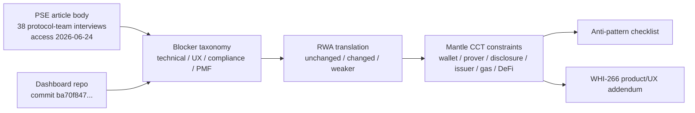
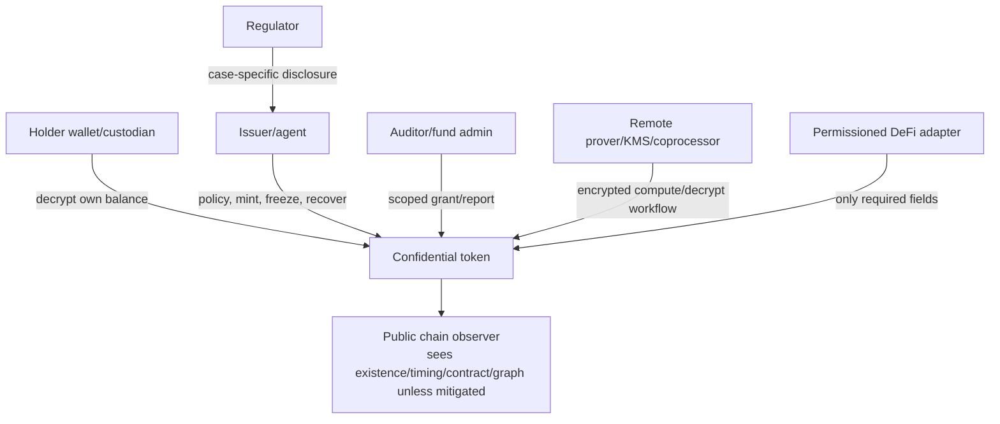

# PSE Private Transfers 用户研究与产品约束分析

## 执行摘要（Executive Summary）

PSE Private Transfers 的材料对 Mantle CCT（Confidential Compliance Token）的价值，不是替 Mantle 选择某一个 privacy protocol，而是把“隐私转账真实落地时最容易失败的地方”系统化。PSE 文章基于 **38 次与生态团队的访谈**；该数字和后文 approximate topic counts 均来自 PSE RSS 中的文章正文，访问日期 2026-06-24。重要注意事项：PSE 明确说访谈对象是“为终端用户构建的协议团队（protocol teams building for end users）”，不是终端用户样本；文中 topic counts 也明确不是代表性定量调查。

核心结论：

1. **PSE 的 blocker 可以分成四类：技术、产品/UX、合规、生态/PMF。** 技术侧最高频是 ZK 证明生成时间（14）、ZK verification gas（13）、DeFi composability（11）、deposit/withdraw leakage（10）、private state sync（6）。产品/UX 侧集中在 wallet support（10）、key management、mobile proving、gas/relayer、private-state scanning。合规侧集中在 regulatory uncertainty（11）、legal risk（7）、viewing key 不够 programmable。生态/PMF 侧包括 low demand/PMF（6）、liquidity constraints、fragmented anonymity sets（5）、standards/coordination（8/3）和 resource sustainability（8）。
2. **Mantle confidential RWA 不应照搬 retail private-transfer 的“最大匿名性”目标。** 机构场景更需要 confidential accounting、发行方控制、选择性披露、审计、gas sponsor、可解释的钱包/托管流程。匿名性和 unlinkability 仍有价值，但它们必须服务于 RWA adoption，而不能压过 issuer controls 和监管披露。
3. **Account-based confidential token 更像 Mantle CCT 的短期产品 substrate；note-based shielded pool 更像 privacy ceiling / 对照方案。** ERC-7984/OZ/fhEVM 路线能更自然地表达账户余额、issuer controls、RWA agent、wrapper 和 observer，但不隐藏地址/交易图/时间元数据，且有 ACL 撤销、coprocessor/KMS 和 DeFi adapter 风险。Railgun/Privacy Pools 式 note pool 具备更强 unlinkability，但带来 note scanning、匿名集冷启动、deposit/withdraw leakage、合规举证和 DeFi 适配成本。
4. **Mantle CCT 的产品底线是“合规 token + confidential accounting + scoped disclosure + wallet/prover/gas 可用性”。** 如果一个设计没有披露通道、不能让机构解释谁能看什么、要求移动端长时间证明、依赖未启动匿名集、或让用户先从公开地址充值 gas，它即使密码学上成立，也不应被评为产品可用。
5. **Product/UX supplement 只能调节边界分，不得推翻 WHI-266。** 尤其是 WHI-266 的轻量级一票否决仍然生效：非轻量方案的 `mantle_fit` 最高为 3，除非被明确定位为长期协议路线而不是短期轻量集成。

## 逐项发现（Item Findings）

### item-1：PSE blocker 分类法（PSE blocker taxonomy）

#### 来源验证门槛（Source verification gate）

本节使用的 PSE 文章来源：

| 来源 | 验证 |
|---|---|
| PSE 文章 URL | `https://pse.dev/blog/private-transfers-engineering-user-research`，文章标题“User Research: Uncovering Problems in the Private Transfers Space”，发表于 2026-05-08，作者 John Guilding。访问日期 2026-06-24。 |
| 正文抓取 | `https://pse.dev/api/rss`，对应同一 URL 的 RSS item，抓取于 2026-06-24。该 RSS 正文包含文章内容、38 次访谈的数字、关于非代表性计数的注意事项，以及 Top Topics 表格。 |
| 稳定性注意事项 | 在 outline 准备阶段，渲染页面的 GitHub edit 链接返回 404；因此本草稿引用的是 RSS/正文抓取及访问日期。Techtimes 于 2026-06-23 的报道称 EF 正在关闭 ZK 隐私研究单元 PSE，增加了来源迁移的风险。 |

PSE 表示该研究访谈了生态中的 38 个团队，而非终端用户。它还指出 ZK shielded pools 和 L2 团队被过度采样，且粗略的提及计数表不应被当作代表性定量数据。因此本节将 PSE 的计数作为**方向性的协议团队痛点信号**，而非市场规模或终端用户 PMF 证据。

#### Blocker 分类法（Blocker taxonomy）

| 类别 | PSE 证据 | 面向 Mantle 的产品解读 |
|---|---|---|
| 技术类 blocker | ZK 证明生成时间（14）、verification gas（13）、DeFi composability（11）、deposit/withdraw leakage（10）、external networks（9）、hash inefficiency（8）、private sync（6）、throughput（4）、large ciphertexts（3）。 | 隐私不是一个 UI 开关；它会改变 proving、gas、状态、存储、relayer 和 DeFi 执行的约束。 |
| 产品/UX 类 blocker | 缺少原生钱包支持（10）、密钥管理复杂、移动端 client-side proving、private state scanning、stealth-address gas funding、对 ZK 友好原语缺少硬件钱包支持。 | CCT 必须能通过钱包/托管方使用，而不能让用户手动管理看不见的 proof、key、scan 和 gas 工作流。 |
| 合规类 blocker | regulatory uncertainty（11）、legal risk（7）、传统 viewing key 不够 programmable、机构偏好 confidentiality 而非 anonymity（4）、机构把隐私门槛设得过低的风险。 | 机构采用需要 scoped disclosure、可审计性、issuer controls 和清晰的合规运营；一把覆盖全历史的 viewing key 是不够的。 |
| 生态/PMF 类 blocker | low demand/PMF（6）、liquidity constraints、fragmented anonymity sets（5）、缺乏标准（8）、resource constraints（8）、shared-roadmap gap（3）。 | Mantle 不应依赖一个冷启动的匿名 retail 网络；它应当定义机构优先的效用、标准面和集成边界。 |

### item-2：将私密转账 blocker 映射到 Mantle confidential RWA 约束（Private-transfer blockers mapped to Mantle confidential RWA constraints）

最重要的转译是：**机构 confidentiality 与 retail anonymity 不是同一个产品**。对于 retail private transfers，核心指标往往是 unlinkability。对于 confidential RWA，核心指标更接近于：授权方能否使用、审计、赎回、融资和披露一项 tokenized 资产，而不向公众泄露敏感余额和交易意图？

#### 私密转账 blocker -> Mantle RWA 设计约束（Private transfers blocker -> Mantle RWA design constraints）

| PSE/dashboard 证据 | blocker_category | retail 私密转账痛点 | RWA 沿用情况 | 机构端变化 | Mantle 需求 | anti-pattern 风险 | rubric 影响 |
|---|---|---|---|---|---|---|---|
| PSE：proof generation time 14；mobile/client proving 很慢；亚秒级被引用为它不再成为问题的阈值。 | technical/product_ux | 如果每笔转账都需要长时间本地 proving，用户会放弃隐私。 | changed | 机构可使用托管方或远程 prover，但移动端审批、交易台工作流和 SLA 仍然重要。 | 支持委托/远程 proving，配合加密输入、SLA、回退和托管边界。 | 移动端 proving 不可用；不透明的远程 prover/KMS。 | maturity, engineering_delta, mantle_fit |
| PSE：proof verification gas 13；Groth16 数十万 gas，Halo2 小电路接近 1M gas。 | technical | 私密转账对普通支付而言过于昂贵。 | unchanged | RWA 转账可能比 retail 容忍更高成本，但经常性的资金/托管操作仍需可预测的经济性。 | gas sponsor/paymaster/fee abstraction；选择 gas 有界的 proof/backend。 | 缺少 gas sponsor；成本对 PMF 模型隐藏。 | deployment_lightweight, engineering_delta |
| PSE：DeFi composability 11；private state 与共享合约状态相互隔离。Dashboard：Railgun 使用 relay adapt；Privacy Pools 除有限/收益 notes 外无 DeFi 访问。 | technical/ecosystem | 用户必须解包或泄露意图才能使用 DeFi。 | changed | RWA DeFi 受 KYC/KYB、场所准入、清算/预言机需求和 issuer policy 约束。 | 定义安全的 MVP DeFi 边界：先做 transfer/redeem，其次做基于 adapter 的 collateral/settlement，再后做 encrypted AMM/lending。 | 无条件的 DeFi composability 声称。 | mantle_fit, engineering_delta |
| PSE：deposit/withdraw leakage 10；dashboard：Privacy Pools 的 deposit/withdraw 金额公开；Railgun 在入口/出口缺少资产隐私。 | technical/privacy | 入口/出口的时间和金额会关联身份。 | unchanged | mint/redeem/bridge 以及 issuer/custodian 流程是 RWA 中等价于入口/出口的环节。 | 对 mint/redeem 流程做批处理、赞助、延迟或策略化设计；披露泄露边界。 | 忽视时间/元数据泄露。 | privacy_coverage, selective_disclosure |
| PSE：wallet support 10；密钥管理复杂；硬件钱包缺口。 | product_ux | 用户无法通过普通钱包访问隐私。 | changed | 机构用户可使用托管方/MPC，但运营方仍需要可读余额、审批、恢复和审计导出。 | 提供具备余额解密、转账审批、披露授权、恢复和管理员视图的钱包/托管 SDK。 | 产品仅要求专用 dapp；无托管方工作流。 | maturity, mantle_fit |
| PSE：传统 viewing key 不够 programmable。Railgun dashboard：viewing key 全量只读、预先定义；ERC-7984 既往研究：ObserverAccess permanent ACL 注意事项。 | compliance/product_ux | 共享 viewing key 会过度披露历史。 | amplified | 审计方、发行方、监管方、基金管理人需要 scoped、可记录、可撤销、可解释的访问。 | 按 actor/scope/duration/revocation/log 构建披露矩阵；避免默认全历史。 | viewing keys 永久且范围过宽；过度采集/隐私表演。 | selective_disclosure, compliance_capability |
| PSE：regulatory uncertainty 11、legal risk 7；机构需求以合规为条件。 | compliance/pmf | 构建者担心开放的隐私工具会招致执法。 | amplified | RWA 没有 issuer controls、policy、审计、赎回和制裁处理就无法上线。 | 把合规工作流当作产品面，而非附录。 | 仅以匿名性为卖点的叙事。 | compliance_capability, mantle_fit |
| PSE：fragmented anonymity sets 5 和 liquidity constraints。 | ecosystem_pmf | 新池子的匿名性弱、效用低。 | weaker/changed | 机构 CCT 可以在公共匿名集存在之前，先用 issuer-gated 参与者交付余额机密性。 | 不要让 MVP 依赖一个庞大的无许可匿名集；先用 account confidentiality 和受控披露。 | 匿名集依赖无法启动。 | privacy_coverage, mantle_fit |
| PSE：low demand/PMF 6；retail 用户不愿付费/忍受摩擦；机构需求理论上存在但以条件为前提。 | ecosystem_pmf | 隐私在叙事中被重视，但在实际行为中不被重视。 | amplified | 除非机密性在保持合规的同时能减少具体的业务泄露，否则机构不会采用。 | 锚定用例：cap table/基金份额、OTC/RWA settlement、treasury flows、collateral transfer、审计导出。 | 隐私表演；买家不清晰。 | mantle_fit, maturity |

#### 哪些仍然成立、哪些发生变化（What still holds versus what changes）

仍然不变地成立：

- 即使用户群体改变，proving、gas、wallet、relayer、metadata leakage 和 DeFi integration 的成本仍然真实存在。
- 入口/出口泄露直接映射到 RWA 的 mint/redeem/bridge/custody 流程。
- viewing-key 与披露设计仍是核心；一把覆盖全历史的单一密钥尤其危险。

在机构机密性下发生的变化：

- 目标往往是对公众隐藏金额、余额、头寸和交易对手，而不是相对于所有交易对手的无条件匿名。
- issuer controls、transfer policy、freeze/recover、redemption 和审计日志成为必备项，而不是隐私失败。
- 如果设计是面向已知 KYB/KYC 参与者集合的 account-based confidential accounting，那么匿名集冷启动就不那么致命。

作为设计驱动力变弱：

- 纯粹的无许可 retail PMF 不是 Mantle CCT 正确的上线标准。
- 如果最大化 unlinkability 会阻碍 issuer controls 或 scoped disclosure，那么它本身就不够充分。

### item-3：Account-based confidential token 与 note-based shielded pool（Account-based confidential token vs note-based shielded pool）

#### 产品对比（Product comparison）

| 模型 | 隐私覆盖 | 余额模型 | 可组合性 | 匿名性/冷启动 | 钱包 UX | 证明/解密 | 披露/合规 | 发行方控制 | Mantle 适配度 |
|---|---|---|---|---|---|---|---|---|---|
| Account-based confidential token（ERC-7984/OZ/fhEVM 风格） | 较强的金额/余额机密性；地址、转账存在性、时间、token 合约和交易图通常仍可见。 | 每账户的加密余额 / `bytes32` 指针 / FHE handle。 | 更接近 EVM token/account 模型；因不兼容 ERC-20，仍需 wrappers/adapters。 | 余额隐私不需要大型匿名池；图匿名性弱。 | 余额模型为人熟悉，但钱包必须解密/重加密 handles 并呈现 ACL/披露。 | FHE/coprocessor/Gateway/KMS 路径；input proof/ACL/decryption proof；远程基础设施风险。 | 更丰富的扩展面：ObserverAccess、Rwa、Restricted、Freezable、Hooked；注意 permanent ACL 和受信任的 hooks。 | 强：通过 RWA 模块实现 mint/burn/freeze/block/recover/force transfer。 | 若 backend 足够轻量，是更好的短期 CCT substrate；若过重则受 WHI-266 上限约束。 |
| Note-based shielded pool（Railgun 风格） | 池内更强的 unlinkability 和资产隐私；入口/出口泄露仍存在。 | UTXO notes；通过扫描/解密 notes 重建余额。 | 通过 relay/adapt/multicall 模式接入 DeFi；意图和边缘交互仍然复杂。 | 需要流动性/匿名集；在不同链/应用间被分割。 | 需要 note scanning；secrets/viewing keys；dashboard 称同步可能耗时数分钟。 | 客户端 Groth16 proving，browser/node/mobile prover 多种变体。 | viewing key + PPOI；viewing key 当前为全历史/预先定义；PPOI 位于 app/wallet/broadcaster 层。 | 对 issuer-native 控制较弱，除非外部 wrapped/gated。 | 是有用的 privacy ceiling 和 adapter 参考，而非最干净的 CCT 核心。 |
| Note-based compliance pool（Privacy Pools 风格） | 仅 unlinkability；dashboard 将 confidentiality 和资产隐私标为 No。 | UTXO commitments；无账户余额；若保留 note secret 则无需扫描。 | Dashboard：除有限的 yield 模块外无 DeFi 访问；仅支付。 | association set 流动性很重要；提款依赖 ASP。 | 充值后等待最多 8 小时由 ASP 审核；ragequit 退出公开可见。 | 本地 withdrawal proof。 | 提款时由 Association Set Provider 审核；无 viewing key/选择性披露机制。 | issuer controls 弱；合规基于 ASP 集合，而非 issuer token 生命周期。 | 是很好的合规-隐私设计教训；单独作为 CCT accounting substrate 不足。 |
| 协议级原生私密转账（EIP-8182 reference） | 可能统一匿名集与价值机密性；Core/hardfork 路线。 | Note/UTXO 系统合约。 | 需要协议层支持；并非可立即加到 Mantle L2 上的 bolt-on。 | 若被广泛采用则最佳；无短期本地流动性方案。 | 取决于未来的 wallet/protocol UX。 | 既往研究中引用 Groth16/BN254；细节动态变化。 | 合规兼容性待定。 | 非 issuer-token 专用。 | 仅作长期参考；除非 Mantle 明确选择协议路线，否则非轻量。 |

结论：对 **Mantle CCT** 而言，account-based confidential token 设计是更好的近期产品锚点，因为它映射到 issuer-controlled RWA 余额、披露和机构运营。Note-based pools 仍然是重要的反面与正面范例：它们展示了更强的 unlinkability 在钱包扫描、gas、流动性、披露和可组合性上要付出什么代价。

### item-4：钱包、prover、加密 SDK 与 gas sponsor 约束（Wallet, prover, encryption SDK, and gas sponsor constraints）

#### 首位机构持有者旅程（First institutional holder journey）

```text
Issuer/KYB
  -> institution receives wallet/custody setup
  -> holder receives confidential token
  -> wallet shows decrypted balance and disclosure status
  -> holder initiates transfer with policy pre-check
  -> proof/encrypted input generated locally or delegated remotely
  -> gas sponsor/paymaster submits without public funding link
  -> recipient wallet/custodian decrypts balance
  -> auditor/issuer receives scoped disclosure grant or report
  -> redemption/force action/freeze path remains explainable and logged
```

#### MVP / 应有 / 后期高风险约束（MVP / should-have / risky-later constraints）

| 优先级 | 约束 |
|---|---|
| MVP | 钱包/托管集成必须显示解密后的余额、待处理的 proof/decryption 状态、policy 失败状态，以及披露授权。 |
| MVP | gas sponsor/paymaster 必须防止公共充值跳转将身份与转账意图关联起来。 |
| MVP | 远程 proving 或加密服务必须有清晰的信任边界：它能看到哪些明文/密文/元数据、能审查什么，以及失败如何恢复。 |
| MVP | SDK 必须把 confidential transfer、解密余额、授予披露、撤销未来披露和导出审计报告作为一等操作。 |
| 应有 | 移动端和浏览器流程不应要求在用户设备上长时间生成证明；委托 proving 必须避免以明文发送 private state。 |
| 应有 | 钱包应针对 mint/redeem/bridge 和 DeFi adapter 流程，提示入口/出口和时间泄露的警告。 |
| 后期高风险 | 针对加密余额的全私有 DeFi，除非有专门构建的 adapters、oracle/risk engines 和清算语义支撑。 |
| 后期高风险 | 协议级原生私密转账或 precompile 路线；WHI-266 将非轻量路线视为受上限约束，除非定位为长期。 |

### item-5：选择性披露、审计方密钥、发行方控制与合规运营（Selective disclosure, auditor key, issuer control, and compliance operations）

CCT 披露必须被建模为产品功能。仅仅说“viewing key 存在”是不够的。

| Actor | 他们可以看到什么 | 由谁授予 | 时长 | 撤销语义 | 审计轨迹 | 风险 |
|---|---|---|---|---|---|---|
| Holder | 自己的余额、转账、披露授权 | 钱包/密钥持有者 | 持续 | 需要账户恢复路径 | 钱包/托管日志 | 丢失密钥会阻断可用性 |
| Issuer/agent | 资格、freezes、操作时的 forced transfer/recovery 金额 | Governance/RBAC | 角色期限 | 未来角色可撤销；既有的知情仍然持续 | 强制的链上/链下日志 | 过强的 issuer controls |
| Auditor/fund admin | scoped 余额/转账/期间报告 | Holder 或 issuer policy | 按时间/资产/账户 scoped | 必须可面向未来撤销；除非另有证明，历史访问须视为持续 | 报告哈希 + 授权日志 | 永久的全历史访问 |
| Regulator | 特定案件记录或法律要求的报告 | Issuer/法务工作流 | 按案件 scoped | 法律/流程撤销，而非纯技术撤销 | 案件日志和披露回执 | 过度采集 |
| DeFi venue/risk engine | 仅 eligibility、collateral、limit 或 liquidation 所需字段 | Holder/issuer/adapter | 按头寸 scoped | adapter 特定 | 风险/审计日志 | DeFi 看到的过多 |
| Remote prover/KMS/coprocessor | 理想情况下仅加密输入/handles；绝不接触广泛明文 | 协议/基础设施配置 | 服务会话 | 密钥轮换/运营方治理 | SLA + 访问日志 | 不透明的运营信任 |

产品要求：每个披露 UI 都必须回答“谁能看到什么、看多久、为什么，以及旧访问是否真的能被撤销。”ERC-7984/OZ 的既往研究使这一点尤为重要，因为 ObserverAccess 会授予对相关 handles 的 permanent ACL 访问，且 Hooked 模块的 ACL 授权在模块卸载后仍可能持续。

### item-6：DeFi 可组合性与机构上手边界（DeFi composability and institutional onboarding boundaries）

#### DeFi 边界图（DeFi boundary map）

| 边界 | 用例 | 理由 |
|---|---|---|
| 安全 MVP | confidential holder-to-holder transfer；mint/burn/redeem；issuer freeze/recover；scoped 审计导出；简单的 allowlisted settlement。 | 契合 CCT 核心，而不假装加密余额到处都能用。 |
| 借助 adapters 可行 | 向许可场所的 collateral transfer、OTC settlement、RWA 基金申购/赎回、treasury transfer、有限的 DEX/RFQ adapter。 | adapter 可以定义哪些值必须向谁披露。 |
| 仅供研究 | 完全加密余额的 AMM/lending、confidential liquidation、加密 oracle/risk engine、跨链私有流动性。 | 需要协议专属的数学、风险、oracle 和审计设计。 |
| Anti-pattern | 在没有 wrapper、披露、价格、清算、indexer 或失败语义的情况下声称“兼容 ERC-20 DeFi”。 | 这是把 PSE 的 composability blocker 当作营销文案重复一遍。 |

#### 机构上手流程（Institutional onboarding flow）

1. 发行方定义资产、policy、角色、披露 schema、赎回条款和紧急控制。
2. 机构完成 KYB/KYC，并获得 wallet/custody + 披露策略配置。
3. 钱包/托管方初始化加密密钥、恢复路径和 gas sponsor 路由。
4. 发行方铸造或转移 confidential balance。
5. Holder 只有在 policy/prover/gas 路径就绪后才能查看余额并转账。
6. Auditor/fund admin 获得 scoped 报告或 viewing grant。
7. DeFi venue 仅通过定义可见字段和失败模式的 adapter 接入。
8. 在上线前记录好 redemption/bridge/force action 路径。

冷启动分析：Mantle 应当首先针对**面向小型已批准参与者集合的机构效用**进行优化，而非面向大型 retail 匿名集。流动性仍然重要，但一阶冷启动风险是合格机构、issuer 运营、审计方接受度、gas 赞助、wallet/custody 支持和 adapter 合作伙伴。

### item-7：Mantle CCT anti-pattern 清单（Mantle CCT anti-pattern checklist）

| Anti-pattern | 症状 | 为何危险 | 检测问题 | 缓解措施 | 严重程度 |
|---|---|---|---|---|---|
| 无披露通道 | 金额被加密，但不存在 holder/issuer/auditor 的查看路径。 | 机构 RWA 无法审计、报告、调查或赎回。 | 审计方能否查看一个 scoped 期间，而不必永久看到一切？ | 把披露矩阵和审计导出做进 MVP。 | critical |
| 仅匿名性叙事 | 设计最大化 unlinkability，但缺少 issuer controls。 | 缺失 RWA 合规生命周期。 | 发行方能否在策略下执行 freeze/recover/redeem？ | 将隐私原语与合规 token 控制配套。 | critical |
| 移动端 proving 不可用 | 转账需要长时间本地 proving 或不可靠的浏览器/移动端计算。 | 普通钱包和运营方会回避该产品。 | 目标钱包上 proof/decryption 延迟的 p95 是多少？ | 配合明确信任边界的远程/委托 proving。 | major |
| 匿名集依赖无法启动 | 在大量不相关用户进入池子之前产品没有价值。 | 早期机构得到弱隐私和低流动性。 | 在 3 个发行方和 20 家机构时存在什么价值？ | MVP 优先 account confidentiality；选择性使用 pools。 | major |
| 缺少 gas sponsor | 用户必须在私密转账前从公开地址充值。 | 充值跳转会关联身份、时间和意图。 | 新 holder 能否在没有公共 gas 关联的情况下转账？ | 配合隐私评审的 paymaster/sponsor/relayer 策略。 | major |
| viewing keys 永久且范围过宽 | 审计方永久看到全部历史。 | 过度采集变成隐私表演和法律风险。 | scope、duration 和 revocation 能否向用户展示？ | scoped 授权、日志、期间报告；除非证明已撤销，否则将旧授权视为持续。 | major |
| 远程 prover/KMS 不透明 | 服务能看到敏感输入或可在无问责情况下审查。 | 隐私从链上转移到供应商信任。 | prover/KMS 究竟学习并记录了什么？ | 威胁模型、加密、SLA、failover、密钥治理。 | major |
| 无 adapter 却断言 DeFi 可组合性 | 声称“与 DeFi 兼容”，但 AMM/lending/indexer 的假设尚未解决。 | 集成在首次真实使用时失败或泄露值。 | 哪些值对 venue/oracle/liquidator 是公开的？ | adapter 特定的集成与披露契约。 | major |
| 忽视时间/元数据泄露 | 金额已加密，但交易图、时间、token 合约、入口/出口和交易对手仍然公开。 | 公开观察者仍能推断敏感交易/头寸。 | 观察者在不解密金额的情况下能推断出什么？ | 批处理/延迟/赞助/路由设计；发布泄露模型。 | major |
| 过度采集/隐私表演式披露 | 监管/审计方的访问比必要的更宽，且对 holders 不可见。 | 产品声称隐私，却把监视集中化。 | 披露是否按 actor 最小化并加以解释？ | 数据最小化规则、可见的授权、可审阅的日志。 | major |

### item-8：面向 WHI-266 的产品/UX 评分补充（Product/UX scoring addendum for WHI-266）

本补充**不**替代 WHI-266。它只是调整评审者在产品证据弱或强时如何解读边界分。WHI-266 的轻量级一票否决仍然具有约束力：如果一个路线不是轻量的，`mantle_fit` 最高为 3，除非它被明确定位为长期协议路线，而非近期的 Mantle 集成。

| 维度 | 0-1 | 2-3 | 4-5 | 所需证据 | 关联的 WHI-266 轴 |
|---|---|---|---|---|---|
| Wallet/custody UX | 仅专用 CLI/dapp；无余额/解密/恢复 UX。 | 有缺口的演示钱包或托管方流程。 | 具备余额、转账、恢复、披露的生产级 wallet/custody SDK。 | 界面/文档、SDK、托管工作流。 | maturity, mantle_fit |
| Prover/decryption UX | 长时间本地证明、解密不清晰、无移动/浏览器路径。 | 存在远程 proving，但信任/SLA 不清晰。 | 有实测延迟、委托 proving、加密输入、failover。 | 基准测试、威胁模型、SLA。 | engineering_delta, maturity |
| Gas/relayer UX | 公共 gas 充值泄露身份。 | 存在 sponsor，但元数据/审查不清晰。 | 配合隐私和审计策略的 gas sponsor/paymaster。 | 架构与泄露模型。 | deployment_lightweight, mantle_fit |
| Disclosure UX | 一把全历史密钥或仅管理员视图。 | 有部分 viewing grants，但 scope/revocation/logs 不清晰。 | 按 actor、按时间 scoped、可记录、可解释的授权与报告。 | 披露矩阵、日志、撤销语义。 | selective_disclosure, compliance_capability |
| DeFi/onboarding UX | 泛泛的“DeFi 兼容”声称。 | 一个 adapter 或手动上手。 | 已定义的安全 MVP、adapter 分层、issuer/机构/审计方上手。 | 集成指南、adapter 规范。 | engineering_delta, mantle_fit |
| PMF 证据 | 仅隐私叙事。 | 试点兴趣；无条件采用证明。 | 机密性可减少可度量业务风险的具体机构工作流。 | 试点文档、用户访谈、合规接受度。 | maturity, mantle_fit |

评分建议：强有力的产品/UX 证据可以在 WHI-266 的边界内抬升边界性的 `maturity` 或 `mantle_fit` 分数，但无法挽救一个不满足 CCT 最低能力或触发轻量级一票否决的设计。

## 图示（Diagrams）

### diag-1：从 blocker 到需求的流程（Blocker-to-requirement flow）



### diag-2：账户模型与 note 模型对比（Account model versus note model）

```text
Account-based CCT
  encrypted account balance -> issuer policy -> scoped disclosure -> adapter/wrapper DeFi
  strengths: issuer controls, RWA lifecycle, familiar accounting
  risks: graph/timing visible, ACL persistence, coprocessor/KMS trust

Note-based pool
  deposit -> note commitment -> nullifier spend -> withdrawal/internal transfer
  strengths: unlinkability/anonymity set, asset privacy inside pool
  risks: scanning/proving, cold start, entry/exit leakage, weak issuer lifecycle
```

### diag-3：Actor/数据可见性图（Actor/data visibility map）



### diag-4：机构上手旅程（Institutional onboarding journey）

```text
Issuer config
  -> KYB/KYC participant admission
  -> wallet/custody + key/recovery setup
  -> confidential mint/transfer
  -> balance decrypt + policy pre-check
  -> gas-sponsored transfer
  -> scoped disclosure / audit export
  -> adapter-based DeFi or redeem
  -> incident: freeze / recover / force transfer / disclosure log
```

### diag-5：需求热力图（Requirement heatmap）

| Blocker 类别 | Wallet | Prover/SDK | Disclosure | Issuer controls | Gas sponsor | DeFi | Onboarding |
|---|---:|---:|---:|---:|---:|---:|---:|
| 技术 | medium | high | medium | medium | high | high | medium |
| 产品/UX | high | high | high | medium | high | medium | high |
| 合规 | medium | medium | high | high | medium | medium | high |
| 生态/PMF | high | medium | medium | high | medium | high | high |

## 来源覆盖（Source Coverage）

| 来源要求 | 状态 | 证据 |
|---|---|---|
| PSE 用户研究文章 | satisfied | RSS 正文位于 `https://pse.dev/api/rss`，item URL 为 `https://pse.dev/blog/private-transfers-engineering-user-research`，访问于 2026-06-24；确认了 38 次访谈和 Top Topics 表格。 |
| PSE dashboard/repo | satisfied with caveat | `privacy-ethereum/private-transfers-benchmarks` commit `ba70f847c2b33c8d06b64d31fc946f2cb5cf8fa3`，GitHub commit API 访问于 2026-06-24；dashboard 处于 WIP。 |
| Dashboard schema | satisfied | `project-evaluations/src/data/schema.ts` blob `f7f703c5ae648c01c1f897096763fb93234a0471`；`evaluation-schema.ts` blob `eb3e6c6b42b87dedc1e35df33f27e71115c0f054`，均在 commit `ba70f847...`。 |
| Dashboard evaluations | satisfied | `railgun.json`、`privacy-pools.json`，以及待定的 `zama.json`/`eerc20.json`，均在 commit `ba70f847...` 获取。 |
| WHI-266 需求框架 | satisfied | `confidential-compliance-token-research/research-sections/requirements-framework/final.md` commit `9eb29a150f380f21add9b431b66fea2ee5d12881`；轻量级一票否决在 §item-8 中引用。 |
| ERC-7984 既往研究 | satisfied | `evm-privacy-research/research-sections/erc7984-confidential-token/final.md` commit `fdbda370e9e9137890c5bd2deb7752e03d76d0bc`。 |
| Shielded-pool 既往研究 | satisfied | `evm-privacy-research/research-sections/zk-shielded-pool/final.md` commit `788453b4097f37003337b943bcf6d7f8f68b02ba`。 |
| Privacy EIPs 既往研究 | satisfied | `evm-privacy-research/research-sections/privacy-eips-survey/final.md` commit `957773b13b2f5a66354ccda4b7d0c79a7236b222`。 |
| 来源稳定性警告 | satisfied | Techtimes URL 访问于 2026-06-24；页面元数据/标题称 EF 裁员 54 人、关闭 ZK 研究实验室、预算削减 40%，发表于 2026-06-23。仅用作来源稳定性警告，而非作为 PSE 研究证据。 |

## 缺口分析（Gap Analysis）

1. **未创建文章存档 URL。** 本草稿使用 PSE RSS 正文和访问日期作为经验证的正文路径。如果评审要求第三方存档快照 URL，应由 Orchestrator 或评审请求一份；实时 RSS 目前足以满足 F1，但仍是 EF/PSE 控制的来源。
2. **Dashboard clone 失败；API/raw-file 抓取成功。** Git clone/ls-remote 遇到 GitHub 传输错误，但 GitHub commit 和 contents API 提供了确切的 commit 和文件 blobs。这对 F2 pinning 是充分的。
3. **Dashboard 待定条目是弱证据。** Zama 和 AvaCloud eERC20 条目为 `pending`，仅包含描述/类别，因此本草稿不将它们用于评分性主张。
4. **法律/合规分析仍停留在产品层。** 本草稿不就法律充分性发表意见；它把合规不确定性转化为产品需求。
5. **无 Mantle 实现验证。** 这是一份需求与约束草稿，而非实现计划或代码审计。

## 修订日志（Revision Log）

| Round | 日期 | 变更 | 作者 |
|---|---|---|---|
| 1 | 2026-06-24 | 基于已批准 outline 的初版深度草稿。通过 RSS 验证 PSE 文章正文并保留非代表性注意事项以处理 F1；通过将 dashboard 主张固定到 `privacy-ethereum/private-transfers-benchmarks` commit `ba70f847c2b33c8d06b64d31fc946f2cb5cf8fa3` 处理 F2；通过在产品/UX 补充中陈述 WHI-266 轻量级一票否决处理 F3；纳入 F4 anti-patterns。 | Deep Research Agent |
