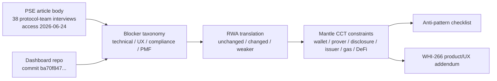
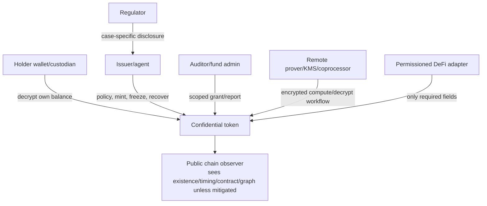

# PSE Private Transfers 用户研究与产品约束分析

**从草稿评审中逐字保留的最终晋级注意事项 C1-C2：**

- **C1：** PSE 文章正文的论断（38 次访谈 + 各主题计数）归因于访问日期 2026-06-24 的 RSS 抓取，并被定性为非代表性的协议团队信号。该定性与访问日期必须逐字保留。如果将来出现可用的归档快照 URL，应将其补充到「缺口分析」（Gap Analysis）第 1 条——但这不是晋级的必要条件。
- **C2：** 来自看板的定量数字（例如 Privacy Pools 约 8 小时的 ASP 等待、验证 gas 数据）必须始终归因于 `privacy-ethereum/private-transfers-benchmarks` commit `ba70f847c2b33c8d06b64d31fc946f2cb5cf8fa3`，不得被重述为独立证实的事实。

## 执行摘要（Executive Summary）

PSE Private Transfers 的材料对 Mantle CCT（Confidential Compliance Token，机密合规代币）的价值，不是替 Mantle 选择某一个 privacy protocol（隐私协议），而是把“隐私转账真实落地时最容易失败的地方”系统化。PSE 文章基于 **38 次与生态团队的访谈**；该数字和后文的近似主题计数（approximate topic counts）均来自 PSE RSS 中的文章正文，访问日期 2026-06-24。重要注意事项：PSE 明确说访谈对象是“为终端用户构建产品的协议团队”（protocol teams building for end users），不是终端用户样本；文中各主题计数也明确不是代表性定量调查。

核心结论：

1. **PSE 的 blocker（阻塞因素）可以分成四类：技术、产品/UX、合规、生态/PMF。** 技术侧最高频是 ZK 证明生成时间（14）、ZK 验证 gas（13）、DeFi 可组合性（11）、deposit/withdraw（充提）泄漏（10）、私有状态同步（6）。产品/UX 侧集中在钱包支持（10）、密钥管理、移动端证明、gas/relayer（中继）、私有状态扫描。合规侧集中在监管不确定性（11）、法律风险（7）、viewing key（查看密钥）不够可编程。生态/PMF 侧包括低需求/PMF（6）、流动性约束、匿名集碎片化（5）、标准/协调缺口（8/3）和资源可持续性（8）。
2. **Mantle confidential RWA（机密 RWA）不应照搬零售隐私转账的“最大匿名性”目标。** 机构场景更需要 confidential accounting（机密记账）、发行方控制、选择性披露、审计、gas sponsor（gas 赞助）、可解释的钱包/托管流程。匿名性和不可关联性（unlinkability）仍有价值，但它们必须服务于 RWA 采用，而不能压过发行方控制（issuer controls）和监管披露。
3. **Account-based confidential token（基于账户的机密代币）更像 Mantle CCT 的短期产品基底（substrate）；note-based shielded pool（基于 note 的屏蔽池）更像隐私上限/对照方案。** ERC-7984/OZ/fhEVM 路线能更自然地表达账户余额、发行方控制、RWA agent、wrapper（包装器）和 observer（观察者），但不隐藏地址/交易图/时间元数据，且有 ACL 撤销、coprocessor/KMS 和 DeFi adapter（适配器）风险。Railgun/Privacy Pools 式 note pool 具备更强的不可关联性，但带来 note 扫描、匿名集冷启动、deposit/withdraw 泄漏、合规举证和 DeFi 适配成本。
4. **Mantle CCT 的产品底线是“合规 token + confidential accounting + 受限披露（scoped disclosure）+ wallet/prover/gas 可用性”。** 如果一个设计没有披露通道、不能让机构解释谁能看什么、要求移动端长时间证明、依赖未启动的匿名集、或让用户先从公开地址充值 gas，那么它即使密码学上成立，也不应被评为产品可用。
5. **Product/UX supplement（产品/UX 补充）只能调节边界分，不得推翻 WHI-266。** 尤其是 WHI-266 的轻量级一票否决仍然生效：非轻量方案的 `mantle_fit` 最高为 3，除非被明确定位为长期协议路线而不是短期轻量集成。

## 逐项发现（Item Findings）

### item-1：PSE blocker taxonomy（PSE 阻塞因素分类）

#### 来源核验关卡（Source verification gate）

此处使用的 PSE 文章来源：

| 来源 | 核验 |
|---|---|
| PSE 文章 URL | `https://pse.dev/blog/private-transfers-engineering-user-research`，文章标题 "User Research: Uncovering Problems in the Private Transfers Space"，发布于 2026-05-08，作者 John Guilding。访问日期 2026-06-24。 |
| 正文抓取 | `https://pse.dev/api/rss`，同一 URL 的 RSS 条目，抓取日期 2026-06-24。该 RSS 正文包含文章内容、38 次访谈的数字、关于计数非代表性的注意事项，以及 Top Topics（高频主题）表格。 |
| 稳定性注意事项 | 在 outline 准备阶段，渲染页面的 GitHub 编辑链接返回 404；因此本草稿引用的是 RSS/正文抓取与访问日期。Techtimes 一篇日期为 2026-06-23 的报道称 EF 正在关闭 ZK 隐私研究部门 PSE，增加了来源变动风险。 |

PSE 表示该研究访谈了生态中的 38 个团队，而非终端用户。它还表示 ZK 屏蔽池和 L2 团队占比偏高，且粗略的提及计数表不应被当作代表性定量数据。因此本节将 PSE 的计数用作**方向性的协议团队痛点信号**，而非市场规模测算或终端用户 PMF 证据。

#### 阻塞因素分类（Blocker taxonomy）

| 类别 | PSE 证据 | 对 Mantle 的产品解读 |
|---|---|---|
| 技术类阻塞因素 | ZK 证明生成时间（14）、验证 gas（13）、DeFi 可组合性（11）、deposit/withdraw 泄漏（10）、外部网络（9）、哈希低效（8）、私有同步（6）、吞吐量（4）、大密文（3）。 | 隐私不是一个 UI 开关；它改变了证明、gas、状态、存储、relayer 和 DeFi 执行的约束。 |
| 产品/UX 类阻塞因素 | 缺乏原生钱包支持（10）、密钥管理复杂、移动端客户端证明、私有状态扫描、隐身地址（stealth-address）gas 充值、缺乏对 ZK 友好原语的硬件钱包支持。 | CCT 必须能通过钱包/托管方使用，而不应让用户手动管理不可见的证明、密钥、扫描和 gas 流程。 |
| 合规类阻塞因素 | 监管不确定性（11）、法律风险（7）、传统 viewing key 不够可编程、机构偏好机密性而非匿名性（4）、机构把隐私门槛设得过低的风险。 | 机构采用需要受限披露、可审计性、发行方控制和清晰的合规操作；一把全历史 viewing key 是不够的。 |
| 生态/PMF 类阻塞因素 | 低需求/PMF（6）、流动性约束、匿名集碎片化（5）、缺乏标准（8）、资源约束（8）、共享路线图缺口（3）。 | Mantle 不应依赖一个冷启动的匿名零售网络；它应当定义机构优先的效用、标准面和集成边界。 |

### item-2：把隐私转账阻塞因素映射到 Mantle confidential RWA 约束（Private-transfer blockers mapped to Mantle confidential RWA constraints）

最重要的转译在于：**机构机密性与零售匿名性不是同一种产品**。对于零售隐私转账，核心指标往往是不可关联性。对于 confidential RWA，核心指标更接近于：被授权方能否在不向公众泄漏敏感余额和交易意图的前提下，使用、审计、赎回、融资和披露一项代币化资产？

#### 隐私转账阻塞因素 -> Mantle RWA 设计约束（Private transfers blocker -> Mantle RWA design constraints）

| PSE/看板证据 | blocker_category | 零售隐私转账痛点 | RWA 沿用情况 | 机构层面的变化 | Mantle 需求 | anti-pattern 风险 | 评分影响 |
|---|---|---|---|---|---|---|---|
| PSE：证明生成时间 14；移动端/客户端证明慢；引用“亚秒级”作为不再成为问题的阈值。 | technical/product_ux | 如果每笔转账都需要长时间本地证明，用户会放弃隐私。 | changed | 机构可使用托管方或远程 prover，但移动端审批、交易台工作流和 SLA 仍然重要。 | 支持带加密输入的委托/远程证明，并配套 SLA、回退机制和托管边界。 | 移动端证明不可用；不透明的远程 prover/KMS。 | maturity, engineering_delta, mantle_fit |
| PSE：证明验证 gas 13；Groth16 数十万 gas，Halo2 小电路接近 1M gas。 | technical | 对普通支付而言，隐私转账太贵。 | unchanged | RWA 转账可能比零售更能容忍成本，但反复发生的基金/托管操作仍需要可预测的经济性。 | gas sponsor/paymaster/费用抽象；选择 gas 有界的证明/后端。 | 缺少 gas sponsor；成本对 PMF 模型不可见。 | deployment_lightweight, engineering_delta |
| PSE：DeFi 可组合性 11；私有状态与共享合约状态隔离。看板：Railgun 使用 relay adapt；Privacy Pools 除受限/收益型 note 外没有 DeFi 接入。 | technical/ecosystem | 用户必须解包或泄漏意图才能使用 DeFi。 | changed | RWA DeFi 受 KYC/KYB、场所准入、清算/预言机需求和发行方策略约束。 | 定义安全的 MVP DeFi 边界：先做转账/赎回，其次做基于 adapter 的抵押/结算，最后再做加密 AMM/借贷。 | 无限定条件地宣称 DeFi 可组合性。 | mantle_fit, engineering_delta |
| PSE：deposit/withdraw 泄漏 10；看板：Privacy Pools 充提金额公开；Railgun 在出入口处不具备资产隐私。 | technical/privacy | 出入口的时间和金额会关联身份。 | unchanged | mint/redeem/bridge 以及发行方/托管方流程是 RWA 中对应出入口的环节。 | 对 mint/redeem 流程做批处理、赞助、延迟或策略化设计；披露泄漏边界。 | 忽视时间/元数据泄漏。 | privacy_coverage, selective_disclosure |
| PSE：钱包支持 10；密钥管理复杂；硬件钱包缺口。 | product_ux | 用户无法通过普通钱包访问隐私。 | changed | 机构用户可使用托管方/MPC，但运营者仍需要可读余额、审批、恢复和审计导出。 | 提供带余额解密、转账审批、披露授予、恢复和管理员视图的钱包/托管 SDK。 | 产品仅要求专用 dapp；没有托管方工作流。 | maturity, mantle_fit |
| PSE：传统 viewing key 不够可编程。Railgun 看板：viewing key 为全量读取、预先定义；ERC-7984 先前研究：ObserverAccess 永久 ACL 注意事项。 | compliance/product_ux | 分享 viewing key 会过度披露历史。 | amplified | 审计师、发行方、监管机构、基金管理员需要受限、可记录、可撤销、可解释的访问。 | 按 actor/scope/duration/revocation/log 建立披露矩阵；避免默认全历史访问。 | viewing key 永久且过宽；过度采集/隐私表演（privacy theater）。 | selective_disclosure, compliance_capability |
| PSE：监管不确定性 11，法律风险 7；机构需求以合规为条件。 | compliance/pmf | 构建者担心开放的隐私工具招致执法。 | amplified | 没有发行方控制、策略、审计、赎回和制裁处理，RWA 无法上线。 | 把合规工作流当作产品面，而非附录。 | 仅以匿名性为卖点的叙事。 | compliance_capability, mantle_fit |
| PSE：匿名集碎片化 5 及流动性约束。 | ecosystem_pmf | 新池子匿名性弱、效用低。 | weaker/changed | 机构型 CCT 可以在公开匿名集存在之前，先以发行方门控的参与者交付余额机密性。 | 不要让 MVP 依赖一个庞大的无许可匿名集；先用账户机密性和受控披露。 | 依赖匿名集导致无法启动。 | privacy_coverage, mantle_fit |
| PSE：低需求/PMF 6；零售用户不愿付费/承受摩擦；机构需求理论上存在但有条件。 | ecosystem_pmf | 隐私在叙事中被看重，但在真实行为中并非如此。 | amplified | 除非机密性在保持合规的同时减少具体的业务泄漏，否则机构不会采用。 | 锚定用例：股权结构表/基金份额、OTC/RWA 结算、资金流、抵押品转移、审计导出。 | 隐私表演；买方不清晰。 | mantle_fit, maturity |

#### 哪些保持不变，哪些发生变化（What still holds versus what changes）

仍然保持不变：

- 即使用户群体改变，证明、gas、钱包、relayer、元数据泄漏和 DeFi 集成的成本依然真实存在。
- 出入口泄漏直接映射到 RWA 的 mint/redeem/bridge/托管流程。
- viewing key 和披露设计仍然是核心；一把全历史密钥尤其危险。

在机构机密性下的变化：

- 目标往往是对公众隐藏金额、余额、持仓和交易对手，而不是相对所有交易对手的无条件匿名。
- 发行方控制、转账策略、冻结/恢复、赎回和审计日志成为必备项，而非隐私失败。
- 如果设计是面向已知 KYB/KYC 参与者集合的、基于账户的机密记账，那么匿名集冷启动的致命性会降低。

作为设计驱动力变弱：

- 纯无许可的零售 PMF 不是 Mantle CCT 正确的上线判据。
- 如果最大化不可关联性会妨碍发行方控制或受限披露，那么它就不足以成立。

### item-3：基于账户的机密代币 vs 基于 note 的屏蔽池（Account-based confidential token vs note-based shielded pool）

#### 产品对比（Product comparison）

| 模型 | 隐私覆盖 | 余额模型 | 可组合性 | 匿名性/冷启动 | 钱包 UX | 证明/解密 | 披露/合规 | 发行方控制 | 对 Mantle 的契合度 |
|---|---|---|---|---|---|---|---|---|---|
| 基于账户的机密代币（ERC-7984/OZ/fhEVM 风格） | 强的金额/余额机密性；地址、转账存在性、时间、token 合约和交易图通常可见。 | 每账户加密余额 / `bytes32` 指针 / FHE handle。 | 更接近 EVM token/账户模型；因不兼容 ERC-20 仍需 wrapper/adapter。 | 余额隐私不需要大型匿名池；交易图匿名性弱。 | 余额视图熟悉，但钱包必须解密/重加密 handle 并呈现 ACL/披露。 | FHE/coprocessor/Gateway/KMS 路径；输入证明/ACL/解密证明；远程基础设施风险。 | 更丰富的扩展面：ObserverAccess、Rwa、Restricted、Freezable、Hooked；注意永久 ACL 和受信 hook。 | 强：通过 RWA 模块支持 mint/burn/freeze/block/recover/force transfer。 | 若后端足够轻量，则是更好的短期 CCT 基底；若过重则按 WHI-266 封顶。 |
| 基于 note 的屏蔽池（Railgun 风格） | 池内具备更强的不可关联性和资产隐私；出入口泄漏仍在。 | UTXO note；余额通过扫描/解密 note 重建。 | 通过 relay/adapt/multicall 模式做 DeFi；意图和边缘交互仍复杂。 | 需要流动性/匿名集；跨链/跨应用碎片化。 | 需要 note 扫描；secret/viewing key；看板称同步可能耗时数分钟。 | 客户端 Groth16 证明，浏览器/节点/移动端 prover 变体。 | viewing key + PPOI；viewing key 目前为全历史/预先定义；PPOI 涉及 app/wallet/broadcaster 层。 | 除非外部包装/门控，否则对发行方原生控制较弱。 | 是有用的隐私上限和 adapter 参考，而非最干净的 CCT 核心。 |
| 基于 note 的合规池（Privacy Pools 风格） | 仅不可关联性；看板将机密性和资产隐私标为 No。 | UTXO commitment；无账户余额；若保留 note secret 则无需扫描。 | 看板：除受限收益模块外无 DeFi 接入；仅支付。 | association set（关联集）流动性重要；提款依赖 ASP。 | 充值后等待至多 8 小时进行 ASP 审核；ragequit 公开退出。 | 本地提款证明。 | 提款时由 Association Set Provider 处理；无 viewing key/选择性披露机制。 | 发行方控制弱；合规基于 ASP 集合，而非发行方 token 生命周期。 | 是优秀的合规-隐私设计借鉴；但单独作为 CCT 记账基底不足。 |
| 协议级原生隐私转账（EIP-8182 参考） | 可能统一匿名集与价值机密性；走 Core/hardfork 路线。 | note/UTXO 系统合约。 | 需要协议支持；不是可立即附加到 Mantle L2 的功能。 | 若被广泛采用最佳；无短期本地流动性方案。 | 取决于未来的钱包/协议 UX。 | 先前研究中参考 Groth16/BN254；细节动态。 | 合规兼容性待定（TBD）。 | 不针对发行方 token。 | 仅作长期参考；除非 Mantle 明确选择协议路线，否则属于非轻量。 |

结论：对于 **Mantle CCT**，基于账户的机密代币设计是更好的近期产品锚点，因为它映射到发行方控制的 RWA 余额、披露和机构运营。基于 note 的池仍然是必要的正反面范例：它们展示了更强的不可关联性在钱包扫描、gas、流动性、披露和可组合性上要付出的代价。

### item-4：钱包、prover、加密 SDK 和 gas sponsor 约束（Wallet, prover, encryption SDK, and gas sponsor constraints）

#### 首位机构持有者旅程（First institutional holder journey）

```text
Issuer/KYB
  -> institution receives wallet/custody setup
  -> holder receives confidential token
  -> wallet shows decrypted balance and disclosure status
  -> holder initiates transfer with policy pre-check
  -> proof/encrypted input generated locally or delegated remotely
  -> gas sponsor/paymaster submits without public funding link
  -> recipient wallet/custodian decrypts balance
  -> auditor/issuer receives scoped disclosure grant or report
  -> redemption/force action/freeze path remains explainable and logged
```

#### MVP / 应当具备 / 后期高风险约束（MVP / should-have / risky-later constraints）

| 优先级 | 约束 |
|---|---|
| MVP | 钱包/托管集成必须显示解密后的余额、待处理的证明/解密状态、策略失败状态和披露授予。 |
| MVP | gas sponsor/paymaster 必须避免一次公开的充值跳转把身份和转账意图关联起来。 |
| MVP | 远程证明或加密服务必须有清晰的信任边界：它能看到哪些明文/密文/元数据、能审查什么、以及失败如何恢复。 |
| MVP | SDK 必须把机密转账、解密余额、授予披露、撤销未来披露和导出审计报告作为一等操作。 |
| 应当具备 | 移动端和浏览器流程不应要求在用户设备上长时间生成证明；委托证明必须避免以明文发送私有状态。 |
| 应当具备 | 钱包应针对 mint/redeem/bridge 和 DeFi adapter 流程，提示出入口和时间泄漏的警告。 |
| 后期高风险 | 针对加密余额的完全私有 DeFi，除非有专门构建的 adapter、预言机/风险引擎和清算语义支持。 |
| 后期高风险 | 协议级原生隐私转账或 precompile 路线；WHI-266 把非轻量路线视为封顶，除非属于长期。 |

### item-5：选择性披露、审计师密钥、发行方控制与合规操作（Selective disclosure, auditor key, issuer control, and compliance operations）

CCT 披露必须被建模为产品功能。只说“存在 viewing key”是不够的。

| Actor | 他们可以看到什么 | 由谁授予 | 时长 | 撤销语义 | 审计轨迹 | 风险 |
|---|---|---|---|---|---|---|
| 持有者（Holder） | 自身余额、转账、披露授予 | 钱包/密钥持有者 | 持续 | 需要账户恢复路径 | 钱包/托管日志 | 密钥丢失导致不可用 |
| 发行方/agent（Issuer/agent） | 行使权限时的资格、冻结、强制转账/恢复金额 | 治理/RBAC | 角色期限 | 未来角色可撤销；已获知信息持续存在 | 强制的链上/链下日志 | 发行方控制过强 |
| 审计师/基金管理员（Auditor/fund admin） | 受限的余额/转账/期间报告 | 持有者或发行方策略 | 按时间/资产/账户限定范围 | 必须可在未来撤销；除非另有证明，历史访问应视为持久 | 报告哈希 + 授予日志 | 永久全历史访问 |
| 监管机构（Regulator） | 针对个案的记录或法律要求的报告 | 发行方/法务工作流 | 按个案限定范围 | 法律/流程撤销，而非纯技术撤销 | 个案日志和披露回执 | 过度采集 |
| DeFi 场所/风险引擎（DeFi venue/risk engine） | 仅资格、抵押、限额或清算所需的字段 | 持有者/发行方/adapter | 按持仓限定范围 | adapter 特定 | 风险/审计日志 | DeFi 看到太多 |
| 远程 prover/KMS/coprocessor | 理想情况下只看加密输入/handle；绝不广泛接触明文 | 协议/基础设施配置 | 服务会话 | 密钥轮换/运营治理 | SLA + 访问日志 | 不透明的运营信任 |

产品要求：每个披露 UI 都必须回答“谁能看到什么、看多久、为什么、以及旧访问是否真的能被撤销”。ERC-7984/OZ 先前研究使这一点尤为重要，因为 ObserverAccess 会给予相关 handle 永久 ACL 访问，且 Hooked 模块的 ACL 授予在模块卸载后仍可能持续。

### item-6：DeFi 可组合性与机构接入边界（DeFi composability and institutional onboarding boundaries）

#### DeFi 边界图（DeFi boundary map）

| 边界 | 用例 | 原因 |
|---|---|---|
| 安全 MVP | 机密的持有者间转账；mint/burn/redeem；发行方冻结/恢复；受限审计导出；简单的白名单结算。 | 契合 CCT 核心，且不假装加密余额到处都能用。 |
| 借助 adapter 可行 | 向有许可场所转移抵押品、OTC 结算、RWA 基金申购/赎回、资金转账、受限的 DEX/RFQ adapter。 | adapter 可以定义哪些值必须向谁披露。 |
| 仅供研究 | 完全加密余额的 AMM/借贷、机密清算、加密预言机/风险引擎、跨链私有流动性。 | 需要协议特定的数学、风险、预言机和审计设计。 |
| 反模式（Anti-pattern） | 在没有 wrapper、披露、价格、清算、indexer 或失败语义的情况下宣称“ERC-20 DeFi 兼容”。 | 这是把 PSE 的可组合性阻塞因素当作营销文案重复。 |

#### 机构接入流程（Institutional onboarding flow）

1. 发行方定义资产、策略、角色、披露 schema、赎回条款和应急控制。
2. 机构完成 KYB/KYC，并接收钱包/托管 + 披露策略配置。
3. 钱包/托管方初始化加密密钥、恢复路径和 gas sponsor 路由。
4. 发行方 mint 或转移机密余额。
5. 持有者只有在策略/prover/gas 路径就绪后才能查看余额并转账。
6. 审计师/基金管理员接收受限报告或 viewing 授予。
7. DeFi 场所仅通过定义了可见字段和失败模式的 adapter 进行集成。
8. 在上线前完成 redemption/bridge/force action 路径的文档化。

冷启动分析：Mantle 应当首先针对**一个小规模已批准参与者集合的机构效用**做优化，而不是针对庞大的零售匿名集。流动性仍然重要，但一阶冷启动风险是合格机构、发行方运营、审计师接受度、gas 赞助、钱包/托管支持和 adapter 合作伙伴。

### item-7：Mantle CCT 反模式检查清单（Mantle CCT anti-pattern checklist）

| 反模式 | 症状 | 为何危险 | 检测问题 | 缓解措施 | 严重程度 |
|---|---|---|---|---|---|
| 无披露通道 | 金额已加密，但不存在持有者/发行方/审计师的查看路径。 | 机构 RWA 无法审计、报告、调查或赎回。 | 审计师能否查看某一受限期间而不必永远看到全部？ | 把披露矩阵和审计导出做进 MVP。 | critical |
| 仅以匿名性为卖点 | 设计最大化不可关联性，但缺乏发行方控制。 | 缺失 RWA 合规生命周期。 | 发行方能否在策略下冻结/恢复/赎回？ | 把隐私原语与合规 token 控制配对。 | critical |
| 移动端证明不可用 | 转账需要长时间本地证明或不可靠的浏览器/移动端算力。 | 普通钱包和运营者会回避该产品。 | 目标钱包上证明/解密延迟的 p95 是多少？ | 带明确信任边界的远程/委托证明。 | major |
| 依赖匿名集导致无法启动 | 在大量不相关用户进入池子之前产品没有价值。 | 早期机构得到弱隐私和低流动性。 | 在 3 个发行方和 20 家机构的情况下存在什么价值？ | MVP 优先采用账户机密性；有选择地使用池。 | major |
| 缺少 gas sponsor | 用户必须先从公开地址充值才能做隐私转账。 | 充值跳转关联了身份、时间和意图。 | 新持有者能否在没有公开 gas 关联的情况下转账？ | 配套隐私评审的 paymaster/sponsor/relayer 策略。 | major |
| viewing key 永久且过宽 | 审计师永远能看到全历史。 | 过度采集沦为隐私表演和法律风险。 | 范围、时长和撤销能否展示给用户？ | 受限授予、日志、期间报告；除非证明已撤销，否则把旧授予视为持久。 | major |
| 远程 prover/KMS 不透明 | 服务看到敏感输入或可在无问责的情况下审查。 | 隐私从链上转移到对供应商的信任。 | prover/KMS 究竟获知和记录了什么？ | 威胁模型、加密、SLA、故障切换、密钥治理。 | major |
| 在没有 adapter 的情况下断言 DeFi 可组合性 | 宣称“与 DeFi 协作”，但 AMM/借贷/indexer 假设未解决。 | 集成在首次真实使用时失败或泄漏数值。 | 哪些值对场所/预言机/清算者是公开的？ | adapter 特定的集成和披露契约。 | major |
| 忽视时间/元数据泄漏 | 金额已加密，但交易图、时间、token 合约、出入口和交易对手仍然公开。 | 公开观察者仍可推断敏感交易/持仓。 | 观察者在不解密金额的情况下能推断什么？ | 批处理/延迟/赞助/路由设计；发布泄漏模型。 | major |
| 过度采集/隐私表演式披露 | 监管/审计访问超出必要范围且对持有者不可见。 | 产品声称隐私，实则中心化监控。 | 披露是否按 actor 最小化并解释？ | 数据最小化规则、可见授予、可审阅日志。 | major |

### item-8：面向 WHI-266 的产品/UX 评分补充（Product/UX scoring addendum for WHI-266）

本补充**不**替代 WHI-266。它只调整评审者在产品证据弱或强时如何解读边界分。WHI-266 的轻量级一票否决仍然具有约束力：如果一条路线不是轻量的，`mantle_fit` 最高为 3，除非它被明确定性为长期协议路线而非近期 Mantle 集成。

| 维度 | 0-1 | 2-3 | 4-5 | 所需证据 | 关联的 WHI-266 维度 |
|---|---|---|---|---|---|
| 钱包/托管 UX | 仅专用 CLI/dapp；无余额/解密/恢复 UX。 | 有缺口的演示钱包或托管流程。 | 生产级钱包/托管 SDK，含余额、转账、恢复、披露。 | 界面/文档、SDK、托管工作流。 | maturity, mantle_fit |
| Prover/解密 UX | 长时间本地证明，解密不清晰，无移动/浏览器路径。 | 存在远程证明，但信任/SLA 不清晰。 | 已测量延迟、委托证明、加密输入、故障切换。 | 基准测试、威胁模型、SLA。 | engineering_delta, maturity |
| Gas/relayer UX | 公开 gas 充值泄漏身份。 | 存在 sponsor，但元数据/审查情况不清晰。 | 带隐私和审计策略的 gas sponsor/paymaster。 | 架构与泄漏模型。 | deployment_lightweight, mantle_fit |
| 披露 UX | 一把全历史密钥或仅管理员视图。 | 有一些 viewing 授予，但范围/撤销/日志不清晰。 | 按 actor 限定、按时间限定、可记录、可解释的授予和报告。 | 披露矩阵、日志、撤销语义。 | selective_disclosure, compliance_capability |
| DeFi/接入 UX | 泛泛的“DeFi 兼容”宣称。 | 一个 adapter 或手动接入。 | 已定义的安全 MVP、adapter 分层、发行方/机构/审计师接入。 | 集成指南、adapter 规范。 | engineering_delta, mantle_fit |
| PMF 证据 | 仅有隐私叙事。 | 试点意向；无有条件采用的证明。 | 机密性能减少可度量业务风险的具体机构工作流。 | 试点文档、用户访谈、合规接受度。 | maturity, mantle_fit |

评分建议：强的产品/UX 证据可以在 WHI-266 的界限内把边界性的 `maturity` 或 `mantle_fit` 分数往上抬，但无法挽救一个未满足 CCT 最低能力或触发轻量级一票否决的设计。

## 图示（Diagrams）

### diag-1：阻塞因素到需求的流程（Blocker-to-requirement flow）



### diag-2：账户模型对比 note 模型（Account model versus note model）

```text
Account-based CCT
  encrypted account balance -> issuer policy -> scoped disclosure -> adapter/wrapper DeFi
  strengths: issuer controls, RWA lifecycle, familiar accounting
  risks: graph/timing visible, ACL persistence, coprocessor/KMS trust

Note-based pool
  deposit -> note commitment -> nullifier spend -> withdrawal/internal transfer
  strengths: unlinkability/anonymity set, asset privacy inside pool
  risks: scanning/proving, cold start, entry/exit leakage, weak issuer lifecycle
```

### diag-3：Actor/数据可见性图（Actor/data visibility map）



### diag-4：机构接入旅程（Institutional onboarding journey）

```text
Issuer config
  -> KYB/KYC participant admission
  -> wallet/custody + key/recovery setup
  -> confidential mint/transfer
  -> balance decrypt + policy pre-check
  -> gas-sponsored transfer
  -> scoped disclosure / audit export
  -> adapter-based DeFi or redeem
  -> incident: freeze / recover / force transfer / disclosure log
```

### diag-5：需求热力图（Requirement heatmap）

| 阻塞因素类别 | 钱包 | Prover/SDK | 披露 | 发行方控制 | gas sponsor | DeFi | 接入 |
|---|---:|---:|---:|---:|---:|---:|---:|
| 技术 | medium | high | medium | medium | high | high | medium |
| 产品/UX | high | high | high | medium | high | medium | high |
| 合规 | medium | medium | high | high | medium | medium | high |
| 生态/PMF | high | medium | medium | high | medium | high | high |

## 来源覆盖（Source Coverage）

| 来源要求 | 状态 | 证据 |
|---|---|---|
| PSE 用户研究文章 | satisfied | RSS 正文位于 `https://pse.dev/api/rss`，条目 URL `https://pse.dev/blog/private-transfers-engineering-user-research`，访问日期 2026-06-24；确认 38 次访谈和 Top Topics 表格。 |
| PSE 看板/仓库 | satisfied with caveat | `privacy-ethereum/private-transfers-benchmarks` commit `ba70f847c2b33c8d06b64d31fc946f2cb5cf8fa3`，GitHub commit API 访问日期 2026-06-24；看板为 WIP（进行中）。 |
| 看板 schema | satisfied | `project-evaluations/src/data/schema.ts` blob `f7f703c5ae648c01c1f897096763fb93234a0471`；`evaluation-schema.ts` blob `eb3e6c6b42b87dedc1e35df33f27e71115c0f054`，二者均位于 commit `ba70f847...`。 |
| 看板评估 | satisfied | `railgun.json`、`privacy-pools.json`，外加待定的 `zama.json`/`eerc20.json`，全部在 commit `ba70f847...` 处抓取。 |
| WHI-266 需求框架 | satisfied | `confidential-compliance-token-research/research-sections/requirements-framework/final.md` commit `9eb29a150f380f21add9b431b66fea2ee5d12881`；轻量级一票否决在 §item-8 引用。 |
| ERC-7984 先前研究 | satisfied | `evm-privacy-research/research-sections/erc7984-confidential-token/final.md` commit `fdbda370e9e9137890c5bd2deb7752e03d76d0bc`。 |
| 屏蔽池先前研究 | satisfied | `evm-privacy-research/research-sections/zk-shielded-pool/final.md` commit `788453b4097f37003337b943bcf6d7f8f68b02ba`。 |
| 隐私 EIP 先前研究 | satisfied | `evm-privacy-research/research-sections/privacy-eips-survey/final.md` commit `957773b13b2f5a66354ccda4b7d0c79a7236b222`。 |
| 来源稳定性警告 | satisfied | Techtimes URL 访问日期 2026-06-24；页面元数据/标题称 EF 裁员 54 人、关闭 ZK 研究实验室、预算削减 40%，发布于 2026-06-23。仅用作来源稳定性警告，不作为 PSE 研究证据。 |

## 缺口分析（Gap Analysis）

1. **未创建文章归档 URL。** 本草稿使用 PSE RSS 正文和访问日期作为已核验的正文路径。如果评审要求第三方归档快照 URL，应由 Orchestrator 或评审方请求；当前实时 RSS 足以满足 F1，但它仍是由 EF/PSE 控制的来源。
2. **看板 clone 失败；API/原始文件抓取成功。** Git clone/ls-remote 遇到 GitHub 传输错误，但 GitHub commit 和 contents API 提供了确切的 commit 和文件 blob。这足以满足 F2 的固定（pinning）要求。
3. **看板的待定条目是弱证据。** Zama 和 AvaCloud eERC20 条目处于 `pending` 状态，仅含描述/类别，因此本草稿不将其用于评分论断。
4. **法律/合规分析仍停留在产品层面。** 本草稿不就法律充分性发表意见；它把合规不确定性转化为产品需求。
5. **没有 Mantle 实现验证。** 这是一份需求和约束草稿，不是实现计划或代码审计。

## 修订日志（Revision Log）

| 轮次 | 日期 | 变更 | 作者 |
|---|---|---|---|
| 1 | 2026-06-24 | 基于已批准 outline 的首次深度草稿。通过经由 RSS 核验 PSE 文章正文并保留非代表性注意事项来处理 F1；通过把看板论断固定到 `privacy-ethereum/private-transfers-benchmarks` commit `ba70f847c2b33c8d06b64d31fc946f2cb5cf8fa3` 来处理 F2；通过在产品/UX 补充中陈述 WHI-266 轻量级一票否决来处理 F3；纳入 F4 反模式。 | Deep Research Agent |
